# Core Banking Business Processes: A Comprehensive Guide

> **Author:** Jack Liu Shurui — Solution Architect at Cymbal Bank, Singapore  
> **Context:** Core Banking / Banking Architecture — the canonical business processes executed by a core banking system: customer lifecycle, account lifecycle, deposits, lending, transaction processing, EOD/batch, product lifecycle, exceptions and remediation, process orchestration — every process shown as a Mermaid diagram (sequenceDiagram / flowchart / stateDiagram-v2)  
> **Repository:** [github.com/jackliusr/research](https://github.com/jackliusr/research)  
> **Last Updated:** August 2026

---

## Table of Contents

1. [The Core Banking Process Landscape](#1-the-core-banking-process-landscape)
2. [The Customer Lifecycle Process](#2-the-customer-lifecycle-process)
3. [The Account Lifecycle Process](#3-the-account-lifecycle-process)
4. [The Deposit Lifecycle Process](#4-the-deposit-lifecycle-process)
5. [The Lending Lifecycle Process](#5-the-lending-lifecycle-process)
6. [The Transaction Processing Lifecycle](#6-the-transaction-processing-lifecycle)
7. [The EOD/Batch Process](#7-the-eodbatch-process)
8. [The Product Lifecycle Process](#8-the-product-lifecycle-process)
9. [The Exceptions and Remediation Processes](#9-the-exceptions-and-remediation-processes)
10. [Process Orchestration in the Core](#10-process-orchestration-in-the-core)
11. [Process Reference Tables](#11-process-reference-tables)
12. [Glossary](#12-glossary)
13. [Conclusion](#13-conclusion)

---

## 1. The Core Banking Process Landscape

This guide is the **business process catalog** of a core banking system (CBS): the canonical, repeatable processes the core executes to run a bank's books — onboarding customers, opening and servicing accounts, placing deposits, originating and servicing loans, processing transactions, closing the day, managing products, and remediating exceptions. Every process below is shown as a Mermaid diagram; the companion guides cover the *platform* (vendors, architecture, modernization — [core_banking_systems_guide.md](core_banking_systems_guide.md)), the *wholesale front-to-back workflows* in text form ([end_to_end_banking_processes.md](end_to_end_banking_processes.md)), and the *data models* ([temenos_data_model_guide.md](temenos_data_model_guide.md), [oracle_flexcube_data_model_guide.md](oracle_flexcube_data_model_guide.md)). This guide deliberately does not repeat their prose — it cross-references it.

### 1.1 The Process Map: The Core's Business Processes

Eight process families make up the core's business process landscape. They are not independent: the **customer lifecycle** anchors everything (no account without a customer), the **account/deposit/lending lifecycles** create the contracts money moves through, **transaction processing** moves the money, **EOD/batch** closes and reconciles each day, the **product lifecycle** parameterizes the contracts, and **exceptions/remediation** handles everything that breaks. The process map:

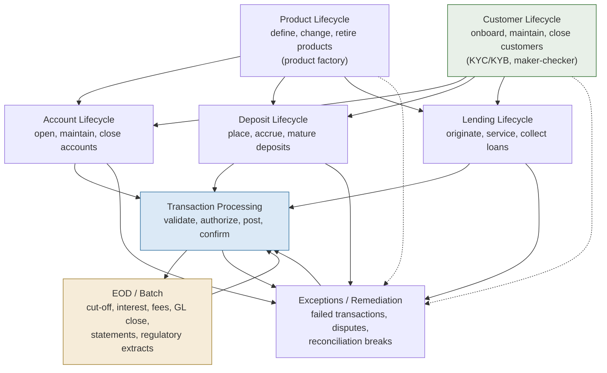
```mermaid
flowchart TD
    PL["Product Lifecycle<br/>define, change, retire products<br/>(product factory)"] --> OL["Account Lifecycle<br/>open, maintain, close accounts"]
    PL --> DL["Deposit Lifecycle<br/>place, accrue, mature deposits"]
    PL --> LL["Lending Lifecycle<br/>originate, service, collect loans"]
    CL["Customer Lifecycle<br/>onboard, maintain, close customers<br/>(KYC/KYB, maker-checker)"] --> OL
    CL --> DL
    CL --> LL
    OL --> TP["Transaction Processing<br/>validate, authorize, post, confirm"]
    DL --> TP
    LL --> TP
    TP --> EOD["EOD / Batch<br/>cut-off, interest, fees, GL close,<br/>statements, regulatory extracts"]
    EOD --> TP
    OL --> EX["Exceptions / Remediation<br/>failed transactions, disputes,<br/>reconciliation breaks"]
    DL --> EX
    LL --> EX
    TP --> EX
    EX --> TP
    PL -.-> EX
    CL -.-> EX
    style CL fill:#e8f0e8,stroke:#2f6f2f
    style TP fill:#dbe9f6,stroke:#2f6f9f
    style EOD fill:#f6ecd9,stroke:#9f7f2f
```

The dependency direction is the architectural truth of every core: **products parameterize contracts, contracts generate transactions, transactions close into the day, and the day reconciles back to the contracts.** EOD is the heartbeat — in traditional cores the entire accounting truth of a day is produced there (Section 7); in event-driven cores the same steps shrink but do not disappear (Section 10.2).

### 1.2 The Core's Role: System of Record

The core is the **system of record** for customers, accounts, transactions, and products — the authoritative source that every other system consumes (see [core_banking_systems_guide.md](core_banking_systems_guide.md) §2.2). Its position in the process landscape:

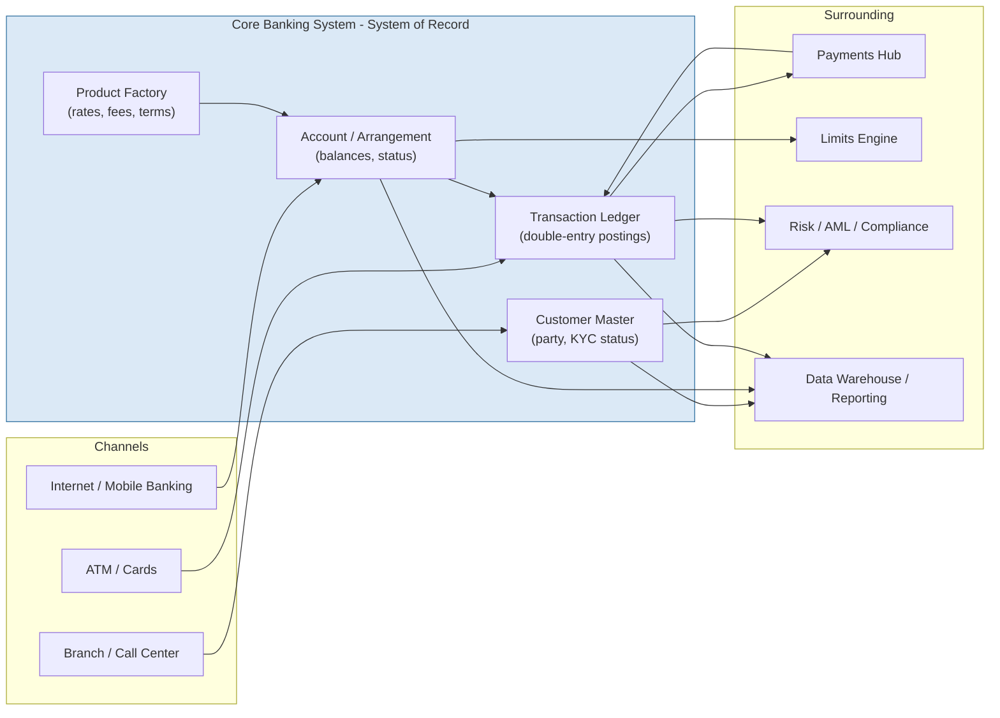
```mermaid
flowchart LR
    subgraph Channels
        IB["Internet / Mobile Banking"]
        ATM["ATM / Cards"]
        BR["Branch / Call Center"]
    end
    subgraph Core["Core Banking System - System of Record"]
        CUST["Customer Master<br/>(party, KYC status)"]
        ACCT["Account / Arrangement<br/>(balances, status)"]
        TXN["Transaction Ledger<br/>(double-entry postings)"]
        PROD["Product Factory<br/>(rates, fees, terms)"]
    end
    subgraph Surrounding
        PAY["Payments Hub"]
        LIM["Limits Engine"]
        RISK["Risk / AML / Compliance"]
        DWH["Data Warehouse / Reporting"]
    end
    IB --> ACCT
    ATM --> TXN
    BR --> CUST
    ACCT --> TXN
    PROD --> ACCT
    TXN --> PAY
    PAY --> TXN
    ACCT --> LIM
    CUST --> RISK
    TXN --> RISK
    CUST --> DWH
    ACCT --> DWH
    TXN --> DWH
    style Core fill:#dbe9f6,stroke:#2f6f9f
```

The core owns the money and the accounting truth: a channel displays what the core said, the payments hub asks the core to post, and a regulator's definitive answer comes from the core. That ownership is why the processes in this guide are so heavily controlled — every one of them runs under maker-checker discipline, double-entry accounting, and audit trails ([oracle_flexcube_data_model_guide.md](oracle_flexcube_data_model_guide.md) §5.4 shows the structural `MAKER_ID`/`CHECKER_ID`/`AUTH_STAT` fields that enforce it).

---

## 2. The Customer Lifecycle Process

The customer lifecycle is the on-boarding of a party (individual or legal entity) into the bank, its maintenance, and its eventual closure. In the data model this is the **party master** with relationships to accounts (see [data_models_banking_insurance_guide.md](data_models_banking_insurance_guide.md)); in Temenos the customer record and its arrangements ([temenos_data_model_guide.md](temenos_data_model_guide.md)), in FLEXCUBE the `STTM_CUSTOMER` master with its authorization fields ([oracle_flexcube_data_model_guide.md](oracle_flexcube_data_model_guide.md) §5.4). The wholesale/corporate front-to-back version of this process (CDD/EDD tiers, MAS Notice 626, static-data propagation) is in [end_to_end_banking_processes.md](end_to_end_banking_processes.md) §2 — here we focus on the core's role.

### 2.1 Customer Onboarding: The KYC/KYB Process

Onboarding converts an applicant into an **active customer record** in the core. For individuals this is KYC (Know Your Customer); for legal entities it is KYB (Know Your Business) — identity of the entity, its beneficial owners (UBOs), and its organizational structure. The steps: application → identity verification → KYC/AML checks → customer record creation → maker-checker approval → customer active. The AML screening (sanctions, PEP, adverse media) is executed by the compliance systems described in [financial_risk_compliance_systems_guide.md](financial_risk_compliance_systems_guide.md); the core's job is to hold the record, the KYC status, and the approval state, and to refuse to open accounts until the record is authorized.

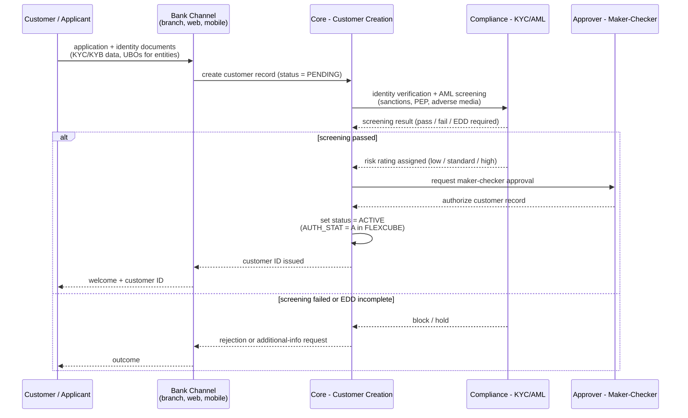
```mermaid
sequenceDiagram
    participant C as Customer / Applicant
    participant CH as Bank Channel<br/>(branch, web, mobile)
    participant CR as Core - Customer Creation
    participant KYC as Compliance - KYC/AML
    participant AP as Approver - Maker-Checker
    C->>CH: application + identity documents<br/>(KYC/KYB data, UBOs for entities)
    CH->>CR: create customer record (status = PENDING)
    CR->>KYC: identity verification + AML screening<br/>(sanctions, PEP, adverse media)
    KYC-->>CR: screening result (pass / fail / EDD required)
    alt screening passed
        KYC-->>CR: risk rating assigned (low / standard / high)
        CR->>AP: request maker-checker approval
        AP-->>CR: authorize customer record
        CR->>CR: set status = ACTIVE<br/>(AUTH_STAT = A in FLEXCUBE)
        CR-->>CH: customer ID issued
        CH-->>C: welcome + customer ID
    else screening failed or EDD incomplete
        KYC-->>CR: block / hold
        CR-->>CH: rejection or additional-info request
        CH-->>C: outcome
    end
```

The core treats an unauthorized customer record as a **draft**: until the checker authorizes it, downstream processes (account opening, product sales) must not see it — the same rule as FLEXCUBE's `AUTH_STAT = 'A'` filter ([oracle_flexcube_data_model_guide.md](oracle_flexcube_data_model_guide.md) §5.4). Failure states (rejected, duplicate, EDD pending) are first-class statuses, not ad-hoc flags.

### 2.2 Customer Maintenance: The Amendment Flow

Changes to customer data — address, name (marriage/corporate rename), signatories, contact details, UBO changes — follow a controlled **amendment flow** with maker-checker authorization, because customer data feeds every downstream system and any material change may trigger re-screening. Material changes (e.g. a new UBO or a name change) typically re-trigger KYC; the core emits a change event so compliance and downstream systems react (Section 10.2).

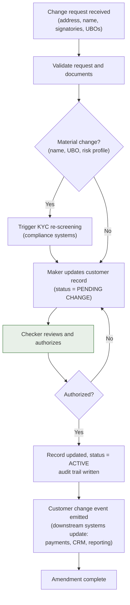
```mermaid
flowchart TD
    A["Change request received<br/>(address, name, signatories, UBOs)"] --> B["Validate request and documents"]
    B --> C{"Material change?<br/>(name, UBO, risk profile)"}
    C -->|"Yes"| D["Trigger KYC re-screening<br/>(compliance systems)"]
    D --> E["Maker updates customer record<br/>(status = PENDING CHANGE)"]
    C -->|"No"| E
    E --> F["Checker reviews and authorizes"]
    F --> G{"Authorized?"}
    G -->|"No"| E
    G -->|"Yes"| H["Record updated, status = ACTIVE<br/>audit trail written"]
    H --> I["Customer change event emitted<br/>(downstream systems update:<br/>payments, CRM, reporting)"]
    I --> J["Amendment complete"]
    style F fill:#e8f0e8,stroke:#2f6f2f
```

### 2.3 Customer Closure

Closing a customer is only possible once the customer's footprint in the core is empty: **no balances, no active products**. The closure process therefore runs account-closure pre-checks across every arrangement the customer holds (Section 3.3), then closes the party record — which is retained, not deleted, for regulatory and audit purposes.

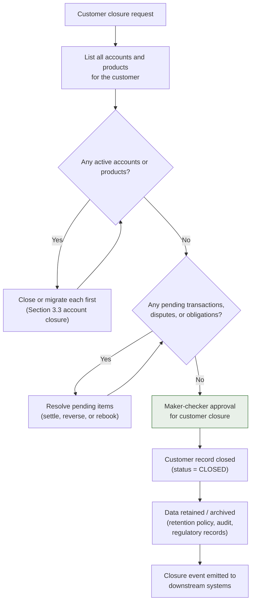
```mermaid
flowchart TD
    A["Customer closure request"] --> B["List all accounts and products<br/>for the customer"]
    B --> C{"Any active accounts or products?"}
    C -->|"Yes"| D["Close or migrate each first<br/>(Section 3.3 account closure)"]
    D --> C
    C -->|"No"| E{"Any pending transactions,<br/>disputes, or obligations?"}
    E -->|"Yes"| F["Resolve pending items<br/>(settle, reverse, or rebook)"]
    F --> E
    E -->|"No"| G["Maker-checker approval<br/>for customer closure"]
    G --> H["Customer record closed<br/>(status = CLOSED)"]
    H --> I["Data retained / archived<br/>(retention policy, audit,<br/>regulatory records)"]
    I --> J["Closure event emitted to<br/>downstream systems"]
    style G fill:#e8f0e8,stroke:#2f6f2f
```

### 2.4 The Customer 360

The **customer 360** is not a stored object — it is the assembled view across every record the core holds for the party: personal/legal data, KYC status, all accounts (deposits, loans, cards), balances, limits, and activity. It is the read model the channels, CRM, and the data warehouse build from the core's masters ([data_models_banking_insurance_guide.md](data_models_banking_insurance_guide.md)); the core provides it as the authoritative join of party → relationship → arrangement.

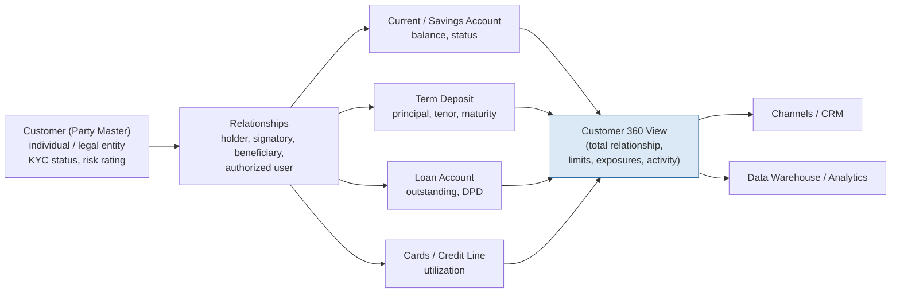
```mermaid
flowchart LR
    P["Customer (Party Master)<br/>individual / legal entity<br/>KYC status, risk rating"] --> R["Relationships<br/>holder, signatory, beneficiary,<br/>authorized user"]
    R --> A1["Current / Savings Account<br/>balance, status"]
    R --> A2["Term Deposit<br/>principal, tenor, maturity"]
    R --> A3["Loan Account<br/>outstanding, DPD"]
    R --> A4["Cards / Credit Line<br/>utilization"]
    A1 --> V["Customer 360 View<br/>(total relationship,<br/>limits, exposures, activity)"]
    A2 --> V
    A3 --> V
    A4 --> V
    V --> CH["Channels / CRM"]
    V --> DWH["Data Warehouse / Analytics"]
    style V fill:#dbe9f6,stroke:#2f6f9f
```

---

## 3. The Account Lifecycle Process

The account lifecycle covers the demand-deposit and current accounts that are the workhorses of a core: opening, status maintenance (dormant/frozen), services, and closure. In Temenos the account is an **ARRANGEMENT** under a product (see [temenos_data_model_guide.md](temenos_data_model_guide.md)); in FLEXCUBE it is an account master whose entries flow through the daily log ([oracle_flexcube_data_model_guide.md](oracle_flexcube_data_model_guide.md) §5). The ISO 20022 side of account management (acmt messages) is covered in [iso_20022_core_processes_guide.md](iso_20022_core_processes_guide.md) §16.

### 3.1 Account Opening

Opening an account instantiates a product into a concrete **account/arrangement** for a customer: application → product selection → customer verification → account creation → account number assignment → initial deposit (optional) → active.

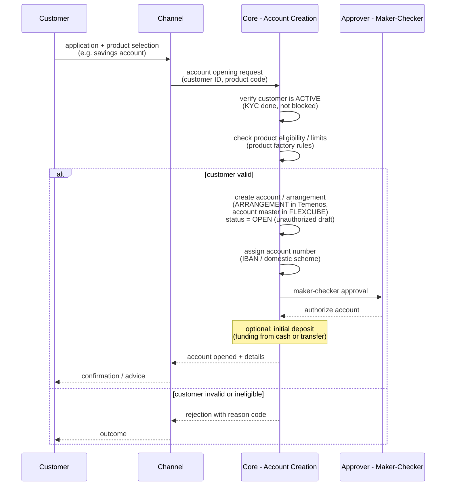
```mermaid
sequenceDiagram
    participant C as Customer
    participant CH as Channel
    participant CR as Core - Account Creation
    participant AP as Approver - Maker-Checker
    C->>CH: application + product selection<br/>(e.g. savings account)
    CH->>CR: account opening request<br/>(customer ID, product code)
    CR->>CR: verify customer is ACTIVE<br/>(KYC done, not blocked)
    CR->>CR: check product eligibility / limits<br/>(product factory rules)
    alt customer valid
        CR->>CR: create account / arrangement<br/>(ARRANGEMENT in Temenos,<br/>account master in FLEXCUBE)<br/>status = OPEN (unauthorized draft)
        CR->>CR: assign account number<br/>(IBAN / domestic scheme)
        CR->>AP: maker-checker approval
        AP-->>CR: authorize account
        Note over CR: optional: initial deposit<br/>(funding from cash or transfer)
        CR-->>CH: account opened + details
        CH-->>C: confirmation / advice
    else customer invalid or ineligible
        CR-->>CH: rejection with reason code
        CH-->>C: outcome
    end
```

Account-number assignment is a core-internal process with real constraints: uniqueness, checksum validity (e.g. IBAN mod-97), length/branch encoding, and **number reuse rules** (numbers of closed accounts are typically not reissued for years). The account's status begins OPEN; dormancy and freezing are separate statuses (3.2).

### 3.2 Account Status: The State Machine

Account status is the core's control surface for what an account may and may not do. The canonical states and transitions:

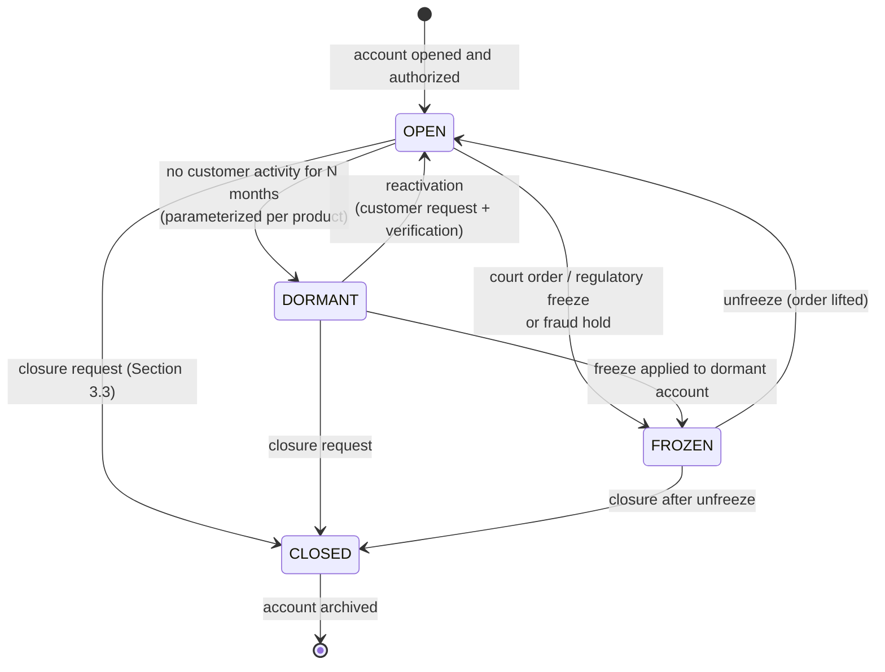
```mermaid
stateDiagram-v2
    [*] --> OPEN: account opened and authorized
    OPEN --> DORMANT: no customer activity for N months<br/>(parameterized per product)
    OPEN --> FROZEN: court order / regulatory freeze<br/>or fraud hold
    DORMANT --> OPEN: reactivation<br/>(customer request + verification)
    DORMANT --> FROZEN: freeze applied to dormant account
    FROZEN --> OPEN: unfreeze (order lifted)
    OPEN --> CLOSED: closure request (Section 3.3)
    DORMANT --> CLOSED: closure request
    FROZEN --> CLOSED: closure after unfreeze
    CLOSED --> [*]: account archived
```

- **Dormant** — no customer-initiated activity for a product-defined period (often 12 months). Dormant accounts block most debits (and often credits except interest), and after a statutory period may be subject to **escheatment** (unclaimed-balance transfer to the state).
- **Frozen** — imposed by court order, regulator, compliance hold, or fraud investigation. A freeze blocks both debits and credits (or is a **partial freeze** — e.g. block debits only, or freeze above a threshold amount).
- **Closed** — terminal; no postings except reversals/returns of pre-closure items, which is why closure requires the pending-transaction checks in 3.3.

### 3.3 Account Closure

Closure is a decision process, not a single switch: the core must verify the account can be closed without orphaned money or pending items, then authorize the closure.

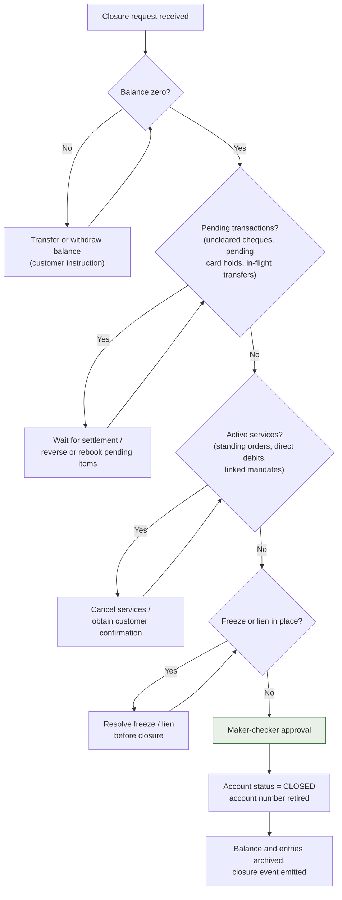
```mermaid
flowchart TD
    A["Closure request received"] --> B{"Balance zero?"}
    B -->|"No"| C["Transfer or withdraw balance<br/>(customer instruction)"]
    C --> B
    B -->|"Yes"| D{"Pending transactions?<br/>(uncleared cheques, pending<br/>card holds, in-flight transfers)"}
    D -->|"Yes"| E["Wait for settlement /<br/>reverse or rebook pending items"]
    E --> D
    D -->|"No"| F{"Active services?<br/>(standing orders, direct debits,<br/>linked mandates)"}
    F -->|"Yes"| G["Cancel services /<br/>obtain customer confirmation"]
    G --> F
    F -->|"No"| H{"Freeze or lien in place?"}
    H -->|"Yes"| I["Resolve freeze / lien<br/>before closure"]
    I --> H
    H -->|"No"| J["Maker-checker approval"]
    J --> K["Account status = CLOSED<br/>account number retired"]
    K --> L["Balance and entries archived,<br/>closure event emitted"]
    style J fill:#e8f0e8,stroke:#2f6f2f
```

### 3.4 Account Services: Standing Orders, Direct Debits, Alerts

Accounts carry standing instructions that the core executes on schedule. The **standing order** process — setup → scheduled execution → payment — is the canonical scheduled-payment flow (the direct debit is its mirror image: the *creditor* initiates, the core debits under a pre-registered mandate). Alerts are event-driven notifications on account activity.

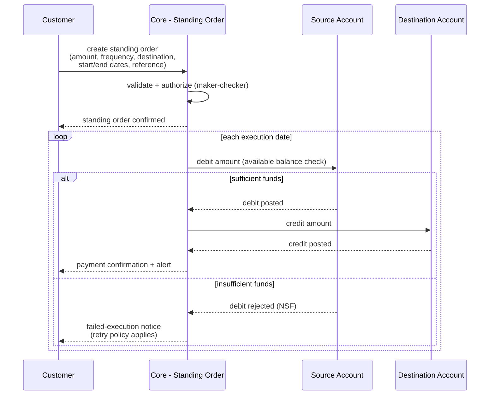
```mermaid
sequenceDiagram
    participant C as Customer
    participant CR as Core - Standing Order
    participant SRC as Source Account
    participant DST as Destination Account
    C->>CR: create standing order<br/>(amount, frequency, destination,<br/>start/end dates, reference)
    CR->>CR: validate + authorize (maker-checker)
    CR-->>C: standing order confirmed
    loop each execution date
        CR->>SRC: debit amount (available balance check)
        alt sufficient funds
            SRC-->>CR: debit posted
            CR->>DST: credit amount
            DST-->>CR: credit posted
            CR-->>C: payment confirmation + alert
        else insufficient funds
            SRC-->>CR: debit rejected (NSF)
            CR-->>C: failed-execution notice<br/>(retry policy applies)
        end
    end
```

Standing orders run as part of the batch schedule (Section 7.2) or, in real-time cores, as scheduled jobs. Direct debits additionally require **mandate management** (the debtor's pre-authorization — the ISO 20022 pain.009–012 flows in [iso_20022_core_processes_guide.md](iso_20022_core_processes_guide.md) §15). Account alerts (balance thresholds, large transactions, failed debits) are event consumers — see the event-driven pattern in Section 10.2.

---

## 4. The Deposit Lifecycle Process

The deposit lifecycle covers **term deposits** (fixed deposits): placement, interest accrual, maturity, and early break. Demand deposits (current/savings) live on the account lifecycle of Section 3 plus the interest accrual of 4.3.

### 4.1 Term Deposit Placement

Placement creates a fixed-term contract funded from a source account: customer selects tenor/amount → rate determination (rate table) → deposit contract creation → funding (debit the source account) → deposit active.

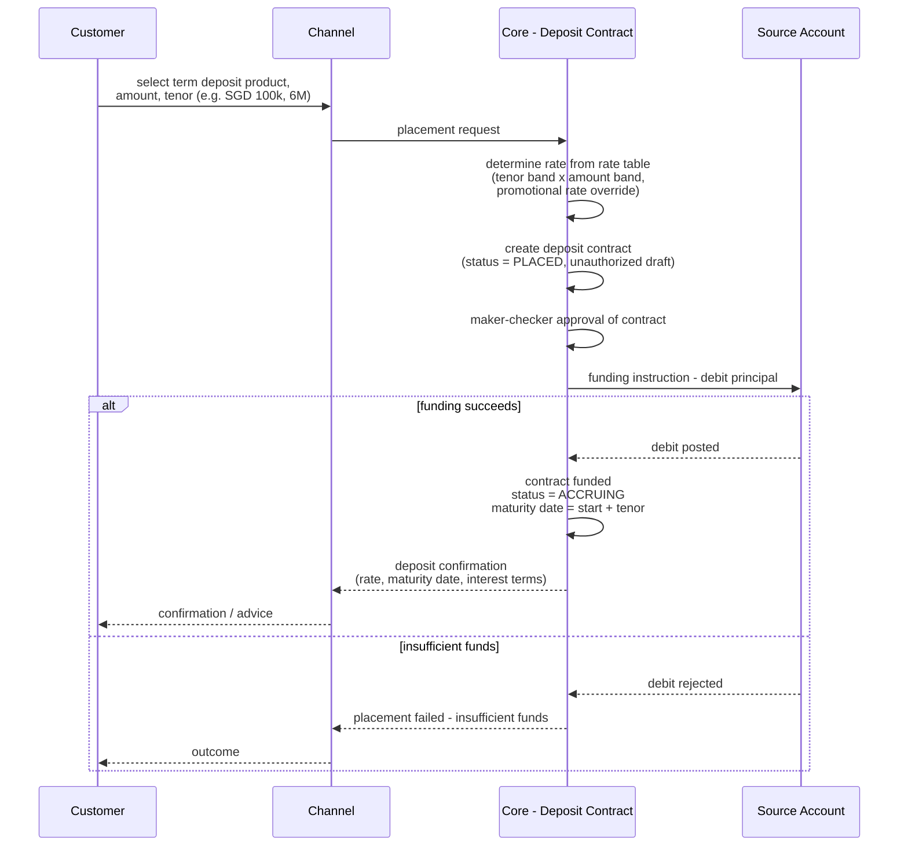
```mermaid
sequenceDiagram
    participant C as Customer
    participant CH as Channel
    participant CR as Core - Deposit Contract
    participant SRC as Source Account
    C->>CH: select term deposit product,<br/>amount, tenor (e.g. SGD 100k, 6M)
    CH->>CR: placement request
    CR->>CR: determine rate from rate table<br/>(tenor band x amount band,<br/>promotional rate override)
    CR->>CR: create deposit contract<br/>(status = PLACED, unauthorized draft)
    CR->>CR: maker-checker approval of contract
    CR->>SRC: funding instruction - debit principal
    alt funding succeeds
        SRC-->>CR: debit posted
        CR->>CR: contract funded<br/>status = ACCRUING<br/>maturity date = start + tenor
        CR-->>CH: deposit confirmation<br/>(rate, maturity date, interest terms)
        CH-->>C: confirmation / advice
    else insufficient funds
        SRC-->>CR: debit rejected
        CR-->>CH: placement failed - insufficient funds
        CH-->>C: outcome
    end
```

The **rate table** (rate grid) is a product-factory artifact ([core_banking_systems_guide.md](core_banking_systems_guide.md) §7.4): rates are typically tiered by tenor and amount band, with effective-dated rows so historical rates remain auditable ([oracle_flexcube_data_model_guide.md](oracle_flexcube_data_model_guide.md) §6.3).

### 4.2 The Maturity Process

At maturity the deposit contract must choose how principal and interest are disposed. Maturity options: **renew** (principal + interest roll into a new deposit, same or new tenor), **rollover** (principal renews, interest pays out), **payout** (principal + interest to the nominated account), or **partial** (part pays out, part renews). Instruction capture is typically required at placement or via a maturity instruction before the maturity date.

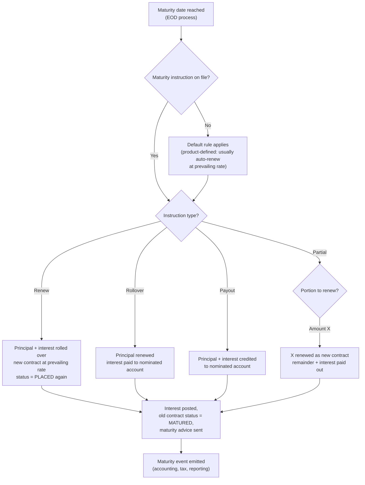
```mermaid
flowchart TD
    A["Maturity date reached<br/>(EOD process)"] --> B{"Maturity instruction on file?"}
    B -->|"No"| C["Default rule applies<br/>(product-defined: usually auto-renew<br/>at prevailing rate)"]
    B -->|"Yes"| D{"Instruction type?"}
    C --> D
    D -->|"Renew"| E["Principal + interest rolled over<br/>new contract at prevailing rate<br/>status = PLACED again"]
    D -->|"Rollover"| F["Principal renewed<br/>interest paid to nominated account"]
    D -->|"Payout"| G["Principal + interest credited<br/>to nominated account"]
    D -->|"Partial"| H{"Portion to renew?"}
    H -->|"Amount X"| I["X renewed as new contract<br/>remainder + interest paid out"]
    E --> J["Interest posted,<br/>old contract status = MATURED,<br/>maturity advice sent"]
    F --> J
    G --> J
    I --> J
    J --> K["Maturity event emitted<br/>(accounting, tax, reporting)"]
```

Maturity processing runs inside EOD on the maturity date (Section 7.1); a deposit whose maturity falls on a non-business day rolls to the next business day per product convention (next-business-day or same-day-value adjustments).

### 4.3 The Interest Accrual Process

Interest on deposits is **accrued daily** and **posted periodically** (monthly/quarterly or at maturity for term deposits). Accrual records the economic cost of the deposit day by day; posting (capitalization) moves the accrued amount into the account and the GL.

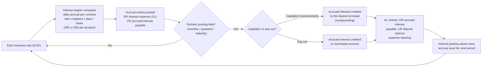
```mermaid
flowchart LR
    A["Each business day (EOD)"] --> B["Interest engine computes<br/>daily accrual per contract<br/>rate x balance x days / basis<br/>(365 or 360 per product)"]
    B --> C["Accrual entries posted<br/>DR interest expense (GL)<br/>CR accrued interest payable"]
    C --> D{"Periodic posting date?<br/>(monthly / quarterly / maturity)"}
    D -->|"No"| A
    D -->|"Yes"| E{"Capitalize or pay out?"}
    E -->|"Capitalize (reinvestment)"| F["Accrued interest credited<br/>to the deposit principal<br/>(compounding)"]
    E -->|"Pay out"| G["Accrued interest credited<br/>to nominated account"]
    F --> H["GL entries: DR accrued interest<br/>payable, CR deposit interest<br/>expense clearing"]
    G --> H
    H --> I["Interest posting advice sent,<br/>accrual reset for next period"]
    I --> A
```

Accrual basis (Actual/365 vs Actual/360), capitalization frequency, and rounding rules are product parameters — the interest-engine patterns behind this are in [core_banking_systems_guide.md](core_banking_systems_guide.md) §7.5.

### 4.4 The Deposit Lifecycle: State Machine

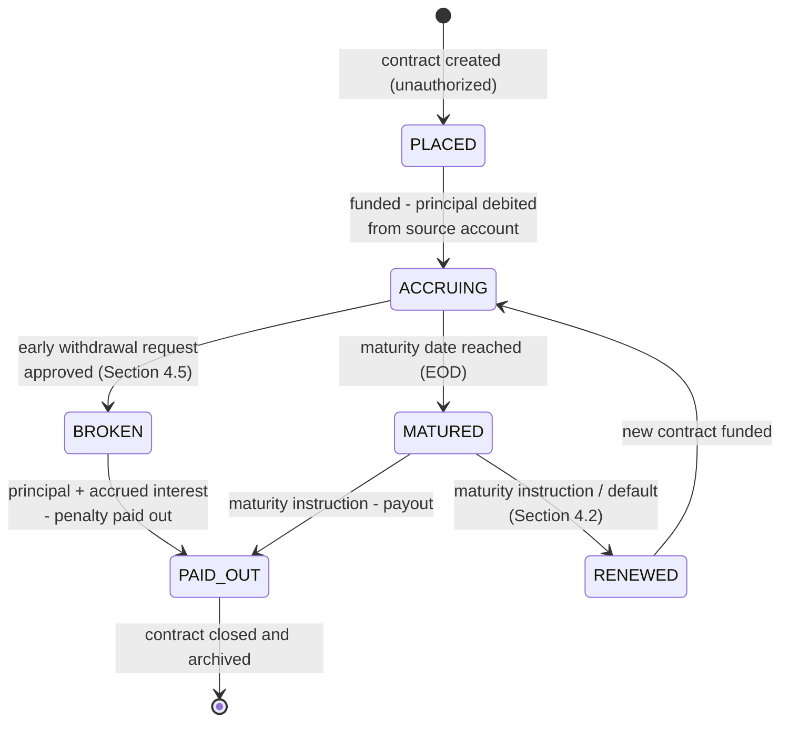
```mermaid
stateDiagram-v2
    [*] --> PLACED: contract created (unauthorized)
    PLACED --> ACCRUING: funded - principal debited<br/>from source account
    ACCRUING --> MATURED: maturity date reached (EOD)
    ACCRUING --> BROKEN: early withdrawal request<br/>approved (Section 4.5)
    BROKEN --> PAID_OUT: principal + accrued interest<br/>- penalty paid out
    MATURED --> RENEWED: maturity instruction / default<br/>(Section 4.2)
    MATURED --> PAID_OUT: maturity instruction - payout
    RENEWED --> ACCRUING: new contract funded
    PAID_OUT --> [*]: contract closed and archived
```

### 4.5 The Broken Deposit (Early Withdrawal)

Breaking a deposit before maturity forfeits the agreed rate economics: the core recalculates interest at a penalized rate (or charges a penalty fee) and pays out principal + adjusted interest.

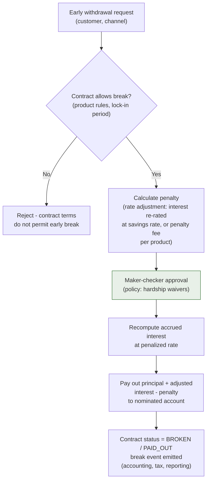
```mermaid
flowchart TD
    A["Early withdrawal request<br/>(customer, channel)"] --> B{"Contract allows break?<br/>(product rules, lock-in period)"}
    B -->|"No"| C["Reject - contract terms<br/>do not permit early break"]
    B -->|"Yes"| D["Calculate penalty<br/>(rate adjustment: interest re-rated<br/>at savings rate, or penalty fee<br/>per product)"]
    D --> E["Maker-checker approval<br/>(policy: hardship waivers)"]
    E --> F["Recompute accrued interest<br/>at penalized rate"]
    F --> G["Pay out principal + adjusted<br/>interest - penalty<br/>to nominated account"]
    G --> H["Contract status = BROKEN / PAID_OUT<br/>break event emitted<br/>(accounting, tax, reporting)"]
    style E fill:#e8f0e8,stroke:#2f6f2f
```

---

## 5. The Lending Lifecycle Process

The lending lifecycle covers the loan book: origination (application → assessment → approval → contract → disbursement), servicing (the repayment cycle), delinquency (overdue handling and provisioning), and closure (release of collateral). Limit-check integration is covered in [banking_limits_domain_guide.md](banking_limits_domain_guide.md); the credit-risk systems that compute scoring and ECL live in [financial_risk_compliance_systems_guide.md](financial_risk_compliance_systems_guide.md).

### 5.1 Loan Origination

Origination is the highest-friction lending process: it converts an application into a disbursed, active loan.

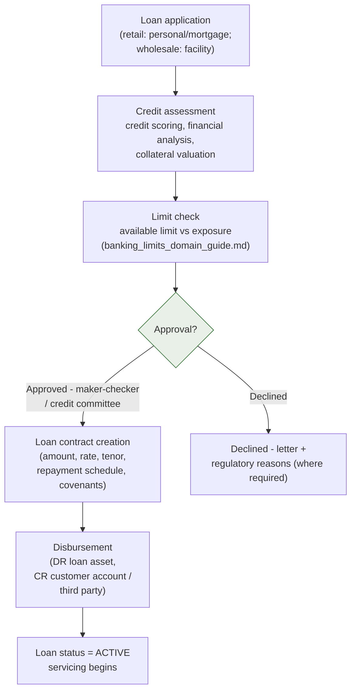
```mermaid
flowchart TD
    A["Loan application<br/>(retail: personal/mortgage;<br/>wholesale: facility)"]
    B["Credit assessment<br/>credit scoring, financial analysis,<br/>collateral valuation"]
    C{"Approval?"}
    D["Loan contract creation<br/>(amount, rate, tenor,<br/>repayment schedule, covenants)"]
    E["Disbursement<br/>(DR loan asset,<br/>CR customer account /<br/>third party)"]
    F["Loan status = ACTIVE<br/>servicing begins"]
    G["Declined - letter +<br/>regulatory reasons (where required)"]
    H["Limit check<br/>available limit vs exposure<br/>(banking_limits_domain_guide.md)"]
    A --> B
    B --> H
    H --> C
    C -->|"Approved - maker-checker<br/>/ credit committee"| D
    C -->|"Declined"| G
    D --> E
    E --> F
    style C fill:#e8f0e8,stroke:#2f6f2f
```

The approval authority scales with exposure: retail loans approve on scorecards and limits; corporate facilities route through credit committees or delegated authority matrices — an approval-chain workflow (Section 10.1). The **disbursement** posts the loan asset and funds the customer (or a third party for supplier/purchase payments); in wholesale this is the drawdown process of [end_to_end_banking_processes.md](end_to_end_banking_processes.md).

### 5.2 Loan Servicing: The Repayment Cycle

Once active, the loan generates a **repayment schedule** — installments of principal + interest on defined dates. Each cycle: scheduled repayment → repayment collection (debit the account) → posting (principal reduction, interest income) → statement.

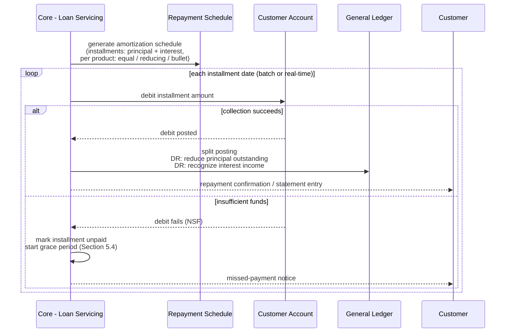
```mermaid
sequenceDiagram
    participant CR as Core - Loan Servicing
    participant SCH as Repayment Schedule
    participant AC as Customer Account
    participant GL as General Ledger
    participant C as Customer
    CR->>SCH: generate amortization schedule<br/>(installments: principal + interest,<br/>per product: equal / reducing / bullet)
    loop each installment date (batch or real-time)
        CR->>AC: debit installment amount
        alt collection succeeds
            AC-->>CR: debit posted
            CR->>GL: split posting<br/>DR: reduce principal outstanding<br/>DR: recognize interest income
            CR-->>C: repayment confirmation / statement entry
        else insufficient funds
            AC-->>CR: debit fails (NSF)
            CR->>CR: mark installment unpaid<br/>start grace period (Section 5.4)
            CR-->>C: missed-payment notice
        end
    end
```

Repayment allocation order matters: fees → interest → principal (or a product-defined order). Prepayment (full or partial) recalculates the schedule or applies a prepayment penalty per product rules.

### 5.3 Loan States

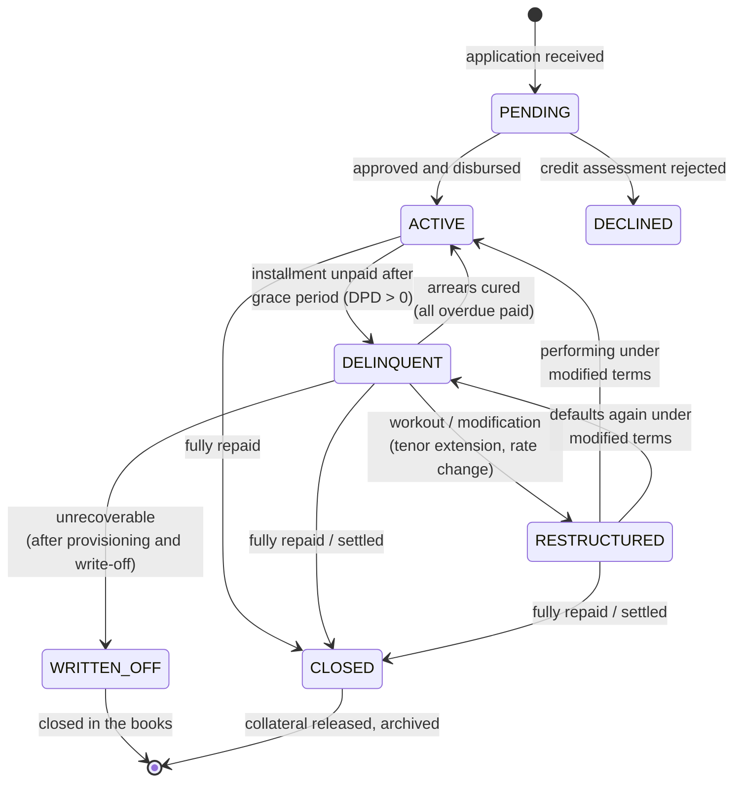
```mermaid
stateDiagram-v2
    [*] --> PENDING: application received
    PENDING --> ACTIVE: approved and disbursed
    PENDING --> DECLINED: credit assessment rejected
    ACTIVE --> DELINQUENT: installment unpaid after<br/>grace period (DPD > 0)
    DELINQUENT --> ACTIVE: arrears cured<br/>(all overdue paid)
    DELINQUENT --> RESTRUCTURED: workout / modification<br/>(tenor extension, rate change)
    RESTRUCTURED --> ACTIVE: performing under<br/>modified terms
    RESTRUCTURED --> DELINQUENT: defaults again under<br/>modified terms
    ACTIVE --> CLOSED: fully repaid
    DELINQUENT --> CLOSED: fully repaid / settled
    RESTRUCTURED --> CLOSED: fully repaid / settled
    DELINQUENT --> WRITTEN_OFF: unrecoverable<br/>(after provisioning and write-off)
    WRITTEN_OFF --> [*]: closed in the books
    CLOSED --> [*]: collateral released, archived
```

### 5.4 The Delinquency Process

Delinquency handling is the loan book's most regulated operational process: missed payment → grace period → classification by **days past due (DPD)** bands → provisioning (expected credit loss under IFRS 9) → collections action. The DPD ladder:

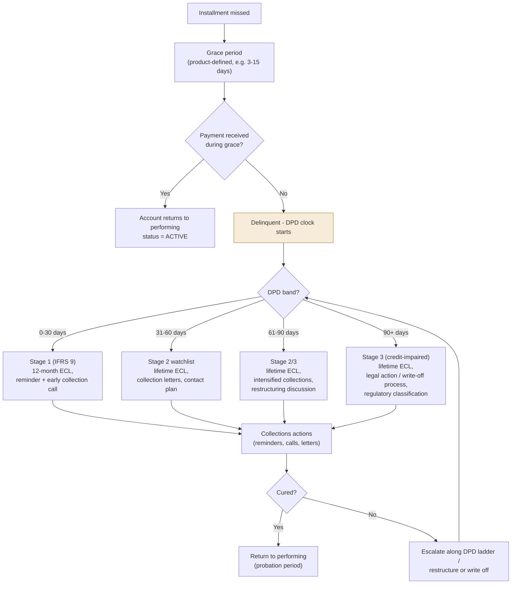
```mermaid
flowchart TD
    A["Installment missed"] --> B["Grace period<br/>(product-defined, e.g. 3-15 days)"]
    B --> C{"Payment received<br/>during grace?"}
    C -->|"Yes"| D["Account returns to performing<br/>status = ACTIVE"]
    C -->|"No"| E["Delinquent - DPD clock starts"]
    E --> F{"DPD band?"}
    F -->|"0-30 days"| G["Stage 1 (IFRS 9)<br/>12-month ECL,<br/>reminder + early collection call"]
    F -->|"31-60 days"| H["Stage 2 watchlist<br/>lifetime ECL,<br/>collection letters, contact plan"]
    F -->|"61-90 days"| I["Stage 2/3<br/>lifetime ECL,<br/>intensified collections,<br/>restructuring discussion"]
    F -->|"90+ days"| J["Stage 3 (credit-impaired)<br/>lifetime ECL,<br/>legal action / write-off process,<br/>regulatory classification"]
    G --> K["Collections actions<br/>(reminders, calls, letters)"]
    H --> K
    I --> K
    J --> K
    K --> L{"Cured?"}
    L -->|"Yes"| M["Return to performing<br/>(probation period)"]
    L -->|"No"| N["Escalate along DPD ladder /<br/>restructure or write off"]
    N --> F
    style E fill:#f6ecd9,stroke:#9f7f2f
```

**Provisioning** computes the expected credit loss per IFRS 9 (Stage 1: 12-month ECL; Stage 2: lifetime ECL on significant-increase-in-credit-risk; Stage 3: lifetime ECL on credit-impaired assets). The core's role is to maintain the DPD classification, feed the ECL engine (Section 10.3), and book the provision entries (DR provision expense, CR allowance) through the GL.

### 5.5 Loan Closure

Closure releases the loan: final payment → verify zero outstanding → release collateral/guarantees → close.

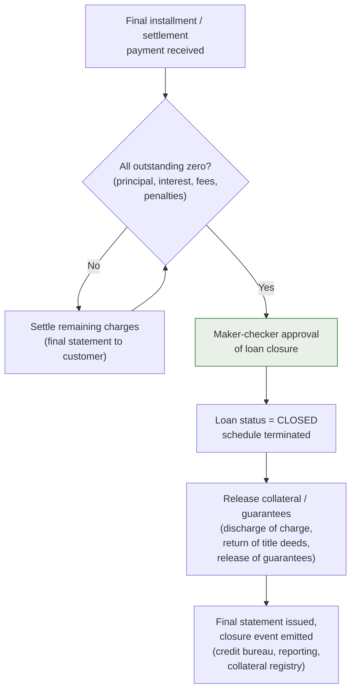
```mermaid
flowchart TD
    A["Final installment / settlement<br/>payment received"] --> B{"All outstanding zero?<br/>(principal, interest, fees,<br/>penalties)"}
    B -->|"No"| C["Settle remaining charges<br/>(final statement to customer)"]
    C --> B
    B -->|"Yes"| D["Maker-checker approval<br/>of loan closure"]
    D --> E["Loan status = CLOSED<br/>schedule terminated"]
    E --> F["Release collateral / guarantees<br/>(discharge of charge,<br/>return of title deeds,<br/>release of guarantees)"]
    F --> G["Final statement issued,<br/>closure event emitted<br/>(credit bureau, reporting,<br/>collateral registry)"]
    style D fill:#e8f0e8,stroke:#2f6f2f
```

---

## 6. The Transaction Processing Lifecycle

Transaction processing is the core's highest-volume process: every debit and credit, from an ATM cash withdrawal to a corporate wire, passes through the same lifecycle — initiation → validation → authorization → posting → confirmation. The ISO 20022 messaging side of this (pain/pacs/camt) is in [iso_20022_core_processes_guide.md](iso_20022_core_processes_guide.md); the posting mechanics (double-entry, value dating, reversals) are in [oracle_flexcube_data_model_guide.md](oracle_flexcube_data_model_guide.md) §5.4.

### 6.1 The Transaction Flow

```mermaid
sequenceDiagram
    participant CH as Channel<br/>(ATM, internet banking,<br/>branch, payment system)
    participant CR as Core - Transaction Manager
    participant GL as Ledger / Posting Engine
    CH->>CR: transaction request<br/>(type, amount, account(s), currency)
    CR->>CR: validate<br/>- account exists and status allows<br/>- available balance check<br/>- limit check (banking_limits_domain_guide.md)
    alt validation fails
        CR-->>CH: rejection with reason code<br/>(e.g. AC01 invalid account,<br/>AM04 insufficient funds)
    else validation passes
        CR->>CR: authorize - place hold / block<br/>on available balance
        CR->>GL: post double-entry entries<br/>(DR/CR with booking date<br/>and value date)
        GL-->>CR: posting confirmed
        CR->>CR: release hold, update balance
        CR-->>CH: confirmation / receipt / advice
    end
```

The **available balance** (ledger balance minus holds, uncleared items, and reserved amounts) is the amount that can actually be spent — it is what authorization checks, not the ledger balance. Holds are time-limited (card authorizations, cheque holds) and expire or convert per product rules.

### 6.2 Transaction Types

Each transaction type is a specialization of the same lifecycle, distinguished by its entry pattern and clearing:

```mermaid
flowchart TD
    A["Transaction initiated"] --> B{"Transaction type?"}
    B -->|"Cash deposit"| C["CR customer account<br/>DR cash / GL clearing<br/>instant local posting"]
    B -->|"Cash withdrawal"| D["DR customer account<br/>CR cash / GL clearing<br/>instant local posting"]
    B -->|"Transfer (on-us)"| E["DR payer account<br/>CR payee account<br/>Section 6.3"]
    B -->|"Bill payment"| F["DR customer account<br/>CR biller account / clearing<br/>+ fees; may be batched<br/>to biller via ACH"]
    B -->|"Card transaction"| G["Auth: hold on available balance<br/>Clearing: hold converts to debit<br/>Settlement: DR card account,<br/>CR card scheme clearing"]
    B -->|"External payment"| H["DR customer account<br/>hand-off to payments hub<br/>(Section 6.3, iso_20022_core_processes_guide.md)"]
    C --> I["Confirmation to channel +<br/>event emitted"]
    D --> I
    E --> I
    F --> I
    G --> I
    H --> I
```

Cash transactions hit the **cash/GL clearing** (teller cash is a GL account the core reconciles per branch); card transactions run the three-phase authorize/clearing/settlement cycle where the core's authorization hold bridges the gap until the scheme's clearing file arrives.

### 6.3 The Funds Transfer Process

Transfers split on where the payee's account lives: **on-us** (both accounts at the same bank — the core completes it internally) vs **external** (via a payment system — the payments hub and ISO 20022 rails of [payments_hub_guide.md](payments_hub_guide.md) and [iso_20022_core_processes_guide.md](iso_20022_core_processes_guide.md)).

```mermaid
flowchart LR
    A["Transfer instruction<br/>(payer account, payee, amount)"] --> B["Validate + authorize<br/>(balance, limits, sanctions)"]
    B --> C{"Payee account on-us?"}
    C -->|"Yes"| D["Internal transfer<br/>DR payer account<br/>CR payee account<br/>same ledger, instant"]
    C -->|"No"| E["External transfer<br/>DR payer account<br/>hand-off to payments hub<br/>(pacs.008 / rails)"]
    D --> F["Confirmation to both parties"]
    E --> F
    F --> G["Transfer event emitted<br/>(reconciliation, reporting)"]
    style D fill:#dbe9f6,stroke:#2f6f9f
```

On-us transfers settle immediately in the core's own ledger; external transfers post the customer-side debit at initiation (or at cut-off, per product) and follow the payment lifecycle through clearing and settlement — with the debit subject to reversal/return if the payment fails downstream.

### 6.4 Transaction States

```mermaid
stateDiagram-v2
    [*] --> INITIATED: request received from channel
    INITIATED --> VALIDATED: passed validation checks
    INITIATED --> REJECTED: validation failed<br/>(bad account, bad amount, blocked)
    VALIDATED --> AUTHORIZED: balance/limit checks pass,<br/>hold placed
    VALIDATED --> REJECTED: insufficient funds /<br/>limit exceeded / compliance block
    AUTHORIZED --> POSTED: double-entry entries booked
    AUTHORIZED --> REJECTED: authorization fails<br/>(e.g. hold could not be placed)
    POSTED --> CONFIRMED: confirmation/advice sent
    POSTED --> REVERSED: reversal posted (Section 6.5)
    CONFIRMED --> REVERSED: reversal after confirmation<br/>(error correction / return)
    REJECTED --> [*]: terminal - re-initiation = new transaction
    REVERSED --> [*]: original and reversal both on record
```

REJECTED is terminal because a corrected transaction is a **new** transaction (new reference); REVERSED preserves the original entries for audit rather than deleting them — errors are never deleted, they are reversed (Section 6.5 and [oracle_flexcube_data_model_guide.md](oracle_flexcube_data_model_guide.md) §5.4).

### 6.5 The Reversal Process

A reversal cancels the *effect* of a posted transaction while preserving its record: original transaction reference → reversal entries (opposite debit/credit) → reconciliation.

```mermaid
flowchart TD
    A["Reversal request<br/>(error detected, customer dispute,<br/>return of failed payment)"] --> B["Locate original transaction<br/>(original reference / UETR)"]
    B --> C{"Original posted and<br/>reversible?"}
    C -->|"No"| D["Reject reversal -<br/>original not found or<br/>already reversed"]
    C -->|"Yes"| E["Check reversal window<br/>(same-day vs value-date<br/>rules per product/regulator)"]
    E --> F["Create reversal entries<br/>opposite DR/CR to original,<br/>referencing original entry ID"]
    F --> G["Maker-checker approval<br/>(for high-value / GL reversals)"]
    G --> H["Post reversal,<br/>update balances and holds"]
    H --> I["Reconcile original + reversal<br/>in GL (net zero effect)<br/>advice to customer"]
    style G fill:#e8f0e8,stroke:#2f6f2f
```

Reversals differ from **returns** (a downstream bank returns a settled payment — pacs.004 in [iso_20022_core_processes_guide.md](iso_20022_core_processes_guide.md) §11): a reversal is the core correcting its own posting, while a return is the receiving side sending money back.

---

## 7. The EOD/Batch Process

End-of-day (EOD) is the process that closes the business day in the core: everything transacted during the day is rolled into history, accruals and fees post, the GL closes, and outputs are generated. It is the heartbeat of traditional cores ([core_banking_systems_guide.md](core_banking_systems_guide.md) §7.2; the FLEXCUBE data-flow version in [oracle_flexcube_data_model_guide.md](oracle_flexcube_data_model_guide.md) §5.5).

### 7.1 The End-of-Day Cycle

```mermaid
flowchart TD
    A["Cut-off<br/>branch stops same-value-date<br/>transactions; late entries book<br/>to next value date"] --> B["Entry rollover<br/>daily log moved to history;<br/>back-value (ghost) entries merged"]
    B --> C["Interest accruals + postings<br/>(deposits, loans, accounts)"]
    C --> D["Fee postings<br/>(account fees, service charges)"]
    D --> E["FX revaluation<br/>multi-currency positions revalued<br/>at day's rates"]
    E --> F["GL close<br/>entries aggregated to trial balance;<br/>sub-ledger vs GL reconciliation"]
    F --> G{"Day-end verification passed?<br/>(GL balanced, breaks resolved)"}
    G -->|"No"| H["Hold day close<br/>investigate breaks,<br/>correct entries, re-run step"]
    H --> F
    G -->|"Yes"| I["Statement generation<br/>(camt.053 and paper/PDF)"]
    I --> J["Regulatory extracts<br/>(returns, reporting feeds,<br/>central bank submissions)"]
    J --> K["Day closed -<br/>business date advances"]
    style G fill:#f6ecd9,stroke:#9f7f2f
```

EOD is a **dependency-ordered pipeline**: each step consumes the output of the previous one, and the day-end close verification (GL balanced to the penny, sub-ledgers reconciled to the GL, no unprocessed entries) gates the whole close. Failure at any step holds the day (Section 7.3). In 24/7 event-driven cores the *close* shrinks — data is available in real time — but cut-off, period-close, and reporting still exist ([oracle_flexcube_data_model_guide.md](oracle_flexcube_data_model_guide.md) §5.5; Section 10.2).

### 7.2 The Batch Schedule

Beyond EOD proper, the core runs a calendar of batch jobs at different cadences:

```mermaid
flowchart LR
    subgraph Daily["Nightly (EOD)"]
        N1["Interest accruals"]
        N2["Fee postings"]
        N3["Standing orders /<br/>direct debits"]
        N4["Statements"]
        N5["AML / sanctions<br/>re-screening"]
    end
    subgraph Monthly["Monthly (EOM)"]
        M1["Accrual postings to GL<br/>(monthly capitalization)"]
        M2["Regulatory reports"]
        M3["Period GL close"]
    end
    subgraph Quarterly["Quarterly"]
        Q1["IFRS 9 provisioning review<br/>(Stage 1/2/3 ECL)"]
        Q2["Regulatory returns"]
    end
    subgraph Annual["Annual (EOY)"]
        Y1["Annual GL close / audit"]
        Y2["Product / rate housekeeping"]
        Y3["Escheatment runs"]
    end
    Daily --> Monthly
    Monthly --> Quarterly
    Quarterly --> Annual
```

The schedule is itself a managed artifact: job calendars, run windows, dependencies, and service-level targets (e.g. "EOD complete before 06:00 so the new day opens on time"). Batch windows are the reason cores historically had "overnight" — and why real-time cores move much of this to event-driven processing (Section 10.2).

### 7.3 Batch Failure Handling

Batch jobs fail — data issues, downstream outages, code defects. The handling pattern: failure → retry → escalation → manual intervention.

```mermaid
flowchart TD
    A["Batch job starts"] --> B{"Job completes?"}
    B -->|"Yes"| C["Verify output / reconcile,<br/>proceed to next job"]
    B -->|"No"| D["Automatic retry<br/>(N attempts, backoff,<br/>checkpoint restart)"]
    D --> B
    D -->|"Retries exhausted"| E["Escalate to operations<br/>(alert, incident ticket,<br/>page on-call)"]
    E --> F["Manual intervention<br/>- diagnose (logs, data checks)<br/>- fix data / rerun job<br/>- or bypass with approval"]
    F --> G{"Fix verified?"}
    G -->|"Yes"| B
    G -->|"No"| H["Hold dependent jobs /<br/>hold day close if EOD<br/>(Section 7.1)"]
    H --> F
    style E fill:#f6ecd9,stroke:#9f7f2f
```

Batch resilience depends on **checkpoint/restart** (a failed job resumes from its last completed step, not from the start — critical for multi-hour jobs), idempotency (re-running must not double-post), and a single **batch control** record per run so the status of every job and the day itself is auditable.

---

## 8. The Product Lifecycle Process

Products are the parameterized templates — rates, fees, terms, limits, posting rules — from which accounts are instantiated. The **product factory** is the pattern ([core_banking_systems_guide.md](core_banking_systems_guide.md) §7.4): product definition (template) is separate from account instance, so launching a product is configuration, not coding.

### 8.1 Product Definition and Launch

```mermaid
flowchart TD
    A["Business need / idea<br/>(new savings product,<br/>promotional rate, new loan type)"] --> B["Product design<br/>- parameters: rates, fees, tenors,<br/>limits, posting rules<br/>- accounting mappings (GL)"]
    B --> C["Configure in product factory<br/>(parameter tables or<br/>code-as-config - OBMA / Vault)"]
    C --> D["Test<br/>(product simulation,<br/>account opening test,<br/>pricing validation)"]
    D --> E{"Approved?"}
    E -->|"No"| F["Rework design / reject"]
    F --> B
    E -->|"Yes"| G["Product approval<br/>(product committee,<br/>maker-checker)"]
    G --> H["Product launch<br/>- product code activated<br/>- rate table effective-dated<br/>- channels updated"]
    H --> I["Accounts can now be<br/>opened under the product"]
    style G fill:#e8f0e8,stroke:#2f6f2f
```

The definition/instance split means the factory holds the *rules*; changing a product's rules affects existing accounts only per the change policy of 8.2. Modern code-as-config factories (Oracle Banking Microservices Architecture, Thought Machine Vault) treat products as versioned, testable code with CI/CD ([oracle_banking_microservices_architecture_guide.md](oracle_banking_microservices_architecture_guide.md)).

### 8.2 The Product Change Process

Changing a live product — a rate change, a new fee, a term change — requires deciding what happens to **existing accounts**: grandfather them on the old terms, or migrate them to the new terms.

```mermaid
flowchart TD
    A["Product change request<br/>(rate, fee, term change)"] --> B["Impact assessment<br/>- count existing accounts<br/>- contractual vs at-will terms<br/>- regulatory notice requirements"]
    B --> C["Approval<br/>(product committee +<br/>regulatory sign-off where needed)"]
    C --> D{"Change applies to existing accounts?"}
    D -->|"No - new business only"| E["Grandfather existing accounts<br/>- old terms continue to run off<br/>- new terms apply to new accounts"]
    D -->|"Yes - migrate all"| F["Migrate existing accounts<br/>- effective-dated parameter change<br/>- customer notice (e.g. 30 days<br/>for deposit rate changes)"]
    E --> G["Update product factory<br/>(effective-dated rows -<br/>historical terms preserved)"]
    F --> G
    G --> H["Rollout<br/>- batch conversion jobs where migrating<br/>- statement / advice of new terms"]
    style C fill:#e8f0e8,stroke:#2f6f2f
```

Grandfathering preserves contractual terms but creates product complexity (multiple effective versions in the factory); migration simplifies but needs notice and can trigger attrition. Effective-dated parameter rows are what make either choice auditable ([oracle_flexcube_data_model_guide.md](oracle_flexcube_data_model_guide.md) §6.3).

### 8.3 Product Retirement

Retiring a product winds it down without stranding customers: no-new-business → existing accounts run off → product retired.

```mermaid
flowchart LR
    A["Retirement decision"] --> B["No-new-business flag<br/>- product closed to new accounts<br/>- channels stop offering it"]
    B --> C["Existing accounts run off<br/>- term deposits mature naturally<br/>- loans amortize to closure<br/>- accounts migrate to successor<br/>product (with notice)"]
    C --> D{"Any accounts remain?"}
    D -->|"Yes"| C
    D -->|"No"| E["Product retired<br/>- deactivated in product factory<br/>- historical records archived<br/>- reporting codes retired"]
    style B fill:#f6ecd9,stroke:#9f7f2f
```

Retirement is a controlled process, not a deletion: the product's historical definition must remain readable for audit, statements, and rate lookbacks long after the product stops accepting business.

---

## 9. The Exceptions and Remediation Processes

Exceptions are the processes for when the normal flows fail: failed transactions, customer disputes, and reconciliation breaks. They are where the core's audit quality is tested — every exception must be traceable to a resolution.

### 9.1 Failed Transaction Handling

```mermaid
flowchart TD
    A["Transaction fails<br/>(validation, authorization,<br/>downstream rejection)"] --> B["Record failure<br/>- reason code (e.g. AM04, AC01)<br/>- original reference retained"]
    B --> C["Notify customer<br/>(advice, channel notification)"]
    C --> D{"Correctable?"}
    D -->|"Yes - data error"| E["Customer corrects and re-submits<br/>(new transaction, new reference)"]
    D -->|"Yes - funds issue"| F["Alternative arrangement<br/>(different account,<br/>smaller amount,<br/>different rail)"]
    D -->|"No"| G["Refund / release<br/>(return or reversal of any<br/>partial effect - Section 6.5)"]
    E --> H["Resolution confirmed<br/>exception closed,<br/>audit trail complete"]
    F --> H
    G --> H
    style B fill:#f6ecd9,stroke:#9f7f2f
```

The failed transaction's *partial effects* are the danger: an external payment whose customer-side debit posted but which the payment hub rejected needs its debit reversed (Section 6.5) — the exception process owns that cleanup, and the reconciliation process (9.3) verifies it.

### 9.2 The Investigation Process (Customer Disputes)

A dispute is a formal customer claim — unauthorized transaction, wrong amount, missing credit. The flow: dispute logging → investigation → resolution (refund/reversal) → closure. The ISO 20022 investigation messages (camt.056/camt.029) behind this are in [iso_20022_core_processes_guide.md](iso_20022_core_processes_guide.md) §10.

```mermaid
sequenceDiagram
    participant C as Customer
    participant B as Bank - Service / Operations
    participant CR as Core - Investigation
    C->>B: dispute logged<br/>(transaction reference, reason,<br/>supporting evidence)
    B->>CR: open investigation case<br/>(case ID, linked transaction)
    CR->>CR: gather evidence<br/>- original posting, reversal history<br/>- authorizations, audit trail<br/>- channel / device data
    CR->>CR: provisional actions<br/>- freeze / hold disputed amount<br/>- (card: chargeback initiation)
    alt dispute valid
        CR->>CR: resolution - refund / reversal<br/>(Section 6.5) or chargeback
        CR-->>B: resolution + evidence pack
    else dispute invalid
        CR->>CR: resolution - reject with evidence
        CR-->>B: resolution + evidence pack
    end
    B-->>C: outcome communicated<br/>(refund advice or rejection<br/>with reasons)
    B->>CR: close case (audit retained)
```

Investigation deadlines are regulatory: card schemes mandate chargeback windows, and regulators set response SLAs for unauthorized-transaction claims. The core's audit trail (who posted what, when, under which authorization) is the evidence base.

### 9.3 The Reconciliation Process

Reconciliation proves the books agree: **internal** (GL vs sub-ledger — daily, per [oracle_flexcube_data_model_guide.md](oracle_flexcube_data_model_guide.md) §5.4/§5.5) and **external** (nostro accounts vs the correspondent/central-bank statements). Breaks — unidentified items — flow into investigation and resolution.

```mermaid
flowchart TD
    A["Reconciliation run<br/>(internal: GL vs sub-ledger<br/>external: nostro vs bank statement)"] --> B["Match entries<br/>(amount, value date,<br/>reference / UETR)"]
    B --> C{"Any breaks?"}
    C -->|"No"| D["Reconciled -<br/>sign-off, break report archived"]
    C -->|"Yes"| E{"Break type?"}
    E -->|"Unidentified debit / credit"| F["Investigate<br/>- trace original transaction<br/>- check pending / in-flight items<br/>- query counterparty (camt.056)"]
    E -->|"Timing difference"| G["Track in suspense /<br/>match next day"]
    E -->|"Error found"| H["Correct<br/>- reversal / rebooking<br/>(Section 6.5)"]
    F --> I{"Resolved?"}
    G --> I
    H --> I
    I -->|"Yes"| D
    I -->|"No"| J["Escalate -<br/>suspense account,<br/>aged-break review,<br/>management sign-off"]
    J --> F
    style C fill:#f6ecd9,stroke:#9f7f2f
```

**Nostro reconciliation** (our account at another bank vs their statement) is where money can silently leak — unmatched items age in suspense accounts and are reviewed under aged-break governance. The nostro mechanics are covered in [payments_hub_guide.md](payments_hub_guide.md); the GL/sub-ledger integrity model in [core_banking_systems_guide.md](core_banking_systems_guide.md) §7.3.

---

## 10. Process Orchestration in the Core

The processes in Sections 2–9 do not run as isolated functions — the core orchestrates them through **workflows** (maker-checker, approval chains), **events** (contract and transaction events that trigger downstream behavior), and **integration** with surrounding systems.

### 10.1 The Workflow Engine: Maker-Checker and Approval Chains

The maker-checker pattern is the core's universal control: the **maker** creates or modifies a record; the **checker** — a different person — authorizes it; nothing unauthorized is processed ([oracle_flexcube_data_model_guide.md](oracle_flexcube_data_model_guide.md) §5.4 makes it structural via `AUTH_STAT`). Approval chains scale this by amount and risk: the pattern catalog is in [agentic_workflows_guide.md](../technology/agentic_workflows_guide.md) (../technology/).

```mermaid
flowchart TD
    A["Business action initiated<br/>(open account, approve loan,<br/>reverse transaction)"] --> B["Maker creates / modifies record<br/>(status = UNAUTH / PENDING)"]
    B --> C["Routing rules<br/>- amount thresholds<br/>- risk / product type<br/>- maker cannot be checker"]
    C --> D{"Approval level required?"}
    D -->|"Low value / low risk"| E["Single checker authorizes"]
    D -->|"Medium"| F["Maker + checker +<br/>supervisor approval"]
    D -->|"High / sensitive"| G["Committee / delegated<br/>authority (credit committee,<br/>ops committee)"]
    E --> H{"Checker approves?"}
    F --> H
    G --> H
    H -->|"Yes"| I["Record authorized (AUTH)<br/>action proceeds downstream"]
    H -->|"No - reject"| J["Return to maker with reasons<br/>(status back to draft)"]
    J --> B
    I --> K["Audit trail: maker ID, checker ID,<br/>timestamps, modification counter"]
    style B fill:#e8f0e8,stroke:#2f6f2f
```

### 10.2 Event-Driven Processing

Modern cores emit **events** — account-opened, transaction-posted, balance-changed, deposit-matured, loan-delinquent — that drive downstream systems instead of batch polling. The event backbone is described in [event_stream_processing_guide.md](../technology/event_stream_processing_guide.md) (../technology/); the read-model implications in [data_models_banking_insurance_guide.md](data_models_banking_insurance_guide.md).

```mermaid
flowchart LR
    CR["Core Banking System"] --> EV["Event Bus<br/>(stream / topic per domain)"]
    EV --> E1["account.events<br/>opened, status-changed,<br/>closed"]
    EV --> E2["transaction.events<br/>posted, reversed,<br/>rejected"]
    EV --> E3["contract.events<br/>deposit matured,<br/>loan disbursed"]
    EV --> E4["customer.events<br/>onboarded, amended"]
    E1 --> C1["Limits engine<br/>(recompute exposure)"]
    E1 --> C2["CRM / Customer 360<br/>(refresh view)"]
    E2 --> C3["Payments hub<br/>(status, reconciliation)"]
    E2 --> C4["AML / fraud monitoring<br/>(real-time scoring)"]
    E3 --> C5["Data warehouse<br/>(near-real-time feeds)"]
    E3 --> C6["Notifications<br/>(alerts, advices)"]
    E4 --> C5
    style EV fill:#dbe9f6,stroke:#2f6f9f
```

Event-driven processing does not eliminate EOD (Section 7) — accruals, GL close, and regulatory extracts still run on schedules — but it moves *awareness* of change to real time, shrinking the batch's role to accounting close and reporting.

### 10.3 Integration with the Surrounding Systems: The Orchestration View

The core orchestrates by handing processes off to the systems that own the non-core steps: the payments hub owns clearing and settlement, the limits engine owns limit adjudication, risk/compliance owns screening, and the data warehouse owns analytics. The hand-offs:

```mermaid
flowchart LR
    CH["Channels<br/>(internet, mobile, ATM,<br/>branch, API)"] -->|"transaction request /<br/>account inquiry"| CR
    CR["CORE BANKING SYSTEM<br/>(process orchestration:<br/>workflows + events + APIs)"]
    CR -->|"payment instruction"| PH["Payments Hub<br/>(clearing, settlement,<br/>ISO 20022)"]
    PH -->|"posting / status"| CR
    CR -->|"exposure / limit check"| LE["Limits Engine<br/>(banking_limits_domain_guide.md)"]
    LE -->|"limit adjudication"| CR
    CR -->|"screening request"| RC["Risk / AML / Compliance<br/>(financial_risk_compliance_systems_guide.md)"]
    RC -->|"screening result"| CR
    CR -->|"entries / events"| DW["Data Warehouse<br/>(data_models_banking_insurance_guide.md)"]
    DW -->|"reports, analytics"| RC
    CR -->|"event stream"| DW
    style CR fill:#dbe9f6,stroke:#2f6f9f
```

The orchestration is layered: **workflow** for human-in-the-loop processes (onboarding, approvals — Section 10.1), **events** for reactive propagation (Section 10.2), and **APIs** for request/response integration with channels and hubs. The same hand-offs seen from the payments side are in [payments_hub_guide.md](payments_hub_guide.md); the limit-check mechanics in [banking_limits_domain_guide.md](banking_limits_domain_guide.md).

---

## 11. Process Reference Tables

### 11.1 The Process Catalog

| Process | Trigger | Core steps | Systems involved | Output |
|---|---|---|---|---|
| Customer onboarding (KYC/KYB) | Application | Verify identity → AML screening → create record → maker-checker approval | Channel, Core, Compliance | Active customer record, customer ID |
| Customer maintenance | Change request | Validate → maker amends → checker authorizes → event | Core, Compliance | Amended record, audit trail |
| Customer closure | Closure request | Pre-checks (no balances/products) → approval → archive | Core | Closed party record |
| Account opening | Application | Product selection → create arrangement → assign number → authorize | Channel, Core | Active account, account number |
| Account status change | Dormancy/freeze event | Detect inactivity / court order → change status → notify | Core, Legal/Compliance | Dormant/frozen account |
| Account closure | Closure request | Balance check → pending check → approval → close | Core | Closed account |
| Standing order / direct debit | Instruction / schedule | Setup → validate → execute → post | Core | Executed payments, advices |
| Term deposit placement | Placement request | Rate lookup → contract → fund → accrue | Channel, Core | Active deposit contract |
| Deposit maturity | Maturity date (EOD) | Apply instruction → pay/rollover → post interest | Core | Matured/renewed contract |
| Early withdrawal (break) | Customer request | Penalty calc → approve → pay out | Core | Broken deposit, penalty |
| Loan origination | Application | Assess credit → approve → contract → disburse | Core, Risk, Limits | Disbursed active loan |
| Loan repayment | Schedule date | Debit account → split postings → statement | Core | Principal reduction, interest income |
| Delinquency management | Missed payment | Classify DPD → provision (IFRS 9) → collect | Core, Collections, Risk | DPD classification, provisions |
| Transaction processing | Channel request | Validate → authorize → post → confirm | Channel, Core | Posted entries, confirmation |
| Funds transfer | Transfer instruction | On-us: DR/CR internal; external: hand-off to hub | Core, Payments hub | Settled transfer |
| Reversal | Error/dispute | Reference original → opposite entries → approve | Core | Reversed entries, reconciliation |
| EOD/batch | Business day end | Cut-off → rollover → interest/fees → GL close → outputs | Core | Closed day, statements, extracts |
| Product launch | Business need | Design → configure → test → approve → activate | Core (product factory) | Live product code |
| Product change | Change request | Impact assessment → approve → grandfather/migrate | Core, Product Mgmt | Updated product parameters |
| Product retirement | Retirement decision | No-new-business → run off → deactivate | Core | Retired product |
| Failed transaction handling | Transaction failure | Record → notify → correct/refund → close | Channel, Core | Resolved exception |
| Dispute investigation | Customer claim | Case → evidence → resolve (refund/reject) → close | Core, Ops | Closed case, outcome |
| Reconciliation | Daily cycle | Match GL vs sub-ledger / nostro vs statement → resolve breaks | Core, Payments hub | Reconciled books, break report |

### 11.2 The State Machines

| State machine | States | Key transitions |
|---|---|---|
| Account status | OPEN → DORMANT → FROZEN → CLOSED | OPEN→DORMANT (inactivity), OPEN→FROZEN (court/compliance), DORMANT→OPEN (reactivation), FROZEN→OPEN (unfreeze), any→CLOSED (closure) |
| Transaction state | INITIATED → VALIDATED → AUTHORIZED → POSTED → CONFIRMED | VALIDATED→REJECTED (validation fail), AUTHORIZED→REJECTED (auth fail), POSTED→REVERSED (reversal), CONFIRMED→REVERSED (post-settlement reversal) |
| Loan lifecycle | PENDING → ACTIVE → DELINQUENT → RESTRUCTURED → CLOSED | PENDING→DECLINED, ACTIVE→DELINQUENT (missed payment), DELINQUENT→ACTIVE (cured), DELINQUENT→RESTRUCTURED (workout), any→CLOSED (repaid/settled), DELINQUENT→WRITTEN_OFF |
| Deposit lifecycle | PLACED → ACCRUING → MATURED → RENEWED / PAID-OUT | PLACED→ACCRUING (funded), ACCRUING→MATURED (maturity), ACCRUING→BROKEN (early withdrawal), MATURED→RENEWED (rollover), MATURED→PAID_OUT (payout) |
| Customer status | PENDING → ACTIVE → CLOSED (+ BLOCKED for AML) | PENDING→ACTIVE (KYC approval), ACTIVE→BLOCKED (compliance freeze), ACTIVE→CLOSED (closure) |
| Product status | DRAFT → APPROVED → LIVE → NO-NEW-BUSINESS → RETIRED | DRAFT→APPROVED (committee), APPROVED→LIVE (launch), LIVE→NO-NEW-BUSINESS (retirement decision), NO-NEW-BUSINESS→RETIRED (run-off complete) |

---

## 12. Glossary

| Term | Meaning |
|---|---|
| **Onboarding** | The process of converting an applicant into an active customer record (KYC/KYB, approval, customer ID) |
| **KYC / KYB** | Know Your Customer / Know Your Business — identity verification and risk assessment of individuals / legal entities and their beneficial owners |
| **Maker-checker** | Control pattern where one user creates a record (maker) and a different user authorizes it (checker); unauthorized records are drafts |
| **Account status** | The control state of an account (OPEN, DORMANT, FROZEN, CLOSED) determining what postings it may take |
| **Dormant** | Account with no customer activity for a product-defined period; blocks most debits, may lead to escheatment |
| **Frozen** | Account blocked by court order, regulator, compliance hold, or fraud investigation (full or partial freeze) |
| **Term deposit** | A fixed-principal, fixed-tenor deposit contract paying a contracted rate (a.k.a. fixed deposit) |
| **Maturity** | The date a term deposit's contract ends and principal/interest are disposed (renew, rollover, payout, partial) |
| **Rollover** | Maturity option: principal renews into a new deposit while interest pays out (or both renew) |
| **Accrual** | Daily recognition of interest earned/owed (DR expense / CR payable) before it is posted or paid |
| **Capitalization** | Periodic posting that credits accrued interest into the principal (compounding) |
| **Disbursement** | Posting that funds a loan: DR loan asset, CR customer account (or third party) |
| **Installment** | A scheduled repayment unit of principal + interest (per amortization schedule) |
| **Delinquency** | The state of a loan with an unpaid installment after the grace period; measured in days past due |
| **DPD** | Days Past Due — the aging measure (0-30, 31-60, 61-90, 90+) driving classification and collections |
| **Provisioning** | Booking expected credit losses as an expense against an allowance (per IFRS 9) |
| **IFRS 9** | The accounting standard with three-stage expected-credit-loss model (Stage 1: 12-month ECL; Stage 2/3: lifetime ECL) |
| **EOD** | End-of-Day — the batch cycle that closes a business day (cut-off, rollover, interest, fees, GL close, outputs) |
| **Batch** | Scheduled, non-interactive processing of many records (nightly interest, monthly reports, annual close) |
| **Cut-off** | The point in the business day after which entries book to the next value date |
| **GL close** | Aggregation of the day's entries into the trial balance; sub-ledger vs GL reconciliation; period close |
| **Statement** | The customer-facing record of account activity (opening/closing balances, entries) for a period |
| **Reversal** | Opposite debit/credit entries that cancel a posted transaction while preserving the original for audit |
| **Reconciliation** | Matching entries between books (GL vs sub-ledger) or between banks (nostro vs statement) and resolving breaks |
| **Nostro** | "Our" account held at another bank (vs vostro — "your" account we hold for them) |
| **Product factory** | The core pattern separating product definition (template: rates, fees, terms) from account instance |
| **Grandfathering** | Product-change policy: existing accounts keep old terms; new terms apply to new business only |
| **Workflow** | The orchestration of steps and approvals (maker-checker, approval chains) around a business process |
| **Orchestration** | How the core sequences processes across its own engines and surrounding systems (workflows, events, APIs) |

---

## 13. Conclusion

A core banking system is best understood as a **process machine**: eight interdependent process families — customer lifecycle, account lifecycle, deposit lifecycle, lending lifecycle, transaction processing, EOD/batch, product lifecycle, and exceptions/remediation — all running on the same foundations: maker-checker authorization, double-entry accounting, effective-dated parameters, and audit trails. This guide has shown every one of those processes as a Mermaid diagram: the sequence diagrams for the customer- and contract-facing flows (onboarding, account opening, deposit placement, repayment), the flowcharts for the decision processes (closure, maturity, delinquency, product change, exceptions), and the state machines for the objects the core manages (accounts, transactions, loans, deposits).

Three threads run through all of them. **First, control**: no process mutates the books without authorization — maker-checker is structural, not procedural ([oracle_flexcube_data_model_guide.md](oracle_flexcube_data_model_guide.md) §5.4). **Second, the day**: EOD remains the accounting heartbeat; even event-driven cores keep the close and the reporting (Section 10.2). **Third, integration**: the core is the system of record that hands processes off to the payments hub, the limits engine, compliance, and the warehouse — the hand-offs are the architecture ([core_banking_systems_guide.md](core_banking_systems_guide.md) §2).

The companion guides complete the picture: the platform and modernization story in [core_banking_systems_guide.md](core_banking_systems_guide.md), the wholesale front-to-back workflows in [end_to_end_banking_processes.md](end_to_end_banking_processes.md), the ISO 20022 messaging of every payment process in [iso_20022_core_processes_guide.md](iso_20022_core_processes_guide.md), the data models in [temenos_data_model_guide.md](temenos_data_model_guide.md) and [oracle_flexcube_data_model_guide.md](oracle_flexcube_data_model_guide.md), limits in [banking_limits_domain_guide.md](banking_limits_domain_guide.md), and the payment hub in [payments_hub_guide.md](payments_hub_guide.md).

---

> **Honesty footer**: the process descriptions, state machines, and control patterns in this guide reflect the canonical behavior of mainstream core banking platforms (Temenos, FLEXCUBE, Finacle, BaNCS, Thought Machine, Mambu) as of August 2026. Exact parameters (dormancy periods, grace periods, DPD bands, IFRS 9 staging thresholds, cut-off times) are product-, jurisdiction-, and regulator-specific — verify against the relevant platform documentation and local regulatory requirements (e.g. MAS notices in Singapore) before architecture or procurement decisions.
