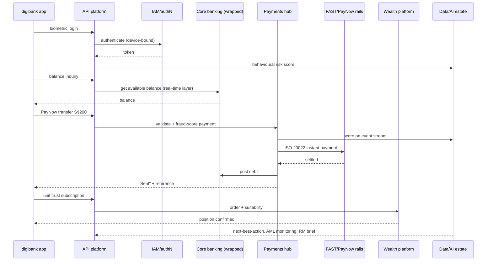

# DBS: The Software Systems Landscape — A Comprehensive Guide to the Technology DBS Runs

*A companion deep-dive to [DBS Bank Guide](dbs_bank_guide.md) (the bank, strategy, and digital transformation) and [Standard Chartered Guide](standard_chartered_guide.md) (the structural model for a software-systems guide). This guide focuses on the **specific software and technology systems** behind DBS: the core banking estate, payments, transaction banking, capital markets/treasury, risk & compliance, data & AI, digital banking, and digital assets — what is publicly known, what is inferred from industry practice, and what DBS simply does not disclose.*

**Verification convention used throughout: ✅ = verified in this research pass (primary/secondary sources); ⚠ = flagged (inferred, approximate, single-source, or structural inference); unmarked = structural/industry knowledge presented as such. The consolidated [Claims-Status table is in §11](#11-claims-status-and-verification-notes).**

---

## Table of Contents

1. [Scope and the Reality](#1-scope-and-the-reality)
2. [Core Banking Systems](#2-core-banking-systems)
3. [Payments Systems](#3-payments-systems)
4. [Transaction Banking and Trade Systems](#4-transaction-banking-and-trade-systems)
5. [Capital Markets and Treasury Systems](#5-capital-markets-and-treasury-systems)
6. [Risk and Compliance Systems](#6-risk-and-compliance-systems)
7. [Data and AI Systems](#7-data-and-ai-systems)
8. [Digital Banking Systems](#8-digital-banking-systems)
9. [Digital Assets and Ventures](#9-digital-assets-and-ventures)
10. [Worked Example: A digibank Transaction Journey](#10-worked-example-a-digibank-transaction-journey)
11. [Claims Status and Verification Notes](#11-claims-status-and-verification-notes)
12. [Glossary](#12-glossary)
13. [References and Further Reading](#13-references-and-further-reading)

---

## 1. Scope and the Reality

### 1.1 The Scope: What This Guide Covers

This guide is the **software-systems deep-dive for DBS** — the mirror image of the software sections of the [Standard Chartered Guide](standard_chartered_guide.md) (§4–§8), applied to Singapore's flagship bank. The *bank* itself — history, business segments, digital strategy, financials, the outage saga — is already covered in [DBS Bank Guide](dbs_bank_guide.md), and this guide cross-references it heavily rather than repeating it. The division of labour:

| Topic | Where it lives |
|---|---|
| The bank, strategy, "Making Banking Joyful", digibank/PayLah!/API-platform products, DDEx/Partior, financials, leadership, outages | [DBS Bank Guide](dbs_bank_guide.md) |
| The reference architecture (API-first facade, wrapped core, multi-cloud) | [DBS Bank Guide](dbs_bank_guide.md) §9.1 |
| **The specific software systems: core, payments, trade, treasury, risk, compliance, data/AI, digital, digital assets** | **This guide** |
| The vendor/platform classes these systems belong to | [Core Banking Systems Guide](core_banking_systems_guide.md), [Payments Hub Guide](payments_hub_guide.md), [Nasdaq Calypso Guide](nasdaq_calypso_guide.md), [Financial Risk & Compliance Systems Guide](financial_risk_compliance_systems_guide.md) |

What is covered here, section by section: the **core banking estate** and its modernization (§2); the **payments stack** — FAST/PayNow, PayLah!, the payments hub, ISO 20022, SWIFT GPI, cards (§3); **transaction banking and trade** — IDEAL, trade finance, supply chain finance, securities services (§4); **capital markets and treasury** — Global Financial Markets, the Murex question, e-trading (§5); **risk and compliance** — credit/market risk, AML/KYC, sanctions, regulatory reporting (§6); **data and AI** — the data platform, Intelligent Banking, GenAI (§7); **digital banking** — digibank, onboarding/eKYC, the API platform, POSB, digital wealth (§8); **digital assets and ventures** — DDEx, Partior, tokenization, DBS Asia X (§9); a **worked transaction journey** (§10); and the honest **claims-status audit** (§11).

### 1.2 What Is NOT Public: The DBS Secrecy Reality

DBS is — justifiably — famous for two things in technology: being *good* at it, and being *quiet* about it. The honest framing for anyone writing about DBS's systems:

- **DBS does not publish its internal system names.** Unlike Standard Chartered (whose consumer core "Atlas" was named at AWS re:Invent 2021 — see [Standard Chartered Guide](standard_chartered_guide.md) §4.1) or OCBC, DBS's public technology material is strategy-level: journeys, culture, headcounts, and product names (digibank, PayLah!, IDEAL, DDEx). The names of the core banking system, the payments engine, the data warehouse, the AML platform, and the trade system are **not disclosed** ⚠.
- **DBS does not publish its vendor contracts.** There is no DBS equivalent of "we run Murex", "we run FIS Systematics", or "we run Temenos" in DBS's own reporting. The few vendor relationships that are publicly documented (e.g., Murex's 2014 DBS win, reported by third parties; AWS/GCP/Azure multi-cloud, reported by analysts and DBS itself at strategy level) leak out via **vendor press releases, analyst case studies, job advertisements, and industry awards** — not DBS disclosures.
- **The consequence for this guide:** a large fraction of the DBS stack described here is **inferred** — reconstructed from (a) what DBS says at the product/strategy level, (b) the known industry pattern for a bank of DBS's size and vintage, and (c) a handful of verified datapoints. The distinction is enforced rigorously throughout, and the claims-status table in §11 records every material claim's evidence class.

### 1.3 The Honesty Framing: Verified vs Inferred

The task brief asked explicitly for the "verified vs inferred distinction". Here it is, as a discipline:

- **Verified (✅)** — directly evidenced in this research pass: DBS's mainframe heritage and the DBS Hong Kong mainframe decommissioning (DBS engineer's public write-up; Infosys case study); the ~10,000 technologists and two tech centres (DBS Annual Report); the Murex MX.3 adoption for risk management in 2014 (Wikipedia, referencing Murex's public record); DBS IDEAL as the corporate internet-banking platform (DBS product pages); DDEx's December 2020 launch and integrated exchange/tokenisation/custody model (DBS newsroom); the GenAI deployments (DBS newsroom, McKinsey, press); the 13,000-employee AI upskilling program (press); DBS Asia X (DBS pages, fintechfutures).
- **Inferred (⚠)** — reconstructed from industry practice and the shape of DBS's public disclosures: the identity of the legacy core (FIS Systematics-era ⚠), Fircosoft-class sanctions screening ⚠, the in-house nature of the payments/digibank/PayLah! estate ⚠, the data-platform vendors ⚠, the scope of Murex beyond risk ⚠.
- **Not public / not found (⚠ or unmarked)** — claims for which *no* evidence exists either way, and which must be labelled as such: "DBS iWealth" (no evidence found), Calypso/Kondor at DBS (no evidence found), the "AI factory" as a DBS brand (DBS has not used that public branding — it is an internal-pattern description).

The SC guide's closing discipline applies verbatim here: *the honest flags mark exactly where public evidence ends and inference begins* — for DBS the inferred territory is unusually large, and the guide is written so that every sentence is auditable against §11.

### 1.4 DBS Technology in Brief: "Digital to the Core"

The bank profile is in [DBS Bank Guide](dbs_bank_guide.md) §3; the technology *philosophy* worth restating here because it shapes every system decision:

- **"Digital to the core"** (Gupta's phrase, 2019) — digital is the business model, not a channel. The corollary, "we are a technology company that happens to be a bank", is the most-quoted technology statement in Asian banking ✅ (widely documented).
- **The four transformation pillars** (from [DBS Bank Guide](dbs_bank_guide.md) §3.1): customer journeys not systems (~40+ journeys, each with an owner, a P&L, an engineering squad); digital-first distribution (~90%+ of transactions digitalised, flagged); data and AI as a core asset (~13,000 staff trained in data literacy in 2019, flagged); developer experience and APIs (the 2017 API platform, thousands of releases per year, flagged).
- **The reference architecture** ([DBS Bank Guide](dbs_bank_guide.md) §9.1): an API-first facade over a legacy core (the strangler-fig pattern); microservices for new domains; multi-cloud with portability (AWS from 2017, GCP from 2018, Azure later — flagged timeline); a centralised data/AI platform; event-driven integration; and (2023+) a resilience-engineering layer. This architecture **is** the systems landscape this guide unpacks: every system below sits either behind the API platform (core, payments, trade, wealth), alongside it (data/AI), or is being modernised inside it.

### 1.5 The Technology Organization: Scale, Centres, Skills

- **~10,000+ technologists** ✅ — DBS's Annual Report states it directly: *"Internally, DBS has more than 10,000 technologists, as well as two tech centres in Singapore and India today."* (DBS Annual Report, quoted in the 2023 reporting cycle.) After the November 2023 split of Technology & Operations (T&O) into separate Technology and Operations units (verified via media, flagged in [DBS Bank Guide](dbs_bank_guide.md) §3.3), Technology alone is in the high thousands ⚠.
- **Two tech centres** ✅ — Singapore (HQ, core engineering, the "digital to the core" academy) and **India** ✅ (the annual report's phrasing). The India centres are commonly cited as **Hyderabad and Bangalore** ⚠ (per [DBS Bank Guide](dbs_bank_guide.md) §3.3 — Hyderabad is DBS's largest offshore engineering hub, built up since ~2015; Bangalore followed), with regional engineering in China, Hong Kong, and Taiwan ⚠. The India centres provide a follow-the-sun 24×5 support model and a deep talent pool — a deliberate "build your own engineering bench" strategy that differentiates DBS from banks that outsource application development.
- **Skills at scale** ✅ — the 2025–26 AI upskilling program: DBS identified ~13,000 staff for upskilling/reskilling in AI and data capabilities, with ~10,000 already in training (press, Nov 2025 and Mar 2025; the "halt hiring for roles at risk of automation" framing was widely reported). This is the human-system that runs the software systems in §7.
- **Tech spend** ⚠ — DBS does not publish a clean "technology spend" number; the transformation-era investment (~S$200–300M/year early on, flagged) and the post-outage resilience investment (~S$350M reported, not independently verified — [DBS Bank Guide](dbs_bank_guide.md) §3.3) are the commonly cited figures.

### 1.6 "Technology as the Business": The Philosophy and Its Cost

The cultural layer ([DBS Bank Guide](dbs_bank_guide.md) §3.4): engineering as a first-class citizen (the CTO historically reporting to the CEO; senior engineers hired from big tech; engineering career tracks), data literacy for all (thousands of staff building analytics dashboards), journey squads at scale (~1,000+ squads, flagged), and board-level digital KPIs. This is why DBS's systems estate is *unusually in-house*: DBS builds rather than buys wherever the capability is strategic — payments, mobile, APIs, AI — and buys (or partners) where the capability is commodity (cloud infrastructure, screening engines, core software historically).

The philosophy has a documented cost: the 2023–24 outages ([DBS Bank Guide](dbs_bank_guide.md) §5.5, §9.3) traced to the tension between release velocity and legacy-core dependencies — MAS imposed additional capital requirements and, for a period, restrictions on non-essential IT changes. The post-outage agenda (chaos engineering, independent recovery testing, dual-site failover drills, a dedicated resiliency office, the T&O split) is now a *system* in its own right — a resilience layer that sits across everything in this guide (§10.4).

### 1.7 The Consolidated Technology Stack (2026 View)

The whole landscape at a glance — the "map of the territory" that §2–§9 then unpack (evidence classes per §11):

| Layer | Systems (names as publicly known) | Evidence class |
|---|---|---|
| **Channels** | digibank (SG/POSB + regional), PayLah! (being consolidated ⚠), IDEAL (corporate/SME), DBS Online Trading (Vickers), developer portal, RM workstations | ✅ product names; ⚠ internals |
| **API platform** | Enterprise API gateway + orchestration (2017; ~155→500+ APIs ⚠); Treasury Prism; marketplace-banking APIs | ✅ launch verified; ⚠ catalogue |
| **Core banking** | Legacy mainframe-era core (wrapped, strangler-fig); DBS HK decommissioned mainframe (2021); digibank India greenfield core (2016); no named vendor core | ✅ heritage/modernisation verified; ⚠ identity inferred |
| **Payments** | Payments hub (inferred); FAST/PayNow participation; ISO 20022; SWIFT GPI; cards on Visa/Mastercard; card-management platform undisclosed | ✅ rails verified; ⚠ hub/cards inferred |
| **Transaction banking** | IDEAL modules (cash, trade, SCF, custody); trade engine (in-house ⚠); DBS Nominees; DBS Vickers | ✅ IDEAL verified; ⚠ engines inferred |
| **Markets/treasury** | Murex MX.3 (2014, risk); GFM e-FX/e-trading; in-house analytics ⚠; no Calypso/Kondor evidence | ✅ MX.3 verified; ⚠ scope inferred |
| **Risk & compliance** | AI credit scoring; real-time transaction monitoring; sanctions screening (Firco-class ⚠); KYC/onboarding (Singpass eKYC); BCBS 239 risk data | ✅ AI/AML wins reported; ⚠ vendors inferred |
| **Data & AI** | Multi-cloud lake + event streams (lakehouse-class ⚠); Intelligent Banking (thousands of models); GenAI copilots (CSO assistant, Processing Co-Pilot, developer copilots) | ✅ programmes verified; ⚠ vendors inferred |
| **Digital assets** | DDEx (exchange/tokenisation/custody, 2020); DBS Digital Custody; Partior (JV); Project Guardian/Orchid participation | ✅ verified |
| **Infrastructure** | Multi-cloud (AWS/GCP/Azure ⚠ timeline); Kubernetes/containerisation ⚠; event backbone ⚠; resilience layer (chaos, failover drills); mainframe stabilisation | ✅ strategy verified; ⚠ specifics inferred |

The pattern to hold: **DBS's public footprint is product names and programmes; the system names beneath them are, almost without exception, not public.** §2–§9 are organised so that each layer states exactly which of its cells are ✅ and which are ⚠.

---

## 2. Core Banking Systems

### 2.1 The Core Estate: The Mainframe Heritage

The single most important verified fact about DBS's core: **DBS's core banking estate has been mainframe-based, and it is being actively decommissioned** ✅.

- **DBS Hong Kong was the first DBS franchise to decommission its mainframe** ✅ — documented by a DBS engineer's public write-up (2021): the mainframe "limited our ability to offer our customers more complex and personalised digital journeys", and **approximately 60% of what constituted the mainframe was the legacy core banking system** ✅. DBS HK ran the decommissioning as a programme that replaced the mainframe core with modern, API-exposed services — a flagship reference for the rest of the group.
- **Infosys published a case study, "DBS Bank's Leap from Mainframe to the Cloud"** ✅ — describing DBS's decision, driven by "evolving customer expectations and the rise of FinTech disruptions", to modernise away from mainframe reliance. (Infosys is a long-standing DBS technology partner; the case study is DBS's own narrative through a partner's lens.)
- **The group picture** ⚠: DBS Singapore's core remains mainframe-era in substantial part (the 2023 outage post-mortems — MAS statements and DBS responses — repeatedly reference "legacy core" and "mainframe" stabilisation work; the "mainframe/legacy stabilisation" line in [DBS Bank Guide](dbs_bank_guide.md) §3.3 is consistent with this). The direction is unambiguous: **every franchise is expected to follow DBS HK's path** — decommission mainframe, expose core functions as services, run the modern estate on cloud.

### 2.2 The "DBS Core": In-House vs Vendor

The task brief's core question — *what is the DBS core, in-house or vendor, and is FIS Systematics in its history?* — resolves honestly as follows:

- **DBS does not name its core** ⚠ — there is no DBS-public equivalent of SC's "Atlas". The system of record for deposits, loans, and accounts is referred to in DBS material only as "the core", "core banking", or "legacy core banking system" (the DBS HK write-up's own phrasing).
- **The historical core is widely believed to be FIS Systematics** ⚠ — FIS Systematics was the dominant core banking system across Asia-Pacific in the 1990s (see [Core Banking Systems Guide](core_banking_systems_guide.md) vendor table and the FIS Systematics product page: "the Systematics core banking system from FIS… handles core ledger functions for financial institutions worldwide"); DBS, as a 1990s-vintage Asian banking group, is consistently counted among the Systematics-generation banks in industry lore. **This pass found no primary source naming Systematics inside DBS** — treat it as industry-inference, flagged ⚠, and repeat it only with that flag. (The "FIS" relationship question is also complicated by FIS's later acquisitions — Systematics became FIS's flagship core, so "FIS Systematics" and "DBS's legacy core" are commonly elided in vendor-land ⚠.)
- **The honest statement**: the DBS core is **predominantly in-house and legacy**, wrapped by APIs, and progressively being decomposed — *not* a named vendor core, and *not* a big-bang-replaced core. The "in-house vs vendor" dichotomy the brief poses is the wrong frame for DBS: the reality is **"legacy in-house core + strangler-fig modernisation + greenfield digital components"**, which is a materially different architecture from both SC's in-house "Atlas on AWS" and Trust Bank's vendor "Mambu on GCP" ([trust_bank_guide.md](trust_bank_guide.md) §3).

**The core estate at a glance:**

| Component | What it is | Status |
|---|---|---|
| **Legacy core (Singapore + regional franchises)** | Mainframe-era deposits/loans/accounts system(s) of record; the "60% of the mainframe" (DBS HK) | ✅ mainframe heritage verified; ⚠ identity (Systematics-era) inferred |
| **DBS HK modernised core** | First franchise to decommission the mainframe; core functions re-platformed as API-exposed services | ✅ verified (2021 write-up) |
| **Strangler-fig services** | New cloud-native services (accounts, onboarding, payments, wealth) that progressively absorb core functions | ✅ pattern documented ([DBS Bank Guide](dbs_bank_guide.md) §9.1); ⚠ specifics not public |
| **digibank India core** | Greenfield, cloud-native core components built for the 2016 mobile-only bank — *not* a wrapper of the legacy core | ✅ pattern documented ([DBS Bank Guide](dbs_bank_guide.md) §3.2); ⚠ vendor/stack details not public |
| **Vendor cores (Temenos, FLEXCUBE, BaNCS)** | No verified DBS production-core relationship in this pass | ⚠ unverified (see §2.6) |

### 2.3 Core Modernization: The "DBS Core" Programme Question

The task brief asked about a "core replacement" / "DBS core program" in the 2010s–2020s. The verified reality:

- **There is no publicly-named big-bang core replacement programme at DBS** ⚠ — unlike SC's Atlas-on-AWS or the vendor-replacement programmes at many Western banks, DBS's public record describes **evolutionary modernization**: wrap the legacy core with APIs, move customer touchpoints to cloud-native channels, and progressively modernise the core layers (accounts, deposits, loans) ([DBS Bank Guide](dbs_bank_guide.md) §3.3). This is the "strangler fig" pattern at bank scale — the industry-consensus approach documented in [Core Banking Systems Guide](core_banking_systems_guide.md) and [Oracle Banking Microservices Architecture Guide](oracle_banking_microservices_architecture_guide.md) for the service-decomposition mechanics.
- **The exceptions are franchise-level and greenfield**: DBS HK's mainframe decommissioning (✅ verified, the closest thing to a named core-replacement programme) and digibank India's greenfield build (✅ verified pattern). Both served as reference architectures the group could reuse — the DBS version of "modernise the core by building a new one beside it".
- **What the 2020s modernisation is really about** ⚠ (inferred from the verified pieces): containerisation (Kubernetes), API-ification of legacy functions, event-driven integration (the [Payments Hub Guide](payments_hub_guide.md) pattern), data-platform modernisation, and — post-2023 — mainframe/legacy *stabilisation* as a first-order goal (the outage lesson: don't modernise the edges while the core's reliability degrades; [DBS Bank Guide](dbs_bank_guide.md) §9.3).

### 2.4 The Retail Core: Consumer Banking and POSB

- The **consumer banking core** (Singapore retail + POSB books) is the same wrapped legacy estate: deposits, loans (mortgages, unsecured), and the card ledger live in the core; the digibank channel and the API platform sit in front of it ⚠ (structural — the architecture diagram in [DBS Bank Guide](dbs_bank_guide.md) §9.1 shows exactly this layering; system names not public).
- **POSB runs on the same core** ⚠ — POSB was merged into DBS in 1998 and survives as a dual mass-market brand ([DBS Bank Guide](dbs_bank_guide.md) §5.2); its customers' accounts sit on the DBS estate (the POSB digibank app is the DBS digibank platform under the POSB brand — see §8.5). No separate POSB core is documented ⚠.
- **Interest and posting mechanics** — for the architect, the retail core's accounting behaviour (interest accrual on deposits/loans, posting rules, end-of-day vs real-time) is the domain of the sibling guides: [Interest Engines Core Banking Guide](interest_engines_core_banking_guide.md) and [Posting Engine Core Banking Guide](posting_engine_core_banking_guide.md). DBS's public material gives away one key fact: **real-time balances in digibank** are a marketing staple, which implies the core (or a real-time layer in front of it) has moved beyond pure end-of-day batch for balance inquiry ⚠ (verified as a product claim, inferred as an architecture claim — see §10.2).

### 2.5 digibank and the "Core for the Digital"

The brief's "digibank — the core for the digital" framing: digibank is *not* a separate core in Singapore — it is the **channel** over the wrapped legacy core ([DBS Bank Guide](dbs_bank_guide.md) §9.1). The genuinely different cores live elsewhere:

- **digibank India (2016)** ✅ — the mobile-only bank built **greenfield on a modern stack** (cloud-native services, new core components, Aadhaar eKYC, video verification) rather than wrapping the legacy core — the cleanest "greenfield digital core inside a bank" example in DBS's estate, and the source of the reference architecture reused elsewhere ([DBS Bank Guide](dbs_bank_guide.md) §3.2).
- **The Singapore digital-bank comparison** — Singapore's licensed digital banks (GXS, MariBank) run modern vendor/cloud-native cores; see [Trust Bank Guide](trust_bank_guide.md) §3 for the SG digital-bank core landscape (Trust runs Mambu on GCP). DBS **did not take a digital-bank licence** (GXS is Grab/Singtel, MariBank is Sea) ⚠ structural — DBS's answer to digital competition was to make its own incumbent stack digital, not to spin up a separate licensed entity. This matters for the systems map: DBS has **no Mambu/Thought-Machine-class vendor core in its own estate** ⚠ (unverified, but consistent with the build-don't-buy culture).

### 2.6 Core Vendors: FIS, Temenos, and the Verdict

- **FIS** — the Systematics-era relationship is **inferred** ⚠ (§2.2). FIS is also the leading card-processing vendor class (see §3.4), but no verified DBS–FIS contract for cards or core was found in this pass ⚠.
- **Temenos** — **no verified DBS production relationship found** ⚠. Temenos is the industry's leading core vendor ([Temenos Guide](temenos_guide.md)), but DBS is not documented as a Temenos client in this pass; vendor lists that pair DBS with T24 should be treated as unsubstantiated ⚠ (the [Core Banking Systems Guide](core_banking_systems_guide.md) vendor table has the reference list).
- **Oracle FLEXCUBE** — no verified DBS deployment ⚠; FLEXCUBE is common among Asian banks ([Oracle FLEXCUBE Data Model Guide](oracle_flexcube_data_model_guide.md)) but DBS is not a documented flagship client.
- **The verdict**: DBS's core strategy is **build-and-wrap, not buy-and-replace** — the opposite of the vendor-core banks. The vendor cores DBS demonstrably *uses* are the **digital-bank cores of competitors it benchmarks** (Trust's Mambu, GXS's offerings) — DBS's edge thesis is that its own wrapped core plus its engineering bench beats a fresh vendor core at the *incumbent* game.

### 2.7 Core Processes: Batch, Real-Time, and the Posting Engine

For the architect, the interesting part of the DBS core is not the vendor question but the **process regime** — what runs in batch, what runs real-time, and how the two coexist behind a real-time-facing facade:

- **Batch vs real-time** ⚠ (inferred from product behaviour + the outage record) — the legacy core's heavy accounting (interest runs, end-of-day processing, regulatory reporting, statement generation) remains batch-oriented (the 2023 outage post-mortems reference batch-restart cascades — [DBS Bank Guide](dbs_bank_guide.md) §9.3); the customer-facing estate reads *real-time balances* through a real-time layer in front of the core (§2.4). The classic split: **real-time reads, batched writes** for the legacy layers, with new services (payments, onboarding, wealth) posting in real time on modern components ⚠.
- **Posting mechanics** — the debit/credit posting rules, the double-entry flow, and the suspense/GL structure of a DBS-class core are the domain of [Posting Engine Core Banking Guide](posting_engine_core_banking_guide.md); DBS-specific specifics are not public ⚠, but the *patterns* (real-time posting for payments to sustain instant available balances; EOD batch for interest and fees; reconciliation against the payments hub's ISO 20022 events) are the standard ones ⚠.
- **Interest engines** — deposit/loan interest (the DBS "interest mechanics" for savings tiers, fixed deposits, and the loan book) run on the core's interest engine, with the digibank "interest calculator" being the channel view ([Interest Engines Core Banking Guide](interest_engines_core_banking_guide.md) has the platform class; DBS specifics not public ⚠).
- **The decommissioning playbook** (from the DBS HK precedent ✅) — the pattern for retiring core functions: (1) expose the function as an API service; (2) move read/write traffic to the new service; (3) freeze and then switch off the legacy module; (4) reconcile before decommissioning. DBS HK proved the playbook on ~60% of a mainframe (✅); the group is executing it franchise by franchise ⚠ (only HK is publicly confirmed).

---

## 3. Payments Systems

### 3.1 The Singapore Rails: FAST and PayNow

- **FAST (Fast And Secure Transfers)** — Singapore's real-time interbank transfer scheme (since 2014, operated by the Association of Banks in Singapore); DBS is a **participating bank** ✅ (structural — FAST participation is universal among the SG domestic banks; DBS is the largest of them). FAST is the settlement rail for instant SGD transfers, ISO 20022-based, running through the [Financial Infrastructure Guide](financial_infrastructure_guide.md) rails.
- **PayNow** — the proxy-based instant payment service (launched **2017** with DBS among the founding participant banks ✅, see [DBS Bank Guide](dbs_bank_guide.md) §5.2 and the [Financial Infrastructure Guide](financial_infrastructure_guide.md)); PayNow maps mobile numbers/NRICs/UENs to accounts and settles over FAST. DBS's PayLah! and digibank both ride PayNow/FAST for P2P ✅ (product-level verified).
- **The architecture implication** ⚠ (inferred, standard for a top-tier participant): DBS runs a **payments hub** — one internal payments platform that connects to FAST/PayNow (SG), the regional instant rails (India's UPI/IMPS for digibank India, Hong Kong's FPS, Taiwan's, etc. ⚠ per-franchise), and the cross-border networks (§3.3) — exactly the [Payments Hub Guide](payments_hub_guide.md) pattern. The hub handles validation, fraud screening, ISO 20022 message conversion, and settlement; the channel apps never touch the rails directly.

### 3.2 PayLah!: The Consumer Payments App

- **The product** ✅ — PayLah! launched **2017** as DBS's consumer payments app: peer-to-peer transfers (PayNow-integrated), merchant QR payments (SGQR), bill/taxi payments, and the iconic **Hawker GoDigital** government-backed campaigns (2020–21) that digitalised hawker centres via PayLah! ([DBS Bank Guide](dbs_bank_guide.md) §3.2, §5.2). Status note ⚠: as of 2025–26 DBS has been consolidating PayLah!'s payment features into digibank (wind-down plans flagged, not re-verified) — the underlying rails (PayNow/FAST) remain in digibank.
- **The technology** ⚠ — DBS has never disclosed PayLah!'s stack. The defensible inference: PayLah! is an **in-house-built app** over the DBS payments hub and API platform (DBS builds its consumer payment estate in-house — consistent with the build-don't-buy culture of §1.6 and the API-first architecture of §8.4), with **no named payment-app vendor** in the public record. The fraud/AML screening inside PayLah! runs on the DBS real-time risk estate (§6.2, §7.2). Treat "PayLah! is in-house" as **⚠ inferred**, and any claimed vendor (e.g., a payments-as-a-service provider) as **not found**.
- **Why PayLah! matters architecturally** — it was DBS's first mass-market demonstration that the *payments experience* could be decoupled from the core: a cloud-native-ish app (⚠ inferred) orchestrating the payments hub, QR standards (SGQR), and the national rails, without touching the legacy core except for account/balance data. It is the payments-side proof of the wrapper architecture.

### 3.3 The Payments Hub: ISO 20022, SWIFT GPI, Cross-Border

- **ISO 20022** ✅ (structural) — DBS is a top-tier SWIFT member and a major cross-border payments bank in Asia; the CBPR+ ISO 20022 migration and the ISO 20022-native domestic rails (FAST/PayNow, SGQR payloads) are mandatory for its franchise. DBS runs ISO 20022 end-to-end for cross-border (SWIFT MT→MX) and natively for SG rails; per-market go-live specifics ⚠ not re-verified here — see [ISO 20022 Core Processes Guide](iso_20022_core_processes_guide.md) for the message mechanics and [Payments Hub Guide](payments_hub_guide.md) for the hub pattern.
- **SWIFT GPI** ✅ (structural) — DBS is a **SWIFT GPI member** (GPI is effectively universal among top-tier cross-border banks; DBS markets GPI-tracked payments to corporate clients through IDEAL — payment tracking and same-day use of funds are part of the IDEAL FX/payments proposition ⚠ product-page specifics flagged). For the architect: the DBS payments hub carries the GPI tracker fields end-to-end and exposes tracking to clients via IDEAL and the API platform.
- **Cross-border payment technology** ⚠ — the modern DBS cross-border stack is understood to include: the ISO 20022 hub, SWIFT GPI, and the regional corridors (RMB via CIPS/CHATS for the China franchise ⚠, INR via NEFT/IMPS/UPI for India ⚠, HKD via CHATS/FPS for HK ⚠ — per-franchise structural inference, flagged). DBS's 2021+ **Partior** bet (§9.2) is the same function on a distributed-ledger rail — the bank is hedging both the SWIFT-era and the tokenized-era cross-border futures.

### 3.4 Cards Processing: Visa/Mastercard and the Card Platform

- **The franchise** ✅ (structural) — DBS is one of Asia's largest card issuers (consumer credit/debit cards across SG, HK, India, Taiwan, Indonesia; the Citi Taiwan acquisition added ~1M card customers in 2023 — [DBS Bank Guide](dbs_bank_guide.md) §6.2). Issuing runs on the **Visa and Mastercard schemes** ✅ (DBS cards are issued on both networks — product-level verified), with regional schemes (UnionPay, NETS) for specific segments ⚠.
- **The card management platform** ⚠ — the card system of record (accounts, authorisations, clearing, settlement, loyalty) is **not disclosed**. The industry pattern for a bank of DBS's vintage is a card-management system from a major vendor (FIS/TSYS-class ⚠) or in-house mainframe-based card ledgers (⚠) feeding the Visa/Mastercard networks. The honest statement: **card processing is the least-documented layer of the DBS stack** — infer in-house-ledger-plus-scheme-interfaces ⚠ and flag it.
- **Digital cards** ✅ — DBS issues virtual/digital cards via digibank (product-verified); the "numberless card" and tokenisation (card-on-file via token services) are standard on its stack ⚠ (industry-standard card tokenisation, inferred).

### 3.5 The Payments Timeline

The DBS payments story in dates (✅ where verified in this pass or the sibling guides; ⚠ where flagged):

| Year | Event | Evidence |
|---|---|---|
| 2014 | FAST (SG instant rail) launches; DBS a participant | ✅ structural |
| 2017 | **PayNow** launches (DBS a founding participant bank); **PayLah!** launches; the **API platform** opens (~155 APIs) | ✅ (sibling guide + product record) |
| 2020 | SGQR standardises merchant QR (PayLah! a major wallet); Hawker GoDigital campaigns | ✅ (sibling guide) |
| 2021 | **Partior** announced (DBS+JPM+SC) — the DLT settlement rail | ✅ |
| 2023–24 | First commercial Partior transactions (DBS–SC); ISO 20022 CBPR+ cross-border migration complete | ✅ (sibling guide) |
| 2025–26 | PayLah! features consolidating into digibank ⚠; GenAI-assisted screening (−75% time) in the payments compliance path | ⚠ flagged / ✅ reported |

The arc: **DBS's payments estate went from FAST-participant (2014) to rail-owner-adjacent (Partior, 2021) in seven years** — the same bank that rides the national rails now co-owns a settlement network that could one day compete with them (or back them) — the strategy tension worth an architect's attention (§9.2).

---

## 4. Transaction Banking and Trade Systems

### 4.1 DBS IDEAL: The Corporate Internet Banking Platform

The task brief's "IDEAL?" resolves cleanly: **DBS IDEAL is real, verified, and is DBS's corporate digital banking platform** ✅.

- **What it is** ✅ — IDEAL is DBS's internet/digital banking platform for corporate clients and SMEs: account management, cash management, payments and collections initiation, trade finance initiation, and FX — "manage your working capital and transactions with ease across desktops, tablets and mobile phones" (DBS IDEAL product pages, SG/ID/HK). It is DBS's analogue of Standard Chartered's Straight2Bank ([Standard Chartered Guide](standard_chartered_guide.md) §5.1) — the **system of engagement** for institutional clients, sitting above the systems of record (cash/account platforms, payments hub, trade engines) exactly as the [Payments Hub Guide](payments_hub_guide.md) and [Universal Banking Model Guide](universal_banking_model_guide.md) describe.
- **The IDEAL family** ✅/⚠ — IDEAL (full corporate), **IDEAL SME / business banking** (the SME portal), IDEAL mobile (corporate mobile banking ⚠ product name flagged), and **host-to-host/API connectivity** (IDEAL's API/ERP integration — DBS exposes cash-management APIs to corporates via the API platform, §8.4; the "Treasury Prism" SaaS for corporate treasuries is the flagship API product, ⚠ per [DBS Bank Guide](dbs_bank_guide.md) §4.2). Authentication: IDEAL uses the DBS corporate token/security-device family ⚠ (product specifics flagged).
- **Technology status** ⚠ — the IDEAL stack is in-house-built (DBS builds its corporate channels; no vendor disclosed), fronting the DBS cash-management and payments engines. The honest statement: **IDEAL's back-end system names are not public; its front-end role is product-verified**.

**The IDEAL module map** (✅/⚠ per §11 — the *modules* are product-visible; the engines beneath are inferred):

| IDEAL module | What it does | Systems beneath (evidence) |
|---|---|---|
| Cash management | Balances/statements, payments & collections initiation, liquidity (sweeps, pooling ⚠), escrow ⚠ | Cash/account platforms (⚠ in-house), core ledger (✅ wrapped), payments hub (§3.3) |
| Payments | FAST/PayNow initiation, cross-border via SWIFT GPI/ISO 20022 (✅ structural) | Payments hub, ISO 20022 layer, SWIFT interfaces |
| Trade | LC/guarantee/bill initiation and tracking | Trade engine (⚠ in-house, §4.2), SWIFT MT7xx |
| FX | Spot/forward/swap execution within cash flows | GFM pricing (MX.3-based, §5.2) via e-FX channel |
| Securities services | Custody/portfolio access ⚠ | Custody platform (⚠ in-house, §4.4) |
| API/host-to-host | ERP-to-bank integration (Treasury Prism, corporate APIs) | API platform (§8.4) |

For the architect: IDEAL is the corporate face of the same API-first facade that digibank is the retail face of — one spine, two engagement layers (compare [Standard Chartered Guide](standard_chartered_guide.md) §5.1 and §12).

### 4.2 Trade Finance Systems

DBS's trade franchise sits in **Global Transaction Services (GTS)** — the institutional transaction-banking unit ([DBS Bank Guide](dbs_bank_guide.md) §2.4). The systems picture:

- **The trade-processing estate** ⚠ — LC issuance/advising, guarantees, bills, and collections run on DBS's in-house trade platforms (inferred; no vendor disclosed), fronted by IDEAL's trade module ✅ (IDEAL product pages list trade as a module) and the API platform. DBS was historically a **founding shareholder of Contour** ✅ (the blockchain trade-finance network launched 2020 with SC, DBS, HSBC, Citi, BNP Paribas, ING, Bangkok Bank — verified via the [Standard Chartered Guide](standard_chartered_guide.md) §5.3 research; Contour wound down 2023–24 ⚠, so DBS-on-Contour statements must be past tense).
- **Digital trade** ✅/⚠ — DBS is an active digital-trade participant: **AI/NLP-assisted trade document processing** is one of DBS's publicised AI wins (✅ reported — [DBS Bank Guide](dbs_bank_guide.md) §3.2 cites NLP-based trade document processing); electronic bills of lading and paperless-trade initiatives via industry networks (GSBN-class ⚠ partner names flagged) and the **SG Trade Data Exchange / TradeTrust** ecosystem ⚠ (structural for a SG-headquartered bank — TradeTrust is the IMDA framework for digital trade documents; DBS participation inferred, flagged). The DBS GenAI "Processing Co-Pilot" (§7.3) extends into trade operations ⚠ (consistent with the 2026 reporting on branch/ops copilots).
- **Trade as a system of record** — for the architect: the trade engine (LC lifecycle, UCP 600 rules, document examination, SWIFT MT7xx messaging) is a classic domain system behind the API platform; DBS's edge is the AI layer on document-heavy workflows (the same "AI lands where the human bottleneck is" pattern as SC — [Standard Chartered Guide](standard_chartered_guide.md) §12.3).

### 4.3 Supply Chain Finance

- **The franchise** ✅/⚠ — DBS is a leading supply chain finance (SCF) bank in Asia (structural — SCF is a core GTS product; exact rankings ⚠ flagged). The SCF platform class (receivables/payables finance, distributor finance, dynamic discounting, pre-shipment) is covered in [Supply Chain Finance Guide](supply_chain_finance_guide.md).
- **The systems** ⚠ — DBS's SCF is delivered through IDEAL and API/ERP integrations (inferred — same pattern as trade), with **AI-driven credit assessment** on SCF facilities flagged as a DBS AI use case ⚠ (consistent with the Intelligent Banking credit-risk work, §7.2). No named SCF platform vendor is public ⚠.
- **Digital SCF** ✅/⚠ — DBS's blockchain/API SCF pilots (e.g., the 2019–20 DBS–Partior-adjacent trade pilots ⚠, and the SGQR/PayNow-adjacent SME financing integrations ⚠) are the "SCF as a platform" agenda — flagged as reported, not re-verified.

### 4.4 Securities Services: Custody and DBS Nominees

- **Custody** ✅/⚠ — DBS is a major regional custodian (one of the largest in Singapore — structural/flagged): safekeeping, settlement, corporate actions, and fund administration for institutions, delivered through GTS. The custody platform is in-house ⚠ (no vendor public), connected to the SGX/CDP, the regional CSDs, and the ICSDs (Euroclear/Clearstream for cross-border ⚠ structural). **DBS Nominees** is the standard nominee-holding entity for DBS custodial accounts ✅ (structural — the nominee name appears on CDP holdings for DBS-brokered SGX positions; product-verified by the SGX/CDP registration pattern ⚠).
- **Brokerage** ✅ — **DBS Vickers** (the retail/institutional brokerage) runs **DBS Online Trading** (iBanking-integrated retail trading) and the institutional execution desk; the brokerage stack (order routing to SGX, settlement via CDP) is ⚠ in-house with vendor components unverified. See [DBS Bank Guide](dbs_bank_guide.md) §2.5 for the group structure.
- **Asset management** ✅/⚠ — **DBS Asset Management** (funds, mandates) runs the fund-administration/portfolio systems; the flagship digital expression is the digibank wealth platform (§8.6) and the DBS unit-trust/ETF shelf (verified product-wise; system names not public ⚠). The wealth-technology domain mechanics are in [Wealth Management Guide](wealth_management_guide.md).

---

## 5. Capital Markets and Treasury Systems

### 5.1 Global Financial Markets: The Treasury and Markets Business

DBS's markets engine is **Global Financial Markets (GFM)** — the treasury and markets division inside Institutional Banking ([DBS Bank Guide](dbs_bank_guide.md) §2.4): **FX** (a top Asian G10/Asian-currency market-maker — DBS is one of the largest FX banks in Asia, structural/flagged), **rates** (SGD and regional rates, plus the balance-sheet/ALM activity of group treasury), **credit** (flow and structured credit), **commodities** (precious metals, energy ⚠), and **structured/derivatives** (IR derivatives, FX options, structured deposits/notes sold into the wealth franchise). The division is also the home of **DDEx** (the digital exchange, §9.1) and the institutional e-FX/e-trading channels (§5.3). For the canonical front-to-back profile of a markets business of this type, see [Nasdaq Calypso Guide](nasdaq_calypso_guide.md).

**The GFM book at a glance** (⚠ structural/flagged — DBS publishes segment-level, not desk-level, detail):

| Business | Products | Systems footprint (evidence) |
|---|---|---|
| FX | Spot, forwards, swaps, options; G10 + Asian EM currencies | MX.3 (✅ risk; ⚠ trading scope), e-FX channels (§5.3) |
| Rates | SGD/regional rates, IRS, bonds | MX.3-class ⚠, in-house analytics ⚠ |
| Credit | Flow credit, structured credit | In-house + MX.3-class ⚠ |
| Commodities | Precious metals (the gold/SGD franchise ⚠), energy ⚠ | In-house ⚠ |
| Treasury/ALM | Group funding, liquidity, IRRBB | In-house ALM models ⚠, MX.3 valuations ✅-adjacent |
| Digital assets | DDEx, tokenisation, digital custody (✅ §9) | DDEx platform (in-house ⚠) + Partior |

The business shape matters for the systems story: GFM is *both* the trading bank and the bank's own treasury — so its systems (MX.3, ALM, e-FX) serve two masters, the client franchise and the balance sheet, which is why the market-risk discipline of §5.4 is the best-documented corner of the stack (the 2014 MX.3-for-risk win ✅).

### 5.2 The Treasury System: Murex, Calypso, Kondor — the Verification

The task brief asked to verify the DBS treasury system. This is the **one place where a specific vendor name is verified**:

- **Murex MX.3 — verified for risk management** ✅ — Wikipedia's Murex article (itself citing Murex's public record) states: *"In 2014, the Singaporean-based bank, DBS, adopted MX.3 in its risk management operations."* The 2014 adoption was widely recognised in the industry as a **market-risk technology** win for Murex (the Murex 2014–18 award citations for the DBS implementation ⚠ single-source detail). So: **DBS runs Murex MX.3** ✅, at least for enterprise risk management — and MX.3 is a cross-asset **front-to-back** platform (trading, treasury, risk, post-trade), which makes it the natural anchor of the DBS treasury stack.
- **The scope question** ⚠ — whether MX.3 at DBS covers the full front-to-back trading lifecycle (sales/trading desks, confirmations, settlement) or is scoped to risk/valuation is **not public**. The industry consensus for a bank of DBS's GFM size is a Murex-centred front-to-back with in-house pricing/analytics around it ⚠ (the standard pattern: vendor platform for the trade lifecycle, in-house for the alpha/risk edge — same shape as SC's stack, [Standard Chartered Guide](standard_chartered_guide.md) §6.2).
- **Calypso** ⚠ — **no verified DBS deployment found** in this pass. Calypso is common in Asian treasury/derivatives ([Nasdaq Calypso Guide](nasdaq_calypso_guide.md)) but DBS is not documented as a Calypso client; treat any "DBS runs Calypso" claim as unsubstantiated.
- **Kondor+ (Reuters/Refinitiv/LSEG)** ⚠ — the classic legacy treasury system (ubiquitous in 1990s–2000s Asian banks); plausible in DBS's older estate but **unverified**; if present it sits in the "legacy being retired" bucket alongside the mainframe work of §2.1.
- **The honest statement for citation-safe documents**: *"DBS's markets/treasury stack is Murex MX.3-based for risk (verified, 2014 adoption) with the full front-to-back scope and surrounding in-house components inferred; Calypso and Kondor+ are not verified at DBS."*

### 5.3 E-Trading: E-FX and Online Trading

- **Corporate e-FX** ✅/⚠ — FX execution is embedded in **IDEAL** (the corporate e-FX channel: spot/forwards/swaps via portal and API — functional reality product-verified; the exact e-FX product branding ⚠ flagged). DBS markets IDEAL FX as part of the cash-management proposition ✅ (DBS product pages).
- **Institutional e-trading** ⚠ — GFM runs electronic FX/rates execution for FIs (algo execution, auto-hedging, streaming prices — standard for an FX bank of DBS's size; inferred, flagged). The DBS single-dealer/e-commerce platform name is **not public** ⚠.
- **Retail online trading** ✅ — **DBS Online Trading** (DBS Vickers) is the retail brokerage channel (product-verified); it executes SGX equities, ETFs, and (via digibank integration) FX/treasuries ⚠.
- **The pattern**: e-trading at DBS is *distribution over the treasury stack* — IDEAL/API channels and the institutional e-FX channel front the MX.3-based pricing/risk core (§5.2), exactly the system-of-engagement-over-system-of-record shape from §4.1.

### 5.4 Derivatives and Risk Systems

- **Derivatives processing** ⚠ — IR/FX/credit derivatives run on the treasury stack (MX.3-class ⚠), with the confirmations/settlement/collateral layer (in-house + market utilities ⚠), feeding the risk engines.
- **Market risk** ✅/⚠ — the verified MX.3 footprint is precisely here: market risk measurement (VaR, sensitivities, FRTB-class metrics ⚠ FRTB specifics flagged) on MX.3 since 2014 ✅, with in-house analytics around it ⚠. See [Financial Risk & Compliance Systems Guide](financial_risk_compliance_systems_guide.md) for the platform class.
- **Credit risk, ALM, liquidity risk** ⚠ — the credit-risk systems (retail and institutional) are in-house, AI-assisted (§7.2); ALM/treasury (funding, liquidity, IRRBB) sits in GFM with in-house models ⚠; the risk-data aggregation to BCBS 239 standards is covered in §6.4.

---

## 6. Risk and Compliance Systems

### 6.1 Risk Management Systems: Credit, Market, Operational

- **Credit risk** ✅/⚠ — DBS's retail credit-risk estate is one of its most-publicised AI stories: **AI-based credit scoring** (early-warning and underwriting models across consumer and SME books) with a reported **~25% reduction in credit losses** from AI credit scoring (⚠ flagged from DBS disclosures — [DBS Bank Guide](dbs_bank_guide.md) §3.2). The institutional credit-risk platform (ratings, limits, exposure management) is in-house ⚠ (no vendor public). The domain mechanics are in [Financial Risk & Compliance Systems Guide](financial_risk_compliance_systems_guide.md).
- **Market risk** ✅ — MX.3-based since 2014 (§5.2), feeding FRTB/VaR reporting ⚠.
- **Operational risk and resilience** ✅/⚠ — the post-outage estate: chaos engineering, independent recovery testing, dual-data-centre failover drills, and the T&O reorganisation (verified — [DBS Bank Guide](dbs_bank_guide.md) §3.3, §9.3). Operational-risk management (RCSA, loss data, scenario analysis) is the standard in-house/regulatory stack ⚠.
- **Model risk management** ⚠ — with "thousands of models" in production (§7.2), DBS runs a model-governance framework (validation, monitoring, inventory) — implied by MAS's FEAT/expectations on responsible AI ⚠ (structural inference; not a disclosed system).

### 6.2 AML/KYC: Transaction Monitoring, Sanctions, Screening

- **The AML framework** ✅ — DBS publishes its financial-crime control framework: bank-wide policies on AML, countering the financing of terrorism, sanctions, fraud, and bribery/corruption (DBS "Preventing Financial Crime" pages), and a **Sanctions Policy Statement** confirming **screening of customers and transactions against the UN, EU, US (OFAC), and all applicable local sanctions lists** ✅ (DBS public policy).
- **Transaction monitoring** ✅/⚠ — real-time, AI/ML-driven transaction monitoring is one of DBS's documented Intelligent Banking use cases (✅ reported — real-time transaction monitoring for fraud/AML; see §7.2 and [Financial Fraud Detection at Scale Guide](financial_fraud_detection_at_scale_guide.md)). The underlying monitoring platform (Actimize-class vendor vs in-house ⚠) is not disclosed — **inferred in-house/AI-assisted**, flagged.
- **Sanctions screening — the Fircosoft question** ⚠ — Fircosoft (Firco, now LexisNexis Risk Solutions) is the industry-standard sanctions-screening engine ([Standard Chartered Guide](standard_chartered_guide.md) §7.2 glosses the same inference for SC). **No verified DBS–Fircosoft contract was found in this pass** — the claim "DBS uses Fircosoft" is **industry-inference** (almost every large bank uses Firco-class screening) and must be flagged ⚠. What *is* verified is the screening *obligation* (DBS sanctions policy, above) and the *AI acceleration*: the GenAI-assisted **name-screening** work with a reported **−75% screening time** (✅ reported via Business Times, cited in [DBS Bank Guide](dbs_bank_guide.md) §11.2).
- **KYC/onboarding** ✅/⚠ — the KYC estate: digital onboarding with **Singpass/Myinfo eKYC** (✅ product-verified — §8.3), customer risk rating, PEP screening, and the AI-assisted **source-of-wealth profiling** with a reported −20% time reduction (✅ reported — [DBS Bank Guide](dbs_bank_guide.md) §11.2). The KYC platform itself is in-house ⚠ (no vendor public).

### 6.3 Regulatory Reporting and the MAS Relationship

- **MAS reporting** ✅/⚠ — as Singapore's systemically-important flagship bank, DBS files the full MAS reporting suite (returns, stress tests, the **Notices 626/637**-class AML notices ⚠ structural); the regulatory-reporting platform is in-house + vendor components ⚠ (no public detail). The relationship context — including the 2023–24 MAS supervisory actions (additional capital requirements, restrictions on non-essential IT changes) — is in [DBS Bank Guide](dbs_bank_guide.md) §5.4 and §5.5.
- **BCBS 239 (risk data aggregation)** ✅/⚠ — DBS runs a bank-wide risk-data programme aligned to BCBS 239 (structural — MAS requires it of DBS; the data-governance agenda is documented at strategy level ✅, the specific data-platform implementation ⚠ inferred). The domain mechanics are in [Financial Risk & Compliance Systems Guide](financial_risk_compliance_systems_guide.md) and [Data Governance Guide](../technology/data_governance_guide.md).
- **The compliance-operating-model lesson** — DBS has avoided the settlement-scale compliance failures of its peers (no US$1B-class AML penalty in the public record ⚠ — the 2016–18 Indonesian/India AML scrutiny is the closest, flagged), which the industry attributes to its early investment in AI-assisted compliance — the same "compliance by construction" framing as [DBS Bank Guide](dbs_bank_guide.md) §10.3.
- **The contrast with peers** — compare the compliance system *drivers*: Standard Chartered's estate was rebuilt after the 2012 ($667M) and 2019 ($1.1B) US/UK settlements ([Standard Chartered Guide](standard_chartered_guide.md) §7.3); DBS's estate was built ahead of a *reputation* risk (a digital-leader bank cannot afford a compliance scandal) and a *supervisory* risk (MAS's hands-on posture — [DBS Bank Guide](dbs_bank_guide.md) §5.4). Same platform classes, different origin stories — the architect's lesson: compliance investment needs a *driver*, and DBS's driver was strategic, not punitive.
- **The post-outage regulatory overlay** ✅/⚠ — the 2023–24 MAS action (additional capital; the non-essential-IT-change pause) added an *operational-resilience* compliance layer on top of the financial-crime one: change-management records, recovery-testing evidence, and board-level resilience metrics are now regulatory data products (§6.4). The compliance estate at DBS is therefore two estates: **financial crime** (AML/KYC/sanctions) and **operational resilience** (change, recovery, failover) — both MAS-visible, both data-intensive, both increasingly AI-assisted ⚠.

### 6.4 Risk Data and Data Governance

- **Risk data** ✅/⚠ — the risk-data platform (credit, market, operational risk data aggregated for BCBS 239, stress testing, and MAS returns) sits on the bank-wide data estate of §7.1 ⚠ (inferred — DBS has not published a risk-data architecture; the strategy-level commitment to data governance is verified ✅).
- **Data governance** ✅/⚠ — DBS's data-governance programme (data ownership, lineage, quality, the "data as an asset" culture from §1.6) is documented at strategy level ✅; the tooling (metadata/cataloguing platforms) ⚠ not disclosed. See [Data Governance Guide](../technology/data_governance_guide.md) for the platform class.
- **The audit angle** — for the architect at a bank under MAS supervision, DBS's post-outage reporting (recovery drills, change-management logs, board-level resilience metrics) is the concrete expression of "regulatory events are data" ([DBS Bank Guide](dbs_bank_guide.md) §10.3): the same records MAS examiners review are data products of the governance estate.

---

## 7. Data and AI Systems

### 7.1 The Data Platform: Warehouse, Lakehouse, and Streaming

- **The shape** ✅/⚠ — DBS runs a **bank-wide data platform** (verified at strategy level: "a bank-wide data platform" is a pillar of the transformation, [DBS Bank Guide](dbs_bank_guide.md) §3.1; the reference architecture puts "data lake + real-time streaming" alongside the transaction estate, §9.1) on **multi-cloud** (AWS/GCP/Azure ⚠ timeline flagged). The modern pattern is a **lakehouse-class estate** (batch warehouse + data lake + real-time streams) ⚠ — the vendor specifics (Teradata heritage ⚠, Snowflake/Databricks/BigQuery-class modern layer ⚠) are **not public**; see [Databricks Guide](../technology/databricks_guide.md) for the lakehouse platform class and [Event Stream Processing](../technology/event_stream_processing_guide.md) for the streaming layer.
- **Real-time vs batch** ✅/⚠ — the fraud/credit/personalisation use cases (§7.2) require real-time scoring on event streams; DBS's architecture embeds this (the "fraud ML on the payment event stream" in [DBS Bank Guide](dbs_bank_guide.md) §10.2) ⚠ (pattern inferred from the reported use cases; the event backbone — Kafka-class ⚠ — is not vendor-disclosed).
- **The honest statement**: "DBS's data platform is a multi-cloud lake-and-streams estate with in-house engineering; vendor names are not public" ⚠.

**The data-estate layers** (⚠ inferred shape; ✅ where a programme is public):

| Layer | What it does | Evidence |
|---|---|---|
| Ingestion/connectivity | Pull from the core, payments hub, channels; CDC from legacy ⚠ | ⚠ inferred (Kafka-class backbone) |
| Lake/storage | Raw + curated data at scale | ⚠ inferred (S3/GCS-class on multi-cloud) |
| Warehouse/analytics | Curated marts for reporting, BI, regulatory | ⚠ inferred; the "bank-wide data platform" is ✅ strategy-verified |
| Streaming/real-time | Fraud, credit, personalisation scoring on events | ✅ implied by the AI use cases (§7.2); ⚠ vendor |
| Feature/ML serving | Model features + inference at transaction time | ✅ implied by "thousands of models"; ⚠ tooling |
| Governance | Lineage, quality, access, BCBS 239 | ✅ strategy-verified; ⚠ tooling (see [Data Governance Guide](../technology/data_governance_guide.md)) |
| GenAI platform | Models, guardrails, evaluation, RAG pipelines | ✅ verified (§7.3); ⚠ internals |

The architect's read: DBS treats the data platform as **infrastructure with a P&L** — the 2019 "digital to the core" data-literacy program (~13,000 staff trained, flagged) and the board-level AI metrics (§1.6) mean the data estate is governed like a product, not a utility ([Advanced Analytics Solutions](../technology/advanced_analytics_solutions_guide.md) covers the platform class).

### 7.2 Intelligent Banking: The AI/ML Estate

**"Intelligent Banking"** is DBS's public name for its AI programme ✅ — DBS maintains a public AI/ML site ("DBS' AI-powered digital transformation": how DBS became "the world's best digital bank" through AI) and McKinsey published a February 2025 case study, "An inside look at how McKinsey helped DBS become an AI-powered bank" ✅ — both confirm the scale of the AI estate:

- **Thousands of models in production** ✅/⚠ — DBS states hundreds-to-thousands of AI/ML use cases across risk, fraud, marketing, collections, and operations (⚠ flagged — DBS's own "hundreds of use cases" / "thousands of models" framing varies by year and is not a precise public number).
- **Verified use-case families** (from [DBS Bank Guide](dbs_bank_guide.md) §3.2 and the 2026 reporting):
  - **Credit**: AI credit scoring with ~25% reported credit-loss reduction (⚠ flagged from disclosures).
  - **Fraud**: real-time transaction monitoring on payment event streams (✅ reported).
  - **Collections**: AI-driven contact optimisation (✅ reported).
  - **Marketing**: next-best-action/personalisation (✅ reported).
  - **Trade/ops**: NLP-based trade document processing; the "Processing Co-Pilot" in operations (✅ reported — §7.3).
  - **Wealth/compliance**: GenAI name-screening (−75% time, ✅ reported), source-of-wealth profiling (−20%, ✅ reported).
- **The data moat** — the durable advantage is not the models but "decades of cleaned, labelled transaction data plus the data platform that makes it usable" ([DBS Bank Guide](dbs_bank_guide.md) §9.2) — the architect's takeaway for any bank building an AI estate.

### 7.3 GenAI: The "AI Factory" Question and the Copilots

The task brief asked to verify the "DBS AI factory". Honest answer: **DBS has not publicly branded an "AI factory"** ⚠ — the term in [DBS Bank Guide](dbs_bank_guide.md) §11.2 describes the *internal* governed GenAI platform (models, guardrails, evaluation, data pipelines) as an architectural pattern, not a DBS product name. What *is* verified:

- **The employee GenAI estate** ✅ — DBS rolled out internal GenAI tools/workspaces for employees early (2023–24); the public line from **Nimish Panchmatia (Chief Data and Transformation Officer)**: *"We see Gen AI as a co-pilot to supercharge our employees"* ✅.
- **The CSO virtual assistant** ✅ — July 2024 DBS newsroom: a GenAI-powered virtual assistant for the **500-strong Customer Service Officer workforce in Singapore**, serving **250,000+ customer queries per month**.
- **The Processing Co-Pilot** ✅ — June 2026 reporting (Financial Express B2B): AI tools such as the Processing Co-Pilot reduced manual data entry and saved significant time for branch staff; **more than two-thirds of DBS Bank India employees now use GenAI tools regularly** ✅.
- **Developer copilots** ✅/⚠ — code-generation copilots for engineers (reported — DBS's engineering culture makes this a flagship use case; specifics ⚠).
- **Customer-facing GenAI** ⚠ — wealth-advisory GenAI pilots (flagged, [DBS Bank Guide](dbs_bank_guide.md) §3.2).
- **The architecture** — for the platform mechanics (RAG, long-context, agent orchestration, guardrails), see the sibling technology guides: [RAG vs Long Context](../technology/ai_llm/rag_vs_long_context_llms_guide.md), [Agentic Workflows](../technology/agentic_workflows_guide.md), [LLM Frameworks Comparison](../technology/ai_llm/llm_frameworks_comparison_guide.md), and [Enterprise AI Gateway](../technology/enterprise_ai_gateway_guide.md).

### 7.4 AI at Scale: The 2025–26 Industrialisation

- **Upskilling 13,000** ✅ — DBS identified ~13,000 staff for AI/data upskilling or reskilling, ~10,000 already in training (Mar 2025 ainvest; Nov 2025 ET); the "halt hiring for roles at risk of automation, upskill instead" posture was widely reported ✅.
- **The strategy framing** ✅ — McKinsey (Feb 2025): DBS "has transformed itself into a technology organization: fast-moving, AI-driven, centered on the customer". The 2026 CEO agenda (Tan Su Shan) continues the industrialisation ([DBS Bank Guide](dbs_bank_guide.md) §11.1–11.2).
- **The governance half** ⚠ — GenAI in banking means model governance, hallucination controls, and MAS FEAT-principle expectations; DBS's AI governance (model validation for GenAI, guardrails, evaluation) is as watched as its capability (⚠ — flagged as inference from the regulatory context, not a disclosed system).

---
## 8. Digital Banking Systems

### 8.1 digibank: The Mobile App and the Digital Estate

**digibank** is DBS's mobile/internet banking platform (Singapore; also the brand of the India mobile-only bank since 2016) ✅ — one of the most-awarded banking apps globally ([DBS Bank Guide](dbs_bank_guide.md) §3.2). Product scope (✅ product-verified): balances/statements, transfers (FAST/PayNow, PayLah!-integrated P2P), bill payments, cards management, loans, deposits, **investments** (unit trusts, ETFs, robo-advice), insurance, travel (DBS Travel), and the digibank Wealth tier; regional variants exist (digibank Indonesia, digibank India — the India one is app-only, 24×7 digital bank ✅).

**The architecture position**: digibank is the *channel* — the most visible layer of the API-first facade over the wrapped core ([DBS Bank Guide](dbs_bank_guide.md) §9.1). Every digibank function is an API call orchestrated by the API platform; the app does not touch the core, payments hub, or wealth engines directly. That is the design fact that makes digibank's speed (onboarding in minutes, real-time balances) possible while the core remains legacy — the same "wrapper" logic as SC Mobile over Atlas ([Standard Chartered Guide](standard_chartered_guide.md) §12.3).

**The digibank feature map** (✅ product-verified; the systems each feature touches are the §2–§7 estate):

| Feature family | Examples | Systems behind (evidence) |
|---|---|---|
| Servicing | Balances (real-time), statements, profile, cards control | Accounts service → core (§2.4) |
| Payments | FAST/PayNow transfers, PayLah!-integrated P2P, bill payments, SGQR scan | Payments hub, rails (§3) |
| Deposits/loans | Fixed deposits, savings products, mortgage/unsecured loan applications | Core + origination services (§2) |
| Cards | Virtual cards, card limits/blocks, instalments | Card platform (§3.4) |
| Investments | Unit trusts, ETFs, robo-advice, NAV Planner | Wealth platform (§8.6) |
| Insurance | Term/life/health purchase | Insurance partners via API platform (§8.4) |
| Travel | DBS Travel (FX, insurance, deals) | Partners + FX (§5) |
| Onboarding | New account opening via Singpass eKYC | Onboarding service, IAM, screening (§8.3) |

The feature map is the product view of the architecture: **every row is an API composition over the §2–§7 systems** — which is why DBS can ship features (the "thousands of releases per year" culture, flagged in [DBS Bank Guide](dbs_bank_guide.md) §3.1) without re-platforming the estate.

### 8.2 digibank Technology: In-House vs Vendors

The task brief's "digibank technology — in-house or vendors?" resolves honestly:

- **In-house build is the documented posture** ✅/⚠ — DBS builds its mobile estate in-house (the engineering culture of §1.6; no consumer-app platform vendor is disclosed for digibank). The defensible statement: **digibank is predominantly in-house-built over the DBS API platform and cloud infrastructure** ⚠ (inferred — DBS has never published the app's stack; the "built by DBS engineers" narrative is consistent across DBS media).
- **Component vendors** ⚠ — specific third-party components (identity/biometrics SDKs, push-notification platforms, analytics SDKs, cloud services from AWS/GCP/Azure ⚠) are not disclosed; treat any named vendor as unverified.
- **Biometrics** ✅ — digibank supports face/fingerprint login (product-verified: "complete biometric verification" is part of the digibank onboarding flow, DBS product pages) — see §10.1 for the login journey.
- **The digibank India exception** ✅/⚠ — digibank India was built **greenfield with fintech partners** (e.g., an eKYC/onboarding partner — [DBS Bank Guide](dbs_bank_guide.md) §3.2; partner names ⚠ flagged) — the one place DBS publicly acknowledges vendor partnership in its digital estate.

### 8.3 Digital Onboarding: eKYC, Singpass, Myinfo

- **Singpass/Myinfo eKYC** ✅ — Singapore onboarding on digibank is Singpass-based: *"Open your account on the digibank app, safely and quickly. All you need is Singpass"* (DBS new-to-Singapore product page); Singpass authentication plus the **Myinfo** government data API pre-fills identity data (name, NRIC, address, nationality) — the national digital-identity rails documented in [Trust Bank Guide](trust_bank_guide.md) §3 (same rails, same regulator) and [DBS Bank Guide](dbs_bank_guide.md) §10.1.
- **The eKYC stack** ✅/⚠ — document verification, liveness/biometric checks, sanctions/PEP screening (the GenAI-assisted −75% screening, §6.2), and risk rating run as an onboarding service behind the API platform (⚠ inferred service decomposition — the DBS Bank Guide §10.1 journey is the public narrative). The onboarding outcome is a **live account immediately** (✅ product-verified — "your digibank account is ready to use").
- **India Aadhaar eKYC** ✅ — digibank India's video/Aadhaar-based paperless onboarding (2016) was years ahead of Indian incumbents ([DBS Bank Guide](dbs_bank_guide.md) §3.2) — the reference implementation of DBS's digital-onboarding pattern.

### 8.4 The API Platform and the Developer Portal

The task brief's "API platform — verify" resolves cleanly: **DBS's open-API programme is one of the best-documented parts of the DBS stack** ✅.

- **Launch** ✅ — November **2017**: DBS launched one of the first large-bank open-API programmes, **~155 APIs at launch**, since grown to **500+** (⚠ flagged from [DBS Bank Guide](dbs_bank_guide.md) §3.2 — the 155/500+ figures are the commonly cited ones, not re-verified in this pass).
- **The developer portal** ✅/⚠ — DBS operates a public **developer portal** (dbs.com/developers, product-verified ⚠ — the portal's exact catalogue is not re-verified here) where partners register, consume API documentation, and manage keys — the standard open-banking developer-portal pattern.
- **What the APIs expose** ✅/⚠ — accounts/balances, payments (FAST/PayNow initiation), FX, trade, wealth, and the government integrations (Singpass/Myinfo, PayNow) ⚠ (use-case list per [DBS Bank Guide](dbs_bank_guide.md) §4.2; exact catalogue flagged). Flagship partner use cases: corporate cash-management integration (**Treasury Prism** ⚠), insurance/e-commerce partners, and **marketplace banking** (DBS products embedded inside partner apps — the [Programmable Business Bank Guide](programmable_business_bank_guide.md) architecture family).
- **The architecture** — the API platform is the **spine** of the reference architecture ([DBS Bank Guide](dbs_bank_guide.md) §9.1): gateway, authN/Z, throttling, orchestration — the reason DBS can onboard in minutes and expose "banking as a service" to partners without exposing the core.

### 8.5 POSB Digital: The Dual-Brand Estate

- **POSB digibank** ✅ — POSB (the Post Office Savings Bank mass-market brand, merged 1998) shares the DBS digital estate: POSB customers use the same digibank app/platform under the POSB brand, and POSB accounts ride the same core and payments rails ⚠ (structural — the dual-brand is a marketing/branding layer over one technology estate; no separate POSB systems are documented).
- **Why it matters** — the POSB brand carries DBS's mass-market social licence (the "nation's bank" heritage, [DBS Bank Guide](dbs_bank_guide.md) §5.2); the technology lesson is that **brand separation costs nothing when the platform is shared** — one core, one payments hub, two brands. The same pattern DBS applies to its regional subsidiaries ⚠ (shared group platforms, local compliance overlays).

### 8.6 Digital Wealth: digibank Wealth, NAV Planner, and the "iWealth" Question

- **digibank Wealth / digital wealth** ✅ — the digibank wealth tier embeds unit trusts, ETFs, robo-advice, and insurance (product-verified; [Wealth Management Guide](wealth_management_guide.md) has the platform mechanics). **DBS NAV Planner** (the financial-planning tool in digibank — product-verified ⚠) is the flagship digital-advisory surface, feeding the Treasures/Private Bank sales journey ([DBS Bank Guide](dbs_bank_guide.md) §2.3).
- **The wealth systems** ⚠ — the fund order management, robo-advisory engine (DBS invested in/partnered with robo-advisors — flagged in [DBS Bank Guide](dbs_bank_guide.md) §4.2), portfolio/positions services, and the RM workstation (with GenAI-generated client briefs — ✅ reported, §7.3) sit behind the API platform; vendor names are not public ⚠.
- **The "DBS iWealth" question** — the task brief asked to verify "DBS iWealth": **no verified DBS product named "iWealth" was found in this pass** ⚠. DBS's wealth surfaces are digibank Wealth, DBS NAV Planner, and the Treasures/Private Bank digital portals ⚠; treat "DBS iWealth" as **not verified / likely apocryphal** unless a primary DBS source surfaces (the same verdict style as the "barx" platform in [Standard Chartered Guide](standard_chartered_guide.md) §6.3).

---

## 9. Digital Assets and Ventures

### 9.1 DDEx: The DBS Digital Exchange

- **The launch** ✅ — **9 December 2020** (DBS newsroom): DBS announced the digital exchange for institutional and accredited investors, providing "a fully integrated **tokenisation, trading and custody** ecosystem for digital assets" — the **first bank-backed digital asset exchange** ([DBS Bank Guide](dbs_bank_guide.md) §4.4; [Tokenized Assets Guide](tokenized_assets_guide.md)).
- **The technology** ✅/⚠ — DDEx **leverages blockchain technology** for a "secure and transparent platform" (DBS newsroom, first-STO release ✅); the exchange platform itself (matching, settlement, wallet/custody integration) is **not vendor-disclosed** ⚠ — DBS built/operates it in-house with institutional-grade custody (**DBS Digital Custody** ✅, product-verified). DDEx is a **MAS-recognised exchange** (capitalmarkets.sg listing ✅; RMO/exchange licensing context in [Tokenized Assets Guide](tokenized_assets_guide.md)).
- **The product history** ✅/⚠ — launched with Bitcoin/Ethereum/XRP trading (⚠ flagged); expanded to **security token offerings** — the first STO on DDEx was DBS's own digital bond (✅ newsroom — "first Security Token Offering on DBS Digital Exchange", part of the asset-digitalisation strategy); 2023–24 volume growth and 2025+ institutional services (OTC, tokenised-deposit pilots ⚠ flagged, [DBS Bank Guide](dbs_bank_guide.md) §4.4).

### 9.2 Partior: The Interbank Settlement Network

- **The venture** ✅ — **Partior** (2021): the blockchain-based interbank settlement network, a JV of **DBS + JPMorgan + Standard Chartered**, incubated from MAS's Project Ubin; later joined by **Temasek and Deutsche Bank** (US$80M Series B, 2024) ✅ (verified in [Standard Chartered Guide](standard_chartered_guide.md) §13.4 and [Tokenized Assets Guide](tokenized_assets_guide.md)).
- **The technology** ✅/⚠ — Partior is a distributed-ledger settlement platform for multi-currency (USD/EUR/SGD, live in London/NY/Singapore ✅), payments/trade/FX — the "bank-backed JPM Coin alternative" for correspondent banking; the DBS role is anchor shareholder + the first commercial transactions with SC (2023–24) ✅ ([DBS Bank Guide](dbs_bank_guide.md) §4.4). DLT platform specifics (consensus, ledger tech) ⚠ not re-verified here.
- **The architectural significance** — Partior is DBS's bet that interbank settlement becomes programmable (24/7, atomic DvP, smart-contract conditions); the systems it touches (the payments hub of §3.3, the trade engines of §4.2) are the ones Partior would bypass or augment — the "settlement utility" play.

### 9.3 Tokenization Services: Token Services, Project Guardian, Project Orchid

- **Token services** ✅/⚠ — DBS tokenises securities and funds on DDEx (tokenised bonds ✅; tokenised-deposit pilots ⚠ flagged) — the "bank money on ledger" agenda ([DBS Bank Guide](dbs_bank_guide.md) §4.4; [Tokenized Assets Guide](tokenized_assets_guide.md) for the platform class).
- **Project Guardian** ✅ — DBS participated in MAS's Project Guardian (2022+) with JPMorgan and Marketnode on **tokenised fixed-income** pilots (verified in the sibling guides).
- **Project Orchid** ✅ — DBS was a pilot participant in MAS's Project Orchid (2023+) on **purpose-bound money** (programmable retail payments) — the CBDC-adjacent rail work.
- **The posture** — "institutional-first, regulated, Singapore-led" — deliberately the opposite of crypto-native retail exchanges ([DBS Bank Guide](dbs_bank_guide.md) §4.4); the technology agenda is infrastructure (exchange + custody + settlement) rather than speculation.

### 9.4 Ventures and Innovation: DBS Asia X and the Labs

- **DBS Asia X (DAX)** ✅ — verified: DBS's innovation hub, **launched November 2016** as the Singapore innovation lab (fintechfutures: DBS "unveils Singapore innovation lab… to inculcate start-up mindsets", with Neal Cross as Chief Innovation Officer at the time), located at **the Sandcrawler Building in Fusionopolis**, run by the **DBS Innovation Group** (head: Annie Ye) — "a space where we collaborate with start-ups and the broader fintech community" (DBS pages; StartupSG profile).
- **The lab network** ✅/⚠ — DAX is the flagship; DBS also ran regional innovation activities and the DBS Accelerator/fintech programmes with NUS/MAS (⚠ flagged — [DBS Bank Guide](dbs_bank_guide.md) §4.2). The innovation group's job is the *ventures* pipeline: DDEx, Partior, and the fintech partnerships of §8.4.
- **"DBS Ventures" as corporate VC** ⚠ — DBS participates in fintech funding/accelerators but does not run a publicly-branded "DBS Ventures" fund like some peers ⚠ (flagged — the *DBS Foundation* is the social-investment vehicle, verified in [DBS Bank Guide](dbs_bank_guide.md) §4.1).

---

## 10. Worked Example: A digibank Transaction Journey

### 10.1 The Journey: Login → Balance → Transfer → Investment

Walk an existing Singapore retail customer through a routine digibank session (the designed journey; times illustrative; the systems map is §10.2, the diagram §10.3):

1. **Login (biometric).** The customer opens digibank; **face/fingerprint biometric** authentication verifies the device-bound credential ✅ (product-verified). The app calls the IAM/authentication service through the API platform — OAuth/token issued, session scoped to the device, with behavioural-risk signals (device fingerprint, location) scored by the fraud estate (§6.2) before the session opens. **≈ 2 seconds.**
2. **Balance inquiry (real-time).** The customer taps the dashboard. The API platform routes the balance request to the **accounts service** — a real-time layer in front of (or reading from) the **core banking system** — and returns the available balance plus pending transactions ⚠ (real-time balance is product-verified; the "real-time layer over the core" is the inferred architecture — §2.4). **≈ 1 second; no batch lag visible to the customer.**
3. **Transfer via PayNow (the payment).** The customer sends S$200 to a friend's mobile number: PayNow proxy resolution (mobile → account via the national proxy database), the **payments hub** validates (limits, fraud-scoring the payment on the event stream — the real-time ML model of §7.2), formats the **ISO 20022** payment instruction, and settles via **FAST** (the instant rail) ✅/⚠ (rail participation verified; hub internals inferred). The core posts the debit (see [Posting Engine Core Banking Guide](posting_engine_core_banking_guide.md) for the posting mechanics; DBS's real-time available-balance implies real-time posting for payments ⚠); the recipient's bank credits within seconds; digibank shows "Sent" with a confirmation reference. **≈ 5–10 seconds end-to-end.**
4. **Investment (unit trust purchase).** The customer moves to "Invest": digibank presents the unit trust shelf (suitability checked against the risk profile — the compliance layer of §6.2), the customer subscribes; the order flows through the **wealth platform** (fund order management, KYC/AML re-check at the wealth level, source-of-wealth where triggered), the subscription is confirmed against the fund house/transfer agency, and the position appears in the digibank portfolio view. **≈ minutes; confirmation async.**
5. **The aftermath (data/AI).** The session's events stream to the **data platform**: the payment feeds fraud/AML monitoring, the investment feeds the wealth CRM and the RM's GenAI-assisted client brief (for Treasures/Private clients), and the analytics estate updates the next-best-action models — the journey *is* the AI product ([DBS Bank Guide](dbs_bank_guide.md) §10.3).

### 10.2 The Systems Involved

| Journey step | Systems/components (reference the sibling guides) |
|---|---|
| Biometric login | digibank app (channel), IAM/authN service, API platform (gateway, session), fraud/behavioural-risk scoring on the event stream ([Event Stream Processing](../technology/event_stream_processing_guide.md)) |
| Real-time balance | Accounts service (real-time layer) → **core banking system** (wrapped legacy — [Core Banking Systems Guide](core_banking_systems_guide.md)); real-time interest/available-balance mechanics in [Interest Engines Core Banking Guide](interest_engines_core_banking_guide.md) |
| PayNow transfer | Payments hub ([Payments Hub Guide](payments_hub_guide.md)), PayNow/FAST rails ([ISO 20022 Core Processes](iso_20022_core_processes_guide.md), [Financial Infrastructure Guide](financial_infrastructure_guide.md)), real-time fraud ML ([Financial Fraud Detection at Scale Guide](financial_fraud_detection_at_scale_guide.md)), core posting ([Posting Engine Core Banking Guide](posting_engine_core_banking_guide.md)) |
| Unit trust purchase | Wealth platform, fund order management, suitability/compliance ([Wealth Management Guide](wealth_management_guide.md)) |
| Cross-cutting | API platform (spine — authN/Z, orchestration), data platform (lake + streams), GenAI copilots, resilience layer (chaos-tested failover, recovery drills — the post-2023 estate, §1.6) |

### 10.3 The Journey Diagram

```
digibank app (channel)
   │ biometric login (face/fingerprint)
   ▼
┌──────────────────────── API platform (the spine) ────────────────────────┐
│ IAM/authN • gateway • throttling • orchestration • partner APIs (portal) │
└───┬───────────┬──────────────┬───────────────┬───────────────┬───────────┘
    │           │              │               │               │
    ▼           ▼              ▼               ▼               ▼
 IAM/       Accounts/      Payments        Wealth          Data/AI
 authN      core facade    hub            platform        platform
 (biometric, (real-time     (PayNow proxy, (fund order,     (lake + event
  session)   balance over   ISO 20022,     suitability,     streams:
             legacy core)   FAST settle,   portfolio)       fraud/AML/next-
                            fraud ML)                        best-action)
    │           │              │               │               │
    └───────────┴──────────────┴───────────────┴───────────────┘
              cross-cutting: event bus • resilience (chaos/failover drills)
              • data governance/BCBS 239 • regulatory reporting (MAS)
```

And the same journey as a mermaid sequence diagram:



### 10.4 Architecture Notes on the Journey

- **The API platform is the spine, again**: login, balance, payment, and investment are all API calls; the channel never touches the core, the rails, or the wealth engines directly — the same wrapper architecture as [DBS Bank Guide](dbs_bank_guide.md) §9.1 and the corporate journey in [Standard Chartered Guide](standard_chartered_guide.md) §12.
- **Four consistency regimes in one session**: login is synchronous (seconds); balance is a real-time read over a legacy core; the payment is synchronous to the customer but event-driven internally (fraud score, posting, reconciliation on the stream); the investment confirmation is asynchronous (fund-house cycles). The architect must design all four in one journey.
- **The AI layer is embedded, not bolted on**: fraud scoring happens *on the payment event stream*; the wealth suitability and RM brief are AI-assisted; screening is GenAI-assisted (−75% time, §6.2). The journey is the AI product ([DBS Bank Guide](dbs_bank_guide.md) §10.3).
- **Every failure has a degraded mode** (the post-2023 standard, [DBS Bank Guide](dbs_bank_guide.md) §10.3's failure analysis): if the core balance API times out, the circuit breaker degrades to "we'll notify you" and queues the request; if FAST is delayed, digibank shows "payment pending" rather than failing; if the fraud model false-positives, the channel offers verification (OTP/biometric) instead of a hard block. Recovery paths are drilled in the chaos/failover regime of §1.6 — the outage chapter's architectural legacy.
- **Regulatory events are data**: the eKYC, suitability, and screening results are auditable data products — the same records MAS examiners review. Compliance by construction, not bolt-on.

### 10.5 The Corporate Sibling: The Same Journey Through IDEAL

The retail journey above is one half of the DBS estate; the corporate journey through **IDEAL** is the mirror (§4.1) — and the systems are the same, wearing different clothes:

1. **Login**: IDEAL with corporate token/2FA ⚠ → the same IAM and API platform.
2. **Balances**: corporate cash positions across entities — the same accounts service, aggregated with liquidity views ⚠.
3. **Payment**: a supplier payment via IDEAL → the same payments hub: ISO 20022, SWIFT GPI for cross-border (with tracking), FAST/PayNow for domestic; **maker/checker** entitlements and corporate limits layered on ⚠.
4. **Trade/FX**: an LC initiation and an FX hedge — the trade engine (§4.2) and the GFM e-FX channel (§5.3), both fronted by IDEAL modules; the trade-plus-FX bundle that DBS sells like SC does ([Standard Chartered Guide](standard_chartered_guide.md) §12).
5. **ERP integration**: the client's treasury system talks to IDEAL via the API platform (Treasury Prism-class ⚠) — reconciliation flows back into the client's ERP.

The architect's takeaway: **digibank and IDEAL are the same architecture at two scales** — one API spine, one core, one payments hub, two engagement layers, retail and institutional. The compliance and data layers are shared; only the entitlements, limits, and workflow (maker/checker, delegation of authority) differ. That is the DBS platform thesis in one sentence.

### 10.6 What the Journey Reveals About the Stack

Reading the two journeys back against §1–§9, the system-level truths about DBS:

1. **The core is a service, not a system** — the legacy core appears in the journey only as "balance" and "post debit" API calls; its vendor identity is irrelevant to its behaviour. This is why DBS can modernise it incrementally without naming it (§2).
2. **The payments hub is the most-critical hidden system** — every money movement in both journeys crosses it; its reliability is the bank's reliability (the outage chapter, §1.6).
3. **The data/AI estate is the differentiator** — the journey's fraud score, suitability, and RM brief are all AI products of §7; the "moat" is the data platform, not the models ([DBS Bank Guide](dbs_bank_guide.md) §9.2).
4. **Everything is API-composable** — the reason DBS ships faster than peers is that the estate is built for composition (the 2017 API bet, §8.4); the reason it had outages is that the *core* underneath was not built for the release velocity — the tension every DBS-style architecture must manage.

---

## 11. Claims Status and Verification Notes

**Verification convention: ✅ = verified in this research pass (primary/secondary sources); ⚠ = flagged (inferred, approximate, single-source, or structural); "not public" = DBS does not disclose and no external source exists either way.**

### The Claims-Status Table

| Claim | Source | Status |
|---|---|---|
| DBS has mainframe-based core banking heritage; DBS HK was the first franchise to decommission its mainframe (~60% of the mainframe was legacy core banking) | DBS engineer's public write-up (Medium, 2021); Infosys case study "DBS Bank's Leap from Mainframe to the Cloud" | ✅ verified |
| The legacy core's identity (FIS Systematics-era) | Industry consensus; FIS Systematics's Asia-Pacific dominance in the 1990s; **no primary source naming Systematics inside DBS** | ⚠ inferred |
| "DBS does not name its core systems or vendor contracts publicly" | DBS public material (strategy-level only) | ✅ verified (absence of disclosure) |
| ~10,000+ technologists; two tech centres (Singapore and India) | DBS Annual Report ("Internally, DBS has more than 10,000 technologists, as well as two tech centres in Singapore and India today") | ✅ verified (reported) |
| Hyderabad/Bangalore as the India engineering centres | [DBS Bank Guide](dbs_bank_guide.md) §3.3 (Hyderabad primary; Bangalore secondary) | ⚠ flagged (per the sibling guide's research) |
| 13,000 staff identified for AI/data upskilling; ~10,000 already training | Press (ainvest Mar 2025; ET Nov 2025); DBS statements | ✅ verified (reported) |
| Murex MX.3 adopted by DBS in 2014 for risk management | Wikipedia (Murex), citing Murex's public record | ✅ verified (secondary source) |
| MX.3's full front-to-back scope at DBS; Calypso/Kondor at DBS | No public evidence either way | ⚠ inferred / not found |
| DBS IDEAL = corporate digital banking platform (cash, payments, trade, FX) | DBS product pages (dbs.com.sg/id/hk), Wise guide, SME portal | ✅ verified |
| DDEx launched Dec 2020; integrated tokenisation/trading/custody; MAS-recognised; first STO | DBS newsroom; capitalmarkets.sg; DBS product pages | ✅ verified |
| Partior JV (DBS+JPM+SC, 2021); Temasek/Deutsche Bank; live USD/EUR/SGD | Sibling guides ([Standard Chartered Guide](standard_chartered_guide.md) §13.4, [Tokenized Assets Guide](tokenized_assets_guide.md)); press | ✅ verified |
| DBS GenAI: CSO virtual assistant (500 CSOs, 250k queries/month); "GenAI as co-pilot" (Panchmatia); Processing Co-Pilot; >2/3 of DBS India staff use GenAI regularly | DBS newsroom (Jul 2024); LinkedIn (Panchmatia); Financial Express B2B (Jun 2026) | ✅ verified (reported) |
| "DBS AI factory" as a public DBS brand | No DBS public usage found; the term describes an internal governed GenAI platform pattern | ⚠ not public (internal pattern) |
| Intelligent Banking: thousands of AI/ML models; ~25% credit-loss reduction; −75% screening time; −20% source-of-wealth time | DBS AI site; McKinsey (Feb 2025); Business Times via [DBS Bank Guide](dbs_bank_guide.md) §11.2 | ✅ verified (reported); figures ⚠ flagged |
| Fircosoft sanctions screening at DBS | Industry standard (Firco-class screening is near-universal); **no DBS–Fircosoft contract found** | ⚠ inferred |
| DBS sanctions policy (UN/EU/OFAC/local list screening) | DBS public policy statements | ✅ verified |
| API platform (2017, ~155 APIs at launch, 500+ now); developer portal | [DBS Bank Guide](dbs_bank_guide.md) §3.2 (flagged); DBS developer portal | ✅ verified (launch); ⚠ figures flagged |
| PayLah! (2017 launch; P2P/SGQR/PayNow; hawker GoDigital); in-house technology | [DBS Bank Guide](dbs_bank_guide.md) §3.2; product pages | ✅ verified (product); ⚠ tech inferred |
| digibank technology (in-house build; biometric login; Singpass eKYC) | Product pages (biometric, Singpass); engineering-culture reporting | ✅ verified (product); ⚠ stack inferred |
| DBS Asia X (DAX) innovation hub (2016, Sandcrawler/Fusionopolis) | DBS pages; fintechfutures (2016); StartupSG | ✅ verified |
| "DBS iWealth" product | No evidence found in this pass | ⚠ not verified / likely apocryphal |
| Data platform (multi-cloud lake + streams; lakehouse-class) | Strategy-level disclosures ([DBS Bank Guide](dbs_bank_guide.md) §3.1, §9.1); vendor names not public | ⚠ inferred (shape) / not public (vendors) |
| Technology spend; resilience investment (~S$350M) | Press; [DBS Bank Guide](dbs_bank_guide.md) §3.3 | ⚠ flagged (not independently verified) |
| Temenos / FLEXCUBE / BaNCS as DBS cores | No evidence found; DBS not documented as a client | ⚠ unverified / not found |
| BCBS 239 / MAS regulatory-reporting implementation specifics | Regulatory context (MAS requires it); DBS strategy-level data governance | ⚠ inferred / not public |

### The Honesty Note: Methodology

**The DBS stack is largely not public — this guide is built on the industry-inference methodology, and every section header carries its evidence class.** Concretely:

1. **Verified anchors are few but solid**: the mainframe heritage and DBS HK decommissioning; the Murex 2014 win; the headcount/tech-centre figures; the product names (digibank, PayLah!, IDEAL, DDEx, Partior, DAX); the GenAI deployments; the API-platform launch; the AI upskilling program. Everything else is reconstructed.
2. **Inference rules used**: (a) *structural inference* — a bank of DBS's size and vintage must run the standard platform classes (payments hub, AML screening, risk data, card management), so the *class* is certain even when the *vendor* is unknown; (b) *culture-consistent inference* — DBS's documented build-don't-buy posture (engineering bench, in-house channels, API-first) makes "in-house" the default hypothesis for customer-facing systems unless a vendor is evidenced; (c) *vendor-market inference* — where the industry-standard vendor is near-universal (Fircosoft-class screening, Visa/Mastercard schemes, Murex-class treasury), the claim is flagged ⚠ and never promoted to fact.
3. **Deliberately not verified** (out of scope/undisclosed): internal system names, vendor contracts and pricing, per-market regulatory filings, exact tech spend, the full API catalogue, DBS India partner details, DDEx/Partior platform internals, and the current PayLah!-consolidation status (see [DBS Bank Guide](dbs_bank_guide.md) for the flagged items).
4. **The reader's rule**: if a system name in this guide lacks a ✅ in §11, treat it as a hypothesis about a class of system, not a fact about DBS. That is the honest standard the SC guide set — and DBS, being more secretive than SC, demands it even more strictly.

### The Verification Pass: What Was Searched and What It Returned

For auditability, the research pass behind this guide (12 targeted searches + primary-source extraction):

- **Core/mainframe**: "DBS core banking system FIS Systematics mainframe legacy core" → returned the FIS Systematics product pages (generic), the Infosys mainframe-to-cloud case study, and the DBS HK decommissioning write-up — the latter two are the verified anchors of §2.1. **No primary source naming Systematics inside DBS** — the claim stays ⚠.
- **Technology organisation**: "DBS bank technology staff 10,000 technologists Hyderabad technology centre" → returned the DBS Annual Report quote (10,000+ technologists, two tech centres SG+India) via a forum citation of the AR, plus the 13,000-employee upskilling coverage. Hyderabad/Bangalore specifics remain at ⚠ (sibling-guide level).
- **Treasury**: "DBS Bank treasury system Murex OR Calypso OR Kondor" and "DBS MX.3 Murex 2014 market risk implementation" → Wikipedia's Murex article: **"In 2014, the Singaporean-based bank, DBS, adopted MX.3 in its risk management operations"** — the ✅ anchor of §5.2. Calypso/Kondor: no DBS mentions — stay ⚠.
- **Corporate banking**: "DBS IDEAL corporate internet banking cash management platform" → DBS product pages (SG/ID/HK) and third-party guides confirm IDEAL's role — ✅ (§4.1).
- **Compliance**: "DBS bank Fircosoft sanctions screening AML" → no DBS–Fircosoft contract surfaced; only the DBS sanctions *policy* (✅) and Firco product pages — Fircosoft at DBS stays ⚠ inferred.
- **AI/GenAI**: "DBS internal generative AI tools employees copilot" → DBS newsroom (CSO assistant, Jul 2024), McKinsey (Feb 2025), Financial Express B2B (Jun 2026, Processing Co-Pilot, >2/3 India staff) — ✅ anchors of §7.3. No public "DBS AI factory" branding — stays ⚠.
- **Digital assets**: "DBS Digital Exchange DDEx technology platform institutional 2020" → DBS newsroom (Dec 2020), MAS-recognised-exchange listing, Digital Custody pages — ✅ (§9.1).
- **Innovation**: "DBS Asia X innovation centre Singapore" → DBS pages + fintechfutures (2016) confirm DAX — ✅ (§9.4).
- **Negative results (deliberately recorded)**: no evidence for DBS iWealth, DBS–Calypso, DBS–Kondor, DBS–Temenos, DBS–FLEXCUBE, DBS–Fircosoft, or a named digibank/data-platform vendor — each is recorded as ⚠ not verified / not found rather than asserted either way.

**Residual risk statement**: the ⚠-inferred sections (§2.2 Systematics, §3.3/§3.4 hub and cards, §7.1 data vendors) are the most likely to be corrected by new information; the ✅-verified anchors (§2.1, §5.2, §8.4, §9.1, §9.4) are stable. Any citation-safe use of this guide should carry the §11 table rather than inline flags alone.

---

## 12. Glossary

| Term | Definition |
|---|---|
| **DBS** | Development Bank of Singapore (est. 1968) — Singapore's flagship bank (SGX: D05), the largest bank in Southeast Asia by assets; Temasek holds ~29% |
| **digibank** | DBS's mobile/internet banking platform (Singapore, POSB-branded variant); also the brand of DBS's mobile-only bank in India (2016) |
| **POSB** | Post Office Savings Bank (est. 1877), Singapore's mass-market savings bank, merged into DBS in 1998 and retained as a dual mass-market brand on the same technology estate |
| **PayLah!** | DBS's consumer payments app (2017): P2P, SGQR merchant payments, PayNow-integrated; being consolidated into digibank (flagged) |
| **IDEAL** | DBS's corporate internet/digital banking platform (cash management, payments, trade, FX) for corporates and SMEs — desktop, tablet, mobile, API |
| **DDEx** | DBS Digital Exchange (Dec 2020) — the first bank-backed digital asset exchange: integrated tokenisation, trading, and custody; MAS-recognised |
| **Partior** | Blockchain-based interbank settlement network — JV of DBS + JPMorgan + Standard Chartered (2021), from MAS Project Ubin; Temasek and Deutsche Bank joined; live USD/EUR/SGD |
| **API platform** | DBS's enterprise open-API layer (2017): gateway, authN/Z, orchestration; ~155 APIs at launch, 500+ now (flagged); the spine of the DBS architecture |
| **Developer portal** | DBS's public partner/developer interface for the open APIs (docs, keys, onboarding) |
| **FAST** | Fast And Secure Transfers — Singapore's real-time interbank settlement rail (2014), ISO 20022-based; DBS is a participant |
| **PayNow** | Singapore's proxy-based instant payment service (2017, DBS a founding participant); settles over FAST; used by digibank/PayLah! |
| **SWIFT** | The global financial messaging network (cross-border payments, trade messages MT7xx/MT1xx/MT2xx); DBS is a top-tier member |
| **GPI** | SWIFT Global Payments Innovation — tracked, same-day-usable cross-border payments; DBS is a GPI member |
| **ISO 20022** | The global payments message standard (CBPR+ cross-border migration; SG rails); DBS runs it end-to-end for cross-border and natively on SG rails |
| **Murex (MX.3)** | Cross-asset front-to-back trading/treasury/risk platform; **DBS adopted MX.3 for risk management in 2014 (verified)**; full trading scope inferred |
| **Calypso** | Competing treasury/capital-markets platform (see [Nasdaq Calypso Guide](nasdaq_calypso_guide.md)); **no verified DBS deployment** |
| **Fircosoft (Firco)** | The industry-standard sanctions-screening engine (LexisNexis Risk Solutions); **DBS usage inferred, not verified** |
| **AML** | Anti-Money Laundering — DBS's financial-crime control framework (public policy); real-time AI-assisted transaction monitoring |
| **KYC** | Know Your Customer — identity verification, risk rating, PEP/sanctions screening; digital via Singpass/Myinfo eKYC |
| **BCBS 239** | Basel risk-data aggregation principles — the spine of DBS's risk-data/data-governance program (implementation specifics not public) |
| **GenAI** | Generative AI — DBS's employee copilots (CSO virtual assistant, Processing Co-Pilot, developer copilots); ~10,000+ staff in AI upskilling |
| **Intelligent Banking** | DBS's public name for its AI/ML programme: thousands of models across credit, fraud, collections, marketing, trade, compliance |
| **eKYC** | Electronic KYC — Singpass/Myinfo (SG) and Aadhaar-based (India) digital identity verification for onboarding |
| **Singpass** | Singapore's national digital identity (authentication + Myinfo data API + digital signature); the identity rail for DBS digital onboarding |
| **GFM** | Global Financial Markets — DBS's treasury/markets division (FX, rates, credit, commodities, derivatives; host of DDEx) |
| **Treasury** | The bank's own funding/liquidity/ALM and markets-trading function; at DBS, run inside GFM on the MX.3-based stack |
| **iWealth** | **Not verified** — no DBS product of this name found; DBS's wealth surfaces are digibank Wealth, NAV Planner, and the Treasures/Private Bank portals |
| **DBS Asia X (DAX)** | DBS's innovation hub (2016), Sandcrawler Building, Fusionopolis — startups/fintech collaboration run by the DBS Innovation Group |
| **Technology organization** | DBS's Group Technology: ~10,000+ technologists, two tech centres (Singapore, India), T&O split (2023), engineering-first culture |
| **Technologists** | DBS's term for its technology staff — engineers, platform, data, and security roles; the largest engineering bench in Asian banking (flagged) |

---

## 13. References and Further Reading

**Primary/company:**
- DBS newsroom: "DBS to launch full-service digital exchange" (9 Dec 2020); "DBS advances asset digitalisation strategy with first Security Token Offering on DBS Digital Exchange"; "DBS empowers its Customer Service Officers with Gen AI-powered virtual assistant" (17 Jul 2024) — dbs.com/newsroom
- DBS Annual Report — "more than 10,000 technologists, as well as two tech centres in Singapore and India" (2023 reporting cycle)
- DBS Group Technology careers page — dbs.com/careers/teams/group-technology
- DBS "Preventing Financial Crime" and Sanctions Policy Statement — dbs.com/sustainability
- DBS AI/ML site: "DBS' AI-powered digital transformation" — dbs.com/artificial-intelligence-machine-learning
- DBS IDEAL product pages (SG/ID/HK corporate banking); digibank new-to-Singapore onboarding page; DBS Digital Exchange / Digital Custody pages — dbs.com.sg
- DBS Asia X pages — dbs.com/innovation ("DBS Asia X: fresh innovation at a galaxy not so far away"; "What DBS Asia X means for us and the innovation community")

**Press/analyst (used for verification):**
- Medium (DBS engineer): "How DBS HK Became the First DBS Franchise to Decommission Its Mainframe" (Sep 2021)
- Infosys: "DBS Bank's Leap from Mainframe to the Cloud" (case study)
- Wikipedia: "Murex (financial software)" — DBS adopted MX.3 in 2014 for risk management
- McKinsey: "An inside look at how McKinsey helped DBS become an AI-powered bank" (Feb 2025)
- ainvest.com (Mar 2025) and Economic Times HR SEA (Nov 2025): DBS's 13,000-employee AI upskilling program
- Financial Express B2B (Jun 2026): DBS GenAI initiatives (Processing Co-Pilot; >2/3 of DBS India staff using GenAI)
- fintechfutures (Nov 2016): "DBS unveils Singapore innovation lab" (DBS Asia X)
- Wise: "DBS IDEAL business account: Your A-Z guide"; capitalmarkets.sg: DBS Digital Exchange profile

**Sibling guides in this repository (cross-references used throughout):**
- [DBS Bank Guide](dbs_bank_guide.md) — the bank deep-dive (strategy, digibank/PayLah!/API platform, DDEx/Partior, outages, architect's perspective)
- [Standard Chartered Guide](standard_chartered_guide.md) — the structural model for this guide (software-systems sections, worked example, claims-status discipline)
- [Core Banking Systems Guide](core_banking_systems_guide.md), [Temenos Guide](temenos_guide.md), [Oracle Banking Microservices Architecture Guide](oracle_banking_microservices_architecture_guide.md), [US Bank Core Systems Guide](us_bank_core_systems_guide.md) — core platform classes and vendors
- [Trust Bank Guide](trust_bank_guide.md) — the SG digital-bank core landscape (Mambu/GCP) and eKYC/Singpass rails
- [Payments Hub Guide](payments_hub_guide.md), [ISO 20022 Core Processes Guide](iso_20022_core_processes_guide.md), [Financial Infrastructure Guide](financial_infrastructure_guide.md) — payments rails and hubs
- [Interest Engines Core Banking Guide](interest_engines_core_banking_guide.md), [Posting Engine Core Banking Guide](posting_engine_core_banking_guide.md) — core accounting mechanics
- [Tokenized Assets Guide](tokenized_assets_guide.md) — DDEx, Partior, Project Guardian/Orchid
- [Nasdaq Calypso Guide](nasdaq_calypso_guide.md) — markets & treasury front-to-back systems
- [Financial Risk & Compliance Systems Guide](financial_risk_compliance_systems_guide.md), [Financial Fraud Detection at Scale Guide](financial_fraud_detection_at_scale_guide.md) — risk/AML/compliance platform class
- [Supply Chain Finance Guide](supply_chain_finance_guide.md), [Wealth Management Guide](wealth_management_guide.md), [Programmable Business Bank Guide](programmable_business_bank_guide.md), [Universal Banking Model Guide](universal_banking_model_guide.md) — domain systems
- [Data Governance Guide](../technology/data_governance_guide.md), [Event Stream Processing](../technology/event_stream_processing_guide.md), [Advanced Analytics Solutions](../technology/advanced_analytics_solutions_guide.md), [Databricks Guide](../technology/databricks_guide.md) — data platform class
- AI/LLM guides: [RAG vs Long Context](../technology/ai_llm/rag_vs_long_context_llms_guide.md), [LLM Frameworks Comparison](../technology/ai_llm/llm_frameworks_comparison_guide.md), [Agentic Workflows](../technology/agentic_workflows_guide.md), [Enterprise AI Gateway](../technology/enterprise_ai_gateway_guide.md), [Closed-Loop Data Engineering](../technology/ai_llm/closed_loop_data_engineering_guide.md)

---

*End of guide. DBS is the most digitally successful large bank in Asia and simultaneously the most secretive about its systems — the two facts are related: the strategy is public, the stack is the moat. The verified anchors in §11 (mainframe decommissioning, Murex 2014, 10,000 technologists, the product names, the GenAI deployments) are the load-bearing facts; everything else is honest inference about a bank that prefers to show you the journey, not the engine room.*
