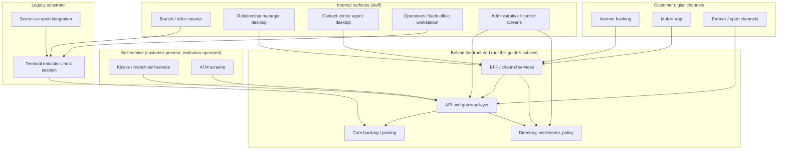

# Front-end IT in Banking: A Comprehensive Guide

**The banking front-end estate — internal and customer surfaces, the emulator-and-screen-scrape substrate, modernisation paths, accessibility, front-end security, and the case for reading the front end as a control surface rather than a presentation layer**

> **Author:** Jack Liu Shurui — Solution Architect at Cymbal Bank, Singapore  
> **Context:** Banking Architecture / Channel Technology — the banking front-end estate, internal and customer surfaces, the host-facing legacy substrate, modernisation paths, accessibility, front-end security, the front end as a control surface, testing, release and delivery  
> **Repository:** [github.com/jackliusr/research](https://github.com/jackliusr/research)  
> **Last Updated:** September 2026

---

## Table of Contents
1. [The Decoder: Three Meanings, One Guide](#1-the-decoder-three-meanings-one-guide)
   - 1.1 [The Homonym, Resolved First](#11-the-homonym-resolved-first) · 1.2 [What This Guide Owns — and What It Explicitly Does Not](#12-what-this-guide-owns--and-what-it-explicitly-does-not) · 1.3 [The Thesis in One Page](#13-the-thesis-in-one-page) · 1.4 [The Vocabulary Decoder](#14-the-vocabulary-decoder) · 1.5 [The Boundary, Declared by Name](#15-the-boundary-declared-by-name)
2. [The Estate: The Surfaces a Bank Actually Runs](#2-the-estate-the-surfaces-a-bank-actually-runs)
   - 2.1 [The Map of the Estate](#21-the-map-of-the-estate) · 2.2 [The Branch / Teller Counter Application](#22-the-branch--teller-counter-application) · 2.3 [The Relationship-Manager Desktop](#23-the-relationship-manager-desktop) · 2.4 [The Contact-Centre Agent Desktop](#24-the-contact-centre-agent-desktop) · 2.5 [The Operations and Back-Office Workstation](#25-the-operations-and-back-office-workstation) · 2.6 [The Administrative and Control Screens](#26-the-administrative-and-control-screens) · 2.7 [The Cost-of-Failure Table](#27-the-cost-of-failure-table) · 2.8 [Self-Service and Customer Surfaces — the Level of Distinction](#28-self-service-and-customer-surfaces--the-level-of-distinction)
3. [Why a Bank Front End Is Not an Ordinary Web Application](#3-why-a-bank-front-end-is-not-an-ordinary-web-application)
   - 3.1 [Entitlement: Who May See What](#31-entitlement-who-may-see-what) · 3.2 [Segregation of Duties Lands on the Screen](#32-segregation-of-duties-lands-on-the-screen) · 3.3 [The Evidence Obligation](#33-the-evidence-obligation) · 3.4 [Disclosure the Regulator Requires to Be Seen](#34-disclosure-the-regulator-requires-to-be-seen) · 3.5 [The Device and Browser Estate](#35-the-device-and-browser-estate) · 3.6 [The Branch Network Dependency](#36-the-branch-network-dependency) · 3.7 [Availability: Two Different Classes of Outage](#37-availability-two-different-classes-of-outage)
4. [The Legacy Substrate: The Emulator and the Host Session](#4-the-legacy-substrate-the-emulator-and-the-host-session)
   - 4.1 [What 3270 Actually Is](#41-what-3270-actually-is) · 4.2 [What 5250 Actually Is](#42-what-5250-actually-is) · 4.3 [What a Terminal Emulator Does](#43-what-a-terminal-emulator-does) · 4.4 [Screen Scraping at the Level of Mechanism](#44-screen-scraping-at-the-level-of-mechanism) · 4.5 [Why It Persists](#45-why-it-persists) · 4.6 [What It Constrains](#46-what-it-constrains) · 4.7 [What It Silently Breaks](#47-what-it-silently-breaks)
5. [The Modernisation Paths, With Trade-Offs](#5-the-modernisation-paths-with-trade-offs)
   - 5.1 [Path 1 — The Web Wrapper Over the Emulator](#51-path-1--the-web-wrapper-over-the-emulator) · 5.2 [Path 2 — API-Enable the Core](#52-path-2--api-enable-the-core) · 5.3 [Path 3 — The Strangler Pattern Applied to Screens](#53-path-3--the-strangler-pattern-applied-to-screens) · 5.4 [Path 4 — The Micro-Frontend Route](#54-path-4--the-micro-frontend-route) · 5.5 [Path 5 — Parallel Run or Digital Twin](#55-path-5--parallel-run-or-digital-twin) · 5.6 [The Binding Constraint](#56-the-binding-constraint)
6. [The Channel Architecture: BFF, Gateway, Session and Consistency](#6-the-channel-architecture-bff-gateway-session-and-consistency)
   - 6.1 [The BFF Pattern, Attributed to Its Originator](#61-the-bff-pattern-attributed-to-its-originator) · 6.2 [The Gateway and API Layer as a Dependency](#62-the-gateway-and-api-layer-as-a-dependency) · 6.3 [Session and State Placement](#63-session-and-state-placement) · 6.4 [The Consistency Problem](#64-the-consistency-problem) · 6.5 [The Release-Cadence Asymmetry](#65-the-release-cadence-asymmetry)
7. [The Customer-Channel Layer, Briefly](#7-the-customer-channel-layer-briefly)
   - 7.1 [The Technology Shapes, at the Level Needed](#71-the-technology-shapes-at-the-level-needed) · 7.2 [The App-Store Release Constraint](#72-the-app-store-release-constraint) · 7.3 [What Is Owned Elsewhere](#73-what-is-owned-elsewhere)
8. [Accessibility, Verified](#8-accessibility-verified)
   - 8.1 [The Specification, From Source](#81-the-specification-from-source) · 8.2 [The Statutory Obligations, Instrument by Instrument](#82-the-statutory-obligations-instrument-by-instrument) · 8.3 [The Banking-Specific Stake](#83-the-banking-specific-stake) · 8.4 [Why Bank Front Ends Commonly Fall Short](#84-why-bank-front-ends-commonly-fall-short) · 8.5 [Accessibility and the Internal Estate](#85-accessibility-and-the-internal-estate)
9. [The Front-End Security Surface](#9-the-front-end-security-surface)
   - 9.1 [The Rendering-Layer Threat Classes](#91-the-rendering-layer-threat-classes) · 9.2 [Content-Security Policy](#92-content-security-policy) · 9.3 [Framing and Clickjacking Protection](#93-framing-and-clickjacking-protection) · 9.4 [The Token-Storage Question: a Trade-Off, Not a Verdict](#94-the-token-storage-question-a-trade-off-not-a-verdict) · 9.5 [Client-Side Trust of Values That Decide Money](#95-client-side-trust-of-values-that-decide-money)
10. [The Front End as a Control Surface](#10-the-front-end-as-a-control-surface)
   - 10.1 [The Thesis, Stated as a Design Principle](#101-the-thesis-stated-as-a-design-principle) · 10.2 [How the Controls Appear to the User](#102-how-the-controls-appear-to-the-user) · 10.3 [Why a UI-Only Control Is Not a Control](#103-why-a-ui-only-control-is-not-a-control) · 10.4 [The Classic Failure Shape](#104-the-classic-failure-shape) · 10.5 [Session Recording: What It Proves and What It Does Not](#105-session-recording-what-it-proves-and-what-it-does-not) · 10.6 [The Design Consequences](#106-the-design-consequences)
11. [The Testing and Regression Discipline](#11-the-testing-and-regression-discipline)
   - 11.1 [The Test Pyramid Applied to a Screen Estate](#111-the-test-pyramid-applied-to-a-screen-estate) · 11.2 [The Browser and Device Matrix](#112-the-browser-and-device-matrix) · 11.3 [Screen-Level and Visual Regression](#113-screen-level-and-visual-regression) · 11.4 [The Test-Data Problem in a Regulated Environment](#114-the-test-data-problem-in-a-regulated-environment) · 11.5 [What Actually Catches a Regression Before the Branch Does](#115-what-actually-catches-a-regression-before-the-branch-does)
12. [The Release and Rollout Discipline for the Estate](#12-the-release-and-rollout-discipline-for-the-estate)
   - 12.1 [Feature Flags and the Contract With the Estate](#121-feature-flags-and-the-contract-with-the-estate) · 12.2 [Canary and Phased Rollout](#122-canary-and-phased-rollout) · 12.3 [The Branch and Kiosk Fleet Problem](#123-the-branch-and-kiosk-fleet-problem) · 12.4 [Training and Cut-Over for Internal Users](#124-training-and-cut-over-for-internal-users) · 12.5 [Rollback in a Stateful UI](#125-rollback-in-a-stateful-ui) · 12.6 [Releasing to Customers vs Releasing to Staff](#126-releasing-to-customers-vs-releasing-to-staff)
13. [The Delivery Model and the Org Question](#13-the-delivery-model-and-the-org-question)
   - 13.1 [The Platform-Versus-Product Team Split](#131-the-platform-versus-product-team-split) · 13.2 [The Design System as a Governance Artefact](#132-the-design-system-as-a-governance-artefact) · 13.3 [The Vendor's Own Front End](#133-the-vendors-own-front-end) · 13.4 [Build Versus Buy, Without a Recommendation](#134-build-versus-buy-without-a-recommendation)
14. [The Cymbal Bank Worked Example](#14-the-cymbal-bank-worked-example)
   - 14.1 [The Situation](#141-the-situation) · 14.2 [The Estate Constraint](#142-the-estate-constraint) · 14.3 [The Legacy Substrate in the Way](#143-the-legacy-substrate-in-the-way) · 14.4 [The Finding That Matters](#144-the-finding-that-matters) · 14.5 [The Remediation](#145-the-remediation) · 14.6 [The Accessibility Obligation](#146-the-accessibility-obligation) · 14.7 [The Decision](#147-the-decision)
15. [The Anti-Patterns](#15-the-anti-patterns)
16. [Claims Audit, What Could Not Be Verified, Glossary and Close](#16-claims-audit-what-could-not-be-verified-glossary-and-close)
   - 16.1 [Claims Audit](#161-claims-audit) · 16.2 [What Could Not Be Verified](#162-what-could-not-be-verified) · 16.3 [The Glossary](#163-the-glossary) · 16.4 [Cross-References and Further Reading](#164-cross-references-and-further-reading) · 16.5 [The Closing Summary](#165-the-closing-summary)

---

## 1. The Decoder: Three Meanings, One Guide

### 1.1 The Homonym, Resolved First

"Front-end" means three different things in banking, and the word is used for all three in the same meeting. Before anything else can be said, the meanings have to be separated — because two of them are already owned by other guides in this repository, and treating them as this guide's subject would be a duplicate, not a contribution.

| # | The meaning | What it is | Where it is owned |
|---|---|---|---|
| (i) | **Front end as UI technology** | Single-page applications, micro-frontends, component frameworks, bundlers, the browser toolchain | [Micro-Frontend Architecture](../technology/micro_frontend_architecture_guide.md) (its §7 "Banking and Enterprise Context" — §7.1 banking use cases, §7.2 banking considerations, §7.3 strangler migration — and its §8 Decision Framework), plus [Vue 2 vs Vue 3](../technology/vue_2_vs_vue_3_guide.md) and [JavaScript/TypeScript Bundlers](../technology/javascript_typescript_bundlers_guide.md) for the framework and toolchain layer |
| (ii) | **"Front-end only" as a business model** | A licence-light institution riding a partner's balance sheet, charter and rails — a thin model, not a technology stack | [Full-Stack Banking](full_stack_banking_guide.md), whose §1.3 is literally "The Thin Models: Bank-Partner, BaaS, Front-End Only" |
| (iii) | **The banking front-end estate** | The surfaces a bank actually runs — internal and customer — and the control, audit, accessibility and legacy-integration realities that come with them | **This guide** |

**This guide is about (iii) and neither (i) nor (ii).** That is not a stylistic preference; it is the whole content of the subject. A bank does not have "a front end." It has a *front-end estate*: a branch and teller counter application used by thousands of staff, a relationship-manager desktop, a contact-centre agent desktop, operations and back-office workstations, administrative and control screens, kiosks and ATM screens, customer digital channels — and, silently underneath most of them, an emulated host session that dates to the era of the physical terminal.

### 1.2 What This Guide Owns — and What It Explicitly Does Not

**This guide owns:**
- The **surfaces** — what a bank's internal front ends are, who uses each, what each depends on, and what each one's failure costs.
- The **legacy substrate** — the terminal emulator, the host session, and screen scraping as a *host-integration technique* (not as a platform history; the platform is owned by [IBM AS/400](../technology/ibm_as400_guide.md), and the general pattern family by [Legacy Integration Patterns](../technology/legacy_integration_patterns_guide.md)).
- The **modernisation options as options** — five realistic routes, each with what it costs, what it risks, what it fixes and what it does not.
- **Accessibility** as a verified obligation with a banking-specific stake.
- The **front-end security surface** at the rendering layer — XSS classes, CSP, framing, and the token-storage trade-off.
- The **front end as a control surface** — the thesis, and the most valuable section of the guide.
- **Testing, release and rollout** under the estate's real constraint: a bank cannot update several hundred branches the way a SaaS product updates a website.
- The **delivery model** — platform versus product teams, the design system as a governance artefact, and build-versus-buy without a recommendation.

**This guide explicitly does not own:** micro-frontend architecture or the framework/toolchain comparison (§1.1(i)); the front-end-only business model (§1.1(ii)); the core banking system or the posting path ([Core Banking Systems](core_banking_systems_guide.md), [Posting Engine](../banking/posting_engine_core_banking_guide.md)); general legacy integration patterns ([Legacy Integration Patterns](../technology/legacy_integration_patterns_guide.md)); the API and gateway layers ([API Governance](../technology/api_governance_guide.md), [Enterprise AI Gateway](../technology/enterprise_ai_gateway_guide.md)); branch connectivity ([VPN](../technology/vpn_guide.md)); and general application security ([Security by Design](../technology/security_by_design_guide.md), [Cybersecurity](../technology/cybersecurity_guide.md), [Distributed Auth](../technology/distributed_auth_guide.md)).

### 1.3 The Thesis in One Page

**A bank's front end is a control surface, not a presentation layer.**
Start from what the front end is *for*, in a bank specifically. The core system is the accounting system of record — [Core Banking Systems](core_banking_systems_guide.md) §2 states the boundary plainly: "Channels are presentation layers over the core; they never own balances or postings" ✅. That sentence is correct **about ownership of balances**. It is precisely the sentence that invites the error this guide exists to prevent, because it describes where *value* is held and says nothing about where *authority* is exercised.
Everything that decides who may do what to an account arrives at the institution through a screen. Entitlement is materialised as which fields are enabled and which screens a user can reach. Segregation of duties is materialised as which buttons a given role sees. Maker-checker (also called four-eyes, dual control) is materialised as a two-person workflow that one person initiates on one screen and another releases on another. The audit trail is materialised as the button that was pressed, by whom, at what time, against which record. Regulatory disclosure is materialised as the text that has to appear before a customer can be bound by a product. **The front end is where entitlement, segregation of duties, maker-checker, the audit trail and disclosure meet the human being.**
And then the consequence, which is the reason this guide exists:

> **A control implemented only in the user interface is not a control. The interface is not the enforcement point.**

The mechanism is mundane and total. A user interface is software running on a machine the institution does not control, speaking to a server over a network, in a protocol that anyone with a valid session and a command-line client can speak directly. A rule expressed as *the button is hidden*, *the field is read-only*, *the screen requires an approver* is a rule about **rendering**. The same action exists as a request. If the server does not re-derive permission from the caller's identity and entitlement when the request arrives, then the interface rule was *decoration* — a user-experience affordance that happened to correlate with the intended control in the ordinary case, and vanished in the first case that was not ordinary.
The classic failure shape has a name in this guide, and it is the shape auditors and attackers recognise instantly:

> **The screen prevented the action, and the API allowed it.**

This is not a hypothetical style of defect. [OWASP Top 10:2025](https://top10.owasp.org/2025/A01_2025-Broken_Access_Control/) ranks **A01:2025 Broken Access Control** first, reports that 100% of the applications tested were found to have some form of broken access control ✅, and states the rule directly: "Access control is only effective when implemented in trusted server-side code or serverless APIs, where the attacker cannot modify the access control check or metadata" ✅. Its own third example attack scenario is exactly the failure shape above — "An application puts all of their access control in their front-end. While the attacker cannot get to `https://example.com/app/admin_getappInfo` due to JavaScript code running in the browser, they can simply execute: `$ curl https://example.com/app/admin_getappInfo` from the command line" ✅.
So the design principle, with its rationale attached:

> **Principle.** Every control that matters must be enforced by the server, on the caller's authenticated identity and current entitlement, at the moment of the request. The user interface may *anticipate* the control — by hiding, disabling, warning, requiring a second approver's credential or a second session — but the interface's rendering is never the thing that makes the control true. **Rationale.** The interface is a client. Clients are untrusted by definition, are rewritable by the user, and are bypassable by anyone who can send a request. A control whose enforcement point is the client is enforced only against users who choose to use that client.

This is a design principle, not an accusation. It says nothing about any institution or any person. Every organisation that has ever shipped a rich web application at speed has written an interface-level rule where a server-side one belonged; the point is that in a bank the difference is not a code-quality issue but a control-design issue, and it belongs in the architecture review rather than in the defect backlog.

### 1.4 The Vocabulary Decoder

The estate has its own words, and the words do not mean what they mean elsewhere.

| Term | What it means here |
|---|---|
| **Teller / counter application** | The branch staff workstation for cash and counter transactions at a position facing a customer. Cash-handling, deposit and withdrawal capture, instrument processing, and the branch's own end-of-day balancing. |
| **Relationship-manager desktop** | The staff front end for a portfolio: customer 360, relationship and holdings views, product origination, pricing and exception handling, and the pipeline of applications in progress. |
| **Agent desktop** | The contact-centre workstation: a service front end plus telephony/contact-routing integration, a case or interaction record, and the history needed to answer "what happened on this account" in one screen. |
| **Operations / back-office workstation** | The non-customer-facing processing front end: payment repair and release, exception queues, reconciliation breaks, static-data maintenance, document and instruction handling. |
| **Administrative / control screen** | The front end for administering the estate itself — users, roles and entitlements, limits and parameters, product configuration, branch and device configuration, approval hierarchies. This is the screen class where the *control* nature of the front end is most visible. |
| **Terminal emulator** | A program that speaks a host terminal data stream over a network transport, instead of requiring a physical terminal — for the 3270 family over TN3270, for the 5250 family over TN5250. |
| **Host session** | The live logical connection between the emulator and a host application's screen interface: one terminal identity, one screen, one conversation, driven by an attention identifier (AID) key that hands control back to the host. |
| **Screen scrape** | A program driving that emulated screen on the user's or the integrator's behalf — positioning the cursor, filling fields, sending an AID key, and parsing the returned character-cell buffer — because the host offers no callable API for the function. |
| **Channel** | A customer-facing or staff-facing route to the bank's services (branch, contact centre, ATM, internet, mobile, partner API). In the accounting sense, a channel consumes the core and does not own balances. |
| **BFF (Backend-for-Frontend)** | A backend component owned by the front-end team, per client experience, that aggregates and shapes server data for that experience — named and described by Phil Calçado (§6.1). |
| **Entitlement** | The positive permission, held by the server, that a given identity may perform a given action on a given object. Distinguished from *authentication* (who you are), *role* (what class you belong to) and *visibility* (what the screen chose to show). |
| **Maker-checker step (four-eyes, dual control)** | A control in which the act of one person is not effective until a different, appropriately entitled person has reviewed and released it. |

### 1.5 The Boundary, Declared by Name

This guide cross-references by name; it does not re-derive its neighbours.
- **[Micro-Frontend Architecture](../technology/micro_frontend_architecture_guide.md)** — owns micro-frontend architecture, integration patterns, and the framework/tooling layer (with [Vue 2 vs Vue 3](../technology/vue_2_vs_vue_3_guide.md) and [JavaScript/TypeScript Bundlers](../technology/javascript_typescript_bundlers_guide.md)). Its §7 already treats the banking context, including CSP, XSS and accessibility notes, and §7.3 the strangler migration. This guide refers to it once, in §5.4, and does not re-derive it.
- **[Full-Stack Banking](full_stack_banking_guide.md)** — owns the front-end-only *business model*. This guide's §1.1(ii) points there and goes no further.
- **[Core Banking Systems](core_banking_systems_guide.md)** and **[Posting Engine](../banking/posting_engine_core_banking_guide.md)** — own the core system and the posting path. This guide is about what sits *in front of* them.
- **[Legacy Integration Patterns](../technology/legacy_integration_patterns_guide.md)** — owns legacy integration patterns in general (its §6 legacy patterns, its §7 modernization patterns, the anti-corruption layer). This guide owns the *front-end-specific* form: the emulator and the screen-scraped host session.
- **[API Governance](../technology/api_governance_guide.md)** and **[Enterprise AI Gateway](../technology/enterprise_ai_gateway_guide.md)** — own the API and gateway layer. For this guide, that layer is a **dependency** of the front end, not the subject.
- **[VPN](../technology/vpn_guide.md)** — already carries the branch-estate network angle (its §8, "The Banking Context — the Cymbal Bank Estate"). §3.6 cross-references it for branch connectivity and does not re-derive it.
- **The security cluster** — [Security by Design](../technology/security_by_design_guide.md), [Cybersecurity](../technology/cybersecurity_guide.md), [Distributed Auth](../technology/distributed_auth_guide.md) (RBAC/ABAC, policy engines, teller/approver/auditor roles). §9 cross-references these rather than re-deriving general application security.
- **[IBM AS/400](../technology/ibm_as400_guide.md)** — already describes the 5250 green screen, TN5250 and the fact that for decades the only way to "call" an AS/400 program from outside was to drive its 5250 screens or exchange files. §4 cross-references it rather than re-describing the platform.
- **[FAPI / Financial-Grade API](fapi_financial_grade_api_guide.md)** — carries the verified FAPI position on screen scraping as the practice the standard was built to displace. §4.5 quotes it rather than re-sourcing it.

**How to read this guide.** §2 is the identity of the guide: if you read one section, read that one. §10 is the argument: if you are reviewing or building a banking front end, read §10 and §15. §4 and §5 are the legacy-and-modernisation pair. §8 and §9 are the verifiable external obligations. §14 is the worked example that ties them together.

## 2. The Estate: The Surfaces a Bank Actually Runs

### 2.1 The Map of the Estate

The estate is not one application. It is a population of applications with different users, different dependencies, different change rates and — critically — **different failure costs**. Drawing the population is the precondition for talking about any of it sensibly.

Read the diagram for its asymmetries rather than its boxes. The left column holds the applications the institution's own staff cannot do their jobs without. The middle column holds surfaces the institution operates but a customer drives. The bottom row holds the layer that most of the estate is still, in part, flowing through. And the subgraph marked "not this guide's subject" is where the *enforcement* lives — which is exactly the point of §10.

### 2.2 The Branch / Teller Counter Application

| Attribute | Detail |
|---|---|
| **Who uses it** | Branch tellers and customer-service staff at a position facing a customer, under supervision, at a counter. Sessions are shared across shifts at the same physical position, which makes session lifecycle a real design constraint rather than a detail. |
| **What it does** | Cash and counter transactions (deposits, withdrawals, transfers between the customer's own accounts, instrument and cheque handling, fee and charge capture), customer identification and verification steps, balance and transaction enquiry, hold and stop actions, and the branch's own balancing and end-of-day reconciliation. ⚠ Industry-standard capability set; the specific composition varies by institution. |
| **What it depends on** | The core system through the host-facing integration layer (§4); the entitlement and limits service; the branch's local peripherals (cash dispenser, passbook or statement printer, scanner, signature pad, card reader); the branch's network path (§3.6); the branch's own cash and GL accounting, which the branch's figures feed. |
| **What its failure costs** | **A teller screen that is down stops a branch.** This is the sentence to hold on to. When the counter application is unavailable, the branch cannot take a deposit, cannot pay out cash, cannot verify a balance, cannot price or waive a fee, cannot complete the customer's errand. Customers are standing in the room. Recovery is not "the page is back" but a queue of physically present transactions and a manual fallback procedure with its own control weaknesses. |

Two properties distinguish this surface from every customer-facing channel and shape everything in §11 and §12. First, **the outage is physical and immediate** — the customer is in front of the staff member, so there is no graceful degradation, only a decision about what to do by hand. Second, **the change management is human** — a change to the counter application has to be taught to branch staff before it can be used, which is why §12 treats training as part of the release rather than a follow-up.

### 2.3 The Relationship-Manager Desktop

| Attribute | Detail |
|---|---|
| **Who uses it** | Relationship managers, private bankers, and the product and credit specialists supporting a portfolio. Typically the *lowest-volume, highest-value* per-interaction front end in the estate. |
| **What it does** | A consolidated customer view across accounts, holdings, facilities and interactions; portfolio and pipeline management; product origination and application capture; pricing, waiver and exception handling; document and instruction tracking; and the preparation material for a customer meeting. ⚠ Industry-standard capability set; composition varies. |
| **What it depends on** | Multiple back ends rather than one — core for accounts and balances, a customer or party master for the entity view, a credit or lending system, a CRM or interaction system, pricing and product configuration, and a document store. It is therefore the surface where the aggregation problem is hardest (§6), and the surface most likely to be the first one built as a BFF-backed experience rather than a host-screen front end. |
| **What its failure costs** | Less catastrophic per minute than the teller counter, and more expensive per hour. A relationship manager who cannot see the portfolio cannot prepare, cannot price, cannot progress an application, and cannot answer a customer's question in the meeting — work that is *deferred* rather than stopped. The cost is expressed in lost or delayed revenue, in rework, and in the erosion of the "one view of the customer" promise that the desktop exists to deliver. |

### 2.4 The Contact-Centre Agent Desktop

| Attribute | Detail |
|---|---|
| **Who uses it** | Contact-centre agents handling inbound and outbound customer contact, across voice and increasingly across chat and messaging. Staffed in shifts, measured against handling time, and supervised by team leaders with real-time visibility. |
| **What it does** | Customer identification and verification; account and transaction enquiry; servicing actions within the agent's entitlement (block a card, stop a payment, raise a dispute, change static details, order a replacement); complaints and case capture; and the interaction history that lets an agent avoid asking the customer the same question twice. ⚠ Industry-standard capability set. |
| **What it depends on** | The customer and account enquiry path; the servicing-action APIs and their entitlement checks; the case or interaction management system; **and the telephony and contact-routing platform**, which is what makes this surface architecturally distinct. The agent desktop's availability is coupled to the routing platform: if the desktop is down, calls cannot be handled with context even if the phone system is up. |
| **What its failure costs** | **The queue grows in real time and cannot be recovered.** Contact-centre demand is exogenous — the calls arrive whether or not the system works. An outage converts a working queue into a backlog of abandoned calls, repeated contacts and customers who escalate the next time they reach anyone. It is also the surface where an outage becomes *reputational* fastest, because the customer is in direct conversation with the institution while it fails. |

### 2.5 The Operations and Back-Office Workstation

| Attribute | Detail |
|---|---|
| **Who uses it** | Operations and processing staff: payment operations, securities operations, reconciliation, static data, documentary and instruction handling, exceptions and investigations. Not customer-facing, though frequently customer-affecting. |
| **What it does** | Queue-based exception and repair processing (a payment that failed a validation, a message that could not be matched, a break that must be investigated); release of items within a limit; reconciliation and investigation workflow; reference data maintenance; bulk instruction handling; and the release of work that a maker-checker control has parked for a second pair of eyes. ⚠ Industry-standard capability set. |
| **What it depends on** | The work-queue and case management layer; the payment, settlement or securities back end the work belongs to; the entitlement and limit service; and — for the classes of action that clear through it — the maker-checker mechanism itself, which means this surface is often the *second half* of a control whose first half is a screen in another team's application. |
| **What its failure costs** | Measured in **cut-off risk rather than customer minutes**. Operations work is bound to external schedules (payment cut-offs, settlement windows, clearing cycles). An unavailable workstation does not merely delay the work; it can push it past a cut-off, at which point the failure converts into a settlement or customer-impacting event with a financial consequence. The asymmetry that matters: an operations outage is often invisible to customers at the moment it happens and visible to them later. |

### 2.6 The Administrative and Control Screens

| Attribute | Detail |
|---|---|
| **Who uses it** | A small population of administrators and control staff, plus — with narrower access — approvers, reviewers, internal audit and, in a supervised institution, the functions that must demonstrate the state of the control environment to a regulator or auditor. |
| **What it does** | Administration of users, roles and entitlements; limits and parameter maintenance; product and pricing configuration; approval hierarchy definition; branch, device and channel configuration; and the screens by which the institution can *show* what a given user could and could not do at a point in time. ⚠ Industry-standard capability set. **Vendor-specific implementations of these screens exist and are described in each vendor's own documentation; this guide makes no product claim.** |
| **What it depends on** | The identity, entitlement and policy layer most directly — this is the front end with the *shortest path to the enforcement point*, since changing an entitlement here changes what every other surface will permit (§3.1). It is also the surface with the highest concentration of privileged actions, and therefore the one where §10's principle is least negotiable. |
| **What its failure costs** | Usually nothing in the customer's day and everything in the institution's control over its own estate. If entitlement administration is unavailable, the institution cannot onboard or offboard staff correctly, cannot adjust a limit when a risk decision requires it, and may have to choose between delaying a business change and making a control change through a weaker path. **The failure mode to design against is the workaround**: a control screen that is inconvenient is a control screen that gets bypassed, and the bypass outlives the outage. |

### 2.7 The Cost-of-Failure Table

This is the table to bring to a discussion about where to spend front-end engineering effort, because it is the one that shows the surfaces do not share a risk profile.

| Surface | Who it stops | Nature of the outage | Recoverability | Change cadence |
|---|---|---|---|---|
| Branch / teller counter | Branch staff; customers physically present | Immediate, physical, visible | Recovering the queue of real-world transactions; manual fallback with its own weaknesses | Slow — training-bound (§12.4) |
| Relationship-manager desktop | Portfolio staff; origination work | Deferred work and lost revenue, not stopped service | Work resumes; the meeting already happened | Moderate |
| Contact-centre agent desktop | Agents; inbound customer contact | Immediate, external demand keeps arriving | Queue grows irrecoverably; abandoned contacts | Moderate |
| Operations workstation | Processing staff; downstream settlement | Silent at the moment, financially consequential at cut-off | Depends on the cut-off; some items cannot be recovered, only corrected | Moderate |
| Administrative / control screens | Control and administration staff | Slows control change; invites workarounds | Workarounds persist after recovery | Slow, and should be |
| Kiosks / ATM | Customers, unassisted | Immediate, distributed across sites, no staff to compensate | Site-by-site; often needs a visit | Very slow — fleet-bound (§12.3) |
| Customer digital channels | Customers, unassisted | Immediate, at scale, publicly visible | Retry is cheap for the customer; reputation is not | Fast, except installed mobile clients (§7.2) |

### 2.8 Self-Service and Customer Surfaces — the Level of Distinction

This guide holds the non-internal surfaces at the level needed to *distinguish* them from the internal estate, and no deeper. Three distinctions carry all the weight.

**First: no staff member is present to compensate for the software.** A teller counter with a slow screen has a human who can explain, reassure and work around. An ATM or kiosk with a slow screen has a queue and a customer with no information. The design and resilience requirements differ in kind, not degree — and accessibility obligations attach to these surfaces differently too, because a self-service terminal is a machine a customer cannot choose to avoid (§8.5). The US Access Board's own definitional structure captures the same idea: under the Revised Section 508 Standards, "Closed Functionality" is defined as characteristics that "limit functionality or prevent a user from attaching or installing assistive technology. Examples of ICT with closed functionality are self-service machines, information kiosks, set-top boxes, fax machines, calculators, and computers that are locked down" ✅ ([Access Board, ICT standards](https://www.access-board.gov/ict/)). The category is real and the regulator named it.

**Second: the operational cost model is fleet-shaped.** A branch application changes when it is deployed and staff are trained; a kiosk or ATM fleet changes when every site has been visited, either through remote distribution that must actually reach all sites or through physical attendance. This is the single biggest constraint on release engineering in the estate and is treated in §12.3.

**Third: the customer digital channels are where the modernisation energy has already gone.** Internet banking, the mobile app and partner-facing APIs are the surfaces most likely to be genuinely modern, API-backed and continuously delivered — and therefore the surfaces whose *differences* from the internal estate are the most instructive, because they show what the internal estate is not. The technology shapes are held at the level of distinction in §7 and are owned by [Micro-Frontend Architecture](../technology/micro_frontend_architecture_guide.md) and its framework companions.

**What this guide does not do for these surfaces:** it does not assert market size, adoption, uptime, transaction volume or cost figures for any of them. No such figure is included anywhere in this guide, because none was verified to a named source with a date and a methodology in this pass (see §16.2).

## 3. Why a Bank Front End Is Not an Ordinary Web Application

A web application, in the ordinary sense, sits behind a design system, a product backlog and an uptime target. A bank front end sits behind all three *and* behind an entitlement model, a segregation-of-duties model, a supervisory evidence obligation, a disclosure obligation, a constrained device estate, a network dependency, and two qualitatively different definitions of "down." This section takes those six in turn.

### 3.1 Entitlement: Who May See What

Two staff members looking at the *same screen* are frequently looking at different permitted actions. The screen must express that difference, and the difference must not be *created* by the screen.
The distinction that matters is between four things the estate usually conflates:
- **Authentication** — establishing who the caller is.
- **Role** — the class the caller belongs to (teller, approver, auditor, operations officer).
- **Entitlement** — the specific positive permission that this identity may perform this action on this object, now.
- **Visibility** — what a particular front end chose to render.

Visibility is a *presentation* of entitlement; it is not entitlement. A screen that hides a "release payment" button from a user without the release entitlement has done something useful — it has reduced the chance of an accidental attempt and reduced the confusion of an authorised-but-unusable action — but it has not made the user unable to release payments. That property belongs to the server that receives the release request.
This is also where the front end's *own* hardest problem lives: entitlement is not a static list of screens. It carries **limits** (this user may release up to this amount), **object scope** (this user's entitlement applies to this branch, this portfolio or this product line), **state** (the user may act only while the item is in the pending-approval state), and **time** (the entitlement is effective from and until given dates). A front end that reduces all four to "is the button visible" has already lost the argument, because the *rule* then has no home except the screen. [Distributed Auth](../technology/distributed_auth_guide.md) owns the identity-side machinery — RBAC and ABAC, policy engines, and the teller/approver/auditor role model — and this guide cross-references it rather than re-deriving it.

### 3.2 Segregation of Duties Lands on the Screen

Segregation of duties is an organisational control that has to become a software behaviour, and the place it becomes visible is the screen. Three of its forms recur the estate over:
- **Maker-checker / four-eyes / dual control.** One person initiates; a different, sufficiently entitled person reviews and releases. On the screen this looks like a button that puts an item into a pending state, and a queue on someone else's screen where it can be released, rejected or returned. The control only holds if the server *refuses* the same identity from both initiating and releasing, refuses self-approval, and refuses a release from a user whose entitlement or limit does not cover the item.
- **Dual control over an action** (as distinct from over a record). Two people must be present for the action itself — the classical cash-vault form, which in the digital estate becomes a screen that requires a second authenticated credential to proceed with the same transaction.
- **Function-based separation.** The same person may not, in the same period, both perform and verify a class of work. In the front end this appears as roles that cannot coexist for one identity, and as screens that become unavailable when a conflicting entitlement is added.

The architecture point is subtle and is the reason this section sits in *this* guide. These controls are frequently described in policy documents as approval *workflows*, and implemented as approval *screens*. But a screen can only ever *propose* the control: it can render a pending state, it can offer a release button to the right person, it can refuse to offer it to the wrong one. Whether the item is genuinely unreleased until the second person acts is a property of the state transition in the system of record — and the moment that system is reachable by a request that did not come from the screen, the screen's version of the control is a suggestion. §10 develops this into the design principle.

### 3.3 The Evidence Obligation

A bank must be able to reconstruct, after the fact, **who did what, when, to which record, under whose authority, and on what evidence.** That obligation lands partly on the front end, because the front end is where the human act happens.
What must be reconstructable, at minimum:
- The identity that acted, and the authentication strength at the time of the act.
- The action taken, against the specific object, at a specific time, from a specific route (which channel, which terminal identity, which workstation).
- The before and after state of anything the action changed.
- For a controlled action: the initiator, the approver, the fact that they were different identities, and the entitlement or limit each held at the moment of acting.
- Whatever the actor was shown, where the disclosure of information is itself part of the obligation (§3.4).

The front end's contribution is that it is the *attribution point*. A workstation or a terminal identity is a durable fact about where an action originated, which is why the estate still cares about which physical position a session ran on, and why session lifecycle on a shared counter terminal (§2.2) is a control question and not just a usability one.

### 3.4 Disclosure the Regulator Requires to Be Seen

Some obligations are not about what the system does but about what the customer was *shown* — the disclosure that must be presented before a product is sold, the terms that must be acknowledged, the warning that must accompany a specific class of transaction. In the front end these become rendered text with a timestamped acknowledgement, and they inherit the front end's problems: the text has to be the right version, has to be actually presented (not merely present in the response and hidden), has to be acknowledged by the customer and not only by the staff member operating the screen, and has to be retrievable as evidence later. The jurisdiction-specific content of these obligations is outside this guide's source scope and is not asserted here; this guide states only the architectural consequence — **disclosure is a front-end behaviour with an evidence requirement attached, and therefore a control, not copy.**

### 3.5 The Device and Browser Estate

The internal estate does not run on the developer's laptop. It runs on the machines the institution actually bought and manages, contracted to whatever the institution's desktop standard happens to be. The practical consequences for anyone building or changing a front end:
- **The browser version is a managed decision, not a user's choice.** A feature that requires the newest engine is a feature that requires a desktop standard change, which is a project with its own approval path.
- **Client-side rendering has to fit the machine.** Rich front ends on commodity branch hardware compete with the rest of the workstation's load; a screen that is fast in a developer's environment can be unusable at a counter under a queue.
- **Peripherals are part of the front end.** Cash dispensers, printers, scanners, card readers and signature capture are integrated per workstation, and their drivers and interfaces are part of the compatibility surface that a front-end change can break.
- **Accessibility tooling has to be in the standard build.** If the screen-reader or magnification software that the institution's own staff use is not part of the desktop standard, the front end's accessibility is theoretical for the people who most need it.
- **The customer's device estate is unbounded**, and the customer channel's compatibility burden is therefore different in kind: it is a *support* burden (which devices are supported, and what happens on the ones that are not) rather than a *provisioning* burden. Both are real; they are not the same problem and should not be planned as one.

### 3.6 The Branch Network Dependency

None of the internal surfaces exist without connectivity from the site to the estate. This is the point where the front-end book and the network book touch: **the branch estate's connectivity — the tunnels, the topology, the fail-over, the branch-office design and the banking context — is owned by [VPN](../technology/vpn_guide.md), notably its §8.** This guide does not re-derive it and states only the front-end consequence: **a front-end availability commitment that assumes the network is available is a commitment the front end cannot keep on its own.**
The practical design question that follows is a *degradation* question, not an uptime question. When the branch's path to the estate is degraded, what should the teller screen do? Options in the estate include continuing to serve previously loaded data with an unmistakable staleness indicator, refusing to start new work, or falling back to a documented manual procedure — and each of those choices is a front-end design decision with a control consequence, because a screen showing stale balances is a screen on which a decision can be made using wrong numbers. The question "what does this screen do when it cannot reach the server" deserves an explicit answer in every branch-facing design review, and it is asked far less often than the question "what is the uptime target."

### 3.7 Availability: Two Different Classes of Outage

The single most useful framing in this guide for a non-architect audience is that **a customer-channel outage and an internal-channel outage are different classes of event, and the difference is not the number of users affected.**

| | Customer-channel outage | Internal-channel outage |
|---|---|---|
| Who experiences it | Customers, at scale, unassisted | Staff, who cannot do their job |
| Demand during the outage | Keeps arriving; customers retry or give up | Keeps arriving as customers stand in front of staff or calls queue |
| Immediate consequence | Inconvenience, delayed transaction, public visibility | **Service physically stops** (branch, contact centre) or work is pushed past an external cut-off (operations) |
| Ability to compensate | None — no staff present | A human can apologise, explain, and use a manual fallback |
| Recovery shape | Retry is cheap for the customer | Recovery is a queue of real-world transactions and a backlog of calls |
| The manual fallback | Does not exist | Exists — and is a control weakness that must itself be governed |
| Disclosure and evidence | The interruption may itself need to be visible to the customer | The manual fallback's records must still satisfy §3.3 |

The reason to state this bluntly is that it inverts a common assumption. A customer-facing website has more *users* than a branch application, so it often attracts the availability budget. But the branch application's outage **stops a revenue-generating, customer-present business process and forces it into a manual mode that the control environment then has to absorb**. Both classes deserve their availability commitment; they do not deserve the same one, and they should not be argued about with the same numbers.

## 4. The Legacy Substrate: The Emulator and the Host Session

Most of the estate described in §2 is, at some point in its call path, talking to a screen. Not a service — a *screen*: a grid of character cells, produced by a host application, transmitted as a data stream, and answered by a single keystroke that hands control back to the host. This section describes that substrate precisely, because imprecision here is where modernisation plans go wrong.
The general pattern family — the anti-corruption layer, the strangler, the whole catalogue of legacy integration styles — is owned by [Legacy Integration Patterns](../technology/legacy_integration_patterns_guide.md) (its §6 and §7). The IBM midrange platform that made the 5250 green screen the dominant interface of a generation is owned by [IBM AS/400](../technology/ibm_as400_guide.md) (its §5.7 describes the 5250 interface and the fact that for decades the only way to "call" an AS/400 program from outside was to drive its 5250 screens or exchange files). **This section owns only the front-end-specific form: the emulator, the host session, and the screen scrape.**

### 4.1 What 3270 Actually Is

**3270 is the IBM mainframe terminal family and its data stream.** It is worth being exact, because "3270" is used loosely to mean "the green screen," and the looseness hides the mechanism.
The 3270 data stream differs from ordinary terminal traffic in two structural ways, both stated in the IETF's own documentation of the practice: it is **block mode** and it uses **EBCDIC** rather than ASCII character representation ✅ ([RFC 1576, *TN3270 Current Practices*](https://www.rfc-editor.org/rfc/rfc1576.txt), Penner, DCA Inc., January 1994, Informational). "Block mode" is the whole architectural point: the terminal does not send each keystroke to the host. It accumulates the user's edits locally in editable fields and transmits a *block* when the user presses a key that ends the interaction. That key is an **AID (attention identifier)** key — Enter, a PF key, PA1/PA2/PA3, Clear, and the like — and pressing it is what hands control to the host, which responds by building and sending a new screen.
Other verified specifics worth keeping straight:
- "IBM terminals are generically referred to as 3270's which includes a broad range of terminals and devices, not all of which actually begin with the numbers 327x" ✅ (RFC 1576).
- Screen geometry is part of the terminal identity, not a rendering preference. The standard size is 24×80 characters, with alternate sizes for larger models: model −2 is 24×80, model −3 is 32×80, model −4 is 43×80, model −5 is 27×132 ✅ (RFC 1576). A screen designed for 24×80 does not simply "reflow" onto 27×132.
- The terminal type is negotiated with the server by name, in a form like `IBM-3278-2`; appending `-E` signifies capability for the extended data stream (structured fields, and in many implementations extended attributes) ✅ (RFC 1576).
- Two keys exist for reasons that only make sense in the original SNA networking context and are still visible on modern emulator keyboards: **SYSREQ** (which toggled between the application session and the system-services session on an SNA network) and **ATTN** (attention). Both are handled specially, and RFC 1576 is candid that they are "not universally supported" over the TCP/IP transport ✅.
- The authoritative description of the data stream itself is a vendor publication, not the IETF document: the *3270 Information Display System — Data Stream Programmer's Reference*, IBM publication GA23-0059, which RFC 1576 cites as the reference for "the 3270 datastream, SNA versus non-SNA operation, 3270 datastream commands, orders, structured fields and the like" ✅.

### 4.2 What 5250 Actually Is

**5250 is the IBM midrange terminal family and its data stream — the IBM i family, formerly AS/400, System/36 and System/38.** It is a *different* family from 3270, with a different data stream, a different set of work station types and a different AID-key vocabulary. Confusing the two is a common and consequential error: they are not interchangeable, and a tool that speaks one does not speak the other.
Verified specifics:
- The IETF's documentation of the 5250 telnet interface exists precisely so that "a person wanting to implement a client Telnet which emulates an IBM 5250 work station would be able to do so," and it explicitly does *not* re-describe the data stream, which "is contained in the IBM 5250 Information Display System, Functions Reference Manual, IBM publication number SA21-9247" ✅ ([RFC 1205, *5250 Telnet Interface*](https://www.rfc-editor.org/rfc/rfc1205.txt), Chmielewski, IBM Corporation, February 1991, Informational).
- Work station types are named and typed, with geometry and colour as properties: for example `IBM-5251-11` is a 24×80 monochrome display, `IBM-3179-2` is 24×80 colour, `IBM-3477-FC` is 27×132 colour ✅ (RFC 1205).
- The 5250 AID keys include keys this guide's readers will recognise from terminal emulator software: **ATTN** (attention), **SYSREQ** (system request), **TRQ** (test request) and **HLP** (help), each carried as a flag in the transport header ✅ (RFC 1205).
- The transport carries an opcode that describes what the client is being asked to do. The set includes **Save Screen**, **Restore Screen** and **Read Screen** — a detail that matters enormously for §4.4, because it means the *protocol itself* contemplates a client reading and restoring screen state ✅ (RFC 1205).
- The 5250 interface was designed to carry work over a network to midrange hosts: RFC 1205 describes the header as originally designed for the 5250 Display Station Pass-Through (DSPT) application, "an application similar to Telnet which runs on the IBM AS/400, System/36, and System/38 over an SNA network" ✅.

### 4.3 What a Terminal Emulator Does

**A terminal emulator is a program that speaks the terminal family's data stream over a network transport instead of requiring a physical terminal.** That is the whole definition, and it is worth stating in exactly those terms because emulators are frequently described as if they were screen-sharing or remote-desktop software. They are not. An emulator:
1. **Negotiates** a connection. For 3270 over TCP/IP, this is the de facto practice of negotiating three Telnet options — Terminal-Type, Binary Transmission, and End of Record — rather than the formally specified 3270 Regime option, which RFC 1576 notes "very few developers and vendors ever implemented" ✅. The negotiation then exchanges the terminal type by name.
2. **Maintains a character-cell buffer** that models the screen: the field structure the host defines, which fields are protected (display-only) and which are editable (input-capable), their lengths, and their attributes.
3. **Accepts local editing** in the editable fields, honouring the block-mode model — the host does not see the keystrokes, only the resulting block.
4. **Transmits the screen on an AID key**, and receives and renders the next screen the host builds in response.
5. **Presents the AID keys, the SYSREQ/ATTN keys and the function keys** as part of its own interface, so that a user trained on a physical terminal can operate it unchanged.

The transport is what "TN3270" and "TN5250" name: the terminal's data stream carried inside Telnet (RFC 1576 for 3270; RFC 1205 for 5250), on TCP/IP, instead of twinaxial cabling or an SNA network path. The consequence for the estate is that the *terminal identity* still exists on the network: a session presents itself with a terminal type and, in an SNA-shaped environment, a logical unit name; without SNA, RFC 1576 notes the closest thing to a device name is the client's IP address ✅. That is why the estate still speaks of a "terminal identity," why device-level configuration exists, and why the physical position a session ran on can be reconstructed for evidence purposes (§3.3).

### 4.4 Screen Scraping at the Level of Mechanism

**Screen scraping is a program driving an emulated screen on someone's behalf, because the host offers no callable interface for the function.** The word "scraping" describes the read; the technique is a full request/response dialogue. In mechanism terms it is a loop:
1. **Connect and authenticate** as a terminal identity, to the host application, typically through an emulator component running in a server process rather than on a desk.
2. **Navigate** — send AID keys to walk the host application's menu and transaction structure to the screen that contains the function you need. (In 5250 terms this is the command-and-menu model; in 3270 terms, a transaction identifier typed into a field.) This navigation is *positional*: it depends on the sequence of screens the host application presents.
3. **Locate fields in the character-cell buffer** — find the input fields by their position and their attributes, because the protocol's data model is a grid, not a schema. A "field" is a span of cells the host marked editable, not a named parameter.
4. **Write values into the input fields**, in the character positions the screen expects, with the formatting the screen expects.
5. **Send an AID key** — Enter, a PF key, a specific function key — which is what submits the block and gives control back to the host. This step is the transaction commit from the host's point of view: until the AID key is sent, nothing has happened.
6. **Read the returned screen** — parse the character-cell buffer back into meaning: which screen is this, what does the message line say, is this the confirmation screen or an error screen, and which cells hold the values you came for.
7. **Interpret the outcome.** If the screen is an error screen, decide what the error means — and this is where the technique's fragility concentrates (see below), because the only signal is often text on a screen that a human was expected to read.

Two structural consequences follow directly from the mechanism, and both explain everything in §4.5–§4.7.

**First: the contract is the screen layout, not an interface definition.** There is no schema, no version number, no field name, no error code enumeration. There is a grid, and the meaning of a cell is *where it is* and *what the host put there*. Every consumer of a screen scrape is therefore coupled to the visual and positional arrangement of a screen that was designed for human eyes and is owned by someone else.

**Second: the thing being driven was designed for a person.** The screens carry messages intended to be read, prompts intended to be understood, and errors intended to be interpreted in context. A scrape can read the words; it cannot know what they mean, because the meaning was never encoded — it was implied by training, by convention, and by the operator's familiarity with the application. This is the deficit that no amount of careful parsing engineering closes completely, and it is the honest reason modernisation of the substrate is hard.

### 4.5 Why It Persists

It persists because the alternative is expensive, slow and risky — and because screen scraping genuinely works.
- **The core is the constraint, and changing it is the largest project the institution has.** The systems whose screens are being scraped are the systems of record for balances, postings and customer data ([Core Banking Systems](core_banking_systems_guide.md), [Posting Engine](../banking/posting_engine_core_banking_guide.md)). Adding a callable interface to them is a change to the system of record; the screen interface, whatever its aesthetic problems, is a *stable, tested, production-proven* access path.
- **The screens are already there, already authorised, already audited.** The screen path inherits the host application's own authorisation model, its transaction integrity and its logging. That is an enormous advantage, and it is why the wrapper approaches in §5 are not the amateur option they are sometimes described as.
- **The capability gap is real for some functions.** Where a host application exercises business logic that exists nowhere else and is not documented, the screen *is* the only interface to that logic. Re-implementing the logic in a new service is not "adding an API"; it is re-specifying a decades-old business rule.
- **The cost of the alternative is borne now, and the risk is borne later.** An API-enablement programme is a multi-year line item with a large blast radius. A screen scrape is a bounded component with a known interface. Procurement and delivery pressures therefore favour the scrape, rationally, in the short term.

The FAPI guide in this repository carries the industry's own statement of the problem, and it is worth quoting because it comes from the standard rather than from an opinion column: FAPI's own introduction frames the alternative it displaces — screen scraping, which "accesses user's data and functions by impersonating a user through password sharing," producing "a brittle, inefficient, and insecure practice [that] creates security vulnerabilities which require financial institutions to allow what appears to be an automated attack against their applications" ✅ (quoted in [FAPI / Financial-Grade API](fapi_financial_grade_api_guide.md) §1.4). Note what that sentence says about the *evidence trail*: a scrape that logs in as a human appears, to the host's own monitoring, to be a human. The observability consequence is treated in §4.7.

### 4.6 What It Constrains

- **Change velocity on the host is transferred to the scrape.** The scrape is coupled to screen position and layout, so any host change that alters a screen is a change to the scrape's contract — even if the host change is trivial and well-intentioned.
- **Field and screen position is the API.** Adding a field, reordering fields, changing a prompt, widening a column, or moving a message line are all interface changes.
- **Session and throughput economics.** Each session is a terminal session, with the host's own session limits, timeouts and licensing cost. Scaling a scrape-based integration means buying session capacity and managing session pools, which is a different economics from scaling a stateless service — and the limits are frequently the host's, not the integrator's.
- **Error semantics are text, so they cannot be typed.** Every meaningful error becomes a matching rule against human-readable text. Those rules are locale-sensitive, version-sensitive and frequently undocumented.
- **The interface is stateful and sequential in a way APIs try not to be.** The dialogue is a conversation with a cursor. Concurrency, retries, idempotency and partial failure all have to be managed by the integrator, because the screen model has no concept of any of them.
- **It cannot express intent.** A scrape can perform the same *steps* a human would, which means it performs the same *workarounds* a human would, and any control the host enforces by convention rather than by code — a step a trained operator knows to take — is a step the scrape may or may not reproduce.

### 4.7 What It Silently Breaks

The failure modes matter more than the constraints, because they are the ones that do not announce themselves in a test environment.
- **A field added upstream.** The host team adds a field to a screen — perhaps for a compelling business reason, perhaps as part of an unrelated release. The scrape's positional mapping shifts or its parsing rule matches the wrong cells. The result is frequently not an exception but a **wrong value written to the right field**, which is the worst class of defect in a banking system.
- **A screen reflow.** A change in field geometry, a longer message, a translated string or a different terminal model changes how the same data lays out. RFC 1576's own account of screen geometry (24×80 versus 27×132, and the `-E` extended-data-stream variants) is the reason this is a live concern rather than historical ✅: the *same* logical screen can be presented differently depending on the terminal it is negotiated for.
- **A session timeout mid-transaction.** Host sessions time out; scrapes drive long dialogues. A timeout between the AID key that submits a transaction and the read of the confirmation screen leaves the integrator genuinely unable to distinguish "the transaction did not happen" from "the transaction happened and I lost the response." The 5250 protocol's own opcode set — including **Save Screen**, **Restore Screen** and **Read Screen** ✅ (RFC 1205) — exists in part because clients needed to reason about screen state; a naive scrape uses none of it.
- **A prompt that changes meaning without changing shape.** A screen that asks for a "branch" and later asks for a "branch code" may look identical in position and length. The parse succeeds. The meaning does not.
- **The attribution problem.** Because the scrape authenticates as a terminal identity, the host's record shows a user doing something a user did not do. Reconstructing §3.3's evidence obligation therefore requires the *scrape tier* to maintain its own correlation between the host session and the business actor — and if it does not, the transaction is attributable to a machine that had no reason to make it.
- **And the one that is not a bug:** when the host is unavailable, the scrape is unavailable, and the modern front end above it fails in a way that looks like a front-end fault to everyone who does not know what is underneath. The diagnosis path from "the screen is broken" to "the host session pool is exhausted" is a genuinely difficult operational problem, and it is a direct consequence of placing a fragile interface beneath a well-engineered one.

## 5. The Modernisation Paths, With Trade-Offs

This section presents five realistic routes **as options with trade-offs, not as a recommendation**. Which route is right depends on the state of the core, the state of the organisation, the regulatory position and the money available — none of which this guide can assess for a specific institution. What this guide can do is state what each route costs, what it risks, what it actually fixes, and what it does not.

### 5.1 Path 1 — The Web Wrapper Over the Emulator

**What it is.** Keep the host and the screen interface exactly as they are, and put a modern-looking layer above it. The layer either *drives* the emulator programmatically (a scrape, §4.4, with a modern front end on top), or it *renders* the host's own screen into a browser surface (the classic "green screen in a window with a nicer skin"), or it does both — driving for actions and rendering for display.

**What it costs.** Comparatively little, comparatively fast. No change to the core; no re-specification of host logic; the host's own authorisation, integrity and logging are inherited unchanged; the training burden is reduced because the underlying flow is familiar to experienced staff.

**What it risks.** It **entrenches the screen as the interface**, which means every §4.6 constraint and every §4.7 failure mode becomes a property of the new front end as well. It also creates a support illusion: the new wrapping layer looks modern, so failures beneath it are attributed to it, and the team that owns the wrapper is asked to fix a host problem.

**What it actually fixes.** Surface-level usability and the platform problem — a browser-based front end instead of a client install; a single deployment target; a consistent look; and a path off whatever client software the emulator requires. For an estate where the core cannot be touched on the planning horizon, this is a real and often underrated gain.

**What it does not fix.** The coupling to screen layout; the stateful, positional, text-matched interface; the session economics; the host's change-velocity problem; the *ability to build genuinely new user experiences* that the screens were never designed to support. And critically: **it does not change the enforcement point.** If the host enforced the control, the control is still enforced. If the screen enforced the control, wrapping the screen has wrapped the weakness (§10).

### 5.2 Path 2 — API-Enable the Core

**What it is.** Build a genuine, callable service interface to the core system's functions, and build front ends against that interface rather than against screens. The interface may sit on the platform itself (services or stored procedures on the host machine, an API tier co-located with the core) or on an integration tier beside it. The API and gateway governance for what is built is owned by [API Governance](../technology/api_governance_guide.md) and, for the gateway and AI-facing layer, [Enterprise AI Gateway](../technology/enterprise_ai_gateway_guide.md); the general integration pattern family by [Legacy Integration Patterns](../technology/legacy_integration_patterns_guide.md) §7.

**What it costs.** The most expensive and slowest option, by a wide margin, because it is not a front-end project. It requires access to and knowledge of the host's business logic; it requires re-specifying behaviour that may only exist as code; it requires the core's own authorisation and posting semantics to be preserved deliberately rather than inherited (see [Posting Engine](../banking/posting_engine_core_banking_guide.md)); and it requires the institution to run two access paths to the system of record during the transition.

**What it risks.** Building an API that *re-implements* rather than *exposes* host logic, thereby creating a second, divergent definition of the business rule — the classic duplication risk of any modernisation. Also: leaving the screen path in place indefinitely alongside the API, so that the institution now has two interfaces to maintain, two authorisation models in play, and no guarantee they agree (§6.4).

**What it actually fixes.** Everything the wrapper cannot: the front end becomes free to be designed rather than constrained by the screens; change to the front end decouples from change to the core; the interface becomes typed, documented, testable and versionable; error semantics become data instead of text; the enforcement point becomes an explicit server-side check rather than an implicit screen state (§10); and the estate gains the ability to serve channels the screens were never going to serve.

**What it does not fix.** The core itself. API enablement is a new door on the same building. The posting engine, the batch windows, the data model and the organisational ownership of the core are untouched, and the API frequently reveals — loudly — exactly how much of the bank's behaviour is encoded in procedural logic that nobody can now describe.

### 5.3 Path 3 — The Strangler Pattern Applied to Screens

**What it is.** Modernise by *capability*, not by system. Choose a bounded set of functions (a screen, a transaction type, a customer journey), build them natively against a new interface, and route that function to the new implementation while everything else continues to run on the old path. Over time, the old path's surface area shrinks. The general form of the pattern — its origin, its variants and its risks — is documented in [Legacy Integration Patterns](../technology/legacy_integration_patterns_guide.md) §6 and §7 and in [Micro-Frontend Architecture](../technology/micro_frontend_architecture_guide.md) §7.3, and is not re-derived here. **The front-end-specific form is what this guide adds:** the thing being strangled is not only a service but a *screen journey*, and the routing decision is made at the front end, per capability, for a period during which both the old and the new implementation exist and are in live use.

**What it costs.** Less than Path 2 and more than Path 1, with the cost concentrated in **the routing and coexistence layer** rather than in the new capability itself. It also requires discipline in choosing what to strangle first: the target must be bounded, self-contained enough to route, and high enough in value to justify the programme.

**What it risks.** **Long-lived coexistence**, which is the real failure mode. A strangler that never finishes leaves the institution maintaining two front ends, two entitlement paths, and a routing layer whose behaviour under partial failure is more complex than either end. It also risks the "one of each" fallacy — strangling the *easy* capability because it is easy, rather than the one whose modernisation unblocks the rest.

**What it actually fixes.** The ordering problem, which is the thing that actually kills large front-end programmes. Instead of a big-bang replacement, it produces incremental, demonstrable, learnable change — and it produces knowledge about the core's behaviour as a by-product, because each strangling exercise requires someone to understand the screen journey being replaced.

**What it does not fix.** The constraint, unless the strangler reaches it. A strangler that stops at the presentation layer has strangled the presentation and left §4.6 and §4.7 intact — the exact failure the anti-patterns section calls out (§15).

### 5.4 Path 4 — The Micro-Frontend Route

**What it is.** Compose the front end itself from independently built and independently deployable parts, so that different capabilities can be owned, changed and released by different teams against one shell. In a banking estate the appeal is direct: several teams, several change cadences, one thing the user experiences as an application.

**What it costs, risks, fixes and does not fix.** **This is not re-derived here.** The architecture, its integration patterns, its governance consequences, its anti-patterns, its banking considerations (including the CSP, XSS and accessibility notes) and its decision framework are owned in full by [Micro-Frontend Architecture](../technology/micro_frontend_architecture_guide.md) (§2, §4, §5, §6, §7.2, §8), with the framework and toolchain layer owned by [Vue 2 vs Vue 3](../technology/vue_2_vs_vue_3_guide.md) and [JavaScript/TypeScript Bundlers](../technology/javascript_typescript_bundlers_guide.md). **The front-end-estate-specific point** is only this: micro-frontends change *who can change what independently*; they do not change *what is behind the front end*. Applied over a screen-scraped host session, they produce an elegantly decomposed presentation layer above an unchanged constraint — and, worse, a decomposition that many teams can independently extend while the substrate that limits all of them stays fixed. Adopt it for organisational reasons, and do not mistake it for a solution to the substrate.

### 5.5 Path 5 — Parallel Run or Digital Twin

**What it is.** Build the new front end (and its backing interface) alongside the old one and run both, deliberately, for a period — with a mechanism for comparing outcomes, replaying or shadowing traffic, or operating the new path in a non-authoritative mode while the old remains the path of record. The "digital twin" variant keeps a continuously available parallel representation for comparison and rehearsal; the parallel-run variant is a bounded migration window in which both are live and reconciled.

**What it costs.** The cost of building *plus* the cost of operating two things plus the cost of the comparison mechanism — which is itself a system, with its own defects and its own data-quality problems. It is the most expensive route per unit of delivered change and the least visible in a roadmap.

**What it risks.** A parallel run that never ends (the migration partners that was supposed to be one quarter); a comparison mechanism that becomes the real system because nothing else can explain the differences; and the discovery, entirely likely, that the two implementations disagree on edge cases that nobody previously knew were edge cases — which is a *finding*, not a defect, and must be planned for as such.

**What it actually fixes.** **The verification problem, which is the binding constraint on every stateful banking migration.** In an estate where the wrong answer is a financial and regulatory event, the ability to demonstrate equivalence — or to prove a difference is benign — is worth more than a faster release, because it is what allows the migration to be approved at all. A parallel run is a control mechanism as much as a technical one, and it is the only route in this list that directly addresses evidence.

**What it does not fix.** Anything about the target architecture. It is a transition instrument. And it is not free of its own control obligations: while two paths are live, the institution must be able to say which path is authoritative for which function, at which moment, for a given customer — and that answer must exist as a fact, not a convention.

### 5.6 The Binding Constraint

The five routes above differ enormously in cost, and the difference is **not** in front-end technology. It is the same in all five.

> **The binding constraint is almost always the core system and the organisation, not the front-end technology.**

Three consequences follow, and they are the honest version of the modernisation argument:
1. **A modernisation that changes the presentation and leaves the core untouched has not changed the constraint.** It has changed what the user sees, which is worth something — sometimes a great deal, in usability, in training and in the ability to hire — but it has not changed the change-velocity problem, the screen-coupling problem or the enforcement-point problem. Saying so plainly on page one of a business case is what separates an architecture from a pitch.
2. **The organisation is a first-class constraint, not an obstacle to be managed.** Who owns the core, who is permitted to change it, which committee approves a change to the posting path, and whether the core team has capacity at all — these determine what is possible far more than the choice of front-end framework does. Programmes that assume the core team will "just expose an API" are programmes that have not read their own governance.
3. **Which is why the five routes are not a ladder.** Path 1 is not the immature version of Path 2. For a given institution, at a given time, with a given core and a given change appetite, the wrapper may be the correct engineering decision and a full API-enablement programme the wrong one. The question to ask is not "which is more modern" but **"what is the actual constraint, and which route moves it?"**

## 6. The Channel Architecture: BFF, Gateway, Session and Consistency

This section is about the layer between a front end and the systems behind it. It is deliberately short, because the API and gateway layers are owned elsewhere ([API Governance](../technology/api_governance_guide.md), [Enterprise AI Gateway](../technology/enterprise_ai_gateway_guide.md)) and this guide's interest is only in what a front end requires of that layer.

### 6.1 The BFF Pattern, Attributed to Its Originator

**The Backend-for-Frontend (BFF) pattern is credited to Phil Calçado and the SoundCloud engineering organisation, and the attribution is verifiable at the originator's own writing**: *"The Back-end for Front-end Pattern (BFF)"*, published 18 September 2015 ✅ ([philcalcado.com](https://philcalcado.com/2015/09/18/the_back_end_for_front_end_pattern_bff.html)). Calçado's account, in his own words, provides the context that matters for a banking estate:
- The pattern arose from a specific problem: clients — web and mobile — calling a *general-purpose public API* had to make many calls to many fine-grained endpoints to render even a simple page, and every change to an endpoint required coordination with all clients, which "made it almost impossible for us to do A/B testing and slow rollouts of new features" ✅.
- The proposal was "to have different APIs for mobile and web," with the team working on the client owning the API, which removed the coordination requirement ✅.
- The name was coined by SoundCloud's Tech Lead for web, **Nick Fisher**; Calçado records that his own initial suggestion was different and was vetoed ✅.
- The most-quoted sentence, and the one that defines the pattern's architectural character: as the team found themselves writing the presentation model in the backend, they realised that "the BFF wasn't an API *used* by the application. **The BFF was part of the application.**" ✅
- The endpoint illustration is the aggregation argument: instead of the client making several calls (to a track, its related tracks, the author, the current user) and merging them, the client requests a single resource shaped for that screen ✅.

**What this means for a bank.** The BFF is the natural home of two things the estate needs: **per-experience aggregation** (a relationship-manager desktop and a branch counter screen want different shapes of the same customer data, and neither should be forced to conform to a general-purpose API's granularity), and **the front end's own contract** (the client team controls the shape it consumes, which is what makes continuous front-end delivery possible at all). The pattern also implies the ownership rule that makes it work in a large institution: the BFF is owned by the experience, deployed with the experience, and not shared between experiences — an "enterprise BFF" is a general-purpose API wearing the pattern's name, which is the problem the pattern was invented to solve.

**What the BFF must not become** is the place where enforcement lives *by accident*. If the BFF is the only component that applies a control, then the BFF is a client-facing component holding a control — and §10's principle applies to it exactly as it applies to the browser.

### 6.2 The Gateway and API Layer as a Dependency

For the front-end architect, the API and gateway layer is a **dependency to be designed against**, not a subject to be designed. The dependency statements that matter:
- **Latency and call-shape are user-experience properties.** The number of round trips required to render a screen is felt as the screen's responsiveness. This is why the aggregation argument in §6.1 is a front-end argument, not a backend one.
- **Failure semantics must be expressible per screen.** A front end needs to know, for each field of a screen, whether it is authoritative, how stale it is, and whether the absence of a value means "zero," "unknown," or "failed to load." A single generic error response cannot express that, so the error contract is a front-end design input.
- **Versioning and contract stability determine front-end release cadence.** A front end that shares an API whose changes require cross-client coordination is a front end that cannot release independently — the problem BFFs exist to solve.
- **Authorisation vocabulary must be shared, not duplicated.** The entitlement vocabulary the gateway enforces and the vocabulary the front end renders as available actions must be the same vocabulary, from the same source, or the interface and the enforcement point will drift apart — which is precisely how §10.4's failure shape is manufactured.

### 6.3 Session and State Placement

State has to live somewhere, and where it lives determines what can go wrong. The estate's two poles:

| | **Server-side session** | **Client-held credential / token** |
|---|---|---|
| Where session state lives | A session store the server controls; the client holds only an opaque identifier | The client holds the credential; the server verifies it per request |
| Identity of the caller | Derived from the server's session record | Derived from the presented credential |
| Scale and statelessness | Requires shared session state across instances | Stateless by construction |
| Revocation | Immediate: the server deletes the session | Requires expiry, rotation, or a revocation list — the window is real |
| Suitability to a shared workstation | Strong (the session is not portable to another machine by copying a client-side value) | Weaker, and demands deliberate design for shared-terminal use (§2.2) |
| Failure shape | Sessions lost on failover or restart | Stale or over-long-lived credentials |

The design questions worth asking explicitly, for any banking front end:
- **How is the session ended?** Logout, timeout of inactivity, session-hijack countermeasures, and — on a counter terminal — the staff change of shift.
- **Can a session outlive the entitlement that justified it?** If a user's entitlement is revoked, how long can their live session continue acting on it? If the answer is "until the session expires," entitlement revocation is not immediate, and that is a control decision rather than a performance one.
- **Is the session portable?** A credential that can be copied off one workstation and replayed on another is a different risk from a session bound to a server-side record.
- **Does every entry point enforce the same session rules?** A front end with a careful session policy beside an API that accepts any valid token has an API-shaped session policy, and it is the weaker one.

The identity and token machinery itself — the protocols, the token formats, the validation rules — is owned by [Distributed Auth](../technology/distributed_auth_guide.md) and the security cluster (§9.5).

### 6.4 The Consistency Problem

The same customer can see different answers on the app, on the web, in the branch and in the contact centre. This is not always a defect; some of it is unavoidable and some of it is *correct*. But the estate should know which kind it is looking at, because the classes have very different responses.

| Class | What it looks like | Response |
|---|---|---|
| **Timing** | Two views taken minutes apart show different balances because one includes a transaction the other predates | A freshness indicator; a shared definition of the as-of moment |
| **Definitional** | "Available balance," "ledger balance," "collected balance" and "immediately spendable" mean different things and are computed differently on different surfaces | A canonical definition per concept, and the discipline to use it everywhere — the hardest and most valuable class to fix |
| **Scope** | The app shows the customer's own accounts; the branch shows the household, the facility and the relationship | Correct by design, but the front ends must make the scope obvious or users will conclude the system is wrong |
| **Processing-state** | A payment is "sent" on one surface and "pending" on another because one shows the request and the other shows the posting | Consistent state vocabulary, and an explicit statement of which state each surface is displaying |
| **Genuine disagreement** | Two surfaces compute the same concept differently, or one has stale cached data | A defect, and a control issue if a customer acted on the wrong one |

This is where the front end meets the core's own boundaries ([Core Banking Systems](core_banking_systems_guide.md), [Posting Engine](../banking/posting_engine_core_banking_guide.md)), and where the honest position is that **the front end cannot fix the consistency problem by itself** — but it can stop *making it worse*, which it does every time it invents a locally computed number, a locally cached balance, or a client-side definition of a term the core already defines.

### 6.5 The Release-Cadence Asymmetry

The channels in the estate do not share a release cadence, and the mismatch is a permanent source of organisational friction:
- **A deployable web client** can be released continuously, and rolled back on the same timescale (subject to §12).
- **An installed mobile client** cannot be force-updated; the installed population is whatever the installed population is (§7.2).
- **An internal front end** releases on the institution's own schedule, but its users must be *trained* before they can use the change (§12.4), which puts a floor on how fast the front end can change that has nothing to do with deployment.
- **The backing APIs** must therefore serve, simultaneously, clients at every one of those cadences.

The architectural consequence is that backward compatibility on the server is a *front-end release-engineering output*, not a backend nicety. Every retained endpoint version and every retained field exists because some client somewhere is still installed. The decision to stop supporting a client is a business decision about that client population, and it should be made as one — explicitly, with a date, a notice period and an owner — rather than discovered when a support queue fills with failures.

## 7. The Customer-Channel Layer, Briefly

### 7.1 The Technology Shapes, at the Level Needed

Held at the level needed to distinguish these surfaces from the internal estate:

| Surface | The shape that distinguishes it |
|---|---|
| **Internet banking (web)** | A continuously deployable web client; browser-compatibility is a support decision, not a provisioning one; the release pipeline is the estate's most modern. |
| **Mobile app** | An installed, versioned client with an unbounded device estate and a third-party gatekeeper between the bank and the user's device (§7.2). |
| **Partner / open channels** | A machine-to-machine interface whose "front end" is somebody else's software; the bank's obligation is a contract, its conformance to a security profile, and the reliability of the interface. The standard and its profile are owned by [FAPI / Financial-Grade API](fapi_financial_grade_api_guide.md). |
| **Kiosk / ATM** | Institution-operated, closed-functionality self-service hardware: site-bound, fleet-managed, and with accessibility obligations attached in a way that a web page's are not (§2.8, §8.5). |

### 7.2 The App-Store Release Constraint

The constraint is simple to state and expensive to live with: **an installed client cannot be force-updated.** The bank does not control when, or whether, a user installs a new version, and the installed population is a distribution, not a version. The consequences are architectural rather than commercial:
- **The server must serve every version the bank still supports**, and must know which versions those are.
- **Security fixes to client behaviour have a tail.** A fix that requires a client change has an exposure window set by adoption, not by the bank's release process.
- **Deprecation requires notice, a date and a decision to stop**, and the affected population has to be measured rather than assumed.
- **Minimum-supported-version enforcement is itself a product decision** with a customer-experience cost (a user told to update, or locked out) that no architecture can make disappear.
- **Client-side configuration is a compatibility surface**: feature flags, remote configuration and server-driven behaviour exist in large part to allow the server to change application behaviour without shipping a new client — which is why §12.1's feature-flag discipline is not only a rollout convenience but a permanent dependency of the mobile channel.

### 7.3 What Is Owned Elsewhere

The framework, architecture and toolchain layers of these surfaces are **not** this guide's subject: [Micro-Frontend Architecture](../technology/micro_frontend_architecture_guide.md) owns the composition architecture and the decision framework, [Vue 2 vs Vue 3](../technology/vue_2_vs_vue_3_guide.md) and [JavaScript/TypeScript Bundlers](../technology/javascript_typescript_bundlers_guide.md) own the framework and build-toolchain comparisons, and [API Governance](../technology/api_governance_guide.md) owns the API layer these channels consume. This guide refers to them and stops.

## 8. Accessibility, Verified

This section is verified rather than assumed. Every version, date, instrument and scope below was checked at the body that issues it, and where a claim could not be checked it is flagged rather than asserted. The repository-method markers apply: **✅ = verified at source in this pass; ⚠ = class-level, aggregate, or not verified at a primary source.**

### 8.1 The Specification, From Source

[Web Content Accessibility Guidelines (WCAG)](https://www.w3.org/WAI/standards-guidelines/wcag/) is a W3C standard, developed by the Accessibility Guidelines Working Group within the W3C Web Accessibility Initiative ✅. Verified from the W3C's own overview and specification pages:

| Version | Status and date | Source |
|---|---|---|
| **WCAG 2.0** | W3C Recommendation, published **11 December 2008** ✅ | [w3.org/WAI/standards-guidelines/wcag/](https://www.w3.org/WAI/standards-guidelines/wcag/) |
| **WCAG 2.1** | W3C Recommendation, published **5 June 2018**; updates published 21 September 2023, 12 December 2024 and 6 May 2025 ✅ | [TR/2018/REC-WCAG21-20180605/](https://www.w3.org/TR/2018/REC-WCAG21-20180605/) (which states "W3C Recommendation 05 June 2018") |
| **WCAG 2.2** | W3C Recommendation, published **5 October 2023**; update published **12 December 2024** ✅ | [w3.org/WAI/standards-guidelines/wcag/](https://www.w3.org/WAI/standards-guidelines/wcag/) |

Structural facts, all from the W3C pages above ✅:
- WCAG 2.2 has **13 guidelines**, organised under **4 principles** — perceivable, operable, understandable, robust — with testable success criteria at **three levels: A, AA and AAA**.
- **Later versions add success criteria and do not change existing ones.** WCAG 2.1 adds one guideline and 17 success criteria; WCAG 2.2 adds 9 success criteria. **One exception:** in WCAG 2.2, success criterion **4.1.1 Parsing is obsolete**, with notes added to the 2.1 and 2.0 errata.
- WCAG 2.0, 2.1 and 2.2 are **all existing standards**; WCAG 2.2 does not deprecate or supersede 2.1, and 2.1 does not deprecate or supersede 2.0. They are backwards compatible: **content that conforms to WCAG 2.2 also conforms to 2.1 and 2.0.**
- WCAG 2.2 is an approved ISO standard — **ISO/IEC 40500:2025** ✅ — and the W3C notes that in addressing the European Accessibility Act, "most organisations use WCAG and the European Standard **EN 301 549**," whose 2026 version uses WCAG 2.2 ✅.
- WCAG 2 can also be applied to **non-web** information and communications technology — native apps, software and documents — as described in **WCAG2ICT** ✅. That matters directly to §8.5: the standard is not confined to web pages, and an installed teller client is not outside its reach.
- **WCAG 3** exists only as an early draft; the W3C points to a WCAG 3 Introduction for it and does not present it as a standard ✅.

**Content Security Policy is separately specified** and is treated in §9.2: at the time of writing its Level 3 document is a **W3C Working Draft** — [Content Security Policy Level 3](https://www.w3.org/TR/CSP3/), published **16 September 2026**, edited by Mike West and Antonio Sartori (Google) for the Web Application Security Consortium's Web Application Security Working Group, and the document states plainly that "Publication as a Working Draft does not imply endorsement by W3C" ✅.

### 8.2 The Statutory Obligations, Instrument by Instrument

| Instrument | Issuing body | Application date | Scope | Verified? |
|---|---|---|---|---|
| **Web Accessibility Directive — Directive (EU) 2016/2102** of 26 October 2016, on the accessibility of the websites and mobile applications of **public sector bodies** | European Parliament and Council | **In force since 22 December 2016**; Member State transposition deadline **23 September 2018**, and "All Member States have transposed the Directive into national law" ✅ | Websites and mobile apps of public sector bodies. Requires an accessibility statement per website/app, a feedback mechanism, and periodic monitoring with reporting to the Commission every three years. Limited exceptions (broadcasters, live streaming). Technical criteria underpinned by harmonised standard **EN 301 549 v3.2.1**. Implementing decisions (EU) **2018/1523** (model accessibility statement) and **2018/1524** (monitoring methodology) adopted October 2018 ✅ | ✅ [European Commission, *Web accessibility*](https://digital-strategy.ec.europa.eu/en/policies/web-accessibility) |
| **European Accessibility Act — Directive (EU) 2019/882** of 17 April 2019, on accessibility requirements for products and services | European Parliament and Council | **Entered into application 28 June 2025** ✅ | Products and services in the **private sector**, explicitly including **banking services** and electronic communications, alongside consumer electronics, e-books, ticketing and vending machines, e-commerce and transport. The Commission's own news item states: "On June 28, the European Accessibility Act (EAA) enters into application in the EU. From this day, key products and services such as phones, computers, e-books, **banking services** and electronic communications must be accessible for persons with disabilities" ✅ | ✅ [European Commission news, 27 June 2025](https://digital-strategy.ec.europa.eu/en/news/eu-becomes-more-accessible-all); corroborated by [AccessibleEU](https://accessible-eu-centre.ec.europa.eu/content-corner/news/eaa-comes-effect-june-2025-are-you-ready-2025-01-31_en) ✅ |
| **Section 508 of the Rehabilitation Act of 1973**, 29 U.S.C. § 794d, and the Access Board's **Revised 508 Standards** (36 CFR Part 1194) | US Congress (statute); **US Access Board** (standards) | Amended **1998** to require federal agencies to make electronic and information technology accessible ✅. Access Board final rule issued **18 January 2017**, **effective 18 January 2018** ✅ | ICT "developed, procured, maintained, or used by Federal agencies" — explicitly including "computers, telecommunications equipment, multifunction office machines…, **software, websites, information kiosks and transaction machines**, and electronic documents." The 2017 refresh **harmonised the requirements with WCAG 2.0** ✅. "**Existing ICT**" is defined as ICT procured, maintained or used **on or before 18 January 2018** ✅. The standards define "**Closed Functionality**" as characteristics that limit functionality or prevent a user from attaching or installing assistive technology — "self-service machines, information kiosks, set-top boxes, fax machines, calculators, and computers that are locked down" ✅ | ✅ [section508.gov](https://www.section508.gov/manage/laws-and-policies/); ✅ [Access Board, ICT standards](https://www.access-board.gov/ict/) |
| **Public Sector Bodies (Websites and Mobile Applications) (No. 2) Accessibility Regulations 2018** (SI 2018/952) | UK Government (statutory instrument), monitored by the Government Digital Service | "The accessibility regulations came into force for public sector bodies on **23 September 2018**" ✅ | UK public sector bodies' websites and mobile apps. GOV.UK's guidance states that meeting **WCAG 2.2 AA** plus publishing an accessibility statement satisfies the legal requirements ✅; that **intranets and extranets are covered** ✅; that older intranets/extranets published before 23 September 2019 need to be made accessible when updated ✅; and that mobile apps for defined groups such as employees or students are **not** covered ✅. The regulations introduce a "**disproportionate burden**" assessment on a defined set of factors, with the assessment required to be recorded in the accessibility statement ✅. Responsibility for monitoring moved to GDS from the Central Digital and Data Office ✅ | ✅ [GOV.UK guidance](https://www.gov.uk/guidance/accessibility-requirements-for-public-sector-websites-and-apps) (published 9 May 2018; last updated 30 September 2024) |
| **Equality Act 2010** (Great Britain; **Disability Discrimination Act 1995** in Northern Ireland) | UK Parliament | Pre-existing; the accessibility regulations "build on your existing obligations to people who have a disability under the Equality Act 2010" ✅ | A general duty on service providers to make reasonable adjustments — not a web-specific instrument. GOV.UK's guidance states that "All UK service providers have a legal obligation to make reasonable adjustments under the Equality Act 2010 or the Disability Discrimination Act 1995 (in Northern Ireland)" ✅ | ✅ [GOV.UK guidance](https://www.gov.uk/guidance/accessibility-requirements-for-public-sector-websites-and-apps) |
| **Americans with Disabilities Act (ADA)** | US Congress | Adopted 1990 | ⚠ **Flagged.** The Act is real, and US federal accessibility guidance lists it as a related law — section508.gov describes it as "the first major legislative effort to secure an equal playing field for individuals with disabilities" ✅. But the ADA is **not a web-specific regulation**, and the position on web accessibility under it has largely developed through **enforcement action and case law** rather than a single federal web-accessibility rule. **This guide does not assert a specific ADA web-accessibility standard, deadline or scope, because none was verified at a primary source in this pass.** | ⚠ partially — instrument existence and characterisation ✅ ([section508.gov](https://www.section508.gov/manage/laws-and-policies/)); web-specific application ⚠ unverified |

**Explicitly flagged as NOT verified in this pass:**
- ⚠ **The EU EAA transposition deadline (widely reported as 28 June 2022).** The 28 June 2025 *application* date is verified at the European Commission ✅; the transposition deadline appeared only in secondary sources consulted, not in a primary European Commission page, and is therefore **not asserted** here.
- ⚠ **EUR-Lex and legislation.gov.uk could not be retrieved.** Direct retrieval of the EUR-Lex directive pages and the UK statutory instrument text (including the `legislation.gov.uk` pages for SI 2018/952) failed in this pass — the fetch returned an HTTP 202 with an empty body, consistent with bot protection rather than absence of the document. Every EU and UK fact in the table above is therefore sourced to the **European Commission's and GOV.UK's own official pages**, not to the legal texts themselves. The instruments and their dates are stated as those pages state them.
- ⚠ **Singapore.** Accessibility guidance adjacent to Singapore's financial sector — for example guidance associated with the Infocomm Media Development Authority, SG Enable, or individual institutions' published accessibility commitments — was **not verified at a primary source in this pass**. No Singapore instrument, date, scope or obligation is asserted. **This is recorded as an absence in the source pass, not as evidence that no such obligation exists.**
- ⚠ **The status of WCAG 3.** It is presented by the W3C as an early draft. This guide does not treat it as a standard and asserts nothing about its requirements or timeline.

### 8.3 The Banking-Specific Stake

Now the honest argument about why accessibility in a bank is a different proposition from accessibility on a typical website.

**A bank's digital front end is closer to essential infrastructure than a typical website.** The comparison that makes this concrete is not "banking versus retail" but "banking versus something a person can decline to use." A great deal of the web is optional: a user who finds a site unusable can often find another route to the same end, or choose not to need the end at all. Financial services are different in kind:
- **There is frequently a legal or practical compulsion.** Being paid generally requires an account. Receiving a benefit, paying tax, addressing a debt, insuring a home or operating a business all route through financial institutions. A person who cannot use a bank's digital front end has not been inconvenienced; they have been excluded from a necessary function, and they frequently have no alternative provider whose interface works for them either. GOV.UK's own framing of the public-sector equivalent states the principle directly — "People may not have a choice when using a public sector website or mobile app, so it's important they work for everyone. The people who need them the most are often the people who find them hardest to use" ✅ — and the same logic transfers when the service is a necessary financial one.
- **The transactions are consequential in a way a page view is not.** An inaccessible payment screen is not a lost conversion; it is a person unable to move money, pay a bill, or receive funds. The cost of failure is borne by someone who has no way to work around it.
- **The population that needs accessibility is over-represented among customers with the hardest financial circumstances.** Accessibility needs correlate with age, and with disability, and disability correlates with lower income and higher dependence on predictable, reliable services. The bank's most vulnerable customers are disproportionately the ones a screen that requires a mouse fails.
- **The internal estate has the same obligation, from the other direction.** A bank employs people with disabilities. A teller application that cannot be operated with assistive technology is not merely a product defect; it is an employment barrier in a regulated workplace, and it sits alongside the general duty to make reasonable adjustments.
- **Regulation has moved from public sector to private sector.** The clearest evidence in this pass is the EAA's scope, which explicitly reaches **banking services** from 28 June 2025 ✅. The era in which accessibility obligations attached primarily to government websites is over for European financial services; a bank's digital estate is now the regulated surface, not the neighbour of it.

**And then the honest part.** Many bank front ends fall short of the standard they are measured against, and it is worth saying so plainly — in general terms, without accusing any particular institution, and without the implication that the fault is any individual's.
- The W3C itself remarks that **later WCAG versions add criteria, and the criteria are what determine conformance** — which means an institution that "did accessibility" years ago has almost certainly not conformance-tested against the version now cited in its obligations ✅.
- GOV.UK's guidance records that "Most public sector websites and mobile apps do not currently meet accessibility requirements," citing a SOCITM study finding that four in ten local council homepages failed basic tests ✅ — a useful, sourced reminder that "we have an accessibility policy" and "we meet the standard" are different sentences, and that the gap exists in organisations with explicit obligations.
- The European Commission takes a position on the shortcut that is worth quoting, because it addresses the most common remediation on offer: "Accessibility overlays are tools that can be added to websites with the aim of improving accessibility. Overlays, or any other tools which do not ensure the website itself meets the detailed criteria of the standard, **are not an appropriate solution**. It is best to fix accessibility issues at their source" ✅. The Commission also states that "To ensure that websites are genuinely accessible, it is important to always involve persons with disabilities in testing" ✅.
- The reasons bank front ends commonly fall short are structural rather than mysterious, and they are enumerated next.

### 8.4 Why Bank Front Ends Commonly Fall Short

⚠ The following is this guide's analysis of **class-level, structural** causes — not a claim about any specific institution, and not a sourced statistic. The verified items are marked as such.
1. **The design system is specified for the happy path.** Components are built for a default user with a mouse, a large screen and full colour vision. Accessibility properties are added per component at first use and, because they are not in the component's contract, they regress the first time the component is restyled. A design system that does not *test* accessibility as a property of the component is a design system that will not hold it (see §13.2).
2. **Retrofit is much more expensive than design, and the estate is mostly retrofit.** The internal surfaces in §2 were designed before the standard was the standard. Applying WCAG to a working, training-bound, branch-critical application is a change programme with a training cost attached — so it competes with every other change programme for a scarce release window, and loses.
3. **The internal estate is under-prioritised relative to the customer channels.** Accessibility work is funded where the customer is visible. But the internal estate is where the accessibility obligation meets employment (§8.3), and it is precisely the estate that a WCAG-for-non-web lens (WCAG2ICT ✅) reaches.
4. **Accessibility is deferred because it does not have a natural moment.** It has no product owner demanding it, no revenue line attached, and no release on which it must ship. "Deferred indefinitely" is the default state in the absence of a governance decision that makes it part of the definition of done (§15).
5. **The legacy substrate is where accessibility goes to die.** A screen-scraped host session (§4) surfaces as a character grid; making the *rendered* output accessible is possible, but making the *interaction* pattern accessible — the AID key, the cursor-positioned field, the message line read out of context — requires design work that the wrapper route (§5.1) does not do by default. A wrapper can produce an accessible-looking DOM over an interaction model that is not accessible.
6. **Self-service and closed-functionality surfaces have their own hard problems.** The Access Board's definition of closed functionality ✅ names self-service machines and kiosks precisely because a user cannot install assistive technology on them. Accessibility for an ATM is therefore a hardware and interface-obligation problem — physical controls, audio output, headphone jack, screen geometry — not a CSS problem, and it is a fleet problem (§12.3).
7. **Testing is done with tools, not with people.** Automated scanning catches a fraction of the conformance criteria and essentially none of the comprehension failures. The Commission's own guidance recommends involving persons with disabilities in testing ✅; the practice of doing so is uncommon.

### 8.5 Accessibility and the Internal Estate

Two points close this section, both of which are the reason it is in a banking guide rather than a web guide.

**First: the standard travels beyond the browser.** WCAG 2 can be applied to non-web ICT — "native apps, software, and documents" — as the W3C's own overview states ✅, and the Section 508 refresh harmonised its ICT standards with WCAG 2.0 ✅. A thick-client teller application, an operations workstation and a document-handling screen are all within reach of the same conformance expectation, even though no browser is involved. Treating "our internal estate is a desktop application, so WCAG does not apply" as a settled conclusion is not supported by the sources verified here.

**Second: the accessibility of the *internal* estate is an operational-resilience matter, not only a compliance one.** If a branch application requires a mouse, a branch is dependent on every staff member having fine motor control. If it requires full colour vision, a colour-blind teller is a teller who cannot distinguish two states the screen distinguishes only by colour. If it requires a wide screen, the fallback workstation is unusable. Accessibility features are, in a branch, **degradation features**: they are what let the estate continue to function when the person at the counter is not the model the design assumed. That reframing — accessibility as part of how the estate keeps working — is usually the only framing that gets it scheduled.

## 9. The Front-End Security Surface

This section is scoped to the **rendering layer** — the part of the security surface that the front end itself creates. General application security is owned by [Security by Design](../technology/security_by_design_guide.md), [Cybersecurity](../technology/cybersecurity_guide.md) and [Distributed Auth](../technology/distributed_auth_guide.md), and is cross-referenced rather than re-derived.

### 9.1 The Rendering-Layer Threat Classes

The **[OWASP Top 10:2025](https://top10.owasp.org/2025/)** is the awareness baseline, and its 2025 list is ✅: A01 Broken Access Control, A02 Security Misconfiguration, A03 Software Supply Chain Failures, A04 Cryptographic Failures, A05 Injection, A06 Insecure Design, A07 Authentication Failures, A08 Software or Data Integrity Failures, A09 Security Logging and Alerting Failures, A10 Mishandling of Exceptional Conditions. **[OWASP ASVS](https://owasp.org/www-project-application-security-verification-standard/)** is the verification standard — a flagship OWASP project providing "a basis for testing web application technical security controls and also provides developers with a list of requirements for secure development," at latest stable version **5.0.0** ✅ — and it is the right instrument for turning the list below into testable requirements.
The front-end-specific classes:
- **Cross-site scripting, in its three forms.** *Reflected* XSS returns attacker-controlled input in the response and executes it in the victim's browser. *Stored* XSS persists the payload server-side — in a customer's name, a payment reference, a free-text note or a case comment — and executes it in the browser of whoever next views that screen. **Stored XSS is the form that matters most in a banking estate**, because the payload survives, propagates to staff screens, and reaches a population (branch and contact-centre staff, operations) whose sessions are privileged and shared. *DOM-based* XSS never involves the server at all: the application's own client-side code writes attacker-influenced data into a sink — into the document, into an element's markup, into an evaluated string — and the defect is in the client's handling of data it legitimately received.
- **Injection through rendered content.** The rendering layer is the *output* end of injection. A defence that validates input but does not encode output leaves the front end as the place the injected content becomes executable. The estate's hardest case is **rich, user-authored content that must be rendered as markup** — notes, templates, notification bodies, generated documents — where "encode everything" is not available because some markup is intended.
- **Third-party script risk.** Any script from a third-party origin executes with the *first-party application's* privileges in the customer's or the agent's browser. A compromise of the third party is a compromise of the bank's screen, reachable without touching the bank's own code. The mitigation class is technical (a strict policy, integrity checking on what is loaded — see §9.2) and also architectural (the discipline of not shipping an unrelated origin's script into a privileged internal screen at all, which is a *front-end estate policy*, not a security-team artefact).
- **Insecure deserialisation of client state.** A front end that keeps state on the client — in a token, a hidden field, a cookie value, a serialised object, a signed-but-not-encrypted blob — has created a data channel into its own trusted process. Two failure modes follow: manipulation (the client changes a value the server trusts) and deserialisation (the server parses attacker-shaped data into application structures). §9.5 is the banking-specific instance of this.
- **Client-side trust of quantities, prices, limits and eligibility.** The front end computes a total, applies a fee, decides a product is available, determines a limit, or works out an entitlement. If the server accepts the computed value rather than re-deriving it, the client *is* the business rule. This class is the one that is least often recognised as a security defect and most often filed as a data issue — and it is the mechanical origin of §10.4's failure shape.
- **And the supply side that reaches the front end.** **A03:2025 Software Supply Chain Failures** ✅ is a Top Ten category, and the front end is where it lands hardest: the dependency tree of a modern client build is enormous, build-time dependencies reach into the delivered artefact, and the design-system or component-library dependency is privileged by construction (§13.2).

### 9.2 Content-Security Policy

**The specification.** Content Security Policy is specified by W3C's Web Application Security Working Group. At the time of writing the current published document is **Content Security Policy Level 3**, a **W3C Working Draft dated 16 September 2026**, edited by Mike West and Antonio Sartori (Google) ✅ ([w3.org/TR/CSP3/](https://www.w3.org/TR/CSP3/)). The document states its own status honestly — publication as a Working Draft "does not imply endorsement by W3C," and it "is inappropriate to cite this document as other than a work in progress" ✅. Its stated goals are to give developers granular control over "the resources which can be requested … the execution of inline script … [d]ynamic code execution … [and] the application of inline style," to give control over which origins may embed a resource, to "provide a policy framework which allows developers to reduce the privilege of their applications," and to "provide a reporting mechanism which allows developers to detect flaws being exploited in the wild" ✅. Its mechanism is a header by which a server declares what a page may fetch and execute ✅.

**What it does to inline script and third-party origins.** The specification and OWASP's guidance agree on the mechanism: when `default-src` or `script-src` is active, CSP **disables JavaScript placed inline in the HTML source by default**, and the restriction also applies to inline event handlers — so a construct like `<button onclick="doSomething()">` is blocked and must be replaced with an `addEventListener` call ✅ ([OWASP CSP Cheat Sheet](https://cheatsheetseries.owasp.org/cheatsheets/Content_Security_Policy_Cheat_Sheet.html)). Restricting remote scripts means "preventing the page from loading scripts from arbitrary servers" ✅. Two mechanisms allow intended inline script: **nonces**, "unique one-time-use random values that you generate for each HTTP response" and add to the header, and **hashes** ✅. OWASP's stated practice is that "current leading practice is to create a 'Strict' CSP," built from nonce-based or hash-based control, optionally with `strict-dynamic`, and that an allow-list-only CSP is more likely to be bypassed ✅.

**The banking reading.** A strict CSP is unusually valuable on a banking front end because banking front ends carry **third-party script they did not write and cannot fully audit**, into sessions that hold entitlements. The policy's function is not to prevent injection (the specification is explicit that "CSP is not intended as a first line of defense against content injection vulnerabilities. Instead, CSP is best used as defense-in-depth. It reduces the harm that a malicious injection can cause, but it is not a replacement for careful input validation and output encoding" ✅); its function is to make a successful injection **much harder to exploit** — OWASP's words: "Although CSP doesn't prevent web applications from *containing* vulnerabilities, it can make those vulnerabilities significantly more difficult for an attacker to exploit" ✅.

**Reporting modes.** Two headers exist: `Content-Security-Policy` (enforced) and `Content-Security-Policy-Report-Only`, which delivers "a CSP that doesn't get enforced" while still sending violation reports to a reporting endpoint ✅ — OWASP describes Report-Only as "a precursor to utilizing CSP in blocking mode" and notes that browsers support running both simultaneously, which allows a strict Report-Only policy for visibility alongside a looser enforced policy for compatibility ✅. Two operational notes that follow: a policy can be delivered as a header or, with reduced capability, as an HTML `meta http-equiv` element — and **the meta form cannot express framing protection, sandboxing or a violation reporting endpoint** ✅. And `report-uri` is deprecated in the CSP Level 3 document in favour of `report-to` ✅. Chapter and verse on the reporting API belongs to the security cluster, not here.

### 9.3 Framing and Clickjacking Protection

**The mechanism of the attack.** Clickjacking (UI redress) loads the target application inside a frame the attacker controls, overlays it with the attacker's own content, and causes the user's clicks to land on the real application's controls. For a banking front end the consequence is that a user with a valid session can be induced to confirm a transaction or a change they believe they are not making. The same frame-loading capability also enables **cross-site leak** classes of attack, which require the attacker to load the target in a frame for side-channel measurement.

**The two protections, and which supersedes which.** Two mechanisms exist:

| Mechanism | Where it is specified | Status |
|---|---|---|
| **`X-Frame-Options`** response header | Not the CSP specification; a legacy header | **Obsoleted by `frame-ancestors`.** OWASP states it plainly: "Historically the `X-Frame-Options` header has been used for this, but it has been obsoleted by the `frame-ancestors` CSP directive" ✅ |
| **`frame-ancestors` CSP directive** | The CSP specification | **The current mechanism.** `frame-ancestors 'none'` prevents all framing; `'self'` allows the site itself; a named origin allows a trusted domain ✅ (OWASP CSP Cheat Sheet; the directive is part of the CSP Level 3 document ✅) |

**Both, in practice.** The honest engineering position is that the estate should send `frame-ancestors` as the primary control and may retain `X-Frame-Options` for older user agents that do not understand the directive — but it should not *rely* on the legacy header, and it should not assume the two are equivalent. Two consequences worth naming in a design review: first, the meta-tag delivery form of CSP **cannot** carry framing protection ✅, so a front end that relies on the meta form for convenience has no framing control at all; second, `frame-ancestors` is a *server-side header*, which makes it an enforcement-point control rather than a client-side one — the one place in this section where the "enforce at the server" instinct of §10 is already how the web works.

### 9.4 The Token-Storage Question: a Trade-Off, Not a Verdict

Where the client keeps its credential determines which single vulnerability it is most exposed to. There are two poles, and **this guide does not declare a winner**. Both designs are defensible; each fails differently; the failure mode has to be chosen deliberately against the threat model.

| | **Script-accessible storage** — `localStorage`, `sessionStorage`, or an in-memory JavaScript variable | **Cookie the script cannot read** — a cookie with `HttpOnly`, `Secure`, and an appropriate `SameSite` setting |
|---|---|---|
| **Readable by the page's own scripts?** | **Yes.** Anything executing in the page's context — including an injected script — can read it. | **No.** `HttpOnly` "forbids JavaScript from accessing the cookie, for example, through the `Document.cookie` property" ✅ ([MDN, `Set-Cookie`](https://developer.mozilla.org/en-US/docs/Web/HTTP/Headers/Set-Cookie/SameSite)) |
| **Consequence under a successful XSS** | A **single XSS becomes credential theft.** The token is exfiltratable, and in the estate's most dangerous variant (§9.1) it is stolen from a *privileged staff* session. | Cannot be read out by the injected script ✅ (though the script can still *act* through the browser while it is executing — see below). |
| **Sent automatically on cross-site requests?** | **No.** `localStorage`/`sessionStorage` values are not attached to requests by the browser; the application must attach them. A cross-site forged request therefore does not carry the credential, which removes the classic CSRF exposure. | **Yes, unless constrained.** The browser attaches cookies to requests, so the design **requires CSRF defence** (`SameSite` scoping, token-based anti-CSRF measures, origin checks). This is not optional in this column. |
| **HttpOnly is not a CSRF fix** | — | Note the sharp edge: `HttpOnly` "will still be sent with JavaScript-initiated requests, for example, when calling `XMLHttpRequest.send()` or `fetch()`" ✅ — the attribute protects the *value* from reading, not the *request* from being made. |
| **SameSite semantics** | — | `SameSite=Strict`, `Lax`, and `None` (with `Secure`) are the three forms the attribute takes ✅ (MDN). `SameSite` **controls whether a cookie is sent with cross-site requests** ✅. Cookie prefixes — `__Secure-` and `__Host-` — impose additional attribute requirements and are rejected if those requirements are not met ✅. |
| **Exposure to the "read the client state and forge it" class** | Higher: the token is a client-held value and the server must validate it as such. | Lower for reading, higher for automatic sending; the server must still validate every request on its own merits. |

**The balance to state, without a verdict.** The script-accessible column buys immunity to unwanted automatic credential carriage and pays for it with XSS-to-theft; the cookie column buys XSS-resistance of the value and pays for it with the obligation to build CSRF defence. **Neither column is "more secure"; they are secure against different things.** What is not a trade-off is that both designs require the server to re-derive authority from the caller's identity on every request (§10.3) — a stored token only matters if presenting it is sufficient to act.

**Browser-level storage changes, only where verified.** Three facts, each verified at source in this pass, and nothing beyond them:
- **Mozilla's State Partitioning** is a Firefox effort to rework how client-side state is managed, providing "a partitioned storage location to every website a user visits." **Dynamic Partitioning is enabled by default for all users since Firefox 103**; **Network Partitioning has been enabled by default since Firefox 85**, and Firefox states it is **permanent** — "Websites can't control or relax these restrictions" ✅ ([MDN, State Partitioning](https://developer.mozilla.org/en-US/docs/Web/Privacy/Guides/State_Partitioning)). The affected storage APIs are named — `localStorage`, `sessionStorage`, DOM Cache, IndexedDB, Broadcast Channel, Shared Workers, Service Workers — with cookies partitioned dynamically, and a **Storage Access API** mechanism for obtaining unpartitioned access ✅.
- **Google's storage partitioning** in Chrome "isolates most storage and communication APIs in third-party contexts," and "has been enabled for all users on Chrome 115 and later," with the same document noting similar efforts "in place or planned in other major browsers like Firefox and Safari" ✅ ([Chrome Privacy Sandbox: Storage Partitioning](https://developer.chrome.com/docs/privacy-sandbox/storage-partitioning/)). The same page carries its own caveat that "Some Privacy Sandbox technologies are being phased out" and points to a status page ✅ — a reminder to check the current status rather than a dated one.
- **The storage-partitioning work is standardisation-track**, with a Privacy Community Group work item on Client-Side Storage Partitioning ✅ (MDN).

**What this means for a banking front end, conservatively.** Partitioning changes the behaviour of *third-party* embedded contexts — the fragile case is a bank experience embedded inside someone else's page, or an integration the bank embeds from elsewhere. Where the front end is first-party and single-origin, the practical change is small. Where the estate depends on cross-site state — an embed, a federated flow, a partner iframe — the dependency is on a mechanism that browsers have been actively narrowing, and the estate should not assume the mechanism's earlier behaviour will persist. **No further claim about third-party cookie timelines is made here, because none was verified at source in this pass** (see §16.2).

### 9.5 Client-Side Trust of Values That Decide Money

The class named in §9.1 deserves its own subsection because it is both the most common front-end defect in financial applications and the most direct expression of this guide's thesis.
The pattern is: the front end computes or selects something the business cares about — an amount, a fee, a rate, a limit, a beneficiary, a product, a limit check, an eligibility result, an approval requirement — and transmits it. If the server uses that transmitted value as *the* value, then the client is the business rule, and the authoritative interface to the business rule is a JSON payload that anyone with a session can craft.
The mitigating pattern is uniform and is the same one §10.3 states as a principle: **the client may propose; the server must decide.** Concretely, for each value that decides money:
1. **Identify the values.** Any number that reaches a ledger, any identifier that selects an account, any flag that changes what control applies, any decision that determines whether an approval is needed.
2. **Make the client send *intent*, not *conclusion*.** "Pay this beneficiary this amount from this account under this arrangement" is a request the server can verify. "Post this debit of this amount with this fee and this status" is a claim the server must either re-derive or trust.
3. **Re-derive on the server, from its own data.** The amount from the product's own terms, the fee from the schedule that applies, the limit from the entitlement of *this* identity, the eligibility from the customer's own record, the approval requirement from the institution's policy for this transaction type and size.
4. **Treat every client-supplied value as unverified input**, including ones the client *could not* normally alter, because "could not normally alter" is a statement about the browser, not about the request.
5. **Test it as a security control, not a unit test.** The relevant test is not "does the screen compute the right total" but "what happens when the request is sent with a total the screen would never have produced." For the general form of this and the wider authorisation-testing methodology, see [Cybersecurity](../technology/cybersecurity_guide.md) and [Security by Design](../technology/security_by_design_guide.md).

The architectural note: this is not a front-end problem that the front end can solve. It is a *boundary* problem, and the boundary is the server's. What the front end must do is stop creating the ambiguity — by sending intent, by never pretending its computed value is authoritative, and by never treating a rendered read-only field as a control.

## 10. The Front End as a Control Surface

This is the guide's thesis section. Everything before it is context; everything after it is consequence.

### 10.1 The Thesis, Stated as a Design Principle

> **A bank's front end is a control surface, not a presentation layer.**
>
> **Principle.** Every control that matters must be enforced by the server, on the caller's authenticated identity and current entitlement, at the moment of the request. The user interface may *anticipate* the control — by hiding, disabling, warning, requiring a second credential or a second session — but the interface's rendering is never the thing that makes the control true.
>
> **Rationale.** The interface is a client. Clients are untrusted by definition, they are rewritable by the user, and they are bypassable by anyone who can send a request. A control whose enforcement point is the client is enforced only against users who choose to use that client.

The argument for taking this seriously in a bank — as opposed to in a consumer website, where a rendered rule is merely a usability behaviour — is that in a bank the rendered rules *are the controls*. Look again at §1.4's list: entitlement, segregation of duties, maker-checker, four-eyes, dual control, limits, disclosure, the audit trail. Each of these is a control in the institution's control environment. Each of them is expressed to the human being as a screen behaviour. And each of them, if implemented only at the screen, has an enforcement point that no auditor can attest to and no attacker needs to defeat.

### 10.2 How the Controls Appear to the User

The same control reads very differently depending on whether it is real or rendered, and the difference is not visible from the screen. This table is the section's practical instrument.

| The control | What it looks like on the screen | What makes it *actually* a control |
|---|---|---|
| **Entitlement** | Buttons absent, fields read-only, menu items not offered, an "insufficient permission" message after an attempt | The server refuses the request for a caller without the entitlement, *regardless of what the caller's client rendered* |
| **Segregation of duties** | A role's menu lacks another role's functions; the two roles cannot both be assigned | The server refuses to grant conflicting entitlements, and refuses the action when the identity holds the conflicting authority |
| **Maker-checker / four-eyes** | An "initiate" button that parks the item; a separate approval queue where a checked item can be released | The state transition that releases the item **refuses the same identity** as the initiator, refuses a caller without the release entitlement, and refuses a release exceeding the caller's limit |
| **Dual control over an action** | A prompt for a second credential before the action proceeds | The action's server-side handler requires two distinct authenticated identities in the same operation; a single caller cannot satisfy it |
| **Limits** | An amount field that warns, or a submit that returns "exceeds your authority" | The limit is evaluated server-side against the caller's entitlement *at the time of the request*, re-derived from the transaction, not from the request |
| **Disclosure** | Text presented before a submit, with an acknowledgement control | The acknowledgement is recorded as evidence: what version was shown, to whom, when, in respect of which product |
| **The audit trail** | Nothing, from the user's point of view — this is the control with no UI at all | The server records the action, the actor, the entitlement relied on, the before and after state, and the route |
| **The approval requirement itself** | Some transactions show an approval step; others do not | The rule determining *when* approval is required is server-side policy, derived from the transaction — not a client-side branch |

Read the last row carefully. It is the one that most often goes wrong, because it is the one where the screen and the server can both be *present and correct* and still disagree. The screen decides whether to show the approval step. The server decides whether approval is required. If those two decisions come from different places, then a caller who skips the screen reaches a server that will accept the transaction without approval — and the screen will have been right, and the control will have failed.

### 10.3 Why a UI-Only Control Is Not a Control

The mechanism, spelled out, because "the interface is not the enforcement point" is a slogan until the mechanism is on the page.

**A user interface is a client.** It runs on a machine the institution does not own, in a process the institution does not control, and it is the user's own software. The institution may render it, distribute it, manage it — but the user can read it, modify it, disable parts of it, or replace it entirely with a different client. A rule enforced by that software is a rule enforced **against the cooperation of the software's operator.**

**Every UI action is a request.** There is no such thing as an action that only the UI can perform. A "button" is a rendered affordance that emits a request. The request is a network message with a shape, and that shape is discoverable — from the browser's own developer tools, from the client's code, from documentation, from the traffic itself. *Anything the front end can send, a different client can send.*

**Therefore the enforcement point must be on the server.** The server is the component that holds the authoritative state, that knows the caller's identity, that can look up the caller's entitlement, that owns the rule, and that is the only party whose refusal actually prevents the change. The OWASP Top 10:2025 language is the professional consensus, verified at source: "Access control is only effective when implemented in trusted server-side code or serverless APIs, where the attacker cannot modify the access control check or metadata" ✅ ([A01:2025 Broken Access Control](https://top10.owasp.org/2025/A01_2025-Broken_Access_Control/)).

**And the practical reason, which is the one that wins the argument with a delivery team.** A control implemented twice — once on the server, once in the UI — is a control implemented twice. A control implemented once, in the UI, is a control implemented zero times at the enforcement point. The keyboard is not the bank.

### 10.4 The Classic Failure Shape

> **The screen prevented the action, and the API allowed it.**

This is the shape every auditor recognises and every penetration tester looks for. It needs no example code, and the guide deliberately provides none (see §16.2), because the shape is abstract and repeating it in full is unnecessary:
1. The interface applies a rule: this user cannot see the release control, or this field is read-only, or this action requires an approver first.
2. The rule is discovered — by an internal tester, an external tester, a curious employee, or an attacker — to be a *rendering* rule.
3. The same operation, issued as a request that did not come from the interface, is accepted. The server never had the rule, or had a weaker rule, or evaluated it against the request's contents rather than the caller's entitlement.
4. The institution's records now contain an action that its control environment says cannot happen, taken by a user its control environment says cannot take it — and the interface, at every point along the way, behaved exactly as designed.

OWASP's third example attack scenario for A01:2025 is this shape, and it is worth quoting because it demonstrates the inspection cost is essentially zero: "An application puts all of their access control in their front-end. While the attacker cannot get to `https://example.com/app/admin_getappInfo` due to JavaScript code running in the browser, they can simply execute: `$ curl https://example.com/app/admin_getappInfo` from the command line" ✅. OWASP's own framing of the failure is "Bypassing access control checks by modifying the URL (parameter tampering or force browsing), internal application state, or the HTML page, or by using an attack tool that modifies API requests" ✅ — note that three of the four named techniques are *front-end* bypasses.

**Why this shape is more likely in a banking front end than elsewhere**, three structural reasons:
- **The front-end estate is where the controls are shown, so it is where they are specified.** The requirement arrives as "only approvers should be able to release." The delivered reading of that requirement, in a UI-led delivery, is "hide the release button." The server-side enforcement is a separate requirement that nobody wrote because the screen was already satisfying the sentence.
- **Screens are built by one team and enforcement by another**, across a boundary (the BFF, the API, the core) that has its own vocabulary and its own backlog. The screen's model of "who may release" and the server's model are two implementations of one policy, and nothing structurally forces them to agree (§6.2).
- **The legacy substrate makes it worse, not better.** If the screen being bypassed is a *scraped host session* (§4), the bypass is a bypass of the institution's wrapper; the host application's own authorisation may or may not catch it, depending on how the scrape authenticates — and RFC 1576's observation that a session's terminal identity has no LU name outside SNA ✅ is a reminder that the host's notion of *who* is thinner than the modern estate assumes.

**And the inverse failure, which is worth naming so it is not treated as the goal.** The remediated shape is that the server enforces the rule *and* the interface reflects it. An interface that still *offered* an action the server would refuse is a worse experience and a support burden, but it is not a control failure. **The interface may under-promise. It may never over-promise.** If the estate has to choose which side of the boundary to fix first, the server. Always the server.

### 10.5 Session Recording: What It Proves and What It Does Not

Session recording — replaying what a user saw and did — is a common control in the estate, and it is genuinely useful. It is also frequently misunderstood, and the misunderstanding is exactly the one this section is about.

| What session recording **does** establish | What it **does not** establish |
|---|---|
| What the interface **rendered** to this user | What the user was **permitted** to do |
| What the user **did** through the recorded interface | What the user did through **any other client** |
| The sequence of screens, and the timings | Whether the click was the **cause** of the recorded effect |
| Evidence of what the user **was shown**, which is the disclosure obligation of §3.4 | Whether the completion of a maker-checker step involved a **different** identity — the recorded screen shows a release happened; only the server's record shows *who* released it |
| A strong deterrent and a powerful investigation aid | Proof of the enforcement point. **A recording of a control is not the enforcement of the control** |

The corollary for anyone designing a control environment around an internal front end: **session recording is evidence about the interface, and the interface is not the enforcement point.** Used as evidence of *what was displayed* (which is its real strength, and matters for disclosure), it earns its cost. Used as evidence that a control *held*, it is measuring the wrong component. The server-side record — action, actor, entitlement relied upon, before and after state — is the evidence that corresponds to the control, and it should exist whether or not anything is being recorded on the screen.

### 10.6 The Design Consequences

Written as obligations, for anyone building, reviewing or auditing a banking front end.

**For anyone building:**
1. **For every screen rule, name the server rule that enforces it.** If the answer is "there isn't one," the requirement was not implemented.
2. **Send intent, not conclusion** (§9.5). The client proposes; the server decides.
3. **Derive authority from the identity, not from the request.** Entitlement is looked up server-side for *this* caller, on *this* object, now.
4. **Make the state transition the control, not the screen.** Maker-checker holds if the server will not move the item to released without a qualifying, distinct second actor — not if the screen has an approval queue.
5. **Build the evidence at the enforcement point.** The action, actor, entitlement and before/after state are recorded where the action is authorised, not only where it is displayed.
6. **Test the boundary, not the screen.** The test is "what happens when this request arrives without the screen"; if the answer was never written down, it was never tested.
7. **Treat the front end's own components as part of the attack surface.** The BFF (§6.1), the design system's privileged components (§13.2) and any third-party script (§9.1) are all places a control can be *apparently* implemented without being enforced.

**For anyone reviewing:**
1. **Ask "where is this enforced?" for every control the screen displays.** The question is not hostile; it is the review.
2. **Distinguish the three claims**: what the screen shows, what the interface prevents, and what the server refuses. A requirement satisfied against the first two is not satisfied against the third.
3. **Look for the client-computed value.** Any amount, fee, limit, eligibility flag or approval requirement originating on the client is a finding to be resolved, not a detail to be noted.
4. **Check the revocation path.** If entitlement is withdrawn, what is the interval before the live session can no longer act? If the answer is "when the session expires," that is a control decision that should be recorded as one.
5. **Read the audit record as if you were reconstructing an incident.** Could a reviewer, from the records alone, determine who initiated, who released, that they were different people, and what authority each held? If a session recording is the only answer, §10.5 applies.

**For anyone with a control environment to evidence:**
1. **The control statement should name the enforcement point.** "Access control is enforced server-side on the caller's entitlement" is audit-able. "Only authorised users see the release button" is not a control statement; it is a UI description.
2. **Evidence of the interface is not evidence of the control.** Where the evidence is a screen recording, a screenshot or a user-interface specification, the control has been evidenced at the wrong layer.
3. **The legacy substrate has its own enforcement profile** (§4.7), and it should be described in the control documentation rather than inherited silently. A scraped host session extends the institution's control boundary to include the host application's own authorisation — and it makes attribution a thing the wrapper has to maintain.

## 11. The Testing and Regression Discipline

The estate's testing problem is not that testing is under-appreciated. It is that **the thing being tested is a population of screens, used by a workforce the institution has to train, on a device estate the institution does not choose, with data that cannot be freely used.** Each of those is a real constraint, and a test strategy that ignores any of them is a test strategy that fails in production.

### 11.1 The Test Pyramid Applied to a Screen Estate

⚠ The "test pyramid" is the standard shape of the argument — many fast unit tests at the base, fewer integration tests in the middle, few end-to-end tests at the top — and it is **commonly attributed to Mike Cohn** (in *Succeeding with Agile*, 2009). **That attribution was not verified at source in this pass and is recorded here as ⚠ rather than ✅.** The *shape* is engineering common practice and is used here as a description, not as a citation.
The front-end-specific reading of the pyramid: the layers above are where the estate's confidence actually lives, and they are the layers most often skipped.

| Layer | What it covers in a front-end estate | Why it matters here specifically |
|---|---|---|
| **Unit** | Component logic, formatting, validation, layout helpers, the design system's own behaviours | Fast enough to run on every change; the only layer that can prove an accessibility property of a component (§13.2) cheaply |
| **Integration / component** | A screen's behaviour against a stubbed backing service, including its error, empty, stale and partial-failure states | **The estate's most valuable layer**, because it is where the degradation question of §3.6 is actually tested |
| **Contract** | The shape the front end consumes and the shape the service provides | The only layer that catches the drift described in §6.2 before it reaches a branch |
| **End-to-end** | A real journey through the real stack | Expensive, slow, brittle — and the only layer that can find the defects that live *between* components, which is where the substrate's surprises are |
| **Exploratory and adversarial** | A human trying to make the front end do what it was not designed to do | The only layer that finds the §10.4 shape. Automation tests the paths the author thought of. |

Two honest observations about the dialectic between this table and the estate. **First**, front-end test suites suffer from a signal-to-noise problem: a large end-to-end suite over a UI is slow, flaky, and — worst of all — *authoritative in a way it does not deserve*, because a passing suite of happy-path journeys creates confidence that a control is enforced when it has only demonstrated that the screen works for a cooperative user. **Second**, the layer that would catch the estate's most dangerous defects (the boundary and the adversarial layer) is the layer most likely to be cut when the release window closes.

### 11.2 The Browser and Device Matrix

The matrix is a **decision** with a cost, and the decision should be made explicitly rather than emerging from whoever wrote the test configuration.
- **Internal estate:** driven by the institution's managed desktop standard (§3.5). The matrix is knowable, small and changeable only by a desktop-standard programme — which is a *benefit*: the front end can be tested against a defined set, and that set changes on a schedule.
- **Customer web:** unbounded, so it is a *support policy* rather than a test matrix — a defined set that is tested and supported, plus an explicit statement of what happens outside it (best-effort rendering, a graceful degradation, or a supported-browser message).
- **Mobile:** an installed population distributed across versions (§7.2), so the matrix is "the versions we still support, weighted by how many users are on each."
- **Kiosk/ATM and branch peripherals:** the matrix extends to hardware and firmware, not just software, and the device population is a fleet with a physical distribution (§12.3).

The estate-specific failure the matrix must catch: **the machine at the counter is not the machine in the test lab.** The browser is a managed version; the screen is a particular size and pixel density; the workstation is under load; the peripherals are present or absent depending on the branch's configuration. A test strategy that tests on the newest browser at the developer's resolution tests a configuration that may not exist in the estate.

### 11.3 Screen-Level and Visual Regression

Two distinct disciplines, often conflated:
- **Screen-level regression** — does the screen still do what it did? The functional behaviour of a screen as a unit: fields present and editable, actions available to the right entitlement, validation behaving, the error and empty states rendering, the navigation working. In the estate this is the discipline that protects a working branch application from an unrelated change.
- **Visual regression** — does the screen still *look* the way it is supposed to? Capturing a rendering and comparing it with a known-good baseline, to catch unintended layout, spacing, colour and overlap changes.

Visual regression is unusually valuable in this estate for a reason that is not aesthetic. In a screen-scraped world (§4.4) **the visual layout is the interface contract**, so a visual regression is not just a cosmetic event; it can be a functional one. And in a screen-read to a human under time pressure — a teller at a counter with a queue — a layout change that moves a value from one column to another is a defect regardless of whether any test of behaviour fails.
Its limits should be stated as plainly as its value: visual regression is **brittle** (font rendering, anti-aliasing and timing produce false positives, which train teams to ignore it), it is **blind to meaning** (a screen with the wrong value in the right place passes), and it **requires baseline maintenance** (someone has to review and accept each intentional change, which is real, ongoing work that is usually unplanned).

### 11.4 The Test-Data Problem in a Regulated Environment

This is the constraint that most distinguishes a bank's front-end testing from a software company's, and it is usually the one that is under-estimated.

**The problem.** A front-end test needs realistic data — real account structures, real balance relationships, real product and fee configurations, real entitlement models, real name and address formats, real edge cases. Real customer data cannot be freely used in test environments. So the estate constructs synthetic data, and synthetic data has two failure modes:
1. **It is not realistic enough**, so the tests pass against a world where the cases that break production do not exist (a customer with the maximum permitted number of sub-accounts; a joint holding with three holders; a product configured with a fee the test data never models; a name that exercises the character-set boundary).
2. **It is too realistic**, and someone has copied production data into an environment with weaker controls — which is a data-protection problem created by a testing convenience, and a recurring finding in the estate rather than a hypothetical one. ⚠ Class-level risk statement.

**What the estate should have explicitly:**
- **A data-generation capability, not a data spreadsheet.** The volume and variety needed to test a screen estate does not come from hand-maintained records.
- **A definition of what "realistic" means per screen**, tied to the cases that actually occur — derived from production *shapes and distributions*, never from production records.
- **The boundary stated and enforced**, with the environment's controls proportionate to the data in it, and no path by which a production extract becomes a test fixture without going through a defined process.
- **Chaos in the data, deliberately.** The defects that reach a branch are usually not logic errors; they are the front end encountering a customer whose circumstances the data never modelled.

### 11.5 What Actually Catches a Regression Before the Branch Does

The honest answer, in the order that experience suggests the estate should invest:
1. **A contract test between the front end and its backing interface.** Most front-end "regressions" in a banking estate are not front-end defects at all; they are the front end faithfully rendering a changed shape from upstream. Catching the shape change at the boundary localises the fault immediately, which is worth more than any amount of additional UI testing.
2. **A component-level test of every degraded state.** The state the estate forgets to test is the one where the screen cannot reach its data (§3.6). Testing the empty, the stale, the partial and the failed state explicitly is what prevents a data problem from being presented to a teller as a zero balance.
3. **An adversarial, boundary-level test performed by a human who is trying to break it.** This is the only test that finds §10.4, and it is the test most likely to be considered "not needed because we tested the screen."
4. **A pilot group of real users on the real estate, before the estate-wide rollout.** A branch or a team that uses the change in its real work, under observation, before several hundred branches receive it (§12.2). This catches the defects that no test environment reproduces, because it *is* the environment.
5. **Automated accessibility conformance checks in the build**, because accessibility regressions are the estate's most reliably recurring regression (they recur every time a component is restyled) and the cheapest to catch mechanically. Automated checks are necessary and insufficient (§8.4) — they are the floor, not the standard.

And the honest closing note: **the branch will sometimes be the first place a defect appears.** The target of all of the above is not to make that impossible, which it is not, but to make the defect *bounded* when it happens — caught at one branch rather than at all of them, in a degraded state the team has already designed for, with a rollback that has already been rehearsed (§12.5), and with the diagnosis path (screen → BFF → API → host session, §4.7) already documented so the right team is looking at it.

## 12. The Release and Rollout Discipline for the Estate

Everything in §11 is about *knowing* whether a change is safe. This section is about the fact that knowing is not sufficient, because **the estate's real constraint is distribution and adoption, not deployment.**

### 12.1 Feature Flags and the Contract With the Estate

Feature flags are the estate's central release instrument, and they are also the estate's central release debt if unmanaged. ⚠ *The following is engineering-practice guidance, not a sourced standard.*

**Why flags matter more here than in a consumer product.** A consumer product's flag lets the provider flip a behaviour for a population that opted into the service. A bank front end's flag carries a different weight: flipping a flag in the branch estate changes what several thousand staff see at their counters, and flipping one in a control screen changes what an approver can do. The flag is therefore not simply a rollout device — it is a **runtime change to the control environment**, and it should be governed with that in mind.
The estate-specific design consequences:
- **A flag that changes control behaviour is a control change.** It needs the same review, the same approval and the same evidentiary record as any other change to that control. This is the point where §10 and this section meet, and it is the point that most often goes unstated.
- **Flags need an owner, an expiry and a removal plan.** A flag that outlives its rollout is a permanently branching code path, and in the estate that means a permanently under-tested path — the one that is nobody's current configuration and therefore nobody's current test.
- **Flags are part of the compatibility contract with installed clients** (§7.2), not a temporary device.
- **Flags interact with entitlement.** If a flag can enable an action for a population, and entitlement decides which individuals may take it, the estate must be able to answer "what is this person able to do right now" from a small number of sources. Five flags that each add a capability, combined with an entitlement model, produce a behaviour matrix that no test suite covers.
- **Fail-closed for control-bearing flags.** If the flag state cannot be determined, the safe default is the one that withholds the capability, not the one that grants it — the same principle as §12.5's rollback.

### 12.2 Canary and Phased Rollout

The pattern is well established: release to a small group first, observe, then expand. Applied to this estate, the phases have specific meanings and specific risks.

| Phase | Who | What it catches | What it cannot catch |
|---|---|---|---|
| **Engineer/pilot branch** | One branch, or one team, on real work | Everything the test environments do not reproduce: real data shapes, real peripherals, real network conditions, real queue pressure, real staff behaviour | Problems that only appear at scale or in another branch's configuration |
| **A group of branches** | A representative set — different sizes, different configurations, different customer mixes | Configuration divergence between sites; regional or product differences | Anything that only appears in the branches outside the group |
| **Staff-only** | The workforce, with customers still served on the old path if possible | Training and usability problems, at the people whose job is to use it | Customer-facing consequences |
| **Customer-facing, partial** | A proportion of customers | Scale, load and public exposure, on a bounded population | Problems that only appear in specific customer circumstances |
| **Estate-wide** | Everyone | — | — |

Two estate-specific cautions. **First: a canary branch is not a random sample.** It is the branch that volunteered or the one that was chosen, and it is frequently atypical — smaller, closer to head office, more tolerant of disruption, staffed by people who will report problems rather than simply work around them. That is *useful*, and it is not representative. **Second: the phase transitions need an owner and an abort criterion decided in advance.** "We will roll out in phases" without a stated condition for stopping is a schedule, not a risk control.

### 12.3 The Branch and Kiosk Fleet Problem

This is the estate's hardest distribution constraint, and the one that most frequently surprises teams whose experience is with websites.
- **A branch application's distribution channel is human.** Even where the software deploys remotely, the *change* is adopted through training, shift patterns and habit (§12.4). The effective rollout is complete when the workforce is using it, not when the artefacts are deployed.
- **A kiosk or ATM fleet's distribution channel is physical or must be proven to be complete.** Sites must be reached — by a distribution mechanism that demonstrably arrives everywhere, or by attendance. The site population is heterogeneous (hardware generations, firmware levels, configurations), and a failed update at one site is invisible from head office until a customer reports it or someone visits.
- **The rollback path is as constrained as the rollout path.** Rolling back a branch application means asking the workforce to operate the previous version — which requires them to remember it, or to be retrained back. Rolling back a fleet means reaching every site again.
- **The estate accumulates versions.** Where distribution is physical or partial, the population will be at multiple versions for a period whose length is measured in weeks or months, not minutes. The front end and its backing services must therefore tolerate that, and the support organisation must be told which versions exist.

**The design response** — which should be treated as a requirement, not a preference — is to **decouple what ships from what is enabled.** A front end whose behaviour can be changed without a fleet deployment converts a distribution problem into a configuration problem, which is why §12.1's flag discipline is a *fleet* necessity and not merely a rollout convenience.

### 12.4 Training and Cut-Over for Internal Users

**A bank's internal front end is a process change with a software component, not a software change with a training component.** This inversion is the single most important sentence in this section, and it is the one that separates a front-end rollout in a bank from a front-end rollout anywhere else.
The consequences:
- **The rollout's completion criterion is competence, not deployment.** The change is done when the workforce can perform the work in it, at speed, under a queue.
- **Training has a cost that competes with the release.** Training material, sessions, floor-walking, and the productivity dip while staff learn. This cost is real, it lands on the branch's operational budget, and if it is not planned it is simply absent — which is how a released change becomes a change that staff work around.
- **The productivity dip is a business event during the dip.** A branch whose staff are slower on the new screen serves customers more slowly during the dip, and the dip is measured in days to weeks. The estate should expect it, staff for it, and communicate it — not discover it.
- **Super-users and floor-walking beat classroom training.** In this estate, the change lands when a respected colleague at the same counter shows someone how to do their job in the new screen.
- **Cut-over dates are operational commitments.** For a branch, the cut-over date is a date on which service may be slower and customers are present. It cannot be moved casually to accommodate a deployment delay, which means the deployment's reliability matters more than in an estate where the rollout date is an internal matter.
- **The training material is a versioned artefact.** A change to the screen after training has been delivered invalidates the training, and the branch that has just been trained will apply what it learned.

### 12.5 Rollback in a Stateful UI

Rolling back a front end is not symmetric with rolling it forward, and the asymmetry is worse in a bank.
- **The screen's state does not roll back.** If a user completed half a journey in the new version, reverting the version leaves that work in an intermediate state the old version may not understand.
- **Partly completed work must be resolvable.** Any rollout must answer: what happens to the in-flight items that the old version cannot resume? Who resolves them? Is there a manual path, and does it satisfy §3.3's evidence obligation?
- **Data written by the new version may not be readable by the old.** A new field, a new status value, a new reference format — each is a forward-only change to the data model, and the rollback plan must either tolerate it or the *forward* plan must avoid creating it. This is the estate's most common reason a rollback turns out not to be available.
- **The rollback must be rehearsed.** A rollback path that has never been executed is a hypothesis. It should be exercised in the same environments and with the same constraints as the forward release, at least once, before the change that needs it goes live.
- **Rollback and feature flags are different instruments with different costs.** With flags (§12.1), withdrawal is a configuration change and the state problem is bounded by what the flag's code path wrote. With a version rollback, the whole artefact changes. **Prefer the flag when the flag is enough** — which is a design decision made when the change is built, not when it fails.
- **Fail-closed is the default for control-bearing functionality.** If the new path is failing, the correct posture is that the capability is withheld rather than partially granted.

### 12.6 Releasing to Customers vs Releasing to Staff

| | **Release to customers** | **Release to staff** |
|---|---|---|
| Who must accept it | The customer, silently and immediately | The workforce, through training and practice |
| Failure seen by | The customer, in public, at scale | The staff member, in front of a customer or a queue |
| Recovery | Retry, revert, message | Revert **and** retrain the habit |
| The support path | Self-service, contact centre, social | The branch's own supervisors, the floor-walking team |
| The metric that matters | Conversion, completion, contact-volume | Handling time, error rate, and whether staff use the intended path at all |
| The failure that hides | Silent abandonment | **The workaround** — staff doing the job another way, which the instrumentation may not see |
| Regulatory exposure | Disclosure, fairness, availability | Control effectiveness (if the workaround bypasses a control, §10) |
| Rollback cost | Low in principle, reputational in practice | High: version + retraining + in-flight work (§12.5) |

The last row of the staff column is the one to hold. **A staff release that breaks the way people work does not produce an outage; it produces a workaround.** The workaround is not visible in an availability dashboard, it does not generate an incident, and — if the feature it bypassed was a control — it is the exact failure §10 describes, arrived at from the human side rather than from the network side.

## 13. The Delivery Model and the Org Question

### 13.1 The Platform-Versus-Product Team Split

The estate's delivery problem is the same one Conway's law describes for any large system: the front-end estate has several distinct owner types, and the boundary between them determines whether the estate can change. The recurring split:
- **Platform teams** own the design system, the shell or application frame, the shared front-end build and release pipeline, the shared session and entitlement integration, and the common developer tooling. Their customer is the other engineering teams.
- **Product/experience teams** own an experience end to end — the branch counter, the relationship-manager desktop, the agent desktop — including their own BFF (§6.1) and their own release cadence.

The tension is structural and should be managed rather than resolved. Platform teams optimise for consistency and reuse; product teams optimise for their experience and their release cadence. A platform that cannot move fast enough becomes something product teams route around, and — critically — the routing around is *invisible in the org chart* until the estate has three of everything.

**The estate-specific governance question:** for each of the surfaces in §2, which team owns the *control behaviours* on that surface (§10)? The plausible answers are all defensible and each has a cost: the product team (fast, but the control may drift per experience), the platform team (consistent, but the platform becomes a bottleneck for control change), or a separate control-and-entitlement group (consistent and accountable, but two hand-offs for any change). What is not defensible is leaving it unassigned, because the default is that the control's server-side enforcement belongs to nobody, which is §10.4's precondition.

### 13.2 The Design System as a Governance Artefact

A design system is usually presented as a productivity and consistency tool. In a banking estate it is something more consequential: **it is the place where the estate's control behaviours, accessibility properties and security posture are decided once and inherited many times.**
Three arguments make it a governance artefact rather than a library.

**First: it multiplies whatever it contains, including its defects.** If the component that renders a value can be made to execute injected content, it does so on every screen that uses it. If the component that renders an amount silently formats and rounds, it does so everywhere. If the design system's modal dialog is not announced correctly to assistive technology, no screen using that dialog is accessible. The design system is the estate's highest-leverage component, for good and for bad.

**Second: it is where accessibility can be enforced or lost.** Accessibility properties are properties of a component's contract. A component that *includes* the accessible behaviour — the label, the role, the focus management, the keyboard path, the contrast token, the reduced-motion behaviour — passes them to every use. A component that *omits* them requires every consumer to add them correctly, and the ones that forget are the ones nobody tests. The W3C's position, that WCAG's success criteria are what determine conformance ✅, translates directly into a delivery obligation: **the design system's components must be conformance-tested, not merely authored accessibly.** Automated accessibility checks belong in the design system's own build (§11.5).

**Third: it is a privileged supply-chain dependency.** Every screen in the estate consumes it, and consumes it as code that runs in the browser. §9.1's A03:2025 Software Supply Chain Failures ✅ lands hardest here: the component library is the front-end dependency with the widest blast radius, and the one least likely to be reviewed as a security dependency because it is "ours."
**The estate-specific failure mode** is the fork. A design system that cannot accommodate a team's need in time gets forked — a local component, a local variant, an override — and the fork inherits the original's defects without inheriting its fixes. §15 records the fork as an anti-pattern because in a control-bearing estate a forked control component is a control re-implemented by a different team, which is §6.2's drift with a version number.

### 13.3 The Vendor's Own Front End

For the internal surfaces in §2 — the branch counter, the operations workstation, the administrative screens — buying the vendor's own front end alongside its core system is a real and frequently chosen option. **This guide makes no product claim, and no vendor's capability, quality or suitability is asserted anywhere in it.** Where a core-banking vendor's front end or user-interface product is described anywhere in this repository, that description must come from **the vendor's own published documentation and be labelled as the vendor's own description**; no such vendor description was verified in this pass (§16.2).
What can be said without any product claim is the **shape of the decision**, and the trade-offs that follow from it:

| | **The vendor's front end** | **Building the front end** |
|---|---|---|
| Time to first value | Shorter — the integration exists | Longer — the integration is work |
| Fit to the institution's process | As the vendor designed it; the institution conforms or configures | As the institution designs it |
| Fit to the institution's entitlement and control model | Depends on the vendor's model, and on how the institution's model maps to it | The institution's model, implemented directly |
| Upgrade path | Coupled to the vendor's release cycle and the institution's contract | The institution's own |
| Differentiation | None — every institution on the product has the same screens | The front end is one of the few genuinely differentiating layers a bank can own |
| The estate's specific constraints | Fleet distribution, training and device estate become the vendor's problem as well as the institution's | The institution's problem, but within the institution's control |
| Skills and dependency | The institution needs the vendor | The institution needs front-end engineers and a platform |

**The two questions that decide it**, neither of which is "is the vendor's UI good":
1. **Where does the control model live?** If the vendor's front end implements the institution's maker-checker, limits and entitlements, the institution's control environment now runs on the vendor's enforcement — and §10's question ("where is this enforced?") has a contractual answer rather than an architectural one. That is not necessarily wrong; it must be *known*.
2. **What happens at upgrade?** If the institution has extended or wrapped the vendor's front end, the extension is a maintenance liability on the vendor's release cadence. This is the cost that most often makes a bought front end as expensive as a built one, in year three.

### 13.4 Build Versus Buy, Without a Recommendation

The honest position is that this guide cannot recommend, because the answer depends on facts it does not have about a specific institution: the state of the core, the strength of the vendor relationship, the front-end engineering capacity the institution actually has (as opposed to intends to have), the regulatory appetite for a bespoke control implementation, and the institution's view on what it wants to be good at. What this guide can do is name the axes and refuse to score them for you:
- **Time to first value** versus **trajectory after year three.**
- **Conformance to the institution's process** versus the **cost of maintaining divergence from the vendor's.**
- **Control ownership** — the institution's enforcement point or the vendor's.
- **Differentiation** — whether the front end is a place the institution intends to be better than its peers, or a cost centre it intends to minimise.
- **Dependency shape** — a vendor contract with an upgrade path, or an internal platform with a hiring requirement.
- **The exit.** For both options: what does it cost to leave, and after how long does the answer change?

And the closing observation, which is the same one §5.6 makes for modernisation: **the choice of front end does not change the core.** Buying the vendor's front end and building a bespoke one both sit in front of the same core system, and both encounter the same constraint. The front-end decision determines how quickly the institution can *present* what the core can do; it does not determine what the core can do.

## 14. The Cymbal Bank Worked Example

*Cymbal Bank is a fictional institution and this is an explicitly illustrative scenario. It describes no real bank, vendor, product or deployment, and no claim about any real institution is made or implied. It is the repository's only bank persona and is used here to work the guide's arguments through a single case.*

### 14.1 The Situation

Cymbal Bank's branch staff use a counter application that has served the network for a long time. It presents the host's screens through a wrapper, and the branch has learned it, trained on it, and organised its work around it. The counter application is in a modernisation programme — the intent is a browser-based, API-backed front end that is better to use, faster to train on and able to support experiences the current screens cannot. In parallel and independently, internal audit is reviewing the branch's maker-checker control on the same screens: the control under which certain counter transactions must be released by a second, appropriately entitled staff member before they take effect.
The two pieces of work are running at once, they touch the same screens, and they have different owners. That is the scenario's whole point.

### 14.2 The Estate Constraint

The modernisation team's first constraint is not technical. The change has to reach the branch network: several hundred sites, heterogeneous workstation configurations, a branch-peripheral dependency, and — the constraint that dominates everything — **staff who must be trained before they can use it, at a counter, with customers present.**
What this does to the plan:
- **The rollout is phased by branch**, with a pilot branch first and an abort criterion agreed in advance (§12.2). The pilot branch is known to be unusual — it is small and close to head office — and the team states that explicitly rather than treating its success as evidence about the network.
- **The change must be flag-controllable**, because a fleet that cannot be quickly re-configured cannot be quickly supported. The team's design requirement is that the new counter experience can be enabled per branch and per capability without a deployment (§12.1, §12.3).
- **Training is planned as part of the release, with its own budget and its own date** (§12.4). The productivity dip is named, expected, and communicated to the branch managers before the first branch moves.
- **The rollback path is designed and rehearsed before the pilot**, including the question of the transactions left in flight in the new version (§12.5). The team discovers that one of the new screens writes a reference format the current version cannot render — a forward-only change — and redesigns it so that the reference remains readable by both. This is the sort of finding that only appears when someone actually asks the rollback question, and it is why the question is asked before the pilot rather than after it.

### 14.3 The Legacy Substrate in the Way

Underneath the wrapper, the counter application drives a **host session** (§4). The integration is a screen scrape: a service that authenticates as a terminal identity, navigates the host application's screens, fills the fields, sends the AID key that submits the block, and parses the returned character-cell buffer to work out what happened.
Three properties of that substrate shape the programme:
1. **The interface contract is the screen layout.** The modernisation team cannot change a host screen; the host is owned by another team on another release cycle. So the new front end's behaviour is bounded by what the host screens can be made to do — which the team discovers by finding that two of the experiences they were asked to build are impressions the host's screens genuinely cannot express.
2. **Error semantics are text.** The wrapper parses the host's message line to distinguish success from failure. The new front end wants typed outcomes, and the team's honest conclusion is that the typed outcome has to be *derived* from the wrapper's parsing — so the wrapper's parsing rules are now load-bearing for a control, and they need tests of their own (§11.1's contract layer).
3. **Attribution is a gap.** The host's records show a terminal identity doing work that a person did. The wrapper maintains its own correlation between the host session and the branch staff member who initiated it — which, as it turns out, is the only place that correlation exists. That becomes important in §14.4.

The team's decision at this point is the one §5.6 predicts: **the substrate is the constraint, and the substrate is not theirs to change.** They choose the strangler route (§5.3) rather than a replacement — a bounded set of capabilities move to a genuine client against a new interface, and the rest continue on the wrapper, with the routing visible to the branch as a single experience.

### 14.4 The Finding That Matters

Internal audit's review of the maker-checker control returns a finding, and it is §10 in a single sentence.

**What the control does.** For a defined class of counter transaction, the rules require that the transaction not take effect until a second staff member with the appropriate entitlement has released it, and that the releasing staff member be a different person from the one who initiated it.

**What audit found.** On the counter screens, an initiating staff member cannot see the release control; the release appears in a separate queue that is offered only to staff holding the release entitlement; and the screen refuses an attempt to release an item the same person initiated. All of that behaves as designed, and audit verified it by using the application.
Then audit asked **where the control is enforced**, and the answer was: **nowhere else.** The release decision was being made by the wrapper's own logic — the layer between the screens and the host. The wrapper decided whether the caller held the release entitlement and whether the caller was the initiator, and then either sent the host the screen interaction that released the item or did not. The host application itself had no notion of a two-person rule for this transaction class; from the host's point of view, an entitled terminal identity performed an action.
The consequence audit recorded is the guide's failure shape, stated in the control environment's own language: **the interface applied the control and the interface was the only place the control existed.** Anyone who could reach the wrapper's release interaction as a different path — another client, another integration, a script that spoke to the same underlying capability — would be releasing items without the two-person rule, and the interface would have behaved correctly throughout. The screen was not wrong. The screen was not the enforcement point.
Audit's framing, which Cymbal's architects accept without argument, is worth recording because it is the reusable sentence: **a control that exists only on the screen is a control the institution cannot attest to.** It is not a finding about the individuals who built it. The requirement they received said "approvers release it," and the screens they built satisfied that sentence. The requirement that nobody wrote was the one that mattered — that the *state transition* be refused by the component that owns the state, by a caller whose entitlement and non-identity have been checked there.

### 14.5 The Remediation

Cymbal's remediation follows §10.6, and its shape is worth following because the interesting part is the order of the steps and what stays unchanged.

**Step 1: move the control to the enforcement point.** The release of a maker-checker item becomes a server-side operation with its own authorisation: the service verifies the caller's entitlement, verifies that the caller is not the initiator, verifies that the caller's limit covers the item, and verifies that the item is in a state that may be released. The check is on the caller's identity and entitlement, not on the request's contents. If the wrapper or any other client sends the request, the same checks apply.

**Step 2: keep the screen behaviour.** This is the step that is easiest to get wrong, and getting it wrong is not a control failure — it is a delivery failure that produces a control failure later. The screen still hides the release control from staff without the entitlement, still refuses self-release, still shows the approval queue. The interface now **reflects** the server's decision instead of **making** it. If the server's refusal message and the interface's explanation come from the same policy source (§6.2), the two cannot drift.

**Step 3: build the evidence where the decision is made.** The release record now captures the initiator, the releaser, the fact that they were different identities, the entitlement and limit each relied upon, and the before and after state of the item — generated at the point of authorisation. The wrapper's correlation between host session and staff member (§14.3) becomes a supporting detail rather than the only record. This is the step that converts audit's finding into evidence an auditor can test.

**Step 4: close the substrate's attribution gap deliberately.** Because the host itself has no two-person concept, the institution's control boundary now explicitly includes the wrapper. That is written down, owned, and tested — not inherited silently.

**Step 5: test the boundary, not the screen** (§11.5). The team adds the test that would have found the finding: the operation attempted directly, without the interface, by a caller who holds the release entitlement but who initiated the item, and by a caller who does not hold it. Those two tests are the control, in executable form, and they live with the service rather than with the screen test suite.

**What stays unchanged, and it matters.** The screens are not rebuilt. The host screens are not changed. The staff are not retrained, because the screen behaves as it did. The remediation is a server-side control with an interface that reflects it — which is why it could be delivered inside the modernisation programme's timeline rather than displacing it. **The finding was not a reason to stop the modernisation; it was a reason to sequence it correctly.**

### 14.6 The Accessibility Obligation

The modernisation programme has an accessibility obligation attached, and working it honestly produces three conclusions.

**First, the obligation has a date and a scope.** Cymbal's European-facing services sit within the European Accessibility Act's scope from 28 June 2025, which reaches banking services ✅, and the standard in play is WCAG — with the European harmonised standard EN 301 549 referenced for the EAA context ✅ (§8.1–§8.2). The internal counter estate is also in scope of the broadly-stated expectation, because WCAG 2 applies to non-web ICT ✅ and because the branch has its own employment-side obligation (§8.3, §8.5).

**Second, the counter application's accessibility is a degradation feature, not a compliance line item** (§8.5). The branch has staff who need keyboard-only operation, who need magnification, who need contrast the design system's default palette does not provide. Making the counter application usable without a mouse is not a concession to a minority; it is what allows the branch to keep serving when the person at the counter is not the person the design assumed.

**Third, the wrapper route has an accessibility trap and Cymbal walks into it knowingly.** Making the *rendered* output accessible over a scraped host session is feasible. Making the *interaction model* accessible is harder, because the interaction is a character-cell screen with a cursor and an AID key (§4.3, §8.4). Cymbal's design response is to stop exposing the host's interaction model to the user: the new front end's own components own the interaction, and the host session is driven by the service behind the front end, not by the user. Where the old wrapper surfaced the host's screen, the new experience renders a real form. The remaining gap — the parts of the estate still on the wrapper — is recorded as a known limitation with a plan, rather than asserted as conformant.

### 14.7 The Decision

Cymbal reaches three decisions, and none of them is about front-end technology.

**One: the modernisation continues on the strangler route, and the control remediation is sequenced inside it.** The audit finding did not become a reason to freeze the programme, because the remediation is a server-side change and the interface behaviour is preserved. What changed is the programme's *order*: the enforcement-point work goes first, before the capabilities that depend on the same service, because a control cannot be retrofitted onto a service whose shape has already been settled.

**Two: the substrate is accepted as the constraint for this planning horizon, and the programme is scoped to move it by capability rather than in one step.** The team states in the business case that the host screens will not change, that the wrapper's parsing remains load-bearing, and that the migration is bounded by what the host can be made to express. They state that the binding constraint is the core system and the organisation, not the front end (§5.6) — and they state it on page one, because a business case that implies the front end is the whole of the problem is a business case that will be judged a failure in year two.

**Three: accessibility is built into the design system rather than retrofitted per screen** (§13.2). The reasoning is the one §11.5 gives: accessibility regressions recur every time a component is restyled, so the only durable place to fix them is in the component's contract — with automated conformance checks in the design system's own build, and people with disabilities involved in testing the experiences the branch actually uses.
And the closing observation Cymbal's architects record for the programme's own reviewers: **the audit finding was not a defect in the screens. It was a defect in the assumption that the screens were where the control lived.** The counter application had been treated for years as what [Core Banking Systems](core_banking_systems_guide.md) §2 correctly calls a presentation layer — and it is a presentation layer, in the sense that it owns no balances and makes no postings. But a presentation layer is not the same thing as a surface with no control obligations, and the two ideas had been allowed to become one idea. Telling them apart is the whole of the lesson: **a bank's front end is a control surface, not a presentation layer.**

## 15. The Anti-Patterns

Each entry is stated as **symptom — cause — guardrail**, because the symptom is what the estate sees, the cause is what the estate should fix, and the guardrail is the only part that prevents a recurrence.

**1. The UI-only control**
- **Symptom.** The control behaves correctly for everyone using the application, and the estate can produce a screen recording showing it working.
- **Cause.** The control's requirement was written in the interface's vocabulary ("only approvers see the release action") and delivered in that vocabulary. The server-side enforcement was never stated as a separate requirement, so it was never built (§10.1–§10.4).
- **Guardrail.** Every screen rule must name the server rule that enforces it, and the review must ask "where is this enforced?" as a standing question. Boundary tests — the same operation, attempted without the interface — belong in the service's test suite, not the screen's (§10.6, §11.5).

**2. The screen scrape treated as an interface rather than a liability**
- **Symptom.** The integration is documented as "the API to the core" and appears in an architecture diagram as a clean arrow. Its coupling to screen layout is not recorded anywhere.
- **Cause.** The scrape works, so it is regarded as an interface. It is a *liability*: the contract is a character grid owned by another team, the error semantics are text, the sessions are stateful, and the attribution is not the human's (§4.4–§4.7).
- **Guardrail.** Document the scrape as a coupling with an owner, a coupling described in terms of *screen position*, and a monitoring surface. Treat upstream screen changes as breaking changes to the estate's own interfaces. Keep the register of which capabilities depend on which screens, so the blast radius of a host release is known before it ships.

**3. A modernisation that changes the presentation and leaves the core constraint untouched**
- **Symptom.** The new front end looks contemporary, the usability scores improve, the training burden falls — and the change-velocity problem, the screen coupling and the enforcement-point gap are all still there, exactly as before.
- **Cause.** The business case was written about the front end because the front end is the visible part. The constraint was identified as "the old UI" rather than as the core and the organisation (§5.6).
- **Guardrail.** State the binding constraint in the business case, in writing, on page one. Scope the programme to what it moves and say what it does not. If the answer is "this fixes presentation and not the constraint," say that — a named, bounded improvement is a legitimate outcome; an unnamed one becomes a failed programme when the improvement does not produce the promised effect.

**4. A design system that every team forks**
- **Symptom.** Several visually-similar components with the same name in different repositories. Each team's screens work. Changes to the shared component do not reach the forks.
- **Cause.** The design system could not accommodate a team's need in the time the team had, so the team forked — rationally, and invisibly to everyone who was not watching the repositories (§13.2).
- **Guardrail.** Make the design system's contribution path fast enough that forking is slower than contributing. Track forks as a governance metric. And treat a forked *control-bearing* component as a control re-implemented by a different team — which is the same drift the enforcement-point principle exists to prevent, arriving through the build rather than through the API.

**5. Accessibility deferred indefinitely**
- **Symptom.** Accessibility appears in the roadmap as a future workstream, and in the backlog as a set of tickets that lose every prioritisation contest. It is never actively rejected; it is never scheduled (§8.4).
- **Cause.** Accessibility has no product owner demanding it, no revenue line attached, and no release on which it must ship — and retrofit is materially more expensive than design, which makes it easy to argue against at any given moment.
- **Guardrail.** Put conformance in the definition of done for components (§13.2), with automated checks in the build, so that new work cannot add to the debt. Give the remaining debt a dated plan with an owner. Argue the stake honestly — essential-service accessibility plus the employment obligation (§8.3) — because the "everyone benefits" framing loses to a revenue feature and the essential-service framing does not.

**6. Releasing to a branch estate like a website**
- **Symptom.** A release note describes a capability as "live" while the branches are running three versions, the training material is out of date, and the support desk is fielding questions about which behaviour applies. The change is deployed and not adopted (§12.3–§12.4).
- **Cause.** The release was planned as a deployment, by people whose experience treats deployment and adoption as the same event.
- **Guardrail.** Plan the release as rollout + training + cut-over, with the training cost and the productivity dip budgeted. Make the *completion* criterion adoption, not deployment. Make as much behaviour as possible flag-controllable so adoption does not depend on a fleet deployment.

**7. Treating an internal workforce as an audience that can be trained overnight**
- **Symptom.** The training is scheduled, delivered, and marked complete; the branch's handling time is still degraded weeks later, and staff have developed a way of working that does not use the intended screen.
- **Cause.** The change was modelled as information transfer ("we told them") rather than as a change to a practised, habitual, time-pressured job, learned from colleagues at the counter (§12.4).
- **Guardrail.** Budget for the dip and staff for it. Use super-users and floor-walking, not classroom sessions alone. Instrument *whether the intended path is being used*, not only whether the release is live — because the workaround is the failure that does not generate an incident until something downstream breaks (§12.6).

**8. The central repo that becomes a bottleneck for control change** *(a corollary anti-pattern worth recording, because the guardrails above can produce it)*
- **Symptom.** A control defect is found and the fix waits in a queue behind unrelated work, because the only place the control can be changed is a shared component with one team's throughput.
- **Cause.** Consolidation for consistency — which is right — was implemented without an expedited path for control-and-security changes.
- **Guardrail.** A separate, pre-agreed path for control and security changes to shared components, with its own capacity. Consistency is worth centralising; *latency on control change* is not worth accepting as the price of it.

## 16. Claims Audit, What Could Not Be Verified, Glossary and Close

### 16.1 Claims Audit

**Verified at source in this pass (✅), with the source:**

| Claim | Source |
|---|---|
| WCAG 2.0 published 11 December 2008; WCAG 2.1 published 5 June 2018 with updates on 21 September 2023, 12 December 2024 and 6 May 2025; WCAG 2.2 published 5 October 2023 with an update on 12 December 2024; WCAG 2.2 has 13 guidelines, 4 principles and levels A/AA/AAA; WCAG 2.1 adds 1 guideline and 17 success criteria and WCAG 2.2 adds 9, with 4.1.1 Parsing obsolete in 2.2; later versions are backwards compatible and do not deprecate earlier ones; WCAG 2.2 is ISO/IEC 40500:2025; WCAG 2 applies to non-web ICT (WCAG2ICT); WCAG 3 is an early draft | [w3.org/WAI/standards-guidelines/wcag/](https://www.w3.org/WAI/standards-guidelines/wcag/) |
| WCAG 2.1 is a "W3C Recommendation 05 June 2018", published by the Accessibility Guidelines Working Group | [TR/2018/REC-WCAG21-20180605/](https://www.w3.org/TR/2018/REC-WCAG21-20180605/) |
| CSP Level 3 is a W3C **Working Draft** dated **16 September 2026**, edited by Mike West and Antonio Sartori (Google); its goals include controlling inline script, dynamic code execution, which origins may embed a resource, and a reporting mechanism; CSP is "best used as defense-in-depth" and is "not a replacement for careful input validation and output encoding"; `report-uri` is deprecated in favour of `report-to`; publication as a Working Draft does not imply endorsement | [w3.org/TR/CSP3/](https://www.w3.org/TR/CSP3/) |
| OWASP Top 10:2025 list: A01 Broken Access Control, A02 Security Misconfiguration, A03 Software Supply Chain Failures, A04 Cryptographic Failures, A05 Injection, A06 Insecure Design, A07 Authentication Failures, A08 Software or Data Integrity Failures, A09 Security Logging and Alerting Failures, A10 Mishandling of Exceptional Conditions | [top10.owasp.org/2025/](https://top10.owasp.org/2025/) |
| A01:2025 "100% of the applications tested were found to have some form of broken access control"; "Access control is only effective when implemented in trusted server-side code or serverless APIs, where the attacker cannot modify the access control check or metadata"; the third example attack scenario is an application putting "all of their access control in their front-end", bypassed with `$ curl`; the bypass list names parameter tampering, internal application state, the HTML page, and attack tools that modify API requests | [A01:2025 Broken Access Control](https://top10.owasp.org/2025/A01_2025-Broken_Access_Control/) |
| OWASP ASVS is a flagship project providing "a basis for testing web application technical security controls and also provides developers with a list of requirements for secure development", latest stable version **5.0.0** | [owasp.org ASVS](https://owasp.org/www-project-application-security-verification-standard/) |
| "Historically the `X-Frame-Options` header has been used for this, but it has been obsoleted by the `frame-ancestors` CSP directive"; CSP disables inline script and inline event handlers by default; nonces are "unique one-time-use random values" per response; hashes are the alternative; strict CSP is current leading practice; `frame-ancestors 'none'` / `'self'` / a trusted domain are the framing options; the `meta http-equiv` form cannot express framing protection, sandboxing or a violation reporting endpoint; `Content-Security-Policy-Report-Only` is non-enforcing and is "a precursor to utilizing CSP in blocking mode" | [OWASP CSP Cheat Sheet](https://cheatsheetseries.owasp.org/cheatsheets/Content_Security_Policy_Cheat_Sheet.html) |
| Section 508: amended 1998; 29 U.S.C. § 794d; applies to ICT developed, procured, maintained or used by federal agencies, including "software, websites, information kiosks and transaction machines"; Access Board final rule 18 January 2017, effective 18 January 2018; harmonised with WCAG 2.0; "Existing ICT" = on or before 18 January 2018; "Closed Functionality" defined, with self-service machines and information kiosks as examples | [section508.gov](https://www.section508.gov/manage/laws-and-policies/); [access-board.gov/ict/](https://www.access-board.gov/ict/) |
| Web Accessibility Directive: Directive (EU) 2016/2102 of 26 October 2016; in force since 22 December 2016; transposition deadline 23 September 2018 with all Member States having transposed; accessibility statement, feedback mechanism and three-yearly monitoring/reporting requirements; harmonised standard EN 301 549 v3.2.1; implementing decisions (EU) 2018/1523 and 2018/1524; accessibility overlays "are not an appropriate solution"; persons with disabilities should be involved in testing | [European Commission, *Web accessibility*](https://digital-strategy.ec.europa.eu/en/policies/web-accessibility) |
| European Accessibility Act: Directive (EU) 2019/882 of 17 April 2019; entered into application 28 June 2025; products and services including **banking services**, e-books, consumer electronics, electronic communications | [European Commission news, 27 June 2025](https://digital-strategy.ec.europa.eu/en/news/eu-becomes-more-accessible-all); [AccessibleEU](https://accessible-eu-centre.ec.europa.eu/content-corner/news/eaa-comes-effect-june-2025-are-you-ready-2025-01-31_en) |
| UK: "The accessibility regulations came into force for public sector bodies on 23 September 2018"; full name Public Sector Bodies (Websites and Mobile Applications) (No. 2) Accessibility Regulations 2018; meeting WCAG 2.2 AA plus an accessibility statement satisfies the requirements; intranets and extranets covered; older intranets/extranets (pre-23 September 2019) when updated; "disproportionate burden" assessment; the building-on of the Equality Act 2010 / DDA 1995 duty; "Most public sector websites and mobile apps do not currently meet accessibility requirements" (citing a SOCITM study); "People may not have a choice when using a public sector website or mobile app…" | [GOV.UK guidance](https://www.gov.uk/guidance/accessibility-requirements-for-public-sector-websites-and-apps) |
| The **BFF pattern** is described by Phil Calçado in "The Back-end for Front-end Pattern (BFF)", 18 September 2015, arising from SoundCloud's architecture; the term was coined by Nick Fisher, SoundCloud's Tech Lead for web; the fine-grained-public-API aggregation problem and the cross-client coordination problem motivated it; "the BFF wasn't an API *used* by the application. The BFF was part of the application." | [philcalcado.com](https://philcalcado.com/2015/09/18/the_back_end_for_front_end_pattern_bff.html) |
| 3270 data stream is **block mode** and uses **EBCDIC**; IBM terminals are generically "3270's" including devices not beginning 327x; screen sizes 24×80 standard, model −2 24×80, −3 32×80, −4 43×80, −5 27×132; terminal type negotiated as e.g. `IBM-3278-2` with `-E` for the extended data stream; SYSREQ and ATTN handled specially and "not universally supported"; the de facto negotiation is Terminal-Type + Binary Transmission + End of Record; the 3270 Regime option (RFC 1041) was rarely implemented; outside SNA the closest thing to a LU name is the client's IP address; the data stream is documented in IBM GA23-0059 | [RFC 1576](https://www.rfc-editor.org/rfc/rfc1576.txt) |
| 5250 telnet exists so that a client can emulate an IBM 5250 work station; work station types include `IBM-5251-11` (24×80 mono), `IBM-3179-2` (24×80 colour), `IBM-3477-FC` (27×132 colour); AID-related flags include ATTN, SYSREQ, TRQ and HLP; opcodes include Save Screen, Restore Screen and Read Screen; the header was originally designed for 5250 DSPT running on AS/400, System/36 and System/38 over SNA; the 5250 data stream is documented in IBM SA21-9247 | [RFC 1205](https://www.rfc-editor.org/rfc/rfc1205.txt) |
| `HttpOnly` "forbids JavaScript from accessing the cookie" and the cookie "will still be sent with JavaScript-initiated requests" (fetch/XHR), mitigating XSS; `SameSite` controls whether a cookie is sent with cross-site requests, in `Strict`/`Lax`/`None` (`None` requiring `Secure`) forms; `__Secure-`/`__Host-` prefixes impose attribute requirements and were shown rejected when unmet; `Partitioned` requires `Secure` | [MDN, `Set-Cookie`](https://developer.mozilla.org/en-US/docs/Web/HTTP/Headers/Set-Cookie/SameSite) |
| Firefox State Partitioning: Dynamic Partitioning on by default since **Firefox 103**; Network Partitioning permanent and on by default since **Firefox 85** ("Websites can't control or relax these restrictions"); partitioned APIs named (localStorage, sessionStorage, DOM Cache, IndexedDB, Broadcast Channel, Shared Workers, Service Workers); cookies partitioned dynamically; Storage Access API for unpartitioned access; a Privacy Community Group work item standardises client-side storage partitioning | [MDN, State Partitioning](https://developer.mozilla.org/en-US/docs/Web/Privacy/Guides/State_Partitioning) |
| Chrome storage partitioning "has been enabled for all users on Chrome 115 and later", isolating most storage and communication APIs in third-party contexts; similar efforts in place or planned in other major browsers; the page carries its own notice that "Some Privacy Sandbox technologies are being phased out" | [Chrome Privacy Sandbox](https://developer.chrome.com/docs/privacy-sandbox/storage-partitioning/) |
| Core banking boundary: "Channels are presentation layers over the core; they never own balances or postings" — stated as this guide's counterpoint, quoted from the repository's own core-banking guide §2 | [core_banking_systems_guide.md](core_banking_systems_guide.md) |
| FAPI's own framing of screen scraping: it "accesses user's data and functions by impersonating a user through password sharing", producing "a brittle, inefficient, and insecure practice [that] creates security vulnerabilities which require financial institutions to allow what appears to be an automated attack against their applications" | quoted in [fapi_financial_grade_api_guide.md](fapi_financial_grade_api_guide.md) §1.4 |
| Repository facts: every cross-referenced file exists with the stated line count (micro_frontend_architecture_guide.md 858, full_stack_banking_guide.md 706, core_banking_systems_guide.md 1033, posting_engine_core_banking_guide.md 904, legacy_integration_patterns_guide.md 714, api_governance_guide.md 832, enterprise_ai_gateway_guide.md 2114, vpn_guide.md 710, ibm_as400_guide.md 710, security_by_design_guide.md 720, cybersecurity_guide.md 670, distributed_auth_guide.md 752, vue_2_vs_vue_3_guide.md 824, javascript_typescript_bundlers_guide.md 700, fapi_financial_grade_api_guide.md 903) | direct file listing (terminal) |

### 16.2 What Could Not Be Verified

**This section is the honest record. Everything below is either a known tool limitation or an assertion deliberately withheld because it was not verified at source in this pass.**

**Tool limitations encountered (recorded as limitations, not as absence of material):**
- ⚠ **`web_search` returned empty for several queries.** Queries about the UK accessibility regulations initially returned no results, and one `site:`-scoped query for European Commission material returned nothing. The same topics were subsequently resolved through `web_extract` against primary URLs (the GOV.UK guidance page, the European Commission's own pages). **The empty searches were a tool limitation, not evidence that the material does not exist**, and the material was found by a different route.
- ⚠ **EUR-Lex could not be retrieved.** Every attempt — the ELI form, the CELEX form, and a direct `curl` with a browser user-agent — failed. The `curl` attempt returned **HTTP 202 with an empty body**, which is the signature of bot protection rather than a missing document. **Consequence:** the EU instruments in §8.2 are sourced to the **European Commission's own official pages**, not to the directive texts themselves.
- ⚠ **legislation.gov.uk could not be retrieved.** Same pattern — the contents page, a regulation page, and a direct `curl` all failed, the last returning **HTTP 202 with an empty body**. **Consequence:** the UK facts in §8.2 are sourced to the **GOV.UK guidance page** (which is official government guidance describing the regulations), not to the statutory instrument text.
- ⚠ **The W3C's TR pages for WCAG 2.2 and its Quick Reference could not be retrieved directly**; the WCAG 2.2 publication date and structural facts are therefore sourced to the W3C's own **WCAG 2 Overview** page and to the **WCAG 2.1 Recommendation's own TR page**. Both are W3C sources, and the 2.2 date (5 October 2023, updated 12 December 2024) is stated as the W3C states it.

**Assertions deliberately withheld or flagged:**
- ⚠ **The EU EAA transposition deadline (widely reported as 28 June 2022)** is **not asserted**. The 28 June 2025 application date is ✅ verified at the European Commission. The transposition deadline appeared only in secondary sources.
- ⚠ **The ADA and web accessibility.** The instrument's existence and characterisation are ✅ (section508.gov lists it as a related law), but **no specific ADA web-accessibility standard, deadline, application date or scope is asserted**, because the US federal position on web accessibility under the ADA has largely developed through enforcement and case law rather than a single web-specific regulation, and none was verified at a primary source in this pass.
- ⚠ **Singapore accessibility guidance.** No Singapore instrument, guidance or obligation is asserted. Guidance adjacent to Singapore's financial sector was not verified at a primary source in this pass. **This is recorded as an absence in the source pass, not as evidence that no such obligation exists.**
- ⚠ **Third-party cookie deprecation timelines.** Chrome's own storage-partitioning page notes that "Some Privacy Sandbox technologies are being phased out" and points to a status page. No specific deprecation date, phase or browser-by-browser timeline is asserted here, because none was verified at source in this pass.
- ⚠ **The test pyramid's attribution to Mike Cohn** (*Succeeding with Agile*, 2009) is recorded as **commonly attributed but not verified at source this pass**. The pyramid's *shape* is used as a description of engineering practice, not as a citation.
- ⚠ **No vendor product claim of any kind is made.** No core-banking vendor's front end, user-interface product, screen-scraping product, wrapper product, design system, testing tool or modernisation tooling is named, described or assessed. Where §13.3 discusses the vendor's own front end, it discusses only the *shape of the decision* and makes no assertion about any product's capability. **Vendor descriptions, had any been used, would have been sourced to the vendor's own published documentation and labelled as the vendor's own description; none was verified in this pass.**
- ⚠ **No bank, vendor or product is asserted as a client, user or deployment of anything.** Cymbal Bank (§14) is a fictional institution and an explicitly illustrative scenario.
- ⚠ **No compensation, market-size, adoption, uptime, transaction-volume or cost figure appears anywhere in this guide.** Where such a figure would ordinarily sit — the cost of a branch outage, the adoption of accessibility tooling, the frequency of a defect class, the size of a fleet — the guide records the absence rather than estimating. **No figure was verified to a named source with a date and a methodology in this pass.**
- ⚠ **No fabricated example code, console output, screenshot or defect report appears in this guide.** The code-shaped material that does appear is quoted from the primary sources and labelled: OWASP's own example attack scenario in §10.4, and OWASP's own CSP and cookie examples in §9.2–§9.4. Everything else is prose. The §3.3 evidence register of what must be reconstructable is a *design statement* (what an obligation must cover), not a description of any institution's actual audit trail.
- ⚠ **The §2 surface descriptions are labelled ⚠ industry-standard capability sets.** The composition of a teller application, a relationship-manager desktop, an agent desktop, an operations workstation and an administrative screen varies by institution and by vendor, and no specific institution's or vendor's composition was verified. The *cost-of-failure* characterisations in §2.7 are this guide's analysis, not sourced figures.
- ⚠ **Session recording behaviour (§10.5)** is presented as a reasoned distinction between what a recording establishes and what it does not. No specific recording product, its capabilities or its limitations was verified.
- ⚠ **The anti-patterns in §15** are stated as patterns with symptoms, causes and guardrails. They are not sourced to a study, a corpus or a defect dataset; they are arguments derived from the principles in §10 and §12.
- ⚠ **Availability and non-functional expectations** — branch outage handling, degradation design, the "two classes of outage" framing (§3.7) — are this guide's analytical framing. No institution's uptime target, availability commitment or incident data is asserted.
- ⚠ **Nothing in this guide names a real institution's front end, control failure, defect, incident or audit finding.** The §14 finding is fictional and the guide states this in §14.1.

### 16.3 The Glossary

- **3270** — the IBM mainframe terminal family and its data stream; block-mode and EBCDIC, negotiated over TCP/IP as TN3270 (§4.1).
- **5250** — the IBM midrange terminal family and its data stream for IBM i, formerly AS/400, System/36 and System/38; a distinct family from 3270, negotiated over TCP/IP as TN5250 (§4.2).
- **AID (attention identifier) key** — the key (Enter, a PF key, PA1/PA2/PA3, Clear) whose press ends local editing and transmits the screen to the host, handing control back to it; the moment of submission in a block-mode terminal (§4.1, §4.4).
- **Agent desktop** — the contact-centre front end: service actions, verification, case capture, interaction history, plus telephony and contact-routing integration (§2.4).
- **Anti-corruption layer** — a translation boundary that prevents one system's model from leaking into another's; owned in general by [Legacy Integration Patterns](../technology/legacy_integration_patterns_guide.md); the front-end-specific instance is a scrape that is translated into a typed interface (§5.2).
- **ATM / kiosk screen** — institution-operated, self-service, site-bound surfaces; under the Revised Section 508 Standards these fall within "closed functionality" because a user cannot install assistive technology on them (§2.8, §8.4).
- **Audit trail** — the record that a controlled action occurred: actor, action, object, time, route, entitlement relied upon, and before/after state; must be produced at the enforcement point, not only at the display (§3.3, §10.5).
- **Backend-for-Frontend (BFF)** — a backend component owned by the front-end experience that aggregates and shapes server data for that experience; named and described by Phil Calçado, arising at SoundCloud, in "The Back-end for Front-end Pattern (BFF)", 18 September 2015 (§6.1).
- **Block mode** — the terminal model in which edits accumulate locally and are transmitted as a block on an AID key, rather than keystroke-by-keystroke (§4.1).
- **Channel** — a route to the bank's services (branch, contact centre, ATM, internet, mobile, partner API); in the accounting sense a channel consumes the core and owns no balances (§1.4).
- **Closed functionality** — the Access Board's term for ICT characteristics that limit functionality or prevent a user from attaching or installing assistive technology; self-service machines and information kiosks are its named examples (§2.8).
- **Content Security Policy (CSP)** — the W3C-specified mechanism by which a server declares what a page may fetch and execute; Level 3 is a Working Draft, 16 September 2026 (§8.1, §9.2).
- **Control surface** — this guide's thesis: the front end is where entitlement, segregation of duties, maker-checker, the audit trail and disclosure meet the user, and therefore a place where controls are exercised — not merely displayed (§10.1).
- **Cost of failure** — the per-surface consequence of an outage, which is surface-specific: a stopped branch, a growing call queue, a settlement cut-off missed, an unassisted customer, a control change delayed (§2.7).
- **Dual control** — a control in which two distinct authenticated identities must participate in the action itself, as distinct from one person acting and another later releasing (§3.2, §10.2).
- **Enforcement point** — the component whose refusal actually prevents the action; for a control that matters, the server that holds the state, not the client that renders the affordance (§10.3).
- **Entitlement** — the positive server-held permission that a given identity may perform a given action on a given object now; distinct from authentication, role and visibility (§1.4, §3.1).
- **Fleet** — the estate's population of institution-operated devices (branch workstations, kiosks, ATMs) whose distribution and update path is physical or partial, and therefore version-skewed for measurable periods (§12.3).
- **Four-eyes / maker-checker** — the control in which one person's act is not effective until a different, appropriately entitled person has released it; holds only if the state transition refuses same-identity release at the server (§3.2, §10.2).
- **Host session** — the live logical connection between an emulator and a host application's screen interface: one terminal identity, one screen, one conversation (§1.4, §4.3).
- **Maker-checker step** — the screen-visible unit of the four-eyes control: an initiate action that parks the item, and a release action offered to a different identity (§1.4).
- **Operations workstation** — the non-customer-facing processing front end: exception and repair queues, release within limit, reconciliation, reference data; its outages are measured in cut-off risk (§2.5).
- **Relationship-manager desktop** — the portfolio front end: customer 360, origination, pricing and exceptions; the surface where multi-backend aggregation is hardest and where a BFF is most natural (§2.3).
- **Screen scraping** — a program driving an emulated screen on a user's behalf — connecting, navigating, locating fields in the character-cell buffer, writing values, sending an AID key and parsing the returned screen — because the host offers no callable interface for the function (§4.4).
- **Segregation of duties** — the organisational control that the same person may not both perform and verify a class of work; materialises on the screen as roles that cannot coexist and actions that cannot self-release (§3.2).
- **Session recording** — replay of what a user saw and did; evidence of what the interface rendered, and not evidence of what the user was permitted to do (§10.5).
- **Strangler pattern** — modernisation by capability, routing bounded functions to a new implementation while the old continues; owned in general by [Legacy Integration Patterns](../technology/legacy_integration_patterns_guide.md) and [Micro-Frontend Architecture](../technology/micro_frontend_architecture_guide.md); the front-end-specific form strangles a screen journey (§5.3).
- **Teller / counter application** — the branch front end for cash and counter transactions, used at a position facing a customer, under supervision, on shared workstations; its outage stops a branch (§2.2).
- **Terminal emulator** — a program that speaks a terminal family's data stream over a network transport instead of requiring a physical terminal (§4.3).
- **TN3270 / TN5250** — the transport of the 3270 and 5250 terminal data streams over Telnet on TCP/IP (§4.3).
- **WCAG** — Web Content Accessibility Guidelines: the W3C standard for web content accessibility, in versions 2.0 (2008), 2.1 (2018) and 2.2 (2023), with testable success criteria at levels A, AA and AAA, and applicable also to non-web ICT via WCAG2ICT (§8.1).

### 16.4 Cross-References and Further Reading

**Siblings in `banking/` (plain filenames):** [core_banking_systems_guide.md](core_banking_systems_guide.md) — the core system and the boundary this guide sits in front of; its §2 supplies the "channels are presentation layers over the core" line that §1.3 of this guide qualifies. [posting_engine_core_banking_guide.md](posting_engine_core_banking_guide.md) — the posting path the front end proposes to and never owns. [full_stack_banking_guide.md](full_stack_banking_guide.md) — owns the "front-end only" **business model** (§1.3, "The Thin Models: Bank-Partner, BaaS, Front-End Only") that this guide explicitly does not treat. [fapi_financial_grade_api_guide.md](fapi_financial_grade_api_guide.md) — the standard built to displace screen scraping, and the source of the scrape-is-brittle quote in §4.5.

**In `technology/` (from a `banking/` file, `../technology/`):** [../technology/micro_frontend_architecture_guide.md](../technology/micro_frontend_architecture_guide.md) — owns micro-frontend architecture, integration patterns, governance, anti-patterns, the banking context (§7.1–§7.3, including strangler migration) and the decision framework (§8); §5.4 of this guide refers to it and does not re-derive it. [../technology/vue_2_vs_vue_3_guide.md](../technology/vue_2_vs_vue_3_guide.md) and [../technology/javascript_typescript_bundlers_guide.md](../technology/javascript_typescript_bundlers_guide.md) — own the framework and toolchain layer. [../technology/legacy_integration_patterns_guide.md](../technology/legacy_integration_patterns_guide.md) — owns legacy integration patterns in general (§6 legacy patterns, §7 modernization patterns, the anti-corruption layer); §4 and §5.3 of this guide own only the front-end-specific form. [../technology/api_governance_guide.md](../technology/api_governance_guide.md) and [../technology/enterprise_ai_gateway_guide.md](../technology/enterprise_ai_gateway_guide.md) — own the API and gateway layers that §6.2 treats as a dependency. [../technology/vpn_guide.md](../technology/vpn_guide.md) — owns branch-estate connectivity and its banking context (§8); §3.6 cross-references it. [../technology/ibm_as400_guide.md](../technology/ibm_as400_guide.md) — owns the IBM midrange platform, the 5250 interface (§5.7) and the platform's modernization reality; §4 of this guide cross-references it rather than re-describing the platform. [../technology/security_by_design_guide.md](../technology/security_by_design_guide.md), [../technology/cybersecurity_guide.md](../technology/cybersecurity_guide.md) and [../technology/distributed_auth_guide.md](../technology/distributed_auth_guide.md) — own general application security, authentication/authorisation machinery, and the RBAC/ABAC policy model that §3.1 and §9.5 cross-reference.

**Primary sources verified in this pass (all ✅ unless flagged):** W3C WCAG overview, `w3.org/WAI/standards-guidelines/wcag/` · W3C WCAG 2.1 Recommendation, `w3.org/TR/2018/REC-WCAG21-20180605/` · W3C CSP Level 3 Working Draft, 16 September 2026, `w3.org/TR/CSP3/` · OWASP Top 10:2025, `top10.owasp.org/2025/` and A01:2025, `top10.owasp.org/2025/A01_2025-Broken_Access_Control/` · OWASP ASVS, `owasp.org/www-project-application-security-verification-standard/` · OWASP CSP Cheat Sheet, `cheatsheetseries.owasp.org` · US section508.gov and the US Access Board ICT standards, `access-board.gov/ict/` · European Commission, *Web accessibility*, `digital-strategy.ec.europa.eu/en/policies/web-accessibility`, and the EAA news item of 27 June 2025 · AccessibleEU, 31 January 2025 · GOV.UK, *Understanding accessibility requirements for public sector bodies* · Phil Calçado, "The Back-end for Front-end Pattern (BFF)", 18 September 2015, `philcalcado.com` · IETF RFC 1576 (*TN3270 Current Practices*) and RFC 1205 (*5250 Telnet Interface*), `rfc-editor.org` · MDN `Set-Cookie` and State Partitioning · Chrome Privacy Sandbox storage partitioning. **Flagged ⚠:** EUR-Lex and legislation.gov.uk (retrieval blocked, HTTP 202); the EAA transposition deadline; the ADA's web-specific application; Singapore guidance; third-party cookie timelines; the test pyramid's attribution.

**The canonical document stack (the five to read if you read five):** (1) OWASP Top 10:2025 A01, Broken Access Control — the enforcement-point rule, stated by the profession and used verbatim in §10.3; (2) this guide's §10, for the control-design argument that turns that rule into a review practice; (3) RFC 1576 and RFC 1205 — the primary description of what a terminal emulator and a screen scrape actually are, short and surprisingly readable; (4) the W3C's WCAG 2 Overview and the WCAG 2.1 Recommendation, for the versions, dates and structure that obligations cite; (5) Calçado's BFF post, for the pattern's own account of what it was invented to solve.

### 16.5 The Closing Summary

A bank does not have a front end; it has a **front-end estate** — a branch and teller counter application whose outage stops a branch, a relationship-manager desktop, a contact-centre agent desktop whose queue grows irrecoverably, operations workstations whose outages are silent and measured in cut-off risk, administrative and control screens whose failure mode is the workaround, kiosks and ATMs that nobody can compensate for, and customer channels at a different cadence and a different release model entirely. Beneath most of it flows the **legacy substrate**: the 3270 and 5250 terminal families, their data streams, the emulators that speak those streams over TN3270 and TN5250, the host sessions they carry, and the screen scrapes that drive them — a technique that persists because the core is the constraint and the screens are stable, and that breaks silently when a field is added upstream, a screen reflows, a session times out mid-transaction, or an attribution gap turns a machine into a user. Modernisation has five honest routes — wrapper, API enablement, strangler, micro-frontend, parallel run — and the binding constraint is almost always **the core system and the organisation**, not the front-end technology. Accessibility is a **verified obligation** with a 5 October 2023 specification, EU and UK instruments that reach banking services from 28 June 2025 and public sector bodies from 23 September 2018, a US standard set that harmonised with WCAG 2.0 in 2018 and already names information kiosks as closed functionality — and a stake in banking that is closer to essential infrastructure than any ordinary website's. The security surface at the rendering layer has concrete tools: a strict CSP that Level 3 specifies as defense-in-depth rather than a first line of defence, `frame-ancestors` that superseded `X-Frame-Options`, and a token-storage **trade-off** — script-accessible storage that trades XSS-to-theft for immunity from unwanted automatic carriage, versus an `HttpOnly` cookie that trades that immunity for an obligation to build CSRF defence — which this guide refuses to score, because the failure mode is a choice to be made deliberately against a threat model, not a winner to be declared. Testing and release confront what the estate actually is: a screen population, a browser and device matrix the institution provisions rather than inherits, data that cannot be freely used, a fleet whose distribution is physical or partial, and a workforce whose competence — not the deployment — is the completion criterion, because **a staff release that breaks the way people work does not produce an outage; it produces a workaround.**
And through all of it runs the one argument that made this guide worth writing. Entitlement, segregation of duties, maker-checker, dual control, limits, disclosure and the audit trail all arrive at the human being as screen behaviour — and **a control implemented only in the user interface is not a control, because the interface is not the enforcement point.** The interface is a client: it runs on a machine the institution does not own, it is bypassable by anyone who can send a request, and it is enforced only against users who choose to use it. OWASP states the rule at source — "access control is only effective when implemented in trusted server-side code or serverless APIs" — and its own example is the failure shape in a single line: the screen refused, and `curl` did not. The consequence for anyone building or reviewing a banking front end is not a technology choice but a discipline: for every screen rule, name the server rule that enforces it; make the client send intent and the server decide; make the state transition the control rather than the approval queue; build the evidence where the decision is authorised; and test the boundary rather than the screen. Cymbal's lesson in §14 was not that its screens were defective. It was that its screens had been mistaken for the place the control lived — and that the two ideas, *a presentation layer* and *a surface with no control obligations*, are not the same idea. The core owns the balances. The server owns the authority. And the front end is where the authority, the evidence and the human being meet — which is why a bank's front end is a control surface, not a presentation layer.
