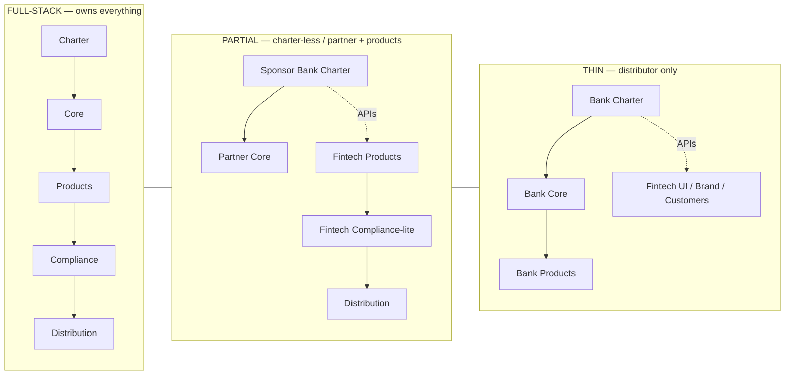
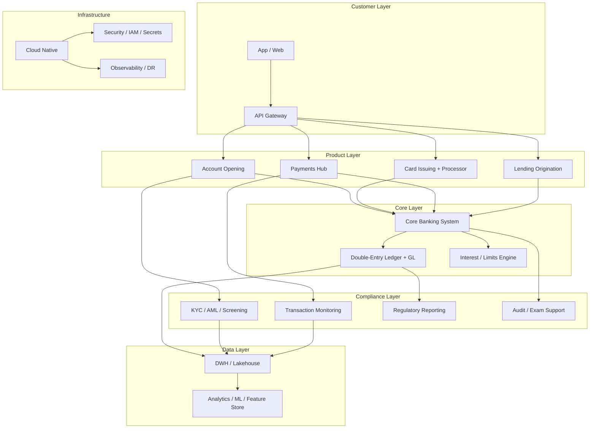
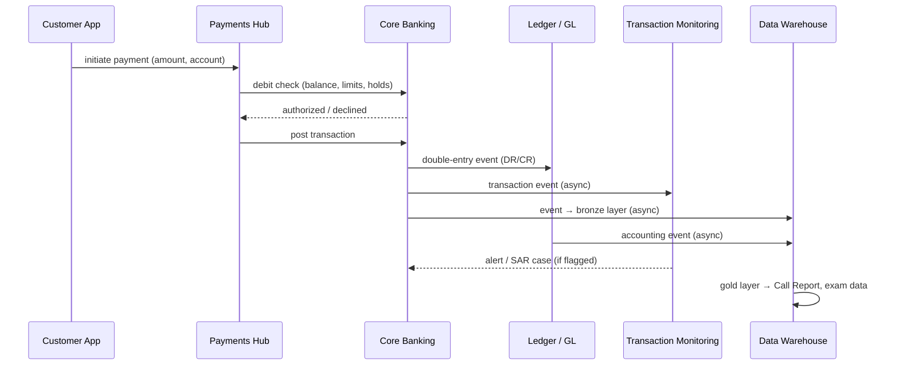

# Full-Stack Banking: A Comprehensive Guide

**Owning the Entire Banking Stack — Charter, Core, Products, Compliance, Distribution, and Capital — vs. the Thin/Partnered Models**

> **Author:** Jack Liu Shurui — Solution Architect at Cymbal Bank, Singapore  
> **Context:** Banking Innovation / Banking Architecture — Full-Stack Banking, Bank Charters, De Novo Banks, Sponsor-Bank Model, BaaS vs. Ownership, Fintech Charter History, Varo/SoFi/LendingClub/Column, Unit Economics of Bank Ownership  
> **Repository:** [github.com/jackliusr/research](https://github.com/jackliusr/research)  
> **Last Updated:** August 2026

---

## Table of Contents

1. [The Full-Stack Concept](#1-the-full-stack-concept)
   - 1.1 [What Full-Stack Banking Is](#11-what-full-stack-banking-is)
   - 1.2 [The Six Owned Layers](#12-the-six-owned-layers)
   - 1.3 [The Thin Models: Bank-Partner, BaaS, Front-End Only](#13-the-thin-models-bank-partner-baas-front-end-only)
   - 1.4 [The Ownership Spectrum](#14-the-ownership-spectrum)
   - 1.5 [Why Go Full-Stack: The Drivers](#15-why-go-full-stack-the-drivers)
   - 1.6 [The Trade-Offs](#16-the-trade-offs)
2. [The History: From Sponsor Banks to Charters](#2-the-history-from-sponsor-banks-to-charters)
   - 2.1 [Era 1 — The Bank-Partner Model (2010s)](#21-era-1--the-bank-partner-model-2010s)
   - 2.2 [Era 2 — The Charter Chase (2019–2022)](#22-era-2--the-charter-chase-20192022)
   - 2.3 [Era 3 — The De Novo Era (2022–2026)](#23-era-3--the-de-novo-era-20222026)
   - 2.4 [The Global Parallel: Full-Stack Digital Banks](#24-the-global-parallel-full-stack-digital-banks)
3. [The Players](#3-the-players)
   - 3.1 [US Full-Stack Fintechs](#31-us-full-stack-fintechs)
   - 3.2 [The Global Full-Stack Neobanks](#32-the-global-full-stack-neobanks)
   - 3.3 [The Comparison Table](#33-the-comparison-table)
4. [Core and Technology](#4-core-and-technology)
   - 4.1 [The Core Choice: Build, Buy, or Ledger-First](#41-the-core-choice-build-buy-or-ledger-first)
   - 4.2 [The Full-Stack Reference Stack](#42-the-full-stack-reference-stack)
   - 4.3 [Full-Stack vs. BaaS: The Technology Difference](#43-full-stack-vs-baas-the-technology-difference)
   - 4.4 [Data Ownership: The Full-Stack Advantage](#44-data-ownership-the-full-stack-advantage)
   - 4.5 [Full-Stack Engineering Talent](#45-full-stack-engineering-talent)
5. [The Economics](#5-the-economics)
   - 5.1 [Revenue: NII + Interchange + Fees](#51-revenue-nii--interchange--fees)
   - 5.2 [Full-Stack vs. BaaS: The Margin Comparison](#52-full-stack-vs-baas-the-margin-comparison)
   - 5.3 [The Cost Base: Compliance, Capital, DIF, Technology](#53-the-cost-base-compliance-capital-dif-technology)
   - 5.4 [Unit Economics: Cost-to-Serve, CAC, Deposit Beta](#54-unit-economics-cost-to-serve-cac-deposit-beta)
   - 5.5 [The Profitability Scorecard](#55-the-profitability-scorecard)
   - 5.6 [Funding: Deposits vs. Venture Capital](#56-funding-deposits-vs-venture-capital)
6. [The Regulatory Dimension](#6-the-regulatory-dimension)
   - 6.1 [The Charter Types](#61-the-charter-types)
   - 6.2 [The Regulatory Journey: De Novo and Acquisition Routes](#62-the-regulatory-journey-de-novo-and-acquisition-routes)
   - 6.3 [The Compliance Burden](#63-the-compliance-burden)
   - 6.4 [Regulatory Arbitrage: True Lender, Valid-When-Made, Rent-a-Charter](#64-regulatory-arbitrage-true-lender-valid-when-made-rent-a-charter)
   - 6.5 [The Charter-Value Debate: The Fintech Charter Saga](#65-the-charter-value-debate-the-fintech-charter-saga)
7. [The Architect's Perspective](#7-the-architects-perspective)
   - 7.1 [The Full-Stack Reference Architecture](#71-the-full-stack-reference-architecture)
   - 7.2 [Build vs. Buy in the Full-Stack Bank](#72-build-vs-buy-in-the-full-stack-bank)
   - 7.3 [Integration Patterns: Core → Ledger → Payments → Reporting](#73-integration-patterns-core--ledger--payments--reporting)
   - 7.4 [The Full-Stack Risks](#74-the-full-stack-risks)
   - 7.5 [The Architect's Checklist](#75-the-architects-checklist)
8. [The Worked Example: A Fintech Goes Full-Stack](#8-the-worked-example-a-fintech-goes-full-stack)
9. [The Future (2026+)](#9-the-future-2026)
10. [Glossary](#10-glossary)

---

# 1. The Full-Stack Concept

## 1.1 What Full-Stack Banking Is

**Full-stack banking** is the strategy in which a financial institution — bank or fintech — owns every layer of the banking value chain end-to-end: the **charter** (the bank licence, i.e., the regulated entity), the **core banking system**, the **products** (deposits, lending, cards, payments), the **compliance** function, the **distribution** (the app, the brand, the customers), and the **capital** (the balance sheet that funds it all). The term is borrowed from software engineering — a "full-stack developer" owns front-end and back-end alike — and applied to banking it means there is no dependency on a partner bank or a BaaS intermediary for the *regulated* parts of the business.

The opposite of full-stack is the **thin model**: a fintech that owns the front-end (brand, app, customers) and leases the regulated back-end from a bank partner. Between the two extremes sits a spectrum of partial ownership (see §1.4).

Why this matters to an architect: the choice is not merely legal — it is a **systems-architecture decision**. A full-stack bank must own a core, a ledger, payments rails, card issuing, AML/KYC infrastructure, regulatory reporting, and a data platform. A thin fintech must instead integrate — via APIs — with someone else's core, ledger, and compliance. The two architectures have radically different data ownership, latency, product velocity, and cost profiles.

> **The one-sentence version:** full-stack banking = you are the bank; thin banking = you rent the bank.

## 1.2 The Six Owned Layers

| # | Layer | What it means | Owned by full-stack? |
|---|-------|---------------|----------------------|
| 1 | **Charter** | The bank licence — the regulated entity (e.g., a national bank under the OCC, a state bank, an ILC; in the EU/UK, the banking licence from the central bank/PRA). This is the single asset that thin fintechs lack. | ✅ |
| 2 | **Core** | The core banking system — accounts, ledgers, interest, limits. See [core_banking_systems_guide.md](core_banking_systems_guide.md). | ✅ (owned or run on a vendor core under your control) |
| 3 | **Products** | Deposits, lending, cards, payments — the products you actually sell. | ✅ |
| 4 | **Compliance** | AML/KYC, sanctions screening, transaction monitoring, regulatory reporting, audit. See [financial_risk_compliance_systems_guide.md](financial_risk_compliance_systems_guide.md). | ✅ (as the regulated entity you bear the burden regardless) |
| 5 | **Distribution** | The app, the brand, the customers, the marketing — the front end. | ✅ (thin fintechs own this too) |
| 6 | **Capital** | The balance sheet — deposits, funding, regulatory capital (CET1), FDIC insurance (DIF assessments). | ✅ (thin fintechs don't hold deposits) |

The distinguishing insight: a thin fintech owns **only layer 5** (distribution) and partially layer 3 (product design, but executed on the partner's stack). A full-stack bank owns **all six** — including the boring, expensive ones (compliance, capital) that fintechs historically tried to avoid.

## 1.3 The Thin Models: Bank-Partner, BaaS, Front-End Only

The non-full-stack models, from most to least owned:

- **Bank-partner model (sponsor bank model)** — the fintech builds the product and brand; a regulated **sponsor bank** (e.g., The Bancorp Bank for Chime and Varo-in-its-early-days, Stride Bank, Evolve Bank & Trust, Choice Financial Group) holds the deposits, issues the cards, and provides the charter. The fintech typically earns most of the interchange and pays the sponsor a fee. This is the **Chime/Bancorp model**. See [us_bank_core_systems_guide.md](us_bank_core_systems_guide.md).
- **Banking-as-a-Service (BaaS)** — the bank *productizes* its rails and exposes them via APIs to downstream fintechs; a middleware layer (e.g., Synapse, Unit, Bond, Column's platform) sits between the bank and the fintech. The fintech pays BaaS fees (per-account, per-transaction) and the bank keeps the deposit spread. See [programmable_business_bank_guide.md](programmable_business_bank_guide.md).
- **Front-end only** — the purest thin model: a UI/UX layer on top of someone else's bank, with no meaningful product or compliance ownership. The early neobanks (Simple in its first years) approximated this. The term is now mostly used pejoratively.

| Dimension | Full-Stack | Bank-Partner | BaaS (fintech side) | Front-End Only |
|-----------|-----------|--------------|---------------------|----------------|
| Charter | Owns it | Rents it (sponsor) | Rents it (via BaaS bank) | Rents it |
| Core | Owns/operates | Partner's | Partner's (via API) | Partner's |
| Compliance | Its own burden | Partner's (shared) | Partner's (contracted) | Partner's |
| Deposits | Holds on own balance sheet | Partner holds | Partner holds | Partner holds |
| Data | First-party, full | Shared/partner-owned | API-scoped | API-scoped |
| Margin | All of it (minus costs) | Interchange share + fees | Thin fees | Thinnest |

**Why "full-stack"?** The label is borrowed from software engineering and it does real work: it names the *vertical ownership* of a stack (front-end → back-end, or customer layer → core layer) as opposed to a *horizontal specialization* (the thin fintech that only builds the top layer and leases the rest). Just as a full-stack developer owns the whole application, a full-stack bank owns the whole bank. The term gained currency in fintech discourse around 2019–2021 precisely as Varo, SoFi, and LendingClub were converting from thin to full-stack — it gave the industry a shorthand for "owns the charter" versus "rents the charter." The useful contrast set is: **full-stack** (own everything), **bank-partner** (own product + brand, rent charter), **BaaS** (rent the rails through a vendor-ized bank API layer), **front-end only** (own the UI and nothing else). Note that "full-stack" describes *who owns what*, not size — Column is a full-stack bank with a fraction of Chime's customers; Chime is thin at 20M+ accounts. Ownership, not scale, is the axis.

## 1.4 The Ownership Spectrum

Ownership is a spectrum, not a binary. The useful axes: **who holds the charter**, **who operates the core**, **who owns the customer**, and **who owns the data**.



ASCII equivalent:

```
FULL-STACK            PARTIAL (sponsor + product)      THIN (distributor)
+-----------------+   +----------------------------+   +-------------------+
| charter         |   | sponsor bank (charter/core)|   | bank (everything) |
| core            |   |    ^  APIs (BaaS)          |   |    ^  APIs        |
| products        |   | fintech: products + brand  |   | fintech: UI only  |
| compliance      |   | (data shared)              |   | (no data)         |
| distribution    |   |                            |   |                   |
| capital         |   |                            |   |                   |
+-----------------+   +----------------------------+   +-------------------+
  owns all 6 layers     owns layers 3+5 (rents 1,2,4,6)   owns layer 5 only
```

Representative occupants: **full-stack** — Varo, SoFi Bank, LendingClub Bank, Column, Nubank, Revolut, Monzo, Starling, Trust Bank, GLDB; **partial** — Chime, Mercury, Brex, most modern neobanks; **thin** — the very early Simple, white-label banking apps. Note the arrows can point both ways: a full-stack bank (Column) can *sell* its stack as BaaS, and a thin fintech (Chime) can migrate to full-stack (as Varo did).

## 1.5 Why Go Full-Stack: The Drivers

- **Margin.** The dominant driver. A full-stack bank captures the **net interest income (NII)** on deposits → lending, the **full interchange** on cards, and **fee income** — instead of a contracted share. The difference between owning a deposit franchise and renting one is often several hundred basis points of revenue per account. See §5.2 for the quantified comparison.
- **Control.** Product control (you can ship a new product without asking a partner bank), pricing control, risk control, and — critically — **data ownership** (first-party transaction data, customer 360, no partner data-usage clauses). See §4.4.
- **Unit economics.** At scale, the per-account cost of running your own core + compliance is dwarfed by the revenue capture; thin models pay per-account fees *forever* and cap their take. See §5.4.
- **Regulatory / charter value.** The charter is a scarce, appreciating asset: a deposit franchise with a "real bank" licence, access to Fed rails (Fedwire/FedNow, via membership), cheap, sticky deposit funding, and the option value of future products (lending funded by deposits rather than warehouse lines). The "charter value" debate in §6.5.
- **Brand and trust.** Consumers and business clients trust "a real bank" more than a fintech; deposit insurance, a bank regulator, and a balance sheet are marketing assets. Nubank's brand in Brazil is a full-stack case study.

## 1.6 The Trade-Offs

- **Cost.** Compliance (AML/BSA program, audit, exams, legal), regulatory capital (CET1 at 4.5%+ minimum, realistically 10%+ held), FDIC deposit insurance (DIF assessments), and a much bigger technology budget. The fixed cost of being a bank is often cited at **$20–50M+ per year** before you write a line of product code.
- **Regulatory burden.** Examinations (OCC/FDIC), Call Reports, stress testing, third-party risk management, consumer compliance exams, board governance, an independent risk function. Your product roadmap now needs regulatory sign-off.
- **Balance-sheet risk.** Deposits must be deployed; credit risk, interest-rate risk, liquidity risk (LCR/NSFR-style management), and deposit outflow risk become your problem. A thin fintech's "bank failure" is a vendor change; a full-stack bank's is a regulatory event.
- **Speed.** A charter takes 1–3+ years and millions in legal/capital spend; a partnership takes months. Full-stack is a long-game strategy with an execution risk many fintechs underestimate. Varo's charter journey took over three years; bunq withdrew its US de novo application after 301 days in the OCC queue (see §2.3).

The trade-offs in one table (direction of the arrow = worse):

| Dimension | Full-stack | Thin (partner/BaaS) |
|-----------|------------|---------------------|
| Margin per account | ▲▲▲ (NII + full interchange + fees) | ▼ (spread kept by sponsor + middleware fees) |
| Time to launch | ▼▼ (12–36 months to charter) | ▲▲ (weeks) |
| Capital required | ▼▼ ($100M+; de novo ratios) | ▲ (near zero) |
| Compliance cost | ▼▼ ($20–50M+/yr, own program) | ▼ (contractual, but still real) |
| Regulatory risk | ▼ (you own the exam) | ▼▼ (rent-a-charter, true-lender, Synapse-style exposure) |
| Balance-sheet risk | ▼▼ (credit, rates, liquidity) | ▲ (partner holds the balance sheet) |
| Data & product control | ▲▲▲ (first-party data, own roadmap) | ▼ (partner data model, API-scoped) |
| Brand / trust | ▲▲ ("real bank", FDIC-insured) | ▼ (fintech trust discount) |
| Speed of product iteration | ▼ (regulatory review on changes) | ▲▲ (product-only changes) |

**The honest summary:** full-stack is the right strategy when the deposit franchise and product breadth justify the fixed regulatory cost — i.e., at meaningful scale with lending ambitions. Thin models remain rational for focused, early-stage plays. The trend of the 2020s is a slow migration from thin → full-stack as fintechs mature (see §9).

# 2. The History: From Sponsor Banks to Charters

## 2.1 Era 1 — The Bank-Partner Model (2010s)

The first wave of consumer neobanks had no desire to be banks. They built beautiful front-ends and rented charters:

- **Simple (2009–2021)** — founded as BankSimple in 2009, launched 2012 with The Bancorp Bank as sponsor. The archetype of the "front-end only" model: a friendly app on top of a partner's bank account. **BBVA acquired Simple in 2014** (~$117M). BBVA USA integration, then announced shutdown **July 2020**; accounts migrated to BBVA USA and Simple **closed January 8, 2021**. Its lesson: a UI without a balance sheet is a feature, not a moat.
- **Chime (2012–)** — founded 2012, launched 2013, sponsored by **The Bancorp Bank** (later adding Stride Bank). Built the playbook: no-fee checking, early direct deposit, no-overdraft fees, interchange monetization, and aggressive CAC-driven growth. Still not a bank as of 2026 — the definitive sponsor-bank/partial model.
- **Varo (2015–)** — launched 2015/2016 on the Bancorp sponsor model, but with an explicit strategy to become a bank (see §2.2).

The 2010s also saw the first **fintech acquisitions of banks** (the acquisition route to full-stack): **WebBank** (2005, a Utah ILC, became the partner of choice for fintech lending), **Cross River Bank** (2008, became the largest BaaS sponsor), and **Green Dot** (the 2010s' bank-owning prepaid player). The era's structural problem: the sponsor-bank model put the fintech's customers, deposits, and data on someone else's balance sheet — and every sponsor relationship had a fee and a fragility clause.

**The sponsor-bank ecosystem that the era built.** By the late 2010s a small set of banks had industrialized the rent-a-charter business: **The Bancorp Bank** (Chime, Simple, and much of the neobank market), **Stride Bank** (Chime's second partner, plus a long tail of neobanks), **Cross River** (lending-as-a-service: Affirm-class BNPL, card and loan programs), **Evolve Bank & Trust** (the BaaS bank behind Synapse's network, plus many fintechs), **WebBank** (the "lender of record" for BNPL and point-of-sale lending), and **Choice Financial Group / Column** (business-banking fintechs such as Mercury and Brex). The fee stack evolved into a recognizable shape: the sponsor kept the **deposit spread** (NII on balances the fintech brought in), the fintech earned **most of the interchange**, and a **BaaS middleware layer** (Synapse, Unit, Bond, Galileo, Marqeta) took per-account/per-transaction fees in between. That three-way split is the exact economics a full-stack bank eliminates — which is why the charter chase (§2.2) began the moment fintechs did the math at scale.

## 2.2 Era 2 — The Charter Chase (2019–2022)

A wave of fintechs concluded that the sponsor model capped their economics and their destiny, and moved to own a charter. Three routes were used: **de novo application**, **bank acquisition**, and **industrial loan company (ILC) application**. Verified timeline:

| Fintech | Route | Charter | Status |
|---------|-------|---------|--------|
| **Varo** | De novo | **National bank (OCC)** — approved **July 31, 2020**, opened as Varo Bank, N.A. **Aug 1, 2020** | **First US consumer fintech to receive a national bank charter** (note: commonly mis-dated to Nov 2020; the OCC approval was 31 July 2020, after an FDIC deposit-insurance approval in Feb 2020 and a three-year-plus application journey). Migrated ~2M customers from The Bancorp. |
| **LendingClub** | Acquisition | **Radius Bank (Massachusetts state bank) → LendingClub Bank, N.A.** — closed **Feb 1, 2021** | The **first fintech to buy a bank** (announced Feb 2020, ~$185M). "First public US neobank." Converts the marketplace-lender model into a deposit-funded digital bank. |
| **SoFi** | ILC → de novo → acquisition | **SoFi Bank, N.A. (national bank)** via **Golden Pacific Bancorp** (California community bank) — acquisition approved by OCC/Fed **Jan 2022**, closed **Feb/Mar 2022** | SoFi originally filed for an **ILC charter with the FDIC in 2017 and withdrew it in 2020**; received **conditional OCC approval for a national bank charter in Oct 2020**; then pivoted to the faster acquisition route. SoFi Bank is a *national* bank — the frequent claim that it is a "Utah industrial bank" is incorrect. |
| **Square/Block** | ILC | **Square Financial Services, Inc. (Utah ILC)** — FDIC conditional approval **March 18, 2020**; began operations **March 2021** | **Active and operating** — the first FDIC deposit-insurance approval for an ILC in over a decade. The "withdrawn" confusion belongs to *SoFi's* ILC application, not Square's. SFS originates Square Capital loans. |

Why the rush: (1) the **sponsor-bank economics** were being squeezed (sponsors demanded more interchange share, BaaS middleware took fees); (2) the **COVID-era rate collapse** made deposit funding attractive; (3) fintechs wanted to fund loans with deposits instead of expensive warehouse lines; (4) the **2021 sponsor-bank crackdowns** (FTC/CFPB actions on lending-as-a-service; OCC True Lender rule saga — see §6.4) made rented charters look legally fragile.

## 2.3 Era 3 — The De Novo Era (2022–2026)

After the 2020–2022 approvals, the de novo door swung mostly shut, and the era's story became **infrastructure banks** and **policy volatility**:

- **Column N.A.** — the most significant post-Varo full-stack entrant. **Not a pure de novo**: the founders (the Hockey brothers) acquired an existing small community bank (Chico, California), converted it to a **national charter (OCC Conditional Approval #1280, 2022)**, and rebuilt it with a **core banking system written from scratch** in San Francisco. Column's product *is* banking infrastructure — "the developer bank for BaaS" — and it now serves as a partner bank for fintechs including Mercury and Brex. Column is the clearest example of **full-stack-as-a-service**: it owns the entire stack (charter + core + compliance) and sells access to it.
- **The de novo freeze.** Per industry trackers, no fintech de novo national charter had been approved for **~1,100+ days as of Feb 2024** (the last approvals being ~2020–21, Varo-era). The OCC under Acting Comptroller Hsu signaled reluctance and reviewed its de novo policies (2023); **bunq**, the Dutch neobank, **withdrew its de novo national charter application on Jan 30, 2024 after 301 days in the OCC queue**. Under the 2025–26 administration the tone shifted again (bunq re-filed; Revolut filed for a US national charter in March 2026, per press reports), and the OCC issued a revised de novo roadmap (the Dec 2025 treatment of Erebor Bank's conditional approval shows the bar remains high).
- **'Bank charters for fintechs' — the OCC/FDIC policy arc.** Three policy strands define the era. First, the **OCC's fintech-charter position** oscillated: the 2018 special-purpose charter (never issued, shelved under Hsu by 2021–22 — see §6.5) was followed by a de facto de novo freeze, and is now being reconsidered under the 2025–26 leadership. Second, the **FDIC's partnership posture** hardened post-Synapse: the June 2024 report on bank–fintech partnerships, the proposed **deposit-records rule** (banks must keep complete, accurate records for fintech end users), and heightened scrutiny of ILC applications made the *rented* charter more expensive and the *owned* charter comparatively more attractive. Third, the **state-level pressure**: the CSBS/state-regulator lawsuits against the OCC fintech charter and the state licensing fights over fintech lenders (the "true lender" battleground) pushed fintechs toward owning rather than renting — a state-chartered, state-supervised bank is a state regulator's own institution, not a foreign intruder on its turf.
- **The sponsor-bank reckoning.** The **Synapse collapse (April 2024)** — the BaaS middleware provider filed Chapter 11 and its records dispute with Evolve Bank & Trust froze the funds of end users of partner fintechs (85,000 Yotta customers, ~$112M, locked; a judge noted up to 20M "depositors" potentially at risk) — destroyed trust in the rented-charter stack and pushed both banks and fintechs toward owning more of the stack. See [programmable_business_bank_guide.md](programmable_business_bank_guide.md).

## 2.4 The Global Parallel: Full-Stack Digital Banks

The full-stack trend is global, and in most jurisdictions the *only* way to be a digital bank is to be a full-stack bank (there is no sponsor-bank rent-a-charter culture):

- **Singapore (the closest parallel for this repo's audience)** — MAS's digital bank framework (2019) produced **four licences in Dec 2020** plus Trust as a fifth: **Trust Bank** (Standard Chartered + FairPrice JV — full digital bank, launched Sept 2022 — see [trust_bank_guide.md](trust_bank_guide.md)), **GXS Bank** (Grab + Singtel — full digital bank, Aug 2022), **MariBank** (Sea/Shopee — full digital bank, pilot Mar 2022), **ANEXT Bank** (Ant Group — wholesale), and **Green Link Digital Bank (GLDB)** (wholesale, Temenos core on Huawei Cloud — see [green_link_digital_bank_guide.md](green_link_digital_bank_guide.md)). All five are full-stack by construction: they hold licences, own their cores, and take deposits. The incumbents' answer — **DBS's digibank** — is the world's most profitable digital-banking program, full-stack by default (see [dbs_bank_guide.md](dbs_bank_guide.md)).
- **Europe** — **Revolut** (founded 2015; EU banking licence from the Bank of Lithuania, Dec 2018, upgraded to a full EU licence in 2021; UK banking licence July 2024; US national charter filing reported March 2026), **N26** (full German licence from BaFin, July 2016 — the first fintech to get one), **Monzo** (UK licence April 2017, ~10M customers), **Starling** (UK licence July 2016 — the first UK digital bank; profitable since Oct 2020, the first UK digital bank to turn a profit). European full-stack is licence-first: no sponsor-bank model exists at consumer scale.
- **Brazil** — **Nubank** (founded 2013; own banking licence, becoming a full bank in 2018; NYSE IPO Feb 2022; ~110M customers by end-2024, the world's largest neobank; profitable since 2022). Nubank is the purest large-scale proof that full-stack works in an emerging market with high rates and thin legacy banking.

**Why the SG digital banks are full-stack by construction.** MAS's digital bank framework (June 2019, licences awarded Dec 2020) simply does not offer a rent-a-charter option: every digital bank must hold a **full digital bank licence** (retail deposits allowed; S$1.5B base capital, phased-in) or a **wholesale digital bank licence** (S$100M base capital; no retail deposits), and the licence is held by the operating entity itself — with the MAS' "uberisation" concerns explicitly addressed by requiring the licensed entity to have substantial local presence and independent risk governance. The result: GXS, MariBank, Trust, ANEXT, and GLDB each run their own core (Temenos for Trust and GLDB, cloud-native builds elsewhere), own their compliance functions, and take deposits on their own balance sheets — full-stack by regulatory design, not by strategic choice. The SG cohort's struggle (none profitable as of 2025–26; Trust is the closest at scale) is therefore a pure test of the full-stack economics of §5: the licence is cheap relative to the distribution cost. For a Singapore-based architect, the takeaway is that "full-stack" is the *default* regulatory model in Asia's digital-bank markets (SG, HK, and the region), while the US is the only major market where "thin" is a legal possibility — which is why the US debate dominates the literature. See [trust_bank_guide.md](trust_bank_guide.md) and [green_link_digital_bank_guide.md](green_link_digital_bank_guide.md).

# 3. The Players

## 3.1 US Full-Stack Fintechs

- **Varo Bank, N.A.** — the flagship US full-stack fintech. Owns a national charter (2020), runs on **The Bancorp-heritage → own-platform** stack (it migrated off the sponsor model), and sells: **Varo Bank Account** (checking + high-yield savings), **Varo Advance** (cash advances), and a **line of credit** (2024). Status: **still not profitable** — net loss ~$105M (2023) improving to ~$65M (2024); revenue is dominated by **interchange (~56% in 2024)**, a reminder that a young bank's deposit franchise takes years to become a NII engine. CEO Colin Walsh stepped down in 2025, replaced by Gavin Michael (ex-Bakkt). Varo demonstrates both the *point* of full-stack (independence, brand, charter value) and its *cost* (seven-plus years, ~$1B+ of equity raised, still pre-profit).
- **SoFi Technologies (SoFi Bank, N.A.)** — the "financial supermarket" full-stack play: **SoFi Checking & Savings** (SoFi Money), **SoFi Invest**, **SoFi Lending** (personal, student, mortgage), the SoFi Credit Card, and Relay. The bank charter (2022) lets it fund loans with its own deposits; GAAP-profitable since 2023 (~$135M), ~**$499M in 2024** (incl. a ~$271M one-time deferred-tax release) and ~$481M in 2025; 12.6M+ members. Notably, SoFi is full-stack even at the *vendor* level: it owns **Galileo** (payments/API infrastructure) and **Technisys** (core banking), making it one of the few banks that owns its own core vendor. See [universal_banking_model_guide.md](universal_banking_model_guide.md) for the supermarket model.
- **LendingClub Bank, N.A.** — the full-stack marketplace bank: deposit-funded lending where the marketplace originations (personal loans) are retained on or sold off its own balance sheet. Acquired Radius (Feb 2021) to convert a marketplace lender into a bank; keeps a marketplace channel (selling ~75–85% of originations) alongside retained portfolio lending. Profitable; the "first public US neobank."
- **Column N.A.** — the "bank for builders": full-stack (national charter, own core built from scratch) whose *product* is banking infrastructure for other fintechs. Occupies the interesting intersection of full-stack bank and BaaS provider — see [programmable_business_bank_guide.md](programmable_business_bank_guide.md).
- **Square Financial Services (Block)** — the Utah ILC originations bank for Square Capital; full-stack in the narrow sense (owns charter + balance sheet) but distribution stays with the Square merchant ecosystem.
- **Mercury — NOT full-stack (verified).** Mercury (the startup/business banking fintech, ~$5.2B valuation as of May 2026) is **not a bank**: "Banking services provided through Choice Financial Group and Column N.A." (and, per its review disclosures, Evolve Bank & Trust). Mercury owns distribution, product design, and (since 2024) treasury advisory, but rents charters — the partial model, like Brex (JPMorgan + Column). The task assumption "Mercury is the bank-partner (Choice/Column)" is **confirmed**.
- **Chime — NOT full-stack (still).** Bancorp + Stride sponsor model, ~20M+ customers, profitable on interchange, has repeatedly declined the charter route. The counterfactual that proves the spectrum: Chime earns sponsor-model economics at a scale where full-stack would arguably pay.

**What the US cohort teaches.** Four patterns repeat across the US full-stack fintechs: (1) **route matters less than the balance sheet** — Varo (de novo), SoFi (acquisition), LendingClub (acquisition), Square (ILC) all arrived at the same destination: a deposit-funded balance sheet with lending ambitions; (2) **the charter is a funding event, not a revenue event** — the deposit franchise and the NII engine take 3–5 years to build, which is why Varo (chartered 2020, still pre-profit) and SoFi (chartered 2022, profitable since 2023) diverge: the difference is the lending book, not the charter; (3) **full-stack fintechs become infrastructure** — Column, Starling Engine, and SoFi's Galileo/Technisys all productize what they built, monetizing the stack itself; (4) **the holdouts are rational** — Mercury and Chime stay thin because their models are already profitable and the charter would add regulatory fixed cost without a lending engine to amortize it. The US cohort is a controlled experiment: same regulators, same decade, three routes, and a clear verdict — full-stack pays when it funds a lending engine; it is a luxury tax otherwise.

## 3.2 The Global Full-Stack Neobanks

- **Revolut** — full-stack in the EU (Lithuania licence), UK (2024), and moving toward the US (2026 filing reports). Owns its core (in-house ledger-first build), ~50M+ customers, profitable since 2021 (FY2023 profit ~£438M; ~£633M in 2024, per company reports — treat exact figures as company-reported).
- **Nubank (Nu Holdings)** — the largest full-stack neobank: own Brazilian banking licence, own core, ~110M customers, profitable since 2022 with **net income above US$1B in FY2023** and continued profitability in FY2024. Also runs full-stack operations in Mexico and Colombia (via its own banking licences there).
- **Monzo / Starling** — the UK full-stack pair: both licence-owning, both profitable (Monzo first full-year profit FY2024; Starling profitable since Oct 2020). Starling also sells its own core as BaaS (Engine by Starling) — again the full-stack-turned-vendor pattern.
- **Singapore** — Trust, GLDB, GXS, MariBank, ANEXT (all licence-owning full-stack by MAS design), plus DBS as the incumbent full-stack digital benchmark. Cross-ref [trust_bank_guide.md](trust_bank_guide.md), [green_link_digital_bank_guide.md](green_link_digital_bank_guide.md), [dbs_bank_guide.md](dbs_bank_guide.md).

## 3.3 The Comparison Table

| Player | Country | Model | Charter | Core | Products | Status (2026) |
|--------|---------|-------|---------|------|----------|---------------|
| Varo Bank | US | Full-stack | National (OCC, Jul 2020) | Vendor/built hybrid | Checking, savings, Advance, LOC | Not yet profitable (loss ~$65M 2024) |
| SoFi Bank | US | Full-stack supermarket | National (OCC, via Golden Pacific, 2022) | Technisys (owned) | Money, Invest, Lending, card | Profitable since 2023 (~$499M 2024) |
| LendingClub Bank | US | Full-stack marketplace | National (via Radius, 2021) | Vendor | Personal loans, deposits, savings | Profitable |
| Column N.A. | US | Full-stack infra bank | National (OCC CA#1280, 2022) | Built in-house | BaaS accounts, payments, cards | Operating, growing |
| Square Financial Services | US | Full-stack (narrow) | Utah ILC (FDIC, 2020) | Vendor | Square Capital loans | Operating |
| Mercury | US | **Partial** (not a bank) | None (Choice/Column/Evolve) | n/a (partner) | Business accounts, cards, treasury | Profitable, $5.2B valuation |
| Chime | US | **Partial** (not a bank) | None (Bancorp/Stride) | n/a (partner) | Checking, savings, SpotMe | Profitable (interchange-led) |
| Revolut | UK/EU | Full-stack | Lithuania (2018), UK (2024), US (filing) | In-house ledger-first | Cards, FX, lending, crypto, trading | Profitable since 2021 |
| Nubank | Brazil | Full-stack | Brazil (2018) | In-house | Credit card, digital account, lending, invest | Profitable since 2022 (>$1B 2023) |
| Monzo | UK | Full-stack | UK (2017) | Vendor | Current account, lending, pots | Profitable FY2024 |
| Starling | UK | Full-stack | UK (2016) | In-house (sold as Engine) | Business & consumer accounts | Profitable since 2020 |
| Trust Bank | SG | Full-stack | MAS full digital bank | Vendor (Temenos) | Deposits, credit cards, lending | Scaling (see [trust_bank_guide.md](trust_bank_guide.md)) |
| GLDB | SG | Full-stack | MAS wholesale digital bank | Temenos on Huawei Cloud | MSME lending, deposits | Operating (see [green_link_digital_bank_guide.md](green_link_digital_bank_guide.md)) |

# 4. Core and Technology

## 4.1 The Core Choice: Build, Buy, or Ledger-First

For a full-stack bank, the core banking system is the load-bearing wall. Three strategies (detail in [core_banking_systems_guide.md](core_banking_systems_guide.md) and the vendor table in [us_bank_core_systems_guide.md](us_bank_core_systems_guide.md)):

1. **Buy (vendor core)** — the default. **Mambu**, **Thought Machine Vault**, **Temenos Transact**, **Sopra Banking**, **FIS/Finastra** on-prem or SaaS. Pros: proven, exam-ready, faster to license; cons: per-account costs, data-model rigidity, upgrade drag, and the fact that every other neobank runs the same engine (little product differentiation at the core level). This is the path of Trust Bank (Temenos), GLDB (Temenos on Huawei Cloud), Monzo (historically a vendor-derived core), and most MAS digital banks.
2. **Build (in-house core)** — write the core from scratch: **Column** (built its own core as the product), **Starling** (own core, later productized as "Engine"), **Nubank** (own core at Brazilian scale), **Revolut** (own ledger-first core). Pros: full control of product velocity, data model, and cost at scale; cons: 5–10 years of engineering, actuarial-grade correctness requirements (double-entry, interest accrual, GL integration), and key-person risk. Building a core is a bank-scale project, not a fintech-scale one.
3. **Ledger-first ("coreless")** — treat a modern double-entry ledger (e.g., **Modern Treasury**, Mutable, or an in-house ledger) as the system of record, and bolt product logic around it. This is how many BaaS-era fintechs think, and how Revolut-class companies structure their "core." The ledger becomes the core; accounts, interest, and limits become services on top. See [data_models_banking_insurance_guide.md](data_models_banking_insurance_guide.md) for the ledger/accounting data model.

The pragmatic full-stack pattern in 2026: **vendor core for the regulated record + in-house ledger for product logic + event stream for everything else**. Column and Starling show build is viable when the core *is* the product; Mambu/Vault/Temenos show buy is viable when speed-to-charter dominates.

The vendor shortlist for a full-stack build, in practice:

| Core | Model | Strengths | Full-stack fit | Who runs it |
|------|-------|-----------|----------------|-------------|
| **Thought Machine Vault** | Cloud-native, config-as-code | Product configurability, cloud-only, modern data model | High — the default choice for new digital banks | neobanks, challengers, some incumbents |
| **Mambu** | Composable SaaS | Fastest to launch, strong API, lending-first heritage | High for deposit+lending builds | MAS digital banks, neobanks |
| **Temenos Transact** | Full-suite (SaaS or on-prem) | Depth, regulatory pedigree, multi-country | Medium — heavy for a pure digital bank, ideal for full-service | Trust Bank, GLDB (on Huawei Cloud), most incumbents |
| **FIS / Finastra / Sopra** | Legacy-to-modern suites | Incumbent integration | Low for greenfield, high for conversions | traditional banks |
| **In-house build** | Your code | Total control, scale economics, core-as-product | Only with a bank-scale engineering budget (5–10 years) | Column, Starling (Engine), Nubank, Revolut |
| **Ledger-first (Modern Treasury, Mutable, in-house)** | Ledger as the core | Product velocity, real-time, no legacy data model | High as the *product* layer under a vendor core | Revolut-class, BaaS-era fintechs |

The selection heuristic: **if you plan to sell your stack (Column, Starling), build; if you plan to differentiate on products (Trust, GLDB, most neobanks), buy; if you plan to differentiate on data and AI (Nubank, SoFi), buy the record-keeping and build the ledger + data layer.**

## 4.2 The Full-Stack Reference Stack

A full-stack bank's technology estate, top to bottom (each layer is a system in its own right):

| Layer | Systems | Notes |
|-------|---------|-------|
| **Customer** | Mobile app, web, API gateway | The distribution layer — thin fintechs stop here |
| **Product** | Account opening, cards (issuing + processor), payments, lending origination, treasury | See [payments_hub_guide.md](payments_hub_guide.md) for payments |
| **Core** | Core banking (vendor or built), ledger, interest engine, limits | System of record |
| **Compliance** | KYC/AML, sanctions, transaction monitoring, regulatory reporting, audit | See [financial_risk_compliance_systems_guide.md](financial_risk_compliance_systems_guide.md) |
| **Data** | Warehouse/lakehouse, ETL, analytics, ML feature store | The customer-360 asset (§4.4) |
| **Infrastructure** | Cloud (see [../technology/cloud_providers_guide.md](../technology/cloud_providers_guide.md)), security, secrets, observability, CI/CD, DR | Cloud-native, often multi-region |



## 4.3 Full-Stack vs. BaaS: The Technology Difference

- **Full-stack**: you own the core, own the data, own the integrations. Product changes are internal merges; data flows into *your* warehouse; regulatory reporting runs on *your* ledgers; latency is internal. The cost is owning everything — including the parts nobody wants to build (regulatory reporting, exam evidence).
- **BaaS / bank-partner**: you integrate via API to a partner bank's core. You get speed (weeks to launch) and zero balance-sheet risk, but you live inside the partner's data model and SLA, pay forever, and your "core" is someone else's roadmap. Synapse's collapse showed the technical fragility too: when the middleware's ledger and the bank's ledger disagree, the customer funds *and the data* are unrecoverable. See [programmable_business_bank_guide.md](programmable_business_bank_guide.md).

The honest engineering rule of thumb: **if your roadmap is products, BaaS is fine; if your roadmap is a bank, build/buy the stack**. Column's existence proves the middle path — a full-stack bank selling its stack as BaaS — which is why the boundary keeps blurring.

## 4.4 Data Ownership: The Full-Stack Advantage

The full-stack bank owns **first-party data end-to-end**: transactions, balances, credit behavior, device/app telemetry, support interactions — all in one warehouse, joined into a **customer 360**, with no partner clauses limiting use. Consequences:

- **Lending quality**: deposit + transaction data feeds underwriting (SoFi, LendingClub, Nubank all cite this; Nubank's credit models run on its own behavioral data).
- **Monetization**: first-party data enables targeted product cross-sell (SoFi's supermarket) and better pricing of deposits.
- **AI/ML**: the ML feature store is fed by your own ledgers — see [data_models_banking_insurance_guide.md](data_models_banking_insurance_guide.md) and the LLM/AI guides under [../technology/ai_llm/](../technology/ai_llm/).

A thin fintech gets API-scoped, contractual data — usually without the right to use it for lending or analytics the way a bank can.

## 4.5 Full-Stack Engineering Talent

Full-stack banking needs a rare blend: **core engineers** (ledgers, double-entry, interest accrual — the arithmetic must balance to the cent), **compliance engineers** (AML/KYC systems, sanctions lists, regulatory report pipelines), **payments engineers** (ISO 20022, ACH/FedNow/SWIFT, scheme rules — see [payments_hub_guide.md](payments_hub_guide.md) and [iso_20022_core_processes_guide.md](iso_20022_core_processes_guide.md)), plus conventional platform/data/security engineers. These "banking engineers" are scarce because the domain knowledge (regulatory requirements, accounting rules, scheme compliance) is not taught in CS programs — it is accumulated in banks and core vendors. This talent scarcity is a real cost of the full-stack strategy and a key-person risk (§7.4).

A realistic engineering + operations headcount sketch for a mid-size full-stack bank (indicative, ~150–250 people total):

| Function | Headcount | Notes |
|----------|-----------|-------|
| Core & ledger engineering | 25–40 | Core config, ledger, interest, limits |
| Payments & cards engineering | 15–25 | Scheme integrations, issuing processor, reconciliation |
| Compliance engineering | 10–20 | KYC/AML tooling, monitoring rules, reporting pipelines |
| Product/platform/security/data | 40–70 | App, APIs, cloud, warehouse, ML |
| Risk, compliance, audit (non-tech) | 25–40 | BSA officer, CRO, AML analysts, exam liaison |
| Operations (fraud, disputes, support) | 30–60 | Customer ops, chargebacks, sanctions review |

The ratio that surprises fintech executives: **compliance + risk + ops is as large as engineering.** A thin fintech at the same customer count runs a fraction of that — which is the staffing expression of the §1.6 trade-offs.

# 5. The Economics

## 5.1 Revenue: NII + Interchange + Fees

The full-stack bank earns from three engines:

1. **Net interest income (NII)** — deposits taken at a **deposit beta** (rate paid vs. the policy rate) and deployed into loans/securities at a higher yield. This is the biggest, most structural revenue line — and it is *unavailable to thin fintechs* (the sponsor bank earns it).
2. **Interchange** — card network fees on spend. Full-stack banks keep the whole interchange stream (Varo's ~56% of revenue; Chime's whole business is built on sponsor-shared interchange).
3. **Fees** — account service charges, overdraft/NSF, FX, late fees, BaaS fees if the bank wholesales its stack (Column, Starling Engine).

## 5.2 Full-Stack vs. BaaS: The Margin Comparison

Illustrative per-account annual economics for a deposit + card product (order-of-magnitude, not gospel — treat as model plumbing):

| Line | Sponsor/BaaS model | Full-stack |
|------|--------------------|------------|
| Interchange (gross) | $80 | $80 |
| Minus sponsor share | –$35 (44%) | –$0 |
| BaaS middleware fees | –$12 (per-account + per-txn) | –$0 |
| Net interchange | $33 | $80 |
| NII on average balance | $0 (sponsor keeps it) | $55 (e.g., 3.5% spread × $1.6k avg balance) |
| Fee income | $15 | $15 |
| **Gross revenue** | **$48** | **$150** |
| Compliance/capital/DIF allocation | ~$8 (buried in sponsor fee) | ~$40 |
| Technology cost | ~$12 (SaaS + integration) | ~$25 |
| **Contribution** | **~$28** | **~$85** |

The structural point: the full-stack bank roughly **triples gross revenue per account** and still nets ~3× after absorbing the costs the sponsor used to carry. But the *fixed* cost of the charter (compliance program, capital, DIF — see §5.3) means these economics only work above a scale threshold — which is why Varo, with millions of accounts, still loses money while SoFi, with a lending engine on the same deposits, is profitable.

**Where the money actually comes from — a balance-sheet view.** The full-stack margin is best understood as an asset-liability exercise. A stylized $1B-deposit digital bank in a 4% rate environment:

| Balance-sheet item | Size | Rate | Annual income/cost |
|--------------------|------|------|--------------------|
| Retail deposits (low beta, ~35%) | $1.0B | 1.4% | –$14M (interest expense) |
| Consumer loans (personal, cards) | $600M | 11% | +$66M |
| Securities / cash (liquidity buffer) | $400M | 4.5% | +$18M |
| **Net interest income** | | | **~$70M** |
| Interchange (on ~$3B annual card spend) | | ~2.2% blended | +$66M |
| Fees (account, overdraft, FX, BaaS) | | | +$20M |
| **Total revenue** | | | **~$156M** |
| Compliance + ops + tech + DIF | | | –$60M |
| Loan loss provision | | | –$18M |
| **Pre-tax income** | | | **~$78M (ROA ≈ 7.8%, ROE ≈ 20%+ on $350M equity)** |

The decomposition explains the strategy: the **deposit beta** (1.4% vs. 4% policy = cheap money), the **lending spread** (11% assets on 1.4% funding), and **interchange** are the three engines; the compliance and capital costs are the price of admission. It also explains why a *deposit-only* full-stack bank (Varo's early profile: mostly securities + interchange) earns a fraction of a *lending-enabled* one — the loan book is where the margin lives.

## 5.3 The Cost Base: Compliance, Capital, DIF, Technology

- **Compliance** — AML/BSA program, sanctions screening, transaction monitoring, audits, legal, and the **examination** overhead. Realistic floor: **$20–50M/year** for a mid-size digital bank; materially more with lending.
- **Regulatory capital** — CET1 minimum 4.5% plus buffers (CCB 2.5%, and for de novos the OCC/FDIC will demand far more — de novo capital plans of 10%+ of risk-weighted assets are common; Varo has held high capital ratios from its ~$1B+ of equity raises). See [financial_risk_compliance_systems_guide.md](financial_risk_compliance_systems_guide.md).
- **FDIC insurance (DIF)** — assessment rates for digital banks typically in the **~5–15 bps of deposits** range (higher for riskier profiles; the 2022 special assessment for the SVB-era losses hit banks with >$5B assets). Small line, but it is the price of the "FDIC insured" brand.
- **Technology** — core (vendor or built), payments, cards, compliance tooling, cloud. See §4.

## 5.4 Unit Economics: Cost-to-Serve, CAC, Deposit Beta

- **Cost-to-serve**: full-stack digital banks run **~$10–40 per active account per year** (no branches, automated ops) vs. **$100+** for branch banks. This is the structural cost advantage that funds the compliance overhead.
- **CAC**: consumer fintech acquisition costs run **$50–300** per funded account (higher in competitive verticals); SoFi's super-app strategy exists precisely to amortize CAC across products; Nubank's CAC is among the lowest in the industry because of viral referral + brand.
- **Deposit beta**: the fraction of a rate rise passed to depositors. Full-stack fintechs with "sticky" primary accounts enjoy low beta (cheap funding); SoFi's cost-of-funds advantage over peers has been central to its NIM expansion since 2022. Deposit beta is the single most important number in the full-stack P&L during rate cycles.

## 5.5 The Profitability Scorecard (verified, 2026)

| Player | Profitability | Verified numbers |
|--------|---------------|------------------|
| **Varo** | ❌ Not yet | Net loss ~$105M (2023) → ~$65M (2024); H1'24 loss $29.9M vs. H1'22 $161.5M — narrowing but negative; revenue 56% interchange |
| **SoFi** | ✅ Since 2023 | GAAP net income ~$135M (2023), ~$499M (2024, incl. ~$271M one-time DTA release), ~$481M (2025) |
| **LendingClub** | ✅ | Profitable as deposit-funded marketplace bank |
| **Nubank** | ✅ Since 2022 | Net income >US$1B in FY2023, continued profitability FY2024; world's largest neobank by customers |
| **Revolut** | ✅ Since 2021 | Company-reported profits (FY2023 ~£438M; FY2024 ~£633M) |
| **Monzo** | ✅ FY2024 | First full-year profit |
| **Starling** | ✅ Since Oct 2020 | First UK digital bank to turn a profit |
| **Mercury / Chime** | ✅ | Profitable, but on the *thin* model — they prove thin can work at scale, and full-stack can fail to |

The scorecard's lesson: **the charter does not create profitability — the lending engine and deposit franchise do.** Varo (deposit-led, interchange-heavy) and SoFi (lending-led on deposits) are the controlled experiment.

## 5.6 Funding: Deposits vs. Venture Capital

Full-stack changes the funding stack:

- **Deposit-led funding**: the bank's own deposits fund the balance sheet (cost of funds ≈ deposit beta × policy rate) instead of warehouse lines (SOFR + 100–200 bps) or VC equity. This is the "charter value": a **deposit franchise** is the cheapest, most stable liability a financial institution can own — and it is the asset the sponsor banks were earning on before.
- **Equity**: de novo capital requirements mean full-stack fintechs raise enormous equity before revenue arrives (Varo ~$1B+ across rounds including a $123.9M Series G in 2025; SoFi's pre-charter raises; bunq's capital commitments for its US bid). The charter converts equity → deposits → NII, but the conversion takes years.
- **The deposit-franchise valuation effect**: markets price deposit franchises at a premium to fee-only fintechs (banks trade at P/B; the "charter value" debate in §6.5 is really about whether that premium is accessible to fintech-owned banks).

**The funding-source ladder** a full-stack bank climbs as it matures:

| Source | Cost | When it's used |
|--------|------|----------------|
| Core retail deposits (primary accounts) | Deposit beta × policy (cheapest) | The goal — sticky, low-beta, diversified |
| Promotional/high-yield savings | 4–5% (rate-sensitive) | Growth spurts; churns when rates fall |
| Sweep networks / partner placements | Market-linked | Parking overflow deposits; can be pulled |
| Brokered deposits | Market-linked + fees | Regulated (deposit-broker restrictions); frowned on in stress |
| FHLB advances | SOFR + spread | Liquidity backstop; collateralized |
| Warehouse lines / securitization | SOFR + 100–200 bps | Funding loan originations pre-deposit-scale |
| Equity (VC/IPO) | Dilutive | De novo capital; absorbs losses pre-profitability |

The strategic point: the full-stack bank's funding advantage is **the deposit franchise itself** — a diversified, low-beta, insured liability base that no thin fintech (or warehouse-funded lender) can replicate. This is the "charter value" in its purest form, and the reason the deposit-led funding model is the endgame of the full-stack strategy.

# 6. The Regulatory Dimension

## 6.1 The Charter Types

The US charter menu (each with different regulators, capital expectations, and ownership constraints):

| Charter | Regulator | Notes |
|---------|-----------|-------|
| **National bank** | OCC (+ FDIC for insurance, Fed for BHCs) | The premium charter. Varo Bank, N.A. (2020, de novo), SoFi Bank, N.A. (2022, conversion), Column N.A. (2022). Fed membership required; state usury preemption applies. |
| **State bank** | State regulator + FDIC | e.g., Massachusetts-chartered Radius (pre-acquisition). Often faster/cheaper; state-level preemption varies. |
| **Industrial loan company (ILC)** | State (Utah dominant) + FDIC | The fintech favorite: **an ILC can be owned by a commercial company** without triggering Bank Holding Company Act regulation of the parent — the "Wal-Mart loophole." Square Financial Services (Utah ILC, 2020) is the marquee example. FDIC had a de facto ILC moratorium from 2006 until Square's 2020 approval. |
| **Savings / thrift** | OCC (post-2011; formerly OTS) | Federal savings associations; legacy charter, rarely used for fintech de novos. |
| **Special-purpose fintech charter** | OCC | Proposed July 2018; **never issued** (see §6.5). |
| **Non-US analogues** | MAS (SG), PRA/FCA (UK), ECB/NCAs (EU), Banco Central (BR) | Full banking licences, usually the only route — no sponsor-bank culture. |

**FDIC deposit insurance** is the other half of the licence: every insured depository institution needs FDIC approval for deposit insurance (Varo's came Feb 2020, conditionally, before the OCC charter). The FDIC also supervises state non-member banks and conducts examinations. Uninsured charters (e.g., some trust companies) cannot take retail deposits.

## 6.2 The Regulatory Journey: De Novo and Acquisition Routes

**The de novo process (OCC)**: organize → business plan + capital plan → application → comment period → conditional approval → opening (capital paid in, systems live, exam readiness) → de novo operating period (~3 years of heightened supervision). Realistic timeline **12–24+ months** (Varo took 3+ years; bunq spent 301 days and withdrew). De novo capital expectations are materially above minimums — regulators want a credible capital plan (often 10%+ CET1) and a viable path to profitability, which is a hard bar for an unprofitable fintech business plan.

**What the application actually contains** (the OCC licensing manual is the template; state charters and the FDIC mirror it): (1) a detailed **business plan** — products, market, competitors, five-year financial projections with stress cases; (2) an **organizational plan** — proposed directors (bank-qualified, including at least two independent), senior officers (CEO, CFO, CRO with real banking experience), legal structure, and the holding-company relationship (which triggers Federal Reserve approval as a bank holding company); (3) a **capital plan** — sources and uses of the initial capital, projected capital ratios through the de novo period, and a contingency if projections miss; (4) **compliance programs** — BSA/AML, CRA, fair lending, consumer compliance, with named owners; (5) **technology and operations** — core systems, vendors, third-party risk management, business continuity/DR, cybersecurity program; (6) **financial projections** with rate, credit, and operational stress scenarios. Regulators read the plan for three things: *will it be solvent, will it be compliant, and will the owners have the ability and incentive to run a bank safely* — a fintech's VC investors and growth-at-all-costs culture are examined as closely as its numbers.

**The de facto freeze (2023–2024)**: no fintech de novo national charter was approved between ~2020/21 and at least early 2024 (~1,100+ days). The OCC under Acting Comptroller Hsu reviewed de novo policy and signaled reluctance. The 2025–26 administration reopened the door in tone (bunq re-filed; Revolut's 2026 filing; a new OCC de novo roadmap late 2025), but Erebor Bank's conditional-approval saga (Dec 2025) shows approvals are still conditional, slow, and burdened with conditions.

**The acquisition route** (the pragmatic alternative): buy a bank and convert it — LendingClub/Radius (Feb 2021), SoFi/Golden Pacific (2022), Column/Chico community bank (2022). Faster than de novo (SoFi's whole charter journey took ~1 year once the GPB deal was struck) but requires deal execution, integration, and inheriting the acquired bank's legacy (the reason most fintechs prefer tiny, clean banks).

**State vs. national**: Varo chose national (OCC); LendingClub ended up national (via Radius conversion); SoFi ended up national (via GPB); Square chose the Utah ILC. The Utah ILC route remains attractive to non-bank parents precisely because it avoids BHC regulation — which is also why the FDIC scrutinizes it.

## 6.3 The Compliance Burden

Once chartered, the full-stack bank owns the entire compliance estate:

- **BSA/AML** — the Bank Secrecy Act program: KYC at onboarding, CIP, beneficial ownership, sanctions screening (OFAC), transaction monitoring, SAR filing, CTR reporting, and a designated BSA officer. See [financial_risk_compliance_systems_guide.md](financial_risk_compliance_systems_guide.md) and [financial_fraud_detection_at_scale_guide.md](financial_fraud_detection_at_scale_guide.md).
- **Consumer regulation** — CFPB rules (Reg E, Reg Z, Reg CC, TILA/ECOA/Fair Lending, UDAAP) apply regardless of whether the CFPB directly supervises the bank (banks >$10B are CFPB-supervised; the 2025–26 CFPB rollback reduced enforcement, but the rules remain). See [us_bank_core_systems_guide.md](us_bank_core_systems_guide.md).
- **Examinations** — OCC/FDIC safety-and-soundness exams, IT exams, consumer compliance exams, plus third-party risk management expectations (OCC Bulletin 2017-12, FDIC FIL 2019-40) — which now scrutinize *the bank's own* fintech/BaaS partnerships.
- **Reporting** — Call Reports (FFIEC 031/041), FR Y-9C for holding companies, deposit insurance assessments, CRA data, HMDA, and the quarterly/annual exam data requests.

The reporting calendar is itself a systems project — the full-stack bank's data layer must produce these on schedule, from source systems, with auditable lineage:

| Report | Frequency | Regulator | What it covers |
|--------|-----------|-----------|----------------|
| Call Report (FFIEC 031/041) | Quarterly | OCC/FDIC/Fed | Balance sheet, income, capital, risk weights |
| FR Y-9C / FR Y-9SP | Quarterly | Federal Reserve | Holding-company financials |
| Deposit insurance assessment | Quarterly | FDIC | DIF assessment base and rate |
| SAR / CTR | Event-driven | FinCEN | Suspicious activity, currency transactions |
| HMDA | Annual | CFPB | Mortgage lending data |
| CRA data | Annual | OCC/FDIC | Community reinvestment activity |
| Fair-lending / Reg B data | On exam | OCC/FDIC/CFPB | Disparate-impact analysis |
| BSA/AML program metrics | On exam | OCC/FDIC | Monitoring, screening, training evidence |

For an architect, the lesson is structural: **regulatory reporting cannot be an afterthought bolted on quarterly — it must be a standing projection of the event stream** (see §7.3), because every one of these reports is built from the same ledgers, and the examiners will trace them back to source.
- **Governance** — independent risk management, internal audit, a board with bank-qualified directors, capital and liquidity policies (ALCO), recovery and resolution planning expectations.

This is the line-item that kills naive full-stack ambitions: **the compliance program costs $20–50M+/year and must exist before the first deposit.**

## 6.4 Regulatory Arbitrage: True Lender, Valid-When-Made, Rent-a-Charter

The "full-stack vs. partner" debate is also a **regulatory-arbitrage** debate:

- **True lender doctrine** — who is the *real* lender of a loan originated through a bank partner? If the fintech is the true lender, the fintech inherits state licensing and usury obligations the bank partnership was meant to avoid. The OCC's 2020 True Lender rule (bank is the true lender when it funds the loan or is named as lender) was **vacated by a federal court in 2022**; the OCC and FDIC **proposed a revived True Lender rule in August 2024** — status remains in flux (flag as evolving through 2025–26).
- **Valid-when-made** — the doctrine that a loan's interest rate remains valid when the loan is sold/assigned (answering the *Madden v. Midland Funding* problem). The OCC (2020) and FDIC (2021) codified it; the 2024 Supreme Court decision in *Cantero v. Bank of America* and the Fifth Circuit's *Community Financial v. CFPB* have re-opened preemption questions. Flag: doctrine under active litigation.
- **Rent-a-charter** — the practice of a sponsor bank lending its charter to a fintech with minimal independent underwriting or compliance. The Synapse collapse (2024) made rent-a-charter a reputational and supervisory liability: the FDIC's June 2024 report on bank–fintech partnerships and its proposed rule on deposit records (requiring banks to maintain complete, accurate records of all deposit accounts, including those of fintech end users) target exactly this. Full-stack ownership eliminates the arbitrage *and* the exposure — you cannot rent-a-charter yourself.

## 6.5 The Charter-Value Debate: The Fintech Charter Saga

The OCC's **special-purpose national bank charter for fintechs** (proposed July 2018) was meant to give non-bank fintechs a federal licence without full deposit-taking. It was **never issued to anyone**:

- Oct 2018: **CSBS** (state regulators) sued the OCC in DC; the DC district court dismissed the suit as premature (2018) and a second near-identical suit (2019) similarly.
- 2019: **NY DFS** (Lacewell) sued in SDNY; the district court ruled for DFS, but the **Second Circuit dismissed the DFS suit on standing grounds (June 3, 2021)**.
- Under **Acting Comptroller Michael Hsu (2021)**, the OCC declined to pursue the charter further — effectively **shelved/withdrawn by 2021–22**, and no fintech has received one. It was revived in *discussion* under the 2025–26 OCC leadership (Rodney Hood era) but with no issued charter as of August 2026.

The debate that animated it — whether a charter is a *privilege* that should be reserved for deposit-taking institutions or a *right* of any financial company that meets safety-and-soundness standards — remains unresolved, and it is the intellectual core of the full-stack question: **if the charter's value (deposit franchise, Fed access, preemption) is real, then the only way to capture it is to own the charter — i.e., to go full-stack.**

# 7. The Architect's Perspective

## 7.1 The Full-Stack Reference Architecture

The architect's view of a full-stack bank is a **six-layer estate** with two planes cutting across it: **compliance** (every business event must be observable to compliance) and **data** (every event lands in the warehouse). The reference stack in §4.2 is the topology; the architectural *principles* that distinguish a well-built full-stack bank from a retrofit:

1. **Event-sourced core**: every balance change is an immutable event; the ledger and the warehouse are both projections of the same event stream. This is what makes reconciliation, audit, and regulatory reporting tractable (and it is exactly what Synapse lacked).
2. **Ledger/GL discipline**: double-entry everywhere; the product ledger and the general ledger reconcile automatically. See [data_models_banking_insurance_guide.md](data_models_banking_insurance_guide.md).
3. **Compliance-as-code**: KYC/AML decisions, sanctions screening, and monitoring rules are versioned, tested, and deployed like application code — not run as manual processes. See [financial_risk_compliance_systems_guide.md](financial_risk_compliance_systems_guide.md) and [programmable_business_bank_guide.md](programmable_business_bank_guide.md).
4. **Cloud-native with DR**: multi-AZ/multi-region, immutable infrastructure, secrets management, and tested recovery (regulators will ask). See [../technology/cloud_providers_guide.md](../technology/cloud_providers_guide.md).
5. **API-first product layer**: the product layer is a set of internal services with the same API discipline you would demand of a BaaS vendor — because the bank *is* the vendor now (Column, Starling Engine, and SoFi's Galileo all productize this).

## 7.2 Build vs. Buy in the Full-Stack Bank

| Component | Buy (recommended for) | Build (recommended for) |
|-----------|----------------------|-------------------------|
| **Core banking** | Speed-to-charter; regulatory familiarity (Mambu, Thought Machine Vault, Temenos) | Core-as-product (Column, Starling); scale economics (Nubank, Revolut); see [core_banking_systems_guide.md](core_banking_systems_guide.md) |
| **Payments** | Scheme connectivity, ACH/FedNow/SWIFT gateways (see [payments_hub_guide.md](payments_hub_guide.md)) | Differentiating payment products (programmable payments, virtual accounts) |
| **Cards** | Card issuing + processor (Marqeta, Galileo, Lithic, Stripe) | Full card control at scale |
| **AML/KYC** | Vendor screening/monitoring engines (with in-house rule tuning) | Differentiating risk models; compliance-as-code automation |
| **Ledger** | Start with vendor (Modern Treasury, Mutable) | Once you are the system of record, in-house ledger ownership pays |
| **Regulatory reporting** | Vendor forms engines | Data-platform-native reporting (your warehouse is the source) |

The pattern: **buy the regulated plumbing, build the product logic and the data layer.** Every successful full-stack bank is a hybrid; the failures were the ones that built a core and ignored the data layer, or bought everything and owned nothing.

## 7.3 Integration Patterns: Core → Ledger → Payments → Reporting

The four mandatory integration seams:

1. **Core → Ledger**: every core posting emits a double-entry event; the ledger is the accounting system of record; the GL trial balance must tie to the core's balances daily. Pattern: event stream + reconciliation job + break management.
2. **Ledger → Payments**: payment initiation reads the ledger (available balance, limits, holds) and posts on settlement; inbound payments (ACH, cards, RTP/FedNow) must reconcile to the ledger in near-real-time with a float/memo-post model. See [payments_hub_guide.md](payments_hub_guide.md).
3. **Everything → Compliance**: every event (onboarding, transaction, limit change, card decline) feeds monitoring; SAR/CTR pipelines are generated from the same stream. Pattern: publish/subscribe with guaranteed delivery + backfill for monitoring model retraining.
4. **Everything → Reporting & Data**: the warehouse ingests the event stream (CDC or event-driven ETL); Call Report and exam data are derived from the warehouse, not hand-assembled. Pattern: medallion architecture (bronze/silver/gold) per [data_models_banking_insurance_guide.md](data_models_banking_insurance_guide.md).

The golden rule: **if a report or a reconciliation requires manual SQL, the architecture is wrong.** Regulatory reporting must be a projection of the same event stream that produced the balances.

The runtime shape of the golden rule — one transaction, end to end:



Every arrow is an event, every store is a projection of the same truth, and the examiners' question — "show me where this balance came from" — is answered by replaying the stream rather than by archaeology. This is the single most important architectural difference between a full-stack bank and a fintech that merely has a bank.

## 7.4 The Full-Stack Risks

- **Vendor concentration** — core vendor, cloud provider, card processor: a single outage or repricing event is existential. Mitigation: contractual exit rights, data portability (your warehouse must be vendor-neutral), multi-cloud or cloud-portable patterns.
- **Key-person risk** — core, payments, and compliance engineering are thin markets; a few people often hold the whole system in their heads. Mitigation: documentation, code ownership rotation, and the event-sourced design that makes knowledge explicit in the data.
- **Regulatory change** — charter policy (true lender, de novo rules, ILC treatment), capital rules, and the CFPB's status have all swung 2018→2026. Mitigation: regulatory radar, conservative capital, and product designs that survive rule changes.
- **The complexity of owning the whole stack** — the honest view: full-stack is *hard*. It is a bank-scale engineering, compliance, and capital project disguised as a fintech growth story. Varo is the cautionary tale (charter since 2020, still pre-profit); the survivors (SoFi, Nubank) coupled the charter with a lending engine and a cost base that the compliance overhead could not sink.

## 7.5 The Architect's Checklist

Use this to assess a full-stack build (or to pressure-test a fintech's "we're going full-stack" plan):

1. **Charter strategy**: de novo vs. acquisition vs. ILC — timeline and capital honestly modeled? (12–36 months; $100M+ of committed capital typical.)
2. **Core decision**: build/buy/ledger-first — is the choice driven by product roadmap, not fashion?
3. **Data ownership**: does the architecture make the warehouse the single source of truth, with events flowing in real-time?
4. **Compliance-as-code**: are KYC/AML/monitoring/reporting automated, versioned, and exam-ready *before* launch?
5. **Integration seams**: core↔ledger↔payments↔reporting all reconciled automatically — no manual SQL?
6. **Unit economics**: does the model show the full-stack margin advantage (§5.2) crossing the fixed-cost threshold (§5.3) within the capital runway?
7. **Risk register**: vendor concentration, key-person, regulatory-change, and operational-risk mitigations documented?
8. **Exit plan**: if the charter journey fails, what is the fallback (stay on sponsor model, sell the bank entity)?

# 8. The Worked Example: A Fintech Goes Full-Stack

**Illustrative scenario** — "Northwind Payments" (fictional): a successful B2C/B2B fintech with 800K funded accounts and $1.2B of deposits, running on a sponsor bank + BaaS middleware, earning interchange-share and per-account fees. The board wants the full-stack economics. The journey:

**Phase 0 — Decision (Month 0–3).** Model the full-stack P&L (§5.2) against the sponsor deal. Key inputs: current sponsor share of interchange (44%), BaaS fees ($12/account/yr), projected deposit beta (35%), lending ambitions (personal loans at 12% APR), and the fixed compliance cost ($25M/yr). Conclusion: at 800K accounts the full-stack case is marginal; at 2M accounts it is compelling. Decision: go, with a lending launch gated on the charter.

**Phase 1 — Charter (Month 3–24).** Two routes on the table:
- *De novo state charter* (friendlier state): 12–18 months, $15–25M of legal/organizational spend, capital plan $120M (10%+ CET1 on day one), de novo exam period.
- *Acquisition* (small, clean state bank or ILC, $20–60M): 6–12 months to close + convert, inherits legacy systems to remediate.

The company picks the **state de novo** (no legacy, full control) — accepting the longer timeline. Regulators require: an experienced bank CEO/CFO/CRO, an independent risk committee, an audit committee, and a credible path to profitability (the business plan shows breakeven at ~1.5M accounts).

**Phase 2 — Core selection (Month 6–12, in parallel).** Shortlist: **Thought Machine Vault** (config-driven, modern, exam-friendly) vs. **Mambu** (proven neobank SaaS) vs. **build**. Decision: **Vault on cloud** for the regulated record + an **in-house ledger** (double-entry, event-sourced) for product logic — the hybrid pattern from §4.1. Card issuing via a modern issuer-processor (Marqeta-class); payments via a payments hub (see [payments_hub_guide.md](payments_hub_guide.md)); AML/KYC via vendor engines with in-house rule tuning.

**Phase 3 — Build-out (Month 12–24).** Standing up the six layers of §4.2: account opening, ledger migration tooling, compliance stack (KYC, monitoring, SAR/CTR, Call Report pipeline), data warehouse (event-stream-fed), DR, and the exam evidence pack. The compliance program and the audit function must be *operational before opening*. Cost: $40–60M of build + $25M/yr run-rate.

**Phase 4 — Launch and migration (Month 24–30).** Charter granted; capital paid in. **Migration**: 800K accounts moved from the sponsor bank to the new bank — the hardest operational step (Varo migrated ~2M from Bancorp; account migrations fail on routing/ACH/ABA re-plumbing and card re-issuance). Customers are re-KYC'd where required, new ABA/routing numbers go live, cards re-issued. **Before/after economics per account** (illustrative):

| Line (per account/yr) | Sponsor model (before) | Full-stack (after) |
|---|---|---|
| Gross revenue | $48 (see §5.2) | $150 |
| Compliance/capital/DIF | ~$8 (buried) | ~$40 |
| Technology | ~$12 | ~$25 |
| **Contribution** | **~$28** | **~$85** |
| **Net income (company, 2M accounts)** | ~$30M | ~$110M after fixed costs — *if* the deposit beta and lending engine perform |

**Phase 5 — The risks that actually bite.** (1) **Regulatory**: the exam team's findings on the compliance build delay the opening by 4 months. (2) **Operational**: the migration runs a 2-week reconciliation break between the sponsor's ledger and the new core — handled by the event-sourced design (§7.3). (3) **Economic**: the rate cycle moves against the deposit beta assumption; the ALCO hedging program contains the damage. (4) **Strategic**: a BaaS competitor (Column-style) launches a cheaper sponsor alternative, slowing account growth — the reason the plan had gated lending on the charter. Verdict of the exercise: **the full-stack journey is a 2–3 year, $150–200M capital project whose payoff is ~3× per-account contribution — but only for companies with a lending engine and the discipline to survive the de novo exam period.**

# 9. The Future (2026+)

- **The full-stack wave — "sovereignty" as a strategy.** Post-Synapse, the sponsor model carries counterparty risk; post-rate-cycle, deposit funding is the cheapest liability class. Expect more mature fintechs to follow Varo/SoFi's path (own the charter), and more sponsors to get acquired *by* their fintechs (the LendingClub playbook). The Chime question — the last big holdout — is the industry's favourite parlay: at 20M+ customers, the full-stack margin is enormous, and the only reason to stay thin is regulatory aversion.
- **Full-stack as a service.** Column (and Starling Engine, and SoFi's Galileo/Technisys stack) productize the full stack: a fintech can now *rent a full-stack bank's* charter, core, and compliance via API. This inverts the original question — the deepest full-stack banks become the BaaS providers of the 2030s, and "full-stack vs. thin" becomes "who owns the stack that everyone else rents."
- **Consolidation and the BaaS shakeout.** The Synapse collapse (2024), sponsor-bank exits (Evolve and others retreating from BaaS), the FDIC's deposit-records rule, and the 2025–26 regulatory reset are compressing the middle: weak middleware dies, strong banks (Column, Cross River, WebBank-class) consolidate the rails. See [programmable_business_bank_guide.md](programmable_business_bank_guide.md).
- **AI in the full-stack bank.** Full-stack banks are the best-positioned AI adopters because they own the data (§4.4): AI core operations (automated reconciliation, anomaly detection), AI compliance (transaction monitoring models, SAR narrative generation), and AI underwriting (behavioral credit models — Nubank's edge). The constraint is not models but data governance and model-risk management — see the LLM/AI guides under [../technology/ai_llm/](../technology/ai_llm/) (e.g., [advanced_rag_techniques_guide.md](../technology/ai_llm/advanced_rag_techniques_guide.md), [llm_development_risks_security_guide.md](../technology/llm_development_risks_security_guide.md)).
- **Full-stack vs. embedded.** Embedded finance (lending/accounts inside non-bank platforms) increasingly runs *on* full-stack banks rather than sponsor banks: the deepest-stack banks become the rails of embedded finance, and the embedded players stay thin by design. The two models are becoming complements, not competitors.
- **Trends summary.** (1) Charter supply stays scarce and political (fintech-charter revival talk, ILC scrutiny); (2) acquisition remains the fast lane; (3) profitability concentrates in full-stack banks with lending engines; (4) the stack itself becomes a product (full-stack-as-a-service); (5) AI compounds the data advantage of ownership.

**The 2026–2030 regulatory trajectory** (flagged as forward-looking, not verified): the 2025–26 US administration's deregulatory turn (CFPB curtailment, new OCC leadership under Rodney Hood, revived discussion of fintech charters and partnership frameworks) is the first genuinely permissive window for fintech charters since 2018. If a fintech charter is actually issued (or the de novo pipeline reopens — bunq's re-filing and Revolut's 2026 application are the live tests), the calculus of §1.5 changes: more fintechs will take the charter route, the acquisition market for small banks will tighten (fewer clean targets), and the sponsor-BaaS model will shrink toward the segments where speed beats ownership (embedded point solutions, early-stage plays). The counterweight is the post-Synapse prudential mood: the FDIC's deposit-records rule and the revived True Lender proposal pull the other way, tightening *partnership* structures precisely as charter issuance loosens. The full-stack vs. thin question in 2030 will likely be answered not by doctrine but by **relative regulatory cost** — whichever model the agencies make cheaper to run will win the marginal fintech.

# 10. Glossary

- **Full-stack banking** — a bank/fintech owns the entire banking value chain: charter, core, products, compliance, distribution, and capital. The opposite of the thin/partnered models.
- **Bank-partner model** — the fintech builds the product and brand while a regulated bank holds deposits and issues cards; the fintech typically earns interchange share (the Chime/Bancorp model).
- **Sponsor bank** — the regulated bank that hosts a fintech's deposits/cards under a partnership (e.g., The Bancorp Bank, Stride Bank, Evolve Bank & Trust, Choice Financial Group).
- **BaaS (Banking-as-a-Service)** — a bank exposes its rails via APIs (often through middleware) for fintechs to build on; see [programmable_business_bank_guide.md](programmable_business_bank_guide.md).
- **Charter** — the licence to be a bank (national, state, ILC, or foreign analogue); the regulated entity itself.
- **National bank** — a US bank chartered by the OCC (e.g., Varo Bank, N.A., SoFi Bank, N.A., Column N.A.).
- **State bank** — a US bank chartered by a state regulator with FDIC insurance (e.g., the pre-acquisition Radius Bank, Massachusetts).
- **ILC (Industrial Loan Company)** — a Utah-favored state charter that can be owned by a commercial company without BHC regulation; Square Financial Services is the marquee fintech ILC.
- **OCC (Office of the Comptroller of the Currency)** — US federal regulator that charters and supervises national banks.
- **FDIC (Federal Deposit Insurance Corporation)** — insures deposits, approves deposit insurance, supervises state non-member banks; the DIF is its insurance fund.
- **De novo** — a newly chartered bank; "de novo" also describes the charter-application route (vs. acquisition).
- **De novo moratorium / freeze** — the ~2020–2024 effective halt of fintech de novo national charter approvals (no fintech de novo approved for ~1,100+ days as of early 2024).
- **Varo** — first US consumer fintech to receive a national bank charter (OCC, July 31, 2020; opened Aug 1, 2020); still pre-profit.
- **SoFi** — US fintech turned full-stack national bank (via Golden Pacific Bancorp, 2022); profitable since 2023; the financial-supermarket model.
- **LendingClub** — US marketplace lender that acquired Radius Bank (Feb 2021) to become LendingClub Bank, N.A. — the first fintech to buy a bank.
- **Radius** — the Boston-based digital community bank acquired by LendingClub (announced Feb 2020, closed Feb 1, 2021).
- **Column** — US national bank (OCC CA#1280, 2022) that rebuilt an acquired community bank with its own core; "the developer bank for BaaS"; a full-stack bank selling its stack as a service.
- **Mercury** — US business-banking fintech that is *not* a bank (partners: Choice Financial Group, Column N.A., Evolve) — the partial model.
- **Chime** — the largest US sponsor-bank-model neobank (Bancorp/Stride); profitable on interchange without a charter.
- **Simple** — the 2009–2021 neobank (BBVA acquisition 2014; shutdown announced July 2020, closed Jan 8, 2021); the front-end-only archetype.
- **Revolut** — European full-stack neobank (Lithuania licence 2018, UK licence 2024, US filing 2026); profitable since 2021.
- **Nubank** — Brazilian full-stack neobank (own licence, ~110M customers, profitable since 2022, >$1B net income FY2023) — the world's largest.
- **Monzo / Starling** — UK full-stack neobanks (licences 2017/2016); Starling profitable since Oct 2020, Monzo from FY2024; Starling productizes its core as "Engine."
- **NII (Net Interest Income)** — interest earned on assets (loans/securities) minus interest paid on deposits/funding; the core full-stack revenue engine.
- **Interchange** — card network fees paid by merchants' acquirers to issuing banks; a primary revenue line for deposit/card fintechs.
- **CAC (Customer Acquisition Cost)** — cost to acquire a funded account/customer.
- **Deposit beta** — the share of a policy-rate change passed through to deposit rates; low beta = cheap, sticky funding.
- **CET1 (Common Equity Tier 1)** — the core regulatory capital ratio (4.5% minimum + buffers); de novos are held well above minimums.
- **DIF (Deposit Insurance Fund)** — the FDIC's fund; banks pay assessments into it (the "DIF assessment" cost line).
- **True lender** — the doctrine determining which party is legally the lender of a loan (OCC rule 2020, vacated 2022, re-proposed 2024); central to rent-a-charter risk.
- **Valid-when-made** — the doctrine that a loan's interest rate survives sale/assignment (codified by OCC 2020 and FDIC 2021; under litigation).
- **Rent-a-charter** — a sponsor bank lending its charter to a fintech with minimal independent underwriting/compliance; the regulatory-arbitrage critique of the partner model.
- **Fintech charter** — the OCC's special-purpose national bank charter (proposed July 2018, litigated, shelved by 2021–22); never issued.
- **Core banking system** — the system of record for accounts, ledgers, interest, and limits (see [core_banking_systems_guide.md](core_banking_systems_guide.md)).
- **Ledger** — the double-entry accounting system of record; in modern banks, often event-sourced and separate from the core (see [data_models_banking_insurance_guide.md](data_models_banking_insurance_guide.md)).
- **Card issuing** — the process of issuing payment cards (BIN sponsorship, processor, network rules); full-stack banks own the issuing relationship.
- **Transaction monitoring** — the AML surveillance of transactions for suspicious activity (SAR filing); a core compliance system (see [financial_risk_compliance_systems_guide.md](financial_risk_compliance_systems_guide.md)).
- **First-party data** — data a company collects directly from its own customers; the full-stack bank's core asset.
- **Customer 360** — the joined, single view of a customer across products and channels; the payoff of full-stack data ownership.

---

*Related guides: [core_banking_systems_guide.md](core_banking_systems_guide.md) · [us_bank_core_systems_guide.md](us_bank_core_systems_guide.md) · [programmable_business_bank_guide.md](programmable_business_bank_guide.md) · [financial_risk_compliance_systems_guide.md](financial_risk_compliance_systems_guide.md) · [payments_hub_guide.md](payments_hub_guide.md) · [data_models_banking_insurance_guide.md](data_models_banking_insurance_guide.md) · [universal_banking_model_guide.md](universal_banking_model_guide.md) · [trust_bank_guide.md](trust_bank_guide.md) · [green_link_digital_bank_guide.md](green_link_digital_bank_guide.md) · [dbs_bank_guide.md](dbs_bank_guide.md) · [financial_technology_overview.md](financial_technology_overview.md)*


