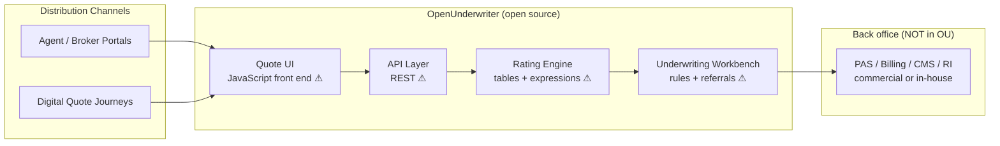
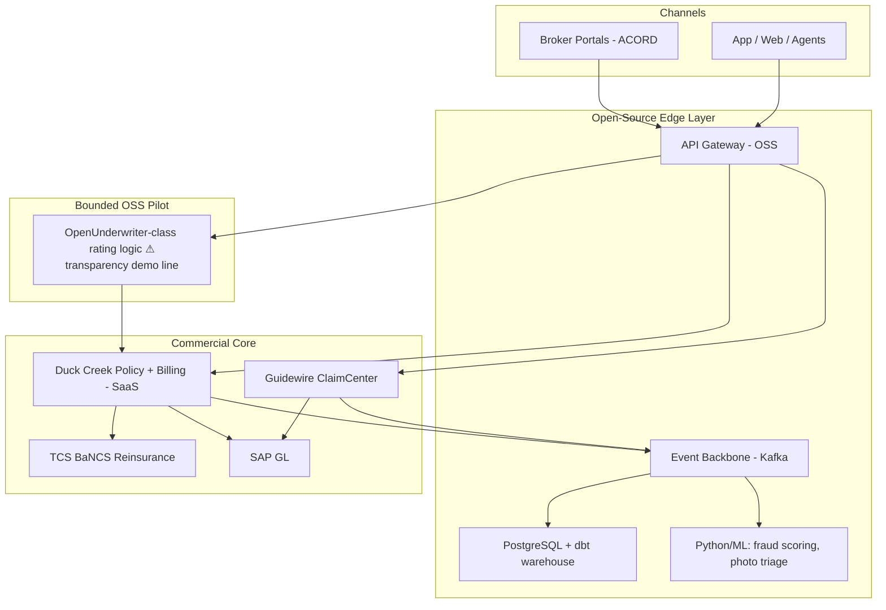

# Open-Source Insurance Systems and Commercial Systems: The Insurance-Platform Landscape

> **Author:** Jack Liu Shurui — Solution Architect at Crédit Agricole CIB, Singapore
> **Context:** Financial Services Technology — Open-Source vs Commercial Insurance Platforms, Core Systems, Selection
> **Repository:** [github.com/jackliusr/research](https://github.com/jackliusr/research)
> **Series:** Financial Services Software-Systems Guides — the **open-source + open-vs-commercial half** of the insurance series. The **commercial landscape** (Guidewire, Duck Creek, Sapiens, TCS BaNCS, EIS, FINEOS, DXC — plus the AI layer) is deep-dived and verified in [Insurance Software Systems Guide](insurance_software_systems_guide.md) and is **cross-referenced here, not re-derived**. The PAS mechanics are in [Policy Administration Systems Guide](policy_administration_systems_guide.md); the products/compliance angle in [Insurance Products, Processes and Compliance Guide](insurance_products_processes_compliance_guide.md); the open-core-banking precedent (the pattern this guide measures open-source insurance against) in [Apache Fineract Guide](apache_fineract_guide.md); TCO methodology in [FinOps Guide](../technology/finops_guide.md).

**Verification convention used throughout: ✅ = verified in this research pass (project sites, repos, DPG registry, press); ⚠ = flagged (single-source, divergent, approximate, structural inference, or not re-verified in this pass); unmarked = structural/industry knowledge presented as such. The consolidated claims-status notes are in §10. This guide was researched with a search-only web backend (no page extraction), so several fine-grained claims are flagged rather than asserted.**

**How to read this guide:** read §1 for the landscape verdict (sparse OSS, commercial dominance), §2–§4 for the open-source projects themselves (openIMIS and OpenUnderwriter deep-dives), §5 for the open-vs-commercial analysis, §6 as the pointer to the already-verified commercial deep-dive, §7 for selection, §8 for a worked decision, and §9 for the one-page summary. The cross-references to [Insurance Software Systems Guide](insurance_software_systems_guide.md) and [Apache Fineract Guide](apache_fineract_guide.md) carry the verified detail this guide deliberately does not duplicate.

---

## Table of Contents

1. [The Landscape Overview](#1-the-landscape-overview)
   - 1.1 [The Insurance Systems Landscape: The Open-Source Reality Is Sparse](#11-the-insurance-systems-landscape-the-open-source-reality-is-sparse)
   - 1.2 [The Commercial Dominance](#12-the-commercial-dominance)
   - 1.3 [The Landscape Table](#13-the-landscape-table)
2. [The Open-Source Systems](#2-the-open-source-systems)
   - 2.1 [OpenUnderwriter: Underwriting and Rating](#21-openunderwriter-underwriting-and-rating)
   - 2.2 [OpenIMIS: Health Insurance and Social Protection](#22-openimis-health-insurance-and-social-protection)
   - 2.3 [The OSS Landscape: Projects Flagged Sparse](#23-the-oss-landscape-projects-flagged-sparse)
   - 2.4 [The OSS Table](#24-the-oss-table)
3. [Deep-Dive: OpenUnderwriter — The Open-Source Rating Engine](#3-deep-dive-openunderwriter--the-open-source-rating-engine)
   - 3.1 [What It Is: Two Eras, One Name](#31-what-it-is-two-eras-one-name)
   - 3.2 [The Capabilities](#32-the-capabilities)
   - 3.3 [The Architecture](#33-the-architecture)
   - 3.4 [The Strengths and the Limits](#34-the-strengths-and-the-limits)
   - 3.5 [The OpenUnderwriter Table](#35-the-openunderwriter-table)
   - 3.6 [Worked Example: Rating a Motor Policy](#36-worked-example-rating-a-motor-policy-with-openunderwriter-class-logic)
4. [Deep-Dive: OpenIMIS — The Open-Source Health-Insurance Management System](#4-deep-dive-openimis--the-open-source-health-insurance-management-system)
   - 4.1 [What It Is](#41-what-it-is)
   - 4.2 [The Origin Story: Tanzania to Digital Public Good](#42-the-origin-story-tanzania-to-digital-public-good)
   - 4.3 [The Functional Scope](#43-the-functional-scope)
   - 4.4 [The Architecture](#44-the-architecture)
   - 4.5 [The Deployments](#45-the-deployments)
   - 4.6 [The OpenIMIS Table](#46-the-openimis-table)
   - 4.7 [What OpenIMIS Proves — and Does Not Prove](#47-what-openimis-proves--and-does-not-prove)
   - 4.8 [Worked Example: A Scheme Claim Through openIMIS](#48-worked-example-a-scheme-claim-through-openimis)
5. [The Commercial Comparison: Open vs Commercial](#5-the-commercial-comparison-open-vs-commercial)
   - 5.1 [The Open-vs-Commercial Table](#51-the-open-vs-commercial-table)
   - 5.2 [TCO Deep-Dive: License-Free Is Not Cost-Free](#52-tco-deep-dive-license-free-is-not-cost-free)
   - 5.3 [Support Deep-Dive: Community vs SLA](#53-support-deep-dive-community-vs-sla)
   - 5.4 [Compliance Deep-Dive: The Regulatory Gap](#54-compliance-deep-dive-the-regulatory-gap)
6. [The Commercial Landscape (Cross-Reference)](#6-the-commercial-landscape-cross-reference)
   - 6.1 [The Six Vendors, Condensed](#61-the-six-vendors-condensed)
   - 6.2 [The Commercial Table (Condensed)](#62-the-commercial-table-condensed)
   - 6.3 [Where the Commercial Market Stands](#63-where-the-commercial-market-stands)
7. [The Selection Guidance](#7-the-selection-guidance)
   - 7.1 [Which-for-Which-Need](#71-which-for-which-need)
   - 7.2 [The Selection Table](#72-the-selection-table)
   - 7.3 [The Five-Question Decision Framework](#73-the-five-question-decision-framework)
   - 7.4 [The OSS Due-Diligence Checklist](#74-the-oss-due-diligence-checklist)
8. [Worked Example: A Mid-Size Insurer's Platform Choice](#8-worked-example-a-mid-size-insurers-platform-choice)
   - 8.1 [The Scenario](#81-the-scenario)
   - 8.2 [The Open-vs-Commercial Analysis](#82-the-open-vs-commercial-analysis)
   - 8.3 [The Decision](#83-the-decision)
   - 8.4 [The Hybrid Architecture](#84-the-hybrid-architecture)
   - 8.5 [The Lessons](#85-the-lessons)
9. [Summary: The Open-Source Insurance Reality in One Page](#9-summary-the-open-source-insurance-reality-in-one-page)
10. [Verification Notes](#10-verification-notes)
11. [Glossary](#11-glossary)
12. [References and Further Reading](#12-references-and-further-reading)

---

## 1. The Landscape Overview

### 1.1 The Insurance Systems Landscape: The Open-Source Reality Is Sparse

An insurer's software estate is a **contract-lifecycle estate**, not a transaction estate: the core is the set of systems that run the policy and claim lifecycles — the **PAS** (policy administration system, the system of record for contracts), the **CMS** (claims management system, the system of record for losses), underwriting/rating, billing, reinsurance administration, actuarial, and finance (the full value chain and core-systems map is in [Insurance Software Systems Guide](insurance_software_systems_guide.md) §1).

Within that estate, the question this guide answers is: **where does open source actually stand in 2026?**

The honest answer is a short one: **the open-source insurance landscape is sparse — dramatically sparser than open-source core banking.** The verified field of production-oriented open-source insurance systems amounts to two projects that matter (openIMIS for health financing/social protection; OpenUnderwriter for underwriting/rating and quote-and-buy distribution), one emerging platform (Openkoda, an MIT-licensed application platform with insurance policy/claims templates), a handful of adjacent projects (GNU Health, DHIS2, QuantLib), and a long tail of hobby and niche repositories. There is **no open-source full-lifecycle PAS/CMS for commercial P&C or life insurance with production-grade adoption by a regulated carrier** — none is verifiable in this research pass, and the industry press that covers open-source insurance software consistently lists the same small set of projects (⚠, see §10).

Why is it sparse? The structural reasons are worth stating precisely, because they are exactly the reasons the commercial market stays dominant:

1. **The core is a regulated system of record.** A PAS must be auditable, actuarially sound, and demonstrably correct across multi-year policy lifecycles, endorsements, renewals, and regulatory returns. Certification and sign-off burden falls on the adopting insurer; an open-source core shifts the *engineering* of that burden onto the adopter rather than removing it.
2. **Product configuration depth is the moat.** Commercial cores (Duck Creek Author, Guidewire Product Designer) let business users define products — coverages, rating, documents — without code. No OSS project has matched this; product definition in OSS is mostly code-level, which is precisely what the commercial vendors automated away (see [Insurance Software Systems Guide](insurance_software_systems_guide.md) §6.3).
3. **The integration surface is enormous.** Broker portals (ACORD messaging), bancassurance, reinsurers, GL, regulators. Commercial vendors ship certified ACORD interfaces and partner ecosystems; OSS projects ship APIs and leave the ACORD gateway to the adopter.
4. **There is no funding engine.** Open-source core banking got Fineract (foundation-governed, Grameen Foundation lineage, aid-funded financial-inclusion economics — see [Apache Fineract Guide](apache_fineract_guide.md) §1) and Mojaloop (payments interoperability, [Mojaloop Guide](mojaloop_guide.md)). Insurance has no equivalent catalyst: the demand side that funded Fineract (hundreds of MFIs and digital banks) has no insurance counterpart of comparable scale, and venture capital has preferred InsurTech point solutions over open cores.
5. **Insurers buy, they do not build.** The carrier operating model is license-and-implement, not run-your-own-OSS. The people who would sustain an OSS insurance core are employed by vendors and SIs, not by the projects.

The one counter-example that proves the pattern — **openIMIS** — succeeded precisely because it inverted several of these conditions: a narrow, standardised domain (national health-financing scheme administration), funder-backed economics (GIZ/BMZ, Swiss SDC), and government demand rather than carrier demand (§4).

### 1.2 The Commercial Dominance

The commercial side of the landscape is deep-dived and verified in [Insurance Software Systems Guide](insurance_software_systems_guide.md) §5 — this guide cross-references it rather than re-deriving it. The headline facts, in brief:

- **The core market** is dominated by Guidewire (P&C: PolicyCenter/ClaimCenter/BillingCenter), Duck Creek (P&C, OnDemand SaaS), Sapiens (CoreSuite spanning P&C/life/health), TCS BaNCS (P&C/life/health/reinsurance, Asia-strong), EIS by EXL (digital-first), FINEOS (life/accident & health/employee benefits), and DXC Assure (commercial & specialty) — all verified in the companion guide.
- **Market size:** the insurance software market is estimated at roughly **US$14–18 billion (2025), growing ~6–10% CAGR ⚠** — divergent analyst estimates (Mordor US$14.14B; VPA US$17.79B; ResearchAndMarkets US$14.1B ⚠). The core-systems sub-market is a low-single-digit-billion slice ⚠. **Open-source share of the core market is effectively unmeasurable — i.e., negligible.** No analyst estimate even segments it ⚠.
- **Why adoption is slow:** the industry press attributes the sector's tech-adoption lag primarily to **legacy core infrastructure** (technology.org, Jan 2026 ✅ — "Legacy infrastructure remains one of the strongest barriers to technology adoption in insurance"); the same legacy cores that slow commercial modernisation also make an OSS replacement *harder*, not easier, because the OSS project would have to reproduce decades of accumulated product logic.
- **The direction of travel is commercial SaaS**, not OSS: Guidewire Cloud, Duck Creek OnDemand, Sapiens cloud — "core as a service" is the defining trend (see [Insurance Software Systems Guide](insurance_software_systems_guide.md) §6.1).

The framing for the rest of this guide: **the commercial landscape is the default; open source is the exception — and the exception is worth understanding precisely because it is so rare.** In banking, the open-core precedent (Fineract) forces a serious open-vs-commercial analysis; in insurance, the honest analysis mostly concludes "commercial core, OSS everywhere else" — and the worked example in §8 shows why.

### 1.3 The Landscape Table

| Category | Examples | Notes |
|---|---|---|
| Commercial P&C cores | Guidewire InsuranceSuite (PolicyCenter/ClaimCenter/BillingCenter) ✅, Duck Creek OnDemand ✅ | Market leaders; full verification in [Insurance Software Systems Guide](insurance_software_systems_guide.md) §5 |
| Commercial multi-LOB suites | Sapiens CoreSuite ✅, TCS BaNCS for Insurance ✅ | Span P&C, life, health; BaNCS also reinsurance |
| Commercial LA&H / employee benefits | FINEOS Platform (AdminSuite, Claims) ✅ | Life/accident & health claims leadership |
| Commercial digital-first / specialty | EIS by EXL ✅, DXC Assure ✅ | Configurable, API-first; modernisation paths |
| **Open-source health financing / social protection** | **openIMIS** ✅ | AGPL-3.0 ✅, certified Digital Public Good ✅, production at national scale (Nepal, Tanzania) |
| **Open-source underwriting / rating / distribution** | **OpenUnderwriter** | Legacy Java/Liferay quote-and-buy suite ✅; modern rewrite (rating engine + UW workbench) ⚠ |
| **Open-source PAS building blocks** | **Openkoda** ✅ | MIT license ✅; Java platform with policy-management, claim-management, embedded-insurance templates |
| Open-source adjacent (not core insurance) | GNU Health ⚠, DHIS2 ⚠, QuantLib ⚠ | Health-sector HIS/data platforms and quant libraries; integration context only |
| Open-source infrastructure (the real OSS success story) | Apache Kafka, PostgreSQL, Elastic, Python/ML stacks | Run *around* commercial cores: event backbones, data platforms, fraud/AI scoring |
| Long tail | SourceForge insurance directory ✅ (exists), `open_insure` (self-insurance policy manager) ⚠, Odoo/ERPNext insurance add-ons ⚠ | Mostly hobby/niche; evidence of demand, not of production platforms |
| "Open Insurance" (concept — not software) | openinsurance.io ecosystem pieces ✅ | API-driven data-sharing movement (eBaoTech-style PaaS ✅) — **not** open source; disambiguated in §2.3 |

---

## 2. The Open-Source Systems

### 2.1 OpenUnderwriter: Underwriting and Rating

**OpenUnderwriter is the open-source project that occupies the underwriting/rating corner of the insurance landscape** — the part of the core stack that decides *whether* to accept a risk and *at what premium* (the underwriting value chain is in [Insurance Software Systems Guide](insurance_software_systems_guide.md) §4).

What verifies cleanly in this pass:

- A SourceForge project ("OpenUnderwriter (Insurance Distribution)") describes it as a **"feature rich insurance quote & buy system for underwriters and brokers"** from an open-source software house specialising in IT solutions for the insurance market ✅ — the **legacy/classic era** of the project, built on **Java with the Liferay portal framework and Hibernate ORM** ✅ (confirmed independently by developer Q&A on Stack Overflow, 2018).
- A YouTube overview presents OpenUnderwriter as "an open source insurance software suite" ✅ (existence; content not re-verified).
- Software-directory listings (SaaSHub, SoftwareSuggest) categorise it as insurance administration/management software with pricing and alternatives pages ✅ (existence of a commercial-adjacent ecosystem around it).

What is flagged rather than asserted (⚠ — industry knowledge, not re-verified in this pass, because the search backend could not reach the project's own GitHub):

- A **modern-era rewrite** under an open-source community org (the "OpenSourceInsurance" GitHub organisation) positioned as a **rating engine + underwriting workbench + quote/issue flow**, with a Python/Django-style backend and a JavaScript front end, marketed around the mid-2010s as the open-source alternative for digital insurance distribution and rating. License believed to be **AGPL-3.0 ⚠** (verify at the repository).
- **Adoption:** no verifiable large-scale production deployment by a regulated carrier ⚠; the plausible usage is InsurTech pilots, MGAs, and digital-distribution MVPs ⚠.

The honest one-line summary: **OpenUnderwriter is real, open source, and aimed at underwriting/rating — but its production footprint in the commercial insurance market is undocumented (likely minimal), and its modern incarnation's activity and license need on-repo verification.** The deep-dive in §3 gives the full treatment.

### 2.2 OpenIMIS: Health Insurance and Social Protection

**OpenIMIS is the open-source flagship of the insurance landscape — the one OSS insurance system with verifiable national-scale production deployments.** It is not a general insurer's PAS; it is a **health-financing and social-protection administration platform**: the software that runs *schemes* — national health insurance, community-based health insurance, cash transfers, employment injury insurance, vouchers, and social registries.

What verifies cleanly in this pass (all ✅):

- **Project and positioning:** "openIMIS is an open source software and certified digital public good. openIMIS provides versatile solutions to manage health financing and social protection programs, including: cash transfers, health insurance, employment injury insurance, vouchers, and social registries" (openimis.org ✅).
- **Digital Public Good certification:** registered with the Digital Public Goods Alliance (digitalpublicgoods.net profile ✅) — the same DPG ecosystem that certifies Apache Fineract (see [Apache Fineract Guide](apache_fineract_guide.md) §1.3).
- **License:** **AGPL-3.0** ✅ — the original IMIS was licensed by the Swiss Agency for Development and Cooperation (SDC) as open source under the GNU Affero General Public License v3 (Wikipedia + openimis.org/origins + the openIMIS GitHub organisation's AGPL-3.0 metadata all agree).
- **Origins:** developed in **Tanzania** for the management of community health insurance schemes ✅; the **openIMIS Initiative** formed in 2016 with a group of professional software developers to turn the original software into an open-source product ✅; **source code published on GitHub in early 2018** ✅.
- **Backers and governance:** the German development agency **GIZ** (BMZ) and the Swiss **SDC** are the anchor funders ✅; the Initiative coordinates the community and technical partners ✅.
- **Scale:** deployed in **Nepal** (Health Insurance Board national scheme, scaled since a 2016 launch in three districts ✅) and **Tanzania** (origin country ✅); a "20+ countries" figure is commonly cited ⚠ (flagged — not re-verified per-country in this pass).
- **Design for low connectivity:** explicitly designed for countries with connectivity issues — server-side operation with **offline-capable mobile access** (UNDP DigitalX catalog ✅).
- **Modern modular architecture:** the GitHub organisation hosts modular repositories (openimis-be-* backend modules, openimis-fe-* front-ends, dev tools) ✅ — consistent with a microservice-style, API-driven rebuild in the current era (the exact stack details are ⚠).

The one-line summary: **openIMIS is the proof that open-source insurance systems can reach production at national scale — when the buyer is a government or scheme operator, the funder pays for the platform and its community, and the domain is health financing rather than commercial P&C.** The deep-dive in §4 gives the full treatment.

### 2.3 The OSS Landscape: Projects Flagged Sparse

Beyond the two flagship projects, the verifiable OSS landscape is thin — which is itself the finding. What exists, with honest flags:

- **Openkoda** ✅ — an **MIT-licensed** open-source Java application platform (github.com/openkoda/openkoda ✅) whose "pre-built application templates" include **Policy Management, Claim Management, Embedded Insurance, and Property Management** ✅; marketed specifically as insurance policy-administration software with quote → bind → issue → endorse → renew → cancel lifecycle coverage and claims administration ✅ (openkoda.com). **Maturity ⚠**: an emerging, commercially-sponsored open-source play (open-source core with a vendor around it — the "open core" pattern familiar from banking, cf. [Apache Fineract Guide](apache_fineract_guide.md)); production adoption by named carriers not verifiable in this pass ⚠.
- **GNU Health** ⚠ — a long-established GNU-licensed open-source health information system whose scope includes health-insurance and social-security *billing* components. It is hospital/health-facility-side, not insurer-side — relevant as the closest thing to "insurance" in the mature FOSS health stack, but not a PAS competitor. Not re-verified this pass.
- **DHIS2** ⚠ — the dominant open-source health-information platform (national health data, routine reporting). Not insurance software, but the integration partner of choice for health-financing systems (openIMIS↔DHIS2 data flows are the standard pattern in the field ⚠). Not re-verified this pass.
- **QuantLib** ⚠ — the well-known open-source quantitative-finance library (pricing/valuation models); used in insurance pricing/actuarial-adjacent modelling. A library, not a platform; not re-verified this pass.
- **Long tail** — the SourceForge insurance directory exists and lists assorted open-source insurance tools ✅ (mostly stale or niche); `open_insure` on GitHub is a small "self-insurance policy management" project ⚠; Odoo/ERPNext insurance add-on modules are community long-tail ⚠. None is a production-grade core.
- **What is missing** (the structural gap): no open-source **full-lifecycle PAS** for commercial P&C or life with regulated production adoption; no **ACORD-native** open-source core; no **claims system** with FNOL-to-subrogation depth comparable to ClaimCenter or FINEOS Claims; no open-source **actuarial reserving/valuation platform** at Prophet/MG-ALFA class (see [Insurance Software Systems Guide](insurance_software_systems_guide.md) §1.2 for the commercial set). Every one of those gaps is a commercial-vendor moat.

**One disambiguation that matters:** "Open Insurance" is a movement for **API-driven data sharing and ecosystem connectivity** (e.g. the openinsurance.io community, eBaoTech-style insurance PaaS connecting channels to legacy cores ✅) — it is *not* open-source software, and conflating the two is a common error in vendor conversations. Open Insurance = open *interfaces*; open source = open *code*. They can coexist (an open-insurance API layer over a commercial core) but are independent decisions.

### 2.4 The OSS Table

| Project | Focus | License | Maturity |
|---|---|---|---|
| **openIMIS** | Health-financing and social-protection scheme administration: health insurance, cash transfers, vouchers, social registries | **AGPL-3.0** ✅ | **Production** ✅ — DPG-certified ✅, national-scale deployments (Nepal, Tanzania) ✅; ~20+ countries ⚠ |
| **OpenUnderwriter** | Underwriting workbench, rating engine, quote-and-buy distribution (P&C) | ⚠ AGPL-3.0 believed for the modern rewrite (verify on repo); legacy era GPL-family ⚠ | Legacy Java/Liferay suite documented ✅; modern rewrite activity/adoption unverifiable ⚠; no documented carrier-scale production ⚠ |
| **Openkoda** | Open-source application platform with insurance PAS templates (policy, claims, embedded insurance) | **MIT** ✅ | Emerging ⚠ — vendor-backed open core; template modules production-oriented ✅ but named-carrier adoption unverified ⚠ |
| **GNU Health** | Hospital health-information system with health-insurance/social-security billing | GPL (GNU package) ⚠ | Mature project ⚠; insurer-side use limited (health-facility side) ⚠ |
| **DHIS2** | National health-information data platform (integration partner for health financing) | ⚠ (BSD-family per common knowledge; not re-verified) | Mature, wide national adoption ⚠ |
| **QuantLib** | Quantitative-finance library (pricing/valuation models, actuarial-adjacent) | BSD-3 ⚠ | Mature library; not an insurance platform |
| **open_insure** | Self-insurance policy and claims management (individual) | ⚠ | Hobby ⚠ |
| **Odoo / ERPNext insurance modules** | Insurance add-ons inside open-source ERPs | GPL-family ⚠ | Community long-tail ⚠ |
| **Infra OSS (Kafka, PostgreSQL, Elastic, Python ML)** | Event backbone, data platform, fraud/AI scoring around the core | Permissive/copyleft mix ✅ | **This is where open source actually dominates in insurance IT** — verified structural knowledge |

---

## 3. Deep-Dive: OpenUnderwriter — The Open-Source Rating Engine

### 3.1 What It Is: Two Eras, One Name

OpenUnderwriter is best understood as **two projects sharing a name and ambition** — an ambition to be the open-source layer for the front of the insurance value chain (underwriting, rating, distribution) rather than the full back office:

- **Era 1 — the classic Java suite (verified ✅):** an open-source "insurance quote & buy system for underwriters and brokers", built on **Java with the Liferay portal framework and Hibernate ORM** (SourceForge project "oquote" ✅; corroborated by a 2018 Stack Overflow question about running the openunderwriter solution with Hibernate ✅). This era is a *distribution-and-quoting* product: portals, quote capture, and buy flows for agents/brokers, in the style of a configurable e-commerce layer for insurance.
- **Era 2 — the modern rewrite (flagged ⚠):** a community-era rewrite (the "OpenSourceInsurance" GitHub organisation, mid-2010s onwards, per industry knowledge) repositioned as a **rating engine + underwriting workbench**: product/rate definition, rating expressions and tables, underwriting rules, quote-to-bind APIs, with a Python/Django-style backend and a JavaScript (Angular-class) quote UI, licensed AGPL-3.0 ⚠. This is the "open-source rating engine" that the insurtech press of 2016–2019 covered as the potential open-source challenger to Guidewire-class cores ⚠.

The rating engine is the anchor capability in both eras: **rating — computing the premium from rating factors (base rates × rating tables/rules) — is the same function that Guidewire PricingCenter and the rating modules of Duck Creek/Sapiens perform inside commercial suites** (see [Insurance Software Systems Guide](insurance_software_systems_guide.md) §4.2).

### 3.2 The Capabilities

Verified or structurally expected capabilities (each flagged where appropriate):

- **Quote-to-bind flow** ✅ (legacy era, documented as quote & buy for underwriters and brokers) — the front of the policy lifecycle: capture application data → rate → produce quote → bind.
- **Rating engine** ⚠ (modern era, per industry knowledge): configurable rate tables, rating factors, and expression-based rating logic; the differentiator of the rewrite.
- **Underwriting rules** ⚠: eligibility/referral/decline rule configuration — the same decisioning layer as commercial UW workbenches, without the commercial depth.
- **Product/rate definition without code** ⚠: configuration-driven rather than code-driven, but with nothing like the no-code product designer depth of Duck Creek Author or Guidewire Product Designer (see [Insurance Software Systems Guide](insurance_software_systems_guide.md) §6.3) — product definition in OU remains closer to configuration-by-developers ⚠.
- **API integration** ✅ (structurally): broker/agent portals and external systems integrate via APIs — the modern era explicitly API-first ⚠; ACORD message handling is **not** a documented out-of-the-box feature ⚠ (a gap vs commercial cores).
- **Not in scope:** no production-grade **billing** (premium billing/collections), no **claims management** of ClaimCenter/FINEOS depth, no **reinsurance administration** — OpenUnderwriter is a front-of-value-chain system, not a full core (structural, unmarked).

### 3.3 The Architecture

- **Legacy era (verified):** Java EE application on the **Liferay portal**, **Hibernate** ORM over a relational database, portal-based user interfaces for underwriters and brokers ✅.
- **Modern era (flagged):** Python/Django-style backend services with a JavaScript single-page front end, REST APIs, configuration-driven product/rate models ⚠; deployment via containers ⚠.
- **Integration pattern (structural):** OU rates and decides; the issued policy still needs to land in a PAS — so OU in practice sits *beside* a policy administration system, which is exactly how a "best-of-breed open UW layer" would integrate with a commercial or in-house PAS.

### 3.4 The Strengths and the Limits

**Strengths:**

- **Zero licence cost** — the rating logic is free to use, fork, and extend; attractive for MGAs, InsurTech MVPs, and price-sensitive digital distribution plays.
- **Auditable rating logic** — open source means the rating rules are *visible*; for a regulated market that prizes demonstrable underwriting governance (see [Insurance Products, Processes and Compliance Guide](insurance_products_processes_compliance_guide.md)), an open rating engine is arguably *more* transparent than a black-box commercial rate table — the transparency argument is real, but the regulatory sign-off burden still rests with the insurer.
- **API-first digital distribution** — quote-and-buy APIs are the modern integration grammar (embedded insurance, broker portals; cf. [Insurance Software Systems Guide](insurance_software_systems_guide.md) §6.5).
- **No vendor lock-in** — the code, the rate definitions, and the data model are yours.

**Limits (the reason it is not a commercial-core alternative):**

- **Thin community and governance** ⚠ — no foundation, no paid engineering core, no SLA; project activity and security-patch cadence are adoption risks that must be verified on the repo before any commitment.
- **Functional scope** — no billing, no claims, no reinsurance, no actuarial depth; it solves the front of the value chain only.
- **ACORD and regulatory certification absent** ⚠ — the broker-facing messaging standards (ACORD XML/JSON, the de-facto procurement requirement for cores — see [Insurance Software Systems Guide](insurance_software_systems_guide.md) §8.2) are not shipped; the adopter builds and certifies the gateway.
- **Actuarial and regulatory risk transfer** — with a commercial core, the vendor carries some of the "will it compute premiums correctly and pass audit" burden (in reputation if not contract); with OSS, the insurer's own actuaries and risk function carry 100% of it.
- **AGPL considerations** ⚠ — if the AGPL-3.0 license is confirmed, offering the software as a hosted service triggers source-disclosure obligations (§5.2); fine for internal use, a real constraint for SaaS distribution.

### 3.5 The OpenUnderwriter Table

| Aspect | Detail |
|---|---|
| Project | OpenUnderwriter — legacy: OpenUnderwriter Ltd / SourceForge "oquote" ✅; modern: "OpenSourceInsurance" community org ⚠ |
| Focus | Underwriting workbench, rating engine, quote-and-buy insurance distribution |
| License | ⚠ AGPL-3.0 believed for the modern rewrite (verify at repo); legacy era GPL-family ⚠ |
| Stack | Legacy: Java / Liferay portal / Hibernate ✅; modern: Python/Django-style backend + JS SPA ⚠ |
| Rating model | Configurable rate tables + expression-based rating rules ⚠ |
| Maturity | Legacy suite documented and downloadable ✅; modern activity/adoption unverifiable in this pass ⚠; no documented regulated-carrier production ⚠ |
| Best fit | ⚠ MGAs, digital-distribution pilots, InsurTech MVPs, rating-transparency experiments; NOT a full-core replacement |
| Key gaps | Billing, claims, reinsurance, ACORD certification, actuarial platforms — none shipped |
| vs commercial | Guidewire UnderwritingCenter/PricingCenter, Duck Creek UW, Sapiens UW (see [Insurance Software Systems Guide](insurance_software_systems_guide.md) §4.3); point-AI vendors Cytora/Planck for commercial submission processing ✅ |

### 3.6 Worked Example: Rating a Motor Policy with OpenUnderwriter-Class Logic

To make the "rating engine" concrete — this is the same rating computation the commercial cores perform ([Insurance Software Systems Guide](insurance_software_systems_guide.md) §2.3, §4.2), expressed as the kind of configurable rate table an OpenUnderwriter-class engine would hold (illustrative figures; the *mechanics* are structural, the *rates* are invented for the example):

| Rating factor | Value | Rate effect (illustrative) |
|---|---|---|
| Base rate (comprehensive, private car) | — | S$1,200 ⚠ (illustrative) |
| Driver age | 24 | ×1.45 (under-25 loading) |
| Claims history (NCD) | 3 years no-claim | ×0.55 (NCD discount) |
| Vehicle group | Group 5 (mid-size sedan) | ×1.10 |
| Annual mileage | 18,000 km | ×1.05 |
| Coverage options | + windscreen cover | +S$60 flat |
| **Computed annual premium** | | **S$1,200 × 1.45 × 0.55 × 1.10 × 1.05 + 60 ≈ S$1,163 ⚠** |

In an open-source engine the entire expression (`base_rate × Σ factor loadings + flat additions`) is **visible configuration** — the insurer's actuaries can read, version, and demonstrate the logic to auditors and to MAS. That transparency is OpenUnderwriter's genuine selling point and the reason a bounded pilot (as in the §8 worked example) can be attractive. The commercial equivalents (Guidewire PricingCenter-class) compute the same thing with the same transparency *inside the vendor's governance framework* — the OSS difference is who owns and can audit the code, not the mathematics.

---

## 4. Deep-Dive: OpenIMIS — The Open-Source Health-Insurance Management System

### 4.1 What It Is

**openIMIS is an open-source system for administering health-financing and social-protection schemes** — the software that runs the *payer side* of health insurance: who is enrolled, what services are covered, what providers are accredited, which claims get paid, and how money flows from premiums/contributions to facilities. Verified positioning (openimis.org ✅): "openIMIS provides versatile solutions to manage health financing and social protection programs, including: cash transfers, health insurance, employment injury insurance, vouchers, and social registries."

It is **not** a general insurer's PAS in the commercial sense (no P&C/life products, no commercial rating, no broker/bancassurance distribution) — it is a *scheme administration* system for the health-financing world, which is why its deployment story runs through governments and development agencies rather than through carriers.

### 4.2 The Origin Story: Tanzania to Digital Public Good

The lineage is verified and worth telling precisely, because it is the template for how an open-source insurance system *can* reach production:

| Year | Milestone | Status |
|---|---|---|
| Pre-2016 | IMIS developed for **community health insurance schemes in Tanzania** | ✅ (openIMIS Initiative history) |
| 2016 | **openIMIS Initiative** formed — professional developers transform IMIS into an open-source product | ✅ (openimis.org blog) |
| 2016 | GIZ-supported deployment with the **Health Insurance Board (HIB) of Nepal** for the national social health insurance scheme (launched in 3 districts, April 2016) | ✅ (BMZ/health.bmz.de) |
| 2016–2018 | Swiss **SDC licenses IMIS as open source under AGPL-3.0**; source published on GitHub in **early 2018** | ✅ (openimis.org/origins, Wikipedia) |
| 2018– | Modular rebuild era: openIMIS GitHub organisation with openimis-be-*/openimis-fe-* repositories | ✅ (GitHub org listing) |
| 2020s | **Certified Digital Public Good** (DPGA registry profile) | ✅ (digitalpublicgoods.net) |
| Present | Deployed across health-financing schemes in multiple countries (~20+ per project claims ⚠); Nepal's national scheme scaled nationally on the platform | ✅ for Nepal (BMZ); ⚠ for the aggregate count |

The governance model is the Fineract pattern applied to health insurance: **a funder-backed initiative (GIZ/BMZ + SDC) stewarding an AGPL-licensed codebase, with government scheme operators as the deploying "customers"** — compare [Apache Fineract Guide](apache_fineract_guide.md) §1.2–1.3 (Mifos Initiative/Grameen Foundation → Apache TLP → DPG).

### 4.3 The Functional Scope

Verified scope (openimis.org ✅) plus structural detail:

- **Beneficiary/enrolment management** — the member registry: who is enrolled in the scheme, family/household structures, contribution status. The enrolment record is the "policy" of health insurance.
- **Provider management** — accreditation and configuration of health facilities (hospitals, clinics, pharmacies) that can deliver covered services.
- **Scheme/policy administration** — benefit packages, coverage rules, contribution/premium schedules.
- **Premium/contribution collection** — premium administration, often integrated with mobile-money and bank channels in deployment (structural ⚠).
- **Health claims management** — service claims from providers: submission, validation against entitlement, **adjudication** (is this service covered? is this member entitled?), and **payment** to facilities. This is the health-insurance analogue of the commercial claims lifecycle (FNOL→triage→assess→settle; see [Insurance Software Systems Guide](insurance_software_systems_guide.md) §3.1) — with the claimant being a provider submitting a claim for a service, rather than an insured reporting a loss.
- **Payments and financial management** — provider payments, scheme-level financial reporting.
- **Social-protection extensions** — the platform generalises beyond health insurance to **cash transfers, employment injury insurance, vouchers, and social registries** ✅ — i.e., a common beneficiary/payer core for social-protection programmes.
- **Monitoring and reporting** — scheme statistics for government operators ✅ (structural).
- **Offline-capable mobile access** — designed for low-connectivity environments: server-side operation plus a mobile app usable in remote areas with intermittent connectivity (UNDP DigitalX catalog ✅) — a genuinely differentiating design point vs commercial cores built for always-on data centres.

### 4.4 The Architecture

- **Modular, API-driven rebuild** ✅ — the current-era openIMIS is a collection of modules (backend modules openimis-be-*, front-end modules openimis-fe-*) under the openimis GitHub organisation, communicating via REST APIs — a microservice-style architecture with a relational database (PostgreSQL-class ⚠) and containerised deployment ⚠ (verified only to the level of the repository listing).
- **The integration spine** (structural, flagged ⚠ where fine-grained): national ID/registries, DHIS2 (health data), mobile money and bank payment rails, and claims/encounter data from facility systems. In deployment countries these integrations are typically built by the implementing partners (GIZ, Swiss TPH, and local integrators ⚠).
- **AGPL-3.0 implications** ✅ — governments run the software internally (scheme operations), which is squarely within AGPL's permitted internal use; the copyleft matters mainly if a commercial operator wanted to offer openIMIS as a SaaS product, where source-disclosure obligations would attach (§5.2).

### 4.5 The Deployments

| Deployment | Context | Status |
|---|---|---|
| **Nepal** | National health insurance via the **Health Insurance Board**; launched in 3 districts April 2016, scaled nationally; HIB publicly values openIMIS for "stability, flexibility, and user-friendliness" | ✅ (BMZ/health.bmz.de) |
| **Tanzania** | Origin country — community health insurance funds | ✅ (Initiative history) |
| **Cameroon and others** | Additional national/regional health-financing schemes | ⚠ (project claims; per-country not re-verified this pass) |
| Aggregate | "~20+ countries" commonly cited by the project and its funders | ⚠ (flag: not re-verified per-country) |

### 4.6 The OpenIMIS Table

| Aspect | Detail |
|---|---|
| Project | openIMIS — openimis.org; GitHub organisation "openimis" ✅ |
| Focus | Health-financing and social-protection scheme administration: health insurance, cash transfers, employment injury, vouchers, social registries ✅ |
| License | **AGPL-3.0** ✅ (SDC licensing; GitHub metadata; Wikipedia) |
| Governance | openIMIS Initiative; anchor funders GIZ (BMZ, Germany) and SDC (Switzerland) ✅; technical partners incl. Swiss TPH ⚠ |
| Maturity | **Production at national scale** ✅ (Nepal HIB; Tanzania origin); **certified Digital Public Good** ✅ |
| Deployments | Nepal ✅, Tanzania ✅, ~20+ countries ⚠ |
| Architecture | Modular openimis-be-*/openimis-fe-* repos, REST APIs ✅; PostgreSQL-class DB and containers ⚠; offline-capable mobile ✅ |
| Best fit | National/regional health-financing schemes, social-protection programmes, community-based health insurance — government/funder economics |
| Not for | Commercial P&C/life policy administration, broker distribution, commercial rating — out of scope by design |
| vs commercial analogues | Closest commercial relatives: Sapiens HealthSuite-class payer platforms ⚠; but openIMIS competes on funder/government procurement economics, not carrier features |

### 4.7 What OpenIMIS Proves — and Does Not Prove

**What it proves:** that an open-source insurance system can reach production at national scale, hold up under government scrutiny, and sustain a community for a decade. The conditions: (1) a **narrow, standardised domain** (scheme administration is far more standardised across countries than commercial product configuration); (2) **funder-backed economics** — the platform and its community are paid for by development agencies, so "free software" doesn't mean "unfunded software"; (3) **government demand** — scheme operators value auditability, sovereignty, and zero licence cost, and are less sensitive to the enterprise-support gap than carriers; (4) **DPG certification** as a procurement currency in the aid ecosystem (the same currency as Fineract — [Apache Fineract Guide](apache_fineract_guide.md) §1.1).

**What it does not prove:** that open source can replace a commercial core in a regulated commercial insurer. The domain, buyer, and economics that made openIMIS work are all absent in the carrier world — which is precisely why the commercial landscape (§6) is untouched by OSS, and why the selection guidance (§7) and worked example (§8) route carriers to commercial cores with OSS at the edges.

### 4.8 Worked Example: A Scheme Claim Through openIMIS

To make the "health insurance management" concrete, the scheme-claim flow (structural, based on openIMIS's verified scope of beneficiary/provider/claim/payment administration):

| Step | Actor | What happens in openIMIS |
|---|---|---|
| 1 | Member | Enrolled in the scheme; family record created with contribution status (verified scope ✅: beneficiary management) |
| 2 | Provider | Accredited facility logs in; confirms member's entitlement against the scheme registry (verified scope ✅: provider management + entitlement validation) |
| 3 | Provider | Submits a service claim (consultation + medication) with the member's ID and service codes |
| 4 | openIMIS | Validates: is the member enrolled and contributions current? is the service in the benefit package? (verified scope ✅: coverage rules, claims validation) |
| 5 | openIMIS | **Adjudicates** the claim — auto-pay within rules, or flag for review — and computes the payment to the facility |
| 6 | Payer | Payment instruction issued (premium/contribution reconciliation and payments are verified scope ✅); offline-capable mobile access supports rural facilities with intermittent connectivity (UNDP ✅) |
| 7 | Scheme operator | Reports: claims paid, utilisation, provider activity — the data that runs a national scheme (verified scope ✅: monitoring/reporting) |

The contrast with a commercial P&C claim (FNOL → triage → assess → settle → recover; [Insurance Software Systems Guide](insurance_software_systems_guide.md) §3) is the point: **openIMIS's "claim" is a service-adjudication event between a provider and a payer, not a loss investigation** — a simpler, more standardised domain, which is exactly why an open-source platform could reach national scale there and not in commercial P&C.

---

## 5. The Commercial Comparison: Open vs Commercial

### 5.1 The Open-vs-Commercial Table

The comparison is not "worse vs better" — it is **fit** (the same framing the Fineract guide uses for banking cores: [Apache Fineract Guide](apache_fineract_guide.md) §15). The dimensions that matter to a solution architect:

| Dimension | Open source (verified set: openIMIS, OpenUnderwriter, Openkoda) | Commercial (Guidewire, Duck Creek, Sapiens, TCS BaNCS, EIS, FINEOS, DXC — [Insurance Software Systems Guide](insurance_software_systems_guide.md) §5) |
|---|---|---|
| Licence cost | Zero (but AGPL copyleft obligations for SaaS delivery — §5.2) | Licence fees typically six-to-seven figures annually for a mid-size carrier ⚠ |
| Implementation | Self or SI-built; the adopter owns the build, integration, and documentation | Vendor + SI implementation; mature accelerators; 1–3× licence typical ⚠ |
| Total cost of ownership | Licence-free but build/run/change-heavy; costs concentrate in engineering and compliance | Licence-heavy but lower marginal build; change and upgrade costs contractually managed (TCO methodology: [FinOps Guide](../technology/finops_guide.md)) |
| Functional depth | Narrow and specific: scheme administration (openIMIS), rating/UW (OpenUnderwriter), PAS templates (Openkoda) | Full lifecycle: PAS + billing + claims + reinsurance + actuarial interfaces, ACORD-certified |
| Product configuration | Code/configuration by developers | No-code business-user product definition (Duck Creek Author, Guidewire Product Designer — [Insurance Software Systems Guide](insurance_software_systems_guide.md) §6.3) |
| Compliance readiness | Adopter builds everything: ACORD gateways, regulatory reporting, audit trails, actuarial sign-off packs | Vendor compliance packs, ACORD certification, SOC/security attestations, MAS outsourcing documentation support ⚠ |
| Support and SLA | Community/self-support; no SLA; patch cadence is a risk to verify | Vendor SLAs, 24/7 support, upgrade guarantees, release cadence (SaaS) |
| Security | Self-hardened, self-audited | Vendor-managed security programme, third-party audits |
| Roadmap | Community-driven — can stall (OpenUnderwriter ⚠) or thrive (openIMIS, funder-backed ✅) | Vendor-driven, multi-year, financed by licence revenue |
| Vendor lock-in | None legally (data and model portability are DIY) | High; exit rights and data export are contractual, not technical (see [Insurance Software Systems Guide](insurance_software_systems_guide.md) §5.5) |
| Innovation | Forks, transparency, auditability of logic | SaaS cadence, AI accelerators (Shift, Tractable, ZestyAI — [Insurance Software Systems Guide](insurance_software_systems_guide.md) §5.2) |
| Regulatory-risk bearer | The insurer carries 100% | The vendor carries reputational/contractual weight (not legal liability) |
| Best fit | Budget-constrained or aid-funded schemes, build-capable teams, MVPs, niche domains, non-regulated or lightly-regulated contexts | Regulated commercial carriers at production scale; the default for P&C/life/health carriers |
| Where it actually wins in a carrier | **At the edges**: event backbone (Kafka), data platform (PostgreSQL/Snowflake-class + dbt), fraud/AI scoring, rating-transparency experiments | **At the core**: the system of record |

### 5.2 TCO Deep-Dive: License-Free Is Not Cost-Free

The single most common error in open-vs-commercial analysis is comparing **commercial licence fees against zero**, and stopping. The correct comparison is **total cost of ownership over the platform's life** (the methodology is in [FinOps Guide](../technology/finops_guide.md); the banking-side worked numbers are in [Apache Fineract Guide](apache_fineract_guide.md) §15):

- **Commercial TCO (10 years, mid-size carrier ⚠):** licence (recurring, escalating) + implementation (typically 1–3× first-year licence ⚠) + integration (the real project — interfaces with brokers, banks, reinsurers, GL, regulators are 80% of the effort; [Insurance Software Systems Guide](insurance_software_systems_guide.md) §9.5) + run/cloud + change (config, upgrades) + SI/partner retainers.
- **Open-source TCO (same book of business ⚠):** licence = 0, but: (1) **engineering** — you staff the platform team the vendor would otherwise provide (core configuration, product definition, data model); (2) **integration engineering** — ACORD gateway, regulator returns, GL postings, all built and maintained by you; (3) **compliance engineering** — actuarial validation, audit trails, security hardening, MAS outsourcing-equivalent controls for your own team; (4) **maintenance risk** — if the community stalls (a real risk for OpenUnderwriter ⚠), the team becomes the maintainer; (5) **exit/portability** — the data model is yours, but migrating *out* of an in-house-built system is still a migration programme.
- **The honest arithmetic:** for a regulated carrier, the 10-year TCO gap between "commercial core" and "OSS core you complete yourself" is **far narrower than the licence sticker suggests** ⚠ — and for the full-lifecycle core it is usually *negative* (the OSS route costs more once you price the missing billing/claims/reinsurance/compliance work). This is the structural reason the commercial landscape is untouched.
- **Where OSS TCO is genuinely superior:** infrastructure and analytics (Kafka, PostgreSQL, Elastic, Python/ML — zero licence, huge community, production-grade), and **narrow domains with a funded community** (openIMIS: the funder pays the community cost, so a scheme operator's TCO is genuinely licence-free-plus-integration ✅).
- **The AGPL tax (⚠ — verify per project):** AGPL-3.0 (openIMIS ✅, OpenUnderwriter ⚠) requires that **modified software offered as a network service disclose its source** — the "SaaS loophole" is closed. Internal scheme/carrier operations are unaffected; a vendor selling openIMIS/OpenUnderwriter as SaaS, or a carrier offering rating-as-a-service on AGPL code, must open-source the service layer. MIT (Openkoda ✅) has no such obligation. A compliance review of every OSS component's license is mandatory before any platform decision.

### 5.3 Support Deep-Dive: Community vs SLA

- **Commercial:** vendor SLAs, 24/7 support tiers, named TAMs, upgrade guarantees, and SI ecosystems (Accenture/Deloitte/Capgemini/TCS-class implementers — [Insurance Software Systems Guide](insurance_software_systems_guide.md) §5.5). For a system of record, "who do we call at 2am when the renewal batch breaks" has a real answer.
- **Open-source reality, project by project:**
  - **openIMIS** — the *best-supported* OSS insurance project: an Initiative with funded coordination, GIZ/BMZ and SDC sponsorship, technical partners (Swiss TPH-class ⚠), and implementing-partner ecosystems in deployment countries ✅; but support is programme-shaped (deployment projects, government programmes), not a commercial SLA.
  - **OpenUnderwriter** — community-shaped ⚠; no verifiable commercial support arm in this pass ⚠; support means the community, a hired SI, or your own team.
  - **Openkoda** — vendor-backed (the open-core model): the commercial entity behind the MIT platform sells support and acceleration ⚠; typical of the "open core with a support vendor" pattern.
  - **Infra OSS (Kafka, PostgreSQL, Elastic)** — effectively industry-standard support markets exist (Confluent, EDB/enterprise PG, Elastic) — the mature OSS pattern: *the software is free; support is purchasable from specialists*.
- **The pattern to remember:** in OSS, support is *purchasable but never bundled* — the budget line exists either way; it just moves from "vendor licence" to "SI retainer or specialist vendor".

### 5.4 Compliance Deep-Dive: The Regulatory Gap

Compliance is where the open-vs-commercial gap is widest, and where a Singapore solution architect's MAS lens matters most (the regulatory context is in [Insurance Software Systems Guide](insurance_software_systems_guide.md) §7.2 and [Insurance Products, Processes and Compliance Guide](insurance_products_processes_compliance_guide.md)):

- **MAS outsourcing and technology-risk expectations:** MAS requires insurers to oversee outsourced service providers (MAS Notice 644 / TRM guidelines-class ⚠), including cloud and SaaS vendors. With an OSS core, the "vendor" is your own engineering team — the outsourcing framework still applies, just to *your* operation, and you carry the third-party-risk analysis for every OSS component in the supply chain (each dependency is a "sub-contractor" with its own security posture).
- **Data residency and access:** Singapore policyholder data residency expectations apply identically to OSS deployments; with OSS you control the hosting, which can be an advantage (data sovereignty) — at the price of operating the platform yourself.
- **ACORD and industry standards:** ACORD-compliant messaging is a de-facto procurement requirement for broker-facing cores ([Insurance Software Systems Guide](insurance_software_systems_guide.md) §8.2). No OSS project ships certified ACORD interfaces ⚠ — the gateway is adopter-built. Commercial vendors ship them.
- **Actuarial and financial reporting:** IFRS 17 and RBC reporting need actuarial-grade data and audit trails ([Data Models for Banking and Insurance](data_models_banking_insurance_guide.md) §5). OSS platforms were not built against these requirements; the actuarial sign-off evidence chain is adopter-built. No open-source actuarial valuation platform at Prophet/MG-ALFA class exists (see §2.3).
- **The one compliance advantage of OSS:** **transparency of logic**. Open rating rules and open code are auditable by construction — a genuine plus for underwriting-governance demonstrations (the "show us why this premium" problem is answered by the code, not by a vendor's black box). This is a real but narrow advantage; it does not offset the missing certification infrastructure.
- **Bottom line:** for a regulated commercial carrier, the compliance delta between OSS and commercial cores is **the decisive factor**, larger than licence cost and larger than functional depth. This is why §7 and §8 route carriers to commercial cores.

---

## 6. The Commercial Landscape (Cross-Reference)

### 6.1 The Six Vendors, Condensed

Per the series rule, this section **cross-references rather than re-derives**: every vendor claim below is verified in [Insurance Software Systems Guide](insurance_software_systems_guide.md) §5 and its §11 verification notes. The one-line versions for orientation:

- **Guidewire** ✅ — the P&C core market leader: **InsuranceSuite** = PolicyCenter (PAS), ClaimCenter (CMS), BillingCenter, plus UnderwritingCenter and PricingCenter; configuration-over-code (Gosu); now pushed as Guidewire Cloud (SaaS). Best fit: mid-to-large P&C carriers.
- **Duck Creek** ✅ — cloud-native, API-first P&C platform (**OnDemand** SaaS); business-user product configuration (Duck Creek Author); strong in personal lines and mid-market.
- **Sapiens** ✅ — **CoreSuite** for P&C plus life/health suites (LifeSuite, HealthSuite); heavy in US P&C mid-market and health.
- **TCS BaNCS for Insurance** ✅ — end-to-end P&C/life/health/**reinsurance** suites; parameter-driven; strong in Asia-Pacific, India, UK.
- **EIS (by EXL)** ✅ — **PolicyCore** / EIS Core Insurance Suite; configurable, digital-first, group-benefits strength; EXL acquisition (2024 ⚠).
- **FINEOS** ✅ — **FINEOS Platform/AdminSuite** for Life, Accident & Health and Employee Benefits; **FINEOS Claims** the flagship claims product.
- Plus **DXC Assure** ✅ (commercial & specialty, life) and the AI layer — **Shift Technology** (fraud), **Tractable** (vision claims), **ZestyAI** (property risk), **Planck/Cytora** (commercial UW) — all verified in the companion guide.

### 6.2 The Commercial Table (Condensed)

| Vendor | Product | Lines | Deployment | Fit (from [Insurance Software Systems Guide](insurance_software_systems_guide.md) §5.3) |
|---|---|---|---|---|
| Guidewire | InsuranceSuite: PolicyCenter, ClaimCenter, BillingCenter (+UW/Pricing) | P&C | On-prem, cloud, SaaS | Mid-to-large P&C carriers; claims benchmark |
| Duck Creek | OnDemand: Policy, Billing, Claims, Reinsurance | P&C (personal-lines strong) | SaaS-native, API-first | Personal lines, mid-market, digital-first |
| Sapiens | CoreSuite (P&C), LifeSuite, HealthSuite | P&C, life, health | On-prem/cloud/SaaS | Multi-LOB breadth; US mid-market |
| TCS BaNCS | BaNCS for P&C/Life/Health/Reinsurance | P&C, life, health, RI | On-prem/managed services | Full value chain incl. reinsurance; strong Asia |
| EIS (by EXL) | EIS Core / PolicyCore | P&C, group benefits | Cloud, API-first | Digital-led insurers, group benefits |
| FINEOS | Platform: AdminSuite, Claims | LA&H, employee benefits | Cloud/SaaS | Life, group, disability insurers |
| DXC | DXC Assure (+Ingenium legacy) | Commercial & specialty, life | Cloud-enabled | DXC legacy estates, specialty carriers |

*The open-source alternatives from §2 sit against this table like this: OpenUnderwriter ≈ a UW/rating component where UnderwritingCenter/PricingCenter or Sapiens/TCS UW modules sit; openIMIS ≈ a payer-side scheme administrator with no direct commercial-table counterpart; Openkoda ≈ a build-your-own-PAS base with no packaged equivalent in the commercial table (commercial vendors sell finished cores, not templates).*

### 6.3 Where the Commercial Market Stands

Verified/flagged in the companion guide (§5.4): insurance software market ~US$14–18B (2025), 6–10% CAGR ⚠; cloud/SaaS the fastest segment; no reliable vendor-share numbers for P&C cores ⚠; the core sub-market is the highest-stakes spend despite being a small slice. For this guide the relevant points are: (1) **the commercial market is growing, cloud-shifted, and AI-accelerated** — none of which favours OSS cores; (2) **the open-source share is not even segmented by analysts** — the strongest available evidence of its negligible size ⚠; (3) the "open insurance" API movement (§2.3) is the only open-*ness* trend the commercial market is absorbing, and it coexists with commercial cores rather than replacing them.

---

## 7. The Selection Guidance

### 7.1 Which-for-Which-Need

- **A regulated commercial insurer (P&C or life) replacing its core** → **commercial core** (Guidewire/Duck Creek class for P&C; Sapiens/TCS BaNCS/FINEOS for life/health/benefits). There is **no credible OSS alternative** for a full-lifecycle regulated core — the compliance and functional gaps in §5.2–5.4 are decisive. OSS enters at the edges: event backbone, data platform, fraud/AI scoring, rating-transparency experiments.
- **A national or regional health-financing scheme / social-protection programme** → **openIMIS** ✅. The fit is exact (scheme administration, AGPL, DPG procurement currency, funder ecosystem), the deployment economics are proven at national scale (Nepal, Tanzania), and the offline-capable design suits emerging-market connectivity. Budget for integration partners (national ID, DHIS2, mobile money) — the platform is free; the integration is the project.
- **A digital-insurance MVP, MGA, or distribution pilot with a strong engineering team** → **OpenUnderwriter (rating/UW) ⚠ + Openkoda (PAS templates) ⚠ hybrid, or Openkoda alone**. Verify repo activity, license, and security posture before committing (⚠ — both projects need on-repo due diligence); budget for the missing billing/claims/compliance pieces; keep the regulatory exposure bounded (non-regulated or lightly-regulated lines first).
- **Fraud detection, claims analytics, UW copilots** → **commercial point AI** (Shift, Tractable, ZestyAI, Planck, Cytora — verified in [Insurance Software Systems Guide](insurance_software_systems_guide.md) §5.2) **on OSS infrastructure** (Kafka events, Python/ML, Elastic) — this is the pattern where open source genuinely dominates in insurance.
- **An open-core-banking-adjacent decision** → the Fineract precedent ([Apache Fineract Guide](apache_fineract_guide.md) §15): foundation governance, permissive Apache license, DPG certification, and aid-funded economics made open core banking viable in its niche. **Insurance has no Fineract for commercial lines** — openIMIS is the closest analogue and only in the health-financing niche. If a client asks "is there an open-source Guidewire?", the honest answer is: not in production, not regulated-ready, not funded — watch openIMIS's scope and any foundation-backed P&C core as the bellwethers.

### 7.2 The Selection Table

| Need | Recommended | Why | OSS role |
|---|---|---|---|
| Regulated P&C core replacement | Commercial (Guidewire/Duck Creek class) | Full lifecycle, ACORD, compliance packs, SLA | Edges only: Kafka/PostgreSQL/analytics |
| Regulated life/health/benefits core | Commercial (Sapiens/TCS BaNCS/FINEOS class) | Life PAS depth, actuarial interfaces, IFRS 17 support | Edges only |
| Health-financing scheme administration | **openIMIS** ✅ | Exact domain fit, AGPL, DPG, national-scale proof, funder ecosystem | **The core itself** — the one verified OSS-core case |
| InsurTech MVP / MGA distribution | Openkoda ✅ + OpenUnderwriter ⚠ (due diligence) | MIT platform + rating/UW component; zero licence; API-first | Core, with engineering ownership |
| Claims fraud / AI / analytics | Commercial point AI + OSS data/event stack | Best-of-breed AI on open infrastructure | Infrastructure layer |
| Rating-transparency / UW governance experiment | OpenUnderwriter ⚠ (or in-house OSS engine) | Auditable rating logic | Component beside the PAS |
| Embedded/partner distribution | API-first core — commercial or OSS template | Open Insurance API pattern (§2.3) | API layer regardless of core choice |

### 7.3 The Five-Question Decision Framework

Before any open-vs-commercial decision, answer these five in order:

1. **Is the domain regulated?** Regulated commercial lines → commercial core; the compliance delta (§5.4) outweighs licence economics. Non-regulated or lightly-regulated (schemes, MVPs, MGAs) → OSS is on the table.
2. **Who carries the actuarial/regulatory risk?** With OSS, your team carries 100% of "will this compute correctly and pass audit". If the answer is "we can and we want to" (a genuine engineering organisation), OSS survives question 2; otherwise the vendor takes it (commercial).
3. **What is the 10-year TCO, not the licence?** Price the engineering, integration, compliance, and maintenance the vendor would otherwise provide (§5.2). If the OSS route's fully-loaded cost is still dramatically lower and the team can execute — proceed to question 4.
4. **Is the community/support real?** Verify on the repo: activity, releases, security fixes, governance, commercial support options. openIMIS passes (funder-backed ✅); OpenUnderwriter needs on-repo proof ⚠; Openkoda has a vendor behind it ⚠.
5. **Is the licence compatible?** AGPL (openIMIS ✅, OpenUnderwriter ⚠) is fine for internal operations, a constraint for SaaS; MIT (Openkoda ✅) is unconstrained. Get the license review done before the architecture review.

*Vendor-management mechanics (SLA drafting, exit rights, RFPs) apply to the OSS support vendors and SIs just as they do to commercial vendors — see [Vendor Management Guide](../management/vendor_management_guide.md).*

### 7.4 The OSS Due-Diligence Checklist

When an OSS project survives the five questions, run this checklist before any commitment (each item is a verify-on-repo task — flagged ⚠ because none was fully verifiable via the search-only backend for this pass):

1. **License audit** ⚠ — confirm the exact license at the repository (not the README's summary): AGPL means SaaS source-disclosure obligations; check every dependency's license too (a single GPL dependency can contaminate a "permissive" platform).
2. **Activity** ⚠ — commit cadence, release history, security-patch turnaround; a project with no release in 12 months is a maintenance risk, whatever its past glory.
3. **Governance** ⚠ — who decides the roadmap? A foundation/initiative (openIMIS ✅) is structurally safer than a single maintainer; a vendor-backed open core (Openkoda ⚠) has funding but a commercial agenda.
4. **Production references** ⚠ — named deployments you can call, not just "used by many insurers"; openIMIS has Nepal/Tanzania ✅; most others cannot produce named commercial references.
5. **Security posture** ⚠ — published security policy, dependency scanning, vulnerability response; a system of record with an unmanaged CVE pipeline fails MAS technology-risk expectations.
6. **The missing parts inventory** — list explicitly what the community did *not* ship (billing? claims? ACORD? regulatory reporting?) and price the build; this is the real TCO (§5.2).
7. **The exit plan** — even with OSS, document the data model, the configuration, and the migration path out; "no lock-in" is a legal fact, not a migration-free guarantee.

---

## 8. Worked Example: A Mid-Size Insurer's Platform Choice

### 8.1 The Scenario

Revisit **"Merlion General Insurance"** — the mid-size Singapore general insurer from [Insurance Software Systems Guide](insurance_software_systems_guide.md) §9: S$400M GWP ⚠, ~300 staff, ~40% motor / 25% home / 20% travel-PA / 15% SME commercial, running a 20-year-old in-house PAS (COBOL-class), manual underwriting spreadsheets, claims bolted to the PAS. Pressures: broker API demands, MAS technology-risk expectations, an aging IT team, an app-based competitor in motor claims.

The companion guide's conclusion was **replace the core, modernise distribution, then add AI** — with a commercial stack (Duck Creek Policy+Billing, Guidewire ClaimCenter, TCS BaNCS Reinsurance, FIS Prophet, SAP GL, Snowflake). The question this guide answers: **the board has now asked "can't we do this with open source and save the licence money?"** — the exact question this guide exists to answer.

### 8.2 The Open-vs-Commercial Analysis

**The OSS option, assembled honestly:** OpenUnderwriter for rating/UW ⚠ + Openkoda for policy administration ⚠ + openIMIS — not applicable (health-financing payer domain, not general insurance) + OSS infra (Kafka, PostgreSQL, Python) for the edges. Scored against Merlion's requirements:

| Requirement | OSS assembly (OU ⚠ + Openkoda ⚠ + infra) | Commercial (Duck Creek/Guidewire-class) | Verdict driver |
|---|---|---|---|
| Full P&C policy lifecycle (quote→issue→endorse→renew→lapse, motor/home/travel/SME) | Partial — PAS templates exist (Openkoda ✅) but commercial-line depth, endorsements, renewal/lapse sweeps are adopter-built ⚠ | Shipped, battle-tested ✅ | Commercial wins decisively |
| Billing (premium plans, instalments, collections, commission) | Not shipped — adopter-built | Shipped (Duck Creek Billing; PolicyCenter+BillingCenter class) | Commercial wins |
| Claims (FNOL→reserve→settle→subrogation, motor photo claims) | No OSS CMS at ClaimCenter/FINEOS depth exists (§2.3) | Guidewire ClaimCenter — the P&C benchmark ✅ | Commercial wins (no contest) |
| ACORD broker interfaces (broker-heavy commercial book) | Adopter-built gateway, no certification ⚠ | Certified/shipped ✅ | Commercial wins |
| MAS compliance: outsourcing, data residency, audit, actuarial sign-off | All adopter-built; no vendor attestations; every dependency is a third-party-risk item (§5.4) | Vendor compliance packs, attestations, MAS-outsourcing documentation ⚠ | Commercial wins (decisive) |
| 10-year TCO | Licence 0, but: platform team (10–15 FTE ⚠), ACORD+compliance engineering, maintainer risk | Licence + SI + change; predictable, contractually governed | **Narrower than the sticker suggests — and still commercial-favourable** (§5.2) |
| Team capability | Merlion's IT team is aging; OSS route demands senior platform engineering Merlion does not have | Vendor + SI implement; Merlion's team runs it | Commercial wins |
| Rating transparency | OSS rating logic is auditable — a genuine plus | Black-box-ish rate tables, but pricing models are validated by actuaries regardless | OSS wins one point — narrow |
| Speed to market | Months of assembly before the first product | Accelerators + SaaS → weeks-to-months | Commercial wins |

### 8.3 The Decision

**Merlion goes commercial for the core — and open source for everything around it.** Specifically:

- **PAS + Billing:** Duck Creek OnDemand (SaaS) — the companion guide's choice, unchanged; the OSS assembly failed on functional depth and compliance, not ideology.
- **Claims:** Guidewire ClaimCenter — no OSS alternative exists at that depth (this is the single most decisive row of the table).
- **Underwriting/rating:** commercial UW workbench + **an OSS rating-transparency experiment** — Merlion *can* use OpenUnderwriter-class open rating logic for a pilot line to demonstrate auditable pricing to MAS and to the broker market ⚠ (bounded scope, non-critical first), while the production rating stays on the commercial core. This is the one place the OSS option survives — as a demonstration asset, not the system of record.
- **The edges (where OSS wins outright):** event backbone on **Kafka**, warehouse on **PostgreSQL + Snowflake-class + dbt**, fraud scoring and photo-estimation on **Python/ML** (with Shift/Tractable-class commercial AI on top — [Insurance Software Systems Guide](insurance_software_systems_guide.md) §9.3), document services, and the integration layer — all OSS-first.
- **What Merlion does NOT do:** adopt openIMIS (wrong domain — it is health-financing scheme administration), fork OpenUnderwriter into production without the §7.3 due-diligence pass, or build its own ACORD gateway on OSS for the broker book (buy the certification).

### 8.4 The Hybrid Architecture

**The pattern to remember:** *commercial at the core, open source at the edges, OSS demonstrated in a bounded pilot* — the reverse of the banking open-core pattern (Fineract at the core) because insurance lacks a Fineract for commercial lines.

### 8.5 The Lessons

1. **License-free is not cost-free.** Merlion's TCO analysis showed the OSS assembly saving licence fees but spending the difference (and more) on platform engineering, ACORD/compliance build, and maintainer risk (§5.2) — the classic misread of the zero-price sticker.
2. **The compliance delta is the decision.** For a MAS-regulated carrier, the ACORD certification, attestations, audit trails, and outsourcing framework the vendor ships are worth more than the licence fee (§5.4).
3. **OSS wins at the edges, not the core.** Kafka, PostgreSQL, Python/ML are the open-source success story in insurance IT — every insurer in the series uses them; no insurer in the series runs an OSS core.
4. **The openIMIS lesson is about conditions, not software.** openIMIS works because the domain is narrow, the funder pays, and the buyer is a government scheme operator (§4.7). Change any of those conditions (commercial P&C, carrier budget, shareholder returns) and the economics flip back to commercial.
5. **Watch the bellwethers.** The day an open-source P&C core is foundation-governed, DPG-style certified, and funded (the Fineract recipe) is the day this worked example needs rewriting. Until then, the answer for a mid-size regulated insurer is unchanged: **commercial core, open-source everything around it, and a bounded OSS pilot where transparency is the point.**

---

## 9. Summary: The Open-Source Insurance Reality in One Page

- **The landscape is sparse.** The verified open-source insurance field is two production-relevant projects — **openIMIS** (health-financing and social-protection scheme administration, AGPL-3.0 ✅, Digital Public Good ✅, national-scale in Nepal and Tanzania ✅) and **OpenUnderwriter** (underwriting/rating and quote-and-buy; legacy Java/Liferay suite ✅, modern rewrite ⚠) — plus **Openkoda** (MIT platform with insurance PAS templates ✅), adjacent projects (GNU Health, DHIS2, QuantLib ⚠), and a long tail. There is **no open-source full-lifecycle PAS/CMS for commercial P&C or life with regulated production adoption** — the gap is structural, not accidental (§1.1, §2.3).
- **The commercial dominance is unchanged.** Guidewire, Duck Creek, Sapiens, TCS BaNCS, EIS, FINEOS, DXC — verified in [Insurance Software Systems Guide](insurance_software_systems_guide.md) §5 — own the core; the open-source share of the market is so small that no analyst even segments it ⚠ (§1.2, §6).
- **The comparison is about fit, not ideology.** Commercial wins on functional depth, ACORD/compliance readiness, support/SLA, and risk placement; OSS wins on licence cost, auditability of logic, and sovereignty — and the TCO gap is far narrower than the sticker suggests, because license-free is not cost-free (§5).
- **The one verified OSS-core case is openIMIS** — and its conditions (narrow standardised domain, funder-backed economics, government buyer, DPG procurement currency) are exactly the conditions absent in the commercial carrier world (§4.7).
- **For a mid-size regulated insurer** (the §8 worked example): **commercial core, open source at the edges (Kafka/PostgreSQL/Python/ML), and a bounded OSS pilot where rating transparency is the point** — the pattern that survives every analysis in this guide.
- **The final word — the open-source insurance reality:** open source is real, production-grade, and essential in insurance IT — but it lives at the infrastructure layer and in the health-financing niche, not in the commercial core. The open-core-banking precedent (Apache Fineract — [Apache Fineract Guide](apache_fineract_guide.md)) shows the recipe that could change that: foundation governance, permissive-or-clean copyleft licensing, Digital Public Good certification, and funder economics. No insurance project has yet assembled that recipe for commercial lines. Until one does, the honest architecture is **commercial at the core, open source everywhere else** — and the honest procurement question is not "open source or commercial?" but "who carries the actuarial, regulatory, and maintenance risk, and what are they paid?"

---

## 10. Verification Notes

Claims verified in this research pass (✅) and items flagged (⚠). **Research constraint:** the web backend was search-only (no page extraction) for this pass, so fine-grained on-repo details (exact licenses, release cadence, adoption lists) are flagged for on-repo verification rather than asserted.

| Claim | Status | Basis |
|---|---|---|
| openIMIS is open-source software and a certified Digital Public Good; scope = health financing + social protection (health insurance, cash transfers, employment injury, vouchers, social registries) | ✅ | openimis.org; digitalpublicgoods.net DPG profile |
| openIMIS licensed AGPL-3.0; SDC licensed IMIS as open source under AGPL v3; source published on GitHub early 2018 | ✅ | Wikipedia (openIMIS); openimis.org/origins; openimis GitHub org metadata |
| openIMIS origins in Tanzania community health insurance schemes; openIMIS Initiative formed 2016 | ✅ | openimis.org blog ("Community-minded…") |
| GIZ/BMZ and Swiss SDC backing; Nepal Health Insurance Board deployment (launched 3 districts April 2016, scaled nationally; HIB praise quote) | ✅ | BMZ (bmz.de; health.bmz.de); BMZ Digital |
| openIMIS modular GitHub organisation (openimis-be-*/openimis-fe-* repos); offline-capable mobile access design | ✅ | GitHub org listing; UNDP DigitalX catalog |
| openIMIS "~20+ countries" aggregate deployment count | ⚠ | Project/funder claims; per-country not re-verified this pass (Nepal/Tanzania verified individually) |
| OpenUnderwriter legacy era: open-source "insurance quote & buy system for underwriters and brokers"; Java + Liferay + Hibernate | ✅ | SourceForge project "oquote"; Stack Overflow (2018, Hibernate/Liferay) |
| OpenUnderwriter modern era: OpenSourceInsurance org rewrite, rating engine + UW workbench, Python/Django + JS front end, AGPL-3.0 | ⚠ | Industry knowledge; repo not reachable with search-only backend — verify on GitHub |
| OpenUnderwriter production adoption by regulated carriers | ⚠ | No verifiable evidence in this pass; likely pilot/MGA scope |
| Openkoda: MIT-licensed open-source platform; insurance templates (Policy Management, Claim Management, Embedded Insurance); quote→bind→issue→endorse→renew→cancel lifecycle claims | ✅ | github.com/openkoda/openkoda; openkoda.com |
| Openkoda production adoption by named carriers | ⚠ | Not verifiable in this pass |
| GNU Health, DHIS2, QuantLib licenses and scope | ⚠ | Common knowledge; not re-verified this pass; presented as adjacent context only |
| "Open Insurance" = API/data-sharing movement, distinct from open source; eBaoTech-class PaaS example | ✅ | openinsurance.io (eBaoTech article) |
| Insurance software market ≈ US$14–18B (2025), 6–10% CAGR; open-source core share not segmented (≈ negligible) | ⚠ | Cross-ref [Insurance Software Systems Guide](insurance_software_systems_guide.md) §5.4/§11 (Mordor/VPA/ResearchAndMarkets divergence) |
| Legacy infrastructure is the strongest barrier to insurance tech adoption | ✅ | technology.org (Jan 2026) |
| Commercial vendors: Guidewire InsuranceSuite; Duck Creek OnDemand; Sapiens CoreSuite; TCS BaNCS; EIS by EXL; FINEOS; DXC Assure; AI layer (Shift, Tractable, ZestyAI, Planck, Cytora) | ✅ | Cross-ref [Insurance Software Systems Guide](insurance_software_systems_guide.md) §5 + §11 (verified there) |
| Apache Fineract: Apache License 2.0, DPG, Mifos/Grameen lineage, 20M+ end customers (⚠), open-core-banking precedent | ✅ | Cross-ref [Apache Fineract Guide](apache_fineract_guide.md) §1, §13, §15 |
| No open-source full-lifecycle PAS/CMS for commercial P&C or life with regulated production adoption | ⚠ (structural) | Absence of evidence across this pass's searches; consistent with industry-press lists of OSS insurance software |
| MAS outsourcing/tech-risk expectations, ACORD de-facto requirement, IFRS 17/RBC reporting needs | ✅ | Cross-ref [Insurance Software Systems Guide](insurance_software_systems_guide.md) §7.2; [Insurance Products, Processes and Compliance Guide](insurance_products_processes_compliance_guide.md) |
| Commercial implementation cost typically 1–3× licence ⚠; OSS platform-team TCO estimate (10–15 FTE ⚠) | ⚠ | Industry consensus estimates; TCO methodology in [FinOps Guide](../technology/finops_guide.md) |

---

## 11. Glossary

- **Open source** — software whose source code is published and licensed for anyone to use, study, modify, and redistribute, subject to the license terms (permissive or copyleft). In this guide: the *mode of delivery* — vs proprietary software where the code is closed.
- **OSS — Open-Source Software** — the software itself, considered as a category. OSS is not synonymous with "free of cost": it means free to inspect and modify; operating it still costs engineering, hosting, and support time.
- **Copyleft / AGPL-3.0** — a license family requiring that modified versions be distributed under the same license; AGPL-3.0 extends the obligation to software **offered as a network service** (the "SaaS loophole" is closed). openIMIS is AGPL-3.0 ✅; OpenUnderwriter believed AGPL ⚠.
- **Permissive license** — a license (MIT, Apache-2.0, BSD) allowing use/modification/redistribution with few conditions (attribution). Openkoda is MIT ✅; Apache Fineract is Apache-2.0 ✅ (see [Apache Fineract Guide](apache_fineract_guide.md) §1.3).
- **Commercial (software)** — in this guide, vendor-supplied proprietary platforms sold under licence (Guidewire, Duck Creek, Sapiens, TCS BaNCS, EIS, FINEOS, DXC) with paid support, SLAs, and vendor governance — the default for regulated insurers.
- **Open core** — a business model where the base software is open source and the vendor sells support, SaaS, or enterprise features around it (Openkoda; the Fineract/Mifos ecosystem pattern).
- **Digital Public Good (DPG)** — software certified against the Digital Public Goods Alliance standard (open license, privacy, do-no-harm, etc.); a procurement currency in aid/government ecosystems. openIMIS and Apache Fineract are both DPG-registered ✅.
- **Insurance system** — any software an insurer runs: core (PAS, CMS, UW/rating, billing, reinsurance, actuarial), distribution (portals), data, integration, and back office.
- **Core (insurance core)** — the suite of systems that run the contract lifecycle: PAS, CMS, underwriting, billing, reinsurance administration — the "core banking system" analogue of an insurer (see [Core Banking Systems Guide](core_banking_systems_guide.md)).
- **OpenUnderwriter** — the open-source underwriting/rating project: a legacy Java/Liferay quote-and-buy insurance distribution suite ✅ and a modern community rewrite (rating engine + UW workbench) ⚠.
- **OpenIMIS** — the open-source health-financing/social-protection administration platform (AGPL-3.0 ✅, DPG ✅, Nepal/Tanzania deployments ✅).
- **Underwriting** — risk selection and pricing: deciding whether to accept a risk and at what terms/premium; the process and the system that supports it.
- **Rating** — computing the premium from rating factors (base rates × tables/rules/models); the engine that does this is the rating engine (OpenUnderwriter's anchor capability).
- **Health insurance (scheme context)** — insurance covering medical costs, administered in openIMIS's world by *schemes* (national/community health insurance) with beneficiaries, accredited providers, and service claims.
- **Policy administration** — the management of the policy lifecycle: quote, issue, endorsement, renewal, lapse, reinstatement.
- **PAS — Policy Administration System** — the system of record for insurance contracts; the insurer's "core" in the narrow sense (full treatment in [Policy Administration Systems Guide](policy_administration_systems_guide.md)).
- **Claims (management)** — the loss lifecycle: FNOL → triage → assessment/reserving → settlement → recovery; the CMS is the system of record for losses.
- **CMS — Claims Management System** — the claims system of record; no open-source CMS of ClaimCenter/FINEOS depth exists in production (§2.3).
- **Guidewire** — the P&C core market leader (PolicyCenter/ClaimCenter/BillingCenter; InsuranceSuite) ✅.
- **Duck Creek** — cloud-native P&C platform vendor; **OnDemand** is its SaaS delivery model ✅.
- **Sapiens** — vendor spanning P&C (CoreSuite) and life/health suites ✅.
- **TCS BaNCS** — Tata Consultancy Services' end-to-end insurance suite (P&C/life/health/reinsurance), Asia-strong ✅.
- **EIS (by EXL)** — configurable, digital-first core platform (PolicyCore / EIS Core); EXL acquisition 2024 ⚠ ✅.
- **FINEOS** — Life, Accident & Health and employee-benefits platform; FINEOS Claims the flagship ✅.
- **TCO — Total Cost of Ownership** — all costs over the platform's life: licence, implementation, integration, run, change, support, exit — the correct basis for open-vs-commercial comparison (§5.2; methodology in [FinOps Guide](../technology/finops_guide.md)).
- **Support (in this context)** — the mechanism for fixes, upgrades, and operational help: vendor SLA (commercial) vs community/self/SI (OSS) — purchasable in both worlds, bundled only in the commercial one.
- **Compliance (platform context)** — regulatory readiness shipped with the platform: ACORD certification, audit trails, attestations, MAS outsourcing documentation, actuarial-sign-off evidence — the dimension where OSS and commercial differ most (§5.4).
- **License** — the legal terms governing an OSS component's use (permissive vs copyleft) and a commercial vendor's terms (rights, restrictions, exit). License review is a mandatory pre-decision step for any OSS platform.
- **Maturity** — the operational readiness of a project: governance, releases, security patches, production deployments, funding. openIMIS = high ✅; OpenUnderwriter = unverifiable/low ⚠; Openkoda = emerging ⚠.
- **Selection** — the structured choice of platform(s) against requirements — the §7 framework (regulated? risk-bearer? TCO? community? license?).
- **Build** — developing the platform (or its missing parts) in-house or with SIs — the OSS route in effect: the adopter becomes the builder for whatever the community didn't ship.
- **Buy** — licensing a commercial platform and paying the vendor for its capabilities and risk placement — the default for regulated cores.
- **Build-vs-buy (insurance version)** — not a licence-cost question but a *risk-placement* question: who carries the actuarial, regulatory, and maintenance risk, and what are they paid (§9).

---

## 12. References and Further Reading

**Repository series (cross-references):**
- [Insurance Software Systems Guide](insurance_software_systems_guide.md) — the **commercial** landscape deep-dive (Guidewire, Duck Creek, Sapiens, TCS BaNCS, EIS, FINEOS, DXC, AI layer; market; worked example; verification notes). This guide's commercial half.
- [Policy Administration Systems Guide](policy_administration_systems_guide.md) — the PAS deep-dive the open-source projects are measured against.
- [Insurance Products, Processes and Compliance Guide](insurance_products_processes_compliance_guide.md) — products and the compliance angle (MAS, IFRS 17, RBC).
- [Data Models for Banking and Insurance](data_models_banking_insurance_guide.md) — ACORD/IIW data models; what an OSS core would need to match.
- [Apache Fineract Guide](apache_fineract_guide.md) — the open-source **core-banking** precedent: the recipe (foundation governance, Apache-2.0, DPG, funder economics) that insurance lacks for commercial lines.
- [Fineract Database Models Guide](fineract_database_models_guide.md) — the data-model detail of the open-core precedent.
- [Core Banking Systems Guide](core_banking_systems_guide.md) — the banking core umbrella; the open-core contrast.
- [Temenos T24 Guide](temenos_t24_guide.md) — the commercial core-banking counterpart to the open-core precedent.
- [Mojaloop Guide](mojaloop_guide.md) — the open-source payments-interoperability precedent.
- [FinOps Guide](../technology/finops_guide.md) — TCO methodology for the §5.2 cost deep-dive.
- [Vendor Management Guide](../management/vendor_management_guide.md) — vendor/selection mechanics, applicable to OSS support vendors and SIs alike.

**Primary and secondary sources (this pass):**
- openimis.org (home, origins, blog: "Community-minded: How openIMIS has evolved into a thriving digital public good")
- Digital Public Goods Alliance — openIMIS DPG profile (digitalpublicgoods.net/r/openimis)
- GitHub — openimis organisation (repos, AGPL-3.0 metadata); github.com/openkoda/openkoda (MIT license, insurance templates)
- BMZ / BMZ Digital / health.bmz.de — openIMIS and Nepal Health Insurance Board (GIZ/BMZ programme pages)
- Wikipedia — "OpenIMIS" (AGPL v3 licensing, origins)
- UNDP DigitalX — openIMIS catalog entry (offline-capable design)
- SourceForge — "OpenUnderwriter (Insurance Distribution)" project (oquote); SourceForge insurance directory
- Stack Overflow (2018) — OpenUnderwriter/Liferay/Hibernate setup question
- openkoda.com — insurance policy administration and claims template pages
- openinsurance.io — "How Insurance Leaders are Embracing Open Insurance" (eBaoTech; Open Insurance ≠ open source)
- technology.org (Jan 2026) — "Why Is Technology Adoption Slower in the Insurance Industry?"
- stratoflow.com (2024) — "Open Source Insurance Software: Best Solutions" (secondary landscape list; consistent with this guide's findings)
- SaaSHub / SoftwareSuggest — OpenUnderwriter listing pages (ecosystem existence)

*Guide current as of August 2026. Open-source facts verified against project sites, the DPG registry, GitHub metadata, and press in this pass; the search-only research backend means on-repo details (exact licenses, releases, adoption lists) are flagged for on-repo verification. Commercial facts are cross-referenced to [Insurance Software Systems Guide](insurance_software_systems_guide.md), where they were verified in a prior pass.*
