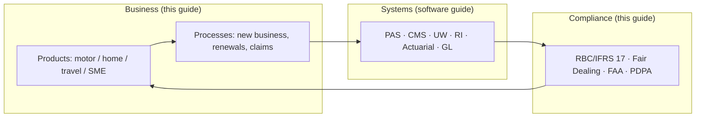

# Insurance Products, Processes, and Compliance: A Comprehensive Guide to the Business of Insurance

> **Author:** Jack Liu Shurui — Solution Architect at Cymbal Bank, Singapore
> **Context:** Financial Services Business — Insurance Product Taxonomy, Product Design, Core Business Processes, Regulatory and Compliance Framework
> **Repository:** [github.com/jackliusr/research](https://github.com/jackliusr/research)
> **Series:** Financial Services Guides — the business-side companion to [Insurance Software Systems](insurance_software_systems_guide.md) (the software/systems landscape: PAS, CMS, underwriting, vendors). The data-model angle (ACORD, IIW, IFRS 17/Solvency II data requirements) lives in [Data Models for Banking and Insurance](data_models_banking_insurance_guide.md); the banking risk/compliance parallels are in [Financial Risk & Compliance Systems](financial_risk_compliance_systems_guide.md); the banking-processes counterpart structure is in [Core Banking Processes Guide](core_banking_processes_guide.md). This guide is the **business deep-dive**: what insurers sell (products), how products are built (anatomy and design), how they are run (processes), and under what rules (compliance) — with a Singapore lens throughout.

**Verification convention used throughout: ✅ = verified in this research pass (primary or secondary sources); ⚠ = flagged (approximate, single-source, divergent estimates, or structural inference); unmarked = structural/industry knowledge presented as such. Consolidated claims-status notes are in §11.**

---

## Table of Contents

1. [The Insurance Product Taxonomy](#1-the-insurance-product-taxonomy)
2. [Product Anatomy and Design](#2-product-anatomy-and-design)
3. [The Distribution Processes](#3-the-distribution-processes)
4. [Underwriting and Policy Servicing](#4-underwriting-and-policy-servicing)
5. [The Claims Process](#5-the-claims-process)
6. [Reinsurance](#6-reinsurance)
7. [The Regulatory and Compliance Framework](#7-the-regulatory-and-compliance-framework)
8. [The Singapore Context](#8-the-singapore-context)
9. [Worked Example: A Mid-Size Singapore General Insurer](#9-worked-example-a-mid-size-singapore-general-insurer)
10. [Summary: The Insurance Business in One Page](#10-summary-the-insurance-business-in-one-page)
11. [Verification Notes](#11-verification-notes)
12. [Glossary](#12-glossary)
13. [References and Further Reading](#13-references-and-further-reading)

---

## 1. The Insurance Product Taxonomy

### 1.1 The Business in One Paragraph

Insurance is a **risk-pooling and cashflow-inversion business**: a pool of policyholders pays premiums *before* any claims are paid, and the gap between premium income and claim outgo is managed by underwriting discipline, actuarial mathematics, investment returns, and regulation. The "product" is a **promise** — a contingent future payment — and the entire business exists to price, administer, and honour that promise (see [Insurance Software Systems](insurance_software_systems_guide.md) §1 for the value chain and the systems that run it). The products themselves fall into three great families — **life insurance, general insurance (property & casualty), and health insurance** — and understanding the taxonomy is the prerequisite for understanding everything else: processes differ by product family, and compliance obligations differ even more.

### 1.2 Life Insurance

Life insurance protects against the financial consequences of death, disability, and outliving one's savings. Premiums are typically **regular** (monthly/annually) and the policy is **long-duration** (10, 20, 30 years, or lifetime). The key distinction is between *protection* products and *savings/investment* products — and most real-world policies blend the two.

**Term life — the pure protection.** The simplest life product: a fixed **sum assured** (death benefit) paid if the insured dies within the **policy term**; nothing is paid if the insured survives. No cash value, no investment component — which is why it is the cheapest form of life cover. Variants: *level term* (constant sum assured), *decreasing term* (cover falls over time — used for mortgage protection, where the outstanding loan shrinks), *renewable term* (option to renew at term end without fresh medical underwriting), and *convertible term* (option to convert to whole life/endowment without new underwriting). Target customer: anyone with dependants or debt who needs death cover at low cost — young families, mortgage borrowers.

**Whole life — the lifelong coverage.** Cover lasts for the insured's **whole life** (benefit is eventually certain — a "certain" claim), which makes it significantly more expensive than term. The excess premium builds **cash value** (the savings component), which the policyholder can borrow against or surrender. Whole life is often **participating (with-profits)**: the insurer shares investment and experience surpluses through annual **bonuses/dividends** that attach to the sum assured. Variants: limited-payment whole life (premiums stop after N years), non-participating whole life (fixed benefits, no bonuses). Target customer: legacy/estate planning, lifelong dependants, and those who want forced savings with a guaranteed death benefit.

**Endowment — the savings + protection hybrid.** A fixed-term savings contract: regular (or single) premiums accumulate, and a **maturity benefit** is paid at the end of the term *or* the sum assured is paid on earlier death. Endowments are the classic "save for a goal with protection on the side" product — education plans, retirement savings plans. Returns are usually modest and guaranteed-plus-bonus; the insurance company bears the investment risk (unlike an ILP). Target customer: parents saving for children's education, disciplined savers wanting a guaranteed payout date.

**Investment-linked (ILP) — the investment component.** ✅ An **investment-linked policy (ILP)** splits the premium: part buys life cover, and the rest purchases **units in investment sub-funds** chosen by the policyholder (equity, bond, balanced, and specialist funds). The policyholder bears the investment risk — the policy's cash value and death benefit **fluctuate with fund performance**. ILPs are *unitised* (like a mutual fund wrapper around a life policy) with features such as premium allocation (a portion of early premiums is *unallocated* to pay upfront commissions — a long-standing consumer-complaint point), fund switching, and top-ups. In Singapore, ILPs are regulated as **investment products**: MAS Notice 307 on *Investment-Linked Life Insurance Policies* governs disclosures, unit valuations, and investment guidelines ✅; and MAS has announced (2026) that ILPs will be classified as **complex products** ⚠ (press reports — see §8.3). Target customer: investors who want life cover plus market exposure and are willing to bear investment risk.

**Annuity — the income stream.** ✅ An annuity is the *reverse* of life insurance: instead of a lump sum on death, the policyholder pays a premium (single or accumulated) and receives a **guaranteed income stream for life** (or a fixed period). Annuities exist precisely because a lump sum can be outlived — they transfer **longevity risk** back to the insurer. Two families: **immediate annuities** (single premium, income starts at once — typically bought at retirement) and **deferred annuities** (premiums accumulate during working life, income starts at a chosen age). Singapore's national scheme, **CPF LIFE** (Lifelong Income for the Elderly, launched 2009 ✅), is a deferred longevity annuity run by the CPF Board that pays monthly for life from the payout eligibility age — the anchor of Singapore's retirement-income architecture, with commercial retirement income plans (RIPs) supplementing it. Target customer: retirees and pre-retirees seeking guaranteed, lifetime income.

### 1.3 General Insurance (Property & Casualty)

General insurance (also **P&C — property and casualty**, or non-life) covers **short-duration risks** (typically one-year renewable contracts) against fortuitous events — accidents, damage, liability — rather than death or longevity. Premiums are usually single annual payments; the contract is *indemnity-based* (you are compensated for the actual loss, up to the policy limit) rather than *benefit-based*.

**Motor** — the largest personal-lines class. Compulsory **third-party (TP) liability** cover is mandated by law (in Singapore, the Motor Vehicles (Third-Party Risks and Compensation) Act 1960 ✅ — no vehicle may be used without a TP policy); **comprehensive** cover adds damage to the insured's own vehicle, theft, and fire. Motor is the classic high-volume, low-margin line: Singapore's general-insurance sector recorded an **underwriting loss on motor in 2024** even as total premiums grew ✅ (GIA — see §8.5). Pricing is risk-based (age, driving record, vehicle, and increasingly **telematics/usage-based** data), and claims are dominated by third-party injury costs.

**Property** — cover for buildings and contents against fire, flood, theft, and natural perils: **home/domestic** policies (houseowner's + householder's — near-universal in Singapore mortgage lending) and **commercial property** (office, retail, industrial; business interruption cover alongside material damage). Flood and climate risk are the strategic battleground (see §10); parametric index-based products are emerging for weather perils ⚠.

**Marine** — the oldest insurance class (Lloyd's Coffee House, 1688): **cargo** (goods in transit), **hull** (ships), and **marine liability** (P&I clubs). Singapore is a global marine and trade hub — it hosted the world's largest global marine insurance conference (IMC) in 2025 ✅ (GIA press) — so marine is a meaningful specialty line for Singapore general insurers and brokers.

**Liability** — protection against legal liability to third parties: **public liability**, **product liability**, **employers' liability** (in Singapore, work-injury compensation is compulsory under the Work Injury Compensation Act), **professional indemnity** (for professionals — doctors, lawyers, architects), **directors' & officers' (D&O)** liability, and **cyber liability** (the fast-growing line — ransomware, data breach, regulatory fines). Liability lines are the most underwriting-sensitive: long settlement tails, litigation-driven severity, and no "expected frequency" anchor — which is exactly why they are heavily reinsured (see §6).

**Other personal/commercial lines** worth naming: **travel insurance** (near-universal for Singaporean outbound travellers), **personal accident (PA)**, **credit insurance**, **surety bonds**, **engineering/construction all-risk**, and **cyber**. The taxonomy is broad but the *mechanics* — policy, premium, claim — are shared, which is why one PAS can administer many lines (see [Insurance Software Systems](insurance_software_systems_guide.md) §2).

### 1.4 Health Insurance

Health insurance sits between life and general — long-tail like life, indemnity-driven like general — and in Singapore it is a heavily regulated, compulsory-layered market.

**Medical** — reimbursement of hospitalisation and medical expenses: **medical-expense (hospitalisation) insurance** and **medical reimbursement** plans. Singapore's architecture is distinctive: a universal public base (**MediShield Life**) with optional **Integrated Shield Plans (IPs)** — private insurers layer additional cover on top, financed partly by MediSave ✅ (structural, widely documented). IPs are the flagship retail health product, sold almost exclusively through bancassurance and agents (see §3, §8.4).

**Critical illness (CI)** — a lump-sum **benefit-based** product: a fixed payout on diagnosis of a defined condition (cancer, heart attack, stroke, etc.). CI is usually a **rider** on a life policy (see §2.1) or a standalone "early-stage" plan. It is priced on **morbidity** tables (disease incidence, not mortality — see §2.2) and is the classic example of how product definitions drive claims disputes ("is this condition covered?").

**Disability** — income protection against loss of earning capacity: **disability income insurance** (replaces a percentage of salary during incapacity), **total and permanent disability (TPD)** benefits (usually a life-policy rider), and long-term care plans. Singapore's **CareShield Life** (2020) provides a compulsory national long-term-care base that private supplements build on ✅ (structural).

### 1.5 The Product Taxonomy Table

The taxonomy as a tree — the mental model most insurers actually use (it maps to their line-of-business charters and their licence scope):

```mermaid
graph TD
    INS[Insurance] --> LIFE[Life Insurance]
    INS --> GEN[General Insurance / P&C]
    INS --> HLT[Health Insurance]
    LIFE --> TERM[Term life — pure protection]
    LIFE --> WL[Whole life — lifelong cover + cash value]
    LIFE --> END[Endowment — savings + protection]
    LIFE --> ILP[Investment-linked — cover + fund units]
    LIFE --> ANN[Annuity — income stream]
    GEN --> MOT[Motor — compulsory TP + comprehensive]
    GEN --> PRO[Property — home, commercial]
    GEN --> MAR[Marine — cargo, hull, liability]
    GEN --> LIA[Liability — public, product, PI, D&O, cyber]
    GEN --> OTH[Travel, PA, credit, surety, engineering]
    HLT --> MED[Medical — hospitalisation, reimbursement]
    HLT --> CI[Critical illness — lump sum on diagnosis]
    HLT --> DIS[Disability — income, TPD, long-term care]
```



| Category | Product | Description | Target Customer |
|---|---|---|---|
| **Life** | Term life | Pure protection: fixed sum assured on death within the term; no cash value; cheapest cover | Young families, mortgage borrowers, anyone needing low-cost death cover |
| **Life** | Whole life | Lifelong cover + cash value; participating (bonus) or non-participating; benefit certain eventually | Estate/legacy planning, lifelong dependants, forced-savings savers |
| **Life** | Endowment | Term savings + protection: maturity benefit or earlier death benefit; insurer bears investment risk | Education-fund savers, goal-based savers |
| **Life** | Investment-linked (ILP) | Unitised life policy: premiums buy units in sub-funds; policyholder bears investment risk | Investors wanting cover + market exposure; regulated as investment products (MAS Notice 307 ✅) |
| **Life** | Annuity | Premium converted into a lifetime (or term) income stream; transfers longevity risk | Retirees/pre-retirees; CPF LIFE is the national scheme (2009 ✅) |
| **General (P&C)** | Motor | Compulsory TP liability + optional comprehensive; short-term, indemnity-based | All vehicle owners (compulsory TP by law ✅); fleet/commercial |
| **General (P&C)** | Property | Buildings/contents vs fire, flood, theft, natural perils; home + commercial | Homeowners, mortgage borrowers, businesses with physical assets |
| **General (P&C)** | Marine | Cargo, hull, marine liability | Traders, shipowners, logistics firms; strong Singapore specialty |
| **General (P&C)** | Liability | Public, product, professional, D&O, employers', cyber liability | Professionals, corporates, SMEs; liability is the most underwriting-sensitive line |
| **General (P&C)** | Travel / PA | Trip cover, personal accident | Travellers, individuals; high-volume, low-value |
| **Health** | Medical | Hospitalisation/medical-expense reimbursement; SG: MediShield Life + Integrated Shield Plans | Individuals and families; IPs sold via bancassurance |
| **Health** | Critical illness | Lump sum on diagnosis of defined conditions; benefit-based | Life-policy holders (rider), those self-insuring against disease costs |
| **Health** | Disability | Income replacement, TPD, long-term care (SG: CareShield Life base) | Earners, breadwinners, ageing population |

**Reading the table:** the rows share almost no actuarial DNA (mortality vs morbidity vs property-peril frequency), which is why insurance companies organise by *line of business* and why regulation splits insurers into **life** and **general** licences (see §7.4). The software implication is direct: a life PAS and a general PAS are different products from different vendors (see [Insurance Software Systems](insurance_software_systems_guide.md) §5).

---

## 2. Product Anatomy and Design

### 2.1 The Anatomy: The Policy Structure

Every insurance product, whatever the family, is a **policy** — a contract with the same skeleton. Understanding the skeleton explains both the customer economics and the systems data model (which mirrors it; see [Data Models for Banking and Insurance](data_models_banking_insurance_guide.md) §3).

**Premiums — single and regular.** ✅ The price of cover, paid as a **single premium** (one lump sum — typical of annuities, ILP top-ups, and travel policies) or **regular premiums** (monthly/quarterly/annually — typical of life and most general policies). Premiums may be *level* (constant for the term), *stepped* (increasing with age — common in health), or *experience-rated* (renewal premium reflects the policyholder's own claims history — the norm in motor). The **gross premium** = net risk premium (mortality/morbidity/peril cost) + expense and commission loadings + contingency margin + profit (see §2.2).

**Benefits — sum assured and payouts.** ✅ The *what gets paid*: a fixed **sum assured** (life policies — the death/maturity/CI benefit, often quoted per $1,000 of cover), **indemnity payouts** (general insurance — actual loss up to the policy limit, with an excess/deductible), **reimbursement** (medical — actual expenses, subject to sub-limits), and **scheduled/table benefits** (PA — fixed amounts per injury type). The **policy limit** and **excess** are the two numbers that define general-insurance risk transfer.

**Riders — the add-ons.** ✅ A **rider** is an optional benefit attached to a base policy for extra premium: critical illness rider on a term plan, waiver-of-premium on disability, accidental-death benefit, hospital-cash rider, add-on covers in motor (courtesy car, nanny car, windscreen). Riders are how insurers customise cover without multiplying products — but each rider adds pricing, administration, and claims-interpretation complexity (a rider is, in systems terms, a separately-priced product component in the PAS; see [Insurance Software Systems](insurance_software_systems_guide.md) §2.2).

**Exclusions.** ✅ The *what is not covered*: standard exclusions appear in every policy (war, intentional acts, pre-existing conditions, hazardous pursuits, radioactive contamination) plus product-specific ones (flood often excluded or sub-limited in commercial property; cosmetic procedures in medical; pre-existing illness in CI). The **basis of cover** matters: *named-perils* policies cover only listed perils; *all-risks* policies cover everything except exclusions (much broader). Exclusions are the single most-litigated part of insurance — and the reason the **policy wording** is a legal document, not a marketing one.

**Policy terms — policy term vs premium term.** ✅ The **policy term** is how long cover lasts (1 year for general; 10–30 years or whole-of-life for life). The **premium term** is how long premiums are payable (may be shorter than the policy term — e.g., a 20-pay whole life policy is paid up after 20 years but covers for life). Distinguish also: **renewal** (new term, new premium — see §4.2), **free-look period** (Singapore: 14 days to cancel a life policy for a full refund ✅ — structural), and **surrender value** (the cash value returned if the policyholder cancels a savings policy early — often far less than premiums paid in the early years, the source of much mis-selling history).

### 2.2 The Product Design: The Actuarial Pricing

Designing a product is an **actuarial** exercise: the premium must cover expected claims, expenses, and capital costs, with a margin, *for a contract that may run 30 years*. The core pricing inputs:

- **Mortality** — the probability of death by age (life products). Priced from life tables (e.g., Singapore experience tables), adjusted for gender, smoker status, health class. The mortality basis determines the pure risk premium for term/whole-life.
- **Morbidity** — the probability and cost of *illness or disability* (health and CI products). Priced from disease-incidence and disability tables; CI pricing is notoriously sensitive to the **definition of the condition** (early vs late stage, severity thresholds) — a definition change of a few words can move the price by double digits.
- **Expenses** — acquisition (commission, underwriting, issuance) and maintenance (administration, servicing) costs, spread over the premium stream. The **premium-loading structure** (front-end vs level) drives both product design (ILP premium allocation) and distribution economics (commission structures — see §3).
- **Investment yield** — for savings products (endowment, whole life, annuities), the assumed long-run investment return is a pricing assumption: the higher the assumed yield, the lower the premium — and the greater the **investment risk** the insurer carries (guarantees). ILPs remove this risk by passing it to the policyholder.
- **Lapse/persistency** — policies that lapse early (non-payment, surrender) are a pricing assumption: insurers price on expected persistency, which is why early surrenders are expensive for the policyholder.
- **Contingency and profit margin** — the loading that funds adverse deviation and shareholder return; the actuary certifies that the premium is **fair and adequate** (not unfairly discriminatory) — a statutory role in most regimes (in Singapore, the **Appointed Actuary** certifies valuation and pricing for MAS ✅ — structural).

The output is a **rate book** (or rating engine rules), the **policy wording**, and the **product disclosure** documents (in Singapore, the **Product Summary** and, for ILPs, the prospectus-style documents under MAS Notice 307 ✅). The pricing model lives in actuarial software (FIS Prophet, Milliman MG-ALFA — see [Insurance Software Systems](insurance_software_systems_guide.md) §1.2); the rating rules live in the PAS rating engine.

### 2.3 The Product Lifecycle

A product is born, lives, and dies — and each stage has a gate:

```
Design → Pricing → Approval → Launch → Monitoring → Withdrawal
```

1. **Design** — define the customer need, the cover, the exclusions, the target market, and the distribution channel. Product governance requires a documented rationale (who is this for, and is it fair value? — increasingly a fair-dealing question, see §7.3).
2. **Pricing** — the actuarial pricing above; pricing sign-off by the appointed actuary; sensitivity testing (what if mortality/morbidity/yields move?).
3. **Approval** — internal product committee + **regulatory approval/filing**: in Singapore, new life products and ILPs require MAS approval, and product features must comply with MAS Notice 307 (ILPs) and the conduct rules; general-insurance products typically require filing/notification rather than pre-approval ✅ (structural — MAS Insurance Act product-approval regime; see [Insurance Software Systems](insurance_software_systems_guide.md) §7).
4. **Launch** — product configuration in the PAS (see [Insurance Software Systems](insurance_software_systems_guide.md) §2.2 — no-code product configuration), training the distribution force, publishing the product disclosure, go-live.
5. **Monitoring** — **experience studies** (actual vs assumed mortality/morbidity/expense), claims-ratio tracking, persistency monitoring, regulatory reporting; corrective repricing or underwriting action when experience deteriorates.
6. **Withdrawal** — closing the product to new business (**run-off**), with existing policies serviced to expiry; portfolio transfers to another insurer; notification to MAS and policyholders. Withdrawal is where poor product governance shows up: a book of guarantees written decades ago at high assumed yields is a solvency problem today (the Japanese mutual life crisis of the 1990s is the canonical cautionary tale).

The lifecycle is a **governance loop**, not a linear sprint — each stage has an owner and a gate:

| Stage | Gate / owner | Key artefact |
|---|---|---|
| Design | Product committee — who is this for, and is it fair value? | Product brief, target-market definition (fair-dealing Outcome 2 ✅) |
| Pricing | Appointed actuary certifies premium adequacy ✅ | Pricing basis, sensitivity tests |
| Approval | MAS approval/filing for new products (life/ILP); internal committees ✅ | Filing documents, MAS Notice 307 disclosures for ILPs ✅ |
| Launch | Product committee + distribution readiness | PAS product configuration, product disclosure, training |
| Monitoring | Actuarial + product owner — experience studies | Claims-ratio and persistency reports, repricing triggers |
| Withdrawal | Executive committee + MAS notification | Run-off plan, portfolio-transfer agreements |

### 2.4 The Anatomy Table

| Component | Description | Examples |
|---|---|---|
| Premium | The price of cover; single (one lump sum) or regular (periodic) | Single: annuity, travel, ILP top-up. Regular: monthly term life, annual motor |
| Sum assured | The fixed benefit amount in benefit-based (life/CI) policies | S$500k term-life death benefit; S$200k CI lump sum |
| Payouts / benefits | What is paid on claim/maturity: lump sum, indemnity, reimbursement, scheduled | Death benefit; actual-loss indemnity (motor); hospital bill reimbursement; PA table benefit |
| Riders | Optional add-on benefits for extra premium | CI rider, waiver-of-premium, accidental death, hospital cash, courtesy car |
| Exclusions | What is not covered; named-perils vs all-risks basis | War, pre-existing conditions, flood sub-limit, hazardous sports |
| Policy term | How long cover lasts | 1 year (motor/home); 20-year term life; whole-of-life |
| Premium term | How long premiums are payable | Whole-life "20-pay"; single-premium annuity |
| Free-look | Cooling-off period to cancel for refund | 14 days (Singapore life products) ✅ |
| Surrender value | Cash value on early cancellation of savings policies | Often below premiums paid in early years |
| Excess/deductible | Policyholder's share of each loss in indemnity policies | S$500 motor excess; S$2,000 property excess |
| Policy limit | Maximum the insurer pays (per claim or aggregate) | S$1M public-liability limit; annual medical sub-limit |
| Policy wording | The legal contract defining cover, exclusions, conditions | Product disclosure statement; policy booklet |

---

## 3. The Distribution Processes

### 3.1 The Channels

Distribution is how the product reaches the customer — and in insurance, distribution is not a sales detail, it is a **regulatory construct**: who may sell, to whom, and under what advice obligations is heavily prescribed (see §7.5). Four channel families dominate:

**Agents — the tied agents.** ✅ Agents are the insurer's own sales force: **tied agents** may sell only their principal insurer's products (a *tied* arrangement), while multi-company agents may represent several insurers. In Singapore, life insurance is still substantially agent-distributed ✅ (structural — the LIA's agent population is the largest sales force; see [Insurance Software Systems](insurance_software_systems_guide.md) §1.1). Agents are regulated under the **Financial Advisers Act (FAA)** — they are *exempt financial advisers* for their principal's products — and their remuneration is governed by the **Balanced Scorecard (BSC)** framework (see §7.5). The agent economics: front-end commissions (typically a high first-year commission plus trail), which is why ILP premium allocation is front-loaded against the policyholder.

**Brokers — the independent intermediaries.** ✅ Brokers act for the *customer* (especially commercial/corporate clients), not the insurer: they shop the market, place the risk, and administer the programme. Brokers are FAA-licensed financial advisers and transact on the customer's behalf; commercial general insurance in Singapore is broker-heavy ✅ (structural). Broker business flows through ACORD-standardised submissions and bordereaux (see [Insurance Software Systems](insurance_software_systems_guide.md) §1.1, §9.3), and broker remuneration is commission built into the premium (with fee-for-advice emerging for large corporates).

**Bancassurance — the bank-insurance model.** ✅ **Bancassurance** is insurance distributed through bank branches and bank digital channels — the dominant channel for Singapore retail life and health sales ✅ (structural; the historical pairs — DBS/Prudential, OCBC/Great Eastern, UOB/AIA ⚠ — are flagged in [Insurance Software Systems](insurance_software_systems_guide.md) §1.1). The bank earns commission or a share of the book; the insurer gets the bank's customer base and distribution cost-efficiency. Bancassurance raises the sharpest conduct questions — *suitability* and *product pushing* at the point of a banking relationship — which is why bancassurance is the centre of gravity of the fair-dealing and BSC regimes (see §7.3, §7.5, §8.4). The banking-side context (how a bank runs its wealth/insurance shelf) is in [Universal Banking Model Guide](universal_banking_model_guide.md) and [Wealth Management Guide](wealth_management_guide.md).

**Digital — the direct online channel.** Direct-to-consumer web and mobile purchase journeys, quote-and-buy APIs, price-comparison platforms, and **embedded insurance** (cover sold inside another product's journey — travel insurance at booking, device insurance at checkout). Digital is thin-margin and high-STM (straight-through) by design, and it is where personal-lines STP rates are highest (see §4.1). Singapore's digital-insurer licences (Singlife, FWD ⚠ — see [Insurance Software Systems](insurance_software_systems_guide.md) §7) are pushing the incumbents' digital channels.

### 3.2 The Distribution Process

Whatever the channel, the sale follows the same staged path — and the stages are *regulated*, not optional:

```
Lead → Needs Analysis → Recommendation → Sale → Servicing
```

1. **Lead** — a prospect is identified (bank customer, agent referral, digital enquiry, broker submission). Compliance relevance: lead sources must respect data-protection rules (PDPA — see §7.6) and cold-call restrictions.
2. **Needs analysis** — the adviser establishes the customer's **financial situation and needs** (income, dependants, debts, existing cover). In Singapore this is a **mandatory documented exercise** for life-policy sales — the **financial needs analysis** — and it is one of the Balanced Scorecard metrics (see §7.5). It exists because insurance is *sold, not bought*: the needs analysis is the regulator's answer to mis-selling.
3. **Recommendation** — the adviser recommends a product and must be able to justify **suitability**: the product must fit the customer's needs, risk profile, and premium capacity. Suitability is a legal requirement under the FAA conduct rules (see §7.5); the recommendation and its basis must be recorded.
4. **Sale** — application, underwriting (see §4.1), and issuance; the customer receives product disclosures and (for life) the **free-look** right (14 days ✅). Know-Your-Customer (KYC) and anti-money-laundering checks apply — insurance is a financial product for AML purposes, and cash-value policies are money-laundering vectors (the FATF/MAS AML/CFT regime covers insurers ✅ — structural).
5. **Servicing** — the ongoing relationship: premium collection, policy servicing (see §4.2), claims (see §5), renewals, and periodic reviews. Servicing is where persistency is won or lost — and where fair-dealing expectations bite hardest (see §7.3).

### 3.3 The Channel Comparison Table

| Channel | Model | Regulation (Singapore) | Reach |
|---|---|---|---|
| **Tied agents** | Insurer's own sales force; single-principal | FAA-exempt advisers for principal's products; BSC remuneration framework ✅ | Deep, relationship-driven; dominant in life |
| **Independent brokers** | Act for the customer; place risk across insurers | FAA-licensed financial advisers; ACORD-standardised transacting ✅ | Commercial/corporate segment; broker-heavy in SG |
| **Bancassurance** | Bank distributes insurer's products through branches/digital | Bank FIs + insurer under FAA; suitability + needs-analysis obligations; fair-dealing scrutiny ✅ | Mass retail; dominant for life/health in SG |
| **Digital / direct** | Online quote-and-buy, APIs, embedded | Same product conduct rules; lighter advice obligations (no advice = no suitability duty, but disclosures apply) ⚠ | Price-sensitive personal lines; highest STP |

**The business insight:** the channel *is* the customer relationship, and the channel determines the compliance burden. Advice channels (agents, bancassurance) carry the suitability and needs-analysis obligations; no-advice digital channels carry heavier disclosure obligations instead. Insurers therefore manage channels as separate compliance surfaces — the same product can be sold four ways with four different conduct footprints (see §7.5).

### 3.4 The Distribution Economics

Distribution is also the *cost structure* of an insurer — typically the largest expense line after claims — and the economics explain a lot of the product design seen in §2:

- **Commission structures** — life products carry **front-end commissions** (a high first-year commission — often 50–100% of first-year premium for savings products ⚠ — plus renewal/trail commissions), which is why ILP **premium allocation** is back-loaded against the policyholder in the early years: the first-year unallocated premium *pays the distribution cost*. General insurance pays **renewal commissions** (10–20% of premium ⚠) with the bulk of value in retention.
- **Acquisition cost ratio** — the ratio of distribution + marketing cost to premium; the battleground of the **expense ratio**. Digital channels (near-zero marginal cost) vs advice channels (human cost) is the structural tension: advice channels justify their cost with suitability and complex-product sales; digital channels win where the product is simple and the customer needs no advice (travel, motor, home).
- **The Balanced Scorecard effect** — since 2016 ✅ the BSC has shifted remuneration from pure sales volume toward needs-analysis quality, suitability, and persistency — *making the commission structure itself a conduct instrument* (see §7.5). The practical consequence: insurer finance teams now model *two* commission curves — the contractual one and the BSC-adjusted one.
- **Bancassurance revenue-sharing** — bank partnerships are typically structured as commission-plus-revenue-share or profit-share agreements ⚠ (commercial terms vary), which is why bancassurance economics are negotiated at group level, not product level (see [Wealth Management Guide](wealth_management_guide.md) for the bank-side revenue view).

---

## 4. Underwriting and Policy Servicing

### 4.1 Underwriting: Risk Assessment

Underwriting is **risk selection and pricing at the point of sale**: deciding whether to accept a risk, and at what premium. It is the insurer's first line of defence against *adverse selection* — the tendency of bad risks to buy insurance more eagerly than good ones. The discipline splits into three assessments:

- **Risk assessment** — the core classification: for motor, the driver's record, vehicle, usage; for property, the location, construction, flood zone; for commercial liability, the business activities and claims history. Data sources have expanded enormously — credit scores, geospatial data, telematics, satellite imagery (see [Insurance Software Systems](insurance_software_systems_guide.md) §4.3).
- **Medical underwriting** (life/health) — health questions, **medical examinations** (for large sums assured), and **attending physician statements**; the applicant is classified into health classes (preferred/standard/substandard) or declined. Medical underwriting is why life insurance is *not* available to everyone at the advertised rate.
- **Financial underwriting** (life) — checking **insurable interest** and *sum-assured reasonableness*: you cannot insure a stranger's life, and you cannot over-insure your own beyond economic loss (income multiples are the standard test). Financial underwriting exists to keep insurance from becoming a gambling or fraud instrument.

**Straight-Through Processing (STP).** ✅ For simple, well-understood risks (personal motor, travel, home), underwriting is **automated**: application data feeds a rules engine and rating engine, and clean cases are **accepted and issued without human touch** — STP. STP rates are high for personal lines (70–95% ⚠) and low for complex commercial (10–40% ⚠) — see [Insurance Software Systems](insurance_software_systems_guide.md) §4.2, which covers the underwriting *systems* (rules engines, decisioning, vendor tools) in depth. The business point: STP is the battleground of expense ratio and customer experience — but automation must stop where fraud risk and mispricing start (see §5.2).

| Underwriting step | Activities | Systems | Controls |
|---|---|---|---|
| Submission/intake | Application, broker submission, data capture | UW workbench, broker portals, ACORD gateway | Completeness checks; PDPA-consented data use ✅ |
| Risk assessment | Classification, third-party data (credit, geo, claims history) | Rules engine, rating engine, data providers | Data-accuracy and model-governance checks |
| Medical/financial UW (life) | Health questions, exams, income checks | UW workflow, medical underwriting rules | Consistency; privacy of health data (PDPA) ✅ |
| Decisioning | Accept / refer / decline / counter-offer | Decision engine, human UW queue | Audit trail of decline reasons (fair dealing) |
| Rating & issue | Premium calculation, policy issuance | Rating engine, PAS | Rate-book governance; STP thresholds |

### 4.2 Policy Servicing

Policy servicing is the **in-life administration** of the contract — the quiet engine of persistency and of customer trust. The main events (each a PAS workflow; see [Insurance Software Systems](insurance_software_systems_guide.md) §2 for the systems and the policy-lifecycle state machine):

- **Endorsements** — mid-term changes to the policy: add/remove a driver, change address or sum assured, add a rider. Each endorsement re-issues the policy as a **new version** and may adjust premium (endorsement history is a core data-model concept; see [Data Models for Banking and Insurance](data_models_banking_insurance_guide.md) §3.3).
- **Renewals** — the annual (general) or term-end (life) continuation: the insurer re-rates, issues the renewal notice, and collects the renewal premium. Renewal **retention** is the single biggest profit lever in general insurance — a lapse at renewal loses a decade of profitable premium. Renewal pricing must balance retention against risk (the "loyalty tax" criticism in motor drove conduct scrutiny ⚠).
- **Lapse management** — policies that fail to pay premium enter the **grace period**, then **lapse** (cover ceases). Lapse management is about retention *and* fairness: the customer must be given clear notice and the chance to reinstate (and lapses triggered by insurer-side friction — failed direct-debit runs — are a fair-dealing red flag).
- **Reinstatements** — restoring a lapsed policy to in force: within a window and usually with conditions (proof of continued insurability for life; no-claim-period treatment for general). Reinstatement is a statutory/contractual right with strict time limits in many regimes ✅ (structural).

| Servicing event | Trigger | Actions | Typical system |
|---|---|---|---|
| Endorsement | Customer change request | Validate cover, re-rate, new policy version, adjust premium | PAS endorsement workflow ✅ |
| Renewal | Term end | Re-rate, issue renewal notice, collect premium | PAS renewal engine + billing ✅ |
| Lapse | Missed premium / non-renewal | Grace period, notice, lapse processing, reinstatement offer | PAS lapse/reinstatement workflow ✅ |
| Reinstatement | Customer request post-lapse | Underwriting re-check (life), conditions, backdated cover | PAS + UW ✅ |

### 4.3 The Underwriting Philosophy: Discipline vs Growth

Underwriting is where insurance companies are made and broken, and the discipline is a constant tension between two forces:

- **Selection discipline** — the underwriter's job is to *say no* (or price accordingly) to risks the rating doesn't cover. The enemy is **adverse selection**: the moment a product's price drifts below the true risk of the customers it attracts, the best risks leave and the worst arrive — a *death spiral* (the classic example: community-rated health pools that unravel as healthy members exit).
- **Growth pressure** — distribution wants to sell, and every declined risk is lost revenue. The organisational answer is **underwriting authority frameworks**: authority limits per underwriter/level, referral rules to senior underwriters, and audit of the decisions. In systems terms this is the UW workbench with decision capture and reporting (see [Insurance Software Systems](insurance_software_systems_guide.md) §4).

**The STP ceiling** is the modern form of the tension: automation raises STP rates (70–95% personal lines ⚠) and cuts expense ratios, but pushing STP past the point where the data quality supports it converts selection discipline into adverse selection — the reason every STP programme pairs acceptance rules with fraud and data-quality controls (see §5.2). The business rule of thumb: *automate what you understand, refer what you don't* — and monitor the referred book's loss ratio to prove the boundary is right.

**Cross-reference:** the *systems* behind all of the above — the PAS, endorsement versioning, renewal automation, lapse processing — are the subject of [Insurance Software Systems](insurance_software_systems_guide.md) §2, and the banking-process parallel (customer onboarding → maintenance → closure) is in [Core Banking Processes Guide](core_banking_processes_guide.md).

---

## 5. The Claims Process

### 5.1 The Claims Lifecycle

Claims are the **moment of truth** — the only point in the relationship where the customer discovers whether the promise is real. The lifecycle:

```
FNOL → Triage → Assessment → Settlement → Recovery
```

1. **FNOL — First Notice of Loss** ✅ — the initial report: phone, app (increasingly with photo upload), broker, or digital. FNOL captures the who/what/when/where and starts the clock (regulators and fair-dealing expectations set response-time norms).
2. **Triage** — classify the claim: *is it covered?* (policy eligibility, exclusions, notification conditions), *how big is it?* (reserving — see §5.2), *is it simple or complex?* (fast-track vs full investigation), *is it fraudulent?* (screening — see §5.2).
3. **Assessment** — the substantive investigation: loss adjusters inspect damage, medical reports verify injury, engineers assess liability, documents are checked. Assessment produces the **claim decision**: admit, reduce, or decline, with the quantum of loss.
4. **Settlement** — the payment: to the policyholder, to a third party (liability claims), or to a repairer/provider (direct settlement). Settlement includes the **claims ledger** (reserve releases, payments, recoveries) and — in life — the **claims adjudication** of death/CI/disability (medical evidence, beneficiary verification).
5. **Recovery** — clawing money back: **subrogation** against the responsible third party (see §5.2), salvage sale, and **reinsurance recoveries** (see §6). Recovery is where the claims function stops being a cost centre and starts contributing to the loss ratio.

**Cross-reference:** the *claims systems* — the CMS, claim files, reserving, the FNOL-to-settlement workflow — are covered in depth in [Insurance Software Systems](insurance_software_systems_guide.md) §3; this section covers the business function and its controls.

### 5.2 The Claims Functions

- **Reserving** ✅ — every open claim carries a **reserve**: the actuary's/claims team's best estimate of the ultimate cost, set at FNOL and updated as the claim develops. Reserves are the biggest liability on a general insurer's balance sheet and the main driver of solvency (see §7.1) and of IFRS 17 liabilities (see §7.2). **IBNR** (incurred-but-not-reported) reserves cover claims that will emerge later — the actuarial discipline that makes the loss ratio trustworthy. *Reserving is where claims accounting meets actuarial valuation* — and where optimistic reserving has destroyed insurers (the classic reserving-failure cycle: under-reserve to look profitable, then take the hit in one catastrophic year).
- **Subrogation** ✅ — the insurer's legal right, after paying a claim, to **step into the policyholder's shoes** and recover from the party actually responsible (e.g., the other driver's insurer; the negligent contractor). Subrogation is a recovery function, a deterrence function, and a pricing input (net recoveries flow back to the loss ratio).
- **Fraud detection** ✅ — organised and opportunistic fraud is a measurable cost of claims (industry estimates of 5–15% of claims spend ⚠ — divergent estimates). Controls: **red-flag rules** (claim patterns, timing, history), **SIU (special investigation unit)** referral, data analytics and network analysis, and increasingly **AI fraud detection** (Shift Technology — see [Insurance Software Systems](insurance_software_systems_guide.md) §3.3). In Singapore, insurance fraud is a criminal offence (Insurance Act anti-fraud provisions ✅ — structural) and fraud detection is a MAS-supervised expectation.

### 5.3 The Claims Process Table

| Step | Activities | Systems | Controls |
|---|---|---|---|
| FNOL | Receive notification, capture loss details, verify policy in force | CMS intake, portal/app, broker messages | Policy validation; fraud screening trigger |
| Triage | Coverage check, complexity/severity classification, reserve setting | CMS triage rules, reserving calculator | Coverage opinion (policy wording); reserve adequacy |
| Assessment | Adjuster inspection, medical/engineering reports, liability analysis | CMS workflow, adjuster tools, external vendors | SIU referral on red flags; documented decision |
| Settlement | Approve quantum, pay (policyholder/third party/provider), update ledger | CMS payments, GL integration | Dual approval above thresholds; AML checks on payees |
| Recovery | Subrogation pursuit, salvage, RI recoveries | CMS recovery tracking, reinsurance system | Recovery tracking vs reserves; RI notification timeliness |

### 5.4 Claims Performance: The KPIs That Run the Business

Claims is not only the moment of truth for the customer — it is the **largest P&L line**, and it is managed on a small set of numbers:

- **Loss ratio** — claims incurred ÷ earned premiums (the core technical result; motor loss-making means a loss ratio above ~100% on the technical account — Singapore 2024 ✅ GIA).
- **Combined ratio** — loss ratio + expense ratio (the true underwriting result; below 100% = underwriting profit). Claims cost drives the numerator; claims *handling efficiency* drives the denominator.
- **Reserve adequacy** — ultimate loss estimates vs reserves held; reserve *development* (favourable/unfavourable) is the actuarial scorecard and a solvency input (see §7.1).
- **Cycle time and customer metrics** — FNOL-to-settlement time, first-contact resolution, claims satisfaction (NPS) — increasingly regulated expectations under fair dealing (Outcome 5: no unreasonable post-sale barriers ✅).
- **Recovery rate** — subrogation and reinsurance recoveries as a percentage of paid claims; the recovery function is a *profit centre in disguise* (see §5.2, §6.4).

The banking parallel — how a bank runs its credit-loss and collections metrics — is in [Core Banking Processes Guide](core_banking_processes_guide.md); the risk-modelling side is in [Financial Risk & Compliance Systems](financial_risk_compliance_systems_guide.md).

---

## 6. Reinsurance

### 6.1 Ceding: The Insurer's Own Insurance

**Reinsurance is insurance for insurers** ✅: the **primary (ceding) insurer** transfers part of its risk to a **reinsurer** (Munich Re, Swiss Re, SCOR, Hannover Re, and regional players), paying a **cession premium** in exchange for the reinsurer's share of future claims. The ceding company does this for three reasons: **capacity** (a single policy or catastrophe can exceed the insurer's own risk appetite), **stability** (smoothing loss ratios year to year), and **capital efficiency** (reinsurance reduces the capital the insurer must hold under risk-based capital rules — see §7.1). Reinsurance is thus a *solvency and risk-management instrument*, not just a cost: how much and what type an insurer buys is dictated as much by its RBC capital position as by its claims history.

### 6.2 The Reinsurance Types

**Proportional** ✅ — the reinsurer takes a fixed *share of every policy* and pays the same share of every claim (and receives the same share of premium, minus a **cession commission** for the ceding insurer's acquisition costs):

- **Quota share (QS)** — a flat percentage of the whole book (e.g., 30% of all motor policies). Simple, broad, used for new books, capital relief, and sharing frequency risk.
- **Surplus** — the reinsurer takes the amount of each risk *above the ceding insurer's retention* (e.g., the ceding insurer keeps S$1M per risk; the surplus treaty takes the excess on each policy). Used when individual risk sizes vary widely (commercial property, marine).

**Non-proportional** ✅ — the reinsurer pays only when a claim (or aggregate of claims) exceeds a threshold, in exchange for a premium that is *not* a share of the original premiums:

- **Excess of loss (XoL)** — per-risk or per-event: the reinsurer pays claims above an **attachment point** up to a limit (e.g., reinsurer pays the layer S$10M–S$40M of any single loss). Per-event XoL is the standard **catastrophe reinsurance** (hurricanes, earthquakes, floods — one event hitting thousands of policies).
- **Stop loss** — the reinsurer pays when the *annual aggregate* loss ratio exceeds a trigger (e.g., above 110% of earned premium). Protects the ceding insurer's results, not individual risks.

**The intuition:** proportional reinsurance shares the *frequency* of losses; non-proportional reinsurance caps the *severity* of losses. A typical general insurer runs a tower: quota share on a new personal-lines book + surplus on commercial + a catastrophe XoL layer on top.

### 6.3 The Reinsurance Treaties

- **Facultative** ✅ — risk-by-risk reinsurance: for each large or unusual risk, the ceding insurer negotiates a specific reinsurance contract (used for jumbo risks, aviation, unusual liability). Flexible, but slow and administratively heavy.
- **Treaty** ✅ — an automatic, standing agreement covering a whole class of business (all motor, all property): the ceding insurer *must* cede and the reinsurer *must* accept, per the treaty terms, with no per-risk negotiation. Treaties are the workhorse; facultative covers the exceptions.

**Retrocession** completes the picture: reinsurers themselves buy reinsurance (retrocession) for their own catastrophe exposure — the chain that made the 2005 hurricanes and other mega-catastrophes systemic events.

### 6.4 The Reinsurance Process

```
Cession → Administration → Settlement
```

1. **Cession** — at policy issuance, the treaty terms are applied: the ceding share, premium, and commission are computed for each policy (or per-event for XoL), and the **bordereau** (the periodic schedule of ceded policies) is produced. In systems terms, cession is computed at the PAS and fed to the reinsurance administration system (see [Insurance Software Systems](insurance_software_systems_guide.md) §1.2, §9.3).
2. **Administration** — premium and commission accounting for cessions; claims notification to the reinsurer; **reinsurance recoveries** tracked as claims develop; treaty renewals and adjustments.
3. **Settlement** — the cash flows: the reinsurer pays its share of claims (and the ceding insurer pays cession premiums); recoveries are reconciled against reserves and the GL. Poor reinsurance administration shows up as **missed recoveries** — money the insurer is owed but never collects.

### 6.5 The Reinsurance Table

| Type | Mechanism | Use case |
|---|---|---|
| Quota share (proportional) | Fixed % of every policy: premium, claims, commission shared | New books, capital relief, sharing frequency risk, surplus capital reduction |
| Surplus (proportional) | Reinsurer takes amount above the ceding insurer's retention per risk | Books with wide risk-size variation (commercial property, marine hull) |
| Excess of loss (non-proportional) | Reinsurer pays the loss layer above an attachment point, per risk or per event | Catastrophe cover (per-event XoL); large single-risk protection |
| Stop loss (non-proportional) | Reinsurer pays when annual aggregate loss ratio exceeds a trigger | Earnings protection — caps the annual loss ratio |
| Facultative | Per-risk negotiated reinsurance | Jumbo/unusual risks outside treaty capacity |
| Treaty | Automatic standing agreement for a whole class of business | The standard arrangement for motor, home, and most commercial books |

### 6.6 Reinsurance in the Solvency Equation

Reinsurance is not just a claims-cost tool — it is a **capital-management instrument**, and it connects directly to the compliance pillars of §7:

- **RBC relief** — ceded risk reduces the insurer's required capital: quota share reduces *underwriting risk* charges; catastrophe XoL reduces *catastrophe risk* charges. How much capital reinsurance "buys back" is computed in the RBC engine — which is why the reinsurance programme is approved jointly by the underwriter and the actuary, and why a pending regime change (RBC 2 ⚠) changes reinsurance buying even before it is in force.
- **IFRS 17** — reinsurance held is accounted for separately from direct insurance under IFRS 17 (reinsurance contracts held are measured with their own CSM logic ✅ — structural), so the cession programme has a *reporting* footprint, not just a cashflow footprint.
- **Credit risk** — the reinsurer's own solvency is a risk: a reinsurer failure turns recoveries into losses (the old "reinsurance security" discipline — only buy from rated, secure reinsurers, and monitor aggregate exposure).
- **Retention policy** — the ceding insurer's *retention* (what it keeps) is the single most important reinsurance decision: too high, and one catastrophe destroys the year; too low, and the insurer has paid away its profit for protection it didn't need. The retention is set against the insurer's risk appetite — expressed in the **risk-appetite statement** that MAS's risk-governance expectations require ✅ (structural).

---

## 7. The Regulatory and Compliance Framework

Insurance is among the most regulated businesses in finance — because the product is a promise that must still be honoured decades later. The framework has four pillars: **solvency** (can the insurer pay?), **accounting** (how is the promise measured?), **conduct** (is the customer treated fairly?), and **licensing/data** (who may operate, and with what data?).

### 7.1 Solvency: Risk-Based Capital

✅ The solvency regime answers *how much capital must an insurer hold*: enough that it can still pay claims under adverse conditions. The modern answer everywhere is **risk-based capital (RBC)** — capital requirements that scale with the actual risks the insurer carries (underwriting risk, market risk, credit risk, operational risk) rather than a flat percentage of premiums. The mechanics: total available capital (TAC) is compared with the RBC requirement; the **RBC ratio** (TAC ÷ requirement) must exceed a minimum (typically 100%+) and satisfy a trend test ✅ (structural — the RBC ratio mechanics are standard across regimes; the singlife.com.ph quote in §11 confirms the generic definition). RBC regimes: Solvency II (EU), RBC (Singapore, Hong Kong, Malaysia, Indonesia), LICAT (Canada).

**Singapore — RBC and the RBC2 reform.** ✅ MAS introduced its RBC framework for insurers in the mid-2000s (life insurers 2004, general insurers 2005 ⚠ — structural, dates from industry record). In 2018–19 MAS consulted on **RBC 2** — a comprehensive recalibration (Basel-like, in the words of market commentary ⚠): re-stressed asset/liability valuation, a broader risk taxonomy, and higher capital for guarantees and long-duration liabilities. **Status as of this writing (Aug 2026): RBC 2 has been designed and consulted on but its implementation has been deferred multiple times; Singapore insurers continue to report under the existing RBC framework** ⚠ — the exact effective date was not publicly confirmed in this research pass, and market sources (e.g., a 2026 Skadden podcast on Singapore insurance ✅) still describe the framework as the coming regime. Treat any "RBC 2 in force since 20XX" claim with suspicion — dates from 2017/2020 circulate and are wrong or premature. This is the single most important *dynamic* compliance fact in Singapore insurance (see §8.2).

### 7.2 IFRS 17: The Accounting

✅ **IFRS 17 — Insurance Contracts** is the accounting standard that replaced IFRS 4 (a notoriously permissive interim standard) for annual periods beginning on or after **1 January 2023** ✅. It changed how insurers report the insurance promise: instead of booking premiums and claims as they flow, insurers now recognise **insurance revenue and service expenses over the coverage period**, measure liabilities as the **expected present value of future cash flows plus a risk adjustment and a contractual service margin (CSM)** — the CSM being the unearned profit recognised gradually as services are provided. Three measurement models: the **general model** (most business), the **premium allocation approach (PAA)** (short-duration contracts — most general insurance), and the **variable fee approach** (participating/ILP-like contracts). Singapore adopted the standard for FY2023 reporting; PwC's comparative analysis of Singapore insurers' 2023 disclosures confirms live adoption ✅. The data and systems implications are covered in [Data Models for Banking and Insurance](data_models_banking_insurance_guide.md) §4 and [Insurance Software Systems](insurance_software_systems_guide.md) §9.2; the business implication is that insurance accounting now mirrors the *economics* of the contract — and that actuarial and finance systems must converge on one cashflow model.

### 7.3 Conduct: Fair Dealing

✅ Conduct regulation governs *how the customer is treated* — the answer to decades of mis-selling (unaffordable policies, unsuitable ILPs, opaque fees). The Singapore anchor is the **MAS Guidelines on Fair Dealing — Board and Senior Management Responsibilities for Delivering Fair Dealing Outcomes to Customers** (first issued 2007 ✅; **revised 30 May 2024, with immediate effect, and expanded to ALL financial institutions and ALL products** ✅). The revised Guidelines set **five fair-dealing outcomes** ✅:

1. Customers have confidence that fair dealing is central to the FI's corporate culture.
2. Products and services are designed to meet the needs of identified customer segments, and are not sold to customers for whom they are unsuitable.
3. Customers are given clear, relevant, and timely information to make informed financial decisions.
4. Customers receive suitable recommendations from advisers — with advice of reasonable quality and no conflicts of interest.
5. Customers face no unreasonable post-sale barriers and complaints are handled independently and effectively.

For insurers this lands on: **product governance** (who is each product *for* — Outcome 2), **sales conduct** (suitability and disclosure — Outcomes 3–4), and **servicing and complaints** (Outcome 5). The fair-dealing lens is why the "loyalty tax" (new-customer discounts vs renewal pricing) and the ILP early-surrender value problem are live regulatory topics in Singapore ⚠ (see §8.3). The banking-side parallel (how the same guidelines hit banks) is in [Financial Risk & Compliance Systems](financial_risk_compliance_systems_guide.md).

### 7.4 Licensing: Who May Operate

✅ MAS licenses insurers under the **Insurance Act** ✅: **direct insurers** (life, general, composite), **reinsurers**, and **insurance intermediaries** (brokers, agents) each need authorisation. Singapore operates a **life/general split** — a life insurer cannot write general business (and vice versa) without separate licences, with the historical *composite* licences (e.g., Great Eastern, Income) grandfathered ✅ (structural). Licensing conditions cover capital, fit-and-proper management, governance (board composition, appointed actuary, chief risk officer expectations under the MAS corporate-governance guidelines ✅ — structural), and ongoing supervisory reporting. The full MAS licensing picture — including the digital-insurer licences and the FinTech sandbox — is in [Insurance Software Systems](insurance_software_systems_guide.md) §7.1.

### 7.5 Distribution Compliance: The FAA

✅ Singapore's **Financial Advisers Act (FAA, 2001)** regulates the *advice and distribution* layer ✅: financial advisers (brokers, independent advisers) must be FAA-licensed, and **tied agents** and **bancassurance bank staff** are brought into the regime as *exempt advisers* or representatives. The FAA conduct rules — implemented through **MAS Notices 306–309** (Notice 307 on *Investment-Linked Life Insurance Policies* ✅, Notice 308 on *Market Conduct* ✅ — product transparency/disclosure and the quality of recommendations) — impose the three duties that define compliant selling:

- **Suitability** ✅ — every recommendation must be *suitable* for the customer, with a reasonable basis. The recommendation and its rationale must be documented and kept.
- **Needs analysis** ✅ — for life-policy sales, a **financial needs analysis** must be performed and recorded before the sale (the mandated defence against mis-selling).
- **Balanced Scorecard (BSC)** ✅ — since **1 January 2016**, the remuneration of life-insurance sales staff (agents and bancassurance) must be driven by a **Balanced Scorecard** of *customer-needs* metrics — needs analysis quality, product suitability, persistency, complaints — not just sales volume (implemented through the FAA regime ⚠ — the exact notice instrument (Notice 308 amendments) was not independently confirmed in this pass). The BSC is the structural answer to the commission-driven mis-selling of the 2000s.

Also under the FAA: **product disclosure** (Product Summary, and for ILPs the enhanced disclosure under Notice 307 ✅), **anti-money-laundering** obligations for advisers, and the **CMT (Customer Management Team)**... — the newest layer is MAS's 2025–26 recalibration of the *advice framework for complex products*: ILPs are being classified as **complex products**, with advice no longer mandatory for most retail investors but with **enhanced disclosures** (announced 2026 ⚠ — press reports; see §8.3).

### 7.6 Data Compliance: The PDPA

✅ Singapore's **Personal Data Protection Act 2012 (PDPA)**, enforced by the **Personal Data Protection Commission (PDPC)**, governs the collection, use, and disclosure of personal data, on a **consent-based** model with permitted exceptions ✅. It *complements* the Insurance Act and sectoral rules ✅ (PDPC's own framing). For insurers, PDPA bites across the whole value chain:

- **Consent and purpose** — collecting health, financial, and claims data requires clear consent for defined purposes (underwriting, claims, fraud prevention, marketing).
- **Health data is special** — medical underwriting data is sensitive; PDPA has specific conditions for sensitive data handling ⚠ (the PDPA's sensitive-personal-data provisions were strengthened by the 2020–21 amendments ✅ — structural).
- **DNC registry** — marketing calls/SMS to numbers on the Do-Not-Call registry are prohibited ✅ (structural).
- **Breach notification** — data breaches must be assessed and notified to PDPC and affected individuals (2020 amendment made notification mandatory for significant breaches ✅ — structural).
- **Cross-border transfers** — policy-administration outsourcing and group data centres need compliant transfer mechanisms (MAS outsourcing guidelines apply in parallel — see [Insurance Software Systems](insurance_software_systems_guide.md) §9.5).

### 7.7 The Compliance Framework Table

| Regulation | Scope | Key Requirements | Impact |
|---|---|---|---|
| **Insurance Act + MAS RBC** | Insurer solvency and licensing ✅ | Insurer licensing (life/general split); risk-based capital with minimum RBC ratio + trend test ✅ | Capital planning, asset-liability management, supervisory reporting |
| **RBC 2 (MAS)** | Recalibrated solvency for Singapore insurers | Broader risk taxonomy, re-stressed valuation, higher capital for guarantees ⚠ | Still pending/deferred as of 2026 ⚠; drives product and reinsurance strategy |
| **IFRS 17** | Insurance contract accounting, effective 1 Jan 2023 ✅ | CSM/risk-adjustment liability model; PAA for short-duration; revenue over coverage period ✅ | Finance-actuarial convergence, new reporting data (see [Data Models Guide](data_models_banking_insurance_guide.md) §4) |
| **Fair Dealing Guidelines** | All FIs, all products (revised 2024) ✅ | Five fair-dealing outcomes; board accountability; product governance ✅ | Product design, sales conduct, complaints handling |
| **FAA + MAS Notices 306–309** | Insurance distribution and advice ✅ | Adviser licensing; suitability; needs analysis; BSC remuneration; ILP disclosure (Notice 307) ✅ | Sales processes, adviser remuneration, documentation |
| **PDPA** | Personal data (2012, amended 2020–21) ✅ | Consent, purpose limitation, DNC, breach notification, transfers ✅ | Underwriting/claims data handling, marketing, outsourcing |
| **AML/CFT** | Financial crime | Customer due diligence, transaction monitoring, reporting ✅ (structural) | Onboarding, premium/claims payment screening |

### 7.8 Enforcement: What Happens When Compliance Fails

The framework is only as real as its enforcement, and MAS's toolkit is comprehensive ✅ (structural):

- **Supervisory interventions** — from informal letters of concern through **regulatory directions** (MAS can direct an insurer to take specific remedial action — e.g., stop selling a product, change management, hold more capital) to **restrictions on business**.
- **Financial penalties** — MAS can impose civil penalties for regulatory breaches; the amounts scale with the breach (the post-2018 penalty regime raised caps substantially ✅ — structural).
- **Individual accountability** — the **Guidelines on Individual Accountability and Conduct (IAC Guidelines)** require clear allocation of responsibilities to senior managers ✅ (structural); fit-and-proper assessments apply to directors and key officers. Insurance mis-selling cases have ended careers at CEO level.
- **The market-conduct lens** — the 2024 Fair Dealing Guidelines explicitly place **board and senior-management responsibility** for the five outcomes ✅, so a conduct failure is now *governance* failure, not just a sales failure.
- **Consumer redress** — FIDReC (the Financial Industry Disputes Resolution Centre) provides binding-adjacent dispute resolution for consumers ✅ (structural); complaint volumes and FIDReC awards are supervisory signals.

**The business reading:** compliance is a *licence-to-operate risk* first, a *financial risk* second. For a solution architect or programme lead, the practical consequence is that every system change with a customer-facing or reporting surface has a compliance dimension — which is why compliance-by-design (see §9.6) is the only sustainable operating model.

---

## 8. The Singapore Context

### 8.1 MAS and the Insurance Act

✅ Singapore insurance is supervised by the **Monetary Authority of Singapore (MAS)** under the **Insurance Act** and its subsidiary regulations ✅. The market: large life insurers — **Great Eastern, AIA, Income Insurance (ex-NTUC Income), Prudential** — plus general insurers (AXA, MSIG, Sompo, Income, Singlife, and others) and global reinsurers headquartered or regionalised in Singapore ✅ (see [Insurance Software Systems](insurance_software_systems_guide.md) §7). MAS's supervisory approach is risk-based and outcomes-focused: capital (RBC), conduct (FAA/fair dealing), technology risk (outsourcing and cyber), and increasingly climate risk (see §8.5).

### 8.2 SG Solvency: The RBC 2 Status

As covered in §7.1: the existing **MAS RBC framework** is in force; **RBC 2** has been designed, consulted, and deferred — as of **August 2026** insurers continue under the current regime ⚠ (no confirmed effective date in this pass; treat secondary claims of implementation as unverified). What is known about RBC 2's direction: higher capital charges for **guarantees and participating business** (which is why insurers have been de-emphasising high-guarantee endowment products), a broader risk taxonomy, and **dynamic capital requirements** (MAS can raise buffers on an insurer's risk profile ✅ — per the 2026 Skadden analysis). Business implication: product mix, reinsurance buying, and asset allocation are all being positioned for a regime that has not yet arrived — a compliance-planning uncertainty that insurers price in today.

### 8.3 SG Conduct: The Relevant MAS Notices

The conduct stack a Singapore insurer runs:

- **MAS Notice 307 (FAA) — Investment-Linked Life Insurance Policies** ✅: disclosure, unit valuation, switching, and audit requirements for insurers offering ILPs ✅ (in force since 2011 in its current form ✅).
- **MAS Notice 308 (FAA) — Market Conduct** ✅: product transparency and disclosure, and the quality-of-recommendation (suitability) standards for advisers ✅.
- **Fair Dealing Guidelines (2024 revision)** ✅: the five outcomes above, board-level accountability for customer outcomes, applying to insurers as FIs ✅.
- **The 2026 complex-products recalibration** ⚠: MAS announced ILPs will be **classified as complex products** (Mar 2026, per trade press), with advice for most retail investors becoming **optional** subject to **enhanced disclosures** (May 2026, per Straits Times) — a significant shift in the advice-vs-disclosure balance, flagged here as recent and secondary-sourced.
- **Complaints**: insurers must have complaint-handling processes meeting MAS/FIDReC (Financial Industry Disputes Resolution Centre) expectations ✅ (structural) — Outcome 5 of fair dealing.

### 8.4 SG Distribution: Bancassurance

✅ Bancassurance is the dominant retail distribution force in Singapore life and health ✅ (structural): the local banks (DBS, OCBC, UOB) distribute insurance through their branches and apps under long-standing partnerships (DBS/Prudential, OCBC/Great Eastern, UOB/AIA — ⚠ historical pairings per [Insurance Software Systems](insurance_software_systems_guide.md) §1.1), and Integrated Shield Plans are sold overwhelmingly through bank channels ✅ (structural). The conduct overlay is the strictest in the market: **needs analysis + suitability + BSC remuneration** apply to bank advisers exactly as to tied agents (see §7.5), and the fair-dealing scrutiny of bank-led insurance sales (cross-selling at the banking counter) is a recurring MAS theme ⚠. The bank-side view of the same shelf is in [Universal Banking Model Guide](universal_banking_model_guide.md) and [Wealth Management Guide](wealth_management_guide.md).

### 8.5 The SG Market Snapshot (verified numbers)

- **General insurance:** combined gross written premiums rose **6.3% to S$10.8 billion in 2024** (domestic + offshore; GIA) ✅. **Motor underwriting was a loss** in 2024 ✅; **health premiums rose 15.9%** and returned to profit after a 2023 loss ✅ (GIA annual results, Mar 2025).
- **Life insurance:** agent + bancassurance distribution; ILPs and retirement income plans are the growth products; CPF LIFE (2009 ✅) anchors retirement income.
- **Marine:** Singapore hosted the 2025 International Marine Insurance conference — a marker of its hub status ✅ (GIA).
- **Climate risk:** MAS expects insurers to manage climate-related financial risk (supervisory expectations; Singapore's flood/heat exposure is a live underwriting issue ⚠ — see §10).

### 8.6 The Regional Context (ASEAN)

⚠ The ASEAN neighbours run parallel but non-identical regimes — flagged, not verified in depth in this pass: **Malaysia** (BNM/RBC-based, moving to a new RBC recalibration effective 2027 per trade press ⚠), **Indonesia** (OJK RBC), **Thailand** (OIC), **Vietnam**, and **Hong Kong** (its RBC/HKRBC regime effective 2024 — a useful comparison for Singapore's delayed RBC 2 ⚠). For a Singapore-based insurer or a regional programme, the compliance reality is *per-jurisdiction*: one product design must be filed and adapted market by market, and distribution licences do not travel.

### 8.7 The SG Context Table

| Area | Requirement | Notes |
|---|---|---|
| Supervisor | MAS under the Insurance Act ✅ | Risk-based supervision; life/general licence split ✅ |
| Solvency | MAS RBC framework in force; RBC 2 pending ⚠ | Deferred multiple times; direction: higher capital for guarantees ⚠ |
| Accounting | IFRS 17 effective 1 Jan 2023; SG adoption live ✅ | CSM/PAA models; finance-actuarial convergence ✅ |
| Conduct | Fair Dealing Guidelines (revised May 2024) ✅; MAS Notices 307/308 ✅ | Five outcomes; ILP disclosure; suitability ✅ |
| Distribution | FAA regime; needs analysis; BSC (2016) ✅ | Applies to agents AND bancassurance ✅ |
| Bancassurance | Dominant retail channel ✅ | Bank-led sales under full conduct overlay ✅ |
| Data | PDPA (2012, amended) ✅ | Consent, DNC, breach notification ✅ |
| Market | General GWP S$10.8B (2024, +6.3%) ✅; motor loss-making ✅ | GIA data ✅ |

### 8.8 Reading the Regulatory Clock

For anyone running insurance programmes in Singapore, four dates/statuses dominate planning (all cross-referenced above):

1. **IFRS 17 — done.** Live since 1 Jan 2023 ✅; the data and system plumbing is in place; the focus has moved to *using* the CSM and PAA outputs for management decisions, not just reporting.
2. **RBC 2 — pending.** Designed and consulted; effective date still not confirmed as of Aug 2026 ⚠. Plan capital, product-mix, and reinsurance scenarios for its arrival rather than waiting for it.
3. **Fair Dealing — in force, and expanding.** The 2024 revision is immediate-effect ✅; expect the five outcomes to be tested through thematic inspections and FIDReC complaint patterns.
4. **Complex-products recalibration — landing (2026).** The ILP-as-complex-product classification and the advice-optional-for-most change ⚠ will reshape distribution economics and disclosure processes; the direction of travel is clear even if the details are still settling (secondary-sourced).

The wider regional clock (Malaysia's RBC recalibration 2027 ⚠, Hong Kong's RBC regime live since 2024 ⚠) matters for any regional or cross-border programme: insurance compliance is per-jurisdiction, and a Singapore-centric architecture must leave room for local filing, licensing, and conduct overlays (see §8.6).

---

## 9. Worked Example: A Mid-Size Singapore General Insurer

### 9.1 The Scenario

**"Merlion General Insurance"** — the same mid-size Singapore general insurer as in [Insurance Software Systems](insurance_software_systems_guide.md) §9: S$400M GWP ⚠, ~300 staff, ~40% motor, 25% home, 20% travel/PA, 15% SME commercial. This worked example maps the **business side**: the product map, the process map, and the compliance map, and how they integrate with the systems stack described in the software guide.

### 9.2 The Product Map

| Line | Product(s) | Key features | Underwriting basis | Reinsurance (typical) |
|---|---|---|---|---|
| Motor (40%) | TP + comprehensive | Compulsory TP (MV Act 1960 ✅); excess S$500; NCD (no-claim discount) | Driver record, vehicle, telematics pilot | Quota share + catastrophe XoL (flood) |
| Home (25%) | Houseowner's + householder's | Buildings/contents; flood sub-limit ⚠ | Location, construction, flood zone | Surplus + per-event XoL |
| Travel/PA (20%) | Trip + personal accident | 14-day terms ⚠; fixed benefits; high STP | Age, destination, activity | Quota share |
| SME commercial (15%) | Public/product liability, property | Indemnity limits S$1–5M; broker-placed | Business activity, claims history, payroll | Surplus + excess of loss tower |

### 9.3 The Process Map

**New business (motor, digital channel):** digital quote → rules-engine acceptance (STP ~70% ⚠) → PAS issuance → premium billing → cession computation (quota share) → GL postings. Referred cases (young drivers, modified vehicles) route to the human UW queue. *Compliance touchpoints:* PDPA consent at data capture ✅; product disclosure at quote ✅; AML screening on payers ✅ (structural).

**New business (SME liability, broker channel):** ACORD submission → Cytora-style digitisation → rules + underwriter assessment → quote → bind → issue. *Touchpoints:* broker FAA licensing on file ✅; suitability is a broker duty, but the insurer's product governance must confirm the SME segment is the designed target (fair-dealing Outcome 2 ✅); needs analysis is not required for general insurance (it is a life-product duty ✅).

**Claims (motor, app-based FNOL):** photo upload → coverage check vs PAS → fraud screening (Shift-style) → fast-track settlement (repairer direct payment) or adjuster referral → reserve set and monitored → subrogation against the other party → reinsurance recovery if the loss pierces the treaty. *Touchpoints:* PDPA on photos/personal data ✅; dual-approval payment controls ✅; SIU on red flags ✅.

**Renewal (motor, the retention engine):** renewal notice → re-rating (NCD, claims history, updated risk data) → pricing decision (retain vs reprice — the "loyalty tax" conduct question ⚠) → renewal documentation → premium collection → policy continuation. *Touchpoints:* fair-dealing Outcome 4 (no unreasonable renewal barriers ✅); PDPA for renewal marketing ✅; renewal STP targets (auto-renew for clean risks) ⚠.

**The process-map lesson:** every process crosses the same three surfaces — the customer journey (sales/servicing), the systems (PAS/CMS/UW/RI/GL), and the compliance evidence trail (disclosures, needs-analysis records, approval logs, consent records). A process map that does not show the compliance touchpoints is not a process map of a regulated insurer; it is a wish.

### 9.4 The Compliance Map

| Obligation | What Merlion must do | Evidence/artefact |
|---|---|---|
| **RBC solvency** | Maintain RBC ratio > 100% + trend test; capital plan reflecting pending RBC 2 ⚠ | Quarterly RBC returns to MAS; appointed-actuary certification ✅ |
| **IFRS 17** | PAA for short-duration lines; CSM model if any long-duration riders; disclosures | Finance-actuarial cashflow model; 2023+ disclosures live ✅ |
| **Fair dealing** | Product governance per line (who is motor/home/travel for); complaint handling; no unreasonable renewal friction ⚠ | Product-governance committee minutes; FIDReC-aligned complaints process ✅ |
| **FAA/distribution** | Broker due diligence on file; digital channel disclosures; no advice = no suitability duty but disclosure obligations ✅ | Broker agreements; digital journey disclosure logs ✅ |
| **PDPA** | Consent at quote; claims-data purpose limitation; breach response plan ✅ | Privacy notices; DNC screening; breach register ✅ |
| **AML/CFT** | Customer due diligence on premium payers and claims payees ✅ (structural) | CDD records; screening logs ✅ |

### 9.5 The Operating Model: Business + Systems + Compliance

The operating model as a single picture — the three layers this guide and its companion describe as one machine:



The compliance map is not a set of documents — it is **executed inside the systems** described in [Insurance Software Systems](insurance_software_systems_guide.md) §9: RBC ratios are computed from the actuarial data warehouse; IFRS 17 CSM lives in the actuarial platform (Prophet); conduct obligations are enforced by the sales-journey configuration (disclosure checkpoints, needs-analysis capture for life lines, complaint workflows in the CRM); PDPA is enforced by data-governance controls on the warehouse and the API layer. The lesson of the two guides read together: **compliance is a property of the operating model, not of a compliance department** — the same event backbone that issues a policy and pays a claim also generates the regulatory evidence. The banking analogue — how risk and compliance systems sit on top of core banking processes — is in [Financial Risk & Compliance Systems](financial_risk_compliance_systems_guide.md) and [Core Banking Processes Guide](core_banking_processes_guide.md).

### 9.6 The Lessons: Compliance-by-Design

1. **Design products for the segment you can defend.** Fair-dealing Outcome 2 (products designed for identified segments) means the product-governance file — not the marketing brochure — is the first thing a regulator asks for. Merlion's travel product must be *demonstrably* for travellers, with exclusions that match.
2. **Processes carry the compliance.** Needs analysis, suitability documentation, disclosure checkpoints, dual-approval payments — these are process steps, so compliance quality = process design quality. Automate the evidence (logs, audit trails) into the process rather than reconstructing it afterwards.
3. **The capital regime is a moving target.** With RBC 2 pending ⚠ and IFRS 17 now live, Merlion's product mix and reinsurance programme must be robust to a capital regime that has not yet landed — build the sensitivity analysis into every product business case.
4. **Conduct risk concentrates at the channel boundary.** The sharpest conduct exposure is where the bank/broker/agent meets the customer — manage channel onboarding, training, and monitoring as a compliance surface, not a sales surface (BSC ✅).
5. **Data is regulated twice.** Every customer dataset serves both PDPA compliance and underwriting value — govern data once, at the source, and both obligations get cheaper (see [Data Models for Banking and Insurance](data_models_banking_insurance_guide.md)).

---

## 10. Summary: The Insurance Business in One Page

- **The products** — three families: **life** (term = pure protection; whole life = lifelong cover + cash value; endowment = savings + protection; **ILP** = unitised cover with policyholder-borne investment risk; **annuity** = guaranteed income stream, with CPF LIFE as Singapore's national scheme), **general/P&C** (motor — compulsory TP; property; marine; liability — the most underwriting-sensitive), and **health** (medical, critical illness, disability; Singapore's MediShield Life + Integrated Shield Plans architecture).
- **The anatomy** — every product is a policy: **premiums** (single/regular; level/stepped), **benefits** (sum assured, indemnity, reimbursement), **riders** (add-ons), **exclusions**, and **policy vs premium terms** — priced by **actuaries** on mortality, morbidity, expenses, yield, and persistency, and shepherded through a lifecycle: design → pricing → approval → launch → monitoring → withdrawal.
- **The processes** — distribution (tied agents, brokers, bancassurance, digital — each a different compliance surface), underwriting (risk, medical, and financial assessment, with **STP** where data allows), policy servicing (endorsements, renewals, lapses, reinstatements), claims (**FNOL → triage → assessment → settlement → recovery**, with reserving, subrogation, and fraud detection as the control functions), and reinsurance (ceding risk via quota share, surplus, and excess-of-loss, under facultative and treaty arrangements).
- **The compliance** — four pillars: **solvency** (risk-based capital; Singapore's RBC in force with **RBC 2 pending** ⚠), **accounting** (IFRS 17, live since 1 Jan 2023 ✅), **conduct** (MAS Fair Dealing Guidelines with five outcomes ✅; FAA suitability, needs analysis, and the Balanced Scorecard ✅), and **licensing/data** (Insurance Act licensing; PDPA ✅).

**The three pillars — the final word.** The insurance business stands on three pillars, and every decision — product, process, or platform — must hold all three: **the product must be priced and designed soundly** (actuarially, with honest exclusions and governance), **the processes must be run with discipline** (underwriting, servicing, claims, reinsurance), and **the compliance must be designed in** (solvency, accounting, conduct, data). Miss any one and the other two fail: an underpriced product is a solvency event, a sloppy claims process is a conduct event, and a compliance failure is a licence event. Singapore's regime — MAS, the Insurance Act, the FAA, the Fair Dealing Guidelines, IFRS 17, and the pending RBC 2 — is the reference implementation of all three pillars, which is why it is the lens throughout this guide. The systems that execute all of this are in [Insurance Software Systems](insurance_software_systems_guide.md); the data model underneath is in [Data Models for Banking and Insurance](data_models_banking_insurance_guide.md); the banking parallel is in [Core Banking Processes Guide](core_banking_processes_guide.md) and [Financial Risk & Compliance Systems](financial_risk_compliance_systems_guide.md).

---

## 11. Verification Notes

Claims verified in this research pass (✅) and items flagged (⚠):

| Claim | Status | Basis |
|---|---|---|
| IFRS 17 effective for periods beginning on/after 1 Jan 2023; replaced IFRS 4 | ✅ | IFRS Foundation; PwC SG analysis of insurers' FY2023 disclosures |
| MAS Notice 307 = Investment-Linked Life Insurance Policies (FAA): disclosures, unit valuations, audit for direct life/composite insurers | ✅ | Lexology (2011 notice), regalert summary, MAS practice |
| MAS Notice 308 = Market Conduct (FAA): product transparency/disclosure, recommendation quality | ✅ (high confidence, structural) | MAS FAA notice series; industry knowledge |
| ILPs to be classified as complex products (2026); advice optional for most retail investors with enhanced disclosures | ⚠ | Trade press (Reinsurance News Mar 2026; Straits Times May 2026) — secondary |
| CPF LIFE = national longevity annuity scheme, launched 2009, monthly payouts for life | ✅ | CPF Board, MOM, DBS |
| Fair Dealing Guidelines: issued 2007; revised 30 May 2024, immediate effect, all FIs and all products; five fair-dealing outcomes | ✅ | Rajah & Tann (Jun 2024), Allen & Gledhill (Jun 2024), MAS |
| Singapore general insurance GWP S$10.8B in 2024 (+6.3%); motor underwriting loss; health +15.9% | ✅ | GIA press release, 24 Mar 2025; Reinsurance News |
| Motor Vehicles (Third-Party Risks and Compensation) Act 1960 — compulsory motor TP insurance | ✅ | Singapore Statutes Online |
| PDPA 2012, PDPC enforcement, consent-based, complements Insurance Act; breach-notification and DNC provisions | ✅ | Singapore Statutes Online; PDPC |
| RBC framework for Singapore insurers in force since mid-2000s; RBC 2 consulted/deferred; no confirmed in-force date as of Aug 2026 | ⚠ | Market sources; IAIS case study (conflicting dates); Skadden 2026 podcast — flagged |
| RBC ratio = total available capital ÷ RBC requirement, min 100% + trend test | ✅ (generic mechanics) | singlife.com.ph (PH context, mechanics identical), industry standard |
| Financial Advisers Act 2001; needs analysis + suitability + Balanced Scorecard (2016) for life distribution | ✅ (BSC instrument ⚠) | Singapore Statutes Online (FAA); industry record; exact notice instrument flagged |
| MediShield Life + Integrated Shield Plans; CareShield Life (2020); Work Injury Compensation Act | ✅ (structural) | Widely documented public schemes; structural knowledge |
| Singapore life insurers: Great Eastern, AIA, Income Insurance (ex-NTUC Income), Prudential; bancassurance pairs DBS/Prudential etc. | ✅ (pairs ⚠) | MAS/industry; pairs flagged in software guide |
| Singapore hosted 2025 International Marine Insurance conference | ✅ | GIA press release |
| ASEAN regimes: Malaysia RBC recalibration 2027; HK RBC 2024 | ⚠ | Trade press; flagged, not deep-verified |
| Industry fraud estimates 5–15% of claims spend | ⚠ | Divergent industry estimates |

---

## 12. Glossary

- **Insurance** — risk transfer: a pool of premiums funds contingent future payments (claims); the business of pricing, administering, and honouring that promise.
- **Life insurance** — cover against death, disability, and longevity; long-duration contracts, benefit-based payouts (sum assured).
- **Term life** — pure protection: fixed death benefit within a policy term; no cash value; cheapest life cover.
- **Whole life** — lifelong cover plus a savings/cash-value component; often participating (bonus-paying).
- **Endowment** — term savings + protection: maturity benefit or earlier death benefit; insurer bears investment risk.
- **ILP — investment-linked policy** — unitised life product: premiums buy units in sub-funds; policyholder bears investment risk; regulated as an investment product (MAS Notice 307) ✅.
- **Investment-linked** — the product family whose benefits are tied to the performance of underlying investment funds (ILPs).
- **Annuity** — a contract converting a premium into a guaranteed income stream for life or a fixed period; transfers longevity risk (SG: CPF LIFE) ✅.
- **General insurance (P&C — property & casualty)** — short-duration, indemnity-based cover for fortuitous events: motor, property, marine, liability, travel, PA.
- **Motor insurance** — compulsory TP liability + optional comprehensive cover for vehicles ✅.
- **Property insurance** — cover for buildings/contents against fire, flood, theft, natural perils.
- **Marine insurance** — cover for cargo, hull, and marine liability; the oldest insurance class.
- **Liability insurance** — cover for legal liability to third parties (public, product, professional, D&O, employers', cyber).
- **Health insurance** — medical (reimbursement), critical illness (lump sum on diagnosis), disability (income protection); SG: MediShield Life + IPs.
- **Critical illness (CI)** — lump-sum benefit paid on diagnosis of defined conditions; priced on morbidity.
- **Premium** — the price of cover: single (one payment) or regular (periodic); level or stepped.
- **Sum assured** — the fixed benefit amount in benefit-based policies (life, CI).
- **Benefit** — what is paid under the policy: lump sum, indemnity, reimbursement, scheduled amounts.
- **Rider** — an optional add-on benefit attached to a base policy for extra premium.
- **Exclusion** — what is not covered; the basis of cover (named perils vs all-risks) defines the exclusion list's role.
- **Policy term** — how long cover lasts (1 year general; 10–30 yrs/lifetime life).
- **Actuarial** — the quantitative discipline of pricing and valuing insurance: mortality, morbidity, expenses, yields, persistency.
- **Mortality** — the probability of death by age (life pricing basis).
- **Morbidity** — the probability/cost of illness or disability (health/CI pricing basis).
- **Underwriting** — risk selection and pricing at point of sale: accept/refer/decline + premium.
- **STP — straight-through processing** — automated acceptance/issuance without human touch for simple risks.
- **Policy servicing** — in-life administration: endorsements, renewals, lapses, reinstatements.
- **Endorsement** — a mid-term policy change creating a new policy version.
- **Renewal** — continuation of cover for a new term at term end, with re-rating.
- **Lapse** — policy termination by non-payment or non-renewal; cover ceases.
- **Reinstatement** — restoring a lapsed policy to in force, usually with conditions.
- **Claims** — the process of paying losses: FNOL through settlement and recovery; the "moment of truth".
- **Loss ratio** — claims incurred ÷ earned premiums; the core technical result for a line of business.
- **Combined ratio** — loss ratio + expense ratio; below 100% = underwriting profit.
- **Reserve** — the liability set for expected claim payments on open (and IBNR) claims; reserve adequacy is a solvency input.
- **IBNR — incurred but not reported** — the reserve for claims that have happened but not yet been notified.
- **Persistency** — the rate at which policies stay in force (renewal/lapse behaviour); a pricing assumption and a BSC metric ✅.
- **Sub-fund** — the investment fund an ILP policyholder buys units in (equity, bond, balanced, specialist).
- **Participating (with-profits)** — a life policy that shares investment/experience surpluses via bonuses (whole life, endowments).
- **Free-look** — the cooling-off period to cancel a life policy for a full refund (14 days in Singapore) ✅.
- **Excess / deductible** — the policyholder's share of each loss in indemnity policies.
- **NCD — no-claim discount** — the premium discount earned by claim-free motor policyholders.
- **Cession premium** — the premium paid by the ceding insurer to the reinsurer under a reinsurance contract.
- **Bordereau** — the periodic schedule of ceded policies/claims sent to the reinsurer under a treaty.
- **Run-off** — a closed book of policies still being administered/serviced to expiry (product withdrawal state).
- **FNOL — first notice of loss** — the initial report of a loss that starts a claim.
- **Reserving** — setting and updating the estimate of ultimate claim cost for each open claim (plus IBNR).
- **Subrogation** — the insurer's right to recover from the responsible third party after paying a claim.
- **Fraud detection** — screening claims for organised/opportunistic fraud (rules, SIU, analytics, AI).
- **Reinsurance** — insurance for insurers: the ceding insurer transfers risk to a reinsurer for a cession premium.
- **Ceding** — the primary insurer transferring (ceding) risk to a reinsurer.
- **Quota share** — proportional reinsurance: a fixed percentage of every policy/claim.
- **Surplus** — proportional reinsurance of the amount of each risk above the ceding insurer's retention.
- **Excess of loss (XoL)** — non-proportional reinsurance: the reinsurer pays losses above an attachment point.
- **Facultative** — per-risk negotiated reinsurance for large/unusual risks.
- **Treaty** — automatic standing reinsurance for a whole class of business.
- **Solvency** — the insurer's ability to meet future claims; regulated via minimum capital requirements.
- **RBC — risk-based capital** — capital requirements scaled to the insurer's actual risk profile.
- **Risk-based capital** — the generic name for the risk-scaled solvency approach (RBC in Singapore/HK/MY/ID, Solvency II in the EU, LICAT in Canada).
- **RBC 2** — Singapore's recalibrated RBC framework; consulted and deferred, not confirmed in force as of Aug 2026 ⚠.
- **IFRS 17** — the insurance-contract accounting standard, effective 1 Jan 2023; CSM/risk-adjustment liability model ✅.
- **Conduct** — regulation of how customers are treated (fair dealing, suitability, disclosure).
- **Fair dealing** — MAS Guidelines (revised 2024) with five customer-outcome requirements for all FIs ✅.
- **Licensing** — MAS authorisation to operate as an insurer/intermediary under the Insurance Act ✅.
- **FAA — Financial Advisers Act (2001)** — the Singapore statute regulating insurance advice and distribution ✅.
- **Suitability** — the duty to recommend products that fit the customer's needs and risk profile ✅.
- **Needs analysis** — the mandatory documented financial-needs assessment for life-policy sales ✅.
- **PDPA — Personal Data Protection Act (2012)** — Singapore's data-protection law, enforced by PDPC ✅.
- **Bancassurance** — insurance distributed through bank channels; dominant in SG retail life/health ✅.
- **MAS — Monetary Authority of Singapore** — Singapore's central bank and financial regulator; supervises insurers under the Insurance Act ✅.

---

## 13. References and Further Reading

- **MAS** — Insurance Act, Financial Advisers Act, Notices 306–309, Guidelines on Fair Dealing (2024 revision), RBC framework materials — mas.gov.sg
- **IFRS Foundation** — IFRS 17 Insurance Contracts (effective 1 Jan 2023) — ifrs.org
- **PDPC** — Personal Data Protection Act overview and guides — pdpc.gov.sg
- **GIA (General Insurance Association of Singapore)** — 2024 annual sector results (S$10.8B GWP; motor loss; health +15.9%) — gia.org.sg
- **CPF Board** — CPF LIFE scheme documentation — cpf.gov.sg
- **PwC Singapore** — IFRS 17 implementation in Singapore: comparative analysis of insurer disclosures
- **Rajah & Tann / Allen & Gledhill** — client updates on the 2024 Fair Dealing Guidelines revision
- **Skadden** — podcast: Hong Kong and Singapore insurance markets (RBC 2 discussion, 2026) ⚠
- **Series companions:** [Insurance Software Systems](insurance_software_systems_guide.md) · [Data Models for Banking and Insurance](data_models_banking_insurance_guide.md) · [Financial Risk & Compliance Systems](financial_risk_compliance_systems_guide.md) · [Core Banking Processes Guide](core_banking_processes_guide.md) · [Universal Banking Model Guide](universal_banking_model_guide.md) · [Wealth Management Guide](wealth_management_guide.md) · [Vendor Management Guide](../management/vendor_management_guide.md)
