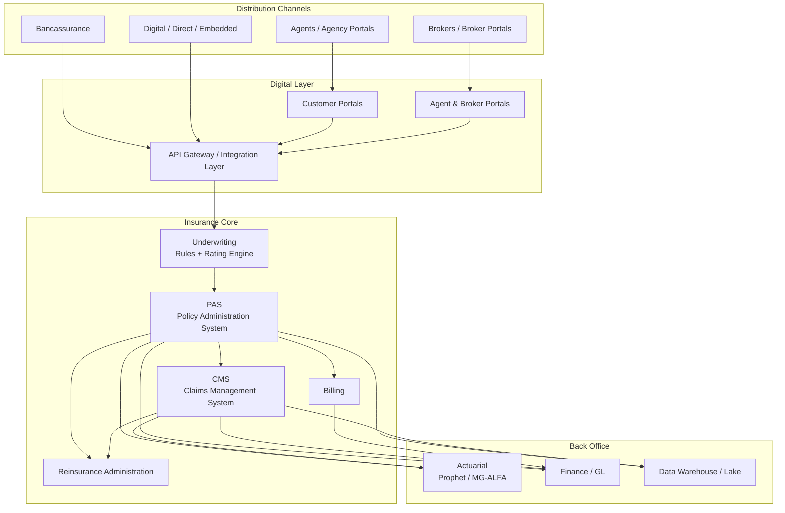
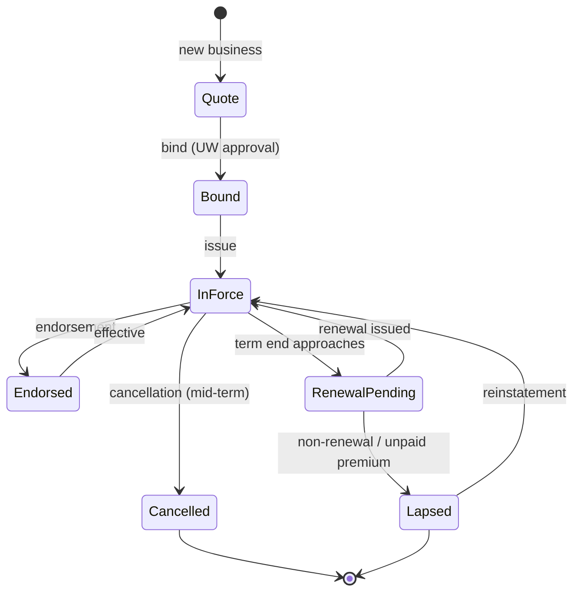
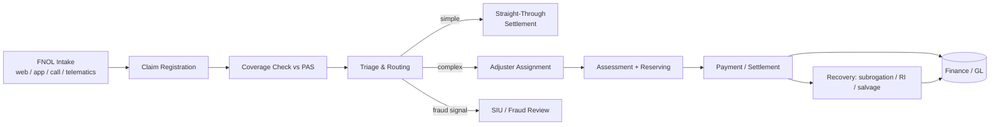
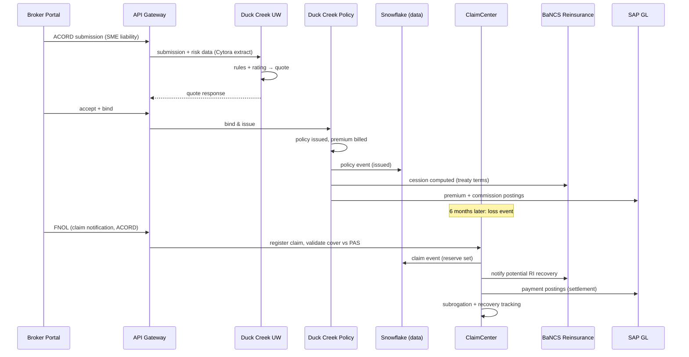

# Insurance Software Systems: A Comprehensive Guide to the Software Landscape of an Insurance Company

> **Author:** Jack Liu Shurui — Solution Architect at Cymbal Bank, Singapore
> **Context:** Financial Services Technology — Insurance Core Systems, Vendor Landscape, Architecture
> **Repository:** [github.com/jackliusr/research](https://github.com/jackliusr/research)
> **Series:** Financial Services Software-Systems Guides — the insurance counterpart to [DBS Software Systems](dbs_software_systems_guide.md) and [Standard Chartered Guide](standard_chartered_guide.md). The data-model angle (ACORD, IIW, Guidewire InfoCenter, IFRS 17/Solvency II data requirements) lives in [Data Models for Banking and Insurance](data_models_banking_insurance_guide.md) and is cross-referenced, not duplicated.

**Verification convention used throughout: ✅ = verified in this research pass (vendor/product pages, primary or secondary sources); ⚠ = flagged (approximate, single-source, divergent estimates, or structural inference); unmarked = structural/industry knowledge presented as such. The consolidated claims-status notes are in §11.**

---

## Table of Contents

1. [The Insurance Value Chain and the Core Systems](#1-the-insurance-value-chain-and-the-core-systems)
2. [The Policy Administration System (PAS)](#2-the-policy-administration-system-pas)
3. [The Claims Management System (CMS)](#3-the-claims-management-system-cms)
4. [The Underwriting System (UW)](#4-the-underwriting-system-uw)
5. [The Vendor Landscape](#5-the-vendor-landscape)
6. [The Technology Trends](#6-the-technology-trends)
7. [The Singapore Context](#7-the-singapore-context)
8. [The Insurance IT Architecture](#8-the-insurance-it-architecture)
9. [Worked Example: A Mid-Size Singapore General Insurer](#9-worked-example-a-mid-size-singapore-general-insurer)
10. [Summary: Insurance Software in One Page](#10-summary-insurance-software-in-one-page)
11. [Verification Notes](#11-verification-notes)
12. [Glossary](#12-glossary)
13. [References and Further Reading](#13-references-and-further-reading)

---

## 1. The Insurance Value Chain and the Core Systems

### 1.1 The Insurance Business: The Value Chain

Insurance is, at its core, a **risk-pooling and cashflow-inversion business**: premiums are collected *before* claims are paid, and the gap between the two is managed by underwriting discipline, actuarial mathematics, and regulation. Unlike a bank (which intermediates deposits and loans in near-real-time), an insurer's "product" is a **promise** — a contingent future payment — and the entire software estate exists to price, administer, and honour that promise.

The insurance value chain, end to end:

```
Product Development → Distribution → Underwriting → Policy Administration → Claims
                                      ↓                    ↓                   ↓
                                Reinsurance ←—— (risk transfer) ———→ Reinsurance
                                      ↓                    ↓                   ↓
                                      └────── Actuarial ←—— Finance (GL) ←——┘
```

- **Product development** — designing the cover: what risks are insured, exclusions, pricing structure, policy wording, regulatory filing (MAS approval for new products in Singapore). In software terms this is the *product configuration* capability of the PAS.
- **Distribution** — how the product reaches the customer:
  - **Agents** (tied and independent agents; in Singapore, life insurance is still substantially agent-distributed) — served by agency portals, commission systems, and (increasingly) agent apps.
  - **Brokers** — intermediaries for commercial/corporate business, transacting via broker portals, bordereaux, and ACORD-standardised submission/issuance messages.
  - **Bancassurance** — insurance sold through bank branches (a dominant Singapore life channel — DBS/Prudential, OCBC/Great Eastern, UOB/AIA historically ⚠). Requires tight integration between the bank's CRM/account platforms and the insurer's PAS.
  - **Digital/direct** — web and mobile purchase journeys, quote-and-buy APIs, embedded insurance (see §6.5).
- **Underwriting** — risk selection and pricing: deciding *whether* to accept a risk and *at what premium* (see §4).
- **Policy administration** — the system of record for the contract: issuance, billing, endorsements, renewals, lapses (see §2).
- **Claims** — the moment of truth: FNOL through settlement (see §3).
- **Reinsurance** — the insurer's own insurance: ceding portions of risk (quota share, excess of loss) to reinsurers (Munich Re, Swiss Re, SCOR, Hannover Re, etc.). Requires cession administration, recovery tracking, and RI accounting (see §1.2).
- **Actuarial** — pricing, reserving, valuation, and regulatory reporting (Solvency II in the EU, Risk-Based Capital in Singapore, IFRS 17 for accounting) (see §1.2).
- **Finance** — the GL, premium accounting, commission accounting, claims payments, and regulatory returns.

The value chain framing matters because **each step has its own software**, and the integration between steps is where most insurance IT complexity lives — the same pattern as a bank's front-to-back office chain (see [Core Banking Systems Guide](core_banking_systems_guide.md) §1 for the banking parallel).

### 1.2 The Core Systems

The "core" of an insurer is the set of systems that run the contract lifecycle. There is no single "core insurance system" — the core is a **suite of specialist systems**, each the system of record for its domain:

| System | Abbreviation | Role |
|---|---|---|
| **Policy Administration System** | PAS | System of record for the insurance contract: quotes, issuance, billing, endorsements, renewals, lapses |
| **Claims Management System** | CMS | System of record for losses: FNOL, reserving, assessment, settlement, recovery, subrogation |
| **Underwriting System** | UW | Risk selection, rating, and decisioning; often embedded in the PAS but distinct as a capability |
| **Billing System** | — | Premium billing and collections (in P&C frequently a separate module — e.g. Guidewire BillingCenter; in life usually inside the PAS) |
| **Reinsurance System** | — | Cession administration, RI accounting, recovery tracking |
| **Actuarial System** | — | Cashflow modelling for pricing, reserving, valuation (e.g. FIS Prophet, Milliman MG-ALFA) |
| **General Ledger / Finance** | GL | Premium and commission accounting, payments, statutory reporting |

The **PAS is the heart** — in banking terms it is the "core banking system" of the insurer (see [Core Banking Systems Guide](core_banking_systems_guide.md) for the bank-side analogue). Everything else either feeds it (underwriting), consumes it (claims, billing), or reconciles to it (finance, reinsurance).

### 1.3 The Core Stack Diagram



ASCII version:

```
 Channels              Digital Layer           Core Systems           Back Office
┌────────────┐      ┌─────────────────┐     ┌──────────────────┐    ┌───────────────┐
│ Agents     │─────▶│ Customer Portal │     │ Underwriting     │    │ Actuarial     │
│ Brokers    │─────▶│ Agent/Broker    │────▶│ (rules, rating)  │    │ (Prophet,     │
│ Bancassur. │─────▶│ Portals         │     │ PAS (policy SOR) │    │  MG-ALFA)     │
│ Digital    │─────▶│ API Gateway     │     │ Billing          │    │ Finance (GL)  │
│ Embedded   │      │ (ACORD, REST)   │     │ CMS (claims SOR) │    │ Data WH/Lake  │
└────────────┘      └─────────────────┘     │ Reinsurance      │    └───────┬───────┘
                                            └──────────────────┘            │
                                                                   regulatory
                                                                   reporting
```

### 1.4 The Systems Table

| System | Function | Key processes | Vendor examples |
|---|---|---|---|
| PAS (Policy Admin) | System of record for the contract | Quote → issue, billing, endorsements, renewal, lapse, reinstatement | Guidewire PolicyCenter ✅, Duck Creek Policy ✅, Sapiens CoreSuite ✅, TCS BaNCS ✅, EIS PolicyCore ✅ |
| CMS (Claims) | System of record for losses | FNOL, triage, reserving, assessment, settlement, recovery | Guidewire ClaimCenter ✅, FINEOS Claims ✅, Duck Creek Claims ✅, TCS BaNCS ✅ |
| Underwriting | Risk selection and pricing | Risk assessment, rating, decisioning, referrals | Guidewire UnderwritingCenter ✅, Duck Creek, Sapiens |
| Billing | Premium collection | Invoicing, payment plans, collections, disbursements | Guidewire BillingCenter ✅, Duck Creek Billing, Sapiens Billing |
| Reinsurance | RI cession and recovery | Cession admin, RI accounting, recovery | TCS BaNCS Reinsurance ✅, Duck Creek Reinsurance ✅, SICS (SAP) |
| Actuarial | Pricing, reserving, valuation modelling | Cashflow projection, valuation, IFRS 17 | FIS Prophet ✅, Milliman MG-ALFA ⚠, Moody's AXIS |
| Finance | Accounting and reporting | Premium/commission GL, payments, statutory returns | SAP, Oracle Financials, or legacy GL |
| Agency management | Distribution support | Agent onboarding, commissions, licensing, portals | Acturis (commercial), Applied Systems, TIA (agent/broker) |
| Document generation | Policy documents, schedules, notices | Template rendering, e-delivery | Guidewire Document Generation, Adobe-based stacks |

The rest of this guide deep-dives the three systems at the heart of the stack — PAS (§2), CMS (§3), UW (§4) — then the vendor landscape (§5), trends (§6), Singapore (§7), architecture (§8), and a worked example (§9).

---

## 2. The Policy Administration System (PAS)

### 2.1 What a PAS Is

The **Policy Administration System** is the **system of record** for every insurance contract. It holds the authoritative version of *who is insured, against what, for how much, at what premium, and with what endorsements*. Every other system — claims, billing, finance, actuarial, reinsurance, regulatory reporting — either reads from the PAS or reconciles to it.

A PAS is fundamentally **contract lifecycle software**: it manages a policy from the moment a quote is created to the moment the policy lapses or is cancelled, and it must do so with **auditability** (every change recorded, every version reconstructable) because the policy document is a legal contract and regulators require full history. This is the insurance analogue of a bank's core banking system, but with a very different centre of gravity: a bank's core is transaction-throughput-optimised; a PAS is **state- and version-optimised** — the policy is a long-lived, slowly-changing object, not a stream of transactions (see [Data Models for Banking and Insurance](data_models_banking_insurance_guide.md) §3 for the ACORD-flavoured data model behind this).

### 2.2 The Policy Lifecycle

The canonical policy lifecycle, with the PAS states:

```
New Business (Quote → Issue) → In Force → Endorsement (mid-term change)
     → Renewal (new term) / Lapse (non-renewal, unpaid premium) / Cancellation
     → Reinstatement (rare, back to In Force)
```

**New business** — the quote-to-issue journey: a quote is created (via the UW process, §4), priced by the rating engine, bound (accepted), and issued as a policy with a policy number, schedule, and contract documents. The PAS records the policy inception/expiry dates, the insured and risk details, the premium, and the payment plan.

**Endorsement** — any mid-term change: change of address, adding/removing a driver or a location, increasing sum insured, mid-term cancellation. Endorsements create a **new version** of the policy (or a new "transaction" on it) and typically re-rate the remaining term, producing either additional premium (AP) or return premium (RP).

**Renewal** — at term end the policy renews: re-rating (possibly with new rates), new policy documents, new premium. Renewals are a huge revenue-and-retention event — PAS renewal processing is batch-heavy and is a favourite target for automation.

**Lapse** — a policy lapses when it is not renewed or when the premium goes unpaid past the grace period; cover ceases. Lapse is the *default* end state in life insurance (where policies are long-duration) and a collection-driven state in P&C (where non-payment of renewal premium lapses the policy).

**Reinstatement** — the reversal of a lapse: the policy is brought back in force, usually with conditions (proof of insurability in life, payment of arrears in P&C) and with a backdated or new effective date.

A clean way to think about the PAS is as a **state machine** — see the worked deep-dive in §2.6.

### 2.3 The PAS Functions

A full PAS implements, at minimum:

- **Product configuration** — the ability to define products (coverages, limits, deductibles, exclusions, rating structure, documents) without code. Modern PASs push this to business users ("no-code product definition", §6.3).
- **Rating** — computing the premium from the rating factors via rating tables/rules/engines; integrates with the underwriting decisioning (see §4).
- **Policy issuance** — binding the quote, generating the policy number, schedule, wording, and documents.
- **Premium billing** — generating invoices, handling payment plans (annual, quarterly, monthly, instalments), direct debit, and payment records. In P&C this is often a separate billing system (e.g. Guidewire BillingCenter ✅); in life it is usually inside the PAS.
- **Commission** — computing agent/broker/bancassurance commissions and clawbacks (chargebacks when policies lapse), often with a separate commission engine or module.
- **Document generation** — policy schedules, certificates, endorsements, renewal notices, cancellation letters — template-driven, with e-delivery increasingly standard.
- **Regulatory reporting** — extracting policy data for regulators (in Singapore: MAS statistical returns) and for tax authorities (stamp duty, GST).
- **In-force management** — the state machine: endorsements, renewals, lapses, reinstatements, cancellations, with full audit history.

### 2.4 The PAS Architecture

Modern PASs share a common architecture, whether packaged (Guidewire, Duck Creek) or bespoke:

- **Product model** — a metadata-driven definition layer: *product definition* (coverages, limits, eligibility rules, forms/wordings) and *rules* (rating rules, underwriting rules, workflow rules) expressed as configurable data, not compiled code. The product model is what makes an insurer's speed-to-market possible: a new product = new configuration, not a new release.
- **Policy data model** — the policy, risk, coverage, party (insured/agent/payor), and transaction objects (ACORD-aligned in most modern platforms; see [Data Models for Banking and Insurance](data_models_banking_insurance_guide.md) §3.1).
- **Workflow engine** — task routing, approvals, and handoffs (e.g. UW referral tasks) — an insurer's PAS is a workflow system as much as a data system.
- **Rules engine** — eligibility, rating, underwriting, and business rules evaluated at each lifecycle event.
- **Document engine** — template + data → policy documents.
- **Integration layer** — APIs and messaging for channels, claims, billing, finance, reinsurance (see §8.2).
- **Batch engine** — renewals, lapse sweeps, billing runs, commission runs — insurance runs on nightly batch as much as on real-time APIs.

In deployment terms the vendor market has shifted from on-premise packaged cores to **SaaS/cloud-native** (Guidewire Cloud, Duck Creek OnDemand ✅) — see §6.1.

### 2.5 The PAS Vendors

The P&C policy-administration market is dominated by **Guidewire** and **Duck Creek**; the life/health PAS market is more fragmented (Sapiens, TCS BaNCS, FINEOS, DXC, Ingenium (DXC), LifeAsia, etc.):

- **Guidewire PolicyCenter** ✅ — the P&C market leader; part of InsuranceSuite (PolicyCenter, ClaimCenter, BillingCenter — plus UnderwritingCenter and PricingCenter ✅). Configuration-over-code (Gosu), strong workflows, huge SI ecosystem, now pushed as Guidewire Cloud (SaaS).
- **Duck Creek Policy** ✅ — cloud-native, API-first, famous for its "OnDemand" SaaS model ✅ and business-user product configuration (Duck Creek Author); strong in personal lines and mid-market; 30M+ claims processed via OnDemand per Duck Creek's own claims ✅ ⚠.
- **Sapiens CoreSuite** ✅ — P&C policy/billing/claims suite; also strong in life (Sapiens DigitalSuite, Sapiens LifeSuite). Heavy in the US P&C mid-market and in health.
- **TCS BaNCS for Insurance** ✅ — end-to-end suite covering policy admin, claims, reinsurance, and accounting for P&C, life, and health; strong in Asia-Pacific, India, and among life insurers.
- **EIS (EIS Group)** ✅ — PolicyCore and the EIS Core Insurance Suite (now branded EIS; the vendor was acquired by Thoma Bravo-backed **ExlService**/EXL in 2024 ⚠ — the EIS brand continues as EIS by EXL ⚠); configurable, digital-first, strong in group benefits and P&C.
- **FINEOS** ✅ — life, accident & health (LA&H) and employee benefits; FINEOS AdminSuite (policy, claims, billing, absence) with FINEOS Claims as the flagship claims product.
- **DXC Assure** ✅ — DXC's next-generation insurance platform (policy, claims, billing) for commercial & specialty and life; DXC also runs the legacy **Ingenium** life PAS and **Bancs**-era heritage. Assure is cloud-enabled and API-based.
- **Others worth knowing**: Sapiens' main life rival **DXC Ingenium**, **LifeAsia** (Asia life market), **SAP Insurance (SICS/FS-PM)** (European), **Majesco** (P&C, acquired by Verisk ⚠), **OneShield**, **SIS/StoneRiver** (legacy), **WNS/EXL** as BPS-and-cores players.

### 2.6 PAS Deep-Dive: The Worked Policy Lifecycle

**The state machine.** A policy in a PAS moves through states; each transition is a transaction with a version and audit record:



**Worked example — a motor policy** (this lifecycle repeats identically for home, travel, and commercial lines):

| Step | State/Event | What happens in the PAS | Who/what triggers it |
|---|---|---|---|
| 1 | Quote | Quote record created; rating engine prices it; UW rules screen it | Agent portal / broker / web quote |
| 2 | Bind | Quote accepted; premium and coverages locked | UW decision (auto/STP or manual) |
| 3 | Issue | Policy number assigned; schedule + certificate generated; billing plan created; commission reserved; risk data sent to data warehouse | PAS issue batch / real-time |
| 4 | In force | Policy active; premium billed per plan; payments posted to billing and GL | Billing run (monthly/annual) |
| 5 | Endorsement | Driver added mid-term; re-rating produces AP/RP; new version of policy created; documents re-issued | Customer service / agent |
| 6 | Renewal | 30/21/7-day notices; re-rating at new rates; renewal offer issued; renewal premium billed | Renewal batch |
| 7 | Lapse | Premium unpaid past grace period → cover ceases; lapse letter; commission clawback | Lapse sweep batch |
| 8 | Reinstatement | Arrears paid → policy reinstated, dates backdated, cover continuous | Collections / customer service |

**Why the state machine matters:** every downstream system keys off PAS state. Claims can only be registered against an **in-force** policy (a lapsed policy creates a coverage dispute); reinsurance cessions are computed from in-force sums; regulatory returns count in-force policies; commissions are earned/paid/clawed-back based on state transitions. Getting the state machine right is the single most important PAS design decision — and the top reason legacy replacement programmes fail when the legacy system's states were never documented (see §6.4).

---
## 3. The Claims Management System (CMS)

### 3.1 The Claims Lifecycle

A claim is the moment the insurance promise is tested. The claims lifecycle is:

```
FNOL (First Notice of Loss) → Triage → Assessment → Settlement → Recovery / Subrogation
```

- **FNOL (First Notice of Loss)** — the insured (or agent/broker) reports the loss. Modern FNOL is multi-channel: phone, web form, mobile app, email, or — increasingly — automated (telematics crash detection, flood sensors, even airline delay APIs for parametric cover). The CMS registers the claim, links it to the policy, and checks coverage (is the policy in force? is the loss covered?).
- **Triage** — the claim is categorised and routed by severity, line of business, and fraud signals: simple auto glass claim → straight-through settlement; suspected fraudulent injury claim → SIU (Special Investigation Unit) referral; complex liability claim → senior adjuster and possibly external loss adjusters/lawyers.
- **Assessment** — investigation, evidence gathering (photos, repair estimates, medical reports), coverage determination, and **reserving** (estimating the ultimate cost of the claim). The reserve is the financial heartbeat of claims — see §3.3.
- **Settlement** — the payment decision: full/partial payment, repair, replacement, or repudiation (denial). Payments flow from the CMS to the GL and out through the payments stack.
- **Recovery / Subrogation** — recovering paid amounts from third parties responsible for the loss (subrogation), from reinsurers (reinsurance recoveries — RI), or salvage (selling recovered property). Recovery closes the loop financially.

The **claims lifecycle is inverted compared to policy**: a policy is long-lived and slowly changing; a claim is born at a loss event, runs hot for weeks/months, and closes. Claims systems are therefore **workflow- and payment-heavy**, not state-heavy.

### 3.2 The Claims Functions

- **Claim registration (FNOL capture)** — intake, policy validation, coverage check, duplicate-claim detection.
- **Reserving** — setting and revising case reserves (the estimated ultimate loss). Reserve adequacy is the number-one actuarial and regulatory concern; the CMS must keep a full reserve history (initial, revised, final) with reason codes.
- **Assessment** — task management for adjusters, diary/reminders, document management (photos, estimates, medicals), external services (loss adjusters, lawyers, repair shops).
- **Payment** — payment authorization, cheque/EFT/real-time payment, payment to insured vs third parties, and **recovery accounting** (recoverable subrogation/reinsurance amounts tracked separately from paid amounts).
- **Subrogation** — tracking third-party liability, pursuing recovery, recording recoveries against the claim.
- **Fraud detection** — red flags, network analysis (claimant/vehicle/garage rings), SIU case management, and increasingly AI scoring (Shift Technology — see §5.2).
- **Reinsurance recovery** — automatically notifying the RI system of claims that may hit reinsurance layers, tracking RI recoverables (often handled by the RI system, with the CMS providing the claim data).
- **Reporting** — claims KPIs (loss ratio, average settlement time, reserve adequacy), regulatory returns, and actuarial data extraction.

### 3.3 The Claims Architecture

The claim object model in a CMS:

- **Claim file** — the aggregate: the claim number, the policy link, parties (claimant, insured, witnesses), losses (each loss event), exposures (each coverage affected), and tasks.
- **Reserves** — per-exposure reserve components: case reserve, incurred-but-not-reported (IBNR) is an actuarial concept held outside the CMS, but **case reserves** live in the CMS with full history: initial reserve → revisions → final → closed.
- **Payments** — each payment is a financial transaction: payee, amount, payment type (interim, final, expense), and GL accounts; recoveries are negative payments with their own classification (salvage, subrogation, RI).
- **Workflow** — tasks, diaries, assignments, approval chains, and SLAs.
- **Integration** — to the PAS (policy/coverage validation), billing (deductible recovery), reinsurance (RI notification), finance (GL posting), and fraud/analytics engines.



### 3.4 The Claims Vendors

- **Guidewire ClaimCenter** ✅ — the dominant P&C claims system ("the claims management system the P&C industry trusts most" per Guidewire ✅ ⚠); strong adjuster workflows, subrogation, litigation management, and the Guidewire Cloud SaaS option; deep ecosystem of accelerators (e.g. Shift Technology's fraud accelerator for ClaimCenter ✅).
- **Duck Creek Claims** ✅ — cloud-native claims on the same OnDemand platform as Duck Creek Policy/Billing; Duck Creek claims 30M+ claims processed via OnDemand ✅ ⚠.
- **FINEOS Claims** ✅ — the LA&H/employee-benefits claims market leader ("the leading Life, Accident and Health customer-centric, web-based claims management software" per FINEOS ✅ ⚠); strong in group life, disability, absence, and voluntary benefits claims; also FINEOS Payments/Provider modules.
- **TCS BaNCS Claims** ✅ — part of TCS BaNCS for Insurance; TCS is positioned as a Leader in P&C claims-management system assessments ✅ ⚠; strong in Asia and among Indian and UK insurers.
- **Sapiens Claims** ✅ — part of Sapiens CoreSuite for P&C; also Sapiens ClaimsPro (legacy) and strong in health claims.
- **DXC Assure Claims** ✅ — part of the DXC Assure platform.
- **Specialist/point solutions**: **Shift Technology** (fraud), **Tractable** (AI photo-estimation for auto claims), **Snapsheet**, **Crawford/Adjuster services** (BPS), **WNS/EXL** (claims BPO platforms).

### 3.5 Claims Deep-Dive: The Worked Claims Lifecycle

**Worked example — a motor accident claim** (the same flow holds for home, travel, and health, with different evidence types):

| Step | Stage | What happens | System actions |
|---|---|---|---|
| 1 | FNOL | Insured reports accident via app; telematics already detected the crash event and pre-populated time/location | Claim registered; policy and coverage validated against PAS; claim number issued |
| 2 | Triage | Claim scored: simple rear-end, no injuries, policy in force, no fraud flags | Auto-routed to STP lane; repair-shop network notified |
| 3 | Assessment | Photos via app; AI estimates repair cost (Tractable-style ✅); reserve set at estimated cost | Reserve created and posted to GL; task diary created |
| 4 | Settlement | Repair approved; payment authorised within STP threshold | Payment instruction to bank; claim marked paid; documents generated |
| 5 | Recovery | At-fault third party identified; subrogation pursued | Subrogation case opened; recovery tracked as separate receivable |
| 6 | Close | Claim closed; reserve reconciled to actual payments | Loss ratio updated; data pushed to warehouse/actuarial |

**Key financial discipline:** the **reserve** is the estimate of ultimate cost; the **paid** amount is actual; the difference (outstanding reserve) drives actuarial IBNR and the loss ratio. A CMS that cannot reconstruct "reserve at every point in time" fails both actuarial and regulatory audit.

---

## 4. The Underwriting System (UW)

### 4.1 The Underwriting Process

Underwriting is **risk selection and pricing**: the insurer decides whether to accept a risk, on what terms, at what price. The UW process:

```
Risk Assessment (data gathering + risk scoring) → Rating (premium computation)
→ Decisioning (accept / refer / decline / modify terms) → (issue / decline)
```

- **Risk assessment** — gathering and scoring risk data: the application, loss history, and third-party data (credit, geospatial, telematics, satellite, IoT).
- **Rating** — computing the premium: base rate × rating factors (age, location, claims history, coverage choices) via rating tables, rules, or statistical/ML models.
- **Decisioning** — the accept/refer/decline decision: fully automated for low-risk standard business (**straight-through processing — STP**), referred to a human underwriter for complex or high-value risks.

**STP (straight-through processing)** is the underwriting holy grail: the percentage of applications processed end-to-end with **zero manual touch**. Personal lines (auto, home, travel) routinely run 70–95% STP ⚠; commercial lines run far lower (10–40% ⚠) because risks are heterogeneous and need human judgment. STP is enabled by rules engines, predictive models, and clean third-party data feeds — and constrained by fraud risk and regulatory requirements.

### 4.2 The Underwriting Functions

- **Risk data ingestion** — application data, loss runs, third-party data APIs (credit, MVR/driver records, geospatial/flood/wildfire scores, property data, satellite imagery).
- **Rules engine** — eligibility rules, referral rules, decline rules: *"driver under 21 with 2+ violations → refer"*.
- **Rating engines** — rate tables, rating factors, and increasingly embedded predictive pricing models (GLMs, gradient boosting); pricing is often computed in a separate pricing system (e.g. Guidewire PricingCenter ✅) and executed in the PAS.
- **Decisioning/workflow** — accept/refer/decline logic, underwriter workbench, referral queues, approval chains, and documentation of the decision rationale (regulators require demonstrable underwriting governance).
- **Portfolio management** — appetite settings (which risks the insurer wants), capacity management, and monitoring of the portfolio's risk profile.
- **Quota/reinsurance interfaces** — feeding risk data to RI systems so cessions are priced and allocated correctly.

### 4.3 The Underwriting Vendors

Underwriting is rarely a standalone system — it is usually a **layer on top of or inside the PAS**:

- **Guidewire** — UnderwritingCenter ✅ (policy-issuance-time underwriting for P&C) plus PolicyCenter's integrated UW rules and referral workflows; PricingCenter for pricing.
- **Duck Creek** — UW workbenches and rules within Duck Creek Policy; partnership ecosystem for data and analytics.
- **Sapiens** — UW modules in CoreSuite for P&C and Sapiens LifeSuite/UnderwritingPro for life.
- **TCS BaNCS** — UW functions embedded in the P&C and life suites.
- **Specialist UW platforms** — **Cytora** (commercial risk digitisation and processing — turns submission documents/data into structured risk and routes decisions ✅), **Planck** (generative-AI commercial risk data extraction for UW ✅), **Federato** (AI-native commercial UW and portfolio management ⚠), **Cape Analytics** (property intelligence), **RiskGenius**, **Duck Creek's partner ecosystem**.

### 4.4 The Underwriting Data

UW is where insurance meets **external data at scale**:

- **Credit-based scores** — personal-lines insurance scores (credit history as a loss predictor); regulated in many jurisdictions.
- **Geospatial** — flood zones, wildfire risk (ZestyAI's wildfire models are used by reinsurers to refine property pricing ✅ ⚠), hurricane models, crime, proximity to fire stations.
- **Telematics/IoT** — driving behaviour (usage-based insurance, §6.6), home sensors.
- **Loss history databases** — claims history exchanges (e.g. CUE in the UK ⚠), MVR/driver records.
- **Commercial data** — financials (Planck-style extraction from financial statements ✅), corporate structures, industry classifications (SIC/NAICS), litigation databases.

The data layer integrates into the UW/PAS via APIs and batch, and flows downstream to rating models, pricing, and reinsurance.

### 4.5 Underwriting Deep-Dive: The Worked UW Workflow

**Worked example — a commercial fleet policy submission** (mid-complexity, illustrates referral):

| Step | Stage | What happens | System actions |
|---|---|---|---|
| 1 | Submission | Broker submits risk via broker portal (ACORD application + loss runs) | Submission created; documents ingested |
| 2 | Data extraction | AI extracts fleet size, vehicles, drivers, claims history from documents (Planck/Cytora-style ✅) | Structured risk data created; third-party data pulled (MVR, geospatial, financials) |
| 3 | Risk scoring | Rules + model score the risk: fleet of 40 vans, 3 claims in 2 years, good credit | Score = "standard-minus"; eligibility rules pass |
| 4 | Rating | Rating engine computes premium from factors | Quote generated with terms (higher excess due to claims frequency) |
| 5 | Decisioning | Above STP threshold (premium > S$100k) → referral | Referral task queued to commercial UW workbench |
| 6 | UW review | Underwriter reviews, adjusts excess, accepts with modified terms | Decision recorded with rationale; quote released to broker |
| 7 | Issue | Broker accepts → policy issued in PAS | Policy bound and issued; RI cession computed if applicable |

**The STP trade-off:** pushing more submissions through STP cuts cost and turnaround (broker-to-bind in hours vs days), but raises adverse selection and fraud exposure — the UW rules engine and data quality determine where the STP line sits.

---

## 5. The Vendor Landscape

### 5.1 The Core Vendors

**Guidewire** ✅ — the P&C core market leader. **InsuranceSuite** = **PolicyCenter** (PAS), **ClaimCenter** (CMS), **BillingCenter** (billing), plus **UnderwritingCenter** and **PricingCenter** ✅. Configuration-over-code on the Gosu language, deep SI ecosystem, industry benchmark for P&C workflows; sold on-prem historically, now pushed as **Guidewire Cloud** (SaaS). Best fit: mid-to-large P&C carriers, commercial + personal lines; weaker in life.

**Duck Creek Technologies** ✅ — founded Boston 2000 ⚠; cloud-native, API-first P&C platform (**Policy, Billing, Claims, Reinsurance, Analytics**), famous for **OnDemand** SaaS delivery ✅ and **Duck Creek Author** business-user product configuration. Claims 30M+ claims processed via OnDemand ✅ ⚠. Best fit: personal-lines-heavy carriers, mid-market, insurers wanting speed-to-market and SaaS economics.

**Sapiens** ✅ — **CoreSuite** for P&C (policy, billing, claims, UW) and strong life/health lines (LifeSuite, HealthSuite, DigitalSuite). Israel-founded, global footprint, heavy in US P&C mid-market, life insurers, and health. Deployment: on-prem, cloud, or SaaS.

**TCS BaNCS for Insurance** ✅ — end-to-end suites for **P&C, Life, Health, and Reinsurance** (TCS BaNCS for Reinsurance handles cession administration, claims recovery processing, and RI accounting ✅). Parameter-driven, component-based architecture ✅; strong in Asia-Pacific, India, UK, and among large life insurers and reinsurers.

**EIS Group (now EIS by EXL ⚠)** ✅ — **PolicyCore** and **EIS Core Insurance Suite** for P&C and group benefits ✅; configurable, digital-first, API-friendly; acquired by EXL (2024 ⚠). Best fit: digital-led insurers, group benefits, MGA-style models.

**FINEOS** ✅ — **FINEOS Platform / AdminSuite** for **Life, Accident & Health and Employee Benefits**: policy, claims, billing, absence, provider, payments ✅. **FINEOS Claims** is the flagship. Best fit: life insurers, group benefits providers, disability/absence administrators.

**DXC Assure** ✅ — DXC's cloud-enabled, API-first platform (policy, claims, billing) for **commercial & specialty** and life; built from the ground up (per DXC ✅ ⚠) to replace legacy; DXC also runs the **Ingenium** life PAS heritage. Best fit: insurers modernising off legacy DXC/Ingenium estates.

**Legacy/complementary**: SAP (SICS/FS-PM, European), Majesco (P&C, acquired by Verisk ⚠), OneShield, SIS, LifeAsia (Asia life), Oracle Insurance (legacy), WNS/EXL (BPS + platform plays).

### 5.2 The AI / Analytics Vendors

These are point solutions that sit *beside* the core and add intelligence:

- **Shift Technology** ✅ — claims fraud detection and subrogation AI; "hundreds of insurers" per Microsoft customer story ✅ ⚠; ships accelerators for Guidewire ClaimCenter ✅; has expanded into underwriting risk AI ("agentic AI for insurance" ⚠).
- **Tractable** ✅ — computer vision for auto and property claims (photo-based repair estimates, subrogation review); used by major global carriers ⚠.
- **ZestyAI** ✅ — property-risk AI: wildfire, hail, wind, roof-condition scores from satellite/aerial imagery; integrated with platforms like Cytora for commercial property UW ✅; used by reinsurers for pricing ✅ ⚠.
- **Planck** ✅ — generative-AI extraction of commercial risk data (financials, operations) to feed UW.
- **Cytora** ✅ — commercial risk digitisation platform: ingests submissions (documents, data) and routes/processes them for UW; partnered with ZestyAI for climate-risk integration ✅.

### 5.3 The Comparison Table

| Vendor | Product | Lines of business | Deployment | Strengths | Target market |
|---|---|---|---|---|---|
| Guidewire | InsuranceSuite: PolicyCenter, ClaimCenter, BillingCenter (+UW/Pricing) | P&C (personal + commercial) | On-prem, cloud, SaaS (Guidewire Cloud) | Market-leading P&C workflows; strong SI ecosystem; claims benchmark | Mid-to-large P&C carriers |
| Duck Creek | OnDemand: Policy, Billing, Claims, Reinsurance | P&C (personal-lines strong) | SaaS-native (OnDemand); API-first | Speed-to-market; business-user config; cloud economics | Personal-lines, mid-market, digital-first carriers |
| Sapiens | CoreSuite (P&C), LifeSuite, HealthSuite | P&C, life, health | On-prem / cloud / SaaS | Multi-LOB breadth; strong US mid-market | P&C mid-market, life, health insurers |
| TCS BaNCS | BaNCS for P&C / Life / Health / Reinsurance | P&C, life, health, reinsurance | On-prem / managed services | Full value chain incl. reinsurance; strong Asia | Asian & global insurers, reinsurers |
| EIS (by EXL) | EIS Core / PolicyCore | P&C, group benefits | Cloud, API-first | Configurability; digital engagement | Digital-led insurers, group benefits |
| FINEOS | FINEOS Platform: AdminSuite, Claims | Life, accident & health, employee benefits | Cloud / SaaS | LA&H claims leadership; group benefits depth | Life, group, disability insurers |
| DXC | DXC Assure (+ Ingenium legacy) | Commercial & specialty, life | Cloud-enabled | Modern platform + legacy migration path | DXC legacy estates, specialty carriers |

*Selection methodology and vendor-management mechanics: see [Vendor Management Guide](../management/vendor_management_guide.md).*

### 5.4 The Market

The global **insurance software market** is estimated at roughly **US$14–18 billion in 2025**, growing at ~6–10% CAGR ⚠. Sources diverge materially: Mordor Intelligence puts 2025 at US$14.14B ✅ ⚠; VPA Research at US$17.79B (2025) ⚠; ResearchAndMarkets at US$14.1B (2025) ⚠. The range itself is the honest answer — definitions (core vs. all insurance software, including analytics/distribution) differ, and **no single authoritative figure exists**. Directionally: the market is growing mid-single-to-low-double digits, cloud/SaaS is the fastest segment, and North America dominates (~39% share ⚠). The *core-systems* sub-market (PAS/CMS/billing) is a low-single-digit-billion slice ⚠ — but it is the highest-stakes spend because it is the system of record.

Vendor market share for P&C cores is **not publicly and reliably quantified** ⚠ — the frequently cited claims ("Guidewire ~40% of top-20 US P&C carriers" ⚠, "Duck Creek fastest-growing" ⚠) are analyst-consensus approximations, not audited numbers. Treat all such figures as directional.

### 5.5 Vendor Selection

Core-system selection is a multi-year, multi-million-dollar decision with irreversible consequences — full treatment in [Vendor Management Guide](../management/vendor_management_guide.md). The insurance-specific checklist:

1. **Fit to line of business** — a life insurer has no business evaluating P&C-centric cores (FINEOS/Sapiens/TCS BaNCS Life vs Guidewire/Duck Creek).
2. **Product configuration depth** — can business users define products without IT? (Duck Creek Author, Guidewire Product Designer, Sapiens' rule-based config).
3. **SaaS vs on-prem economics** — cloud cost models, data residency (MAS requirements for Singapore), exit rights.
4. **Implementation partner quality** — the SI (Accenture, Deloitte, Capgemini, TCS, Cognizant, Wipro) often matters more than the software.
5. **Ecosystem** — accelerators (fraud, telematics), data partners, ACORD compliance, API openness.
6. **Total cost over 10 years** — licence + implementation (typically 1–3× licence ⚠) + run + change.
7. **Exit strategy** — data export, model portability, contractual escape hatches.

---

## 6. The Technology Trends

### 6.1 Cloud-Native and SaaS Cores ("Core as a Service")

The defining trend of the 2020s: **core insurance systems as SaaS**. Guidewire Cloud, Duck Creek OnDemand ✅, Sapiens cloud offerings, DXC Assure's cloud-native build ✅. Drivers: (1) shifting the run-and-upgrade burden to the vendor; (2) continuous release cadence instead of 1–2 upgrades/year; (3) elastic capacity for CAT events (Duck Creek cites scaling to 60,000+ claims/day during CAT events ✅ ⚠). The corollary is **vendor lock-in with a smile**: the insurer trades upgrade pain for SaaS dependency, and must manage exit rights and data portability contractually.

### 6.2 AI in the Core

- **Claims automation** — AI at FNOL and triage: photo-based damage estimation (Tractable ✅), fraud scoring (Shift ✅), straight-through settlement of simple claims (travel delay, small auto glass).
- **Underwriting copilots** — generative AI that reads submissions, extracts risk data (Planck ✅, Cytora ✅), drafts referrals, and explains decisions; the agentic-AI pattern for insurance is covered in [Autonomous Agents Guide](../technology/ai_llm/autonomous_agents_guide.md).
- **Customer service** — policy-servicing chatbots grounded in the PAS (what's my cover? cancel my policy?), document Q&A.
- **The guardrails** — insurance is a regulated, fairness-auditable domain: model governance, explainability (why was my premium higher?), and MAS's AI governance expectations (FEAT principles — Fairness, Ethics, Accountability, Transparency ⚠) constrain where AI can run unsupervised.

### 6.3 No-Code Product Configuration

The product model (§2.4) is the battleground: vendors race to let **business users** define products — coverages, rules, rating, documents — without code. Duck Creek Author, Guidewire Product Designer, EIS's configurators, Sapiens' rule engines. Impact: new product time-to-market collapses from 6–12 months to weeks ⚠; the PAS becomes a business-owned asset rather than an IT project.

### 6.4 Core Modernization: Lift-and-Shift vs Replatform

Legacy replacement is the industry's largest IT spend. The strategies:

- **Lift-and-shift** — move the legacy core to the cloud unchanged. Low risk, but preserves technical debt; no functional gain. Appropriate as a stopgap (e.g. to retire a data centre before an exit deadline).
- **Replatform/rewrite** — replace the core with a modern PAS. High cost, high risk (the classic multi-year core-replacement failure mode: 3–5 years late, 2–3× budget ⚠), but unlocks speed-to-market, SaaS economics, and AI readiness.
- **Strangler-fig / wrapper** — the DBS-style pattern ([DBS Software Systems](dbs_software_systems_guide.md) §1.4): an API facade over the legacy core, replacing domains incrementally (new products on the new core, legacy books on the old). Increasingly the consensus architecture for mid-size insurers who cannot afford a big-bang replacement.
- **Component replacement** — replace claims or billing first (higher pain, better ROI), keep the PAS; or greenfield for a new book while running off the legacy book.

### 6.5 Embedded Insurance

Insurance sold **inside another product's journey**: travel cover at airline checkout, gadget cover at phone purchase, cargo cover in a logistics platform. Requirements: API-first cores, quote-to-bind in seconds, event-driven issuance (flight booking = policy trigger), and per-transaction economics. The insurer becomes a **capacity provider behind an API** — the distribution layer (§1.1) collapses into a partner's app. Growth is real but measured ⚠; success depends on distribution partners, not technology alone.

### 6.6 Usage-Based Insurance (UBI) and Telematics

UBI prices risk on **actual behaviour** rather than static factors: pay-as-you-drive (distance), pay-how-you-drive (behaviour scoring via telematics/app), and IoT-linked home insurance (leak sensors). Requirements: telematics data pipelines, low-latency rating, privacy-compliant data handling (PDPA in Singapore), and dynamic policy updates (mid-term premium adjustments). UBI is mainstream in motor in several markets ⚠ but remains a minority of global premium ⚠.

### 6.7 Parametric Insurance

**Parametric (index-based) insurance** pays a pre-agreed amount when an **index** triggers — rainfall below a threshold, earthquake magnitude, flight delay hours, heatwave degree-days — with **no claims assessment**. The claim is a data event, not a loss investigation: payout latency drops from weeks to days/hours, and the CMS is bypassed (the payout is automated from the data feed). Growing fastest in climate-related covers (flood, drought, typhoon) and in Asia's SME/agriculture segments ⚠. For insurers it is the cleanest possible use of automation — the whole claims chain is code.

### 6.8 The Trends Table

| Trend | Description | Impact |
|---|---|---|
| Cloud-native / SaaS cores | Cores delivered as SaaS (Guidewire Cloud, Duck Creek OnDemand ✅) | Lower run cost, continuous upgrades, vendor dependency |
| AI in claims & UW | Computer vision, fraud AI, UW copilots (Tractable, Shift, Planck, Cytora ✅) | Faster STP, lower loss adjustment expense, model-governance burden |
| No-code product config | Business-user product definition | Weeks-to-market product launches; PAS as business asset |
| Core modernization | Lift-and-shift vs replatform vs strangler-fig | Biggest IT spend; failure mode = big-bang rewrite |
| Embedded insurance | Insurance via partner APIs at point of sale | New distribution; insurer becomes API capacity |
| UBI / telematics | Behaviour-based pricing | New data pipelines; dynamic policies |
| Parametric | Index-triggered automated payouts | Claims chain compressed to a data event; climate-risk product growth |
| IFRS 17 / Solvency II data | Accounting and capital reform driving data-platform spend | Actuarial/finance/data convergence (see [Data Models Guide](data_models_banking_insurance_guide.md) §5.4–5.5) |

---
## 7. The Singapore Context

### 7.1 The Insurance Market

Singapore is Asia's insurance hub: a mature, highly regulated market with ~S$50B+ of gross premiums annually ⚠ (life dominates by premium, P&C by policy count), and a regional base for many global insurers' Asian headquarters. The major players:

- **Great Eastern** — Singapore's oldest and largest life insurer (founded 1908), owned by OCBC; full life/health/wealth stack; also owns the **Great Eastern Life** brand across Malaysia.
- **AIA Singapore** — subsidiary of AIA Group (HK); MAS-licensed insurer ✅; one of the two or three largest life players; historically tied to UOB's bancassurance.
- **Income Insurance** — formerly **NTUC Income** (renamed 2024 ✅ ⚠); the co-operative-born insurer, now a major composite (life + general); known for consumer-focused digital (Snappy, Income's app).
- **Prudential Assurance Singapore** — MAS-licensed ✅; Prudential plc's Southeast Asia hub; historically tied to DBS's bancassurance.
- **Others**: Manulife Singapore, Singlife (digital-first composite, merged with Aviva Singapore 2020 ⚠), Tokio Marine (general), MSIG (general), Sompo, Chubb, Allianz, HSBC Life, FWD (digital-led).

General insurance is served by global carriers (Tokio Marine, MSIG, AIG, Chubb, Allianz) plus local composites (Income), with brokers (Marsh, Aon, Willis Towers Watson, Howden) dominating commercial lines. The market is bancassurance- and agent-heavy for life, and broker-heavy for commercial — which shapes the integration landscape (bank channels, broker portals, ACORD messaging).

### 7.2 Regulation: MAS and the Insurance Act

Insurance in Singapore is regulated by the **Monetary Authority of Singapore (MAS)** ✅ under the **Insurance Act** ✅ (the principal legislation governing insurers, insurance brokers, and financial advisers in insurance). Key points:

- **Licensing** — insurers must be licensed by MAS under the Insurance Act ✅; foreign insurers operate via Singapore-incorporated subsidiaries or branches; MAS publishes the licensed-insurer register and classifies insurers into **direct insurers (life / general / composite), reinsurers, and captive insurers** ✅ (per MAS fact sheets ⚠).
- **Prudential regime** — capital adequacy under the **Risk-Based Capital (RBC) framework** (RBC 2 was implemented in phases from 2023–2024 ⚠), MAS notices on corporate governance, risk management (e.g. MAS Notice 126 for general insurers, MAS 320/321 for life ⚠), and outsourcing/technology-risk guidelines (MAS Notice 644 / TRM guidelines) that directly constrain how insurers run software — including cloud and third-party risk.
- **Conduct regime** — the Financial Advisers Act (FAA) governs advice and sales (agents, bancassurance); the Insurance (Conduct of Business) regulations govern product disclosure (Product Highlights Sheets) and claims handling.
- **IFRS 17** — Singapore-listed insurers report under IFRS 17 (effective 2023), driving significant actuarial-finance-data platform change — see [Data Models for Banking and Insurance](data_models_banking_insurance_guide.md) §5.5 for the data-model implications.

For a solution architect the regulatory layer matters operationally: MAS requires **outsourced-service-provider oversight** (cloud, SaaS cores), **data residency and access** expectations for Singapore policyholder data, and **business continuity** (the same post-outage resilience expectations applied to DBS apply to insurers' customer-facing systems).

### 7.3 Singapore InsurTech

Singapore's FinTech ecosystem has produced a small but active InsurTech scene, supported by MAS's **FinTech Regulatory Sandbox** ✅ (the sandbox allows firms to test innovative products with relaxed licensing requirements for a limited period). Notable markers:

- **PolicyPal** — the **first InsurTech graduate of the MAS regulatory sandbox** ✅ (2017–2018 ✅ ⚠); later acquired by OneDegree ⚠.
- **Singlife** — digital-first life insurer (originally Singapore Life), merged with Aviva Singapore (2020 ⚠); a rare case of an InsurTech-scale-up becoming a licensed composite insurer.
- **OneDegree** (Hong Kong/Singapore), **bolttech** (Marsh McLennan-backed, Singapore-HQ embedded/device protection platform ⚠), **FWD** (digital-led life), **Igloo** (regional InsurTech, parametric-ish microinsurance ⚠), **PolicyPal/OneDegree**, **GoBear** (comparison, defunct ⚠).
- **MAS initiatives** — besides the sandbox ✅, MAS runs industry digitalisation programmes (e.g. the insurance-industry digitalisation plan with IMDA ⚠) and the **Insurance Culture & Conduct** agenda.

The practical InsurTech reality in Singapore: most innovation is **distribution-side** (apps, comparison, embedded) rather than core-replacement; the cores remain vendor-supplied (Guidewire, Duck Creek, Sapiens, TCS BaNCS, LifeAsia-style systems) with local SIs (e.g. NCS, UST, plus global SIs) implementing them.

### 7.4 The SG Context Table

| Insurer | Focus | Stack notes |
|---|---|---|
| Great Eastern (OCBC) | Life/health leader | Mature life PAS estate; heavy bancassurance integration with OCBC; IFRS 17 programme ⚠ |
| AIA Singapore | Life/health | AIA's regional platforms + Singapore PAS; agent + bancassurance (UOB) ⚠ |
| Income Insurance (ex-NTUC Income) | Composite (life + general) | Consumer-digital leader (Snappy app); modernised core programme ⚠ |
| Prudential Singapore | Life/health | DBS bancassurance; regional Prudential tech platforms ⚠ |
| Singlife | Digital-first composite | Cloud-first build (AWS ⚠); merged Aviva SG book ⚠ |
| Tokio Marine / MSIG / Sompo | General insurance | Global P&C cores (Guidewire-class ⚠), broker-heavy commercial |
| FWD | Digital life | Greenfield digital life stack; HK/SG/SEA ⚠ |

---

## 8. The Insurance IT Architecture

### 8.1 The Layered Architecture

An insurer's enterprise architecture is a classic layered stack, mirrored in the core-stack diagram of §1.3:

```
┌───────────────────────────────────────────────────────────────┐
│ CHANNELS        Agents · Brokers · Bancassurance · Digital ·   │
│                 Embedded (partner APIs) · Call centre          │
├───────────────────────────────────────────────────────────────┤
│ DIGITAL LAYER   Customer portal · Agent/broker portals ·       │
│                 Mobile app · API gateway (ACORD/REST/JSON) ·   │
│                 Quote-and-buy journeys · Document e-delivery   │
├───────────────────────────────────────────────────────────────┤
│ CORE            Underwriting (rules/rating) · PAS · Billing ·  │
│                 CMS · Reinsurance administration               │
├───────────────────────────────────────────────────────────────┤
│ DATA            Warehouse/Lake (policy, claims, actuarial,     │
│                 customer 360) · Regulatory reporting · ML      │
├───────────────────────────────────────────────────────────────┤
│ INTEGRATION     ESB/event backbone · file/batch · APIs ·       │
│                 ETL · master data (party, product, rates)      │
└───────────────────────────────────────────────────────────────┘
```

Key architectural facts of life for insurers:

- **The core is the constraint.** Channels and digital layers are relatively easy to modernise; the PAS/CMS are the long pole. Most insurers run a **modern digital facade over a legacy core** (the strangler-fig pattern of [DBS Software Systems](dbs_software_systems_guide.md) §1.4).
- **Batch still rules the back office** — renewals, billing runs, lapse sweeps, reinsurance bordereaux, and regulatory returns are nightly batch; event-driven processing complements but does not replace batch in insurance.
- **Distribution integration dominates the interface inventory** — broker portals, bank channels, and regulator submissions outnumber internal integrations.

### 8.2 The Integration Patterns

- **APIs** — quote, bind, issue, endorse, cancel, and claim-notify APIs exposed to agents, brokers (ACORD-based), and bancassurance partners; the modern core vendors ship REST APIs (Guidewire, Duck Creek, EIS all API-first or API-capable).
- **Event-driven** — policy issued → claims eligibility, premium paid → commission, claim settled → RI notification. Event streams (Kafka-class) are the emerging backbone for real-time CX and analytics — see [Event Stream Processing Guide](../technology/event_stream_processing_guide.md). Insurance events are lower-volume than banking's (a policy is not a payment rail) but the pattern is the same: publish-domain-events, subscribe-for-effects.
- **ACORD messaging** — the industry-standard message formats for policy/claims/billing between carriers, brokers, and MGAs (XML/JSON; the data-model detail is in [Data Models for Banking and Insurance](data_models_banking_insurance_guide.md) §3.1). ACORD compliance is a de-facto procurement requirement for cores.
- **Batch/file** — bordereaux (broker→insurer premium/claim summaries), reinsurance submissions, regulatory returns, and legacy ETL remain batch/file — expect coexistence for a decade.
- **Canonical data model** — a shared CDM over the core systems is the standard cure for the N-to-N integration mess (see [Data Models for Banking and Insurance](data_models_banking_insurance_guide.md) §1).

### 8.3 The Data Architecture

- **Policy data** — the PAS's in-force data: policies, risks, coverages, parties, transactions. The system of record; warehouse extracts feed everything else.
- **Claims data** — claim files, reserves, payments, recoveries; loss data is the actuarial lifeblood (loss ratios, frequency/severity).
- **Actuarial data** — reserving triangles, cashflow projections (Prophet/MG-ALFA outputs), IFRS 17 accounting data; increasingly a dedicated actuarial data platform fed from the warehouse.
- **Customer 360** — the insurer's view of the customer across policies and claims (life insurers especially: the policyholder relationship spans decades).
- **Regulatory data** — MAS returns, RBC capital data, conduct data; plus IFRS 17 (see [Data Models Guide](data_models_banking_insurance_guide.md) §5).

The warehouse/lake is the convergence point: policy + claims + billing + actuarial + external data (geospatial, telematics, credit) assembled for pricing, reserving, and now ML models.

### 8.4 The Architecture Table

| Layer | Systems | Examples |
|---|---|---|
| Channels | Agent tools, broker portals, bank channels, apps, embedded APIs | Agent apps, broker web portals, DBS/OCBC bancassurance APIs |
| Digital layer | Portals, API gateway, quote journeys, document delivery | Guidewire Portal, Duck Creek Anywhere, custom React apps, Kong/Apigee gateways |
| Core | UW, PAS, Billing, CMS, RI admin | PolicyCenter, Duck Creek Policy, ClaimCenter, BaNCS Reinsurance |
| Data | Warehouse/lake, reporting, ML | Snowflake/Redshift + dbt, Guidewire InfoCenter, actuarial platforms |
| Integration | ESB/event backbone, ACORD messaging, batch | Kafka-class streams, MuleSoft/Boomi, ACORD XML gateways, Control-M batch |
| Back office | Finance/GL, actuarial, HR/CRM | SAP/Oracle GL, FIS Prophet, MG-ALFA, Salesforce |

---

## 9. Worked Example: A Mid-Size Singapore General Insurer

### 9.1 The Scenario

**"Merlion General Insurance"** — a mid-size Singapore general insurer: S$400M GWP ⚠, ~300 staff, ~40% motor, 25% home, 20% travel/PA, 15% SME commercial. Currently running a 20-year-old in-house PAS (COBOL on a mainframe-class stack), manual underwriting spreadsheets, and a claims system bolted onto the PAS. Pressure: broker demands for API quotes, MAS technology-risk expectations, an aging IT team, and a competitor launching app-based motor claims with photo estimates.

The decision: **replace the core, modernise distribution, then add AI** — in that order (the core-first lesson, §9.5).

### 9.2 The Stack

| Layer | System | Rationale |
|---|---|---|
| PAS + Billing | **Duck Creek Policy + Billing** (OnDemand SaaS ✅) | Personal-lines-led book; business-user product config (Duck Creek Author); SaaS removes run burden; strong personal-lines fit |
| Underwriting | Duck Creek UW workbench + **Cytora** (commercial submissions ✅) | STP for motor/home/travel; Cytora digitises SME broker submissions |
| Claims | **Guidewire ClaimCenter** (cloud) | P&C claims benchmark; adjuster workflows; future Shift/Tractable accelerators |
| Reinsurance | **TCS BaNCS Reinsurance** ✅ (or Duck Creek Reinsurance) | Motor/home treaty cessions; RI accounting and recoveries; BaNCS strong for the RI back office |
| Actuarial | **FIS Prophet** ✅ (reserving/IFRS 17) + Milliman MG-ALFA ⚠ (pricing models) | Industry-standard valuation platform; IFRS 17 reporting |
| Finance/GL | **SAP S/4HANA** (or Oracle) | Premium/commission GL, payments, statutory returns; integration to PAS/CMS postings |
| Data | Snowflake + dbt; **Guidewire InfoCenter** for ClaimCenter data ([Data Models Guide](data_models_banking_insurance_guide.md) §3.4) | Single warehouse for pricing, reserving, regulatory, ML |
| Integration | Kafka-class event backbone + MuleSoft APIs + ACORD gateway | Event-driven policy→claims→RI flow; broker APIs |
| Digital | Custom React portal + mobile app + agent portal | Quote-and-buy, app-based FNOL with photo upload |

### 9.3 The Integration Flow: Policy Issuance → Claims

The end-to-end flow that exercises the whole stack:



**What the flow demonstrates:** every downstream system consumes PAS/CMS events; the event backbone decouples them; ACORD standardises the broker interfaces; and the warehouse captures everything for actuarial and regulatory use. This is the same integration grammar as a bank's core→payments→GL chain (see [Core Banking Systems Guide](core_banking_systems_guide.md) §3), applied to contracts and losses instead of accounts and transactions.

### 9.4 The Roadmap

**Phase 1 — Core (months 0–18):** PAS+Billing on Duck Creek OnDemand; data migration (policy book + history); ACORD broker interfaces; GL integration; ClaimCenter for new claims with legacy-claims read-only archive. KPI: quote-to-issue from days to minutes for STP lines; 60%+ motor STP ⚠.

**Phase 2 — Digital (months 12–30):** customer portal + app (quote-and-buy, self-service endorsements, app-based FNOL with photo upload); agent portal and commission transparency; event backbone extends to real-time CX (policy status, claim status push); telematics pilot for motor (UBI §6.6).

**Phase 3 — AI (months 24–40):** photo-based motor claims estimation (Tractable ✅) in ClaimCenter; fraud scoring (Shift Technology ✅) at FNOL; UW copilot for SME submissions (Planck/Cytora ✅) raising commercial STP; predictive pricing models fed from the warehouse; parametric pilots (flood/heat index products, §6.7).

### 9.5 The Lessons

1. **Core-first.** Digital and AI are pointless on a 20-year-old core — every journey touches the PAS. Replace the system of record before polishing channels (the reverse order fails more often than not).
2. **Data is the second core.** The warehouse/lake built in Phase 1 is what makes pricing, IFRS 17, RBC reporting, and the Phase-3 AI possible. Model it once (ACORD-aligned), feed it from events, and treat it as a system, not a project.
3. **Integration is the real project.** The core selection is 20% of the effort; the interfaces (brokers, banks, reinsurers, GL, regulators) are 80%. An ACORD-compliant, event-driven integration layer de-risks everything.
4. **SaaS changes the operating model.** OnDemand removes the run burden but adds vendor governance (MAS outsourcing oversight, exit rights, data portability) — manage the contract like the asset it is.
5. **STP is a strategy, not a switch.** Each line of business has its own STP ceiling; pushing past it without data quality and fraud controls loses money faster than it saves.

---

## 10. Summary: Insurance Software in One Page

- **The value chain** — product development → distribution (agents, brokers, bancassurance, digital) → underwriting → policy administration → claims → reinsurance → actuarial → finance. Each step has its own software; integration is where the complexity lives.
- **The core** — the PAS (system of record for contracts: quote→issue→endorse→renew→lapse), the CMS (system of record for losses: FNOL→triage→assess→settle→recover), underwriting (risk selection + rating + decisioning, STP), billing, reinsurance administration, actuarial (Prophet, MG-ALFA), and the GL.
- **The vendors** — P&C cores: **Guidewire** (PolicyCenter/ClaimCenter/BillingCenter) and **Duck Creek** (OnDemand SaaS) lead; **Sapiens** and **TCS BaNCS** span P&C/life/health (BaNCS also reinsurance); **EIS** and **DXC Assure** for digital-first and specialty; **FINEOS** leads life/accident/health claims. AI point-solutions: **Shift** (fraud), **Tractable** (vision claims), **ZestyAI** (property risk), **Planck** and **Cytora** (commercial UW).
- **The trends** — SaaS cores ("core as a service"), AI in claims and underwriting copilots, no-code product configuration, core modernization (strangler-fig over big-bang), embedded insurance, UBI/telematics, and parametric (index-triggered) insurance.
- **Singapore** — MAS-regulated under the Insurance Act; bancassurance- and agent-heavy life market (Great Eastern, AIA, Income, Prudential); broker-heavy commercial; InsurTech (PolicyPal, Singlife) supported by the MAS sandbox.
- **The architecture** — channels → digital layer → core → data → integration; APIs + ACORD + events + batch; the warehouse as the convergence point; IFRS 17/RBC driving actuarial-data convergence.

**The final word:** an insurer's software landscape is a *contract lifecycle* estate, not a *transaction* estate — the PAS is the heart, claims is the moment of truth, and everything else reconciles to those two systems of record. The modernisation playbook that works: **replace the core, standardise the data, automate the journeys, then add AI** — and treat vendor selection, integration, and data modelling as the three decisions that make or break the programme. The banking analogue is direct ([Core Banking Systems Guide](core_banking_systems_guide.md)); the data-model detail is in [Data Models for Banking and Insurance](data_models_banking_insurance_guide.md); the vendor-selection mechanics are in [Vendor Management Guide](../management/vendor_management_guide.md).

---

## 11. Verification Notes

Claims verified in this research pass (✅) and items flagged (⚠):

| Claim | Status | Basis |
|---|---|---|
| Guidewire InsuranceSuite = PolicyCenter, ClaimCenter, BillingCenter (+UnderwritingCenter, PricingCenter) | ✅ | Guidewire product pages |
| Duck Creek OnDemand SaaS; 30M+ claims via OnDemand; 60k+ claims/day CAT scaling | ✅ (vendor claim ⚠) | Duck Creek site |
| Sapiens CoreSuite for P&C (policy, billing, claims, UW) | ✅ | Sapiens product page |
| TCS BaNCS for P&C/Life/Health/Reinsurance; RI handles cession admin, claims recovery, RI accounting | ✅ | TCS product pages |
| EIS PolicyCore / EIS Core Insurance Suite (P&C + group) | ✅ | EIS pages; EIS-by-EXL acquisition ⚠ (secondary) |
| FINEOS Platform/AdminSuite/Claims for LA&H + employee benefits | ✅ | FINEOS site |
| DXC Assure cloud-enabled platform; commercial/specialty + life; ivari 732k-policy migration | ✅ | DXC pages, press |
| Shift Technology claims-fraud AI; Guidewire accelerator; Azure OpenAI backing | ✅ | Shift/Microsoft |
| Tractable computer-vision claims; ZestyAI property-risk AI; Planck commercial UW data; Cytora risk digitisation; Cytora×ZestyAI integration | ✅ | Vendor/press pages |
| Insurance software market ≈ US$14–18B (2025), 6–10% CAGR | ⚠ | Divergent analyst estimates (Mordor $14.14B; VPA $17.79B; R&M $14.1B) |
| P&C core vendor market shares (e.g. "Guidewire ~40% of top-20 US P&C") | ⚠ | Analyst consensus approximations; no audited figures |
| MAS regulates insurers under the Insurance Act; licensing; RBC framework | ✅ (RBC 2 timeline ⚠) | MAS pages, market sources |
| MAS FinTech Regulatory Sandbox; PolicyPal first InsurTech graduate | ✅ (dates ⚠) | MAS, Straits Times, Insurance Business |
| FIS Prophet = actuarial modelling platform | ✅ | FIS/industry sources |
| Milliman MG-ALFA = life actuarial modelling | ⚠ | Industry knowledge; Milliman actuarial-software confirmation |
| Singapore insurers: AIA, Prudential, Great Eastern, Income Insurance (ex-NTUC Income) | ✅ (rename ⚠) | MAS/Ken Research |
| STP rates (70–95% personal lines; 10–40% commercial) | ⚠ | Industry consensus estimates |
| Core-replacement failure stats (3–5 yrs late, 2–3× budget) | ⚠ | Industry anecdote/consensus |
| Singlife/Aviva merger 2020; FWD digital-led; bolttech HQ Singapore | ⚠ | Secondary/press |

---

## 12. Glossary

- **Insurance** — risk transfer: a pool of premiums funds contingent future payments (claims); the business of pricing, administering, and honouring that promise.
- **Value chain** — the end-to-end insurance business: product development → distribution → underwriting → policy administration → claims → reinsurance → actuarial → finance.
- **PAS — Policy Administration System** — the system of record for insurance contracts: quotes, issuance, billing, endorsements, renewals, lapses, reinstatements.
- **CMS — Claims Management System** — the system of record for losses: FNOL through settlement and recovery.
- **UW — Underwriting (system)** — risk selection and pricing: risk assessment, rating, decisioning (accept/refer/decline).
- **FNOL — First Notice of Loss** — the initial report of a loss that starts a claim.
- **New business** — a newly issued policy (quote → issue).
- **Endorsement** — a mid-term change to a policy (add/remove cover, change risk details), creating a new policy version.
- **Renewal** — continuation of a policy for a new term at term end.
- **Lapse** — policy termination by non-renewal or unpaid premium; cover ceases.
- **Reinstatement** — restoring a lapsed policy to in force, usually with conditions.
- **Policy lifecycle** — quote → issue → in force → endorse → renew/lapse/cancel → reinstate.
- **Claims lifecycle** — FNOL → triage → assessment → settlement → recovery/subrogation.
- **Reserving** — estimating the ultimate cost of a claim (case reserve); reserve history is audited.
- **Settlement** — the payment decision and payment of a claim.
- **Subrogation** — recovering paid claim amounts from third parties responsible for the loss.
- **STP — Straight-Through Processing** — end-to-end automated processing with zero manual touch.
- **Rating engine** — software that computes premium from rating factors.
- **Risk assessment** — gathering/scoring risk data to decide acceptability and price.
- **Guidewire** — leading P&C core vendor (PolicyCenter, ClaimCenter, BillingCenter).
- **PolicyCenter / ClaimCenter / BillingCenter** — Guidewire's PAS, CMS, and billing products.
- **Duck Creek** — cloud-native P&C core vendor; **OnDemand** = its SaaS delivery model.
- **Sapiens / CoreSuite** — P&C policy/billing/claims suite (plus life/health suites).
- **TCS BaNCS** — end-to-end insurance suite (P&C/life/health/reinsurance) from Tata Consultancy Services.
- **EIS** — configurable core platform (PolicyCore / EIS Core; now EIS by EXL ⚠).
- **FINEOS** — LA&H and employee-benefits platform; FINEOS Claims is the flagship.
- **DXC Assure** — DXC's modern cloud-enabled insurance platform.
- **Shift Technology** — AI claims-fraud detection vendor.
- **Tractable** — AI computer-vision claims (auto/property photo estimation).
- **ZestyAI** — AI property-risk scoring (wildfire, hail, roof) from satellite imagery.
- **Planck** — generative-AI commercial risk-data extraction for underwriting.
- **Cytora** — commercial risk digitisation and processing platform.
- **Reinsurance** — the insurer's own insurance; ceding risk to reinsurers (quota share, excess of loss).
- **Actuarial** — the mathematical discipline of pricing, reserving, and valuation.
- **Prophet** — FIS's actuarial cashflow-modelling platform.
- **MG-ALFA** — Milliman's life-insurance actuarial modelling platform.
- **Agency management** — systems for agent onboarding, licensing, commissions, and portals.
- **Bancassurance** — insurance distributed through bank channels.
- **Embedded insurance** — insurance sold inside another product's journey via APIs.
- **UBI — Usage-Based Insurance** — behaviour-priced insurance (telematics, pay-as-you-drive).
- **Telematics** — vehicle/behaviour data collection (dongles, apps, OEM).
- **Parametric insurance** — index-triggered automated payouts (no claims assessment).
- **InsurTech** — technology-led insurance startups/innovation.
- **MAS** — Monetary Authority of Singapore; central bank + financial regulator.
- **Insurance Act** — Singapore's principal insurance statute (licensing, prudential, conduct).

---

## 13. References and Further Reading

**Repository series (cross-references):**
- [Data Models for Banking and Insurance](data_models_banking_insurance_guide.md) — ACORD, IIW, Guidewire InfoCenter, IFRS 17/Solvency II data models
- [Core Banking Systems Guide](core_banking_systems_guide.md) — the banking core umbrella
- [DBS Software Systems](dbs_software_systems_guide.md) and [Standard Chartered Guide](standard_chartered_guide.md) — the software-systems series structure
- [Full Stack Banking Guide](full_stack_banking_guide.md), [Universal Banking Model Guide](universal_banking_model_guide.md), [Wealth Management Guide](wealth_management_guide.md)
- [Vendor Management Guide](../management/vendor_management_guide.md) — vendor selection
- [Autonomous Agents Guide](../technology/ai_llm/autonomous_agents_guide.md) — UW copilots/agentic AI
- [Event Stream Processing Guide](../technology/event_stream_processing_guide.md) — integration backbone

**Primary sources (verified in this pass):**
- Guidewire product pages (InsuranceSuite, PolicyCenter, ClaimCenter, BillingCenter)
- Duck Creek Technologies (OnDemand, platform claims)
- Sapiens (CoreSuite for P&C)
- TCS (BaNCS for P&C/Life/Health/Reinsurance)
- EIS Group (PolicyCore, EIS Core Insurance Suite)
- FINEOS (Platform, AdminSuite, Claims)
- DXC (Assure components, ivari migration press)
- Shift Technology (fraud AI, Guidewire accelerator); Microsoft customer story (Shift on Azure OpenAI)
- ZestyAI, Planck, Cytora, Tractable product pages and press
- Market reports: Mordor Intelligence, VPA Research, ResearchAndMarkets (divergent — see §11)
- MAS (insurance regulation, licensing, sandbox); Straits Times / Insurance Business (PolicyPal sandbox)
- Ken Research (Singapore insurance market players)

*Guide current as of August 2026. Vendor facts verified against vendor/primary pages in this pass; market and share figures flagged where estimates diverge.*
