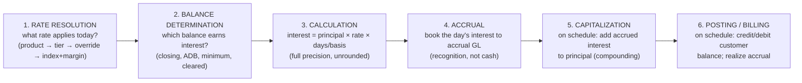

# The Interest Calculation Engine in Banking: A Comprehensive Guide

> **Author:** Jack Liu Shurui — Solution Architect at Cymbal Bank, Singapore
> **Context:** Core Banking / Banking Architecture — the interest-engineering deep-dive: the calculation machinery that turns principal, rate, and time into money — the overview (the one formula, the six computation stages, the engineering mindset), the interest types (fixed/floating, simple/compound, nominal/APR/APY/EIR), the day-count conventions (the ACT family, the 30/360 family, ACT/ACT ISDA and ICMA, leap years), the calculation methods (simple and compound interest, balance bases, tiering, reducing balance and amortization, flat rate, rule of 78, the discount method, the US Rule vs the actuarial method, the EIR method, pro-rata and penal arithmetic), the accrual mechanics, the precision and rounding engineering, the rate service, the run mechanics, the product-by-product calculation recipes, fully worked and verified examples, the verification and testing discipline, and the 2026+ trends
> **Repository:** [github.com/jackliusr/research](https://github.com/jackliusr/research)
> **Last Updated:** August 2026

---

## Table of Contents

1. [Overview: The Calculation Engine and the Interest-Engineering View](#1-overview-the-calculation-engine-and-the-interest-engineering-view)
2. [Interest Types: The Taxonomy the Engine Must Execute](#2-interest-types-the-taxonomy-the-engine-must-execute)
3. [Day-Count Conventions: The Time Dimension](#3-day-count-conventions-the-time-dimension)
4. [Calculation Methods: The Arithmetic Machinery](#4-calculation-methods-the-arithmetic-machinery)
5. [Accrual Mechanics: The Daily Heartbeat](#5-accrual-mechanics-the-daily-heartbeat)
6. [Precision and Rounding Engineering](#6-precision-and-rounding-engineering)
7. [The Rate Service](#7-the-rate-service)
8. [Run Mechanics and Engine Architecture](#8-run-mechanics-and-engine-architecture)
9. [Product-by-Product Calculation Recipes](#9-product-by-product-calculation-recipes)
10. [Worked Examples](#10-worked-examples)
11. [Verification and Testing Engineering](#11-verification-and-testing-engineering)
12. [The Future: 2026 and Beyond](#12-the-future-2026-and-beyond)
13. [Glossary](#13-glossary)
14. [References](#14-references)

---

### How to Read This Guide

This guide is the **calculation companion** to the repo's interest-engines overview. Where [interest_engines_core_banking_guide.md](interest_engines_core_banking_guide.md) covers the *machinery* — engine architecture, product configuration, vendors, accounting, the architect's view — this guide goes one level deeper into the **arithmetic itself**: every day-count convention with its exact date-adjustment rules, every calculation method with its formula and its worked numbers, the precision and rounding engineering that makes the arithmetic safe at scale, and the verification discipline that proves it. The two guides are designed to be read together: the sibling answers *how the engine is built and configured*; this one answers *what the engine computes and why the numbers are what they are*.

- **Relationship map.** The umbrella guide is [core_banking_systems_guide.md](core_banking_systems_guide.md) (the core platform). The engine-family siblings are [interest_engines_core_banking_guide.md](interest_engines_core_banking_guide.md) (interest machinery), [posting_engine_core_banking_guide.md](posting_engine_core_banking_guide.md) (the double-entry posting layer the interest engine books into), [banking_limits_domain_guide.md](banking_limits_domain_guide.md) (the limit engine), and this guide (the interest calculation layer). The EOD context is in [core_banking_processes_guide.md](core_banking_processes_guide.md) §7; the loan state machine in §5.3 of the same guide.
- **Reading paths.** (1) *Architects evaluating an engine:* read §1, §3, §4, §6, §8, §11 — the vocabulary and the verification checklist. (2) *Product owners configuring interest:* §2, §3, §4, §9, §10. (3) *Engineers implementing or testing:* §4, §5, §6, §10, §11 — the formulas, the worked arithmetic, and the golden-test discipline. (4) *Finance/accounting readers:* §5, §6, §10.13, and the EIR treatment in the sibling's §6. (5) *Readers in a hurry:* §1, §3.6 (the day-count comparison table), §10 (the worked examples), §11.
- **A note on verification.** Researched August 2026. Day-count convention rules were verified against the ISDA 2006 Definitions §4.16 family and ICMA Rule 251 as documented in the references; the Rule of 78 regulatory status against 15 U.S.C. §1615 and the UK Consumer Credit (Early Settlement) Regulations 2004; card mechanics (ADB/DPR) against standard US card disclosures; every worked number in §10 was independently re-computed at 28+ digit decimal precision during the writing of this guide. Claims that are engineering consensus rather than documented fact are marked **(consensus)**; anything that could not be verified is flagged in the claims-status table in §14.

---

## 1. Overview: The Calculation Engine and the Interest-Engineering View

The **interest calculation engine** is the component of a core banking system that turns *principal, rate, and time* into *money* — and does it correctly, deterministically, and auditably for tens of millions of accounts, every single day. It is the arithmetic heart of the bank's P&L: net interest income is the largest revenue line on most banks' income statements, and every cent of it passes through this engine.

### 1.1 The One Formula Everything Reduces To

Every interest calculation in banking — savings accounts, mortgages, credit cards, term deposits, overdrafts, interbank loans, bonds — is an elaboration of one primitive:

```
interest = principal × rate × time
```

The *principal* is the amount the interest is computed on (and *which* balance that is — closing, average, minimum, cleared — is itself a product decision, §4.3). The *rate* is the annual rate, resolved for the account on the day in question (§7). The *time* is a fraction of a year, computed from the **day-count convention** (§3) — the single most common source of disagreement between what a bank computes and what a customer (or another bank, or a regulator) computes, because the same 31-day period yields different year-fractions under different conventions.

Everything else in interest engineering — daily accrual, compounding, tiering, amortization, effective-rate accounting, rounding, audit — is this formula executed at scale with defined precision. When an interest calculation "goes wrong," it is almost always one of four things: the wrong **balance**, the wrong **rate**, the wrong **time fraction**, or the wrong **rounding** — which is why this guide is organized around exactly those four dimensions.

### 1.2 The Six Computation Stages

The calculation engine executes six stages. Note the deliberate split between *calculation* (pure arithmetic, no money movement) and *booking* (the postings that change balances and the GL) — the split is what makes interest auditable:



Stages 1–3 are the **calculation layer** — this guide's focus. Stages 4–6 are the **booking layer**, covered in the sibling guide (§2 components, §6 accounting) and the posting-engine guide. The engineering rule that makes the whole chain safe: *calculation is deterministic pure math; booking is idempotent accounting*. A rate history that can be replayed, a balance history that can be replayed, and an unrounded calculation layer produce a system in which any historical day's interest can be recomputed and diffed against what was booked (§11.4).

### 1.3 The Interest-Engineering Mindset

Four properties distinguish production interest code from textbook finance math:

- **Determinism.** The same (account, date, rate history, balance history) input must produce the same output, everywhere, every time. No floating-point nondeterminism, no dependence on execution order, no timezone or locale effects in date arithmetic (§6.1).
- **Precision discipline.** Money arithmetic uses decimal types, never binary floats; rounding happens at explicitly chosen points, never implicitly (§6).
- **Time is first-class.** Dates, day-counts, effective dates, and calendar rules are engine primitives, not string handling. The leap-year bug in an interest engine is a *financial* bug, not a cosmetic one (§3.5).
- **Auditability.** Every computed number must be re-derivable from recorded inputs. The engine keeps rate history and balance history immutable and stores the *resolved* rate used in each accrual record — not just the configuration it was resolved from (§7.2, §11.4).

### 1.4 Relationship to the Sibling Guides

- [interest_engines_core_banking_guide.md](interest_engines_core_banking_guide.md) — the machinery: engine architecture (§2), product configuration (§3), vendor implementations (Temenos AA / FLEXCUBE IC / Mambu / Thought Machine Vault, §7), accounting for interest (EIR, non-accrual, WHT, §6), the architect's build-vs-buy view (§8). This guide assumes that context and goes deeper on the arithmetic; where a concept is fully covered there, this guide says so and cross-references the section instead of repeating it.
- [posting_engine_core_banking_guide.md](posting_engine_core_banking_guide.md) — the double-entry layer: how the accrual and posting entries of §5 here actually land in accounts and the GL (entry lifecycle §3, balance components §5).
- [core_banking_processes_guide.md](core_banking_processes_guide.md) — where the interest run sits in EOD (§7), the deposit/loan state machines (§4–5), product lifecycle governance (§8).
- [financial_risk_compliance_systems_guide.md](financial_risk_compliance_systems_guide.md) — the EIR/IFRS 9 accounting treatment, ECL staging, usury and disclosure regulation.

---

## 2. Interest Types: The Taxonomy the Engine Must Execute

Interest is not one thing; it is a family of rate behaviours, compounding structures, and disclosure conventions, and the engine must be able to express all of them as configuration. This section lays out the taxonomy the calculation engine executes; the *mechanics* of each type (rate resolution, accrual, posting) are in the sibling guide §1 and §3.

### 2.1 By Rate Behaviour

| Type | Definition | Engine treatment | Examples |
|---|---|---|---|
| **Fixed** | Rate locked for the contract term | A rate value with an effective date, immutable for the term | Term deposits, fixed-rate mortgages |
| **Floating (variable)** | Rate reprices against a **reference rate + margin** on a schedule | Rate = index value (from the rate feed) + margin; re-resolved at repricing dates | SORA-linked mortgages, SOFR-linked corporate loans |
| **Stepped** | Rate changes on a *time schedule* (promotional steps) | A rate schedule keyed by elapsed term; the engine switches rate at each step boundary | High-yield savings "3% for 6 months, then 0.4%" |
| **Tiered** | Rate depends on the *balance* (progressive slices or step-up) | Tier table evaluated against the balance basis (§4.4) | Savings ladders |
| **Negative** | Rate below zero: the depositor pays the bank (or the borrower is credited) | A rate-sign configuration; engines must handle the sign correctly through accrual and posting | Post-2015 corporate deposits in EUR/CHF/JPY; some SG corporate accounts |
| **Penal** | Elevated rate on overdue amounts | Computed on the *overdue balance* only, tracked separately from contractual interest (§4.12) | Late-payment interest on loans and cards |

The benchmark transition from LIBOR to SOFR/SORA (2021–2023) is the canonical example of why the rate *index* must be configuration: the engines that survived it treated "which index, which fallback" as data, not code. See the sibling guide §1.2 and [full_stack_banking_guide.md](full_stack_banking_guide.md) for the benchmark context.

### 2.2 By Compounding: Simple vs Compound

- **Simple interest** — interest on the original principal only: `interest = P × r × (days/basis)`. Used for term deposits at maturity, many loans' contractual interest, and short-term instruments.
- **Compound interest** — periodically capitalized interest earns interest itself: `A = P × (1 + r/n)^(n·t)`. The compounding *frequency* (daily, monthly, quarterly, annual, at maturity) is a product parameter. In engines, compounding is implemented as the **capitalization event** (§5.4) — accrued interest is added to the principal on schedule, and future accrual re-bases on the enlarged balance. This is mathematically equivalent to the closed form for regular schedules and keeps the GL in balance along the way.

The difference is material: S$10,000 at 2% p.a. over one year earns S$200.00 simple, S$201.84 compounded monthly, S$202.01 compounded daily, and S$202.01 compounded continuously (§10.4).

### 2.3 By Disclosure: Nominal, APR, APY, EIR

Four numbers that must reconcile — and frequently don't, which is a classic source of regulator findings:

| Number | What it is | Compounding? | Used for |
|---|---|---|---|
| **Nominal rate** | The stated annual rate | No | Contract, rate tables |
| **APR** | Annualized cost of borrowing incl. fees, no compounding | No | Loan disclosure (US TILA, SG consumer-credit rules) |
| **APY / EAR** | Annualized return *including* compounding | Yes | Deposit disclosure (US Reg DD, MAS guidelines) |
| **EIR** | The rate that discounts expected cash flows to carrying value (IFRS 9) | Implicit (actuarial) | Accounting recognition of interest income |

The engine computes the contractual numbers; the disclosure and accounting numbers are derived from the same cash flows, and the derivation must be *reproducible* — a marketing APY computed with a different day-count than the engine's actual accrual is a compliance defect, not a rounding difference (§6.5, sibling §8.4).

### 2.4 By Product Family

| Product family | Typical rate type | Typical method (§4) | Typical day-count (§3) | Compounding |
|---|---|---|---|---|
| Savings / current | Tiered or stepped | ADB or closing-balance | ACT/365 (SG/UK retail) | Monthly or none |
| Term deposit | Fixed | Simple at maturity | ACT/365, ACT/360 | None (or periodic payout) |
| Amortizing loan | Fixed or floating (SORA + margin) | Reducing balance, EMI | ACT/365, ACT/360 | None (arrears only) |
| Credit card | Fixed per APR category | ADB + daily periodic rate | ACT/360 or ACT/365 per terms | Daily |
| Overdraft | Floating | Daily on drawn balance | ACT/365 | None |
| Hire-purchase / auto (SG) | Flat rate | Precomputed + Rule-of-78 rebate | 30/360 or months | None |
| Money market / interbank | Floating | Simple, discount method | ACT/360 | None |

### 2.5 Special Cases the Engine Must Handle

- **Negative interest** — the accrual sign flips; a negative-rate deposit accrues *interest expense to the customer* (DR customer, CR income-reversal). Engines with hard-coded non-negative assumptions break here; the FLEXCUBE convention of a derived negative class code (`<main class>_N`) is one vendor answer (sibling §7.2).
- **Zero and floor rates** — "rate floor of 0%" products (common in the negative-rate era) require the engine to clamp the *resolved* rate at the floor *before* calculation.
- **Islamic profit-rate products** — profit is computed on a *profit-sharing* basis rather than interest, but the arithmetic machinery (daily accrual on balances, periodic distribution) is the same engine with different product semantics. The vendor cores (Temenos, FLEXCUBE, BaNCS) implement this as separate product definitions on the same calculation core.
- **Penal vs contractual separation** — penal interest must be computed and tracked in separate buckets, because regulatory reporting, non-accrual treatment, and allocation order (§4.12) all treat them differently.
- **Two-rate products** — e.g., an overdraft that charges one rate up to the limit and a higher rate above it, or a card with different APRs for purchases, cash advances, and balance transfers accruing simultaneously on different sub-balances.

---

## 3. Day-Count Conventions: The Time Dimension

The *time* in `interest = principal × rate × time` is a **year fraction** — the **DayCountFactor** — computed as *days in the accrual period ÷ year basis*, where the numerator itself is a function of the convention's date-adjustment rules. The convention determines both *which days count* and *what the year is worth*. There is no central authority defining day-count conventions — the two bodies that document them are ISDA (the 2006 Definitions, §4.16) and ICMA (Rule 251) — and the same label ("30/360", "actual/actual") can mean different things in different markets, so the engine's convention implementation must be *named precisely* and *tested against known values*, never assumed from a colloquial name.

### 3.1 The DayCountFactor

```
DayCountFactor = adjusted-days(D1, D2) / year-basis
interest       = principal × rate × DayCountFactor
```

Two conventions matter for reproducibility: (1) the **first day counts, the last day does not** (the period 15 Jan → 15 Feb has 31 days: Jan 15–31 is 16 days, Feb 1–15 is 15 days); (2) the numerator is the *adjusted* day count — under 30/360 rules a 31-day period can legally contain only 30 counting days. The engine must implement the adjustment rules **in order**, because the rules chain (a date changed by one rule feeds the next).

### 3.2 The Actual Family

| Convention | Numerator | Denominator | Notes |
|---|---|---|---|
| **ACT/365 Fixed** (ACT/365F, "English") | actual days | 365 always | UK retail convention; savings, term deposits, SG retail loans. Leap day counts as a day but the year stays 365 |
| **ACT/360** ("French") | actual days | 360 always | Money-market convention: interbank, corporate loans, credit cards, repos. Pays ~1.4% more than ACT/365 at the same stated rate |
| **ACT/365L** (ISMA-Year) | actual days | 366 if the period's year contains the leap day (per frequency rules), else 365 | Euro-sterling floating-rate notes |
| **NL/365** | actual days *minus* leap days | 365 | Some European mortgages; treats Feb 29 as not a day |
| **ACT/364** | actual days | 364 | Rare; some Danish instruments |

The ACT/365 vs ACT/360 distinction is the most consequential in retail banking: S$10,000 at 2% for 30 days earns **S$16.44** under ACT/365 but **S$16.67** under ACT/360 — the same rate, a different number, and customers notice. Which basis a product uses is a *product parameter*, and consumer-credit regimes in several jurisdictions mandate the basis for comparability of advertised rates.

### 3.3 The 30/360 Family

All 30/360 conventions share the formula `DayCountFactor = [360·(Y2−Y1) + 30·(M2−M1) + (D2−D1)] / 360` — i.e., months of 30 days and years of 360 — and differ only in how they adjust dates landing on the 31st or on end-of-February. The rules, applied in order:

| Convention | Date-adjustment rules | Aliases / use |
|---|---|---|
| **30/360 US** (30U/360) | (1) If D1 is the last day of February and D2 is the last day of February, set D2 = 30. (2) If D1 is the last day of February, set D1 = 30. (3) If D2 = 31 and D1 = 30 or 31, set D2 = 30. (4) If D1 = 31, set D1 = 30 | US corporate bonds, US agency issues; the "default" 30/360 |
| **30E/360** (Eurobond basis, 30/360 ICMA/ISMA, "German") | If D1 = 31 → D1 = 30. If D2 = 31 → D2 = 30 | Eurobonds; Excel `30/360 TRUE` |
| **30E/360 ISDA** (pre-2000 Eurobond basis) | If D1 is the last day of the month → D1 = 30. If D2 is the last day of the month → D2 = 30 (unless D2 is the maturity date and M2 = February) | German master agreements; ISDA 2006 §4.16(h) |
| **30E+/360** (30Eplus/360) | If D1 = 31 → D1 = 30. If D2 = 31 → D2 = 1 and M2 = M2+1 (the period rolls into the next month) | Some European instruments |
| **30A/360** (Bond basis, ISDA 2006 §4.16(f)) | D1 = min(D1, 30); if D1 > 29 then D2 = min(D2, 30) | Less common bond variant |

Practical consequences the engine must get right: under 30/360 US, February counts as **30 days** (a loan accruing Feb 1 → Mar 1 accrues 30 days, not 28); under 30E/360, *any* 31st is re-written to the 30th; and the Feb-28/Feb-29 special cases in the US rule exist precisely because US corporate bonds pay coupons on month-end dates. The common retail simplification — "30/360 means every month has 30 days" — is *almost* right and exactly wrong in the corner cases, which is why known-value tests (§11.1) must include Feb and 31st-of-month cases.

### 3.4 ACT/ACT: The Two Standards That Share a Name

**ACT/ACT ICMA** (ISMA-99; US Treasuries, most government bonds). The coupon period is the unit of time, and each period is worth exactly `1/Freq` of the coupon rate:

```
DayCountFactor = Days(D1, D2) / (Freq × Days(D1, D3))
```

where D3 is the next coupon date. For a regular period this equals 1/Freq exactly (every coupon is the same amount); for irregular (broken) first/last periods the period is split into notional quasi-coupon periods and the factors are summed. Every day within a coupon period is valued equally — a 182-day period values each day at 1/182 of the coupon, a 183-day period at 1/183. This is a *coupon* convention, rarely used for bank retail products, but it appears in bond-portfolio systems the bank's treasury runs.

**ACT/ACT ISDA** (the "historical"/leap-split method; ISDA 2006 §4.16(b)):

```
DayCountFactor = days-in-non-leap-year / 365  +  days-in-leap-year / 366
```

The period is split across calendar years and each portion is divided by that year's actual length. A 31-day period straddling 31 Dec: 15 Dec 2023 → 15 Jan 2024 = 16 days in 2023 (÷365) + 15 days in 2024 (÷366) = a year fraction of 0.0848192… vs 0.0849315… under ACT/365F — a small but *exact* difference (§10.2). The sibling guide's §1.4 "ACT/ACT" row is this convention; note the label collision with ICMA.

### 3.5 Leap Years and Year Boundaries: The Classic Engine Defect

The leap year is where interest engines fail in production, and the failure is always a money bug:

- **ACT/365F**: leap day counts as a day but the year stays 365 — accruing 29 Feb yields 1/365 of the annual rate, and a full leap year yields 366/365 of the annual rate. This is *correct per the convention* and the most common retail configuration.
- **ACT/ACT ISDA**: the leap day is worth 1/366, so a full leap year yields exactly 1.0 — this is the convention's entire purpose (ISDA swaps accrue exactly the annual rate in a leap year).
- **ACT/360**: leap day is 1/360 regardless.
- **30/360 family**: Feb 29 is simply a day in a 30-day February.

The classic defects: (a) a date library that computes 29 Feb as "day 59 of 366" but the engine divides by 365 (overpays); (b) year-boundary periods where the "days in year" lookup uses the *start* year instead of splitting per the ISDA rule (misprices the last days of December); (c) century/non-century leap rules (2000 was a leap year, 1900 and 2100 are not) hard-coded wrong; (d) timezone-aware date libraries shifting the value date across midnight. Every golden-test library (§11.1) must include: 29 Feb, 28 Feb → 1 Mar, 31 Dec → 1 Jan, and a century-boundary case.

### 3.6 The Day-Count Comparison Table

The same S$10,000 at 2% p.a. across conventions — period **15 Dec 2023 → 15 Jan 2024** (31 actual days, straddling a year boundary) and **15 Jan 2024 → 15 Feb 2024** (31 actual days, inside a leap year):

| Convention | 15 Dec 2023 → 15 Jan 2024 | 15 Jan 2024 → 15 Feb 2024 | Note |
|---|---|---|---|
| ACT/365 Fixed | 31/365 → **S$16.99** | 31/365 → **S$16.99** | Leap day irrelevant here |
| ACT/360 | 31/360 → **S$17.22** | 31/360 → **S$17.22** | Highest of the ACT family |
| ACT/ACT ISDA | 16/365 + 15/366 → **S$16.96** | 31/366 → **S$16.94** | Leap split vs all-in-leap-year |
| 30/360 US | 30/360 → **S$16.67** | 30/360 → **S$16.67** | Both dates ≤ 30; no adjustment |
| 30E/360 | 30/360 → **S$16.67** | 30/360 → **S$16.67** | Same result here |
| 30E/360 ISDA | 30/360 → **S$16.67** | 30/360 → **S$16.67** | Same result here |

The table makes the engineering point: five conventions, four different answers for the same principal, rate, and calendar period — and the spread (S$16.67 to S$17.22, ~3.3%) is larger than most banks' margins on the product. The convention is a product parameter and its effect on the P&L is measurable at the portfolio level: over a full year 30/360 and ACT/365 both accrue exactly the annual rate (each reaches a year fraction of 1.0), but month to month they diverge — a 30-day month accrues 1/12 of annual interest under 30/360 but 30/365 under ACT/365, a ~0.11% shift of annual interest per month on a S$10 billion book (≈S$220,000/month at 2%), which is why the convention choice shows up in monthly income recognition and in parallel-run reconciliation long before the year-end wash.

### 3.7 Business-Day and EOM Adjustments

Two adjacent rules the engine must implement alongside the day-count:

- **Business-day conventions** (following/preceding/modified-following) shift *payment and repricing dates* that fall on weekends/holidays — they change *when* money moves but not the day-count of the accrual period (the period still counts actual days per the convention). The Singapore holiday calendar (public holidays plus the SORA-fixing calendar) is configuration.
- **EOM (end-of-month) dating**: an EOM instrument pays on the last calendar day of the month (so a Feb 28 start rolls to Mar 31, Apr 30, …), and the 30/360 US rules' first two adjustments exist specifically for EOM bonds. Non-EOM instruments pay on the same day-number (the 10th, the 15th).

These are date-arithmetic concerns of the *schedule engine*; they matter to the interest engine because a shifted payment date changes the accrual period boundaries and therefore the day count. See the schedule mechanics in [core_banking_processes_guide.md](core_banking_processes_guide.md) §7 for where the holiday calendar lives in the EOD pipeline.

---

## 4. Calculation Methods: The Arithmetic Machinery

This section is the heart of the interest-engineering view: the complete set of calculation methods a production interest engine implements, each with its formula, its semantics, and its traps. The methods divide into two families: **accrual methods** (interest computed period by period on a balance, the norm for savings and reducing-balance loans) and **precomputed methods** (total interest computed up front and allocated to installments, used in flat-rate lending and its relatives).

### 4.1 Simple Interest

```
interest = P × r × (days / basis)
```

The foundational accrual method: interest on the original principal for the elapsed time. Used for term deposits (computed once at maturity), savings accrual (computed daily, summed monthly), and the contractual interest on most loans. The only decisions are the *balance* (P — which balance, §4.3), the *rate* (r — resolved per §7), and the *time* (days/basis — the day-count of §3).

**Traps:** (a) mixing conventions — accruing ACT/360 and disclosing ACT/365; (b) the partial-period question — a deposit opened on the 15th earns 16 days in a 31-day month (first-day-inclusive); (c) the "simple vs compounded disclosure" gap — a 2% simple rate and a 2% APY are different promises (§2.3).

### 4.2 Compound Interest

```
A = P × (1 + r/n)^(n·t)        (discrete compounding, n periods per year)
A = P × e^(r·t)                (continuous compounding — the limit as n → ∞)
```

The compounding *frequency* is a product parameter; the engine implements it as the capitalization event (§5.4): accrued interest is added to the principal on schedule and future accrual re-bases. For regular schedules the engine's step-by-step capitalization is exactly equivalent to the closed form; for irregular schedules (opening mid-period, rate changes) the step-by-step form is the *definition* and the closed form is the approximation.

**Effective annual yield:** APY = (1 + r/n)^n − 1 for discrete, e^r − 1 for continuous. At 2% nominal: 2.0184% monthly, 2.0201% daily, 2.0201% continuous (§10.4). The daily-vs-continuous gap (0.000004%) is why most engines stop at daily.

**Traps:** (a) compounding *rounded* values — the drift problem of §6.5; (b) compounding frequency ≠ posting frequency (daily accrual + monthly capitalization + monthly posting is the common savings configuration and the three must not be conflated); (c) loans: contractual loan interest generally does *not* compound — unpaid interest becomes arrears, and capitalizing it is a distressed event needing approval (sibling §5.3).

### 4.3 Balance Bases: What "Principal" Means

The engine must know *which balance* earns interest. The methods:

| Balance basis | Definition | Typical use |
|---|---|---|
| **End-of-day closing balance** | Each day's closing balance accrues that day's interest | The default in most modern accrual engines |
| **Average Daily Balance (ADB)** | Σ(daily balances) ÷ days in the period; interest = ADB × rate × days/basis — equivalently Σ(daily balance × daily rate) | Savings products (dominant), credit cards |
| **Minimum daily balance** | The lowest balance during the period | Classic "minimum balance" savings products |
| **Cleared / collected balance** | Balance of cleared funds only (checks not yet cleared excluded) | Current accounts; the FLEXCUBE balance-component ladder (ledger/available/cleared/uncleared) is the canonical model (sibling §7.2, [oracle_flexcube_data_model_guide.md](oracle_flexcube_data_model_guide.md) §4.5) |
| **Available balance** | Cleared minus holds/liens | Accounts with holds; interest on available funds |

ADB deserves spelling out because it is the most common and the most misunderstood: an account at S$10,000 for 15 days and S$5,000 for 15 days in a 30-day period has ADB = (10,000×15 + 5,000×15)/30 = **S$7,500**, and earns the same as accruing daily on each day's closing balance — *when balances change only at EOD*. Real-time engines accrue on the balance at each balance-changing event, which is the same math at finer granularity. Cards compute ADB *per billing cycle* with transaction-day weighting (§9.5); whether the day of a purchase or payment counts is defined in the card terms ("ADB including new purchases" is the common US default) and must be a documented parameter, not an implementation choice.

### 4.4 Tiered and Stepped Rates

**Tiered (progressive)** — each *slice* of the balance earns its tier's rate:

```
interest = Σ over tiers of [ slice_amount(tier) × rate(tier) × days/basis ]
```

On S$10,000 with tiers 0–5,000 @ 1% and 5,000+ @ 2%: 5,000×1% + 5,000×2% = **S$150 p.a.** (effective 1.50%).

**Step-up (all-or-nothing, "tier rate")** — the *whole* balance earns the highest tier's rate: 10,000×2% = **S$200 p.a.** The S$50 gap is why the tiering *semantics* must be a documented product parameter — the same tier table, two different products (sibling §3.2).

**Stepped (promotional)** — the rate varies by *elapsed time*, not balance: "3% for the first 6 months, then 0.4%." The engine evaluates the rate schedule at each accrual date; the step boundary re-rates the account prospectively. Blended result on S$10,000: 182 days @ 3% (S$149.59) + 183 days @ 0.4% (S$20.05) = **S$169.64** (§10.7) — the "3% p.a." headline must reconcile with the S$169.64 the engine actually pays.

### 4.5 Reducing Balance and Amortization

The dominant loan method: interest on the **declining outstanding principal**, with the payment split into interest + principal by the **amortization schedule**:

```
daily interest = outstanding × rate / basis
EMI = P × r × (1+r)^n / ((1+r)^n − 1)     (equal monthly installments)
```

Each EMI first covers the period's interest (month 1 on S$100,000 @ 5%/12 = S$416.67) and the remainder reduces principal (S$243.29), so interest declines month by month as the outstanding shrinks (§10.8). The amortization schedule — the full table of interest/principal splits — is the engine's canonical loan output and the basis of billing, statements, and the outstanding balance the accounting records must agree with (sibling §5.1; loan lifecycle in [core_banking_processes_guide.md](core_banking_processes_guide.md) §5).

**Trap:** the schedule must be computed from the *exact* payment and the *rounded or unrounded* EMI policy must be explicit — 240 × 659.9557… = S$158,389.38 vs 240 × S$659.96 = S$158,390.40; the final payment absorbs the difference (§10.8).

### 4.6 Flat Rate and Precomputed Interest

**Flat rate** — interest on the *original principal for the full term*, divided into installments:

```
total interest = P × flat_rate × term_years
```

S$100,000 at 5% flat over 5 years = S$25,000 interest regardless of repayments; EMI = S$2,083.33. The quoted rate understates the true cost: the reducing-balance equivalent is ≈**9.2% p.a.** (nominal; ≈9.5% effective annual) because the borrower holds, on average, only about half the principal (§10.9). Flat-rate disclosure is a consumer-protection staple in Singapore (hire-purchase, moneylender products) — the *effective* rate must be disclosed, not just the flat one.

**Precomputed interest** — total finance charge computed up front (by flat rate, simple interest, or any disclosed method) and *added to principal*: the borrower owes principal + finance charge, and the charge is allocated to installments by a rule — most notoriously the **Rule of 78** (§4.7). Early settlement entitles the borrower to a rebate of the unearned portion.

### 4.7 The Rule of 78 (Sum of the Digits)

The precomputed-interest allocation that front-loads interest: for an n-month loan, month *k* bears (n−k+1)/D of the finance charge, where D = n(n+1)/2 (the sum of digits — 78 for 12 months, 300 for 24). Rationale: in month 1 the borrower holds the full n months' principal, in month 2 only n−1 months', etc. — so the charge is "fair" *if the borrower pays only the scheduled amounts*.

```
earned interest after m payments  = f × m·(2n − m + 1) / (n·(n+1))
rebate on early settlement        = f × remaining_digits / total_digits
```

**The problem:** on early settlement the rule over-allocates interest to the early months relative to what the borrower actually held. Settling a 12-month loan with S$100 precomputed interest after 3 months: months 4–12's digits (9+8+…+1 = 45) are unearned → rebate = 45/78 × 100 = **S$57.69**, i.e., the borrower "earned" S$42.31 of interest in the first 3 months — 42.3% of the charge for 25% of the term (§10.10).

**Regulatory status (verified):** the US prohibits the Rule of 78 for mortgage refinancings and other consumer loans with terms exceeding 61 months (15 U.S.C. §1615); the UK abolished it for consumer credit via the Consumer Credit (Early Settlement) Regulations 2004 (SI 2004/1483), in force 31 May 2005, which require the actuarial method for rebates. Several other jurisdictions restrict or ban it; it survives mainly in auto/hire-purchase finance (including Singapore car loans, where it remains the standard early-settlement rebate method) and legacy books. Engines must therefore *support* it (legacy + specific markets) while the compliance layer flags products where it is unlawful.

### 4.8 The Discount Method (Banker's Discount)

Interest deducted **up front** from the face value, the borrower receives proceeds net of interest:

```
discount  = F × d × (days/basis)      (d = discount rate)
proceeds  = F − discount
```

The discount rate understates the true cost because it is applied to the *face value* the borrower never holds. S$10,000 face, 2% discount rate, 182 days: discount = S$99.73, proceeds = S$9,900.27, effective annual rate = (99.73/9,900.27) × (365/182) = **2.020%** (§10.12). The discount method is the standard for T-bills and commercial paper (quoted on a discount basis) and appears in bank engines via the securities/treasury modules rather than retail lending.

### 4.9 The US Rule vs the Actuarial Method

Two methods for computing interest when **partial payments** occur on loans — a frequent source of customer disputes and the reason the method must be a documented product parameter:

- **The US Rule** (simple-interest method): interest is computed on the outstanding principal *from the last payment date to the current payment date*; each payment first clears the accrued interest, then reduces principal. If a partial payment is smaller than the accrued interest, **no interest is capitalized** — the unpaid interest simply remains outstanding and accrues no interest itself (no interest-on-interest). This is the consumer-friendly method and the common statutory default.
- **The Actuarial method** (effective-interest/IRR method): the interest rate is applied to the outstanding balance with interest-on-interest — an insufficient partial payment leaves the shortfall *added to principal*, so the shortfall itself earns interest. This is the method behind amortization schedules and EIR accounting (§4.10).

Worked contrast (§10.11): S$20,000 at 10% p.a., ACT/365, a partial payment of S$500 at day 90, settlement at day 182. US Rule: interest to day 90 = S$493.15 (cleared), principal reduced by S$6.85 to S$19,993.15, interest to day 182 = S$503.94 → settlement **S$20,497.09**. Under the actuarial method the same payment would leave a slightly higher balance because any shortfall compounds. The difference is cents on one account and millions across a portfolio — and partial-payment handling is one of the most common defects found in core-migration parallel runs (sibling §5.5, §8.5).

### 4.10 The Effective Interest Rate (EIR) Method

The **EIR** is the rate that exactly discounts the instrument's estimated future cash flows to its net carrying amount — the actuarial method applied to *accounting*: it is the internal rate of return of the cash-flow stream (fees included). Under IFRS 9, interest income is recognized at the EIR, not the nominal rate. When fees, discounts, or expected prepayments exist, EIR ≠ nominal: a S$10,000 loan at 5% p.a., 12 monthly payments of S$856.07, with a S$100 origination fee (net proceeds S$9,900), has a monthly EIR of 0.5735% → **6.88% p.a.** — the fee is accreted into income over the life, not taken up front (§10.13). The engine (or the finance layer — sibling §6.3) maintains the *contractual* interest view (what the customer is billed) and the *EIR* view (what the bank recognizes), and books the difference as the EIR adjustment.

### 4.11 Partial-Period and Pro-Rata Computation

Three recurring partial-period situations:

- **Mid-period rate changes** — a rate change effective on the 16th splits the month: 15 days at the old rate + 16 days at the new. S$10,000, 2% → 2.5% mid-month (31-day month): 15/365×2% + 16/365×2.5% = S$8.22 + S$10.96 = **S$19.18** — vs S$16.99 (all old) or S$21.23 (all new) (§10.2). The split must be *prospective from the effective date*; retroactive re-rating is a repricing error.
- **Mid-period opening/closing** — an account opened on the 15th accrues from that date (first-day-inclusive); a closed account accrues through its last day. The accrual period boundaries are per-account, not calendar-aligned.
- **Capitalization mid-period** — when interest is capitalized on a date other than the accrual-period boundary (daily compounding), each day's accrual re-bases on the prior day's capitalized balance — the step-by-step compounding of §4.2.

### 4.12 Penal, Arrears, and Capitalized Interest

- **Penal (late-payment) interest** — computed on the *overdue installment amount* at a penal rate, tracked in its own bucket: S$1,000 overdue for 30 days at 4% penal = S$3.29, plus the contractual interest continuing on the outstanding (S$6.58 at 8%) (§10.2). Penal interest must *not* be capitalized into principal without approval and is reported separately.
- **Arrears waterfalls** — partial payments on an account in arrears are allocated in a mandated order (oldest bucket → fees → interest → principal, or interest-first); mis-allocation is invisible until settlement and is a leading remediation complaint (sibling §5.5).
- **Capitalized interest on distressed loans** — unpaid interest added to principal (interest-on-interest) is usually a defined *distressed* event requiring approval and disclosure; the engine must distinguish it from routine deposit compounding.

### 4.13 Method Selection Table

| Product | Method (§4) | Balance basis | Compounding |
|---|---|---|---|
| Savings account | 4.1/4.2 simple or compound daily | ADB or closing | Monthly or none |
| Term deposit | 4.1 simple at maturity | Principal | None |
| Amortizing loan | 4.5 reducing balance + EMI | Outstanding | None |
| Flat-rate loan / hire-purchase | 4.6 precomputed (+ 4.7 Rule of 78 rebate) | Original principal | None |
| Credit card | 4.3 ADB + daily periodic rate | ADB per cycle | Daily |
| Overdraft | 4.1 daily on drawn balance | Drawn (negative) balance | None |
| T-bill / commercial paper | 4.8 discount | Face value | None |
| Corporate loan with fees | 4.10 EIR for accounting, 4.1 for billing | Outstanding | None |

---

## 5. Accrual Mechanics: The Daily Heartbeat

### 5.1 What Accrual Is

Accrual is the accounting recognition of interest **as it is earned or owed, not when it is paid**. The engine therefore maintains two parallel truths: the **accrued** interest (earned/owed to date, sitting in balance-sheet accrual accounts) and the **posted/cash** interest (actually credited to the customer or billed). For a savings account the accrual accumulates silently day by day; the customer's balance changes only at posting. The accounting entries are fully covered in the sibling guide §6.1–6.2 — the calculation-side points this guide adds:

- The accrual is the **unrounded** arithmetic of §4, booked at full precision into the GL (S$0.547945… per day, not S$0.55 — §6.4).
- The accrual **frequency** (daily is the norm; some products accrue weekly/monthly) is a product parameter, but daily is the only frequency that makes real-time display and mid-month statements exact.
- The accrual is the *link* between calculation and posting: `posted = Σ(accrued) at the posting date, rounded once`.

### 5.2 The Accrual Computation and Its Keys

For each account, each accrual day, the engine computes:

```
accrual(account, day) = balance(account, day) × resolved_rate(account, day) / basis(day)
```

and books it keyed by **(account, value date, accrual period)**. The key matters — it is what makes accrual **idempotent**: re-running a day must produce the identical record, and a re-run is an overwrite-with-same-value, never a duplicate posting (sibling §2.5). The accrual record must store the *inputs*, not just the output: balance used, resolved rate, day-count basis, and the source references (which balance component, which rate effective-date entry) — because that is what audit recomputation replays (§11.4).

### 5.3 Retrospective vs Prospective Accrual

Two accrual philosophies, both used in production:

- **Retrospective (on balances):** interest accrues on the *actual historical balances* — what the account really held. The natural method for deposits and revolving products, where the balance history is the truth. Temenos' deposit accrual and most savings engines are retrospective.
- **Prospective (on scheduled cash flows):** interest accrues on the *contractual cash-flow schedule* — for loans, the amortization schedule's interest column accrues even before/regardless of the exact balance movements, which keeps accrual aligned with billing. Temenos' loan accrual is prospective by default (the ACCR property class's retrospective-vs-prospective flag — sibling §7.1).

The two can diverge transiently (a prepayment changes balances before the schedule catches up) and the engine must reconcile them at each billing event. The choice is a product parameter, and it is one of the first questions in a vendor-engine evaluation (sibling §7.7).

### 5.4 Capitalization and Posting: The Compounding Event

- **Capitalization** is the compounding step: on the product's capitalization schedule (daily/monthly/quarterly/at maturity), accrued interest is added to the principal balance and future accrual re-bases. For deposits this is routine; for loans it is the distressed interest-on-interest event of §4.12.
- **Posting** is the customer-visible realization: the accrued balance is credited/debited to the customer account (monthly for savings, at maturity for term deposits, per billing cycle for cards/loans) and the accrual accounts are reversed. The *compounding frequency*, *capitalization schedule*, and *posting frequency* are independent parameters — "daily accrual, monthly capitalization, monthly posting" is the common savings stack (sibling §3.3).

The engine invariant: **posted interest must equal accrued interest at the posting boundary, within the rounding policy.** Vendors enforce this mechanically — Thought Machine Vault runs the apply-interest schedule only if the accrue-interest schedule succeeded that day (sibling §7.4).

### 5.5 Idempotency, Reversal, and the Accrual Ledger

- **Idempotency** — the (account, value date, period) key of §5.2; a re-run overwrites with identical values. Without it, a restarted EOD double-books interest.
- **Reversal** — a correction (wrong rate applied, account reopened after closure) is a *reversal posting* + fresh accrual, never an in-place edit; the audit trail keeps both the wrong and the corrected record. This mirrors the posting engine's storno/reversal discipline ([posting_engine_core_banking_guide.md](posting_engine_core_banking_guide.md) §3.4).
- **The accrual ledger** — the sum of per-account accrual records must equal the GL accrual balance (accrued interest payable for deposits, receivable for loans) at all times; the daily control totals of the interest run are exactly this reconciliation (§8.5, sibling §6.6).

---

## 6. Precision and Rounding Engineering

### 6.1 Why Binary Floating Point Is Banned

IEEE 754 binary floats cannot represent 0.01 exactly (0.01 = 0.00000010100011110101110000…₂, an infinite binary fraction). A daily accrual computed in float64 carries a ~1e-17 relative error per operation; across 10 million accounts × 365 days, the errors do not cancel — they accumulate into a material reconciliation break, and they are **non-deterministic across compilers, CPUs, and parallelization orders**, which alone disqualifies floats in a system whose output must be byte-identical on every re-run (§1.3). The rule: *money arithmetic uses decimal types (28+ significant digits — Java `BigDecimal`, C# `decimal`, Python `decimal`, SQL `NUMERIC(38,x)`) or integer scaled units (cents as integers, ISO 4217 minor units — §6.6), never binary floats.* Rates are stored to the basis point or finer; balances to the minor unit or finer.

### 6.2 Decimal Arithmetic and Scaled Integers

Two production styles:

- **Decimal/BigDecimal types** — the engine computes at high precision and rounds explicitly at defined points. Natural for complex formulas (EMI, EIR bisection); requires discipline that *every* `divide` specifies a scale and rounding mode (a `BigDecimal.divide` without a scale throws or defaults in ways that have shipped real bugs).
- **Scaled integers** — all amounts stored as integers in the currency's minor unit (S$1.23 = 123), arithmetic is integer arithmetic, and division is only ever *final* division with an explicit rounding mode. Fast, deterministic, and the style of the fastest engines; harder for fractional rates (rates themselves are stored scaled: 2.05% = 205 basis points).

The pragmatic architecture: **decimal in the calculation layer, scaled integers or decimal in the store, rounding only at the four defined points** — (1) daily accrual *posting* to the accrual balance (often not rounded at all — the accrual balance carries full precision), (2) capitalization, (3) customer-visible postings, (4) statement/billing output.

### 6.3 Rounding Methods

| Method | Rule for a tie (exactly .5 at the rounding digit) | Notes |
|---|---|---|
| **Round-half-up** | Round away from zero (2.5 → 3) | The retail norm; simple to explain; slight upward bias over many operations |
| **Round-half-even (banker's)** | Round to the nearest *even* digit (2.5 → 2, 3.5 → 4) | Default of IEEE 754 and Python's `round`; statistically unbiased over uniform data — the reason statistical/analytical systems use it; also specified in some European rounding regimes |
| **Truncation / floor** | Always round down (2.59 → 2.5) | Never customer-friendly on deposits; appears in some fee calculations |
| **Ceiling** | Always round up | Rare; some tax/fee contexts |

Worked: 16.438356 → S$16.44 under both half-up and half-even (the tie rules differ only at exact .5): 16.435 → 16.44 (half-up) and 16.44 (half-even — the third decimal 5 ties, second decimal 3 is odd → up), while 16.445 → 16.45 (half-up) vs **16.44** (half-even — second decimal 4 is even → down). The method must be a product parameter: a bank that rounds savings half-up and the same product's fees half-even is defensible; a bank that *mixes methods silently* is not.

### 6.4 Where to Round: The Two Policies

- **Accrue unrounded, round at posting** (the norm): daily accruals carry full precision into the accrual balance (S$0.547945…/day); the 30-day sum S$16.438356… is rounded once at posting to **S$16.44**.
- **Round daily:** each day's accrual rounds to the cent (S$0.55); the 30-day sum is **S$16.50** — six cents different from the unrounded policy on one account-month.

Both are defensible *if* the product definition says so. The danger is **mixing**: accruing unrounded but capitalizing rounded values at different frequencies is what creates rounding drift (§6.5). The sibling's §9.6 works the same example; this guide's contribution is the engineering framing: the rounding *policy* is part of the product contract, is disclosed, and is verified by golden tests — the customer's statement, the GL, and a hand recomputation must agree to the cent.

### 6.5 Rounding Drift and the Rounding Reserve

**Drift** is the accumulation of per-period rounding errors when rounded values are compounded: on a 20-year mortgage, rounding each month's interest to the cent and capitalizing it compounds the error into tens of dollars. Mitigations, in order of preference: (a) accrue internally at high precision and round only at customer-visible postings; (b) never compound rounded values — capitalize the unrounded accrual; (c) absorb the residual in a **rounding reserve** GL account.

The reserve is *expected and bounded*: the difference between "Σ per-account rounded postings" and "unrounded GL accrual" accumulates there. It is not a mystery account — it reconciles monthly, and a *growing* reserve is a rounding-policy defect signal, not a fact of life (sibling §6.6). Scale of the phenomenon: the S$0.06 per account-month drift of §6.4 is S$600/month per 10,000 accounts — S$7,200 per year per 10,000 accounts, and S$0.72M per year at a million accounts. That is a P&L line item, which is why rounding policy is a *governed* parameter, not an implementation detail.

### 6.6 Per-Currency Precision

Money precision is per-currency, defined by ISO 4217 minor units: SGD/USD/EUR 2 decimals, JPY 0, BHD/KWD 3, CLF 4. The engine's amount type must be currency-aware:

- A product's rounding *scale* comes from its currency, not a global constant ("2 decimals" is wrong for JPY and KWD).
- FX-converted amounts (interest on a USD deposit booked through an SGD GL) round at each currency boundary per that currency's rules.
- Cross-currency accrual uses the *settlement* currency's scale at posting; the accrual balance may carry finer precision than the display currency.
- Some engines store balances at higher internal precision than the minor unit and round only on display — fine, as long as the display rounding is the *defined* one and the internal precision never leaks into customer-visible postings.

---

## 7. The Rate Service

### 7.1 The Resolution Chain

Every calculation starts with "what rate applies to this account today?", answered by a **resolution chain** evaluated in fixed precedence:

```
1. account override (negotiated rate, with approval + effective date)
2. balance tier (tier table evaluated on the balance basis, §4.4)
3. product default rate (or index + margin for floating products)
4. reference rate from the rates feed (SOFR, SORA, EURIBOR, TONA) + margin
```

The precedence is deterministic and documented; an override beating a tier beating the product default is the standard order, and the reverse is a configuration error that silently mispays (sibling §1.6 has the full diagram). Two properties matter to the calculation layer: **every hop is effective-dated** (any historical day resolves to the rate then in force — the foundation of recompute), and **the resolved rate is what the accrual record stores** (reproducible without re-running resolution).

### 7.2 Effective Dating and Rate History

Rate history is *append-only*: (rate, effective date, source, approval) records, never updated in place. This is what makes both prospective re-rating (the new rate applies from its effective date — the norm) and historical recomputation (audit) exact. A rate change mid-month is handled by the pro-rata arithmetic of §4.11 — 15 days at old, 16 days at new — never by retroactively rewriting the closed days. Rate changes also feed disclosure obligations (change-in-terms notices for floating loans, 30-day notice conventions for deposit products — sibling §8.4).

### 7.3 Index + Margin and Fallback Chains

Floating products are `contract rate = index value + margin`, where the index comes from the daily rate feed. The post-LIBOR world made the **fallback chain** a first-class rate-service construct: primary index → replacement index → fixed spread adjustment, published and auditable (the ARRC-recommended SOFR fallbacks, the ABS SORA transition). The engine's rate service must (a) ingest index fixings with their publication dates, (b) apply the fixing that governs each accrual period (e.g., the 3-month SORA fix at the start of a quarter), (c) flag missing/stale fixings rather than silently reusing the last value, and (d) store the exact index value + margin used in each accrual record (§7.1). The benchmark context is in [full_stack_banking_guide.md](full_stack_banking_guide.md) and [financial_infrastructure_guide.md](financial_infrastructure_guide.md).

### 7.4 Rate-Change Arithmetic

The rate service's output feeds the calculation layer as a *function of date*: `rate(account, date)` is a lookup, not a variable. The calculation layer never "holds" a rate — it evaluates the function per accrual day. This design is what makes pro-rata splits, mid-period changes, and historical recomputation all the same code path: the rate function is the single source of truth, and the accrual record stores its evaluated output for audit.

---

## 8. Run Mechanics and Engine Architecture

### 8.1 Batch, Real-Time, Hybrid: The Accrual-Period Math

The calculation layer's execution model determines *when* the arithmetic of §4–5 runs:

| Pattern | Mechanics | Accrual period semantics |
|---|---|---|
| **Batch (EOD interest run)** | All accounts computed once nightly; accrual balances updated at EOD | One accrual per account per day, from the day's frozen closing balance and resolved rate |
| **Real-time (event-driven)** | Every balance-changing posting closes and re-opens the account's accrual period; accrued interest is always current | Partial-period accruals: each event accrues the partial period at the old balance, then the period re-opens at the new balance |
| **Hybrid** | EOD accrual as before; a display layer extrapolates "interest earned so far" | Display-only: `accrued-to-now = accrued-at-last-EOD + balance × rate × days-since / basis` — approximate, ignores intraday changes, must be labeled as such |

The real-time model is not different math — it is the same daily formula at event granularity (the ADB equivalence of §4.3: accruing per event and summing equals accruing on the daily closing balance when events are EOD). The cost is that every posting carries accrual arithmetic and locking on the accrual balance; engines mitigate with in-memory per-account accumulators flushed at EOD. Modern cores (Vault, Mambu) are event-driven; batch cores remain the majority (sibling §8.1).

### 8.2 The Interest Run

The canonical EOD sequence — calculation and booking combined (sibling §2.3 has the diagram):

```
1. cut-off      — freeze the day's entries; post-cut-off transactions get the next value date
2. calculate    — per account: balance × resolved rate × days/basis (unrounded)
3. accrue       — book the day's accrual (DR interest expense / CR accrued interest payable,
                  or DR accrued interest receivable / CR interest income)
4. capitalize   — on schedule: add accrued interest to principal (compounding event)
5. post         — on schedule: credit/debit customer balances; reverse the accrual
6. reconcile    — per-partition control totals vs GL postings; accrual sub-ledger vs GL balance
```

The run is a *stage in the EOD pipeline*, not an independent job — its placement between cut-off and GL close is governed by the EOD scheduler ([core_banking_processes_guide.md](core_banking_processes_guide.md) §7).

### 8.3 Scale: The 10 ms × 10 Million Problem

A tier-1 bank runs tens of millions of accounts. The scale arithmetic is unforgiving: **10 ms per account × 10 million accounts = 27.8 hours serially** — impossible inside a 4–6 hour EOD window. The standard answers:

- **Partitioning** — the population splits by branch/product/account-range; partitions run **in parallel** on the EOD grid.
- **Checkpointing** — each partition commits atomically; a failed partition restarts from its checkpoint, never the whole population.
- **Control totals** — per-partition expected counts and balance sums captured before the run; accrual sums reconciled to GL postings after. A mismatch holds EOD open rather than closing a wrong day (sibling §2.5).
- **Idempotency** — the (account, value date, period) accrual keys of §5.2 make restarts safe.

Horizontal scaling requires the state to partition cleanly — balances and accrual balances live with their account (which is why cores shard by account) — and the calculation layer must be *pure*: given the account's rate function and balance history, the accrual is a function of the value date alone. A pure calculation layer is trivially parallelizable; one that reads shared mutable state is not.

### 8.4 The Computation Service Shape

The calculation layer's data model, distilled:

| Store | Contents | Append-only? |
|---|---|---|
| **Balance history** | (account, value date, balance, balance-component, source posting ref) | Yes — the audit foundation |
| **Rate history** | (product/account/index, effective date, rate, source, approval ref) | Yes |
| **Accrual records** | (account, value date, period, balance used, resolved rate, basis, unrounded amount, rounded amount, GL refs) | Yes — the recompute target |
| **Schedule** | (account, event date, event type: capitalize/post/bill/repricing, amounts) | Yes |
| **Rounding policy** | (product, method, scales, points where rounding applies) | Change-controlled |

In modern cores this shape is exposed as services — `accrueInterest`, `applyInterest`, `getAccruedInterest` — consumed by channels and analytics without touching the engine (sibling §8.5). The architectural judgment stands: the *calculation* can be a service, but the *balance truth and GL postings* stay in one place — externalized calculation with split balance truth is how interest reconciliations die.

### 8.5 Failure Handling and Reconciliation

The interest run is the most failure-sensitive batch in the core: it touches every account and books to the GL, so a mid-run failure must not leave the books half-updated. The discipline — checkpointing, idempotency, control totals, cut-off coordination, restart windows in minutes (sibling §2.5) — all rest on the calculation-layer properties of §8.3: pure calculation, append-only histories, deterministic output. When the run fails, the recovery question is always the same: *"what value date are we re-running, and will the re-run reproduce the partial postings?"* — and the answer is guaranteed by the accrual keys.

---

## 9. Product-by-Product Calculation Recipes

Each product family is the generic engine plus a specific recipe: balance basis + method + day-count + compounding + rounding. The full worked numbers are in §10; here is the recipe map.

### 9.1 Savings

**Recipe:** ADB or closing balance · simple or compound daily · ACT/365 (SG/UK retail) · monthly capitalization + posting · round-half-up at posting.

Daily accrual S$0.547945… → 30-day posting **S$16.44** (§10.3). The compounding variant re-bases each month: month 2 accrues on S$10,016.44. Product variants (tiered, stepped, minimum-balance) are parameter changes (§4.3–4.4).

### 9.2 Term Deposits

**Recipe:** principal · simple at maturity · ACT/365 or ACT/360 · no compounding (or periodic payout) · rate locked at placement.

S$50,000 at 3.2% for 182 days ACT/365 → **S$797.81** (§10.3); the same term ACT/360 → S$808.89 — the convention choice is worth S$11.08 on one deposit. Early withdrawal recomputes at the penalty rate and claws back the difference; auto-renewal is a rate-history event at the then-current rate (sibling §4.2).

### 9.3 Current Accounts

**Recipe:** cleared or available balance · tiered (often) · ACT/365 · usually no compounding · possibly negative rates on large corporate balances. The balance-component question (cleared vs available vs ledger) is the FLEXCUBE ladder of §4.3 — which component earns interest is a product parameter, and corporate customers reconcile to it monthly.

### 9.4 Amortizing Loans

**Recipe:** reducing balance on outstanding · ACT/365 or ACT/360 · EMI · no contractual compounding · penal interest on arrears · US Rule or actuarial partial-payment method (§4.9) as a documented parameter.

S$100,000 at 5%, 20 years → EMI **S$659.96**; month 1 = S$416.67 interest + S$243.29 principal (§10.8). Floating variants re-price at the index fixing dates (e.g., 3-month SORA + margin — sibling §9.7); the new rate applies prospectively.

### 9.5 Credit Cards

**Recipe:** ADB per billing cycle · daily periodic rate (DPR = APR ÷ 365, per the card terms; some use 360) · daily compounding · grace period logic · multiple APR categories.

Worked (§10.5): S$1,000 balance, S$500 purchase on day 15, S$300 payment on day 20, 30-day cycle, 24% APR: Σ daily balances = S$34,700 → ADB S$1,156.67 → interest = 34,700 × 0.24/365 = **S$22.82**. Mechanics the engine must implement: (a) **grace period** — full statement payment by the due date = no interest on purchases (typically up to ~50 days); any carried balance kills the grace period for new purchases (the "no grace on carried balances" rule); (b) **transaction-day weighting** — whether the purchase day and payment day count per the card terms; (c) **APR categories** — purchases/cash advances/balance transfers accrue simultaneously on separate sub-balances; (d) **minimum payment** — the billing engine computes the minimum (max of % of balance and floor, plus fees/over-limit); interest accrues on the revolved remainder.

### 9.6 Overdrafts

**Recipe:** daily on the drawn (negative) balance · ACT/365 · no compounding · penal rate above limit · commitment fee on the undrawn portion.

S$5,000 drawn for 10 days at 12% → **S$16.44** (§10.2). The engine charges interest on the *daily drawn amount* (which moves with debits and credits), not the limit; the daily rate is 12%/365 = S$1.6438 per S$5,000 per day.

---

## 10. Worked Examples

All arithmetic below was independently re-computed at 28+ digit decimal precision during the writing of this guide and rounded per the stated policy (round-half-up to the cent unless noted). Every figure is reproducible with the formula shown — the golden-test starting point of §11.

### 10.1 The Day-Count Spread

S$10,000 at 2% p.a., 30 actual days:

| Convention | Days / basis | Interest |
|---|---|---|
| ACT/365 | 30/365 | **S$16.44** |
| ACT/360 | 30/360 | **S$16.67** |
| 30/360 | 30/360 | **S$16.67** |

And the same S$10,000 at 2% for 31 actual days (a 31-day month):

| Convention | Days / basis | Interest |
|---|---|---|
| ACT/365 | 31/365 | **S$16.99** |
| ACT/360 | 31/360 | **S$17.22** |
| 30/360 | 30/360 | **S$16.67** (the 31st is not a counting day) |

The 30/360 result is *unchanged* across 28-, 29-, 30- and 31-day months: February accrues 30 days under 30/360 (Feb 1 → Mar 1 = 30/360 regardless of the actual 28 or 29), which is why corporate-bond accrued-interest schedules are constant month to month.

### 10.2 Leap Years, Year Boundaries, and Pro-Rata

**Year-boundary period 15 Dec 2023 → 15 Jan 2024** (31 actual days): ACT/ACT ISDA splits the period across years — 16 days in 2023 (÷365) + 15 days in 2024 (÷366) = year fraction 0.0848192… → interest = 10,000 × 0.02 × 0.0848192… = **S$16.96** — vs ACT/365 Fixed 31/365 → **S$16.99** and ACT/360 31/360 → **S$17.22**. The ISDA convention's whole purpose is visible in the three-cent gap: the leap day is worth 1/366, so a full leap year accrues exactly the annual rate.

**Leap-year period 15 Jan 2024 → 15 Feb 2024** (31 actual days, all in the leap year): ACT/ACT ISDA = 31/366 → **S$16.94**; ACT/365F = 31/365 → **S$16.99**. Same calendar, five cents apart, both "correct" per their conventions.

**Pro-rata rate change:** S$10,000, rate 2% → 2.5% effective on the 16th of a 31-day month, ACT/365: 15 days at 2% = 10,000 × 0.02 × 15/365 = **S$8.22**; 16 days at 2.5% = 10,000 × 0.025 × 16/365 = **S$10.96**; total **S$19.18** — vs S$16.99 at the old rate for the whole month or S$21.23 at the new.

**Overdraft:** S$5,000 drawn at 12% p.a. for 10 days, ACT/365: 5,000 × 0.12 × 10/365 = **S$16.44** (S$1.6438/day).

### 10.3 Savings: Daily Accrual → Monthly Posting

S$10,000 at 2% p.a., ACT/365, daily accrual on closing balance, monthly posting:

| Item | Value |
|---|---|
| Daily accrual (unrounded) | 10,000 × 0.02 / 365 = 0.5479452055… |
| 30-day accrued (unrounded) | 30 × 0.5479452055… = 16.43835616… |
| **Posted (30-day month)** | **S$16.44** |
| **Posted (31-day month)** | 31 × 0.5479452055… = 16.9863… → **S$16.99** |
| Daily journal (per day) | DR Interest expense 0.5479452055 / CR Accrued interest payable 0.5479452055 |
| Posting journal (month-end) | DR Accrued interest payable 16.44 / CR Customer savings account 16.44 |

### 10.4 Compounding: Monthly, Daily, Continuous

S$10,000 at 2% nominal for one year:

| Compounding | Year-end balance | Interest | APY |
|---|---|---|---|
| None (simple) | 10,200.00 | 200.00 | 2.0000% |
| Monthly | 10,201.84 | 201.84 | 2.0184% |
| Daily | 10,202.01 | 202.01 | 2.0201% |
| Continuous (e^0.02) | 10,202.01 | 202.01 | 2.0201% |

Monthly-compounding month-by-month: month 1 opening 10,000.00, interest 16.44, closing 10,016.44; month 2 opening 10,016.44, interest 16.47, closing 10,032.91; …; month 12 closing **10,201.84**. Daily compounding via the engine's capitalization: (1 + 0.02/365)^365 − 1 = 2.0201%.

**Credit card compounding:** S$1,000 at 24% p.a., daily compounded, 30 days: 1,000 × ((1 + 0.24/365)^30 − 1) = **S$19.92** vs S$19.73 simple — compounding adds S$0.19.

### 10.5 Credit Card: ADB + DPR

S$1,000 opening balance, S$500 purchase on day 15, S$300 payment on day 20, 30-day cycle, 24% APR (DPR = 0.24/365 = 0.000657534…):

| Days | Balance | Daily balance sum |
|---|---|---|
| 1–14 | 1,000.00 | 14,000.00 |
| 15–19 | 1,500.00 | 7,500.00 |
| 20–30 | 1,200.00 | 13,200.00 |
| **Total** | — | **34,700.00** |

ADB = 34,700 / 30 = S$1,156.67; interest = Σ daily balances × DPR = 34,700 × 0.24/365 = **S$22.82** (equivalently ADB × DPR × 30). The same balance with *simple* interest on the ADB over the cycle gives the same number at this scale — the compounding difference shows in carried balances over many cycles (§10.4 card example).

### 10.6 Tiered vs Step-Up

S$10,000, tiers S$0–5,000 @ 1.00%, S$5,000+ @ 2.00%:

| Semantics | Computation | Annual interest |
|---|---|---|
| Progressive (per-slice) | 5,000×1% + 5,000×2% | **S$150.00** (effective 1.50%) |
| Step-up (whole balance at top tier) | 10,000×2% | **S$200.00** |

Daily accrual under progressive: 150/365 = S$0.410959/day. The S$50 gap is the tiering-semantics parameter in action.

### 10.7 Stepped Promotional Schedule

S$10,000, "3% p.a. for the first 6 months, then 0.4%", ACT/365:

| Period | Rate | Days | Interest |
|---|---|---|---|
| First 182 days | 3.00% | 182/365 | 149.5890… → **S$149.59** |
| Next 183 days | 0.40% | 183/365 | 20.0547… → **S$20.05** |
| **Year total** | blended 1.696% | 365 | **S$169.64** |

The "3% p.a." headline pays S$169.64 in year one — the marketing APY and the engine's arithmetic must reconcile (§2.3).

### 10.8 EMI and the Amortization Schedule

S$100,000 at 5% p.a., 20 years, monthly, reducing balance: r = 0.05/12 = 0.00416667, n = 240.

```
EMI = 100,000 × r × (1+r)^240 / ((1+r)^240 − 1) = 659.9557… → S$659.96
```

| Month | Opening outstanding | Interest | Principal | Closing outstanding |
|---|---|---|---|---|
| 1 | 100,000.00 | 416.67 | 243.29 | 99,756.71 |
| 2 | 99,756.71 | 415.65 | 244.31 | 99,512.40 |
| 3 | 99,512.40 | 414.64 | 245.32 | 99,267.08 |
| … | … | … | … | … |
| 240 | 657.22 | 2.74 | 657.22 | 0.00 |

Totals: unrounded EMI → 240 × 659.9557… = **S$158,389.38**; rounded installment → 240 × 659.96 = **S$158,390.40** — the engine adjusts the final payment by the S$1.02 difference. (The table above uses the rounded EMI, matching the standard billing schedule; the first-month interest 100,000 × 0.05/12 = S$416.67 is exact either way.)

**Flat vs reducing:** 5% *flat* on S$100,000 over 5 years = S$25,000 interest; EMI = 125,000/60 = S$2,083.33. The reducing-balance rate that produces the same EMI is ≈0.7629%/month → ≈**9.2% p.a. nominal** (≈9.5% effective annual) — the disclosed effective rate of a flat-rate product.

### 10.9 Rule of 78 Rebate

12-month precomputed loan, finance charge S$100, settled after 3 months. Denominator D = 12×13/2 = 78. Remaining digits (months 4–12): 9+8+…+1 = 45.

```
rebate = 45/78 × 100 = S$57.69   (unearned — refunded on settlement)
earned = 33/78 × 100 = S$42.31   (retained for the first 3 months)
```

The borrower held the money for 25% of the term but "earned" 42.3% of the finance charge — the front-loading the rule is criticized for, and the reason it is banned or restricted for consumer credit in the US (15 U.S.C. §1615, terms > 61 months) and the UK (SI 2004/1483, since 31 May 2005) while remaining standard for SG hire-purchase early settlements.

### 10.10 US Rule Partial Payments

S$20,000 at 10% p.a., ACT/365; partial payment S$500 at day 90; full settlement at day 182.

| Step | Computation | Value |
|---|---|---|
| Interest to day 90 | 20,000 × 0.10 × 90/365 | 493.1507… → S$493.15 |
| Payment allocation | clears interest 493.15, then principal 6.85 | — |
| Balance after payment | 20,000 − 6.85 | S$19,993.15 |
| Interest days 90–182 (92 days) | 19,993.15 × 0.10 × 92/365 | 503.9369… → S$503.94 |
| **Settlement amount** | 19,993.15 + 503.94 | **S$20,497.09** |

Under the US Rule no interest is capitalized on the shortfall; under the actuarial method an insufficient partial payment's shortfall would compound — the two methods diverge exactly here, which is why the method is a product parameter (§4.9).

### 10.11 Banker's Discount

S$10,000 face, 2% discount rate, 182 days (T-bill style):

```
discount  = 10,000 × 0.02 × 182/365 = 99.7260… → S$99.73
proceeds  = 10,000 − 99.73 = S$9,900.27
effective = (99.73 / 9,900.27) × (365/182) = 2.0201% p.a.
```

The discount rate (2.00%) understates the true yield (2.02%) because it applies to the face, not the proceeds.

### 10.12 EIR with an Origination Fee

S$10,000 at 5% p.a., 12 monthly payments, S$100 origination fee (net proceeds S$9,900):

```
payment  = 10,000 × r × (1+r)^12 / ((1+r)^12 − 1), r = 0.05/12 → S$856.07
monthly EIR: solve  Σ payments/(1+i)^k = 9,900  →  i = 0.57347%/month
annual EIR = 0.57347% × 12 = 6.88% p.a.   (vs 5.00% nominal)
```

The fee is accreted into income over the loan's life at the EIR — the contractual billing runs at 5%, the accounting recognition at 6.88%, and the difference is the EIR adjustment the finance layer books (sibling §6.3).

### 10.13 Rounding Policies Compared

S$16.438356 (a 30-day accrual sum) under each policy:

| Method | Result |
|---|---|
| Round-half-up | S$16.44 |
| Round-half-even (banker's) | S$16.44 (same here — the tie rules differ only at exact .5) |
| Truncation | S$16.43 |

The tie cases: 2.5 → 3 (half-up) vs 2 (half-even); 3.5 → 4 both (3.5 ties to even 4); 16.445 → 16.45 (half-up) vs 16.44 (half-even — 4 is even, round down).

### 10.14 Rounding Drift at Scale

Daily rounding to the cent: 0.547945… → S$0.55/day → 30-day sum **S$16.50** vs the unrounded-posting **S$16.44** — a S$0.06 per account-month difference that is *not* noise: S$0.06 × 10,000 accounts × 12 months = **S$7,200/year**, and ≈S$0.72M/year at a million accounts. The rounding policy decides who owns that money (the customer or the bank) and the rounding reserve accounts for it (§6.5).

---

## 11. Verification and Testing Engineering

The interest calculation layer is the single most-audited computation in a bank, and its defects are *silent and compounding* — a wrong day-count convention mispays every account, every day, forever, until someone recomputes by hand. The engineering answer is a four-layer verification stack.

### 11.1 Golden Tests: Known-Value Cases

A **golden test** is a hand-computed case — inputs plus the expected output to full precision — executed against the engine after every change. The golden values come from *independent* computation (a spreadsheet, a Python decimal script, a second implementation), never from the engine itself. The library must cover the corners, not just the happy paths:

| Dimension | Cases the library must include |
|---|---|
| Day-count | ACT/365, ACT/360, 30/360 US, 30E/360, 30E/360 ISDA, 30E+/360, ACT/ACT ISDA, ACT/ACT ICMA — each with: month-end dates, 31sts, Feb 28/29, year boundary, century boundary (1900/2000/2100) |
| Balance basis | Closing, ADB with mid-period transactions, minimum balance, cleared vs available |
| Rate resolution | Override beats tier beats default; effective-date changes; index + margin; fallback applied |
| Methods | Simple, compound (each frequency), EMI, flat rate, Rule of 78 rebate, US Rule partial payments, discount, EIR with fees |
| Rounding | Half-up/half-even ties (2.5, 3.5, 16.435, 16.445), accrual vs posting policy, drift bounds |
| Edges | Zero/negative rates, floor rates, zero balance days, capitalization mid-period, penal buckets, non-accrual transitions |

The golden file's shape — (product, method, day-count, balance history, rate history, expected accrual to 6 decimals) — is itself the contract between product owners and the engine (sibling §8.5).

### 11.2 Property-Based Testing

Golden tests check *specific* cases; property-based tests check *invariants over generated* cases. The invariants the interest layer must hold:

- **Balance conservation:** Σ per-account postings = GL movement, for every run.
- **Period additivity:** accrual over Jan 1–31 = accrual over Jan 1–15 + Jan 15–31 (same rate, same balance) — catches date-boundary bugs.
- **Convention monotonicity:** for a fixed calendar period, ACT/360 ≥ ACT/365 ≥ ACT/ACT results (a property that holds by construction and flags nonsense implementations).
- **Symmetry:** a loan's total interest under reducing balance equals the sum of the schedule's interest column.
- **Determinism:** two identical runs produce byte-identical output.

### 11.3 Parallel Runs

Before cutover (or after any engine change), the new calculation layer runs **in parallel** with the old over a full period and reconciles account-by-account: accruals, postings, GL totals, and customer-visible statements must agree *within the rounding policy* — variance beyond it is a defect, not a mystery (sibling §8.5). The parallel run is the only test that exercises the *integration* — rate feeds, balance feeds, GL mappings — rather than the pure math.

### 11.4 Recompute / Audit Mode

The audit capability: re-derive any historical period from the append-only rate history and balance history (§8.4) and diff against booked values. This requires the two history stores to be immutable and the calculation to be pure (§8.3) — and it is the mechanism that answers the auditor's canonical question, *"show me the interest this account should have earned."* A bank that cannot recompute a historical period from recorded inputs does not know its own interest book; the recompute capability is also the fastest root-cause tool for customer complaints (statement vs GL vs recomputation must agree to the cent).

### 11.5 The Vendor-Verification Checklist

When the engine is a vendor core, the same discipline applies as acceptance criteria (sibling §7.7 lists the full checklist). The calculation-specific items to test in writing before acceptance: rate-resolution precedence and historical resolution; every day-count convention with the §11.1 corner cases (the 366-day year is the classic vendor defect); the balance basis actually earning interest; the rounding policy including the reserve visibility; tier semantics (progressive vs step-up); the partial-payment method (US Rule vs actuarial); and recompute over a full historical period.

---

## 12. The Future: 2026 and Beyond

- **Real-time accrual as the default.** Event-driven engines (Vault, Mambu, cloud cores) make accrued interest a live balance and "interest earned so far" the expected UX; the EOD interest step shrinks to statement and regulatory generation. The calculation layer's job doesn't change — the same formula runs at event granularity (§8.1).
- **AI-driven personalized rates.** Dynamic pricing feeds *per-account rate overrides* (attrition models on deposits, risk models on loan margins) through the rate service; the audit discipline of §7.2 (append-only rate history, resolved-rate storage) becomes the governance layer for machine-set rates.
- **Interest-as-a-service.** The calculation layer is increasingly exposed as APIs (`accrueInterest`, `getAccruedInterest`, rate-discovery endpoints) for channels, open-banking consumers, and analytics — while the balance truth and GL postings stay inside the core (sibling §8.5).
- **Benchmark hygiene.** Post-LIBOR, every floating product carries a documented fallback chain (§7.3); the next benchmark transition (wherever it lands) is a *data* change — exactly the property the interest-engineering discipline was designed to deliver.
- **Disclosure automation.** Regulators' push for comparable effective rates (APR/APY/EIR reconciliation) makes the §2.3 four-number consistency a first-class engine report, not a marketing exercise. The physics — principal, rate, time, rounding — do not change; the engineering of getting them exactly right, at scale, in real time, is where the next decade's work is.

---

## 13. Glossary

| Term | Definition |
|---|---|
| **Interest** | Compensation for the time value of money; principal × rate × time |
| **DayCountFactor** | The year fraction: days in the accrual period ÷ year basis (§3.1) |
| **Day-count convention** | Rules defining the day count and year basis (ACT/365, ACT/360, 30/360 family, ACT/ACT family) |
| **ACT/365 Fixed (ACT/365F)** | Actual days ÷ 365 always; UK retail convention |
| **ACT/360** | Actual days ÷ 360; money-market convention; pays ~1.4% more than ACT/365 |
| **30/360 US (30U/360)** | 30-day months ÷ 360 with the four US adjustment rules; US corporate bonds |
| **30E/360** | 31st of any month → 30th; Eurobond basis |
| **30E/360 ISDA** | Last day of month → 30th (except Feb maturity); pre-2000 Eurobond basis |
| **30E+/360** | 31st → 30th (start) or roll to next month (end) |
| **ACT/ACT ICMA** | Coupon-period convention: Days(D1,D2)/(Freq × Days(D1,D3)); US Treasuries |
| **ACT/ACT ISDA** | Leap-split: days in non-leap years ÷ 365 + days in leap years ÷ 366 |
| **Quasi-coupon period** | Notional coupon period used to value irregular ACT/ACT ICMA periods |
| **Simple interest** | Interest on the original principal only |
| **Compound interest** | Interest on principal plus capitalized interest; the compounding frequency is a product parameter |
| **APY / EAR** | Effective annual yield including compounding: (1 + r/n)^n − 1 |
| **APR** | Annualized borrowing cost incl. fees, no compounding (disclosure) |
| **EIR** | Effective interest rate: the IRR of the cash-flow stream (IFRS 9 recognition rate) |
| **Balance basis** | Which balance earns interest: closing, ADB, minimum, cleared/available |
| **ADB** | Average Daily Balance: Σ daily balances ÷ days |
| **DPR** | Daily Periodic Rate: APR ÷ 365 (or 360 per card terms) |
| **Tiered (progressive)** | Each balance slice earns its tier's rate |
| **Step-up** | The whole balance earns the highest tier's rate |
| **Stepped schedule** | Rate varies by elapsed time (promotional steps) |
| **Reducing balance** | Interest on the declining outstanding principal |
| **EMI** | Equated Monthly Installment: P·r·(1+r)^n / ((1+r)^n − 1) |
| **Amortization schedule** | The full table of interest/principal splits over a loan's life |
| **Flat rate** | Interest on the original principal for the full term |
| **Precomputed interest** | Finance charge computed up front and allocated to installments |
| **Rule of 78** | Sum-of-digits allocation of precomputed interest; front-loaded; rebate on early settlement |
| **Banker's discount** | Interest deducted up front from face value; T-bill convention |
| **US Rule** | Simple-interest partial-payment method: no capitalization of unpaid interest |
| **Actuarial method** | Interest on the outstanding balance with interest-on-interest; the EIR/IRR basis |
| **Accrual** | Recognizing interest as earned/owed, before cash moves; booked unrounded |
| **Capitalization** | Adding accrued interest to principal (the compounding event) |
| **Posting** | Crediting/debiting the customer balance; realizing the accrual |
| **Accrual record** | The stored (account, value date, period, balance, rate, basis, amounts) computation input |
| **Idempotency** | Re-running a day produces the identical accrual; keyed by (account, value date, period) |
| **Retrospective accrual** | Accrual on actual historical balances |
| **Prospective accrual** | Accrual on the contractual cash-flow schedule |
| **Rounding reserve** | GL account absorbing Σ rounded postings vs unrounded accrual differences |
| **Round-half-even (banker's)** | Ties round to the nearest even digit; IEEE 754 and Python default |
| **Rounding drift** | Accumulated error when rounded values are compounded |
| **Rate resolution chain** | Precedence: override → tier → product → index+margin |
| **Fallback chain** | Primary index → replacement index → spread adjustment for discontinued benchmarks |
| **Penal interest** | Elevated rate on overdue amounts, tracked separately |
| **Non-accrual** | Stopping interest recognition on NPLs (90+ days past due) |
| **Golden test** | Hand-computed known-value case used to regression-test the engine |
| **Parallel run** | Old vs new engine run side by side; output reconciled within the rounding policy |
| **EOM** | End-of-month dating: payments on the last calendar day of the month |
| **Business-day convention** | Following/preceding/modified-following shifts of payment dates off holidays |
| **Minor units** | ISO 4217 per-currency precision (SGD/USD 2, JPY 0, BHD/KWD 3) |

---

## 14. References

**Sibling guides in this repository (banking domain):**

- [interest_engines_core_banking_guide.md](interest_engines_core_banking_guide.md) — the machinery companion: engine architecture (§2), product configuration (§3), vendor implementations (§7), accounting for interest incl. EIR/non-accrual/WHT (§6), the architect's view (§8), worked examples (§9), full glossary (§11)
- [posting_engine_core_banking_guide.md](posting_engine_core_banking_guide.md) — the double-entry posting layer: entry lifecycle (§3), balance components (§5), GL integration (§6)
- [core_banking_processes_guide.md](core_banking_processes_guide.md) — EOD pipeline (§7), deposit/loan state machines (§4–5), product lifecycle governance (§8)
- [core_banking_systems_guide.md](core_banking_systems_guide.md) — the core platform umbrella: product factory (§7.9), core as system of record (§2.2)
- [temenos_data_model_guide.md](temenos_data_model_guide.md) — AA data model (§3); the INTEREST/ACCR/Capitalisation property classes
- [oracle_flexcube_data_model_guide.md](oracle_flexcube_data_model_guide.md) — balance components (§4.5); the IC interest module
- [data_models_banking_insurance_guide.md](data_models_banking_insurance_guide.md) — canonical banking data models; GL accounts for interest
- [financial_risk_compliance_systems_guide.md](financial_risk_compliance_systems_guide.md) — IFRS 9 EIR/ECL treatment; usury and disclosure regulation
- [us_bank_core_systems_guide.md](us_bank_core_systems_guide.md) — Thought Machine Vault; US core market
- [wealth_management_guide.md](wealth_management_guide.md) — deposit-gathering and high-yield savings context
- [full_stack_banking_guide.md](full_stack_banking_guide.md) and [financial_infrastructure_guide.md](financial_infrastructure_guide.md) — benchmark/reference-rate plumbing (SOFR, SORA)
- [banking_limits_domain_guide.md](banking_limits_domain_guide.md) — the limit engine, sibling "engine" deep-dive
- [fineract_interest_background_jobs_guide.md](fineract_interest_background_jobs_guide.md) and [apache_fineract_guide.md](apache_fineract_guide.md) — the open-source reference implementation of the interest machinery

**Primary/external sources consulted for verification:**

- ISDA 2006 Definitions, §4.16 (day-count conventions: ACT/ACT ISDA 4.16(b), ACT/ACT ICMA 4.16(c), ACT/365F 4.16(d), ACT/360 4.16(e), 30/360 Bond Basis 4.16(f), 30E/360 4.16(g), 30E/360 ISDA 4.16(h))
- ICMA Rule 251 (day-count conventions for bonds; 30/360 ICMA, ACT/ACT ICMA, ACT/365L)
- Wikipedia — *Day count convention* (convention definitions and formulas, incl. the 30/360 adjustment rules and the ACT/ACT formulas); *Rule of 78s* (sum-of-digits formulas, history, regulatory status)
- Treasury Systems support documentation — "Day Count Conventions" (implementer's view of the full convention family incl. 30E+/360, ACT/365L, NL/365)
- 15 U.S.C. §1615 — prohibition of the Rule of 78 in mortgage refinancings and consumer loans over 61 months
- The Consumer Credit (Early Settlement) Regulations 2004, SI 2004/1483 (UK) — actuarial-method rebates for consumer credit since 31 May 2005
- Investopedia and card-issuer disclosure materials — ADB method, daily periodic rate, grace-period mechanics
- IEEE 754 (round-half-even default); ISO 4217 (currency minor units)

**Claims-status table:**

| Claim | Status |
|---|---|
| Day-count convention definitions and adjustment rules (all conventions in §3) | ✅ Verified — ISDA 2006 §4.16 / ICMA Rule 251 as documented in the cited sources |
| ACT/365 vs ACT/360 30-day worked numbers (S$16.44 vs S$16.67) | ✅ Verified — recomputed at 28-digit precision |
| ACT/ACT ISDA year-boundary and leap-year worked numbers (S$16.96, S$16.94) | ✅ Verified — recomputed |
| Rule of 78 math (78/300 denominators, S$57.69 rebate) and US/UK regulatory status | ✅ Verified — Wikipedia + 15 U.S.C. §1615 + SI 2004/1483 |
| Card ADB/DPR mechanics and S$22.82 worked example | ✅ Verified — standard card disclosure mechanics; recomputed |
| EMI, amortization, flat-vs-reducing equivalence (≈9.2%), EIR-with-fee (6.88%) | ✅ Verified — recomputed; the ≈9.2% flat-rate equivalence is convention-dependent (nominal 9.15% / effective 9.55%) and matches the sibling guide's figure |
| US Rule worked example (S$20,497.09 settlement) | ✅ Verified — recomputed under the US Rule definition; the actuarial-method divergence is definitional |
| Banker's rounding properties (IEEE 754 default, tie rules) | ✅ Verified |
| "10 ms × 10M accounts = 27.8 h" scale math | ✅ Verified — arithmetic; the 10 ms per-account cost is illustrative |
| Rounding-drift P&L scaling (S$7,200 per 10,000 accounts/yr) | ✅ Verified — arithmetic on the worked S$0.06 drift |
| Engine internals of specific vendors | ⚠️ Not re-verified here — inherited verified-in-repo from [interest_engines_core_banking_guide.md](interest_engines_core_banking_guide.md) §7 (incl. its Finastra/BaNCS flags) |
| Continuous-compounding equivalence to daily at 2% | ✅ Verified — e^0.02 − 1 = 2.020134% vs daily 2.020078% |

---

> **Verification note:** Product and regulatory facts are as of August 2026 and were verified against the sources listed above; every worked number in §10 was independently re-computed at 28+ digit decimal precision during the writing of this guide. Day-count conventions and regulatory restrictions vary by jurisdiction and product — verify against the governing contract and regulator before architecture or procurement decisions. Where a claim rests on engineering consensus rather than a documented source, it is marked **(consensus)** in the body.

---

*The interest calculation engine is where the oldest arithmetic in banking — principal, rate, and time — meets the hardest engineering requirements in software: deterministic to the cent, across millions of accounts, for decades, under audit. The formulas are centuries old; the discipline of getting them exactly right at scale — day-counts, precision, rounding, rate history, and recomputation — is the entire game. That discipline is what this guide has been about: the interest-engineering deep-dive.*
