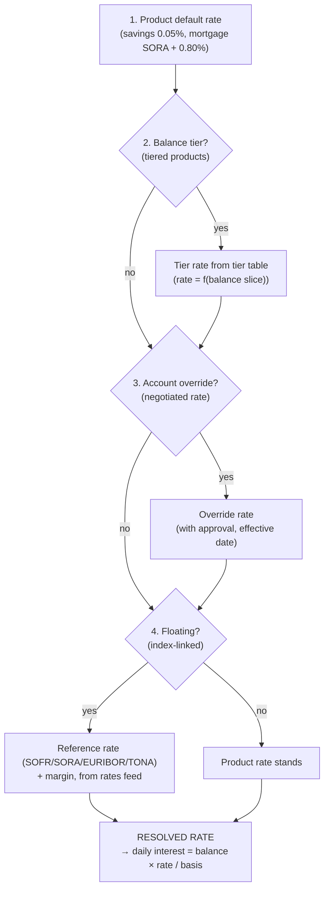
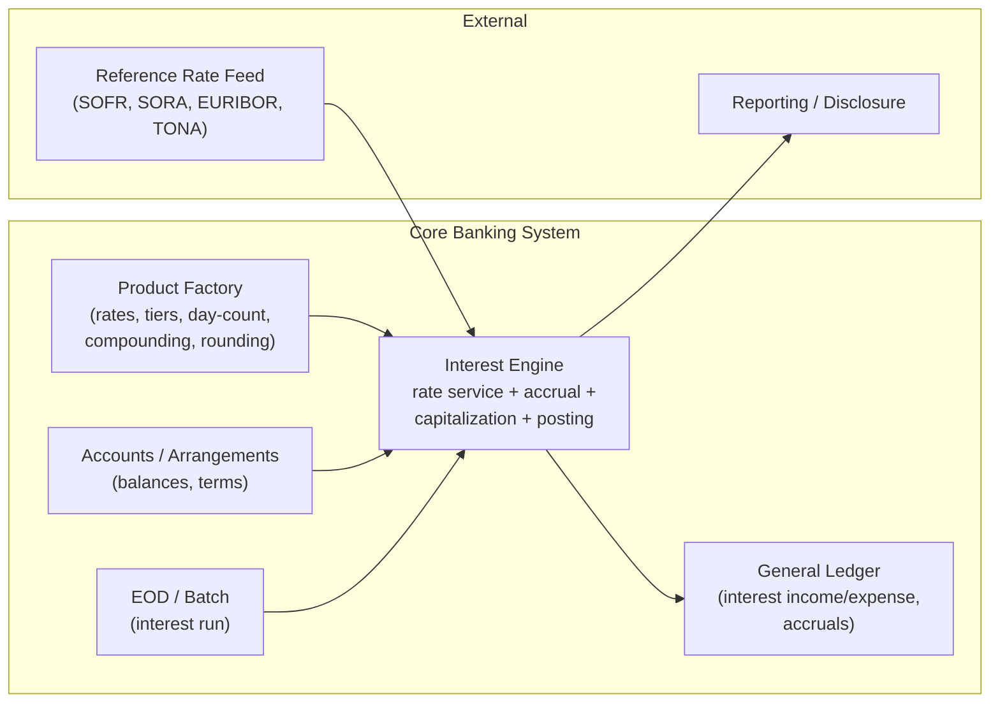
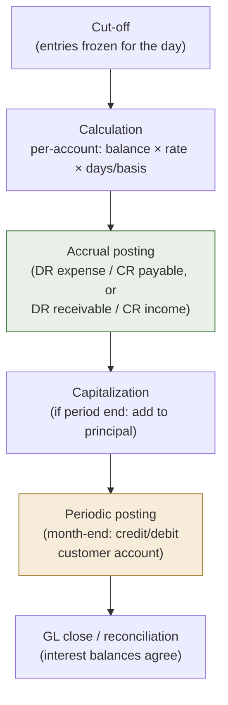

# Interest Engines in Core Banking Systems: A Comprehensive Guide

> **Author:** Jack Liu Shurui — Solution Architect at Cymbal Bank, Singapore
> **Context:** Core Banking / Banking Architecture — the machinery that calculates, accrues, capitalizes, and posts interest on deposits and loans: the interest theory (time value of money, day-count conventions, simple vs compound), the engine architecture (rate service, accrual, capitalization, posting, billing), the product configuration (rates, tiers, rounding), the deposit and loan interest mechanics, the interest accounting (accrual vs cash, EIR/IFRS 9, non-accrual), the vendor implementations (Temenos, FLEXCUBE, Mambu, Thought Machine Vault, Finastra/TCS BaNCS), the architect's view (patterns, accuracy, performance, audit, build-vs-buy), worked examples with verified arithmetic, and the 2026+ trends
> **Repository:** [github.com/jackliusr/research](https://github.com/jackliusr/research)
> **Last Updated:** August 2026

---

## Table of Contents

1. [Interest Fundamentals](#1-interest-fundamentals)
2. [Interest Engine Architecture](#2-interest-engine-architecture)
3. [Interest Product Configuration](#3-interest-product-configuration)
4. [Deposit Interest Mechanics](#4-deposit-interest-mechanics)
5. [Loan Interest Mechanics](#5-loan-interest-mechanics)
6. [Accounting for Interest](#6-accounting-for-interest)
7. [Vendor Implementations](#7-vendor-implementations)
8. [Interest Engine Design: The Architect's View](#8-interest-engine-design-the-architects-view)
9. [Worked Examples](#9-worked-examples)
10. [The Future: 2026 and Beyond](#10-the-future-2026-and-beyond)
11. [Glossary](#11-glossary)
12. [References](#12-references)

---

## 1. Interest Fundamentals

Interest is the **compensation for the time value of money** — the price paid for the use of someone else's money over time. Every interest calculation in a core banking system reduces to the same primitive:

```
interest = principal × rate × time
```

where *principal* is the amount the interest is computed on, *rate* is the annual interest rate, and *time* is the fraction of a year the money is at work (driven by the **day-count convention**, Section 1.4). Everything else in this guide — accrual engines, capitalization, EIR accounting, vendor implementations — is an elaboration of this one formula, engineered to run correctly across millions of accounts.

### 1.1 Interest in Banking: The Margin Is the Business

For a bank, interest is not a side effect — it is the **core of the P&L**:

- **Deposit interest** — the bank *pays* interest to depositors for the use of their funds (the bank's cost of funds).
- **Loan interest** — the borrower *pays* interest to the bank for the use of its funds (the bank's yield on assets).
- **The margin** — the difference between what the bank earns on loans/securities and what it pays on deposits is the **net interest income (NII)**, the largest revenue line on most banks' income statements. NII = interest income − interest expense. The ratio of NII to average interest-earning assets is the **net interest margin (NIM)**.

The interest engine is therefore not an accounting afterthought but the **pricing and revenue machinery of the bank** — it is where the spread is realized, day by day, account by account. See the banking context in [core_banking_systems_guide.md](core_banking_systems_guide.md) (§2.1 the core's role) for where interest engines sit in the bank's system landscape.

### 1.2 Interest Rate Types

**Nominal vs effective.** The *nominal rate* is the stated annual rate (e.g., 2% p.a.). The *effective rate* is the rate actually earned/paid over a year once **compounding** is taken into account (Section 1.5) — for a 2% nominal rate compounded monthly, the effective annual rate is ≈2.0184%; compounded daily, ≈2.0201%. Banks must disclose both under consumer-protection rules (APR/APY, Section 1.3).

**Simple vs compound.** *Simple interest* is charged/paid only on the original principal. *Compound interest* adds periodically capitalized interest to the principal, so interest subsequently earns interest — the "interest-on-interest" effect (Section 1.5).

**Fixed vs floating (variable).** A *fixed rate* is locked for the term of the contract (term deposits, fixed-rate mortgages). A *floating/variable rate* reprices periodically against a **reference rate** plus a spread:

| Reference rate | Market | Notes |
|---|---|---|
| **SOFR** | USD | Secured Overnight Financing Rate — the dominant USD benchmark since LIBOR |
| **SORA** | SGD | Singapore Overnight Rate Average — volume-weighted average of unsecured overnight SGD interbank transactions; replaced SIBOR for SGD |
| **EURIBOR** | EUR | Euro Interbank Offered Rate — the euro-area unsecured term rate |
| **TONA / TONAR** | JPY | Tokyo Overnight Average Rate — Bank of Japan overnight average |

**The benchmark transition.** The 2021–2023 LIBOR sunset reshaped every interest engine: after **31 December 2021** the GBP, EUR, CHF and JPY LIBOR settings (and the 1-week/2-month USD settings) ceased; after **30 June 2023** the remaining USD LIBOR settings ceased and were no longer representative. Cores had to support **fallback rate provisions**, re-paper floating-rate contracts, and re-map rate indexes (SOFR for USD, SORA for SGD) — see the benchmark/rate context in [full_stack_banking_guide.md](full_stack_banking_guide.md) and [financial_infrastructure_guide.md](financial_infrastructure_guide.md). A modern interest engine treats the *rate index* as configuration, never hard-coded, precisely so the next benchmark transition is a data change, not a code change.

### 1.3 Annual Rate Conventions: APR, APY, EIR

Three near-synonyms that mean different things and are frequently confused:

- **APR — Annual Percentage Rate.** The annualized cost of borrowing including fees, *without* compounding (US truth-in-lending disclosure, Section 8.4). For a loan with no fees and annual compounding, APR ≈ nominal rate.
- **APY — Annual Percentage Yield.** The annualized *effective* return on deposits *including* compounding — this is what a savings account "2.02% APY" means (2% nominal, daily compounding). APY is always ≥ the nominal rate.
- **EIR — Effective Interest Rate.** The accounting/IFRS concept: the rate that exactly discounts estimated future cash payments/receipts over the expected life of the instrument to the net carrying amount (Section 6.3). Under IFRS 9 the EIR (not the nominal rate) drives interest income recognition — see [financial_risk_compliance_systems_guide.md](financial_risk_compliance_systems_guide.md) for the IFRS 9/EIR treatment in detail.

### 1.4 Day-Count Conventions

The *time* dimension of `interest = principal × rate × time` is computed as **days ÷ basis**, where the numerator is the number of days in the period and the denominator is the year basis. The four conventions that dominate:

| Convention | Numerator (days in period) | Denominator (year basis) | Typical use |
|---|---|---|---|
| **ACT/365 (Actual/365)** | actual calendar days | 365 | UK convention; retail savings, term deposits |
| **ACT/360 (Actual/360)** | actual calendar days | 360 | Money-market convention; interbank, loans, credit cards |
| **30/360** | days assuming 30-day months | 360 | US corporate bonds and some US retail loans |
| **ACT/ACT (Actual/Actual, ISDA)** | actual calendar days | actual days in the year (365 or 366) | ISDA derivatives, government bonds |

The choice is material: S$10,000 at 2% p.a. for 30 days earns **S$16.67 under ACT/360** but **S$16.44 under ACT/365** (Section 9.2) — the 360-day basis pays ~1.4% more interest for the same stated rate. Regulators in several jurisdictions (notably the EU and parts of Asia) mandate a specific convention for consumer credit so that the advertised rate is comparable. The day-count convention is a **product parameter** in the interest engine (Section 3.2), never an assumption buried in code.

### 1.5 The Interest Calculation: Simple and Compound

**Simple interest** — no compounding, the straight calculation:

```
interest = principal × rate × (days / basis)
```

S$10,000 at 2% p.a. for 365 days (ACT/365) → 10,000 × 0.02 × (365/365) = **S$200**.

**Compound interest** — interest is added to the principal at a **compounding frequency** (daily, monthly, quarterly, annually), after which interest accrues on the enlarged balance:

```
A = P × (1 + r/n)^(n × t)
```

where *A* is the future value, *P* the principal, *r* the nominal annual rate, *n* the compounding periods per year, *t* the number of years. S$10,000 at 2% p.a. compounded monthly for one year → 10,000 × (1 + 0.02/12)^12 = **S$10,201.84** (vs S$10,200 simple). Note that banking engines rarely apply the closed-form formula directly — they accrue daily and **capitalize** on schedule (Section 2.3), which is the discrete-event equivalent that keeps the GL in balance and produces exact audit trails.

```
The arithmetic is verified in Section 9 with full working tables.
```

### 1.6 The Rate Resolution Flow

Every interest computation begins with one question: *what rate applies to this account, today?* The answer comes from a **rate resolution chain** that the engine evaluates in fixed precedence order — the same pattern in every vendor core, parameter-driven or contract-driven:



The chain's properties matter as much as its steps:

- **Precedence is deterministic and documented** — an account override always beats a tier, a tier always beats the product default; the *reverse* is a common configuration error that silently mispays millions.
- **Every hop is dated** — each rate carries an effective date, so any historical day resolves to the rate that *was* in force then (the foundation of audit/recompute, Section 8.3).
- **Approvals are recorded** — overrides and product rate changes are maker-checker transactions in the product factory (see [core_banking_processes_guide.md](core_banking_processes_guide.md) §8 for the product lifecycle governance).
- **The resolved rate, not the configuration, is what the audit trail stores** — the accrual record must capture the *resolved* rate used, so the computation is reproducible without re-running resolution.

---

## 2. Interest Engine Architecture

### 2.1 The Interest Engine: The Core's Heart

The **interest engine** is the core banking module that computes interest — the calculation/accrual/posting machinery behind every deposit and loan product. It is a *core function*: not a satellite system but one of the five canonical pillars of the core (customer, account, product, transactions, and interest/charges — see [core_banking_systems_guide.md](core_banking_systems_guide.md) §7.8 for the balance/interest component map). Placement in the core's architecture:



In *traditional cores* the engine runs inside the EOD batch; in *modern cores* (Thought Machine Vault, Mambu, cloud cores) the same functions run event-driven and near-real-time (Section 8.1). The EOD pipeline context — where the interest run sits between cut-off and GL close — is in [core_banking_processes_guide.md](core_banking_processes_guide.md) §7.

### 2.2 Engine Components

The interest engine decomposes into five components:

**1. Rate service.** The rate lookup layer that answers "what rate applies to this account today?":

- *Product rate* — the base rate configured on the product (e.g., savings 0.05%, mortgage 3-month-SORA + 0.80%).
- *Tiered rates* — rate varies by balance tier (Section 3.2).
- *Reference rate feed* — the daily benchmark (SOFR/SORA/EURIBOR/TONA) ingested from the market-data feed, with **effective dates** and **fallback values** for benchmark discontinuation.
- *Rate overrides and history* — per-account negotiated rates, and the historical rate table so that any past day can be recomputed exactly (Section 3.3). The rate service is a classic *strategy* component: rate resolution = product default → tier → account override, in that precedence order.

**2. Accrual engine.** The daily accrual — the engine's most frequent computation:

```
daily interest = balance × applicable rate / basis
```

For each account each day (or on every balance-changing event, in real-time engines), the engine computes the day's interest and books an **accrual entry**: for a deposit, *DR interest expense / CR accrued interest payable*; for a loan, *DR accrued interest receivable / CR interest income*. The accrual is *not* cash — it is the accounting recognition of interest earned/owed but not yet paid (Section 6.1). Accrual runs are idempotent by design: re-running a day must produce the identical accrual or the reconciliation breaks.

**3. Capitalization engine.** The compounding step: on the configured capitalization frequency, the engine adds accrued interest to the principal balance (the deposit's balance grows; the loan's outstanding grows if unpaid), and re-bases future accruals on the enlarged principal. Capitalization is what turns nominal rates into APY (Section 1.5). For loans, capitalization of unpaid interest is usually a *distressed* event (interest-on-interest on arrears) and often needs approval; for deposits it is routine (monthly compounding).

**4. Posting engine.** The periodic interest posting that moves accrued interest into the customer's balance: monthly posting of savings interest (credit the deposit account), debit of loan interest to the loan (or to the servicing account), often on the anniversary of the account or a product fixed day. Posting reverses the accrual balances and realizes the cash movement; the net effect on the GL is nil beyond the reversal mechanics (Section 6.2).

**5. Billing engine (loans).** The loan-specific component that turns the outstanding balance into a **repayment demand**: the EMI (equated monthly installment) or the interest-only/bullet schedule (Section 5.1), the amortization split between principal and interest, the penalty/arrears interest, and the generation of the billing statement. In deposit-only cores the billing engine is absent; in lending cores it is the customer-facing output of the interest machinery.

### 2.3 The Interest Run

The **interest run** is the orchestrated execution of the engine over the account population — classically inside EOD:



The sequence: (1) **EOD cut-off** freezes the day's entries; (2) **calculation** runs per account — for savings, the day's closing balance (or the day's activity in average-daily-balance engines, Section 3.4) times the resolved rate; (3) **accrual** books the day's interest to the accrual accounts; (4) **capitalization** runs when the compounding date arrives; (5) **posting** runs on the posting frequency (typically monthly) to credit/debit customer accounts; (6) the **GL closes** and the accrual balances must reconcile to the sub-ledger. The interest run is a *stage in the EOD pipeline*, not a separate job: see [core_banking_processes_guide.md](core_banking_processes_guide.md) §7 (the EOD process) for where it sits relative to cut-off, fees, revaluation, and statement generation.

**Interest run vs EOD.** In batch cores the interest run *is part of* EOD — its timing, parallelism, and failure handling are governed by the EOD scheduler. In real-time cores the "run" dissolves into event-driven accrual: every posting triggers a partial-period accrual close-out and re-start, so the ledger always carries current accrued interest and there is no overnight interest step at all (the *interest-on-demand* model — accrued interest shown live on every balance enquiry, Section 2.4). The EOD still exists (statement generation, regulatory extracts) but no longer owns the interest arithmetic.

### 2.4 Engine Performance: Scale and Real-Time

**The interest run at scale.** A tier-1 bank runs **tens of millions of accounts**; a nightly interest run that spends even 10 ms per account takes 28 hours serially — impossible. Batch cores therefore partition the population (by branch, by product, by account-number ranges) and run the interest stage **in parallel** across the EOD grid, then reconcile the partitions back to control totals. The per-account cost is dominated by balance reads and posting writes; row-level locking and the jBASE/FLEXCUBE-style file structures (see [temenos_data_model_guide.md](temenos_data_model_guide.md) and [oracle_flexcube_data_model_guide.md](oracle_flexcube_data_model_guide.md)) are chosen accordingly. Idempotency and *checkpointing* (a failed partition restarts, not the whole run) are non-negotiable.

**Real-time interest.** Modern cores accrue on every balance-changing event rather than once a night: the accrued-interest balance is updated transactionally with the posting, so the customer's "interest earned so far" is live. This is the *interest-on-demand* model — real-time balances, real-time accrual, and no overnight surprise. The cost is that every transaction now carries accrual arithmetic and locking on the accrual balance; engines mitigate with deferred accumulation (an in-memory per-account accumulator flushed at day end) or by accruing from the last-checkpoint date. Thought Machine Vault and Mambu both follow the event-driven pattern (Section 7).

### 2.5 Failure Handling, Restart, and Reconciliation

The interest run is the *most failure-sensitive* batch in the core: it touches every account and books to the GL, so a mid-run failure must not leave the books half-updated. The operational discipline:

- **Checkpointing.** The run is partitioned (branch/product/account-range) and each partition commits atomically; a failed partition restarts from its checkpoint, never the whole population.
- **Idempotency.** Re-running a partition over the same value date must produce the identical accrual — the engine keys accruals by (account, value date, accrual period) and treats a re-run as an overwrite-with-same-value, not a duplicate posting.
- **Control totals.** Before the run, control records capture per-partition expected counts and balance sums; after the run, per-partition accrual sums must reconcile to the GL postings. A mismatch holds the EOD open (or raises a red-flag exception) rather than silently closing a wrong day.
- **Cut-off coordination.** The run must see a *frozen* entry set: transactions posted after cut-off belong to the next value date and must not disturb the current day's accrual (see the EOD cut-off mechanics in [core_banking_processes_guide.md](core_banking_processes_guide.md) §7.2).
- **Restart windows.** With parallel partitions and checkpointing, the interest stage's recovery target is minutes, not hours — the EOD SLA (typically a 4–6 hour overnight window) is what makes interest-run performance a first-class architectural requirement, not an optimization.

---

## 3. Interest Product Configuration

### 3.1 Interest Products: The Product Design

The interest engine is product-parameterized: every product carries an *interest definition* that the engine executes. The canonical interest product families:

| Product | Interest model | Key parameters |
|---|---|---|
| **Savings account** | Daily-balance interest, accrued daily, posted monthly | Rate, day-count, compounding, posting day |
| **Current account** | Tiered interest (sometimes none, or interest only above a threshold) | Tier table, minimum-balance threshold |
| **Fixed deposit / term deposit** | Rate locked at placement; interest at maturity (or periodic payout) | Term, rate, maturity interest, auto-renewal, early-withdrawal penalty |
| **Amortizing loan** | Reducing-balance interest on outstanding; EMI repayment | Rate, term, EMI formula, amortization |
| **Credit card** | Revolving: daily interest on unpaid balance, interest-free period | Grace period, daily compounding, minimum payment |
| **Overdraft** | Daily-charged interest on the drawn balance | Rate, limit, daily charge, commitment fee |

The product definition is assembled in the **product factory** — the core's product catalog (see [core_banking_systems_guide.md](core_banking_systems_guide.md) §7.9 for the product factory; [data_models_banking_insurance_guide.md](data_models_banking_insurance_guide.md) for the PRODUCT/AGREEMENT data model). Interest is a *product parameter*, not code: changing a rate, a tier, or a day-count is a product-maintenance transaction, and the engine merely executes the definition.

### 3.2 Rate Parameters

**Base rate and margin.** The simplest rate structure: rate = base rate + margin. For floating products the base is the reference rate (SORA + 0.80%); for fixed products the base is a locked rate. The margin is the bank's spread and is where pricing decisions land.

**Tiered rates.** The rate depends on the balance tier — the classic "savings ladder":

| Tier | Rate |
|---|---|
| S$0 – 5,000 | 1.00% p.a. |
| S$5,000 – 20,000 | 2.00% p.a. |
| S$20,000+ | 3.00% p.a. |

Two tiering semantics exist and must be configured explicitly:

- **Tiered (progressive):** each *slice* of balance earns its tier's rate — on S$25,000: 5,000×1% + 15,000×2% + 5,000×3% = S$500 p.a. (the tier *table* defines a piecewise-linear function).
- **Step-up (all-or-nothing, "tier rate"):** the *whole* balance earns the rate of the highest tier reached — on S$25,000: 25,000×3% = S$750 p.a.

**Stepped rates (promotional).** Time-based rate steps — "1% for months 1–3, then 0.3%" — used for promotional/high-yield products (Section 4.4). These are rate *schedules* keyed by elapsed term, a distinct construct from balance tiers.

**Rate change handling.** Rates change (central-bank moves, product repricing). The engine must keep **historical rates with effective dates** so that (a) accrual on any past date recomputes exactly (audit, Section 8.3), and (b) rate changes mid-period are applied pro-rata — the standard practice is to re-rate *prospectively* from the effective date, not retroactively, and to notify customers per disclosure rules (Section 8.4). The rate table (rate, effective date, source, approval) is the engine's configuration backbone; floating rates additionally carry the reference-rate *index* and the spread.

### 3.3 Interest Parameters

**Accrual basis (day-count).** ACT/365, ACT/360, 30/360, ACT/ACT per Section 1.4 — a product parameter.

**Compounding frequency.** None (simple), daily, monthly, quarterly, at maturity. Deposit products compound; most consumer loans do not compound (unpaid interest becomes arrears, not capitalized principal, except in defined distressed cases).

**Posting frequency.** When accrued interest hits the customer balance: monthly for savings, at maturity for term deposits, per-billing-cycle for cards and loans. Posting frequency and compounding frequency are independent (e.g., daily accrual + monthly compounding + monthly posting are the common savings configuration).

**Rounding.** Every money amount eventually needs a currency precision (2 decimals for SGD/USD). The engine must decide *where* to round (Section 8.2):

- **Rounding method:** round-half-up (the norm), round-half-even (banker's rounding, used in some European contexts), truncation/floor (rarely customer-friendly, used in some fee contexts), ceiling.
- **Round at accrual vs at posting:** daily accrual may carry 6+ decimals internally and round only at posting (common), or round daily (then the 30-day sum differs from the unrounded 30-day sum — see the S$16.43/16.44 example in Section 9.5).

**Minimum/maximum interest.** Product-level guards: a minimum interest payout (e.g., "no interest below S$1 balance"), a maximum (interest-rate caps, see usury in Section 8.4), and the minimum balance below which no interest accrues.

### 3.4 "Interest on Balances": Balance Types

The engine needs a precise definition of *which balance* earns interest. The standard methods:

| Balance method | Definition | Typical use |
|---|---|---|
| **Average Daily Balance (ADB)** | Sum of daily closing balances ÷ days in the period | Savings accounts (the dominant method) |
| **Minimum daily balance** | The lowest balance during the period | Classic "minimum balance" savings products |
| **End-of-day balance** | The closing balance on each day (accrual on the daily closing balance) | Most modern accrual engines |
| **Tiered-by-balance** | Rate tier resolved from the balance method above (or from the *highest* balance during the period, a stricter variant) | Tiered savings products |

The ADB method is worth spelling out: an account with S$10,000 for 15 days and S$5,000 for 15 days in a 30-day month has ADB = (10,000×15 + 5,000×15)/30 = S$7,500, and earns interest on S$7,500 for 30 days — identical arithmetic to accruing daily on each day's closing balance. Cores that accrue *daily on the closing balance* and cores that compute *ADB at period end* produce the same result when balances change only at EOD; they diverge when intraday activity is included (real-time engines accrue on the end-of-day position of each accrual event). The balance type is a product parameter, and the same product can define *which* balance component earns interest — the FLEXCUBE balance-component ladder (cleared vs available vs ledger) is the canonical example (Section 7.2).

### 3.5 A Worked Product Configuration

What "interest as a product parameter" looks like concretely — the product definition a product owner would maintain in the product factory for a tiered savings product:

| Parameter | Value |
|---|---|
| Product | SGD Savings — Tiered (e.g., "Everyday Saver") |
| Balance method | Average Daily Balance (ADB) |
| Day-count | ACT/365 |
| Tier table | S$0–5,000: 1.00%; S$5,000–20,000: 2.00%; S$20,000+: 3.00% (progressive) |
| Compounding | Monthly (capitalization at month-end) |
| Posting frequency | Monthly, first business day after month-end |
| Rounding | Round-half-up; accrue unrounded, round at posting; 2 dp |
| Minimum interest | None below S$100 average balance |
| Rate change | Product rate changes effective prospectively; 30-day customer notice |
| GL mapping | Interest expense → branch GL; accrual → accrued interest payable |
| Tax | WHT by customer tax status (Section 6.5) |

The same template with different values produces every other product in Section 3.1 — change "ADB" to "closing balance", the tiers to a single rate, and compounding to "none" and it is a plain savings account; replace the tier table with a *rate schedule* keyed by elapsed term and it is a promotional high-yield product. This is the *product factory* pattern ([core_banking_systems_guide.md](core_banking_systems_guide.md) §7.9): the engine is product-agnostic and the product definition is data. The discipline that makes it safe is **parameter validation** — the factory must reject nonsense combinations (negative compounding frequency, a 30/360 basis on a loan with ACT/365 disclosure, a tier table with overlapping bands) at definition time, not at interest-run time.

---

## 4. Deposit Interest Mechanics

### 4.1 Savings Interest

The canonical retail deposit flow: **daily accrual on the daily closing balance (or ADB), monthly posting.**

- Daily accrual: S$10,000 at 2% p.a. ACT/365 → S$0.548/day (Section 9.1).
- The accrual accumulates in the accrued-interest payable balance; nothing moves in the customer balance until posting day.
- Monthly posting (30-day month): credit the customer account S$16.44, reverse the accrual (Section 6.2).
- Compounding (if configured): at month-end the posted interest is included in the principal for the next month's accrual — S$10,016.44 becomes the accrual base (Section 9.3).

Savings products vary by balance method (ADB vs closing balance), tiering (Section 3.2), and whether interest is paid on the *minimum* balance (older products) — all product parameters.

### 4.2 Fixed Deposit (Term Deposit) Interest

A term deposit locks principal and rate for a term; interest is computed **at maturity** (or periodically, for interest-paying deposits):

```
maturity interest = principal × rate × (term days / basis)
```

S$50,000 at 3.2% p.a., 6-month term, ACT/365: 50,000 × 0.032 × (182/365) ≈ **S$797.81**.

The product mechanics the engine must support:

- **Early withdrawal:** a penalty — typically the rate is *reduced* to the savings rate (or a fixed penalty), and the interest already accrued/paid is recomputed and clawed back. The engine recomputes from placement using the penalty rate and reverses the difference.
- **Reinvestment / auto-renewal:** at maturity the deposit rolls over at the *then-current* rate for the same term (auto-renewal), or principal + interest move to a linked savings account (default maturity instruction). Renewal at a new rate is a rate-history event, not a new product.
- **Partial withdrawal / breakage:** in many markets, breaking a fixed rate early triggers *breakage cost* — the bank's funding-cost loss — on top of the rate reduction.

### 4.3 Current Accounts and Compounding

**Current accounts** pay tiered interest (or none, or interest only above a threshold) and are the treasury-sweep home for corporate customers; the engine is identical to savings with different parameters (often ACT/365, often no compounding, sometimes *negative* interest on large corporate balances — a post-2015 phenomenon the engine must support as a rate-sign configuration).

**Deposit compounding and the APY.** Daily or monthly compounding converts the nominal rate into an effective yield: 2% nominal compounded monthly = 2.0184% APY; compounded daily = 2.0201% APY (Section 9.3). The engine's capitalization step realizes this; disclosure rules require the APY (not just the nominal) on deposit marketing (US Reg DD / TISA; MAS guidelines in Singapore).

### 4.4 High-Yield Savings

The **high-yield savings** product is a promotional tiered/stepped product — "3% p.a. for the first 6 months, then 0.4%", or "3% on balances up to S$100,000, 0.05% above" — designed to attract deposits (see the deposit-gathering context in [wealth_management_guide.md](wealth_management_guide.md)). Engine requirements: stepped rate schedules, tier caps, minimum-increment rules, and the *promotional expiry* logic that re-rates the account at the step boundary. The marketing APY and the engine's actual arithmetic must reconcile — a common source of customer complaints and regulator findings when they don't.

### 4.5 Maturity Interest Options and Statement Presentation

At maturity, a term deposit's interest can be *disposed of* in several ways — a product parameter the engine executes at maturity:

| Maturity option | Engine behavior |
|---|---|
| **Pay to linked account** | Interest credited to the savings/current account; principal auto-renewed or repaid per instruction |
| **Compound / roll over principal + interest** | Interest added to principal; the whole amount renews at the then-current rate for the same term |
| **Renew principal, pay interest** | Principal renews; interest is paid out (the classic "interest payout" FD) |
| **Repay both** | Principal + interest returned; the arrangement closes |

Each option changes the *posting* but not the *calculation* — the maturity interest is computed identically (Section 4.2), and the option determines where the proceeds land. The engine must also produce the **statement presentation**: gross interest, WHT deducted, net credited — a line-item structure mandated in most jurisdictions, and the single most common customer-service dispute (the customer sees *net* and believes the rate was lower). The statement line is driven by the same posting records as the GL, so statement, GL, and tax return always agree.

---

## 5. Loan Interest Mechanics

### 5.1 Loan Products and Repayment Structures

| Loan product | Interest model | Repayment |
|---|---|---|
| **Amortizing loan** | Reducing balance; interest on outstanding principal | **EMI** — equal monthly installments of principal + interest |
| **Interest-only** | Interest on the full principal for the IO period | Interest-only payments, then amortization (or **bullet** principal at maturity) |
| **Balloon** | Amortizing with a large final payment | Small EMIs + balloon principal at term end |
| **Revolving credit** | Daily interest on the outstanding drawn balance | Minimum payment; no fixed schedule |
| **Overdraft** | Daily interest on the drawn (negative) balance | Continuous; cleared by credits |

**The EMI formula.** For an amortizing loan the equated monthly installment is:

```
EMI = P × r × (1+r)^n / ((1+r)^n − 1)
```

where P = principal, r = monthly rate (annual ÷ 12), n = number of months. S$100,000 at 5% p.a. for 20 years (240 months, r = 0.05/12): **EMI = S$659.96 ≈ S$660/month** (Section 9.4). Each EMI splits into an interest component (S$416.67 in month 1 — the outstanding × monthly rate) and a principal component (S$243.29 in month 1); the interest portion declines as the outstanding shrinks — the **amortization schedule** is the full table of these splits, the 'mortgage-style' repayment, and the engine must reproduce it exactly so that the loan's outstanding at any date agrees with the accounting records (see the loan lifecycle in [core_banking_processes_guide.md](core_banking_processes_guide.md) §5).

### 5.2 Loan Interest Methods

**Reducing balance (daily reducing).** Interest is computed daily on the *current outstanding balance* — the dominant method worldwide: daily interest = outstanding × rate / basis. After each payment the outstanding drops, so interest declines. This is the method behind the EMI above.

**Flat rate.** Interest is computed on the **original principal for the full term**, then divided into installments: a 5% flat rate on S$100,000 for 5 years = S$25,000 total interest regardless of repayments. Flat-rate products are simpler to market ("5% p.a.") but the *effective* rate is far higher — a 5% flat rate over 5 years is equivalent to roughly a **9.2% reducing-balance rate** (the borrower has, on average, only ~half the principal outstanding). The comparison is a regulatory disclosure staple in consumer lending (Singapore's Moneylenders Act and MAS notices require effective-rate disclosure). The engine must support both and report the effective rate, not just the quoted one.

**Rule of 78 (sum-of-digits).** A precomputed-interest method: total interest over the term is precomputed and allocated to each month in proportion to the *remaining* months (digits). For a 12-month loan the digits sum to 78; month 1 gets 12/78 of the interest, month 12 gets 1/78. On **early settlement** the borrower is entitled to a rebate of unearned interest — settling a 12-month loan after 3 months leaves digits 9+8+…+1 = 45 of 78, so 45/78 ≈ 57.7% of the precomputed interest is refunded (Section 9.5). The rule over-allocates interest to early months (the borrower effectively pays more interest early), which is why many jurisdictions ban or restrict it for consumer loans.

### 5.3 Loan Calculations: Prepayment, Arrears, Restructuring

**Prepayment / early settlement.** When a loan is settled early, the borrower owes the outstanding principal plus accrued interest to date, *minus any unearned-interest rebate* (rule-of-78 rebate or, for reducing-balance loans, simply the fact that future interest was never accrued). The engine must recompute the payoff figure — the *settlement quote* — on demand, and produce the interest refund posting. Prepayment *penalties* (a % of the outstanding) are a separate product parameter.

**Arrears / overdue interest.** When a payment is late, the engine typically: (a) continues accruing contractual interest on the outstanding, (b) adds **penal/late-payment interest** at a penal rate on the overdue installment, and (c) moves the account to the arrears state (see the loan state machine in [core_banking_processes_guide.md](core_banking_processes_guide.md) §5.3). Penal interest accrues *on the overdue amount*, is usually not capitalized, and must be tracked separately from contractual interest for reporting. If the account becomes an **NPL** (non-performing loan, typically 90 days past due), interest accounting switches to non-accrual (Section 6.4).

**Restructuring.** A restructured loan (repayment holiday, extended term, rate change) is *not* a new loan in the engine: the outstanding is carried forward, the remaining term/rate are re-parameterized, and a **new amortization schedule** is computed from the current outstanding — the engine recomputes the EMI from the *reduced* principal, which is why restructuring visibly lowers installments. IFRS 9 modification accounting (whether the modification is a derecognition event or a continuation) governs the accounting treatment — see [financial_risk_compliance_systems_guide.md](financial_risk_compliance_systems_guide.md).

### 5.4 Credit Card Interest (Revolving Credit)

The revolving model: the cardholder can pay a **minimum payment** (typically 3–5% of the balance) and revolve the rest, incurring interest:

- **Interest-free period (grace period):** if the full statement balance is paid by the due date, no interest — typically up to ~50 days. The engine must track the *grace-period eligibility* per statement cycle: any carried balance, or any new purchase after the grace period expired, attracts interest.
- **Daily compounding:** interest accrues daily on the unpaid balance (ACT/360 or ACT/365 per the card's terms) and is *compounded* — the posted interest joins the balance and itself earns interest. S$1,000 at 24% p.a. daily-compounded for 30 days accrues ≈ S$19.92 (Section 9.5), vs S$19.73 simple.
- **Minimum payment:** the billing engine computes the minimum (max of a % of balance and a floor, plus fees and over-limit amounts); interest accrues on the remainder. Card engines also handle the *transaction-level* nuance: different APR categories (purchases, cash advances, balance transfers) accruing simultaneously on different sub-balances.

### 5.5 Repayment Allocation Order

When a borrower pays less than the full due amount, *how the payment is split* between the competing claims is defined by law or contract — and the engine must implement the order exactly:

| Allocation order | Rule | Typical mandate |
|---|---|---|
| **Interest-first** | Payment first clears accrued interest, then principal (then fees) | Common statutory default (consumer protection — "you can't grow principal while interest is unpaid") |
| **Fees-first** | Fees/charges clear first, then interest, then principal | Card agreements (fees first is common in card terms) |
| **Principal-first** | Payment reduces principal before interest | Rare; contract-specific (e.g., some mortgage prepayment terms) |
| **Oldest-first (waterfall)** | Payment clears the oldest arrears bucket (fees, then interest, then principal), then the current installment | Standard for arrears: payments cascade through the buckets in age order |

The *arrears waterfall* is the critical case: a loan with 3 missed installments has distinct buckets — penal interest, contractual interest, principal — and any partial payment must be allocated in the regulatory order, with the account's arrears state updated bucket by bucket (see the loan state machine in [core_banking_processes_guide.md](core_banking_processes_guide.md) §5.3). Mis-allocation is invisible to the customer until settlement, then it becomes a complaint and a remediation exercise — one of the most common interest-related defects found in core-migration parallel runs (Section 8.5).

---

## 6. Accounting for Interest

### 6.1 Accrual vs Cash Accounting

Interest must be **recognized when earned/owed, not when paid** — accrual accounting. The engine therefore maintains *two* parallel truths: the **accrued** interest (earned/owed to date) and the **posted/cash** interest (actually paid or billed). The difference sits in the balance sheet as accrued-interest assets/liabilities.

The daily accrual journal (deposit side):

```
DR  Interest expense (GL)          S$0.548
    CR  Accrued interest payable (GL)    S$0.548
```

The daily accrual journal (loan side):

```
DR  Accrued interest receivable (GL)    S$416.67/day equivalent
    CR  Interest income (GL)                  S$416.67/day equivalent
```

The GL accounts involved — interest income, interest expense, accrued interest receivable, accrued interest payable — and their place in the chart of accounts are covered in [data_models_banking_insurance_guide.md](data_models_banking_insurance_guide.md) (the accounting/GL model). The accrual entries are *system-generated*, booked by the interest engine under the account's GL mapping (product → branch → GL), and they are what make the interest run visible to the general ledger on the same day it accrues.

### 6.2 The Posting Entries and Reversal

At posting (month-end for savings), the engine realizes the accrual:

```
DR  Accrued interest payable          S$16.44
    CR  Customer deposit account           S$16.44
```

The customer's balance grows and the accrual liability is extinguished — a *reversal of the accrual* against the cash movement. For loans:

```
DR  Customer loan account (or servicing account)   S$659.96
    CR  Accrued interest receivable                      S$416.67 (month-1 interest)
    CR  Loan principal outstanding                       S$243.29
```

Note the loan posting *simultaneously* realizes interest income (clearing the receivable) and reduces the principal — the two are driven from the amortization schedule (Section 5.1). If the borrower pays into a separate servicing account, the engine posts the EMI demand and matches the receipt against interest-then-principal (the common allocation order).

### 6.3 EIR Accounting (IFRS 9)

Under IFRS 9, interest income on financial assets at amortized cost is recognized using the **effective interest rate (EIR)** — the rate that exactly discounts the *estimated future cash flows* over the expected life to the net carrying amount. Key consequences for the interest engine:

- The **EIR ≠ nominal rate** whenever fees, points, premiums/discounts, or expected prepayments exist. A loan with a 1% origination fee and a 5% coupon has an EIR above 5%; the difference is *accreted into interest income* over the life, not taken upfront.
- The engine (or a finance-adjacent module) must therefore maintain *two* interest views: the **contractual/nominal** interest (what the customer is billed) and the **EIR** interest (what the bank recognizes in the P&L). The difference is booked through an adjustment (the "EIR uplift" or day-one P&L adjustment).
- **Expected credit losses (ECL)** under IFRS 9 further adjust the carrying value (Stage 1/2/3); interest on Stage 3 (credit-impaired) assets is recognized on the *net* carrying amount (EIR × amortized cost net of loss allowance). Full treatment: [financial_risk_compliance_systems_guide.md](financial_risk_compliance_systems_guide.md) (IFRS 9 ECL chapter). The interest engine feeds the ECL engine its cash-flow schedules and receives back the staging that determines the interest basis.

### 6.4 Non-Performing Loans: Non-Accrual

When a loan is classified as non-performing (typically **90 days past due**, or earlier if doubt exists), regulatory practice (and often local rules — MAS Notice 612 in Singapore, US interagency guidance) requires **non-accrual**: the bank *stops recognizing interest income* on the loan. The engine must:

- **Stop accruing** interest income on the NPL (the accrued-but-unpaid interest is reversed out of income, typically against a reserve or written off);
- Continue tracking the *contractual* interest for collection/reporting purposes (the "uncollected interest" memo), often as a memorandum balance;
- Resume accrual only on **return to performing** status (full contractual payments resume, or the loan is restructured into a performing instrument).

The non-accrual switch is a *state transition* on the loan (see the loan state machine in [core_banking_processes_guide.md](core_banking_processes_guide.md) §5.3) — the interest engine must react to it deterministically, because mis-recognizing interest on NPLs is one of the most common regulatory findings in bank examinations.

### 6.5 Interest Tax: Withholding Tax

Interest paid to depositors is subject to **withholding tax (WHT)** in many jurisdictions — in Singapore, banks withhold 15% on interest paid to non-resident individuals (and effectively 0% for resident individuals under current rules). The engine's posting step must:

- Compute the gross interest, the WHT at the depositor's tax status, and the net credit;
- Book the WHT to a **tax payable GL** and report it (MAS/IRAS returns);
- Handle treaty rates (reduced WHT for treaty jurisdictions) and exemption codes.

The tax configuration is a product/parameter dimension (tax status of the account holder, treaty indicator, exemption flag), and the net-vs-gross presentation on the statement is a disclosure requirement. For corporate deposits the treatment differs (no WHT on interbank/corporate interest in most hubs); the engine keys off the customer type.

### 6.6 Interest GL Reconciliation

Because interest accrues daily but moves cash monthly, the GL carries a growing *accrual* position that must be reconciled continuously:

- **Accrual balance vs sub-ledger.** The GL "accrued interest payable/receivable" balance must equal the sum of all accounts' accrued-interest balances (the sub-ledger). The daily control totals of the interest run (Section 2.5) are exactly this reconciliation, produced at EOD.
- **Income vs accrual vs cash.** Three views must tie: the P&L interest income/expense (accrual basis, possibly EIR-adjusted — Section 6.3), the balance-sheet accrual accounts, and the cash actually paid/billed. The monthly posting clears accrual to cash; any residual is the rounding reserve or an un-reconciled break.
- **The rounding reserve.** The difference between "sum of per-account rounded postings" and "unrounded GL accrual" accumulates in a designated GL account (Section 8.2) and is *expected and bounded* — a growing reserve is a sign of a rounding-policy defect, not a mystery.
- **Regulatory returns.** Interest income/expense feeds regulatory P&L returns (MAS Form 10x-style submissions, US FFIEC income statements); the return figures must trace to the same postings the statements show. The GL design for interest accounts (income, expense, receivable, payable, tax) is documented in [data_models_banking_insurance_guide.md](data_models_banking_insurance_guide.md).

---

## 7. Vendor Implementations

### 7.1 Temenos: The AA Interest Properties

Temenos Transact (T24) models interest through the **Arrangement Architecture (AA)** — every product (deposit, loan, current account) is an *arrangement* whose behavior is assembled from **property classes**. The interest machinery is three coordinated property classes:

- **INTEREST property class** — the rate definition: fixed, floating, or periodic interest rates; the interest *basis* (day-count), the tier structure ("tiered interest"), negative-rate handling (tier negative rates, floor margin); the rate can be linked to a *rate index* for floating products.
- **ACCR (Accrual) property class** — the accrual definition: how interest accrues (daily), the accrual GL accounts, whether accrual is *retrospective* (on balances) or *prospective* (on scheduled cash flows, the standard for loans), and the accrual frequency.
- **Capitalisation property class** — the compounding definition: when accrued interest is capitalized into the arrangement balance (none/daily/monthly/quarterly/at maturity).

The engine executes these per-arrangement at EOD: AA.INTEREST.ACCRUALS is the application that materializes the day's accrual postings, and the capitalization/posting dates come from the arrangement's schedule. The AA property/arrangement data model — AA.PRODUCT, AA.ARRANGEMENT, AA.PROPERTY, AA.ARRANGEMENT.ACTIVITY — is documented in [temenos_data_model_guide.md](temenos_data_model_guide.md) §3 (the INTEREST/ACCR properties are the property classes *on* the arrangement; the legacy `ACCOUNT.INTEREST`-style interest applications still exist in the classic CASA modules but AA is the model for new products). Temenos' strength is the *property-based configurability*: a new interest product is parameter assembly, not development — at the cost of a steep configuration learning curve and the jBASE/MultiValue platform underneath.

### 7.2 Oracle FLEXCUBE: Interest Classes and the IC Module

FLEXCUBE centralizes interest in the **Interest and Charges (IC) module**. The configuration hierarchy:

- **Interest class (IC)** — the reusable interest *definition* attached to products: rate type (fixed/floating), the **interest rate code(s)** referenced, the currency, min/max rate limits on the class (including negative-interest variants — the negative class code is derived as `<main class code>_N`), the *event* on which interest applies (e.g., maturity for term deposits, periodic for loans), and flat-rate/unit-rate flags.
- **Interest rate codes (IRC)** — the rate *curves*: the actual rate values (with effective dates) or the floating index + margin; the product references a class, the class references the rate codes.
- **Interest rules and products** — for time deposits and balance-type accounts, interest is computed per the **interest rules** associated with the deposit's interest product.

The IC engine computes interest **on balance components** — FLEXCUBE's balance-component ladder (ledger, available, cleared, uncleared, lien, hold — see [oracle_flexcube_data_model_guide.md](oracle_flexcube_data_model_guide.md) §4.5). A product defines *which component earns interest* — the classic distinction between interest on the **cleared balance** (funds available, the norm for current accounts) vs the **available balance** (cleared minus holds) vs the ledger balance. Interest accrues in the IC module's accrual tables and posts per the product's schedule into the GL via the accounting engine. FLEXCUBE's strength is depth: a very complete interest-rule engine for complex corporate products (multi-component interest, floor/ceiling, rate-code ladders) — with the corresponding configuration complexity.

### 7.3 Mambu: Interest as Product Settings

Mambu is a cloud-native, API-first core where interest is a **product configuration** with accrual computed continuously:

- **Deposit products:** the product's interest settings define the rate (fixed or variable/index-linked), the accrual mechanics — *interest rate accrual terms* such as `ACTUAL_365_FIXED` (ACT/365) and `ACTUAL_360`, whether interest accrues *until maturity* or is paid/credited per schedule, compounding frequency, and the **accrual posting** to the internal account. Mambu's EOD engine (or continuous accrual) computes interest on the account's daily balance.
- **Loan products:** interest is computed on the **principal balance** (reducing balance) with configurable methods, interest rate type (fixed or variable with index rate + spread), the repayment schedule (EMI-style amortization, or custom schedules), and *interest rate change thresholds* (how rate changes flow to existing loans); offset/redraw capabilities recompute interest on the reduced exposure.
- **Interest rate settings** include the *interest rate source* (fixed value vs index rate), *interest rate review* (rate change frequency), and the accrual basis; the API exposes interest rate changes and recalculation, enabling rate-change events without code changes.

Mambu's strength is *simplicity and API-ness*: interest is data-driven configuration with a clean REST surface, well suited to digital banks (see the digital-bank builds in [tonik_digital_bank_guide.md](tonik_digital_bank_guide.md) and [trust_bank_guide.md](trust_bank_guide.md)) — at the cost of less depth for exotic corporate interest structures.

### 7.4 Thought Machine Vault: Contract-Driven Interest

Thought Machine **Vault Core** inverts the configuration model: interest is *code* — written in **Vault smart contracts** (Python) that run in a sandbox, with the ledger kept separately. The interest lifecycle is explicit contract logic:

- **Accrue interest** — a scheduled hook (the *accrue interest schedule*, e.g., daily) computes the day's interest from the balance and the rate (fixed or index-linked via the rates service), and posts accrual entries to the contract's internal accounts.
- **Apply interest** — a *second* schedule (the *apply interest schedule*) that runs after accrual in the EOD group: it capitalizes/credits the accrued interest to the customer account. Vault's EOD *schedule groups* enforce the ordering — "if the accrue-interest schedule fails for an account that day, apply-interest does not run", keeping the invariant that posted interest always equals accrued interest.
- **Rate handling** — rates come from a rates service (flat values or market data), referenced by the contract; balance addresses (the "available" vs "total" balance, the equivalent of balance components) define what accrues interest.

Vault's strength is *determinism and testability*: contracts are unit-tested like software, interest logic is versioned and auditable, and the real-time ledger shows accrued interest live — see the Thought Machine coverage in [us_bank_core_systems_guide.md](us_bank_core_systems_guide.md). The trade-off: interest behavior is *written per product* (a library of standard contracts ships with Vault), so a bank owns more engineering than with parameter-driven cores.

### 7.5 Finastra and TCS BaNCS

**Finastra Fusion Essence** (the evolution of the classic Misys/Equation core) implements interest through its **accounting and product-definition layers**: products carry rate/interest definitions (rate codes, tiered rates, accrual methods) executed by the core's daily processing, with term deposits, CASA, and loans each having their interest schedules. Essence's interest capabilities are real but less documented publicly than its account/transaction APIs (the published API catalog covers account, term-deposit and loan onboarding rather than the internal interest engine) — **flag: Essence's internal interest-engine mechanics could not be verified against primary documentation in this research pass; treat the specifics as directional.**

**TCS BaNCS** covers interest across its universal-banking modules with a classic parameter-driven model: interest rate tables and product-level interest parameters (basis, frequency, tiering) executed in the EOD interest run, supporting CASA, term deposits, loans, and Islamic (profit-rate) variants. **Flag: BaNCS interest internals are similarly under-documented publicly; the module-level behavior described here reflects the standard BaNCS product framework rather than verified release documentation.**

### 7.6 Vendor Comparison

| Vendor | Engine/model | Accrual | Compounding | Posting | Configuration | Strengths |
|---|---|---|---|---|---|---|
| **Temenos Transact** | AA property classes (INTEREST, ACCR, Capitalisation) per arrangement | Daily, EOD (AA.INTEREST.ACCRUALS) | Via Capitalisation property (none/daily/monthly/quarterly/maturity) | Schedule-driven, EOD | Property assembly in product factory | Depth + config flexibility; fixed/floating/tiered/negative rates |
| **Oracle FLEXCUBE** | IC (Interest & Charges) module: interest classes + interest rate codes + rules | Daily on balance components | Per interest rule/product | Per event (maturity, periodic) | Class → product association | Richest balance-component and rule engine for corporate products |
| **Mambu** | Product interest settings, continuous/API-driven accrual | Daily on balance (ACTUAL_365/360) | Configurable (incl. at maturity) | Per schedule/API | Product settings via API | Simplicity, API-first, cloud-native |
| **Thought Machine Vault** | Smart contracts: accrue-interest + apply-interest schedules | Daily via contract hooks | Apply-interest schedule (EOD group) | Apply-interest schedule | Contract code (Python) | Determinism, testability, real-time ledger, versioned logic |
| **Finastra Essence** | Product-definition-driven interest in core processing | Daily (EOD) | Product parameter | Schedule-driven | Product factory | Proven retail/universal coverage (flag: internals under-documented) |
| **TCS BaNCS** | Parameter-driven interest modules across products | Daily (EOD) | Product parameter | Schedule-driven | Rate tables + product params | Broad multi-country/multi-product coverage (flag: internals under-documented) |

The pattern across vendors: **parameter-driven cores** (Temenos, FLEXCUBE, Mambu, Essence, BaNCS) make interest *configuration*; **contract-driven cores** (Vault) make interest *code*. Both must implement the same physics — rate resolution, day-count, accrual, capitalization, posting — the difference is where the complexity lives (product-maintenance screens vs a codebase and CI pipeline).

### 7.7 What to Verify in a Vendor Engine

The vendor comparison table answers "which engine family" — but the due-diligence question is *"does this engine implement the bank's interest contracts exactly?"* The verification checklist for any vendor interest engine:

1. **Rate resolution precedence** — confirm product → tier → override → index+margin precedence matches the bank's product definitions (Section 1.6), and that historical rate resolution is supported.
2. **Day-count correctness** — test ACT/365, ACT/360, 30/360, ACT/ACT with known-value cases, including year-end/leap-year boundaries (the 366-day year is the classic vendor defect).
3. **Balance basis** — which balance component earns interest (ledger vs cleared vs available), and whether the *chosen* basis is configurable per product (Section 3.4).
4. **Rounding policy** — where rounding happens (accrual vs posting), which methods are available, and whether the rounding reserve is visible and reconcilable (Section 8.2).
5. **Compounding and capitalization** — the exact capitalization event (EOD vs event-driven), its GL entries, and its interaction with the posting schedule.
6. **Tier semantics** — progressive vs step-up, and the tier table's effective-date handling (Section 3.2).
7. **Arrears and penal interest** — bucket separation, allocation order, and the non-accrual trigger (Sections 5.3, 6.4).
8. **Recompute/audit** — can the engine re-derive a historical period from rate + balance history and diff against booked values?
9. **Parallel-run behavior** — deterministic, idempotent output suitable for side-by-side reconciliation with the legacy engine (Section 8.5).

Every item on this list is testable with **golden test cases** (Section 8.5) — and the vendor's willingness to run them, in writing, is itself a selection criterion.

---

## 8. Interest Engine Design: The Architect's View

### 8.1 Design Patterns: Batch, Real-Time, Hybrid

| Pattern | Mechanics | When it fits |
|---|---|---|
| **Batch (EOD interest run)** | All interest computed once nightly over the whole population; accrued balances updated at EOD | Traditional cores; cheap, simple to reconcile; balances show no intraday interest |
| **Real-time (event-driven)** | Every posting closes and re-opens the accrual period; accrued interest always current | Modern cores (Vault, Mambu); digital-bank UX; interest-on-demand |
| **Hybrid** | Daily accrual computed on events/at EOD, but *displayed* live by extrapolating from the last accrual point | Most common retrofit: real-time *display* without real-time *posting* |

The hybrid is the pragmatic architecture for banks on batch cores that want "interest earned so far" in the app: the core accrues at EOD as before, and a display layer computes *accrued-to-now = accrued-at-last-EOD + balance × rate × days-since / basis* from the current balance. It is *approximate* (it ignores intraday balance changes) and must be labeled as such.

### 8.2 Accuracy: Precision and Rounding

**Precision.** Interest arithmetic must use **high-precision decimal** (banking decimal types — 28+ significant digits, never binary floating point): a 0.00000001 error on a daily accrual compounds into a material reconciliation break across millions of accounts over a year. Rates are stored to the basis point or finer; balances to the currency minor unit or finer.

**Where to round.** The classic design decision — round at *accrual* or at *posting*:

- **Accrue unrounded, round at posting:** daily accruals carry full precision (S$0.5479452…); the month-end sum (S$16.438356…) is rounded once to S$16.44. The GL accrual balances carry many decimals internally. This is the norm.
- **Round daily:** each day's accrual rounds to the cent (S$0.55); the 30-day sum is S$16.50 — **different from S$16.44**. Both are defensible *if* the product definition says so; the danger is *mixing*: accruing unrounded but capitalizing rounded values at different frequencies creates the **rounding drift** problem.

**Rounding drift.** When rounded values are compounded (interest-on-interest on rounded balances), tiny per-period errors accumulate over years — on a 20-year mortgage the drift can reach tens of dollars. Mitigations: (a) accrue internally at high precision and round only at customer-visible postings; (b) carry a "rounding reserve/clearing" GL account that absorbs the differences; (c) *recompute from first principles* on audit (Section 8.3). The rounding *method* (round-half-up vs half-even vs truncation) must be a product parameter — see the rounding table in Section 9.5.

### 8.3 Performance, Scalability, Audit

**Batch performance.** The nightly interest run over tens of millions of accounts is the core's heaviest batch: partition by product/branch/account-range, run partitions in **parallel** on the EOD grid, checkpoint per partition, and reconcile each partition's totals back to control totals (accounts processed, accrual sum per GL). The interest run's time-box is usually the constraint on the whole EOD window (see [core_banking_processes_guide.md](core_banking_processes_guide.md) §7 for the EOD pipeline and its SLAs). **Horizontal scaling** — splitting the account population across nodes — is the standard answer; the state (balances, accruals) must partition cleanly, which is why cores shard by account and why the accrual balance must live with the account.

**Auditability.** Interest is the single most-audited computation in a bank: the engine must support **recalculation** — a "recompute" mode that re-derives any historical period's interest from the *rate history + balance history* and compares to what was booked ("golden runs", Section 8.5). Requirements: immutable rate and balance history, idempotent accrual, and a full audit trail of every accrual/capitalization/posting with the exact inputs (rate, balance, day-count) used. Regulators and auditors will ask "show me the interest this account *should* have earned" — the engine must answer exactly.

### 8.4 Regulatory Constraints

- **Usury limits.** Interest rate caps: many jurisdictions cap consumer rates (e.g., Singapore's Moneylenders Act 4%/month cap for licensed moneylenders; various US state usury statutes; EU caps on consumer credit). The engine must enforce the cap at *rate resolution* (a rate override that breaches the cap must be rejected, not just flagged) — see the regulatory context in [financial_risk_compliance_systems_guide.md](financial_risk_compliance_systems_guide.md).
- **Disclosure.** Truth-in-Lending (TILA, US) and equivalents mandate APR disclosure and precise interest arithmetic on consumer credit; deposit disclosure mandates APY (US Reg DD; UK/EU equivalent rules; MAS guidelines in Singapore). The engine's arithmetic and the disclosed APR/APY must reconcile — a documented source of regulator findings when the marketing yield uses a different convention than the engine.
- **Rate change notifications.** Floating-rate repricings require customer notice (TILA change-in-terms, MAS notice requirements on SORA-linked loans); the engine's rate-history events feed the notification workflow.
- **Benchmark regulation.** Post-LIBOR, the EU BMR and equivalent frameworks require robust fallbacks; the rate service must publish its fallback chain (primary index → fallback index → fixed spread adjustment) and flag any index that has ceased.

### 8.5 The Architect's View: Placement, Integration, Build-vs-Buy

**Placement.** The interest engine is a **core function**: it lives inside the core (or as the core's service layer), because it depends on the *authoritative* balances, rate history, and GL. Splitting it out creates two systems of truth for money math — the classic modernization failure. The engine's integration surface is small but critical: the **rates feed** in (market data, product maintenance), the **GL** out (accrual and posting entries), **reporting** (interest registers, disclosure feeds, regulatory returns), and **notifications** (rate changes, maturity/rollover advices). See [core_banking_systems_guide.md](core_banking_systems_guide.md) §2.2 (the core as system of record) and §7.9 (the product factory) for where interest fits in the core's internal architecture.

**Interest as a service.** The modern pattern: even in a vendor core, interest is exposed as a *service* — `accrueInterest`, `applyInterest`, `getAccruedInterest` — so that channels and analytics consume it without touching the engine. Standalone "interest engine as a service" products (and fintech point solutions) exist, usually wrapping a ledger; the architectural judgment is that *interest math is safe to externalize only if the balance truth and the GL postings stay in one place*. The service boundary is for *consumption*, not for *ownership*.

**Build vs buy.** The decision table:

| Dimension | Build (in-house engine) | Buy (vendor core engine) |
|---|---|---|
| Fit to exotic products | Total control (structured, Islamic, complex tiering) | Constrained by the vendor's parameter model |
| Compliance velocity | You own every regulation change | Vendor releases it (but on vendor timeline) |
| Cost | Engineering + actuarial talent, forever | License + config; still need config talent |
| Risk | You own the arithmetic risk | Vendor owns the arithmetic (but you verify — Section 8.5 testing) |

The pragmatic answer for most banks: *buy the core engine, own the verification*. The arithmetic risk is the vendor's; the *verification* risk is yours — which is why the testing discipline below matters more than the make/buy choice. (The custom-build path is the story of the biggest core-replacement programs; the analytics in [core_banking_systems_guide.md](core_banking_systems_guide.md) §9 cover the sourcing economics.)

**Testing: golden tests and parallel runs.** The non-negotiables:

- **Golden tests:** a library of hand-computed interest cases (every product × every day-count × tier/rate-change/rounding edge) executed against the engine after every change — the regression net. A "golden" expected-value file (rate, balance, days, expected accrual to 6 decimals) is the contract between product and engine.
- **Parallel run:** before cutover (or after any engine change), run the new engine *in parallel* with the old over a full period and reconcile account-by-account: accruals, postings, GL totals, and the customer-visible statements must agree within the rounding policy. Parallel-run variance beyond the configured rounding is a defect, not a mystery.
- **Recompute/audit mode:** the ability to re-derive any historical period from rate+balance history and diff against booked values (Section 8.3).

---

## 9. Worked Examples

All arithmetic below was computed at high precision and rounded per the stated policy; the figures are exact to the cent as shown.

### 9.1 Savings Account: Daily Accrual

**Account:** S$10,000 savings, 2.00% p.a., ACT/365, daily accrual on closing balance.

| Day | Balance | Rate | Days | Daily accrual |
|---|---|---|---|---|
| Any day | 10,000.00 | 2.00% | 1/365 | 10,000 × 0.02 / 365 = **S$0.547945… → S$0.548** (unrounded S$0.5479452055) |

Daily accrual journal (per day):

```
DR  Interest expense                       0.5479452055
    CR  Accrued interest payable                 0.5479452055
```

### 9.2 Monthly Posting

**30-day month** (accrual unrounded, rounded at posting):

| Item | Value |
|---|---|
| 30-day accrued interest | 30 × 0.5479452055 = 16.43835616 |
| Rounded posting | **S$16.44** |
| 31-day month | 31 × 0.5479452055 = 16.9863 → **S$16.99** |

Posting journal:

```
DR  Accrued interest payable       16.44
    CR  Customer savings account        16.44
```

Day-count sensitivity (S$10,000, 2%, 30 days): ACT/365 = **S$16.44**; ACT/360 = 10,000×0.02×30/360 = **S$16.67**; 30/360 = **S$16.67** (same as ACT/360 for a full month). The convention choice is worth ~1.4% of the interest amount.

### 9.3 Compounding

**Monthly compounding** (2% nominal, capitalized monthly, ACT/365 daily accrual): after month 1 the balance is S$10,016.44 and accrual re-bases on it. Over 12 months:

| Month | Opening balance | Monthly interest (≈2%/12 equivalent) | Closing balance |
|---|---|---|---|
| 1 | 10,000.00 | 16.44 | 10,016.44 |
| 2 | 10,016.44 | 16.47 | 10,032.91 |
| … | … | … | … |
| 12 | 10,185.34 | 16.50 | **10,201.84** |

Effective yield: 10,201.84 / 10,000 − 1 = **2.0184% APY** (monthly compounding) vs **2.0201% APY** (daily compounding: (1 + 0.02/365)^365 − 1). Nominal 2% → APY 2.02%: the compounding disclosure difference.

### 9.4 Tiered Rates

**Tiered (progressive) rates** on S$10,000 — tiers: 0–5,000 at 1.00%, 5,000+ at 2.00%:

| Tier | Balance slice | Rate | Annual interest |
|---|---|---|---|
| 0 – 5,000 | 5,000 | 1.00% | 50.00 |
| 5,000 – 10,000 | 5,000 | 2.00% | 100.00 |
| **Total** | 10,000 | — | **S$150.00 p.a.** (effective 1.50%) |

Daily accrual = 150/365 = S$0.41096/day. *Step-up* semantics (whole balance at highest tier) would pay 10,000 × 2% = S$200 p.a. — the S$50 difference is exactly why the tiering semantics must be a documented product parameter.

### 9.5 Loan: EMI and Amortization

**Loan:** S$100,000 at 5.00% p.a., 20 years, monthly installments, reducing balance.

```
r = 0.05/12 = 0.0041667,  n = 240
EMI = P × r × (1+r)^n / ((1+r)^n − 1) = 100,000 × 0.0041667 × 1.0041667^240 / (1.0041667^240 − 1)
EMI = S$659.96 ≈ S$660/month
```

| Month | Opening outstanding | Interest (×0.0041667) | Principal | Closing outstanding |
|---|---|---|---|---|
| 1 | 100,000.00 | 416.67 | 243.29 | 99,756.71 |
| 2 | 99,756.71 | 415.65 | 244.31 | 99,512.40 |
| 3 | 99,512.40 | 414.64 | 245.32 | 99,267.08 |
| … | … | … | … | … |
| 240 | 657.22 | 2.74 | 657.22 | 0.00 |

Total paid (unrounded EMI): 240 × 659.9557… = **S$158,389.38** (S$58,389.38 interest over 20 years). With the standard rounded installment of S$659.96 the nominal total is 240 × 659.96 = S$158,390.40 — the engine adjusts the final payment by a few cents to absorb the difference, which is exactly the kind of cent-level reconciliation the rounding policy must own (Section 8.2). First-month interest = 100,000 × 0.05/12 = **S$416.67** — the task's estimate of ≈S$660/month and ≈S$416.67 first-month interest **verified exactly**. The full amortization schedule (360 rows for a 30-year mortgage) is the engine's standard output and the basis of billing (Section 5.1).

**Flat-rate comparison:** a 5% *flat* rate on S$100,000 for 5 years = 100,000 × 0.05 × 5 = S$25,000 interest, EMI = 125,000/60 = S$2,083.33 — but the reducing-balance equivalent is ≈**9.2% p.a.** The effective-rate disclosure exists precisely because "5% flat" sounds cheaper than it is.

**Rule of 78 rebate:** 12-month loan, precomputed interest S$100, settled after 3 months. Digits: 78 total; months 4–12 remain = 45. Rebate = 45/78 × 100 = **S$57.69** (57.7% of precomputed interest refunded; the borrower has "earned" 33/78 = S$42.31 for 3 months — the front-loading the rule is criticized for).

**Credit card daily compounding:** S$1,000 at 24% p.a., daily compounding, 30 days: 1,000 × (1 + 0.24/365)^30 − 1,000 = **S$19.92** (vs S$19.73 simple — compounding adds S$0.19).

### 9.6 Rounding Examples

S$16.438356 with different methods:

| Method | Result |
|---|---|
| Round-half-up | S$16.44 |
| Round-half-even (banker's) | S$16.44 (16.438 → 16.44; a value of 16.435 → 16.44 half-up, 16.44 half-even) |
| Truncation (floor) | S$16.43 |

Rounding drift demo: accruing S$0.5479 rounded daily to S$0.55 over 30 days = S$16.50, vs the unrounded-accrual posting of S$16.44 — a S$0.06 difference per account-month that scales linearly with the account population (S$600 per 10,000 accounts per month) and must be absorbed by the rounding policy/reserve, not by silent variance.

### 9.7 A Floating-Rate Example (SORA-Linked)

A floating SGD term loan priced at **3-month SORA + 0.80%**, ACT/365, interest quarterly in arrears. The engine's quarterly repricing cycle:

| Step | Value |
|---|---|
| Quarter 1, 3M SORA fix | 2.10% (published at the fixing date) |
| Contract rate (Q1) | 2.10% + 0.80% = **2.90% p.a.** |
| Principal (Q1) | S$200,000 |
| Q1 daily accrual | 200,000 × 0.029 / 365 = S$15.89/day |
| Q1 interest (91 days) | 91 × 15.8904 = **S$1,446.03** |
| Quarter 2, 3M SORA fix | 2.45% → contract rate **3.25%**; Q2 (92 days) interest = 200,000 × 0.0325 × 92/365 = **S$1,638.36** |

The rate change between quarters is a *data* event (the new SORA fixing), not a code change; the engine resolves the new rate at the repricing date (Section 1.6) and accrues at the new contract rate prospectively. The benchmark-transition machinery (fallback to a replacement index if SORA were ever discontinued, per the post-LIBOR frameworks of Section 1.2) is the same mechanism that carried USD books from LIBOR to SOFR in 2023.

### 9.8 Calculation Reference Tables

**Formula sheet** (the complete toolkit):

| What | Formula | Example (Section 9) |
|---|---|---|
| Simple interest | P × r × (days/basis) | 10,000 × 0.02 × 30/365 = 16.44 |
| Daily accrual | balance × rate / basis | 10,000 × 0.02/365 = 0.5479 |
| Compound (future value) | P × (1 + r/n)^(nt) | 10,000 × (1.02/12)^12 = 10,201.84 |
| APY from nominal | (1 + r/n)^n − 1 | (1 + 0.02/365)^365 − 1 = 2.0201% |
| EMI | P·r·(1+r)^n / ((1+r)^n − 1) | 100,000 loan, 5%, 20y → 659.96 |
| ADB | Σ daily balances / days | (10,000×15 + 5,000×15)/30 = 7,500 |
| Rule-of-78 rebate | digits_remaining / digits_total × precomputed interest | 45/78 × 100 = 57.69 |
| Flat → reducing equivalent | solve EMI equality for effective r | 5% flat ≈ 9.2% reducing |

**Day-count comparison** (S$10,000, 2% p.a., 30 days):

| Convention | Days / basis | Interest |
|---|---|---|
| ACT/365 | 30/365 | S$16.44 |
| ACT/360 | 30/360 | S$16.67 |
| 30/360 | 30/360 | S$16.67 |

**Rounding methods** (value 16.438356):

| Method | Result | Note |
|---|---|---|
| Round-half-up | 16.44 | Standard retail |
| Round-half-even | 16.44 | Banker's; ties to even |
| Truncate | 16.43 | Never customer-friendly |

---

## 10. The Future: 2026 and Beyond

**Real-time interest everywhere.** The batch interest run is on its way out in modern cores: event-driven accrual (Vault, Mambu, cloud cores) makes accrued interest a live balance, and the "interest-on-demand" UX (showing interest earned-to-date in the app) becomes the default expectation. The EOD interest step shrinks to statement/regulatory generation — the process change documented in [core_banking_processes_guide.md](core_banking_processes_guide.md) §7 and §10.2.

**AI-driven rates.** Dynamic pricing engines set *personalized* rates (propensity-to-attrite models adjust deposit rates; risk models adjust loan margins) with the interest engine executing the outcome: rate as a *per-account* override fed by the AI pricing layer, with the rate-history/audit discipline intact. The engine's rate service becomes the execution point of a pricing *decision service* — see the wealth/pricing context in [wealth_management_guide.md](wealth_management_guide.md).

**Cloud-native engines and interest as a service.** Cloud cores (and the cloud versions of the legacy vendors) run the interest service on horizontal scale, with the accrual/capitalization/posting steps exposed as APIs; standalone interest-engine-as-a-service offerings continue to appear, though the ownership boundary (who owns the balance truth) remains the architect's key question (Section 8.5).

**Open banking rate APIs.** Open-banking rails (SG Open Banking, UK OBIE, EU PSD2) push *rate transparency*: rate discovery APIs (what rate does this product pay today?) and account-interest APIs (accrued interest, rate history) become standard channel integrations — the engine's read side is exposed, its write side stays internal.

**Trends summary:** real-time accrual → event-driven engines; AI-personalized pricing → rate overrides at scale; cloud-native → interest-as-a-service with API surfaces; open banking → rate/interest transparency APIs; and, underneath it all, the *physics never change* — day-count, accrual, capitalization, posting. The engine of 2030 will be a real-time, API-exposed, AI-fed execution of the same formula in Section 1.

---

## 11. Glossary

| Term | Definition |
|---|---|
| **Interest** | Compensation for the time value of money; principal × rate × time |
| **Principal** | The amount on which interest is computed |
| **Rate** | The annual interest rate (nominal unless stated) |
| **Simple interest** | Interest on the original principal only, no compounding |
| **Compound interest** | Interest on principal plus previously capitalized interest (interest-on-interest) |
| **Fixed rate** | Rate locked for the contract term |
| **Floating rate (variable)** | Rate that reprices against a reference rate + spread |
| **Reference rate** | Published benchmark (SOFR, SORA, EURIBOR, TONA) used to price floating products |
| **SOFR** | Secured Overnight Financing Rate — the USD benchmark that replaced USD LIBOR |
| **SORA** | Singapore Overnight Rate Average — SGD benchmark, replaced SIBOR |
| **EURIBOR** | Euro Interbank Offered Rate — euro-area term benchmark |
| **LIBOR** | London Interbank Offered Rate — ceased Dec 2021 (GBP/EUR/CHF/JPY) and June 2023 (USD) |
| **Day-count convention** | Rules for the days/basis fraction in interest = principal × rate × time |
| **ACT/365** | Actual days over 365 — UK convention, retail deposits |
| **ACT/360** | Actual days over 360 — money-market convention |
| **30/360** | 30-day months over 360 — US corporate convention |
| **Accrual** | Recognizing interest as earned/owed over time, before cash moves |
| **Capitalization** | Adding accrued interest to the principal (compounding) |
| **Posting** | Booking the interest to the customer balance / GL |
| **EIR** | Effective Interest Rate — IFRS 9 rate that discounts expected cash flows to carrying value |
| **APR** | Annual Percentage Rate — annualized borrowing cost, no compounding (disclosure) |
| **APY** | Annual Percentage Yield — annualized return including compounding (disclosure) |
| **NII** | Net Interest Income — interest income minus interest expense |
| **Margin / NIM** | The bank's spread; net interest margin = NII / earning assets |
| **Tiered rate** | Rate varies by balance tier (progressive slices or step-up) |
| **Stepped rate** | Rate varies by elapsed time (promotional steps) |
| **ADB** | Average Daily Balance — the balance basis for most savings products |
| **EMI** | Equated Monthly Installment — the equal monthly loan payment |
| **Amortization** | Repaying principal over time; the schedule of interest/principal splits |
| **Reducing balance** | Interest computed on the declining outstanding principal |
| **Flat rate** | Interest computed on the original principal for the full term |
| **Rule of 78** | Sum-of-digits precomputed interest; front-loaded allocation, rebate on early settlement |
| **Bullet** | Principal repaid in one payment at maturity |
| **Balloon** | Amortizing loan with a large final principal payment |
| **Revolving** | Credit with no fixed schedule; daily interest on the outstanding drawn balance |
| **Overdraft** | Negative account balance charged daily interest |
| **Grace period** | Interest-free period on revolving credit if the balance is paid in full |
| **Minimum payment** | Smallest allowed card payment; the rest revolves and accrues interest |
| **Penal interest** | Extra interest on overdue amounts (late-payment interest) |
| **Non-accrual** | Stopping interest income recognition on NPLs (90+ days past due) |
| **WHT** | Withholding tax deducted from interest payments |
| **GL** | General Ledger — the bank's accounting book |
| **DR / CR** | Debit / Credit — the two sides of a journal entry |
| **IFRS 9** | Accounting standard for financial instruments: EIR income + ECL |
| **Amortized cost** | Carrying value under EIR accounting, net of repayments and ECL |
| **AA** | Arrangement Architecture — Temenos' product/arrangement model |
| **Temenos** | Core banking vendor (Transact/T24, AA-based) |
| **FLEXCUBE** | Oracle's universal banking core (IC interest module) |
| **Mambu** | Cloud-native API-first core banking platform |
| **Thought Machine / Vault** | Contract-driven cloud core (Python smart contracts) |
| **Finastra / Essence** | Finastra's universal banking core (ex-Misys/Equation) |
| **BaNCS** | TCS BaNCS — TCS's universal banking suite |
| **Rounding / truncation** | Methods for reducing amounts to currency precision |
| **EOD** | End-of-Day — the daily batch that includes the interest run |
| **Batch / real-time** | Interest computation in bulk at EOD vs event-driven continuously |
| **Product factory** | The core's product catalog where interest is configured |
| **Usury** | Interest rate caps imposed by law on consumer lending |
| **Arrears** | Overdue installments; penal interest accrues on the overdue amount |
| **Breakage** | Cost of breaking a fixed-rate deposit/loan early (funding-cost loss) |
| **ECL** | Expected Credit Loss — IFRS 9 impairment; drives Stage 1/2/3 interest basis |
| **Golden test** | Hand-computed expected interest values used to regression-test the engine |
| **Index rate** | The reference rate leg of a floating product (e.g., 3M SORA) |
| **NPL** | Non-Performing Loan — typically 90+ days past due; triggers non-accrual |
| **Parallel run** | Running old and new engines side-by-side and reconciling interest output |
| **Rate override** | Per-account negotiated rate that beats the product/tier rate |
| **Spread / margin** | The bank's add-on over the index rate (SORA + 0.80%: 0.80% is the spread) |

---

## 12. References

**Sibling guides in this repository (banking domain):**

- [core_banking_systems_guide.md](core_banking_systems_guide.md) — the core platform umbrella: vendor table, product factory (§7.9), core-as-system-of-record (§2.2)
- [core_banking_processes_guide.md](core_banking_processes_guide.md) — the EOD pipeline (§7), deposit/loan state machines (§4–5), product lifecycle (§8)
- [temenos_data_model_guide.md](temenos_data_model_guide.md) — AA data model (§3): AA.PRODUCT / AA.ARRANGEMENT / AA.PROPERTY, the INTEREST/ACCR property classes
- [oracle_flexcube_data_model_guide.md](oracle_flexcube_data_model_guide.md) — FLEXCUBE data model (§4.5): balance components, IC interest module
- [data_models_banking_insurance_guide.md](data_models_banking_insurance_guide.md) — canonical banking data models: PRODUCT/AGREEMENT, GL accounts for interest
- [financial_risk_compliance_systems_guide.md](financial_risk_compliance_systems_guide.md) — IFRS 9 ECL and the effective interest rate; usury/regulatory context
- [banking_limits_domain_guide.md](banking_limits_domain_guide.md) — the limit engine (sibling "engine" deep-dive)
- [us_bank_core_systems_guide.md](us_bank_core_systems_guide.md) — Thought Machine Vault and US core market
- [wealth_management_guide.md](wealth_management_guide.md) — deposit-gathering, high-yield savings context
- [full_stack_banking_guide.md](full_stack_banking_guide.md) — benchmark/reference-rate context (SOFR, SORA)
- [financial_infrastructure_guide.md](financial_infrastructure_guide.md) — market infrastructure, benchmark plumbing

**Primary/external sources consulted for verification:**

- Oracle FLEXCUBE Universal Banking documentation — Interest and Charges (IC) module: interest classes, interest rate codes, interest rules/products (docs.oracle.com)
- Thought Machine Vault Core documentation — accrue-interest / apply-interest schedules, EOD schedule groups
- Mambu Documentation Hub — deposit product interest terms (ACTUAL_365_FIXED, accrual), loan interest rate settings
- Temenos developer/community documentation — Arrangement Architecture property classes (Interest, Accrual, Capitalisation), AA.INTEREST.ACCRUALS
- New York Fed ARRC — LIBOR transition timeline and SOFR adoption; OCBC benchmark-transition notice (LIBOR cessation dates)
- ABS (Association of Banks in Singapore) — About SORA; MAS benchmark transition guidance
- Finastra and TCS product pages — Fusion Essence, TCS BaNCS (module-level behavior; engine internals flagged as unverified in §7.5)

> **Verification note:** All arithmetic in §9 was computed at 28-digit decimal precision and rounded per the stated policy; every figure was independently re-derived during the writing of this guide. Vendor facts were verified against the sources above where publicly documented; items that could not be conclusively verified (Finastra Essence and TCS BaNCS interest-engine internals) are explicitly flagged in §7.5.

---

*Interest engines are where the bank's most important arithmetic — the time value of money — meets the machine: millions of accounts, nightly runs, immutable rate history, and the eternal requirement that the customer's statement, the GL, and the regulator's expectations all agree to the cent. The formula is 200 years old; the engineering of getting it exactly right at scale is what this guide has been about.*
