# Core ISO 20022 Processes: A Comprehensive Guide

> **Author:** Jack Liu Shurui — Solution Architect at Crédit Agricole CIB, Singapore  
> **Context:** Payments Architecture / Core Banking — ISO 20022 messaging, payment processes end-to-end (initiation, clearing, settlement, reporting, investigations), CBPR+, instant payments, Mermaid process diagrams  
> **Repository:** [github.com/jackliusr/research](https://github.com/jackliusr/research)  
> **Last Updated:** August 2026

---

## Table of Contents

1. [What Is ISO 20022?](#1-what-is-iso-20022)
2. [The ISO 20022 Message Structure](#2-the-iso-20022-message-structure)
3. [The ISO 20022 Message Lifecycle](#3-the-iso-20022-message-lifecycle)
4. [Payment Initiation (pain.001 → pain.002)](#4-payment-initiation-pain001--pain002)
5. [Credit Transfer Clearing (pacs.008)](#5-credit-transfer-clearing-pacs008)
6. [The Direct Debit Process (pain.008)](#6-the-direct-debit-process-pain008)
7. [The Settlement Process](#7-the-settlement-process)
8. [Cash Management and Reporting (camt)](#8-cash-management-and-reporting-camt)
9. [Payment Status and Tracking (pacs.002, GPI, UETR)](#9-payment-status-and-tracking-pacs002-gpi-uetr)
10. [Exceptions and Investigations (camt.056/camt.029)](#10-exceptions-and-investigations-camt056camt029)
11. [Returns and Reversals (pacs.004/pacs.007)](#11-returns-and-reversals-pacs004pacs007)
12. [Cover Payments (pacs.009)](#12-cover-payments-pacs009)
13. [CBPR+: Cross-Border Payments on ISO 20022](#13-cbpr-cross-border-payments-on-iso-20022)
14. [Instant Payments on ISO 20022](#14-instant-payments-on-iso-20022)
15. [Mandate Management (pain.009–pain.012)](#15-mandate-management-pain009pain012)
16. [Account Management (acmt)](#16-account-management-acmt)
17. [ISO 20022 Architecture and Infrastructure](#17-iso-20022-architecture-and-infrastructure)
18. [The Reference Architecture: An End-to-End Payment on ISO 20022](#18-the-reference-architecture-an-end-to-end-payment-on-iso-20022)
19. [The Banking Implementation Context](#19-the-banking-implementation-context)
20. [Appendix: ISO 20022 Message Reference Table](#20-appendix-iso-20022-message-reference-table)
21. [Glossary](#21-glossary)
22. [Conclusion](#22-conclusion)

---

## 1. What Is ISO 20022?

**ISO 20022** — *Financial services — Universal financial industry message scheme* — is the global standard for financial messaging. Developed by **ISO/TC 68** (the ISO technical committee for financial services), it provides a single, common, machine-readable "language" for exchanging financial data between banks, corporates, market infrastructures, and regulators. It replaces the fragmented world of proprietary formats and legacy message standards (SWIFT MT, national formats, ACH flat files) with one modelling methodology, one message catalogue, and multiple syntaxes (XML today, JSON increasingly, ASN.1 for specialized transports).

The standard is published in multiple parts: **ISO 20022-1** (the metamodel — the rules for defining messages), **-2** (UML profile), **-3** (modelling), **-4** (XML Schema generation), **-5** (reverse engineering), **-6** (message transport characteristics), **-7** (JSON generation, 2021), and **-8** (ASN.1 generation). The **ISO 20022 catalogue** — the registered, publicly available message definitions — is maintained at [iso20022.org](https://www.iso20022.org) and re-released annually.

### 1.1 Why It Matters

- **One message, many uses**: the same `pacs.008` customer credit transfer is used by RTGS systems (T2, Fedwire, MEPS+), ACH schemes (SEPA), instant systems (SCT Inst, FAST, FedNow), and SWIFT cross-border (CBPR+) — a single standard across rails.
- **Richer data**: structured remittance, purpose codes, LEIs, structured addresses — data that MT messages truncated or dropped.
- **Straight-through processing (STP)**: structured data removes manual repair, which is the single biggest cost in cross-border payments.
- **The migration wave (2022–2026)**: CBPR+ (Nov 2022 → Nov 2025), T2 (2022), CHIPS (April 2024), Fedwire (2025), MEPS+ HVPS+ (2022) — detailed in [Section 13](#13-cbpr-cross-border-payments-on-iso-20022).

### 1.2 The Message Catalogue: Message Families

ISO 20022 messages are organized by **business area** (payments, securities, trade, cards, FX…) and grouped into **message families** — the three-letter prefix of the message identifier. Each family covers one side of a business process. The families most relevant to banking payments:

| Family | Business area | Typical direction | Core messages |
|---|---|---|---|
| **pain** | Payments initiation | Customer → Bank (and bank ↔ bank for mandates) | pain.001, pain.002, pain.008, pain.009–012 |
| **pacs** | Payments clearing & settlement | Bank → Bank | pacs.002, pacs.004, pacs.007, pacs.008, pacs.009, pacs.010 |
| **camt** | Cash management (incl. investigations) | Bank → Customer and Bank → Bank | camt.052, camt.053, camt.054, camt.056, camt.029 |
| **acmt** | Account management | Customer → Bank | acmt.001, acmt.004, acmt.007 |
| **head** | Business Application Header | any → any (common envelope) | head.001 |
| **reda** | Reference data | Bank → Bank / infra | reda.001 (reference data maintenance) |
| **admi** | Administration | any → any | admi.002 (reject), admi.004 (system event), admi.007 (receipt acknowledgement) |
| **auth, seev, sese, sema, trea, tsmt, fxtr, colr** | Authorities, securities events/settlement, treasury, trade services, FX, collateral | Various | Out of scope here |

The direction pattern is fundamental: **pain** and **acmt** carry instructions *into* the bank; **pacs** and **camt** carry the bank-to-bank and bank-to-customer outcomes. The full message reference is in the [Appendix](#20-appendix-iso-20022-message-reference-table).

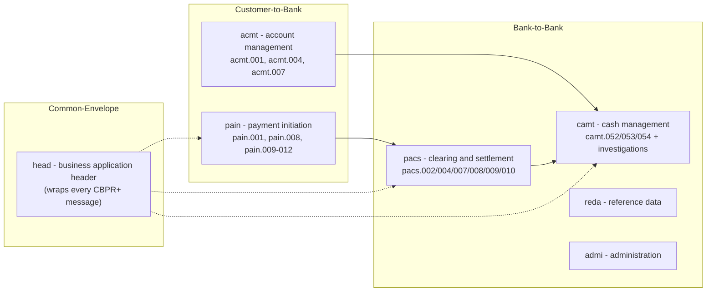

**Message identifier anatomy**: a message identifier has the form `area.message.variant.version` — e.g. `pacs.008.001.11` = family `pacs`, message number `008`, variant `001`, version `11`. The **version** component increments with every annual catalogue release (CBPR+ went live on `pacs.008.001.08` in Nov 2022; current editions are in the `.11`/`.12` range). Implementations must pin the exact version published in the ISO 20022 repository.

### 1.3 ISO 20022 vs MT: What Changed

| Aspect | SWIFT MT (FIN) | ISO 20022 (MX) |
|---|---|---|
| Structure | Fixed field numbers (e.g. MT103 field 50) | Named, nested XML/JSON elements (`Dbtr`, `DbtrAcct`) |
| Data | Length-capped, often unstructured | Structured, typed, extensible |
| Address | Free-text lines | Structured elements (street, town, country) + unstructured option |
| Remittance | 4×35 chars, often truncated | Structured remittance with references |
| Identity | BIC only | BIC, LEI, national IDs |
| Tracking | No standard tracking (post-GPI: UETR) | UETR built into every payment |
| Transport | FIN network | Any transport: SWIFT (InterAct/FileAct), RTGS, ACH, APIs |

The MT↔MX translation problem — and how a payments hub solves it — is covered in [payments_hub_guide.md](payments_hub_guide.md) (transformation section) and in [Section 19](#19-the-banking-implementation-context).

---

## 2. The ISO 20022 Message Structure

Every ISO 20022 exchange has two layers: a **Business Application Header (BAH)** and a **message payload**. In CBPR+ (SWIFT's cross-border implementation) the BAH is mandatory.

### 2.1 The Business Application Header (head.001)

`head.001` (BusinessApplicationHeader) is a lightweight envelope that carries transport- and routing-relevant data *outside* the payload so the payload stays clean and reusable:

- `From` / `To` — the sending and receiving parties (BICs for CBPR+)
- `BusinessMessageIdentifier` — unique ID of this message
- `MessageDefinitionIdentifier` — identifies the payload type (e.g. `pacs.008.001.11`)
- `CreationDate` — timestamp
- `BusinessService` — e.g. `swift.cbprplus.02` (CBPR+), `swift.gpi.02`
- `Duplicate`, `CopyDuplicate` flags; `Signature` (optional)

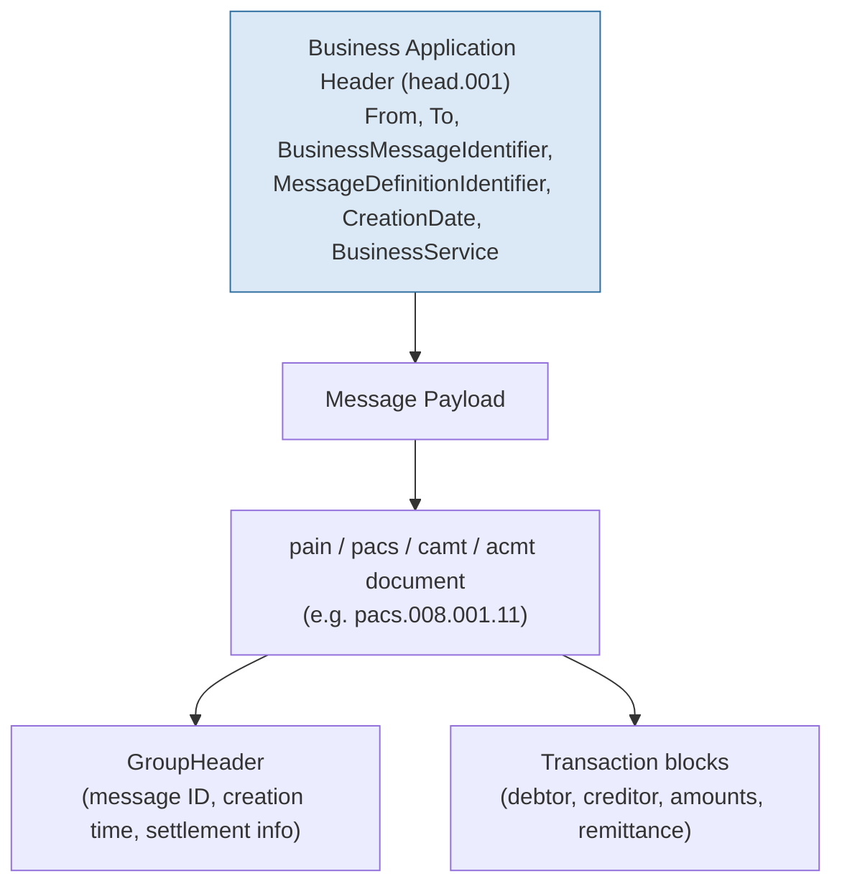

### 2.2 The Four-Layer Model

ISO 20022-1 defines a strict four-layer abstraction. Business people define the top layers; technicians consume the bottom layers; the catalogue is the bridge:

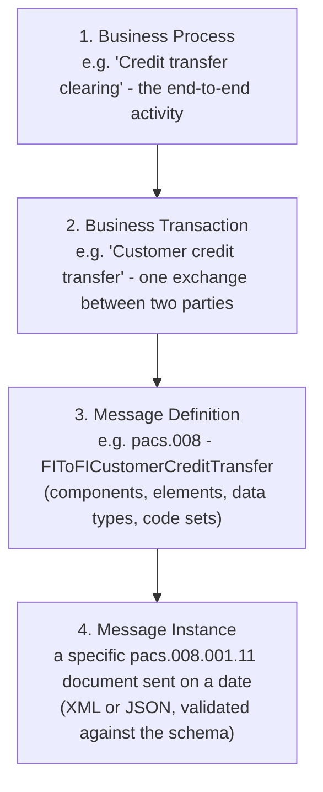

- **Business Process** — the top-level business activity (payment initiation, clearing, settlement, reporting).
- **Business Transaction** — a discrete interaction within the process (one bank instructs another).
- **Message Definition** — the registered, versioned specification of the message in the catalogue.
- **Message Instance** — an actual exchanged document conforming to a definition.

### 2.3 Message Components: Elements, Data Types, Code Sets

A message definition is assembled from **message components** (reusable building blocks), **message elements** (fields), **data types** (text, amounts, dates, identifiers), and **code sets** (enumerations). Examples:

- **Elements**: `Debtor` (party), `DebtorAccount` (account), `InstructedAmount` (amount), `RemittanceInformation` (remittance).
- **Data types**: `Max35Text`, `ActiveOrHistoricCurrencyAndAmount`, `ISODate`, `BICFIDec2014Identifier`, `UUIDv4Identifier` (the UETR).
- **Code sets**: `SettlementMethod1Code` (`INDA`, `INGA`, `COVE`, `CLRG`), `ExternalStatusReason1Code` (e.g. `AC01`), `Purpose2Code` / `ExternalPurpose1Code` (e.g. `SALA` salary, `SUPP` supplier), `ChargeBearerType1Code` (`DEBT`, `CRED`, `SHAR`, `SLEV`).
- **Repeating structures**: a single `pain.001` GroupHeader can carry thousands of transaction blocks (batch payments); each block repeats `PmtId`, `Amt`, `Dbtr`, `Cdtr`, `RmtInf`.

Code sets beginning with `External*` (e.g. `ExternalPurpose1Code`) are maintained *outside* ISO (by schemes and communities) and referenced by the standard — this is how SEPA, CBPR+ and national schemes extend the vocabulary without new ISO releases.

---

## 3. The ISO 20022 Message Lifecycle

ISO 20022 is not a static standard — messages are developed, published, implemented, and maintained through a governed, versioned lifecycle:

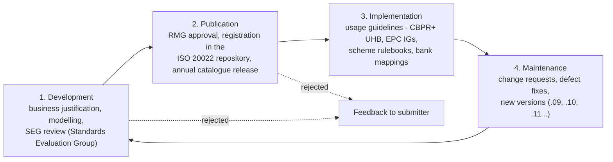

- **Development**: a submitting organisation (SWIFT, EPC, a central bank, an industry group) drafts a business justification and message model, which is evaluated by the relevant **Standards Evaluation Group (SEG)**.
- **Publication**: the **Registration Management Group (RMG)** approves the message for the catalogue; the ISO 20022 repository publishes it, and the annual catalogue release distributes it (each release increments the version component of affected messages). Details in [Section 17](#17-iso-20022-architecture-and-infrastructure).
- **Implementation**: the published definition is *not* directly usable in production — communities layer **usage guidelines** on top: which fields are mandatory, which codes are allowed, what the flow is. Examples: SWIFT's **CBPR+ UHB** (cross-border), the **EPC Implementation Guidelines** (SEPA), national RTGS specifications, and the SWIFT **GPI** rules.
- **Maintenance**: operational feedback becomes change requests that flow back into development — hence versions evolve over time (e.g. `pacs.008.001.08` at CBPR+ go-live in 2022 through `.11` in the 2025 edition). Banks must track and adopt new versions on a defined cadence (SWIFT's annual "SR" releases).
## 4. Payment Initiation (pain.001 → pain.002)

The **payment initiation process** is the customer-to-bank leg of every payment: the corporate (or retail customer) instructs its bank to move money. In ISO 20022 the instruction is a **pain.001** (CustomerCreditTransferInitiation) and the bank's response is a **pain.002** (CustomerPaymentStatusReport).

### 4.1 The Actors and Messages

- **Initiator / Instructing Party** — the corporate (typically an ERP or Treasury Management System — SAP, Oracle, Kyriba, FIS — or a bank channel: internet banking portal, host-to-host file, API).
- **Debtor Agent (the bank)** — receives the instruction, validates it (schema, business rules, fraud/AML screening), books it, and submits it to clearing.
- **pain.001** — the instruction. One message carries a GroupHeader + one or more payment transactions. Fields include `PmtId` (InstrId, EndToEndId, UETR), `InstdAmt`, `Dbtr`/`DbtrAcct`, `DbtrAgt`, `CdtrAgt`, `Cdtr`/`CdtrAcct`, `Purp`, `RmtInf`.
- **pain.002** — the status report: per-transaction status (`ACTC` accepted technical validation, `ACCP` accepted customer profile, `RJCT` rejected, `PDNG` pending) with reason codes on rejection.

### 4.2 The Initiation Flow

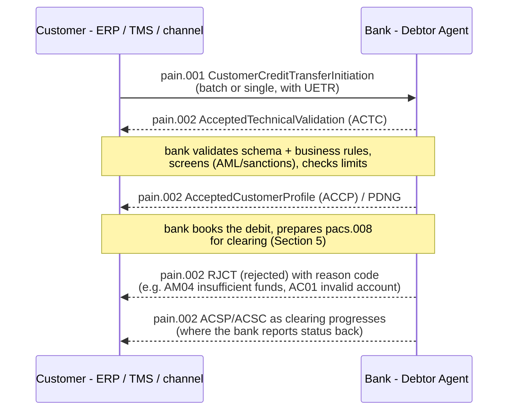

**Process flow in the bank** (mirrors the hub pipeline in [payments_hub_guide.md](payments_hub_guide.md)):

1. **Receive** pain.001 (file, message, or API/JSON equivalent).
2. **Validate** — XML/JSON schema conformance, then business validation (currency, cut-off, account validity, mandate checks).
3. **Screen** — sanctions, AML, fraud scoring; block or release.
4. **Authorize** — limits per channel/customer/currency.
5. **Book** — debit the customer account (core banking system; see [core_banking_systems_guide.md](core_banking_systems_guide.md)).
6. **Transform** — internal model → pacs.008 for the clearing rail (Section 5).
7. **Report** — pain.002 statuses to the customer throughout.

The task's requirement — every process shown as Mermaid — is satisfied above for initiation; the *clearing* continuation is Section 5. SEPA and CBPR+ both use pain.001/pain.002 for corporate-to-bank initiation; retail channels often use APIs/JSON that the bank maps into the same internal model.

---

## 5. Credit Transfer Clearing (pacs.008)

**Clearing** is the interbank leg: the instructing bank (debtor agent) moves the payment to the instructed bank (creditor agent) through a clearing arrangement, culminating in settlement (Section 7). The workhorse message is **pacs.008** (FIToFICustomerCreditTransfer) — the bank-to-bank customer credit transfer.

### 5.1 The Clearing Flow

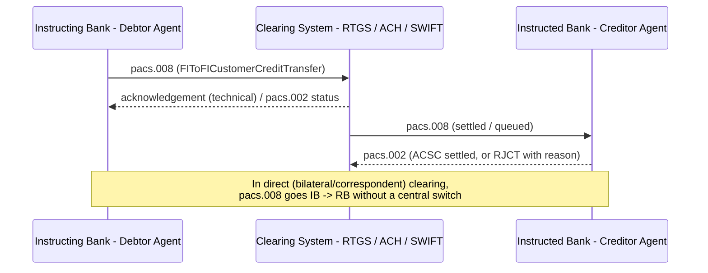

### 5.2 Clearing Models

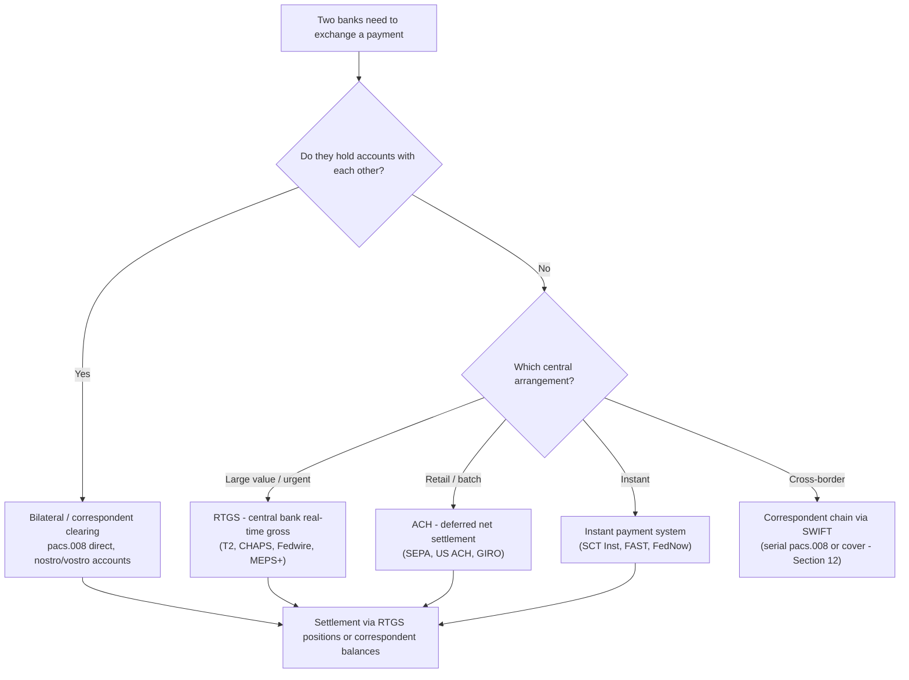

- **Bilateral / correspondent**: two banks that hold accounts with each other (nostro/vostro) exchange pacs.008 directly; funds move across the account balances.
- **Central clearing**: both banks are members of a common system — an RTGS (real-time gross), an ACH (deferred net), or an instant system — and settle through the central operator. Details in the FMI taxonomy of [financial_infrastructure_guide.md](financial_infrastructure_guide.md).
- **Correspondent chain**: in cross-border, no direct relationship exists; the payment hops through one or more correspondent banks (serial method, Section 12) — the core CBPR+ scenario (Section 13).

### 5.3 The pacs.008 Structure

| Block | Element | Purpose |
|---|---|---|
| `GrpHdr` | `MsgId`, `CreDtTm`, `NbOfTxs`, `IntrBkSttlmDt`, `SttlmInf` | Group-level: who, when, settlement method/date |
| `PmtId` | `InstrId`, `EndToEndId`, `UETR`, `TxId` | Identifiers — **UETR** is the global tracker (Section 9) |
| `Amt` | `InstdAmt` vs `IntrBkSttlmAmt`, `InstdAmtCcy` | Instructed (customer) amount vs interbank settled amount |
| `ChrgBr` | `DEBT`/`CRED`/`SHAR`/`SLEV` | Charge bearer — who pays fees |
| `Dbtr`, `DbtrAcct`, `DbtrAgt` | debtor + account + agent (BIC) | Originator side |
| `CdtrAgt`, `Cdtr`, `CdtrAcct` | creditor agent + creditor + account | Beneficiary side |
| `Purp` | purpose code (e.g. `SALA`, `SUPP`) | Reason for payment — mandatory-ish in CBPR+ |
| `RmtInf` | structured/unstructured remittance | Invoice references — the data MT used to truncate |
| `SplmtryData` | supplementary data | Scheme-specific extensions |

Status reporting along the clearing leg uses **pacs.002** (FIToFIPaymentStatusReport) — see Section 9. Cancellation of a payment still in clearing is requested via **camt.056** (Section 10); a payment returned after settlement uses **pacs.004** (Section 11).

---

## 6. The Direct Debit Process (pain.008)

A **direct debit** is the mirror image of a credit transfer: the **creditor (biller)** initiates, and the **debtor's account** is debited — with the **mandate** (the debtor's pre-authorization) as the legal basis. In ISO 20022 the customer-to-bank instruction is **pain.008** (CustomerDirectDebitInitiation); the interbank leg uses **pacs.003** (FIToFICustomerDirectDebit) and **pacs.010** (FinancialInstitutionDirectDebit); returns use **pacs.004** (e.g. reason `MD07` debtor deceased, `AM04` insufficient funds, `AC04` closed account). Mandates themselves are managed with **pain.009–012** (Section 15).

### 6.1 The Direct Debit Flow

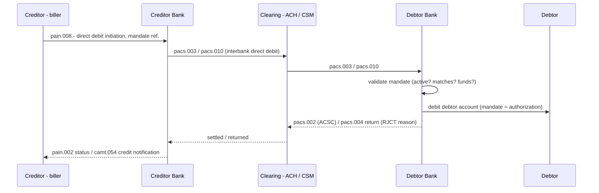

### 6.2 The Mandate as the Authorization

The mandate is the contract between debtor and creditor (typically a signed paper form or an e-mandate) authorizing repeated debits. In the payment message it is referenced via `DrctDbtTxInf.MndtRltdInf` — mandate ID, date of signature, amendment indicator. The debtor bank is entitled (and in SEPA, obliged) to reject a direct debit whose mandate is missing, cancelled, or mismatched — this is the core risk control of the scheme:

- **Mandate lifecycle**: creation → validation → amendment → cancellation (full lifecycle in Section 15).
- **SEPA specifics**: the SEPA Direct Debit (SDD) scheme requires a unique mandate reference (UMR), a 14-month validation window after the last collection (SDD Core), and debtor refund rights (8 weeks / 13 months).
- **Instant world**: with request-to-pay and variable recurring payments, the mandate is evolving from a paper contract into a digital, API-managed authorization — but the ISO 20022 message layer (pain.008 + mandate references) stays the same.

Direct debit is used heavily in the Singapore context for GIRO (taxes, utilities, insurance premiums) — the same mandate logic applies on the domestic rails.

---

## 7. The Settlement Process

**Settlement** is the moment money actually changes hands — positions are moved, obligations are discharged, and the payment becomes **final** (irrevocable and unconditional). Settlement is executed by the **settlement systems** described in [financial_infrastructure_guide.md](financial_infrastructure_guide.md).

### 7.1 Settlement Methods

| Method | Mechanism | Systems | Finality |
|---|---|---|---|
| **RTGS** (real-time gross) | Each payment settled individually, in real time, in central bank money | T2 (EU, since 2022), CHAPS (UK), Fedwire (US, ISO 20022 since 2025), MEPS+ (SG) | Immediate, continuous |
| **DNS** (deferred net settlement) | Payments accumulate; net positions exchanged at fixed cycles | ACH (SEPA, US ACH, GIRO) | End-of-cycle (usually same-day) |
| **Hybrid / instant** | Real-time clearing, settlement via RTGS positions (in central bank money) | SCT Inst (via TIPS/T2), FAST (via MEPS+), FedNow | Real-time per transaction |

### 7.2 The Settlement Decision

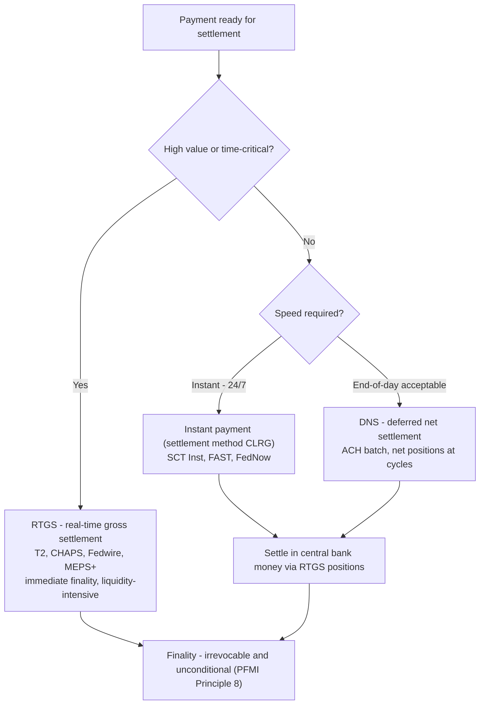

### 7.3 The Settlement Instruction in ISO 20022

Every pacs.008 carries a settlement instruction (`SttlmInf`) telling the clearing system how and where to settle:

- **`SttlmMtd`** (SettlementMethod1Code): `INDA` (instructed agent settles), `INGA` (instructing agent settles), `COVE` (cover method — Section 12), `CLRG` (clearing system settles — used by instant and ACH schemes).
- **`SttlmAcct`** — the settlement account (e.g. the bank's RTGS account at the central bank).
- **`ClrSys`** — the clearing system (e.g. `T2`, `CHAPS`, `US-Fedwire`, `SG-MEPS+`, `US-CHIPS`).
- **`IntrBkSttlmAmt` / `IntrBkSttlmDt`** — the amount and date the banks settle between themselves (may differ from the customer-instructed amount when fees apply — `InstdAmt` vs `IntrBkSttlmAmt`).

### 7.4 The Settlement Lifecycle and Finality

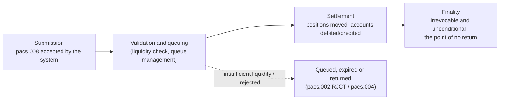

**Settlement finality** is the legal concept that once settled, a payment cannot be unwound — it is irrevocable and unconditional. It is the foundation of systemic risk management and is codified in **Principle 8 of the CPMI-IOSCO Principles for Financial Market Infrastructures (PFMI)**: *"An FMI should provide clear and certain final settlement, at a minimum by the end of the value date. Where necessary or preferable, an FMI should provide final settlement intraday or in real time."* After finality, a payment can only be corrected by a **return** (pacs.004) or a **reversal** (pacs.007) — see Section 11 — never by unwinding the settlement.
## 8. Cash Management and Reporting (camt)

The **cash management process** is the reporting leg: the bank informs the customer of account activity. ISO 20022 provides three complementary bank-to-customer messages, differentiated by timing and granularity:

| Message | Name | Timing | Content |
|---|---|---|---|
| **camt.052** | BankToCustomerAccountReport | Intraday, on request | Account report — current status, entries since last report |
| **camt.053** | BankToCustomerStatement | End of day (periodic) | Full statement — opening/closing balances, all entries |
| **camt.054** | BankToCustomerDebitCreditNotification | Real-time (per transaction) | Single entry notification — the "payment notification" |

(camt.057 — NoticeToReceive — is the bank-to-bank *pre-advice* of an incoming payment, often used in cover/RTGS scenarios.)

### 8.1 The Reporting Flow

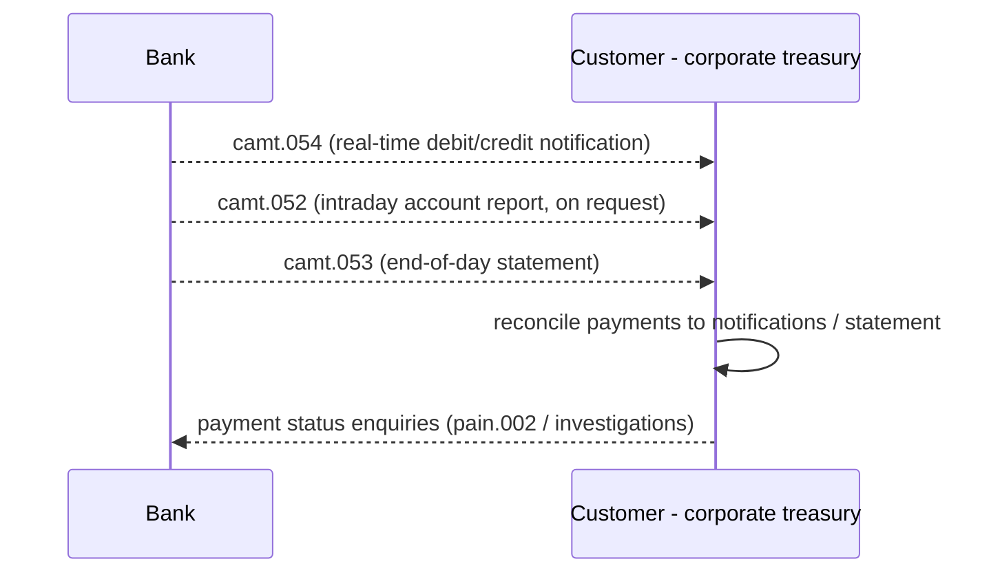

### 8.2 The Statement Structure (camt.053)

- **GroupHeader** — message ID, creation date/time, account servicer.
- **Account** — the reported account (IBAN/domestic identifier), owner.
- **Balances** — opening and closing balances (booked and available), plus interim balances per type.
- **Entries (`Ntry`)** — each movement: amount, credit/debit indicator (`CdtDbtInd`), booking date, value date, bank transaction code (`BkTxCd` — the classification: e.g. payment, fee, interest), entry details (`NtryDtls` — the underlying transactions, often referencing the original `EndToEndId`/`UETR`), charges (`Chrgs`), and counterparty info.
- **Transactions (`TxDtls`)** — references back to the payment messages (the link that makes reconciliation possible).

### 8.3 The Reconciliation Use Case

Corporate treasury's core workflow is **reconciliation**: matching outgoing payments and incoming receipts to the bank's reports — closing the loop from the ERP's records to bank reality. camt.054/053 make this automatable because they carry the same identifiers the corporate put into pain.001 (`EndToEndId`, `UETR`) plus the bank's references.

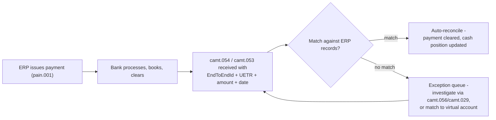

**Virtual accounts** extend this: a corporate with many beneficiaries uses one physical account with many virtual sub-accounts; camt.054/053 entries carry the virtual account identifier so reconciliation happens per sub-account automatically — see the virtual account reconciliation workflow in [programmable_business_bank_guide.md](programmable_business_bank_guide.md).

---

## 9. Payment Status and Tracking (pacs.002, GPI, UETR)

### 9.1 The Status Messages

Two status-report messages mirror the two initiation directions:

- **pain.002** (CustomerPaymentStatusReport) — bank → customer, status of a pain.001 (Section 4).
- **pacs.002** (FIToFIPaymentStatusReport) — bank → bank, status of a pacs.008/pacs.009 along the clearing chain.

The **payment status codes** are a shared vocabulary across both:

| Code | Meaning | Stage |
|---|---|---|
| **ACTC** | AcceptedTechnicalValidation | Received, passed schema/technical checks |
| **ACCP** | AcceptedCustomerProfile | Accepted per customer agreement (pain.002) |
| **ACSP** | AcceptedSettlementInProcess | Settlement is being executed |
| **ACSC** | AcceptedSettlementCompleted | Settled — final (Section 7) |
| **ACCC** | AcceptedCancellationRequest | Cancellation accepted (camt.056 flow) |
| **ACWC** | AcceptedWithChange | Accepted with changes (e.g. FX applied) |
| **ACWP** | AcceptedWithPostponement | Accepted but delayed |
| **PDNG** | Pending | In progress — screening, funds, queues |
| **RJCT** | Rejected | Refused — with status reason code |

### 9.2 The Status Lifecycle

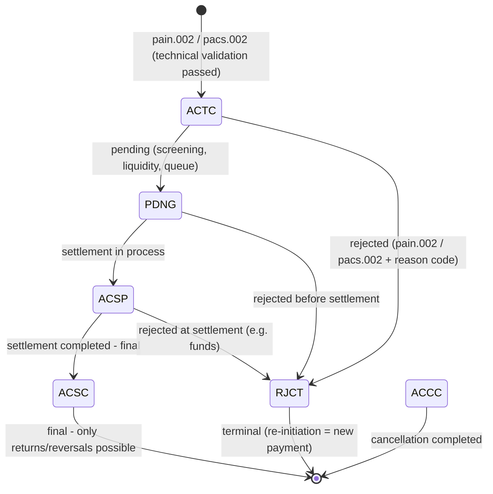

Note the asymmetry that drives exceptions (Section 10): **RJCT can happen at any stage before finality; ACSC is the point of no return.**

### 9.3 SWIFT GPI and the UETR

**SWIFT GPI (Global Payments Innovation)** is SWIFT's cross-border tracking and transparency service (live since 2017, now the default for most SWIFT traffic). Its core mechanism is the **UETR — Unique End-to-End Transaction Reference**: a UUID (RFC 4122, 32 hex chars) generated by the originator and carried in `PmtId/UETR` of every payment message. The UETR:

- **Links every leg** of a cross-border payment — the pain.001, every pacs.008 hop through correspondents, the pacs.009 cover, status reports, returns, and investigations all carry the same UETR.
- **Enables the GPI Tracker** — SWIFT's cloud service that aggregates status updates from each bank in the chain (via pacs.002-type updates and tracker messages), letting the originator see, in real time, where the payment is and when it was credited.
- **Is the spine of CBPR+** — mandated in the UHB (Section 13).

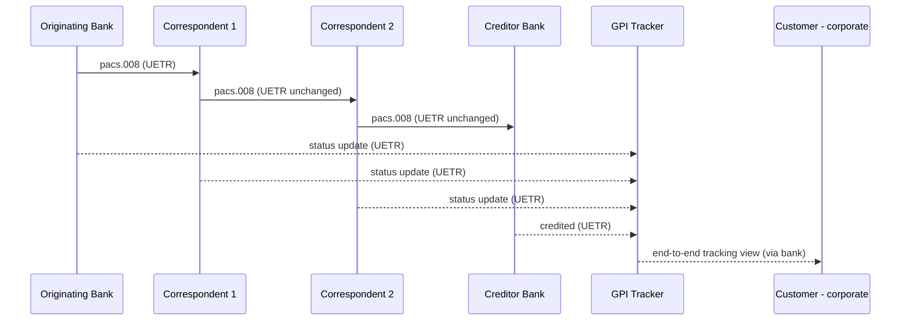

GPI also imposes **five rules** that materially improve the customer experience: no truncation of remittance data; no use of beneficiary-bank funds before receipt; payments made to the account stated; full amount credited (no unauthorized charges); and (via GPI gpi) status updates on every leg. For the bank architect, GPI+CBPR+ means the UETR must be generated at initiation, persisted in the payment model, and never regenerated downstream — a key data-governance requirement (see [payments_hub_guide.md](payments_hub_guide.md) on payment identity).

---

## 10. Exceptions and Investigations (camt.056/camt.029)

When a payment goes wrong, the **exceptions and investigations (E&I)** process kicks in: one bank raises a claim, the other investigates, and the case is resolved. ISO 20022 has a complete investigation suite:

| Message | Name | Role |
|---|---|---|
| **camt.056** | FIToFIPaymentCancellationRequest | The workhorse: cancellation request *and* claim of non-receipt |
| **camt.029** | ResolutionOfInvestigation | The answer: positive (cancellation agreed) or negative (with reason) |
| **camt.087** | RequestToModifyPayment | Ask the other bank to modify a payment (beneficiary, amount, charges) |
| **camt.026** | UnableToApply | "I received funds but cannot apply them" — unclear instructions |
| **camt.027** | ClaimNonReceipt | Formal claim that a payment was not received |
| **camt.030** | NotificationOfCaseAssignment | Tells the respondent a case has been assigned |
| **camt.031** | RequestForDuplicate | Ask for a duplicate of the original payment |
| **camt.032** | CancelCaseAssignment | Close a case |
| **camt.033/034** | CaseStatusReportRequest / CaseStatusReport | Status checks and escalation |

### 10.1 The Investigation Types

| Type | Scenario | Typical message |
|---|---|---|
| Non-receipt | Beneficiary claims funds never arrived | camt.056 (claim) → camt.029 |
| Delayed payment | Payment stuck in the chain | camt.056 / status enquiry |
| Duplicate payment | Paid twice (e.g. same invoice) | camt.056 with `DUPL` reason → return |
| Incorrect amount | Wrong value credited | camt.087 (modify) or camt.056 |
| Incorrect beneficiary | Credited to the wrong party | camt.087 → correction or recall |
| Unable to apply | Funds received, cannot identify | camt.026 → camt.029 |

### 10.2 The Investigation Flow

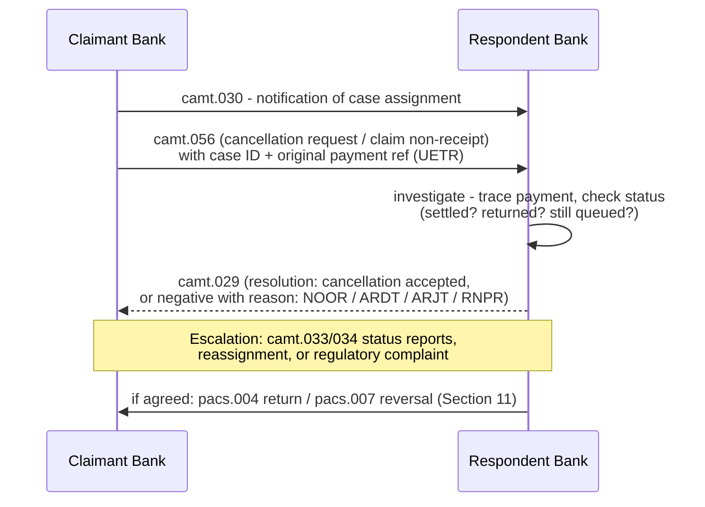

### 10.3 Case Management

Every investigation is a **case**: a `CaseId` (unique per case), the `Assigner` (claimant) and `Assignee` (respondent), the creation date, and a status that evolves through the lifecycle. Key operational rules (per the CBPR+ UHB):

- One case per original payment (referenced by UETR/payment reference).
- The respondent must first **validate the assignment** (is it the right bank? is the payment within its records?) before investigating.
- Timely responses — the G20/CPMI agenda targets faster investigation resolution for cross-border payments.
- Escalation: status enquiries (camt.033/034), re-assignment, and ultimately scheme arbitration or regulator involvement.

The E&I domain is where banks' operational quality shows: investigation handling time and first-time resolution are measured by SWIFT and by regulators. See [payments_hub_guide.md](payments_hub_guide.md) (exceptions handling) and [financial_infrastructure_guide.md](financial_infrastructure_guide.md) (FMI dispute frameworks) for the surrounding operational context.

---

## 11. Returns and Reversals (pacs.004/pacs.007)

After a payment has problems, the correction mechanisms differ by **when** the problem is found:

- **Return (pacs.004 — PaymentReturn)**: the payment *has settled*; the receiving bank sends the money back. Money moves back the way it came, with a return reason.
- **Reversal (pacs.007 — FIToFIPaymentReversal)**: the payment is *reversed before or at settlement* — the original is cancelled or undone (used in SEPA for technical errors, e.g. duplicate or wrong amount, where the scheme permits reversal without a prior cancellation request).

### 11.1 Return vs Reversal Decision

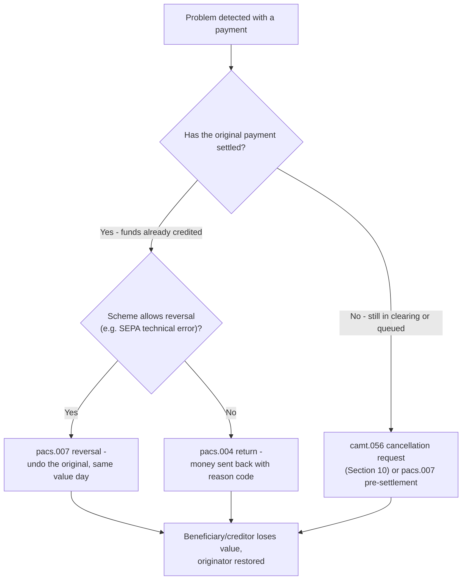

### 11.2 The Return Flow

A pacs.004 **references the original payment** (UETR, original message ID, original interbank settlement amount/date) and carries the return reason in `RtrRsnInf`:

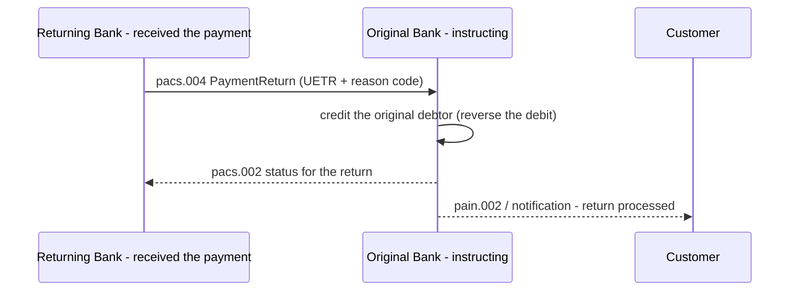

### 11.3 Return Reason Codes

The reason codes are the `ExternalStatusReason1Code` code set (maintained outside ISO, referenced by the standard). Common ones:

| Code | Meaning | Example |
|---|---|---|
| **AC01** | Incorrect account number | Wrong IBAN |
| **AC04** | Closed account number | Account closed |
| **AC06** | Blocked account | Frozen account |
| **AM04** | Insufficient funds | No cover for direct debit |
| **AM05** | Duplication | Paid twice |
| **BE04** | Missing debtor address | Address required by law (e.g. US) |
| **MD07** | End customer deceased | Beneficiary deceased |
| **NOOR** | No original transaction received | "I never got this payment" |
| **RC01** | Bank identifier incorrect | Wrong BIC |
| **RR04** | Regulatory reason | Sanctions, AML |

Returns are the single largest operational cost in cross-border payments — the G20/CPMI agenda explicitly targets reducing returns via better data (structured addresses, correct BICs — see Section 13). The return journey end-to-end is also covered in the exceptions section of [payments_hub_guide.md](payments_hub_guide.md).
## 12. Cover Payments (pacs.009)

Cross-border payments between banks without a direct relationship are handled by **correspondent banking**, using one of two models — **serial** or **cover**:

- **Serial method**: one pacs.008 travels through the correspondent chain, hop by hop, until it reaches the creditor bank. Each hop settles over the correspondent accounts (nostro/vostro). Simple to track (the UETR rides the single message), but each intermediary sees the full customer data.
- **Cover method**: two messages — the **customer transfer (pacs.008)** goes *directly* from the debtor bank to the creditor bank (which are typically "on-us" or have a direct relationship for the advice), while the **cover (pacs.009 — FinancialInstitutionCreditTransfer)** moves the *funds* through the correspondent chain. The cover is settled; the customer transfer is the advice. The UETR links the two.

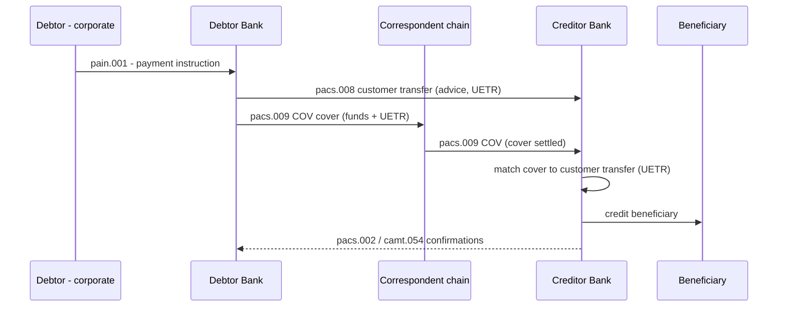

### 12.1 Serial vs Cover

| Aspect | Serial | Cover |
|---|---|---|
| Messages | One pacs.008 through the chain | pacs.008 (advice) + pacs.009 COV (funds) |
| Data exposure | Every correspondent sees full payment data | Only the two banks see customer data; correspondents see the cover |
| Reconciliation | Single UETR on one message | Two messages linked by UETR |
| Use today | Dominant — CBPR+ default for serial | Declining; still used in specific corridors |

In ISO 20022, the cover method is explicitly marked with **`SttlmMtd = COVE`** in the settlement instruction (Section 7.3) and the cover message is the **pacs.009.COV** variant (a FinancialInstitutionCreditTransfer carrying the original customer payment reference and UETR). The `pacs.009` base message is also used for pure interbank transfers (e.g. liquidity moves, nostro funding, cover for treasury operations).

---

## 13. CBPR+: Cross-Border Payments on ISO 20022

**CBPR+ (Cross-Border Payments and Reporting Plus)** is SWIFT's implementation of ISO 20022 for cross-border payments and reporting on the SWIFT network — the standard by which every bank does ISO 20022 cross-border. It defines the **message set**, the **usage rules**, and the **migration** from MT.

### 13.1 The CBPR+ Message Set and the UHB

The rules live in the **CBPR+ UHB (User Handbook)** — SWIFT's usage guidelines, continuously versioned (currently aligned to the annual catalogue releases). The in-scope message set:

| Message | Use in CBPR+ |
|---|---|
| **head.001** | Business Application Header — mandatory envelope |
| **pacs.008 / pacs.008.stp** | Customer credit transfer (serial; `.stp` = straight-through variant) |
| **pacs.009 / pacs.009.COV** | FI credit transfer / cover |
| **pacs.002** | Status reports |
| **pacs.004** | Returns |
| **pacs.007** | Reversals |
| **camt.053 / camt.054** | Statements and debit/credit notifications (camt.052 is *not* in CBPR+ scope — it is a domestic intraday report) |
| **camt.056 / camt.029 / camt.026 / camt.027 / camt.087** | Exceptions & investigations |

### 13.2 The CBPR+ Rules: Structured Data by Default

The UHB enforces a set of usage rules (numbered rules governing presence, format, and content of every field) with the core objective of **structured, high-quality data**. Highlights:

- **UETR mandatory** in every payment — Rule 1 of the UHB is the presence of the UETR; it must never be altered along the chain.
- **Structured remittance** — the "enhanced data" ask: remittance as structured references (e.g. ISO 11649 creditor references) rather than free text.
- **Purpose codes** — `Purp` must carry a purpose code from the external code set.
- **Structured addresses** — the headline data-quality requirement, with a two-step timeline:
  - **Nov 2022 (go-live)**: structured or unstructured addresses both accepted; hybrid (mixing) not permitted initially.
  - **22 Nov 2025 (end of MT coexistence)**: all in-scope FI-to-FI payment instructions must be sent as MX; hybrid address data becomes permitted.
  - **14 Nov 2026**: SWIFT will no longer accept *fully unstructured* postal addresses in CBPR+ messages — addresses must be fully structured or hybrid (at minimum town and country in the designated elements), per SWIFT's address-structuring factsheet.
- **The "12"**: the widely cited "12" refers to the **CPMI's 12 harmonised ISO 20022 data requirements** for cross-border payments (a G20 deliverable): the core data elements every cross-border system must support consistently — including UETR, LEI, BIC, IBAN, purpose code, structured remittance, structured address, FX/charges transparency — so that a payment can travel across systems without data loss.

### 13.3 The CBPR+ Payment Flow (Serial with UETR)


### 13.4 The Migration Context: MT → MX

The migration is the largest standards change in banking history, driven by SWIFT and market infrastructures in parallel:

| Milestone | Event |
|---|---|
| **Nov 2022** | CBPR+ go-live — MX and MT coexist for cross-border (translation supported by SWIFT) |
| **21 Mar 2022** | **T2** (EU RTGS) goes live on ISO 20022, replacing TARGET2; **TIPS** (instant) on the same stack |
| **June 2022** | **MEPS+ HVPS+** (Singapore RTGS) goes live with enhanced ISO 20022 (Like-for-Like++) |
| **8 Apr 2024** | **CHIPS** (US) migrates to ISO 20022 (per The Clearing House records) |
| **10 Mar / 14 Jul 2025** | **Fedwire Funds** two-phase cutover; ISO 20022 complete 14 July 2025 |
| **22 Nov 2025** | **End of CBPR+ coexistence**: MT no longer used for in-scope FI-to-FI payment instructions on CBPR+ corridors — "the global financial community completes the switch" (SWIFT, Nov 2025) |
| **14 Nov 2026** | Fully unstructured addresses no longer accepted in CBPR+ messages (address-structuring deadline) |

**The translation strategy**: during coexistence, SWIFT translated MT↔MX at the network edge (and banks translated internally); the **MT103 ↔ pacs.008 field mapping** is the canonical exercise every bank did — a full mapping reference is in [payments_hub_guide.md](payments_hub_guide.md) (message transformation section). Translation is lossy by design (MT fields are smaller/coarser), which is why data quality (structured addresses, LEI, purpose codes) is the strategic prize of the migration.

**Adoption status (2026)**: the Nov 2025 milestone is complete — cross-border FI-to-FI payment instructions are MX-native; MT remains only for out-of-scope traffic (some securities, treasury, and non-CBPR+ flows). Domestic systems are ISO 20022-native (T2, MEPS+, Fedwire, CHIPS, SCT Inst, FAST, FedNow). The residual work is **data quality** (the Nov 2026 address deadline) and **harmonisation** — closing the gap between implementations via the CPMI framework.

---

## 14. Instant Payments on ISO 20022

**Instant payments** are low-value payments that must be credited to the beneficiary in (near) real time, 24/7/365, with immediate confirmation. All major instant systems are built on ISO 20022:

| System | Launch | ISO 20022 basis | Notes |
|---|---|---|---|
| **SCT Inst** (SEPA Instant) | Nov 2017 | pacs.008 (settlement method CLRG) | EPC scheme; sub-second processing target; immediate pacs.002 |
| **FAST** (Singapore) | Mar 2014 | ISO 20022 messaging (pain/pacs-style) | 24/7 low-value real-time; settles via MEPS+; powers **PayNow** (proxy-based, since 2017) |
| **FedNow** (US) | Jul 2023 | ISO 20022 (pacs.008-based) | 24/7; settlement in Federal Reserve accounts |
| **UPI** (India) | 2016 | NPCI's own XML format — **not ISO 20022-native** | ISO 20022 alignment widely reported as planned for cross-border interoperability; verify current status |
| **TIPS** (EU) | Nov 2018 | ISO 20022 (pacs.008-based) | Central-bank instant settlement layer, now on the T2 stack |

### 14.1 The Instant Payment Flow

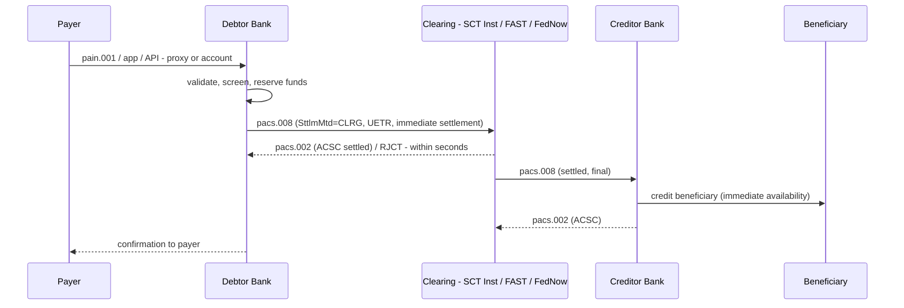

### 14.2 ISO 20022 Specifics for Instant

- **Settlement method**: `SttlmMtd = CLRG` (clearing system settles) with `ClrSys` identifying the scheme (e.g. `SCTINST`, `FAST`, `FedNow`). The scheme itself manages the settlement in central bank money.
- **Amounts**: `InstdAmt` (customer amount) vs `IntrBkSttlmAmt` (interbank settled amount) — for instant, typically identical (no float, no fees deducted by intermediaries).
- **Immediate confirmation**: the scheme mandates an immediate **pacs.002** (ACSC or RJCT) — the debtor bank must know within seconds whether the payment succeeded; the customer experience depends on it.
- **Rejections are the norm to handle**: no queueing in most instant schemes — if the beneficiary bank cannot credit, the payment is rejected instantly (RJCT) and the funds are never moved; the "accept then fail" model of RTGS queues does not apply.
- **Data quality is do-or-die**: instant systems validate strictly (IBAN checks, structured data) because there is no repair window — bad data = instant rejection. This is the strongest argument for ISO 20022 data discipline.

For the architecture of instant rails (switch, settlement, liquidity) see [financial_infrastructure_guide.md](financial_infrastructure_guide.md) (retail payment systems) and [mojaloop_guide.md](mojaloop_guide.md) (the open-source instant-payments reference architecture, whose ISO 20022-aligned message flows follow the same pacs.008/pacs.002 pattern).

---

## 15. Mandate Management (pain.009–pain.012)

The **mandate** is the debtor's pre-authorization that makes direct debits legal (Section 6). ISO 20022 defines a dedicated mandate-management message set — the numbers and names verified against the ISO 20022 catalogue:

| Message | Name | Function |
|---|---|---|
| **pain.009** | MandateInitiationRequest | Create a new mandate (creditor → creditor bank, then on to the debtor bank) |
| **pain.010** | MandateAmendmentRequest | Amend an existing mandate (amount limits, frequency, dates) |
| **pain.011** | MandateCancellationRequest | Cancel a mandate |
| **pain.012** | MandateStatusReport | Report the status (active / rejected / accepted with change) |

### 15.1 The Mandate Lifecycle

```mermaid
flowchart LR
    A["Debtor signs mandate<br/>(paper form or e-mandate)"] --> B["pain.009 MandateInitiationRequest<br/>(creditor to creditor bank)"]
    B --> C["Mandate exchange to debtor bank<br/>(via clearing / scheme - e.g. SEPA DD)"]
    C --> D["Debtor bank validates with debtor,<br/>returns pain.012 status (active / rejected)"]
    D --> E["Mandate ACTIVE -<br/>direct debits authorized (pain.008)"]
    E -->|"change required"| F["pain.010 MandateAmendmentRequest"]
    F --> D
    E -->|"no longer needed"| G["pain.011 MandateCancellationRequest"]
    G --> D
    D -->|"cancelled"| H["Mandate ENDED -<br/>future direct debits rejected (pain.004, e.g. MD07/AM04)"]
```

### 15.2 Key Rules

- **Uniqueness**: each mandate has a unique mandate reference (in SEPA, the UMR) and an associated creditor identifier.
- **Validation window**: SEPA Core requires the mandate to be valid (14-month window since last collection) — the debtor bank enforces this at direct-debit time.
- **Amendment vs new mandate**: changes to the *debtor* or *creditor* identity require a new mandate; changes to amount/frequency are amendments (pain.010).
- **Digital mandates**: e-mandates (e.g. SEPA's signed electronic mandates) are the growing channel; the ISO 20022 messages are the transport, while the signature/authentication lives in the scheme's e-mandate framework.

Mandate management is mostly a **domestic/SEPA** concern — CBPR+ (Section 13) does not carry mandates; direct debits themselves are domestic (SEPA DD, GIRO in Singapore, ACH debits in the US).
## 16. Account Management (acmt)

The **acmt** family manages the account relationship itself (opening, modification, closing) — distinct from the *reporting* on accounts, which uses camt.052/053/054 (Section 8). This guide keeps account management brief; the repo's account-management coverage lives in [core_banking_systems_guide.md](core_banking_systems_guide.md) and [programmable_business_bank_guide.md](programmable_business_bank_guide.md).

### 16.1 The acmt Messages

| Message | Name | Use |
|---|---|---|
| **acmt.001** | AccountOpeningInstruction | Customer instructs the bank to open an account |
| **acmt.007** | AccountModificationInstruction | Change account attributes (signatories, limits) |
| **acmt.004** | AccountClosingInstruction | Close an account |
| acmt.022 | Name/Person Data Changes | Update party data (per SWIFT's message mapping) |

(The suite also includes the corresponding acknowledgements and status reports — acmt.002/003, acmt.005/006, acmt.008/009, acmt.010/011 — for request/acknowledgement tracking.)

### 16.2 Account Identification

ISO 20022 identifies accounts primarily by **IBAN** (ISO 13616) in Europe/SEPA and by domestic account identifiers elsewhere, always qualified by the account servicer (BIC/LEI). The `AccountIdentification4Choice` element supports IBAN, proprietary, and other identifiers — one reason a payment can travel cross-border with a targetable account. Virtual accounts (Section 8.3) are an overlay on this: the physical account carries the ISO identifier; the virtual sub-accounts ride in the entry details of camt.054/053.

```mermaid
flowchart LR
    A["Account opening<br/>(acmt.001)"] --> B["Account lifecycle<br/>(acmt.007 modify, acmt.004 close)"]
    B --> C["Account reporting<br/>(camt.052 intraday, camt.053 EOD, camt.054 real-time)"]
    C --> D["Reconciliation<br/>(match payments to entries - Section 8.3)"]
```

---

## 17. ISO 20022 Architecture and Infrastructure

### 17.1 Message Transport

ISO 20022 messages are syntax-agnostic and transport-agnostic — the same pacs.008 travels over very different plumbing:

| Transport | Who uses it | Characteristics |
|---|---|---|
| **SWIFT InterAct** | CBPR+, GPI, securities | Store-and-forward MX exchange on SWIFTNet |
| **SWIFT FileAct** | Batch initiation, statements | File transfer for pain.001 batches, camt.053 files |
| **SWIFT FIN** | MT traffic (being retired for payments) | The legacy MT network — coexisted until Nov 2025 |
| **RTGS direct connectivity** | T2, Fedwire, MEPS+, CHAPS | Direct FMI connections, often proprietary-plus-ISO 20022 |
| **ACH / scheme channels** | SEPA (CSMs), EPC, FAST | File or message submission to clearing houses |
| **APIs (JSON)** | Corporate channels, open banking, bank-to-bank APIs | ISO 20022-7 JSON representation, REST (Section 17.3) |

### 17.2 Repositories, Governance, and the Registration Process

The **ISO 20022 repository** (iso20022.org) is the authoritative registry of message definitions, data types, and code sets. Governance sits with **ISO/TC 68** and its groups:

- **RMG — Registration Management Group**: owns the catalogue; approves message registrations and changes.
- **SEGs — Standards Evaluation Groups**: domain experts who evaluate new messages by business area (payments, securities, trade, cards…).
- **TSG — Technical Support Group**: maintains the technical infrastructure (schemas, tools, JSON generation).

```mermaid
flowchart TD
    A["Need identified (scheme, SWIFT, central bank,<br/>industry group - e.g. new instant scheme)"] --> B["Submit business justification +<br/>message model to ISO/TC 68"]
    B --> C["SEG evaluation<br/>(domain experts: payments, securities, ...)"]
    C -->|"approve"| D["RMG registration decision"]
    D -->|"approve"| E["Publication in ISO 20022 repository<br/>(annual catalogue release, version bump)"]
    E --> F["Community implementation<br/>(usage guidelines: CBPR+ UHB, EPC IG, national specs)"]
    F --> G["Operational feedback and change requests"]
    G --> A
    C -->|"reject"| H["Feedback to submitter for revision"]
    D -->|"reject"| H
```

### 17.3 ISO 20022 for APIs: JSON and the API Direction

The industry is moving ISO 20022 from files and store-and-forward messages to **APIs and JSON**:

- **ISO 20022-7 (2021)** defines the **JSON representation** of ISO 20022 messages — JSON Schema generation from the same metamodel, so a pacs.008 can be exchanged as JSON with the same business semantics.
- **ISO/TS 23029 (2020)** — *Web-service-based API (WAPI) in financial services* — the technical specification for ISO 20022 over web services.
- **RMG whitepaper (2018)** — "ISO 20022 and JSON: implementation best practices" — the original blueprint for JSON Schema mapping (aligned since with JSON Schema Draft 2020-12 and OpenAPI 3.1).
- **ISO 20022-8 (2026, ed. 2)** covers **ASN.1 generation** — for non-XML transports where compactness matters.

The trend matters for architects in two ways: corporate channels increasingly initiate payments via **JSON APIs** that the bank maps into the same internal ISO 20022 model (the hub absorbs the syntax), and bank-to-bank APIs (e.g. SWIFT's own API strategy, open banking rails) reuse ISO 20022 semantics — see [payments_hub_guide.md](payments_hub_guide.md) on API-based initiation.

---

## 18. The Reference Architecture: An End-to-End Payment on ISO 20022

Putting it all together: one payment traversing a bank's estate, with the ISO 20022 message flow at the core. This is the "ISO 20022 journey" — the canonical architecture a bank builds (or buys) around the standard, and the reason the payments hub ([payments_hub_guide.md](payments_hub_guide.md)) exists.

```mermaid
flowchart LR
    A["CHANNELS<br/>ERP/TMS, portal, host-to-host, API (JSON), files"] -->|"pain.001"| B["PAYMENTS HUB<br/>validate, screen, enrich, authorize,<br/>translate (MT/MX/JSON), orchestrate"]
    B -->|"pacs.008 (UETR)"| C["CLEARING<br/>SWIFT/CBPR+, RTGS (T2, MEPS+, Fedwire),<br/>ACH, instant (FAST, FedNow)"]
    C -->|"settlement + finality"| D["SETTLEMENT<br/>positions, nostro/vostro,<br/>central bank money (PFMI P8)"]
    D -->|"pacs.002"| E["STATUS & TRACKING<br/>pacs.002/pain.002, GPI tracker, UETR"]
    E -->|"camt.053 / camt.054"| F["REPORTING<br/>statements, notifications, reconciliation"]
    D -->|"problem detected"| G["EXCEPTIONS<br/>camt.056, camt.029, camt.087, camt.026"]
    G -->|"post-settlement correction"| H["RETURNS / REVERSALS<br/>pacs.004, pacs.007"]
    B -.->|"pain.002 statuses"| A
```

### 18.1 Message Orchestration Inside the Bank

The orchestration steps — how the messages flow through a bank's systems — follow the hub pattern described in [payments_hub_guide.md](payments_hub_guide.md) (hub architecture section):

1. **Ingest**: pain.001 (or JSON/API, or MT) arrives at the channel layer; the hub normalizes it into a canonical internal payment model keyed by the UETR.
2. **Validate & enrich**: schema/business validation, sanctions/AML screening, FX and charges enrichment, route selection (which rail).
3. **Transform**: internal model → the outbound syntax the rail expects (pacs.008 XML for SWIFT/RTGS/instant; MT during coexistence; JSON for API rails).
4. **Submit & track**: submit to clearing, capture acknowledgements, drive the status state machine (Section 9) — pacs.002/pain.002 emitted at each transition.
5. **Settle & reconcile**: settlement messages feed the back office; camt.053/054 are delivered to the customer; reconciliation matches entries back to the original instructions (Section 8.3).
6. **Handle exceptions**: camt.056/camt.029/camt.087 cases are orchestrated by the same hub, with case management and escalation (Section 10).

The core banking system books the entries and holds the balances ([core_banking_systems_guide.md](core_banking_systems_guide.md)); the hub never owns money, only the lifecycle.

---

## 19. The Banking Implementation Context

### 19.1 The Translation Layer: MT ↔ MX

Every bank migrating to ISO 20022 must handle **translation** — mapping MT to MX (and back) field by field. Two layers exist:

- **Network translation**: SWIFT translated MT↔MX during coexistence (Nov 2022 – Nov 2025) so banks could receive MX and send MT (or vice versa) without building everything at once.
- **Bank-internal translation**: the payments hub's transformation engine maps the canonical model to every syntax — MT103 ↔ pacs.008, MT940 ↔ camt.053, MT202 ↔ pacs.009, etc. The mapping is lossy (MT is coarser), so the bank must decide what to do with MX-only data (structured address, LEI, purpose codes) when sending to an MT-only counterpart. A field-level MT103↔pacs.008 mapping reference is in [payments_hub_guide.md](payments_hub_guide.md) (transformation section).

### 19.2 The Readiness Checklist

| Area | What to do |
|---|---|
| **Message sets** | Inventory every message you send/receive per channel and rail; pin catalogue versions (e.g. pacs.008.001.11); subscribe to annual releases |
| **Field mapping** | Complete MT↔MX and JSON mappings per message; define defaults for MX-only fields |
| **Data quality** | Structured addresses (Nov 2026 deadline!), LEI capture, purpose codes, UETR generation and persistence, IBAN validation |
| **Systems** | Upgrade channels, hub, back office, reconciliation, and regulatory reporting to carry the richer data |
| **Testing** | Conformance testing against schemas (ISO 20022 validation tools, MyStandards), scheme testing (EPC, MAS, Fed), SWIFT certification (CBPR+ readiness, GPI), FMI certifications (Fedwire, T2) |
| **Coexistence strategy** | Run MT and MX in parallel during migration; route by counterparty capability; plan the Nov 2025 MT retirement for CBPR+ corridors |

### 19.3 The Implementation Roadmap

```mermaid
flowchart LR
    A["Assess<br/>message inventory, gap analysis,<br/>channel and rail matrix"] --> B["Design<br/>target message set, MT-MX field mapping,<br/>data quality rules (LEI, structured address)"]
    B --> C["Build<br/>hub translation layer, adapters,<br/>back-office and channel changes"]
    C --> D["Test<br/>conformance, SWIFT certification,<br/>scheme testing (MAS, EPC, Fed)"]
    D --> E["Cutover<br/>coexistence with MT, parallel run,<br/>then MX-native for CBPR+ corridors"]
    E --> F["Run and maintain<br/>monitor data quality, adopt annual<br/>catalogue releases, track CPMI harmonisation"]
```

### 19.4 The Singapore Context

For a Singapore-based bank (the author's home market), ISO 20022 is already everywhere:

- **MEPS+** — the RTGS, ISO 20022-based from the outset, upgraded with the **HVPS+** schema (Like-for-Like++ enhancements) that went live **June 2022** — MAS explicitly harmonized MEPS+, FAST, IBG, and cross-border (CBPR+) messaging on common ISO 20022 definitions.
- **FAST** — the 24/7 real-time low-value system (2014), **ISO 20022-messaged**, with **PayNow** (2017) layered on top using proxy lookup; both settle via MEPS+.
- **MAS direction**: the authority published an ISO 20022 adoption study and mandates ISO 20022-based reporting (e.g. via MAS' payment statistics and the SWIFT-based reporting channels); SG banks run CBPR+ for cross-border and FAST/MEPS+ domestically — the same hub, the same UETR discipline, different rail adapters.
- **The 2025/2026 milestones** apply directly: CBPR+ coexistence ended Nov 2025, and the structured-address deadline (Nov 2026) is now the live workstream for SG banks' cross-border data quality.

The practical consequence: Singapore's banks implement ISO 20022 *once* in the hub and plug in rail-specific usage guidelines (CBPR+ UHB, MEPS+/FAST specs, SEPA if they have EU business) — exactly the N+M economics described in [payments_hub_guide.md](payments_hub_guide.md).
## 20. Appendix: ISO 20022 Message Reference Table

> **Version note**: identifiers below use the 2025-catalogue version components where established (e.g. `pacs.008.001.11`; CBPR+ went live on `pacs.008.001.08` in Nov 2022). The version component increments with every annual catalogue release — implementations must pin the exact version published in the ISO 20022 repository.

| Message | Identifier (example) | Name | Direction | Process |
|---|---|---|---|---|
| pain.001 | pain.001.001.11 | CustomerCreditTransferInitiation | Customer → Bank | Credit transfer initiation |
| pain.002 | pain.002.001 | CustomerPaymentStatusReport | Bank → Customer | Status of initiation |
| pain.008 | pain.008.001 | CustomerDirectDebitInitiation | Customer → Bank | Direct debit initiation |
| pain.009 | pain.009.001 | MandateInitiationRequest | Creditor → Bank; Bank → Bank | Mandate creation |
| pain.010 | pain.010.001 | MandateAmendmentRequest | Creditor → Bank; Bank → Bank | Mandate amendment |
| pain.011 | pain.011.001 | MandateCancellationRequest | Creditor → Bank; Bank → Bank | Mandate cancellation |
| pain.012 | pain.012.001 | MandateStatusReport | Bank → Creditor / Bank → Bank | Mandate status |
| pacs.002 | pacs.002.001 | FIToFIPaymentStatusReport | Bank → Bank | Interbank status |
| pacs.003 | pacs.003.001 | FIToFICustomerDirectDebit | Bank → Bank | Interbank direct debit |
| pacs.004 | pacs.004.001 | PaymentReturn | Bank → Bank | Return after settlement |
| pacs.007 | pacs.007.001 | FIToFIPaymentReversal | Bank → Bank | Reversal pre/at settlement |
| pacs.008 | pacs.008.001.11 | FIToFICustomerCreditTransfer | Bank → Bank | Customer credit transfer (clearing) |
| pacs.009 | pacs.009.001 | FinancialInstitutionCreditTransfer | Bank → Bank | FI transfer / cover (pacs.009.COV) |
| pacs.010 | pacs.010.001 | FinancialInstitutionDirectDebit | Bank → Bank | Interbank direct debit (FI) |
| camt.026 | camt.026.001 | UnableToApply | Bank → Bank | Investigation — cannot apply funds |
| camt.027 | camt.027.001 | ClaimNonReceipt | Bank → Bank | Investigation — non-receipt claim |
| camt.029 | camt.029.001 | ResolutionOfInvestigation | Bank → Bank | Investigation resolution |
| camt.030 | camt.030.001 | NotificationOfCaseAssignment | Bank → Bank | Case assignment notification |
| camt.031 | camt.031.001 | RequestForDuplicate | Bank → Bank | Duplicate of original payment |
| camt.032 | camt.032.001 | CancelCaseAssignment | Bank → Bank | Close a case |
| camt.033 / 034 | camt.033.001 / camt.034.001 | CaseStatusReportRequest / CaseStatusReport | Bank → Bank | Case status / escalation |
| camt.052 | camt.052.001 | BankToCustomerAccountReport | Bank → Customer | Intraday account report |
| camt.053 | camt.053.001 | BankToCustomerStatement | Bank → Customer | End-of-day statement |
| camt.054 | camt.054.001 | BankToCustomerDebitCreditNotification | Bank → Customer | Real-time entry notification |
| camt.056 | camt.056.001 | FIToFIPaymentCancellationRequest | Bank → Bank | Cancellation request / claim non-receipt |
| camt.057 | camt.057.001 | NoticeToReceive | Bank → Bank | Pre-advice of incoming payment |
| camt.087 | camt.087.001 | RequestToModifyPayment | Bank → Bank | Payment modification request |
| acmt.001 | acmt.001.001 | AccountOpeningInstruction | Customer → Bank | Open account |
| acmt.004 | acmt.004.001 | AccountClosingInstruction | Customer → Bank | Close account |
| acmt.007 | acmt.007.001 | AccountModificationInstruction | Customer → Bank | Modify account |
| acmt.022 | acmt.022.001 | Name/Person Data Changes | Customer → Bank | Update party data |
| head.001 | head.001.001 | BusinessApplicationHeader | Any → Any | Common envelope (mandatory in CBPR+) |
| reda.001 | reda.001.001 | ReferenceDataMaintenanceRequest | Bank → Bank / infra | Reference data update |
| admi.002 | admi.002.001 | Reject | Any → Any | Technical rejection |
| admi.004 | admi.004.001 | SystemEventNotification | Any → Any | System event |
| admi.007 | admi.007.001 | ReceiptAcknowledgement | Any → Any | Receipt acknowledgement |

---

## 21. Glossary

| Term | Meaning |
|---|---|
| **pain** | Payments *initiation* message family — customer-to-bank instructions (pain.001, pain.002, pain.008, pain.009–012) |
| **pacs** | Payments *clearing and settlement* message family — bank-to-bank (pacs.002/004/007/008/009/010) |
| **camt** | *Cash management* message family — account reporting and investigations (camt.052/053/054, camt.056/029/087) |
| **head** | Business Application Header — the common envelope (head.001) wrapping ISO 20022 payloads |
| **UETR** | Unique End-to-End Transaction Reference — the UUID carried in every payment that links all legs of a payment across banks |
| **CBPR+** | Cross-Border Payments and Reporting Plus — SWIFT's ISO 20022 implementation for cross-border payments (go-live Nov 2022; MT coexistence ended 22 Nov 2025) |
| **UHB** | User Handbook — the CBPR+ usage guidelines (message set + usage rules) |
| **GPI** | SWIFT Global Payments Innovation — cross-border tracking/transparency service; GPI tracker uses the UETR |
| **ACTC / ACSP / ACSC / RJCT / PDNG** | Payment status codes: accepted technical validation / accepted settlement in process / accepted settlement completed / rejected / pending |
| **SCT Inst** | SEPA Instant Credit Transfer — Europe's instant scheme (Nov 2017), pacs.008 with settlement method CLRG |
| **RTGS** | Real-Time Gross Settlement — continuous individual settlement in central bank money (T2, CHAPS, Fedwire, MEPS+) |
| **DNS** | Deferred Net Settlement — net positions settled at fixed cycles (ACH) |
| **Mandate** | The debtor's pre-authorization that makes direct debits legal (managed via pain.009–012) |
| **Cover payment** | Cross-border model: customer transfer (pacs.008) + FI credit transfer cover (pacs.009 COV) |
| **Serial method** | Cross-border model: a single pacs.008 hops through the correspondent chain |
| **MT** | SWIFT's legacy FIN message types (MT103, MT202, MT940…) — being retired for payments |
| **MX** | ISO 20022 messages (the "MX" name used by SWIFT) |
| **ISO 20022 repository** | The registered, versioned catalogue of ISO 20022 message definitions at iso20022.org |
| **RMG / SEG** | Registration Management Group / Standards Evaluation Groups — ISO 20022 governance bodies under ISO/TC 68 |
| **PFMI** | CPMI-IOSCO Principles for Financial Market Infrastructures (Principle 8 = settlement finality) |

---

## 22. Conclusion

ISO 20022 is not a message format — it is a **process standard**: it defines, in one coherent catalogue, the messages that drive every core payment process from initiation (pain.001) through clearing (pacs.008), settlement (RTGS/DNS/CLRG), status and tracking (pacs.002, GPI/UETR), reporting (camt.052/053/054), exceptions (camt.056/029/087), and corrections (pacs.004/pacs.007). The migration wave that ended in November 2025 (CBPR+ MT coexistence) and the still-running data-quality workstream (structured addresses by November 2026, CPMI harmonisation) make ISO 20022 the single most important standards programme in payments architecture this decade.

For the architect, three things endure: **the UETR** as the identity spine of every payment; **structured data** (address, remittance, purpose, LEI) as the source of STP, reconciliation and compliance value; and **the hub** as the place where all syntaxes, rails, and usage guidelines converge — see [payments_hub_guide.md](payments_hub_guide.md) for the implementation pattern, [financial_infrastructure_guide.md](financial_infrastructure_guide.md) for the rails themselves, [core_banking_systems_guide.md](core_banking_systems_guide.md) for the books, and [mojaloop_guide.md](mojaloop_guide.md) for the instant-payments reference architecture.

---

> **Honesty footer**: product and programme facts (dates, versions, message identifiers, rule sets) are as of August 2026 and were verified against public sources (SWIFT, ISO 20022, CPMI, EPC, The Clearing House, Federal Reserve) at the time of writing. Catalogue versions increment annually — verify the exact message versions and usage guidelines against the ISO 20022 repository (iso20022.org) and SWIFT's CBPR+ documentation before architecture or procurement decisions.
