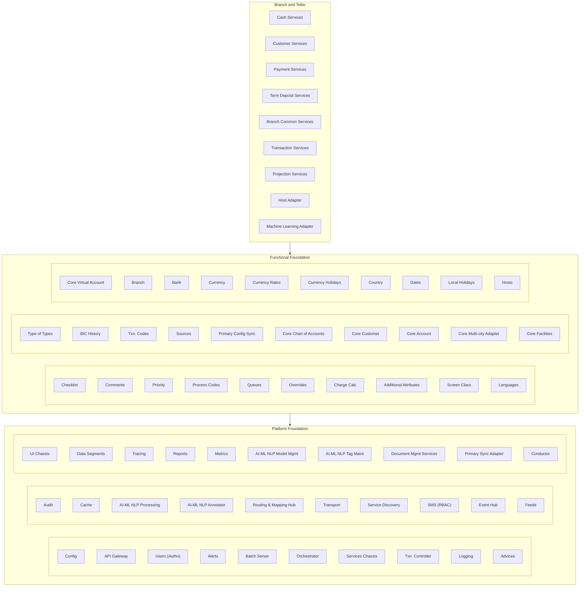

# Oracle Banking Microservices Architecture (OBMA): A Comprehensive Guide

> **Author:** Jack Liu Shurui — Solution Architect at Cymbal Bank, Singapore  
> **Context:** Core Banking Platforms / Cloud-Native Banking — Microservices Architecture, Oracle Cloud Infrastructure (OCI), Product Factory, Event-Driven Banking, Vendor Comparison  
> **Repository:** [github.com/jackliusr/research](https://github.com/jackliusr/research)  
> **Last Updated:** August 2026

---

## Table of Contents

1. [What Is Oracle Banking Microservices Architecture?](#1-what-is-oracle-banking-microservices-architecture)
2. [The Evolution: FLEXCUBE → Oracle Banking Platform → OBMA](#2-the-evolution-flexcube--oracle-banking-platform--obma)
3. [The Oracle Banking Suite Around OBMA](#3-the-oracle-banking-suite-around-obma)
4. [OBMA Architecture](#4-obma-architecture)
5. [Typical OBMA Service Topology](#5-typical-obma-service-topology)
6. [The OBMA Service Catalog](#6-the-obma-service-catalog)
7. [The Product Factory Pattern](#7-the-product-factory-pattern)
8. [Event-Driven Architecture](#8-event-driven-architecture)
9. [API Strategy](#9-api-strategy)
10. [Key Banking Capabilities](#10-key-banking-capabilities)
11. [Deployment Model](#11-deployment-model)
12. [Sizing and Performance](#12-sizing-and-performance)
13. [Integration with the Oracle Ecosystem](#13-integration-with-the-oracle-ecosystem)
14. [Migration from FLEXCUBE](#14-migration-from-flexcube)
15. [Comparison with Other Core Banking Platforms](#15-comparison-with-other-core-banking-platforms)
16. [How OBMA Fits in a Bank's Architecture](#16-how-obma-fits-in-a-banks-architecture)
17. [Considerations Before Committing](#17-considerations-before-committing)
18. [Getting Started](#18-getting-started)
19. [Conclusion](#19-conclusion)

---

## 1. What Is Oracle Banking Microservices Architecture?

### 1.1 Definition and Positioning

**Oracle Banking Microservices Architecture (OBMA)** is Oracle's next-generation, cloud-native banking platform: a suite of domain-driven banking microservices designed to run on Oracle Cloud Infrastructure (OCI), delivered as containers orchestrated by Kubernetes, exposing everything through REST/OpenAPI interfaces, and communicating through events. It is the evolution of the **Oracle Banking Platform (OBP)** — the same business functionality re-architected from a Java-based service platform into a true cloud-native microservices suite.

Oracle positions OBMA as its answer to digital banking transformation: a **cloud-native core + digital channels + APIs** combination that lets banks of all sizes modernize without replacing their entire technology estate overnight. Rather than one monolithic product, OBMA is a **collection of banking microservices** — customer/party management, accounts, payments, loans, deposits, cards, limits and collateral, interest and fees, transactions, notifications, product factory, and more — each independently deployable, scalable, and upgradeable.

```
CHANNELS (OBDX, mobile/web/branch) │ APIs │ Partners
   →  API GATEWAY (Plato / OCI API Gateway)
   →  MICROSERVICES: Party │ Accounts │ Payments │ Loans │ Deposits │ Cards
                     Limits │ Interest/Fees │ Transactions │ Notifications
   →  PLATFORM FOUNDATION: OKE (Kubernetes) │ OCI Streaming │ OCI IAM │ Oracle DB
```

Key attributes of OBMA:

- **Microservices-based** — decomposed into domain services (party, account, payment, loan, deposit, card, limit, interest, fee, transaction, notification, product factory), not one deployable unit.
- **Cloud-native** — containerized (Docker), orchestrated (Kubernetes/OKE), API-first, event-driven, 12-factor designed, with horizontal scaling and managed OCI services underneath.
- **API-first** — every capability is a REST/OpenAPI service; the same APIs serve digital channels, partner ecosystems, core-to-core integration, and open banking.
- **Event-driven** — banking domain events (account opened, payment executed, limit breached) are published to a streaming event bus consumed by analytics, notifications, downstream systems, and third parties.
- **Product-factory based** — banking products (deposits, loans, cards) are modeled as data — product definitions and parameters — not hard-coded, enabling banks to launch new products in days rather than quarters.
- **Suite-oriented** — OBMA is the core engine inside a broader Oracle Banking suite that also includes digital channels (OBDX), a payments hub (Oracle Banking Payments), trade finance, limits and collateral, branch, and analytical applications (OFS).

### 1.2 Product Naming: OBP vs. OBMA vs. "Oracle Banking Microservices"

The naming has been a recurring source of confusion, so it is worth being precise:

| Name | What it is | Era |
|---|---|---|
| **Oracle Banking Platform (OBP)** | REST API-based banking services platform; Java-based, delivered on WebLogic/Exadata, API-first but not originally container-native. Launched ~2016–2017. | 2016–2020 |
| **Oracle Banking Microservices Architecture (OBMA)** | OBP re-architected as cloud-native microservices on OCI/Kubernetes; same domain model and product factory concept, new runtime. Release train 14.7+ (2023 onward). | 2020+ |
| **"Oracle Banking Microservices"** | Informal/family name for the OBMA-era products — e.g., "Oracle Banking Microservices Platform Foundation", "Oracle Banking Microservices Architecture" documentation family. Oracle's own docs use "Oracle Banking Microservices Architecture" as the umbrella and "Oracle Banking Microservices" as shorthand. | 2020+ |

Oracle's documentation organizes OBMA under `docs.oracle.com/en/industries/financial-services/microservices-common/` — the "microservices-common" library that hosts the shared platform foundation guides (Installer Guide, Configuration and Deployment Guide, Containerization Guide, Platform Foundation User Guide, Common Core User Guide, Getting Started with Oracle Banking Cloud Service).

A related but distinct term: **Oracle Banking Cloud Service (OBCS)** is the SaaS delivery of the Oracle Banking suite (including OBMA-based products) — Oracle-managed, multi-tenant-ready, running on OCI Gen 2 cloud. OBMA is the architecture; OBCS is the managed service wrapper around it.

### 1.3 Target Market

OBMA is aimed at:

- **Tier-1 and tier-2 banks modernizing their core** — banks with aging FLEXCUBE or other legacy cores that need API/digital capabilities without a big-bang replacement, and corporate/retail banks needing a full front-to-back suite (digital experience, core, payments, trade, limits, analytics) from one vendor.
- **Digital banks and neobanks** — new entrants (including MAS digital bank license holders in Singapore) that want a cloud-native, API-first core with fast product innovation.
- **Banks already on the Oracle stack** — FLEXCUBE users, Oracle Database shops, OCI adopters — where OBMA is a natural extension rather than a new vendor.

It is **not** aimed at microfinance institutions or small startups with minimal budgets and simple lending-only needs — open-source cores (Apache Fineract) or lightweight SaaS cores (Mambu) cover those better (see Section 15).

### 1.4 The Big Picture: OBMA in One Diagram

```
CHANNELS (OBDX, branch, partners)
   │ REST/OpenAPI (OAuth2, JWT, mTLS)
   ▼
API GATEWAY (Plato / OCI API Gateway) — authN/Z, rate limiting, routing
   │
   ▼
MICROSERVICES: Party │ Accounts │ Payments │ Loans │ Deposits │ Cards
               Limits │ Interest/Fees │ Transactions │ Notifications
   │
   ▼
EVENT BUS (OCI Streaming): account.opened │ payment.executed │ limit.breached
   │
   ├──► DATA LAYER: Oracle Database (incl. ATP) │ cache │ object storage
   ├──► ANALYTICS: OFSAA, OAC, data lake
   └──► DOWNSTREAM: SWIFT, RTGS, schemes, ERP
```

---

## 2. The Evolution: FLEXCUBE → Oracle Banking Platform → OBMA

### 2.1 Oracle FLEXCUBE: The Traditional Core

**Oracle FLEXCUBE** (Universal Banking / Investor Servicing / Lending) is Oracle's traditional core banking system, developed by Oracle Financial Services Software (OFSS). It has been the backbone of hundreds of banks — especially in Asia, the Middle East, Africa, and Eastern Europe — since the 1990s.

Characteristics:

- **Monolithic, on-premises** — a large Java/J2EE application server estate (WebLogic), typically on Exadata or Oracle Database on dedicated hardware.
- **Comprehensive functional coverage** — retail, corporate, trade, treasury, Islamic banking; deep parameterization of products, but the product model lives inside a large, tightly coupled schema.
- **Batch-centric** — heavy end-of-day (EOD) batch processing for interest, fees, accruals, and reporting; real-time capabilities exist but the platform's design is batch-era.
- **Screen-based UI, customization-heavy** — banker-facing screens (Oracle Forms heritage / web UI) rather than API-first; banks customize via code and extensive parameterization, which creates upgrade pain.

FLEXCUBE remains Oracle's workhorse core and is still sold and supported. But its architecture is not what digital transformation programs need: real-time APIs, channel agility, cloud elasticity, and fast product innovation are all hard to achieve inside a monolith built for a different era.

### 2.2 Oracle Banking Platform (OBP): API-First Banking Services

Oracle's response, launched around 2016–2017, was **Oracle Banking Platform (OBP)** — a new, separate product line (not a rewrite of FLEXCUBE) built from the ground up as **REST API-based banking services**. OBP was a Java platform delivered on WebLogic/Exadata but designed API-first: every function (party, account, payment, loan, product) was exposed as a REST service, consumable by channels and partners.

Key facts about OBP:

- **Domain services with a product factory** — OBP introduced the "product factory" concept: products defined via APIs as product definitions + parameters rather than code, enabling configurable deposits and loans.
- **Event-driven from the start** — OBP published domain events for integration and analytics.
- **Adopted by tier-1 banks** — notably KeyBank in the US (documented in a Celent case study) and various banks in India, the Middle East, and Africa.
- **Still heavy** — OBP ran on Java/WebLogic with a substantial footprint; it was "API-first" but not "cloud-native" in the container/Kubernetes sense.

OBP demonstrated the architecture Oracle believed in — domain services, APIs, product factory, events — but it was built before the container-native era matured and was deployed mostly on-premises.

### 2.3 OBMA: The Cloud-Native Re-Architecture

Starting around 2020, Oracle re-architected OBP as **Oracle Banking Microservices Architecture (OBMA)**: the same domain-driven banking functionality, re-platformed as a suite of microservices that are:

- **Containerized** — each service ships as a Docker image.
- **Orchestrated by Kubernetes** — deployed on Oracle Kubernetes Engine (OKE) in production.
- **Running on OCI** — compute, storage, network, database, streaming, and observability all drawn from OCI managed services (Gen 2 cloud).
- **Event-driven** — Oracle Streaming (Kafka-compatible) as the event backbone.
- **SaaS-deliverable** — packaged as **Oracle Banking Cloud Services**, Oracle's managed SaaS offering announced in February 2023.

Release numbering: OBMA products follow the Oracle Banking release train — 14.7 (2023), 14.8 (2024–2025), with subsequent releases continuing. Oracle's docs for OBMA (installer, configuration, containerization, user guides) all live under the `microservices-common` documentation family.

### 2.4 Why Oracle Re-Architected Instead of Incrementing

Oracle's reasoning (and the market reality) behind OBMA:

1. **Cloud demand** — banks increasingly mandate cloud-native, elastic, consumption-based platforms; OBP's WebLogic-centric runtime was a poor fit for Kubernetes-era cloud.
2. **Operational cost** — a microservices suite on managed OCI services (OKE, Autonomous Database, Streaming) lowers the bank's operational burden versus running a large WebLogic/Exadata estate.
3. **Faster innovation** — independent service deployment enables CI/CD per service and frequent release cycles instead of big-bang upgrades.
4. **Competitive pressure** — Temenos, Thought Machine, Mambu, and cloud-native challengers were all moving to cloud-native cores; Oracle needed a credible answer.
5. **SaaS economics** — Oracle wants the recurring SaaS revenue of Oracle Banking Cloud Services; true SaaS requires a multi-tenant-capable, container-native architecture.

The result: FLEXCUBE still serves the legacy core market, OBP serves banks that bought into API-first on-prem banking, and OBMA is Oracle's forward-looking, cloud-native platform for new and modernizing banks.

---

## 3. The Oracle Banking Suite Around OBMA

OBMA does not exist in isolation. It sits at the center of Oracle's broader banking suite, and many deployments combine several of these products.

### 3.1 Suite Map

```
Oracle Banking Suite
├── CORE (OBMA)             Party, Accounts, Payments, Loans, Deposits, Cards,
│                           Limits, Interest/Fees, Transactions, Notifications,
│                           Product Factory, Routing Hub
├── CHANNELS                OBDX (retail/corporate/Islamic digital banking)
│                           │ Oracle Banking Branch
├── PAYMENTS & TRADE        Oracle Banking Payments (hub) │ Virtual Account
│                           Management │ Trade Finance (OBTF)
├── RISK & LIMITS           Enterprise Limits & Collateral Management (OBELM)
│                           │ Credit Facilities Process Management
├── ORIGINATION & COLLECTIONS  Enterprise Originations │ Enterprise Collections
├── ANALYTICS (OFS)         OFSAA — risk, finance, compliance
└── DELIVERY                Oracle Banking Cloud Service (SaaS)
                            │ Oracle Banking APIs (API catalog)
```

### 3.2 Digital Channels: Oracle Banking Digital Experience (OBDX)

**Oracle Banking Digital Experience (OBDX)** is Oracle's digital banking channel platform: a SaaS, cloud-native engagement layer for retail, business, corporate, and Islamic banking. It provides ready-to-go mobile, internet, and (with Oracle Banking Branch) branch experiences, API- and mobile-first, with AI/ML-powered personalization baked in. OBDX integrates with a bank's existing core — FLEXCUBE, OBMA, or a third-party core — via APIs; it is commonly sold standalone against legacy cores.

### 3.3 Payments Hub: Oracle Banking Payments

**Oracle Banking Payments** (a.k.a. OBPM — not to be confused with OBP, the platform) is Oracle's payments hub: single-platform processing for domestic, cross-border, and real-time payments with ISO 20022 support, payment orchestration, routing, sanctions screening hooks, and connectivity to schemes (SWIFT, SEPA, FAST, FedNow, etc.). It follows the payments-hub pattern described in the repo's `payments_hub_guide.md`. In an OBMA deployment, the OBMA payments service handles the account side (initiation, authorization, posting) while the hub handles scheme connectivity and clearing/settlement.

### 3.4 Other Suite Products

- **Oracle Banking Virtual Account Management** — virtual account/IBAN management for corporate receivables reconciliation (a companion to corporate DDA accounts in OBMA's accounts service).
- **Oracle Banking Trade Finance (OBTF)** — letters of credit, guarantees, documentary collections, supply chain finance; integrates with OBMA limits/collateral and ELCM.
- **Oracle Banking Enterprise Limits & Collateral Management (OBELM, formerly ELCM)** — enterprise-wide limit and collateral management: facility limits, utilization tracking, collateral valuation/allocation; the OBMA limits/collateral microservice provides real-time limit checks inside transaction flows.
- **Oracle Banking Credit Facilities Process Management** — credit facility lifecycle (sanction → utilization → review).
- **Oracle Banking Branch** — branch and back-office servicing for the digital-era branch (paperless, assisted digital).
- **Oracle Banking Enterprise Originations / Collections** — loan origination workflow and collections/recovery.
- **Oracle Financial Services (OFS) analytical applications (OFSAA)** — the analytics layer: regulatory risk (Basel/IFRS 9), finance (GL, reconciliation), compliance (AML/FCC), and customer analytics, built on the Oracle Financial Services Data Foundation (OFSDFM — see `data_models_banking_insurance_guide.md`).
- **Oracle Banking Cloud Service** — the SaaS delivery vehicle (Section 11).
- **Oracle Banking APIs** — the API catalog and developer experience for the suite (Section 9).

### 3.5 Where OBMA Fits in the Suite

The suite boundary is a sales/architecture decision per bank:

- **Full front-to-back on Oracle** — OBDX (channels) + OBMA (core) + Oracle Banking Payments (hub) + OBTF (trade) + OBELM (limits) + OFSAA (analytics) — the "Oracle Banking Cloud Services" story.
- **Core-only modernization** — OBMA as the new digital core behind existing channels, with FLEXCUBE or another core retained for specific books (Section 14).
- **Payments-focused or channels-first** — Oracle Banking Payments as a standalone hub around a non-Oracle core; or OBDX alone against FLEXCUBE, adding OBMA later.

---

## 4. OBMA Architecture

### 4.1 Design Principles

OBMA's architecture rests on a consistent set of principles:

| Principle | What it means in OBMA |
|---|---|
| **Domain-driven** | Services are organized around banking domains (party, account, payment, loan, deposit, limit), each owning its data and business rules. |
| **API-first** | Every service exposes REST/OpenAPI endpoints; APIs are the primary integration contract. |
| **Event-driven** | Services communicate facts (events) asynchronously via a streaming bus; no hard-wired point-to-point integration. |
| **Container-native** | Docker images + Kubernetes (OKE) as the unit and runtime of deployment. |
| **12-factor** | Config via environment, stateless service instances, backing services as managed OCI resources, disposable processes, log streams, etc. |
| **Multi-tenancy-ready** | The platform supports tenant isolation for SaaS-style delivery (Oracle Banking Cloud Service) as well as single-tenant deployments. |
| **Product-factory** | Products are data (definitions + parameters), enabling configuration over coding. |
| **Oracle-native** | Deep integration with Oracle Database, OCI services, and the broader Oracle Financial Services ecosystem. |




### 4.2 Microservices on OCI: The Platform Stack

OBMA services run on a standard OCI platform stack:

```
┌───────────────────────────────────────────────────────────────┐
│  OBMA MICROSERVICES (Docker images, Java/Jakarta EE runtime)  │
├───────────────────────────────────────────────────────────────┤
│  ORCHESTRATION    OKE (Kubernetes) │ ingress/routing          │
│  DATA             Oracle DB (Autonomous/Exadata) │ Redis cache│
│                   │ OCI Object Storage                        │
│  MESSAGING        OCI Streaming (Kafka-compatible) │ Events   │
│  EDGE/SECURITY    OCI API Gateway │ OCI IAM │ certificates    │
│  OBSERVABILITY    OCI Logging/Monitoring │ Vulnerability      │
│                   Scanning │ Audit │ Bastion                   │
│  COMPUTE/NETWORK  OCI Compute │ VCN │ Load Balancer │         │
│                   FastConnect/VPN                              │
└───────────────────────────────────────────────────────────────┘
```

Key platform choices:

- **Runtime** — Java-based microservices (the OBMA services are Java/Jakarta EE applications packaged as containers), deployed as Kubernetes workloads.
- **Database** — Oracle Database as the system of record; Autonomous Database (ATP/ADW) for managed deployments, Exadata for high-end on-prem/co-managed. Schema-per-service or shared-schema patterns depending on the service and deployment (Section 5.3).
- **Streaming** — OCI Streaming (Kafka-compatible API) as the event bus; OCI Events/Notifications for infrastructure events.
- **Gateway** — Oracle's OBMA "Plato" API gateway component (plato-apigateway-router) and/or OCI API Gateway at the edge.
- **Identity** — OCI IAM for platform identity; the OBMA security services (Security Management Service, "SMS") for application-level authentication/authorization (OAuth2/JWT).
- **Observability** — OCI Logging/Monitoring, plus OBMA audit trails; Grafana/Prometheus patterns are common in reference architectures.

### 4.3 Containerization and Orchestration

Oracle publishes a **Containerization Guide** for OBMA products covering how to build Docker images for each service and deploy them into Docker or a Kubernetes cluster. The production reference is **OKE**:

- Each OBMA product/service maps to one or more container images; Kubernetes Deployments/StatefulSets, Services, ConfigMaps/Secrets (or Vault-style secret management) provision the runtime.
- Horizontal autoscaling via HPA based on CPU/memory/custom metrics; rolling updates and rollbacks enable per-service CI/CD.
- Persistent state stays in Oracle Database (managed outside the cluster), keeping pods effectively stateless.

### 4.4 API-First Design

All OBMA functionality is exposed as REST APIs defined with OpenAPI specifications. The API layer is the contract between channels (OBDX, branch) and the core, partners/third parties (open banking), the bank's own integration layer (ESB/API management), and other Oracle Banking products (payments hub, trade finance). Oracle's API management capabilities (OCI API Gateway, Oracle API Platform) sit in front for throttling, key management, and analytics. The API strategy is detailed in Section 9.

### 4.5 Event-Driven Design

OBMA services publish and consume domain events through a streaming backbone (OCI Streaming). Events are the integration mechanism for decoupled service-to-service communication (e.g., a payment event triggering limit utilization and notification updates), analytics and reporting (OFSAA, data lake), downstream integration (SWIFT confirmations, ERP, data warehouse), and partner/webhook-style integration. Section 8 covers the event model in depth.

### 4.6 12-Factor and Cloud-Native Practices

OBMA follows 12-factor practice: one codebase per service with per-service CI/CD; dependencies declared in container images (scanning via OCI Vulnerability Scanning); environment-driven config (Kubernetes ConfigMaps/Secrets, `-D` parameters); backing services (Oracle DB, OCI Streaming, OCI Cache, Object Storage) attached as managed resources; immutable images promoted dev → test → prod; stateless pods with state in the database; port binding via Kubernetes services; horizontal scaling per service (HPA); fast startup/shutdown with graceful drain and idempotent event handling; dev/prod parity; structured logs to stdout → OCI Logging; and migration/batch jobs run as Kubernetes Jobs rather than ad-hoc processes.

### 4.7 Multi-Tenancy

OBMA supports multi-tenancy in two modes:

1. **SaaS-style multi-tenancy (Oracle Banking Cloud Service)** — Oracle operates shared infrastructure; tenants (banks) are isolated at the database/schema and identity levels. Oracle announced Oracle Banking Cloud Services in February 2023 as a cloud-native SaaS suite for corporate and retail banking, with Oracle responsible for patching, upgrades, and platform operations.
2. **Single-tenant deployments** — a bank runs its own OBMA estate on OCI (or on-prem) with full control; tenancy isolation is a non-issue.

Even in single-tenant mode, the platform's internal tenant/legal-entity model supports **multi-entity banking** — multiple legal entities, branches, currencies, and languages within one deployment (Section 10.11).

---

## 5. Typical OBMA Service Topology

### 5.1 Reference Topology

```
CHANNELS / PARTNERS
   →  API GATEWAY (Plato / OCI API Gateway — SSL, OAuth2)
        ├──► BUSINESS SERVICES: Party │ Account │ Payment │ Loan │ Deposit
        │       Card │ Limits │ Interest/Fees │ Transactions │ Notifications
        │       Product Factory
        └──► FOUNDATIONAL SERVICES: SMS (security) │ CMC (common core)
                MOC (master data) │ Routing Hub │ Document Generation
                    │                        │
   ORACLE DATABASE ◄─┴─► EVENT BUS (OCI Streaming) ──► CONSUMERS
   (service schemas +      (domain events)             analytics (OFSAA),
    shared core)                                       data lake, notifications,
                                                       third parties
```

### 5.2 Foundational Services

Oracle's installer documentation describes a typical OBMA installation as deploying a set of foundational components — named in the docs as **Plato, SMS, CMC, MOC, Party, and Oracle Banking Routing Hub** — distributed across managed servers for load balancing. These map to:

| Component | Role |
|---|---|
| **Plato** | OBMA's API gateway/router (`plato-apigateway-router`); terminates SSL, routes API calls to services, provides the gateway URL consumed by channels (e.g., AppShell → api-gateway over HTTPS). |
| **SMS (Security Management Service)** | Application security: user/role management, authentication, token validation (OAuth2/JWT), authorization enforcement. |
| **CMC (Common Core / Central Maintenance & Control)** | Common maintenance: shared reference data, parameters, common utilities used by all business services. |
| **MOC (Master data / Maintenance & Operations Center)** | Master data management and common configuration for the platform. |
| **Party** | The party/customer domain service (party = customer, KYC, relationships, 360 view) — the foundation of the customer-centric model. |
| **Oracle Banking Routing Hub** | Message routing/brokerage between services and external systems; a hub-and-spoke integration component (payments routing, message translation). |
| **Platform Foundation** | The shared base: common API framework, error handling, audit, logging, configuration, security plumbing — documented as "Oracle Banking Microservices Platform Foundation". |
| **Common Core** | The shared banking utilities/domain helpers used across services ("Oracle Banking Common Core User Guide" exists separately). |
| **Document Generation Service** | Reporting subdomain: account statements and advices (print/email) via uploaded templates (Report Services module). |

In containerized deployments, each of these ships as images deployed to OKE; in classic on-prem deployments they run as WARs on WebLogic managed servers.

### 5.3 Data Layer

OBMA's data layer combines:

- **Oracle Database (system of record)** — account balances, transactions, party records, product definitions, limits. Deployments use Autonomous Database (managed) or Exadata (high-end/on-prem).
- **Schema strategy** — a mix: business services own their schemas (domain ownership), while common/shared data (master data, security, product definitions) lives in shared schemas; the Common Core provides the shared data services. In multi-tenant SaaS mode, tenant isolation is typically schema- or database-per-tenant.
- **Cache** — Redis-compatible caching (OCI Cache) for session/balance reads, product parameters, and rate lookups to keep API latency low.
- **Event streaming** — OCI Streaming holds the event bus; events also feed the data lake for analytics (OFSAA, OCI Data Lake, Object Storage).
- **Object storage** — statements, advices, documents (from Document Generation Service), files.

### 5.4 Request Flow Through the Topology

A typical flow — "customer opens a savings account and funds it":

1. **Channel** (OBDX mobile app) calls the API gateway (`POST /accounts`) with an OAuth2 bearer token.
2. **Plato/OCI API Gateway** validates the token (SMS), applies rate limits, routes to the **Accounts** service.
3. **Accounts service** validates against the **Product Factory** (product definition for the savings product: min balance, interest rate tier, fees), checks **Party** (customer exists, KYC status), and checks **Limits** if needed.
4. Accounts creates the account record (Oracle Database) and publishes `account.opened` to the **event bus**.
5. The **Payments/Transactions** service debits the funding account, posts entries, publishes `transaction.posted`.
6. Consumers react asynchronously: **Notifications** sends the welcome SMS/email; **OFSAA** ingests the event into analytics; the **Routing Hub** forwards a confirmation to an external system.
7. All steps write audit entries (Compliance-ready audit trail).

---

## 6. The OBMA Service Catalog

OBMA is a family of products/services rather than a single binary. The following catalog reflects the documented OBMA service domains (product names vary slightly by release and deployment; Oracle groups several under "Oracle Banking Microservices" product family).

### 6.1 Customer and Party Domain

| Service | Capabilities |
|---|---|
| **Party Management** | Party (customer) lifecycle: create/update/merge parties; customer onboarding with KYC; customer 360 view; segmentation; party relationships (individual, joint, group, corporate structures, authorized signatories); address, contact, and identification management. |
| **KYC/Compliance hooks** | Integration points for KYC/AML screening (name screening, sanction checks via external providers or Oracle's own), document collection, risk rating. |

### 6.2 Accounts Domain

| Service | Capabilities |
|---|---|
| **Accounts (Deposits/Current)** | Current accounts (CASA: current + savings), account lifecycle (open, activate, hold, freeze, close), account hierarchies (parent/child, house accounts), standing instructions, account preferences, balance inquiry, overdraft-linked accounts. |
| **Account services APIs** | Open/close/amend accounts, balance/transaction queries, holds/liens, interest-bearing account configurations (via product factory). |

### 6.3 Payments Domain

| Service | Capabilities |
|---|---|
| **Payments** | Payment initiation (single/bulk), domestic and international payments, real-time payments, payment orchestration, payment standing orders, direct debits, payment templates, beneficiary management. |
| **ISO 20022** | Support for pain (initiation), pacs (clearing), camt (statement/report) message families; format transformation for schemes and SWIFT. |
| **Routing Hub** | Route payments to the right rail (FAST/SEPA/ACH/SWIFT/RTGS) and integrate with Oracle Banking Payments hub for scheme connectivity (Section 13.2). |

### 6.4 Lending Domain

| Service | Capabilities |
|---|---|
| **Loans** | Retail loans (personal, mortgage, auto), SME/corporate lending; loan lifecycle: origination → approval → disbursement → repayment → closure; amortization schedules (equal installment, bullet, custom); interest calculation (fixed/floating, simple/compound); fees and penalties; rescheduling/restructuring; prepayment; collections integration. |
| **Credit Facilities** | Facility lifecycle (sanction, utilization, review) — often via Oracle Banking Credit Facilities Process Management, integrated with limits. |

### 6.5 Deposits Domain

| Service | Capabilities |
|---|---|
| **Term Deposits** | Fixed/term deposit products: booking, rollover (auto-renewal), maturity handling, premature withdrawal, interest accrual and postings, deposit certificates; recurring deposits. |

### 6.6 Cards Domain

| Service | Capabilities |
|---|---|
| **Cards** | Card lifecycle (plastic and virtual), card products (debit/credit/prepaid), card limits, card management APIs (issue, activate, block, replace, PIN), card transactions (authorizations, settlement), card-to-account linkage. |

### 6.7 Limits and Collateral Domain

| Service | Capabilities |
|---|---|
| **Limits** | Enterprise limits: customer limits, product limits, facility limits, utilization tracking; real-time limit checks in transaction flows (pre- and post-transaction). |
| **Collateral** | Collateral types, valuation, allocation to facilities, margin tracking; integrates with OBELM for enterprise-wide collateral management. |

### 6.8 Interest, Fees, and Pricing Domain

| Service | Capabilities |
|---|---|
| **Interest & Fee Management** | Interest engines: product-specific rates, tiered rates, penalty rates; accrual and posting; fee engine: fee types (flat, percentage, tiered), waivers, minimum/maximum, fee posting events. Pricing is defined at product level via the product factory. |

### 6.9 Transactions Domain

| Service | Capabilities |
|---|---|
| **Transactions** | Transaction capture (teller, channel, API), posting (real-time and batch), balances (available/ledger/cleared), transaction history, audit, reversals, transaction enrichment. |

### 6.10 Notifications Domain

| Service | Capabilities |
|---|---|
| **Notifications** | Real-time alerts (SMS, email, push), event-triggered notifications (transaction alerts, balance alerts, payment status), preference management, delivery channel management. |

### 6.11 Platform and Common Services

| Service | Capabilities |
|---|---|
| **Product Factory** | Product definition, configuration, and lifecycle (Section 7). |
| **Security Management (SMS)** | Identity, authentication (OAuth2/JWT), authorization, user/role management. |
| **Common Core / Platform Foundation** | Shared reference data, common utilities, API framework, audit, error handling. |
| **Routing Hub** | Inter-service and external message routing/translation. |
| **Document Generation** | Statements, advices, report templates. |
| **Reporting** | Operational and regulatory reporting services; integration to OFSAA for analytics. |

---

## 7. The Product Factory Pattern

### 7.1 What the Product Factory Is

The **product factory** is arguably the most distinctive idea in Oracle's banking platform architecture (inherited from OBP and carried into OBMA). It is a microservice/component that **creates and configures banking products as data**, instead of products being implemented as code.

In traditional cores, a new deposit product typically means new parameter tables, new code paths, new GL mappings, testing, and a release — months of work. In the product factory, a product is a **definition**: a set of parameters (pricing, interest rules, fees, limits, tenors, GL accounts, regulatory attributes) assembled through APIs.

### 7.2 Products as Data, Not Code

```
Traditional core:                       Product factory:
  product = code + tables                product = data (definition + parameters)
  new product = dev + test + release     new product = configure + activate via API

Product definition:
┌───────────────────────────────────────────────────────────────┐
│  PRODUCT: "Savings Plus SGD"                                  │
│  ├── Type: Savings account │ Currency: SGD                    │
│  ├── Pricing: tiered interest (0.05% <10k · 0.15% 10k–50k ·   │
│  │            0.25% >50k), min balance SGD 1,000              │
│  ├── Fees: monthly fee waived if balance > 5k; fallback fee   │
│  ├── Limits: daily ATM SGD 3,000 · transfer limit 10k         │
│  ├── Interest: daily accrual, monthly posting, simple         │
│  ├── GL mapping: liability 210101 · fee income 410050         │
│  ├── Regulatory: MAS savings product, withholding-tax flag    │
│  └── Lifecycle: draft → approved → active → retired           │
└───────────────────────────────────────────────────────────────┘
```

The product factory covers deposit, loan, and card products (and their pricing components — interest, fees, limits), so a bank can model:

- savings/current accounts with tiered interest and fee schedules;
- term deposits with tenors, rollover rules, and penalty rates;
- loan products with amortization types, rate basis (fixed/floating), fees, and collections parameters;
- card products with limits, billing cycles, and reward parameters.

### 7.3 Product Lifecycle

A product moves through a defined lifecycle:

```
Define product  →  Configure parameters  →  Approve  →  Offer to customer  →  Activate  →  Retire
   (product         (pricing, fees,        (maker-     (available in         (usable by   (closed to
    factory API)     limits, GL, regs)      checker)    catalog/APIs)         accounts)     new sales)
```

Steps in practice:

1. **Define** — the bank's product team creates a product definition in the product factory (API or maintenance UI).
2. **Configure** — interest rules, fee schedule, limits, GL mappings, documents, regulatory attributes are set as parameters.
3. **Approve** — maker-checker authorization (a compliance staple in Oracle Banking products) activates the definition.
4. **Offer** — the product appears in the product catalog consumed by channels (OBDX) and by account-opening flows.
5. **Activate/use** — customer accounts are created against the product; the runtime engines (interest, fees, limits) read the parameters at execution time.
6. **Retire** — product closed to new sales; existing accounts continue per terms.

### 7.4 Why It Matters: Speed of Innovation

The product factory's business value is **time-to-market for product innovation**:

- Launch a new deposit promotion in **days** — configure parameters, approve, activate; no code release.
- Run product experiments (pricing changes, tier changes) by amending parameters with full audit.
- Standardize products across entities/currencies while allowing local variation (SGD vs. USD savings, Singapore vs. Hong Kong pricing) through parameterization rather than forked code; parameter-driven products also survive platform upgrades better than customized code.

The flip side: heavy parameterization is itself a skillset — banks need product analysts who can model banking products in the factory, and mis-parameterized products create operational risk. Oracle's implementation partners (Accenture, Deloitte, etc.) and Oracle Consulting provide product-factory modeling accelerators.

---

## 8. Event-Driven Architecture

### 8.1 Banking Events

OBMA treats significant state changes as first-class **domain events** published to an event bus. Examples:

- `customer.created`, `customer.kyc.completed`, `customer.merged`
- `account.opened`, `account.closed`, `account.held`, `balance.changed`
- `payment.initiated`, `payment.executed`, `payment.rejected`, `payment.settled`
- `loan.disbursed`, `loan.repaid`, `loan.rescheduled`, `loan.defaulted`
- `deposit.booked`, `deposit.matured`, `deposit.rolledOver`
- `limit.utilized`, `limit.breached`, `collateral.revalued`
- `card.issued`, `card.authorization.approved`, `card.blocked`
- `fee.posted`, `interest.accrued`, `notification.sent`

### 8.2 Event Types and Taxonomy

| Event type | Description | Examples |
|---|---|---|
| **Domain events** | Business facts from core domains: account, customer, payment, loan, deposit, limit, card | `account.opened`, `loan.disbursed`, `limit.breached` |
| **Command/result events** | Async request/response patterns between services (long-running operations) | payment orchestration steps, approval workflows |
| **Infrastructure events** | Platform-level facts (via OCI Events) | deployment completed, backup succeeded, alert fired |
| **Outbox events** | Reliably published domain events (transactional outbox pattern) for downstream systems | every domain event above, guaranteed order per aggregate |

### 8.3 Event Bus and Streaming

The event backbone is **OCI Streaming** — Oracle's Kafka-compatible managed streaming service — complemented by OCI Events/Notifications for platform events. Characteristics:

- **Publish/subscribe** — services publish events; any number of consumers subscribe (fan-out), so new consumers (analytics, partners) do not require changes to producers.
- **Ordering and replay** — Kafka-style partitioning provides per-key ordering (e.g., per account); consumers can replay events (important for data-lake loads and recovery).
- **Reliability** — the transactional outbox pattern (event written with the business transaction, then published) avoids lost events — a must for a bank's data integrity.
- **Integration with Oracle stack** — OCI Streaming integrates with OCI Service Connector Hub for routing events to Object Storage, Functions, or analytics services.

### 8.4 Consumers of the Event Stream

| Consumer | What it does with events |
|---|---|
| **Analytics (OFSAA, OAC)** | Ingest account/payment/loan events into the analytical data model for risk, finance, and customer analytics. |
| **Notifications** | Trigger real-time alerts (SMS/email/push) — payment executed, balance threshold, card authorization. |
| **Data lake / warehouse** | Feed OCI Data Lake / Object Storage for reporting, regulatory (BCBS 239) data aggregation, and ML feature stores. |
| **Downstream systems** | SWIFT/RTGS confirmations, ERP, CRM, credit bureaus, treasury systems. |
| **Third parties** | Webhook-style notifications to partners (open-banking callbacks, corporate clients' systems). |
| **Other OBMA services** | Decoupled internal workflows — e.g., a payment event triggers limit utilization and fee postings. |

### 8.5 Benefits

- **Decoupling** — services evolve independently; producers don't know their consumers.
- **Real-time analytics** — analytics consume the same events the core produces, with no batch ETL lag.
- **Integration** — one event contract replaces dozens of point-to-point interfaces; new integrations are subscriber-only changes.
- **Audit, replay, and resilience** — the event log is itself an audit trail and recovery source; consumers can lag without blocking the core.

The event model is the same architectural pattern described in the repo's `event_stream_processing_guide.md` and `complex_event_processing_guide.md` — OBMA is a concrete banking instance of it.

---

## 9. API Strategy

### 9.1 REST/OpenAPI Everywhere

Every OBMA capability is a REST API defined with OpenAPI (Swagger) specifications. Channels (OBDX, branch, partner apps) consume the same APIs as internal systems; contracts are versioned and published; the API gateway (Plato/OCI API Gateway) provides the single entry point with security, throttling, and routing.

### 9.2 API Catalog and Versioning

- **Oracle Banking APIs** — Oracle publishes API catalogs for the banking suite (and, in Oracle Banking Cloud Service, an API catalog per product) with interactive documentation, sample requests, and sandboxes.
- **Versioning** — APIs are versioned (e.g., `/v1`, `/v2`); OBMA supports multiple versions concurrently so clients migrate at their own pace; Oracle maintains backward compatibility within a release train, with breaking changes introduced in major versions under deprecation windows.

### 9.3 Open Banking and Partner Enablement

OBMA's API-first design is the natural substrate for open banking:

- **PSD2 (Europe)** — AISP/PISP flows: account information (AIS) and payment initiation (PIS) APIs; strong customer authentication (SCA) hooks.
- **Open Banking UK** — the CMA open banking API standards (account and payment APIs with FAPI security profile).
- **Singapore** — MAS' SGFinDex / open-API approach for financial data sharing; OBMA's API layer supports the authorization-consent patterns (OAuth2 with consents) these regimes require.
- **Partner ecosystems** — banks expose product/account/payment APIs to fintech partners, corporates (virtual accounts, reconciliation APIs), and marketplaces.

### 9.4 API Security

| Control | OBMA practice |
|---|---|
| **Authentication** | OAuth2 bearer tokens / JWT; OCI IAM and OBMA Security Management Service (SMS) validate tokens; client credentials flow for server-to-server. |
| **Authorization** | Scopes, roles, and consent-based access (open banking consent tokens); fine-grained entitlements per API and resource (e.g., account-level consent). |
| **Transport** | mTLS for server-to-server and scheme connections; TLS 1.2+ everywhere; the API gateway terminates SSL. |
| **API gateway protections** | Rate limiting, throttling, WAF-style filtering, IP allowlists, request signing. |
| **Audit** | Full API call audit (who, what, when, consent) — required for PSD2/TRM compliance and internal risk. |

### 9.5 What API-First Enables

1. **Channel integration** — mobile/web/branch/ATM built once against APIs, reused across channels.
2. **Partner ecosystems** — third-party products (fintech apps, corporate integrations) consume the bank's APIs under governance.
3. **Core-to-core integration** — OBMA APIs let a bank run OBMA alongside FLEXCUBE (or another core) with API-mediated synchronization (Section 14).
4. **Testability and automation** — OpenAPI specs drive contract testing, mock services, and CI/CD pipeline checks.
5. **Future-proofing** — the API layer is the bank's digital asset: new channels and partners plug in without core changes.

---

## 10. Key Banking Capabilities

This section details the functional depth of OBMA's services. For the underlying data-model context (party structures, account hierarchies, product/account relationships), see the repo's `data_models_banking_insurance_guide.md`.

### 10.1 Customer/Party Management

- **Onboarding with KYC** — party creation, identity verification, KYC data capture, risk rating, document management; workflow with maker-checker.
- **Customer 360** — unified view of a party across accounts, loans, cards, deposits, limits, and interactions — the foundation of relationship banking and cross-sell.
- **Segmentation** — customer segments (retail, affluent, SME, corporate) driving product eligibility, pricing, and servicing rules.
- **Party relationships** — individual/joint, group structures, corporate hierarchies (parent/subsidiary), account holders vs. authorized signatories vs. beneficial owners; relationship-based servicing (e.g., one customer's exposure aggregated across entities).
- **Multiple identifiers** — NRIC/passport/UEN, tax IDs, customer numbers per entity — mapping to a global party ID.

### 10.2 Account Management

- **Current/savings accounts** — CASA with full lifecycle: open, activate, hold/freeze, lien, close; minimum balance rules; overdraft facility linkage.
- **Account lifecycle states** — draft → active → dormant → closed, with regulatory (e.g., MAS dormancy/unclaimed monies) handling hooks.
- **Account hierarchies** — house accounts, sub-accounts, sweeping/aggregation structures; parent-child relationship for corporate structures.
- **Standing instructions** — recurring transfers, bill payments, sweep rules (e.g., sweep excess balance to term deposit).
- **Balances** — ledger, available, cleared, float; real-time balance inquiries; balance events for notifications.

### 10.3 Payments

- **Domestic payments** — SEPA (EUR), ACH/NETS-style, FAST (Singapore's real-time rail), local RTGS; country-specific schemes via adapters.
- **International** — SWIFT (MT and ISO 20022), cross-border payments, correspondent banking, FX-in-payment.
- **Real-time payments** — FAST, SEPA Instant, FedNow, UPI-style rails — with the 24/7 processing and immediate confirmation the rails require (see `payments_hub_guide.md` for the hub pattern and rail orchestration).
- **Payment orchestration** — multi-step flows (validate → authorize → debit → route → submit → confirm → post), state machine per payment, retries, timeouts, reconciliation.
- **Bulk payments** — file-based (pain.001, NACHA-style) and API bulk initiation with error handling and partial execution.
- **Direct debits** — mandate management, collections (pain.008/pacs.003), return handling.
- **Payment standing orders** — recurring payment templates and execution.
- **ISO 20022** — pain/pacs/camt message families, transformation, enrichment, scheme-specific variants.

### 10.4 Loans

- **Retail loans** — personal, mortgage, auto; **SME/corporate lending** — term loans, working capital, facilities.
- **Loan lifecycle** — origination → approval → disbursement → servicing → repayment → closure; integration with origination platforms (Oracle Banking Enterprise Originations) and credit decisioning.
- **Interest calculation** — fixed/floating rates, simple/compound, daily/monthly basis, rate re-pricing (SOFR/SORA-linked), caps/floors.
- **Amortization schedules** — equal installment, bullet, interest-only, custom schedules; schedule regeneration on rate changes/rescheduling.
- **Fees/penalties** — arrangement fees, late-payment penalties, prepayment fees; waiver processing.
- **Rescheduling/restructuring** — payment holidays, tenor extension, rate changes; collections integration for arrears (Oracle Banking Enterprise Collections).

### 10.5 Deposits

- **Term deposits** — fixed deposits with tenor/rate combinations, rollover instructions (auto-renew, maturity instructions), premature withdrawal with penalty logic, deposit certificates.
- **Recurring deposits** — periodic contributions with maturity payout.
- **Deposit lifecycle** — booking → accrual → maturity → payout/rollover; maturity events drive notifications and GL postings.
- **Interest accrual/postings** — daily accrual, periodic posting, compounding options; tax withholding where applicable.

### 10.6 Cards

- **Card lifecycle** — plastic and virtual cards; issue, activate, block, replace, expire; card status events.
- **Card products** — debit/credit/prepaid; linked to accounts or credit lines; card product parameters (limits, fees, rewards).
- **Card limits** — per-card and per-product transaction limits (ATM, POS, e-commerce, contactless).
- **Card transactions** — authorization requests, settlement, chargebacks hooks; integration with card schemes and processors.
- **Card management APIs** — cardholder self-service (block/unblock, change PIN, set limits) for OBDX integration.

### 10.7 Limits and Collateral

- **Enterprise limits** — customer limits (aggregate exposure), product limits, facility limits; limit hierarchies and utilization.
- **Limit monitoring/enforcement** — real-time limit checks inside transaction flows (pre-transaction validation, post-transaction utilization updates); limit breach events and alerts.
- **Collateral management** — collateral types (cash, property, securities, guarantees), valuation (initial, periodic, revaluation), allocation to facilities, margin shortfall handling; integrates with OBELM for enterprise coverage.

### 10.8 Interest and Fees

- **Interest engines** — product-specific rates, tiered rates (balance-based), penalty rates (overdraft, late payment); accrual methods and posting schedules; rate sources (benchmark-linked via rate tables).
- **Fee engine** — fee types (flat, percentage, tiered, minimum/maximum), fee events (account opening, monthly, transaction-based), waivers (campaign-based, relationship-based), fee posting and GL mapping; fee reversal/waiver audit.

### 10.9 Transactions

- **Transaction capture** — API, channel, teller, file; single and bulk; transaction validation (product rules, limits, balance).
- **Posting** — real-time posting with double-entry integrity; intraday and batch posting; reversal and correction handling.
- **Balances** — ledger/available/cleared balance maintenance; balance inquiries.
- **Transaction history** — full history with enrichment (merchant, category), statement generation (via Document Generation Service).
- **Audit** — immutable audit trail of transactions and admin actions (maker-checker), satisfying MAS/regulatory audit expectations.

### 10.10 Notifications

- **Real-time alerts** — SMS, email, push; triggered by events (transaction alerts, balance thresholds, payment status, card usage, limit breach).
- **Event-triggered** — notifications subscribe to the event bus (Section 8) — no point-to-point wiring from core services.
- **Preference management** — per-customer channel/opt-in preferences; regulatory opt-in/opt-out handling.

### 10.11 Multi-Currency, Multi-Entity, Multi-Lingual, Multi-Country

OBMA is built for global banks:

- **Multi-currency** — accounts and products in any currency; currency-specific product parameters; FX conversion in payments and sweeps.
- **Multi-entity** — multiple legal entities (subsidiaries/branches) in one deployment; entity-specific products, GL, calendars, and holidays.
- **Multi-lingual** — language packs for channels and statements (multi-language advices), locale-aware formats.
- **Multi-country** — country-specific products, schemes (payments), regulatory attributes (tax, withholding, reporting), and calendars; enables a single platform for regional banks (e.g., a Southeast Asian bank covering SG/MY/ID/TH) with local configuration rather than local systems.

---

## 11. Deployment Model

### 11.1 Deployment Options

| Option | Who runs it | Description | Best for |
|---|---|---|---|
| **Oracle Banking Cloud Service (SaaS)** | Oracle | Oracle-managed SaaS on OCI Gen 2: platform, patching, upgrades, monitoring; bank consumes services and APIs | Digital banks, banks wanting to exit infrastructure ops, rapid time-to-market |
| **OCI IaaS (self-managed)** | Bank (with Oracle/partner) | OBMA deployed on the bank's OCI tenancy: OKE clusters, Autonomous DB/Exadata, Streaming, etc.; bank controls operations | Banks with cloud mandate and strong platform engineering; regulated entities needing control |
| **Hybrid (on-prem + cloud)** | Split | OBMA components on OCI + on-prem systems (FLEXCUBE, legacy) integrated via APIs/events; or OBMA on-prem (WebLogic-era install) with cloud channels | Banks mid-migration; coexistence phase (Section 14) |
| **Third-party cloud (limited)** | Bank | OBMA is designed for OCI; running it on AWS/Azure is not the supported path (Oracle positions OCI-native, and Oracle Banking Cloud Service is OCI-only). Containerized services could technically run elsewhere, but supported deployments assume OCI services (streaming, DB, gateway) | Not recommended |

Note: Oracle also documents classic (non-containerized) OBMA installations — WebLogic-managed servers with WARs (Plato, SMS, CMC, MOC, Party, Routing Hub) — for on-prem/hybrid customers; the forward-looking path is containerized on OKE.

### 11.2 Deployment Components on OCI

| Component | Role in an OBMA deployment |
|---|---|
| **OKE (Oracle Kubernetes Engine)** | Managed Kubernetes for all OBMA containers; autoscaling, rolling updates, node pools (incl. dedicated/GPU-free banking workloads) |
| **Oracle Database** | System of record: Autonomous Database (ATP/ADW) for managed/SaaS; Exadata Cloud Service for high-end; on-prem Exadata in hybrid |
| **OCI Streaming** | Kafka-compatible event bus for domain events |
| **OCI API Gateway** | Edge API management (with OBMA Plato gateway behind it) |
| **OCI IAM** | Identity for platform and users; federation with bank IdP (SSO) |
| **OCI Object Storage** | Statements, advices, files, backups, data-lake landing |
| **OCI Observability** | Logging, Monitoring, Alerting, Vulnerability Scanning, Audit, Bastion, Service Connector Hub |
| **OCI Network** | VCNs, subnets per tier, load balancers, FastConnect/VPN to bank DC, DNS/WAF |


  <svg xmlns="http://www.w3.org/2000/svg" viewBox="0 0 1000 850" width="100%" height="100%" font-family="Arial, sans-serif">
  <defs>
    <!-- Markers for arrows -->
    <marker id="arrow" viewBox="0 0 10 10" refX="6" refY="5" markerWidth="6" markerHeight="6" orient="auto-start-reverse">
      <path d="M 0 1 L 10 5 L 0 9 z" fill="#2d3748" />
    </marker>
    <marker id="arrow-start" viewBox="0 0 10 10" refX="4" refY="5" markerWidth="6" markerHeight="6" orient="auto-start-reverse">
      <path d="M 10 1 L 0 5 L 10 9 z" fill="#2d3748" />
    </marker>
    
    <!-- Shadow Filter -->
    <filter id="shadow" x="-5%" y="-5%" width="110%" height="110%">
      <feDropShadow dx="1" dy="2" stdDeviation="2" flood-opacity="0.1"/>
    </filter>
  </defs>

  <!-- Background / OCI Region -->
  <rect x="10" y="10" width="980" height="830" fill="#f5f5f5" stroke="#d0d0d0" stroke-width="1"/>
  <text x="15" y="30" font-size="14" font-weight="bold" fill="#1a1a1a">OCI Region</text>

  <!-- Availability Domain -->
  <rect x="140" y="25" width="790" height="800" fill="#eaeaea" stroke="#b0b0b0" stroke-width="1.5"/>
  <text x="535" y="45" font-size="14" font-weight="bold" fill="#333333" text-anchor="middle">Availability Domain</text>

  <!-- Fault Domains Background Columns -->
  <g fill="#f2f2f2" stroke="#b0b0b0" stroke-width="1">
    <rect x="150" y="55" width="250" height="760"/>
    <rect x="410" y="55" width="250" height="760"/>
    <rect x="670" y="55" width="250" height="760"/>
  </g>
  <text x="275" y="75" font-size="13" font-weight="bold" fill="#444" text-anchor="middle">Fault Domain</text>
  <text x="535" y="75" font-size="13" font-weight="bold" fill="#444" text-anchor="middle">Fault Domain</text>
  <text x="795" y="75" font-size="13" font-weight="bold" fill="#444" text-anchor="middle">Fault Domain</text>

  <!-- VCN Outline -->
  <rect x="35" y="80" width="935" height="735" fill="none" stroke="#a65628" stroke-width="1.5" stroke-dasharray="6,4"/>
  <text x="45" y="100" font-size="13" font-weight="bold" fill="#a65628">VCN</text>

  <!-- Subnet A (Public) -->
  <rect x="75" y="120" width="885" height="110" fill="none" stroke="#a65628" stroke-width="1.5" stroke-dasharray="6,4"/>
  <text x="85" y="140" font-size="13" font-weight="bold" fill="#a65628">Subnet A</text>
  <text x="85" y="156" font-size="13" font-weight="bold" fill="#a65628">(Public)</text>

  <!-- Subnet B (Private) -->
  <rect x="75" y="240" width="885" height="565" fill="none" stroke="#a65628" stroke-width="1.5" stroke-dasharray="6,4"/>
  <text x="85" y="260" font-size="13" font-weight="bold" fill="#a65628">Subnet B</text>
  <text x="85" y="276" font-size="13" font-weight="bold" fill="#a65628">(Private)</text>

  <!-- Container Engine for Kubernetes Border -->
  <rect x="155" y="270" width="755" height="430" fill="#ffffff" fill-opacity="0.6" stroke="#888888" stroke-width="1"/>
  <text x="165" y="290" font-size="13" font-weight="bold" fill="#222">Container Engine for Kubernetes</text>

  <!-- Outer Right Top Badges -->
  <g transform="translate(945, 60)">
    <!-- Security Group Icon 1 -->
    <circle cx="15" cy="15" r="14" fill="#ffffff" stroke="#a65628" stroke-width="1.5"/>
    <path d="M 15 6 L 23 11 V 18 C 23 23 15 26 15 26 C 15 26 7 23 7 18 V 11 Z" fill="none" stroke="#a65628" stroke-width="1"/>
    <circle cx="15" cy="13" r="2" fill="#a65628"/>
    <circle cx="11" cy="19" r="1.5" fill="#a65628"/>
    <circle cx="19" cy="19" r="1.5" fill="#a65628"/>
    <path d="M15 13 L11 19 M15 13 L19 19" stroke="#a65628" stroke-width="1"/>
  </g>
  <g transform="translate(945, 110)">
    <!-- Security Badge 2 -->
    <rect x="2" y="2" width="26" height="26" fill="#ffffff" stroke="#a65628" stroke-width="1.5" rx="3"/>
    <path d="M 15 6 L 22 10 V 16 C 22 20 15 23 15 23 C 15 23 8 20 8 16 V 10 Z" fill="none" stroke="#a65628" stroke-width="1"/>
    <line x1="11" y1="11" x2="19" y2="11" stroke="#a65628" stroke-width="1"/>
    <line x1="11" y1="14" x2="19" y2="14" stroke="#a65628" stroke-width="1"/>
    <line x1="11" y1="17" x2="15" y2="17" stroke="#a65628" stroke-width="1"/>
  </g>
  <g transform="translate(945, 230)">
    <!-- Security Badge 3 -->
    <rect x="2" y="2" width="26" height="26" fill="#ffffff" stroke="#a65628" stroke-width="1.5" rx="3"/>
    <path d="M 15 6 L 22 10 V 16 C 22 20 15 23 15 23 C 15 23 8 20 8 16 V 10 Z" fill="none" stroke="#a65628" stroke-width="1"/>
    <line x1="11" y1="12" x2="19" y2="12" stroke="#a65628" stroke-width="1"/>
    <line x1="11" y1="15" x2="19" y2="15" stroke="#a65628" stroke-width="1"/>
    <line x1="11" y1="18" x2="16" y2="18" stroke="#a65628" stroke-width="1"/>
  </g>

  <!-- K8s Icon Top-Right inside OKE -->
  <g transform="translate(885, 255)">
    <rect x="0" y="0" width="22" height="26" fill="#ffffff" stroke="#0072c6" stroke-width="1.5" rx="2"/>
    <path d="M 4 8 H 18 M 4 13 H 18 M 4 18 H 18" stroke="#0072c6" stroke-width="1.5"/>
    <rect x="8" y="2" width="6" height="4" fill="#0072c6"/>
  </g>

  <!-- Internet Gateway -->
  <g transform="translate(20, 160)">
    <circle cx="20" cy="20" r="16" fill="#ffffff" stroke="#1b6575" stroke-width="2"/>
    <path d="M 8 20 H 32 M 20 8 V 32 M 11 11 L 29 29 M 11 29 L 29 11" stroke="#1b6575" stroke-width="1.5"/>
    <circle cx="20" cy="20" r="6" fill="#ffffff" stroke="#1b6575" stroke-width="1.5"/>
    <text x="20" y="48" font-size="12" fill="#111" text-anchor="middle">Internet</text>
    <text x="20" y="62" font-size="12" fill="#111" text-anchor="middle">Gateway</text>
  </g>

  <!-- NAT Gateway -->
  <g transform="translate(20, 440)">
    <circle cx="20" cy="20" r="16" fill="#ffffff" stroke="#1b6575" stroke-width="2"/>
    <path d="M 8 20 H 32 M 20 8 V 32" stroke="#1b6575" stroke-width="1.5"/>
    <path d="M 11 11 L 29 29 M 11 29 L 29 11" stroke="#1b6575" stroke-width="1"/>
    <circle cx="20" cy="20" r="5" fill="#ffffff" stroke="#1b6575" stroke-width="1.5"/>
    <text x="20" y="48" font-size="12" fill="#111" text-anchor="middle">NAT</text>
    <text x="20" y="62" font-size="12" fill="#111" text-anchor="middle">Gateway</text>
  </g>

  <!-- Service Gateway -->
  <g transform="translate(20, 580)">
    <circle cx="20" cy="20" r="16" fill="#ffffff" stroke="#1b6575" stroke-width="2"/>
    <path d="M 8 20 H 32 M 20 8 V 32" stroke="#1b6575" stroke-width="1.5"/>
    <circle cx="20" cy="20" r="7" fill="#ffffff" stroke="#1b6575" stroke-width="1.5"/>
    <path d="M 16 20 L 24 20 M 20 16 L 20 24" stroke="#1b6575" stroke-width="1.5"/>
    <text x="20" y="48" font-size="12" fill="#111" text-anchor="middle">Service</text>
    <text x="20" y="62" font-size="12" fill="#111" text-anchor="middle">Gateway</text>
  </g>

  <!-- Container Registry -->
  <g transform="translate(10, 725)">
    <rect x="0" y="0" width="60" height="60" fill="#ffffff" stroke="#1b6575" stroke-width="2"/>
    <rect x="10" y="10" width="10" height="10" fill="#none" stroke="#1b6575" stroke-width="1.5"/>
    <rect x="25" y="10" width="10" height="10" fill="#none" stroke="#1b6575" stroke-width="1.5"/>
    <rect x="40" y="10" width="10" height="10" fill="#none" stroke="#1b6575" stroke-width="1.5"/>
    <rect x="10" y="25" width="10" height="10" fill="#none" stroke="#1b6575" stroke-width="1.5"/>
    <rect x="25" y="25" width="10" height="10" fill="#none" stroke="#1b6575" stroke-width="1.5"/>
    <rect x="40" y="25" width="10" height="10" fill="#none" stroke="#1b6575" stroke-width="1.5"/>
    <rect x="10" y="40" width="10" height="10" fill="#none" stroke="#1b6575" stroke-width="1.5"/>
    <rect x="25" y="40" width="10" height="10" fill="#none" stroke="#1b6575" stroke-width="1.5"/>
    <text x="30" y="75" font-size="12" fill="#111" text-anchor="middle">Container</text>
    <text x="30" y="89" font-size="12" fill="#111" text-anchor="middle">Registry</text>
  </g>

  <!-- Load Balancer -->
  <g transform="translate(585, 130)">
    <circle cx="30" cy="30" r="25" fill="#ffffff" stroke="#1b6575" stroke-width="2"/>
    <!-- Funnel / Load Balancer Icon -->
    <path d="M 15 20 L 45 20 L 33 32 L 33 42 L 27 42 L 27 32 Z" fill="none" stroke="#1b6575" stroke-width="2"/>
    <path d="M 20 15 L 30 25 L 40 15" fill="none" stroke="#1b6575" stroke-width="2"/>
    <path d="M 18 38 L 10 44 M 30 42 L 30 50 M 42 38 L 50 44" stroke="#1b6575" stroke-width="2" marker-end="url(#arrow)"/>
    <text x="30" y="70" font-size="13" font-weight="bold" fill="#111" text-anchor="middle">Load Balancer</text>
  </g>

  <!-- Top Group: Branch Service & Branch-OBMA-Namespace -->
  <!-- Branch Service Icon -->
  <g transform="translate(590, 300)">
    <rect x="10" y="0" width="20" height="14" fill="#2563eb" rx="2"/>
    <path d="M 20 14 V 24 M 0 24 H 40 M 0 24 V 30 M 40 24 V 30" stroke="#2563eb" stroke-width="2" fill="none"/>
    <rect x="-5" y="30" width="10" height="10" fill="#2563eb" rx="1"/>
    <rect x="35" y="30" width="10" height="10" fill="#2563eb" rx="1"/>
    <text x="20" y="52" font-size="13" font-weight="bold" fill="#222" text-anchor="middle">Branch Service</text>
  </g>

  <!-- Branch-OBMA-Namespace Icon -->
  <g transform="translate(820, 300)">
    <rect x="0" y="0" width="30" height="30" fill="#2563eb" rx="4"/>
    <rect x="4" y="4" width="22" height="22" fill="none" stroke="#ffffff" stroke-width="1.5" stroke-dasharray="3,2"/>
    <text x="15" y="52" font-size="13" font-weight="bold" fill="#222" text-anchor="middle">Branch-OBMA-Namespace</text>
  </g>

  <!-- Box 1: Domain SD -->
  <rect x="165" y="325" width="185" height="235" fill="none" stroke="#888888" stroke-width="1" stroke-dasharray="2,2"/>
  <text x="175" y="345" font-size="13" font-weight="bold" fill="#333">Domain SD</text>
  <!-- Deploy Badge -->
  <g transform="translate(310, 370)">
    <circle cx="16" cy="16" r="16" fill="#2563eb"/>
    <path d="M 16 8 A 8 8 0 1 1 9 13" fill="none" stroke="#ffffff" stroke-width="2.5" stroke-linecap="round"/>
    <path d="M 6 10 L 9 14 L 12 10" fill="none" stroke="#ffffff" stroke-width="2" stroke-linecap="round" stroke-linejoin="round"/>
    <text x="16" y="44" font-size="12" fill="#222" text-anchor="middle">Deploy</text>
  </g>
  <!-- Pod 1 -->
  <g transform="translate(180, 435)">
    <polygon points="30,0 55,15 55,45 30,60 5,45 5,15" fill="#2563eb"/>
    <path d="M 30 0 L 55 15 L 30 30 L 5 15 Z" fill="#3b82f6"/>
    <path d="M 5 15 L 30 30 L 30 60 L 5 45 Z" fill="#1d4ed8"/>
    <!-- Cube outline inside -->
    <path d="M 22 20 L 38 20 L 38 36 L 22 36 Z" fill="none" stroke="#ffffff" stroke-width="1.5"/>
    <path d="M 22 20 L 30 14 L 46 14 L 38 20" fill="none" stroke="#ffffff" stroke-width="1.5"/>
    <path d="M 46 14 L 46 30 L 38 36" fill="none" stroke="#ffffff" stroke-width="1.5"/>
    <text x="30" y="78" font-size="13" font-weight="bold" fill="#333" text-anchor="middle">Pod</text>
  </g>
  <!-- Pod 2 -->
  <g transform="translate(245, 435)">
    <polygon points="30,0 55,15 55,45 30,60 5,45 5,15" fill="#2563eb"/>
    <path d="M 30 0 L 55 15 L 30 30 L 5 15 Z" fill="#3b82f6"/>
    <path d="M 5 15 L 30 30 L 30 60 L 5 45 Z" fill="#1d4ed8"/>
    <path d="M 22 20 L 38 20 L 38 36 L 22 36 Z" fill="none" stroke="#ffffff" stroke-width="1.5"/>
    <path d="M 22 20 L 30 14 L 46 14 L 38 20" fill="none" stroke="#ffffff" stroke-width="1.5"/>
    <path d="M 46 14 L 46 30 L 38 36" fill="none" stroke="#ffffff" stroke-width="1.5"/>
    <text x="30" y="78" font-size="13" font-weight="bold" fill="#333" text-anchor="middle">Pod</text>
  </g>

  <!-- Box 2: CMC SD -->
  <rect x="355" y="325" width="180" height="235" fill="none" stroke="#888888" stroke-width="1" stroke-dasharray="2,2"/>
  <text x="365" y="345" font-size="13" font-weight="bold" fill="#333">CMC SD</text>
  <!-- Deploy Badge -->
  <g transform="translate(495, 370)">
    <circle cx="16" cy="16" r="16" fill="#2563eb"/>
    <path d="M 16 8 A 8 8 0 1 1 9 13" fill="none" stroke="#ffffff" stroke-width="2.5" stroke-linecap="round"/>
    <path d="M 6 10 L 9 14 L 12 10" fill="none" stroke="#ffffff" stroke-width="2" stroke-linecap="round" stroke-linejoin="round"/>
    <text x="16" y="44" font-size="12" fill="#222" text-anchor="middle">Deploy</text>
  </g>
  <!-- Pod 1 -->
  <g transform="translate(365, 435)">
    <polygon points="30,0 55,15 55,45 30,60 5,45 5,15" fill="#2563eb"/>
    <path d="M 30 0 L 55 15 L 30 30 L 5 15 Z" fill="#3b82f6"/>
    <path d="M 5 15 L 30 30 L 30 60 L 5 45 Z" fill="#1d4ed8"/>
    <path d="M 22 20 L 38 20 L 38 36 L 22 36 Z" fill="none" stroke="#ffffff" stroke-width="1.5"/>
    <path d="M 22 20 L 30 14 L 46 14 L 38 20" fill="none" stroke="#ffffff" stroke-width="1.5"/>
    <path d="M 46 14 L 46 30 L 38 36" fill="none" stroke="#ffffff" stroke-width="1.5"/>
    <text x="30" y="78" font-size="13" font-weight="bold" fill="#333" text-anchor="middle">Pod</text>
  </g>
  <!-- Pod 2 -->
  <g transform="translate(435, 435)">
    <polygon points="30,0 55,15 55,45 30,60 5,45 5,15" fill="#2563eb"/>
    <path d="M 30 0 L 55 15 L 30 30 L 5 15 Z" fill="#3b82f6"/>
    <path d="M 5 15 L 30 30 L 30 60 L 5 45 Z" fill="#1d4ed8"/>
    <path d="M 22 20 L 38 20 L 38 36 L 22 36 Z" fill="none" stroke="#ffffff" stroke-width="1.5"/>
    <path d="M 22 20 L 30 14 L 46 14 L 38 20" fill="none" stroke="#ffffff" stroke-width="1.5"/>
    <path d="M 46 14 L 46 30 L 38 36" fill="none" stroke="#ffffff" stroke-width="1.5"/>
    <text x="30" y="78" font-size="13" font-weight="bold" fill="#333" text-anchor="middle">Pod</text>
  </g>

  <!-- Box 3: Plato SD -->
  <rect x="540" y="325" width="180" height="235" fill="none" stroke="#888888" stroke-width="1" stroke-dasharray="2,2"/>
  <text x="550" y="345" font-size="13" font-weight="bold" fill="#333">Plato SD</text>
  <!-- Deploy Badge -->
  <g transform="translate(680, 370)">
    <circle cx="16" cy="16" r="16" fill="#2563eb"/>
    <path d="M 16 8 A 8 8 0 1 1 9 13" fill="none" stroke="#ffffff" stroke-width="2.5" stroke-linecap="round"/>
    <path d="M 6 10 L 9 14 L 12 10" fill="none" stroke="#ffffff" stroke-width="2" stroke-linecap="round" stroke-linejoin="round"/>
    <text x="16" y="44" font-size="12" fill="#222" text-anchor="middle">Deploy</text>
  </g>
  <!-- Pod 1 -->
  <g transform="translate(550, 435)">
    <polygon points="30,0 55,15 55,45 30,60 5,45 5,15" fill="#2563eb"/>
    <path d="M 30 0 L 55 15 L 30 30 L 5 15 Z" fill="#3b82f6"/>
    <path d="M 5 15 L 30 30 L 30 60 L 5 45 Z" fill="#1d4ed8"/>
    <path d="M 22 20 L 38 20 L 38 36 L 22 36 Z" fill="none" stroke="#ffffff" stroke-width="1.5"/>
    <path d="M 22 20 L 30 14 L 46 14 L 38 20" fill="none" stroke="#ffffff" stroke-width="1.5"/>
    <path d="M 46 14 L 46 30 L 38 36" fill="none" stroke="#ffffff" stroke-width="1.5"/>
    <text x="30" y="78" font-size="13" font-weight="bold" fill="#333" text-anchor="middle">Pod</text>
  </g>
  <!-- Pod 2 -->
  <g transform="translate(620, 435)">
    <polygon points="30,0 55,15 55,45 30,60 5,45 5,15" fill="#2563eb"/>
    <path d="M 30 0 L 55 15 L 30 30 L 5 15 Z" fill="#3b82f6"/>
    <path d="M 5 15 L 30 30 L 30 60 L 5 45 Z" fill="#1d4ed8"/>
    <path d="M 22 20 L 38 20 L 38 36 L 22 36 Z" fill="none" stroke="#ffffff" stroke-width="1.5"/>
    <path d="M 22 20 L 30 14 L 46 14 L 38 20" fill="none" stroke="#ffffff" stroke-width="1.5"/>
    <path d="M 46 14 L 46 30 L 38 36" fill="none" stroke="#ffffff" stroke-width="1.5"/>
    <text x="30" y="78" font-size="13" font-weight="bold" fill="#333" text-anchor="middle">Pod</text>
  </g>

  <!-- Box 4: Kafka -->
  <rect x="725" y="325" width="180" height="235" fill="none" stroke="#888888" stroke-width="1" stroke-dasharray="2,2"/>
  <text x="735" y="345" font-size="13" font-weight="bold" fill="#333">Kafka</text>
  <!-- Deploy Badge -->
  <g transform="translate(865, 370)">
    <circle cx="16" cy="16" r="16" fill="#2563eb"/>
    <path d="M 16 8 A 8 8 0 1 1 9 13" fill="none" stroke="#ffffff" stroke-width="2.5" stroke-linecap="round"/>
    <path d="M 6 10 L 9 14 L 12 10" fill="none" stroke="#ffffff" stroke-width="2" stroke-linecap="round" stroke-linejoin="round"/>
    <text x="16" y="44" font-size="12" fill="#222" text-anchor="middle">Deploy</text>
  </g>
  <!-- Pod 1 -->
  <g transform="translate(735, 435)">
    <polygon points="30,0 55,15 55,45 30,60 5,45 5,15" fill="#2563eb"/>
    <path d="M 30 0 L 55 15 L 30 30 L 5 15 Z" fill="#3b82f6"/>
    <path d="M 5 15 L 30 30 L 30 60 L 5 45 Z" fill="#1d4ed8"/>
    <path d="M 22 20 L 38 20 L 38 36 L 22 36 Z" fill="none" stroke="#ffffff" stroke-width="1.5"/>
    <path d="M 22 20 L 30 14 L 46 14 L 38 20" fill="none" stroke="#ffffff" stroke-width="1.5"/>
    <path d="M 46 14 L 46 30 L 38 36" fill="none" stroke="#ffffff" stroke-width="1.5"/>
    <text x="30" y="78" font-size="13" font-weight="bold" fill="#333" text-anchor="middle">Pod</text>
  </g>
  <!-- Pod 2 -->
  <g transform="translate(805, 435)">
    <polygon points="30,0 55,15 55,45 30,60 5,45 5,15" fill="#2563eb"/>
    <path d="M 30 0 L 55 15 L 30 30 L 5 15 Z" fill="#3b82f6"/>
    <path d="M 5 15 L 30 30 L 30 60 L 5 45 Z" fill="#1d4ed8"/>
    <path d="M 22 20 L 38 20 L 38 36 L 22 36 Z" fill="none" stroke="#ffffff" stroke-width="1.5"/>
    <path d="M 22 20 L 30 14 L 46 14 L 38 20" fill="none" stroke="#ffffff" stroke-width="1.5"/>
    <path d="M 46 14 L 46 30 L 38 36" fill="none" stroke="#ffffff" stroke-width="1.5"/>
    <text x="30" y="78" font-size="13" font-weight="bold" fill="#333" text-anchor="middle">Pod</text>
  </g>

  <!-- Box 5: App Shell -->
  <rect x="355" y="570" width="180" height="120" fill="none" stroke="#888888" stroke-width="1" stroke-dasharray="2,2"/>
  <text x="365" y="588" font-size="13" font-weight="bold" fill="#333">App Shell</text>
  <!-- Deploy Badge -->
  <g transform="translate(495, 575)">
    <circle cx="14" cy="14" r="14" fill="#2563eb"/>
    <path d="M 14 7 A 7 7 0 1 1 8 11" fill="none" stroke="#ffffff" stroke-width="2" stroke-linecap="round"/>
    <path d="M 5 9 L 8 12 L 11 9" fill="none" stroke="#ffffff" stroke-width="1.5" stroke-linecap="round" stroke-linejoin="round"/>
    <text x="14" y="38" font-size="11" fill="#222" text-anchor="middle">Deploy</text>
  </g>
  <!-- Pod 1 -->
  <g transform="translate(365, 630)">
    <polygon points="22,0 41,11 41,33 22,44 3,33 3,11" fill="#2563eb"/>
    <path d="M 22 0 L 41 11 L 22 22 L 3 11 Z" fill="#3b82f6"/>
    <path d="M 3 11 L 22 22 L 22 44 L 3 33 Z" fill="#1d4ed8"/>
    <text x="22" y="58" font-size="12" font-weight="bold" fill="#333" text-anchor="middle">Pod</text>
  </g>
  <!-- Pod 2 -->
  <g transform="translate(435, 630)">
    <polygon points="22,0 41,11 41,33 22,44 3,33 3,11" fill="#2563eb"/>
    <path d="M 22 0 L 41 11 L 22 22 L 3 11 Z" fill="#3b82f6"/>
    <path d="M 3 11 L 22 22 L 22 44 L 3 33 Z" fill="#1d4ed8"/>
    <text x="22" y="58" font-size="12" font-weight="bold" fill="#333" text-anchor="middle">Pod</text>
  </g>

  <!-- Box 6: Conductor -->
  <rect x="540" y="570" width="180" height="120" fill="none" stroke="#888888" stroke-width="1" stroke-dasharray="2,2"/>
  <text x="550" y="588" font-size="13" font-weight="bold" fill="#333">Conductor</text>
  <!-- Deploy Badge -->
  <g transform="translate(680, 575)">
    <circle cx="14" cy="14" r="14" fill="#2563eb"/>
    <path d="M 14 7 A 7 7 0 1 1 8 11" fill="none" stroke="#ffffff" stroke-width="2" stroke-linecap="round"/>
    <path d="M 5 9 L 8 12 L 11 9" fill="none" stroke="#ffffff" stroke-width="1.5" stroke-linecap="round" stroke-linejoin="round"/>
    <text x="14" y="38" font-size="11" fill="#222" text-anchor="middle">Deploy</text>
  </g>
  <!-- Pod 1 -->
  <g transform="translate(550, 630)">
    <polygon points="22,0 41,11 41,33 22,44 3,33 3,11" fill="#2563eb"/>
    <path d="M 22 0 L 41 11 L 22 22 L 3 11 Z" fill="#3b82f6"/>
    <path d="M 3 11 L 22 22 L 22 44 L 3 33 Z" fill="#1d4ed8"/>
    <text x="22" y="58" font-size="12" font-weight="bold" fill="#333" text-anchor="middle">Pod</text>
  </g>
  <!-- Pod 2 -->
  <g transform="translate(620, 630)">
    <polygon points="22,0 41,11 41,33 22,44 3,33 3,11" fill="#2563eb"/>
    <path d="M 22 0 L 41 11 L 22 22 L 3 11 Z" fill="#3b82f6"/>
    <path d="M 3 11 L 22 22 L 22 44 L 3 33 Z" fill="#1d4ed8"/>
    <text x="22" y="58" font-size="12" font-weight="bold" fill="#333" text-anchor="middle">Pod</text>
  </g>

  <!-- Box 7: Batch Server -->
  <rect x="725" y="570" width="180" height="120" fill="none" stroke="#888888" stroke-width="1" stroke-dasharray="2,2"/>
  <text x="735" y="588" font-size="13" font-weight="bold" fill="#333">Batch Server</text>
  <!-- Deploy Badge -->
  <g transform="translate(865, 575)">
    <circle cx="14" cy="14" r="14" fill="#2563eb"/>
    <path d="M 14 7 A 7 7 0 1 1 8 11" fill="none" stroke="#ffffff" stroke-width="2" stroke-linecap="round"/>
    <path d="M 5 9 L 8 12 L 11 9" fill="none" stroke="#ffffff" stroke-width="1.5" stroke-linecap="round" stroke-linejoin="round"/>
    <text x="14" y="38" font-size="11" fill="#222" text-anchor="middle">Deploy</text>
  </g>
  <!-- Pod 1 -->
  <g transform="translate(735, 630)">
    <polygon points="22,0 41,11 41,33 22,44 3,33 3,11" fill="#2563eb"/>
    <path d="M 22 0 L 41 11 L 22 22 L 3 11 Z" fill="#3b82f6"/>
    <path d="M 3 11 L 22 22 L 22 44 L 3 33 Z" fill="#1d4ed8"/>
    <text x="22" y="58" font-size="12" font-weight="bold" fill="#333" text-anchor="middle">Pod</text>
  </g>
  <!-- Pod 2 -->
  <g transform="translate(805, 630)">
    <polygon points="22,0 41,11 41,33 22,44 3,33 3,11" fill="#2563eb"/>
    <path d="M 22 0 L 41 11 L 22 22 L 3 11 Z" fill="#3b82f6"/>
    <path d="M 3 11 L 22 22 L 22 44 L 3 33 Z" fill="#1d4ed8"/>
    <text x="22" y="58" font-size="12" font-weight="bold" fill="#333" text-anchor="middle">Pod</text>
  </g>

  <!-- Worker Nodes Group -->
  <g transform="translate(165, 680)">
    <!-- Worker Node 1 -->
    <g transform="translate(0, 0)">
      <rect x="0" y="0" width="55" height="55" fill="#ffffff" stroke="#1b6575" stroke-width="1.5"/>
      <rect x="6" y="6" width="12" height="12" fill="none" stroke="#1b6575" stroke-width="1"/>
      <rect x="21" y="6" width="12" height="12" fill="none" stroke="#1b6575" stroke-width="1"/>
      <rect x="36" y="6" width="12" height="12" fill="none" stroke="#1b6575" stroke-width="1"/>
      <rect x="6" y="21" width="12" height="12" fill="none" stroke="#1b6575" stroke-width="1"/>
      <rect x="21" y="21" width="12" height="12" fill="none" stroke="#1b6575" stroke-width="1"/>
      <rect x="36" y="21" width="12" height="12" fill="none" stroke="#1b6575" stroke-width="1"/>
      <line x1="6" y1="42" x2="48" y2="42" stroke="#1b6575" stroke-width="1.5"/>
      <circle cx="42" cy="42" r="1.5" fill="#1b6575"/>
    </g>
    <!-- Worker Node 2 -->
    <g transform="translate(65, 0)">
      <rect x="0" y="0" width="55" height="55" fill="#ffffff" stroke="#1b6575" stroke-width="1.5"/>
      <rect x="6" y="6" width="12" height="12" fill="none" stroke="#1b6575" stroke-width="1"/>
      <rect x="21" y="6" width="12" height="12" fill="none" stroke="#1b6575" stroke-width="1"/>
      <rect x="36" y="6" width="12" height="12" fill="none" stroke="#1b6575" stroke-width="1"/>
      <rect x="6" y="21" width="12" height="12" fill="none" stroke="#1b6575" stroke-width="1"/>
      <rect x="21" y="21" width="12" height="12" fill="none" stroke="#1b6575" stroke-width="1"/>
      <rect x="36" y="21" width="12" height="12" fill="none" stroke="#1b6575" stroke-width="1"/>
      <line x1="6" y1="42" x2="48" y2="42" stroke="#1b6575" stroke-width="1.5"/>
      <circle cx="42" cy="42" r="1.5" fill="#1b6575"/>
    </g>
    <!-- Worker Node 3 -->
    <g transform="translate(130, 0)">
      <rect x="0" y="0" width="55" height="55" fill="#ffffff" stroke="#1b6575" stroke-width="1.5"/>
      <rect x="6" y="6" width="12" height="12" fill="none" stroke="#1b6575" stroke-width="1"/>
      <rect x="21" y="6" width="12" height="12" fill="none" stroke="#1b6575" stroke-width="1"/>
      <rect x="36" y="6" width="12" height="12" fill="none" stroke="#1b6575" stroke-width="1"/>
      <rect x="6" y="21" width="12" height="12" fill="none" stroke="#1b6575" stroke-width="1"/>
      <rect x="21" y="21" width="12" height="12" fill="none" stroke="#1b6575" stroke-width="1"/>
      <rect x="36" y="21" width="12" height="12" fill="none" stroke="#1b6575" stroke-width="1"/>
      <line x1="6" y1="42" x2="48" y2="42" stroke="#1b6575" stroke-width="1.5"/>
      <circle cx="42" cy="42" r="1.5" fill="#1b6575"/>
    </g>
    <text x="92" y="72" font-size="13" font-weight="bold" fill="#222" text-anchor="middle">Worker Nodes</text>
  </g>

  <!-- DB Nodes -->
  <!-- DB Node 1 -->
  <g transform="translate(230, 785)">
    <path d="M 0 10 C 0 0, 36 0, 36 10 C 36 20, 0 20, 0 10 Z" fill="#ffffff" stroke="#1b6575" stroke-width="1.5"/>
    <path d="M 0 10 V 40 C 0 50, 36 50, 36 40 V 10" fill="none" stroke="#1b6575" stroke-width="1.5"/>
    <path d="M 0 20 C 0 30, 36 30, 36 20" fill="none" stroke="#1b6575" stroke-width="1.5"/>
    <path d="M 0 30 C 0 40, 36 40, 36 30" fill="none" stroke="#1b6575" stroke-width="1.5"/>
    <rect x="36" y="12" width="22" height="8" fill="#ffffff" stroke="#1b6575" stroke-width="1.5"/>
    <rect x="36" y="27" width="22" height="8" fill="#ffffff" stroke="#1b6575" stroke-width="1.5"/>
    <text x="30" y="62" font-size="13" font-weight="bold" fill="#222" text-anchor="middle">DB Node 1</text>
  </g>

  <!-- DB Node 2 -->
  <g transform="translate(530, 785)">
    <path d="M 0 10 C 0 0, 36 0, 36 10 C 36 20, 0 20, 0 10 Z" fill="#ffffff" stroke="#1b6575" stroke-width="1.5"/>
    <path d="M 0 10 V 40 C 0 50, 36 50, 36 40 V 10" fill="none" stroke="#1b6575" stroke-width="1.5"/>
    <path d="M 0 20 C 0 30, 36 30, 36 20" fill="none" stroke="#1b6575" stroke-width="1.5"/>
    <path d="M 0 30 C 0 40, 36 40, 36 30" fill="none" stroke="#1b6575" stroke-width="1.5"/>
    <rect x="36" y="12" width="22" height="8" fill="#ffffff" stroke="#1b6575" stroke-width="1.5"/>
    <rect x="36" y="27" width="22" height="8" fill="#ffffff" stroke="#1b6575" stroke-width="1.5"/>
    <text x="30" y="62" font-size="13" font-weight="bold" fill="#222" text-anchor="middle">DB Node 2</text>
  </g>

  <!-- RAC Connection Line -->
  <path d="M 258 870 H 560" stroke="#1a1a1a" stroke-width="1.5"/>
  <rect x="380" y="861" width="40" height="18" fill="#eaeaea"/>
  <text x="400" y="874" font-size="12" fill="#222" text-anchor="middle">RAC</text>

  <!-- CONNECTING ARROWS & LINES -->

  <!-- Internet Gateway <-> Load Balancer -->
  <path d="M 56 160 H 615 V 195" fill="none" stroke="#2d3748" stroke-width="1.5" marker-end="url(#arrow)" marker-start="url(#arrow-start)"/>

  <!-- Load Balancer -> Branch Service -->
  <path d="M 615 195 V 295" fill="none" stroke="#2d3748" stroke-width="1.5" marker-end="url(#arrow)"/>

  <!-- NAT Gateway <-> Pod (Domain SD) -->
  <path d="M 56 460 H 175" fill="none" stroke="#2d3748" stroke-width="1.5" marker-end="url(#arrow)" marker-start="url(#arrow-start)"/>

  <!-- Service Gateway <-> Pods / Worker Nodes -->
  <path d="M 56 580 H 260 V 500" fill="none" stroke="#2d3748" stroke-width="1.5" marker-end="url(#arrow)" marker-start="url(#arrow-start)"/>
  <path d="M 56 600 H 260 V 675" fill="none" stroke="#2d3748" stroke-width="1.5" marker-end="url(#arrow)" marker-start="url(#arrow-start)"/>

  <!-- Container Registry -> Service Gateway Line -->
  <path d="M 40 725 V 640" fill="none" stroke="#2d3748" stroke-width="1.5" marker-end="url(#arrow)"/>

</svg>


### 11.3 Environments, CI/CD, and IaC

- **Environments** — dev → test/UAT → pre-prod → prod, plus sandbox environments for partner APIs (open banking sandboxes).
- **Deployment strategies** — blue-green and canary deployments per service; Kubernetes rolling updates with health gates; database changes via controlled migrations (Autonomous DB supports online scaling).
- **CI/CD and config** — Oracle DevOps (pipelines, artifact repos, container registry) is the native choice; Jenkins, GitLab CI, and GitHub Actions are used in practice; images scanned by OCI Vulnerability Scanning; Helm charts / Kustomize for service manifests; ConfigMaps/Secrets for environment configuration.
- **IaC** — Terraform for OCI infrastructure (VCNs, OKE, databases, streaming) — see the repo's infrastructure-as-code guides for patterns; Oracle also publishes reference Terraform for banking solution deployments.

---

## 12. Sizing and Performance

### 12.1 Scalability

- **Horizontal service scaling** — each microservice scales independently (HPA) based on load; stateless pods + database-backed state make this straightforward. Payments/transactions services scale for peak digital banking loads (e.g., payday, promotions).
- **Database scaling** — Oracle Database scales up (Autonomous DB CPU/storage autoscaling) and out (read replicas/Data Guard for read-heavy queries, sharding for very large books); balance and transaction tables are partitionable by time/entity.
- **Cache and streaming scale** — Redis-compatible cache offloads hot reads (balances, product parameters, rates); OCI Streaming partitions scale with event volume.

### 12.2 Performance Characteristics

- **Designed for high TPS digital-banking workloads** — account openings, balance reads, payment initiations, card authorizations; the platform targets retail-bank digital volumes (thousands of TPS at peak with horizontal scaling).
- **Low API latency** — typical synchronous API calls (balance inquiry, account create, payment initiate) are engineered for **sub-100 ms** response times (excluding downstream rails); caching and Autonomous DB keep the synchronous path fast. Async operations (cross-border payments, bulk) decouple long-running work.
- **Batch coexistence** — EOD/batch work (interest postings, statements) runs as Kubernetes Jobs / scheduled workloads with controlled overlap with online (24/7) processing — the modern counterpart to FLEXCUBE's EOD.

### 12.3 Availability and Disaster Recovery

- **Multi-AZ/region** — OCI availability domains and regions provide the topology: services run across availability domains; data via Autonomous DB (multi-AD, automatic backups) or Exadata Data Guard.
- **DR** — active-passive (standby region with Data Guard, services scaled down) or active-active (both regions serving; data replicated — suited to multi-region banks); RPO/RTO targets driven by MAS/regulatory expectations (see Section 17.5).
- **Resilience patterns** — circuit breakers, retries, and idempotent APIs for downstream integration; event replay for recovery.

### 12.4 Oracle Reference Architectures for Banking

Oracle publishes reference architectures (Oracle Architecture Center) for banking on OCI, including **"Deploy Oracle Banking Microservices on OKE"** — a documented architecture for running OBMA on Oracle Kubernetes Engine with the full OCI service stack (streaming, API gateway, database, observability). These blueprints are the starting point for architecture reviews, sizing workshops, and implementation.

---

## 13. Integration with the Oracle Ecosystem

OBMA's strongest selling point inside Oracle shops is the breadth of the surrounding ecosystem.

### 13.1 Oracle Financial Services (OFS) and OFSAA

**Oracle Financial Services Analytical Applications (OFSAA)** is the analytics layer: risk (credit, market, liquidity — Basel, IRRBB), finance (GL, reconciliation, regulatory reporting), compliance (AML, FCC), and customer analytics. Integration:

- OBMA events and data flow into the **Oracle Financial Services Data Foundation (OFSDFM)** — the banking data model documented in the repo's `data_models_banking_insurance_guide.md`; OFSAA consumes account, loan, and limit data for IFRS 9 / ECL, credit risk, and regulatory reporting (MAS 610/100, BCBS 239 aggregation).
- The bank's finance/risk data mart is refreshed from OBMA via events + scheduled loads instead of FLEXCUBE-style nightly dumps. See `financial_risk_compliance_systems_guide.md` for the broader risk/compliance systems landscape.

### 13.2 Oracle Banking Payments as the Payments Hub

The OBMA payments service and **Oracle Banking Payments** (the hub) split responsibilities: OBMA handles account-side payment initiation, authorization, and posting; Oracle Banking Payments handles orchestration, message transformation (ISO 20022), scheme connectivity (SWIFT, FAST, SEPA, FedNow), sanctions screening hooks, and settlement reconciliation. This is the classic payments-hub pattern from `payments_hub_guide.md`, realized in the Oracle suite.

### 13.3 Oracle FLEXCUBE Coexistence

OBMA and FLEXCUBE coexist in most real deployments (Section 14): FLEXCUBE remains the system of record for legacy books; OBMA handles digital/API workloads; APIs and events synchronize the two (customer/account creation in OBMA mirrored to FLEXCUBE for ledger posting, or vice versa). Oracle provides integration guidance and the Routing Hub as the mediation layer.

### 13.4 OBDX Digital Channels

OBDX (Section 3.2) is the reference consumer of OBMA APIs: mobile/internet banking journeys (onboarding, account opening, payments, card management, loans) built once and reused; OBDX can also front FLEXCUBE or third-party cores, giving the bank a migration path where channels move first, core later.

### 13.5 Data, AI/ML, Blockchain, and Analytics

- **Customer insights** — Oracle DataFox / Oracle Customer Intelligence (OCI) enrich customer data for KYC and relationship analytics.
- **AI/ML** — OCI AI services and Oracle Financial Services AI/ML applications (model management, credit decisioning, collections optimization, AML anomaly detection) consume OBMA data; OCI Data Science for custom models.
- **Blockchain and analytics** — Oracle Blockchain Platform for trade finance (OBTF, letters of credit, supply-chain finance); Oracle Analytics Cloud / OBIEE for dashboards over OBMA data and the data lake.

---

## 14. Migration from FLEXCUBE

The most common OBMA engagement is a FLEXCUBE (or other legacy core) bank modernizing to OBMA. The realistic path is incremental, not big-bang.

### 14.1 The Migration Path

```
Phase 0: Assessment        Portfolio analysis — which books move, which stay
Phase 1: Coexistence       OBMA live for digital/API workloads; FLEXCUBE = system of
                           record for legacy books; API/event sync between the two
Phase 2: Phased migration  Wave 1: customers/party + accounts → Wave 2: payments
                           → Wave 3: loans/deposits → Wave 4: cards, limits, trade
Phase 3: Parallel run      Dual processing; reconciliation; balance/position matching
Phase 4: Cutover           Switch system of record per book; freeze legacy, archive
Phase 5: Decommission      Retire FLEXCUBE (or retain for specific books)
```

### 14.2 Coexistence Pattern

In coexistence, the two cores stay synchronized:

- **Party/customer** — OBMA is the onboarding front door (digital onboarding); party records synchronize to FLEXCUBE via APIs.
- **Accounts** — new digital accounts live in OBMA; legacy accounts remain in FLEXCUBE; a customer may hold both (the customer 360 aggregates across systems).
- **Ledger integrity** — the GL/ledger stays in FLEXCUBE (or moves to OBMA's GL integration) while OBMA posts via API; reconciliation jobs compare balances daily.
- **Payments** — OBMA (or Oracle Banking Payments) initiates; posting happens in whichever system owns the account.

### 14.3 Phased Migration

- **Wave 1 — party and accounts**: migrate customer master and account books; simplest, highest digital impact.
- **Wave 2 — payments**: migrate payment initiation and standing orders to OBMA payments + Oracle Banking Payments hub.
- **Waves 3–4 — loans/deposits, then cards/limits/trade**: the lending and term-deposit books are the most complex (interest, amortization, accruals, penalties must be validated against source); card portfolios and enterprise limits/collateral (OBELM) follow.

### 14.4 Data Migration, Parallel Run, and Cutover

- **Data migration** — account balances, customer data, transaction history (typically a defined window, e.g., 24 months, with older data archived/queryable from the legacy system), product definitions re-created in the product factory, GL mappings.
- **Parallel run** — dual processing with daily reconciliation; balance differences investigated before sign-off.
- **Cutover** — per book: freeze legacy, migrate residual, switch system of record, archive. Cutover windows are typically weekends with rollback plans.

### 14.5 The Pragmatic Hybrid Reality

In practice, most banks **keep FLEXCUBE for core ledgers and add OBMA for digital/API capabilities** — a hybrid that Oracle explicitly supports (coexistence is a documented pattern, not an afterthought). Full decommissioning of FLEXCUBE happens only after years, if at all. This hybrid is precisely the scenario the FLEXCUBE → OBMA naming history implies: OBMA is the digital face; FLEXCUBE is the books.

---

## 15. Comparison with Other Core Banking Platforms

### 15.1 The Competitive Landscape

OBMA competes with three groups: legacy incumbents modernizing (Temenos Transact, FIS), cloud-native cores (Thought Machine Vault, Mambu), and open source (Apache Fineract). The comparison matters most for a bank choosing between "Oracle stack" and "best-of-breed / open".

### 15.2 OBMA vs. Temenos

**Temenos Transact** (the modern successor of T24) is the world's most widely deployed core banking system, and **Temenos Infinity** is its digital front-end. Temenos runs on-prem, private cloud, and public cloud (including OCI — Temenos and Oracle have a partnership), with "Temenos Banking Cloud" SaaS. Transact is a parameterized core with a strong product model; its architecture is a large Java/C# engine rather than a microservices suite, though Temenos has been moving toward cloud-native in recent releases.

- OBMA advantages: true microservices decomposition; deep Oracle DB/OCI integration; the banking suite breadth (payments, trade, limits, analytics) from one vendor; strong fit for Oracle shops.
- Temenos advantages: larger installed base and ecosystem; deeper corporate/wealth functionality in places; strong regional presence; more independent SI ecosystem; proven at very large scale.

### 15.3 OBMA vs. Mambu

**Mambu** is a cloud-native, SaaS-only "composable banking" platform: a small set of engine services (loans, deposits, customers, transactions) exposed via APIs, with everything else composed by the bank from best-of-breed components. Mambu is popular with neobanks and digital lenders for its speed and API experience.

- OBMA advantages: full banking domain coverage (payments, cards, limits, trade, analytics); enterprise support and regulatory depth; on-prem/cloud flexibility; suits tier-1/2 scale.
- Mambu advantages: much lighter to adopt; pure SaaS with true composability; lower cost for simple lending/deposit products; faster time-to-market for a digital bank MVP; no infrastructure to run. For simple, lending-only use cases, Mambu (or Fineract) may well suffice.

### 15.4 OBMA vs. Thought Machine Vault

**Thought Machine Vault** is a cloud-native core built on a "code-first" philosophy: banking products are written as code (Vault Smart Contracts) running on a containerized platform that works on any major cloud (AWS/GCP/Azure) — deliberately cloud-agnostic, unlike OBMA's OCI focus. Vault is strong on product flexibility (arbitrary product logic in code) and API quality.

- OBMA advantages: breadth of suite (channels, payments, trade, limits, analytics); config-first product factory (products as data — often faster for standard products than writing smart contracts); Oracle ecosystem; on-prem option.
- Vault advantages: cloud portability; code-first flexibility for exotic products; strong developer experience; lighter operational footprint; transparent pricing model (per-account subscription).

### 15.5 OBMA vs. Apache Fineract

**Apache Fineract** is the leading open-source core banking platform (Java, Apache 2.0), focused on financial inclusion: clients, loans, savings, deposits, accounting, charges, with a REST API and multi-tenancy. See the repo's `apache_fineract_guide.md` for full coverage. Fineract is a modular monolith (not microservices), batch-oriented in places, and best suited to MFIs, digital lenders, and inclusion programs — not tier-1 retail banks.

- OBMA advantages: enterprise banking depth (payments hubs, cards, limits, trade, ISO 20022, regulatory frameworks); microservices scalability; vendor support/SLA; integration with the Oracle suite.
- Fineract advantages: zero license cost; open source (auditable, no lock-in); lightweight; full control. For cost-sensitive startups, MFIs, and simple lending-only use cases, Fineract or Mambu may suffice.

### 15.6 Comparison Table

| Dimension | Oracle Banking Microservices Architecture (OBMA) | Temenos Transact / Infinity | Mambu | Thought Machine Vault | Apache Fineract | Oracle FLEXCUBE |
|---|---|---|---|---|---|---|
| **Architecture** | Microservices (cloud-native suite) | Parameterized core engine + digital front-end; moving to cloud-native | Composable microservices (SaaS) | Cloud-native core, code-first (smart contracts) | Modular monolith | Monolithic core |
| **Cloud** | OCI (designed for OCI; OBCS SaaS) | Multi-cloud / on-prem / SaaS (incl. OCI) | SaaS only (multi-cloud hosting) | Cloud-agnostic (AWS/GCP/Azure) | Any (self-hosted) | On-prem (Exadata); OCI via managed services |
| **Licensing** | Commercial (Oracle pricing — significant; subscription/SaaS) | Commercial (subscription) | Commercial (subscription/SaaS) | Commercial (subscription) | Open source (Apache 2.0) | Commercial (Oracle) |
| **Deployment** | Cloud (SaaS), OCI IaaS, hybrid, on-prem (classic) | On-prem, private/public cloud, SaaS | SaaS | Cloud (any) | Self-hosted (cloud/on-prem) | On-prem / managed |
| **Banking coverage** | Retail, SME, corporate (payments, cards, loans, deposits, trade, limits) | Retail, corporate, wealth, Islamic; very broad | Retail, SME lending/deposits (composable) | Retail, SME (product-code-driven; broad via code) | Retail/MFI lending, savings, deposits | Retail, corporate, trade, Islamic; very broad |
| **Digital capabilities** | APIs + OBDX channels + open banking | APIs + Infinity channels | APIs only (compose channels) | APIs only (strong DX) | REST API (basic channels) | APIs (limited); OBDX companion |
| **Ecosystem** | Oracle suite (payments, trade, limits, OFSAA analytics, OCI) | Large SI/partner ecosystem; Temenos Exchange | Partner marketplace (composable) | Partner ecosystem; cloud-neutral | Open source community | Oracle ecosystem |
| **Target market** | Tier-1/2 banks on Oracle stack; digital banks; banks modernizing core | Tier-1/2/3 banks globally; Islamic banks | Digital banks, neobanks, lenders | Challenger/digital banks; product-innovative banks | MFIs, digital lenders, inclusion programs, training | Tier-1/2/3 banks (legacy core) |

### 15.7 When to Choose OBMA

Choose OBMA when:

- **You're an Oracle shop** — FLEXCUBE, Oracle Database, or OCI already in the estate; OBMA extends the stack with minimal new-vendor risk.
- **Tier-1/2 bank digital transformation** — you need a full front-to-back suite (core + channels + payments + trade + limits + analytics) with enterprise support and SLA; the OFSAA/OBTF/OBELM/OBDX integration is a differentiator versus stitching best-of-breed.
- **Regulatory/compliance features matter** — Oracle ships compliance frameworks (maker-checker, audit, ISO 20022, open banking support); you still own the regulatory responsibility (Section 17.5).
- **You need on-prem/cloud flexibility** — the same platform on-prem (classic install), OCI IaaS, or SaaS; useful for phased cloud journeys and data-residency constraints.
- **You want config-first products** — the product factory gives standard products in days without code.

### 15.8 When NOT to Choose OBMA

Avoid OBMA when:

- **Open-source preference** — you want auditable, license-free, no-vendor-lock-in code (Fineract).
- **Non-Oracle stack or multi-cloud mandate** — your estate is AWS/Azure/Red Hat/PostgreSQL or portability is a hard requirement; OBMA's OCI orientation becomes a cost and integration burden (Vault's cloud-agnosticism or Mambu's SaaS may fit better).
- **Cost-sensitive** — Oracle licensing is significant; for lean startups and simple use cases the license + implementation cost is hard to justify (Fineract/Mambu).
- **Simple, lending-only use cases** — a digital lender doing personal loans needs a fraction of OBMA's surface; Mambu or Fineract delivers faster and cheaper.

---

## 16. How OBMA Fits in a Bank's Architecture

OBMA is not a single slot in the architecture — it can be several slots depending on the bank's strategy:

| Bank context | OBMA's role |
|---|---|
| **Customer-experience transformation** | OBMA as the **digital core**: new accounts, payments, loans behind OBDX; legacy core retained for the existing book (coexistence). |
| **Payments modernization** | **Oracle Banking Payments** as the payments hub (see `payments_hub_guide.md`), with OBMA accounts/payments services as the account-side engine. |
| **Open banking / API strategy** | OBMA as the **API layer** — the governed, consented, versioned API surface for PSD2/Open Banking UK/SG open-finance APIs, regardless of the underlying core. |
| **Digital bank subsidiary** | **Oracle Banking Cloud Service** (SaaS OBMA) as the platform for a greenfield digital bank — fast, Oracle-managed, API-native (a strong fit for a MAS digital bank license application). |
| **Oracle-stack bank** | OBMA as the **core of record** for new books and digital products, FLEXCUBE retained for legacy books, OFSAA for risk/finance, OBDX for channels. |
| **Corporate/institutional bank** | OBMA's accounts (virtual accounts), payments, limits, and trade capabilities support corporate/transaction banking (relevant for an investment-bank environment evaluating digital-core options). |

---

## 17. Considerations Before Committing

### 17.1 Licensing Cost

- **Oracle pricing is significant** — OBMA (like all Oracle banking products) is a high-end commercial license; total cost includes product licenses (often per-product/per-account or subscription), OCI consumption (OKE, Autonomous DB, streaming), implementation, and annual maintenance/support. SaaS (Oracle Banking Cloud Service) shifts cost to subscription but the absolute level remains enterprise-grade. Budget realistically: OBMA is a tier-1/2 bank investment, not a fintech line item — negotiation (UJPs, standard Oracle discounts) and volume sizing matter.

### 17.2 Lock-In

- **OCI/Oracle stack lock-in** — OBMA's event bus (OCI Streaming), database (Oracle DB), and SaaS delivery are Oracle-native; porting to another cloud is not a supported path. The containerized services could theoretically move, but the surrounding managed services and Oracle licensing make exit costly.
- Mitigate by design: keep the API layer the integration boundary (avoid deep Oracle-only constructs leaking into your systems), and treat OBMA as replaceable-at-the-boundary (an API contract you own) even while it runs Oracle underneath.

### 17.3 Implementation Complexity

- A microservices suite is **significant integration work**: the bank must stand up the platform (OKE, DB, streaming, gateway, observability), configure the product factory, build channel integrations (OBDX or own channels), wire payments/trade/limits, migrate data, and run parallel operations.
- The foundational services (Plato, SMS, CMC, Party, Routing Hub) are a platform project in themselves; underestimate them and the program slips.
- Reference architectures (Section 12.4) and partner accelerators (Section 18.3) reduce but do not eliminate this.

### 17.4 Skills

- OBMA requires **Oracle tech-stack expertise**: Kubernetes/OKE, Oracle Database, OCI services, the OBMA product family, and banking domain configuration (product factory modeling). Oracle DB/OCI skills are easier to hire than OBMA-specific product skills; plan for Oracle Consulting or certified partner involvement during implementation, and build internal capability for steady-state operation (product configuration, releases, upgrades).

### 17.5 Regulatory Context (MAS/Singapore)

Oracle provides compliance frameworks and tools; **the bank remains responsible** for regulatory compliance. Singapore specifics:

- **Digital bank license (MAS)** — a greenfield digital bank on Oracle Banking Cloud Service is a credible architecture; MAS assesses governance, risk management, operational resilience, and data residency — not the vendor choice. The platform's maker-checker, audit trails, and controls support the application (as discussed in `apache_fineract_guide.md`, MAS focuses on outcomes).
- **Data residency** — OCI has a **Singapore region** (ap-singapore-1), so customer data can stay in-country — a key PDPA/MAS expectation for retail banking data.
- **MAS TRM (Technology Risk Management)** — the platform's audit, logging, access controls, patch management, and OCI security services (Vulnerability Scanning, Audit, IAM) map well to TRM requirements; the bank must evidence controls (BCP/DR testing, incident response).
- **PDPA and reporting** — consent management for customer data and notifications (the API consent model supports PDPA-compliant data sharing); OBMA data flows to OFSAA support MAS 610/100 Basel reporting.

### 17.6 Support and Upgrades

- **Oracle SLA** — enterprise support with defined SLAs (SaaS: Oracle-managed availability targets; IaaS: OCI SLAs; classic: Oracle support).
- **Upgrades** — in Oracle Banking Cloud Service, Oracle manages upgrades on its schedule (you test against the release train); self-managed OCI/on-prem deployments run the upgrade program with Oracle's tools (Installer, upgrade utilities, release notes). Per-service containerized deployment makes upgrades incremental rather than big-bang — a key benefit over FLEXCUBE-style upgrades.

---

## 18. Getting Started

### 18.1 Documentation

- **OBMA documentation** — `docs.oracle.com/en/industries/financial-services/microservices-common/` — the umbrella library: Installer Guide, Configuration and Deployment Guide, Containerization Guide, Platform Foundation User Guide, Common Core User Guide, Getting Started with Oracle Banking Cloud Service, and product-specific guides (accounts, payments, loans, deposits, limits, etc.).
- **Oracle Banking Cloud Service** — `oracle.com/financial-services/banking/cloud-services/` and OBCS docs (Getting Started, API catalog per product).
- **Oracle Architecture Center** — reference architectures including **"Deploy Oracle Banking Microservices on OKE"** (`docs.oracle.com/en/solutions/deploy-oracle-banking-microservices-oke/`).
- **Oracle Banking APIs catalog** — API documentation/specs via Oracle's developer portals and the OBCS API catalog; OpenAPI specs for integration design and contract testing.

### 18.2 Trial, PoC, and Hands-On

- **OCI free tier** — free OCI resources (compute, Autonomous Database, OKE) for standing up a PoC environment; OBMA itself is a licensed product, but the platform skills (OKE, ATP, Streaming, API Gateway) are learnable free.
- **Oracle LiveLabs** — Oracle's hands-on lab platform (`livelabs.oracle.com`) includes financial-services/OCI labs (Kubernetes, Autonomous DB, streaming, API gateway) — the practical route to OCI+banking-pattern skills.
- **Partner sandboxes** — implementation partners maintain OBMA demo/sandbox environments for proofs-of-concept.

### 18.3 Partners and Implementation

OBMA implementations are typically delivered by **Oracle Consulting**, **global SIs** (Accenture, Deloitte, Infosys, Wipro, Capgemini, and regional SIs with OFSS-certified Oracle Financial Services practices), and **specialist boutiques** (product-factory configuration, migration, OKE operations). Selection criteria: certified consultants, reference implementations (KeyBank-scale or regional digital banks), product-factory and migration accelerators, and OCI platform engineering depth.

### 18.4 Community and Blog

- **Oracle Banking blog** — Oracle Financial Services blogs on banking cloud services, product updates, and customer stories (e.g., the "Redefining Banking SaaS" OBCS launch posts); the **OCI blog** covers OKE deployments and banking reference architectures.
- **Communities** — Oracle Cloud customer community / Oracle Financial Services forums and user groups, plus OFSS partner events (Oracle Financial Services' regional conferences).

---

## 19. Conclusion

Oracle Banking Microservices Architecture is Oracle's forward-looking answer to the core-banking dilemma: how do banks get cloud-native agility, API-driven channels, fast product innovation, and modern integration without abandoning decades of banking functionality? OBMA answers with a **domain-driven microservices suite on OCI** — the product factory for config-first products, event-driven integration for decoupled real-time banking, REST/OpenAPI everywhere for channels and partners, and the full Oracle Banking ecosystem (OBDX, payments hub, trade finance, limits, OFSAA analytics) around it.

The strategic calculus for a bank:

- **Oracle shops and tier-1/2 banks modernizing** get a coherent, supported, front-to-back suite with on-prem→cloud flexibility and a pragmatic FLEXCUBE coexistence path — at enterprise cost and with OCI lock-in.
- **Digital banks and product-innovative players** get a fast, API-native, SaaS-deliverable core (Oracle Banking Cloud Service) that supports MAS-style licensing and data-residency requirements.
- **Open-source-first, cost-sensitive, or multi-cloud organizations** will more likely choose Fineract, Mambu, or Thought Machine Vault — and that is a legitimate, often better, decision for their context.

OBMA is not the cheapest or the most open core on the market; it is the most **Oracle-integrated** one. For a bank already betting on the Oracle stack, or one that wants a single vendor accountable for the entire banking value chain, OBMA is a credible — arguably the most credible — route to cloud-native banking.

---

## Appendix: Glossary

| Term | Meaning |
|---|---|
| **OBMA** | Oracle Banking Microservices Architecture — Oracle's cloud-native banking microservices suite on OCI |
| **OBP** | Oracle Banking Platform — the pre-microservices, API-first Java banking platform (2016–2017) that OBMA evolved from |
| **FLEXCUBE** | Oracle's traditional monolithic core banking system (OFSS) |
| **OBCS / OBDX** | Oracle Banking Cloud Service (SaaS delivery) / Oracle Banking Digital Experience (channels) |
| **OBELM / OBTF** | Oracle Banking Enterprise Limits & Collateral Management / Oracle Banking Trade Finance |
| **OFS / OFSAA / OFSDFM** | Oracle Financial Services (analytical applications — risk, finance, compliance) / its data foundation (banking data model) |
| **OKE / ATP / ADW** | Oracle Kubernetes Engine / Autonomous Transaction Processing / Autonomous Data Warehouse |
| **Plato / SMS / CMC / MOC** | OBMA foundational services: API gateway/router, Security Management, Common Core (maintenance), Master data/Maintenance Center |
| **Product Factory** | OBMA component where banking products are defined as data (definitions + parameters) |
| **ISO 20022** | Global financial messaging standard (pain/pacs/camt) |
| **MAS / PDPA / TRM** | Monetary Authority of Singapore / Personal Data Protection Act / MAS Technology Risk Management guidelines |

## References and Related Guides

1. Oracle Banking Microservices Architecture documentation — `docs.oracle.com/en/industries/financial-services/microservices-common/` (Installer, Configuration & Deployment, Containerization, Platform Foundation, Common Core, Getting Started with OBCS).
2. Oracle Architecture Center — "Deploy Oracle Banking Microservices on OKE" — `docs.oracle.com/en/solutions/deploy-oracle-banking-microservices-oke/`.
3. Oracle Banking Cloud Services — `oracle.com/financial-services/banking/cloud-services/` (launch blog: "Redefining Banking SaaS Introducing Oracle Banking Cloud Services", Feb 2023).
4. Oracle Banking Digital Experience Cloud Service — docs and product pages.
5. Oracle Banking Platform datasheet and Celent/KeyBank case study (OBP-era).
6. Oracle Financial Services Software (OFSS) product pages — Trade Finance, Enterprise Limits & Collateral Management, Credit Facilities, Virtual Account Management, Enterprise Originations/Collections.
7. Related guides in this repository: `apache_fineract_guide.md` (open-source core comparison), `payments_hub_guide.md` (payments hub pattern), `data_models_banking_insurance_guide.md` (OFSDFM, banking data models), `financial_risk_compliance_systems_guide.md` (MAS, BCBS 239, IFRS 9, risk/compliance systems), `event_stream_processing_guide.md` and `complex_event_processing_guide.md` (event-driven patterns), and the repo's IaC guides (Terraform on OCI/cloud).
