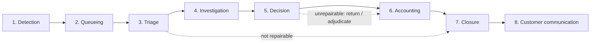

# Payment Exception and Repair Processing — Straight-Through Processing Is the Product; the Repair Queue Is the Business

**The Operational Half of a Payment System — the Decoder (Straight-Through Processing and the Exception, the Repair, the Repair Queue, the Return, the Recall, the Reversal, the Investigation Case, the Trace and the End-to-End Identifier, the Unapplied Credit, the Suspense Account, the Reason Code, the Cut-Off, Maker-Checker), the Economics of the Exception Derived Not Asserted, the Exception Taxonomy and the Repairable/Unrepairable Axis, the Exception Lifecycle as an Operation, the Repair Operation and Its Four Controls, Returns/Recalls/Reversals with What Each Party Can and Cannot Compel, Investigation Cases, Suspense and Unapplied Funds as a Control Fact, the Fraud and Social-Engineering Angle, the Metrics and How They Are Gamed, Prevention Upstream with Its Limits, the Operating Model, the Audit and Regulatory Angle, a Cymbal Bank Monthly Exception and Suspense Review, the Anti-Patterns, and the Claims Audit, the Glossary and What Could Not Be Verified — from the First Reject to the Aged Suspense Item Nobody Has Investigated**

> **Author:** Jack Liu Shurui — Solution Architect at Cymbal Bank, Singapore
> **Context:** Banking Domain / Payments Operations, Payments Infrastructure and Financial Crime — the *operational half* of a payment system: what happens to a payment that does not go straight through. The topic is the **exception**, the **repair**, the **return**, the **recall**, the **reversal**, the **investigation case**, the **suspense item**, and the **controls and metrics** around all of them. The decoder (straight-through processing and the exception; the repair and the repair queue; the return, the recall and the reversal; the investigation case; the trace / end-to-end identifier; the unapplied credit and the suspense account; the reason code; the cut-off; maker-checker), the economics of the exception derived rather than asserted, the exception taxonomy and the repairable-versus-unrepairable axis, the exception lifecycle as an operation, the repair operation and its four controls (maker-checker, segregation of duties, an attributable audit trail, and access control over who may amend what), returns/recalls/reversals kept rule-precise or flagged, investigation cases, suspense and unapplied funds as a control fact rather than housekeeping, the fraud and social-engineering angle that makes the manual-intervention path a target, the metrics and the two ways a headline is gamed, prevention upstream with its honest limits, the operating model, the audit and regulatory angle, a fictional Cymbal Bank monthly exception and suspense review, and the anti-patterns. The structural thesis: **straight-through processing is the product; the repair queue is the business** — the exception tail is where cost, risk and customer complaints concentrate, and it is exactly the part a straight-through-rate headline hides.
> **Repository:** [github.com/jackliusr/research](https://github.com/jackliusr/research)
> **Primary Sources:** the European scheme that publishes its own exception rulebook (**European Payments Council** — *SEPA Credit Transfer Scheme Rulebook*, EPC125-05, 2025 Version 1.0, issued 28 November 2024, effective 5 October 2025, public PDF — the Reject/Return process CT-01.xx, the Recall process PR-02, the Request for Recall by the Originator process PR-03, the Inquiry process and its Claim of Non-Receipt / Claim for Value Date Correction reasons, and the R-transaction reason-code guidance document EPC135-18); the UK scheme operator (**Pay.UK** — the Faster Payment System public page, which states the 2025 volume and value; the Direct Debit / Bacs service pages for AUDDIS and the Direct Debit Indemnity Claim); the UK regulator (**Payment Systems Regulator** — the APP-fraud reimbursement protections page, which states the 7 October 2024 start date, the £85,000 claim cap, the optional £100 excess, the 5-business-day and 35-business-day clocks and the 13-month reporting window); the US real-time operator (**The Clearing House** — the RTP network public page and its Q2 2026 by-the-numbers statistics); the US central bank (**Federal Reserve Financial Services** — the *FedNow Readiness Guide: Reporting and Reconcilement*, which documents the request for information / request for return of funds non-value messages, the 7 p.m.–7 p.m. cycle date and the 90-cycle-day report history); the standards body for cross-border harmonisation (**BIS / CPMI** — *Harmonised ISO 20022 data requirements for enhancing cross-border payments*, CPMI Papers d215, March 2023, a G20 cross-border payments programme deliverable); the ISO 20022 message definitions **camt.056** (FI-to-FI payment cancellation request), **camt.029** (resolution of investigation), **camt.110/camt.111** (investigation request / response), **pacs.004** (payment return), **pacs.007** (reversal) and **pacs.002** (status) — referenced as the plumbing this process runs on, with the detail owned by the ISO 20022 sibling guide. **Secondary sources, explicitly flagged as secondary:** a vendor glossary of **camt.056** (cpg.de) and a practitioner reference for the **camt.056/camt.029/camt.110/camt.111** cluster (paymentbrief.com), used only to corroborate the EPC rulebook's recall windows and to frame the CBPR+ case-management direction; and a third-party compilation of **Nacha** ACH return reason codes (achq.com), used because Nacha's own full Return Reason Code Guide is a paid product. **Could not retrieve this pass:** the SWIFT UETR explainer page (swift.com — blocked by the extraction engine, recorded in §15.5). Scheme rulebooks are version-specific and much of their substance sits behind membership — see §15.2–§15.5 for what is verified, what is flagged and what could not be established at source. The repo's sibling guides are cross-referenced by name rather than re-derived. NOTE: in this pass **`web_search` returned empty result sets for several queries** (a tool limitation, recorded in §15.5); sources below were retrieved by direct extraction from primary URLs. Fetch date **2026-09-30** unless otherwise stated.
> **Last Updated:** September 2026
> **Companion guides (sibling, same folder — the payments cluster):** [Payments Hub](payments_hub_guide.md) (this guide's closest boundary — the hub owns the architecture, the **payment lifecycle state machine in its §4**, **routing and orchestration in its §6**, the real-time and ISO 20022 capabilities in its §7, cross-border in its §8, **reconciliation in its §10** and the vendor landscape in its §12; this guide owns the *operational discipline* that runs on top of that architecture and cross-references the hub's **§10.2 Exception Management** rather than re-deriving it), [Payment Rails](payment_rails_guide.md) (the rails taxonomy, the real-time rail map, clearing and settlement, and the message standards — this guide owns what the rail *does not* do: the failed, returned, recalled and repaired payment), [ISO 20022 Core Processes](iso_20022_core_processes_guide.md) (the message layer — its **§10 Exceptions and Investigations** (camt.056/camt.029/camt.026/camt.027/camt.030–034) and its **§11 Returns and Reversals** (pacs.004/pacs.007 and its **§11.3 Return Reason Codes**) own the message catalogue; this guide references those message types as the plumbing its process runs on and does **not** reproduce them), [Posting Engine / Core Banking](posting_engine_core_banking_guide.md) (the ledger side — maker-checker in its **§3.3**, reversals in its **§3.7**, failed postings in its **§3.8** and suspense accounts in its **§6.4**; this guide develops the *payment* exception queue and names the boundary against the *posting* queue explicitly in §1.5), [Posting Rules Mechanics](posting_rules_mechanics_guide.md) (its **§4.1 Suspense Accounts** and **§4.2 Repair Queues** are the *ledger/posting-side* queue for failed postings — a **different queue** from the payment exception/repair queue; the distinction is stated in §1.5 and in §8), [Financial Fraud Detection at Scale](financial_fraud_detection_at_scale_guide.md) (the detection discipline — its payment-fraud and real-time-payment-fraud material in §2; this guide owns the *manual-intervention attack path* and cross-references the detection machinery rather than re-deriving it), [Penny Test in Banking](penny_test_guide.md) (the test-payment practice, the **reconciliation-visibility principle** in its §7.2, and its **§10.1 suspense treatment** — the accounting a test payment leaves behind is the same accounting a failed payment leaves behind), [SWIFTNet FileAct](swiftnet_fileact_guide.md) and [SWIFT Alliance Access](swift_alliance_access_guide.md) (the correspondent messaging and file-handling path over which many cross-border exceptions arrive and are repaired), [Operational Resilience Framework](operational_resilience_framework_guide.md) (the prevent/respond/recover/learn framing, important business services and impact tolerances — the exception function is an operational-resilience dependency, cross-referenced in §13), [Enterprise Risk Management](enterprise_risk_management_guide.md) (the risk-taxonomy and control-language home for the control design in §5), [Payments Hub](payments_hub_guide.md) and [Singapore Fintech and Payments](singapore_fintech_payments_guide.md) (the operating context).

---

**How to use this guide:** Read §1 for the thesis and the boundary, then §2, which is the credibility test — the economics of the exception derived from stated inputs with the unit chain visible, not asserted as an industry fact. §3 is the structural backbone: the taxonomy of why payments fail, with the repairable/unrepairable axis. §4 follows one exception through the operation; §5 is the most important practical section, the repair operation and its four controls. §6 is returns, recalls and reversals, kept rule-precise or flagged. §§7–9 are investigation cases, suspense and unapplied funds, and the fraud/social-engineering angle. §10 is the metrics and how the headline is gamed. §11 is prevention upstream with its limits. §12 is the operating model, §13 the audit and regulatory angle, §14 the fictional Cymbal Bank worked example, and §15 the anti-patterns, the claims audit, the absences, the glossary, the cross-references and the closing summary. Cross-references follow the repository convention: sibling guides in `banking/` are plain filenames. **Integrity convention:** ✅ = verified in this pass against a primary source retrieved on 2026-09-30, or verified in a cross-referenced guide's own ledger; ⚠ = flagged, uncertain, version-specific, member-restricted or otherwise not established at source; ❌ = a claim that is rejected or contradicts its source. **Scheme rulebook substance that is not publicly available is flagged, never reconstructed from memory. No return reason code, recall window, time limit, threshold or fee-dependent rule in this guide is invented; where a rule is stated it is either sourced below or flagged as not established at source. Every number in §2 is labelled `[cited]` or `[assumption for illustration]`, and the arithmetic is shown.**

---

## Table of Contents

1. [Overview, the Decoder and the Boundary](#1-overview-the-decoder-and-the-boundary)
   - 1.1 [The Thesis](#11-the-thesis)
   - 1.2 [The Decoder — the Terms This Guide Uses](#12-the-decoder--the-terms-this-guide-uses)
   - 1.3 [The Two Halves of a Payment System](#13-the-two-halves-of-a-payment-system)
   - 1.4 [The Boundary — Declared by Name](#14-the-boundary--declared-by-name)
   - 1.5 [The Exception Queue Versus the Posting-Failure Queue](#15-the-exception-queue-versus-the-posting-failure-queue)
2. [The Economics of the Exception](#2-the-economics-of-the-exception)
   - 2.1 [The Inputs, Each Labelled](#21-the-inputs-each-labelled)
   - 2.2 [The Unit Chain, Computed](#22-the-unit-chain-computed)
   - 2.3 [Sensitivity — Why the Manual Tail Dominates](#23-sensitivity--why-the-manual-tail-dominates)
   - 2.4 [The Structural Point the Headline Hides](#24-the-structural-point-the-headline-hides)
   - 2.5 [Where This Arithmetic Breaks Down](#25-where-this-arithmetic-breaks-down)
3. [Why Payments Fail — the Taxonomy](#3-why-payments-fail--the-taxonomy)
   - 3.1 [The Nine Families](#31-the-nine-families)
   - 3.2 [Family 1 — Data Exceptions from the Payer's Own Input](#32-family-1--data-exceptions-from-the-payers-own-input)
   - 3.3 [Family 2 — Standing-Instruction and Template Errors](#33-family-2--standing-instruction-and-template-errors)
   - 3.4 [Family 3 — Format and Validation Failures Rejected Before Clearing](#34-family-3--format-and-validation-failures-rejected-before-clearing)
   - 3.5 [Family 4 — Account and Beneficiary Problems](#35-family-4--account-and-beneficiary-problems)
   - 3.6 [Family 5 — Business Rejects](#36-family-5--business-rejects)
   - 3.7 [Family 6 — Scheme-Level Rejects](#37-family-6--scheme-level-rejects)
   - 3.8 [Family 7 — Duplicates and Re-Submissions](#38-family-7--duplicates-and-re-submissions)
   - 3.9 [Family 8 — Timing Exceptions](#39-family-8--timing-exceptions)
   - 3.10 [Family 9 — Genuine Disputes That Are Not Errors](#310-family-9--genuine-disputes-that-are-not-errors)
   - 3.11 [The Repairable/Unrepairable Axis](#311-the-repairableunrepairable-axis)
4. [The Exception Lifecycle as an Operation](#4-the-exception-lifecycle-as-an-operation)
   - 4.1 [The Eight Stages](#41-the-eight-stages)
   - 4.2 [Where an SLA Belongs](#42-where-an-sla-belongs)
   - 4.3 [The Decision Points](#43-the-decision-points)
   - 4.4 [The Relationship to the Hub's State Machine](#44-the-relationship-to-the-hubs-state-machine)
5. [The Repair Operation and Its Controls](#5-the-repair-operation-and-its-controls)
   - 5.1 [What a Repair Actually Is](#51-what-a-repair-actually-is)
   - 5.2 [Triage and Routing of the Queue](#52-triage-and-routing-of-the-queue)
   - 5.3 [The Manual Touchpoints](#53-the-manual-touchpoints)
   - 5.4 [Control 1 — Maker-Checker / Four-Eyes on a Manual Amendment](#54-control-1--maker-checker--four-eyes-on-a-manual-amendment)
   - 5.5 [Control 2 — Segregation of Duties](#55-control-2--segregation-of-duties)
   - 5.6 [Control 3 — An Attributable, Reconstructable Audit Trail](#56-control-3--an-attributable-reconstructable-audit-trail)
   - 5.7 [Control 4 — Access Control over Who May Amend What](#57-control-4--access-control-over-who-may-amend-what)
   - 5.8 [The Central Finding — the Queue as a Control Point](#58-the-central-finding--the-queue-as-a-control-point)
   - 5.9 [The Control Table](#59-the-control-table)
6. [Returns, Recalls and Reversals](#6-returns-recalls-and-reversals)
   - 6.1 [The Three Verbs, Distinguished](#61-the-three-verbs-distinguished)
   - 6.2 [The Inbound Return](#62-the-inbound-return)
   - 6.3 [The Recall Request](#63-the-recall-request)
   - 6.4 [The Reversal](#64-the-reversal)
   - 6.5 [What Each Party Can and Cannot Compel](#65-what-each-party-can-and-cannot-compel)
   - 6.6 [What the Scheme Permits Versus What the Customer Expects](#66-what-the-scheme-permits-versus-what-the-customer-expects)
7. [Investigation Cases](#7-investigation-cases)
   - 7.1 [The Customer Claim](#71-the-customer-claim)
   - 7.2 [The Trace Identifier and What It Establishes](#72-the-trace-identifier-and-what-it-establishes)
   - 7.3 [The Interbank Investigation, at the Level Publicly Documented](#73-the-interbank-investigation-at-the-level-publicly-documented)
   - 7.4 [The Investigation SLA](#74-the-investigation-sla)
   - 7.5 [An Investigation Is a Communication Problem as Much as a Technical One](#75-an-investigation-is-a-communication-problem-as-much-as-a-technical-one)
8. [Suspense and Unapplied Funds](#8-suspense-and-unapplied-funds)
   - 8.1 [What an Unidentifiable Credit Is](#81-what-an-unidentifiable-credit-is)
   - 8.2 [Why It Lands in Suspense](#82-why-it-lands-in-suspense)
   - 8.3 [Reallocation and Write-Back Rules](#83-reallocation-and-write-back-rules)
   - 8.4 [The Ageing Discipline](#84-the-ageing-discipline)
   - 8.5 [The Finding — an Ageing Suspense Balance Is an Uninvestigated Population](#85-the-finding--an-ageing-suspense-balance-is-an-uninvestigated-population)
9. [The Fraud and Social-Engineering Angle](#9-the-fraud-and-social-engineering-angle)
   - 9.1 [The Manual-Intervention Path as a Target](#91-the-manual-intervention-path-as-a-target)
   - 9.2 [The Verification Controls That Defeat It](#92-the-verification-controls-that-defeat-it)
   - 9.3 [The Human Factors, Honestly](#93-the-human-factors-honestly)
   - 9.4 [Where the Detection Machinery Lives](#94-where-the-detection-machinery-lives)
10. [The Metrics, and How They Are Gamed](#10-the-metrics-and-how-they-are-gamed)
    - 10.1 [How the STP Rate Is Defined, and Why Definitions Are Not Comparable](#101-how-the-stp-rate-is-defined-and-why-definitions-are-not-comparable)
    - 10.2 [Gaming Mode 1 — Suppress, Defer or Reclassify](#102-gaming-mode-1--suppress-defer-or-reclassify)
    - 10.3 [Gaming Mode 2 — Clear the Queue by Rejecting](#103-gaming-mode-2--clear-the-queue-by-rejecting)
    - 10.4 [The Counter-Metrics That Resist This](#104-the-counter-metrics-that-resist-this)
    - 10.5 [A Metric That Can Be Improved Without Improving the Outcome Will Be](#105-a-metric-that-can-be-improved-without-improving-the-outcome-will-be)
11. [Prevention Upstream, with Its Limits](#11-prevention-upstream-with-its-limits)
    - 11.1 [Beneficiary Validation and Confirmation-of-Payee-Style Checking](#111-beneficiary-validation-and-confirmation-of-payee-style-checking)
    - 11.2 [Validation at the Point of Capture](#112-validation-at-the-point-of-capture)
    - 11.3 [Standing-Instruction Hygiene](#113-standing-instruction-hygiene)
    - 11.4 [Pre-Validation Services](#114-pre-validation-services)
    - 11.5 [The Honest Limit — Some Exceptions Are Structurally Unavoidable](#115-the-honest-limit--some-exceptions-are-structurally-unavoidable)
12. [The Operating Model for an Exception Function](#12-the-operating-model-for-an-exception-function)
    - 12.1 [Skills](#121-skills)
    - 12.2 [Shift and Cut-Off Coverage](#122-shift-and-cut-off-coverage)
    - 12.3 [The Relationship to Reconciliation and Operations](#123-the-relationship-to-reconciliation-and-operations)
    - 12.4 [Capacity Planning Against Volume](#124-capacity-planning-against-volume)
    - 12.5 [The Automation Boundary](#125-the-automation-boundary)
13. [The Audit and Regulatory Angle](#13-the-audit-and-regulatory-angle)
    - 13.1 [Attributable Manual Intervention](#131-attributable-manual-intervention)
    - 13.2 [Ageing of Open Items](#132-ageing-of-open-items)
    - 13.3 [The Suspense Position](#133-the-suspense-position)
    - 13.4 [Evidence That a Control Ran](#134-evidence-that-a-control-ran)
    - 13.5 [The Reports That Must Be Produced](#135-the-reports-that-must-be-produced)
14. [The Cymbal Bank Worked Example — a Monthly Exception and Suspense Review](#14-the-cymbal-bank-worked-example--a-monthly-exception-and-suspense-review)
    - 14.1 [The Situation](#141-the-situation)
    - 14.2 [The STP Headline and the Derived Exception Cost](#142-the-stp-headline-and-the-derived-exception-cost)
    - 14.3 [The Ageing Suspense Balance That Turns Out to Be an Uninvestigated Population](#143-the-ageing-suspense-balance-that-turns-out-to-be-an-uninvestigated-population)
    - 14.4 [The Repair Requested by Telephone That the Callback Control Catches](#144-the-repair-requested-by-telephone-that-the-callback-control-catches)
    - 14.5 [The Metric That Was Being Met by Rejecting Rather Than Repairing](#145-the-metric-that-was-being-met-by-rejecting-rather-than-repairing)
    - 14.6 [The Decision — Upstream Validation Versus Operations Headcount](#146-the-decision--upstream-validation-versus-operations-headcount)
    - 14.7 [The Thesis, Restated](#147-the-thesis-restated)
15. [The Anti-Patterns, the Claims Audit, What Could Not Be Verified, the Glossary, the Cross-References and the Closing Summary](#15-the-anti-patterns-the-claims-audit-what-could-not-be-verified-the-glossary-the-cross-references-and-the-closing-summary)
    - 15.1 [The Anti-Patterns](#151-the-anti-patterns)
    - 15.2 [The Verified Claims (✅)](#152-the-verified-claims-)
    - 15.3 [The Flagged Claims (⚠)](#153-the-flagged-claims-)
    - 15.4 [The Rejected or Not-Found Claims (❌)](#154-the-rejected-or-not-found-claims-)
    - 15.5 [What Could Not Be Verified](#155-what-could-not-be-verified)
    - 15.6 [The Glossary](#156-the-glossary)
    - 15.7 [The Cross-References](#157-the-cross-references)
    - 15.8 [The Closing Summary](#158-the-closing-summary)

---

## 1. Overview, the Decoder and the Boundary

### 1.1 The Thesis

A payment system is usually described, budgeted and measured as if its job were to move money. It is not. Its job is to move money **without anyone touching it**, and then to handle correctly the fraction of payments that refuse to move without help. The architecture is the easy part; the operating discipline is where the money, the risk and the complaints actually live.

The thesis of this guide, stated once and then earned across sixteen sections:

> **Straight-through processing is the product; the repair queue is the business.**

Straight-through processing — STP, the payment that passes from initiation to settlement with no human intervention at any point — is what a bank sells and what a scheme's rules are designed to make possible. But STP is a **rate**, and a rate is a summary. It tells you how often the machinery worked. It tells you nothing about the payments for which it did not, and those payments are not a rounding error: they are where the manual cost sits, where the operational risk sits, where the fraud sits, and where nearly every customer complaint originates. A bank that manages to a straight-through-rate headline while the exception tail grows has optimised the metric and neglected the business.

This guide is about that tail.

### 1.2 The Decoder — the Terms This Guide Uses

These are the terms this guide uses precisely, in the sense a payments operations practitioner uses them. Where a term collides with a sibling guide's term, the collision is named.

| Term | What it means here | Where the collision is resolved |
| --- | --- | --- |
| **Straight-through processing (STP)** | A payment that completes its full path — initiation, validation, clearing, settlement, posting, notification — with no manual intervention. Expressed as a rate over a population and a period. | §10.1 shows why two STP rates from two institutions are usually not comparable |
| **Exception** | Any payment that does not go straight through. An exception is a *deviation*, not necessarily an error, and not necessarily a failure. | §3 — the taxonomy |
| **Reject** | An exception where the payment is **stopped before or at clearing** and the funds do not reach the beneficiary. The payer's side is made whole. | §3.4, §3.7 |
| **Return** | An exception where the payment **settled and was then sent back** by the beneficiary's institution. The money moved and then moved back. | §6.2 |
| **Recall** | A **request** by the sender's institution that a settled payment be cancelled and returned. It is a request, not a demand. | §6.3 |
| **Reversal** | A **booked correction** of an entry that was posted in error or for a transaction that did not complete as booked — a ledger event, not a message asking another party. | §6.4, and the ledger-side treatment in `posting_engine_core_banking_guide.md` §3.7 |
| **Repair** | A **manual intervention** that amends, completes, re-routes or re-submits a payment so that it can proceed. The repair is the operational act; the *repair queue* is where such payments wait. | §5 |
| **Repair queue** | The work queue of payments awaiting manual repair, distinct from the *posting* repair queue (see §1.5). | §1.5, §5.2 |
| **Investigation case** | A tracked, referenced unit of work raised to answer a question about a payment — where it is, why it did not arrive, what happened to it. | §7 |
| **Trace / end-to-end identifier** | The reference that lets one payment be located and its history stitched together across parties. In the ISO 20022 world the key is the **UETR** (unique end-to-end transaction reference); in older card and interbank contexts, the retrieval reference number and the acquirer reference number play a similar locating role. | §7.2 |
| **Unapplied credit** | Money received that cannot be credited to a customer because the beneficiary cannot be identified from the payment data. | §8.1 |
| **Suspense account** | The internal ledger account where an unapplied credit is parked until it is identified, reallocated or written back. | §8, and the ledger mechanics in `posting_rules_mechanics_guide.md` §4.1 and `posting_engine_core_banking_guide.md` §6.4 |
| **Reason code** | The scheme-defined code that states *why* an exception occurred. This guide references reason codes and names one or two from a public source; it does **not** reproduce a catalogue — that is the ISO 20022 guide's §11.3. | §6.2, §6.6 |
| **Cut-off** | The time or cycle point after which a payment cannot be actioned in the current cycle and slips to the next. A missed cut-off is its own class of exception. | §3.9 |
| **Maker-checker (four-eyes)** | The control by which one person prepares a manual change (**maker**) and a different person authorises it (**checker**), so that no single operator can unilaterally alter a payment. | §5.4, and `posting_engine_core_banking_guide.md` §3.3 |

### 1.3 The Two Halves of a Payment System

The repository already contains the *architecture* half of the payments picture in `payments_hub_guide.md` and `payment_rails_guide.md`. That half answers: how does a payment get from A to B, what routes exist, what message standard carries it, how is it transformed, how is it reconciled. This guide is the *other* half — the half that only becomes visible when the first half does not work:

1. **The designed path.** The payment passes through the state machine and out the other side. This is what the hub architecture describes, and this guide does not re-derive it.
2. **The deviations.** The payment stops, or goes to the wrong place, or bounces back, or arrives with no one able to identify the beneficiary, or is recalled, or is disputed. Each deviation is a **case** with a cause, a detector, a repair decision, an accounting consequence and a customer consequence.

The two halves are not sequential; they are simultaneous. At any moment, in any real payment system, a fraction of the population is in each. The straight-through-rate headline reports the first half and stays silent about the second.

### 1.4 The Boundary — Declared by Name

Because this repository is a set of guides that must not collide, the boundary is declared here, by name, against every sibling that touches payments.

| Sibling guide | What it owns | What this guide does instead |
| --- | --- | --- |
| `payments_hub_guide.md` | The payments hub architecture (§1), the **payment lifecycle state machine (§4)**, routing and orchestration (§6), real-time and ISO 20022 capabilities (§7), cross-border (§8), **reconciliation and reporting (§10, including the brief §10.2 Exception Management)** and the vendor landscape (§12) | Cross-references these by section number; does **not** re-derive the architecture, the state machine, orchestration, reconciliation or the vendor landscape. Where this guide needs "what states a payment can be in", it points at the hub's §4 |
| `payment_rails_guide.md` | The rails taxonomy, the real-time rail map, clearing and settlement, and the message standards | Takes the rails as given; owns what happens when the rail **refuses** the payment or sends it back |
| `iso_20022_core_processes_guide.md` | The message layer — its **§10 Exceptions and Investigations** (camt.056 / camt.029 / camt.026 / camt.027 / camt.030–034) and its **§11 Returns and Reversals** (pacs.004 / pacs.007, and its **§11.3 Return Reason Codes**) | References those message types as the plumbing this process runs on; does **not** reproduce the message catalogue or the reason-code list |
| `posting_engine_core_banking_guide.md` | Double-entry, the posting lifecycle, **maker-checker (§3.3)**, **reversals (§3.7)**, **failed postings (§3.8)**, **suspense accounts (§6.4)** | Owns the **payment** exception queue; cross-references the ledger-side mechanics by section |
| `posting_rules_mechanics_guide.md` | **§4.1 Suspense Accounts** and **§4.2 Repair Queues** — the *ledger/posting-side* queue for failed postings | States the distinction explicitly in §1.5 below: that is a **different queue** from the payment exception/repair queue, even when the same operator works both |
| `financial_fraud_detection_at_scale_guide.md` | Fraud detection generally — the models, features, streaming architecture and decisioning | Cross-references the detection machinery; owns only the **manual-intervention attack path** (§9) |
| `penny_test_guide.md` | Test payments, the **reconciliation-visibility principle (§7.2)** and its **§10.1 suspense treatment** | Cross-references the principle; the accounting a test payment leaves behind is the same accounting a failed payment leaves behind |
| `swiftnet_fileact_guide.md`, `swift_alliance_access_guide.md` | SWIFT connectivity and file handling | Cross-references the file path over which cross-border exceptions arrive and are repaired |
| `operational_resilience_framework_guide.md`, `enterprise_risk_management_guide.md` | The resilience framework and the enterprise risk taxonomy and control language | Cross-references these rather than re-deriving risk frameworks; §13 uses their vocabulary |

### 1.5 The Exception Queue Versus the Posting-Failure Queue

This is the single most likely place for two guides to collide, so the distinction is stated flatly.

There are **two different queues** that both get called a repair queue, and confusing them causes real operational error:

1. **The payment exception / repair queue — this guide's subject.** A *payment* has failed to progress as a payment: it was rejected, returned, mis-routed, or is missing data the scheme requires. Repairing it means amending the payment instruction or its routing so the payment can proceed. The unit of work is a **payment**.
2. **The posting repair queue — owned by `posting_rules_mechanics_guide.md` §4.2, with the suspense-account mechanics in its §4.1 and `posting_engine_core_banking_guide.md` §6.4.** A *posting* has failed: the payment itself is fine, but the ledger entry could not be made — a missing account, an unbalanced rule, a closed GL. Repairing it means fixing the **entry** so the books balance. The unit of work is a **journal entry**.

The two queues can share a tool, a team and a supervisor, and in many banks they do share all three. They are nonetheless **different work**, with **different failure modes**, **different controls emphasis** and **different metrics**. A payment stuck in the exception queue is a customer's money not arriving; a posting stuck in the posting queue is the bank's books not balancing. This guide owns the first. When it needs the second, it will say so and point at the two ledger guides by section.

---

## 2. The Economics of the Exception

### 2.1 The Inputs, Each Labelled

This section is the guide's credibility test. It does not print an industry exception rate, cost-per-repair or STP benchmark as a fact, because no such figure can be responsibly asserted as universal — the numbers depend entirely on the scheme, the population, the definition of STP and what is counted as "an exception". Instead the arithmetic is **derived from stated inputs**, every input labelled, and the unit chain shown so a reader can change one number and re-run it.

| Input | Value | Label |
| --- | --- | --- |
| Annual payment volume, **V** | 5,550,000,000 payments/year | **[cited: Pay.UK Faster Payment System public page, 2025]** — the UK Faster Payment System processed 5.55 billion transactions in 2025 |
| Straight-through rate | 98.5% | **[assumption for illustration]** |
| Share of exceptions that need a **manual touch** | 4% | **[assumption for illustration]** |
| Fully-loaded cost per **manual** exception | £8.00 | **[assumption for illustration]** |
| Fully-loaded cost per **auto-handled** exception | £0.05 | **[assumption for illustration]** |

Three of the five inputs are illustrative on purpose. The point of the section is not the number; it is the **method** — a method that forces the STP rate to be decomposed into a *count* and then a *cost*, which is exactly what the headline refuses to do. Only the volume is a cited figure, and it is cited to a named operator's own published statistic for a named year.

> **A note on the volume input.** The Pay.UK figure is the *total* Faster Payment System volume, which includes both payments and, in practice, a share of what this guide would call exceptions. Using it here as the denominator of an STP calculation is a simplification, and it is labelled as one. A reader substituting their own institution's volume, STP rate and cost-per-repair gets a figure for *their* institution. The arithmetic below is illustrative, not a claim about Pay.UK, about Faster Payments, or about any bank.

### 2.2 The Unit Chain, Computed

The arithmetic was performed in Python with `decimal.Decimal` at 28-digit precision, and is reproduced here with the unit chain visible at every step. It is illustrative.

**Step 1 — the exception count.**

```
non-STP exceptions = V x (1 - STP)
                   = 5,550,000,000 payments/yr x (1 - 0.985)
                   = 5,550,000,000 x 0.015
                   = 83,250,000 exceptions/yr
```

**Step 2 — split into manual and auto-handled.**

```
manual-touch items = 83,250,000 x 0.04  =  3,330,000 items/yr
auto-handled items = 83,250,000 - 3,330,000 = 79,920,000 items/yr
```

**Step 3 — cost each population.**

```
cost of manual = 3,330,000 items/yr x £8.00/item  = £26,640,000/yr
cost of auto   = 79,920,000 items/yr x £0.05/item  = £ 3,996,000/yr
```

**Step 4 — the total.**

```
annual exception run cost = £26,640,000 + £3,996,000 = £30,636,000/yr
per-payment exception cost = £30,636,000 / 5,550,000,000 = £0.006 per payment, rounded
```

Read the last line carefully, because it is the trap the headline sets. **Six-tenths of a penny per payment** sounds immaterial. Spread over a 5.55-billion-payment book it is **thirty million pounds a year** of operational running cost, and it is the part of the payment cost base that is least visible, least planned and most variable. The same arithmetic is what a bank's finance function should be able to produce on demand and usually cannot, because STP is reported as a rate and the cost is buried in a shared operations cost centre.

### 2.3 Sensitivity — Why the Manual Tail Dominates

Two sensitivities show where the leverage sits. Both continue the same cited volume.

**Sensitivity A — move the STP rate by 1.5 points, holding everything else fixed:**

| STP rate | Exceptions/yr | Manual items/yr | Annual exception run cost |
| --- | --- | --- | --- |
| 97.5% | 138,750,000 | 5,550,000 | **£51,060,000** |
| 98.5% | 83,250,000 | 3,330,000 | **£30,636,000** |
| 99.0% | 55,500,000 | 2,220,000 | **£20,424,000** |

The **spread between 97.5% and 99.0% is £30,636,000 per year** — a three-point swing in a headline that reads as three numbers after a decimal point is a **thirty-million-pound** difference in running cost. This is why STP rate is a finance number and not just a technology number.

**Sensitivity B — move the *manual share* of exceptions, holding the STP rate at 98.5%:**

| Manual share of exceptions | Manual items/yr | Annual exception run cost |
| --- | --- | --- |
| 4% | 3,330,000 | £30,636,000 |
| 8% | 6,660,000 | £57,109,500 |

Doubling the *share that needs a human* — not the number of exceptions, just the share of them requiring a human — **adds £26,473,500 per year** to the run cost, because the manual touch is roughly 160 times the cost of the auto-handled one (£8.00 vs £0.05). The manual tail dominates the economics. Everything in §5 (the repair operation), §11 (prevention upstream) and §12 (the automation boundary) is, in cost terms, an attack on that ratio.

> **The unit chain, stated once more, is the whole point.** Cost = Volume × (1 − STP) × manual_share × cost_per_manual_item + Volume × (1 − STP) × (1 − manual_share) × cost_per_auto_item. Every term is a labelled number. There is no industry average hidden inside it. Change a term and the answer changes; that transparency is the difference between an economics argument and a slogan.

### 2.4 The Structural Point the Headline Hides

The arithmetic supports a structural claim that no amount of pleasing STP rate can dissolve:

1. **Exceptions are rare per pound and frequent in absolute count.** At 1.5% of a large book, exceptions are 83 million items a year. Nothing that happens 83 million times is a rounding error, whatever its percentage.
2. **The *manual* exceptions are rarer still and cost far more each.** A small percentage of a large number is still a large number, and when each of those items costs a human touch, the tail carries the cost.
3. **The tail is where risk concentrates.** A payment that goes straight through is a payment that passed every automated control — sanctions screening, limits, validation, formatting, mapping. A payment that stops and is *manually amended* to proceed has, by definition, had a human hand on it, and every manual touch is a point at which the automated controls were either satisfied differently or bypassed. That is a risk characteristic of the process, stated plainly, not an allegation about any institution (§5.8).
4. **The tail is where complaints originate.** A customer does not complain because their payment was straight-through. They complain because it was late, returned, misrouted, or because the money left and did not arrive. Every such complaint is an exception that either was not detected, was detected late, or was handled without adequate communication.
5. **The headline is silent on all four.** An STP rate of 98.5% is compatible with an exception tail that is stable, growing, ageing or being cleared by rejecting work without ever repairing it. The rate does not distinguish those states. §10 shows exactly how each state is achieved behind the same headline.

### 2.5 Where This Arithmetic Breaks Down

The method has five honest limits, and a reader should hold all five:

1. **The volume is a whole-system figure, not one institution's.** Substituting a single bank's book changes the absolute numbers entirely.
2. **"Cost per manual exception" is a loaded cost, and loaded costs are contested.** It includes salary, overhead, tooling, supervision and the cost of the error the manual act can introduce. Different finance functions load it differently, which is why it must be labelled, not asserted.
3. **Not every exception is a discrete item.** One malformed batch can throw hundreds of exceptions at once; one duplicate-detection rule firing can suppress a whole population. Counts and items do not map one-to-one.
4. **Auto-handled cost also has a tail.** A round-the-clock scheme's negative acknowledgements, standing files, advices and non-value messages (the request-for-information and request-for-return families that FedNow, for one, documents as non-value messages on its reporting cycle) each have a processing cost that a £0.05 assumption compresses. **[cited: Federal Reserve Financial Services, *FedNow Readiness Guide: Reporting and Reconcilement*]**
5. **The arithmetic prices the queue, not the outcome.** The cost of a payment that was *wrongly* repaired — the customer who was compensated, the relationship lost, the regulatory consequence — is not in the £8. It is the reason the controls in §5 exist.

---

## 3. Why Payments Fail — the Taxonomy

### 3.1 The Nine Families

The taxonomy below is this guide's structural backbone. It is organised so that each family answers the same four questions: **what is the mechanism, who detects it, is it repairable, and what happens by default if nobody acts.** The four questions matter more than the family names, because they are what an operations team actually has to decide, item by item, thousands of times a day.

The nine families are: data exceptions from the payer's own input; standing-instruction and template errors; format and validation failures rejected before clearing; account and beneficiary problems including an account closed after the payment left; business rejects; scheme-level rejects; duplicates and re-submissions; timing exceptions; and genuine disputes that are not errors at all.

A note on what the taxonomy is *not*. It is not a list of scheme reason codes. Reason codes are the scheme's encoding of failure, and they are owned by the ISO 20022 sibling guide's **§11.3 Return Reason Codes**; this guide references them as the labels that arrive on the wire and groups them by the *mechanism* that produced them. Two schemes may encode the same mechanism under different codes, and one scheme may encode two mechanisms under one code — which is precisely why the operational taxonomy is organised by mechanism and not by code.

### 3.2 Family 1 — Data Exceptions from the Payer's Own Input

**Mechanism.** The payment instruction contains data that is wrong, missing or inconsistent, and the error originates on the payer's side — a mistyped account number, a beneficiary name that does not match the account, a malformed reference, a currency that does not match the account, an amount entered wrongly. The payment may clear and then fail at the beneficiary's institution, or fail validation at capture.

**Who detects it.** Sometimes nobody until it fails downstream, because a transposed digit in an account number often passes structural validation (the check digits may or may not catch it) and only reveals itself when the beneficiary's institution cannot find the account. Sometimes the originating institution's capture validation catches it. In the ACH world a compilation of Nacha return codes shows the classic encodings — a return for a non-existent account, or an "unable to locate account" return, sit alongside invalid-account-number-structure returns. ⚠ **[secondary source: achq.com compilation of Nacha return reason codes, retrieved 2026-09-30 — used because Nacha's own full Return Reason Code Guide is a paid product; treat the codes as indicative of the encodings, not as the rulebook text.]**

**Repairable?** Frequently yes, and this is the family where repair has the most value — but only if the correct data can be obtained. If the correct beneficiary account is knowable (the payer corrects it, or a name-verification service supplies a match), the payment can be repaired and re-sent. If the correct data is *not* obtainable, the item is not repairable and becomes a return or a rejection.

**Default if nobody acts.** The payment stops. On most schemes it will be rejected or returned automatically after a scheme-defined period, the funds going back to the payer; the payer's institution may have a duty to inform the payer. The default is not "it eventually gets fixed" — the default is "it bounces, and if the payer is not told, they find out from their counterparty".

### 3.3 Family 2 — Standing-Instruction and Template Errors

**Mechanism.** A standing order, a recurring template or a bulk file carries a defect that was correct once and stopped being correct — the beneficiary closed the account and moved, the reference format changed when a scheme migrated message standards, a template's fixed field no longer satisfies a new usage guideline. Because the instruction is reused, **the error recurs on every cycle** until the instruction is fixed.

**Who detects it.** Usually the beneficiary's institution, when the recurring payment starts failing; occasionally the originating institution's own monitoring, if it watches for a *pattern* of returns to the same beneficiary rather than individual returns.

**Repairable?** Yes, and this is the highest-leverage repair in the whole taxonomy, because one repair fixes all future instances. A standing instruction with a dead beneficiary is a *stream* of exceptions that a single amendment terminates.

**Default if nobody acts.** The exception recurs — every day, every week, every month, depending on the instruction's frequency — and each recurrence is a fresh exception item. This is the family where an unmanaged queue does not stay flat: a single unamended standing instruction inflates the queue on a schedule, and the queue's growth is invisible in the STP rate until it is large.

### 3.4 Family 3 — Format and Validation Failures Rejected Before Clearing

**Mechanism.** The payment never reaches the beneficiary because it fails a validation gate on the way out. Sub-causes: the message does not conform to the scheme's message standard or usage guideline; a mandatory field is missing or populated with a code the scheme does not accept; a file-level structural error invalidates a whole batch; a character-set or length violation; a reference field carrying data the scheme forbids.

**Who detects it.** The originating institution's own validation layer, or the clearing and settlement mechanism (CSM) itself, or the receiving institution's entry validation. In the SEPA world the CSM must send a Reject message to the originating institution at the latest on the next banking business day following rejection ✅ **[cited: EPC SCT Scheme Rulebook EPC125-05, 2025 v1.0, §4.3.2]** — which tells the operator that a reject is not an open-ended state; it is a state with a clock on it.

**Repairable?** Often yes, and often the fastest repair class, because the defect is *formal* — the data is semantically fine but formally non-conforming. A field trimmed, a code corrected, a character removed, and the payment proceeds. The repair is usually automatable (see §12.5), which is why this family should be the *least* expensive to handle and is a common sign of an immature pipeline when it is not.

**Default if nobody acts.** The payment is rejected and, on most schemes, the funds return to the payer. If the originating institution can repair and re-send within the execution time, the scheme's rules may treat the re-sent payment as a **new** instruction. ✅ **[cited: EPC SCT Scheme Rulebook, §4.3.2 — "Any instruction that is repaired and re-sent by the Originator PSP shall be deemed to be a new Credit Transfer Instruction under this Rulebook"].** Operationally that matters: a repair that slips past the cut-off is not the same payment arriving late; it is a new payment, with its own cut-off, and the customer's expectation of same-day arrival must be managed accordingly.

### 3.5 Family 4 — Account and Beneficiary Problems

**Mechanism.** The instruction is formally valid and the beneficiary was reachable *when the instruction was created*, but the beneficiary's account is closed, blocked, migrated to another institution, dormant, or the beneficiary is deceased. The archetypal case in the brief is **an account closed after the payment left**: the payer had a correct account, the beneficiary closed it, and the payment is in flight when it becomes unreachable.

**Who detects it.** The beneficiary's institution, which returns or rejects the payment with a reason code that says (in whatever encoding the scheme uses) that the account is closed or the beneficiary cannot be located.

**Repairable?** **Usually not.** This is the sharpest repairable/unrepairable line in the taxonomy. If the account is closed, there is no repair that makes *this* payment arrive — the correct action is a return to the payer followed by a *new* payment once the payer supplies new details. Trying to "repair" a closed-account return by re-routing it is, in the worst case, exactly the act an attacker wants (§9). The honest operational answer is: this is unrepairable as a payment, and the repair is to the *standing instruction or the customer's own records*, not to the payment.

**Default if nobody acts.** The payment is returned, funds go back to the payer. On a scheme with a return window, there is a period during which the return must be sent; outside it, the item's handling becomes a case rather than a routine return. The window itself is scheme-specific and is flagged (§6.2).

### 3.6 Family 5 — Business Rejects

**Mechanism.** The payment is technically valid but the beneficiary's institution declines it on a business ground: insufficient funds in the case of a debit-type item, a frozen or blocked account, a stop payment, an account that is not eligible to receive or send the payment type. In a compilation of ACH return codes these appear as insufficient-funds, account-frozen, stop-payment and non-transaction-account returns. ⚠ **[secondary source: achq.com compilation of Nacha return reason codes, retrieved 2026-09-30.]**

**Who detects it.** The beneficiary's or the payer's institution, at the point of the business check.

**Repairable?** **Not repairable as a payment.** A business reject is a *decision* by an institution, not a defect in the data. Insufficient funds does not become sufficient funds by amending the instruction; a frozen account does not unfreeze. The correct operational response is to return the item, notify, and — for insufficient funds specifically — decide *whether a re-presentation is permissible and sane*, which is a policy question, not a repair. Re-presenting a business reject without a change in the underlying fact is a way to manufacture a second exception.

**Default if nobody acts.** Return. And the customer-side default is worse than the scheme-side default: the payer intended a payment, the payment did not happen, and unless the institution communicates, the payer learns from the missing beneficiary or a late fee.

### 3.7 Family 6 — Scheme-Level Rejects

**Mechanism.** The **scheme itself** — the rules, the operator, the CSM — refuses the payment, or the payment is rejected at a level above the individual instruction. Causes: a violation of a scheme rule; a routing number that is not enabled on the network; a participant that cannot settle; a participation-limited receiver; a payment that exceeds a scheme value limit; a sanctions-driven return under a rule that creates a special return category. Nacha's own public material documents the creation of a sanctions-related return reason code with a **unique return time frame**, which is the pattern: scheme-level rejects are *codified* by the scheme and change as rules change. ✅ **[cited: Nacha public rules page for a new sanctions-related return reason code, 2026-09-30.]**

**Who detects it.** The scheme operator or the CSM, and the detection is authoritative — the scheme has made a rule.

**Repairable?** Depends on the cause. A routing/enablement problem is repairable by correcting the routing data or by using a different rail. A value-limit breach may be repairable by splitting the payment or using a different rail. A sanctions-related reject is **not** a repair matter at all — it is a compliance matter, and attempting to "repair" it by re-submitting is at best futile and at worst a serious control failure.

**Default if nobody acts.** The payment does not clear. Some scheme-level rejects are episodic (a routing number disabled for maintenance) and self-resolve; others are permanent and must be handled as cases. The operational risk is treating an episodic reject as permanent, or a permanent reject as episodic, and the default — no action — gets both wrong in opposite directions.

### 3.8 Family 7 — Duplicates and Re-Submissions

**Mechanism.** The same payment is submitted twice. Sources: a client re-sending a file because it did not receive an acknowledged status; a system retry after a timeout that actually succeeded; an operator manually re-submitting a payment that had not in fact failed; a batch re-run after a partial failure. Duplicate detection exists precisely because the retry-after-timeout case is unavoidable in distributed systems, and the ISO 20022 and card worlds both carry identifiers (the trace, the end-to-end reference) whose job is to make a duplicate *detectable*.

**Who detects it.** The originating institution's own duplicate-detection (by end-to-end identifier, by reference, by account/amount/value-date fingerprint), or the beneficiary's institution, which may return a duplicate entry. In the ACH compilation, a duplicate-entry return is a distinct code. ⚠ **[secondary source: achq.com compilation, retrieved 2026-09-30.]**

**Repairable?** A detected duplicate is **not repaired** — it is either suppressed before it goes out, or returned/reversed if it already went out. The "repair" in this family is the *duplicate-detection rule*, not the payment. A duplicate that gets through is a **double debit**, and the remedy is a **reversal** (§6.4) or a return, not an amendment.

**Default if nobody acts.** If duplicate detection is absent or the duplicate is not detected, the beneficiary is paid twice and the payer is debited twice. This is one of the few exception families where *inaction* has a direct, immediate financial-loss character, and where the cost lands on a real customer relationship rather than a cost centre. The control that prevents it is upstream (idempotency — the ledger-side treatment is in `posting_engine_core_banking_guide.md` §8.2.2 and `posting_rules_mechanics_guide.md` §7), and the *repair* of a duplicate that got through is a recovery, not a fix.

### 3.9 Family 8 — Timing Exceptions

**Mechanism.** The payment is valid and would have succeeded, but it was submitted after the **cut-off** for the current cycle, or it arrived at a point where the window had closed. Two sub-cases: the payment **missed the cut-off** (it slips to the next cycle, or on some scheme/rail combinations it cannot be made in that payment type at all and must be re-initiated), and the payment **arrived after the window** in which a remedy was still available (a recall request that is time-barred, a return that is outside its window — see §6). A third sub-case: the payment is *time-critical* — a settlement, a payroll, a loan disbursement, a tax payment — and a one-cycle slip is a business event, not a nuisance.

**Who detects it.** The submitting channel or the institution's own cycle monitoring for the missed-cut-off case; the counterparty or the scheme for the time-barred case. Cut-off times are institution-, rail- and scheme-specific and are **not** universal — the Fast Payment System, for instance, operates 24/7/365 and so has no nightly cut-off, while a batch rail has a hard daily one ✅ **[cited: Pay.UK Faster Payment System public page, 2026-09-30].** FedNow, as another example, defines its cycle day as generally 7 p.m. to 7 p.m. ET and rolls the cycle date forward while continuing to process ✅ **[cited: Federal Reserve Financial Services, *FedNow Readiness Guide: Reporting and Reconcilement*].** The existence of a *cycle* even on a 24/7 rail is the point: "always on" does not mean "no accounting day".

**Repairable?** A missed cut-off is repairable only in the sense that the payment can be **re-submitted in the next eligible cycle** — but if the scheme treats a re-sent payment as a new instruction (as SEPA SCT does ✅ **[cited: EPC SCT Rulebook, §4.3.2]**), then the "repair" is a *re-initiation*, and managing the customer expectation is the actual work. A time-barred remedy is **not repairable** — the window has closed, and the only remaining path is a customer-level remedy (a claim, a goodwill payment, a new payment), which is a different process.

**Default if nobody acts.** The payment is late. On a time-critical payment, "late" is the failure. This is the family where the *customer-visible* harm is highest relative to the *technical* severity: nothing is broken, and yet the mortgage payment is a day late.

### 3.10 Family 9 — Genuine Disputes That Are Not Errors

**Mechanism.** Nothing failed technically, the payment went exactly where the payer instructed, and the payer or beneficiary nonetheless disputes it: goods not delivered, a duplicate commercial charge, a subscription the customer says they cancelled, an amount the customer says was not authorised, an authorised payment the customer now says was a scam. In the ACH world the canonical encodings are returns for a consumer advising a debit was not authorised, or was not in accordance with the authorisation; in the UK the analogous class for authorised push payments is the APP-fraud reimbursement route. ⚠ **[secondary source: achq.com compilation, retrieved 2026-09-30.]** ✅ **[cited: Payment Systems Regulator APP-fraud reimbursement protections page, retrieved 2026-09-30 — the PSR expressly distinguishes APP fraud from unauthorised fraud and from civil disputes.]**

**Who detects it.** The customer, who raises it. By definition no automated control detected anything, because nothing was technically wrong.

**Repairable?** Not repairable — it is **adjudicated**. The process here is a *claim* with a decision, and it belongs to disputes/fraud/claims rather than to exception repair. The reason it sits in this taxonomy is that disputes arrive in the *same operational channel* as exceptions — often the same queue, the same team, the same ticket tool — and the single most common operational error in this area is treating a dispute as a repair. A dispute is not a payment with a wrong field; it is a question about whether a correct payment should be undone, and undoing it is a different act with different authority and different evidence.

**Default if nobody acts.** The customer escalates — to a complaint, to an ombudsman, to a regulator, or to a competitor. This family has the longest tail of any in the taxonomy, and it is the one where "nothing was technically wrong" is the least satisfying answer and rarely the last word.

### 3.11 The Repairable/Unrepairable Axis

The taxonomy's practical axis is not the nine families; it is **whether a human can change the outcome by acting, and whether the information needed to act exists.** That gives four quadrants, and the operational decisions fall out of the quadrant rather than the family name.

| | **The correcting data EXISTS** | **The correcting data does NOT exist** |
| --- | --- | --- |
| **Acting can change the outcome** | **Repair.** Amend and re-send. Data-input errors, format/validation failures, routing/enablement defects, standing-instruction amendments. This is the queue's *productive* work. | **Unrepairable — recover and re-initiate.** Closed accounts, business rejects with no changed fact. The payment is returned; the remedy is a return to the payer and a *new* payment once new details exist. |
| **Acting cannot change the outcome** | **Adjudicate.** The facts are knowable but the decision is a claim, not a correction — disputes, unauthorised-claim decisions, fraud claims. | **Time-barred / out of scope.** The window has closed, or the remedy belongs to another process (a customer-level remedy, a legal route). Escalate, document, close honestly. |

Three operational rules follow from the quadrants and are worth stating as rules:

1. **A repair is only legitimate in the top-left quadrant.** Any manual act that changes a payment where the correcting data does not exist — guessing a beneficiary, inventing an account, re-routing to "make it work" — is not a repair. It is an unauthorised alteration with exactly the risk character §5.8 describes.
2. **An unrepairable item still needs a decision, not just a closure.** "It bounced" is not a resolution; the resolution is the return, the notification and, where applicable, the instruction amendment that stops it recurring.
3. **The default action is never "wait".** Every family above has a default if nobody acts, and in eight of the nine the default is a *worse* outcome than a deliberate decision — a bounce with no notification, a recurring exception, a double debit, a late critical payment, an escalated complaint. The exception function exists because the default is bad.

---

## 4. The Exception Lifecycle as an Operation

### 4.1 The Eight Stages

A taxonomy classifies; an operation sequences. Every exception, whatever its family, moves through the same eight stages, and the failure of an exception function is almost always a failure of *one specific stage* rather than of the whole. Naming the stages is what lets a manager find the failing one.



1. **Detection.** The exception is recognised. Detection is the stage most often *missing* — a payment can be non-STP and nobody notices, because nothing raised an alert. Detection sources are the scheme (a reject/return message), the counterparty (an enquiry), the institution's own reconciliation (a break — see `payments_hub_guide.md` §10.1), the customer (a complaint), or a control (a duplicate-detection rule firing). **A taxonomy family with no detection source is a family that silently accumulates.**
2. **Queueing.** The exception is placed in a work queue, with an owner, a timestamp, a reason code, an ageing clock and a reference. The queue is where the work becomes *visible* and *measureable*, and where it can also be *lost*. The single most important queue property is not size — it is **ageing** (§10.4).
3. **Triage.** The item is classified against §3.11's quadrants: repairable with data available, unrepairable, adjudicable, or time-barred. Triage decides *whether a human should touch the payment at all*, which is the highest-stakes decision in the whole lifecycle, because an unnecessary manual touch is a control event (§5.8).
4. **Investigation.** For items whose cause or counterparty is not yet known, the case is worked: trace the payment, contact the counterparty, obtain the missing data, reconstruct what happened. §7 develops this.
5. **Decision.** A human (or an automated rule) decides the disposition: repair and re-send, return, recall, reverse, escalate to a claim, amend the standing instruction, or close as no-action. **The decision is the auditable act.** Everything before it gathers information; everything after it executes and records.
6. **Accounting.** Every disposition has a ledger consequence — a return moves funds back, a reversal writes an entry, an unapplied credit lands in suspense, a repair re-values a payment. The accounting is where the payment exception meets the ledger (`posting_engine_core_banking_guide.md`, `posting_rules_mechanics_guide.md`), and it is the stage at which an exception stops being an operational question and becomes a financial position.
7. **Closure.** The item is closed with a disposition code, and *the closure reason is itself data*. A closure that records "rejected, no action" is not the same event as a closure that records "repaired and re-sent", and a function that does not distinguish them cannot measure itself (§10.3).
8. **Customer communication.** The payer and, where relevant, the beneficiary are told — what happened, what will happen next, when. This stage is last in the sequence and first in the customer's experience, and it is the stage most commonly skipped under queue pressure. Skipping it converts a handled exception into an unhandled complaint (§7.5).

### 4.2 Where an SLA Belongs

An SLA belongs to a **stage**, not to a queue, and the common error is to define a single "clear the queue within X hours" target. That target, applied to the whole queue, is precisely the metric that gets gamed by rejecting work rather than repairing it (§10.3). The disciplined alternative is an SLA per stage, with the stage's own clock:

| Stage | What the SLA should govern | Why it belongs here and not at the queue level |
| --- | --- | --- |
| Detection | How fast a non-STP item is *recognised* after it occurs | A queue cannot be clear of items it never received; detection latency is invisible to a queue metric |
| Queueing | How fast a detected item is *entered* into the queue with an owner | Items that are detected but not queued are the classic lost population |
| Triage | How fast the quadrant decision is made | Triage is cheap; the clock here can be short and the volume is the whole queue |
| Investigation | The case clock, coordinated with the **counterparty's** clock | This is the only stage whose duration is partly *not* under the institution's control |
| Decision | How fast a triaged, investigated item is decided | Separating decision from investigation exposes "under investigation forever" as a distinct failure |
| Accounting | How fast the ledger consequence is posted after decision | An unposted decided item is a reconciliation break waiting to happen |
| Customer communication | How fast the customer is told, and *by when in the process* | Communication has a customer-facing clock that is independent of the internal clock |
| Closure | How fast the item is closed with a disposition code | Prevents "resolved but not closed" from inflating the open-item count |

The point of the per-stage SLA is that it makes the *type* of failure visible. A function that misses its queue-clear target because investigation is slow has a different problem from one that misses it because triage is slow, and only a per-stage clock distinguishes them.

### 4.3 The Decision Points

There are six genuine decision points in the lifecycle, and each is a place where authority matters:

1. **Is this an exception at all, or is it normal?** Some non-STP items are expected (a scheme's periodic non-value messages; a deliberate manual step for high-value payments). Deciding what *counts* is a decision with metric consequences (§10.2).
2. **Is it repairable?** The §3.11 quadrant decision. The most consequential and the most frequently got wrong.
3. **May this payment be manually amended at all?** This is an **authority** question, not a technical one — some payment types, values or beneficiary-change scenarios may be barred from manual amendment entirely (§5.7).
4. **Who is the counterparty, and are they who they claim to be?** For any modification driven by a request, this is the fraud decision (§9.2).
5. **What is the accounting disposition?** Repair-and-resend, return, reverse, or suspense — and each has an owner.
6. **Do we tell the customer, and when?** A communication decision, often a regulatory one.

### 4.4 The Relationship to the Hub's State Machine

`payments_hub_guide.md` **§4 (The Payment Lifecycle State Machine)** owns the states a *payment* can be in — the main path and, in that guide's **§4.2 (Failure and Return Paths)**, the failure and return states. This guide does not reproduce that state machine; it consumes it. The relationship is:

- **The hub's state machine is the *payment's* state.** Pending, accepted, in clearing, settled, returned, rejected — the payment's own condition in the pipeline.
- **This guide's lifecycle is the *item's* state.** Detected, queued, triaged, under investigation, decided, posted, closed — the condition of the *operational work item* that the payment turned into.

They are not the same axis, and confusing them causes a specific error: a payment can be in a terminal state (**returned**, from the hub's §4.2) while its operational item is still open and ageing in the repair queue for weeks. The payment being finished is not the item being finished. That gap — between the payment's terminal state and the item's closure — is where aged suspense, unactioned standing instructions and uncommunicated customers live.

---

## 5. The Repair Operation and Its Controls

### 5.1 What a Repair Actually Is

A **repair** is a manual intervention that changes a payment so that it can proceed — an amendment to the instruction, its data, its routing or its destination, performed by a human because the automated path could not complete it. It is *not*: an automated retry, an automated re-mapping that the pipeline performs by rule, or a reversal that writes a correcting entry. Those are pipeline functions. The repair, in this guide's sense, is the act that puts **a human hand on a payment**.

That definition carries the whole of §5. Because a repair changes where money goes, and because it is done by a person, every repair is simultaneously (a) an operational necessity without which exceptions cannot be cleared and (b) a control event whose risk must be governed. The discipline is to keep both facts true at once.

### 5.2 Triage and Routing of the Queue

A repair queue that is worked in arrival order is a queue that works the easy items first (they are faster) and lets the expensive items age — which is the opposite of what a risk-aware queue should do. A working triage routes by four dimensions:

1. **Repairability** — from §3.11. Unrepairable items should leave the repair queue fast (to a return or a claim), because sitting in the repair queue they consume attention they cannot repay.
2. **Value and criticality** — a £2m settlement and a £5 subscription are different risks at the same queue position. Value-banded routing is standard practice for exactly this reason.
3. **Ageing** — items past an age threshold should escalate rather than wait, because age is the best available proxy for "about to become a complaint or a loss" (§10.4).
4. **Actionability** — items whose next action is *waiting on someone else* (a counterparty response, a customer's new details) are not queue work at all; they are open cases with a follow-up date, and mixing them into the working queue creates the illusion of a large backlog that is mostly parked.

Routing then sends each item to the *right* owner: a data repair to a data team, a beneficiary-change to a controlled amendment path (**with the fraud trigger of §9.2**), a sanctions-related item to compliance, a dispute to claims. Routing wrongly — sending a dispute to the repair team — is how a repair queue starts adjudicating, which it has no authority to do.

### 5.3 The Manual Touchpoints

Each touchpoint is a place where a person changes something, and each therefore needs an attributable record. The common set:

| Touchpoint | What the human changes | Control emphasis |
| --- | --- | --- |
| Data completion | Fills a missing field (a reference, a purpose code, a beneficiary detail) | Maker-checker where the fill *determines* the destination; otherwise audit trail |
| Data correction | Corrects a wrong field (account, amount, currency) | **Maker-checker mandatory** — this can redirect money |
| Beneficiary substitution | Replaces the beneficiary with a different account | **Highest control**, treated as a beneficiary-change event with the fraud trigger of §9.2 |
| Routing/rail change | Sends the payment over a different path | Maker-checker; the routing decision is documented |
| Amount/limit adjustment | Splits, reduces or re-values the payment | Maker-checker; any limit override is separately authorised |
| Re-submission | Puts the repaired item back into the pipeline | Audit trail; duplicate-detection must not block a legitimate re-submission nor permit a duplicate |
| Standing-instruction amendment | Fixes the *stream* rather than the item | Maker-checker; the amendment changes all future occurrences |

### 5.4 Control 1 — Maker-Checker / Four-Eyes on a Manual Amendment

**The control.** The person who prepares a manual amendment (the **maker**) cannot be the person who authorises it (the **checker**). The amendment is held pending until a second, independent human has reviewed and approved it. The ledger-side form of the same control is described in `posting_engine_core_banking_guide.md` **§3.3**; here it applies to the *payment*, not the *entry*.

**Why it exists.** A single person with the ability to amend a payment and release it is a single point of failure for both error and fraud. Maker-checker is not a bureaucracy; it is the control that converts "one person changed where the money went" into "two people agreed that the money should go there, and both are named".

**The design decisions, made explicit:**
- **Which amendments require it.** The dividing line is *destination*: any amendment that can change where the funds end up (beneficiary, account, routing, amount) is maker-checker. Purely cosmetic completion (a missing remittance line, a non-key reference) may not need it, and over-applying the control is how a control earns its reputation as a speed bump and gets bypassed.
- **The checker is competent, not a rubber stamp.** A checker who approves everything is not a control. The design requirement is that the checker has the *information* to disagree — the original instruction, the amendment, the reason, and the identity verification.
- **Batching and thresholds.** High-volume, low-risk repairs may be batched for checking; high-value or destination-changing repairs may not. Thresholds are institution-specific and are a policy decision, not a scheme rule.
- **The control is defeated by shared credentials.** The most common real-world failure is two named people using one login, which converts four-eyes into one pair of glasses (§15).

### 5.5 Control 2 — Segregation of Duties

**The control.** The person who *repairs* must not be the person who *approves*, must not be the person who *reconciles or confirms* the outcome, and must not be the person who *benefits* from the repair. SoD extends maker-checker from a single transaction to the whole role: an operator who can both amend a payment and reconcile the account the payment moves through can conceal the effect of an amendment.

**Why it exists.** Maker-checker stops a single unauthorised transaction; segregation of duties stops a *pattern* of unauthorised transactions from being hidden. Together they are the reason a repair queue is a controlled process and not merely a queue.

**Design requirement.** The SoD matrix should state, per role, which of {initiate, amend, approve, execute, reconcile, confirm} the role may perform, and which combinations are prohibited. The matrix is the artefact an auditor asks for (§13.4), and — importantly — it should be *enforced by the system* (role separation at the access layer) and not merely *documented in a policy*, because a documented-but-unenforced SoD matrix is a paper control.

### 5.6 Control 3 — An Attributable, Reconstructable Audit Trail

**The control.** Every manual touch is recorded so that the *what*, the *who*, the *when*, the *why* and the *before/after* are all reconstructable — without the operator having to remember anything and without depending on a free-text note. An audit trail that says "amended" is not a trail; a trail that says "operator X changed beneficiary account from A to B at 14:07 on date D under authorisation by Y, because reason code R, against original instruction ref Z" is.

**Why it exists.** The trail is what makes every other control *evidenced* rather than *asserted*. Maker-checker without a trail is a claim that two people looked; with a trail it is a fact. SoD without a trail is a chart; with a trail it is a demonstrated practice. And the trail is what answers the customer's and the auditor's first question — "who decided this and why" — without a search through email.

**Design requirements:** before-image and after-image, the actor and the approver, a structured reason code (not free text), the timestamp on a trusted clock, the original instruction reference and the trace/end-to-end identifier (§7.2), and immutability. Free-text reason notes are the most common weakness: they are inconsistent, unsearchable and easy to write after the fact.

### 5.7 Control 4 — Access Control over Who May Amend What

**The control.** Authorisation is scoped by *what*, not merely by *whether*. A user may amend some things and not others, and the scope is enforced at the system and role layer.

**Why it exists.** Least privilege is the last line of defence: even an internal actor trying to move money must find that the specific amendment they need is beyond their authority, and must need a second person to authorise it.

**Design requirements:**
- **Field-level and payment-type-level scope.** "May amend data exceptions up to value X on domestic credit transfers, and may not amend beneficiary details on any payment" is a real authority; "may repair payments" is not.
- **Prohibition of self-authorisation.** Enforced by role separation, not policy.
- **The two-person rule for the highest-risk change.** A beneficiary substitution — the change that most directly redirects money — should require two approvers where the value or the customer profile warrants it, and should always trigger the independent verification of §9.2.
- **Periodic recertification of entitlements.** Access that is granted and never reviewed accumulates precisely where it matters least. The entitlement review is the artefact that proves the control is live.

### 5.8 The Central Finding — the Queue as a Control Point

This is the guide's most important practical claim, and it is stated as a **risk characteristic of the process**, not as an allegation about any institution or any person:

> **A manual repair is a standing opportunity to redirect a payment. That makes the repair queue a control point rather than an administrative backwater.**

Every element of the operation has been pointing here. A repair is *defined* by a human changing where money goes. The queue concentrates, in one place, a regular supply of payments that are **already off the automated path** — which means already past the automated controls that a straight-through payment would have satisfied — plus **a set of staff whose job is to make payments succeed**, plus **a legitimate business reason to change beneficiary and routing data**. That combination is a control point in the strict sense: a place where a control must exist *because* the risk concentrates there. It is not an accusation. It is a description of why the four controls above are not optional overhead, and why a function that treats its repair queue as an administrative backwater has misclassified its own risk.

The three consequences that follow:

1. **The queue's volume and ageing are risk indicators, not just workload indicators** (§10.4, §13.2).
2. **The queue's controls must be designed against an adversary, not against carelessness** — because the process has a predictable shape an adversary can study (§9).
3. **The queue's most dangerous state is a *quiet* one.** A queue that is clearing fast is not necessarily healthy; it may be clearing by rejection (§10.3). A queue with few manual items is not necessarily efficient; the manual items may have been reclassified out of the count (§10.2).

### 5.9 The Control Table

| Control | What it prevents | The artefact that proves it ran | The typical failure mode |
| --- | --- | --- | --- |
| Maker-checker / four-eyes | A single unauthorised amendment | Approval record linking maker and checker to the amendment | Shared credentials; a checker who approves everything |
| Segregation of duties | A single person concealing a pattern of amendments | The SoD matrix, and system-enforced role separation | Documented but not enforced; the same person reconciles what they amended |
| Attributable audit trail | Untraceable change; "who did this and why" unanswerable | Before/after image, actor, approver, reason code, timestamp | Free-text reasons; no before-image; editable log |
| Access control over scope | The amendment that should have needed authority | Entitlement list and periodic recertification | Over-broad roles; entitlements never reviewed; self-authorisation |

---

## 6. Returns, Recalls and Reversals

### 6.1 The Three Verbs, Distinguished

The three are constantly conflated, and the conflation is not harmless — each is a different act, performed by a different party, with different power to compel. **Every rule stated in this section is either cited to a public source retrieved on 2026-09-30 or flagged. Nothing here is a scheme rule reconstructed from memory.**

| Verb | Who initiates | What it is | Does it move money back? | Can it be refused? |
| --- | --- | --- | --- | --- |
| **Inbound return** | The **beneficiary's** institution | The settled payment is sent back with a reason | Yes — the return message carries the funds back | No; a return is the receiver's own act, not a request to the sender |
| **Recall** | The **sender's** institution (sometimes on the customer's behalf) | A **request** that a settled payment be cancelled and returned | Only if the request succeeds | Yes — explicitly; the beneficiary's institution responds positively or negatively |
| **Reversal** | The institution that holds the entry | A **booked correcting entry** on the ledger | It reverses a *posting*, not a message | N/A — it is the institution's own book, not a request to another party |

The clean way to hold the three: a **return** is the receiver *doing* something; a **recall** is the sender *asking* something; a **reversal** is the ledger *correcting* something. Returns and recalls are messages between institutions; a reversal is a book entry inside one institution. The ledger mechanics of reversals are owned by `posting_engine_core_banking_guide.md` **§3.7** and `posting_rules_mechanics_guide.md` §3.

### 6.2 The Inbound Return

**What it is.** The beneficiary's institution sends the payment back. On the ISO 20022 layer this is the `pacs.004` message family (message catalogue owned by `iso_20022_core_processes_guide.md` §11); the SEPA SCT rulebook requires 'Return' messages to carry a reason code in attribute **AT-R004** and to be transmitted within **three Banking Business Days after Settlement Date** ✅ **[cited: EPC SCT Scheme Rulebook EPC125-05, 2025 v1.0, §4.3.2 — the CSM step CT-01.04R states the Return message must reach the originating PSP at the latest three Banking Business Days after settlement, and at the same time return the funds].**

**The operational handling.** An inbound return is not routine housekeeping. When a return arrives it must be: matched to the original payment (by the trace/end-to-end identifier), posted (funds back to the payer), reason-coded, and — critically — *interpreted for the customer*. The reason code determines whether the correct next action is "re-send with corrected data", "amend the standing instruction", "stop trying", or "this is actually a claim". **A return that is posted but not interpreted produces a repeat exception** — the same payment goes out again next cycle with the same defect.

**The window.** Return windows are **scheme-specific and must not be generalised**. SEPA SCT's three-banking-business-day return window is cited above. A third-party compilation of Nacha return codes shows many ACH consumer-account returns carrying a **60-day** window and others (for example uncollected-funds and a corporate-unauthorised class) carrying much shorter windows ⚠ **[secondary source: achq.com compilation, retrieved 2026-09-30 — indicative only; the authoritative windows are in the Nacha Operating Rules, which are member-restricted and were not retrieved].** No return window in this guide is asserted as universal.

### 6.3 The Recall Request

**What it is.** The sender's institution asks the beneficiary's institution to cancel a settled payment and return the funds. On the ISO 20022 layer this is the `camt.056` request, answered by `camt.029` (negative resolution) or by a `pacs.004` return (positive resolution) — the message catalogue is owned by `iso_20022_core_processes_guide.md` §10.

**What SEPA SCT actually permits — cited, because the detail matters.** The EPC rulebook restricts a **Recall** to three reasons — *duplicate sending*, *technical problems resulting in an erroneous payment*, and a *fraudulently originated instruction* — and sets the sender's window at **10 Banking Business Days** for the first two and **13 months** for the fraud reason. Only **one** Recall may be sent per original payment. The beneficiary's institution must respond **within 15 Banking Business Days**, and is *in breach of the Rulebook* if it does not; it may respond negatively for insufficient funds, a closed account, a legal reason, the beneficiary's refusal, no response from the beneficiary, an initial payment never received, or funds already returned. It may also charge the sender's institution a fee on a positive response. ✅ **[cited: EPC SCT Scheme Rulebook EPC125-05, 2025 v1.0, §4.3.2.3 and process PR-02, retrieved 2026-09-30.]**

**What is separate from a Recall.** For a customer who wants a *settled* payment back for a reason **other than** the three Recall reasons — "I changed my mind", "I paid the wrong supplier" — SEPA provides a distinct **Request for Recall by the Originator (RFRO)**, which the sender's institution sends and which **does not guarantee** recovery: the outcome depends on the beneficiary's consent. The RFRO window is **13 months** from the original debit date, only **one** may be sent, and the beneficiary's institution must respond within **15 Banking Business Days**. ✅ **[cited: EPC SCT Scheme Rulebook, §4.3.2.4 and process PR-03.]** The distinction between a Recall and an RFRO is exactly the *scheme permits vs customer expects* gap of §6.6: a Recall is the bank acting on its own error; an RFRO is the bank *asking a favour on the customer's behalf*, and the customer who thinks a recall "gets their money back" has misunderstood which one applies.

**Cross-border.** In the SWIFT/CBPR+ world the same `camt.056`/`camt.029` pair is the cancellation/recall vehicle, and the newer `camt.110`/`camt.111` investigation request/response pair is the case-management direction — but its adoption is **phased and implementation-dependent**, and SEPA/SCT Inst recalls do **not** use it ⚠ **[secondary sources: cpg.de camt.056 glossary; paymentbrief.com camt.056/camt.029 reference, both retrieved 2026-09-30 — flagged as secondary and as describing a moving adoption timeline].** The honest statement is: the pair is real and documented, the exact production readiness at any institution is something to confirm against that institution's published usage guidelines and the current CBPR+ roadmap, not assume.

**The rule-precise caution.** Nothing in this subsection may be transplanted to another scheme. The reasons, the 10-day, 13-month and 15-day clocks and the one-recall rule are **SEPA SCT's**, and only SEPA SCT's. Other schemes' recall/"request for return" mechanisms (the US real-time networks publish request-for-return/request-for-information services; the EPC's SCT Inst scheme has its own instant-payment rules — see `iso_20022_core_processes_guide.md` §14) carry **their own** windows, which were **not** reconstructed here from memory. Where a scheme's rulebook is member-restricted, the rule is flagged, not filled in.

### 6.4 The Reversal

**What it is.** A booked correcting entry on the institution's own ledger, to undo a posting or to true up a payment that did not complete as booked — a same-day **storno** or a **reversing entry**, the distinction owned by `posting_rules_mechanics_guide.md` §3.1. A reversal is *not* a message to another institution and *not* a request; it is the institution correcting its own books.

**Where the reversal is the right instrument — and where it is not.** The reversal is correct when the institution's own ledger must be corrected: a duplicate debit that both legs of which the institution controls, an internal mis-posting, a fee that must come off. The reversal is **the wrong instrument** when the correction involves another institution's books — there, the remedy is a return or a recall, because the institution cannot unilaterally reverse an entry it does not hold. The boundary between "reversal" and "return/recall" is therefore the boundary of *whose book is being corrected*, and getting it wrong produces the classic error of a bank "reversing" a payment that has already left, which is not a reversal at all but a recall that was never sent.

### 6.5 What Each Party Can and Cannot Compel

| Party | Return | Recall | Reversal |
| --- | --- | --- | --- |
| **Beneficiary's institution** | **Can** return — it is its own act | **Responds** to a recall; can respond negatively for the permitted reasons (SEPA SCT ✅) | Can reverse its own ledger entries only |
| **Sender's institution** | Cannot compel a return; can only receive one | **Can request** a recall; cannot compel a positive response | Can reverse its own ledger entries only |
| **The clearing mechanism (CSM)** | Routes it | Routes it; may cancel a pre-settlement recall per its own procedures (SEPA SCT ✅) | None — it does not hold the institution's ledger |
| **The customer** | Cannot send one | **Cannot** send a recall; can only *ask the bank* to recall, and for non-Recall reasons only an RFRO (whose success is not guaranteed) (SEPA SCT ✅) | None — a reversal is invisible to them as an instrument |

The table's practical content is the third column's asymmetry: **returns and reversals are acts; a recall is a request.** An operations function that treats a recall request as if it were a compellable act mis-sets the customer's expectation at the moment of highest stakes.

### 6.6 What the Scheme Permits Versus What the Customer Expects

The gap between the two is where most complaints originate, and it is worth stating as its own finding:

- **The customer expects** that a payment sent by mistake can be "cancelled" — that the bank can reach into the beneficiary's account and pull the money back, quickly and reliably. In some jurisdictions for some card-based payments a chargeback mechanism creates a *partial* analogy; for an irrevocable instant credit transfer the expectation has no basis in the scheme.
- **The scheme permits**, on the sender's side, at most a **request**; on the receiver's side, **refusal**; and it sets **windows** (SEPA SCT: a Recall's 10-day or 13-month window, an RFRO's 13-month window, both cited above) after which even the request is time-barred.
- **The gap is structural, not a service failure.** It exists because the scheme's design goal is *finality* — an instant payment must be, well, final — and finality is precisely what makes "cancel a sent payment" impossible in the general case. When an instant rail is running, the same property that makes it valuable (§ the irreversibility noted in `penny_test_guide.md` §7.3) makes recall a courtesy rather than a right.

The operational translation: the exception function's job, when a customer asks for money back, is to (a) determine which mechanism actually applies, (b) tell the customer honestly what that mechanism can and cannot achieve, and (c) not promise recovery the scheme does not permit. Promising recovery the scheme denies converts a handled request into a complaint with a documented promise behind it.

> **Rule-precise or flagged.** Every window, reason and outcome in this section is cited to the EPC SCT rulebook (public) or explicitly flagged. Where a likely reader's scheme is different — ACH, RTP, FedNow, Faster Payments, SCT Inst, a card network — the reader should assume the *mechanism* (request vs act, window vs no window, compellable vs not) is the stable part and the *numbers* are not, and should confirm the numbers against that scheme's own current rules.

---

## 7. Investigation Cases

### 7.1 The Customer Claim

An investigation case begins, more often than not, with a customer saying one of four things: *it did not arrive*; *it arrived late*; *it arrived twice*; *it arrived wrong*. Each maps onto a different investigation, and the first act of a competent investigation function is to route the claim to the right one — because "it did not arrive" is a trace problem, "it arrived late" is a value-date problem, "it arrived twice" is a duplicate problem, and "it arrived wrong" is either a repair problem or a dispute (§3.10).

The customer's claim is also the **only** detection source for some failures (§4.1). A payment can be non-STP, self-resolve in a way nobody records, and be discovered only when the customer asks. That is a detection gap, and its size is measurable: the number of cases opened by customer claim rather than by internal detection is a direct indicator of how much of the exception population the institution does not see.

### 7.2 The Trace Identifier and What It Establishes

An investigation locates a payment by its **trace identifier** — the reference that survives every hop and lets a party find the payment and stitch its history. Three families of identifier matter:

1. **The end-to-end reference (the UETR family).** In the ISO 20022 world, the **unique end-to-end transaction reference (UETR)** is the key: a single reference carried unchanged through the chain and used by SWIFT's gpi payments Tracker to follow a payment across correspondent banks. SWIFT's own public description characterises the UETR as a **string of 36 unique characters** carried in payment instruction messages. ⚠ **[flagged: the SWIFT UETR explainer page (swift.com/payments/what-unique-end-end-transaction-reference-uetr) was **not retrievable** this pass — the extraction engine failed on it. The 36-character description comes from the search-result summary of that page and is flagged as unverified at source. The ISO 20022 definitive field definition is in the ISO message standard and in `iso_20022_core_processes_guide.md` §9.3.]** The UETR's essential property, wherever the format is finally confirmed, is that **the same value appears in the original payment, in every status update, and in any cancellation or investigation raised against it** — which is why it is the first thing a competent case captures.
2. **The end-to-end identification (the originator's own reference).** The reference the *ordering customer* or the *originating institution* assigned, which is what the customer actually has in front of them. The gap between what the customer can quote and what the chain actually indexes is a real friction: a customer quotes a remittance line, and the bank needs the UETR.
3. **The trace / retrieval reference (the card and legacy interbank family).** In card and older interbank contexts, a retrieval reference number or an acquirer reference number plays the locating role. ⚠ **[flagged: the exact ISO 8583 data-element numbers for these identifiers were **not** verified at source this pass — the ISO 8583 standard is paywalled and no public primary source was retrieved. The *concept* of a retrieving trace reference is standard; the field numbers are not asserted here.]**

**What a trace establishes, and what it does not.** A trace establishes *where the payment is* and *what state it is in*. It does **not**, by itself, establish *why* it stopped, *who* must act, or *whether the customer's claim is correct*. Those require the counterparty, which is why the next subsection exists.

### 7.3 The Interbank Investigation, at the Level Publicly Documented

The interbank investigation is a **structured message exchange** between institutions, and its shape is documented publicly in several schemes:

- **SEPA SCT** defines an **inquiry** process with three reasons — a **Claim of Non-Receipt** (the beneficiary says the payment did not arrive; the originating institution is asked to investigate whether and when the payment was executed, with the cause possibly at either institution or in the clearing layer), a **Claim for Value Date Correction** (the beneficiary says the credit was value-dated later than it should have been), and a **Request for Status Update** when the counterparty has not responded by the deadline. An inquiry can only be raised where the (claimed) debit date falls within the **13 months** preceding the customer's request, and if the cause is not the beneficiary institution's responsibility, that institution may be entitled to interest compensation or a fee from the originating institution. ✅ **[cited: EPC SCT Scheme Rulebook EPC125-05, 2025 v1.0, §4.4 — the Inquiry process, reasons (i)–(iii), the 13-month period and the compensation clause, retrieved 2026-09-30.]**
- **Cross-border** investigations run over the correspondent chain, using the `camt.056`/`camt.029` cancellation/recall pair and — increasingly, though phased — the `camt.110`/`camt.111` investigation request/response pair, with the ISO 20022 message detail owned by `iso_20022_core_processes_guide.md` §10. The harmonised data requirements that make these investigations cheaper and more automatable are the subject of the BIS/CPMI work under the G20 cross-border payments programme ✅ **[cited: BIS CPMI Papers d215, *Harmonised ISO 20022 data requirements for enhancing cross-border payments*, March 2023, a G20 cross-border payments programme deliverable — the report states the goal that harmonised, consistent ISO 20022 use makes cross-border payments "faster, cheaper and more transparent".]**
- **Real-time and card networks** each define their own inquiry/request-for-information services; the US FedNow service, for example, documents **request for information** and **request for return of funds** as **non-value messages** carried on its reporting cycle ✅ **[cited: Federal Reserve Financial Services, *FedNow Readiness Guide: Reporting and Reconcilement*, retrieved 2026-09-30.]** These are the *plumbing* through which an investigation travels; the institution's job is to run the case on top of it.

**The honest scope note.** The *mechanism* is publicly documented across schemes. The **specific timing rules, fees and escalation ladders** are largely **scheme-specific and often member-restricted**, and this guide does not reconstruct them. Where a reader needs the number, the number lives in that scheme's own current rulebook.

### 7.4 The Investigation SLA

An investigation SLA has one property no other SLA in this document has: **its duration is partly outside the institution's control**, because the clock stops while the counterparty responds. That produces three design consequences:

1. **Split the clock.** The internal clock (how fast *we* acted) and the external clock (how long the *counterparty* took) must be measured separately, or a slow counterparty will make a competent team look slow and a slow team will hide behind a fast counterparty.
2. **Have a follow-up discipline, not a hope.** Schemes provide a **Request for Status Update** mechanism for exactly the non-response case (SEPA SCT ✅ above); an institution without an automatic follow-up is relying on the counterparty's goodwill, which a scheme's response deadline exists precisely to replace.
3. **Escalate on the counterparty's breach, not on the customer's complaint.** If the counterparty is in breach of its response deadline, the escalation should fire from the clock, not from the customer's third call. The complaint as an escalation trigger is the symptom of a missing clock.

### 7.5 An Investigation Is a Communication Problem as Much as a Technical One

This is the section's honest finding, and it is deliberately blunt: **most investigation failure is failure to communicate inside the investigation window, not failure to investigate.**

The technical steps are usually completed. The payment is traced, its state is known, the counterparty is contacted. What fails is that the *customer* is not told what is happening while it happens, and the *internal* parties are not told what has been found. The result is a case that is technically progressing and experientially stalled, and the customer's experience is the only one that reaches the complaint log, the regulator and the retention decision.

The communication discipline that prevents this has three parts:
- **An outbound status at every state change**, not only at closure — the customer learns the payment is traced, then that the counterparty has been contacted, then the outcome, rather than silence followed by a verdict.
- **An internal hand-off that carries context**, so the customer is not asked to re-explain a case that has already been half-worked by someone else. Re-explanation is the single most complaint-generating experience in payment service, and it is entirely a systems and process failure, not a customer failure.
- **A closure that says what happened and what will happen next**, including the honest negative — "the recall was refused by the beneficiary's bank and cannot be compelled" is a better closure than a hopeful ambiguity (§6.6).

---

## 8. Suspense and Unapplied Funds

### 8.1 What an Unidentifiable Credit Is

An **unapplied credit** is money that has arrived and cannot be credited to a customer because the beneficiary cannot be identified from the payment data. The classic form: a credit arrives with an account reference that does not match any account the institution holds, or with a beneficiary name that matches nothing, or against a closed account, or with a reference so truncated by an upstream hop that the original purpose is unrecoverable. The funds are *real* — they have settled — and they are *owed* to someone. What is missing is the link between the money and the owner.

### 8.2 Why It Lands in Suspense

The money cannot sit in "nowhere". The institution's ledger requires a debit and a credit (`posting_engine_core_banking_guide.md` §1.1 — double-entry does not permit a one-sided entry). So the credit lands in a **suspense account**: a real ledger account, with a real balance, whose debit side is the institution and whose credit side is the unidentified customer. The suspense account is not a mistake; it is the **correct accounting treatment for an unresolved question**, and it is the mechanism that keeps the books balanced while the question is open.

The ledger-side mechanics of this are owned elsewhere and are cross-referenced rather than re-derived: the suspense account's definition and lifecycle in `posting_engine_core_banking_guide.md` **§6.4**, the receipt of an unmatched inward credit and its suspense lifecycle in `posting_rules_mechanics_guide.md` **§4.1** and its worked posting **P8**, and the test-payment case of an item that lands in suspense because nobody pre-registered it in `penny_test_guide.md` **§10.1**.

### 8.3 Reallocation and Write-Back Rules

Two exits from suspense, and they are not interchangeable:

1. **Reallocation (the good exit).** The beneficiary is identified, and the suspense balance is released to the correct customer account. Reallocation is the *intended* resolution: money that has been sitting in suspense is, on identification, the customer's money and should be credited promptly, with the value-date question handled honestly (a customer who receives last month's payment today has a value-date grievance unless the institution addresses it).
2. **Write-back (the terminal exit).** The credit is returned to the sender, or written back where the institution is entitled to do so, because the beneficiary cannot be identified and there is no basis to hold the money. Write-back is the *failure* of reallocation, and its preconditions are **jurisdiction- and policy-specific** — unclaimed-money and dormancy regimes differ by country and a write-back that ignores them is a compliance problem, not housekeeping.

The rules that govern the two exits — how long before write-back is permitted, whose authorisation it needs, whether interest is owed, what records must be retained — are **institution- and jurisdiction-specific** ⚠ **[flagged: not established at source this pass; the applicable regimes (unclaimed money, dormancy, escheat) are national and this guide does not reconstruct any national rule from memory].** What *is* general is the discipline: **every suspense item must have an owner, an age, a reason code and a next action**, and an item without all four is not being managed.

### 8.4 The Ageing Discipline

Ageing is the suspense account's only meaningful metric — not the balance, which can be large and entirely healthy if it is fresh, and not the item count, which can be small and entirely unhealthy if the items are a year old. The ageing discipline has four components:

1. **Age buckets** (for example, current, 1–30, 31–90, 90+ days). The buckets make the *distribution* visible; a single balance hides it.
2. **A threshold at which ageing becomes an escalation**, not a statistic. An item crossing 90 days should trigger a decision (reallocate, write back, or formally investigate), not merely appear in a 90+ column.
3. **A reallocation effort proportional to the balance.** This is the section's central finding, and it is best read as a ratio: **the investigation workload should scale with the suspense balance.** A suspense balance that grows while the investigation workload stays flat is not a small problem; it is a growing population of unresolved questions that nobody is asking.
4. **A clean account.** The suspense account is a *control account*: it should have a known, forecastable, explainable composition at all times. An unexplained movement in suspense is an incident (§13.3).

### 8.5 The Finding — an Ageing Suspense Balance Is an Uninvestigated Population

> **An ageing suspense balance is an uninvestigated population, and a suspense balance that grows without a corresponding investigation workload is a finding.**

The reasoning is direct. Every item in suspense is a *question*: whose money is this? Answering a question is *work* — a person traces the reference, calls the sender, searches the beneficiary database. If the balance is large and old and the investigation workload is small, one of two things is true, and both are findings:

- The questions are **not being asked** — the items are simply accumulating, and the institution is, in substance, holding unidentified customer money indefinitely. This is the default failure mode, because ageing suspense does not hurt day to day: it does not raise an exception, does not fail a validation, and does not appear in the STP rate. That invisibility is exactly why it accumulates.
- The questions are being asked **but not answered** — the items are worked, stalled and re-parked, which is a workflow or data-quality finding rather than a neglect finding.

Either way, the operational test is the same and it is a good one for a supervisor, an auditor or a board pack: **plot the suspense balance and the investigation workload on the same chart over time. If the balance grows while the workload is flat, the institution has an uninvestigated population.** §14.3 works this test on the fictional Cymbal Bank numbers.

One corollary deserves its own line, because it is the reason suspense belongs in an *exception* guide rather than an accounting one: **suspense is the residual exception — the exception that was never even classified.** Every other family in §3 produces a message, a code, a queue entry and a clock. An unapplied credit produces a balance and silence. It is the exception population's blind spot, and it is the one that grows quietly.

---

## 9. The Fraud and Social-Engineering Angle

### 9.1 The Manual-Intervention Path as a Target

The reason this section exists in a banking repository is that the exception and repair process is a **recognised attack surface**, and the reason it is recognised is structural. A straight-through payment passes every automated control the institution designed — sanctions screening, limits, beneficiary validation, velocity checks, the lot. A payment that has been *manually amended* has, by definition, moved off that path. An attacker who can persuade an operations team to amend or re-route a payment has therefore **obtained the effect of a control bypass without defeating any control**. No rule was changed, no credential was stolen, no exception was raised. The controls were simply *not applied to that payment*, because the payment went round them.

The mechanism, stated plainly and without naming any institution or person:

1. The attacker identifies a payment that is already in the repair queue, or manufactures a reason for one to be there — a claimed incorrect reference, a "system rejected my payment", a request to "update the beneficiary because the account changed".
2. The attacker contacts the operations function, usually by telephone, presenting as the customer, a colleague, a counterparty, or an authority, with credible detail and urgency.
3. The attacker asks for a change that is *within the normal scope of a repair* — a beneficiary correction, a routing change, a re-submission — so that the request does not look anomalous.
4. If the amendment is made and released, the payment goes to the attacker's account, and the money is gone, because the rail is fast and often irrevocable.

The characteristic this attack exploits is not carelessness. It is that the repair process's *purpose* — to make payments succeed — is indistinguishable, at the level of a single request, from the attacker's *goal* — to make one payment succeed to the wrong place. The controls of §5 are what distinguish them.

### 9.2 The Verification Controls That Defeat It

Four controls defeat this pattern, and the fourth is the one most often missing:

1. **Independent callback to a KNOWN contact on a KNOWN channel.** For any request to change beneficiary details or to re-route a payment, the institution calls the customer back on a number **it already holds** — not a number supplied in the request, not a number in an email signature, not a number the caller offers to provide. The distinction between "a known contact" and "a contact the request supplied" is the entire control; a callback to a number the attacker provided is theatre.
2. **Dual approval for the destination-changing amendment.** The maker-checker control of §5.4, specifically, is what makes a single persuasive interaction insufficient. The attacker must now persuade *two* people on *two* occasions — which is a materially harder social-engineering problem, and the reason the control is worth its friction.
3. **Beneficiary-detail change as a TRIGGER, not a routine edit.** This is the design point of the section: a change to beneficiary details should **trigger** the verification protocol *every time*, regardless of how routine the repair looks and regardless of who is asking. Treated as a trigger, the control is consistent; treated as a routine edit to be judged case by case, the control depends on the judgement of the person under pressure, which is precisely what the attacker is exploiting.
4. **A prohibition on the operation being completed in a single contact.** The strongest structural control is that no destination-changing amendment *can* be completed within the same interaction that requested it — a mandatory delay, a held-pending state, or a second-channel confirmation. This closes the "fast, urgent, one phone call" window that social engineering depends on.

Cross-reference rather than re-derivation: the detection machinery that catches the *pattern* — velocity anomalies, beneficiary-change clustering, new-beneficiary-then-immediate-payment sequences — lives in `financial_fraud_detection_at_scale_guide.md`, and this guide does not re-derive it. What this guide adds is the *operational* control set above, which is about the *human* process, not the model.

### 9.3 The Human Factors, Honestly

The section would be dishonest without this. Operations staff are targeted because:

- **They are helpful.** The job attracts and rewards people who want to solve a customer's problem. Helpfulness is the vulnerability, and it is a *good* trait being exploited, not a failing.
- **They are measured on speed.** A queue cleared fast is a queue cleared well, by most queue metrics (§10 carries the same theme from the metrics side). An urgent request for a fast repair matches the incentive exactly.
- **They see a plausible request, not an attack.** Every individual element of the request is normal: a customer, a payment, a correction, a reason. The attacker's skill is in assembling normal elements.
- **Authority and urgency are effective.** A call from someone presenting as a senior colleague, a regulator, or a long-standing customer creates exactly the pressure that suppresses the awkward question.

The honest conclusion is that the *process* must not depend on the operator resisting pressure, because pressure is the attacker's instrument and the operator is the attacker's target. The controls must be **structural** — a callback that happens by rule, a dual approval that cannot be waived at the desk, a beneficiary change that always triggers — so that "no" is the default and the operator is not asked to be a hero. Blaming the operator for a successful social-engineering attack is both unfair and useless: the control failed, not the person.

### 9.4 Where the Detection Machinery Lives

The monitoring that catches these patterns — a first-time beneficiary that receives a payment within minutes, a burst of beneficiary changes on one user, a repaired payment that behaves unlike the customer's history — is fraud-detection work, and it belongs to `financial_fraud_detection_at_scale_guide.md` (its payment-fraud and real-time-payment-fraud material in §2). The operational point for this guide is the *handoff*: the detection model produces an alert, and the *repair queue* is where that alert must land and block the amendment. A detection system that raises an alert nobody can act on in the repair workflow has produced a report, not a control.

---

## 10. The Metrics, and How They Are Gamed

### 10.1 How the STP Rate Is Defined, and Why Definitions Are Not Comparable

The **straight-through rate** is the share of payments that completed with no manual intervention, over a population and a period. Its apparent simplicity is a trap: at least four definitional choices are made every time it is computed, and two institutions that make different choices will report incompatible numbers while both calling the metric "STP rate".

| Definitional choice | The options | Why it changes the number |
| --- | --- | --- |
| **What counts in the denominator** | All initiated payments / all *submitted* payments / all *settled* payments / only a named product's payments | Excluding the payments that failed at validation (which never "went through") raises the rate without any change in performance |
| **What counts as non-STP** | Any manual touch / only manual touch by a named team / only manual touch on the payment (not on its reference data) | Excluding repairs done by the client or by a support team moves them out of the count |
| **When the counter starts and stops / whether auto-handled exceptions count** | From initiation / submission / first gateway receipt; auto-returned and auto-rejected items counted as non-STP or as "handled" | A late-detected exception may fall in a different period or not at all; treating the (often large) auto-handled exception population as STP inflates the rate substantially (§2.2) |

The honest conclusion is **not** that STP rate is useless. It is that an STP rate without its four definitional choices stated is not a number, it is a claim — and that two STP rates from two institutions are usually not comparable even when both are correctly computed, because the choices differ. The fix is to publish the *definition* alongside the *rate*, every time.

### 10.2 Gaming Mode 1 — Suppress, Defer or Reclassify

An STP target can be improved **without preventing a single exception**, by three moves:

1. **Suppress.** Raise the validation tolerance so borderline payments pass through without a touch — moving them from "manual exception" to "straight-through" without changing whether they succeed. The metric improves; the payment's risk does not change; arguably the risk *increases*, because the borderline payment now goes through unchecked.
2. **Defer.** Redefine the measurement window so that late-detected exceptions fall into a period not currently being measured, or so that an exception detected after the reporting cut-off counts in the next period. The rate for *this* period improves; the total is unchanged.
3. **Reclassify.** Change what counts as "an exception" — move a whole class of manual touches into "reference data maintenance" or "customer service" so that they are no longer payment exceptions. The STP rate improves by the size of the reclassified class, and nothing about the payment has changed.

All three are achieved by **changing the definition rather than the process**, and all three are extraordinarily hard to distinguish from legitimate definitional refinement unless the definition is frozen and the *count* is published alongside the *rate*. This is the first law of exception metrics:

> **A metric that can be improved without improving the outcome will be.**

### 10.3 Gaming Mode 2 — Clear the Queue by Rejecting

The queue-clearing target has its own failure mode, and it is the more serious of the two because it has a real customer cost. "Clear the queue within X hours" is met by a queue that is cleared — but the *manner* of clearing is not in the metric:

- **Repair** an item: the payment reaches the intended beneficiary. Queue cleared, customer served.
- **Reject** an item (return it for lack of complete data, decline the repair, send it back as unrepairable): the queue is cleared *identically* from the metric's point of view, and the customer's payment has failed.

A repair and a rejection look the same to a queue-clearing metric and are opposite outcomes for the customer. The team optimising for the metric has an incentive — entirely rational, and driven by the metric, not by malice — to reject work rather than repair it, because rejection is faster, does not require the missing data, and does not carry the risk of a manual amendment. **The queue clears faster, the STP rate improves (the rejected item becomes a "handled" exception), and the customer's payment does not arrive.** A function that meets its queue target by rejecting 6% of items it could have repaired, or 12%, has improved every number it reports and degraded the service it exists to provide. This is *the* reason §4.2 argues for per-stage SLAs and §10.4 insists on repair-sourced measures.

### 10.4 The Counter-Metrics That Resist This

A counter-metric is a measure that **cannot be improved without improving the outcome**, because it tracks the outcome directly rather than a proxy. Four of them:

| Counter-metric | What it tracks | Why it resists gaming |
| --- | --- | --- |
| **Ageing buckets of open items** | The *distribution* of how long open items have been open (current, 1–30, 31–90, 90+) | Cannot be improved by clearing the queue fast if old items remain — the old items stay in the old bucket until actually resolved; the distribution exposes a "clear the new, abandon the old" pattern |
| **Repair-sourced error rate** | The share of exceptions that were *introduced or not fixed* by prior repairs | Tracks whether repairs are solving the problem or creating the next one; a rejection-heavy regime shows up here as repairs that did not stick |
| **Suspense balance trend** | The balance and its ageing over time (§8.4) | Cannot be gamed by reclassifying exceptions, because suspense is a *ledger* figure — the money is either in suspense or it is not |
| **Re-open rate** | The share of closed items that reopen within a period | Directly punishes "close by rejection", because a rejected item the customer re-raises reopens and hits this metric |

The design principle behind all four: **measure the outcome, not the proxy.** STP rate and queue-clearing time are proxies for "payments work and problems get solved"; ageing, suspense trend, re-open rate and repair-sourced error rate are closer to the thing itself, and they are much harder to move without actually solving the problem.

### 10.5 A Metric That Can Be Improved Without Improving the Outcome Will Be

Statements once, because they are the section's payload:

1. **A metric that can be improved without improving the outcome will be.** This is not a claim about anyone's integrity; it is a claim about incentives, and it holds for good people under target pressure.
2. **The STP rate is a *result*, not a *lever*.** It is a fine thing to report and a poor thing to manage to directly, because it is settable by definition changes (§10.2).
3. **The queue-clear target is the most dangerous common metric in payments operations**, because it is satisfiable by the opposite of the desired behaviour (§10.3) and looks healthy while doing it.
4. **The antidote is not better intentions; it is better instruments** — the four counter-metrics above, reported *alongside* the headline and never replaced by it.
5. **The strongest single disclosure** is the one an institution can always make and often cannot: the *definition* of the metric, the *count* behind the rate, and the *ageing* of what remains. A rate without a count and an ageing profile is a claim; with them, it is a number.

---

## 11. Prevention Upstream, with Its Limits

### 11.1 Beneficiary Validation and Confirmation-of-Payee-Style Checking

The highest-leverage prevention is checking the beneficiary *before* the payment leaves. Confirmation-of-Payee-style services return a name-match result to the payer so that a mismatch is caught at the moment of instruction rather than after settlement. In the UK, Pay.UK operates Confirmation of Payee as an overlay service, and the PSR's consumer material cites its adoption as a mainstream deterrent to misdirected payments ✅ **[cited: Pay.UK Overlay Services / Confirmation of Payee and the PSR APP-fraud reimbursement page, retrieved 2026-09-30]**; the PSR separately reports "over 2 billion CoP checks … this year" and more firms joining ✅ **[cited: PSR, retrieved 2026-09-30].**

**What it actually prevents.** Largely Family 1 misdirection (payer types a name that does not match, or an account that belongs to someone else) and the *misdirected-payment* subset of APP scam losses. **What it does not prevent.** It does not stop a payment to an account the attacker controls and has registered in the victim's intended name; it does not help where the payer insists on proceeding after a "no match"; it does not cover rails or corridors where the service is not available. It reduces the population; it does not empty it.

### 11.2 Validation at the Point of Capture

Structural validation at capture — account-number check digits, IBAN checks, required-field and code-set validation, amount and currency sanity, date sanity — removes the Family 3 (format/validation) failures at the only point where the fix is cheap: before submission. This is the single best-value prevention because it costs almost nothing and its failures are the ones most easily automated (§12.5). Its limit is that it validates *form*, not *fact*: a well-formed account number for an account that does not exist passes every structural check.

### 11.3 Standing-Instruction Hygiene

Because Family 2 errors **recur** (§3.3), the highest-leverage prevention is not on the payment at all — it is on the *stream*. A standing-instruction review (periodic re-confirmation of beneficiaries, alerting when an instruction starts returning, amending the instruction rather than the payment) converts a recurring stream into a one-off repair. The discipline is unglamorous and rarely owned, which is why the stream persists.

### 11.4 Pre-Validation Services

Several schemes and overlay services offer pre-validation: a check that the account exists and can receive this payment type, run before the payment is sent. These reduce Family 4 and Family 5 failures by catching a closed account or an ineligible account in advance. Their limits are the same shape as §11.1: coverage is partial, a "valid" result is a point-in-time fact that can change before the payment arrives (the account can close *after* the check — the exact case §3.5 names), and the service is not available on every rail or corridor.

### 11.5 The Honest Limit — Some Exceptions Are Structurally Unavoidable

> **Prevention cannot remove the queue, because some failure occurs after the instruction leaves the payer and cannot be known in advance.**

This is the honest statement the section exists to make. Every prevention mechanism above checks a fact at a *point in time*. The payment then travels. In the gap between the check and the arrival, the world changes: the beneficiary closes the account (§3.5), the funds are no longer available (§3.6), the account is frozen by an authority, a scheme rule changes, a cut-off passes. **No amount of upstream validation can prevent a failure caused by a change that happens after validation.** Those exceptions are not a defect to be engineered away; they are the residual reality of moving money through a world that does not hold still, and an exception function is the fixed cost of that reality. Prevention reduces the *size* of the queue and the *frequency* of the recurring families; it does not — and cannot — reduce it to zero. An institution that budgets for zero exceptions has budgeted for a queue it will not staff.

---

## 12. The Operating Model for an Exception Function

### 12.1 Skills

The role needs a blend that is easy to under-hire: scheme-rule knowledge (what is permitted and what is time-barred, §6), ledger literacy (what a disposition does to the books, §8), investigation craft (§7), customer communication (§7.5), and the judgement to triage correctly (§5.2). The hardest of these to hire is judgement — the operator who knows when *not* to touch a payment. A team strong on throughput and weak on judgement is exactly the team that clears its queue by rejecting (§10.3).

### 12.2 Shift and Cut-Off Coverage

Coverage must follow the *rails*, not the office hours. A 24/7 instant rail creates exceptions at 3 a.m.; a batch rail creates a hard daily peak around its cut-off. Coverage design therefore has two parts: the **cut-off calendar** (which cycles exist, when they close, which are time-critical) and the **shift model** mapped to it. The failure mode is a function staffed for business hours that receives instant-payment exceptions all night and finds them aged by morning — the ageing of an overnight exception is not neutral, because the recall window (§6.3) is running and the customer is awake.

### 12.3 The Relationship to Reconciliation and Operations

The exception function sits between three neighbours and must not dissolve into any of them:

- **Reconciliation** (`payments_hub_guide.md` §10) **detects** breaks and unmatched items; the exception function **resolves** them. Reconciliation produces the population; the exception function works it.
- **Posting operations** (`posting_rules_mechanics_guide.md` §4.2) works the *entry* failures — the other queue (§1.5) — and the handoff between the two queues must be explicit, or items fall between them.
- **Customer service** receives the complaints that are the exception function's failure mode (§4.1, §7.5); the feedback loop from service back into the queue is what turns a complaint into a prevention.

### 12.4 Capacity Planning Against Volume

Capacity should be planned against the **manual item count**, not the payment volume and not the STP rate — both of which are one or two definitional changes away from being wrong (§10.1). The useful planning primitive is the arithmetic of §2: manual items = volume × (1 − STP) × manual-share, with each term owned and monitored. A capacity plan that cannot state its manual-share assumption cannot be tested; a capacity plan built on "we handle about X% STP" is a plan to be surprised.

### 12.5 The Automation Boundary

The most useful question about automation is not "can we automate repairs?" but **"which repairs can be automated, and which cannot because the data is not there?"** The boundary falls out of §3.11:

| Automation suitability | Repair class | Why |
| --- | --- | --- |
| **High** — automate | Format/validation fixes with a deterministic correct value (trim, code substitution, character-set fix) | The correct output is a function of the input; no external data needed |
| **High** — automate | Duplicate suppression, re-submission of a previously validated item | Deterministic; the decision rule is a fingerprint |
| **Medium** — automate with a rule and an audit record | Routing/rail re-selection on a documented rule | The rule can be tested and logged; a human still reviews exceptions to the rule |
| **Low** — do not automate | Beneficiary substitution, amount/limit change, business rejects, closed accounts, disputes | **The data needed to act correctly is not in the payment** — it comes from the customer, the act is a destination change that must be verified (§9.2), or the item is not repairable at all (§3.5, §3.6, §3.10) |

The principle: **automate where the correcting data is already present; do not automate where the correcting data must come from a human who must be verified.** The second class is not a candidate for automation because the bottleneck is not processing speed — it is the *authority and identity* of the person supplying the data, and no amount of engineering removes that.

---

## 13. The Audit and Regulatory Angle

### 13.1 Attributable Manual Intervention

The first question an auditor or supervisor asks is not "how many exceptions" but **"who touched this payment, and can you show me?"** The evidence is the attributable trail of §5.6: actor, approver, before/after, reason, timestamp, immutable. The finding an auditor writes when the trail is absent is not "there was fraud" — it is "manual intervention is not fully attributable", which is a control finding in its own right and a serious one.

### 13.2 Ageing of Open Items

The second question is **"how old are your open items?"** Ageing is the auditor's window into whether the function is resolving work or warehousing it (§10.4). A distribution that shows a growing 90+ bucket is a finding regardless of how healthy the headline metrics are, because it is the one measure that a definition change cannot move.

### 13.3 The Suspense Position

The third question is **"what is in suspense, how old is it, and who is asking the questions?"** The suspense position is auditable in a way that queue metrics are not, because it is a **ledger** figure (§8.4) — it cannot be reclassified away. The finding is the one §8.5 states: a balance growing without a matching investigation workload is an uninvestigated population. The related artefacts are the suspense control account's reconciliation, the write-back policy and its authorisation, and the evidence that customers' money is not being held unresolved.

### 13.4 Evidence That a Control Ran

The fourth question, and the one most often answered with a policy document instead of a record: **"show me the control operating."** The artefacts are concrete — the maker-checker approval records, the SoD matrix *and its system enforcement*, the entitlement recertification, the ageing report with its escalation actions, the audit trail for a sample of amendments. A control that exists only in policy is a control the auditor will test by sampling, and it will fail the sample. This is where the vocabulary of `enterprise_risk_management_guide.md` (control, control owner, control test, evidence) and the framing of `operational_resilience_framework_guide.md` (important business services, impact tolerances, prevent/respond/recover/learn) do their work; this guide cross-references them rather than re-deriving risk frameworks. The exception function is, in resilience terms, a dependency of the payment service: if it degrades, the *impact tolerance* of the payment service it supports is what converts that degradation into a reportable event.

### 13.5 The Reports That Must Be Produced

A disciplined function can produce, on demand and consistently, the following — and the list doubles as a specification:

1. **The exception count and rate, with the definition stated** (§10.1).
2. **The ageing distribution of open items**, by bucket, trended (§10.4, §13.2).
3. **The suspense position and its ageing**, reconciled to the ledger (§8.4, §13.3).
4. **The repair-sourced error rate and the re-open rate** (§10.4).
5. **The manual-intervention log** for a defined period, sampleable (§13.1).
6. **The control-evidence pack** — maker-checker records, SoD enforcement, entitlement recertification (§13.4).
7. **The up-stream prevention performance** — how much of each family prevention removed, and what remained (§11.5).

---

## 14. The Cymbal Bank Worked Example — a Monthly Exception and Suspense Review

> **Fictional and explicitly illustrative.** Cymbal Bank is this repository's only bank persona and the only institution used as a worked example. Every figure below is a **fictional illustration**, invented to demonstrate a method; none is a claim about any real institution, and none is a benchmark. The arithmetic was performed in `decimal.Decimal` at 28-digit precision.

### 14.1 The Situation

Cymbal Bank, Singapore, runs domestic and cross-border payment operations. Its monthly Payment Operations Review has an agenda item called "Exception and Suspense". The reviewer has three papers: the payment performance paper (the STP headline), the repair-queue ageing report, and the suspense account reconciliation. The practice of the review is to refuse to take the first paper without the second and third.

Cymbal's stated monthly payment volume is **12,500,000 payments/month** [assumption for illustration], and its reported **straight-through rate is 99.4%** [assumption for illustration]. The operations cost per manual exception is loaded at **£8.00** [assumption for illustration].

### 14.2 The STP Headline and the Derived Exception Cost

The STP headline reads 99.4%, which in a management pack is four characters and a full stop away from perfection. The review does what §2 does — it decomposes the rate into a count and a cost:

```
non-STP exceptions/month = 12,500,000 x (1 - 0.994) = 75,000 exceptions/month
```

Cymbal's repair queue reports **6,800 manual-touch items in the month** [assumption for illustration] — that is **0.054% of the monthly volume**, or roughly **9.1% of the 75,000 exceptions**. So of the exceptions:

```
auto-handled/month = 75,000 - 6,800 = 68,200
manual cost/month  = 6,800 x £8.00 = £54,400/month
annualised         = £54,400 x 12 = £652,800/year
```

The 99.4% headline is true and the £652,800 is also true, and the review's first observation is that the headline would have been equally true at a materially different cost had the manual share of exceptions moved — exactly the sensitivity of §2.3. The headline is not wrong; it is *uninformative about the thing the review is meeting to discuss*.

### 14.3 The Ageing Suspense Balance That Turns Out to Be an Uninvestigated Population

The suspense reconciliation shows a balance of **£2,450,000** [assumption for illustration], of which **£1,610,000 is older than 90 days** — **65.71%** of the balance. The review applies the §8.5 test: the balance has grown **four consecutive months** while the suspense investigation workload has been **flat at two analysts, part-time**. Balance up, workload flat: the finding writes itself.

```
aged (>90d) population  = £1,610,000
average item size       = £1,750 [assumption]
implied aged items      = £1,610,000 / £1,750 = 920 items
cost to investigate all = 920 items x £8.00 = £7,360
```

The second line is the one that stops the meeting. **The work to investigate the entire aged population is about £7,360** — against a £1,610,000 balance of money the bank cannot attribute to a customer. The population is not uninvestigated because investigating it is expensive. It is uninvestigated because *nobody was asking the questions* — it does not fail a validation, does not raise an exception, does not move the STP rate, and therefore never forces itself onto a meeting agenda. That is the whole of §8.5, made concrete, and the review's decision is to give the population an owner, an age-based escalation and a monthly question count. Paper 3 has earned its place on the agenda.

### 14.4 The Repair Requested by Telephone That the Callback Control Catches

Mid-month, a caller reaches Cymbal's repair desk, presenting as a long-standing corporate customer, with a plausible story: a supplier has changed bank, the payment already in the repair queue needs its beneficiary account updated, and it is urgent because the supplier's cut-off is this afternoon. Every element is normal (§9.3). The requested change — a beneficiary substitution — is within the scope of what a repair can be.

The desk cannot complete it, and the reason is the control, not the operator's suspicion. Cymbal's design has three structural properties (§9.2): a beneficiary-detail change **triggers** the verification protocol every time; the verification is an **independent callback to a number Cymbal already holds**, never a number from the request; and a destination-changing amendment **cannot be completed in the same contact** that requested it. The callback reaches the real customer, who confirms no such instruction. The payment is not amended. The episode is logged as an attempted fraud, not as an incident, because no control failed — the control ran, which is the point.

The review's observation is that the outcome depended on *none* of the three properties individually being waived under time pressure, and that the desk was not asked to decide whether to waive them. The controls made "no" the default, which is exactly what §9.3 argues the design must do.

### 14.5 The Metric That Was Being Met by Rejecting Rather Than Repairing

The repair-queue ageing report shows the queue being cleared inside its 4-hour target on 97% of days — a good number. It also shows a **re-open rate of 9% rising month on month** and a **repair-sourced error rate that has not improved all year** [assumptions for illustration]. The review pulls the closure reasons by hand and finds the pattern of §10.3: a material share of closed items were closed as *rejected/unrepairable* rather than repaired — items that had the data available to repair but were closed faster by declining them. The queue-clear metric, the closure metric and the STP rate had all improved. The customer's payments had not arrived.

The review does not treat this as a discipline problem, because it is not one: it is the predictable output of a metric that is satisfiable by the opposite of the desired behaviour (§10.5). The remedy is the counter-metrics of §10.4 — publish the re-open rate and the ageing distribution beside the queue-clear rate, and split "closed" into "repaired" and "rejected" in the report so the two can never again be averaged into one healthy number.

### 14.6 The Decision — Upstream Validation Versus Operations Headcount

The review's final item is a proposal to fund two more repair analysts to keep pace with volume. The arithmetic of §2 and §12.5 reframes it. Splitting the 6,800 monthly manual items by cause: the largest single block is format/validation failures (§3.4) that structural validation at capture (§11.2) would remove before submission, and the second is standing-instruction recurrences (§3.3) that a stream-level review (§11.3) would fix once. Neither needs a repair analyst; both need engineering or onboarding effort.

Cymbal's decision is therefore **not headcount**: it is (a) fund capture validation and a standing-instruction review, which attack the two largest *recurring* causes; (b) automate the deterministic repair classes per the §12.5 table, leaving the human team the non-automatable, verified work; and (c) accept, explicitly and in the budget, that the residual — the failures caused by changes after the instruction left the payer — will remain a stable, staffed cost (§11.5). The headcount request is right-sized to the residual, not to the total.

### 14.7 The Thesis, Restated

Cymbal started the review with a 99.4% STP headline and finished it with a costed manual tail, an aged suspense population that had been invisible for four months, an attempted fraud that a control caught, a metric that had been met by declining to work, and a decision to attack the causes upstream rather than staff the symptom. The headline was never wrong. It was simply silent about the only part of the operation that the meeting existed to decide.

---

## 15. The Anti-Patterns, the Claims Audit, What Could Not Be Verified, the Glossary, the Cross-References and the Closing Summary

### 15.1 The Anti-Patterns

Each anti-pattern below is stated as **symptom → cause → guardrail**, because the symptom is what a manager sees and the cause is what must be fixed.

| Symptom | Cause | Guardrail |
| --- | --- | --- |
| The STP rate improves quarter on quarter and nothing else does | Managing to the STP headline, which is settable by definition changes (§10.2) | Publish the definition and the *count* with the rate; report the counter-metrics beside it (§10.4) |
| Four-eyes is performed by one person | Shared credentials, or a checker who approves without information | System-enforced role separation; a checkout that requires a distinct approver identity; recertification (§5.4, §5.5) |
| The suspense balance grows and nobody notices | No owner, no age-based escalation, invisible to every headline metric (§8.5) | Age the balance, escalate at threshold, and plot balance against investigation workload (§8.4, §13.3) |
| The repair queue is "administration" | Misclassifying a control point as a backwater (§5.8) | Classify the queue as a control; apply the four controls of §5; audit it as a control (§13.4) |
| A recall is requested after the window | Treating a recall as a general "get it back" tool rather than a scheme-bound request with a window (§6.3) | Capture the debit/execution date at case open; run the window from a clock, not memory; flag the RFRO distinction to the customer (§6.6) |
| The queue is clear, the re-open rate is rising | Clearing the queue by rejecting rather than repairing (§10.3) | Split closure reasons into repaired/rejected; publish the re-open rate and ageing (§10.4) |
| An amendment was made and nobody can say who or why | No attributable, reconstructable trail; free-text notes (§5.6) | Before/after image, actor, approver, structured reason code, immutable log (§5.6, §13.1) |

---

### 15.2 The Verified Claims (✅)

| Claim | Source, date |
| --- | --- |
| The UK Faster Payment System processed **5.55 billion transactions / £4.84 trillion in 2025**, and operates 24/7/365, up to £1m per payment (individual-bank limits vary) | Pay.UK, Faster Payment System public page, retrieved 2026-09-30 |
| A SEPA SCT **Return** must carry a reason code (AT-R004) and be sent within **three Banking Business Days** after settlement; a **repaired and re-sent** instruction is deemed a **new** instruction under the Rulebook | EPC SCT Scheme Rulebook EPC125-05, 2025 v1.0, §4.3.2 (step CT-01.04R) |
| A SEPA **Recall** is limited to duplicate sending, technical error or a fraudulent instruction; **10 Banking Business Days** (first two) / **13 months** (fraud) to send; **one only**; response within **15 Banking Business Days**; negative responses permitted for named reasons. A SEPA **RFRO** does not guarantee recovery (it depends on the beneficiary's consent), has a **13-month** window, one request, and a **15 Banking Business Day** response. A SEPA **SCT inquiry** covers Claim of Non-Receipt and Claim for Value Date Correction, with a **13-month** period and possible compensation | EPC SCT Rulebook, §4.3.2.3 and PR-02; §4.3.2.4 and PR-03; §4.4 |
| The **PSR APP-fraud** regime starts **7 October 2024**, cap **£85,000**, optional excess up to **£100**, reimbursement within **5 business days**, outcome within **35 business days**, reporting within **13 months**; APP fraud is distinct from unauthorised fraud and civil disputes | Payment Systems Regulator, APP-fraud reimbursement protections page, retrieved 2026-09-30 |
| The **RTP network** limit is **$10 million**, ~**142 million** transactions / **$576bn** in Q2 2026, 1.7bn / $3.4tn since 2017 | The Clearing House, RTP public page, retrieved 2026-09-30 |
| **FedNow** documents **request for information** and **request for return of funds** as non-value messages; cycle day generally **7 p.m.–7 p.m. ET**; report history **90 cycle days** | Federal Reserve Financial Services, *FedNow Readiness Guide: Reporting and Reconcilement*, retrieved 2026-09-30 |
| **Nacha** created a new return reason code for sanctions-compliance obligations with a **unique return time frame** | Nacha public rules page, retrieved 2026-09-30 |
| The **BIS/CPMI** harmonised ISO 20022 data requirements are a **G20 cross-border payments programme** deliverable aimed at faster, cheaper, more transparent cross-border payments | BIS CPMI Papers d215, March 2023 (report dated 01 March 2023), retrieved 2026-09-30 |

### 15.3 The Flagged Claims (⚠)

- ⚠ **The UETR "36-character string" description** — sourced only from the search-result summary of the SWIFT explainer page, because the page itself was **not retrievable** this pass (extraction engine failed). Treat the format as unverified at source; the ISO 20022 field definition is authoritative.
- ⚠ **ISO 8583 retrieval-reference / trace field numbers** — **not verified at source**; the standard is paywalled. The concept is standard; no field number is asserted here.
- ⚠ **Nacha ACH return reason codes and return windows** (R01–R53 class, the 60-day window, the shorter windows for some codes) — drawn from a **third-party compilation** (achq.com), not from the Nacha Operating Rules, which are member-restricted and were not retrieved. Indicative only. ⚠ **The `camt.110`/`camt.111` adoption timeline** — sourced from **secondary** practitioner references, which themselves describe the CBPR+ adoption as phased and implementation-dependent.
- ⚠ **All SEPA SCT Inst, RTP, FedNow and Faster Payments recall/inquiry specifics** — **not** verified at source in this pass; only SEPA SCT's rules were retrieved directly. Do not transplant SEPA SCT's windows to another scheme.
- ⚠ **Suspense write-back, dormancy and unclaimed-money regimes** — jurisdiction-specific; **not established at source**, not reconstructed.

### 15.4 The Rejected or Not-Found Claims (❌)

- ❌ **Any universal "industry STP rate", "industry exception rate" or "cost per repair".** No such figure is asserted anywhere in this guide; §2's figures are labelled inputs and derived output, and the guide's stance is that no such number can be responsibly asserted as universal across schemes, populations and definitions.
- ❌ **The claim that a recall "gets the customer's money back".** Contradicted by the cited EPC rulebook: a recall is a request that the counterparty may refuse, and an RFRO expressly does not guarantee recovery.

### 15.5 What Could Not Be Verified

- **The SWIFT UETR explainer page** (swift.com) — the extraction engine failed on the URL. The UETR's format is therefore flagged, not verified.
- **ISO 8583** — paywalled; no public primary source retrieved; no field numbers asserted.
- **The Nacha Operating Rules** and the **Nacha Return Reason Code Guide** — member-restricted / paid; return windows and the full code list could not be checked at source, and the guide relies on a flagged third-party compilation where it needs an illustration.
- **The SEPA SCT Inst rulebook's recall/inquiry windows** — not retrieved this pass; only the SCT rulebook was. Recorded as an absence, not filled in.
- **Tool limitation, recorded as such:** in this pass **`web_search` returned empty result sets for several queries** (for example queries on Pay.UK annual volumes, CPMI cross-border investigation use cases, and ISO 8583 trace fields all returned no results), while other queries returned normally. Under the integrity convention this is recorded as a **tool limitation**, **not** as evidence that the material does not exist — the corresponding primary pages were in some cases retrieved directly by extraction and are cited above. **A further caution:** the SWIFT and (initially) Nacha and EPC URLs rejected by the extractor were *guessed* paths; the correct public paths were found and used for EPC, Pay.UK, the PSR, the TCH, FedNow, Bacs and BIS/CPMI. Nothing in this guide is filled from memory where a source could not be retrieved; the gaps are flagged above.

### 15.6 The Glossary

| Term | Definition |
| --- | --- |
| **Straight-through processing (STP)** | A payment completing its full path with no manual intervention |
| **Exception** | Any payment that does not go straight through |
| **Reject** | A payment stopped before/at clearing; funds do not reach the beneficiary |
| **Return** | A settled payment sent back by the beneficiary's institution |
| **Recall** | A *request* (not a demand) that a settled payment be cancelled and returned |
| **RFRO** | Request for Recall by the Originator — a bank-mediated *request on the customer's behalf*, whose success depends on the beneficiary's consent (SEPA SCT) |
| **Reversal** | A booked correcting entry on the institution's own ledger |
| **Repair / repair queue** | A manual intervention that changes a payment so it can proceed; the work queue of payments awaiting it (distinct from the posting repair queue) |
| **Triage** | Classifying an exception into the repairable/unrepairable/adjudicable/time-barred quadrants |
| **Maker-checker / four-eyes** | Preparation by one person, authorisation by another |
| **Segregation of duties (SoD)** | No single role holds conflicting powers (initiate/amend/approve/reconcile) |
| **Trace / end-to-end identifier** | The reference that locates a payment and stitches its history (UETR family, end-to-end identification, retrieval reference) |
| **Unapplied credit** | Money received that cannot be credited to an identified beneficiary |
| **Suspense account** | The ledger account where an unapplied credit is held until resolved |
| **Reason code** | The scheme-defined code stating why an exception occurred |
| **Cut-off** | The cycle point after which a payment cannot be actioned in the current cycle |
| **Ageing** | The distribution of how long open items have been open |
| **Counter-metric** | A measure that cannot be improved without improving the outcome |

### 15.7 The Cross-References

- `payments_hub_guide.md` — the hub architecture and, specifically, the payment lifecycle state machine (§4), routing (§6), reconciliation (§10, with its brief §10.2 Exception Management).
- `payment_rails_guide.md` — the rails taxonomy, the real-time map, clearing/settlement and message standards.
- `iso_20022_core_processes_guide.md` — the message layer: §10 Exceptions and Investigations (camt.056/camt.029/camt.026/camt.027/camt.030–034) and §11 Returns and Reversals (pacs.004/pacs.007, §11.3 Return Reason Codes).
- `posting_engine_core_banking_guide.md` — maker-checker (§3.3), reversals (§3.7), failed postings (§3.8), suspense accounts (§6.4), idempotency (§8.2.2).
- `posting_rules_mechanics_guide.md` — suspense accounts (§4.1) and repair queues (§4.2) — the *posting-side* queue, distinct from the payment exception queue.
- `financial_fraud_detection_at_scale_guide.md` — the fraud-detection machinery (§2 payment fraud and real-time-payment fraud).
- `penny_test_guide.md` — the reconciliation-visibility principle (§7.2), the irreversibility problem (§7.3) and the suspense treatment (§10.1).
- `swiftnet_fileact_guide.md`, `swift_alliance_access_guide.md` — the correspondent messaging and file-handling path over which cross-border exceptions travel; `operational_resilience_framework_guide.md`, `enterprise_risk_management_guide.md` — the resilience framing and the enterprise risk/control vocabulary used in §13.

### 15.8 The Closing Summary

This guide has argued that the operational half of a payment system — the exceptions, the repairs, the returns, the recalls, the investigations and the unapplied credits — is not a residual cost of doing payments but the discipline that determines whether a payment system actually serves its customers. It derived the economics rather than asserting it; it built the taxonomy on mechanism rather than on reason codes; it argued that the repair queue is a control point because a manual repair is a standing opportunity to redirect a payment; it kept returns, recalls and reversals rule-precise or flagged, and did not reconstruct a single scheme rule from memory; it treated suspense as an uninvestigated population rather than housekeeping; it showed the two ways the headline metric is gamed and the counter-metrics that resist them; and it stated honestly that prevention cannot empty the queue, because some failures happen after the instruction leaves the payer.

**straight-through processing is the product; the repair queue is the business.**
