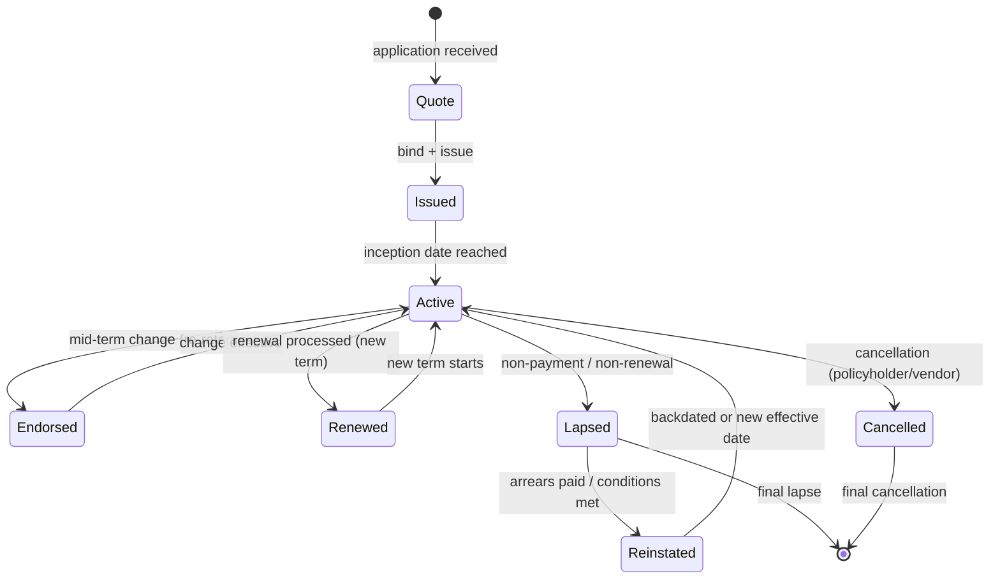
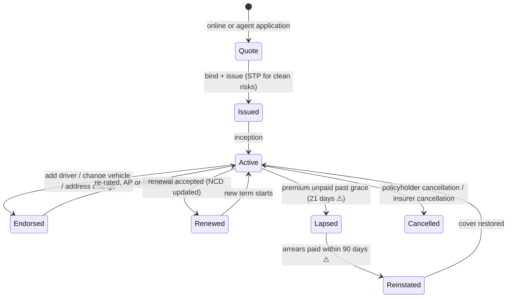

# Policy Administration Systems (PAS) in Insurance Companies: A Comprehensive Guide

> **Author:** Jack Liu Shurui — Solution Architect at Cymbal Bank, Singapore
> **Context:** Financial Services Technology — Insurance Core Systems — the dedicated deep-dive on the **Policy Administration System (PAS)**: the system of record of an insurer. The PAS definition and role (system of record, core-stack position, why it matters), the functional architecture (product model, policy model, rating, billing, commission, documents, reporting), the policy lifecycle (quote → issue → endorse → renew → lapse → reinstate → cancel), the product model deep-dive (coverages, options, limits, rules, rates, no-code configuration), the rating deep-dive (factors, tables, methods), billing and collections, commission, the vendor landscape (Guidewire, Duck Creek, Sapiens, TCS BaNCS, EIS, FINEOS, Socotra), modernization and migration (legacy mainframe PAS, rehost/replatform/replace, policy data conversion), implementation and operations (multi-year programs, phases, BAU batch), a worked implementation for a mid-size Singapore general insurer, and a one-page summary
> **Repository:** [github.com/jackliusr/research](https://github.com/jackliusr/research)
> **Series:** Financial Services Software-Systems Guides — the insurance counterpart of the core-banking series ([Core Banking Systems Guide](core_banking_systems_guide.md)). This guide is the **dedicated PAS deep-dive**: it expands §2 of [Insurance Software Systems Guide](insurance_software_systems_guide.md) (the insurance-software umbrella) to full depth, mirroring the deep-dive pattern of [Interest Engines in Core Banking](interest_engines_core_banking_guide.md) and [The Posting Engine in Core Banking](posting_engine_core_banking_guide.md). The business-side processes (products, distribution, policy-servicing processes, compliance) live in [Insurance Products, Processes and Compliance Guide](insurance_products_processes_compliance_guide.md); the data-model angle (ACORD, the policy/risk/cover model, IFRS 17) lives in [Data Models for Banking and Insurance](data_models_banking_insurance_guide.md) — both cross-referenced, not duplicated.

**Verification convention used throughout: ✅ = verified in this research pass (vendor/product pages, primary or secondary sources); ⚠ = flagged (approximate, single-source, divergent estimates, or structural inference); unmarked = structural/industry knowledge presented as such. The consolidated claims-status notes are in §12.4.**

---

## Table of Contents

1. [The PAS: Definition and Role](#1-the-pas-definition-and-role)
2. [The PAS Functional Architecture](#2-the-pas-functional-architecture)
3. [The Policy Lifecycle](#3-the-policy-lifecycle)
4. [The Product Model Deep-Dive](#4-the-product-model-deep-dive)
5. [The Rating Deep-Dive](#5-the-rating-deep-dive)
6. [Billing and Collections](#6-billing-and-collections)
7. [Commission](#7-commission)
8. [The Vendor Landscape](#8-the-vendor-landscape)
9. [Modernization and Migration](#9-modernization-and-migration)
10. [Implementation and Operations](#10-implementation-and-operations)
11. [Worked Example: A PAS Implementation for a Mid-Size SG Insurer](#11-worked-example-a-pas-implementation-for-a-mid-size-sg-insurer)
12. [Summary: The PAS in One Page](#12-summary-the-pas-in-one-page)
13. [Glossary](#13-glossary)
14. [References and Further Reading](#14-references-and-further-reading)

---

## 1. The PAS: Definition and Role

### 1.1 What a PAS Is

The **Policy Administration System (PAS)** is the **system of record for the insurance contract**. It holds the authoritative, auditable version of every policy: *who* is insured (the parties), *against what* (the coverages and risks), *for how much* (the limits, sums insured, deductibles), *at what premium* (the price and its payment plan), and *with what endorsements* (every mid-term change). The canonical definition — consistent across vendor, analyst, and practitioner sources ✅ — is that a PAS **manages the full policy lifecycle from quote to issuance, servicing, renewal, and termination**, and that everything else in the insurer's estate either feeds it, consumes it, or reconciles to it:

- **Policies** — the contract record: policy number, product, term (inception/expiry), status, version history.
- **Coverages** — what is insured: the per-cover limits, sums insured, deductibles/excesses, extensions, exclusions.
- **Premiums** — what it costs: the rated premium, taxes/levies, payment plan, billing and payment history.
- **Parties** — who is involved: policyholder/insured, additional insureds, agents, brokers, beneficiaries (life), and their roles, addresses, and regulatory attributes.

A PAS is fundamentally **contract lifecycle software with an audit-grade memory**. Because the policy document is a legal contract and regulators require full reconstruction of history, the PAS must record every change as a versioned transaction — *what changed, when, by whom, with what approval, and with what financial effect*. This makes the PAS the insurance analogue of a bank's core banking system (see [Core Banking Systems Guide](core_banking_systems_guide.md) §1), with a different centre of gravity: a bank core is **transaction-throughput-optimised**; a PAS is **state- and version-optimised** — the policy is a long-lived, slowly-changing object, and the engine's job is to transition it correctly between lifecycle states, never losing the trail (see [Data Models for Banking and Insurance](data_models_banking_insurance_guide.md) §3 for the ACORD-flavoured data model that underpins this).

### 1.2 The PAS in the Core Stack

The "core" of an insurer is a **suite of specialist systems**, each the system of record for its domain — and the PAS is the centre of gravity. The full stack, with the PAS's position (from the umbrella guide, [Insurance Software Systems Guide](insurance_software_systems_guide.md) §1.2–1.3):

```mermaid
flowchart TB
    subgraph Channels["Distribution Channels"]
        A[Agents / Agency Portals]
        B[Brokers / Broker Portals]
        C[Bancassurance]
        D[Digital / Direct / Embedded]
    end
    subgraph Digital["Digital Layer"]
        E[Customer Portals]
        F[API Gateway / Integration Layer]
    end
    subgraph Core["Insurance Core"]
        H[Underwriting<br/>Rules + Rating Engine]
        I[PAS<br/>Policy Administration System]
        J[Billing<br/>(P&C: separate · Life: in PAS)]
        K[CMS<br/>Claims Management System]
        L[Reinsurance Administration]
    end
    subgraph BackOffice["Back Office"]
        M[Actuarial<br/>Prophet / MG-ALFA]
        N[Finance / GL]
        O[Data Warehouse / Lake]
    end
    A --> E
    B --> F
    C --> F
    D --> F
    E --> F
    F --> H
    H --> I
    I --> J
    I --> K
    I --> L
    K --> L
    I --> N
    K --> N
    I --> M
    I --> O
    J --> N
```

| System | Abbreviation | Role | PAS interaction |
|---|---|---|---|
| **Policy Administration System** | PAS | System of record for the contract: quotes, issuance, servicing, billing, renewals, lapses | — (the hub) |
| **Underwriting System** | UW | Risk selection, rating, decisioning (accept/refer/decline); often embedded in the PAS | Feeds the PAS: a bound decision becomes a PAS issuance |
| **Claims Management System** | CMS | System of record for losses: FNOL, reserving, assessment, settlement, recovery | Reads the PAS: cover validation before a claim is admitted |
| **Billing System** | — | Premium billing and collections; separate in P&C (Guidewire BillingCenter), inside the PAS in life | Consumes/extends the PAS premium data; payment status feeds lapse processing |
| **Reinsurance System** | — | Cession administration, RI accounting, recovery tracking | Consumes the PAS: issued/endorsed policies trigger cessions |
| **Actuarial System** | — | Cashflow modelling for pricing, reserving, valuation (FIS Prophet, Milliman MG-ALFA) | Reads the PAS: exposure and premium data feed pricing and reserving |
| **Finance / GL** | GL | Premium and commission accounting, payments, statutory reporting | Reconciles to the PAS: premium and commission postings |

The PAS is the **heart** — in banking terms, the "core banking system" of the insurer. Everything else either *feeds* it (underwriting), *consumes* it (claims, reinsurance, actuarial), or *reconciles to it* (finance, regulators). No policy transaction exists anywhere else in the estate that does not trace back to a PAS record.

### 1.3 Why the PAS Matters

- **The scale.** A mid-size insurer runs hundreds of thousands of policies; a large one runs **millions** (a major life insurer in Singapore runs multi-million-policy books, each with decades of history ⚠). The PAS must serve that book correctly *in force* — endorsing, renewing, and billing every policy on schedule, every day, with no drift. Scale is not just volume: it is **term** (life policies live 30+ years) and **history** (every version of every policy must be reconstructable for claims, disputes, and regulators).
- **The complexity.** Insurance products are among the most complex financial contracts in existence — multi-cover, option-laden, jurisdiction-specific, rate-table-driven, and re-priced by endorsement. The PAS's product model and rating engine are where that complexity is made manageable (or, in a bad implementation, institutionalised).
- **The revenue and the cashflow.** Premium billing and collection run through the PAS (or its billing twin). Lapses and reinstatements, renewal retention, and mid-term adjustments (additional/return premium) are **direct P&L events** — the PAS is where they are triggered and accounted for.
- **The regulatory weight.** The PAS is the source for MAS statistical returns, tax (stamp duty, GST), conduct records, and IFRS 17 policy data ⚠ (the accounting data requirements are in [Data Models for Banking and Insurance](data_models_banking_insurance_guide.md) §5). An unauditable PAS is a regulatory exposure.
- **The constraint on everything else.** Digital journeys, app-based claims, broker APIs, AI pricing — every one of them terminates in the PAS. This is why core replacement is the long pole of insurance modernization (see [Insurance Software Systems Guide](insurance_software_systems_guide.md) §8.1 and §9 of this guide).

### 1.4 The PAS vs the Related Systems: The Boundaries

**PAS vs CMS.** The cleanest boundary in insurance IT: the PAS is the system of record for *contracts*; the CMS is the system of record for *losses*. A policy that is never claimed lives entirely in the PAS; a claim that is reported lives in the CMS but *validates against* the PAS (is the cover in force? what are the limits? what is the excess?). The boundary is a hand-off, not a duplication: the CMS reads policy data; it never owns it.

**PAS vs UW.** The underwriting function (risk selection, rating, decisioning) is conceptually distinct from policy administration (contract lifecycle). In practice the boundary varies by vendor and line of business:
- **Personal lines (motor, home, travel):** UW is *inside* the PAS — straight-through processing (STP) means the PAS itself runs eligibility and rating rules and issues without human touch.
- **Commercial/specialty lines:** UW is a distinct workbench (Guidewire UnderwritingCenter ✅, Cytora, specialist submission systems) that produces an accepted *decision*, which the PAS then turns into an issued policy. The boundary: **UW decides whether and at what price; the PAS administers the contract that results.**
- The practical rule: *anything that changes the policy record is PAS territory; anything that decides whether a risk is acceptable is UW territory* — with the rating engine straddling both (it prices in UW, it re-prices on endorsement in the PAS).

**PAS vs billing.** In P&C, premium billing is frequently a **separate system** (Guidewire BillingCenter ✅, Duck Creek Billing, Sapiens Billing) because P&C premium payment plans (instalments, direct debit, broker accounting) are complex enough to warrant their own engine; in life insurance, billing is usually a **module inside the PAS** because life premiums are simpler (regular, long-duration, few plans). See §6.

### 1.5 The PAS Role Table

| System | Role | PAS interaction |
|---|---|---|
| **PAS** | Contract system of record: quote → issue → service → renew → lapse/cancel | The hub — owns policy, coverage, premium, party data |
| **UW** | Risk selection and pricing | Sends bound/issued decisions; receives endorsement re-rating requests |
| **CMS** | Loss system of record | Reads cover status, limits, excess; notifies PAS of claims affecting policy status (e.g. total loss) |
| **Billing** | Premium invoicing and collection | Receives premium and plan data; returns payment/arrears status for lapse processing |
| **Reinsurance** | Risk transfer administration | Receives issued/endorsed/cancelled policy events → cessions and RI accounting |
| **Actuarial** | Pricing, reserving, valuation | Receives exposure, premium, and policy-history data |
| **Finance/GL** | Accounting and statutory reporting | Receives premium, commission, and refund postings; reconciles to the PAS |
| **Document generation** | Policy schedules, certificates, notices | Triggered by PAS events; stores rendered documents against the policy |
| **Regulatory reporting** | MAS returns, tax, conduct records | Extracts from the PAS policy data (see [Insurance Products, Processes and Compliance Guide](insurance_products_processes_compliance_guide.md) for the compliance processes) |

---

## 2. The PAS Functional Architecture

### 2.1 The Layers

A PAS is a layered machine. The layers form a pipeline — product definition upstream, financial effects downstream — and each layer is configurable rather than coded in a modern system:

```mermaid
flowchart TD
    A[Product Model<br/>products · coverages · options · rules · rates] --> B[Policy Model<br/>policy · risk · cover · parties · versions]
    B --> C[Rating Engine<br/>premium = f(rating factors)]
    C --> D[Issuance<br/>bind · policy number · schedule · documents]
    D --> E[Servicing<br/>endorsements · renewals · lapses · reinstatements]
    E --> F[Billing & Collections<br/>invoices · payments · arrears]
    E --> G[Commission<br/>initial · renewal · override · clawback]
    E --> H[Documents<br/>schedules · certificates · notices]
    E --> I[Reporting<br/>in-force · regulatory · management]
    F --> J[GL Postings]
    G --> J
    H --> K[Document Store]
    I --> L[Warehouse / Regulator]
```

ASCII version:

```
        ┌─────────────────────────────────────────────────────────────┐
        │  PRODUCT MODEL   (products, coverages, options, rules, rates)│
        └─────────────────────────────────────────────────────────────┘
                                    │ defines
        ┌─────────────────────────────────────────────────────────────┐
        │  POLICY MODEL     (policy → risk → cover, parties, versions) │
        └─────────────────────────────────────────────────────────────┘
                                    │ prices
        ┌─────────────────────────────────────────────────────────────┐
        │  RATING ENGINE    (premium = base rate × factors − discounts)│
        └─────────────────────────────────────────────────────────────┘
                                    │ issues
        ┌─────────────────────────────────────────────────────────────┐
        │  ISSUANCE         (bind, policy number, schedule, documents) │
        └─────────────────────────────────────────────────────────────┘
                                    │ services
        ┌───────────────┬────────────────┬────────────────┬───────────┐
        │  BILLING      │  COMMISSION    │  DOCUMENTS     │  REPORTING│
        │  invoices,    │  initial,      │  schedules,    │  in-force,│
        │  payments,    │  renewal,      │  certificates, │  MAS,     │
        │  arrears      │  override      │  notices       │  IFRS 17  │
        └───────────────┴────────────────┴────────────────┴───────────┘
                                    │
                          GL postings · warehouse · regulators
```

### 2.2 The Product Model Layer

The product model is the **definitional heart** of the PAS: it describes what the insurer *sells* in a form the machine can execute. A product definition in a modern PAS bundles ✅:

- **Features** — the coverages (e.g. fire, theft, third-party liability), the options a customer can elect (e.g. add windscreen cover, add flood extension), and the limits/sums insured available (e.g. S$100k/200k/500k building cover bands).
- **Rules** — eligibility (who may buy), underwriting rules (when the system must refer to a human or decline), and pricing rules (which rating factors apply, which discounts stack).
- **Rates** — the rate tables and rating factors that the rating engine consumes (see §5).

The product model is what makes a PAS *multi-product*: the same engine administers motor, home, travel, and SME liability because each is a different *configuration* of the same model — not different code (see §4 for the deep-dive).

### 2.3 The Product Configuration

Product definition is delivered through **configuration tooling**, and the vendor arms race is about how far that tooling goes:
- **No-code / low-code product builders** — business users (product owners, actuaries, UW SMEs) assemble products from UI-driven components rather than code. Duck Creek's low-code configuration ("Duck Creek Author") explicitly targets empowering business users to configure products, rules, and workflows ✅; Guidewire ships configuration tools (Product Designer/Studio) alongside its data-model-driven Studio framework ✅; EIS and Socotra advertise configurator-first product management ✅.
- The claim to watch: **"no-code" in practice is usually "low-code with guardrails"** ⚠ — full product modelling (rate tables, document templates, complex rules) still needs vendor-trained configurators; the *speed* win is that changes deploy without a core release cycle.
- The emerging frontier is **AI-assisted product configuration** — Duck Creek's Agentic Product Configurator translates business requirements into configurable products ✅ (vendor claim ⚠ for the hype level). See §12.3 and the AI cross-refs.

### 2.4 The Policy Model Layer

The policy model is the **runtime structure** the PAS administers. The canonical hierarchy (ACORD-flavoured — see [Data Models for Banking and Insurance](data_models_banking_insurance_guide.md) §3) is:

```
Policy  (the contract: number, product, term, status, version)
 ├── Risk(s)  (what is insured: the car, the building, the person/group)
 │    ├── Cover(s)  (per-cover: sum insured, limit, excess, extensions, exclusions)
 │    └── Rating details (the factors that priced this risk)
 ├── Party(ies) (policyholder, additional insured, agent/broker, beneficiary)
 └── Transaction(s) (issue, endorsement, renewal, lapse — the version trail)
```

Three properties make the policy model a *model* rather than a form:
1. **One-to-many nesting** — a policy has one or more risks; a risk has one or more covers; a party has one or more roles. A fleet policy = one policy, many vehicles; a household policy = one policy, one building + contents risks, several covers each.
2. **Versioning** — every servicing event creates a new version (or transaction) of the policy; the PAS can reconstruct the policy *as it was on any date*, which is what claims (was cover in force at loss date?) and regulators (audit history) require.
3. **Status as state** — the policy's lifecycle state (quote/issued/active/endorsed/renewed/lapsed/reinstated/cancelled) is the master switch that governs which operations are legal (see §3).

### 2.5 The Architecture Table

| Layer | Function | Key processes | Vendor examples |
|---|---|---|---|
| **Product model** | Define products: features, rules, rates | Product creation, rate-table maintenance, regulatory filing of products | Duck Creek Author ✅, Guidewire Product Designer ✅, Socotra Configurator ✅ |
| **Policy model** | Hold the contract: policy/risk/cover/parties, versions | Policy creation, versioning, in-force queries, party maintenance | All cores (PolicyCenter, Duck Creek Policy, CoreSuite, BaNCS, PolicyCore) ✅ |
| **Rating** | Compute premium from rating factors | Quote rating, endorsement re-rating, renewal re-rating | Guidewire Rating/Price Management ✅, Duck Creek Rating ✅, Sapiens, EIS |
| **Issuance** | Turn bound quote into policy | Bind, policy number, schedule generation, document issuance | PolicyCenter, Duck Creek Policy ✅ |
| **Servicing** | Mid-term and term-end changes | Endorsements, renewals, lapses, reinstatements, cancellations | All cores (lifecycle functions) ✅ |
| **Billing** | Premium invoicing and collection | Billing runs, payment plans, arrears, refunds | Guidewire BillingCenter ✅, Duck Creek Billing ✅, Sapiens Billing |
| **Commission** | Agent/broker remuneration | Commission calculation, clawback, statements | Dedicated modules or add-ons (see §7) |
| **Documents** | Contract documents and notices | Template rendering, e-delivery, archival | Guidewire Document Generation ✅, Adobe-based stacks |
| **Reporting** | In-force, regulatory, management | In-force extracts, MAS returns, IFRS 17 data | InfoCenter/warehouse extracts ✅, BI tools |

---

## 3. The Policy Lifecycle

### 3.1 The States

The policy lifecycle is a **state machine** — the most important mental model for a PAS, because every PAS feature (rating, billing, commission, documents) hangs off the states and the transitions between them. The canonical states, consistent with the umbrella guide ([Insurance Software Systems Guide](insurance_software_systems_guide.md) §2.2) and vendor lifecycle documentation ✅:



ASCII version:

```
         application                     bind + issue              inception
 [*] ───────────────▶ QUOTE ───────────────────────▶ ISSUED ────────────────▶ ACTIVE
                                                      │                         │
                                              mid-term change               renewal / lapse / cancel
                                                      ▼                         ▼
                                                ENDORSED ────────────▶ RENEWED · LAPSED · CANCELLED
                                                      │                    ▲        │
                                               change effective            │   arrears paid,
                                                       │              REINSTATED ◀┘  conditions met
                                                       ▼                    │
                                                      ACTIVE ◀──────────────┘
```

The lifecycle is deliberately **cyclic** (renewal returns the policy to active for a new term) and **reversible at the edges** (lapse → reinstatement), and every transition is an **audited event**: who, when, why, and with what financial effect (AP/RP, refunds, commission clawback).

### 3.2 New Business: Quote → Issue

New business is the acquisition journey, and in a modern PAS it is designed for **straight-through processing**:

1. **Quote** — an application arrives (web, agent portal, broker API, bancassurance). The PAS (or the UW workbench feeding it) captures risk data, runs **eligibility** rules (is this risk writable at all?), applies **UW rules** (auto-accept vs refer vs decline), and prices the risk through the **rating engine** (§5). The quote is stored with its rating snapshot.
2. **Bind** — the customer accepts. The quote is *bound*: it becomes a commitment. (In broker channels, bind is often an ACORD message from the broker system ✅.)
3. **Issue** — the PAS creates the policy: policy number, term dates, cover structure, premium and payment plan, parties. It triggers the **downstream effects** that make the PAS the hub: billing setup (invoice/instalment plan), commission accrual, reinsurance cession, document generation (schedule, wording, certificates), GL postings, and the warehouse/regulator extracts ✅.

The KPI is **quote-to-issue time**: minutes for STP personal lines (70–95% STP ⚠ industry consensus), days with human UW for commercial lines (10–40% STP ⚠). See the worked example §11.

### 3.3 Endorsements: Mid-Term Changes

An **endorsement** is any change to an in-force policy: change of address, add/remove a driver, change of vehicle, increase sum insured, add a cover, mid-term cancellation. The PAS mechanics ✅:

- The endorsement creates a **new policy version** (the old version remains reconstructable — the audit requirement).
- The change is **re-rated for the remaining term**: the difference between the new premium and the old premium is either **additional premium (AP)** — the customer pays — or **return premium (RP)** — the insurer refunds. Pro-rata (time-based) vs short-rate (penalising early cancellation) conventions are product parameters.
- Endorsements cascade to **billing** (AP invoiced or RP refunded), **commission** (AP/RP adjustments, clawbacks), **reinsurance** (cession changes), and **documents** (endorsement schedule).
- Endorsements are the highest-volume servicing transaction and the most common target of self-service digital journeys ("change my address" should never need a call).

### 3.4 Renewals

At term end the policy renews — the largest revenue-and-retention event of the year ✅:

1. **Renewal rating** — the PAS re-prices the policy for the new term, typically with new rates (annual rate revisions), updated risk data (new claims history, new vehicle value, new NCD), and renewal discounts designed to retain.
2. **Renewal offer** — the renewal notice (with documents) goes out 30–60 days before expiry; the customer accepts, declines, or does nothing.
3. **Renewal processing** — accepted renewals create the new term: new policy version, new premium, new billing plan, renewed documents. Declined or silent renewals lapse at term end.

Renewals are **batch-heavy** (thousands of policies renew on common dates — year-end, quarter-end), so renewal processing is a classic nightly batch run (see §10.3 and [Core Banking Processes Guide](core_banking_processes_guide.md) for the batch pattern) and a favourite target for automation. Retention analytics (who renews, who lapses, at what price sensitivity) run off the PAS renewal history.

### 3.5 Lapses and Reinstatements

- **Lapse** — a policy lapses when (a) it is **not renewed** at term end, or (b) the **premium goes unpaid** past the grace period (typically 14–31 days ⚠ by market/line; the Singapore motor market is tightly governed here). Cover ceases; in life insurance lapse is the *default* end state of long-duration policies; in P&C it is a **collections-driven** state — the billing system flags arrears, dunning letters run, and non-payment lapses the policy (see §6.3).
- **Reinstatement** — the reversal of a lapse: the policy is brought back in force, usually with conditions ✅ — payment of arrears in P&C, proof of insurability in life — and with a backdated or new effective date. Reinstatement is a *rare but high-value* transaction (retaining a policyholder costs a fraction of acquiring one) and is tightly controlled: reinstatement windows, underwriting conditions, and premium recomputation are product parameters.

### 3.6 The Lifecycle Table

| State | Trigger | Key actions in the PAS | Systems touched |
|---|---|---|---|
| **Quote** | Application received | Capture risk data, run eligibility/UW rules, rate premium, store rating snapshot | UW workbench, rating engine, channels |
| **Issued** | Bind + issue | Create policy record, number, term, covers, premium; trigger billing, commission, cession, documents | Billing, commission, reinsurance, documents, GL |
| **Active (In Force)** | Inception | Start billing cycle, in-force reporting, claims eligibility | Billing, CMS (cover validation), reporting |
| **Endorsed** | Mid-term change | New version, re-rate remaining term, AP/RP, cascade updates | Rating, billing, commission, reinsurance, documents |
| **Renewed** | Term end, renewal accepted | Re-rate new term, new version, new billing plan, renewal documents | Rating, billing, documents, reporting |
| **Lapsed** | Non-renewal / unpaid premium past grace | Cease cover, final billing, commission clawback, lapse reporting | Billing (arrears), commission, reporting |
| **Reinstated** | Arrears paid / conditions met | Restore cover, recompute premium, new effective date | Billing, underwriting (life), documents |
| **Cancelled** | Policyholder/insurer cancellation | Terminate, pro-rata/short-rate refund, cancellation notice, clawbacks | Billing (refund), commission, documents, reinsurance |

---

## 4. The Product Model Deep-Dive

### 4.1 The Product Definition

A product definition is the complete executable specification of one thing the insurer sells. Structurally it decomposes as ✅:

- **Coverages** — the insurable perils/events each cover responds to (fire, theft, collision, public liability, hospitalisation). Each coverage carries its own **limit** (max payable), **excess/deductible** (first-loss amount borne by the insured), **extensions** (optional enhancements), and **exclusions** (what is not covered).
- **Options** — customer-selectable choices that change the contract: optional covers (windscreen, flood, legal protection), sum-insured bands, excess levels (higher excess → lower premium), payment frequency. Options are the *shopping cart* of insurance.
- **Limits and sub-limits** — the financial envelope: per-claim limits, annual aggregate limits, sub-limits per extension, and — in life — the sum assured and benefit structure.
- **Wordings and documents** — the legal contract text and the schedules/certificates rendered for this product (see §2.1 documents layer).

A worked product definition (motor) lives in §11.2.

### 4.2 The Product Rules

Rules are the *decision logic* of the product, and modern PASs separate them from code so that underwriters and product owners change behaviour without a release:

- **Eligibility rules** — who can buy: age bands, residency, vehicle class, occupation restrictions, territorial scope. *Fail → no quote.*
- **Underwriting rules** — what happens when the risk is outside auto-accept parameters: **refer** (to a human UW with the risk flagged) or **decline**. These encode the insurer's risk appetite.
- **Pricing rules** — how the premium is assembled: which rating factors apply to which cover, how discounts and loadings stack, rounding and minimum-premium rules (see §5).
- **Servicing rules** — what changes are allowed mid-term, cancellation conventions (pro-rata vs short-rate), reinstatement windows, renewal discount eligibility.

Rules are evaluated in a defined **order of precedence** (eligibility → UW → pricing), and every rule evaluation is logged — the audit trail that lets actuaries and regulators see *why* a premium is what it is (a requirement under fair-value and conduct regimes; see [Insurance Products, Processes and Compliance Guide](insurance_products_processes_compliance_guide.md)).

### 4.3 The Product Rates

Rates are the *pricing data* of the product: the tables and factors the rating engine consumes (see §5 for the engine). In a PAS these are configuration, not code:

- **Rate tables** — base rates per rating cell: e.g. motor base premium by vehicle make/model/age-band/garage-postcode; home premium per S$1,000 of sum insured by construction type. Tables can be large (thousands of cells) and are versioned (rate revisions apply to renewals and new business on defined dates).
- **Rating factors and relativities** — multipliers applied to the base rate: driver age/NCD in motor, security/alarm credits in home, occupation and sum-assured bands in life. A factor of 1.25 loads a young driver; a 50% NCD discounts a claim-free one.
- **Discounts and loadings** — stacking rules (which discounts combine, which are mutually exclusive), minimum premium floors, and expense/tax add-ons (GST, stamp duty, MAS levies).
- **Rate maintenance** — the product-model layer versioning above: a rate change is a *data deploy* with an effective date, not a code change — the property that lets insurers respond to claims inflation or competitor pricing in weeks, not quarters.

### 4.4 The No-Code Configuration

The vendor claim is that product definition is a **business-user activity**: product owners and actuaries assemble coverages, rules, and rates in a visual builder (Duck Creek Author / low-code configuration ✅, Guidewire product configuration tooling ✅, EIS, Socotra configurator ✅), and the PAS generates the executable product. The verified reality, flagged honestly:

- **What is real:** the *configuration* of products — coverages, options, rate tables, simple rules, documents — genuinely no/low-code in the modern cores ✅; vendors actively push "business users configure products" ✅ (Duck Creek's low-code page is explicit).
- **What to flag ⚠:** (1) complex rating logic and rule orchestration still require vendor-trained configurators or developer support — "no-code" is a spectrum; (2) the tooling is the vendor's lock-in surface — a product built in Duck Creek Author does not port to Guidewire; (3) governance still needs IT: products are regulated filings, and the audit trail of *who configured what* is a control, not a convenience.
- **The trend (⚠ for the hype):** AI-assisted product configuration — translating a product brief into a draft configuration (Duck Creek Agentic Product Configurator ✅ vendor claim; see §12.3) — is the direction, with human review as the control.

### 4.5 The Product Model Table

| Component | Description | Examples |
|---|---|---|
| **Coverage** | A defined insurable event/benefit with its own limit, excess, extensions, exclusions | Fire, theft, third-party liability, windscreen, hospitalisation, death benefit |
| **Option** | Customer-selectable product choice | Add flood cover, choose excess level, select sum-insured band, payment frequency |
| **Limit / sum insured** | The financial envelope of a cover | S$500k building sum insured; S$100k per-claim limit; annual aggregate |
| **Excess / deductible** | First-loss amount borne by the insured | S$500 motor excess; S$1,000 excess option for premium discount |
| **Extension** | Optional enhancement to a base cover | Legal protection, courtesy car, worldwide cover |
| **Exclusion** | Events/conditions not covered | Wear and tear, pre-existing conditions, war, deliberate damage |
| **Eligibility rule** | Who may buy | Minimum driver age 18; vehicle < 15 years old; residency requirement |
| **Underwriting rule** | Accept/refer/decline logic | Auto-accept NCD ≥ 1 year; refer high-performance vehicles; decline commercial use |
| **Pricing rule** | Premium assembly logic | Factor stacking, rounding, minimum premium, GST/stamp-duty add-ons |
| **Rate table** | Base rates per rating cell | Motor base premium by make/model/age/postcode; home rate per S$1,000 |
| **Rating factor** | Relative multiplier on base rate | NCD, driver-age loading, alarm credit, occupation class |
| **Wording / document template** | The legal contract and its artefacts | Policy wording, schedule, certificate, renewal notice |

---

## 5. The Rating Deep-Dive

### 5.1 The Rating Engine

The rating engine computes the premium. The universal shape — across manual, table, rules-based, and predictive methods — is:

```
premium = base rate × (factor₁ × factor₂ × …) − discounts
        + taxes / levies (GST, stamp duty, MAS levy)
```

The engine's inputs are the **rating factors** captured on the policy (risk details + cover selections + product rate tables); its output is the **premium breakdown** (per-cover premium, total, taxes) that the PAS stores on the quote and policy and hands to billing. The engine is invoked at every pricing moment in the lifecycle: quote, endorsement (re-rate remaining term → AP/RP), renewal (re-rate new term), and reinstatement. Verified arithmetic (motor, worked later in §11.2):

> Base premium S$1,000 × driver-age factor 1.25 × NCD factor 0.50 = S$625; + 9% GST = **S$681.25**. ✅ (the arithmetic pattern, not a specific product)

### 5.2 The Rating Factors

Rating factors fall into three families:

- **Risk factors** — the insured object's riskiness: vehicle make/model/age/CC in motor; construction, age, location (flood zone) in property; age, health, occupation, smoking in life; destination, duration in travel.
- **Coverage factors** — what is bought: sum insured (more cover → higher premium, often non-linear), excess level (higher excess → discount), optional covers (each adds premium), payment frequency (monthly instalments carry a surcharge).
- **Policyholder factors** — who is insured: NCD/claim history, age band, claims experience (experience rating for commercial), credit/behavioural scores where permitted ⚠ (regulatory sensitivity — see the compliance guide).

The art of rating is **factor hygiene**: factors must be (a) statistically justified (actuarially validated), (b) legally permissible (protected attributes are prohibited in many jurisdictions), and (c) administrable (the PAS can actually capture them at quote time).

### 5.3 The Rating Methods

| Method | Mechanism | Where it lives |
|---|---|---|
| **Manual rating** | Human looks up rate tables and computes | Legacy PAS / small commercial lines; the *baseline* all engines automate |
| **Table-based rating** | Engine looks up base rate in a table, applies factor relativities | The dominant method in P&C today (motor, home, travel) ✅ |
| **Rules-based rating** | Decision-tree/rule logic assembles premium from conditions | Complex/commercial lines; supplements tables for loadings and minimums |
| **Predictive / GLM / ML rating** | Statistical models (GLM, gradient boosting, telematics scores) produce relativities or the full premium ⚠ | Increasingly the pricing engine upstream (actuarial), with scores fed into the PAS rating; "rating engine" remains the deterministic executor |

The honest flag ⚠: **predictive pricing is real and standard upstream** (GLM pricing is decades old; ML and telematics scoring are mainstream — see [Insurance Software Systems Guide](insurance_software_systems_guide.md) §6.6), but the *PAS rating engine itself* remains a deterministic executor — it applies model outputs (relativities, scores) rather than running models inline. The model-in-the-engine future is emerging but not the norm.

### 5.4 The Rating Table

| Method | Description | Use case |
|---|---|---|
| **Manual** | Human-computed premium from paper tables | Small books, legacy, non-automated commercial lines; the baseline to automate |
| **Table-based** | Engine lookup: base rate × factor relativities | Personal lines STP (motor, home, travel) — the default ✅ |
| **Rules-based** | Conditional logic assembles premium (loadings, minimums, stacking) | Commercial lines, complex products, supplementing tables ✅ |
| **Predictive (GLM/ML)** | Statistical model produces relativities or scores ⚠ | Pricing upstream (actuarial); scores consumed by the engine; inline ML rating emerging |
| **Usage-based / telematics** | Behavioural data (distance, driving style) prices the premium ⚠ | UBI motor products — score feeds the engine at renewal ⚠ (see the umbrella guide §6.6) |

---

## 6. Billing and Collections

### 6.1 Premium Billing

Billing turns the rated premium into **collectable money**. The PAS (or its billing twin — see §1.4) manages ✅:

- **Billing cycles** — the payment plan: annual single premium, semi-annual, quarterly, or monthly **instalments**. Monthly instalments are the dominant P&C pattern (spread premium + an instalment surcharge); life premiums are typically regular (monthly/quarterly) by design of the product.
- **Invoice generation** — the billing run creates invoices/statements per billing cycle, per policy, per channel (paper, e-invoice, broker statement). In broker channels, the broker is billed and the broker collects from the insured (the PAS must handle *who owes* — policyholder-direct vs broker-billed vs bancassurance).
- **Billing runs** — batch processes that generate the cycle's invoices, debit direct-debit accounts, and update premium receivables (see §10.3 for the batch pattern).

### 6.2 Payment Methods

- **Direct debit** — the insurer (or its bank partner) debits the policyholder's account on schedule; in Singapore, **GIRO** is the standard premium-collection rail. The PAS/billing engine submits debit files and reconciles returns (success, insufficient funds, account closed) ✅.
- **Credit/debit card** — card on file for recurring charges; tokenised via the payment provider (PCI scope avoided).
- **Instalment plans** — the scheduling engine itself: premium split into equal instalments with the surcharge and first-instalment-upfront convention (typically first + one, i.e. two months' premium upfront ⚠ by market convention).
- **Other rails** — cheque, PayNow/FAST (Singapore instant payments ⚠ increasingly used), cash at branches/agents, and — for life — salary deduction (group schemes) and standing instructions.

### 6.3 Collections

Collections is the *enforcement* engine behind billing ✅:

- **Arrears management** — the billing engine tracks each instalment's due date and payment status; missed payments move the premium receivable to arrears.
- **Dunning** — the escalation ladder: reminder notices, then warning notices, then **lapse/cancellation notice** with a final date. Dunning frequency and wording are regulated conduct (fair-dealing — see [Insurance Products, Processes and Compliance Guide](insurance_products_processes_compliance_guide.md)).
- **Lapse for non-payment** — after the grace period, the policy lapses (§3.5); the PAS executes the lapse, computing return premium if any, triggering commission clawback and cancelling cover. Cover *cessation* is the collection lever — which is why the billing system's arrears status is the trigger for the PAS lapse transaction.
- **Refunds and return premium** — RP from endorsements and cancellations flows back through billing (refund to policyholder, credit to broker account).
- **The collections dial** — grace periods, dunning cadence, and reinstatement windows are product-level configuration: too strict loses customers, too loose leaks premium. The PAS is where that dial lives.

### 6.4 The Billing Table

| Function | Description | Key processes |
|---|---|---|
| **Billing cycles** | Payment plan construction (annual → monthly instalments) | Plan creation, instalment scheduling, surcharge calculation |
| **Invoicing** | Invoice/statement generation per cycle and channel | Billing runs, e-invoicing, broker statements |
| **Payments** | Capture and reconcile payments across rails | Direct debit (GIRO) files, card tokens, PayNow, cheque; reconciliation |
| **Collections** | Enforce payment and manage arrears | Dunning ladder, grace periods, arrears reporting |
| **Lapse processing** | Terminate cover for non-payment | Arrears → notice → lapse transaction; RP and clawback |
| **Refunds** | Return premium and adjustments | AP invoicing, RP refunds, broker credits |
| **GL integration** | Premium accounting | Premium receivable, cash, refund postings to the GL |

---

## 7. Commission

### 7.1 Commission Calculation

Commission is the remuneration the insurer pays its **distribution** — agents, brokers, bancassurance partners, MGAs — for bringing and keeping business. The PAS/billing engine computes it from the **premium events** it already owns ✅:

```
commission = premium (or premium component) × commission rate
```

The structure varies by channel and line: flat percentage of premium, **tiered** (higher rates at volume bands), **profit-share** (brokers sharing underwriting profit ⚠ commercial lines), and **fee-based** for MGAs. Commission runs off *collected* premium (cash-basis) or *billed* premium (accrual-basis) depending on the arrangement ⚠ — and the engine must handle both conventions.

### 7.2 The Commission Types

- **Initial (acquisition) commission** — paid on new business, usually the highest rate, often expressed as a percentage of first-year premium (life) or of the full-term premium (P&C annual policies).
- **Renewal commission** — paid on each renewal, typically a lower rate than initial; the engine pays it from the renewal premium event.
- **Override commission** — additional commission on top of the base schedule: volume overrides (the whole book's rate steps up at a band), management overrides (agency principals), and product-specific incentives. Overrides are the incentive-engine of distribution.
- **Clawback / chargeback** — the mirror: when a policy **lapses or cancels early** (typically within a clawback window, e.g. 12 months ⚠ common in life), the initial commission is clawed back (whole or pro-rata) and offset against future commissions. This is why commission and lapse processing are coupled in the PAS (see §3.5/§6.3).

### 7.3 The Commission Table

| Type | Basis | Examples |
|---|---|---|
| **Initial (acquisition)** | % of first-year / new-business premium | Life 20–30% of annual premium ⚠; motor agent 10–15% ⚠ |
| **Renewal** | % of renewal premium, recurring | 2–5% p.a. ⚠ (life trails); 10% on renewals ⚠ (P&C agents) |
| **Override** | Additional % on top of base | Volume bands (e.g. +2% above S$5M book ⚠), management overrides |
| **Clawback / chargeback** | Repayment on early lapse/cancel | Full initial commission clawback within 12 months ⚠, pro-rata after |
| **Profit-share** | Share of underwriting profit ⚠ | Commercial broker treaties ⚠ |
| **MGA fee** | Fixed fee per policy/administration ⚠ | Specialty lines MGAs ⚠ |

*Rates above are flagged ⚠ — commission schedules are commercially confidential and vary by channel, line, and market; the structure, not the numbers, is the verified part.*

---

## 8. The Vendor Landscape

### 8.1 The Core PAS Vendors

The P&C PAS market is dominated by two platforms — **Guidewire** and **Duck Creek** — with **Sapiens** and **TCS BaNCS** spanning P&C/life/health, **EIS** and cloud-native entrants (Socotra) for digital-first insurers, and **FINEOS** leading the life/accident/health space. All verified in this pass ✅:

- **Guidewire PolicyCenter** ✅ — Guidewire's policy administration product, part of InsuranceSuite (PolicyCenter + ClaimCenter + BillingCenter). "Manages the full policy lifecycle, from quote to renewal, in one connected system; flexible configuration tools let insurers model and deploy new products quickly" (Guidewire). Personal, commercial, and specialty lines. Delivered on-premise historically and now via **Guidewire Cloud** (PaaS) ✅, with **InsuranceNow** as the lighter all-in-one option for smaller carriers ⚠. The P&C benchmark — the most common default shortlist entry.
- **Duck Creek Policy (OnDemand)** ✅ — Duck Creek's PAS, delivered **SaaS-native** through **Duck Creek OnDemand**: "enables insurers to develop and launch new insurance products and manage all aspects of policy administration, from product definition to quoting, binding, and servicing" (Duck Creek). Strengths: cloud delivery, **low-code product configuration for business users** (Duck Creek Author) ✅, multi-currency/multilingual for international books ✅. Positioned against Guidewire as the faster-configuration, SaaS-first alternative ✅.
- **Sapiens CoreSuite** ✅ — the P&C suite (policy, billing, claims, underwriting) of Sapiens, an Israel-headquartered insurer-tech group; **cloud-based** and AI-augmented; named a Celent PAS leader for P&C EMEA & APAC 2025 (vendor-cited ⚠). Also has life/annuity/health suites (Sapiens IDIT etc.) ⚠ — a genuine multi-line group.
- **TCS BaNCS Insurance** ✅ — Tata Consultancy Services' insurance suite: **modular components for policy administration, product configuration, and billing** across P&C, life, and health ✅, plus a strong **reinsurance** administration module (BaNCS Reinsurance ✅, per the umbrella guide §5). The classic choice for large, multi-line, multi-country insurers and for RI-heavy books; often paired with heavy TCS delivery capacity.
- **EIS PolicyCore** ✅ — EIS Group's policy administration and underwriting product: "highly configurable," **event-driven**, SaaS architecture, managing the full lifecycle **across multiple products from a single platform** (EIS). EIS was acquired by EXL (⚠ secondary source) and markets itself as the digital-ready, customer-centric core.
- **FINEOS** ✅ — the leader for **Life, Accident & Health (LA&H) and employee benefits**: the FINEOS Platform blends **AdminSuite** (policy admin), the Digital Ecosystem, and Actionable Data on a single **SaaS** platform (AWS-based ✅). FINEOS is the go-to for group life/health and benefits administration (the umbrella guide's FINEOS Claims flagship noted in §3).
- **Cloud-native entrants** ✅ — **Socotra**: founded 2014, **cloud-native, API-first** PAS for P&C/specialty, all clients on one version, product configurator ✅; plus **BriteCore** (policy lifecycle, document generation, rules-driven ⚠) and **Majesco** (life/P&C suites, notable in North America ⚠). These matter for greenfield and MGA launches.

### 8.2 The Vendor Comparison Table

| Vendor | Product | Lines of business | Deployment | Strengths | Target market |
|---|---|---|---|---|---|
| **Guidewire** ✅ | PolicyCenter (+InsuranceSuite) | P&C: personal, commercial, specialty | Cloud (Guidewire Cloud) or on-prem | Full lifecycle, ecosystem (marketplace, AI accelerators), market standard | Mid/large P&C insurers, complex commercial |
| **Duck Creek** ✅ | Policy OnDemand (Policy + Billing + Claims) | P&C personal-lines-led, multi-line | SaaS (OnDemand) | No/low-code product config, SaaS speed, internationalisation | Personal-lines and digital-first insurers, MGAs |
| **Sapiens** ✅ | CoreSuite (policy, billing, claims, UW) | P&C + life/health/annuity suites | Cloud or on-prem | Multi-line breadth, AI augmentation, Celent leader EMEA/APAC ⚠ | Multi-line insurers, EMEA/APAC |
| **TCS BaNCS** ✅ | BaNCS Insurance (modular) | P&C, life, health, reinsurance | Cloud or on-prem + TCS delivery | Reinsurance strength, multi-country, delivery scale | Large multi-line, RI-heavy insurers |
| **EIS** ✅ | PolicyCore (+EIS Platform) | P&C, group | SaaS/cloud, event-driven | Configurability, event-driven architecture, customer-centric | Digital-first insurers, complex products |
| **FINEOS** ✅ | FINEOS Platform (AdminSuite) | LA&H, employee benefits | SaaS (AWS) | Benefits/group depth, single-platform admin+claims | Life/accident/health and benefits insurers |
| **Socotra** ✅ | Socotra (cloud-native core) | P&C, specialty | SaaS (AWS), single version | API-first, speed to launch, configurator | Greenfield, MGAs, tech-forward carriers |

### 8.3 The Vendor Selection

Vendor selection for a PAS is a **programme-level decision**, not a procurement exercise — the selection criteria, scoring, due diligence, and contracting mechanics are covered in depth in the [Vendor Management Guide](../management/vendor_management_guide.md); the PAS-specific shape of the criteria is: (1) **line-of-business fit** (personal-lines STP vs commercial UW workbenches vs group benefits), (2) **product-model power** (no-code reach, rate-table management, regulatory filing support), (3) **integration estate** (APIs, ACORD, event backbone — see the umbrella guide §8.2), (4) **deployment and run model** (SaaS vs PaaS vs on-prem; MAS outsourcing oversight for cloud ⚠), (5) **data migration and exit rights** (portability, export formats), (6) **total cost and delivery capacity** (vendor SI vs your team), and (7) **ecosystem** (marketplace accelerators, AI partners). The worked example (§11.4) shows a scored selection.

### 8.4 The PAS Market

The PAS market is substantial and growing, but **estimates diverge widely** ⚠ — flag honestly:

- Insurance-PAS market ≈ **US$7–10B in 2025**, growing ~6–8% CAGR to ≈US$12–15B by 2034 ⚠ — three 2026 analyst reports put 2025 at US$7.2B (6.8% CAGR) ⚠, US$8.3B (7.8%) ⚠, and US$10.5B ⚠; the life-PAS subset is even more divergent (US$3.2B–US$10.5B in 2025 across four reports ⚠). The direction — high-single-digit growth driven by legacy-core replacement and digital transformation — is consistent across all sources ✅; the level is not.
- Context: the total insurance-software market is ≈US$14–18B (2025) ⚠ (per the umbrella guide §11), so PAS is roughly half of it — consistent with PAS being the biggest single core category.
- **Structural drivers** ✅ (industry consensus): retiring mainframe/COBOL PASs, SaaS adoption, regulatory pressure (MAS technology-risk expectations), and the need for product-speed (no-code) and data access (IFRS 17/RBC).

---
## 9. Modernization and Migration

### 9.1 The Legacy PAS

The typical legacy PAS is a **mainframe-based, COBOL-coded** system, 20–40 years old, built in-house or from an early-generation package, and held together by institutional knowledge ✅ (the pattern is consistent across industry sources: "decades-old COBOL systems, multiple policy administration platforms, tightly coupled integrations, mainframe dependencies, batch-driven processes" — industry consensus). Its signature traits:

- **Batch-driven** — endorsements and renewals processed overnight; the system of record updates on a T+1 cadence.
- **Product logic in code** — a new product or rate change is a *programming* exercise (COBOL changes, compile, deploy), taking quarters; product configuration is not a business-user activity.
- **Data embedded in the code and files** — policy data in VSAM/IMS/IDMS files or legacy DBMS, with business meaning scattered across copybooks and undocumented edits.
- **Tight coupling** — interfaces are file-based and point-to-point; every change risks breaking a downstream (claims, GL, broker feed).
- **Aging skills** — COBOL programmers retire faster than they are replaced; the risk is not only technical but *knowledge* (the "who knows why this field works this way" risk).

The honest flag ⚠: not *all* legacy cores are mainframe/COBOL — many are 1990s/2000s client-server or early-Java systems — but the *mainframe COBOL PAS* is the canonical and still-common case (anecdote ⚠: a 2023 report cites a major US insurer spending ~US$120M to rewrite its policy administration system from COBOL to Java). The point stands regardless of the specific technology: **the legacy PAS is the constraint** on the insurer's speed, data access, and cost base.

### 9.2 The Modernization Approaches

The standard taxonomy, from least to most change ✅:

1. **Rehost** (lift-and-shift) — move the mainframe workload to an emulated/cloud environment (e.g. COBOL on z/OS → COBOL on Linux/cloud) with minimal code change. Fast, low-risk, but **preserves the legacy** — no new product speed, no new data access. A runway extension, not modernization.
2. **Replatform** (lift-and-refactor) — move and partially rebuild: re-platform the database, expose APIs over the legacy core, add a digital facade. The **strangler-fig pattern** (see the umbrella guide §8.1): modern channels and new products on new platforms, legacy core gradually retired. The realistic path for large books.
3. **Replace** (big-bang or phased) — implement a modern PAS (Guidewire/Duck Creek/Sapiens/BaNCS/EIS/Socotra) and migrate the policy book. The only path to full product speed, no-code configuration, and real-time data — and the highest-risk path, because of the data migration (§9.3) and business interruption (§9.4).

The industry pattern ⚠: replacement programs run **3–5 years late and 2–3× budget** more often than not (industry consensus, per the umbrella guide §11), almost never because of the vendor software — because of **data migration and integration**. McKinsey's framing ✅ (via industry coverage): in policy-administration migrations the biggest constraints are rarely about writing new code — they are about **policy data migration** (history, versioning, legacy quirks) and **interface re-pointing**.

### 9.3 The Policy Data Migration

Policy data migration is the **heart of the risk** and the part of the programme that defines success ✅:

- **Extract** — pull every policy, version, coverage, party, premium, and transaction from the legacy store (VSAM/IMS files, copybooks, undocumented edits). *Legacy data is dirty:* duplicate parties, orphan coverages, policies in impossible states, codes whose meaning is lost.
- **Cleanse** — deduplicate parties, reconcile statuses, map legacy codes to the target's reference data (product codes, rate codes, reason codes), drop or quarantine irrecoverable records.
- **Map** — the heart of the work: legacy fields → target data model (ACORD-aligned — see [Data Models for Banking and Insurance](data_models_banking_insurance_guide.md) §3). Mapping decisions are *business* decisions: how does a legacy "special condition" free-text field become structured cover data? What does "renewal history" mean in the new versioning model?
- **Transform and load** — build the target records (policy → risk → cover → party → transaction hierarchy), load in dependency order (parties → products → policies → transactions), and re-run the target's own validations.
- **Reconcile** — the non-negotiable gate: policy counts, premium totals, in-force status per line of business, and a **sample-level audit** (pick N policies, compare legacy vs target record-by-record) must tie out before cutover.
- **Parallel run and cutover** — run the old and new systems in parallel (weeks-to-months), reconcile daily, then cut over with a freeze window and a rollback plan.

### 9.4 The Migration Risks

- **Data loss / corruption** — the existential risk: policies that vanish, premiums that change, coverages that drop. Mitigation: reconciliation gates, sample audits, frozen legacy archive retained for years (regulators require history).
- **Business interruption** — endorsements and renewals must keep flowing during cutover; a long freeze window destroys service (and retention). Mitigation: phased cutover by line of business, weekend cutovers, dual-running.
- **History truncation** ⚠ — a common scoping decision: migrate *in-force* policies fully, but only a few years of *history* (or none) for lapsed policies. Legal and actuarial consequences (claims on old policies, reserving triangles, conduct records) must be priced into the scoping — regulators and actuaries often reject short history windows.
- **Interface re-pointing** — every downstream (claims, GL, broker feeds, reinsurance, regulators) must switch from the legacy feed to the new system's feed; a missed interface is a silent data break.
- **Knowledge loss** — the legacy system's undocumented behaviour ("we always round this way in March") surfaces during reconciliation, not design.

### 9.5 The Modernization Table

| Approach | Description | Risks | Timeline ⚠ (typical) |
|---|---|---|---|
| **Rehost** | Lift-and-shift legacy to emulated/cloud environment | Low — but preserves legacy constraints (no product speed, no data access) | 6–12 months |
| **Replatform (strangler-fig)** | APIs + digital facade over legacy; new products on new platform; legacy retired gradually | Medium — dual-running complexity, interface re-pointing | 2–4 years phased |
| **Replace (big-bang)** | New PAS + full policy book migration in one cutover | High — data migration, business interruption, history truncation | 2–5 years (12–36 months for mid-market ✅, longer for large/complex ⚠) |
| **Replace (phased)** | New PAS per line of business, sequential cutovers | Medium-high — multi-year dual systems, but bounded cutover risk | 3–6 years ⚠ |

---

## 10. Implementation and Operations

### 10.1 The Implementation Lifecycle

A PAS implementation is a **programme, not a project** ✅: industry sources put core-system implementations (Guidewire, Duck Creek, Majesco class) at **12–36 months for a mid-market carrier**, scaling with scope and migration complexity; large-carrier digital-transformation programmes run **multi-year with phased delivery** ⚠; and vendor-selection write-ups openly discuss **3–5-year implementation** horizons for the big platforms ⚠. The verified shape:

- **The software is the small part.** Integration and data migration dominate — industry coverage puts **integration at 40–60% of project time** in insurance core programmes ⚠ (Decerto/industry blogs), consistent with the umbrella guide's "the core selection is 20% of the effort; the interfaces are 80%" (see the umbrella guide §9.5).
- **Configurators are the scarce skill.** Modern cores are configured, not coded — the programme's critical path runs through vendor-trained configurators and product analysts, not developers.
- **The business is in the programme.** Product definitions, rate tables, and data-mapping decisions are business decisions; a PAS programme that treats them as IT tasks fails on day one of UAT.

### 10.2 The Implementation Phases

The canonical phase model, with the PAS-specific content ✅:

1. **Discovery (8–16 weeks ⚠)** — current-state analysis of the policy book (lines, products, volumes, states), the legacy data estate, the interface inventory, and the target operating model; vendor/product scoping; the data-migration strategy is *defined here*, not later.
2. **Design (3–6 months ⚠)** — target architecture (PAS + billing + integrations), the **product model** (which products, with what coverages/options/rules/rates — §4), the policy data model mapping (legacy → target, §9.3), interface specifications (ACORD, APIs, batch), and the migration design.
3. **Build/Configure (6–12 months ⚠)** — product configuration in the vendor tooling, policy model setup, rating engine configuration, billing and commission setup, document templates, integration builds, and the migration toolchain (extract/cleanse/map/transform/load).
4. **Test (3–6 months ⚠)** — the heavyweight phase for a PAS: **data migration tests** (reconciliation gates), functional UAT with the business (product behaviour, endorsement/renewal scenarios), integration testing, volume/performance testing (billing runs at book scale), and **parallel-run dress rehearsals**.
5. **Deploy/Cutover (weeks ⚠)** — freeze window, load, reconcile, parallel run, cutover, hypercare. Phased by line of business where the book allows.

### 10.3 The PAS Operations (BAU and Batch)

Once live, the PAS runs as **business-as-usual**, and its rhythm is **batch** ✅ — the same end-of-day/nightly pattern as a bank core (see [Core Banking Processes Guide](core_banking_processes_guide.md) §4 for the batch mechanics): 

- **Nightly / end-of-day runs** — the daily batch window executes: billing runs (invoice generation, direct-debit submissions), arrears and dunning sweeps, lapse processing, renewal pre-processing, commission runs, reinsurance cession feeds, GL postings, and extracts to the warehouse and regulators. The EOD is the *integrity checkpoint*: reconciliation of premium totals, policy counts, and posting control totals — the PAS equivalent of a bank's EOD trial balance.
- **Calendar-driven campaigns** — the monthly/quarterly/year-end cycles: renewal campaigns at term-end, annual rate revisions (new rate tables with effective dates), regulatory returns (MAS statistical returns, tax), IFRS 17/RBC data extracts.
- **Event-driven complement** — modern cores publish domain events (policy issued, premium paid, policy lapsed) to an event backbone for real-time effects (claims eligibility, CX pushes, analytics) — but the *batch window remains the backstop* for correctness and control totals (see the umbrella guide §8.2 and the [Event Stream Processing Guide](../technology/event_stream_processing_guide.md)).
- **In-force management** — the daytime servicing workload: endorsements, renewals (non-batch), reinstatements, cancellations, customer and broker queries — all versioned and audited per §3.
- **Operational controls** — reconciliation (PAS ↔ billing ↔ GL ↔ reinsurance), data-quality monitoring (policies in impossible states, arrears aging), access control and segregation of duties, and the MAS technology-risk regime for outsourcing/cloud (⚠ the run-model governance is covered in [Insurance Products, Processes and Compliance Guide](insurance_products_processes_compliance_guide.md) and the [Vendor Management Guide](../management/vendor_management_guide.md)).

### 10.4 The Operations Table

| Phase | Activities | Duration ⚠ (typical) | Risks |
|---|---|---|---|
| **Discovery** | Book/product analysis, data-estate review, interface inventory, migration strategy | 8–16 weeks | Wrong scope; migration strategy deferred |
| **Design** | Target architecture, product model, data mapping, interface specs | 3–6 months | Business decisions deferred to build; mapping shortcuts |
| **Build/Configure** | Product configuration, rating/billing/commission setup, integration builds, migration toolchain | 6–12 months | Configurator scarcity; rate/rule errors; vendor lock-in |
| **Test** | Migration reconciliation, UAT, integration, volume/performance, parallel-run rehearsals | 3–6 months | Data mismatches; business sign-off drift; performance at book scale |
| **Deploy/Cutover** | Freeze, load, reconcile, parallel run, cutover, hypercare | 2–6 weeks | Cutover slippage; interface re-pointing breaks; rollback |
| **BAU** | Nightly/EOD batch, renewals, billing runs, arrears, regulatory extracts, reconciliation | Ongoing | Batch failures; data drift; arrears leakage; regulator queries |

---

## 11. Worked Example: A PAS Implementation for a Mid-Size SG Insurer

### 11.1 The Scenario

**"Merlion General Insurance"** — the same scenario as the insurance-series guides (see [Insurance Software Systems Guide](insurance_software_systems_guide.md) §9): a mid-size Singapore general insurer, **S$400M GWP ⚠**, ~300 staff, book mix **~40% motor, 25% home, 20% travel/PA, 15% SME commercial**. It runs a **20-year-old in-house PAS (COBOL on a mainframe-class stack)**, manual underwriting spreadsheets, and a claims system bolted onto the PAS. Pressures: broker demands for API quotes, MAS technology-risk expectations, an aging IT team (the COBOL developers are retiring), and a competitor launching app-based motor claims.

The decision (consistent with the umbrella guide): **replace the core, modernise distribution, then add AI** — core-first. This worked example walks the PAS-specific plan: product model → lifecycle → vendor selection → migration → roadmap.

### 11.2 The Product Model: Motor and Property

The first workstream is **product configuration** — defining Merlion's products in the target product model. Two samples (simplified for the guide; the arithmetic is the *shape*, not a real tariff):

**Private Car (motor)** — the flagship personal-lines product:

| Component | Configuration |
|---|---|
| Coverages | Third Party Only (TPO) · Third Party Fire & Theft (TPFT) · Comprehensive |
| Options | Windscreen cover (+S$50 ⚠ illustrative), courtesy car, NCD protection |
| Limits | Market value / agreed value (comprehensive); S$100k per-claim property-damage sub-limit ⚠ |
| Excess | Standard S$500; optional S$1,000 / S$2,000 (each lowers premium) |
| Eligibility | Vehicle ≤ 15 years old; minimum driver age 18; private use only |
| UW rules | Auto-accept if NCD ≥ 1 yr and no claims in 3 yrs; refer high-performance makes; decline commercial-use vehicles |
| Rating factors | Base rate by make/model/age/CC → × driver-age factor → × NCD factor → − loyalty discount |
| Worked rating | Base S$1,000 × age factor 1.25 (driver 25) × NCD 0.50 (50%) = S$625; +9% GST = **S$681.25** ✅ (illustrative tariff) |

**Home (property)** — the second personal-lines product:

| Component | Configuration |
|---|---|
| Coverages | Building (fire, lightning, burst pipes…) · Contents (theft, accidental damage…) |
| Options | Flood extension (post-2021 flood-risk reassessment ⚠), home-office contents, bicycle cover |
| Limits | Building sum insured bands (S$300k/500k/800k ⚠); contents % of building or fixed bands |
| Excess | Standard S$500 building / S$200 contents ⚠ |
| Eligibility | Owner-occupier or landlord; building age ≤ 40 years ⚠ |
| UW rules | Auto-accept within sum-insured bands; refer buildings in flood-risk postcodes; decline unoccupied > 60 days |
| Rating factors | Rate per S$1,000 of sum insured by construction type × security credit (alarm) × flood-zone loading |
| Worked rating | Building S$500k @ S$0.80 per S$1,000 = S$400; contents S$100k @ S$1.50 = S$150; −10% alarm credit = S$495; +9% GST = **S$539.55** ✅ (illustrative) |

The point of the workstream: **both products are configurations of the same model** — coverages/options/limits/rules/rates — which is exactly what the legacy COBOL PAS could not do (each product was separate code).

### 11.3 The Policy Lifecycle: The Motor State Machine

Merlion's motor policy in the target PAS — the state machine from §3, instantiated:



The PAS-specific behaviours: every transition versioned and audited; endorsements re-rate the remaining term (AP/RP); lapse triggers commission clawback (agent initial commission within 12 months ⚠); reinstatement recomputes premium for the gap.

### 11.4 The Vendor Selection

Selection criteria scored 1–5 (weights in parentheses) — the mechanics are in the [Vendor Management Guide](../management/vendor_management_guide.md):

| Criterion (weight) | Guidewire PolicyCenter | Duck Creek OnDemand | Sapiens CoreSuite | TCS BaNCS |
|---|---|---|---|---|
| Personal-lines fit & STP (25%) | 4 | **5** | 4 | 3 |
| Product config / no-code (20%) | 4 | **5** | 4 | 3 |
| SaaS/run model + MAS cloud governance (15%) | 4 (Cloud) | **5** (native SaaS) | 3 | 3 |
| API/ACORD integration estate (20%) | 5 | 4 | 4 | 4 |
| Book-size economics / TCO (10%) | 3 | **4** | 4 | 4 |
| Delivery capacity & SI availability in SG (10%) | 4 | 4 | 4 | **5** (TCS presence) |
| **Weighted score** | **4.05** | **4.60** | 3.85 | 3.55 |

**Choice: Duck Creek Policy + Billing OnDemand** — consistent with the umbrella guide's stack (see [Insurance Software Systems Guide](insurance_software_systems_guide.md) §9.2) ✅. Rationale: personal-lines-led book (75% of GWP ⚠), business-user product configuration for the motor/home products in §11.2, SaaS removes the mainframe-run burden, and OnDemand's multi-currency/multilingual fits Merlion's regional SME ambitions ⚠. Guidewire remains the commercial-lines upgrade path if SME grows. TCS BaNCS loses on SaaS-native delivery but stays strong for the RI back office if Merlion adds treaties.

### 11.5 The Migration: Policy Data Conversion

The plan for moving ~450k in-force policies ⚠ (S$400M GWP book) from COBOL files to Duck Creek:

1. **Extract (weeks 1–8)** — inventory the COBOL policy files (policy master, cover records, party records, premium/payment history, renewal history); build extract jobs per file; document every field via copybook analysis — *expect undocumented edits* (industry consensus ✅).
2. **Cleanse (weeks 6–16, overlapping)** — dedupe parties (the same driver appears 3× across years), reconcile statuses (policies "active" with zero covers), map legacy product/rate codes to the target reference data; quarantine records that cannot be mapped for manual review.
3. **Map (weeks 8–20)** — the business-heavy phase: legacy → ACORD-aligned target model (see [Data Models for Banking and Insurance](data_models_banking_insurance_guide.md) §3): policy → risk → cover → party → transaction; decide **history scope** — full in-force + 3 years of history ⚠ (with the actuarial/regulatory consequence flagged to the board); convert free-text "special conditions" to structured data where possible.
4. **Transform & load (weeks 16–28)** — build the ETL, load in dependency order, run target validations; iterate on every rejected record.
5. **Reconcile (weeks 24–36)** — the gate: policy counts by line, premium totals by product, in-force status distributions; **sample audit** of 500 policies record-by-record (legacy vs target) ✅; renewal-history continuity for the next renewal cycle.
6. **Parallel run & cutover (weeks 36–52)** — motor first (the largest, most STP-ready line ⚠), then home, travel/PA, SME last (highest UW content); dual-running with daily reconciliation; weekend cutover per line with rollback plan; frozen legacy archive retained.

### 11.6 The Roadmap

**Phase 1 — Core (months 0–18):** Duck Creek Policy + Billing OnDemand; product configuration (motor, home, travel/PA, SME) in Duck Creek Author; policy book migration (§11.5) per line; ACORD broker interfaces; GL integration; billing and commission setup. **KPI:** quote-to-issue from days to minutes for STP lines; 60%+ motor STP ⚠; MAS technology-risk remediation closed.

**Phase 2 — Digital (months 12–30):** customer portal + app (quote-and-buy, self-service endorsements — address change without a call); agent portal with commission transparency; event backbone for real-time policy status; telematics pilot for motor UBI (see the umbrella guide §6.6).

**Phase 3 — AI (months 24–40):** photo-based motor claims estimation (Tractable ✅) fed by cover data from the PAS; fraud scoring at FNOL (Shift Technology ✅); UW copilot for SME submissions (Cytora/Planck ✅); predictive pricing models consuming the warehouse; parametric pilots (flood/heat index ⚠).

### 11.7 The Lessons

1. **Product-model-first.** Configure the products (§11.2) *before* integration or migration tooling — the product model is the contract between business and system, and every other workstream (rating, billing, documents, migration mapping) hangs off it. Merlion's motor/home definitions were the first artefact signed off by the business; everything else traced to them.
2. **Data mapping is the real project.** The migration's critical path was not the Duck Creek configuration — it was the legacy data (dirty parties, undocumented edits, history-scope decisions). Start the data inventory in Discovery (§10.2), not after contract signing (McKinsey's framing ✅).
3. **The interfaces are the programme.** ACORD broker feeds, GL postings, and the claims system consume the PAS; each re-pointed interface is a cutover risk. Build the integration layer early and test it against real broker messages.
4. **SaaS changes governance, not just ops.** OnDemand removes the run burden but adds MAS outsourcing oversight, exit rights, and data-portability obligations — manage the contract like the asset it is (see the umbrella guide §9.5 and the [Vendor Management Guide](../management/vendor_management_guide.md)).
5. **STP is per-line, not per-company.** Motor and home can hit 70–95% STP ⚠; SME commercial won't — design the UW referral paths (§4.2) per line and don't force automation past data quality and fraud controls.
## 12. Summary: The PAS in One Page

### 12.1 The Role

The **Policy Administration System is the system of record of an insurer** — the authoritative, auditable home of every contract: *who* is insured, *against what*, *for how much*, *at what premium*, and *with what history*. It is contract lifecycle software: quote → issue → active → endorse → renew → lapse → reinstate → cancel, with every transition versioned and audited. In the core stack it is the hub: underwriting feeds it, claims and reinsurance consume it, billing and commission extend it, finance and regulators reconcile to it. In banking terms, the PAS is the insurer's core banking system — but state- and version-optimised rather than transaction-optimised (see [Core Banking Systems Guide](core_banking_systems_guide.md)).

### 12.2 The Architecture

A modern PAS is a **configurable layered machine**: the **product model** (coverages, options, limits, rules, rates — configured by business users, no-code where the vendor delivers) defines what is sold; the **policy model** (policy → risk → cover, parties, versions) holds what was sold; the **rating engine** prices it (base rate × factors − discounts + taxes); **issuance and servicing** move it through the lifecycle; and **billing, commission, documents, and reporting** turn each event into money, paper, and regulation. The data model behind it is ACORD-flavoured (see [Data Models for Banking and Insurance](data_models_banking_insurance_guide.md) §3).

### 12.3 The Vendors and the Modernization

- **The vendors** — P&C: **Guidewire PolicyCenter** (the benchmark; full lifecycle, cloud via Guidewire Cloud) and **Duck Creek OnDemand** (SaaS-native, business-user product configuration) lead; **Sapiens CoreSuite** and **TCS BaNCS** span P&C/life/health (BaNCS also reinsurance); **EIS PolicyCore** and **Socotra** for digital-first and cloud-native; **FINEOS** leads LA&H and employee benefits.
- **The market** — insurance-PAS ≈ US$7–10B in 2025, ~6–8% CAGR ⚠ (estimates diverge; see §12.4).
- **The modernization** — most insurers run mainframe/COBOL PASs that are batch-driven, code-embedded, and skill-starved; the paths are rehost (preserve), replatform/strangler-fig (facade + phased retirement), or replace (the only full answer). **Data migration — not software — is the critical path**, and 12–36-month mid-market implementations (multi-year for large books ⚠) are dominated by integration and data work, not configuration.
- **The trends (⚠ where flagged)** — SaaS cores as the default run model ✅, no-code product configuration ✅ with AI-assisted configuration emerging (vendor claims ⚠), event-driven cores complementing batch ✅, and predictive/telematics pricing feeding the rating engine ⚠ (see the umbrella guide §6 and the [Event Stream Processing Guide](../technology/event_stream_processing_guide.md)).

**The final word — the PAS is the heart of the insurer.** Every digital journey, every broker API, every AI claims model, every regulatory return terminates in the policy record. Insurers that modernise the PAS first — and treat product configuration, data migration, and integration as the three real workstreams — unlock everything else; insurers that polish channels over a legacy core buy time, not capability. The playbook that works: **replace the core, configure the products, migrate the data, then automate the journeys and add AI** — in that order (see the umbrella guide §9.5).

### 12.4 Verification Notes

Claims verified in this research pass (✅) and items flagged (⚠):

| Claim | Status | Basis |
|---|---|---|
| PAS = system of record managing the full policy lifecycle (quote → issue → service → renew → terminate) | ✅ | Vendor/industry definitions (Decisimo, SCNSoft, Regure); consistent across sources |
| Guidewire PolicyCenter = P&C policy administration, full lifecycle quote to renewal, config tools, personal/commercial/specialty; Guidewire Cloud PaaS; InsuranceNow lighter option | ✅ (InsuranceNow ⚠) | Guidewire product pages |
| Duck Creek Policy OnDemand = SaaS policy administration from product definition to quoting/binding/servicing; low-code configuration for business users; multi-currency/multilingual | ✅ | Duck Creek pages (Starr, Philadelphia Insurance press) |
| Sapiens CoreSuite = cloud-based P&C policy/billing/claims/UW suite; Celent PAS leader EMEA/APAC 2025 | ✅ (leader claim ⚠ vendor-cited) | Sapiens site, Celent-cited vendor pages |
| TCS BaNCS Insurance = modular policy administration, product configuration, billing for P&C/life/health; RI module | ✅ | TCS pages, Gartner reviews listing |
| EIS PolicyCore = configurable policy admin + UW, event-driven SaaS, full lifecycle across lines; EIS by EXL | ✅ (EXL acquisition ⚠) | EIS product pages |
| FINEOS = LA&H + employee benefits platform (AdminSuite + Digital Ecosystem + Actionable Data), SaaS on AWS | ✅ | FINEOS site, AWS partner brief |
| Socotra = cloud-native, API-first PAS (2014), single-version SaaS, product configurator | ✅ | Socotra site, Phidea/Insurnest listings |
| Policy lifecycle states (quote/issue/active/endorse/renew/lapse/reinstate/cancel) and endorsement AP/RP, lapse-by-non-payment, conditional reinstatement | ✅ | Vendor lifecycle docs (Guidewire tutorial, Selectsys, Redian); consistent with umbrella guide §2 |
| Insurance-PAS market ≈ US$7–10B 2025, ~6–8% CAGR to ≈US$12–15B by 2034 | ⚠ | Divergent analyst reports: MarketIntelo $7.2B (6.8% CAGR), DataIntelo $8.3B (7.8%), GrowthMarketReports $10.5B; life-PAS subset $3.2B–$10.5B across reports |
| Legacy PAS = decades-old COBOL/mainframe, batch-driven, tightly coupled; modernization constrained by data migration | ✅ (consensus); US$120M COBOL→Java rewrite ⚠ (single anecdote) | Industry coverage (LinkedIn/industry posts, actuary.info/McKinsey framing, Toxigon) |
| Core implementations 12–36 months (mid-market); integration 40–60% of project time; 3–5-yr horizons for large programmes | ✅ (12–36m, industry source); ⚠ (40–60% single-source blog; 3–5y vendor-selection commentary) | Raftlabs, Decerto, xeo.works |
| No-code/low-code product configuration targeted at business users; AI-assisted product configurator (Duck Creek Agentic) | ✅ (low-code); ⚠ (AI configurator vendor claim) | Duck Creek product pages |
| Commission structure (initial/renewal/override/clawback) and billing/collections mechanics (instalments, direct debit/GIRO, dunning, grace, lapse) | ✅ (structure); ⚠ (rates/schedules commercially confidential, by-market) | Industry standard practice; structure consistent across sources |
| Predictive/telematics rating feeding the PAS engine | ⚠ (upstream actuarial standard; inline engine ML emerging) | Industry consensus + umbrella guide §6.6 |

---

## 13. Glossary

- **PAS — Policy Administration System** — the system of record for insurance contracts: quote → issue → servicing (endorsements, renewals, lapses, reinstatements, cancellations) → billing → documents → reporting.
- **Policy administration system** — full name of the PAS; contract lifecycle software with versioned, auditable policy records.
- **System of record** — the authoritative source for a domain's data; the PAS is the system of record for policies (the CMS is for claims, the GL for accounting).
- **Policy** — the insurance contract: number, product, term, status, version, parties, covers, premium.
- **Risk** — the insured object within a policy (the car, the building, the person); one policy can have many risks.
- **Cover** — a defined insurable event/benefit with its own limit, excess, extensions, exclusions (fire, theft, liability…).
- **Party** — a person/entity involved in the policy: policyholder, insured, additional insured, agent, broker, beneficiary.
- **Product model** — the executable definition of what an insurer sells: coverages, options, limits, rules, rates.
- **Product definition** — one product's full configuration in the product model (e.g. Private Car motor).
- **Coverage** — the insurable event/benefit a cover responds to, with its limit, excess, extensions, exclusions.
- **Option** — a customer-selectable product choice (optional cover, sum-insured band, excess level, payment frequency).
- **Limit** — the financial envelope of a cover (per-claim limit, sum insured, aggregate limit, sub-limit).
- **Rule** — product decision logic: eligibility, underwriting (accept/refer/decline), pricing, servicing rules.
- **Rate** — the pricing data: rate tables (base rates per cell) and relativities consumed by the rating engine.
- **Rating** — computing the premium from rating factors via the rating engine.
- **Rating factor** — an input to rating (vehicle make/model, driver age, NCD, sum insured, construction type).
- **Premium** — the price of the contract: base rate × factors − discounts + taxes/levies.
- **Billing** — premium invoicing, payment plans, instalments, and payment capture.
- **Collection** — enforcement of premium payment: arrears, dunning, grace periods, lapse for non-payment, refunds.
- **Direct debit** — scheduled debit of the policyholder's account (GIRO in Singapore) to collect premium.
- **Instalment** — a scheduled partial payment of the annual premium (monthly/quarterly), usually with a surcharge.
- **Commission** — distribution remuneration (agents, brokers, bancassurance) computed from premium events.
- **Initial commission** — acquisition commission on new business (highest rate).
- **Renewal commission** — commission paid on renewals (lower rate, recurring).
- **Override** — additional commission on top of the base schedule (volume bands, management overrides).
- **Clawback** — repayment of commission when a policy lapses/cancels early (within the clawback window).
- **Policy lifecycle** — the state machine: quote → issue → active → endorse → renew → lapse → reinstate → cancel.
- **New business** — a newly acquired policy (quote → bind → issue).
- **Quote** — the priced, unbound application; the first PAS state.
- **Issue** — binding the quote into a policy record with number, term, covers, premium, and downstream effects.
- **Endorsement** — a mid-term change creating a new policy version, with AP/RP re-rating.
- **Renewal** — continuation of the policy for a new term at term end (re-rated, new documents).
- **Lapse** — termination by non-renewal or unpaid premium past grace; cover ceases.
- **Reinstatement** — restoring a lapsed policy to in force, usually with conditions (arrears paid, proof of insurability).
- **Cancellation** — termination before natural expiry (policyholder or insurer initiated), with refund/conventions.
- **AP / RP — Additional / Return Premium** — the premium effect of an endorsement (pay more / get refunded).
- **Guidewire** — leading P&C core vendor; **PolicyCenter** = its PAS (with ClaimCenter, BillingCenter, UnderwritingCenter).
- **Duck Creek** — cloud-native P&C core vendor; **OnDemand** = its SaaS platform; **Duck Creek Author** = its product configurator.
- **Sapiens / CoreSuite** — P&C policy/billing/claims/UW suite (plus life/health suites) from Sapiens.
- **TCS BaNCS** — TCS's insurance suite: modular policy administration, billing, product configuration across P&C/life/health, plus reinsurance.
- **EIS / PolicyCore** — EIS Group's configurable, event-driven policy administration and underwriting product (EIS by EXL ⚠).
- **FINEOS** — the LA&H and employee-benefits platform (AdminSuite, Digital Ecosystem, Actionable Data) on AWS SaaS.
- **Socotra** — cloud-native, API-first PAS (2014), single-version SaaS, product configurator.
- **Legacy (PAS)** — an old core (typically mainframe/COBOL, batch-driven, product logic in code).
- **Mainframe** — the legacy computing platform (IBM z/OS class) hosting most legacy PASs.
- **COBOL** — the dominant legacy PAS programming language.
- **Rehost** — lift-and-shift of the legacy system to a new environment with minimal change.
- **Replatform** — move + partial refactor (APIs over the legacy core; strangler-fig path).
- **Replace** — implement a new PAS and migrate the policy book (the full modernization).
- **Data migration** — the extract → cleanse → map → transform → load → reconcile pipeline for policy data.
- **Conversion** — the transformation of legacy policy data into the target system's model.
- **Implementation** — the PAS programme: discovery, design, build/configure, test, deploy, BAU.
- **BAU — Business As Usual** — steady-state operations of the live PAS.
- **Batch** — scheduled bulk processing (billing runs, renewals, lapse sweeps, regulatory extracts).
- **End-of-day (EOD)** — the nightly batch window and integrity checkpoint of the PAS.
- **STP — Straight-Through Processing** — end-to-end automated processing with zero manual touch.
- **ACORD** — the insurance industry's standard data models and messaging (policy/claims/billing).
- **AP (also Additional Premium)** — see above; context-dependent with the accounting term.

---

## 14. References and Further Reading

**Repository series (cross-references):**
- [Insurance Software Systems Guide](insurance_software_systems_guide.md) — the insurance-software umbrella; PAS as §2, the core-stack diagram, the vendor landscape, the same Merlion worked scenario
- [Insurance Products, Processes and Compliance Guide](insurance_products_processes_compliance_guide.md) — the business side: products, distribution, policy-servicing processes, compliance
- [Data Models for Banking and Insurance](data_models_banking_insurance_guide.md) — ACORD, the policy/risk/cover model, Guidewire InfoCenter, IFRS 17/RBC data
- [Core Banking Systems Guide](core_banking_systems_guide.md) — the banking-core umbrella (the parallel structure)
- [Interest Engines in Core Banking](interest_engines_core_banking_guide.md) and [The Posting Engine in Core Banking](posting_engine_core_banking_guide.md) — the deep-dive pattern this guide mirrors
- [Core Banking Processes Guide](core_banking_processes_guide.md) — the end-of-day/batch mechanics the PAS shares
- [Temenos Data Model Guide](temenos_data_model_guide.md) and [Oracle FLEXCUBE Data Model Guide](oracle_flexcube_data_model_guide.md) — vendor core data models (banking parallel)
- [Vendor Management Guide](../management/vendor_management_guide.md) — vendor selection, scoring, contracting
- [Event Stream Processing Guide](../technology/event_stream_processing_guide.md) — the event backbone complementing batch
- [Autonomous Agents Guide](../technology/ai_llm/autonomous_agents_guide.md) — AI in insurance operations (UW copilots, agentic configuration)

**Primary sources (verified in this pass):**
- Guidewire product pages (PolicyCenter, InsuranceSuite, Guidewire Cloud, InsuranceNow)
- Duck Creek Technologies (Policy OnDemand, low-code configuration, Agentic Product Configurator, Starr and Philadelphia Insurance press)
- Sapiens (CoreSuite, Celent PAS leader citations)
- TCS (BaNCS Insurance, BaNCS Reinsurance; Gartner peer reviews listing)
- EIS Group (PolicyCore, EIS Platform)
- FINEOS (Platform, AdminSuite, AWS partner brief)
- Socotra (cloud-native core platform)
- PAS definitions and lifecycle: Decisimo, SCNSoft, Regure, Selectsys, Redian, Guidewire learning materials
- Market reports: MarketIntelo, DataIntelo, GrowthMarketReports, The Insight Partners, Precedence Research (divergent — see §12.4)
- Industry coverage: Raftlabs (implementation durations), actuary.info/McKinsey (migration constraints), industry posts on legacy COBOL modernization

*Guide current as of August 2026. Vendor facts verified against vendor/primary pages in this pass; market sizes and implementation durations flagged where estimates diverge; commission rates flagged as commercially confidential and illustrative only.*
