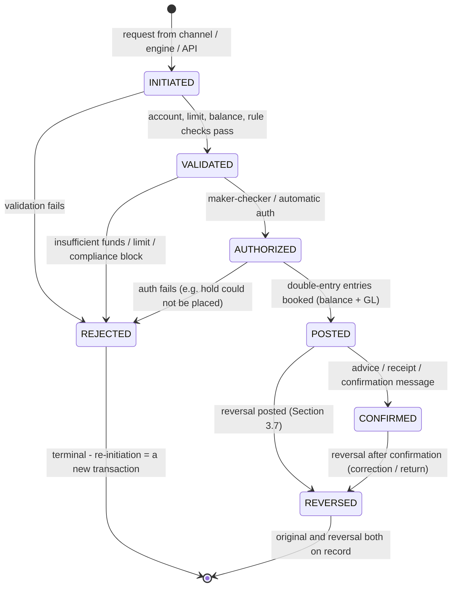

# The Posting Engine in Core Banking Systems: A Comprehensive Guide

> **Author:** Jack Liu Shurui — Solution Architect at Cymbal Bank, Singapore
> **Context:** Core Banking / Banking Architecture — the double-entry transaction posting machinery at the heart of core banking accounting: the accounting foundations (Pacioli, the accounting equation, T-accounts, DEAD CLIC, the chart of accounts, the GL vs the sub-ledgers), the posting concepts (financial vs memo postings, hard vs soft, value dating, back-value and forward-value), the posting lifecycle (initiate → validate → authorize → post → confirm, reversals, failures), the engine architecture (posting rules, account resolution, balance engine, entry engine, GL integration, multi-currency, multi-book), balance management (balance components, overdrafts, balance history), GL and accounting integration (suspense, day-end, financial and regulatory reporting), the vendor implementations (Temenos, FLEXCUBE, Mambu, Thought Machine Vault), the architect's view (patterns, integrity, performance, audit, build-vs-buy), a fully worked fund-transfer posting example, and the 2026+ trends
> **Repository:** [github.com/jackliusr/research](https://github.com/jackliusr/research)
> **Last Updated:** August 2026

---

## Table of Contents

1. [Accounting Foundations: Double-Entry Bookkeeping](#1-accounting-foundations-double-entry-bookkeeping)
2. [Posting Concepts](#2-posting-concepts)
3. [The Posting Lifecycle](#3-the-posting-lifecycle)
4. [Posting Engine Architecture](#4-posting-engine-architecture)
5. [Balance Management](#5-balance-management)
6. [GL and Accounting Integration](#6-gl-and-accounting-integration)
7. [Vendor Implementations](#7-vendor-implementations)
8. [Engine Design: The Architect's View](#8-engine-design-the-architects-view)
9. [Worked Example: A Fund Transfer Posting](#9-worked-example-a-fund-transfer-posting)
10. [The Future: 2026 and Beyond](#10-the-future-2026-and-beyond)
11. [Glossary](#11-glossary)
12. [References](#12-references)

---

## 1. Accounting Foundations: Double-Entry Bookkeeping

Every core banking system — Temenos Transact, Oracle FLEXCUBE, Mambu, Thought Machine Vault, Finastra Essence, TCS BaNCS — is, at bottom, a **double-entry bookkeeping machine**. The interest engine computes, the payments hub moves messages, the limits engine approves — but the *posting engine* is the only component that changes the bank's books. This section establishes the accounting theory the posting engine mechanizes; it is the same material every core's posting module implements, and it is the language of every audit, every trial balance, and every regulatory submission the bank makes.

### 1.1 The Double-Entry Principle

**Double-entry bookkeeping** is the accounting system in which every transaction affects **at least two accounts** — every debit has an equal and opposite credit, and the books stay in balance:

```
For every transaction:  Σ debits = Σ credits
```

The property that makes this powerful is that it is **self-checking**: if the sum of debits ever differs from the sum of credits, the books are provably wrong somewhere. A posting engine that enforces DR = CR atomically (Section 8.2) guarantees the bank's books cannot drift into imbalance through a single failed leg — the failure mode is confined to *wrong-but-balanced* entries (a debit to the wrong account), which is what reconciliation and audit are for, not *unbalanced* books, which is a system failure.

A single payment between two customers produces at minimum a two-legged posting (debit the payer, credit the payee); add a fee and it becomes four-legged (Section 9.7); add FX, taxes, and suspense and a corporate payment can generate a dozen or more legs. The engine's job is to make all legs land **atomically** — all or nothing (Section 8.2.1).

### 1.2 History: Pacioli and the *Summa* (1494)

Double-entry bookkeeping was not invented in 1494 — it was *published* in 1494. The method had been used by Italian merchant bankers for centuries before (the earliest surviving examples date to 13th-century Florence and Genoa, and the famous *Massari* ledgers of Genoa's commune run from 1340). What **Luca Pacioli** — the Franciscan friar and mathematician, friend of Leonardo da Vinci — did was codify it:

- **1494, Venice:** Pacioli publishes ***Summa de Arithmetica, Geometria, Proportioni et Proportionalità***, a mathematics compendium whose 36-chapter section *"Particularis de Computis et Scripturis"* ("Details of Accounting and Recording") is the **first printed description of double-entry bookkeeping**.
- It describes the **memorandum** (waste book), the **journal**, and the **ledger**; the use of debits and credits; the trial balance (*summa summarium* — Pacioli's "balance the books" instruction: total the debit and credit sides; if they do not agree, "that would indicate a mistake in your Ledger, which you will have to look for diligently"); and the **balance sheet** as a closing exercise.
- Pacioli's maxims still read like a posting-engine spec: "all the creditors must appear at the right-hand side... all the debtors at the left"; "one entry cannot be made without another"; and — the original no-delete rule — "do not erase" (Section 8.4.3). He is accordingly credited as the **father of accounting**, though he is more precisely its first great *publisher*: he explicitly acknowledged the method was already in use among Venetian merchants.

Five centuries later, the posting engine is Pacioli's rules compiled into software: the memorandum is the transaction capture, the journal is the entry log (`STMT.ENTRY` in Temenos, `ACTB_DAILY_LOG` in FLEXCUBE — Section 7), and the ledger is the GL and its sub-ledgers. The 1494 *summa summarium* survives as today's **trial balance** (Section 6.6).

### 1.3 The Accounting Equation

The double-entry system rests on the **accounting equation**:

```
Assets = Liabilities + Equity
```

- **Assets** — what the bank owns or is owed: cash, nostro balances, the loan book, securities, premises.
- **Liabilities** — what the bank owes: customer deposits, borrowed funds, accrued interest payable.
- **Equity (capital)** — the residual claim of the owners: paid-in capital, retained earnings.

The equation is why every posting must balance: any movement of value between accounts is a re-arrangement of the three buckets. A customer deposit is an asset increase (cash) *and* a liability increase (deposit) — two sides of the same event. The balance sheet is the equation rendered as a statement; see the canonical accounting models in [data_models_banking_insurance_guide.md](data_models_banking_insurance_guide.md) for how the balance sheet and the GL account hierarchy are modeled, and [interest_engines_core_banking_guide.md](interest_engines_core_banking_guide.md) §6 for how interest income/expense flows through the same equation.

### 1.4 The T-Account

The **T-account** is the ledger's atomic visual: a ledger account drawn as a T, with the **debit side on the left** and the **credit side on the right**:

```
      ACCOUNT A (asset, e.g. customer deposit acct)
 ┌────────────────────────┬────────────────────────┐
 │  DEBIT  (left)         │  CREDIT (right)        │
 │  increases assets      │  decreases assets      │
 │  S$1,000               │                        │
 └────────────────────────┴────────────────────────┘
```

The balance of an account is the difference between its debit and credit totals; which side it *normally* sits on depends on the account type (Section 1.6). T-accounts are the pedagogic tool of accounting, but they are also literally what a core stores: each account record's balance is the net of its posted entries, and the *statement* is the chronological list of entries that produced it. The "T" survives in the engineering as the **balance component** ladder (Section 5.1) — the running net of debits and credits per account.

### 1.5 Account Types and Classification

Every account in the chart of accounts belongs to one of five types, and the type determines its normal balance side and its role in the financial statements:

| Account type | Normal side | Financial statement | What it holds (banking examples) |
|---|---|---|---|
| **Asset** | Debit | Balance sheet | Cash and bank balances, nostro accounts, loans and advances, investment securities |
| **Liability** | Credit | Balance sheet | Customer deposits, borrowings, accrued interest payable, deferred income |
| **Equity** | Credit | Balance sheet | Share capital, retained earnings, reserves |
| **Revenue (income)** | Credit | Income statement (P&L) | Interest income, fee and commission income, FX gains |
| **Expense** | Debit | Income statement (P&L) | Interest expense, staff costs, impairments, occupancy |

Classification matters mechanically: the posting engine must know whether a GL account is an asset (debit-normal) or a liability (credit-normal) to compute its balance sign, to report it in the right statement line, and to validate that a posting rule makes economic sense (you do not want a posting rule that credits a suspense asset account by accident — Section 6.4). The account classification is part of the **COA master** (Section 1.7) — a data attribute, not code.

### 1.6 Debit/Credit Rules: DEAD CLIC

The mnemonic that maps account types to their normal sides:

```
DEAD CLIC
DEBIT  →  Expenses, Assets, Drawings (the DEAD side of the T)
CREDIT →  Liabilities, Income, Capital  (the CLIC side)
```

The full debit/credit table for the five account types:

| Account type | Debit (left) | Credit (right) |
|---|---|---|
| Asset | ↑ increase | ↓ decrease |
| Liability | ↓ decrease | ↑ increase |
| Equity | ↓ decrease | ↑ increase |
| Revenue / income | ↓ decrease | ↑ increase |
| Expense | ↑ increase | ↓ decrease |

Two worked rules of thumb the posting engine applies constantly:

- **Debiting a customer account** (a DDA or CASA account is a liability to the bank) *decreases* the bank's liability — i.e., **the customer's money leaves**. So "debit the account" = the customer has less balance.
- **Crediting a customer account** *increases* the bank's liability — **the customer's money arrives**.
- The bank's own **fee income** is *credited* to a revenue GL; the offsetting **debit** hits the customer account (Section 9.5). Income is recognized as a credit — the CLIC side.

Beware the mirror trap that trips every new core-banking architect: **customer accounts are liabilities** to the bank, so "DR the customer" and "the customer loses money" are the same sentence. A posting engine that lets a fee rule debit a revenue GL would create income-recognition chaos — this is why posting rules are product-configured and reviewed (Section 4.3), not written ad hoc.

### 1.7 The Chart of Accounts (COA)

The **chart of accounts (COA)** is the bank's complete, numbered catalog of ledger accounts — the account structure into which every posting must land. Its shape is standardized by regulation and by the bank's own reporting needs:

- **Account numbering:** GL codes are hierarchical — e.g., a 7- or 9-digit code where the leading digits encode the statement section (1000s assets, 2000s liabilities, 3000s equity, 4000s income, 5000s expenses), the middle digits the product line (e.g., `2300` = customer deposits, `2310` = savings deposits, `2320` = current accounts), and the trailing digits the currency/branch/entity dimension. The MAS Notice 610 style chart used in Singapore, the FRS 109 (IFRS 9) classification, and the bank's management reporting all hang off this hierarchy.
- **GL account attributes:** each COA row carries the account type (Section 1.5), its normal side, whether it is a *control account* (Section 1.8), whether it allows customer-level postings or is internal-only, its currency, and its parent GL head.
- **The bank's COA** is a living configuration artifact managed under change control — new products get new GL accounts via the product factory ([core_banking_systems_guide.md](core_banking_systems_guide.md) §7.9), and the COA master is a first-class data model in every core ([data_models_banking_insurance_guide.md](data_models_banking_insurance_guide.md) §2 — the GL account as a data model).

Two vendor COA philosophies (Section 7): FLEXCUBE maintains an **explicit COA** (GL master tables with a GL-code hierarchy, per-branch, per-currency GL books), while Temenos Transact is **category-driven** — each account's `CATEGORY` maps to a GL account (balance-sheet 'BS' or profit-and-loss 'PL' categories), and the double-entry is realized through `STMT.ENTRY`/`CATEG.ENTRY` pairs ([temenos_data_model_guide.md](temenos_data_model_guide.md) §5.3).

### 1.8 The GL and the Sub-Ledgers

**The general ledger (GL)** is the bank's book of summarized accounts — one row per GL account per branch per currency. **Sub-ledgers (subsidiary ledgers)** hold the detail: every customer account, every loan, every deposit is a sub-ledger record, and the sum of the sub-ledger *should* equal the GL control account.

| | Sub-ledger (detail) | General ledger (summary) |
|---|---|---|
| Granularity | One record per customer account / instrument | One row per GL account per branch/currency |
| Examples | The savings accounts of 2M customers | GL account `2310 Savings Deposits` |
| Updated by | The posting engine, per transaction | The GL posting process, per entry or per batch |
| Count | Millions of records | Hundreds to thousands of GL accounts |
| Truth | The customer's truth (statement) | The bank's truth (financial statements) |

The sub-ledger is *not* a copy of the GL — it is the source. The GL's `2310 Savings Deposits` is the aggregate of every savings account's balance; the two must reconcile to the cent (Section 1.9). This split is the root of the *control account* concept: a GL account marked as a control account has a sub-ledger behind it (customer deposits, loans, nostro), and the day-end reconciliation (Section 6.2) proves the sub-ledger total equals the GL balance. In vendor terms: Temenos `ACCOUNT`/`STMT.ENTRY` (sub-ledger) vs GL accounts via categories; FLEXCUBE `STTM_CUST_ACCOUNT` (sub-ledger) vs the FGL GL module (summary).

### 1.9 GL Reconciliation: The 'GL vs the Sub-Ledger' Balance

**Reconciliation** is the discipline that proves the two views agree. The daily control:

```
Σ (sub-ledger balances for GL account X)  =  GL balance of account X
```

The mechanics: every posting updates the sub-ledger account *and* the GL account (immediately in real-time GL architectures, at EOD in batch-GL architectures — Section 4.7); at day-end, the reconciliation process aggregates the sub-ledger and compares to the GL. A difference lands in the **suspense** GL (Section 6.4) and is investigated — the difference itself is an accounting event with an owner. In FLEXCUBE the entry logs (`ACTB_DAILY_LOG`/`ACTB_HISTORY_LOG`) and `ACTB_RECON_MASTER` support this matching ([oracle_flexcube_data_model_guide.md](oracle_flexcube_data_model_guide.md) §5); the EOD reconciliation is part of the core processes pipeline ([core_banking_processes_guide.md](core_banking_processes_guide.md) §7).

> **Architect's note:** "The GL balances" is the operational definition of *the bank's books are right* — and it is a *process*, not a property. Even a perfect posting engine needs the daily reconciliation because wrong-but-balanced entries (Section 1.1) only surface when the sub-ledger detail is checked against reality (customer disputes, nostro confirmations, suspense aging).

---

## 2. Posting Concepts

### 2.1 What a Posting Is: Posting vs Transaction

**A transaction** is the business event — a customer pays a bill, interest capitalizes, a fee is levied. **A posting** is the accounting record that event produces. The mapping is one-to-many:

```
transaction (business event)  →  one or more postings (accounting records)
                              →  one or more entries (DR/CR legs)
```

A transfer is one transaction and two postings (the debit posting to account A and the credit posting to account B). **To "post"** an entry is the act of recording it in the accounts — updating the balance and writing the entry record. The word descends directly from Pacioli's *posting* of journal entries into the ledger (Section 1.2): posting is the act of *transferring the entry to the ledger* — exactly what the posting engine does, at millions of transactions a day.

The transaction carries the business context (reference, channel, customer, narrative); the postings carry the accounting context (accounts, amounts, value dates, transaction codes). The engine must preserve the linkage — a transaction ID joins the postings together (Section 8.2.2 — idempotency uses the same key).

### 2.2 Financial vs Memo Postings

**Financial postings** are balance-affecting — the money moves. They change account balances and GL balances, they appear on statements and in the trial balance, and they are the hard accounting truth.

**Memo postings** (memo-post, "soft postings", informational entries) are the opposite: they are recorded for information, monitoring, or reporting *without* moving balances. They do not appear in the GL, do not affect the trial balance, and do not change any balance component. Typical uses:

- **Memo records** — e.g., a memo debit recorded when a cheque is presented but not yet cleared, so the account shows the item without removing funds; the memo converts to a financial posting when the item clears (Section 5.1 — the cleared/float mechanics).
- **Informational flags** — a blocked-amount memo on a disputed transaction, a memo note on an account for the relationship manager.
- **Shadow/tracking entries** — usage counters, limit utilization markers that must not touch the books.

The term is used loosely across vendors: FLEXCUBE's "memo" posting types, Temenos's non-balance entries, and Thought Machine Vault's **soft settlements** (a posting type that records information without committing balances — Section 7.4) all implement the same idea: *record it, but don't move money*. The hard rule for the architect: **a memo posting must never be able to create an imbalance** — because it is outside the DR=CR validation path of the GL, the engine must validate memo postings as informational-only and never let them leak into the trial balance.

### 2.3 Hard vs Soft Postings

A useful pair of lenses on the same spectrum:

- **Hard postings** — permanent, balance-affecting, GL-integrated. They survive EOD, they feed the trial balance, they appear on statements, and they can only be undone by an explicit **reversal** (Section 3.7) — never by deletion (the no-delete rule, Section 8.4.3). "Hard" is the default: every customer money movement is hard.
- **Soft postings** — temporary, informational, or pre-settlement. Holds (Section 5.1), card authorizations, memo entries. They can be removed without a formal reversal (the hold is released), and they never touch the GL. In the card world the authorization hold is the classic soft posting: it reduces *available* balance, not *ledger* balance; the later capture converts it to a hard posting (Section 8.1.3).

The distinction is implemented as the **balance component** the posting updates (Section 5.1): hard postings update ledger/book balances; soft postings update holds/available only.

### 2.4 External vs Internal Postings

**External postings** originate from customer-facing activity: a cash withdrawal at the teller, a FAST transfer, a card purchase, a loan disbursement. They involve customer accounts and usually a counterparty (another customer, another bank, the cash box).

**Internal postings** are the bank's own bookkeeping: fees, interest, charges, provisions, revaluations, GL transfers. They originate from the engine suite — the interest engine ([interest_engines_core_banking_guide.md](interest_engines_core_banking_guide.md)), the fee scheduler, the FX revaluation batch — and they move money between customer accounts and the bank's income/expense GLs, or between GL accounts with no customer involvement.

| | External | Internal |
|---|---|---|
| Origin | Channels, payments, cards | Engines, schedulers, GL operations |
| Customer account involved | Usually yes | Often no |
| Amount | Customer-initiated | Bank-computed |
| Example | S$1,000 FAST transfer | S$2 fee, S$0.55 interest capitalization |
| Typical auth | Transaction-level controls (limits) | Maker-checker on rules, batch audit |

The boundary matters for authorization (internal postings from batch are authorized by the batch's audit, not per-transaction), for audit (regulators scrutinize internal postings — fee income is a favorite place to hide things), and for reconciliation (Section 6.2).

### 2.5 Value Dating: Value Date vs Booking Date

**Value dating** separates *when the accounting says the money is effective* from *when the transaction was recorded*. Three dates recur in every core (Section 4.9 adds the posting date):

- **Booking date (entry date)** — the date the transaction is recorded in the system. The entry appears in the books on this date; the daily log row belongs to this day.
- **Value date** — the date from which the funds are *available/effective* for the customer: interest starts (or stops) accruing, availability begins. For same-day transactions the two coincide; the whole machinery of back- and forward-dating exists to let them differ.
- **Transaction date** — the date the business event happened (a card purchase on Saturday night, booked Monday).

The distinction is not pedantry — it is how banks price money. A cheque deposited today (booking) may have a value date of tomorrow (clearing), so it earns no interest today; an interbank transfer booked Friday with value Monday means the *recipient's* funds are not "good" until Monday. The available-balance vs book-balance gap (Section 5.1) is exactly the value-dating effect in balance terms.

**Back-value dating (back-value, retroactive)** — value date *before* booking date. The bank books a transaction today but values it as of an earlier date (a correction, a late-clearing item, a retroactive interest adjustment). Back-value postings must re-run any date-dependent arithmetic — interest accrual, average balances, limit utilization — for the intervening days, and they are a classic source of GL/sub-ledger friction if the GL posting is date-agnostic (Section 4.7). FLEXCUBE holds such entries in the "ghost" log until their value date arrives ([oracle_flexcube_data_model_guide.md](oracle_flexcube_data_model_guide.md) §5.4: `ACTB_DAILY_GHOST_LOG`).

**Forward-value dating (forward-value, post-dated)** — value date *after* booking date. A post-dated cheque, a future-dated transfer instruction, a scheduled payment. The entry is captured today but must not affect balances or interest until the value date. Temenos supports both directions through `VALUE.DATE` vs `BOOKING.DATE` on entries ([temenos_data_model_guide.md](temenos_data_model_guide.md) §5.4); Mambu lets you book journal entries on a different date from the value date of the underlying transaction (Section 7.3).

### 2.6 Value-Date Accounting: Balances and Interest

Value dating shows up in two places the engine must keep consistent:

- **Value-dated balances:** the same account has, at any moment, a family of balances keyed to value: the *book balance* (what the books say, all postings regardless of value date) vs the *available balance* (book balance net of uncleared/float items, holds, and liens) — the balance-component ladder in Section 5.1. The customer sees the available balance for spending; the GL sees the book balance.
- **Interest value:** the value date is what the interest engine accrues on — *interest runs on value dates, not booking dates*. A back-valued deposit should accrue interest from the back date; a forward-dated transfer should not accrue until its value date. The interest engine consumes the value-dated balance history, so the posting engine must record the value date faithfully on every entry; see [interest_engines_core_banking_guide.md](interest_engines_core_banking_guide.md) §2.3 (the daily accrual = balance × rate × days, where *balance* is the value-dated balance) and the FLEXCUBE balance-component treatment in [oracle_flexcube_data_model_guide.md](oracle_flexcube_data_model_guide.md) §4.5.

---

## 3. The Posting Lifecycle

The lifecycle is the spine of every core banking process — the same state machine the [core_banking_processes_guide.md](core_banking_processes_guide.md) documents (§6.4). This section walks each stage from the posting engine's point of view.

### 3.1 Initiation

A transaction is initiated from a channel — teller, internet banking, mobile, ATM, the payments hub, an API (the channel landscape is covered in [payments_hub_guide.md](payments_hub_guide.md); the ISO 20022 payment lifecycle in [iso_20022_core_processes_guide.md](iso_20022_core_processes_guide.md)). The initiation creates a **transaction request** carrying: the accounts, the amount, the currency, the transaction code, the value date (defaulting to booking date), the channel reference, and the customer/initiator.

Two engineering facts matter at this stage:

- **Every channel funnels into the same posting path.** Whether the request arrives from a teller screen, a mobile API, or a payments-hub ISO 20022 message, it is normalized into the engine's internal transaction structure. Channel-specific quirks (teller cash, card auths) are handled as transaction types, not as separate engines.
- **Idempotency keys are assigned here.** The channel reference (or an engine-generated ID) becomes the deduplication key (Section 8.2.2) so a retried request cannot double-post.

### 3.2 Validation

Before anything moves, the engine validates:

- **Account validation** — the accounts exist, are open (not closed/dormant — and if frozen, the transaction is rejected outright), are in the right currency for the transaction type, and are eligible for the requested operation.
- **Limit check** — the transaction is checked against the customer's and account's limits (per-transaction, daily, channel-specific) by the limit engine; see [banking_limits_domain_guide.md](banking_limits_domain_guide.md) for the full limit domain.
- **Balance check** — sufficient funds: the engine compares the transaction amount against the *available balance* (Section 5.1), not the ledger balance, so holds and uncleared items are honored. For credit transactions it checks the account's credit capability (some products are debit-only).
- **Compliance/sanctions** — the counterparties are screened (AML/fraud checks run in the compliance layer; the engine consumes the result — see [financial_risk_compliance_systems_guide.md](financial_risk_compliance_systems_guide.md)).
- **Posting-rule resolution** — the engine resolves the transaction type to its posting rule (Section 4.3) *before* committing, so a transaction with no rule, or a rule that fails to resolve a GL account, fails fast in validation rather than mid-posting.

Validation failure returns a rejection to the channel with a code; the transaction terminates (REJECTED — it is never half-booked).

### 3.3 Authorization: Maker-Checker

**Authorization** is the dual-control approval step: the transaction is *made* (input) by one user and *checked* (authorized) by another — **maker-checker**. The "checker" reviews the entry, and authorization ("auth") converts the transaction from a draft to a live, postable instruction. See the maker-checker process in [core_banking_processes_guide.md](core_banking_processes_guide.md) §2.1.

The structural mechanics are visible in the vendor data models:

- **Temenos:** a new input record lands in `$NAU` with record status **INAU** (input unauth) or **IHLD** (input hold); authorization clears the status — a live record has *no* `RECORD.STATUS`, and that absence is the authorized state ([temenos_data_model_guide.md](temenos_data_model_guide.md) §3.2).
- **FLEXCUBE:** every table carries maker/checker audit columns (`MAKER_ID`, `MAKER_DT_STAMP`, `CHECKER_ID`, `CHECKER_DT_STAMP`) and the **AUTH_STAT** field (authorized 'A' vs unauthorized); downstream processes filter on `AUTH_STAT = 'A'` ([oracle_flexcube_data_model_guide.md](oracle_flexcube_data_model_guide.md) §5.4).

Authorization policy is *risk-tiered*: low-value retail transactions authorize automatically (the system is its own checker, using limits and rules), while high-value, high-risk, or out-of-pattern transactions require a human second pair of eyes. The policy is configuration, not code.

### 3.4 Posting

The authorized transaction enters the posting engine proper — Section 4 is the deep dive. In brief, the engine performs, atomically:

1. **Balance update** — the account balances (balance components) are updated under lock (Section 4.5.2).
2. **Entry creation** — the journal entries (DR/CR legs) are written to the entry log.
3. **GL posting** — the GL is updated (real-time or via the EOD GL run, Section 4.7).

### 3.5 Confirmation

The posted transaction generates the **confirmation**: an advice, a receipt, a statement line, a push notification, a Swift/ISO 20022 confirmation message to the counterparty. Confirmation is the *customer-visible* completion — and it is distinct from posting: a transaction can be POSTED (books moved) and still fail to confirm (advice channel down), or be confirmed before its value date (Section 2.5). In the state machine, CONFIRMED is the terminal happy state ([core_banking_processes_guide.md](core_banking_processes_guide.md) §6.4).

### 3.6 The Posting State Machine



This is the same machine as [core_banking_processes_guide.md](core_banking_processes_guide.md) §6.4 — the posting engine is the stage between AUTHORIZED and POSTED, and its reversal logic owns the REVERSED transitions.

### 3.7 Reversals

**A reversal is the undo of a posting** — a *new* posting, never a deletion. The original entry stands forever (the no-delete rule, Section 8.4.3); the reversal is a counter-entry linked to it, restoring the accounts while leaving an audit trail of both.

**Reversal types:**

- **Same-day reversal / storno (STORN)** — the classic same-day undo: the reversal *mirrors* the original legs with opposite signs, made on the same value date, so the net effect on balances, interest, and the GL is exactly zero. *Storno* is the German term (from *stornieren*, to reverse), and it is the operational standard in German-speaking banking; Temenos carries the same concept in its reversal statuses (**RNAU** — reverse unauth — and **REVE** — reversed; [temenos_data_model_guide.md](temenos_data_model_guide.md) §3.2). Same-day storno is special because it needs *no compensating entries*: DR the account back, CR the account back, and the day closes as if the original never economically happened — though both entries remain on the books.
- **Direct reversal / negative posting / reversing entry** — posting a negative amount against the same account with a new entry, used when the same-day window has passed: the original day's books stay, and the reversal lands on *today's* date (or a back value date, Section 2.5), leaving the customer's balance correct from the reversal's value date onward. The negative posting has its own transaction code (a reversal code), and the statement shows both the original and the reversal.
- **Correcting entry** — when the original was *wrong but processed* (wrong amount, wrong account, wrong fee), the cleanest fix is often a *new entry that corrects* rather than a storno: e.g., the fee was S$2, should have been S$5 — post a S$3 additional fee, or reverse the S$2 and post S$5. Correcting entries are normal business postings with a correction narrative; reversals are accounting counter-entries.

**Reversal handling:**

- **Fees and interest:** reversing a transaction must reverse or re-run its attached fees and interest postings — the fee reversal follows the same storno/negative-posting pattern against the fee income GL, and value-dated interest effects are re-computed by the interest engine (Section 2.6; [interest_engines_core_banking_guide.md](interest_engines_core_banking_guide.md) §6.4).
- **Audit trail:** the reversal must link to the original — reversal reference, reversal reason, reversal authorizer, reversal timestamp. Regulators expect to reconstruct the full chain: original → reversal → (if any) re-post. The linkage is a first-class field on the entry record (Temenos `REVERSAL.REF`, FLEXCUBE reversal entries in the daily log with matching references).

### 3.8 Failed Postings

Not every authorized transaction posts. Failure handling is a first-class process:

- **Insufficient funds** — caught in validation (Section 3.2) → REJECTED with a code; the channel decides whether to retry, queue, or convert to overdraft (Section 5.4).
- **Account frozen/closed between validation and posting** — the account changed state mid-flight; the engine must re-check under the posting lock or reject at posting.
- **Posting failure** — a rule fails to resolve, a GL account is missing, a database error, a limit contention timeout. The engine must *roll back atomically* (Section 8.2.1): no partial postings, ever.
- **Exception queue and retry:** failed postings (especially from batch — EOD interest runs, payments hub deliveries) land in an **exception queue** with the error, the payload, and retry metadata. Operations investigates; a retry is safe because the idempotency key (Section 8.2.2) prevents double-posting if the original actually succeeded. The exception queue is a *business* object with SLAs — MAS expects operational resilience around exactly these queues (Section 6.7).

---

## 4. Posting Engine Architecture

### 4.1 The Engine's Place in the Core

The posting engine is the **core of the core**: the module that executes postings — balance updates, entry creation, GL posting — on every money movement from every product. Its placement in the platform is covered in [core_banking_systems_guide.md](core_banking_systems_guide.md) (the core's accounting role, §2.2) and [core_banking_processes_guide.md](core_banking_processes_guide.md) (transaction processing in the EOD pipeline, §7). The engine sits:

- **Below** the product factory — products configure the posting rules the engine executes (Section 4.3);
- **Beside** the other engines — the interest engine computes and *hands postings to* the posting engine ([interest_engines_core_banking_guide.md](interest_engines_core_banking_guide.md) §2.4); the fee engine, the limit engine ([banking_limits_domain_guide.md](banking_limits_domain_guide.md)), and the payments hub ([payments_hub_guide.md](payments_hub_guide.md)) interact the same way;
- **Above** the GL — the engine is the only writer to the GL's entry stream.

### 4.2 Engine Components

```mermaid
flowchart LR
    TXN["Transaction request<br/>(channel / engine / API)"] --> VAL["Validation<br/>account, limits, balance, rules"]
    VAL --> AUTH["Authorization<br/>(maker-checker / auto)"]
    AUTH --> RULE["Posting Rule Engine<br/>transaction type → DR/CR accounts"]
    RULE --> RES["Account Resolver<br/>customer acct + GL account determination"]
    RES --> BAL["Balance Engine<br/>balance components, locking"]
    BAL --> ENT["Entry Engine<br/>journal entries, multi-leg, audit"]
    ENT --> GL["GL Integration<br/>real-time or EOD batch GL"]
```



The five components — posting rule engine, account resolver, balance engine, entry engine, GL integration — are described next.

### 4.3 The Posting Rule Engine

**Posting rules** are the product-based configuration that says: *for transaction type T on product P, debit account X and credit account Y for amount A*. The rule is the mapping:

```
rule = (transaction type, product, event) → (debit legs, credit legs, amounts, value dating)
```

- **Rule tables / 'posting rule' configuration:** rules live in configuration tables (a "posting rule" table per product or per transaction type), maintained through the **product factory** — the product catalog where every account product's accounting behavior is defined ([core_banking_systems_guide.md](core_banking_systems_guide.md) §7.9). Adding a new product means adding its posting rules — account opening, debit/credit transactions, fees, interest postings, closure — without touching engine code.
- **A rule's anatomy:** e.g., for a "FAST transfer, savings product": DR the payer's customer account (the sub-ledger), CR the payee's customer account; if the payer and payee are at different branches, add the branch clearing legs (DR/CR the inter-branch clearing GL); if a fee applies, add the fee legs (DR customer, CR fee income GL — Section 9.5).
- **Rule types:** *customer-account rules* (the money moves between customer accounts), *GL rules* (the counterparty is a bank GL — fees, interest, charges, revaluations), and *mixed rules* (customer account ↔ GL).
- **Determinism and review:** rules must be deterministic — the same transaction type + product + event always resolves the same legs — and every rule change is a controlled configuration change with maker-checker and an effective date, because a wrong rule produces wrong-but-balanced entries (Section 1.1), the hardest error class to detect.

### 4.4 The Account Resolver

The **account resolver (account determination)** turns the rule's *abstract* legs into *concrete* account numbers:

- **Customer account resolution** — the counterparty account from the transaction itself (the payee's account number, the card's account, the loan account).
- **GL account determination** — the GL account for each leg, resolved from: the product's configured GLs (the fee income GL for this product line), the account's category (Temenos's category-driven mapping, Section 1.7), the branch/entity (per-branch GL books in FLEXCUBE), the currency (currency-specific GL accounts), and the transaction code (`STTM_TRN_CODE` in FLEXCUBE classifies every entry and drives GL mapping — [oracle_flexcube_data_model_guide.md](oracle_flexcube_data_model_guide.md) §5.1).
- **Rule-based resolution:** the resolver walks a precedence chain — explicit account on the transaction → product rule → category/COA mapping → suspense (Section 6.4) if nothing resolves. Unresolved legs are a posting failure, caught at validation (Section 3.2), *never* silently defaulted to the wrong GL.

### 4.5 The Balance Engine

**Balance updates** are the performance-critical heart. The balance engine maintains, per account, the **balance components** — the family of balances that differ by what is included (Section 5.1):

```
Ledger balance (the accounting truth) → Cleared → Float → Holds → Available
```

The engine updates the *set* of components a posting affects: a hard debit reduces ledger and available; a hold reduces available only; a cheque deposit increases ledger but not available until cleared.

#### 4.5.1 Atomicity and Concurrency

The balance update must be **atomic**: read the balance, apply the change, write it back — as one indivisible operation under a lock on the account. Without it, two concurrent transactions on the same account race:

```
T1 reads balance 1,000   T2 reads balance 1,000
T1 debits 900 → writes 100
T2 debits 900 → writes 100   ← T1's debit is lost (the lost-update bug)
```

The engine serializes per-account: a row/record lock (or optimistic concurrency with version checks — Modern Treasury's ledger uses version fields for exactly this, Section 8.7) guarantees each transaction sees the previous one's result. FLEXCUBE and Temenos both lock the account record during posting; high-throughput designs shard the lock (Section 8.3.2).

#### 4.5.2 Hot Accounts

**Hot accounts** — payroll accounts, merchant settlement accounts, nostro accounts — receive thousands of postings a day, and per-account serialization becomes the bottleneck: the account is the hottest row in the database. Mitigations:

- **Balance partitioning / sub-ledgering** — split the account's posting stream into multiple balance records (Temenos's *high-volume transaction accounts* work this way: the "online actual balance" is kept separate from the aggregated account balance and merged periodically — Section 7.1) and aggregate.
- **Asynchronous aggregation** — post to a fast path immediately, merge to the authoritative balance in micro-batches.
- **Batching and sequencing** — collate the day's postings for hot accounts and apply them in a single ordered pass at EOD, reserving the real-time path for the first N transactions.
- **In-memory balance caches** with WAL-style recovery, so the lock lives in memory, not the database row.

### 4.6 The Entry Engine

The **entry engine** materializes the **journal entries** — the DR/CR legs — and owns their integrity:

- **Entry record:** account, amount, debit/credit sign, currency, value date, booking date, transaction code, reference (transaction ID), reversal reference, narrative, maker/checker, sequence. This is the record that lands in Temenos `STMT.ENTRY` (per-account entries) and `CATEG.ENTRY` (GL entries), or FLEXCUBE `ACTB_DAILY_LOG` (Section 7).
- **Multi-legged postings (multi-leg):** one transaction → multiple entries. The engine builds the full leg set from the posting rule (Section 4.3), balances it (Σ DR = Σ CR), and commits all legs in one atomic unit. A transfer plus fee is four legs (Section 9.7); an FX conversion adds legs for the base-currency equivalent (Section 4.10); a cross-branch payment adds clearing legs.
- **Entry numbering and sequencing:** entries carry a sequence within the transaction and the day, giving the immutable ordering that statements and audit rely on.

### 4.7 GL Integration

**GL posting** is the hand-off of the entry stream to the general ledger:

- **Real-time GL (immediate GL update):** every posting updates the GL account balance synchronously with the sub-ledger. Pros: the GL is always current, day-end is short, the "GL vs sub-ledger" reconciliation (Section 1.9) is continuous. Cons: every transaction pays the GL write cost; GL locking becomes part of the hot path.
- **Batch GL (EOD GL posting):** postings update the sub-ledger in real time; the GL is updated in the **EOD GL run** — the GL module aggregates the day's entries into the trial balance per branch/currency ([core_banking_processes_guide.md](core_banking_processes_guide.md) §7 — the EOD pipeline; FLEXCUBE's EOD GL close in [oracle_flexcube_data_model_guide.md](oracle_flexcube_data_model_guide.md) §5.6). Pros: the online path is fast; GL contention is confined to the batch window. Cons: intraday GL reports lag; the day-end GL run is on the critical path and must complete before the next business day; value-dated entries (Section 2.5) must be staged so they land in the right GL day.
- **The GL interface:** the mechanism that moves entries to the GL — an internal API (both modules in one core, as in FLEXCUBE and Temenos), a message/event (outbox — Section 10.2), or a file hand-off to an external GL (Oracle Financial Services, SAP, an enterprise ledger). The interface is where reconciliation and suspense live (Section 6.2, 6.4): whatever the mechanism, the GL interface must be *auditable, replayable, and idempotent*.

### 4.8 Posting Modes: Online and Batch

- **Online posting (real-time):** the transaction posts immediately — balance, entries, GL — within the channel's request/response. The dominant mode for customer transactions.
- **Batch posting (EOD/offline):** bulk postings executed in scheduled runs — the **interest run** (accruals and capitalization postings for millions of accounts — [interest_engines_core_banking_guide.md](interest_engines_core_banking_guide.md) §2.4), fee runs, charge runs, standing-order execution, revaluations. Batch postings go through the *same* engine (same rules, same entry log, same balancing) — only the trigger and authorization differ (Section 2.4: batch postings are authorized by the run's audit, not per transaction). Batch design at millions-of-accounts scale (parallelism, checkpoints, restartability) is covered in [interest_engines_core_banking_guide.md](interest_engines_core_banking_guide.md) §8.3.

### 4.9 The Three Dates: Transaction, Posting, Value

Every entry carries three dates with distinct meanings (Section 2.5):

| Date | Meaning | Set by |
|---|---|---|
| **Transaction date** | When the business event happened (card purchase Saturday) | Channel / event source |
| **Posting date (booking date)** | When the entry was recorded in the books (Monday) | The engine, at commit |
| **Value date** | When funds are effective / interest-relevant (Section 2.6) | Transaction instruction, rules, clearing calendar |

Statements, interest, availability, and the GL all key off different dates — the entry engine must record all three faithfully and the balance engine must apply value-dating rules (back-value re-runs, Section 2.5) when they differ.

### 4.10 Multi-Currency Posting

**Multi-currency posting** adds the FX dimension: the transaction currency (e.g., USD) must be reconciled in the bank's **base currency** (e.g., SGD) for GL and reporting:

- The engine converts using the **FX rates** from the rate service, generating *additional* legs: DR the USD customer account in USD, CR the USD nostro in USD, plus the conversion legs to the base-currency GL (or the bank keeps currency-specific GL accounts and converts only at reporting — FLEXCUBE's per-currency GL books, Section 1.7).
- The **FX difference** (the bank's spread between buy and sell rates) posts to an FX income/expense GL.
- **Revaluation:** at EOD, multi-currency positions are revalued at the day's closing rates, producing revaluation entries (FLEXCUBE's EOD revaluation step, [oracle_flexcube_data_model_guide.md](oracle_flexcube_data_model_guide.md) §5.6).
- **Round-off:** each leg must balance *in its own currency*, and the base-currency equivalents must balance too — rounding differences between currencies are a classic source of imbalance and are handled by a designated rounding/round-off GL account.

### 4.11 Multi-Book Accounting

**Multi-book accounting** means maintaining multiple ledgers in parallel — e.g., statutory (IFRS), local GAAP, tax, and management books — so the same economic event is recorded per each book's rules. The honest vendor picture (verified in [oracle_flexcube_data_model_guide.md](oracle_flexcube_data_model_guide.md) §5.3):

- **FLEXCUBE's classic core does not have a first-class multi-book (multi-GAAP) architecture** — it maintains a single integrated GL per branch/entity; IFRS/regulatory views are produced *outside* the core in Oracle Financial Services Analytical Applications (OFSAA), which applies IFRS 9 / regulatory reclassification to the core's GL data. (Oracle's *product* literature describes multi-currency/multi-entity/multi-country support — "multi-book" in the sense of parallel legal-entity ledgers is delivered through the multi-entity/ledger setup and OFSAA, not parallel GAAP books inside the core.)
- **Temenos Transact** similarly runs the legal-entity/company (`CO.CODE`) dimension with one book per company; multi-GAAP adjustments live in the reporting layer.
- **Modern cloud cores and ledgers** treat multi-book as a first-class feature — posting the same transaction to multiple books atomically with per-book rules (Section 8.7).

The architect's takeaway: multi-book is a *reporting-layer* concern for classic cores and an *engine* concern for modern ones; the posting engine must at minimum record the data (entries, amounts, classifications) with enough lineage that any book can be derived (Section 6.7 — data lineage to the GL).

---

## 5. Balance Management

### 5.1 Balance Types: The Balance-Component Ladder

The **balance components** are the family of balances the engine maintains per account; they differ by which postings are included. The canonical ladder (matching [oracle_flexcube_data_model_guide.md](oracle_flexcube_data_model_guide.md) §4.5):

```
Ledger balance     S$10,000   ← the accounting truth (what the GL says)
− uncleared items          500   ← cheques deposited, not yet cleared (float)
= Cleared balance   S$ 9,500   ← funds that have cleared
− holds / blocks           200   ← card auths, cheque holds, liens
− (uncleared debits)         0
= Available balance  S$ 8,800   ← what the customer can actually use
```

| Balance component | Definition | Used by |
|---|---|---|
| **Ledger balance** (book balance) | Sum of all posted entries regardless of clearing/holds — the GL truth | GL, statements, interest |
| **Cleared balance** | Ledger minus uncleared items (float) | Cheque/clearing logic |
| **Float (uncleared)** | Deposited funds not yet cleared | Availability |
| **Hold / block** | Temporary reservations: card authorizations, cheque holds, court liens | Availability only |
| **Available balance** | Ledger − float − holds − liens — what can be spent | Transaction balance checks (Section 3.2) |

The balance engine updates the relevant components per posting type (Section 4.5): a hard debit reduces ledger and available; a hold reduces available only; a deposit adds ledger, adds available only when cleared. Balances are maintained in the **account currency** with derived aggregates (average balances for interest) stored separately.

### 5.2 Balance Update Sequence

The canonical update order for a posting on account A:

1. **Lock account A** (Section 4.5.1).
2. **Re-read** the balance components under the lock (never trust a pre-lock read).
3. **Apply the component updates** the posting type requires (Section 5.1).
4. **Write the entry** to the entry log with its value date.
5. **Update derived data** the transaction touches — average balance counters, limit utilization ([banking_limits_domain_guide.md](banking_limits_domain_guide.md)), interest accrual basis.
6. **Release the lock**, commit atomically with the entry write (same transaction — the entry and the balance must never diverge).

### 5.3 Balance Inquiry: Real-Time Balances

**Balance inquiry** must return the right component for the question: the customer's app shows *available* (or sometimes ledger, with available flagged); the teller's cash-out check uses available; the GL report uses ledger; the interest engine uses value-dated balances (Section 2.6). The classic trap: a channel displaying the *ledger* balance while the engine checks *available* produces the customer-service nightmare of "my balance says S$1,000 but my card declined." The balance API contract (component requested, as-of date, value-dating rules) is a first-class interface concern.

### 5.4 Overdraft Handling

**Overdrafts** let an account go negative to an agreed limit:

- **Authorized overdraft:** a pre-arranged facility (limit, rate, expiry) configured on the account; the balance check (Section 3.2) accepts a debit that takes the balance to *−limit* rather than to zero. Overdrawn balances attract interest at the overdraft rate ([interest_engines_core_banking_guide.md](interest_engines_core_banking_guide.md) §5.9 — daily interest on the negative balance) and the drawn amount is usually not available for further use.
- **Unauthorized (casual) overdraft:** the account goes negative without a facility — a cheque cleared against insufficient funds, a card transaction honored by standing arrangement, a bank error. Unauthorized overdrafts attract **penal interest and fees**, are flagged for collections, and are a regulatory touchpoint (fair-lending and disclosure rules).
- **Negative balances** are a real state, not an anomaly: the balance engine must support negative balances per product (some products forbid them — savings accounts reject the debit at validation), and the limit/balance checks must distinguish "available down to −limit" from "available down to zero."

### 5.5 Balance History and 'Balance As Of'

- **Daily balances:** the EOD run snapshots each account's balance (per balance component) into **balance history** — the table that feeds statements, interest calculation, and regulatory reporting (FLEXCUBE's balance-history/period tables, [oracle_flexcube_data_model_guide.md](oracle_flexcube_data_model_guide.md) §4.5). The EOD snapshot is part of the core processes pipeline ([core_banking_processes_guide.md](core_banking_processes_guide.md) §7).
- **'Balance as of' queries:** the historical balance on any date = the snapshot for that date (or the ledger plus replay of entries after the snapshot). The engine must answer "what was this account's balance on 30 June?" exactly, because regulators and courts ask — and because the interest engine replays value-dated history (Section 2.6).

---

## 6. GL and Accounting Integration

### 6.1 The GL in the Core

The **GL module** of the core holds: the **GL accounts** (the COA master, Section 1.7), the **GL postings** (the entry stream from the posting engine — `CATEG.ENTRY` in Temenos, the FGL accounting entries in FLEXCUBE), and the **GL balances** (per GL account, branch, currency, period). In FLEXCUBE the "General Ledger (FGL)" module maintains the COA with parent/child GL heads and per-branch, per-currency GL books ([oracle_flexcube_data_model_guide.md](oracle_flexcube_data_model_guide.md) §5.2); in Temenos the GL is category-driven (Section 1.7).

### 6.2 GL vs Sub-Ledger: The Daily Reconciliation

The daily **GL reconciliation** proves the sub-ledgers against the GL (Section 1.9): every control account's GL balance equals the sum of its sub-ledger accounts. The reconciliation runs in the **EOD pipeline** ([core_banking_processes_guide.md](core_banking_processes_guide.md) §7): aggregate the sub-ledger, compare to the GL, and post any difference to suspense (Section 6.4) with an owner and a follow-up. FLEXCUBE supports this with `ACTB_RECON_MASTER` and the entry logs; Temenos with its entry/category pairs. *The daily reconciliation is the single most important control in core banking* — it is what turns "the engine ran" into "the books are right."

### 6.3 Accounting Entry Types

- **Customer entries** — postings involving customer accounts (transfers, withdrawals, deposits, loan disbursements): the sub-ledger and its control GL both move.
- **Internal entries** — the bank's own: fees (DR customer, CR fee income GL — Section 9.5), interest (accrual and capitalization — [interest_engines_core_banking_guide.md](interest_engines_core_banking_guide.md) §6.2: DR accrued interest receivable / CR interest income; capitalization DR the loan / CR accrued), charges, provisions (IFRS 9 ECL — [financial_risk_compliance_systems_guide.md](financial_risk_compliance_systems_guide.md)), revaluations (Section 4.10).
- **Adjustments** — corrections and reversals (Section 3.7), which carry their own transaction codes and audit links.

### 6.4 Suspense Accounts

**Suspense** is the GL account (or accounts) where unresolved postings land:

- **What goes to suspense:** a posting whose counterparty cannot be resolved (unmatched nostro credit, a payment with no valid account, an unidentified inward SWIFT), a reconciliation difference (Section 6.2), a breakage the engine could not classify.
- **Suspense GL / clearing account:** the suspense account is a real GL account in the COA — typically an asset or liability control account — and every suspense posting is itself a double-entry posting (DR suspense, CR the unmatched leg's presumed source). The *clearing account* is the related concept: a temporary GL used to park matched-in-transit items (cheques in clearing, inter-branch settlements) that clear within a defined cycle.
- **'Suspense' handling:** suspense entries age — the **breakage** (unreconciled difference) is investigated by operations, matched to the originating item, and closed with a correcting posting. Regulatory hygiene demands *aged suspense reporting*: old suspense is a red flag (it hides errors, fraud, and failed postings), and MAS/auditors expect suspense to be small, aged, and owned. Suspense must never be a permanent destination — the engine's rule resolution (Section 4.4) should treat suspense as an explicit, alerted fallback, not a default.

### 6.5 Day-End Accounting

The **EOD accounting run** closes the day's books ([core_banking_processes_guide.md](core_banking_processes_guide.md) §7; FLEXCUBE's EOD sequence in [oracle_flexcube_data_model_guide.md](oracle_flexcube_data_model_guide.md) §5.6):

1. **Cut-off** — no more same-value-date entries; late items book for the next day or as back-value entries (Section 2.5).
2. **Entry rollover** — the daily log moves to history (FLEXCUBE: `ACTB_DAILY_LOG` → `ACTB_HISTORY_LOG`); ghost/back-valued entries whose value date arrived merge into the new day.
3. **Interest and fee runs** — the engines compute and post (Section 4.8); entries are internally authorized and land in the logs.
4. **Revaluation** — multi-currency positions revalued (Section 4.10).
5. **GL close** — the GL aggregates entries into the **trial balance** per branch/currency; control accounts reconcile against sub-ledgers; period-end closes GL periods.
6. **Output** — statements, advices, regulatory extracts, warehouse feeds.

### 6.6 Financial Reporting from the GL

The financial statements are *derived from the GL*:

- **Trial balance** — every GL account's debit/credit totals and balances at a date: the first output of any GL close, and Pacioli's *summa summarium* (Section 1.2). A balanced trial balance is the day's fundamental proof.
- **Balance sheet** — the asset, liability, and equity GL balances (the accounting equation, Section 1.3).
- **P&L (income statement)** — the revenue and expense GL balances for the period (Section 1.5), including interest income/expense from the interest engine ([interest_engines_core_banking_guide.md](interest_engines_core_banking_guide.md) §6.2).

Reporting is downstream of the posting engine, but the engine's design determines its quality: without faithful entries (correct GL accounts, dates, amounts, categories), no reporting tool can produce correct statements. *Garbage postings, garbage balance sheet.*

### 6.7 Regulatory Reporting: MAS, BCBS 239, and Data Lineage

The posting engine feeds every regulatory report a bank files. For a Singapore bank under **MAS** supervision, that includes the MAS 610 (large exposures), MAS 637 (capital adequacy), and the returns that flow from GL and sub-ledger data; internationally, **BCBS 239** (risk data aggregation and risk reporting) demands that reported figures be **traceable to source data** — i.e., the data lineage from a reported number back to the posting entries and transactions that produced it ([financial_risk_compliance_systems_guide.md](financial_risk_compliance_systems_guide.md) — the risk-data and regulatory context). The architectural consequence: entries must carry the attributes regulators join on (customer, product, branch, currency, value date, booking date, transaction code, counterparty, UETR/reference), the entry log must be immutable and queryable, and every aggregate must be reproducible from the posting stream. The posting engine is not an accounting detail — it is the **foundation of regulatory data quality**.

---

## 7. Vendor Implementations

Every core's posting machinery implements the same double-entry theory differently. This section covers the four vendors the companion guides document in depth — Temenos, Oracle FLEXCUBE, Mambu, and Thought Machine Vault — with verification status flags where vendor internals could not be fully confirmed from public documentation. See [temenos_data_model_guide.md](temenos_data_model_guide.md) and [oracle_flexcube_data_model_guide.md](oracle_flexcube_data_model_guide.md) for the data-model deep dives; [interest_engines_core_banking_guide.md](interest_engines_core_banking_guide.md) §7 for the interest-posting view.

### 7.1 Temenos Transact

**The posting path: OFS → FUNDS.TRANSFER → STMT.ENTRY.**

- **OFS (Open Financial Service(s))** is Temenos's message-based transaction protocol — the standard gateway for interacting with T24/Transact via request/response messages. An OFS message addresses an application (e.g., the funds-transfer application) with comma-delimited field/value pairs; the same protocol drives transactions, enquiries, and routines, and it is the integration surface external systems use to post (verified: Temenos OFS training material — "OFS is the standard module and messaging protocol for interacting with T24"). The modern REST/Open-API layer sits on top of the same OFS path ([temenos_guide.md](temenos_guide.md)).
- **The FT application (FUNDS.TRANSFER)** is the transfer/payment application that realizes debit/credit transactions. An OFS funds-transfer request carries fields such as `DEBIT.ACCT.NO`, `DEBIT.AMOUNT`, `DEBIT.VALUE.DATE`, `CREDIT.ACCT.NO`, `CREDIT.AMOUNT`, `PAYMENT.DETAILS` — verified against Temenos Funds Transfer training material (T3TFT) and integration guides (OpenLegacy's FundsTransfer OFS request/response examples). For FX outward transfers the nostro account defaults from the Nostro table when not specified. **Note on "FT.TXN":** the canonical application is `FUNDS.TRANSFER`; "FT.TXN"-style names appear in community/integration material but could **not be verified** as the canonical application or file name in current documentation — treat the application name `FUNDS.TRANSFER` (FT) as authoritative. **Duplicate control:** T3TFT documents that a transaction is termed *duplicate* if the same debit account and amount match another transaction — an engine-level duplicate check (Section 8.2.2).
- **The entries: STMT.ENTRY and CATEG.ENTRY.** The double-entry is realized as pairs of statement entries — `STMT.ENTRY` (the per-account statement/accounting entry: account, amount, value date, transaction code, narrative) and `CATEG.ENTRY` (the category/GL-side entry). Transact accounting is **category-driven**: each account's `CATEGORY` maps to a GL account ('BS' balance-sheet or 'PL' profit-and-loss category), so the COA is implicit in the category structure rather than an explicit FLEXCUBE-style GL table (verified in [temenos_data_model_guide.md](temenos_data_model_guide.md) §5.3).
- **Record statuses:** input lands in `$NAU` with `INAU`/`IHLD`; authorization clears `RECORD.STATUS` (live = authorized); reversals use the `RNAU` (reverse unauth) → `REVE` (reversed) path; `VALUE.DATE` vs `BOOKING.DATE` support back-value dating (verified, §3.2/§5.4 of the data-model guide).
- **Balances:** Transact maintains multiple balance types per account — the **working balance**, the **online actual balance** (the live balance "not yet merged in the high-volume transaction account", per Temenos's accounting-journal documentation), and the **available balance** — with the balance type driving limit/overdraft checks (`CREDIT.CHECK` is parameterized to check available or working balance). See [temenos_data_model_guide.md](temenos_data_model_guide.md) for the balance/entry data model.

**Temenos strengths:** mature multi-company/multi-branch accounting; the OFS protocol is a well-documented integration contract; category-driven GL keeps COA changes localized; deep audit history (per-record modification history, `CURR.NO` re-audit counters).

### 7.2 Oracle FLEXCUBE

**The posting path: functional capture → accounting engine → ACTB_DAILY_LOG.**

- **Capture:** transaction capture happens in the functional modules — teller, EFT/remittance (**FT* funds-transfer tables**), SWIFT, standing orders — which generate entries into the accounting core. The **transaction code** (`STTM_TRN_CODE`, the transaction-code master) classifies every entry and drives GL mapping and reporting (verified in [oracle_flexcube_data_model_guide.md](oracle_flexcube_data_model_guide.md) §5.1).
- **The entry log: `ACTB_DAILY_LOG`** — the daily transaction/entry log: one row per *accounting entry* (each DR/CR leg), written in real time. This is *the* transaction table of FLEXCUBE (verified: Oracle's own Database Practices guide uses it as the canonical volatile table for partitioning guidance). At EOD the entries roll to **`ACTB_HISTORY_LOG`**; back-valued/future-dated "ghost" entries live in **`ACTB_DAILY_GHOST_LOG`** until their value date arrives; `ACTB_RECON_MASTER` supports reconciliation matching (§5 of the data-model guide).
- **Double-entry:** every transaction posts balanced DR/CR entries into the daily log — the sum of debits equals the sum of credits per transaction and per branch-day. The GL (FGL module) is integrated in the core with an explicit COA: GL master with parent/child GL heads, currency-specific GLs, per-branch GL books.
- **Authorization status (auth-stat):** every table carries maker/checker audit columns (`MAKER_ID`, `MAKER_DT_STAMP`, `CHECKER_ID`, `CHECKER_DT_STAMP`) and **`AUTH_STAT`** / `REC_STAT`; downstream processes (statements, regulatory extracts) filter on `AUTH_STAT = 'A'` (verified pattern, §5.4).
- **Multi-book reality (verified status, §5.3):** the classic FCUBS core does **not** have a first-class multi-GAAP multi-book architecture — it maintains a single integrated GL per branch/entity; IFRS/regulatory views are produced in Oracle Financial Services Analytical Applications (OFSAA) outside the core. (Oracle's datasheet touts multi-currency/multi-entity/multi-country support — that is legal-entity and currency breadth, not parallel GAAP books inside the core.)

**FLEXCUBE strengths:** the daily-log architecture is a clean, partitionable, auditable entry stream; explicit COA and transaction-code masters give precise GL mapping; auth-stat discipline is uniform across all tables; balance components are first-class (§4.5 of the data-model guide: ledger/cleared/uncleared/available/holds).

### 7.3 Mambu

Mambu is the cloud-native, API-first core (the platform used by digital banks such as Trust Bank SG — see [trust_bank_guide.md](trust_bank_guide.md)); its posting model is a modern GL-integration architecture:

- **The accounting module:** Mambu maintains GL accounts (GL codes) and posts **journal entries** — verified via Mambu's public API documentation: the `AccountingService` posts a list of entries where **each entry carries `glCode`, `entryType`, and `amount`, with at least one debit and one credit required** per posting, together with a `branchId` and a date; "any number of journal entries may be posted with a given date and branch id as long as the standard accounting rules apply" (Mambu API Java SDK docs).
- **Booking vs value date:** Mambu lets you set a journal entry's **booking date different from the value date** of the transaction — the value-dating concept of Section 2.5 implemented as an explicit API parameter (Mambu Documentation Hub, "Booking Date vs Value Date").
- **Cash vs accruals:** Mambu supports two accounting methodologies — **cash accounting** and **accruals accounting** — selected per organization, changing how interest/fee income is recognized (Mambu docs).
- **Accounting rules:** the `accountingrules` API configures automatic accounting closures and rules for transactions affecting GL balances across branches (verified: Mambu Documentation Hub).
- **GL integration:** Mambu's GL is external-facing — journal entries export to the bank's enterprise GL (e.g., SAP, Oracle EBS, or a data warehouse) via exports/APIs; the core maintains the sub-ledger, the external GL maintains the books. The reconciliation (Section 6.2) is therefore a *system boundary* reconciliation, not an internal control — a key architectural difference from the integrated GLs of Temenos/FLEXCUBE. *Mambu's internal posting engine mechanics (locking, entry-log internals) are not fully public; this guide flags them as unverified beyond the documented API behavior.*

**Mambu strengths:** clean API contract for postings; booking/value-date flexibility; modern multi-entity support; cash-vs-accrual choice; low integration cost to a bank's chosen GL.

### 7.4 Thought Machine Vault

Thought Machine **Vault** is the contract-driven, cloud-native core (used by Mox Bank, among others). Its posting model is the most explicitly "engine-like" of the four:

- **Postings are the money-movement primitive:** "fund movements that occur on an account are known as postings... executed and recorded" in Vault (Vault architecture documentation). A bank product's behavior is implemented in **Python smart contracts** that call the posting APIs — **contract-driven postings**: the contract decides *what* to post (amounts, accounts, instructions) and Vault executes atomically.
- **The posting instruction:** a **posting instruction** is the request unit — carrying a client batch ID, client transaction ID, instruction details, and the list of **postings**, each with account, amount, denomination, and credit/debit direction (per Vault's posting-instruction documentation; field names vary across versions — treat exact names as "check the version docs"). A single instruction is executed **atomically**: all its postings commit or none do.
- **Balance coordinates and phases:** Vault balances are addressed by **balance coordinates** — (account, address, asset, denomination, phase) — where *address* is the balance's purpose within the account (e.g., DEFAULT, commission) and *phase* is the lifecycle state (**PENDING_IN**, **PENDING_OUT**, **COMMITTED**). Postings move balances between phases — e.g., a card authorization creates a PENDING_OUT posting that is later committed or reversed; **soft settlements** are the informational posting type (the memo/soft concept of Section 2.2/2.3). Backdated postings are supported via the posting batch's value timestamp.
- **The engine's role:** Vault *is* the posting engine in the sense that balances are always derived from the executed posting stream (append-only), and the GL is integrated — Vault's GL postings derive from the same instructions, giving real-time GL and automatic DR=CR enforcement per instruction.
- *Vault's posting internals beyond the documented API (scheduler mechanics, GL module depth) are documented per-version; this guide relies on the public documentation as of mid-2026 and flags version drift as possible.*

**Vault strengths:** atomic multi-leg instructions as the core primitive; immutable append-only posting stream with derived balances (audit by construction); contract-driven posting logic (rules in code, versioned and testable — Section 8.9); modern multi-book and multi-currency support.

### 7.5 Comparison Table

| Vendor | Posting engine / module | Posting model | GL integration | Balance model | Strengths |
|---|---|---|---|---|---|
| **Temenos Transact** | OFS + FUNDS.TRANSFER (FT) → STMT.ENTRY/CATEG.ENTRY | Double-entry via statement/category entry pairs; category-driven GL | Integrated in core (category → GL account) | Working / online actual / available balance types; CREDIT.CHECK parameterized | OFS integration contract; deep audit; multi-company |
| **Oracle FLEXCUBE** | Accounting engine; ACTB_DAILY_LOG entry log; FT* capture tables | Balanced DR/CR legs per transaction; transaction codes drive GL mapping | Integrated FGL module; explicit COA, per-branch/currency GL | Balance components: ledger/cleared/uncleared/available/holds | Partitionable entry log; uniform AUTH_STAT discipline; explicit COA |
| **Mambu** | Accounting module + AccountingService API | Journal entries (glCode/entryType/amount; ≥1 DR + ≥1 CR); booking vs value date | External GL via exports/APIs (sub-ledger in core, books outside) | API-exposed account balances; hold/available via transactions | Clean API; cash-vs-accrual; booking/value-date flexibility |
| **Thought Machine Vault** | Vault posting engine (posting instructions) | Atomic posting instructions from Python contracts; balance coordinates + phases | Integrated GL derived from the posting stream | Derived balances from append-only postings (account/address/asset/denomination/phase) | Atomicity by construction; audit by construction; contract-driven rules; cloud-native |

*Internal engine mechanics not publicly documented (Mambu locking/entry-log internals, Vault version-specific field names) are flagged as unverified in §7.3–§7.4.*

---

## 8. Engine Design: The Architect's View

### 8.1 Posting Patterns

Three canonical patterns, chosen per transaction type and product:

- **Immediate post (online, real-time):** the transaction posts synchronously within the request — the default for customer transactions (Section 4.8). Latency budget: hundreds of milliseconds; the balance lock (Section 4.5.1) is the constraint.
- **Deferred (batch):** postings accumulate and execute in scheduled runs — interest, fees, standing orders (Section 4.8). The engine is identical; only the trigger and authorization differ.
- **Two-phase: reserve + settle.** The money is *reserved* first, *settled* later: the card flow — **authorization (hold) → capture (settle)** — reserves the amount as a hold on the available balance (a soft posting, Section 2.3), then converts to a hard posting at capture; if the authorization expires or is reversed, the hold releases with no money ever having moved. The same pattern powers cheque holds, prepaid reservations, and limit blocks. The balance engine implements this as component-level moves (hold ↑, available ↓) rather than ledger moves — see the balance-component ladder in Section 5.1.

### 8.2 Accuracy: Integrity, Idempotency, Consistency

#### 8.2.1 Atomicity — 'Posting Is Atomic'

**The posting is atomic: all-or-nothing.** All legs of a multi-leg posting (Section 4.6) commit as one unit — balance updates, entry writes, and GL updates in the same transaction scope — or none of them do. No half-posted transaction can exist: not between accounts (DR without CR), not between log and balance (entry without balance change), not between core and GL (posting without GL entry — which is why GL integration failures must be *replayable*, Section 4.7). Atomicity is enforced by the database transaction around the whole posting; the failure path (Section 3.8) is a clean rollback plus an exception record.

#### 8.2.2 Idempotency — Duplicate Prevention

**Idempotent postings:** the same transaction must post exactly once even if the request arrives twice. The engine keys on a **unique transaction ID** (channel reference or engine-generated, assigned at initiation — Section 3.1): a retry with the same key finds the original postings and returns them instead of re-posting. Temenos's duplicate detection (same debit account + amount) is the classic defensive example (Section 7.1); modern engines use the client-transaction-ID on the posting instruction (Vault, Section 7.4; Modern Treasury transactions, Section 8.7). Without idempotency, a payments-hub retry (Section 3.8) double-debits the customer — the most expensive bug class in core banking.

#### 8.2.3 Consistency — DR = CR and Imbalance Detection

The engine enforces **Σ DR = Σ CR** per transaction at build time (Section 4.6), and the GL/sub-ledger reconciliation (Section 6.2) enforces it at day level. **Imbalance detection** is layered: per-posting validation (reject unbalanced instructions — Vault and Mambu both reject instructions without balanced debits/credits, Sections 7.3–7.4), per-day trial balance (Section 6.6), and the suspense mechanism for residual differences (Section 6.4). An imbalance that survives to the trial balance is a *system incident*, not a reconciliation item.

### 8.3 Performance

- **High throughput:** a large bank posts **millions of entries a day** — the online path carries the customer transactions, the EOD batch carries interest/fee runs for every account. The batch must finish inside the night window (parallelized, checkpointed, restartable — [interest_engines_core_banking_guide.md](interest_engines_core_banking_guide.md) §8.3 has the batch-at-scale pattern).
- **Concurrency and hot accounts:** per-account serialization (Section 4.5.1) makes hot accounts the bottleneck; the mitigations — balance partitioning, asynchronous aggregation, in-memory locks — are covered in Section 4.5.2.
- **Scalability:** the entry log is the largest table in the schema (FLEXCUBE's `ACTB_DAILY_LOG` is partitionable by date for exactly this reason — Section 7.2); horizontal scaling means partitioning the entry log by date/branch and sharding balance state by account. The GL and the entry log must scale *independently* of the online path.

### 8.4 Audit

- **Auditability and the posting audit trail:** every posting is immutable and attributable — who made it, who authorized it, when, from which channel, with which reference. The entry record is the audit atom (Section 4.6); vendor structures (Temenos `STMT.ENTRY` + `INPUTTER`/`AUTHORISER`; FLEXCUBE maker/checker columns) implement it structurally.
- **The posting journal:** the journal is the chronological, complete record of entries — the audit view of the posting stream. Auditors reconstruct any balance by replaying the journal; the journal must therefore be complete, ordered, and tamper-evident (append-only storage; blockchain-style hashing chains are used by some modern ledgers, but the *requirement* is immutability, not the technology).
- **The no-delete rule:** **postings are never deleted — only reversed** (Section 3.7). Pacioli's "do not erase" (Section 1.2) is a regulatory requirement in every jurisdiction the bank operates in: the original entry must survive forever, and the reversal must reference it. "Delete" in a core banking database should be a thing the application literally cannot do to entries.

### 8.5 Regulatory Posting

- **Record-keeping:** MAS (and every regulator) requires that books and records be capable of being produced — the posting stream *is* the books; retention, recoverability, and queryability of the entry log are regulatory requirements, not IT preferences. See [financial_risk_compliance_systems_guide.md](financial_risk_compliance_systems_guide.md) for the MAS/BCBS 239 record-keeping and data-lineage context.
- **Posting integrity:** audit requirements translate to design requirements — no-delete, maker-checker on rules and high-value transactions, complete audit fields, aged-suspense controls (Section 6.4), and the daily reconciliation as a documented, evidenced control.

### 8.6 Placement and Integration

- **Placement:** the posting engine is a core function inside the system of record, underneath the product factory (Section 4.1; [core_banking_systems_guide.md](core_banking_systems_guide.md) §2.2, §7.9). It must never be bypassed: every money movement from every product and every channel funnels through it.
- **Integration:** the engine integrates with the payments hub ([payments_hub_guide.md](payments_hub_guide.md) — payment messages become postings), the GL (Section 4.7), the interest and fee engines ([interest_engines_core_banking_guide.md](interest_engines_core_banking_guide.md)), the limits engine ([banking_limits_domain_guide.md](banking_limits_domain_guide.md)), and the reporting/regulatory layer (Section 6.7). The integration contract with each is a message/event carrying the transaction ID — the same idempotency key everywhere.

### 8.7 'Posting as a Service': Ledger as a Service

Modern standalone posting engines — **'ledger as a service' (LaaS)** — package the posting engine as an API product: double-entry enforced, atomic transactions, append-only entries, balances derived from the posting stream, idempotency built in. **Modern Treasury** is the reference implementation: its ledger API models accounts with normal balance and currency exponent, transactions that enforce double-entry and move money atomically, and versioned balances for optimistic concurrency (verified: Modern Treasury "How to Scale a Ledger" series; the NAYA LaaS survey confirms the append-only, DR=CR-enforced, balance-derived-from-entries model). The pattern is covered in [full_stack_banking_guide.md](full_stack_banking_guide.md) (ledger-as-a-service in the modern stack). LaaS suits: fintechs, embedded finance, digital banks building their own core around a hosted ledger — where the ledger is *the* accounting truth and the surrounding products are apps on top.

### 8.8 Build vs Buy

| | Build (custom ledger) | Buy (vendor core / LaaS) |
|---|---|---|
| Control | Total — rules, GL, audit fully owned | Vendor roadmap; config not code |
| Time to market | Years (a posting engine is unforgiving) | Months |
| Risk | Accounting/audit correctness is on you | Vendor's correctness on vendor — but vendor lock-in |
| Cost | Engineers + auditors + regulator dialogue | License/subscription + integration |
| Fit | Differentiated needs (new asset classes, exotic multi-book) | Standard banking products and flows |
| Testing burden | Full golden-test + parallel-run program (Section 8.9) | Vendor-tested core; you test your config and integrations |

The honest rule: **building a posting engine is rarely the right call** unless the bank's product genuinely cannot run on a vendor engine or LaaS — the correctness bar (audit, regulators, DR=CR at millions of entries) is the highest in banking software, and the vendor cores have fifty years of edge cases already fixed (Temenos since 1980s, FLEXCUBE since the 1990s). The usual build case in 2026 is the LaaS *integration* case — build the products and channels, buy the ledger.

### 8.9 Testing the Posting Engine

- **Golden tests:** hand-computed expected entries and balances for representative transactions (the Section 9 worked example is a golden test) — run against the engine to regression-test rules, balancing, and value dating. The pattern is documented for the interest engine in [interest_engines_core_banking_guide.md](interest_engines_core_banking_guide.md) §8.5 and applies identically to posting.
- **DR=CR balance tests:** every test transaction is asserted to produce balanced legs, correct balance-component deltas, and correct GL postings — including reversals (reversal of a balanced transaction must itself balance).
- **Parallel run:** before any engine change (upgrade, rule migration, new core), run old and new engines side by side on the same production feed and reconcile every entry and balance to the cent — the standard core-migration acceptance test.
- **Chaos and failure tests:** kill the engine mid-posting; verify atomicity (no half-postings), idempotency (retried transactions don't double-post), and exception-queue behavior (Section 3.8).

---

## 9. Worked Example: A Fund Transfer Posting

All arithmetic is exact; every entry is shown. The scenario is a Singapore retail transfer: **S$1,000 from Account A to Account B, with a S$2 transfer fee**, booked 7 August 2026, value date same day.

### 9.1 The Transaction

```
Type:       FUNDS_TRANSFER (FAST / internal transfer)
From:       Account A (SGD savings DDA) — a liability account to the bank
To:         Account B (SGD savings DDA)
Amount:     S$1,000.00
Fee:        S$2.00 (flat transfer fee)
Dates:      booking = value = 2026-08-07
Balances before:
  Account A:  S$5,000.00 (ledger)   S$5,000.00 (available, no holds)
  Account B:  S$2,000.00 (ledger)   S$2,000.00 (available)
```

### 9.2 The Posting: Journal Entries

The posting rule (Section 4.3) for `FUNDS_TRANSFER + fee` resolves four legs:

| # | Leg | Account | DR | CR | Balance component affected |
|---|---|---|---|---|---|
| 1 | Debit payer | Account A (customer DDA) | S$1,000.00 | — | ledger ↓, available ↓ |
| 2 | Credit payee | Account B (customer DDA) | — | S$1,000.00 | ledger ↑, available ↑ |
| 3 | Debit fee | Account A (customer DDA) | S$2.00 | — | ledger ↓, available ↓ |
| 4 | Credit fee income | GL 4120 Fee & Commission Income | — | S$2.00 | GL balance ↑ |

```
Σ DR = 1,000.00 + 2.00 = 1,002.00
Σ CR = 1,000.00 + 2.00 = 1,002.00      ✓ balanced
```

### 9.3 Balance Updates

| Account | Component | Before | Change | After |
|---|---|---|---|---|
| Account A | Ledger | S$5,000.00 | −S$1,002.00 | **S$3,998.00** |
| Account A | Available | S$5,000.00 | −S$1,002.00 | **S$3,998.00** |
| Account B | Ledger | S$2,000.00 | +S$1,000.00 | **S$3,000.00** |
| Account B | Available | S$2,000.00 | +S$1,000.00 | **S$3,000.00** |
| GL 4120 | GL balance | S$10,000.00 | +S$2.00 | **S$10,002.00** |

The customer accounts are sub-ledgers; their control GL (e.g., `2310 Savings Deposits`) moves by the net: A's control GL falls S$1,002, B's rises S$1,000 — the sub-ledger-to-GL reconciliation (Section 6.2) proves each control GL equals the sum of its accounts.

### 9.4 GL Postings

In a real-time GL architecture the four legs hit the GL immediately: the customer legs aggregate to the deposits control GLs, the fee leg credits the income GL. In a batch-GL architecture (Section 4.7) the same entries land in the EOD GL run, grouped by GL account, and the trial balance (Section 6.6) shows them as part of the day's movement.

### 9.5 The Fee Posting

The fee is a separate internal posting (Section 2.4) generated by the fee rule on the same transaction — legs 3–4 above: **DR Account A S$2.00 / CR Fee Income GL S$2.00**. Note the mirror trap (Section 1.6): the fee *credits* the income account because income is CLIC — the customer pays, the bank's income rises.

### 9.6 The Reversal

Same-day storno (Section 3.7): the engine posts mirror legs with opposite signs, same value date, referencing the original:

| # | Leg | Account | DR | CR |
|---|---|---|---|---|
| 1R | Reverse debit | Account A | — | S$1,000.00 |
| 2R | Reverse credit | Account B | S$1,000.00 | — |
| 3R | Reverse fee | Account A | — | S$2.00 |
| 4R | Reverse fee income | GL 4120 | S$2.00 | — |

Net effect: Account A back to S$5,000.00, Account B back to S$2,000.00, GL 4120 back to S$10,000.00 — the day's books are economically as-if-the-transfer-never-happened, while all eight entries remain on record, linked original ↔ reversal (Section 3.7 audit trail).

### 9.7 The Multi-Leg Principle

The transfer + fee is **four legs from one transaction** — the multi-leg pattern of Section 4.6. Add an FX leg (Section 4.10: a USD transfer adds base-currency conversion legs) or a cross-branch leg (inter-branch clearing GLs), and the same transaction yields six or eight legs — all built by the posting rule engine, all balanced, all atomic. The rule: *one transaction, one atomic posting unit, N balanced legs*.

### 9.8 The Entry Table (as the engine records it)

| Entry | Booking date | Value date | Account | Txn code | DR | CR | Ref |
|---|---|---|---|---|---|---|---|
| E1 | 2026-08-07 | 2026-08-07 | Account A | FT-DEBIT | 1,000.00 | — | TXN-1001 |
| E2 | 2026-08-07 | 2026-08-07 | Account B | FT-CREDIT | — | 1,000.00 | TXN-1001 |
| E3 | 2026-08-07 | 2026-08-07 | Account A | FEE-DEBIT | 2.00 | — | TXN-1001 |
| E4 | 2026-08-07 | 2026-08-07 | GL 4120 | FEE-INCOME | — | 2.00 | TXN-1001 |

Four entries, one transaction ID, balanced to the cent — the exact shape of the records in Temenos `STMT.ENTRY`, FLEXCUBE `ACTB_DAILY_LOG`, Mambu journal entries, or Vault postings (Section 7).

---

## 10. The Future: 2026 and Beyond

- **Real-time posting everywhere (24/7).** The batch day is dying: instant payments (FAST/PayNow in Singapore, FedNow, SEPA Instant), 24/7 settlement, and always-on channels push postings from the EOD batch into the real-time path. Engines are being re-architected so that *every* posting — interest accrual, fees, revaluation — can run continuously rather than at midnight; the interest-engine view is in [interest_engines_core_banking_guide.md](interest_engines_core_banking_guide.md) §10.
- **Event-driven postings and the outbox.** Postings increasingly *react* to events rather than requests: a payment settled, a limit breached, a contract state change. The **outbox pattern** — write the posting intent atomically with the state change, publish it, let the engine consume and post — gives exactly-once semantics and decouples the engines; see the streaming/outbox treatment in [../technology/event_stream_processing_guide.md](../technology/event_stream_processing_guide.md).
- **Cloud-native posting engines.** Vault and the LaaS players run the posting engine as horizontally scalable stateless-plus-sharded-state services on cloud infrastructure; the classic cores are being containerized and their batch windows parallelized. The trend: *the engine's correctness invariants stay, its deployment model becomes elastic.*
- **AI-driven posting (auto-reconciliation).** Machine learning is entering the reconciliation and suspense layer (Section 6.4): automated matching of unmatched entries, breakage classification, anomaly detection in posting patterns. The posting itself stays deterministic (regulators demand it); the *surrounding intelligence* gets AI.
- **Ledger as a service.** The LaaS market (Modern Treasury and peers, Section 8.7) matures: embedded finance and digital banks compose products on hosted double-entry ledgers instead of buying monolithic cores — the "posting engine as an API" becoming the standard building block ([full_stack_banking_guide.md](full_stack_banking_guide.md)).

**Trends summary:**

| Trend | Effect on the posting engine |
|---|---|
| Real-time everywhere | Continuous posting replaces EOD batch; interest/fees post on demand |
| Event-driven + outbox | Postings triggered by events with exactly-once delivery |
| Cloud-native | Elastic scale, sharded balance state, stateless posting services |
| AI | Auto-reconciliation, suspense aging analytics, posting anomaly detection |
| Ledger as a service | Posting engine consumed as an API; cores compose on hosted ledgers |

The invariant across all five trends: **DR = CR, atomicity, idempotency, no-delete, audit** — the 1494 rules, running at 2026 scale.

---

## 11. Glossary

| Term | Definition |
|---|---|
| **Double-entry** | The accounting system where every transaction affects at least two accounts; debits = credits (Section 1.1) |
| **Debit (DR)** | A left-side entry; increases assets/expenses, decreases liabilities/equity/revenue (Section 1.6) |
| **Credit (CR)** | A right-side entry; increases liabilities/equity/revenue, decreases assets/expenses (Section 1.6) |
| **T-account** | A ledger account drawn as a T: debit side left, credit side right (Section 1.4) |
| **Ledger** | The book of accounts; today the GL and its sub-ledgers (Section 1.8) |
| **GL** | General Ledger — the bank's summarized book of accounts (Section 1.8) |
| **COA** | Chart of Accounts — the bank's numbered catalog of GL accounts (Section 1.7) |
| **Asset** | What the bank owns/is owed; debit-normal (Section 1.5) |
| **Liability** | What the bank owes — including customer deposits; credit-normal (Section 1.5) |
| **Equity** | The owners' residual claim; credit-normal (Section 1.5) |
| **Revenue** | Income statement income (interest, fees); credit-normal (Section 1.5) |
| **Expense** | Income statement cost; debit-normal (Section 1.5) |
| **DEAD CLIC** | Mnemonic: Debit Expenses Assets Drawings; Credit Liabilities Income Capital (Section 1.6) |
| **Sub-ledger** | The account-level detail behind a GL control account (Section 1.8) |
| **Reconciliation** | Proving the sub-ledger total equals the GL balance (Sections 1.9, 6.2) |
| **Posting** | The act/record of posting a transaction's entries to the accounts (Section 2.1) |
| **Memo posting** | Informational, non-balance-affecting posting (Section 2.2) |
| **Hard posting** | Permanent, balance-affecting, GL-integrated posting (Section 2.3) |
| **Soft posting** | Temporary/informational posting — holds, authorizations (Section 2.3) |
| **Value date** | The date funds are available/effective (Section 2.5) |
| **Booking date** | The date the entry is recorded (posting date) (Section 2.5) |
| **Back-value** | Value date before booking date — retroactive dating (Section 2.5) |
| **Forward-value** | Value date after booking date — post-dated (Section 2.5) |
| **Maker-checker** | Dual control: one user inputs, another authorizes (Section 3.3) |
| **Auth** | Authorization — converting an input to a live instruction (Section 3.3) |
| **Reversal** | The counter-posting that undoes a posting (Section 3.7) |
| **Storno (STORN)** | Same-day mirror reversal, net-zero on the day (Section 3.7) |
| **Correcting entry** | A new entry that fixes a wrong-but-processed posting (Section 3.7) |
| **Posting rule** | Product-based config: transaction type → DR/CR accounts + amounts (Section 4.3) |
| **Account determination** | Resolving rules to concrete customer/GL accounts (Section 4.4) |
| **Balance component** | A member of the balance family: ledger, cleared, float, holds, available (Section 5.1) |
| **Ledger balance** | The accounting truth — what the GL says the account holds (Section 5.1) |
| **Book balance** | Ledger balance, the book's view (Section 5.1) |
| **Available balance** | Ledger − float − holds — what can be spent (Section 5.1) |
| **Cleared balance** | Ledger excluding uncleared items (Section 5.1) |
| **Float** | Deposited funds not yet cleared (Section 5.1) |
| **Hold** | Temporary reservation (card auth, cheque hold) (Section 5.1) |
| **Atomicity** | All-or-nothing posting — no partial postings (Section 8.2.1) |
| **Idempotency** | The same transaction posts exactly once despite retries (Section 8.2.2) |
| **Multi-leg** | One transaction → multiple balanced entries (Section 4.6) |
| **Multi-currency** | Posting with FX conversion to base currency (Section 4.10) |
| **Multi-book** | Parallel ledgers per GAAP/legal book (Section 4.11) |
| **Suspense** | The GL where unresolved postings land (Section 6.4) |
| **Clearing account** | A temporary GL for matched in-transit items (Section 6.4) |
| **Trial balance** | All GL accounts' debit/credit totals — the day's balance proof (Section 6.6) |
| **OFS** | Open Financial Service — Temenos's message-based transaction protocol (Section 7.1) |
| **FT** | FUNDS.TRANSFER — Temenos's transfer/posting application (Section 7.1) |
| **STMT.ENTRY** | Temenos's statement/accounting entry record (Section 7.1) |
| **ACTB_DAILY_LOG** | FLEXCUBE's daily transaction/entry log (Section 7.2) |
| **Auth-stat** | FLEXCUBE's AUTH_STAT authorization-status field (Sections 3.3, 7.2) |
| **Vault** | Thought Machine's contract-driven cloud core (Section 7.4) |
| **Posting instruction** | Vault's atomic posting request unit (Section 7.4) |
| **Ledger as a service** | The posting engine delivered as an API product (Sections 8.7, 10) |
| **Outbox** | Pattern: state change + posting intent written atomically, published to the engine (Section 10) |

---

## 12. References

**Sibling guides in this repository (banking domain):**

- [core_banking_systems_guide.md](core_banking_systems_guide.md) — the core platform umbrella: the core's accounting role (§2.2), the product factory (§7.9)
- [core_banking_processes_guide.md](core_banking_processes_guide.md) — the transaction state machine INITIATED→VALIDATED→AUTHORIZED→POSTED→CONFIRMED (§6.4), the EOD pipeline (§7), maker-checker (§2)
- [interest_engines_core_banking_guide.md](interest_engines_core_banking_guide.md) — the companion engine guide: interest accrual/capitalization postings, GL accounts for interest, EOD interest runs
- [temenos_data_model_guide.md](temenos_data_model_guide.md) — Temenos data model: OFS, FUNDS.TRANSFER, STMT.ENTRY/CATEG.ENTRY, record statuses INAU/RNAU/REVE, $NAU, balance types
- [oracle_flexcube_data_model_guide.md](oracle_flexcube_data_model_guide.md) — FLEXCUBE data model: ACTB_DAILY_LOG/HISTORY_LOG/GHOST_LOG, AUTH_STAT, balance components, multi-book status, EOD GL close
- [data_models_banking_insurance_guide.md](data_models_banking_insurance_guide.md) — canonical accounting data models: the balance sheet, the GL account hierarchy, the COA
- [financial_risk_compliance_systems_guide.md](financial_risk_compliance_systems_guide.md) — MAS/BCBS 239 regulatory reporting, IFRS 9, data lineage to the GL
- [banking_limits_domain_guide.md](banking_limits_domain_guide.md) — the limit engine the posting engine checks against
- [payments_hub_guide.md](payments_hub_guide.md) — channels and payment flows that initiate postings
- [iso_20022_core_processes_guide.md](iso_20022_core_processes_guide.md) — the payment lifecycle that ends in a posting
- [full_stack_banking_guide.md](full_stack_banking_guide.md) — ledger as a service (Modern Treasury), the modern banking stack
- [temenos_guide.md](temenos_guide.md), [trust_bank_guide.md](trust_bank_guide.md), [us_bank_core_systems_guide.md](us_bank_core_systems_guide.md) — vendor and digital-bank context (Temenos, Mambu at Trust Bank, Vault in the US market)

**Technology guides:** [../technology/event_stream_processing_guide.md](../technology/event_stream_processing_guide.md) — the outbox pattern and event streaming behind event-driven postings

**Primary/external sources consulted for verification:**

- Luca Pacioli, *Summa de Arithmetica, Geometria, Proportioni et Proportionalità* (Venice, 1494), "Particularis de Computis et Scripturis" — the first published description of double-entry bookkeeping
- Temenos documentation and training: OFS introduction/common OFS messages; T3TFT Funds Transfer (R14) — FUNDS.TRANSFER fields (DEBIT.ACCT.NO, DEBIT.AMOUNT, CREDIT.ACCT.NO, duplicate detection); developer.temenos.com accounting journal entries (balance types, online actual balance); Base Camp OFS/STMT.ENTRY threads
- Oracle FLEXCUBE Universal Banking documentation and Database Practices guide — ACTB_DAILY_LOG as the canonical volatile/partitionable transaction table; the GL (FGL) module; Oracle FLEXCUBE Universal Banking datasheet (multi-currency/multi-entity/multi-country)
- Mambu Documentation Hub and Mambu API (Java SDK) — AccountingService journal entries (glCode/entryType/amount, ≥1 DR + ≥1 CR, branchId, date), Booking Date vs Value Date, Cash vs Accruals accounting, accounting rules configuration
- Thought Machine Vault Core documentation — postings, posting instructions, balance coordinates and phases, backdated postings, EOD schedule groups; "Understanding Vault Financial Principles and Postings" training material (posting types, hard settlements, posting-instruction lifecycle)
- Modern Treasury Journal ("How to Scale a Ledger") — atomic double-entry transactions, versioned balances; NAYA "Ledger-as-a-Service" survey — append-only, DR=CR enforcement, balances derived from entries

> **Verification note:** All arithmetic in §9 was verified by direct re-derivation (balanced legs, exact balance deltas). Vendor facts were verified against the sources above where publicly documented. Items that could not be conclusively verified are explicitly flagged in place: the "FT.TXN" application name (§7.1), FLEXCUBE's multi-book status (verified as *not* first-class multi-GAAP — §7.2), and Mambu's internal posting-engine mechanics and version-specific Vault posting-instruction field names (§7.3–§7.4).

---

*The posting engine is where banking stops being software and becomes accounting: Pacioli's 1494 rules — every debit balanced by a credit, nothing ever erased, the books provably in balance — executed atomically, idempotently, and auditably across millions of accounts, every day, forever. Everything else in the core — interest, payments, limits, products — is ultimately a request to this engine to move money correctly, once, and leave a trail.*
