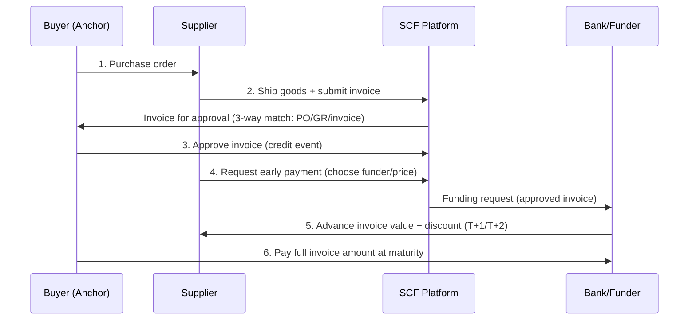

# Supply Chain Finance (SCF): A Comprehensive Guide

> **Author:** Jack Liu Shurui — Solution Architect at Crédit Agricole CIB, Singapore  
> **Context:** Trade Finance / Banking Architecture — SCF Products, Approved Payables Finance, Platforms, Digitization, Risk, Banking Implementation, Singapore/Asia  
> **Repository:** [github.com/jackliusr/research](https://github.com/jackliusr/research)  
> **Last Updated:** August 2026

---

## Table of Contents

1. [What Is Supply Chain Finance (SCF)?](#1-what-is-supply-chain-finance-scf)
   - 1.1 [Definition](#11-definition)
   - 1.2 [The Core Problem: The Working Capital Gap](#12-the-core-problem-the-working-capital-gap)
   - 1.3 [SCF vs Traditional Lending](#13-scf-vs-traditional-lending)
   - 1.4 [Anchor-Centric Financing](#14-anchor-centric-financing)
   - 1.5 [Market Size and Why It Matters](#15-market-size-and-why-it-matters)
2. [The SCF Product Family](#2-the-scf-product-family)
   - 2.1 [Receivables Finance](#21-receivables-finance)
   - 2.2 [Payables Finance / Reverse Factoring / Approved Payables Finance (APF)](#22-payables-finance--reverse-factoring--approved-payables-finance-apf)
   - 2.3 [Inventory Finance / Stock Finance](#23-inventory-finance--stock-finance)
   - 2.4 [Purchase Order (PO) Finance / Pre-Shipment Finance](#24-purchase-order-po-finance--pre-shipment-finance)
   - 2.5 [Dynamic Discounting](#25-dynamic-discounting)
   - 2.6 [Supply Chain Guarantee Products](#26-supply-chain-guarantee-products)
   - 2.7 [Product Comparison](#27-product-comparison)
3. [The SCF Ecosystem and Players](#3-the-scf-ecosystem-and-players)
   - 3.1 [The Anchor / Buyer](#31-the-anchor--buyer)
   - 3.2 [The Suppliers](#32-the-suppliers)
   - 3.3 [The Banks / Funders](#33-the-banks--funders)
   - 3.4 [The Platform Providers](#34-the-platform-providers)
   - 3.5 [The Fintechs: Linklogis](#35-the-fintechs-linklogis)
   - 3.6 [Marketplace vs Single-Bank Models](#36-marketplace-vs-single-bank-models)
4. [The SCF Economics](#4-the-scf-economics)
   - 4.1 [Where the Money Is Made: The Spread](#41-where-the-money-is-made-the-spread)
   - 4.2 [The Anchor-Rate Advantage](#42-the-anchor-rate-advantage)
   - 4.3 [A Worked Economics Example](#43-a-worked-economics-example)
   - 4.4 [The Value Proposition by Party](#44-the-value-proposition-by-party)
5. [The SCF Transaction Flow](#5-the-scf-transaction-flow)
   - 5.1 [The End-to-End Flow](#51-the-end-to-end-flow)
   - 5.2 [Flow Diagram](#52-flow-diagram)
   - 5.3 [The Key Documents](#53-the-key-documents)
6. [The SCF Lifecycle](#6-the-scf-lifecycle)
   - 6.1 [Anchor Program Setup](#61-anchor-program-setup)
   - 6.2 [Supplier Onboarding and KYB](#62-supplier-onboarding-and-kyb)
   - 6.3 [Legal Agreements](#63-legal-agreements)
   - 6.4 [The Ongoing Invoice-by-Invoice Cycle](#64-the-ongoing-invoice-by-invoice-cycle)
7. [Technology and Digitization](#7-technology-and-digitization)
   - 7.1 [The SCF Platform as the Hub](#71-the-scf-platform-as-the-hub)
   - 7.2 [E-Invoicing, EDI and ERP Integration](#72-e-invoicing-edi-and-erp-integration)
   - 7.3 [The Invoice Authenticity Problem](#73-the-invoice-authenticity-problem)
   - 7.4 [Blockchain / DLT for Trade Finance](#74-blockchain--dlt-for-trade-finance)
   - 7.5 [Digital Trade Documents: MLETR, eBL, DCSA](#75-digital-trade-documents-mletr-ebl-dcsa)
   - 7.6 [AI in SCF](#76-ai-in-scf)
   - 7.7 [RPA in SCF Operations](#77-rpa-in-scf-operations)
8. [Regulatory and Risk Considerations](#8-regulatory-and-risk-considerations)
   - 8.1 [The SCF Risk Taxonomy](#81-the-scf-risk-taxonomy)
   - 8.2 [Credit Risk and Concentration](#82-credit-risk-and-concentration)
   - 8.3 [Fraud Risk and the Greensill Case Study](#83-fraud-risk-and-the-greensill-case-study)
   - 8.4 [Operational Risk](#84-operational-risk)
   - 8.5 [Conduct Risk: The Supplier-Harm Debate](#85-conduct-risk-the-supplier-harm-debate)
   - 8.6 [Regulatory Treatment: True Sale, IFRS 9, Basel](#86-regulatory-treatment-true-sale-ifrs-9-basel)
   - 8.7 [SCF in the Bank's Book](#87-scf-in-the-banks-book)
9. [Banking Implementation](#9-banking-implementation)
   - 9.1 [SCF Product Architecture and the Product Factory](#91-scf-product-architecture-and-the-product-factory)
   - 9.2 [Workflow Orchestration](#92-workflow-orchestration)
   - 9.3 [Integration: ERP, Platform, Payment Rails](#93-integration-erp-platform-payment-rails)
   - 9.4 [Funding and Limits](#94-funding-and-limits)
   - 9.5 [Reporting](#95-reporting)
   - 9.6 [Build vs Buy vs Hybrid](#96-build-vs-buy-vs-hybrid)
   - 9.7 [The Architect's View: SCF Reference Architecture](#97-the-architects-view-scf-reference-architecture)
   - 9.8 [The SCF Data Model](#98-the-scf-data-model)
10. [The Singapore/Asia Context](#10-the-singaporeasia-context)
    - 10.1 [The Asian SCF Market](#101-the-asian-scf-market)
    - 10.2 [MAS Support and the Trade Finance Registry](#102-mas-support-and-the-trade-finance-registry)
    - 10.3 [ASEAN and Regional Initiatives](#103-asean-and-regional-initiatives)
    - 10.4 [The GLDB / Linklogis Context](#104-the-gldb--linklogis-context)
    - 10.5 [Singapore as a Trade Hub: Commodity Trade Finance](#105-singapore-as-a-trade-hub-commodity-trade-finance)
11. [The Future (2026+)](#11-the-future-2026)
    - 11.1 [End-to-End Digitization](#111-end-to-end-digitization)
    - 11.2 [AI Everywhere](#112-ai-everywhere)
    - 11.3 [Tokenization of Trade Assets](#113-tokenization-of-trade-assets)
    - 11.4 [Embedded SCF](#114-embedded-scf)
    - 11.5 [ESG / Green SCF](#115-esg--green-scf)
    - 11.6 [Platform Consolidation](#116-platform-consolidation)
12. [Glossary](#12-glossary)
13. [References](#13-references)

---

## 1. What Is Supply Chain Finance (SCF)?

### 1.1 Definition

**Supply Chain Finance (SCF)** is the family of financing solutions that optimise working capital by linking financing directly to the **physical and financial flows of a supply chain** — a purchase order, an invoice, a shipment, or a stock of goods in transit. Instead of lending against a company's balance sheet, SCF lends against a *specific transaction* in the chain: the money is advanced, repaid, and priced by reference to the underlying trade event.

The industry-standard definition comes from the **BAFT / FCI / ITFA / ICC "Standard Definitions for Techniques of Supply Chain Finance"** (November 2016), which describes SCF as financing techniques used to optimise working capital and liquidity within the supply chain process, where the financing is triggered, monitored and repaid against the movement of goods and the associated trade documents. Two pillars anchor the definition:

- **Receivables-based techniques** — financing the *supplier's* right to be paid (the invoice).
- **Payables-based techniques** — financing the *buyer's* obligation to pay (the approved payable), where the buyer's credit stands behind the funding.

SCF is a subset of **trade finance**. Where classic trade finance is documentary (letters of credit, documentary collections), SCF is largely **open-account** — it operates on the plain commercial invoices that dominate modern B2B trade (over 80% of world trade by value is open account). The commercial driver is simple: suppliers want to be paid sooner; buyers want to pay later; a funder with better access to capital than the supplier monetises the gap.

### 1.2 The Core Problem: The Working Capital Gap

Every physical supply chain has three flows moving in parallel:

- **Physical flow:** goods move from supplier → buyer (via logistics providers).
- **Information flow:** orders, invoices, goods-receipt notes, approvals move in both directions.
- **Financial flow:** money moves *against* the goods — and this is where the friction lives.

When a supplier ships goods to a buyer on open-account terms of, say, **net 60** or **net 90 days**, the supplier has already spent cash on raw materials, labour, and freight, but will not be paid for two to three months. That interval — between **when the supplier must pay its own costs** and **when the buyer pays the invoice** — is the **working capital gap**. It is created by the **payment-terms mismatch**: the supplier's *outgoing* payment terms (to its own vendors, often net 30 or shorter) are shorter than its *incoming* terms (from its customer, often net 60–120).

```
Supplier's cash outflows          Supplier's cash inflows (from buyer)
(own suppliers, payroll,          ──────────────────────────────────►
 freight, taxes)                       invoice issued  payment due
      │                                        │             │
      ▼                                        ▼             ▼
──────┼────────────────────────────────────────┼─────────────┼──────► time
      │                                        │             │
      │◄──────── WORKING CAPITAL GAP ─────────►│             │
      │         (the SCF opportunity)          │             │
      │                                        │             │
      │◄─── PO ───►│◄── ship + invoice ──►│◄── approval ──►│
```

For a large, investment-grade buyer the gap is a cheap source of float: extending payment terms from 60 to 90 days is effectively free financing from suppliers. For a small supplier it is a slow bleed: the gap must be bridged with expensive overdrafts, or not bridged at all, constraining growth. SCF exists to fund this gap at a price between the supplier's cost of capital and the buyer's cost of capital — the difference being the entire economic basis of the product (see [Section 4](#4-the-scf-economics)).

### 1.3 SCF vs Traditional Lending

| Dimension | Traditional corporate lending | Supply chain finance |
|---|---|---|
| **What is assessed** | The borrower's balance sheet, cash flow, rating | The *transaction* and the *anchor's* credit |
| **Security** | General corporate covenant / collateral package | The trade asset: invoice, approved payable, goods, PO |
| **Use of proceeds** | General corporate purposes | Tied to a specific trade flow |
| **Tenor** | 1–7+ years | Days to ~12 months (self-liquidating) |
| **Repayment source** | Borrower's ongoing cash flows | The specific trade event: buyer's payment at maturity, sale of goods |
| **Credit decision** | Borrower-centric | **Anchor-centric** (see 1.4) |
| **Documentation** | Facility agreement, security | Receivables purchase agreement / master framework + invoice-by-invoice mechanics |
| **Risk weight (typical)** | 100% of borrower grade | Preferential for short-term self-liquidating trade (see [8.6](#86-regulatory-treatment-true-sale-ifrs-9-basel)) |
| **Lending vs purchase** | Loan on balance sheet | Often a **true sale** of the receivable (off-balance-sheet for the seller) |

Two structural differences matter most:

1. **Asset-backed by the transaction, not the balance sheet.** The funder's claim is on a specific invoice or payable, not on the borrower's general credit. The credit quality of the *asset* (and of the party obligated to pay it) drives the pricing.
2. **The credit pivot is the buyer, not the borrower.** In payables finance the supplier "borrows" on the buyer's credit; in receivables finance the funder's real risk is often the *debtor* (the buyer of the goods), not the supplier it funds. This is what makes SCF structurally different from an SME overdraft.

### 1.4 Anchor-Centric Financing

The **anchor** is the large, usually investment-grade company at the centre of the supply chain — the buyer whose payables are financed, or whose purchase orders anchor the chain. SCF is *anchor-centric* in three senses:

- **Credit:** the funder prices the whole programme off the anchor's credit rating. The anchor's payment obligation (its approved payable, its accepted invoice) is the collateralised risk. Suppliers are credit-assessed for *fraud and operational risk*, but the *economic* risk is the anchor's.
- **Origination:** the programme is sold to the anchor (the buyer), which then invites its suppliers onto the platform. The anchor controls the ecosystem — who is onboarded, which invoices are approved, what terms are offered.
- **Concentration:** a portfolio of SCF programmes is, in effect, a portfolio of bets on a handful of anchors. This concentration is the defining risk of the asset class (see [8.2](#82-credit-risk-and-concentration)) and was central to the Greensill collapse ([8.3](#83-fraud-risk-and-the-greensill-case-study)).

The anchor-centric model is why banks love SCF: it converts a portfolio of thousands of unrated SME suppliers into what is economically a set of exposures to a small number of investment-grade names — low-risk assets, fee income, and deep relationships (see [4.4](#44-the-value-proposition-by-party)).

### 1.5 Market Size and Why It Matters

- Global SCF volumes are commonly estimated at **well over US$1 trillion** (BCR Publishing's *World Supply Chain Finance Report* series, 2023–2025), having roughly doubled over the past decade. Payables finance (APF) is the largest and fastest-growing segment.
- The **global trade finance gap** — unmet demand for trade financing, concentrated among SMEs — is estimated at **~US$2.5 trillion** (ADB, 2023–2024 estimates). SCF is the most scalable answer to that gap because it does not require SME credit analysis: it requires anchor credit analysis.
- For banks, SCF sits inside the **trade finance portfolio** — one of the few lending businesses that is short-tenor, self-liquidating, collateralised by trade assets, and eligible for preferential capital treatment.

---

## 2. The SCF Product Family

SCF is not one product. It is a spectrum of techniques, each tied to a different stage of the order-to-cash / procure-to-pay cycle:

```
Order placed    Goods shipped    Invoice issued    Goods received     Payment due
    │                │                │                │                │
    ▼                ▼                ▼                ▼                ▼
┌────────┐      ┌──────────┐     ┌──────────┐      ┌──────────┐     ┌─────────┐
│  PO    │      │  Goods   │     │ Invoice  │      │ Approval │     │ Maturity│
│ finance│      │ in transit│    │/receivable│      │ (credit  │     │ (buyer  │
│(2.4)   │      │ Inventory│    │ finance  │      │  event)  │     │  pays)  │
│        │      │ finance  │    │ (2.1)    │      │  APF     │     │         │
│        │      │ (2.3)    │    │          │      │ (2.2)    │     │         │
└────────┘      └──────────┘     └──────────┘      └──────────┘     └─────────┘
   pre-shipment ◄──────────────  post-shipment  ──────────────►
   (riskier: no goods/invoice yet)                (risk anchored on buyer)
```

### 2.1 Receivables Finance

**Receivables finance** covers the techniques where a *supplier* (the seller of goods) raises cash against its outstanding invoices — its receivables from buyers. The supplier sells (or pledges) the receivable at a discount; the funder collects from the buyer at maturity. Variants:

- **Factoring.** The supplier sells its receivables to a **factor** (a bank or specialist) at a discount. The factor typically also provides the *service*: credit control, collection, and ledger administration — the "full-service" model. Two axes define it:
  - *Recourse vs non-recourse.* With **recourse**, if the buyer (debtor) does not pay at maturity, the factor can claim the money back from the supplier — the supplier keeps the credit risk of its customers. With **non-recourse**, the factor assumes the debtor's credit risk (subject to approved limits); the price reflects that risk transfer.
  - *Notified vs undisclosed.* **Notified** (or "disclosed") factoring tells the buyer that its invoice has been sold and that payment should go to the factor (a notice of assignment). **Undisclosed** (or "confidential") factoring keeps the arrangement hidden: the buyer keeps paying the supplier, who forwards the money to the factor.
- **Invoice discounting.** The supplier borrows against its invoice book (a *loan*, not a sale) while retaining ownership and collection duties. Cheaper and less administratively heavy than factoring; the buyer is usually not notified. The lender takes a charge over the receivables ledger.
- **Forfaiting.** The supplier sells **medium-term export receivables** — typically 6 months to 5+ years, often evidenced by promissory notes, bills of exchange, or accepted drafts under documentary credits — **without recourse** to a forfaiter. The classic use case is capital-goods and commodity exports, where the supplier wants to remove both credit and political risk from its book. The forfaiter prices off the *importer's* bank (the avalising/endorsing bank), which is why forfaiting is effectively bank-risk business.

**Where it sits in the chain:** receivables finance is *supplier-initiated* and priced on the supplier's book (mitigated by the debtor concentration). It is the older, more fragmented part of SCF; payables finance is the modern, platform-driven part.

### 2.2 Payables Finance / Reverse Factoring / Approved Payables Finance (APF)

**Approved Payables Finance (APF)** — also called **reverse factoring** or **supply chain finance** in the narrow sense — is the **flagship SCF product** and the largest segment of the market. The mechanism in one sentence:

> The **anchor buyer approves** its suppliers' invoices; the **bank pays the supplier early** at a discount; at maturity the **buyer pays the bank in full**.

Why "reverse" factoring? Classic factoring finances the *supplier's* receivables and carries the supplier's credit risk. APF *reverses* the credit pivot: the funder's risk is the **buyer's** obligation to pay the approved invoice, not the supplier's. The supplier simply gets paid early; the party who "borrows" in economic substance is the buyer, which is why it is sometimes called **buyer-led** SCF.

**The mechanism, step by step:**

1. Buyer and supplier agree commercial terms (e.g. net 60).
2. Supplier ships goods and submits an invoice through the SCF platform.
3. **The buyer approves the invoice** — this approval is *the credit event*. An approved invoice is an unconditional payment obligation of the anchor, far stronger collateral than an unapproved one.
4. The supplier can now choose to be **paid early**: the bank advances the invoice face value *minus a discount* (a fee for the early payment), typically within 1–2 business days.
5. At the original maturity date, **the buyer pays the full invoice amount to the bank**, which repays itself and books the discount as income.

**The "supplier borrows at the buyer's rate" effect:** because the funding is secured by the anchor's approved obligation, the discount rate is priced off the **anchor's** credit, not the supplier's. A small supplier paying 8–12% on its overdraft can fund at the anchor's investment-grade rate plus a programme margin — often 3–5% all-in. The buyer gets extended payment terms (e.g. from 60 to 90 days) as its share of the value. The bank earns the discount spread plus fees. This **win-win-win** is the product's engine (economics in [Section 4](#4-the-scf-economics)).

**Key structural features:**

- **No balance-sheet impact for the buyer** (it is a trade payable, not debt — though disclosure regimes are tightening, see [8.6](#86-regulatory-treatment-true-sale-ifrs-9-basel)).
- **True sale for the supplier** (the receivable is sold, not pledged — off-balance-sheet if structured correctly).
- **Scalable:** one anchor programme can onboard thousands of suppliers; the anchor's ERP is the source of truth for invoices.
- **Multi-bankable:** several funders can compete on the same platform (marketplace model, [3.6](#36-marketplace-vs-single-bank-models)).

APF is what most people mean by "supply chain finance" in the press — including the Greensill story ([8.3](#83-fraud-risk-and-the-greensill-case-study)), which was APF stretched beyond its safe envelope.

### 2.3 Inventory Finance / Stock Finance

**Inventory finance** finances *goods* sitting in the supply chain — between the supplier's factory and the buyer's shelf. The goods themselves are the collateral; the funder controls them. Variants:

- **Floor plan finance (dealer finance).** A manufacturer (e.g. of cars, tractors, electronics) ships stock to a dealer network; the bank pays the manufacturer and takes a security interest in the stock; the dealer repays as it sells units (each sale triggers a repayment — the "pay-as-you-sell" model). Common in automotive, white goods, and machinery distribution.
- **Warehouse receipt finance.** Goods are stored in a warehouse under the control of a **collateral manager** (e.g. SGS, Cotecna, Control Union, Bureau Veritas) that issues a **warehouse receipt** — a document of title to the goods. The bank lends against the receipt, with the collateral manager releasing goods only against repayment (or against the bank's instruction). The warehouse receipt can be *negotiable* (transferable by endorsement, a document of title under common law) or *non-negotiable* (a mere storage receipt).
- **Consignment stock finance.** The supplier places stock on the buyer's premises (or a bonded location) on consignment; title passes only when the buyer draws the stock down. The funder finances the supplier's working capital tied up in consigned stock, repaid on drawdown.

**The controlling principle:** the lender must *control the collateral* — physically (via collateral management companies, locked warehouses, insurance) and legally (via security interests, pledges, title documents). Inventory finance is therefore as much an **operations and logistics business** as a credit business: the collateral manager's inspection, valuation, and release discipline *is* the product. In Asia, where commodity flows dominate, inventory/warehouse finance is a major line (see [10.5](#105-singapore-as-a-trade-hub-commodity-trade-finance)) — and the history of fraud in the sector (double-pledged stock, fake warehouse receipts) explains why control is non-negotiable.

### 2.4 Purchase Order (PO) Finance / Pre-Shipment Finance

**PO finance** funds the supplier *before* the goods are shipped — against a confirmed **purchase order** from a creditworthy buyer. The supplier needs cash to buy raw materials and manufacture the order; the PO is the evidence of the future receivable.

- **The risk profile is fundamentally different:** there are *no goods and no invoice yet*. The funder is exposed to the supplier's *performance risk* (will it actually produce and ship?) on top of the buyer's payment risk. This is why PO finance is priced higher, capped more conservatively (typically 50–70% of the PO value), and requires much deeper supplier due diligence than APF.
- **Pre-shipment finance** under letters of credit (the "red clause" L/C) is the documentary ancestor; modern PO finance is done against open-account POs, often with ERP confirmation and milestone-based drawdowns (raw-material purchase → production → shipment).
- PO finance is the natural *on-ramp* product for SME suppliers: it finances the gap *before* the invoice exists, converting a PO into a near-receivable. Platforms increasingly combine PO finance with APF to cover the supplier's full cycle.

### 2.5 Dynamic Discounting

**Dynamic discounting** is the *non-bank* sibling of APF: the **buyer** offers suppliers early payment at a **sliding discount** that scales with how early the payment is made (the earlier, the deeper the discount — e.g. 2% for 30 days early, 1% for 15 days).

- **No bank, no third-party funder:** the buyer funds the early payment from *its own working capital*. The buyer's return is the discount it captures (effectively its own cheap "reverse" financing), and suppliers get an alternative to bank-funded early payment.
- It is a **treasury optimisation tool**, not a lending product — which is exactly the point: no credit lines, no legal framework, no balance-sheet treatment questions. Platforms like **C2FO** run dynamic discounting as a *marketplace* where suppliers bid the discount they will accept and the buyer accepts the cheapest offers.
- **Why it matters to banks:** dynamic discounting is both a *competitor* (it cannibalises APF volume when the buyer has cash) and a *complement* (platforms often offer dynamic discounting funded by buyer cash *and* bank-funded APF side by side — the buyer chooses the cheaper source per invoice). A bank's SCF platform strategy must price APF against the buyer's own cost of funds.

### 2.6 Supply Chain Guarantee Products

The bank also supports the chain through **guarantees and standby letters of credit** rather than funding:

- **Bid bonds / tender guarantees** — guarantee the supplier's commitment to honour a tender.
- **Performance guarantees** — secure the buyer against the supplier's failure to perform (the goods arrive late or defective).
- **Advance payment guarantees** — protect the buyer's pre-payment to the supplier.
- **Standby L/Cs (SBLCs)** — a guarantee in L/C form, governed by ISP98/UCP600, used as security for trade obligations or as credit support backing an APF programme (the anchor's bank issues an SBLC in favour of the funder).
- **Receivables credit insurance** — technically an insurance product, but integral to SCF: it wraps the buyer's payment risk, enabling non-recourse factoring and APF without the bank holding the full credit. (Greensill's reliance on credit insurance that did not pay out on demand is the cautionary tale — [8.3](#83-fraud-risk-and-the-greensill-case-study).)

Guarantees are balance-sheet-light for the bank (off-balance-sheet, contingent) but capital-consumptive (100% credit conversion factor for performance guarantees under Basel). They are often the *entry product* a bank sells an anchor before winning the funded SCF mandate.

### 2.7 Product Comparison

| Product | What is financed | Credit pivot | Collateral | Typical tenor | Bank role |
|---|---|---|---|---|---|
| Factoring | Supplier's invoices (service + finance) | Debtor (buyer) / supplier (recourse) | Assigned receivables | 30–120 days | Funder + servicer |
| Invoice discounting | Supplier's invoice book (loan) | Supplier (with debtor concentration) | Charge over receivables | 30–120 days | Lender |
| Forfaiting | Medium-term export receivables | Importer's bank | Bills/notes, avalised | 6 mo – 5+ yr | Funder (without recourse) |
| **APF / reverse factoring** | Approved buyer payables | **Anchor buyer** | Approved invoice | 30–120 days | Funder on anchor credit |
| Inventory / floor plan | Goods in the chain | Dealer / stock owner | Goods under control | 30–180 days | Lender + collateral control |
| Warehouse receipt | Goods in warehouses | Stock owner + receipt | Title document / goods | 30–180 days | Lender via collateral manager |
| PO finance | Pre-shipment working capital | Supplier performance + buyer | The PO | 30–90 days pre-shipment | Lender (higher risk) |
| Dynamic discounting | Early payment by buyer | Buyer's own cash | — | Days | None (or platform) |
| Guarantees / SBLC | Performance, not funding | Anchor's bank | Contingent | Project tenor | Issuer |

---

## 3. The SCF Ecosystem and Players

### 3.1 The Anchor / Buyer

The anchor is the programme's centre of gravity: it signs the master agreement, drives supplier adoption, and its approval workflow creates the credit assets. Anchors are typically investment-grade corporates (FMCG, automotive, electronics, retail, pharma, energy traders) with large supplier bases and long payment terms. Their motivations: extend DPO, secure supply, monetise their rating, and (increasingly) meet ESG and supply-chain-resilience goals. The anchor relationship is the bank's real "product" — the SCF programme is a relationship product sold to the anchor, not to the suppliers.

### 3.2 The Suppliers

The other side of every programme: thousands of SMEs and mid-caps who ship goods and want early payment. Suppliers are the *users* of the platform and the source of volume, but they are not the credit engine. Their onboarding experience (KYB, e-signature, bank-account verification, self-service) determines adoption, and adoption determines programme economics — a programme with 80% supplier uptake is worth far more than one with 30%. Supplier treatment is also the conduct-risk battleground ([8.5](#85-conduct-risk-the-supplier-harm-debate)).

### 3.3 The Banks / Funders

Funders provide the money and take the anchor credit risk. They include:

- **Global/systemic banks** (the biggest SCF books: BNP Paribas, HSBC, Citi, JPMorgan, Santander, Standard Chartered, DBS, OCBC, UOB, MUFG, Citi...) — full-balance-sheet APF, often via owned or licensed platforms.
- **Regional and Asian banks** — aggressive in domestic/regional programmes, often partnering with fintech platforms for technology.
- **Non-bank funders and capital markets** — money-market funds, asset managers, and securitisation vehicles buying SCF receivables (Greensill's model: fund SCF assets with short-term money-market notes). Post-2021, non-bank SCF funding is more regulated and more cautious, but it remains a major funding channel, especially through **securitisation** of approved payables (the "supply chain finance securitisation" / ABCP market).

### 3.4 The Platform Providers

The platform is where invoices are submitted, approved, discounted, and settled. The major commercial platforms:

- **Taulia** (SAP-owned since 2022) — the largest independent SCF platform; APF, dynamic discounting, and e-invoicing; deeply integrated with SAP ERPs; strong in Europe and the US. Its SAP ownership makes it the default choice for SAP-anchor programmes.
- **PrimeRevenue** — one of the oldest (founded 2004) and largest APF platforms; multi-bank marketplace model; strong US presence; known for its bank-agnostic funding marketplace.
- **C2FO** — the dynamic-discounting *marketplace*: suppliers bid discounts in real time against the buyer's cash; also offers bank-funded early payment. The "exchange" model, complementary to bank APF.
- **Orbian** — bank-owned cooperative (founded by Citi and SAP; now owned by a consortium of banks); multi-bank APF platform for large corporates, with a strong focus on the anchor's ERP integration.
- **Greensill Capital** (2011–2021) — the cautionary tale: grew into one of the world's largest SCF funders via platform-based APF funded by Credit Suisse money-market notes, then collapsed in March 2021 after its credit-insurance cover was pulled and its single-largest client (GFG Alliance, ~US$5bn of exposure) was revealed to be effectively dependent on rolling future receivables. Full case study in [8.3](#83-fraud-risk-and-the-greensill-case-study).
- **Demica, Finacity, Kriya, Modifi, Triterras, Incomlend, Octet** — second-tier and challenger platforms across regions and segments (factoring digitisation, SME SCF, commodity SCF).
- **Linklogis** (联易融) — the Chinese/HK SCF fintech platform company; see [3.5](#35-the-fintechs-linklogis) and the GLDB context in [10.4](#104-the-gldb--linklogis-context).

### 3.5 The Fintechs: Linklogis

**Linklogis Inc.** (HKEX: 9959) is the most important SCF fintech for the Singapore/Asia story. Founded by Song Qun in 2016, backed by Tencent, and listed on the Hong Kong Stock Exchange in April 2021, it is China's largest digital SCF technology company: its platforms digitise invoice financing, accounts-payable/receivables workflows, and multi-tier SCF for banks, anchors, and SMEs — processing hundreds of billions of RMB of annual volume. Its model is *technology-and-solutions* (not balance-sheet): it sells SCF platforms to banks and anchors and operates its own SME funding marketplace.

The Singapore connection: Linklogis is the technology partner in the **Green Link Digital Bank (GLDB)** consortium — the MAS-licensed digital wholesale bank launched in June 2022 with Greenland Group, built around MSME supply chain finance for the Singapore–China trade corridor (see [green_link_digital_bank_guide.md](green_link_digital_bank_guide.md) and [10.4](#104-the-gldb--linklogis-context)). For a Singapore bank architect, Linklogis is the reference example of an *anchor-agnostic, bank-agnostic SCF platform vendor*: cloud-native, API-first, and built to plug into a bank's core rather than replace it.

### 3.6 Marketplace vs Single-Bank Models

The funding architecture of a platform comes in two shapes:

- **Single-bank (proprietary) model.** One bank owns/licenses the platform and funds the programme alone. Simpler, captive, and relationship-deep — the anchor gets one funder, the bank gets the whole spread. The platform is a *distribution channel* for the bank's balance sheet. This is the classic bank model (e.g. a bank's own white-labelled Taulia/PrimeRevenue instance, or its in-house platform).
- **Marketplace (multi-bank) model.** The platform hosts many funders (banks, non-banks, capital markets) who *compete to fund each invoice* — like an exchange for early payments. The anchor/suppliers see a price per invoice; the cheapest funder wins the trade. Marketplaces maximise funding liquidity and price transparency but commoditise any single bank's franchise: the bank must win each invoice on price and service. PrimeRevenue and Orbian run marketplace models; C2FO is the extreme case (buyer cash vs bank cash bidding).

For a bank, the strategic question is which model to *be in*: operate a single-bank platform (margin, control, but limited by own balance sheet) or join marketplaces (volume, but thin margins and dependency on a third-party platform). Most large banks do both — a proprietary platform for their anchor franchise and marketplace participation where anchors demand multi-banker competition.

---

## 4. The SCF Economics

### 4.1 Where the Money Is Made: The Spread

Every SCF trade has the same shape: the funder advances cash *now* and receives a larger amount *later*. The difference is the **discount** (or fee), which is the funder's revenue and the supplier's cost. For APF the all-in cost to the supplier is:

```
All-in discount rate = anchor funding cost (e.g. SONIA/SOFR + anchor spread)
                     + programme margin (bank's fee, 50–150 bps typical)
                     + platform/fintech fee (if separate)
                     + supplier onboarding/admin fees (often waived)
```

The funder's **spread** is the programme margin plus the difference between what it pays for funding (its own cost of funds) and the anchor-based rate it charges. Because the asset is short-tenor (30–120 days) and self-liquidating, the *annualised* spread is earned many times over per year on the same limit — a 100 bps margin on a 60-day trade is ~6 turns of fee income per annum per dollar of limit utilisation.

### 4.2 The Anchor-Rate Advantage

The economic engine is the **rating arbitrage** between the anchor and its suppliers:

- An **investment-grade anchor** borrows at, say, **SOFR + 60 bps** (or lower in Asia, onshore CNY rates for Chinese anchors).
- Its **SME supplier** borrows at **8–12%+** — if it can borrow at all.
- APF prices the supplier's early payment at the *anchor's* rate plus margin: **~3–5% all-in** — dramatically below the supplier's own cost of capital, yet still above the bank's funding cost.

The gap between the supplier's cost of capital and the anchor-based rate is the **value pool** that SCF splits among the three parties. Structurally, the anchor's rating is the collateral: the supplier is effectively borrowing on the anchor's balance sheet. This is why SCF programmes are only attractive when the anchor is *materially* better rated than its suppliers — and why the product is much weaker when the "anchor" is itself a BBB- with stressed suppliers.

### 4.3 A Worked Economics Example

Concrete numbers for a typical APF trade (USD, 60-day invoice, US$1,000,000):

```
Invoice face value:                    US$ 1,000,000
Anchor credit spread (IG, ~SOFR+60bp):       0.6%  (annualised)
Programme margin (bank):                     1.0%  (annualised)
Supplier all-in discount rate:               1.6%  (annualised)
Discount for 60 days early (~1.6% × 60/360): US$ 2,667
Early payment to supplier:              US$   997,333
At maturity the anchor pays the bank:   US$ 1,000,000
Bank's gross margin on the trade:       US$ 2,667  (≈ 1.6% annualised, ×6 turns/yr)
```

- **Supplier:** receives ~99.7% of the invoice 60 days early — instead of waiting, and instead of paying 8%+ on an overdraft (which would have cost ~US$13,000 for the same 60 days).
- **Anchor:** the same trade financed on 90-day terms would cost the anchor nothing extra *and* it may have negotiated the extension *because* the programme exists — the extension's implicit value is often shared back to the anchor as a discount on the bank fee or simply as DPO.
- **Bank:** ~US$2,667 gross on one invoice, with the credit risk of an IG anchor, a 60-day tenor, and a self-liquidating structure.

The economics scale linearly with volume, which is why platforms obsess over supplier adoption and invoice flow: the margin is thin per invoice, and the business case is *throughput*.

### 4.4 The Value Proposition by Party

**For the supplier:**
- **Cheaper funding** — financing at the anchor's rate, not its own (typically 300–700 bps cheaper).
- **Faster payment** — days, not 60–120 days; predictable cash flow.
- **Reduced DSO** (Days Sales Outstanding) — early payment converts receivables to cash, shrinking the cash conversion cycle.
- **No new credit facility needed** — APF does not consume the supplier's own credit lines; it is off-balance-sheet (true sale).
- **Access to new buyers** — a supplier's willingness to join a buyer's programme is often a de facto condition of the relationship; the price of admission is low because the funding is cheap.

**For the buyer / anchor:**
- **Extended DPO** (Days Payable Outstanding) — payment terms can stretch from 60 to 90–120 days without harming suppliers (they are funded early).
- **Supply chain resilience** — financially healthier suppliers are less likely to fail, late-ship, or hoard cash; reduced supplier bankruptcy risk in a crisis.
- **Supplier risk reduction** — the bank's KYB on every supplier adds a layer of third-party risk management the buyer would otherwise have to run itself.
- **Monetising its rating** — the anchor's credit becomes a *revenue-generating asset* via fees or improved commercial terms.
- **No debt recognition** (in most jurisdictions/structures) — the payable remains a trade payable; this is also the accounting controversy ([8.6](#86-regulatory-treatment-true-sale-ifrs-9-basel)).

**For the bank:**
- **Fee and spread income** — recurring, short-tenor, high-turnover income.
- **Anchor relationships** — SCF is a sticky, strategic product that anchors the whole corporate relationship (deposits, FX, payments, hedging).
- **Low-risk assets** — economically an exposure to the investment-grade anchor, not to thousands of SMEs; eligible for preferential trade-finance capital treatment ([8.6](#86-regulatory-treatment-true-sale-ifrs-9-basel)).
- **Data** — the platform sees the anchor's entire supplier payment flow: unique intelligence for cross-sell (see the data layer in [9.7](#97-the-architects-view-scf-reference-architecture)).
- **Ecosystem lock-in** — once the platform is wired into the anchor's ERP, switching costs are high.

---

## 5. The SCF Transaction Flow

### 5.1 The End-to-End Flow

The canonical APF transaction has six steps:

1. **Buyer issues PO to supplier** — the commercial trigger. (In the physical world, the supplier ships against it.)
2. **Supplier ships goods + submits invoice** — the invoice is created in the supplier's system, submitted to the SCF platform (directly, via EDI/API, or via the anchor's ERP), and matched to the PO.
3. **Buyer approves the invoice** — the *credit event*. The buyer confirms the goods were received and the invoice is correct (three-way match: PO ↔ goods receipt ↔ invoice). An approved invoice becomes an unconditional payment obligation of the anchor.
4. **Supplier requests early payment** on the platform — choosing the funding option (which funder, what price) and the discount date.
5. **Bank/funder advances** the invoice value *minus the discount* — typically T+1/T+2 to the supplier's account, against the platform's funding instruction.
6. **At maturity the buyer pays the bank in full** — the anchor settles the approved invoice to the funder's collection account; the funder closes the position; the discount is realised as income.

Steps 3–6 are the *financing* cycle; steps 1–2 are the *trade* cycle. The platform's job is to connect them with zero manual re-keying.

### 5.2 Flow Diagram

```
                         TRADE FLOW                          FINANCE FLOW
┌─────────┐  1. PO    ┌──────────┐  2. ship + invoice   ┌───────────┐
│ BUYER   │ ────────► │ SUPPLIER │ ───────────────────► │ PLATFORM  │
│ (anchor)│ ◄──────── │          │                      │ (invoice  │
│         │   goods   │          │                      │  mgmt +   │
└────┬────┘           └──────────┘                      │  approval)│
     │                                                   └─────┬─────┘
     │  3. APPROVAL (credit event)                             │
     └─────────────────────────────────────────────────────────►│
                                                          4. supplier
                                                             requests
                                                             early pay
                                                               │
                                                               ▼
                                                       ┌─────────────┐
  6. maturity: buyer pays bank in full ◄─────────────  │ BANK/FUNDER │
     ───────────────────────────────────────────────► │             │
                                                       └──────┬──────┘
                                                              │ 5. advance
                                                              │    (less
                                                              ▼    discount)
                                                       ┌─────────────┐
                                                       │  SUPPLIER   │
                                                       │  receives   │
                                                       │  ~99.7% T+1 │
                                                       └─────────────┘
```

Mermaid equivalent:



### 5.3 The Key Documents

| Document | Issued by | Role in SCF | Digital form |
|---|---|---|---|
| **Purchase Order (PO)** | Buyer | Evidence of the commercial obligation; basis of PO finance ([2.4](#24-purchase-order-po-finance--pre-shipment-finance)) | ERP record, EDI/API message |
| **Invoice** | Supplier | The financing asset; its authenticity is the fraud battleground ([7.3](#73-the-invoice-authenticity-problem)) | e-invoice (Peppol, EDI, PDF+XML), platform record |
| **Goods receipt note (GRN)** | Buyer / logistics | Confirms delivery; input to the 3-way match that underpins approval | ERP record, scan, IoT/telematics data |
| **Approval (approval notice / accepted payable)** | Buyer | **The credit event** — converts the invoice into an anchor payment obligation | Platform workflow record; may be a formal notice of assignment/acknowledgement |
| **Receivables Purchase Agreement (RPA)** | Bank + supplier | The legal basis of each sale (see [6.3](#63-legal-agreements)) | e-signed; master agreement + trade confirmations |
| **Notice of assignment** | Bank/supplier | Perfection of the sale of the receivable to the funder | Registered in platform; filings where required |
| **Settlement/collection account instructions** | Buyer | Where the anchor pays the funder at maturity | Account mandate, standing order |

---

## 6. The SCF Lifecycle

### 6.1 Anchor Program Setup

A programme starts with the anchor, not the suppliers:

1. **Anchor due diligence and credit approval** — full corporate credit assessment (rating, financials, payment behaviour, concentration, sector). The bank sets an **anchor credit limit** for the programme (see [banking_limits_domain_guide.md](banking_limits_domain_guide.md)); APF utilisation draws against it.
2. **Commercial structuring** — programme terms (tenor, margin, funding currency, discount mechanics, fees, exclusivity), the legal framework, and the platform choice (bank's platform, vendor, or marketplace).
3. **ERP/technical integration** — the anchor's procure-to-pay system (SAP, Oracle, etc.) is wired to the platform: invoice feed, approval workflow, master data, and (optionally) payments (see [7.2](#72-e-invoicing-edi-and-erp-integration)).
4. **Supplier segmentation and onboarding campaign** — the anchor and bank prioritise the supplier base (by volume, criticality, fragility), then onboard in waves.
5. **Go-live and adoption management** — training, helpdesk, early-win supplier stories, uptake tracking against targets.

### 6.2 Supplier Onboarding and KYB

Each supplier joining the programme must be vetted — not for *credit* (that is the anchor's), but for *identity, integrity, and operational soundness*:

- **KYB (Know Your Business):** corporate registration and UBO verification, sanctions/AML screening, adverse media, watchlist checks, and (for banks) FATCA/CRS and tax status. In a digital bank or platform context this is increasingly **compliance-as-code** — automated KYB orchestration, API-driven screening, and continuous monitoring rather than a paper onboarding pack (see [programmable_business_bank_guide.md](programmable_business_bank_guide.md)).
- **Bank account verification** — the supplier's payout account is validated (name-match against the KYB record) to prevent diversion of funds.
- **Legal onboarding** — e-signature of the Receivables Purchase Agreement (or master framework + accession letter).
- **Technical onboarding** — platform credentials, invoice-submission method (portal, API, EDI), and training.

Onboarding speed is a commercial weapon: platforms that onboard a supplier in **hours-to-days** (vs weeks for paper-based banks) win adoption. The benchmark is a fully digital, e-KYC, e-signature, API-driven flow with straight-through onboarding for low-risk suppliers.

### 6.3 Legal Agreements

The legal stack of an APF programme:

- **The Master Framework / Receivables Purchase Agreement (RPA)** — between the bank and each supplier (or a single master with accession letters): governs the *sale* of receivables, warranties (the invoice is genuine, undisputed, not otherwise assigned), representations, discount mechanics, and true-sale provisions.
- **The Anchor Programme Agreement** — between the bank and the anchor: the anchor's payment obligation to the bank at maturity, approval mechanics, account arrangements, and the anchor's warranties.
- **Assignment and notice documents** — perfection of each sale (notice of assignment, registration in receivables registries where required, e.g. China's PBOC credit reference system for receivables pledges).
- **Intercreditor and security documents** — where multiple funders or a securitisation vehicle are involved: priority, account control agreements, and the collateral management agreements (for inventory finance — [2.3](#23-inventory-finance--stock-finance)).
- **Platform terms** — the platform's role as agent/record-keeper, data protection, and liability allocation (who is liable if the platform's approval record is wrong?).

The **true-sale vs secured-lending** characterisation of the RPA determines accounting and capital outcomes — see [8.6](#86-regulatory-treatment-true-sale-ifrs-9-basel). Legal review of the RPA (does the supplier genuinely *sell* the receivable, or merely pledge it?) is the single most consequential document review in SCF.

### 6.4 The Ongoing Invoice-by-Invoice Cycle

After onboarding, the programme runs as a high-volume operational cycle:

1. Invoice arrives on the platform (portal/API/EDI/ERP feed).
2. Automated validation: duplicate check (see [7.3](#73-the-invoice-authenticity-problem)), PO match, KYB status, limit availability, tenor and currency checks.
3. Approval routing to the anchor (auto-approval rules for low-value/low-risk bands; manual for exceptions).
4. Once approved: funding eligibility, discount pricing (per funder/marketplace), and the supplier's early-payment decision.
5. Funding execution → payout (via the bank's payment rails, [9.3](#93-integration-erp-platform-payment-rails)) → settlement tracking → maturity collection from the anchor → reconciliation.
6. Continuous monitoring: limit utilisation, concentration, approval rates, supplier adoption, aging, exceptions, and (in the digital bank) real-time risk dashboards.

Operationally, SCF is a **volume game with exception handling**: 95%+ of invoices should flow straight-through; the system's value is in the 5% that need matching, approval, or risk intervention.

---

## 7. Technology and Digitization

### 7.1 The SCF Platform as the Hub

The platform is the operational heart of modern SCF — the "SCF as a platform" model. Its canonical modules:

- **Invoice management:** capture (portal upload, API, EDI, email/OCR), validation, enrichment, deduplication, and the golden record of each invoice.
- **Approval workflow:** routing approved invoices from the anchor's ERP/AP team, with rule-based auto-approval and audit trail. The approval record is the *credit asset*.
- **Discounting engine:** pricing per invoice (anchor rate + margin, funder competition in marketplace mode), tenor-based discount calculation, and the supplier's self-service early-payment election.
- **Funding and settlement:** funding instructions to the bank, payout execution, maturity tracking, collections from the anchor, reconciliation to the penny.
- **Supplier portal:** self-service onboarding, invoice status, funding offers, documents, support.
- **Risk and analytics:** limit utilisation, concentration dashboards, aging, fraud alerts, portfolio MI.
- **Integration layer:** ERP connectors (SAP Ariba, SAP S/4HANA, Oracle), banking APIs, payment rails, KYB/AML services (see [9.7](#97-the-architects-view-scf-reference-architecture)).

The platform is also the *data monopoly*: it sees every invoice, every approval, every funding decision across the anchor's whole supplier base — the raw material for AI ([7.6](#76-ai-in-scf)) and for the bank's relationship intelligence.

### 7.2 E-Invoicing, EDI and ERP Integration

The plumbing that makes SCF cheap:

- **Anchor ERP integration** is the backbone: SAP (Ariba, S/4HANA Finance) and Oracle are the two dominant procure-to-pay stacks. The platform connects via standard integrations (SAP Ariba Network, SAP Business Network, Oracle Supplier Hub), EDI (X12, EDIFACT — invoices as 810/INVOIC messages), or APIs. The anchor's *approval* in its own ERP is the authoritative credit event; the platform mirrors it.
- **E-invoicing mandates** are accelerating the shift: Europe's ViDA framework, Peppol (the EU's e-invoicing network), India's GST e-invoicing, China's 数电票 (fully digital e-invoices), Singapore's IRAS e-invoicing push via the Peppol-based **InvoiceNow** network (IMDA). Where e-invoicing is mandatory, the invoice is *born digital and validated by the tax authority's clearing house* — a massive fraud-control gift to SCF (authentic, non-duplicable invoice identifiers).
- **API-first design** (see [spec_driven_development_frameworks_guide.md](../technology/spec_driven_development_frameworks_guide.md)) is now table stakes: the platform exposes REST/JSON APIs for invoice submission, status, funding, and reporting so that banks and anchors can embed SCF into their own systems rather than forcing portal logins.
- The **integration architecture** runs: Supplier ERP/portal → Platform → Bank systems (core, payments, limits, KYB) — with the anchor's ERP feeding approvals in between. Every hop should be a contract-tested, idempotent, auditable interface.

### 7.3 The Invoice Authenticity Problem

The existential operational risk of SCF is **invoice fraud**: the funder pays against an invoice that does not correspond to a real trade. The classic attacks:

- **Duplicate invoicing** — the same trade financed twice (against two different funders, or twice on the same platform). This is the crime the **Singapore Trade Finance Registry** was built to defeat ([10.2](#102-mas-support-and-the-trade-finance-registry)).
- **Phantom invoices** — invoices for goods that were never ordered, shipped, or received, submitted by a supplier colluding with (or impersonating) a buyer contact.
- **Inflated or split invoices** — real trades, wrong amounts; or one real trade chopped into multiple financings.
- **Early-payment fraud** — the supplier requests funding *before* the buyer has genuinely approved, exploiting a weak approval control.
- **Future receivables** — funding against invoices that *will* exist (the Greensill pathology, [8.3](#83-fraud-risk-and-the-greensill-case-study)): there is no invoice and no approval to verify, only a promise.

**The controls:**

1. **The "approved payables" control** — the non-negotiable rule: *the bank only funds what the anchor has explicitly approved*. The approval is captured in the anchor's own system (ERP) or via a cryptographically authenticated platform workflow, never from a supplier-submitted document alone.
2. **Three-way matching** — PO ↔ goods receipt ↔ invoice, in the anchor's ERP, before approval.
3. **Duplication checks** — hashed invoice fingerprints, cross-funder registries (STFR), and registry queries before funding.
4. **Bank-account verification and beneficiary matching** — payout only to the supplier's verified account.
5. **Behavioural analytics** — sudden changes in invoice patterns, amounts, counterparties, or approval velocity trigger review (AI in [7.6](#76-ai-in-scf)).

The Greensill lesson is unambiguous: the moment a programme funds anything *other than* an anchor-approved existing invoice, it has left SCF and entered unsecured lending wearing a trade-finance costume.

### 7.4 Blockchain / DLT for Trade Finance

DLT promised to solve trade finance's coordination problem — shared truth across banks, buyers, suppliers, and logistics. The reality so far is sobering (see [blockchain_technology_guide.md](../technology/blockchain_technology_guide.md) for the underlying tech):

- **we.trade** — the nine-bank European consortium (HSBC, Deutsche, Santander, Société Générale, UniCredit, etc.), launched 2018 on IBM Blockchain for SME open-account trade. **Wound down in 2022**: filed for insolvency after shareholders declined further funding (reported via the Irish Independent/Finextra) — the consortium could not reach scale before the money ran out.
- **Marco Polo Network** — the TradeIX/Contour-style consortium (founded 2017, ~30 banks including BNP Paribas, Commerzbank, ING, Standard Chartered) built on R3 Corda, focused on open-account trade finance with ERP integration. **Its holding company entered insolvency** (reported 2023, with cumulative losses of ~US$85m by 2021) — the second major trade-finance DLT consortium to fail.
- **Contour** — the L/C-focused network (successor to the Voltron project) continues with narrower ambitions.
- The **survivors** pivoted from "a blockchain for everything" to *specific, high-value documents and registries*: trade document digitisation (eBLs), shared KYC, and fraud registries (the STFR POC was built on a DLT-based network — [10.2](#102-mas-support-and-the-trade-finance-registry)).

**The lesson for architects:** the DLT consortia died of ecosystem economics, not technology — permissioned networks need a critical mass of banks AND corporates paying for the same network simultaneously, which SCF (already digitised by platforms) did not need. Today's pragmatic DLT use in SCF is narrow: **tokenisation of invoices** (an invoice as a transferable digital token with provenance — "invoice NFTs" in the experimental space), **registries** (STFR), and **e-document networks** (eBLs). The value is provenance and non-duplication, not the financing itself.

### 7.5 Digital Trade Documents: MLETR, eBL, DCSA

The quiet revolution is **digital trade documents**:

- **MLETR** — the UNCITRAL **Model Law on Electronic Transferable Records** (2017) gives electronic equivalents of bills of lading, promissory notes, and warehouse receipts the same legal force as paper — provided the system guarantees singularity, integrity, and control. Adoption: **Singapore** was an early adopter (Electronic Transactions Act amendments, 2021); the UK (Electronic Trade Documents Act, 2023); Bahrain, Abu Dhabi, Germany, France and others followed. MLETR adoption is the legal precondition for paperless trade.
- **eBL (electronic Bill of Lading)** — the highest-value trade document. The **Digital Container Shipping Association (DCSA)** (the carriers' standards body: MSC, Maersk, CMA CGM, Hapag-Lloyd, ONE, Evergreen, HMM, Yang Ming, ZIM...) published the **DCSA eBL standard** (v1.0, 2022) and, with the ICC and FIT Alliance, set the industry target of **100% eBL adoption by 2030**. eBL platforms (GSBN, Wave BL, essDOCS, CargoX, Bolero) issue, transfer, and surrender the eBL digitally; a bank financing the goods can hold the eBL as collateral in digital form.
- For SCF, eBLs and MLETR matter because they digitise the *documentary* half of trade (L/Cs, collections, warehouse receipts) that SCF's open-account half has long since digitised — enabling a future where inventory finance and forfaiting ([2.3](#23-inventory-finance--stock-finance), [2.1](#21-receivables-finance)) run on the same electronic-document rails as APF.

### 7.6 AI in SCF

The AI stack in SCF has four layers (see the ML guides in this repo — [financial_fraud_detection_at_scale_guide.md](financial_fraud_detection_at_scale_guide.md), [financial_risk_compliance_systems_guide.md](financial_risk_compliance_systems_guide.md)):

1. **AI credit scoring of suppliers** — models that score SME suppliers on alternative data (transaction history on the platform, payment behaviour, ERP data, tax filings, social/commercial data). Not for APF (the anchor is the risk), but *essential* for PO finance ([2.4](#24-purchase-order-po-finance--pre-shipment-finance)) and receivables finance, where the supplier's performance risk is real. This is how digital banks (GLDB, ANEXT — see [green_link_digital_bank_guide.md](green_link_digital_bank_guide.md)) underwrite MSMEs without legacy credit files.
2. **Fraud detection** — ML on invoice patterns, approval behaviour, and network graphs: duplicate-invoice fingerprints, anomalous discounting velocity, collusion rings (supplier–buyer-insider), and early-warning signals before losses crystallise.
3. **Document processing** — OCR + LLM extraction of invoices, POs, GRNs, and contracts into structured data (fields, line items, currencies, VAT), with validation against ERP feeds. LLM-based extraction (see the LLM/RAG guides under `../technology/ai_llm/`) handles the long tail of unstructured, non-EDI suppliers that would otherwise be excluded from automation.
4. **Decision and pricing optimisation** — dynamic discount pricing, funding-allocation across marketplaces, and limit-utilisation forecasting.

**The architect's caveat:** AI in SCF is *decision support, not the control*. The credit event remains the anchor's approval; AI refines pricing, detects fraud, and extends underwriting to pre-invoice products — it does not replace the control structure ([7.3](#73-the-invoice-authenticity-problem)).

### 7.7 RPA in SCF Operations

Before/alongside AI, **RPA** automates the legacy glue: re-keying invoices from email/PDF into platforms, status chasing, reconciliation between platform and core banking records, report generation, and exception routing. In a typical bank SCF operation, RPA bots handle the 30–50% of invoice flow that arrives unstructured (email attachments, scanned documents), freeing ops teams for true exceptions. RPA is the *interim* technology — the end-state is API-native capture (e-invoicing) plus LLM extraction, with RPA bridging the paper tail.

---

## 8. Regulatory and Risk Considerations

### 8.1 The SCF Risk Taxonomy

| Risk | Description | Mitigation |
|---|---|---|
| **Credit risk** | Anchor (or debtor) default before maturity | Anchor limits, diversification, tenor caps, true-sale structure ([8.2](#82-credit-risk-and-concentration)) |
| **Fraud risk** | Phantom/duplicate invoices, collusion, future-receivables abuse | Approved-payables control, 3-way match, registries, AI ([8.3](#83-fraud-risk-and-the-greensill-case-study)) |
| **Operational risk** | Platform failure, integration errors, settlement breaks, data loss | Resilient architecture, reconciliation, BCP (see [financial_infrastructure_guide.md](financial_infrastructure_guide.md)) ([8.4](#84-operational-risk)) |
| **Conduct risk** | Mis-selling, supplier harm, hidden term extensions | Disclosure, fair-value reviews, FCA/CMA expectations ([8.5](#85-conduct-risk-the-supplier-harm-debate)) |
| **Legal/structural risk** | True-sale recharacterisation, assignment enforceability, cross-border law | RPA quality, legal opinions, registrations ([8.6](#86-regulatory-treatment-true-sale-ifrs-9-basel)) |
| **Liquidity/funding risk** | Funder's own funding dries up (non-bank model) | Matched funding, committed lines, securitisation discipline ([8.7](#87-scf-in-the-banks-book)) |
| **Model/tech risk** | AI mispricing, platform vendor failure | Model governance, vendor exit plans |

### 8.2 Credit Risk and Concentration

SCF's credit profile is the mirror image of its economics:

- **The risk is the anchor.** An APF portfolio is economically a portfolio of short-term exposures to its anchors. The "diversification" of thousands of suppliers is illusory from a credit standpoint — if the anchor fails, every approved invoice fails together.
- **Concentration risk is structural:** SCF books concentrate by anchor (top-10 anchors are often 50%+ of a bank's SCF book), by sector (retail, auto, electronics, commodities), and by geography. Regulators and rating agencies scrutinise exactly this ([8.7](#87-scf-in-the-banks-book)).
- **The Greensill dimension:** when an anchor (GFG Alliance) is both a huge share of the book *and* financially dependent on the programme's continued rolling, the concentration stops being a diversification question and becomes a **single-name systemic** question. Banks manage this with anchor limits (see [banking_limits_domain_guide.md](banking_limits_domain_guide.md)), portfolio caps, sector limits, and stress tests (anchor default + supplier disruption jointly).
- **Maturity mismatch:** SCF assets are short-tenor (30–120 days) — which is precisely what makes them low-risk *if* the tenors are real. "Evergreen" rolling programmes where maturities are repeatedly extended, or where the anchor's payables keep growing with no cash conversion, are a red flag (the accounting community calls this "SCF as disguised leverage" — see [8.6](#86-regulatory-treatment-true-sale-ifrs-9-basel)).

### 8.3 Fraud Risk and the Greensill Case Study

**The collapse (timeline):**

- Greensill Capital (founded 2011 by Lex Greensill, Australia-born; HQ London) grew into one of the world's largest SCF funders, financing supply chains via its platform and funding the assets through **Credit Suisse's supply chain finance funds** (money-market-style notes) — the "non-bank SCF" model.
- Its largest client by far was **GFG Alliance** (Sanjeev Gupta's steel/commodity group): exposure of approximately **US$5 billion — roughly half of Greensill's total SCF commitments** (early-2021 court disclosures).
- **March 2021 collapse:** Greensill's credit insurers (led by Tokio Marine/HCC and Zurich) **declined to renew cover** — the trigger being, per the insurers, that the underlying "receivables" were not genuine short-term receivables but **future receivables**: long-dated, non-self-liquidating obligations that did not meet the insurance policy's definition. Without insurance, the Credit Suisse funds could not be marketed; redemptions were suspended (Credit Suisse's funds froze ~US$10bn of investor money, later wound down with heavy losses); Greensill Capital filed for insolvency in **March 2021**. Administrators (Grant Thornton) concluded the firm may have been insolvent as early as **2 March 2021**.
- **Aftermath:** UK political scandal (former PM David Cameron's lobbying for Greensill access to COVID-era government lending schemes); UK Serious Fraud Office and German authorities investigating Greensill Bank AG; FINMA's February 2023 criticism of Credit Suisse for governance failures over the funds; litigation over the insurance policies that did not pay (Zurich/Liberty disputes); and Greensill's co-founder Lex Greensill facing legal proceedings (convicted in 2025 on charges including fraud over GFG-related finance).

**The lessons for SCF practitioners:**

1. **Never fund future receivables as SCF.** The moment funding is against invoices that do not yet exist, the "self-liquidating, short-term, trade-backed" risk profile is fiction. It is unsecured corporate lending. The insurance market will (correctly) refuse to insure it, and the accounting treatment will collapse ([8.6](#86-regulatory-treatment-true-sale-ifrs-9-basel)).
2. **Single-payer concentration kills.** GFG ≈ 50% of the book. Concentration limits are not administrative detail; they are the product's survival constraint.
3. **Insurance is not capital.** Credit insurance as the credit-risk backstop must be verified for policy definitions (what counts as a receivable), renewal risk, and coverage triggers — and should never substitute for the funder's own credit analysis.
4. **"Anchor" quality is real credit risk.** GFG was investment-grade per some rating agencies but was in truth a highly levered, related-party-heavy group dependent on rolling Greensill funding. The anchor's rating must be stress-tested against its *dependence on the programme itself* — the circularity (anchor needs the programme; programme needs the anchor) is the Greensill trap.
5. **Conduct and transparency:** the opacity of the funds' holdings (what was actually in the notes) enabled the risk to build silently. Regulators worldwide responded with disclosure rules for supplier finance (see [8.5](#85-conduct-risk-the-supplier-harm-debate), [8.6](#86-regulatory-treatment-true-sale-ifrs-9-basel)).

### 8.4 Operational Risk

SCF operations concentrate risk in the platform and its integrations:

- **Single points of failure:** the platform is the record of truth for approvals and funding. Platform outages, data loss, or corrupted approval records are direct financial risks (funding without approval = credit risk; approvals lost = customer claims).
- **Integration risk:** ERP ↔ platform ↔ core banking interfaces fail, duplicate, or mis-map; reconciliation breaks across invoice, funding, and settlement records.
- **Fraud-vs-ops boundary:** weak operational controls (manual approvals, no duplicate checks, shared credentials) are how invoice fraud actually happens.
- **Vendor risk:** the platform vendor (Taulia, PrimeRevenue, etc.) is a critical supplier; its financial health, security posture, and exit plan are bank risks (the SCF platform M&A wave — [11.6](#116-platform-consolidation) — means vendor continuity is a live concern).
- **Cyber risk:** the platform holds payment credentials and PII for thousands of suppliers — a prime target (see [financial_infrastructure_guide.md](financial_infrastructure_guide.md)).

The bank's response: the platform is treated as critical infrastructure — DR/BCP, immutable audit logs, four-eyes controls on approvals and payouts, reconciliation controls, penetration testing, and a documented vendor exit strategy (data export, transition runbook).

### 8.5 Conduct Risk: The Supplier-Harm Debate

The post-Greensill regulatory lens turned to **who SCF might hurt**:

- **The concern:** buyers using SCF to *extend payment terms beyond what suppliers want* — the programme becomes a mechanism for squeezing suppliers rather than helping them. If the buyer's DPO extension is funded by the supplier paying a discount, the supplier can end up *worse off* than under the original terms, especially if the discount rate exceeds the supplier's own cost of capital (unlikely but possible for the smallest suppliers) or if the buyer extends terms repeatedly while pocketing the commercial benefit.
- **The UK reviews (2023):** the FCA published a review of the supply chain finance market (March 2023) and the CMA separately examined buyers' use of SCF in the context of late payment. Both flagged "supplier harm" risks — buyers using SCF to stretch terms, opaque programme economics for suppliers, and the risk that SCF masks rather than fixes late payment. The regulators stopped short of rule changes but set clear expectations: fair treatment of suppliers, transparency of costs, and no SCF-enabled term extensions that leave suppliers worse off. (Details per contemporaneous reporting; the exact scope of each document should be checked against the FCA/CMA sites.)
- **Disclosure regimes followed:** the FASB's **ASU 2022-04** (effective 2023) requires US public companies to disclose supplier finance programme obligations *including annual roll-forward data*; by 2025, rating agencies (e.g. Moody's, September 2025) were warning that disclosures show some companies stretching payment terms "later and later" and using SCF to mask liquidity pressure. The EU's proposed **Late Payment Regulation** (2023) — a 30-day payment cap — directly targets the same behaviour.
- **The bank's conduct duty:** the programme must be sold to suppliers with clear, fair pricing (the discount must be intelligible), the buyer's term extension must be commercially reasonable, and the bank should decline structures whose only purpose is to monetise supplier weakness. In Singapore, MAS conduct and fair-dealing expectations (and the general fair-dealing regime) apply to the bank's SCF sales into SME suppliers.

### 8.6 Regulatory Treatment: True Sale, IFRS 9, Basel

**True sale vs secured lending (accounting):**

- If the RPA genuinely **sells** the receivable (legal transfer of title, no recourse to the supplier beyond warranties, no repurchase obligation), the supplier derecognises the receivable and the funding is **off-balance-sheet** for the supplier.
- If the structure is in substance a **secured loan** (recourse to the supplier, deferred purchase price, credit support back to the supplier), the receivable stays on the supplier's balance sheet and the funding is debt.
- **Recharacterisation risk** is the core legal/accounting hazard: courts and auditors look at substance, not the RPA's label. The Greensill/GFG structures collapsed partly because the "receivables" were not genuinely sold self-liquidating assets.
- **IFRS 9 expected loss:** funded SCF assets are measured at amortised cost with **expected credit losses (ECL)** — the 12-month ECL for investment-grade-anchor-approved payables is typically tiny (low PD, short tenor), which is a large part of the product's capital appeal. The ECL model must use anchor PDs, not supplier PDs, and must capture the concentration risk ([8.2](#82-credit-risk-and-concentration)).
- **Buyer accounting:** for the anchor, the approved payable remains a trade payable; the SCF programme is a *disclosure* item, not debt — but the disclosure regimes above ([8.5](#85-conduct-risk-the-supplier-harm-debate)) increasingly force the economic substance into the open (the "is SCF debt?" debate: when the buyer's payment terms are 120+ days and funded by a bank at the buyer's credit, analysts treat it as off-balance-sheet leverage).

**Basel capital treatment (verified pointers):**

- Under the standardised approach, **short-term self-liquidating trade-related contingencies** (e.g. documentary credits collateralised by the underlying shipment) attract a preferential **20% credit conversion factor / risk weight treatment** in the classic Basel II/III SA framework (vs 100% for ordinary corporate contingencies) — the classic "trade finance 20%".
- **Basel III / Basel 3.1 finalisation** preserves preferential treatment for trade finance: short-term self-liquidating trade exposures (maturity ≤ 6 months, e.g. trade L/Cs) receive reduced risk weights (in the UK's Basel 3.1 implementation, preferential self-liquidating trade weights can be as low as **20%** depending on counterparty grade), and the **one-year maturity floor** is waived for trade finance under the IRB approach (national discretion).
- Caveats: the preferential treatment attaches to *documentary, self-liquidating* trade finance (L/Cs, collections) and to short-tenor self-liquidating exposures — plain APF on approved invoices is an exposure to the *anchor* and is typically risk-weighted on the anchor's grade (which is itself usually low for IG names); and the treatment varies by jurisdiction (the US and some others did not adopt every discretion). **Verify the current national rules for the bank's jurisdiction** — the precise weights are calibration-dependent.

**For the Singapore bank:** MAS implements Basel III with the trade-finance preferences via Notice 637 (credit risk); the practical point is the same — well-structured, genuinely self-liquidating SCF is capital-efficient, and badly structured (future-receivables, recourse-laden) SCF is not.

### 8.7 SCF in the Bank's Book

In the bank's balance sheet, SCF appears in the **trade finance portfolio**, typically managed alongside L/Cs, guarantees, and commodity finance:

- **Assets:** funded APF (loans/receivables purchased), factoring advances, inventory/floor-plan loans, PO finance. Each carries its own risk-weighting logic (anchor-grade for APF, stock-collateralised for inventory).
- **Contingents:** guarantees, SBLCs (off-balance-sheet, CCF-weighted).
- **Funding:** short-tenor assets funded by the bank's wholesale funding; the ALM position is naturally matched (30–120 day assets).
- **P&L:** discount/fee income (net interest + fee mix), with credit costs from anchor defaults and operational losses from fraud.
- **Portfolio management:** anchor concentration limits, sector caps, tenor distribution, and stress testing (anchor default, commodity price shocks, supplier-base collapse). Post-Greensill, banks also run **programme-level reviews**: is the anchor dependent on the programme? are the payables growing without cash conversion? is the "invoice" population real?

---

## 9. Banking Implementation

### 9.1 SCF Product Architecture and the Product Factory

In a modern bank, SCF is built on the **product factory** pattern (see [core_banking_systems_guide.md](core_banking_systems_guide.md)): a configurable product definition layer that instantiates the SCF product family ([Section 2](#2-the-scf-product-family)) from shared components rather than bespoke silos.

- **Product definitions:** APF, factoring, invoice discounting, forfaiting, inventory finance, PO finance, guarantees — each defined as a product template with parameters (tenor bands, pricing basis, security type, accounting treatment, capital treatment, workflow).
- **Shared components:** limits (anchor and supplier), pricing/discounting engine, documents, KYB/KYC, collateral management, settlement, reporting — reused across products.
- **The factory lets the bank launch variants** (e.g. "APF with dynamic discounting", "APF for the palm-oil corridor", "pre-shipment PO finance") as configurations, not new builds.
- **The trade finance core:** SCF plugs into the bank's trade finance systems (documentary credits, guarantees, collections) and the general lending stack — the product factory is the architectural seam that keeps SCF from becoming another silo.

### 9.2 Workflow Orchestration

The SCF transaction ([Section 5](#5-the-scf-transaction-flow)) is a **long-running, multi-party process** — exactly the territory of saga/orchestration patterns (see [payments_hub_guide.md](payments_hub_guide.md) for the orchestration patterns):

- **Orchestration (not choreography):** a central SCF workflow engine drives the state machine — invoice received → validated → approval requested → approved → funding offered → funded → matured → collected → reconciled. Each step is an idempotent, retryable operation with compensating actions (e.g. funding reversal on approval revocation).
- **Saga-style compensation:** if an approval is retracted or an invoice disputed after funding, the workflow must reverse the funding (recover from the supplier or adjust the next settlement) without breaking the anchor relationship.
- **Event-driven:** every state change emits events (invoice approved, funding executed, maturity reached) consumed by downstream systems: core banking, limits, payments, general ledger, regulatory reporting, and the risk analytics layer.
- **State machine discipline:** the approval state is the product's crown jewel — it must be immutable, auditable, and machine-readable end-to-end.

### 9.3 Integration: ERP, Platform, Payment Rails

The integration topology of a bank's SCF capability:

```
Anchor ERP (SAP/Oracle) ◄──► SCF Platform ◄──► Bank Integration Layer
                                              │
                                              ├─► Core banking (accounts, GL, product factory)
                                              ├─► Payments hub (payouts, collections, instant payments)
                                              ├─► Limits & collateral (anchor/supplier limits)
                                              ├─► KYB/AML & screening services
                                              ├─► Trade finance systems (guarantees, L/C, forfaiting)
                                              └─► Reporting & analytics (portfolio, regulatory)
```

- **Anchor ERP integration:** SAP (Ariba Network, S/4HANA), Oracle (Supplier Hub, EBS/Cloud), or EDI (X12 810/850/856, EDIFACT INVOIC/DESADV). The approval feed is the critical path.
- **Platform integration:** either the bank's own platform or a vendor platform (Taulia/PrimeRevenue/Orbian) connected via APIs — with the bank's core as the system of record for money and the platform as the system of record for trade documents.
- **Payment rails:** supplier payouts via the payments hub — domestic instant payments (FAST in Singapore, UPI in India, SEPA Inst in Europe), RTGS for large payouts, and cross-border rails (SWIFT ISO 20022 — see [iso_20022_core_processes_guide.md](iso_20022_core_processes_guide.md)) for corridor programmes. Collection from the anchor at maturity via direct debit/standing instruction. The payment hub gives the SCF platform one API for payout and collection across all rails.
- **API governance** follows the repo's standard: contract-first, spec-driven development ([spec_driven_development_frameworks_guide.md](../technology/spec_driven_development_frameworks_guide.md)).

### 9.4 Funding and Limits

- **Funding:** SCF assets are funded from the bank's balance sheet (wholesale funding matched to short tenors). For scale, banks also **securitise** approved payables (SCF securitisation / ABCP programmes) — moving the assets to capital markets funding while retaining servicing. The non-bank funding model (Greensill) showed the danger of funding SCF with *unmatched, retail-like* short money.
- **Limits:** the **anchor credit limit** is the programme's binding constraint — utilisation is drawn per approved invoice (see [banking_limits_domain_guide.md](banking_limits_domain_guide.md)). Supplier-level limits are typically *fraud/ops* limits (per-supplier caps to bound exposure to a single fraudulent supplier) rather than credit limits. The limits engine must support: anchor programme limits, sub-limits per currency/tenor, supplier caps, auto-blocking on limit breach, and real-time utilisation across all products.
- **Collateral and margin:** for inventory/PO finance, LTV margins and collateral-manager controls ([2.3](#23-inventory-finance--stock-finance)); for APF, none (the anchor's obligation *is* the collateral).

### 9.5 Reporting

- **Portfolio monitoring:** utilisation by anchor/sector/tenor, concentration (top-10 anchors %), aging, approval-to-funding conversion, supplier adoption, discount-rate dispersion, exception rates. Risk dashboards feed the treasury and risk committees.
- **Regulatory reporting:** MAS Notice 637 (credit risk RWA), MAS 610 (large exposures — anchor concentration), Basel liquidity metrics (LCR/NSF), IFRS 9 ECL disclosures, and (for listed anchors) the supplier-finance disclosure regimes ([8.5](#85-conduct-risk-the-supplier-harm-debate)) that the bank's data must support.
- **Management information:** P&L by product and anchor, fee vs interest split, RAROC per programme (the anchor-rate advantage makes programme-level RAROC attractive — [4.2](#42-the-anchor-rate-advantage)).
- **Audit trail:** every invoice, approval, funding, and settlement is immutable and queryable — the platform's event log is the single source of truth for both internal audit and external examiners.

### 9.6 Build vs Buy vs Hybrid

| Option | What it is | Pros | Cons |
|---|---|---|---|
| **Build (in-house)** | Bank builds its own SCF platform (or extends its trade finance stack) | Full control, own IP, deep integration with core, no vendor dependency, differentiation | High cost (engineering + ops), slow to market, must maintain ERP connectors and regulatory features itself |
| **Buy (vendor platform)** | Taulia, PrimeRevenue, Orbian, Linklogis, etc. | Speed to market, proven ERP integrations, supplier network effects, marketplace access | Vendor dependency, fee drag, limited customisation, platform consolidation risk ([11.6](#116-platform-consolidation)) |
| **Hybrid (bank core + vendor platform)** | Vendor handles trade workflow/ERP connectivity; bank's core/limits/payments/risk run the money | Best of both: speed + bank control of the balance sheet, limits, and data | Integration complexity (two systems of record), vendor lock-in on the workflow layer, cost of both stacks |

**The architect's guidance:** for most banks, **hybrid** is the pragmatic 2026 answer — the vendor platform supplies the ERP-connected front end and supplier network; the bank's product factory, limits, payments, and risk engines (the parts that must be *the bank*) stay in-house. The build option is justified only for banks with scale, a strong trade-tech estate, and a strategic reason to own the platform (e.g. a digital bank whose whole proposition is SCF — GLDB is the Singapore reference, [10.4](#104-the-gldb--linklogis-context)). The buy option fits banks entering the product quickly with a partner-of-record model. Whichever is chosen, the **exit plan** (data export, transition runbook) is mandatory.

### 9.7 The Architect's View: SCF Reference Architecture

```
┌─────────────────────────────────────────────────────────────────────┐
│ 1. ANCHOR CONNECTION LAYER                                          │
│    ERP connectors (SAP Ariba / S/4HANA, Oracle) · EDI (X12/EDIFACT) │
│    APIs · e-invoicing networks (Peppol, InvoiceNow) · portal        │
└───────────────────────────────┬─────────────────────────────────────┘
                                │ invoice feed + approvals
┌───────────────────────────────▼─────────────────────────────────────┐
│ 2. PLATFORM LAYER (the trade workflow hub)                          │
│    Invoice mgmt · validation & dedup · approval workflow            │
│    Discounting engine · funding offers · supplier portal            │
│    Document vault · e-signature · KYB orchestration                 │
└───────────────────────────────┬─────────────────────────────────────┘
                                │ funding/settlement instructions + events
┌───────────────────────────────▼─────────────────────────────────────┐
│ 3. BANK INTEGRATION LAYER                                           │
│    Product factory (SCF products) · workflow orchestration (sagas)  │
│    Core banking (accounts/GL) · Payments hub (payouts/collections)  │
│    Limits & collateral · KYB/AML screening · Trade finance systems  │
└───────────────────────────────┬─────────────────────────────────────┘
                                │ ledgers, events, risk data
┌───────────────────────────────▼─────────────────────────────────────┐
│ 4. DATA LAYER                                                       │
│    Portfolio analytics · concentration & limit monitoring           │
│    Fraud detection (AI) · IFRS 9 ECL · regulatory reporting         │
│    Supplier/anchor 360° data · audit trail (immutable events)       │
└─────────────────────────────────────────────────────────────────────┘
```

Key architectural principles:

1. **Two systems of record, cleanly split:** the *platform* owns trade documents and approvals; the *bank* owns money, limits, and accounting. Every crossing is an API contract with idempotency.
2. **The approval is an asset:** the approval event flows from anchor → platform → bank as a signed, immutable record; funding must never precede it.
3. **Event-driven everywhere:** the state machine emits events; downstream systems subscribe (limits, GL, payments, risk, reporting) — no polling, no batch reconciliation as a substitute for event integrity.
4. **Extensible product factory:** APF today, PO finance and inventory tomorrow — the same orchestration and data model, different parameters ([9.1](#91-scf-product-architecture-and-the-product-factory)).
5. **Security and resilience by design:** the platform is critical infrastructure ([8.4](#84-operational-risk)); KYB/AML screening is embedded at onboarding and continuously monitored.

### 9.8 The SCF Data Model

The core entities and their relationships (see [data_models_banking_insurance_guide.md](data_models_banking_insurance_guide.md) for the trade-finance data patterns):

```
ANCHOR (1) ────< (N) PROGRAMME >──── (N) FUNDER (bank)
   │                                    │
   │  (programme defines terms, limits, platform, currencies)
   │
   ├──< (N) SUPPLIER (KYB profile, bank account, limits, status)
   │          │
   │          ├──< (N) PURCHASE ORDER (anchor ref, amount, currency, dates, status)
   │          │
   │          ├──< (N) INVOICE (supplier ref, amount, tax, tenor, due date,
   │          │        │         status: submitted→validated→approved→funded→settled)
   │          │        │
   │          │        ├──< (N) APPROVAL (anchor sign-off, approver, timestamp,
   │          │        │              method, approval ref)  ← the credit event
   │          │        │
   │          │        ├──< (N) GOODS RECEIPT (GRN ref, qty, date, warehouse)
   │          │        │
   │          │        └──< (N) FUNDING (funder, discount rate, advance amount,
   │          │                   payout date, maturity date, status)
   │          │                    │
   │          │                    └──< (N) SETTLEMENT (anchor payment, allocation,
   │          │                               reconciliation status)
   │          │
   │          └──< (N) COLLATERAL / SECURITY (for inventory & PO finance:
   │                     warehouse receipts, stock records, LTV, collateral manager)
   │
   └──< (N) LIMIT (anchor limit, programme sub-limits, supplier caps, utilisation)
```

Data-model considerations specific to SCF:

- **The invoice is a lifecycle entity**, not a static document: one invoice moves through submitted → validated → approved → funded → settled, with immutable status history.
- **The approval is a first-class entity** with its own identity, signer, and timestamp — it is the risk event that credit, funding, and audit all depend on.
- **Currency and tenor are core attributes** (cross-border corridor programmes, [10.4](#104-the-gldb--linklogis-context), run multi-currency).
- **The programme is the top-level contract object** binding anchor, terms, funders, platform, and limits — everything else hangs off it.
- **Reference data matters:** supplier bank accounts (verified), anchor approvers (with authority levels), and document hashes (fraud control, [7.3](#73-the-invoice-authenticity-problem)).
- **Analytics views:** the same model feeds concentration dashboards, ECL, and regulatory reporting without transformation silos.

---

## 10. The Singapore/Asia Context

### 10.1 The Asian SCF Market

Asia is the fastest-growing SCF region, and the structure of Asian trade explains why:

- **Manufacturing corridors** (China → ASEAN → global retail) run on long, multi-tier supply chains with thousands of SME suppliers — the exact profile SCF serves. China alone accounts for a large share of global SCF volume (Linklogis's business is the proof).
- **The trade finance gap is largest in Asia:** ADB estimates the bulk of the ~US$2.5 trillion global gap sits in Asia-Pacific, concentrated among MSMEs — the market the Singapore digital wholesale banks (GLDB, ANEXT) were licensed to attack.
- **Regional players:** Chinese banks (ICBC, BOC, CMB — deep domestic SCF platforms), Japanese banks (MUFG, SMBC, Mizuho), and the Singapore trio (DBS, OCBC, UOB) are the region's SCF powerhouses; HSBC, Standard Chartered, Citi, and BNP Paribas run the cross-border corridors.
- **Platform density:** China's SCF fintech market (Linklogis, Ant Group's "Double Chain", JD Digits, CMBC's platforms) is the world's most advanced in volume and digitisation (e-invoicing mandates, PBOC receivables pledge registry, blockchain trade platforms); Southeast Asia is the fast-follower, with Singapore as the hub.
- **Rates and corridors:** onshore-onshore funding (CNY), offshore USD, and cross-border programmes (China supplier → Singapore anchor) make **multi-currency, cross-border SCF** the signature Asian product — and the GLDB/Linklogis corridor play ([10.4](#104-the-gldb--linklogis-context)) is its bank embodiment.

### 10.2 MAS Support and the Trade Finance Registry

**The Singapore Trade Finance Registry (STFR)** — verify-and-correct note: this is often described as a "MAS project", but it is an **industry initiative of the Association of Banks in Singapore (ABS)**, developed with MAS support. The verified history:

- **October 2020:** a **proof-of-concept** of a digital Trade Finance Registry, co-led by **DBS and Standard Chartered** with 12 other banks (ABN AMRO, ANZ, CIMB, Deutsche Bank, ICICI, Lloyds, Maybank, Natixis, OCBC, and others), built on a **blockchain network supported by dltledgers** — purpose: prevent **duplicate financing** of the same trade by giving banks a shared, private view of which invoices/transactions are already financed.
- **June 2023:** the ABS **launched the central Trade Finance Registry** — participating banks register new trade-financing transactions; the registry flags potential duplicates (the trade-finance equivalent of a credit bureau for invoices). This is the operational answer to the double-financing fraud that surfaced in Asian trade finance (including the Hin Leong case, [10.5](#105-singapore-as-a-trade-hub-commodity-trade-finance)).
- **2025–2026:** per reporting (GTR, December 2025), the registry is **eyeing expansion across Asia** — the natural extension of Singapore's trade-hub ambition ([10.5](#105-singapore-as-a-trade-hub-commodity-trade-finance)).

**Other MAS/industry digital-trade building blocks:** SGTraDeX (IMDA/MAS-backed trade-information exchange, launched 2019, 17 industry partners — digitises trade documents and SME trade data), the Networked Trade Platform (NTP), MAS's Project Ubin lineage (tokenisation experiments now under Project Guardian), and the e-invoice rails (InvoiceNow/Peppol). Singapore's MLETR adoption (2021) rounds out the legal infrastructure ([7.5](#75-digital-trade-documents-mletr-ebl-dcsa)).

### 10.3 ASEAN and Regional Initiatives

- **ASEAN trade facilitation:** the ASEAN Single Window (ASEAN SW) digitises customs/ATIGA documents — relevant to the *documentary* side of cross-border SCF (eBLs, certificates of origin).
- **National e-invoicing mandates** across ASEAN (Indonesia, Malaysia, Thailand, Vietnam phasing in e-invoicing; Singapore's InvoiceNow) are quietly digitising the invoice population that SCF depends on — each mandate removes a fraud vector and adds a data source ([7.2](#72-e-invoicing-edi-and-erp-integration)).
- **Banks' regional SCF platforms:** DBS, OCBC, UOB, CIMB, and Maybank run regional APF programmes anchored on their large corporate franchises, with the Singapore trio competing hard on the anchor side and fintech partnerships on the platform side.
- **The corridor thesis:** the region's SCF growth is corridor-driven — China↔ASEAN manufacturing, ASEAN commodities → global buyers, and India's export base. Corridor programmes need multi-currency funding, cross-border payments (ISO 20022 — [iso_20022_core_processes_guide.md](iso_20022_core_processes_guide.md)), and multi-jurisdiction legal/regulatory handling — which is precisely what a Singapore-based trade finance hub can deliver ([10.5](#105-singapore-as-a-trade-hub-commodity-trade-finance)).

### 10.4 The GLDB / Linklogis Context

The repo's [green_link_digital_bank_guide.md](green_link_digital_bank_guide.md) documents **Green Link Digital Bank (GLDB)** in depth — and GLDB is the Singapore reference case for SCF as a *bank proposition*:

- **Consortium:** Greenland Group + **Linklogis** + Beijing Co-operative Equity Investment Fund; MAS digital wholesale bank licence (Dec 2020), commenced **3 June 2022**.
- **Proposition:** digital wholesale banking for **MSMEs built around supply chain finance** — Temenos core on Huawei Cloud, implemented in ~11 months.
- **Why it matters for SCF:** GLDB is the purest example of the *anchor-centric SCF thesis applied to banking*: instead of building a branch network, the bank plugs into supply chains — Linklogis's platform digitises the invoice/approval/funding workflows ([3.5](#35-the-fintechs-linklogis)), Greenland brings China enterprise relationships, and the bank's balance sheet funds approved payables for MSME suppliers in the **Singapore–China corridor**. It is SCF as a *business model*, not a product line — and the profitability struggle of the digital wholesale banks (GLDB reported loss-making in 2023) shows the flip side: SCF is a volume game with thin margins and high onboarding costs ([4.3](#43-a-worked-economics-example)).
- **The architect's takeaway:** the GLDB pattern — *anchor-relationship capital + SCF platform technology + a bank balance sheet* — is the template for corridor SCF banks; any Singapore bank architect designing an MSME SCF proposition should study its build-vs-buy choices (Temenos + Huawei Cloud + Linklogis platform) as a worked example.

### 10.5 Singapore as a Trade Hub: Commodity Trade Finance

Singapore's SCF story has a second, older pillar: **commodity trade finance** — the "physical" side of the trade finance hub:

- **The hub:** Singapore is the world's largest bunkering port and a top-three commodity trading centre — the major trading houses (Trafigura, Vitol, Glencore, Gunvor, Mercuria, and Asian houses like Cargill-adjacent and Wilmar/Olam-type groups) run their Asia treasury and trade operations from Singapore. Banks (DBS, OCBC, UOB, and the global commodity banks: BNP Paribas, ING, Rabobank, ABN AMRO, Standard Chartered, Citi) run **structured commodity finance** books: pre-export finance, inventory/warehouse finance, receivables finance against oil, metals, agri, and soft commodities.
- **The character of the product:** commodity SCF is *collateral-based and physical* — non-digital in the sense that its core controls are the collateral manager's inspection, the warehouse receipt, and the shipping document (eBLs are digitising the latter, [7.5](#75-digital-trade-documents-mletr-ebl-dcsa)). It is inventory finance ([2.3](#23-inventory-finance--stock-finance)) at industrial scale: LTV margins, collateral management companies, and mark-to-market of the commodity.
- **The fraud history is the cautionary tail:** the **Hin Leong collapse (April 2020)** — the Singapore oil trader with ~US$3.5bn of debt failed after undisclosed losses; investigations revealed alleged fraud including **selling cargoes that had already been pledged to banks** (double financing) and hidden derivatives losses. The case directly motivated the STFR ([10.2](#102-mas-support-and-the-trade-finance-registry)) and sharpened the collateral-control discipline across Singapore's commodity finance market. (The Zenrock / Agritrade-style nickel/agri frauds of 2019–2020 in the region tell the same story: control of collateral is the product.)
- **The convergence:** the digital SCF world (platforms, e-invoices, eBLs, registries) and the physical commodity world (collateral managers, warehouse receipts, surveys) are converging — tokenised warehouse receipts and DCSA-standard eBLs ([7.5](#75-digital-trade-documents-mletr-ebl-dcsa)) are the bridge. Singapore, with both the digital infrastructure and the physical commodity ecosystem, is where that convergence is happening first.

---

## 11. The Future (2026+)

### 11.1 End-to-End Digitization

- **E-invoicing mandates** (EU ViDA, India GST, China 数电票, ASEAN rollouts) make the invoice population natively digital and tax-authority-validated — removing the fraud vector ([7.3](#73-the-invoice-authenticity-problem)) and feeding SCF platforms clean data.
- **MLETR adoption spreads** (more jurisdictions; the UK's ETDA 2023 set the common-law template) and **DCSA-standard eBLs** push toward the carriers' **100% eBL by 2030** target ([7.5](#75-digital-trade-documents-mletr-ebl-dcsa)) — digitising the documentary half of trade so that inventory and forfaiting run on the same digital rails as APF.
- **The fully digital SCF lifecycle** — e-KYC onboarding, e-signature, e-invoices, automated approval, instant payout, digital collection — becomes the default; the paper tail is the exception, handled by LLM extraction ([7.6](#76-ai-in-scf)).

### 11.2 AI Everywhere

- **AI underwriting** for pre-invoice products (PO finance, SME receivables) on alternative data — the digital wholesale banks' core competence ([7.6](#76-ai-in-scf)).
- **AI fraud detection** on the full network graph — suppliers, approvers, invoices, payments — with real-time alerts.
- **LLM-powered document processing** for the unstructured tail, plus **agentic workflows** that negotiate exceptions and chase approvals.
- **AI pricing** — dynamic discount pricing and marketplace bid optimisation per invoice, per supplier, per anchor.

### 11.3 Tokenization of Trade Assets

- **Tokenised invoices and receivables** — an approved invoice as a transferable token with provenance (the "invoice NFT" experiments) — enabling *fractional* and *capital-markets* funding of SCF assets (ABCP/securitisation with tokenised collateral).
- **Tokenised warehouse receipts** and eBLs as programmable collateral (release-on-payment logic).
- Singapore is a global centre for this work (MAS **Project Guardian** tokenisation pilots, DBS Token Services exploring trade finance digitisation, [10.2](#102-mas-support-and-the-trade-finance-registry)); banks should watch whether tokenised SCF becomes a real funding channel or remains a pilot.

### 11.4 Embedded SCF

- **SCF embedded in the anchor's ERP and ecosystem** — the platform disappears into the buyer's procure-to-pay: early-payment offers appear *inside* the supplier's invoice screen, funding is a click, settlement is automatic. The bank becomes an invisible liquidity layer behind the anchor's systems (see the embedded-finance patterns in [programmable_business_bank_guide.md](programmable_business_bank_guide.md)).
- **SCF embedded in marketplaces and B2B networks** — e-commerce/industry networks (Alibaba-style ecosystems, procurement marketplaces) offering SCF at the point of the transaction; the funder competes on price inside someone else's UX.
- **The strategic consequence:** for banks, the relationship asset shifts from the *product* (APF) to the *plumbing* (funding, risk, KYB, payments as APIs) — the "bank as a service" to the SCF ecosystem.

### 11.5 ESG / Green SCF

- **Sustainability-linked SCF (ESG SCF):** the discount is tied to ESG scores — suppliers with better environmental/social performance get cheaper early payment (a "positive incentive" discount); buyers meet Scope 3 and supplier-diversity goals through the programme.
- **Green SCF programmes** finance suppliers of green inputs (renewables components, sustainable agri, low-carbon materials) at preferential rates; the platform tracks and certifies the use of funds.
- **The economics work** because the anchor's ESG commitments create demand, and the discount differential is a cheap, measurable incentive. Expect ESG SCF to become the standard template for large anchors by 2026–2028 — and a conduct lens (greenwashing scrutiny of the ESG scoring) alongside.

### 11.6 Platform Consolidation

- **M&A is reshaping the vendor landscape:** SAP's acquisition of Taulia (2022) made the largest platform a captive of the largest ERP vendor; the marketplace/platform space continues to consolidate (Demica's acquisitions, fintech roll-ups, and bank exits from in-house platforms).
- **Consequences for banks:** fewer, larger platform vendors; deeper ERP-platform bundling (SAP = Taulia); more marketplace power in the hands of platforms; and increased **vendor concentration risk** for banks that bought rather than built ([9.6](#96-build-vs-buy-vs-hybrid)). The hybrid architecture — bank-controlled money and risk, vendor-controlled workflow — becomes the standard hedge.
- **Watch items:** whether the consolidated platforms become *neutral utilities* (like SWIFT) or *captive channels* (like marketplaces that steer volume to their own funding), and whether new entrants (tokenisation platforms, embedded-finance players, Big Tech) disrupt the model from the side.

---

## 12. Glossary

| Term | Definition |
|---|---|
| **SCF (Supply Chain Finance)** | Financing solutions that optimise working capital by linking funding to the physical/financial flows of a supply chain — the transaction, not the balance sheet |
| **Anchor** | The large (usually investment-grade) buyer at the centre of an SCF programme; the programme's credit pivot |
| **Receivable** | The supplier's right to be paid for goods/services delivered — the asset in receivables finance |
| **Payable** | The buyer's obligation to pay an invoice — the asset in payables finance |
| **Factoring** | Sale of receivables to a factor at a discount, with service (collection/ledger); recourse or non-recourse, notified or undisclosed |
| **Invoice discounting** | Loan against the invoice book, supplier retains ownership and collection; usually undisclosed |
| **Forfaiting** | Non-recourse purchase of medium-term export receivables (6 months–5+ years), typically bank-avalised paper |
| **Reverse factoring / APF (Approved Payables Finance)** | Buyer approves invoices; funder pays the supplier early at a discount; buyer pays the funder at maturity — credit risk on the buyer, not the supplier |
| **PO finance** | Pre-shipment financing against a confirmed purchase order; higher risk (no goods/invoice yet) |
| **Inventory finance / stock finance** | Financing goods in the chain — floor plan (dealers), warehouse receipts, consignment stock; lender controls the collateral |
| **Floor plan finance** | Dealer stock finance where repayment happens as units sell |
| **Warehouse receipt** | Document of title to stored goods; the collateral in warehouse finance |
| **Dynamic discounting** | Buyer-funded early payment at a sliding discount; no bank involved |
| **DSO (Days Sales Outstanding)** | Average days a supplier waits for payment; SCF reduces it |
| **DPO (Days Payable Outstanding)** | Average days a buyer takes to pay; SCF extends it |
| **True sale** | Legal sale of a receivable (not a pledge) — the basis of off-balance-sheet treatment |
| **Discount rate** | The fee charged for early payment; the funder's revenue, the supplier's cost |
| **Credit event** | The anchor's approval of an invoice — the moment the payable becomes bankable collateral |
| **KYB (Know Your Business)** | Supplier identity/integrity vetting — fraud control, not credit analysis |
| **RPA (Receivables Purchase Agreement)** | The master legal agreement for the sale of receivables in an SCF programme |
| **STFR (Singapore Trade Finance Registry)** | ABS central registry preventing duplicate financing of the same trade (POC 2020, launched 2023) |
| **MLETR** | UNCITRAL Model Law on Electronic Transferable Records (2017) — legal status for digital trade documents |
| **eBL** | Electronic Bill of Lading — DCSA standard, 100% eBL by 2030 industry target |
| **Greensill** | The collapsed SCF funder (2021) — the cautionary tale of future receivables, concentration, and insurance |
| **Taulia** | SAP-owned SCF platform — the largest independent platform |
| **PrimeRevenue** | Multi-bank APF platform, marketplace model |
| **C2FO** | Dynamic-discounting marketplace |
| **Orbian** | Bank-owned multi-bank APF platform |
| **Linklogis** | HK-listed SCF fintech platform company (联易融); GLDB's technology partner |
| **ESG SCF / Green SCF** | Sustainability-linked SCF where discounts are tied to ESG scores |
| **Commodity trade finance** | Collateral-based, physical trade finance (oil, metals, agri) — Singapore's traditional SCF pillar |

---

## 13. References

**Industry definitions and standards:**
- BAFT / FCI / ITFA / ICC, *Standard Definitions for Techniques of Supply Chain Finance* (November 2016) — the industry taxonomy of SCF techniques.
- ICC Uniform Rules for Collections (URC 522), UCP 600 (documentary credits), ISP98 (standbys).
- ITFA guidance on SCF structures and the distinction between genuine receivables and future receivables.
- ADB, *Trade Finance Gaps, Growth, and Jobs Survey* (2023–2024 editions) — the ~US$2.5 trillion trade finance gap.
- BCR Publishing, *World Supply Chain Finance Report* (2023–2025 editions) — SCF market sizing.

**Regulatory and accounting:**
- FCA, *Supply chain finance review* (March 2023) and CMA work on buyers' use of supply chain finance / late payment (2023) — supplier-harm concerns (verify exact scope on fca.org.uk / gov.uk).
- FASB ASU 2022-04, *Supplier Finance Program Obligations* (effective 2023) — disclosure including roll-forward data; Moody's commentary (September 2025) on stretched terms.
- European Commission, proposed *Late Payment Regulation* (2023) — 30-day payment cap.
- IFRS 9 (expected credit losses) — ECL for SCF assets.
- Basel Committee, *Basel III: Finalising post-crisis reforms* (2017) and national implementations (BoE PRA Basel 3.1, MAS Notice 637) — preferential treatment for short-term self-liquidating trade finance (20% weights / one-year floor exemption; national discretion applies — verify the current national calibration).

**Cases and platforms:**
- Greensill Capital insolvency (March 2021): court disclosures on GFG exposure (~US$5bn, ~half the book); Grant Thornton administration findings (insolvent as early as 2 March 2021); insurer refusals (Tokio Marine/HCC, Zurich); FINMA criticism of Credit Suisse (February 2023); subsequent fraud proceedings against Lex Greensill.
- we.trade insolvency (2022) and Marco Polo Network holding-company insolvency (2023) — reported via Finextra, Trade Finance Global, Fintech Futures.
- Hin Leong collapse (April 2020) — Singapore commodity trade finance fraud; motivation for the STFR.
- ABS Trade Finance Registry: POC (October 2020, 14 banks, DBS/StanChart co-led, dltledgers) and central registry launch (June 2023); expansion reporting (GTR, December 2025).
- UNCITRAL MLETR (2017); Singapore ETA amendments (2021); UK Electronic Trade Documents Act (2023); DCSA eBL standard and 100%-by-2030 target.

**Repository cross-references (banking/):**
- [green_link_digital_bank_guide.md](green_link_digital_bank_guide.md) — GLDB, the Singapore SCF digital wholesale bank; Linklogis technology
- [payments_hub_guide.md](payments_hub_guide.md) — payment orchestration and saga patterns for the SCF payout/collection rails
- [iso_20022_core_processes_guide.md](iso_20022_core_processes_guide.md) — payment/message standards for cross-border SCF corridors
- [core_banking_systems_guide.md](core_banking_systems_guide.md) — product factory, core banking integration
- [banking_limits_domain_guide.md](banking_limits_domain_guide.md) — anchor/supplier limits and utilisation
- [programmable_business_bank_guide.md](programmable_business_bank_guide.md) — KYB compliance-as-code, embedded finance
- [financial_risk_compliance_systems_guide.md](financial_risk_compliance_systems_guide.md) — risk and compliance systems context
- [financial_infrastructure_guide.md](financial_infrastructure_guide.md) — operational resilience for the platform layer
- [data_models_banking_insurance_guide.md](data_models_banking_insurance_guide.md) — trade-finance data patterns
- [financial_fraud_detection_at_scale_guide.md](financial_fraud_detection_at_scale_guide.md) — fraud detection at scale
- [asset_backed_trading_guide.md](asset_backed_trading_guide.md) — related asset-backed trading structures

**Repository cross-references (technology/):**
- [blockchain_technology_guide.md](../technology/blockchain_technology_guide.md) — DLT foundations and consortia
- [spec_driven_development_frameworks_guide.md](../technology/spec_driven_development_frameworks_guide.md) — API-first integration practice

---

*End of guide. SCF is one of the few bank products where the economics, the technology, and the regulation all point the same way — short-tenor, self-liquidating, anchor-backed assets, digitised end-to-end. The discipline is in the controls: the approval is the asset, the invoice must be real, and the anchor's credit — not the supplier's story — is the collateral.*
