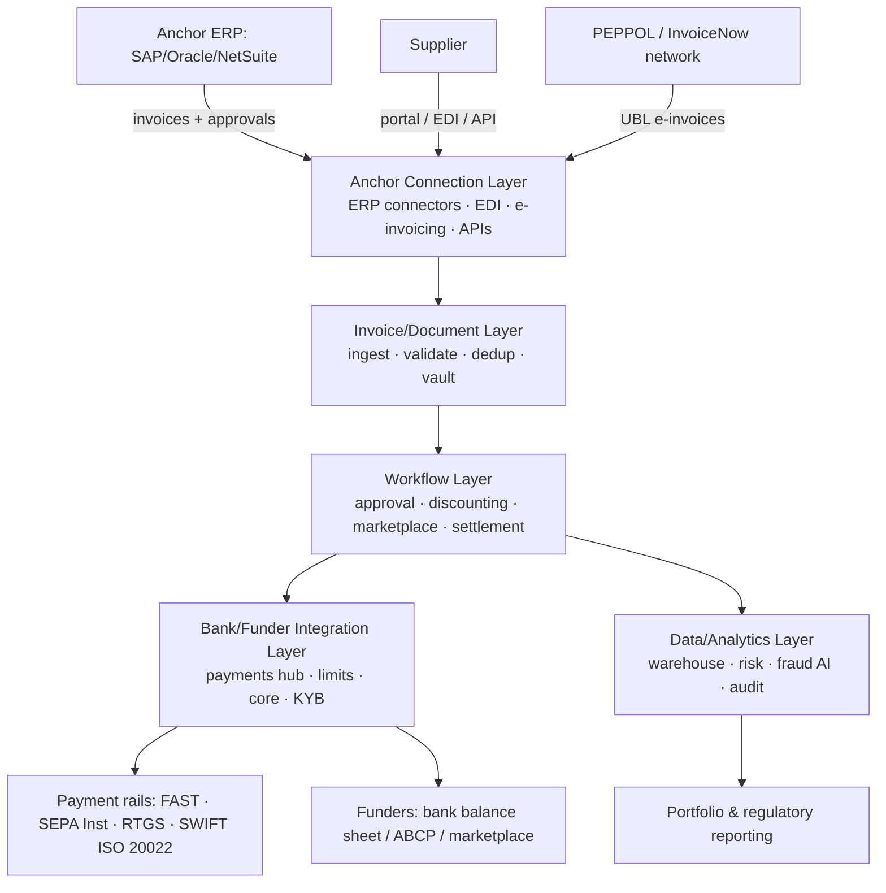
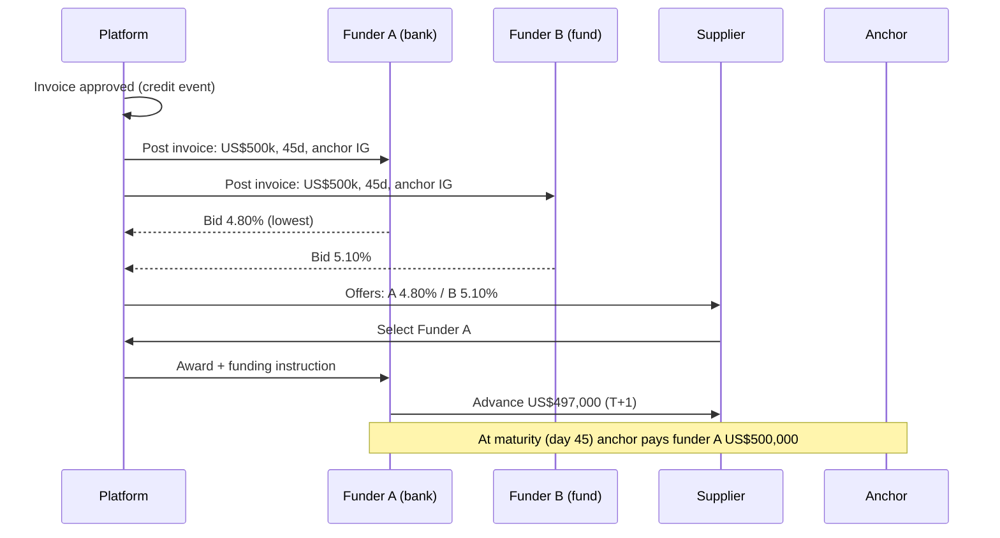
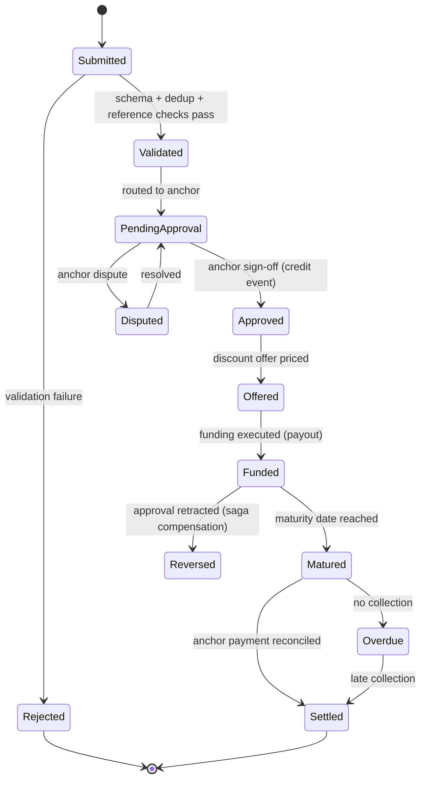
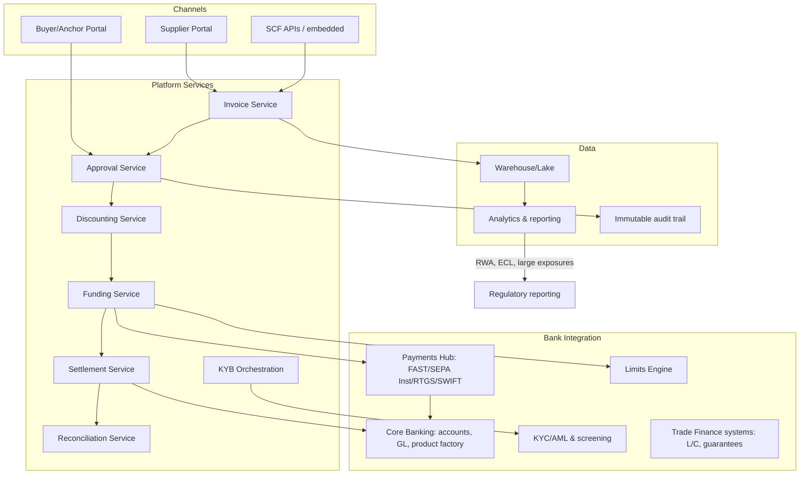
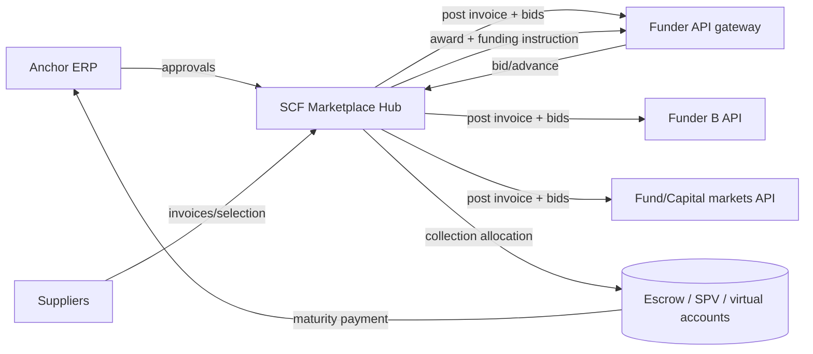

# Supply Chain Finance Technologies: A Deep Technical Guide

> **Author:** Jack Liu Shurui — Solution Architect at Cymbal Bank, Singapore  
> **Context:** Trade Finance / Banking Architecture — SCF Platform Architecture, Vendors, DLT & Emerging Tech, AI/ML, Integration Patterns, Reference Architectures  
> **Repository:** [github.com/jackliusr/research](https://github.com/jackliusr/research)  
> **Last Updated:** August 2026

---

## Table of Contents

1. [The SCF Platform Architecture](#1-the-scf-platform-architecture)
   - 1.1 [Why Platform-First](#11-why-platform-first)
   - 1.2 [The Anchor Connection Layer](#12-the-anchor-connection-layer)
   - 1.3 [The Invoice/Document Layer](#13-the-invoice-document-layer)
   - 1.4 [The Workflow Layer](#14-the-workflow-layer)
   - 1.5 [The Bank/Funder Integration Layer](#15-the-bank-funder-integration-layer)
   - 1.6 [The Data/Analytics Layer](#16-the-data-analytics-layer)
   - 1.7 [Reference Architecture Diagram](#17-reference-architecture-diagram)
2. [Platform Component Deep-Dive](#2-platform-component-deep-dive)
   - 2.1 [The Discounting Engine](#21-the-discounting-engine)
   - 2.2 [The Early-Payment Marketplace](#22-the-early-payment-marketplace)
   - 2.3 [The Settlement Engine](#23-the-settlement-engine)
   - 2.4 [Reconciliation](#24-reconciliation)
   - 2.5 [The Limit/Eligibility Engine](#25-the-limit-eligibility-engine)
3. [SCF Platform Vendors: Deep Comparison](#3-scf-platform-vendors-deep-comparison)
   - 3.1 [The Vendor Landscape](#31-the-vendor-landscape)
   - 3.2 [Taulia (SAP)](#32-taulia-sap)
   - 3.3 [PrimeRevenue](#33-primerevenue)
   - 3.4 [C2FO](#34-c2fo)
   - 3.5 [Orbian](#35-orbian)
   - 3.6 [Greensill: The Platform-Design Cautionary Case](#36-greensill-the-platform-design-cautionary-case)
   - 3.7 [The Challengers: Linklogis and the API-First Generation](#37-the-challengers-linklogis-and-the-api-first-generation)
   - 3.8 [Bank-Internal and White-Label Platforms](#38-bank-internal-and-white-label-platforms)
   - 3.9 [Open Source: The Honest Assessment](#39-open-source-the-honest-assessment)
   - 3.10 [Vendor Selection Framework](#310-vendor-selection-framework)
   - 3.11 [Build vs Buy vs Partner](#311-build-vs-buy-vs-partner)
4. [DLT and Emerging Technology for SCF](#4-dlt-and-emerging-technology-for-scf)
   - 4.1 [The DLT Trade Finance Platforms: Post-Mortems](#41-the-dlt-trade-finance-platforms-post-mortems)
   - 4.2 [The Successors: Pragmatic Networks](#42-the-successors-pragmatic-networks)
   - 4.3 [MLETR and Electronic Trade Documents](#43-mletr-and-electronic-trade-documents)
   - 4.4 [eBL and the DCSA Standard](#44-ebl-and-the-dcsa-standard)
   - 4.5 [E-Invoice Networks: The SCF Data Foundation](#45-e-invoice-networks-the-scf-data-foundation)
   - 4.6 [Tokenization: Invoices, Receivables, Settlement](#46-tokenization-invoices-receivables-settlement)
   - 4.7 [Digital Identity and Trade Data](#47-digital-identity-and-trade-data)
5. [AI/ML in SCF](#5-aiml-in-scf)
   - 5.1 [AI Underwriting](#51-ai-underwriting)
   - 5.2 [Fraud Detection](#52-fraud-detection)
   - 5.3 [Document Intelligence](#53-document-intelligence)
   - 5.4 [The ML Data Platform and Model Governance](#54-the-ml-data-platform-and-model-governance)
6. [Integration Patterns](#6-integration-patterns)
   - 6.1 [Anchor ERP Integration Deep-Dive](#61-anchor-erp-integration-deep-dive)
   - 6.2 [Integration Styles](#62-integration-styles)
   - 6.3 [The Invoice Data Model](#63-the-invoice-data-model)
   - 6.4 [Data Standards](#64-data-standards)
7. [Reference Architectures](#7-reference-architectures)
   - 7.1 [Bank SCF Platform Reference Architecture](#71-bank-scf-platform-reference-architecture)
   - 7.2 [Multi-Bank Marketplace Architecture](#72-multi-bank-marketplace-architecture)
   - 7.3 [Security Architecture](#73-security-architecture)
   - 7.4 [Deployment Models](#74-deployment-models)
8. [Technology Trends 2026+](#8-technology-trends-2026)
   - 8.1 [API-First Everything](#81-api-first-everything)
   - 8.2 [AI-Native SCF](#82-ai-native-scf)
   - 8.3 [Tokenized Trade Finance](#83-tokenized-trade-finance)
   - 8.4 [Data-Driven SCF](#84-data-driven-scf)
   - 8.5 [Platform Consolidation](#85-platform-consolidation)
   - 8.6 [Regulated Tech](#86-regulated-tech)
   - 8.7 [Conclusion: The SCF Technology Stack and Maturity Map](#87-conclusion-the-scf-technology-stack-and-maturity-map)
9. [Glossary](#9-glossary)
10. [References](#10-references)

---

## 1. The SCF Platform Architecture

This guide is the **technology-only deep-dive** companion to the umbrella business guide, [supply_chain_finance_guide.md](supply_chain_finance_guide.md) (products, economics, flow, risks, the Greensill case). Here we go deep on the software: the platform layers, the engines, the vendors, the DLT experiments, the AI stack, and the reference architectures. Business concepts (APF, dynamic discounting, anchor economics, true sale) are referenced, not re-explained.

### 1.1 Why Platform-First

Modern SCF is a **software product first, a finance product second**. The economics are a volume game — thin per-invoice margins earned many times per year (see [supply_chain_finance_guide.md §4](supply_chain_finance_guide.md)) — so the platform's job is to make the *marginal cost of processing one more invoice* approach zero. That means:

- **Straight-through processing (STP):** 95%+ of invoices should flow from the anchor's ERP through approval to funding without human touch; the platform exists for the exceptions.
- **Zero re-keying:** every hop (ERP → platform → bank → payment rail) is an automated, idempotent, auditable interface.
- **The approval as the asset:** the platform's core value is capturing, storing, and transmitting the *anchor's approval* — the credit event — as a tamper-evident record.
- **Two systems of record, cleanly split:** the platform owns trade documents and approvals; the bank owns money, limits, and accounting (see [supply_chain_finance_guide.md §9.7](supply_chain_finance_guide.md)).

A canonical SCF platform is therefore a **layered architecture** with five layers, each with its own integration surface and its own failure modes.

### 1.2 The Anchor Connection Layer

The top layer connects the platform to the anchor (buyer) and to the wider ecosystem. It is the *moat*: once wired into the anchor's procure-to-pay stack, switching costs are high.

**ERP connectors.** The anchor's ERP is the system of record for the commercial flow (PO → goods receipt → invoice → approval). The platform must mirror it. The dominant stacks:

- **SAP.** Two integration surfaces: the *SAP Business Network* (the renamed Ariba Network — the cloud procurement network connecting buyers and suppliers, with SAP Business Network for Supply Chain as the P2P hub) and *S/4HANA* (the ERP itself). Connectors use S/4HANA APIs (OData/REST via the SAP Gateway), classic **IDoc** (intermediate documents — the EDI-style message envelopes SAP has used since R/3), and Business Connector/CPI (Cloud Platform Integration) flows. Taulia's deep SAP story (see [3.2](#32-taulia-sap)) is exactly this: invoices and approvals flow through SAP Business Network, and the platform consumes them.
- **Oracle.** Oracle Fusion Cloud ERP (REST APIs, SOAP services, FBDI bulk file loads) and the legacy EBS (EBS Open Interfaces, XML Gateway, eCommerce Gateway, and the Supplier Portal/Supplier Hub). Oracle's own supplier-finance integrations and third-party connectors (PrimeRevenue, Taulia) use the invoice approval workflow APIs.
- **NetSuite.** SuiteTalk (SOAP) and SuiteScript/RESTlets — the mid-market anchor stack; SCF vendors connect via NetSuite's vendor-bill approval workflow.
- **Other ERPs** (Microsoft Dynamics, Infor, JD Edwards, Kingdee/Yonyou in China) are served by EDI or file-based integration rather than certified connectors.

**EDI/API connectors and bank-channel connections.** Anchors and large suppliers that are not on a certified connector path use:

- **EDI** (ANSI X12 / EDIFACT) via a VAN (value-added network) or AS2/OFTP2 — see [6.2](#62-integration-styles).
- **REST/JSON APIs** — the modern default; contract-first per [spec_driven_development_frameworks_guide.md](../technology/spec_driven_development_frameworks_guide.md).
- **Bank-channel connections** — for a bank-operated platform, the anchor may connect through the bank's own corporate e-banking/trade portal or host-to-host (H2H) channel rather than the platform UI; the platform then federates identity and invoice data with the bank channel.

**Key design points:** the approval feed is the critical path (it must be lossless, ordered, and replayable); master data (supplier, bank accounts, approvers) syncs continuously; and the connector layer must tolerate ERP upgrades (SAP ECC → S/4HANA migrations are a recurring integration project for every SCF platform).

### 1.3 The Invoice/Document Layer

The invoice is the atomic asset. The document layer ingests, validates, normalises, and vaults it.

**Ingestion channels** (a platform typically supports all of them):

- **ERP/e-invoice feed** — the preferred channel: structured invoice data pushed from the anchor's ERP or from an e-invoicing network.
- **E-invoicing networks** — **PEPPOL** and Singapore's **InvoiceNow** (the Peppol network in Singapore, run by IMDA). PEPPOL is a four-corner model: the sender's Access Point → the PEPPOL network (a federation of certified Access Points) → the receiver's Access Point, carrying **UBL** (Universal Business Language) invoices (PEPPOL BIS 3.0). InvoiceNow (launched 2019–2020) is Singapore's national Peppol-based e-invoicing network; IRAS accepts e-invoices for GST, and MAS/IMDA push adoption through government procurement. For SCF, e-invoicing is a *data and authenticity gift*: the invoice is born structured, validated, and (in mandate jurisdictions) cleared by the tax authority — see [4.5](#45-e-invoice-networks-the-scf-data-foundation) and [supply_chain_finance_guide.md §7.2](supply_chain_finance_guide.md).
- **EDI** — X12 810 (invoice), 850 (PO), 856 (ASN), 820 (payment order/remittance); EDIFACT INVOIC, ORDERS, DESADV, PAYEXT. Classic large-supplier channel; parsed by a translation engine (mapping tables, envelope handling) into the common invoice model.
- **PDF/email/OCR** — the long tail: invoices arrive as PDF attachments or scans. **OCR + LLM extraction** (see [5.3](#53-document-intelligence)) converts them to structured data with confidence scores; low-confidence documents route to human verification.
- **Supplier portal upload** — the fallback channel; portal-submitted invoices are the highest-fraud channel and get the strictest validation.

**Document vault.** Every ingested artefact (PDF, XML, EDI envelope, image) is stored immutably with a content hash — the hash is the fraud-control fingerprint used for duplicate detection ([5.2](#52-fraud-detection)) and for the STFR-style registries ([4.7](#47-digital-identity-and-trade-data)).

**Validation pipeline** (all before the invoice is offered for approval):

1. Schema/format validation (the message parses; required fields present).
2. Duplicate check — content-hash against the invoice store; cross-referenced against registries where available.
3. Reference validation — PO number exists and belongs to the supplier; amounts within PO tolerance.
4. Master-data validation — supplier is onboarded (KYB clear), currency/tenor allowed, bank account verified.
5. Tax validation — VAT/GST fields consistent (important in e-invoicing mandate jurisdictions).

### 1.4 The Workflow Layer

The orchestration heart. The transaction is a **long-running, multi-party state machine** (see the saga/orchestration patterns in [payments_hub_guide.md](payments_hub_guide.md)):

- **Approval workflow:** routes invoices to the anchor's approvers (or consumes approvals decided in the anchor's ERP). Rule-based auto-approval for low-value/low-risk bands; escalation for exceptions. The approval record — approver, timestamp, method — is captured immutably. **Funding must never precede approval.**
- **Discounting engine:** prices each approved invoice (see [2.1](#21-the-discounting-engine)) and presents the early-payment offer to the supplier.
- **Early-payment marketplace:** in multi-funder mode, the auction logic that lets funders bid and the supplier select ([2.2](#22-the-early-payment-marketplace)).
- **Settlement:** orchestrates payout to the supplier, maturity tracking, collection from the anchor, and reconciliation ([2.3](#23-the-settlement-engine), [2.4](#24-reconciliation)).
- **Workflow infrastructure:** a BPM engine (often Camunda/Zeebe or a vendor's proprietary engine) driving an idempotent, retryable state machine; every state change emits an event (see [6.2](#62-integration-styles) for the event model); compensating actions defined for retractions and disputes.

### 1.5 The Bank/Funder Integration Layer

The layer that turns trade workflow into money movement:

- **Bank APIs:** funding instructions, payout requests, limit queries, account balances, KYB/AML screening calls. Exposed by the bank's integration layer — product factory, payments hub, limits engine, core banking (see [7.1](#71-bank-scf-platform-reference-architecture) and [core_banking_systems_guide.md](core_banking_systems_guide.md)).
- **Payment rails:** supplier payouts and anchor collections through the **payments hub** ([payments_hub_guide.md](payments_hub_guide.md)):
  - *Domestic instant payments* — FAST (Singapore), SEPA Instant, RTP/FedNow (US), UPI (India), PIX (Brazil) for T+0/T+1 supplier payouts.
  - *RTGS/large-value* — for big-ticket invoices.
  - *Cross-border* — SWIFT (ISO 20022 since the March 2023 go-live, coexistence until November 2025; **pacs.008** credit transfers with structured remittance; **pain.001** payment initiation from the platform). See [iso_20022_core_processes_guide.md](iso_20022_core_processes_guide.md).
  - *Collections* — direct debit, standing instruction, or virtual-account capture of the anchor's maturity payment.
- **Funding orchestration:** allocates each funded invoice to the right funder (single bank's balance sheet, a bank's securitisation/ABCP vehicle, or marketplace funders), draws limits, and books the asset. In marketplace mode this layer is the *funder API* surface ([7.2](#72-multi-bank-marketplace-architecture)).

### 1.6 The Data/Analytics Layer

The platform's second product is **data**. The data layer collects every event (invoice submitted, validated, approved, funded, matured, settled) into a warehouse/lake:

- **Portfolio analytics:** utilisation by anchor/sector/tenor, concentration (top-10 anchors %), ageing, approval-to-funding conversion, supplier adoption, discount-rate dispersion.
- **Risk:** limit monitoring, ECL inputs (IFRS 9 — anchor PDs, short tenors; see [supply_chain_finance_guide.md §8.6](supply_chain_finance_guide.md)), fraud alerts, stress-test views.
- **Regulatory reporting:** MAS Notice 637 (credit risk RWA), large-exposures (MAS 610), IFRS 9 disclosures, supplier-finance disclosures (FASB ASU 2022-04 for listed US anchors).
- **Audit:** an immutable, queryable event log — the platform's single source of truth for internal audit and examiners.
- **ML:** the same data feeds feature stores and models ([5.4](#54-the-ml-data-platform-and-model-governance)).

### 1.7 Reference Architecture Diagram

```text
┌──────────────────────────────────────────────────────────────────────────┐
│ 1. ANCHOR CONNECTION LAYER                                                │
│    ERP connectors (SAP Business Network/Ariba · S/4HANA · Oracle ·        │
│    NetSuite) · EDI (X12/EDIFACT via VAN/AS2) · e-invoicing (PEPPOL,       │
│    InvoiceNow) · REST APIs · bank-channel H2H · supplier portal           │
└───────────────────────────────┬──────────────────────────────────────────┘
                                │ invoice feed · approvals · master data
┌───────────────────────────────▼──────────────────────────────────────────┐
│ 2. INVOICE/DOCUMENT LAYER                                                 │
│    Ingestion (API/EDI/e-invoice/OCR) · validation & dedup (hashes) ·      │
│    normalisation to common model · document vault · golden record         │
└───────────────────────────────┬──────────────────────────────────────────┘
┌───────────────────────────────▼──────────────────────────────────────────┐
│ 3. WORKFLOW LAYER                                                         │
│    Approval workflow · discounting engine · early-payment marketplace ·   │
│    settlement orchestration · KYB orchestration · notification service    │
│    (BPM/state machine, saga-compensated, event-emitting)                  │
└───────────────────────────────┬──────────────────────────────────────────┘
                                │ funding instructions · events
┌───────────────────────────────▼──────────────────────────────────────────┐
│ 4. BANK/FUNDER INTEGRATION LAYER                                          │
│    Payments hub (FAST/SEPA Inst/RTGS/SWIFT ISO 20022 pacs.008) · limits   │
│    engine · core banking (accounts/GL) · KYB/AML screening · funder APIs  │
└───────────────────────────────┬──────────────────────────────────────────┘
                                │ ledgers · events · risk data
┌───────────────────────────────▼──────────────────────────────────────────┐
│ 5. DATA/ANALYTICS LAYER                                                   │
│    Warehouse/lake · portfolio analytics · concentration & limit           │
│    monitoring · fraud detection (AI) · ECL · regulatory reporting ·       │
│    immutable audit trail · feature store for ML                           │
└──────────────────────────────────────────────────────────────────────────┘
```

Mermaid equivalent:



---

## 2. Platform Component Deep-Dive

### 2.1 The Discounting Engine

The discounting engine computes what the supplier receives today and what the funder earns at maturity. It is a *simple-interest calculator with product logic around it* — the sophistication is in the inputs, not the arithmetic.

**The all-in rate.** The discount rate charged to the supplier decomposes as:

```text
All-in discount rate (annualised) = funding benchmark (e.g. SOFR/SONIA)
                                  + anchor credit spread (the anchor's rating advantage)
                                  + programme margin (bank's fee, 50–150 bps typical)
                                  + platform/fintech fee (where separate)
```

The anchor's spread is the *credit engine*: the supplier is effectively borrowing at the anchor's rating (see [supply_chain_finance_guide.md §4.2](supply_chain_finance_guide.md)).

**The calculation.** Simple interest, money-market day-count (actual/360 is the convention in USD SCF; actual/365 in GBP/CNH markets):

```text
Discount amount  = FV × r × (d / D)

where:
  FV = invoice face value
  r  = all-in discount rate (annualised, as a decimal)
  d  = days from funding date to maturity date
  D  = day-count basis (360 or 365, per market convention)

Early payment (advance) = FV − Discount amount
```

**Worked example** (USD invoice, 60-day tenor, funding today):

```text
Invoice face value:                  US$ 1,000,000
Funding benchmark (SOFR):                  3.90%   (annualised)
Anchor credit spread:                       0.60%
Programme margin (bank):                    1.00%
All-in discount rate (r):                   5.50%   (annualised)

Tenor (d):                                  60 days
Day-count (D):                              360

Discount = 1,000,000 × 0.055 × (60/360)  = US$ 9,166.67
Advance  = 1,000,000 − 9,166.67          = US$ 990,833.33
```

At maturity the anchor pays the full US$1,000,000; the funder's gross income is US$9,166.67, an annualised return of ~5.5% on a 60-day self-liquidating asset. The same rate expressed as a **price**: the supplier is offered 99.0833% of face value (`1 − 0.055 × 60/360`).

**Engine features that matter:**

- **Tenor precision:** funding date and maturity date are business-day-adjusted; the engine handles weekends/holidays and partial months.
- **Sliding scales (dynamic discounting):** buyer-funded early payment at a schedule — e.g. *2/10 net 60* (2% discount if paid within 10 days, otherwise full in 60); the engine interpolates between schedule points.
- **Rate fencing:** per-anchor minimum/maximum rates, per-funding-band pricing (the "ladder": cheaper for longer tenors is unusual — here longer tenor costs more in absolute terms but the *rate* may tier by supplier segment or currency).
- **Rounding and allocation:** discount rounding to cents, VAT on the discount fee in some jurisdictions, and fee-in-arrears vs fee-upfront variants.
- **Repricing:** if the supplier requests a different funding date, the engine recomputes; if the anchor's approval is amended, the engine reprices before funding.

### 2.2 The Early-Payment Marketplace

In marketplace (multi-funder) mode, the platform runs an **auction for each invoice**. The mechanics:

1. **Posting:** an approved invoice is posted to the funding marketplace with its attributes (face value, currency, tenor, anchor, supplier segment).
2. **Bidding:** funders (banks, non-bank funds, capital-markets vehicles) submit a bid — typically a discount rate or a margin over the anchor benchmark — subject to their own limits and credit appetite. Bids are either *open* (visible, competitive downward) or *sealed* (single round).
3. **Selection:** the supplier (or an auto-rule) selects the winning bid — usually the lowest all-in rate; in practice suppliers also weigh speed, currency, and relationship.
4. **Award and funding:** the platform notifies the winner, books the funding with the winning funder, and orchestrates the payout ([2.3](#23-the-settlement-engine)).
5. **Settlement:** at maturity the anchor pays the *winning funder* (or the platform's collection account, which then allocates).



Marketplace mechanics to design for:

- **Funding liquidity:** the marketplace's value is breadth of funders; each funder has capacity limits and appetite per anchor/sector that must be enforced in real time.
- **Auto-award rules:** anchors often require lowest-price auto-award for speed; suppliers may want manual selection.
- **Price discovery vs franchise:** the marketplace commoditises any single bank — a strategic consideration (see [supply_chain_finance_guide.md §3.6](supply_chain_finance_guide.md)).
- **Anti-gaming:** bid expiry, no retroactive repricing, allocation fairness across funders, and monitoring for signalling collusion between funders (see [5.2](#52-fraud-detection)).

C2FO is the extreme version: a *continuous* marketplace where suppliers proactively bid discounts on their own receivables and buyers accept ([3.4](#34-c2fo)).

### 2.3 The Settlement Engine

The settlement engine executes and tracks the money movements around each funding:

- **Payout mechanics (funding to supplier):** on award, the platform issues a payment instruction to the payments hub ([payments_hub_guide.md](payments_hub_guide.md)) — typically `pain.001` (SWIFT) or an instant-payment API (FAST/SEPA Inst) — paying the advance to the supplier's *verified* account. The payout is idempotent (a unique funding reference prevents double payment) and the engine tracks status (accepted → processed → cleared) via the payment hub's callbacks.
- **Collection at maturity:** the engine schedules the anchor's obligation — the full face value on the maturity date. Collection routes: direct debit, standing instruction, or the anchor's scheduled payment into a **collection account** (often a virtual account per programme or per funder — see [2.4](#24-reconciliation) and the virtual-account patterns in [programmable_business_bank_guide.md](programmable_business_bank_guide.md)).
- **Maturity tracking:** a scheduler (or event stream) rolls positions to "matured"; overdue positions trigger escalation (chasing, provisioning, ECL update).
- **Funding position lifecycle:** each funding is a position with state: `awarded → payout_issued → payout_cleared → matured → collected → closed` (plus `overdue`, `disputed`, `reversed`). The engine maintains the linkage invoice → funding → settlement so the portfolio can be valued and reconciled at any moment.

### 2.4 Reconciliation

Reconciliation is where SCF operations actually spend their time. The problem: matching *money movements* (payments) to *trade events* (invoices/fundings) across multiple banks, accounts, and formats.

**Invoice-to-payment matching.** The platform matches:

- **Outgoing:** payout instructions → cleared payments (did the supplier get paid the right amount?).
- **Incoming:** anchor maturity payments → open funding positions (which invoices did this payment settle?).

**The URN/remittance matching pattern.** Every invoice carries a **Unique Reference Number (URN)**. When the anchor pays, the remittance information accompanying the payment (structured remittance info in ISO 20022 `pacs.008`; the 820 remittance in EDI land; the reference field in FAST/SEPA) should carry the URN. The matcher then allocates the payment to the open positions:

1. **Exact match** — remittance URN = invoice URN, amount = position amount → auto-settle.
2. **Tolerance match** — amount within threshold (FX rounding, fees) → auto-settle with variance handling.
3. **Partial/aggregate match** — one payment settling several invoices (bulk anchor payments) → allocation algorithm (FIFO by maturity, or by supplied allocation list in the remittance).
4. **Exception queue** — unmatched payments (missing remittance, wrong reference, over/under-payment) route to ops; the engine learns match patterns over time.

This mirrors virtual-account reconciliation in [programmable_business_bank_guide.md](programmable_business_bank_guide.md): when each programme/funder has a **virtual account** (unique IBAN/account per counterparty), the account number itself carries the matching key and payments arrive pre-labelled.

**Reconciliation states:** every funding has a reconciliation status (`unreconciled`, `partially_reconciled`, `reconciled`, `exception`); the ops dashboard is a queue of exceptions, not a spreadsheet. End-of-day matching runs against the core banking GL; breaks are surfaced as events, not discovered in month-end.

### 2.5 The Limit/Eligibility Engine

The rules engine that decides *what can be funded* (see [banking_limits_domain_guide.md](banking_limits_domain_guide.md) for the limit-domain deep-dive):

- **Anchor limits:** the programme's binding constraint — an **anchor credit limit** with sub-limits per currency/tenor; utilisation is drawn per approved invoice. The engine checks `utilisation + new funding ≤ limit` in real time and blocks over-limit funding.
- **Supplier eligibility:** each supplier must be KYB-cleared, agreement-signed (RPA in force), bank-account verified, and not sanctioned. Supplier-level *fraud/ops caps* (per-supplier exposure bounds) are typical — they bound exposure to a single fraudulent supplier without being credit limits.
- **Invoice eligibility rules:** approved invoices are eligible if: PO matched (three-way match where applicable), not a duplicate (hash check), tenor within band (e.g. ≤ 120 days), currency allowed, amount within thresholds, no dispute flag, not future-dated, buyer approval captured and unretracted.
- **Funder rules:** in marketplace mode, each funder's capacity, appetite per anchor/sector, and tenor preferences are enforced at award time.
- **Rule engine implementation:** decision tables (anchor/supplier/invoice attributes → allow/block/flag), evaluated synchronously at funding time with a full audit of which rule fired. Limit changes (increase, block) propagate to the funding path in real time — a classic distributed-systems trap when the limits engine lives outside the platform (see [7.1](#71-bank-scf-platform-reference-architecture)).

---

## 3. SCF Platform Vendors: Deep Comparison

### 3.1 The Vendor Landscape

| Vendor | Product | Model | Funding | Key features | Geography strength | Customers | Pricing | Open/Closed |
|---|---|---|---|---|---|---|---|---|
| **Taulia** (SAP, est. 2009) | Taulia platform (dynamic discounting, APF, AR finance, e-invoicing) | SaaS platform + marketplace | Taulia Capital: bank/fund marketplace + buyer-funded dynamic discounting; exited proprietary balance sheet | Deepest SAP integration (Business Network/Ariba, S/4HANA), large supplier network, multi-bank APF | Global; US + Europe strongest | ~3,000+ corporates (hedged), 2M+ suppliers (vendor claim) | SaaS subscription + per-invoice fees; funding margins in marketplace | Closed; SAP-owned since 2022 |
| **PrimeRevenue** (est. 2004) | PrimeRevenue APF platform | SaaS platform + multi-bank marketplace | 20+ bank funders on platform; SPV/off-balance-sheet structures | Pure APF specialist, procure-to-pay integration, bank-agnostic marketplace | US strongest; Europe/Asia growing | Large-cap corporates; global banks as funders | Platform fee + take-rate on funded volume | Closed |
| **C2FO** (est. 2008) | Working Capital Marketplace | Marketplace (exchange) | Buyer cash first; C2FO Capital (partner-bank/fund-funded early payment) | Continuous early-payment marketplace, supplier-side bidding, no subscription fee positioning | US + global | 100k+ businesses (vendor claim) | No platform fee (monetises premium services + funding spread) | Closed |
| **Orbian** (est. 1999) | Orbian platform + own funding | Platform + principal funding | Orbian's own liquidity (consortium-backed, CP/note issuance); bank participation | Buyer-centric APF, ERP-native (born of SAP/Citi), off-balance-sheet structuring, 53 countries | US/Europe; global large-cap | Global corporates; bank shareholders as funders | Fee + funding margin as principal | Closed |
| **Linklogis** (联易融, est. 2016, HKEX 9959) | Linklogis SCF cloud (multi-tier SCF, ABS) | Tech/solutions + marketplace | Bank and capital-market funders; supply-chain ABS issuance engine | China's deepest SCF tech: multi-tier, ABS, e-invoice rails; API-first; GLDB partner in SG | China + Asia corridors | Banks, anchors, SMEs (RMB hundreds of billions annual volume) | SaaS + implementation + ABS structuring fees | Closed (platform); open standards not used |
| **Demica** (est. 2004) | Demica platform | SaaS + funding advisory | Bank funders + securitisation (ABCP) programmes | APF + receivables securitisation, bank-centric | Europe + US | Banks and corporates | SaaS + structuring fees | Closed |
| **Modifi / Kriya / Triterras / Octet / Incomlend** | API-first trade/SCF fintechs | SaaS / marketplace | Mix: own funds, bank partners, marketplace | Data-driven underwriting, API-first, SME focus | US/UK/SG/India regional | SMEs, mid-market | Take-rate + subscription | Closed; API-first |
| **Bank internal platforms** (DBS, OCBC, UOB, Citi, HSBC, StanChart, JPM) | Bank's own SCF/e-invoicing platforms (DBS Max, OCBC Velocity, Citi Supplier Finance, SCFX...) | Bank-owned | Bank balance sheet (+ ABCP) | Integrated with bank's core/payments/limits; white-label vendor tech underneath | Home market + corridors | Bank's own anchor franchise | Embedded in banking relationship | Closed |
| **Open source** | None notable as a full platform | — | — | Components only: PEPPOL libs, e-invoice validators, workflow engines (Camunda), blockchain frameworks | — | — | — | See [3.9](#39-open-source-the-honest-assessment) |

*Scale claims are vendor-reported; treat as directional. The umbrella guide's platform survey is in [supply_chain_finance_guide.md §3.4](supply_chain_finance_guide.md).*

### 3.2 Taulia (SAP)

**The acquisition (verified).** SAP announced its intent to acquire a majority stake in Taulia on **26 January 2022**; the acquisition **completed in March 2022**. Taulia became part of SAP's Business Network organisation and the anchor of SAP's working-capital franchise, while continuing to operate standalone for non-SAP customers.

**The product stack:**

- **Supplier network:** Taulia runs one of the largest supplier onboarding engines in SCF — the network effect (suppliers already on the platform) is a core selling point; new buyer programmes inherit the supplier base.
- **ERP integrations:** the deepest in the industry by construction — SAP Business Network (Ariba) invoice/approval flows, S/4HANA (via CPI/OData), plus Oracle and others. Post-acquisition, Taulia is the default SCF layer for SAP ERP anchors.
- **Dynamic discounting + APF:** Taulia's original product was buyer-funded dynamic discounting; APF (bank-funded) came via the **Taulia Capital** funding marketplace — multiple banks and institutional funders competing to fund approved payables, plus access to securitisation structures.
- **E-invoicing and AR finance:** Taulia also runs e-invoicing (PEPPOL-compliant flows) and accounts-receivable finance (early payment on receivables), extending from P2P into O2C.

**Architect's read:** Taulia is the reference for the *ERP-native platform* pattern — the platform's value is inseparable from its SAP connectivity. Its funding marketplace demonstrates the *platform-as-hub, funders-as-plug-ins* architecture ([7.2](#72-multi-bank-marketplace-architecture)).

### 3.3 PrimeRevenue

**The model:** the purest **multi-bank APF specialist**. Founded 2004 (Atlanta); the platform connects anchors' procure-to-pay systems to a marketplace of 20+ bank funders who compete to fund approved payables. PrimeRevenue does not take the funding onto its own balance sheet — it is the neutral workflow + marketplace operator.

**Key elements:**

- **Procure-to-Pay integration:** like Taulia, the anchor's ERP (SAP, Oracle) is the system of truth; PrimeRevenue consumes invoice and approval data and operates the supplier-facing funding workflow.
- **SPV/off-balance-sheet structures:** for anchors that want the funding off their balance sheet, PrimeRevenue works with banks on **SPV structures** — a special-purpose vehicle buys the approved payables (true sale), funded by bank liquidity or ABCP; the anchor's payable to the SPV is the asset. This is the same structure family as Orbian's (below) and the securitisation route discussed in [supply_chain_finance_guide.md §9.4](supply_chain_finance_guide.md).
- **Bank-agnostic marketplace:** the platform's neutrality (no proprietary funder) is its franchise — banks join as funders; anchors get price competition.

**Architect's read:** PrimeRevenue is the reference for *workflow-neutral marketplace* architecture: the platform owns documents and approvals; funders plug in via APIs; the SPV layer is a legal/funding wrapper around the same workflow.

### 3.4 C2FO

**The model:** the **working capital marketplace** — an exchange for early payment, not a financing platform in the APF sense. Suppliers with receivables post early-payment offers (a discount rate they are willing to accept); buyers with available cash select offers to accept. The discount is buyer-funded — no bank balance sheet in the core product.

- **Supplier-side bidding:** unlike APF (where the platform offers a take-it-or-leave-it rate), C2FO suppliers *bid*; the buyer's cash is allocated to the most attractive discounts. This is the "no-platform-fee" positioning: usage of the marketplace itself is not charged as a subscription to suppliers — C2FO monetises premium services and the **C2FO Capital** funded-early-payment product (partner banks/funds advancing payment, with C2FO taking a funding spread).
- **Complementarity:** C2FO positions alongside bank APF — a buyer can run both: C2FO for buyer-cash discounts, APF for bank-funded early payment on the rest.

**Architect's read:** C2FO is the purest example of the *auction/marketplace mechanics* in [2.2](#22-the-early-payment-marketplace) — continuous, supplier-initiated, price-forming. Its API-first design and data-driven onboarding are the template for the new-gen platforms.

### 3.5 Orbian

**The model:** the **corporate-owned / captive SCF platform**. Founded **1999 as a joint venture between Citibank and SAP**; privately held since 2004; ~25 years operating (2024). Orbian is neither a bank nor a fintech: it operates its own SCF platform **and** funds programmes as a principal through its own liquidity (backed by a consortium of bank shareholders, funding via note/CP issuance), with bank partners participating in larger programmes.

**The "Orbian Structure":** the buyer-centric off-balance-sheet APF structure — a buyer's approved payables are purchased (true sale) into the Orbian funding vehicle; suppliers receive early payment; the buyer pays the vehicle at maturity. The buyer's payable is extinguished against the vehicle rather than a bank loan, preserving trade-payable treatment (the accounting nuance is in [supply_chain_finance_guide.md §8.6](supply_chain_finance_guide.md)).

**ERP-native roots:** born of SAP/Citi, Orbian's integration depth is SAP-first; it processes large-volume, error-free flows (vendor-reported: 5M+ transactions, US$400bn+ financed, 53 countries, as of 2023–2024).

**Architect's read:** Orbian is the reference for *principal-funding platform* architecture — the platform and the funding vehicle are one legal stack, so the discounting, settlement, and reconciliation engines are built for a single funder (Orbian + its bank partners) rather than an open marketplace.

### 3.6 Greensill: The Platform-Design Cautionary Case

The Greensill collapse (March 2021) is covered as a business/fraud case in [supply_chain_finance_guide.md §8.3](supply_chain_finance_guide.md). The **technology** lessons for platform design:

1. **The platform must structurally prevent future-receivables funding.** Greensill's platform funded invoices that did not exist as approved payables — the design allowed "receivables" with no anchor approval and no invoice to be funded. A platform whose eligibility engine ([2.5](#25-the-limit-eligibility-engine)) cannot be configured to require an approved invoice is unsafe; the approval gate must be non-bypassable in the code, not in the ops manual.
2. **Concentration must be visible, not buried.** The platform should surface anchor concentration in real time (one client ≈ 50% of the book) with hard portfolio caps.
3. **Funding liquidity is a platform risk.** The non-bank model funded long-dated, unverifiable assets with short, retail-like money via funds. The settlement/funding layer must be transparent about asset tenors vs funding tenors.
4. **The data layer must be auditable by outsiders.** The opacity of what was actually in the funds was a failure of the record-keeping layer; an immutable, exportable, per-asset audit trail is non-negotiable.

### 3.7 The Challengers: Linklogis and the API-First Generation

**Linklogis (联易融, HKEX 9959)** — China's largest digital SCF technology company and the technology partner of Singapore's Green Link Digital Bank (GLDB; see [green_link_digital_bank_guide.md](green_link_digital_bank_guide.md)). Its platform stack:

- **Multi-tier SCF:** financing flows beyond tier-1 suppliers into tier-2/3 of the supply chain — the platform's signature capability, powered by anchor credit propagation across the chain.
- **Supply-chain ABS:** Linklogis operates one of the world's largest engines for **supply-chain asset-backed securitisation** — approved payables are pooled and issued as ABS on the platform, connecting SCF to capital markets funding (the tech version of the ABCP structures in [2.3](#23-the-settlement-engine)).
- **E-invoice integration:** deep integration with China's 数电票 (fully digital e-invoice) regime — invoices born digital and tax-authority-validated.
- **Architecture:** cloud-native, API-first, bank-agnostic — designed to plug into a bank's core rather than replace it; the model for corridor SCF tech (Singapore–China).

**The new-gen API-first platforms** — Modifi (data-driven trade finance, US/global), Kriya (UK), Triterras (Kratos platform, SG/India/US), Octet (UK/SG), Incomlend (SG), FundPark (HK), Drip Capital (US/India), Billie/Mondu (DE, B2B pay-later), Previse (UK, AI instant supplier payments), plus established specialists Demica and Finacity (receivables securitisation). Common thread: **embedded-first** — SCF offered as APIs inside the anchor's ERP, marketplaces, or the supplier's own software; AI underwriting on transactional data; SME/mid-market focus where the platform (not the anchor relationship) is the differentiator.

### 3.8 Bank-Internal and White-Label Platforms

- **Bank-internal platforms:** DBS (DBS Max e-invoicing platform + trade finance suite), OCBC (Velocity), UOB, Citi (Citi Supplier Finance), HSBC, Standard Chartered (SCFX/SC Trade), J.P. Morgan (Payables/SCF in the corporate bank portal). These embed SCF in the bank's own channel, core, and limits — the "single-bank model" ([supply_chain_finance_guide.md §3.6](supply_chain_finance_guide.md)).
- **White-label:** most bank platforms are built on vendor technology underneath — Taulia, PrimeRevenue, Orbian, Demica, Linklogis, and others run white-label instances for banks. The bank gets ERP connectors and supplier network fast; the vendor gets distribution. The white-label relationship is typically: vendor = workflow + network; bank = money, risk, limits, relationship ([3.11](#311-build-vs-buy-vs-partner)).

### 3.9 Open Source: The Honest Assessment

**There is no notable production-grade open-source SCF platform.** The reasons are structural: SCF platforms monetise network effects and regulatory/compliance trust, not code; and the funding/legal layers are proprietary by nature. What open source *does* provide, at component level:

- **E-invoicing/PEPPOL tooling** — open-source validators, UBL libraries, and Access-Point software (e.g. European national building blocks, python/Java PEPPOL libraries) that platforms embed.
- **Workflow engines** — Camunda/Zeebe, Activiti, Temporal (open-source BPM/state machines) power the approval/settlement orchestration of many platforms.
- **Blockchain frameworks** — Hyperledger Fabric (we.trade's base), R3 Corda (Marco Polo, Contour, dltledgers), open-source ledgers used by the DLT experiments ([4.1](#41-the-dlt-trade-finance-platforms-post-mortems)).
- **Trade-finance-adjacent** — Apache Fineract (open-source core banking, not SCF), TradeFinex (open-source trade-finance protocol on the XDC Network — the tokenised/DeFi edge, not an enterprise platform).

**Architect's conclusion:** open source is a *component* strategy (workflow, e-invoice parsing, ledgers), never a platform strategy — expect to assemble and maintain anything you take from OSS, and expect zero supplier-network effect.

### 3.10 Vendor Selection Framework

Selection criteria for a bank or anchor choosing an SCF platform:

| Criterion | What to evaluate | Why it matters |
|---|---|---|
| **Funding model fit** | Single-bank (proprietary) vs multi-bank marketplace vs buyer-funded (C2FO-style) vs principal (Orbian) | Must match the anchor's demand for competition and the bank's strategy (own balance sheet vs join marketplaces) |
| **ERP integration depth** | Certified connectors for the anchor's actual stack (SAP Business Network, S/4HANA APIs, IDoc, Oracle, NetSuite); upgrade track record | The approval feed is the critical path; shallow integration = manual ops = cost |
| **Supplier onboarding UX** | Self-service onboarding, e-KYC, e-signature, time-to-first-funding, supplier portal quality | Adoption is the volume engine; hours-to-days onboarding wins ([supply_chain_finance_guide.md §6.2](supply_chain_finance_guide.md)) |
| **Geographic coverage** | Jurisdictions served, local e-invoicing compliance, currency/rail support, data residency | Corridor programmes (SG–China etc.) need multi-currency, cross-border rails |
| **Regulatory/compliance** | Bank-grade security (SOC 2/ISO 27001, penetration testing), data residency, audit trail, DORA readiness ([8.6](#86-regulated-tech)) | The platform is critical infrastructure; examiners will ask |
| **Pricing** | SaaS fee vs take-rate vs funding margin; volume thresholds; implementation cost | Thin-margin economics: per-invoice take-rates dominate at scale |
| **Vendor risk** | Ownership stability (post-M&A), financial health, exit plan/data export | Platform consolidation is ongoing ([8.5](#85-platform-consolidation)) |
| **Openness** | API completeness, webhooks, export formats, customisation ceilings | Lock-in management; hybrid architectures need full API access |

### 3.11 Build vs Buy vs Partner

| Option | What it is | Pros | Cons |
|---|---|---|---|
| **Build (in-house)** | Bank builds its own SCF platform (or extends its trade-finance stack) | Full control, own IP, deep core integration, no vendor dependency, differentiation | High cost and long time-to-market; must maintain ERP connectors, e-invoice compliance, supplier network yourself |
| **Buy (vendor platform)** | Taulia / PrimeRevenue / Orbian / Linklogis etc. as the bank's platform | Speed; proven ERP integrations; supplier network effects; marketplace access | Vendor dependency and lock-in; fee drag; consolidation risk; limited customisation |
| **Partner (platform as a service)** | White-label BaaS: vendor runs the workflow platform; bank's brand, money, risk | Fastest; bank controls the franchise and balance sheet; vendor owns tech upkeep | Two systems of record; integration complexity; workflow lock-in |
| **Hybrid (bank core + vendor platform)** | Vendor platform for ERP connectivity + supplier network; bank's core/limits/payments/risk in-house | Best of both for most banks: speed + bank control of money and risk | Integration complexity; both stacks to run; vendor dependency on the workflow layer |

**Decision guidance (2026):** the **hybrid** is the pragmatic default for banks — the vendor supplies the ERP-connected front end and supplier network; the bank's product factory, limits, payments, and risk engines stay in-house (the parts that *must* be the bank). **Build** is justified only at scale with a strategic reason (e.g. GLDB's whole proposition is SCF — see [green_link_digital_bank_guide.md](green_link_digital_bank_guide.md)). **Buy** fits fast market entry with a partner-of-record model. Whichever is chosen, the **exit plan** (data export, transition runbook) is mandatory — see the umbrella guide's [supply_chain_finance_guide.md §9.6](supply_chain_finance_guide.md).

---

## 4. DLT and Emerging Technology for SCF

The umbrella guide surveys DLT at [supply_chain_finance_guide.md §7.4](supply_chain_finance_guide.md); the blockchain fundamentals are in [blockchain_technology_guide.md](../technology/blockchain_technology_guide.md). Here we go deep on the platforms, their post-mortems, and what replaced them.

### 4.1 The DLT Trade Finance Platforms: Post-Mortems

**we.trade (2017–2022) — wound down.** The nine-bank European consortium (Deutsche Bank, HSBC, KBC, Natixis, Nordea, Rabobank, Santander, Société Générale, UniCredit; IBM as tech partner) built an SME open-account trade platform on **IBM Blockchain (Hyperledger Fabric)** — PO, invoice, and payment commitment workflows. **Insolvency proceedings were reported in 2022** after shareholders declined further funding.

*Post-mortem:* (1) **Consortium governance is slow** — nine banks with equal votes cannot ship fast or fund losses repeatedly; (2) **no network effect** — banks did not route their real flows onto the network, so volume never materialised (hundreds of transactions, not thousands); (3) **the problem was already solved** — open-account SME trade was already served cheaply by portals, EDI, and (increasingly) SCF platforms; DLT added cost without adding a must-have; (4) **permissioned-network economics** — every participant paid to build and run infrastructure whose benefit accrues only at network scale that never arrived.

**Marco Polo (2017–2023) — holding-company insolvency.** The TradeIX-founded, R3 **Corda**-based network (~30 banks: BNP Paribas, Commerzbank, ING, Standard Chartered, SMBC, BNY Mellon, and others) targeted large-corporate open-account trade with **payment commitments** (a bank payment obligation-style product) and ERP integration via the TradeIX platform. **Its holding company entered insolvency in February 2023** (Ireland) after a potential ~US$12m Bank of America investment fell through; cumulative losses were reported at ~US$85m by 2021.

*Post-mortem:* (1) **funded by shareholder patience, not revenue** — the platform ran on bank subscriptions while real revenue stayed near zero; (2) **a product ahead of its demand** — payment commitments required corporates to change treasury behaviour for benefits that were real but not urgent; (3) **key-man dependency** — a handful of champion banks carried it; when the champion pipeline stalled, the business model had nothing else.

**Contour (2020–2023) — closed; acquired 2025.** The L/C-focused network (successor to the Voltron project; shareholders included HSBC, Standard Chartered, BNP Paribas, Citi, DBS, ING, Bangkok Bank, CTBC, ANZ, Santander) ran digital letters of credit on R3 Corda, cutting L/C processing from days to hours in pilots. **Contour announced closure in October 2023** (first reported by GTR) citing insufficient funding from its bank shareholders; **operations ceased 30 November 2023**. In **October 2025, XDC Ventures (the investment arm of the XDC Network) acquired Contour** to rebuild the L/C infrastructure paired with tokenized trade assets and stablecoin settlement.

*Post-mortem:* (1) **L/C digitisation is a network problem** — value requires *all* banks in a corridor on one network; bilateral digital L/Cs (bank-to-bank via e-document standards) capture much of the value without the consortium; (2) **document law lagged** — MLETR adoption ([4.3](#43-mletr-and-electronic-trade-documents)) arrived after the funding ran out; (3) **banks fund pilots, not platforms** — the pattern across all three: shareholders financed proof-of-concept but not the multi-year network build.

**The common lesson (architect's view):** the DLT consortia failed on *ecosystem economics and governance*, not technology. Permissioned trade networks need simultaneous critical mass from banks AND corporates paying for the same utility — SCF, already digitised by conventional platforms, never needed them. The survivors pivoted to **narrow, high-value utilities**: e-document networks, registries, settlement rails ([4.2](#42-the-successors-pragmatic-networks), [4.4](#44-ebl-and-the-dcsa-standard), [4.7](#47-digital-identity-and-trade-data)).

### 4.2 The Successors: Pragmatic Networks

The post-consortium landscape is narrower and more commercial:

- **eBL networks:** GSBN (Global Shipping Business Network — the carrier-backed non-profit; IQAX eBL), Wave BL, CargoX, essDOCS, Bolero — interoperating via the DCSA standard ([4.4](#44-ebl-and-the-dcsa-standard)). Note: IBM/Maersk's **TradeLens** (the largest container-data DLT project) was shut down in Q1 2023 — the same ecosystem economics.
- **Settlement-focused DLT:** **Partior** (DBS, J.P. Morgan, Standard Chartered, Temasek — blockchain-based interbank clearing/settlement, commercial launch December 2024) and **Project Agorá** (BIS + 7 central banks + ~40 private banks, 2024–2026 — tokenized deposits and wholesale CBDC for cross-border payments) attack the *payment* layer of trade, not the document layer.
- **Trade document utilities:** the ICC's **Digital Standards Initiative (DSI)** and the **FIT Alliance** (DCSA, BIMCO, FIATA, ICC) standardise digital trade documents; dltledgers (SG) and Komgo (commodity trade) run commercial DLT platforms; Hong Kong's eTradeConnect and China's AntChain/Trusple serve corridor-specific networks.
- **Registries:** the STFR ([4.7](#47-digital-identity-and-trade-data)) is the successful registry pattern.

**Architect's read:** DLT's surviving role in trade is (a) *provenance and non-duplication* (registries, eBLs, tokenized documents) and (b) *settlement* (tokenized money), not the workflow itself. Conventional platforms + narrow DLT utilities is the 2026 pattern.

### 4.3 MLETR and Electronic Trade Documents

**MLETR** — the UNCITRAL **Model Law on Electronic Transferable Records** (2017) — gives electronic bills of lading, promissory notes, and warehouse receipts the same legal force as paper, *provided* the system guarantees singularity, integrity, and control. It is the legal precondition for paperless trade.

**Adoption status (verified pointers):**

| Jurisdiction | Status |
|---|---|
| Bahrain | First adopter (2019) |
| Singapore | Electronic Transactions Act amendments (2021) — early adopter |
| Abu Dhabi Global Market | 2021 |
| UK | **Electronic Trade Documents Act 2023** (royal assent July 2023; in force September 2023) — the common-law template |
| Japan | 2023 |
| France | June 2024 (MLETR provisions adopted) |
| Germany | 2024 (MLETR implementation) |
| G7 | May 2023 joint commitment to adopt |
| India | Bills of Lading Act 2025 (eBL recognition) |
| US | State-level adoption via ULC-drafted UETA amendments (in progress) |

For SCF, MLETR matters because it digitises the *documentary* half of trade (L/Cs, collections, warehouse receipts) that the open-account half long ago digitised — enabling inventory finance and forfaiting to run on electronic-document rails (see [supply_chain_finance_guide.md §7.5](supply_chain_finance_guide.md)).

### 4.4 eBL and the DCSA Standard

- **DCSA (Digital Container Shipping Association)** — the carriers' standards body (MSC, Maersk, CMA CGM, Hapag-Lloyd, ONE, Evergreen, HMM, Yang Ming, ZIM...) published the **DCSA eBL standard (v1.0, 2022)** and, with the ICC/FIT Alliance, set the **100% eBL by 2030** target (carriers covering ~70% of global container trade committed).
- **Adoption trajectory:** ~1.2% of bills of lading were electronic in 2021; **~11% by 2025** (FIT Alliance survey data; some projections 20–25% by 2025-2027); McKinsey estimates ~US$18bn in direct ecosystem gains at full digitisation.
- **Why it matters to SCF:** the eBL is the collateral/control document for inventory and pre-shipment finance; a bank can hold a DCSA-standard eBL as digital collateral with release-on-payment logic — the bridge between documentary and open-account finance ([supply_chain_finance_guide.md §10.5](supply_chain_finance_guide.md)).

### 4.5 E-Invoice Networks: The SCF Data Foundation

E-invoicing is the quietest and most consequential SCF technology:

- **PEPPOL** — the four-corner e-invoicing network (sender Access Point → PEPPOL federation → receiver Access Point, UBL payloads). Adopted by 40+ countries/regions including the EU (public procurement), Australia, New Zealand, Japan (2023), Saudi Arabia, and **Singapore**.
- **Singapore InvoiceNow** — the national Peppol network run by IMDA (launched 2019–2020); e-invoices are GST-valid for IRAS; government procurement and the MAS/IMDA adoption push make InvoiceNow the default B2B invoice channel in Singapore.
- **Mandate wave:** EU **ViDA** (VAT in the Digital Age — agreed March 2025; intra-EU e-invoicing mandatory by 2030), India GST e-invoicing (phased since 2020), China 数电票 (fully digital e-invoices, national rollout 2023–2025), Malaysia (2024–2025 phased), Saudi FATURA, Italy (SdI), Brazil NF-e, Mexico CFDI.
- **The SCF payoff:** where e-invoicing is mandatory, the invoice is *born structured and tax-authority-validated* — the fraud vector (phantom/duplicate invoices) shrinks dramatically, and SCF platforms receive clean, machine-readable data without OCR or EDI translation. E-invoicing is the **data foundation** that makes the platform layers of [Section 1](#1-the-scf-platform-architecture) cheap to run ([supply_chain_finance_guide.md §11.1](supply_chain_finance_guide.md)).

### 4.6 Tokenization: Invoices, Receivables, Settlement

- **Tokenized invoices/receivables:** an approved invoice represented as a transferable digital token with provenance — the "invoice NFT" experiments — enabling *fractional* and *capital-markets* funding of SCF assets (ABCP/securitisation with tokenized collateral) and programmable release (pay → transfer title).
- **Institutional adoption — Project Guardian (MAS):** launched 2022; industry pilots across FX, fixed income, funds, and **trade finance**; 2024–2025 expansion (tokenized commercial paper, funds, and the **Global Layer 1 (GL1)** shared-ledger standards work, June 2024; tokenized MAS-notes pilot slated ~2026). Guardian's trade-finance pilots test tokenized trade assets as collateral across banks (see [programmable_business_bank_guide.md](programmable_business_bank_guide.md)).
- **Stablecoin/CBDC settlement for trade:** wholesale CBDC and tokenized-deposit settlement (Partior, Project Agorá, Project Guardian pilots) target instant, 24/7, multi-currency settlement of trade payments — the settlement rail upgrade for the payout/collection layer of [2.3](#23-the-settlement-engine); see [financial_infrastructure_guide.md](financial_infrastructure_guide.md).
- **Architect's read:** tokenization's realistic 2026 role is (1) *capital-markets access* — tokenized receivables as ABCP collateral; (2) *programmable collateral* (eBLs, warehouse receipts); (3) *settlement* — tokenized money replacing correspondent chains. The workflow platform remains the system of record; tokens are a funding/collateral layer.

### 4.7 Digital Identity and Trade Data

- **Supplier identity:** KYB is moving from document packs to **decentralised identity / verifiable credentials** — a supplier's registration, UBO, and sanctions status as cryptographically signed credentials that the platform verifies without re-collecting documents; compliance-as-code per [programmable_business_bank_guide.md](programmable_business_bank_guide.md).
- **The Singapore Trade Finance Registry (STFR)** — the reference data-sharing utility (industry initiative of the **Association of Banks in Singapore**, developed with MAS support; see [supply_chain_finance_guide.md §10.2](supply_chain_finance_guide.md)):
  - **POC (October 2020):** 14 banks, co-led by DBS and Standard Chartered, built on a **blockchain network supported by dltledgers** — purpose: detect **duplicate financing** of the same trade.
  - **Central registry (June 2023):** ABS launched the production registry; participating banks register trade-financing transactions; the registry flags potential duplicates — a credit bureau for invoices.
  - **2025–2026:** per GTR reporting (December 2025), expansion across Asia is in view.
  - **Architecture:** banks submit trade identifiers (hashed invoice/trade references) privately; the registry matches for double-financing signals without exposing full trade data — privacy-preserving duplicate detection on DLT. The Hin Leong double-financing case ([supply_chain_finance_guide.md §10.5](supply_chain_finance_guide.md)) is the origin story.

---

## 5. AI/ML in SCF

The umbrella guide's AI survey is [supply_chain_finance_guide.md §7.6](supply_chain_finance_guide.md); the fraud deep-dive is [financial_fraud_detection_at_scale_guide.md](financial_fraud_detection_at_scale_guide.md). Here we go deep on the models, data, and platform.

### 5.1 AI Underwriting

- **Supplier credit scoring:** ML models score SME suppliers where the supplier's own performance risk matters — PO finance, receivables finance, and the digital-bank MSME proposition (GLDB/ANEXT — [green_link_digital_bank_guide.md](green_link_digital_bank_guide.md)). Features come from **alternative data**: platform transaction history (invoice volume, ageing, approval rates), payment behaviour (on-time vs late, discount uptake), ERP data (PO history, returns), tax filings, and commercial data. Models are typically gradient-boosted trees / logistic regressions with strong explainability requirements — SME credit models are regulatory-adjacent (see [5.4](#54-the-ml-data-platform-and-model-governance)).
- **Anchor risk models:** for APF the credit risk is the anchor's — models here monitor anchor health (financials, programme dependence, payables growth without cash conversion — the post-Greensill "disguised leverage" indicators), feeding limits and early-warning (see [banking_limits_domain_guide.md](banking_limits_domain_guide.md)).
- **Pricing models:** dynamic discount-rate optimisation — per-invoice pricing that balances supplier uptake against funder returns; marketplace bid recommendation; limit-utilisation forecasting. The pricing model is where the discounting engine ([2.1](#21-the-discounting-engine)) meets ML.

### 5.2 Fraud Detection

- **Invoice fraud detection:** ML anomaly detection on invoice patterns — duplicate detection (content-hash fingerprints plus learned similarity: same amount/PO/vendor within windows), **phantom invoice detection** (invoices with no PO anchor, velocity anomalies, approver-behaviour anomalies), inflated/split-invoice detection. See the fraud-control taxonomy in [supply_chain_finance_guide.md §7.3](supply_chain_finance_guide.md).
- **Syndicate/collusion detection:** graph analysis over suppliers, approvers, invoices, and payments — detecting supplier–buyer-insider collusion rings (shared attributes, circular flows, anomalous approval paths).
- **Network analytics:** the supply-chain graph (who supplies whom, invoice flows, concentration) as a feature space for both fraud and credit — a supplier whose buyers are all distressed is a different risk than its score suggests.

### 5.3 Document Intelligence

- **OCR + LLM invoice extraction:** the long tail of unstructured invoices (PDF, email, scan) is processed by OCR (layout-aware: tables, line items) followed by **LLM extraction** of fields — invoice number, amount, date, due date, currency, tax, PO reference, buyer/supplier identifiers, line items — with confidence scores and validation against ERP data. LLMs handle the format chaos (different languages, layouts, currencies) that rules-based parsers cannot; see the LLM/RAG guides under `../technology/ai_llm/`. Extracted data feeds the validation pipeline of [1.3](#13-the-invoice-document-layer).
- **LLM for supplier onboarding (KYB):** document processing for corporate registration, UBO structure, and bank statements; LLM agents extract and cross-check KYB documents, flag inconsistencies, and pre-fill forms (compliance-as-code per [programmable_business_bank_guide.md](programmable_business_bank_guide.md)).
- **LLM agents for SCF operations:** agentic workflows that chase missing approvals, negotiate exceptions, draft dispute responses, and handle the 5% of invoices that need human judgement (see [agentic_workflows_guide.md](../technology/agentic_workflows_guide.md)). The architect's caveat stands: AI is decision support, **not the control** — the credit event remains the anchor's approval.

### 5.4 The ML Data Platform and Model Governance

- **ML data pipeline:** the event stream of [6.2](#62-integration-styles) feeds a lakehouse; **feature store** ([feature_store_guide.md](../technology/feature_store_guide.md)) serves consistent features (invoice velocity, payment behaviour, graph metrics) to both training and online scoring.
- **Real-time scoring:** streaming inference on the event stream ([event_stream_processing_guide.md](../technology/event_stream_processing_guide.md)) — fraud scores at invoice submission, credit scores at funding request, pricing at offer time. Latency budget: seconds, not batch.
- **Model governance:** SCF credit/fraud models fall under **model risk management (SR 11-7 style)** — documentation, independent validation, monitoring of drift (concept drift on payment behaviour after a macro shock), and an override/escalation path. See [financial_risk_compliance_systems_guide.md](financial_risk_compliance_systems_guide.md). A mis-pricing or mis-scoring model is an operational risk the bank owns even when the platform vendor wrote it.

---

## 6. Integration Patterns

### 6.1 Anchor ERP Integration Deep-Dive

**SAP integration** — the critical path for most large anchors:

- **SAP Business Network (Ariba):** the cloud procurement network — PO/invoice/approval flows between buyer and supplier; SCF platforms (Taulia foremost) connect to the network's invoice and approval events. For anchors on Ariba, this is the *native* SCF integration: the anchor approves in Ariba; the platform sees the approval event.
- **S/4HANA APIs:** OData/REST services via SAP Gateway (e.g. supplier invoice, purchase order, goods receipt APIs), consumed by the platform; SAP CPI (Cloud Platform Integration) as the middleware for custom mappings. S/4HANA Finance's supplier-invoice workflow is the approval source.
- **IDoc (the classic SAP integration):** EDI-style intermediate documents — e.g. `INVOIC02` (invoice), `ORDERS`, `DESADV` — exchanged via ALE/RFC or EDI adapters. Still dominant in ECC estates and many Asian deployments; the platform's EDI layer ([6.2](#62-integration-styles)) consumes IDocs through an adapter.
- **Master data:** supplier master (vendor records, bank details), customer/PO master sync via `MATMAS`/`DEBMAS`-style IDocs or APIs.

**Oracle integration:**

- **Oracle Fusion Cloud ERP:** REST APIs for supplier invoices, approval workflows, and POs; FBDI (File-Based Data Import) bulk loads for invoice batches; SOAP web services for legacy patterns.
- **Oracle EBS:** EBS Open Interfaces (AP invoice import), XML Gateway, eCommerce Gateway, and the Supplier Portal; SCF vendors map EBS invoice approval (AP workflow) into the platform.

**NetSuite integration:** SuiteTalk SOAP/REST web services and SuiteScript — vendor-bill submission and approval workflow APIs for mid-market anchors.

**End-to-end integration topology** (the full data path, supplier → platform → bank):

```text
Supplier ERP / portal / PDF
        │  EDI (X12 810 / EDIFACT INVOIC) · API · e-invoice (PEPPOL/InvoiceNow)
        ▼
┌─────────────────────────── PLATFORM ───────────────────────────┐
│  API gateway (OAuth2/mTLS) → Invoice service → Validation &    │
│  dedup (hash) → Approval workflow ← ERP approval feed (Ariba/  │
│  S/4HANA/IDoc/Oracle) → Discounting → Funding → Settlement     │
└──────┬──────────────────────────────────────────────┬──────────┘
       │ funding instruction (pain.001 / instant API)  │ approval + status events (Kafka/outbox)
       ▼                                               ▼
┌───────────────── BANK ─────────────────┐   ┌──────────────────────────┐
│ Payments hub → FAST/SEPA Inst/RTGS/    │   │ Core banking (GL/accounts)│
│ SWIFT pacs.008 (with URN remittance)   │   │ Limits · KYB · Trade sys  │
└────────────────────────────────────────┘   └──────────────────────────┘
       │ payout to supplier                              │ collection at maturity
       ▼                                                  ▼
   Supplier's verified account              Anchor pays → virtual/collection account
                                            → reconciliation by URN (Section 2.4)
```

**Integration style summary (table):**

| Style | Transport/format | Use case | Key properties |
|---|---|---|---|
| **API-based** | REST/JSON, OpenAPI contracts | Invoice submission, status, funding, approvals; embedded SCF | Contract-first, idempotency keys, versioning ([spec_driven_development_frameworks_guide.md](../technology/spec_driven_development_frameworks_guide.md)) |
| **File/EDI-based** | X12 (810/850/856/820), EDIFACT (INVOIC/ORDERS/DESADV/PAYEXT), IDoc, batch CSV/XML, SWIFT MT101/pain.001 | Large suppliers, classic bank channels, cross-border payments | Batch windows, translation maps, ack/control records |
| **Event-based** | Kafka (outbox pattern), CDC | Invoice-approved events, funding-executed events, maturity events | At-least-once delivery, idempotent consumers ([event_stream_processing_guide.md](../technology/event_stream_processing_guide.md)) |
| **Webhook callbacks** | HTTPS POST | Platform → bank/anchor notifications (status changes, offers) | Signed payloads, retries, dead-letter queues |

### 6.2 Integration Styles

Beyond the table, the architectural rules:

- **Idempotency everywhere:** every funding, payout, and status transition is keyed by a unique reference (invoice URN + operation type) so retries and duplicates are safe.
- **Outbox pattern:** state changes are written to the event log and the outbox atomically; a forwarder publishes to Kafka — no dual-write consistency bugs.
- **Event schema evolution:** events are versioned and backward-compatible; consumers tolerate unknown fields.
- **Contract testing:** every interface (ERP ↔ platform, platform ↔ bank, platform ↔ funder) is contract-tested (Pact-style) so either side can evolve independently.

### 6.3 The Invoice Data Model

The invoice is the **core data object** (see [data_models_banking_insurance_guide.md](data_models_banking_insurance_guide.md) for the data-model patterns):

| Field group | Fields |
|---|---|
| **Identity** | Invoice number (supplier ref), internal invoice ID (platform), URN (payment reference), buyer/supplier identifiers (GLN, DUNS, VAT ID, LEI, platform ID) |
| **Commercial** | PO number, goods-receipt refs, invoice date, due date (from payment terms), payment terms (net days, discount schedule) |
| **Money** | Invoice amount (net), tax (VAT/GST rate + amount), total, currency, discount/charge lines |
| **Line items** | SKU/description, quantity, unit price, line tax, delivery refs |
| **Routing/funding** | Approved flag + approver + timestamp, eligibility flags, funding status, funder, discount rate, advance amount, maturity date |
| **Audit** | Content hash, source channel (API/EDI/e-invoice/OCR/portal), ingestion timestamp, validation results |

**Invoice status lifecycle** (the state machine the workflow layer drives):



### 6.4 Data Standards

- **ISO 20022 remittance:** the platform's payment instructions carry structured remittance — `pain.001` (payment initiation) and `pacs.008` (credit transfer) with structured remittance information (the invoice URN in `RmtInf/Ustrd` or `Strd`). The URN round-trip (issued on the invoice, returned in the anchor's maturity payment) is what makes reconciliation ([2.4](#24-reconciliation)) automatable. See [iso_20022_core_processes_guide.md](iso_20022_core_processes_guide.md).
- **Peppol invoice standard:** PEPPOL BIS 3.0 (UBL 2.1) — the canonical structured invoice in the four-corner network; SCF platforms map Peppol invoices into the common model with the URN as the linking key.
- **The common data model:** the platform defines one internal invoice schema (Section 6.3) and adapters map every channel (EDI, Peppol, IDoc, OCR, API) into it — the adapter pattern is what keeps the platform channel-agnostic.

---

## 7. Reference Architectures

### 7.1 Bank SCF Platform Reference Architecture

The bank-side deployment of the platform layers ([Section 1](#1-the-scf-platform-architecture)):



Design rules (mirroring [supply_chain_finance_guide.md §9.7](supply_chain_finance_guide.md)):

1. **Two systems of record:** platform = trade documents + approvals; bank = money + limits + accounting. Every crossing is an API contract with idempotency.
2. **The approval is an asset:** signed, immutable, and it must precede funding in the code path.
3. **Event-driven everywhere:** the state machine emits events; limits, GL, payments, and risk subscribe — no polling.
4. **Extensible product factory:** APF today; PO finance and inventory tomorrow — same orchestration, different parameters ([core_banking_systems_guide.md](core_banking_systems_guide.md)).

### 7.2 Multi-Bank Marketplace Architecture

The platform as a **neutral hub** between anchors, suppliers, and funders:



- **Funder APIs and portals:** each funder connects via an API (post invoice, submit bid, receive award, instruct payout) or a portal; the hub enforces per-funder limits and appetite ([2.5](#25-the-limit-eligibility-engine)).
- **Multi-bank settlement:** to keep settlement clean, the hub uses **escrow/SPV structures or per-funder virtual accounts** — the anchor pays into a collection account; the allocation engine ([2.4](#24-reconciliation)) credits each funder's position by URN. SPV structures (PrimeRevenue, Orbian) add the true-sale/off-balance-sheet layer ([3.3](#33-primerevenue), [3.5](#35-orbian)).

### 7.3 Security Architecture

- **API security:** the platform's external surface uses **OAuth2** (client-credentials for M2M, authorization-code + PKCE for portals) at an **API gateway**, with **mTLS** for bank/funder and ERP connections; signed webhooks; rate limiting; and contract-tested schemas ([spec_driven_development_frameworks_guide.md](../technology/spec_driven_development_frameworks_guide.md) covers the API security patterns).
- **Data protection:** supplier PII (bank accounts, KYB documents) is encrypted at rest and in transit; **data residency** is a selection criterion (banking data in-region; Singapore anchors require SG data residency); role-based access with four-eyes controls on approvals and payouts; the platform is a prime cyber target (see [financial_infrastructure_guide.md](financial_infrastructure_guide.md) and the operational-risk view in [supply_chain_finance_guide.md §8.4](supply_chain_finance_guide.md)).
- **Audit:** an **immutable audit trail** — append-only event log, optionally hash-chained, capturing every invoice, approval, funding, and settlement with who/what/when; exportable for examiners and dispute resolution (see [financial_risk_compliance_systems_guide.md](financial_risk_compliance_systems_guide.md)).

### 7.4 Deployment Models

- **SaaS (multi-tenant):** vendor-run, fastest, lowest cost — the default for buy/partner models; tenant isolation and residency controls are contractual and technical.
- **Private cloud / dedicated tenant:** bank-grade isolation on AWS/Azure/GCP or in-region clouds (e.g. Huawei Cloud for the GLDB estate) — the default for banks under residency rules.
- **On-prem:** legacy bank requirement (some Asian banks, commodity trade houses); vendors support it but it is shrinking.
- **Platform as a service (white-label BaaS):** the vendor runs the platform under the bank's brand ([3.8](#38-bank-internal-and-white-label-platforms)); the bank's core/limits/payments plug in via the bank-integration layer ([7.1](#71-bank-scf-platform-reference-architecture)).

---

## 8. Technology Trends 2026+

### 8.1 API-First Everything

SCF as APIs: the platform's value is increasingly consumed *embedded* — inside the anchor's ERP, the supplier's accounting software, procurement marketplaces, and the bank's own channels. The supplier never visits a portal; the early-payment offer appears in the invoice screen; funding is a click; settlement is automatic. The bank becomes an invisible liquidity layer (embedded-finance patterns in [programmable_business_bank_guide.md](programmable_business_bank_guide.md) and [supply_chain_finance_guide.md §11.4](supply_chain_finance_guide.md)).

### 8.2 AI-Native SCF

AI underwriting everywhere (PO finance, SME receivables), LLM document processing for the unstructured tail, LLM agents for exception handling, and ML pricing per invoice — with the standing caveat that the anchor's approval remains the control ([Section 5](#5-aiml-in-scf), [supply_chain_finance_guide.md §11.2](supply_chain_finance_guide.md)).

### 8.3 Tokenized Trade Finance

Tokenized receivables/eBLs/warehouse receipts as collateral and funding channels; tokenized-money settlement (Partior, Project Agorá, Guardian/GL1) replacing correspondent chains. Moving from pilots to early adoption in 2026 — watch whether tokenized SCF becomes a real funding channel or remains a pilot (MAS Project Guardian trajectory in [4.6](#46-tokenization-invoices-receivables-settlement)).

### 8.4 Data-Driven SCF

Real-time data as the credit input: e-invoice feeds, open-banking data for SME supplier scoring, registry data (STFR), and the platform's own event stream — the ML data platform of [5.4](#54-the-ml-data-platform-and-model-governance) becomes the differentiator between platforms that price well and those that don't.

### 8.5 Platform Consolidation

The M&A wave continues: SAP–Taulia (2022) made the largest platform a captive of the largest ERP vendor; Demica's acquisitions, fintech roll-ups, and bank exits from in-house platforms reshape the landscape. Consequences: fewer, larger vendors; deeper ERP–platform bundling; more marketplace power; higher **vendor concentration risk** — the hybrid architecture ([3.11](#311-build-vs-buy-vs-partner)) is the standard hedge ([supply_chain_finance_guide.md §11.6](supply_chain_finance_guide.md)).

### 8.6 Regulated Tech

**DORA** (EU Digital Operational Resilience Act, applied from January 2025) makes ICT risk management, resilience testing, and **third-party (vendor) risk management** explicit regulatory requirements for EU-facing platforms — vendor exit plans, data access rights, and incident reporting become contract terms, not afterthoughts. Operational resilience generally ([financial_risk_compliance_systems_guide.md](financial_risk_compliance_systems_guide.md)) is now a platform-selection criterion ([3.10](#310-vendor-selection-framework)).

### 8.7 Conclusion: The SCF Technology Stack and Maturity Map

The 2026 SCF stack in one line: **platform (workflow + marketplace) + integration (ERP/EDI/e-invoice/ISO 20022) + data (events, warehouse, features) + AI (underwriting, fraud, documents)** — with DLT contributing narrow utilities (registries, eBLs, tokenized settlement), not the core workflow.

**Maturity map** (where each technology stands, 2026):

| Layer | Technology | Maturity |
|---|---|---|
| Invoice | E-invoicing (PEPPOL/InvoiceNow, mandates) | Mature and expanding — the data foundation |
| Invoice | EDI (X12/EDIFACT/IDoc) | Mature — legacy backbone |
| Invoice | OCR + LLM extraction | Early mainstream — handles the paper tail |
| Workflow | BPM/state machines, marketplace auctions | Mature |
| Funding | Multi-bank marketplaces, SPV/ABCP structures | Mature |
| Settlement | Instant payments, ISO 20022 | Mature (migration complete 2025) |
| Settlement | Tokenized money (CBDC/deposits), Partior/Agorá | Pilot → early adoption |
| DLT consortia | we.trade, Marco Polo, Contour | Failed (2018–2023) — lessons learned |
| DLT utilities | STFR registries, eBL networks (DCSA) | Adoption phase (eBL ~11% 2025, 2030 target) |
| Documents | MLETR / e-documents law | Adoption phase (UK 2023, FR/DE 2024, G7 committed) |
| Tokenization | Invoice/receivable tokens, Project Guardian | Pilots → early adoption |
| AI | Underwriting, fraud detection, pricing | Early mainstream; governance catching up |
| AI | Agentic ops (LLM agents) | Emerging |

The strategic message for the bank architect: **the workflow platform is table stakes; the differentiation is integration depth (ERP + rails), data (the event stream), and AI (pricing and fraud)** — plus the discipline to keep the approval as the asset and the platform as critical infrastructure.

---

## 9. Glossary

| Term | Definition |
|---|---|
| **Platform** | The software hub that manages invoices, approvals, funding offers, and settlement for an SCF programme; the system of record for trade documents |
| **Marketplace** | A platform mode where multiple funders (or buyer cash) compete to fund each invoice — an exchange for early payment |
| **Discounting engine** | The component computing the early-payment discount: `FV × r × d/D` — the platform's pricing core |
| **APF (Approved Payables Finance)** | Reverse factoring: the funder pays the supplier early against the *anchor-approved* invoice; the anchor pays the funder at maturity |
| **Dynamic discounting** | Buyer-funded early payment at a sliding discount schedule; no bank involved |
| **PEPPOL** | The four-corner e-invoicing network (UBL payloads) adopted by 40+ countries |
| **InvoiceNow** | Singapore's national Peppol-based e-invoicing network (IMDA) |
| **EDI** | Electronic Data Interchange — structured trade messages (ANSI X12, EDIFACT) over VAN/AS2 |
| **IDoc** | SAP's intermediate document format — the classic SAP integration message (EDI-style) |
| **ERP connector** | Certified integration between the platform and an anchor ERP (SAP Business Network, S/4HANA, Oracle, NetSuite) |
| **E-invoice** | A structured, machine-readable invoice (UBL/Peppol, national mandates); born digital and often tax-authority-validated |
| **MLETR** | UNCITRAL Model Law on Electronic Transferable Records (2017) — legal status for digital trade documents |
| **eBL** | Electronic Bill of Lading — the digitised document of title; DCSA-standard, 100%-by-2030 industry target |
| **DCSA** | Digital Container Shipping Association — the carriers' standards body for eBL and data standards |
| **STFR** | Singapore Trade Finance Registry — the ABS registry (dltledgers-based POC 2020, launched 2023) preventing duplicate financing |
| **Tokenization** | Representing an asset (invoice, receivable, eBL) as a transferable digital token with provenance |
| **Project Guardian** | MAS's tokenization initiative (2022–) — pilots including tokenized trade assets; GL1 shared-ledger standards |
| **Underwriting model** | ML model scoring supplier credit on transactional/alternative data for pre-invoice products |
| **Feature store** | The serving layer for ML features — consistent features for training and real-time scoring |
| **OCR** | Optical Character Recognition — converting invoice images/PDFs to text for extraction |
| **LLM extraction** | LLM-based field extraction from unstructured documents (invoice number, amount, PO ref, etc.) |
| **API gateway** | The edge component enforcing authN/authZ, mTLS termination, rate limits, and routing for APIs |
| **mTLS** | Mutual TLS — two-way certificate authentication for M2M (bank/funder/ERP) connections |
| **OAuth2** | The authorisation framework for API access (client-credentials for M2M; authorization-code + PKCE for portals) |
| **SPV** | Special Purpose Vehicle — the legal entity that buys receivables in true-sale/off-balance-sheet SCF structures |
| **White-label** | A vendor platform run under a bank's brand (platform-as-a-service for banks) |
| **Take-rate** | The per-invoice (or per-volume) fee a platform charges on funded volume — the dominant pricing model |

---

## 10. References

**Repository cross-references (banking/):**
- [supply_chain_finance_guide.md](supply_chain_finance_guide.md) — the umbrella business guide: products, economics, flow, risks, Greensill case (technology surveyed at §7, §9.7, §11)
- [payments_hub_guide.md](payments_hub_guide.md) — payment orchestration and saga patterns for payout/collection
- [iso_20022_core_processes_guide.md](iso_20022_core_processes_guide.md) — pacs.008/pain.001, structured remittance, SWIFT migration
- [banking_limits_domain_guide.md](banking_limits_domain_guide.md) — anchor/supplier limits and the eligibility engine's limit domain
- [programmable_business_bank_guide.md](programmable_business_bank_guide.md) — virtual-account reconciliation, KYB compliance-as-code, embedded finance
- [green_link_digital_bank_guide.md](green_link_digital_bank_guide.md) — GLDB, the Singapore SCF digital wholesale bank; Linklogis technology
- [core_banking_systems_guide.md](core_banking_systems_guide.md) — product factory, core banking integration
- [data_models_banking_insurance_guide.md](data_models_banking_insurance_guide.md) — trade-finance data-model patterns
- [financial_fraud_detection_at_scale_guide.md](financial_fraud_detection_at_scale_guide.md) — invoice-fraud ML patterns
- [financial_risk_compliance_systems_guide.md](financial_risk_compliance_systems_guide.md) — SR 11-7 model risk, DORA/operational resilience
- [financial_infrastructure_guide.md](financial_infrastructure_guide.md) — cyber and operational resilience, wholesale CBDC

**Repository cross-references (technology/):**
- [spec_driven_development_frameworks_guide.md](../technology/spec_driven_development_frameworks_guide.md) — contract-first APIs, API security
- [event_stream_processing_guide.md](../technology/event_stream_processing_guide.md) — Kafka events, streaming inference
- [blockchain_technology_guide.md](../technology/blockchain_technology_guide.md) — DLT fundamentals
- [agentic_workflows_guide.md](../technology/agentic_workflows_guide.md) — LLM agents for SCF operations
- [feature_store_guide.md](../technology/feature_store_guide.md) — the ML feature store

**Platforms and vendors (verified pointers):**
- SAP acquisition of Taulia: intent announced 26 January 2022 (Business Wire); completed March 2022 (SAP Taulia press release).
- Orbian: incorporated 1999 as Citi/SAP joint venture; privately held since 2004; 25-year milestone coverage (GTR, October 2024; Orbian); vendor-reported 5M+ transactions, US$400bn+ financed, 53 countries.
- we.trade insolvency (2022); Marco Polo/TradeIX holding-company insolvency (February 2023, Ireland; ~US$85m cumulative losses by 2021; failed ~US$12m Bank of America investment) — reported via Ledger Insights, Fintech Futures, Trade Finance Global.
- Contour closure: announced October 2023 (GTR), operations ceased 30 November 2023; acquired by XDC Ventures (October 2025) — reported via GTR, dpos.io, ctrmcenter.
- TradeLens shutdown (Q1 2023); Partior commercial launch (December 2024); Project Agorá (BIS, 2024–2026); DCSA eBL standard (v1.0, 2022) and 100%-by-2030 target; eBL adoption ~1.2% (2021) → ~11% (2025), FIT Alliance surveys; McKinsey ~US$18bn direct gains at full digitisation.
- MLETR: UNCITRAL (2017); adopters incl. Bahrain (2019), Singapore (2021), UK ETDA (2023), Japan (2023), France (June 2024), Germany (2024); G7 commitment (May 2023); India Bills of Lading Act 2025.
- STFR: ABS POC (October 2020, 14 banks, DBS/StanChart co-led, dltledgers); central registry launch (June 2023); Asia expansion reporting (GTR, December 2025).
- MAS Project Guardian (2022–): trade-finance pilots; Global Layer 1 (June 2024); tokenized-MAS-notes pilot (2026).
- EU ViDA agreement (March 2025, intra-EU e-invoicing by 2030); Singapore InvoiceNow/IMDA; PEPPOL network scope (~40+ countries).

**Standards and regulatory:**
- UNCITRAL MLETR (2017); UK Electronic Trade Documents Act 2023; Singapore Electronic Transactions Act amendments (2021).
- ISO 20022 (CBPR+ go-live March 2023; coexistence to November 2025) — pacs.008/pain.001 with structured remittance.
- EU DORA — applied 17 January 2025 — ICT risk and third-party risk for financial platforms.
- FASB ASU 2022-04 (supplier finance disclosures); IFRS 9 ECL; MAS Notice 637/610 — see [supply_chain_finance_guide.md §8](supply_chain_finance_guide.md) for the regulatory treatment discussion.

*Scale/financial figures from vendors and press are directional; verify current figures before reuse. Facts marked "verified" were checked against contemporaneous reporting at the time of writing (August 2026).*
