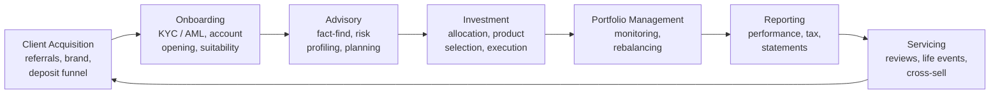
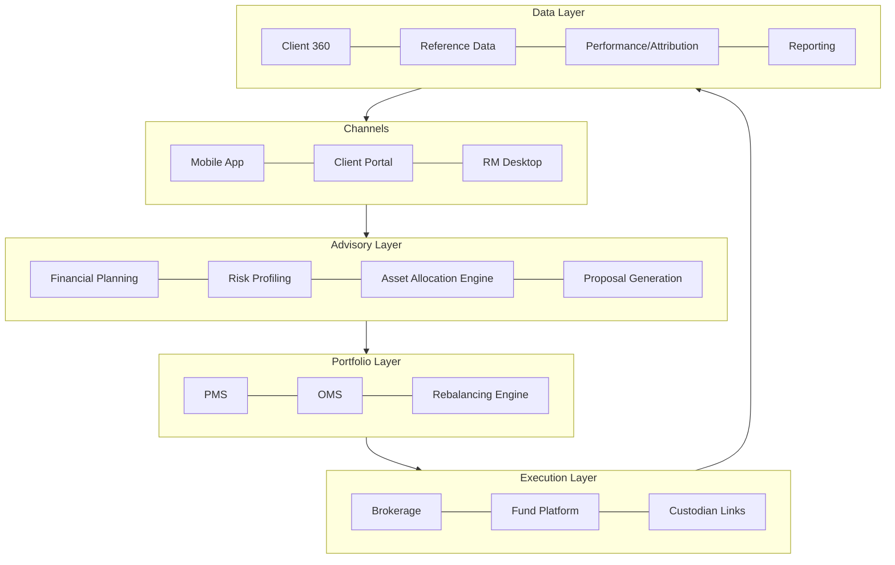
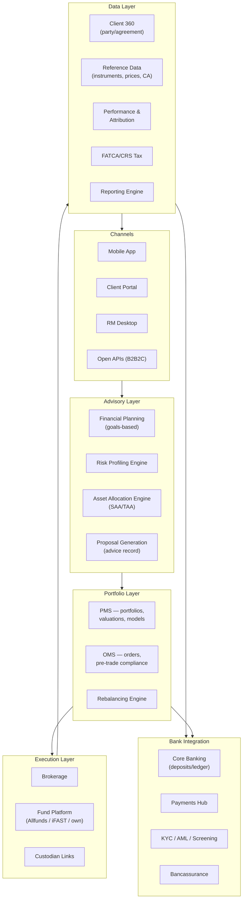
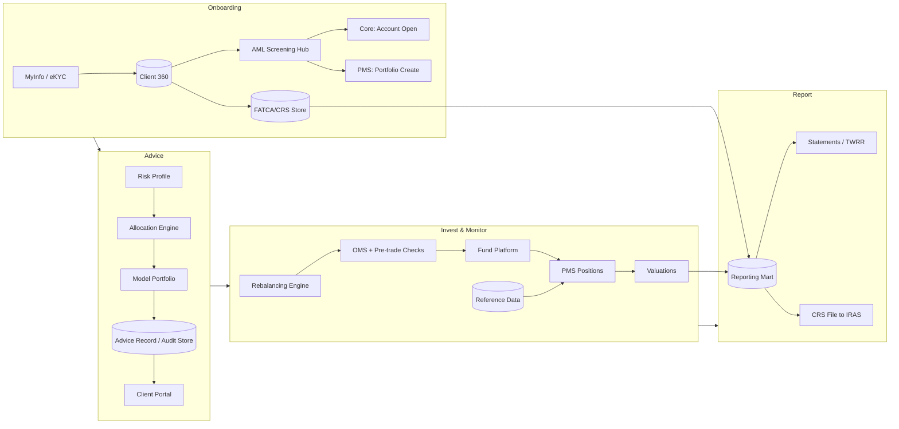

# Wealth Management: A Comprehensive Guide

**The Business, Operating Model, Products, Technology, and Future of Wealth Management — Retail Wealth, HNW, Private Banking, and Wealthtech, with a Singapore/Asia Lens**

> **Author:** Jack Liu Shurui — Solution Architect at Crédit Agricole CIB, Singapore
> **Context:** Banking Domain / Wealth Management — Client Segments, Advisory Models, Wealth Products, Client Journey, Portfolio Management, Wealthtech Architecture, MAS Regulation, Singapore Wealth Hub
> **Repository:** [github.com/jackliusr/research](https://github.com/jackliusr/research)
> **Last Updated:** August 2026
> **Companion guides:** [Asset Management & Alternatives](asset_management_alternatives_guide.md) (institutional asset management — a different segment, front-to-back), [Core Banking Systems](core_banking_systems_guide.md), [Programmable Business Bank](programmable_business_bank_guide.md), [Financial Risk & Compliance Systems](financial_risk_compliance_systems_guide.md), [Data Models: Banking & Insurance](data_models_banking_insurance_guide.md), [Financial Trading & Order Infrastructure](financial_trading_order_infrastructure.md), [Temenos Guide](temenos_guide.md)

---

## Table of Contents

1. [Wealth Management Overview](#1-wealth-management-overview)
   - 1.1 [What Is Wealth Management?](#11-what-is-wealth-management)
   - 1.2 [The Client Segments](#12-the-client-segments)
   - 1.3 [The Players](#13-the-players)
   - 1.4 [The Wealth Management Value Chain](#14-the-wealth-management-value-chain)
   - 1.5 [The Wealth Market in Numbers](#15-the-wealth-market-in-numbers)
2. [The Business Models](#2-the-business-models)
   - 2.1 [The Advisory Continuum](#21-the-advisory-continuum)
   - 2.2 [Revenue Models](#22-revenue-models)
   - 2.3 [The Economics of Wealth Management](#23-the-economics-of-wealth-management)
   - 2.4 [Advisory Model Comparison](#24-advisory-model-comparison)
   - 2.5 [Client Profitability: A Worked Example](#25-client-profitability-a-worked-example)
3. [The Products](#3-the-products)
   - 3.1 [Investment Products](#31-investment-products)
   - 3.2 [Insurance Products](#32-insurance-products)
   - 3.3 [Lending Products](#33-lending-products)
   - 3.4 [Wealth Structuring and Estate Planning](#34-wealth-structuring-and-estate-planning)
   - 3.5 [The Product Shelf and Product Governance](#35-the-product-shelf-and-product-governance)
4. [The Client Journey and Advisory Process](#4-the-client-journey-and-advisory-process)
   - 4.1 [The Client Lifecycle](#41-the-client-lifecycle)
   - 4.2 [The Advisory Process](#42-the-advisory-process)
   - 4.3 [Regulatory Advisory Requirements](#43-regulatory-advisory-requirements)
   - 4.4 [Compliance in the Advisory](#44-compliance-in-the-advisory)
   - 4.5 [A Worked Suitability Example](#45-a-worked-suitability-example)
5. [Portfolio Management](#5-portfolio-management)
   - 5.1 [Portfolio Construction](#51-portfolio-construction)
   - 5.2 [Portfolio Management Operations](#52-portfolio-management-operations)
   - 5.3 [Discretionary Portfolio Management (DPM)](#53-discretionary-portfolio-management-dpm)
   - 5.4 [Portfolio Construction in Practice: An Example Policy Portfolio](#54-portfolio-construction-in-practice-an-example-policy-portfolio)
6. [Wealth Management Technology and Architecture](#6-wealth-management-technology-and-architecture)
   - 6.1 [The Wealthtech Stack](#61-the-wealthtech-stack)
   - 6.2 [The Core Wealth Platforms](#62-the-core-wealth-platforms)
   - 6.3 [Robo-Advisory Architecture](#63-robo-advisory-architecture)
   - 6.4 [Data Architecture](#64-data-architecture)
   - 6.5 [Choosing the Wealth Core: Selection Criteria](#65-choosing-the-wealth-core-selection-criteria)
7. [The Singapore Context](#7-the-singapore-context)
   - 7.1 [Singapore as a Wealth Hub](#71-singapore-as-a-wealth-hub)
   - 7.2 [MAS Regulation of Wealth Management](#72-mas-regulation-of-wealth-management)
   - 7.3 [The Singapore Players](#73-the-singapore-players)
   - 7.4 [SGX, the VCC and the Asset Management Context](#74-sgx-the-vcc-and-the-asset-management-context)
   - 7.5 [CPF, SRS and the Retirement Wealth Stack](#75-cpf-srs-and-the-retirement-wealth-stack)
8. [Wealth Management Trends and the Future (2026+)](#8-wealth-management-trends-and-the-future-2026)
   - 8.1 [Digital Wealth and the Phygital Model](#81-digital-wealth-and-the-phygital-model)
   - 8.2 [AI in Wealth Management](#82-ai-in-wealth-management)
   - 8.3 [Wealthtech Maturation](#83-wealthtech-maturation)
   - 8.4 [Tokenization](#84-tokenization)
   - 8.5 [Sustainability](#85-sustainability)
   - 8.6 [Consolidation](#86-consolidation)
   - 8.7 [Talent](#87-talent)
   - 8.8 [China Wealth and the Hong Kong vs Singapore Race](#88-china-wealth-and-the-hong-kong-vs-singapore-race)
   - 8.9 [What the Trends Mean for the Wealth Stack](#89-what-the-trends-mean-for-the-wealth-stack)
9. [The Architect's Perspective](#9-the-architects-perspective)
   - 9.1 [Reference Architecture for a Wealth Platform](#91-reference-architecture-for-a-wealth-platform)
   - 9.2 [The Architecture Diagram](#92-the-architecture-diagram)
   - 9.3 [Build vs Buy](#93-build-vs-buy)
   - 9.4 [Integration Patterns](#94-integration-patterns)
   - 9.5 [Data Governance](#95-data-governance)
   - 9.6 [Architect's Checklist for a Wealth Transformation](#96-architects-checklist-for-a-wealth-transformation)
10. [Worked Example: Launching a Robo-Advisory Service](#10-worked-example-launching-a-robo-advisory-service)
    - 10.1 [Requirements](#101-requirements)
    - 10.2 [Architecture](#102-architecture)
    - 10.3 [The Client Journey](#103-the-client-journey)
    - 10.4 [Data Flows](#104-data-flows)
    - 10.5 [Regulatory Considerations](#105-regulatory-considerations)
    - 10.6 [Go-Live Checklist](#106-go-live-checklist)
11. [Glossary](#11-glossary)

---

## 1. Wealth Management Overview

### 1.1 What Is Wealth Management?

Wealth management is the financial services discipline of **managing a client's entire financial life** — not just a portfolio, but the advisory, the products, and the administration around it. Where institutional asset management (see [asset_management_alternatives_guide.md](asset_management_alternatives_guide.md)) manages money for institutions, wealth management serves individuals and families, and its scope is deliberately broader:

- **The advisory** — understanding the client's goals, risk tolerance, time horizon, family situation and tax position; forming a plan; recommending and monitoring investments.
- **The products** — the instruments and wrappers used to express the plan: deposits, bonds, equities, funds, structured products, insurance, lending, trusts and estate structures.
- **The administration** — onboarding and KYC, account opening, custody, settlement, corporate actions, statements, tax reporting (FATCA/CRS), billing and servicing.

The essential product of wealth management is not a security — it is a **relationship**. The client entrusts assets and life goals to an institution and an individual (the relationship manager, RM) who orchestrates a team of specialists (investment counsellors, portfolio managers, product specialists, trust and estate planners, lending experts).

The economics are attractive: wealth is sticky, fee-paying, and largely uncorrelated with the credit cycle (wealth clients are typically net depositors, not borrowers). Wealth management generates the highest return-on-equity of most banking groups' businesses, with low capital consumption relative to lending. That is why retail banks built wealth franchises (DBS, OCBC, UOB, StanChart, Citi), why the Swiss private banks exist at all, and why the industry's assets keep compounding: **global household wealth stood at roughly US$450–500 trillion in the mid-2020s** (UBS Global Wealth Report), and Capgemini's World Wealth Report puts global high-net-worth (HNW, US$1M+ investable) wealth at roughly US$85–90 trillion across ~23 million individuals. Asia-Pacific is the second-largest HNW region after North America, and the fastest-growing over the long run — which is precisely why Singapore and Hong Kong matter.

### 1.2 The Client Segments

Wealth management is tiered by **investable assets** (liquid financial wealth: deposits, securities, not counting the primary residence). The tiers determine the service model, the channel, and the margin:

| Segment | Investable assets | Service model | Channel | Margin |
|---|---|---|---|---|
| Mass market | < US$100k | Self-service, basic products (deposits, simple funds, insurance) | Mobile app, internet banking, call centre | Low; often negative before cross-sell; monetised via deposits and bancassurance |
| Mass affluent | US$100k – US$1M | Advisory-lite: digital advice + a named (but shared) advisor; packaged "Premier" tiers | Mobile, portal, priority banking centres, robo-advisory | Medium; fee-based wrap 0.3–1.0%, fund/insurance commissions |
| HNW (high net worth) | US$1M+ | Full-service private banking: dedicated RM, investment counselling, discretionary mandates, lending, structuring | Dedicated RM + investment advisor; private banking centres; increasingly hybrid digital | High; ~0.5–1.5% advisory/DPM fees + product margins + lending spread |
| UHNW (ultra-high net worth) | US$30M+ | Bespoke: multi-disciplinary team (RM + specialists), family office services, alternatives access, cross-border structuring, philanthropy | Team-based coverage, family office structures, private bank / multi-family office | Highest per-client revenue; margins similar to HNW but far larger tickets; key battleground for global private banks |

Thresholds vary by institution — Asian retail banks typically define "Priority/Premier" at S$200k–350k, private banking at US$1M–5M, and global private banks (Citi, JPMorgan) at US$5M–10M. The segmentation matters operationally because **cost-to-serve scales inversely with client size**: serving a mass-market client costs ~US$50–200/year and must be fully digital; serving an UHNW family costs hundreds of thousands per year but that client may generate seven figures in revenue.

### 1.3 The Players

The wealth management industry is a spectrum from global private banks to app-only robots:

**The private banks.** The archetype is Swiss. UBS (now including Credit Suisse, absorbed in the emergency merger completed June 2023, creating a global wealth manager with well over US$3 trillion of invested assets) leads globally; Julius Baer and Pictet are the independent Swiss houses; HSBC, Citi and JPMorgan run global private banks off their universal banking platforms; BNP Paribas Wealth Management is the leading eurozone house. In Singapore, the domestic private banks — DBS Private Bank, Bank of Singapore (OCBC's private bank), UOB Private Bank — compete head-to-head with the internationals (UBS, Citi, HSBC, BNP, Credit Suisse now folded into UBS). Private banking is a **relationship business on a trust platform**: clients move assets to people they trust, in jurisdictions they trust.

**The retail banks with wealth arms.** The Asian universal banks turned retail deposits into wealth franchises: DBS (Treasures, Treasures Private Client, DBS Private Bank), OCBC (Premier, Premier Private Client, plus Bank of Singapore), UOB (Privilege, Privilege Reserve, UOB Private Bank), Standard Chartered (Priority, Priority Private), Citi (Priority, Citigold, Citi Private Bank). These banks exploit the **deposit-to-wealth conversion funnel**: a current account becomes a fund subscription, an ILP (investment-linked policy), a structured product, a discretionary mandate. Their digital channels and regional footprint give them cost advantages over pure private banks in the mass-affluent segment.

**The wealthtech.** Digital-first entrants attacking the advisory fee: Betterment and Wealthfront (US robo-advisors), Nutmeg (UK, acquired by JPMorgan in 2021), and the Singapore cohort — StashAway (robo-advisory, MAS-licensed 2018), Endowus (fund-only platform investing into institutional share classes, notably CPF/SRS money), Syfe (robo + cash management + brokerage), Kristal.AI (digital private wealth, Singapore/India). Wealthtechs compete on price (0.2–0.8% all-in vs 1%+ at banks), transparency, and UX; their weakness is the absence of a human relationship and of the lending/structuring toolkit.

**The independent advisors.** IFAs (independent financial advisors) distribute third-party products (funds, insurance, bonds) for commissions or fees, typically to the mass-affluent; the "independent" claim is increasingly questioned as fee-based advice and platform models spread. EAMs (external asset managers) are the independent channel of private banking: they hold discretionary mandates over client assets that remain **custodied at a private bank**, taking 0.5–1.5% fees and earning the bank the custody/execution revenue. EAMs are a material distribution channel in Singapore and Hong Kong — effectively outsourced private banking for families who want the bank's infrastructure but not its advice.

**The family offices.** The apex of the market: a single-family office (SFO) is a dedicated legal entity managing one family's wealth (investments, governance, tax, succession, philanthropy, lifestyle); a multi-family office (MFO) serves several families and is effectively a boutique private bank without a banking licence. Singapore's family-office boom — driven by the 13O/13U tax incentives (Section 1.3 detail in [Section 7](#7-the-singapore-context)) and geopolitical shifts — has made SFO formation one of the country's signature industries: the number of SFOs in Singapore roughly quadrupled in the early 2020s (MAS estimated ~1,400 by end-2023, up from ~700 in 2021). Banks serve SFOs through dedicated family-office advisory units and through custody/banking for the underlying funds.

### 1.4 The Wealth Management Value Chain

The wealth value chain runs from acquiring the client to servicing them for decades. Every system in wealth technology maps to one of these stages:

- **Client acquisition** — referrals from existing clients, the deposit/borrowing funnel of the retail bank, brand and thought leadership, and (at the top end) cross-border relocation flows. Acquisition cost for a private banking client can reach 1–2% of first-year AUM when banks pay "recruiting" packages for teams.
- **Onboarding** — KYC/AML, tax forms (FATCA/CRS self-certifications), account opening, suitability capture. See [financial_risk_compliance_systems_guide.md](financial_risk_compliance_systems_guide.md). Digital onboarding cut this from weeks to minutes for retail; private banking still takes days because of source-of-wealth documentation.
- **Advisory** — the fact-find, risk profiling, financial planning and proposal generation that convert a client into a portfolio (Section 4).
- **Investment** — asset allocation, product selection, order execution, settlement and custody.
- **Portfolio management** — ongoing monitoring, rebalancing, corporate actions, discretionary management (Section 5).
- **Reporting** — performance (TWRR/MWRR), statements, tax packs, regulatory disclosures.
- **Servicing** — periodic reviews, life-event triggers (marriage, inheritance, business sale), and cross-sell (mortgage, insurance, trust).

The value chain is a **loop, not a line**: the review feeds back into advisory. The best wealth franchises measure the loop — share of wallet, client lifetime value, referral rates — because growth in wealth management is largely organic and trust-driven.

### 1.5 The Wealth Market in Numbers

Putting the segments and players into a market context (all figures approximate, mid-2020s, definitions vary by source):

**Global wealth and HNW population (Capgemini World Wealth Report / UBS Global Wealth Report):**

| Region | HNW population (US$1M+) | HNW wealth | Trend |
|---|---|---|---|
| North America | ~8 million | ~US$30T+ | Largest; fastest-growing in the 2020s on tech/equity gains |
| Europe | ~5–6 million | ~US$20T | Mature; Swiss/Lux private-banking heartland |
| Asia-Pacific | ~6–7 million | ~US$25T | Second-largest; the long-run growth engine |
| Middle East | ~1 million | ~US$4T+ | Fast-growing; sovereign-wealth spillover |
| Latin America | ~0.7 million | ~US$3T | Volatile, USD-linked |
| Africa | ~0.15 million | ~US$0.6T | Small but growing |

**Selected private banks by invested assets (order-of-magnitude, mid-2020s):**

| Firm | Invested assets (approx.) | Notes |
|---|---|---|
| UBS Global Wealth Management | >US$3.5T | Includes the Credit Suisse integration (2023); the global leader |
| Morgan Stanley Wealth Management | ~US$1.6T | US-centric, fee-based |
| Bank of America (Merrill + Private Bank) | ~US$1.5T | US-centric |
| JPMorgan (Asset & Wealth Management) | ~US$1T | Global, top-tier UHNW |
| HSBC Wealth & Personal Banking | ~US$0.8–0.9T | Asia-centric global network |
| Citi Global Wealth | ~US$0.6T | Post-divestiture, institutional-adjacent |
| Pictet | ~CHF 0.7T | Swiss partnership, private-banking archetype |
| Julius Baer | ~CHF 0.45T | Independent Swiss pure-play |
| BNP Paribas Wealth Management | ~EUR 0.4T | Leading eurozone house |
| DBS (Treasures + Private Bank) | ~S$0.3T | Largest Southeast Asian wealth franchise |
| Bank of Singapore (OCBC) | ~US$0.15T | Post-Citi-acquisition growth |

**Singapore AUM growth (MAS Asset Management Survey):**

| Year | SG AUM | YoY |
|---|---|---|
| 2016 | S$2.6T | +7% |
| 2018 | S$3.4T | +5% |
| 2020 | S$4.7T | +17% |
| 2022 | S$4.9T | –9% (markets) |
| 2024 | S$6.0T | +12% |
| 2025 | S$6.7T | +10% |

The takeaway for architects: the market is **concentrated at the top** (a handful of global franchises manage the majority of cross-border HNW wealth), **compounding in Asia** (Singapore's AUM grew ~2.5× in a decade), and **fragmenting at the bottom** (wealthtechs and embedded players slice the mass-affluent). Platform strategy follows market structure: scale platforms where the market concentrates, agile platforms where it fragments.

---

## 2. The Business Models

### 2.1 The Advisory Continuum

Wealth management business models form a continuum defined by **who decides** (client vs advisor vs algorithm) and **how much service** is delivered:

- **Execution-only (self-directed).** The client decides everything; the firm provides dealing, custody and information. This is the DIY channel: discount brokerages (e.g., Saxo, Interactive Brokers, Tiger, moomoo), bank self-service platforms, and increasingly zero-commission US brokers. Revenue is thin (brokerage, FX spread, interest on idle cash) but cost-to-serve is near zero. Regulation is light: no suitability duty, though KYC and product-access controls still apply.
- **Robo-advisory (algorithm-driven, digital-first).** The algorithm decides, within a client risk profile: automated onboarding, automated profiling questionnaire, an MPT-based asset allocation engine, ETF portfolios, automated rebalancing and reporting. The Betterment/StashAway model. Revenue is a flat fee (typically 0.2–0.8% of AUM) with no commissions; unit economics work only at scale (tens of thousands of clients per platform). Regulators treat robo-advisers as advisers, not software: the MAS robo-advisory guidelines subject them to the full FAA suitability regime (Section 4.3).
- **Advisory (human advice).** The RM recommends; the client decides. The RM is supported by advisory tools (financial planning, risk profiling, proposal engines). Revenue is a wrap/advisory fee (0.5–1.5%) plus product commissions in commission-based markets. This is the dominant retail-wealth and private-banking model in Asia, where clients still expect a person to call.
- **Discretionary (DPM).** The client delegates decision-making: the portfolio manager manages the portfolio within a mandate and an Investment Policy Statement (IPS). DPM is the fastest-growing private-bank mandate type in Asia — clients increasingly accept that markets move too fast for per-trade approval, and regulators (and post-2008 scandals) pushed firms toward fee transparency, making discretionary fees a cleaner revenue line than commissions.
- **Hybrid ("bionic" advice).** Human + machine: the algorithm prepares (profiling, allocation, rebalancing triggers, portfolio analytics, risk alerts), the human delivers (interpretation, relationship, complex products, life events, accountability). Every serious wealth manager is converging here — including the robo-advisors, which added human advisors for larger clients (Betterment Premium, StashAway Reserve).

The continuum maps to revenue: execution-only earns pennies per trade; robo earns basis points at scale; advisory earns basis points with human leverage; DPM earns the same basis points with higher retention and share of wallet.

### 2.2 Revenue Models

- **Fee-based (AUM fee).** A percentage of assets under management — advisory fee, management fee, wrap fee. Typically 0.3–1.5% for advisory/DPM, 0.2–0.8% for robo, 0.5–1.5% for private-bank discretionary. Fee-based revenue is recurring, transparent, and increasingly mandated by regulation (the EU's MiFID II inducement rules, MAS's move toward fee disclosure). The industry's structural shift is **commission → fee**.
- **Commission-based (product commissions).** Upfront and trailer commissions on distributing products: mutual funds/unit trusts (typically 1–5% upfront in Asia, plus ~0.5–1% annual trailer), insurance (ILPs pay 3–8%+ upfront; single-premium products pay 1–3%), structured products (embedded margin 1–3%), bonds (0.5–1.5% markup). Commissions misalign incentives (recommending what pays, not what suits) — hence suitability regimes, inducement rules, and MAS's FAIR outcomes. Asia still runs heavily on commissions in the bancassurance and IFA channels; the fee shift is gradual.
- **Transaction-based (brokerage).** Per-trade or per-value dealing charges on equities, bonds, FX and derivatives. In Asia, online brokerage is being competed to zero (SGX-licensed brokers like moomoo and Tiger offer S$0–1 commission tiers), pushing brokers to monetise via interest, FX and CFD margins.
- **Spread (FX, dealing).** The bid/offer spread on foreign exchange and on dealing in less liquid instruments (bonds, structured notes). A private bank earns meaningful spread on the client's USD/SGD/CNY conversions — a hidden but real revenue line that fee disclosure regimes are slowly exposing.
- **Bundled (account fees).** Custody fees, account maintenance, credit card/current account packages, safe-keeping. Small per client but predictable; the "relationship pricing" umbrella under which banks bundle free banking for qualifying AUM.

Real-world wealth revenue is almost always a **blend**: an advisory fee on the portfolio, trailer on the funds inside it, spread on FX, and a margin on the Lombard loan. The architect must therefore model revenue by product line, not by "the fee."

### 2.3 The Economics of Wealth Management

The core economics are simple: **revenue = AUM × fee rate + product margins; cost = cost-to-serve × clients**. The levers are:

- **Cost-to-serve.** Fully-loaded cost of serving one client: RM time, advisory support, compliance, technology, custody, reporting. Mass market: tens of dollars a year (digital). Mass affluent: hundreds (part-digital, part-branch). Private banking: US$2,000–10,000 per client per year (RM + specialists + compliance). UHNW: tens of thousands (team-based). The ratio of revenue to cost-to-serve defines client profitability; banks routinely find the bottom 20% of mass-affluent clients are loss-making and push them to digital-only tiers.
- **AUM per RM.** The productivity metric. A retail-wealth RM manages S$50–100M across 200–400 households; a private-bank RM manages US$150–300M across 30–60 relationships; a UHNW team manages US$500M–1B+ across a handful of families. Hiring economics: a lateral RM hire brings a portable book (US$100–500M) and costs 1–2 years' revenue in guarantees — the industry literally buys books of business.
- **Revenue per client.** Mass affluent: US$500–3,000/year. HNW: US$30,000–150,000. UHNW: US$300,000–1,000,000+. Client profitability concentrates brutally: the top 1% of clients often generate 40–50% of revenue, which is why private banks fight over UHNW teams and why "share of wallet" (of the client's total financial assets) is the key growth metric.
- **Cost/income ratio.** Private banks run 65–80%; robo-advisors with scale run below 50% but are structurally loss-making until scale. Wealth is a **margin business at the top, a volume business at the bottom** — and the industry's centre of gravity is drifting toward fee-based recurring revenue with digital delivery to keep cost-to-serve flat.

### 2.4 Advisory Model Comparison

| Model | Advice | Delegation | Revenue | Margin | Best for |
|---|---|---|---|---|---|
| Execution-only / self-directed | None (client decides) | None | Brokerage, FX spread, interest | Thin but near-zero cost; profitable at scale | DIY investors, cost-sensitive traders |
| Robo-advisory | Algorithmic, standardised | Algorithm within risk profile | AUM fee 0.2–0.8% | Positive only at scale; low cost-to-serve | Mass market / mass affluent, digital-first |
| Advisory (RM + tools) | Human, relationship-based | Client approves each recommendation | Wrap fee 0.5–1.5% + commissions/spread | Good; RM leverage is the constraint | Mass affluent / HNW who want a person |
| Discretionary (DPM) | Human, delegated | Full delegation to PM within mandate/IPS | Management fee 0.4–1.5% | Best recurring economics; sticky | HNW / UHNW delegating decisions |
| Hybrid (bionic) | Human + machine | Partial; algorithm prepares, human decides | Blend of above | Improving; the industry direction | Everyone — the default end-state |

### 2.5 Client Profitability: A Worked Example

Client profitability is the unit economics of the whole industry. A simplified client P&L for a mass-affluent client vs a private-bank client illustrates where the money comes from (annual, per client):

| Line | Mass affluent (S$500k AUM, advisory) | HNW (US$5M AUM, DPM + Lombard) |
|---|---|---|
| Advisory/DPM fee (0.8% / 0.6%) | S$4,000 | US$30,000 |
| Fund trailers & product margins | S$1,500 | US$8,000 |
| FX/dealing spread | S$300 | US$4,000 |
| Lending spread (SBL/Lombard) | — | US$12,000 (US$2M facility @ ~1.2% margin) |
| Insurance/bancassurance | S$800 | US$3,000 |
| **Gross revenue** | **~S$6,600** | **~US$57,000** |
| Cost-to-serve (RM + advisory + compliance + ops + tech) | S$2,500 | US$25,000 |
| **Pre-tax profit** | **~S$4,100 (62% margin)** | **~US$32,000 (56% margin)** |
| Revenue per RM (at 300 / 40 clients) | ~S$2.0M | ~US$2.3M |

The mass-affluent client looks better on margin but worse on absolute profit — and the margin depends entirely on digital delivery (a branch-heavy mass-affluent book is quickly unprofitable). The HNW client's profit is driven by the **lending** and **product** lines, which is why private banks push Lombard, insurance-premium financing, and alternatives access. The strategic message: wealth profitability is a **portfolio of revenue lines per client**, and the architect's job is to make each line cheap to deliver and cheap to report.

**Fee benchmarks (Asia, mid-2020s, indicative):** robo-advisory 0.2–0.8% all-in; bank advisory wrap 0.5–1.5%; private-bank DPM 0.5–1.5% (declining under fee pressure); EAM mandates 0.5–1.5%; fund trailers 0.3–1.0%; ILP upfront commission 3–8%; structured-product embedded margin 1–3%; SBL/Lombard pricing SOFR/SORA + 1.0–2.5%.

---

## 3. The Products

### 3.1 Investment Products

The wealth product shelf spans the risk/return spectrum and the liquidity spectrum. A private bank's product catalogue is organised roughly as follows:

- **Cash & deposits.** The base of the pyramid: current/savings accounts, fixed deposits, money market funds, and increasingly **cash management accounts** (Syfe Cash+, Endowus Cash Smart) that pay institutional money-market rates. Idle cash is a profitability issue for firms (cash drag) and an opportunity (deposit spreads).
- **Bonds.** Government bonds (SGS — Singapore Government Securities, USTs, Asian sovereigns) for ballast; corporate bonds (investment grade and high yield); in Asia, **private credit** via private banks' bond desks offers clients 4–8% yields the public market doesn't. Bonds are quoted instruments — the bank earns dealing spread; the client holds to maturity or trades.
- **Equities.** Direct equities (single-name stocks, often via the bank's brokerage), and **structured equity products** (capital-guaranteed or yield-enhanced notes on a single stock or index — the classic Asian private-bank staple). Direct equities carry high volatility; private banks push clients toward managed solutions and keep direct equity as a satellite.
- **Funds.** Mutual funds/unit trusts (the mass-affluent staple, distributed for commissions or fees), ETFs (the robo and DPM building block), hedge funds (2% management + 20% performance, typically via fund-of-funds or direct mandates for UHNW), private equity and private credit (the fastest-growing allocation in Asia private banking — clients want the illiquidity premium), and real estate (REITs, property funds — Asia's favourite asset class). Fund distribution is a business in itself: platform fees, trailers, and clean/institutional share classes (Endowus's model is literally giving retail clients access to institutional fee tiers).
- **Structured products.** Structured notes (principal-protected notes, yield-enhancement notes), autocallables (memory autocalls on indices like the Hang Seng or S&P 500 — the most-sold structured product in Asian private banking), and reverse convertibles. They embed a derivative in a note wrapper: the bank (or issuer) sells the note and hedges it; the client gets a coupon and takes defined downside. These products carry **product risk, issuer risk and complexity risk** — suitability regimes and the post-2008 Lehman Minibond scandal (which hit Singapore and Hong Kong retail investors hard) made structured products the poster child of mis-selling regulation.
- **Derivatives.** Options, swaps (interest-rate and FX swaps for hedging, total-return swaps for leverage), and warrants/CFDs at the trading end. For HNW clients, derivatives are mostly used via structured products rather than raw; the raw derivatives market is the domain of the bank's trading desk (see [financial_trading_order_infrastructure.md](financial_trading_order_infrastructure.md)).
- **Alternatives.** Private equity, private credit, hedge funds, real assets, infrastructure — see [asset_management_alternatives_guide.md](asset_management_alternatives_guide.md) for the institutional side; in wealth, alternatives are packaged as funds, funds-of-funds, and co-investment vehicles, increasingly via **evergreen funds** that avoid the J-curve problem for private clients.
- **Digital assets.** Crypto (Bitcoin, Ether — now offered by several major private banks and robo platforms via regulated custody), tokenised funds and bonds (MAS Project Guardian pilots; see [programmable_business_bank_guide.md](programmable_business_bank_guide.md)), and gold tokens. Digital assets moved from the fringe to a small but real allocation (typically 1–5%) in Asia private banking, driven by client demand and regulated by MAS's Digital Payment Token (DPT) service-provider regime.

### 3.2 Insurance Products

Insurance is the **second half of wealth**: protection and longevity are wealth-management problems, and bancassurance (bank-as-distributor of insurer products) is a major profit centre for Asian banks.

- **Life insurance.** Term life (pure protection) and whole life (protection + savings/cash value). The cash value of whole life makes it a savings vehicle in disguise.
- **Universal life (UL).** Flexible-premium life with an investment account; the premium funds a cash value that the client (or the bank's investment team) allocates. **Indexed UL (IUL)** and **variable UL (VUL)** add market exposure.
- **Investment-linked policies (ILPs).** The workhorse of Asian bancassurance: a life policy whose cash value is invested in unit trusts. ILPs pay the distributor 3–8% upfront commission — the source of both the product's popularity and its mis-selling history (clients sold ILPs as "savings" with surrender penalties). MAS introduced the **Balanced Scorecard** and commission-cap reforms (2018–2021) to curb ILP mis-selling; new ILP sales now require a suitability assessment and a 5-day free-look.
- **Annuities.** Immediate and deferred annuities convert wealth into lifetime income — the retirement-product answer to longevity risk. Singapore's **CPF LIFE** is the national annuity; private banks distribute commercial annuities (often single-premium) to retirees.
- **Bancassurance.** The distribution model: the bank distributes the insurer's products through its branches and RMs, taking commission (typically 2–5% of single premium, or a share of the insurer's profit via long-term exclusive partnerships). In Singapore, DBS–Manulife, OCBC–Great Eastern (OCBC owns GE), UOB–Prudential partnerships dominate. For the architect, bancassurance means **product integration** (quote-to-issue APIs), **commission systems**, and **suitability integration** between the bank's CRM and the insurer's systems.

### 3.3 Lending Products

Wealth lending is the hidden engine of private banking economics: lending against wealth earns spread without taking the credit risk of ordinary lending (the collateral is liquid securities).

- **Securities-backed lending (SBL).** A margin facility against the client's portfolio — typically up to 50–70% loan-to-value on diversified equity portfolios, less on single names and alternatives. SBL is the private bank's core lending product: flexible, cheap (SOFR + 1–2%), and used for liquidity without selling (buying property, funding a business, paying taxes). The 2021 Archegos collapse was a brutal lesson in SBL risk management (concentrated, levered, and under-collateralised across banks).
- **Lombard loans.** The Swiss term for the same thing — lending against pledged securities; in modern usage, Lombard specifically denotes collateralised lending against financial assets in the European/Swiss private-bank tradition. The loan-to-value is set by asset class, and margin calls are automated against haircuts.
- **Property loans for HNW.** Jumbo mortgages, often cross-border (the client's property in one jurisdiction, income and collateral in another), and increasingly **mortgage-on-wealth** structures where the loan is secured by the portfolio rather than the property.
- **Insurance-premium financing.** The bank lends to fund a large single-premium life policy (typically whole life or UL used for estate planning); the policy's cash value secures the loan. Very popular with UHNW Asian clients using insurance as a tax-efficient wealth-transfer vehicle. The structure is levered, so it carries interest-rate and policy-lapse risk — a favourite exam topic in MAS suitability inspections.

### 3.4 Wealth Structuring and Estate Planning

At the top of the market, the product is the **structure**:

- **Trusts.** A trust separates legal ownership (trustee) from beneficial ownership (beneficiaries). Trusts deliver succession planning (avoiding probate), asset protection (against creditors and divorce), and tax planning. Singapore trusts — governed by the Trustees Act and the Trust Companies Act — are a growth industry; the **Singapore trust landscape** offers the common-law trust tradition with Asian beneficiaries, professional licensed trust companies, and no capital gains tax on trust assets.
- **Foundations.** The civil-law alternative to trusts (Singapore and several Asian jurisdictions — Labuan, Hong Kong — offer private foundations for clients from civil-law countries where trusts are unfamiliar).
- **Wills and probate.** The basic layer; in Asia, cross-border estates (assets in multiple jurisdictions, multiple nationalities in one family) make estate administration genuinely hard — hence the demand for structures that avoid probate entirely.
- **Cross-border structures.** Holding companies, family investment vehicles, PPLI (private placement life insurance — a wrapper holding investments for tax deferral), and the VCC (Section 7.4). The architect's view: structuring is a **paperwork and compliance industry** — the systems are document management, entity administration, tax reporting, and integration with the bank's custody and payments layers.

The "product" in structuring is really the **tax and legal outcome**: FATCA/CRS reporting positions, estate-tax exposure, and control provisions. Banks staff this with lawyers and tax advisers, not traders — and the systems that support them are workflow systems, not trading systems.
---

### 3.5 The Product Shelf and Product Governance

Every wealth institution runs a **product shelf** — the catalogue of products it can sell — and the shelf is a governed asset:

- **The product committee.** New products enter the shelf only through a product-approval process (product due diligence): legal review (offering documents, ISDA/KIDs), risk review (the product's risk rating, complexity flag), operational review (can our systems process it — settlement, custody, corporate actions?), and distribution review (target market definition, fee structure, sales restrictions). The committee's decision is documented — regulators expect to see the paper trail for every product ever sold.
- **Risk ratings and target markets.** Every shelf product carries a risk rating (e.g., 1–6) that must be consistent with the client risk profiles it can be sold to, and a **target market** (which client segments, which objectives, which risk profiles) plus a **negative target market** (who must never be sold this) — the MiFID II product-governance concept that MAS practice mirrors. The suitability engine (Section 4) enforces the mapping at point of sale.
- **Shelf tiers by channel.** The shelf is tiered by service model: self-directed clients see only the self-directed shelf (listed products, funds, ETFs); advisory clients see the advised shelf (plus structured products, ILPs); discretionary clients are governed by the mandate's allowed universe rather than a retail shelf. The architect's point: the shelf is **not one catalogue** — it is a product master with distribution rules per channel, per segment, per jurisdiction.
- **Product lifecycle.** Products are launched, monitored (post-sale surveillance: complaints, suitability drift, performance), and retired (product recalls — often after regulatory findings, e.g., the structured-product and ILP remediation exercises in Singapore). Lifecycle management is a workflow system with an audit trail; product recalls are the nightmare scenario, requiring the bank to identify every affected client and every sale record.
- **Product data.** The product master (terms, ratings, fees, target markets, documentation, fund NAVs, corporate actions) is reference data that the advisory, portfolio, and reporting layers all consume — one of the few places where the "single source of truth" is actually achievable and enforced.

---

## 4. The Client Journey and Advisory Process

### 4.1 The Client Lifecycle

The client lifecycle is the value chain (Section 1.4) expressed as a **regulated, documented journey**. Every step leaves an audit trail because every step is supervised:

1. **Prospecting** — identifying and approaching prospects: referrals, corporate/private-bank synergies, wealth events (IPO proceeds, business sales, inheritances), and cross-border relocations. CRM pipeline management; outreach is relationship-led.
2. **Onboarding** — KYC/AML (identity, source of wealth, source of funds, sanctions screening, PEP checks — see [financial_risk_compliance_systems_guide.md](financial_risk_compliance_systems_guide.md)), tax self-certification (FATCA/CRS), account and mandate opening, and the initial **risk profiling**. Private banking onboarding is document-heavy (source-of-wealth evidence) and is the single biggest friction point in the journey; digital onboarding tools cut retail onboarding to minutes but private banking still needs human due diligence.
3. **Profiling** — the risk profile: risk tolerance questionnaire (psychometric), investment objective (capital preservation / income / growth), time horizon, liquidity needs, experience and knowledge, and constraints (ESG preferences, excluded sectors, regulatory restrictions). The output is a **risk profile** (e.g., Conservative → Aggressive, 1–10) that gates everything downstream.
4. **Asset allocation** — translating the profile into a policy portfolio: strategic asset allocation (SAA — the long-term target weights), tactical asset allocation (TAA — short-term deviations), expressed as a **policy portfolio** with permissible ranges.
5. **Product selection** — choosing instruments to implement the allocation: funds, ETFs, bonds, structured products, insurance wrappers. Subject to **suitability** — the product must fit the client's profile, objectives, and risk tolerance (Section 4.3).
6. **Execution** — dealing, settlement, custody; order routing through the OMS to brokers/custodians/fund platforms.
7. **Monitoring** — portfolio reviews (drift from policy, risk alerts, credit events, corporate actions), rebalancing triggers.
8. **Reporting** — performance statements (TWRR/MWRR), valuations, tax packs, regulatory statements.
9. **Review** — periodic reviews (annual/periodic suitability re-checks are **mandatory** for advisory accounts under MAS rules) and **life-event reviews** (marriage, divorce, birth, inheritance, business sale, retirement, illness). Life events trigger re-profiling and re-planning.

### 4.2 The Advisory Process

The advisory framework is the standardised, documented way an RM turns a conversation into a recommendation. MAS's regulatory expectations (and the FAIR outcomes) effectively mandate this sequence:

1. **Fact-find** — gather the client's financial situation: assets, liabilities, income, expenses, dependants, existing policies and investments, tax position. The fact-find is a documented, dated record — in an inspection, "no fact-find" is a finding in itself.
2. **Risk profiling** — the risk tolerance questionnaire and suitability data capture (above). The questionnaire must be designed so the profile is stable and defensible; MAS has flagged poorly-designed questionnaires (leading questions, self-consistency failures) as a recurring inspection theme.
3. **Suitability assessment** — for each recommended product, an explicit check: does this product fit this client's profile, objectives, and experience? The "product suitability" requirement is the heart of the FAA's Section 27 (recommendation must not be made unless it is suitable) — the MAS equivalent of MiFID II's suitability duty. Key inputs: the product's risk rating vs the client's risk profile, concentration limits (e.g., not >X% in structured products for a conservative client), and the client's declared knowledge/experience.
4. **Asset allocation** — the proposed policy portfolio, showing the expected risk/return and how it meets the client's objectives.
5. **Recommendation** — the concrete proposal: what to buy/sell, how much, why. Documented in a **proposal/advice record**.
6. **Documentation (the advice record)** — the advice given must be recorded and provided to the client: the recommendation, the basis for it, the risks, and the fees. Under MAS's FAIR outcomes and FAA requirements, the advice record is the primary evidence of compliance. MiFID II goes further with a **suitability report** that must be given to the client before or at the time of the transaction.
7. **Execution** — dealing, with pre-trade checks that the order matches the recommendation and the profile.
8. **Post-trade** — confirmation, contract notes, and the monitoring loop.

The process is the same for robo-advisers — the difference is that **the algorithm does steps 1–6** and the "advice record" is the system's generated profile-plus-recommendation PDF. MAS's robo-advisory guidelines explicitly require digital advisers to meet the same standards as human advisers.

### 4.3 Regulatory Advisory Requirements

The advisory is one of the most regulated parts of banking, and the regimes differ by jurisdiction:

- **MAS (Singapore).** The twin statutes are the **Financial Advisers Act (FAA)** — covering advice on investment products, life policies, and collective investment schemes — and the **Securities and Futures Act (SFA)** — covering dealing, fund management, and capital markets services. Key advisory instruments:
  - **FAA Section 27 / Notice FAA-N16 ("A&H" requirements)** — the suitability duty: a licensed financial adviser must not recommend an investment product unless the recommendation is suitable, considering the client's investment objectives, financial situation, and risk tolerance. "A&H" refers to the **Advising and Arranging** requirements (Notice FAA-N16) that govern how advice and arrangements (e.g., arranging fund subscriptions) are conducted, including documentation and product-governance duties.
  - **FAIR (Fair Dealing) Guidelines (2009)** — six outcomes: (1) products and services offered to the right customers; (2) clear, timely information; (3) suitable advice; (4) no mis-selling; (5) timely, quality after-sales service; (6) fair handling of complaints. FAIR is the lens MAS applies in every wealth inspection.
  - **Robo-advisory guidelines (2018)** — "Providing Digital Advisory Services to Retail Clients": digital advisers must comply with the FAA A&H requirements, conduct the same suitability assessment, ensure the algorithm is tested and monitored, and disclose the algorithm's limitations; the advice must be attributable to the licensee, not "free-riding" on a human adviser's inputs.
  - **Product governance and sales conduct** — MAS Notice SFA 04-N02 / FAA-N16 product-governance expectations (product due diligence, target market definition, post-sale monitoring), plus the **balanced scorecard** requirements for bancassurance sales and commission disclosure rules for ILPs.
  - **AML/CFT** — MAS Notice 626/TSA-N02: see [financial_risk_compliance_systems_guide.md](financial_risk_compliance_systems_guide.md).
- **EU/UK (MiFID II).** The reference standard globally. Suitability assessment (know the client: knowledge/experience, financial situation, investment objectives), **appropriateness** for execution-only, **product governance** (manufacturers define the target market and negative target market; distributors check the product is within target market), **inducement rules** (no inducements that impair client interests — the death knell of trailing commissions in Europe), and the **suitability report** to the client. ESMA guidelines on suitability (and the UK FCA's equivalent) are the global benchmark that MAS's rules echo. (Note: BIPRU is the UK prudential sourcebook, not an advisory regime — the advisory rules live in MiFID II/COBS.)
- **Hong Kong.** SFC's Code of Conduct suitability requirements and product-knowledge rules for complex products — structurally similar to MiFID II's target-market regime; HK and SG regulators co-ordinate closely on cross-border advice standards.

### 4.4 Compliance in the Advisory

- **Advice documentation** — every recommendation, its basis, and the client's profile must be recorded and retained (typically 5–7 years). The advice record is the first document requested in any regulatory inspection or client complaint.
- **Audit trail** — the full journey must be reconstructable: who saw what, when, what the client said, what was recommended, what was executed. For digital advisers this means event-logging the algorithm's inputs and outputs, versioning the algorithm, and retaining model documentation — MAS explicitly requires digital advisers to keep the algorithm and its parameters such that the advice can be explained.
- **Product governance** — product due diligence (the bank's product committee approves every product before it reaches the shelf, assigns a risk rating, defines the target market and concentration limits), post-sale monitoring (are products landing in the wrong client segments?), and product recalls. MiFID II made product governance a legal duty; MAS expects equivalent practice under the FAIR outcomes and its product-governance notices.
- **Complaints and remediation** — FAIR outcome 6: complaints must be handled fairly and promptly; MAS tracks complaint data by institution. The 2020s saw large-scale remediation exercises in Singapore (e.g., mis-sold ILPs and structured products) — remediation is a systems problem (identify affected clients, compute exposure, manage the payout).

---

### 4.5 A Worked Suitability Example

Suitability is abstract until it is a specific client. Consider: **Mrs Tan, 68, retired, S$2M portfolio, objective "income and capital preservation", risk profile "Conservative" (2/10), no derivatives experience.** Her RM recommends an equity-linked autocallable structured note paying 6% p.a., "because the coupon is higher than bonds."

The suitability check the system and the RM must pass:

| Check | Assessment | Pass? |
|---|---|---|
| Objective fit | Income need is modest; the note's payoff depends on an equity index — inconsistent with "capital preservation" | ✗ |
| Risk-profile fit | Note risk rating (e.g., 5/6 on the bank's scale) > profile 2/10; principal not guaranteed | ✗ |
| Knowledge/experience | Mrs Tan has no structured-product experience; complexity flag triggers enhanced disclosure | ✗ |
| Concentration | Note would be 40% of the portfolio — above the bank's 20% complex-product limit | ✗ |
| Time horizon | 2-year tenor vs her 5+ year horizon — fails liquidity/time-horizon match | ✗ |

**Outcome:** the recommendation must be rejected by the system (pre-trade suitability block) or, in jurisdictions with manual override, the RM must document the override and the client must sign enhanced-risk acknowledgements — and MAS inspections treat overrides as red flags. The same logic, automated, is what the robo-advisory platforms implement: the algorithm simply cannot recommend outside the client's profile, and the advice record shows why.

**Regulatory comparison at a glance:**

| Aspect | Singapore (MAS) | EU/UK (MiFID II / FCA COBS) | Hong Kong (SFC) |
|---|---|---|---|
| Suitability duty | FAA s.27 + Notice FAA-N16 (A&H) | Art. 25 MiFID II; COBS 9 | Code of Conduct para 5.2 |
| Client info required | Objectives, financial situation, risk tolerance | Knowledge/experience, financial situation, objectives | Objectives, financial situation, risk tolerance (complex products: additional) |
| Documentation | Advice record; FAIR outcomes | Suitability report to client | Suitability statement for complex products |
| Product governance | MAS practice/notices; balanced scorecard for bancassurance | Art. 16 MiFID II (manufacturer/distributor) | Product due diligence + target market (2021+ guidance) |
| Robo/digital advice | MAS robo-guidelines (2018) | ESMA guidelines on digital advice | SFC digital-advice guidance (2019) |

The pattern across regimes is identical: **know the client, fit the product, document the reasoning, keep the trail** — the differences are in detail and enforcement intensity.

## 5. Portfolio Management

### 5.1 Portfolio Construction

- **Asset allocation (SAA/TAA).** The strategic asset allocation is the long-term policy mix (e.g., 40% equities / 40% bonds / 10% alternatives / 10% cash for a balanced client) derived from the client's risk profile and objectives. Tactical asset allocation is the short-term overlay (overweighting US equities for 3–6 months on a macro view, within the SAA's tolerance bands). The **policy portfolio** is the formal statement of SAA ranges; every managed portfolio is measured against it.
- **Modern portfolio theory (MPT).** Markowitz (1952): investors should care about the risk and return of the **portfolio**, not individual assets; combining imperfectly-correlated assets reduces risk for the same return. The **efficient frontier** is the set of portfolios maximising expected return for each level of risk; the optimal portfolio is the tangency point with the risk-free rate (capital market line). MPT is the theoretical backbone of every asset-allocation engine, including the robo-advisors' (which optimise over ETF asset classes). Its known weaknesses — estimation error, normal-distribution assumptions, static correlations — drive the practical refinements: Black-Litterman (blending market equilibrium with views), risk parity (allocating by risk contribution, not capital), and resampling.
- **Factor-based (factor investing).** Instead of asset classes, allocate to risk factors: equity (market), size, value, momentum, quality, low volatility, and fixed-income factors (duration, credit, carry). Factor models (Fama-French, Barra) decompose portfolio risk and return; factor tilts are how institutions and, increasingly, private-bank DPM teams express views precisely.
- **Risk budgeting.** Allocate **risk**, not capital: set a total portfolio risk budget (e.g., 8% annualised volatility or a VaR limit) and distribute it across asset classes, factors, and strategies by their risk contribution. Risk parity is the purest risk-budgeting implementation. For UHNW portfolios with alternatives, risk budgeting is the only coherent way to mix public and private assets.
- **Goal-based (goals-based investing).** The client-centric alternative to mean-variance: separate the portfolio into goal "buckets" (retirement income, children's education, a future property, legacy), each with its own horizon, risk tolerance and sub-portfolio. Goals-based investing is the dominant framework in financial planning software (it answers "will I have enough?" not "what's my beta?"); "goal-based" portfolios are bucketed and mentally accounted, "portfolio-based" (MPT) portfolios are optimised as one pool. The industry's answer is both: goals-based planning on top of an optimised core.
- **ESG integration.** Sustainable investing: negative screening (exclusions — tobacco, weapons, thermal coal), ESG integration (scoring companies and tilting), thematic (climate, renewables), and impact (measurable outcomes). See the ESG discussion in [asset_management_alternatives_guide.md](asset_management_alternatives_guide.md) and the SGX/MAS sustainable-finance agenda (Section 7). In wealth, ESG preferences are now a standard part of the risk profile (MAS expects advisers to ask), and ESG-labelled funds and mandates are a fast-growing shelf segment — with greenwashing scrutiny rising (MAS's ESG fund disclosure rules, 2023).

### 5.2 Portfolio Management Operations

- **Rebalancing.** Bringing the portfolio back to policy weights. Strategies: **periodic** (calendar-based — quarterly/annually), **threshold-based** (drift > X% triggers rebalance; asymmetric bands for rising/falling assets), and **cash-flow** (rebalance using incoming/outgoing cash flows to avoid trading). Rebalancing is the systematic discipline that enforces "buy low, sell high" — and it is the highest-volume operational process in wealth (every DPM portfolio rebalances on the same triggers, which is why rebalancing engines are a product category).
- **Tax optimisation.** **Tax-loss harvesting** — realising losses to offset gains (the US robo-advisors' headline feature: Betterment/Wealthfront harvest losses across the year, worth ~0.5–1.5%/year in tax alpha) — is less relevant in Singapore (no capital gains tax) but matters for US taxpayers and for clients in taxed jurisdictions. Singapore-relevant tax work is mostly **withholding-tax optimisation** (treaty rates on dividends/interest), CPF/SRS structuring, and estate-tax planning for clients from taxed home countries.
- **Cash management.** Idle cash drags returns. Cash management solutions: automatic sweeps into money-market funds or deposit tiers, cash management accounts, and "cash smart" products (Section 3.1). The operations problem is the sweep's accounting (it generates daily trades and reconciliations).
- **Reporting.** The client-facing output:
  - **Performance.** Time-weighted return (TWRR) — removes the effect of cash flows, the standard for comparing managers (GIPS-compliant firms report TWRR); money-weighted return (MWRR, aka IRR/XIRR) — reflects the client's actual experience including cash-flow timing; the two diverge when clients add/withdraw at good or bad times. Statements show both, plus since-inception returns.
  - **Benchmark comparison.** Portfolio return vs the policy benchmark (e.g., 60% MSCI ACWI / 40% Bloomberg Global Agg) and vs peer groups.
  - **Attribution.** Performance attribution (Brinson-style) decomposes the portfolio's return relative to benchmark into **asset-allocation** effects (over/underweighting asset classes), **security-selection** effects (picking better/worse instruments within a class), and interaction. Attribution is how DPM teams prove their value and how clients see where performance came from. (Brinson, Hood & Beebower 1986 / Brinson & Fachler 1985.)
  - **Statements.** Valuations, transactions, holdings, income, fees — plus tax packs (capital gains schedules for foreign tax authorities, FATCA/CRS reporting) and regulatory statements (MAS requires prescribed disclosure of fees and charges).
- **Operations plumbing.** Corporate actions (dividends, splits, rights — a private bank processes thousands monthly across client portfolios), income processing, and reconciliation with custodians. Corporate-action processing is the classic back-office pain point: every position in every client account must be elected, paid, and accounted.

### 5.3 Discretionary Portfolio Management (DPM)

DPM is where wealth management becomes institutional-grade portfolio management applied to individual clients:

- **The discretionary mandate.** The client signs a mandate delegating investment decisions to the firm within agreed boundaries (asset classes, instruments, concentration limits, leverage). The mandate is the contract that defines what the PM may do without asking.
- **The IPS (Investment Policy Statement).** The governing document: objectives (return target, income needs), constraints (liquidity, time horizon, tax, ESG, legal), risk tolerance, the SAA/policy portfolio, benchmarks, and review cadence. Every DPM portfolio is a child of an IPS.
- **The PM (portfolio manager) role.** A named PM (or central DPM team) manages the portfolio: asset allocation decisions, manager/product selection, rebalancing, and reporting. The client's RM remains the relationship owner; the PM is the investment owner. In Asia, DPM is sold as "let the professionals manage it" — and as the fee-transparent alternative to commissions.
- **Model portfolios — the 'model portfolio factory'.** The industrial model (used by UBS, DBS, and every scalable DPM operation): a **central investment team** defines a small number of model portfolios (e.g., Conservative, Moderate, Growth, Aggressive — each an IPS with a specific SAA and fund/ETF lineup); the RMs/PMs then **map clients to models** and parameterise (currency, ESG overlay, exclusions). This is the same "product factory" pattern as in [core_banking_systems_guide.md](core_banking_systems_guide.md): a central product definition, distributed to the front line, executed at scale. Benefits: consistent advice, efficient compliance (approve the model once), and cost-effective management — one central team manages billions across thousands of accounts.
- **Rebalancing at scale.** Model portfolios make rebalancing a batch problem: a central rebalancing engine computes target trades for thousands of accounts (with client-level constraints: minimum ticket sizes, tax considerations, cash balances), generates orders, and executes them in waves. The scale requirement — thousands of accounts, multi-currency, multiple custodians — is why DPM platforms (Avaloq, Temenos Wealth, and the PMS layer generally) treat rebalancing as a first-class engine, not a spreadsheet.
- **DPM economics and risk.** DPM fees (0.5–1.5%) are higher-margin and stickier than advisory fees; the risks are fiduciary-style (mandate breaches, benchmark underperformance, style drift) and operational (trade errors at scale). MAS treats DPM as fund management under the SFA (CMS licence for fund management), with added duties of care and disclosure.
---

### 5.4 Portfolio Construction in Practice: An Example Policy Portfolio

A concrete illustration of how the concepts in 5.1 become a client portfolio — the **"Moderate" model portfolio** of a typical Asian private bank (policy weights, bands, and benchmark):

| Asset class | Policy weight | Band | Benchmark | Role |
|---|---|---|---|---|
| Global equities | 35% | 25–45% | MSCI ACWI | Growth engine |
| Asia ex-Japan equities | 10% | 5–15% | MSCI AC Asia ex-Japan | Regional growth (home bias) |
| Global bonds (IG) | 25% | 20–35% | Bloomberg Global Agg | Ballast, duration |
| Asian credit / HY | 10% | 5–15% | JACI / Asia HY index | Income |
| Alternatives (PE/hedge/real assets) | 10% | 5–15% | HFRI / custom | Diversification, illiquidity premium |
| Cash / money market | 10% | 5–15% | SORA / SOFR | Liquidity, dry powder |
| **Total** | **100%** | — | Composite policy benchmark | Expected vol ~8–10%, target return ~5–7% |

The **TAA overlay** might then express a 6-month view: overweight US equities +5pp (funded from bonds), underweight Asian credit –3pp, keeping within bands. The **client parameterisation** adds: currency (SGD-hedged or USD), ESG overlay (exclude thermal coal), and exclusions (no tobacco). A **goals-based layer** on top might ring-fence S$500k of the S$2M into a low-vol "retirement income" bucket.

The MPT mechanics underneath: portfolio expected return is the weighted average of asset expected returns; portfolio variance includes the covariance terms (σ²_p = ΣΣ wᵢwⱼσᵢⱼ) — which is why adding low-correlation assets (alternatives, gold, Asian credit) lowers risk for the same return. The efficient frontier is traced by optimising weights for each target risk; the chosen point is where the client's risk profile (volatility tolerance) intersects the frontier. Practical engines (Black-Litterman, risk parity, or simple resampled MVO) differ in how they handle estimation error — but every one of them produces the same artefacts the business needs: **weights, bands, expected risk/return, and a benchmark**.

## 6. Wealth Management Technology and Architecture

### 6.1 The Wealthtech Stack

Wealth management technology is a layered stack. The layers differ from core banking in one crucial way: the **portfolio is the unit of record** (not the account), and the stack spans client experience, advice, portfolio, execution, and data:

- **Client-facing layer** — portals, mobile apps, and the RM desktop. The client experience: account/portfolio views, statements, transactions, onboarding flows, document e-signing, chat. The RM desktop is the front-office workstation: client 360, pipeline, proposal generation, order entry, alerts. Modern stacks build one **omnichannel layer** (web + mobile + RM) on shared APIs rather than three separate front ends.
- **Advisory layer** — financial planning tools (goal-based cash-flow planning), risk-profiling engines (questionnaire administration and scoring), asset-allocation engines (SAA/TAA optimisation), and proposal generation (the advice record / suitability report as a generated document). This layer is where the "human + machine" (bionic) value lives and where the robo-advisors' entire business sits.
- **Portfolio layer** — the portfolio management system (PMS: holdings, valuations, model portfolios, performance), the order management system (OMS: order capture, routing, pre-trade compliance — see [financial_trading_order_infrastructure.md](financial_trading_order_infrastructure.md)), and rebalancing engines (target allocation computation, drift monitoring, trade list generation).
- **Execution layer** — brokerage connectivity (exchanges, brokers), fund platforms (subscription/redemption ordering into unit trusts/ETFs — often via a platform like Allfunds or iFast or direct fund-house links), and custodian links (settlement, safekeeping, corporate actions). In Asia, much wealth execution is **funds** (subscriptions into unit trusts) rather than securities dealing, so the fund-platform integration is often more important than exchange connectivity.
- **Data layer** — client data (the client 360: party, agreements, holdings, interactions), market data (prices, corporate actions, FX rates), portfolio data (positions, valuations, performance, attribution), and reporting (statements, tax packs, regulatory returns). Reporting is a data problem wearing a document problem's clothes: most banks run a dedicated reporting engine on top of a data warehouse.

### 6.2 The Core Wealth Platforms

The wealth core — the system of record for client relationships, portfolios, and mandates — is a distinct product category from the retail banking core ([core_banking_systems_guide.md](core_banking_systems_guide.md)). The leading platforms:

| Platform | Origin | Strength | Model | Representative customers |
|---|---|---|---|---|
| **Avaloq Banking Suite** | Switzerland (NEC-owned since 2020) | The de-facto **private banking standard**; rich front-to-back wealth functionality (advisory, DPM, mandates, reporting), strong in Europe/Asia private banks | On-prem or Avaloq SaaS (cloud) | ~170 banks worldwide: many Swiss/European private banks, several Asian private banks |
| **Temenos Wealth** (WealthSuite / Infinity Wealth) | Switzerland | Full banking suite + wealth module (front office, portfolio, mandates); integrates with Temenos Transact core; strong in Asia | On-prem or SaaS | Regional banks, private banks running Temenos cores — see [temenos_guide.md](temenos_guide.md) |
| **Finnova** | Switzerland | Swiss retail/private banking platform (accounts, wealth, mortgages) | On-prem / outsourcing | Swiss cantonal and regional banks |
| **TCS BaNCS Wealth** | India | Global banking product; wealth (front + portfolio) alongside core banking | On-prem / cloud | Large banks across Asia, Middle East, Africa |
| **FIS Wealth** (formerly InvestEdge; NetEconomy is FIS's AML/transaction-monitoring product, not wealth) | US | Wealth management platform for banks, broker-dealers, RIAs: portfolio accounting, performance, billing | SaaS | US/global wealth managers, banks' trust departments |
| **Additiv** | Switzerland | **Digital wealth SaaS**: white-label robo/advisory journeys for banks and insurers (B2B2C) | SaaS (API-first) | Banks, insurers, wealth managers embedding digital advice |
| **Allfunds** | Spain (Madrid-listed) | **Fund distribution platform**: connects distributors to thousands of fund share classes, order routing, data; ~€1.5T assets under administration | Platform/SaaS | Banks and wealth managers globally for fund execution |
| **FNZ** | UK (LSE-listed 2025) | **Wealth platform-as-a-service**: the UK/ANZ platform model — custody, dealing, wrap administration, D2C; ~£1.6T AUA | SaaS (multi-tenant) | Major UK/ANZ banks and wealth firms (white-label platforms) |
| **Bravura (Sonata)** | Australia | Wealth administration + funds/superannuation platform | On-prem / SaaS | Australian and UK wealth managers, super funds |
| **Mambu / Thought Machine** | Netherlands/UK | **Banking cores**, not wealth platforms: no native portfolio management; used as the deposit/ledger core under a separate wealth layer in neobank/digital-wealth builds | SaaS | Digital banks and wealth neobanks (ledger beneath a wealth app) |

The buy-side reality: a bank's wealth stack is **almost never one platform**. A typical large Asian bank runs: Avaloq or Temenos for the private bank, a retail wealth front (in-house or packaged) for the mass-affluent, a fund platform (Allfunds/iFast/own) for distribution, a PMS for DPM, and a reporting engine — all integrated. The "core wealth platform" is the hub; the advisory layer, the reporting, and the channels are usually separate systems around it.

### 6.3 Robo-Advisory Architecture

The robo-advisory stack is the wealth stack reduced to its digital essence. The canonical architecture (Betterment/Wealthfront/Nutmeg/StashAway/Syfe):

- **Digital onboarding & KYC** — identity verification (MyInfo in Singapore, eKYC), FATCA/CRS self-certification, risk-profile questionnaire, e-signature, funding (FAST transfer, GIRO). The whole onboarding is one session, not a week.
- **Risk-profiling engine** — the questionnaire and scoring; in MAS-regulated robo platforms, the profiling must satisfy the same suitability standards as human advice (the guidelines explicitly require digital advisers to obtain sufficient information about the client).
- **Asset-allocation engine** — MPT-based: a set of model portfolios (e.g., 0%–100% equities in steps), each an optimised ETF mix; the client's profile maps to a model. Some platforms (StashAway) use a risk-based "ERAA" (Economic Regime-based Asset Allocation) approach instead of pure mean-variance — adjusting allocation by macro regime; the engine must be explainable and versioned for the regulator.
- **Portfolio construction (ETF-based)** — the target portfolio is a small set of ETFs (equity, bond, gold, REIT, money market) in defined weights; fractional shares keep small accounts fully invested.
- **Rebalancing automation** — drift-based rebalancing, tax-loss harvesting (US platforms), cash-flow management; executed by the platform's own dealing or via a broker.
- **Reporting & servicing** — real-time app reporting, statements, and (for regulated platforms) the documented advice trail.

**The Singapore robo platforms' stacks** (StashAway, Endowus, Syfe, Kristal.AI) follow the same pattern with local adaptations: MAS-licensed (CMS for fund management / FAA for advice), custody at a third-party custodian (e.g., UOB Kay Hian, Saxo, iFAST), fund execution via fund platforms (Endowus routes into institutional share classes directly with fund houses — its architecture is a fund-distribution platform with advisory wrapped around it, including CPF/SRS money), and banking via partner banks (fast settlement, cash management). Architecturally they are **thin front ends over heavy middleware**: the differentiation is in the allocation engine, the data, and the UX — not in the ledger.

### 6.4 Data Architecture

- **Client 360.** The party/agreement model: one client (party) with many roles (account holder, beneficial owner, trustee, guarantor), many agreements (accounts, mandates, facilities), and a consolidated view across products. See [data_models_banking_insurance_guide.md](data_models_banking_insurance_guide.md). In wealth, the client 360 must also carry the **risk profile, suitability status, and product-governance flags** — the CRM and the compliance record are the same data.
- **Portfolio data model.** Positions (instrument, quantity, price, currency, account), valuations (mark-to-market, accruals), the portfolio-as-of-date hierarchy (client → portfolio → sub-portfolio → position), and the **model-portfolio link** (which model, which parameterisation). The portfolio model is the backbone of the PMS and of reporting.
- **Reference data.** Instruments (security master: identifiers, terms, ratings), prices (end-of-day pricing feeds), FX rates, corporate actions (dividends, splits, redemptions), and client reference data (names, addresses, tax IDs). Reference-data quality is the silent killer of wealth operations — a bad corporate-action feed or a stale price poisons valuations, statements, and compliance alike.
- **Performance data.** Return series (TWRR/MWRR), benchmark series, attribution results, and the cash-flow events that make them computable. Performance is computed from transactions and valuations, so the performance data model depends on the portfolio model being complete and correct.
- **Tax data.** FATCA/CRS reporting: the account-holder tax residency and the annual report of financial accounts to IRAS (Singapore) for exchange with treaty partners; withholding-tax positions; and client tax packs. CRS reporting is generated from the client 360 + positions + income — a year-end batch process that every cross-border wealth platform must run.
- **Regulatory data.** MAS reporting (e.g., SFA/FAA returns, AML/CFT transaction monitoring — see [financial_risk_compliance_systems_guide.md](financial_risk_compliance_systems_guide.md)), and the suitability/advice audit trail.

---

### 6.5 Choosing the Wealth Core: Selection Criteria

When a bank selects (or re-platforms) its wealth core, the evaluation criteria that matter — in roughly this order of weight in real RFPs:

| Criterion | What to probe | Why it matters |
|---|---|---|
| **Functional coverage** | Advisory + discretionary + mandates + reporting out of the box, or modules to bolt on? | The "80% rule": gaps become customisation, and customisation is where cost and lock-in live |
| **Multi-entity, multi-currency, multi-jurisdiction** | Cross-border booking centres, multiple legal entities, multi-currency accounting, per-jurisdiction regulatory reporting | The core of Asian private banking is cross-border; single-jurisdiction platforms fail here |
| **Mandate/DPM support** | Model portfolios, mandate monitoring, rebalancing at scale, IPS management | DPM is the growth mandate; the platform must run the model-portfolio factory |
| **Reporting engine** | Performance (TWRR/MWRR), attribution, statements, tax packs, custom report builder | Reporting is 40% of the perceived quality of a wealth platform |
| **Compliance & tax** | Suitability hooks, FATCA/CRS, audit trail, product governance support | Regulatory change is the platform's biggest recurring cost — vendors who own it are worth paying for |
| **Integration openness** | APIs, event streams, data export, core-banking and fund-platform connectors | The core is a hub, not an island; open APIs decide the total cost of the surrounding stack |
| **Cloud / SaaS model** | Multi-tenant SaaS, private cloud, on-prem; upgrade cadence | Avaloq SaaS and FNZ's platform model shift maintenance cost to the vendor; on-prem keeps control but hires a team |
| **Vendor stability & roadmap** | Ownership, R&D spend, regulatory-update track record | A wealth core is a 10–15-year relationship; the vendor's roadmap becomes your roadmap |
| **TCO** | Licence + implementation + customisation + run cost over 10 years | Licence is typically <30% of lifetime cost; the other 70% is integration, customisation, and operations |

The recurring industry pattern: banks over-weight the licence fee in selection and under-weight **integration openness and the vendor's regulatory-update machine** — then spend years and multiples of the licence in the integration layer. Selection should be a **reference-architecture exercise** (map your target stack from Section 9.1 to the vendor's capabilities) before it is a procurement exercise.

## 7. The Singapore Context

### 7.1 Singapore as a Wealth Hub

Singapore is Asia's (and arguably the world's) leading wealth-management centre. The numbers:

- **AUM.** MAS's annual asset-management survey put Singapore's AUM at **S$6.0 trillion at end-2024** (+12%) and **S$6.7 trillion at end-2025** (+10.1%) — a decade of nearly uninterrupted double-digit growth, from ~S$1.5T in 2013. (The commonly quoted ~S$5.5 trillion figure reflects the 2023–24 vintage of the survey; the verified end-2025 figure is S$6.7 trillion.) Roughly 70–80% of AUM is sourced from outside Singapore, making it a true international centre.
- **Private banking.** Singapore and Hong Kong together manage the majority of Asia's offshore private-bank assets (an estimated US$1.5–2T each in the mid-2020s, with Singapore pulling ahead of Hong Kong for the first time around 2023–24 on the back of wealth inflows from China, Europe and elsewhere).
- **Growth drivers.** (1) **Asia wealth growth** — the region generates a third of new global millionaires; (2) the **tax regime** — no capital gains tax, no dividend/interest tax for individuals, territorial taxation, and attractive trust/estate treatment; (3) **political and legal stability** — the safe-haven bid during the 2020s' geopolitics (Hong Kong's national-security law, Russia sanctions, Middle East volatility); (4) the **trust and estate regime** — a mature common-law trust jurisdiction with licensed trust companies and a growing private-wealth legal ecosystem; (5) the **family-office boom** — the 13O/13U incentives (below) turned Singapore into the default home for Asian family offices; (6) **MAS's regulatory brand** — strict but predictable regulation that markets itself as a stamp of quality.
- **The family office boom.** The number of single-family offices in Singapore grew from ~400 (2020) to ~700 (2021) to ~1,100 (2022) to ~1,400 by end-2023 (MAS estimates). The **13O/13U tax incentives** are the engine: under the Income Tax Act 1947, a fund managed by a Singapore-based single-family office can claim tax exemption on specified income — **Section 13O** (onshore fund, administered and managed in Singapore, no AUM cap but with local business-spending and investment-professional requirements) and **Section 13U** (enhanced tier: no cap on fund size/type, but S$50M minimum AUM and stronger substance requirements). MAS extended the schemes to **31 December 2029** (circular FDD Cir 10/2024) while tightening substance rules (minimum AUM, business spending, and the requirement for a genuine local investment team) to counter "mailbox" offices. The **13D** scheme is the offshore-fund variant. The 2025–26 tightening (higher minimum AUM thresholds, defined investment-professional requirements) professionalised the industry — the SFO race is now about real teams and real investing, not just a licence.

### 7.2 MAS Regulation of Wealth Management

MAS regulates wealth management through two parallel statutes plus a thick layer of notices and guidelines:

- **The Financial Advisers Act (FAA, 2001)** — regulates advice on investment products: licensing of financial advisers and representatives, the suitability duty (Section 27), the A&H requirements (Notice FAA-N16: advising and arranging conduct, documentation, product governance), commission disclosure, and the FAIR Dealing Guidelines (Section 4.3). All advisory wealth business — RMs, robo-advisers, IFAs, bancassurance — runs under the FAA.
- **The Securities and Futures Act (SFA, 2001)** — regulates dealing in securities, fund management (CMS licences), custodial services, and market conduct. DPM, discretionary fund management, and dealing/custody run under the SFA. A wealth manager typically holds both an FAA licence (advice) and an SFA CMS licence (dealing/fund management).
- **Robo-advisory guidelines (2018)** — the first-mover digital-advice regime (Section 4.3): digital advisers must meet the A&H requirements, ensure algorithm governance, test and monitor the algorithm, and disclose limitations. Asia's other hubs followed (HK's SFC issued similar guidance in 2019).
- **AML/KYC** — MAS Notices 626 (banks) / FAA-N02 (advisers) implementing FATF standards; the source-of-wealth documentation burden is the operational cost of the regime. See [financial_risk_compliance_systems_guide.md](financial_risk_compliance_systems_guide.md).
- **Consumer protection** — FAIR outcomes, the balanced-scorecard rules for bancassurance, the **Financial Ombudsman** and FIDReC (Financial Industry Disputes Resolution Centre), mandatory fee disclosure, and the DPT (crypto) investor-protection regime.
- **Asset management regulation** — fund managers (LFMC/ VCFM licences), the Variable Capital Company (below), and the disclosure regime for retail funds (the "MAS-approved" prospectus framework).

### 7.3 The Singapore Players

**The domestic banks' wealth franchises:**

- **DBS** — the largest Southeast Asian bank and a regional wealth powerhouse. Tiers: **DBS Treasures** (S$350k+), **DBS Treasures Private Client** (S$1.5M+), and **DBS Private Bank** (US$5M+). DBS acquired **ANZ's wealth and retail businesses** (announced 2016, completed 2017: Singapore, Hong Kong, China, Taiwan, Indonesia — adding roughly S$11B of loans and S$12B of deposits), a defining move that made DBS the region's biggest private bank by some measures. DBS runs its wealth on an in-house platform ("DBS digibank wealth") and is the most digital-first of the Asian private banks.
- **OCBC** — **OCBC Premier** (S$200k+), **OCBC Premier Private Client** (S$1.5M+), and the private bank **Bank of Singapore (BOS)** (US$5M+). OCBC also owns insurer **Great Eastern**, giving it an integrated bancassurance engine, and acquired **Citigroup's consumer wealth businesses** in four markets (2022, completed 2023) — a landmark deal that made BOS a top-tier Asian private bank.
- **UOB** — **UOB Privilege** (S$350k+), **UOB Privilege Reserve**, and **UOB Private Bank** (US$5M+). UOB is strong in Southeast Asian wealth (Indonesia, Malaysia, Thailand, Vietnam) and deepened its private bank with the acquisition of **Citi's consumer banking businesses** in four ASEAN markets (2021–22). UOB owns insurer **UOB Kay Hian** (brokerage) and partners Prudential for bancassurance.
- **Standard Chartered** — **Priority** (S$200k+), **Priority Private** (US$1M+), strong in Greater China and Africa/Middle East corridors. **Citi** — **Citigold**, **Citi Private Bank** (US$10M+ globally, US$5M+ in Asia) — sold its Asian consumer-wealth books to OCBC/UOB but retains its institutional private bank in Singapore.

**The international private banks in Singapore:** UBS (now including the former Credit Suisse franchise — Singapore is one of UBS's top booking centres), HSBC Private Banking, BNP Paribas Wealth Management, JPMorgan Private Bank, Julius Baer, Pictet, Citi — plus European houses (Lombard Odier, EFG, Bordier). Singapore's private-banking AUM is split roughly half domestic banks / half internationals.

**The Singapore wealthtechs:**

- **StashAway** (2016) — the flagship robo-advisor: MAS CMS-licensed (2018), ERAA-based allocation engine, diversified across risk indices (0%–100% equity), added a "Reserve" human-advisory tier and a brokerage (2024), expanded to the Middle East.
- **Endowus** (2017) — fund-only digital platform: no management fee, earns trailer rebates; gives retail clients access to **institutional share classes** of funds, and uniquely supports **CPF and SRS** investments (a huge structural advantage — retirement money is sticky); acquired a Hong Kong licence and a UK wealth firm in the 2020s.
- **Syfe** (2019) — robo-advisory + cash management (Cash+), plus brokerage and global portfolios; strong marketing-led growth in Singapore.
- **Kristal.AI** (2016, Singapore/India) — "digital private wealth": hybrid model combining algorithm-assisted portfolios with human advisors, targeting the mass-affluent/emerging-HNW in Singapore, Hong Kong, and India.

### 7.4 SGX, the VCC and the Asset Management Context

- **The VCC (Variable Capital Company).** Singapore's fund vehicle, introduced by the **Variable Capital Companies Act 2018** (operational from **14 January 2020**): a corporate fund structure with variable capital (like a Luxembourg SICAV or open-ended investment company), usable for both open-ended and closed-end funds, umbrella/sub-fund structures with segregated liability, and onshore tax transparency for qualifying funds. The VCC is the structural answer to "where do Asian funds domicile?" — fund managers (including family offices and private-bank clients' investment vehicles) increasingly domicile in Singapore instead of Cayman/Luxembourg, with grant schemes and the 13O/13U exemptions making it cheap. Over 1,000 VCCs were registered within the first three years, and the vehicle is central to Singapore's push to capture fund domiciliation from traditional offshore centres.
- **SGX.** The Singapore Exchange — the listed-equities venue (REITs are a signature asset class), and increasingly a platform for structured products and (via the SGX-LODA and digital-asset initiatives) tokenised securities. SGX's 2020s strategy pivoted to multi-asset and FX derivatives; for wealth, SGX is mainly the domestic equities/REIT venue and the listing home for banks' structured products.
- **MAS asset management regulation** — fund managers (LFMC/VCFM), the retail-fund prospectus regime, the ESG fund disclosure rules (2023), and the **Guardian** tokenisation initiatives (Section 8.4). Singapore's AM industry: ~1,000+ licensed/managed fund managers overseeing the S$6.7T, with the VCC + 13O/13U + tax treaties forming the "domicile stack" that competes with Hong Kong, Luxembourg, and the offshore centres.
---

### 7.5 CPF, SRS and the Retirement Wealth Stack

A Singapore-specific wealth layer that shapes the domestic market: the **Central Provident Fund (CPF)** and the **Supplementary Retirement Scheme (SRS)**.

- **CPF.** The mandatory national savings scheme: contributions split across the Ordinary Account (OA — housing, education, and — relevant here — CPFIS investment), Special Account (SA — retirement, pays up to ~4%+), and MediSave. **CPFIS** (CPF Investment Scheme) allows members to invest OA/SA balances above a floor into approved instruments: unit trusts, ETFs, endowment policies, gold, and — for the robo platforms — **CPF-approved robo portfolios** (Endowus and several banks offer CPFIS-compliant portfolios). CPF money is sticky, long-horizon, and fee-sensitive — a structurally different wealth segment that rewards low-fee platforms.
- **SRS.** The voluntary tax-deferral scheme: contributions (up to S$15,300/year for Singaporeans, S$35,700 for foreigners) are tax-deductible, grow tax-free, and are taxed only on withdrawal (with a 50% tax concession). SRS money must be invested through approved institutions — again a channel the wealthtechs and banks compete for (Endowus built its franchise partly on CPF/SRS investing).
- **CPF LIFE.** The national longevity annuity: members annuitise their retirement balances for lifetime income. CPF LIFE shapes retirement advice — Singaporeans' baseline retirement income is already annuitised, so wealth advice focuses on the **gap** above CPF LIFE: discretionary savings, SRS, and private annuities/ILPs for the mass-affluent, and decumulation planning for HNW.
- **The architect's angle.** CPF/SRS integration is a **regulatory data problem**: every trade into CPFIS/SRS must be reported to the CPF Board within prescribed timelines, with transaction fees capped (e.g., the CPFIS fee caps), and the money is subject to rules (OA floor, scheme-approved instruments). Platforms supporting CPF/SRS need a dedicated compliance module (approved-product checks, fee caps, reporting files to CPF Board) — a genuine moat for the incumbents who built it (DBS, OCBC, UOB, Endowus) and a barrier for new entrants.

## 8. Wealth Management Trends and the Future (2026+)

### 8.1 Digital Wealth and the Phygital Model

The "digital or human?" debate is over: the answer is **both**. The phygital model — digital onboarding, digital portfolios, digital reporting, with humans for the moments that matter (life events, complex products, crisis calls, inheritance) — is now the default architecture of every serious wealth franchise:

- **Digital-first acquisition, human retention.** Robo platforms added human advisors (Betterment Premium, StashAway Reserve); banks digitalised onboarding and reporting while keeping RMs. The client journey is increasingly "digital everywhere, human on demand."
- **The RM's toolkit went digital.** RMs now advise with a laptop: client 360, pre-built proposals, portfolio analytics, and alerts. The mass-affluent RM's span of control tripled (hundreds of clients per RM) because the tools do the heavy lifting.
- **Digital private banking.** UBS, DBS, and the internationals built digital private-banking portals (UBS Neo, DBS digibank PB) that give HNW clients self-service dealing, e-documents, and real-time portfolio views — while keeping the relationship layer human.

The strategic consequence: the **cost-to-serve curve flattened**, letting banks push private-bank-grade products downmarket (smaller tickets into private credit, funds, and DPM), which is exactly how the mass-affluent segment is being fought over in 2026.

### 8.2 AI in Wealth Management

AI is the defining technology trend of the 2020s in wealth:

- **AI advisors / LLM-powered advisory.** Generative AI moved from demo to production: **RM copilots** that draft client summaries, meeting notes, and proposal narratives from the client 360 and conversation transcripts (UBS, Morgan Stanley, DBS all deployed internal LLM copilots); **client-facing assistants** that answer portfolio questions in natural language; and **advice-generation assistance** — drafting the advice record and suitability rationale for RM review. The regulatory stance (MAS, HK SFC) is "human-in-the-loop, firm accountable": the AI drafts, the licensed adviser owns and signs the advice. See the LLM/agent guides under `technology/ai_llm/` for the implementation patterns.
- **AI-driven client insights.** Next-best-action engines (which client is likely to need liquidity? who has concentration risk? who should be offered an ILP in the December planning season?), churn prediction, propensity models, and **hyper-personalisation** — tailoring portfolio overlays, ESG exclusions, and content to the individual. This is the same data-science stack as retail banking ([programmable_business_bank_guide.md](programmable_business_bank_guide.md)), applied to advisory.
- **AI in portfolio management.** Factor models with ML, alternative-data signals, anomaly detection in operations (corporate-action processing, reconciliation breaks), and compliance monitoring (suitability drift detection, surveillance). The model risk management (MRM) burden is real: MAS's fair-use and model-governance expectations mean AI in advice requires versioning, explainability, and testing — the same discipline the robo-guidelines demanded of algorithms.
- **The hard parts.** Hallucination in client-facing text, prompt-injection via client-entered content, and the auditability of LLM outputs. Production deployments keep LLMs in "draft/review" mode, log inputs and outputs, and keep the licensed adviser accountable — the architecture mirrors the robo-advisory governance pattern.

### 8.3 Wealthtech Maturation

- **Wealth-as-a-service (WaaS) / embedded wealth.** Wealth capabilities delivered as APIs to non-bank platforms: a super-app embedding fund investing, an insurance app embedding a robo portfolio, an employer embedding financial wellness + investing into payroll (see [programmable_business_bank_guide.md](programmable_business_bank_guide.md) for the platform-bank parallel). The WaaS providers are the platform players (FNZ, Additiv) and the licenced wealthtechs; the buyers are the distribution-rich but product-poor (retailers, insurers, payroll platforms).
- **Open wealth.** Open banking/API distribution of account and portfolio data (SG's SGFinDex lets individuals share financial data across institutions; the open-finance trajectory extends to investments and insurance). Open wealth is both an opportunity (consolidated advice on top of the client's full picture) and a threat (the bank loses the data monopoly).
- **B2B2C wealth.** The white-label model — a bank or wealthtech powers another brand's wealth offering (FNZ powering UK bank platforms; Additiv powering insurers' digital advice). Margins are lower but distribution is rented; for the architect, B2B2C means **multi-tenant, configurable platforms** (per-brand theming, per-brand product shelves, per-brand regulatory reporting).

### 8.4 Tokenization

- **Tokenized assets in wealth.** MAS's **Project Guardian** (launched 2022 with DBS, OCBC, UBS, Citi, Standard Chartered, HSBC and others) pilots tokenized bonds, funds, FX, and money-market instruments on permissioned and public blockchains. The wealth relevance: tokenized funds and money-market funds (intraday liquidity, 24/7 dealing), tokenized bonds (fractional, faster settlement), and **tokenized gold** — already a client product in Singapore. See [programmable_business_bank_guide.md](programmable_business_bank_guide.md). MAS followed with the **Guardian Blueprint** papers (2024–25) on the interoperability and settlement rails, and a stablecoin regulatory framework (MAS's SGD stablecoin regime, 2023–25) that gives tokenized products a regulated cash leg.
- **Fund tokenization.** The practical 2026 use case: unit trusts and private funds represented as tokens on a shared ledger, with the fund platform doing subscription/redemption on-chain — cutting the T+2–T+5 fund-dealing cycle and the manual transfer-agency cost. Asset managers (e.g., the Tokenized Fund pilots by major managers) and fund platforms are the early adopters; for wealth, tokenization first shows up in **reporting and reconciliation** (single source of truth for the client's positions across banks — the "consolidated view" problem solved by shared ledgers) before it shows up in client-facing products.
- **The architect's view.** Tokenization is an infrastructure project wearing a product costume: the value is in shared-settlement and position-consistency, not in the token itself. Realistic adoption path: custody integration (the bank's custodian holds digital assets), fund-platform tokenization, then cross-institution rails.

### 8.5 Sustainability

ESG moved from product to **process** in wealth: MAS requires ESG-labelled funds to meet disclosure standards (the 2023 ESG fund regime — name-based rules, disclosure templates); client risk profiles now capture ESG preferences as standard; and sustainable portfolios (ESG-screened ETFs, green bonds, impact mandates, and the "transition" theme) are a growing shelf segment. Asia's sustainability demand is real but pragmatic — clients want ESG *and* returns, and the 2022–24 greenwashing enforcement wave (global) taught distributors to verify labels, not trust them. Sustainable finance infrastructure (taxonomy, disclosures — see the ESG context in [asset_management_alternatives_guide.md](asset_management_alternatives_guide.md) and MAS's sustainable-finance agenda) is now part of the data architecture: holdings-level ESG scores, and regulatory reporting of ESG-labelled AUM.

### 8.6 Consolidation

Wealth management is consolidating on every axis:

- **The Credit Suisse/UBS merger** (completed June 2023) created a US$3T+ global wealth manager and removed a top-3 Asian private bank — the resulting client and RM reshuffling was the biggest wealth event of the decade, with Julius Baer, BNP, DBS, and the Chinese houses all picking up teams and books.
- **Bank wealth M&A in Asia:** OCBC's purchase of Citi's Asian consumer-wealth books (2022–23), UOB's purchase of Citi's ASEAN consumer businesses (2021–22), DBS's ANZ acquisition (2016–17), and Citi's global retreat from consumer wealth outside its institutional core. The pattern: **scale wins** — the fixed costs of compliance, platforms, and product are amortised over bigger books; mid-sized private banks must merge or specialise.
- **Wealthtech consolidation:** robo-advisors consolidating (Nutmeg → JPMorgan; Wealthfront survived near-death and stayed independent; several US robo/wealthtechs merged), fund platforms merging, and the platform layer (FNZ's 2025 IPO, Allfunds' scale) becoming the infrastructure backbone for the industry.

### 8.7 Talent

- **The RM shortage.** Asia private banking faces a structural shortage of experienced RMs and, critically, of **next-generation RMs** (the relationship skills + digital literacy combination is rare). Banks respond with RM academies (DBS, UBS), team-based coverage (spreading the book across specialists instead of one RM), and hiring from adjacent industries. RM portability (books moving with RMs) keeps recruiting economics brutal.
- **The wealthtech talent war.** Product managers, data scientists, and engineers with wealth-domain knowledge are scarce; the platforms (Avaloq, FNZ, Additiv) and the fintechs compete with banks for the same profile. For the architect: talent scarcity is a **platform argument** — build where the platform carries the complexity so the scarce humans do the high-value work.

### 8.8 China Wealth and the Hong Kong vs Singapore Race

- **China wealth.** China's wealth-management market is the world's second-largest: the **wealth-management product (WMP)** market (~RMB 30T, the "CWM" bank wealth-management subsidiaries — the bank WMP subsidiaries that took over the shadow-banking WMP business), a fast-growing private-banking tier (the big state banks run ~RMB 20T+ of private-bank AUM), and massive **outbound flows** (overseas diversification via QDII, Hong Kong's Wealth Management Connect, and — during the 2020s capital controls — informal channels). Chinese clients are the prize for every Asian private bank; Chinese wealthtech (Ant's wealth platform, Tencent's LiCaiTong) is the world's largest distribution experiment.
- **HK vs SG.** The two hubs compete for the same Asian offshore wealth: **Hong Kong** offers China access (Wealth Management Connect, the northbound pipeline, the HKEX), a deep capital-markets ecosystem, and (post-2023) a **2,600% tax incentive for family offices**; **Singapore** offers neutrality, stability, the 13O/13U regime, and the faster-growing family-office franchise. Since 2023–24, Singapore has led on net private-bank inflows while Hong Kong rebounds on China flows. The mid-2020s consensus: **both win, differently** — Hong Kong for China-linked wealth, Singapore for diversifying/neutral wealth. The 2025–26 tax-incentive arms race (HK's expanded family-office incentives vs SG's tightened 13O/13U substance rules) keeps shifting marginal flows.

---

### 8.9 What the Trends Mean for the Wealth Stack

Synthesising the trends into architecture implications — the 2026+ wealth platform agenda:

1. **Modular, API-first cores.** Consolidation (8.6) and B2B2C (8.3) both push toward platforms that can be re-skinned and re-embedded; the monolithic private-banking suite is being dismantled into modules (client, advice, portfolio, execution, reporting) behind APIs.
2. **AI-ready data.** RM copilots and hyper-personalisation (8.2) need the client 360, conversation transcripts, and product data as **structured, governed, real-time data** — not PDFs and spreadsheets. AI in wealth is an architecture project before it is a model project.
3. **The advice layer as the battleground.** As execution and custody commoditise, the differentiator is the advisory layer: profiling, planning, proposal generation, and the audit trail — whether human, algorithm, or LLM-assisted. Banks that buy everything including the advice become undifferentiated; the advice IP is the thing to build.
4. **Tokenization readiness.** Positions on shared ledgers (8.4) will first change reconciliation and reporting; the pragmatic 2026 posture is to design the data layer so positions can be sourced from multiple rails (custodian, fund platform, DLT) without rewriting the PMS.
5. **ESG as data.** Sustainability (8.5) is a data requirement (holdings-level ESG scores, disclosure templates) before it is a product requirement; the reporting engine must emit ESG-labelled AUM and portfolio ESG metrics as standard.
6. **Talent-shaped architecture.** The RM shortage (8.7) means tools must make scarce humans more productive (automated proposals, next-best-action, copilots) — the platform is the scaling mechanism.

## 9. The Architect's Perspective

### 9.1 Reference Architecture for a Wealth Platform

A bank's wealth platform is a **layered integration architecture** around a wealth core. The reference architecture for a typical universal bank (retail wealth + private bank):

- **Channels** — mobile app, client portal, RM desktop (and, increasingly, API channels for B2B2C/embedded wealth). One shared channel API layer; the RM desktop is the heavy client (client 360, proposals, orders, alerts).
- **Advisory layer** — financial planning (goals-based), risk profiling, asset-allocation engine, proposal/advice-record generation. Owned by the bank (it encodes the advisory IP and the suitability logic); commercially packaged tools exist but the advice logic is usually custom.
- **Portfolio layer** — the PMS (holdings, valuations, model portfolios, performance/attribution), the OMS (orders, pre-trade checks — see [financial_trading_order_infrastructure.md](financial_trading_order_infrastructure.md)), and the rebalancing engine. This is the **wealth core** — Avaloq/Temenos for private banking, packaged or in-house for retail wealth.
- **Execution layer** — brokerage connectivity, the fund platform (subscriptions into unit trusts/ETFs; Allfunds/iFast/own platform), and custodian links (settlement, safekeeping, corporate actions, income).
- **Data layer** — the client 360 (party/agreement model), reference data (instruments, prices, corporate actions), portfolio/performance data, tax data (FATCA/CRS), and the reporting engine.
- **Integration** — with the **core banking system** (deposit accounts, ledgers — see [core_banking_systems_guide.md](core_banking_systems_guide.md)), **payments** (funding, disbursements — see [payments_hub_guide.md](payments_hub_guide.md)), **KYC/AML** (onboarding, screening, transaction monitoring — see [financial_risk_compliance_systems_guide.md](financial_risk_compliance_systems_guide.md)), and **bancassurance** (quote-to-issue with insurer partners).

The architectural invariants: **one client identity across all layers** (the party model is shared, not duplicated), **the portfolio as the unit of record**, **event-driven position/valuation updates** (the PMS is fed by trades, corporate actions, and prices — not polled), and **the advice audit trail as a first-class data store** (every recommendation, profile, and disclosure logged and immutable).

### 9.2 The Architecture Diagram

### 9.3 Build vs Buy

| Option | What you get | Costs and risks | When it wins |
|---|---|---|---|
| **Buy (Avaloq/Temenos/TCS BaNCS)** | A proven wealth core: mandates, portfolios, reporting, compliance — the industry standard (Avaloq is effectively the private-banking standard) | Licence + implementation cost (tens of millions for a private-bank rollout); **lock-in** (data, process, and the platform's roadmap become yours); heavy customisation is expensive and slow; the "standard" process may not fit your advisory IP | Private banking and mid/large wealth franchises where the platform's functionality is 80%+ of need and the roadmap (regulatory updates, e.g. CRS, robo) is maintained by the vendor |
| **Build (in-house)** | Full control: the advisory IP, the client experience, the data model, the pace of change | Years of build time; a permanent platform team; regulatory features (reporting, suitability, tax) are yours to build and maintain — the hidden 40% of any wealth platform | Digital-first retail wealth where the differentiator is the UX/advisory engine (robo platforms build the front-to-advice stack in-house) |
| **Hybrid (core platform + in-house advisory/channels)** | Vendor runs the heavy regulated core (portfolios, mandates, reporting); the bank builds the advisory layer, channels, and integration — the industry's dominant pattern | Integration complexity; the boundary between "core" and "advisory" must be crisp (data ownership, performance attribution crossing the boundary) | Most banks in 2026: buy the wealth core, build the advice and experience |

The pragmatic rule: **buy the regulated plumbing, build the advisory IP and the client experience.** The portfolio/execution/reporting core is a commodity with high regulatory maintenance cost (vendor's problem); the advice, the model portfolios, the proposal engine, and the app are where the bank differentiates. Robo platforms inverted this (built the advice, rented the dealing/custody) because they had no legacy core to replace.

### 9.4 Integration Patterns

- **Client onboarding integration.** The onboarding flow orchestrates: KYC/AML (screening, source-of-wealth workflow), core banking (account opening), the PMS (portfolio/account creation), tax (FATCA/CRS self-certification capture), and the CRM. The pattern is an **orchestrated saga** — a BPM/case-management layer with compensating steps — because onboarding touches five systems and must be resumable (a private-bank onboarding can pause for weeks awaiting source-of-wealth documents). See [core_banking_processes_guide.md](core_banking_processes_guide.md) for the process-side view.
- **Product platform integration (fund platforms).** Fund dealing is a batch-and-file world: order files to the fund platform, NAV/confirmation files back, settlement instructions to custodians. Modern implementations wrap this in an API layer (Allfunds/iFAST expose APIs; direct fund-house links remain file-based). The pattern: an **order-routing abstraction** so the bank can add platforms without changing the OMS.
- **Reporting integration.** Reporting aggregates from the PMS (valuations), the core (cash/deposits), the fund platform (NAVs, distributions), and reference data — into statements, tax packs, and regulatory returns. The pattern: a **reporting data mart** (positions, prices, transactions, tax attributes) with a document-generation layer; reporting is rebuilt every few years by banks that skipped the mart and query production systems directly.
- **Advisory/compliance integration.** The suitability engine must read the client profile (CRM), the product shelf (product master with risk ratings and target markets), and the portfolio (PMS) — and write the advice record to the audit store. This cross-cutting integration is the one regulators actually inspect; design it as a service, not a bolt-on.

### 9.5 Data Governance

Wealth data governance has sharper edges than retail banking's because the data is **client money in multiple jurisdictions**:

- **Ownership and lineage.** One party model owned by the bank (not the PMS vendor); positions owned by the PMS; advice records owned by compliance. Data lineage from reference data → valuation → statement must be demonstrable.
- **Quality.** Reference-data quality (instruments, prices, corporate actions) is the top operational risk in wealth: stale prices and missed corporate actions directly misstate client money. Quality rules (price staleness checks, corporate-action reconciliation) are governance controls, not hygiene.
- **Privacy and cross-border.** PDPA (Singapore), GDPR for EU clients, and the FATCA/CRS obligations constrain what leaves the jurisdiction; client data residency (on-shore booking centres) is both a compliance and an architecture requirement.
- **The audit trail as data.** The advice record, profile history, disclosure acknowledgements, and RM-client interaction logs are regulated data with retention periods (5–7 years) — treat them as a governed store, not an archive. See [../technology/data_governance_guide.md](../technology/data_governance_guide.md) for the general framework, and [data_models_banking_insurance_guide.md](data_models_banking_insurance_guide.md) for the party/agreement model.

---

### 9.6 Architect's Checklist for a Wealth Transformation

A condensed checklist for anyone re-platforming or building a wealth capability — the questions that separate successful wealth programmes from the rest:

1. **Business model first.** Which segments, which advisory model (execution/robo/advisory/DPM), which revenue mix? The platform follows the business model, not the reverse — a DPM-heavy private bank and a robo mass-affluent play need different stacks.
2. **The unit-of-record decision.** Portfolio, position, and advice record must have unambiguous owners (Section 9.5). Decide who owns the client 360, who owns positions, who owns the audit trail — before vendor selection.
3. **Suitability and product governance as design, not bolt-on.** The suitability engine and the product master with target markets must be in the target architecture from day one; retrofitting them is the classic cost blow-up.
4. **Integration map.** Core banking, payments, KYC/AML, fund platforms, custodians, insurers — enumerate the integrations and their patterns (Section 9.4) before the build; integration is where 70% of the cost lives.
5. **Reporting early.** Design the reporting data mart and the statement/tax outputs in the first phase, not the last — reporting drives client perception and regulatory acceptance.
6. **Reference data governance.** Instrument, price, and corporate-action quality rules are production controls; put them in the platform, not in the ops team's spreadsheets.
7. **Regulatory roadmap.** FATCA/CRS, suitability re-checks, MAS/FCA/SFC reporting cycles — map the platform to the regulatory calendar; vendor-maintained compliance modules are worth real money.
8. **Cloud and SaaS posture.** Decide the operating model (vendor SaaS vs on-prem) by TCO and regulatory data-residency, not by fashion.
9. **AI and tokenization optionality.** Design the data layer so LLM copilots and DLT-sourced positions can be added without re-platforming.
10. **People and operating model.** The platform is operated by RMs, advisers, ops and compliance — involve them in the design, or the platform will be bypassed within a quarter.

## 10. Worked Example: Launching a Robo-Advisory Service

A worked example of the whole guide applied: a mid-size Singapore bank launching a **robo-advisory service for the mass-affluent** (S$100k–1M), MAS-compliant, targeting S$500M AUM in three years.

### 10.1 Requirements

- **Business:** digital-first robo with optional human advice (bionic tier at S$250k+); fee 0.5% on the first S$250k, 0.35% above; no commissions; target 20,000 clients in 3 years; S$500M AUM.
- **Functional:** digital onboarding (MyInfo, e-sign), risk profiling (MAS-compliant questionnaire), allocation engine (6 model portfolios, ETF-based), auto-rebalancing, tax/CRS reporting, statements, and a human-advisory tier (RM review for the bionic tier).
- **Regulatory (MAS):** robo-advisory guidelines compliance — FAA A&H requirements (suitability, documentation), CMS licence (fund management/dealing) for execution, algorithm governance (testing, versioning, monitoring), disclosure of algorithm limitations, and AML/KYC (Notice 626). Product shelf: MAS-registered funds or listed ETFs only.
- **Non-functional:** 99.9% availability, 3-second portal latency, audit trail for every advice event, 5–7 year retention, and full explainability of the allocation engine for MAS inspection.

### 10.2 Architecture

Components (mapped to Section 9.1):

- **Channels:** mobile app + web portal (React), RM console for the bionic tier.
- **Onboarding & KYC:** MyInfo integration, eKYC (video/selfie), screening via the bank's AML hub, FATCA/CRS self-certification e-forms; a case-management saga (Section 9.4).
- **Advisory engine:** the risk-profiling questionnaire (validated per MAS guidance), the **allocation engine** (an MPT optimiser over 8 ETF asset classes, with Black-Litterman view blending), model portfolio definitions (0/20/40/60/80/100% equity tiers), and the proposal/advice-record generator (PDF + machine-readable record).
- **Portfolio layer:** a PMS (holdings, valuations) — bought (Avaloq/Temenos wealth module) or SaaS; a rebalancing engine (drift-based, threshold ±5%, with cash-flow rebalancing); the OMS with pre-trade checks (order vs model vs client profile).
- **Execution:** a fund platform link (Allfunds/iFAST API) for ETF dealing, settlement via the bank's core, custody at the bank's custodian.
- **Data:** client 360 (party model), reference data (ETF master, prices, corporate actions), performance (TWRR), tax (FATCA/CRS), reporting engine, and the **advice audit store** (event-sourced: every profile, recommendation, and disclosure).
- **Integration:** core banking (deposits, funding via FAST), payments hub, AML hub, and the CRM for the bionic tier.

The six model portfolios (illustrative) — the product factory at work:

| Model | Equity weight | Indicative ETF mix | Expected vol (p.a.) | Client profile mapping |
|---|---|---|---|---|
| Conservative | 0% | Money market + IG bond ETFs | ~2–3% | Risk score 1–2, capital preservation |
| Conservative Plus | 20% | + developed-market equity ETF | ~4–5% | Score 3, short horizon |
| Balanced | 40% | Global equity + bond + gold ETFs | ~6–8% | Score 4–5, medium horizon |
| Growth | 60% | Equities (developed + EM) + bonds | ~9–11% | Score 6–7, long horizon |
| Aggressive | 80% | Equities + REIT + alternatives ETF | ~12–15% | Score 8–9, long horizon |
| Maximum Growth | 100% | Global equity ETFs | ~15–18% | Score 10, very long horizon |

### 10.3 The Client Journey

1. **Onboard (≈8 minutes):** sign up → MyInfo identity → eKYC → risk questionnaire → FATCA/CRS self-cert → e-sign → fund S$1,000 via FAST.
2. **Profile → allocation:** the engine scores the questionnaire → maps to model portfolio (e.g., 60% equity) → generates the advice record ("based on your profile, we recommend the Growth portfolio…") — **the advice record is the deliverable**, and MAS can demand it.
3. **Invest:** the OMS places the ETF orders via the fund platform; fractional shares keep the client fully invested; confirmation and valuation land in the app.
4. **Monitor & rebalance:** daily drift monitoring; ±5% threshold triggers rebalance; cash flows (dividends, new deposits) rebalance opportunistically; each rebalance re-documents the advice.
5. **Report:** monthly statements (TWRR vs benchmark), annual suitability re-check (MAS expects periodic re-profiling), CRS reporting annually.

### 10.4 Data Flows

The end-to-end data flows, mapped to the components:

- **Onboarding:** MyInfo → client 360; screening request → AML hub → decision → account open (core) + portfolio create (PMS); self-cert → tax store.
- **Advice:** profile → advisory engine → model mapping → advice record → audit store → client portal; the same record feeds the regulator's file.
- **Investment:** rebalancing engine → trade list → OMS (pre-trade compliance: order fits model & profile) → fund platform → confirmation → PMS positions → valuation (prices from reference data) → reporting.
- **Reporting:** PMS + core + tax store → reporting mart → statements; CRS extract → IRAS exchange file.

### 10.5 Regulatory Considerations

- **MAS robo-advisory guidelines:** the platform must be treated as an adviser — suitability (FAA s.27), the A&H conduct requirements, and the advice record apply **as if a human advised**. The algorithm must be tested before launch and after every change, with version history; MAS expects to be able to reconstruct "why did this client get this recommendation."
- **Licensing:** CMS licence for dealing/fund management (or partner a licensed broker for execution); the advisory activity needs an FAA licence (exemptions for certain fund-management-linked advice must be verified).
- **Disclosure:** fee schedule, algorithm limitations ("the portfolio is managed by algorithms, not human judgement"), conflict-of-interest disclosures, and the MAS-mandated risk warnings.
- **AML:** full KYC/transaction monitoring applies — robo platforms are not exempt because they are digital; the (in)famous "robo = same rules as human" principle is the whole regulatory story.
- **Product governance:** only MAS-registered funds/listed ETFs; each model portfolio documented with target market and risk rating; post-sale monitoring (are conservative clients ending up in growth models? — the monitoring dashboard is a MAS inspection favourite).

### 10.6 Go-Live Checklist

1. **Licences granted** (FAA + CMS) and notification of the robo service to MAS.
2. **Algorithm governance:** allocation engine validated (back-tested), versioned, documented; model-risk sign-off.
3. **Onboarding tested end-to-end:** MyInfo, eKYC, screening, account/portfolio creation, funding — with the saga's failure paths (resume after 2-week pause) exercised.
4. **Advice record verified** for a sample of profiles (does the generated suitability rationale meet the A&H documentation standard?).
5. **Rebalancing dry-runs:** drift triggers, cash-flow rebalancing, and the pre-trade compliance checks proven on simulated books.
6. **Reporting validated:** TWRR math vs a reference calculation, benchmark comparison, CRS extract tested with IRAS test files.
7. **UAT + security:** pen-test, OWASP review, data-privacy (PDPA) assessment, and a **business-continuity drill** for the trading/custody path.
8. **Training & conduct:** customer-support scripted for the disclosures; complaints process mapped to FIDReC.
9. **Monitoring dashboards live:** suitability drift, churn, AUM, and regulatory-file readiness.
10. **Post-launch:** 30-day hypercare, first annual suitability re-check cycle scheduled, and the first MAS reporting cycle in the calendar.

---

## 11. Glossary

- **Wealth management** — the discipline of managing a client's entire financial life: advisory, products, and administration; distinct from (institutional) asset management.
- **HNW / UHNW** — high net worth (US$1M+ investable assets) / ultra-high net worth (US$30M+).
- **Mass affluent** — the segment between mass retail and HNW (roughly US$100k–1M investable); the battleground for retail-bank wealth and robo-advisors.
- **Private banking** — the full-service, relationship-led delivery of wealth management to HNW/UHNW clients.
- **Robo-advisory** — algorithm-driven, digital-first investment advice (e.g., Betterment, StashAway); regulated as advice.
- **DPM** — discretionary portfolio management: full delegation of investment decisions to a PM within a mandate/IPS.
- **IPS** — investment policy statement: the governing document of a managed portfolio (objectives, constraints, SAA, benchmarks).
- **RM** — relationship manager: the client's primary human point of contact in wealth management.
- **EAM** — external asset manager: an independent discretionary manager operating over client assets custodied at a bank.
- **Family office (SFO/MFO)** — a structure managing one family's (single) or several families' (multi) wealth: investing, governance, succession, philanthropy.
- **SAA / TAA** — strategic asset allocation (long-term policy weights) / tactical asset allocation (short-term deviations).
- **MPT / efficient frontier** — Markowitz's modern portfolio theory; the efficient frontier is the set of portfolios with maximum expected return for each risk level.
- **Factor investing** — allocating to risk factors (value, momentum, quality, size, low-vol, carry, duration) rather than asset classes.
- **Risk budgeting** — allocating portfolio risk (not capital) across positions/strategies by risk contribution.
- **Goals-based investing** — managing separate "buckets" per life goal rather than one optimised pool.
- **ESG** — environmental, social, governance criteria in investing; ESG integration/screening/thematic/impact approaches.
- **Rebalancing** — restoring portfolio weights to policy targets (periodic, threshold-based, or cash-flow driven).
- **TWRR / MWRR** — time-weighted return (manager performance, cash-flow independent) / money-weighted return (client experience, cash-flow sensitive — the IRR/XIRR).
- **Attribution / Brinson** — performance attribution decomposing returns vs benchmark into allocation, selection, and interaction effects (Brinson, Hood & Beebower 1986).
- **Structured product / autocallable** — a note embedding a derivative; autocallables redeem early (automatically "called") when the underlying is above a level on observation dates.
- **ILP** — investment-linked policy: a life policy whose value is invested in unit trusts; the classic (and historically mis-sold) Asian bancassurance product.
- **Bancassurance** — bank distribution of insurance products (e.g., DBS–Manulife, OCBC–Great Eastern, UOB–Prudential).
- **SBL / Lombard loan** — securities-backed lending: borrowing against a pledged portfolio (Lombard is the Swiss/European term for collateralised lending against financial assets).
- **Trust / foundation** — legal structures separating legal ownership from beneficial ownership for succession, protection, and tax planning.
- **13O / 13U / 13D** — Singapore Income Tax Act fund-exemption schemes: 13O (onshore SFO fund), 13U (enhanced tier), 13D (offshore fund); extended to 31 December 2029.
- **VCC** — Variable Capital Company: Singapore's corporate fund vehicle (VCC Act 2018, operational January 2020), the SICAV-equivalent for Asian fund domiciliation.
- **FATCA / CRS** — US Foreign Account Tax Compliance Act / OECD Common Reporting Standard: automatic exchange of account information between tax authorities.
- **FAA / SFA** — Singapore's Financial Advisers Act (advice) and Securities and Futures Act (dealing, fund management, markets).
- **MAS FAIR** — the Fair Dealing Guidelines' six outcomes (right customers, clear information, suitable advice, no mis-selling, after-sales service, fair complaints).
- **A&H requirements** — MAS Notice FAA-N16: the "Advising and Arranging" conduct requirements, including suitability and documentation.
- **Suitability** — the duty (FAA s.27 / MiFID II) to recommend only products fitting the client's objectives, situation, and risk tolerance.
- **Product governance** — the manufacturer/distributor duty (MiFID II; MAS practice) to define target markets, conduct due diligence, and monitor distribution.
- **AUM** — assets under management: the fee base and the industry's core metric.
- **Cost-to-serve** — the fully-loaded cost of serving one client; the driver of segmentation and digitalisation.
- **Phygital** — the hybrid physical+digital delivery model; digital everywhere, human on demand.
- **Wealth-as-a-service (WaaS)** — wealth capabilities delivered as APIs for embedding into other platforms.
- **Tokenization / Project Guardian** — representing assets as digital tokens on shared ledgers; MAS's Project Guardian pilots tokenized bonds, funds, and FX with major banks.
- **Avaloq / Temenos Wealth / FNZ / Bravura** — leading wealth platforms: the Swiss private-banking standard; Temenos's wealth module; the UK/ANZ platform-as-a-service; the Australian wealth-administration platform.
- **Wealthtech** — technology-native wealth firms and tools (robo-advisors, fund platforms, WaaS providers).
- **VCC Grant / MAS asset-management regime** — the regulatory stack (licences, fund vehicles, disclosure) around Singapore's S$6.7T asset-management industry.

---

## References and Further Reading

- **MAS — Singapore Asset Management Survey** (annual; S$6.7T AUM 2025): mas.gov.sg/publications/singapore-asset-management-survey
- **MAS — Guidelines on Provision of Digital Advisory Services** (robo-advisory guidelines, 2018) and **Guidelines on Fair Dealing** (FAIR, 2009)
- **MAS — Circular FDD Cir 10/2024** (13O/13U/13D fund tax incentive scheme extensions and substance requirements)
- **MAS — Project Guardian** publications (tokenized assets pilots and blueprints, 2022–2025)
- **Income Tax Act 1947 (Singapore)** — Sections 13D, 13O, 13U fund exemption schemes
- **Capgemini World Wealth Report** — HNW population and wealth by region (annual)
- **UBS Global Wealth Report** — global household wealth (annual)
- **ESMA Guidelines on Suitability** and **MiFID II** (Directive 2014/65/EU, Arts. 16, 25); **FCA COBS 9** (suitability) and COBS 10 (appropriateness)
- **Brinson, Hood & Beebower (1986)** — "Determinants of Portfolio Performance", Financial Analysts Journal (performance attribution)
- **Markowitz (1952)** — "Portfolio Selection", Journal of Finance (modern portfolio theory, efficient frontier)
- **OECD Common Reporting Standard** (CRS) and **US FATCA** (FFI agreement) implementation materials
- Companion guides in this repository: [asset_management_alternatives_guide.md](asset_management_alternatives_guide.md), [core_banking_systems_guide.md](core_banking_systems_guide.md), [financial_risk_compliance_systems_guide.md](financial_risk_compliance_systems_guide.md), [data_models_banking_insurance_guide.md](data_models_banking_insurance_guide.md), [programmable_business_bank_guide.md](programmable_business_bank_guide.md), [financial_trading_order_infrastructure.md](financial_trading_order_infrastructure.md), [temenos_guide.md](temenos_guide.md), [../technology/data_governance_guide.md](../technology/data_governance_guide.md)

*All market figures are approximate and as of the mid-2020s; definitions of AUM, AUA, and invested assets vary by firm and source. This guide is an architectural and business reference, not investment advice.*
