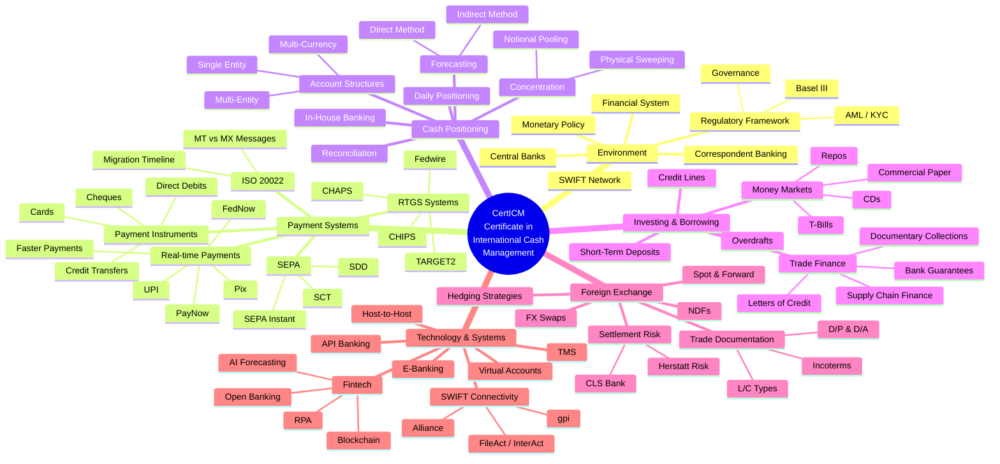

# Certificate in International Cash Management (CertICM) — Comprehensive Research

> **Author:** Research compiled for Jack Liu Shurui | **Date:** July 2026 | **Source:** ACT (Association of Corporate Treasurers), UK

---

## 1. Overview of CertICM

### What is CertICM?

The **Certificate in International Cash Management (CertICM)** is a professional qualification awarded by the **Association of Corporate Treasurers (ACT)**, the chartered professional body for treasury based in the UK. Established in 1979, the ACT has been delivering internationally recognised qualifications since 1982. CertICM focuses exclusively on global cash management — covering the tools, techniques, and systems businesses use to manage cash across borders, optimise liquidity, and navigate international banking and payments.

### Purpose
- Foundation-level certification for treasury, cash management, and payments professionals
- Bridges the knowledge gap between treasury theory and practical application from both a corporate and banking perspective

### Level
- Equivalent to a **foundation degree** — first level of the full ACT qualification pathway
- **RQF Level 4** — regulated by Ofqual (Office of Qualifications and Examinations Regulation) in England
- Sits below the Diploma in Treasury (RQF Level 6) and the AMCT/MCT professional designations

### Target Audience
| Role | Relevance |
|---|---|
| Early-career treasury professionals | Core certification for entering the treasury function |
| Banking operations staff | Transaction banking, payments, and trade finance |
| Finance graduates | Entry-level pathway into corporate treasury |
| AP/AR professionals | Moving from operational finance into treasury |
| Fintech professionals | Payments, liquidity, and banking infrastructure |
| Consultants | Treasury advisory and cash management consulting |

### Global Recognition
- **UK:** Home market; widely recognised across banking and corporate sectors
- **Europe:** Strong in EU financial centres (London, Frankfurt, Paris, Amsterdam)
- **Middle East:** Popular in GCC countries where international treasury ops are concentrated
- **Asia:** Growing in Singapore, Hong Kong, China, and India
- **Africa:** South African market has historically had strong uptake

### Accreditation
- **Regulated by Ofqual** at **Level 4 on the RQF**
- **ACT** is the chartered professional body for treasury — the only UK body with a Royal Charter in treasury

### Qualification Pathway
```
CertICM (RQF Level 4) → Diploma in Treasury (RQF Level 6) → AMCT → MCT (Chartered Treasurer)
```

---

## 2. Exam Details

| Attribute | Detail |
|---|---|
| **Exam format** | Single computer-based exam, 100 multiple-choice questions |
| **Duration** | 2 hours (120 minutes) |
| **Passing mark** | Typically **70%** (70/100) |
| **Delivery** | Pearson VUE test centres worldwide **or** online proctoring via OnVUE |
| **Recommended study time** | 80–120 hours |
| **Validity** | No expiry — certificate is yours once earned |
| **Prerequisites** | None — open to anyone |
| **Cost (exam fee)** | ~£400–500 (ACT member pricing varies) |
| **Cost (full package)** | ~£2,760 (online materials + hard copy manual + e-learning + practice tests), plus assessment fee and student membership (~£139/year) |
| **Preparation materials** | Official study guide, e-learning modules, recorded webinars, progress tests, practice questions, past exam papers |
| **Syllabus updates** | Reviewed annually; **last major update: June 2026 (Edition 7)** |
| **Study duration** | 6–12 months alongside full-time employment |
| **Designatory letters** | Eligible to use **CertICM** after passing |

### June 2026 Update (Edition 7) Changes
- Reduced duplication and consolidated overlapping topics
- Strengthened governance and debt content
- Expanded **technology, automation, digital controls**, and **strategic treasury application**
- Updated references for ISO 20022 migration and real-time payment systems

---

## 3. Syllabus Breakdown (Key Topics)

The CertICM syllabus is organised into **six study units**:

### 3.1 The International Cash Management Environment
- Role of cash and treasury management in organisations
- Global financial system participants (central banks, commercial banks, non-bank financial institutions)
- Central banks and monetary policy (interest rates, reserve requirements, open market operations)
- Correspondent banking and the SWIFT network
- Regulatory: Basel III, AML, KYC
- Ethics and governance in treasury operations

### 3.2 Payment Systems and Instruments
- Payment instruments: cheques, credit transfers, direct debits, debit/credit cards, prepaid cards, e-money
- Domestic vs cross-border payments
- **SEPA:** SCT, SDD, SEPA Instant (36 countries)
- High-value payment systems: SWIFT, CHAPS (UK), Fedwire/FedNow (US), CHIPS, TARGET2 (Eurozone)
- Real-time payments: Faster Payments (UK), UPI (India), PayNow (Singapore), Pix (Brazil), TIPS (Europe)
- **ISO 20022** universal messaging standard — migration timeline
- SWIFT MT (legacy) vs MX (modern) message types

### 3.3 Cash Positioning and Forecasting
- Cash concentration: **physical sweeping** (zero-balancing, target-balancing), **cash pooling**, **notional pooling**
- Bank account structures: single entity, multi-entity, multi-currency
- Cash flow forecasting: **direct method** (itemised) vs **indirect method** (P&L-based)
- Short-term cash positioning (daily liquidity management)
- Bank reconciliation (SWIFT MT940/942)
- In-house banking / payment factories

### 3.4 Short-Term Investing and Borrowing
- Money market instruments: T-Bills, Commercial Paper (CP), Euro-Commercial Paper (ECP), Certificates of Deposit (CDs), repos
- Short-term investment policy: credit quality, liquidity, maturity, diversification
- Overnight and term deposits, overdrafts, short-term loans
- Committed and uncommitted credit lines
- Trade finance: Letters of Credit (L/C), bank guarantees, documentary collections, supply chain finance

### 3.5 Foreign Exchange and International Trade
- FX market basics: **Spot** (T+2), **Forward** (fixed/option-dated), **FX Swap**, **NDF** (restricted currencies)
- Exchange rate risk and hedging strategies
- **Herstatt risk** (FX settlement risk, named after Bankhaus Herstatt, 1974)
- **CLS Bank** — Continuous Linked Settlement, mitigates settlement risk across 18 major currencies
- Documentary credits: revocable, irrevocable, confirmed, unconfirmed, standby
- Documentary collections: D/P, D/A
- **Incoterms 2020** (EXW, FOB, CIF, DAP, etc.)
- Bank guarantees and standby letters of credit (SBLC)

### 3.6 Technology and Systems
- Treasury Management Systems (TMS): core modules, integration, vendor landscape
- Electronic banking (e-banking) platforms
- SWIFT connectivity: Alliance, FileAct/InterAct, SWIFT gpi (Global Payments Innovation)
- Host-to-host connectivity (direct ERP-to-bank integration)
- API-based banking: Open Banking, PSD2, real-time data
- **Virtual accounts** — multi-beneficiary cash in a single physical account
- Fintech: blockchain/DLT in trade finance, AI in cash forecasting, RPA in treasury
- Electronic Bank Account Management (EBAM)

---

## 4. Mermaid Mindmap



---

## 5. Study Notes — Structured Key Content

### 5.1 Key Concepts

#### Cash Management vs Treasury Management
| **Cash Management** | **Treasury Management** |
|---|---|
| Short-term focus (daily/weekly) | Strategic, medium-to-long-term focus |
| Payment execution, collections, liquidity positioning | Capital structure, funding, risk management |
| Bank account management, reconciliation | Investment policy, hedging, corporate finance |
| Operational — "keeping the lights on" | Strategic — "optimising the balance sheet" |

#### The Cash Conversion Cycle (CCC)
```
CCC = DIO + DSO − DPO
```
- **DIO** = Days Inventory Outstanding (Avg Inventory / COGS × Days)
- **DSO** = Days Sales Outstanding (Avg AR / Credit Sales × Days)
- **DPO** = Days Payable Outstanding (Avg AP / COGS × Days)
- **Goal:** Minimise the CCC for healthier liquidity

#### Notional Pooling vs Physical Sweeping
| Feature | Notional Pooling | Physical Sweeping |
|---|---|---|
| Movement of funds | No physical transfer | Actual cash movement |
| Interest optimisation | Net balances notionally calculated | Balances physically consolidated |
| Legal structure | More complex (multi-entity) | Simpler (single entity) |
| Cross-border | Limited by tax/regulatory | More achievable |
| Withholding tax | Potential issue | Generally avoided |

#### IBAN, BIC, Routing Numbers
- **IBAN:** Up to 34 alphanumeric characters (country code + check digits + bank ID + account number), used in Europe/SEPA
- **BIC / SWIFT code (ISO 9362):** 8 or 11 characters: `AAAA BB CC DDD` (Bank, Country, Location, Branch)
- **Routing:** US ABA (9 digits), UK sort code (6 digits), Canadian transit number

#### Value Dating and Float
- **Value dating:** Date funds become available for use or start earning interest
- **Float:** Time gap between payment initiation and final settlement
- Types: Collections float, disbursement float, processing float, clearing float, availability float

#### Settlement Timing
| Type | Timing | Examples |
|---|---|---|
| **Same-day** | Transaction date | Domestic RTGS, Faster Payments |
| **Next-day (T+1)** | Next business day | ACH, domestic clearing |
| **T+2** | Two business days | Standard FX spot |
| **Real-time / Instant** | Within seconds, 24/7 | FedNow, UPI, PayNow, SEPA Instant |

---

### 5.2 Important Acronyms (Exam-Critical)

#### Payment & Messaging Systems
| Acronym | Full Name | Key Fact |
|---|---|---|
| **SWIFT** | Society for Worldwide Interbank Financial Telecommunication | Founded 1973, Belgium, 11,000+ members |
| **CHAPS** | Clearing House Automated Payment System | UK RTGS, £500B+ daily |
| **CHIPS** | Clearing House Interbank Payments System | US private-sector, same-day |
| **SEPA** | Single Euro Payments Area | 36 countries |
| **TARGET2** | Trans-European Automated RTGS | Eurozone, ECB-owned |
| **Fedwire** | Federal Reserve Wire Network | US RTGS, $4T+ daily |
| **FedNow** | Federal Reserve Instant Payment System | US real-time, launched 2023 |

#### Trade Finance
| Acronym | Full Name |
|---|---|
| **L/C** | Letter of Credit |
| **B/G** | Bank Guarantee |
| **SBLC** | Standby Letter of Credit |
| **D/P** | Documents against Payment |
| **D/A** | Documents against Acceptance |

#### Technology & Systems
| Acronym | Full Name |
|---|---|
| **TMS** | Treasury Management System |
| **ERP** | Enterprise Resource Planning |
| **EBAM** | Electronic Bank Account Management |
| **gpi** | SWIFT Global Payments Innovation |
| **ISO 20022** | Universal financial messaging standard |

#### ACH & EFT
| Acronym | Full Name |
|---|---|
| **ACH** | Automated Clearing House (US) |
| **EFT** | Electronic Funds Transfer (generic) |
| **SCT** | SEPA Credit Transfer |
| **SDD** | SEPA Direct Debit |

#### Bank Account Types
| Term | Meaning |
|---|---|
| **NOSTRO** | "Our" account held with a correspondent bank abroad (*nostro* = "ours") |
| **VOSTRO** | A foreign bank's account held with "us" (*vostro* = "yours") |
| **LORO** | A third-party bank's account (less common) |

> **Memory aid:** *Nostro* = we own it, held by them. *Vostro* = they own it, held by us.

#### FX Market Terms
| Term | Meaning |
|---|---|
| **Spot** | FX trade settling T+2 (standard) |
| **Forward** | Future date at pre-agreed rate |
| **Swap** | Simultaneous spot + forward |
| **NDF** | Non-Deliverable Forward — cash-settled for restricted currencies |

---

### 5.3 Key Figures & Facts to Memorise

#### SWIFT
| Fact | Detail |
|---|---|
| Founded | **1973** |
| Headquarters | La Hulpe, Belgium |
| Members | **11,000+** institutions over 200+ countries |
| Message types | MT (legacy FIN) and MX (ISO 20022-based) |
| SWIFT gpi | Launched 2017 — same-day cross-border payments with tracking |
| Key milestone | Migration to ISO 20022 (MX) **mandatory from November 2025** |

#### CLS Bank (Continuous Linked Settlement)
| Fact | Detail |
|---|---|
| Established | **2002** (post-Herstatt risk) |
| Purpose | Eliminates FX settlement risk via PvP (Payment versus Payment) |
| Currencies | **18 major currencies** (USD, EUR, GBP, JPY, CHF, CAD, AUD, etc.) |
| Daily volume | ~$5T+ in FX trades settled |

#### ISO 20022
| Fact | Detail |
|---|---|
| Full name | ISO 20022 — Universal financial industry message scheme |
| Purpose | Single XML-based standard replacing multiple incompatible messaging formats |
| SWIFT migration | Complete by **November 2025** |
| Adopted by | SEPA, TARGET2, Fedwire, CHAPS, real-time payment systems |

#### SEPA
| Fact | Detail |
|---|---|
| Countries | **36** (EU 27 + EEA + Switzerland, Monaco, San Marino, UK, Andorra, Vatican City) |
| Launched | SCT 2008, SDD 2009, SEPA Instant 2017 |
| Key instruments | SCT, SDD, SEPA Instant (<10 sec settlement, 24/7/365) |
| Governance | European Payments Council (EPC) |

#### Payment System Daily Volumes
| System | Volume |
|---|---|
| **CHAPS** (UK) | £500B+ |
| **Fedwire** (US) | $4T+ |
| **TARGET2** (Eurozone) | €2T+ |
| **CHIPS** (US) | $1.5T+ |
| **UPI** (India) | ~$150B+ (fastest growing) |

#### Real-Time Payment Systems
| System | Country | Launched |
|---|---|---|
| **Faster Payments** | UK | 2008 |
| **Swish** | Sweden | 2012 |
| **UPI** | India | 2016 |
| **PayNow** | Singapore | 2017 |
| **SEPA Instant** | Europe | 2017 |
| **PromptPay** | Thailand | 2017 |
| **NPP** | Australia | 2018 |
| **FPS** | Hong Kong | 2018 |
| **Pix** | Brazil | 2020 |
| **FedNow** | US | 2023 |

---

### 5.4 Regulatory Acronyms

| Acronym | Full Name | Relevance |
|---|---|---|
| **Basel III** | Third Basel Accord | Capital adequacy, LCR, NSFR |
| **AML** | Anti-Money Laundering | Payment screening obligations |
| **KYC** | Know Your Customer | Customer due diligence |
| **PSD2** | Payment Services Directive 2 (EU) | Open banking, strong customer authentication (SCA) |
| **FATF** | Financial Action Task Force | Global AML standards |

### 5.5 Cash Management Instruments Quick Reference

| Instrument | Issuer | Risk | Tenor | Liquidity |
|---|---|---|---|---|
| T-Bills | Government | Sovereign (lowest) | <1 year | Very high |
| Commercial Paper | Corporates | Varies (rated) | 1–364 days | Moderate-high |
| Certificates of Deposit | Banks | Bank risk | 1 month–5 years | Moderate |
| Repo | Banks/Dealers | Collateralised | Overnight–short | High |
| ECP | Corporates (Euro market) | Varies | 1–364 days | Moderate |
| Overnight deposit | Banks | Bank risk | 1 day | Immediate |

### 5.6 FX Instrument Comparison

| Instrument | Purpose | Settlement | Risk |
|---|---|---|---|
| **Spot** | Immediate conversion | T+2 | Exchange rate at trade time |
| **Forward** | Hedge future exposure | Future date | Counterparty credit risk |
| **FX Swap** | Short-term liquidity | Two legs (near + far) | Low — simultaneous offset |
| **NDF** | Restricted currency hedge | Cash-settled in USD | Settlement risk in restricted mkts |

---

## 6. Career Value

### Job Roles After CertICM
| Role | Typical Employer | Description |
|---|---|---|
| Treasury Analyst | Corporate treasury | Cash positioning, forecasting, bank relations |
| Cash Management Analyst | Banks (transaction banking) | Product support, client advisory |
| Payments Specialist | Banks / Fintechs | Payment ops, scheme compliance, product mgmt |
| Trade Finance Officer | Banks | L/Cs, guarantees, supply chain finance |
| Banking Operations | Banks | Settlement, reconciliation, payments processing |
| Treasury Consultant | Consulting firms | Treasury advisory, system implementation |
| Fintech Product Manager | Fintech companies | Payments, FX, liquidity products |

### Salary Uplift
- Typical **10–20% uplift** after certification in treasury-related roles
- Entry-level: £25k–35k (UK) / SGD 40k–55k (Singapore)
- Post-CertICM (2–3 yrs exp): £35k–50k (UK) / SGD 55k–75k (Singapore)

### Progression Pathway
```
CertICM → Diploma in Treasury → AMCT (Associate Member ACT) → MCT (Member ACT — Chartered)
```

### Industries
Banking, corporate treasury (especially cross-border operations), consulting (Big 4 treasury advisory), fintech, insurance/asset management

### Singapore Context
- Singapore is a **major financial hub** with strong demand for certified treasury professionals
- Recognised by: **DBS, OCBC, UOB, Standard Chartered, HSBC, Citi, BNP Paribas**
- Relevant for Singapore's role as a **regional treasury centre** for Asia-Pacific multinationals
- **PayNow** is a syllabus case study — good local context
- Many multinationals operate **Regional Treasury Centres (RTCs)** in Singapore

---

## 7. Study Tips & Exam Strategy

### Approximate Topic Weighting
| Topic Area | Exam Weight |
|---|---|
| Payment Systems and Instruments | **~25–30%** (highest) |
| Foreign Exchange and International Trade | **~20–25%** |
| Cash Positioning and Forecasting | **~15–20%** |
| Short-Term Investing and Borrowing | **~10–15%** |
| International Cash Management Environment | **~10–15%** |
| Technology and Systems | **~10–15%** |

### Strategy
1. **Focus on high-weight areas first:** Payment systems + FX/trade finance = ~50% of the exam
2. **Memorise key numbers:** SWIFT founding year, CLS currencies, SEPA country count, settlement timings
3. **Master the acronyms:** The exam tests acronym recognition heavily
4. **Understand key differences:** Notional pooling vs sweeping, Nostro vs Vostro, MT vs MX, L/C types
5. **Practice the CCC calculation** (DIO + DSO − DPO) and basic interest calculations

### Practice & Time Management
- Take at least **3–4 full mock exams** before the real test
- **100 questions in 120 minutes** = ~72 seconds per question
- Budget: Q1–50 (0–60 min), Q51–75 (60–90 min), Q76–100 (90–110 min), Review (110–120 min)
- Use the official ACT specimen exam and progress tests

### Recommended Study Schedule (12 Weeks)
| Weeks | Focus | Hours |
|---|---|---|
| 1–2 | Environment + intro concepts | 15–20 |
| 3–4 | Payment systems (heaviest topic) | 20–25 |
| 5–6 | FX and international trade | 15–20 |
| 7–8 | Cash positioning + forecasting | 10–15 |
| 9 | Short-term investing + borrowing | 8–10 |
| 10 | Technology and systems | 8–10 |
| 11 | Mock exams + review | 10–15 |
| 12 | Final review + weak areas | 5–10 |
| **Total** | | **~90–125 hours** |

### Tips from Successful Candidates
1. Read the ACT syllabus document for exact topic weighting and learning objectives
2. Join ACT student forums for study groups
3. Create flashcards for all acronyms and key figures
4. **Mnemonics:** Nostro = Ours (we own it in Their bank) / Vostro = You own it in Our bank
5. Link concepts to real-world examples (PayNow for instant payments, UPI for mobile-first)
6. Don't over-study complex calculations — the 2021 rewrite removed notional pooling benefit, multilateral netting, and complex FX forward/swap calculations
7. Pay attention to **June 2026 updates** — technology, automation, digital controls are expanded

### Common Pitfalls
- ❌ Confusing Nostro vs Vostro
- ❌ Mixing up DSO and DPO in the CCC formula
- ❌ Forgetting SEPA includes 36 countries (not just EU)
- ❌ Confusing CHAPS (UK) with CHIPS (US)
- ❌ Thinking SWIFT settles payments (it's a messaging network, not a settlement system)
- ❌ Mixing up real-time payment system names with their countries

---

## 8. Data Sources

### Official Sources
1. **ACT (Association of Corporate Treasurers)** — [treasurers.org](https://www.treasurers.org/)
2. **ACT Learning — CertICM** — [learning.treasurers.org/qualifications/certificate-international-cash-management](https://learning.treasurers.org/qualifications/certificate-international-cash-management)
3. **ACT CertICM Syllabus 2026 (Edition 7)** — [learning.treasurers.org/Academyfiles/ACT_Syllabus-CertICM-2026.pdf](https://learning.treasurers.org/Academyfiles/ACT_Syllabus-CertICM-2026.pdf)
4. **ACT CertICM Content Changes June 2026** — [learning.treasurers.org/Academyfiles/CertICM_content_changes-2026.pdf](https://learning.treasurers.org/Academyfiles/CertICM_content_changes-2026.pdf)
5. **ACT Fees 2025** — [learning.treasurers.org/Academyfiles/2025+Fee+sheet_0.pdf](https://learning.treasurers.org/Academyfiles/2025+Fee+sheet_0.pdf)
6. **Pearson VUE** — [pearsonvue.com](https://www.pearsonvue.com/)
7. **OnVUE Online Proctoring** — [pearsonvue.com/us/en/test-takers/onvue-online-proctoring](https://www.pearsonvue.com/us/en/test-takers/onvue-online-proctoring.html)

### Reference Materials
8. **SWIFT** — [swift.com](https://www.swift.com/)
9. **ISO 20022** — [iso20022.org](https://www.iso20022.org/)
10. **European Payments Council (SEPA)** — [europeanpaymentscouncil.eu](https://www.europeanpaymentscouncil.eu/)
11. **CLS Bank** — [cls-group.com](https://www.cls-group.com/)
12. **Incoterms 2020** — [iccwbo.org](https://iccwbo.org/resources-for-business/incoterms-rules/)

### Third-Party
13. **Treasury Certification (CertICM review)** — [treasurycertification.com](https://treasurycertification.com/certificate-international-cash-management/)
14. **Corporate Treasury 101 — ACT Qualifications** — [corporate-treasury-101.com](https://corporate-treasury-101.com/top-6-act-treasury-qualifications/)

---

> **Disclaimer:** This research document is for study purposes. Exam fees, syllabus details, and regulatory information are subject to change. Always verify current details on the official ACT website ([treasurers.org](https://www.treasurers.org/)) before making decisions about enrolment or examination booking.
