# CRM Data Warehouse Modelling: A Comprehensive Guide

> **Practical reference for designing data warehouse models for CRM systems — covering Kimball dimensional modelling, Data Vault, Inmon 3NF, and One Big Table with real-world CRM domain patterns.**

*Last updated: July 2026*

---

## 1. Overview

### What Is CRM Data Warehouse Modelling?

CRM data warehouse modelling designs structured, query-optimised schemas consolidating data from operational CRMs (Salesforce, HubSpot, Dynamics 365, Zendesk, Marketo) into a central analytical store. Unlike the transactional CRM database — normalised for fast CRUD operations — a warehouse is denormalised for aggregated, historical, cross-domain queries.

| Aspect | Transactional CRM DB | CRM Data Warehouse |
|--------|---------------------|--------------------|
| Purpose | Record transactions, daily ops | Analytics, trend analysis, reporting |
| Schema | Highly normalised (OLTP) | Denormalised or modelled (star/Data Vault) |
| History | Current state only | Full historical tracking (SCDs, snapshots) |
| Query pattern | Single-record CRUD | Aggregations, large scans, multi-table joins |
| Latency | Milliseconds | Hours to near-real-time |
| Users | Sales reps, support agents | Analysts, data scientists, BI tools |

### Common CRM Domains

- **Sales**: Opportunities, leads, pipeline, win/loss, forecasting.
- **Marketing**: Campaigns, email, attribution, lead generation, ROI.
- **Customer Service**: Tickets, SLAs, resolution times, CSAT/NPS.
- **Customer Master**: Profiles, segmentation, lifetime value, hierarchies.

### Key Modelling Approaches

| Approach | Philosophy | Strength for CRM | Weakness for CRM |
|----------|-----------|------------------|-------------------|
| **Kimball (Dimensional)** | Bottom-up star schemas | Fast queries, business-friendly, most adopted | Less flexible for rapid schema changes |
| **Inmon (3NF)** | Top-down normalised | Single source of truth | Complex, slow queries, high maintenance |
| **Data Vault 2.0** | Hub-link-satellite | Auditable, handles source changes, parallel loads | More tables, steep learning curve, needs mart layer |
| **One Big Table (OBT)** | Fully denormalised wide table | Simplest ETL, works on columnar warehouses | Large storage, hard maintenance as schema evolves |

### Typical Grain Levels

- **Customer-level**: One row per customer (aggregated lifetime metrics) — customer 360 dashboards.
- **Opportunity-level**: One row per opportunity or snapshot — pipeline analytics.
- **Interaction-level**: One row per call/email/meeting/chat — activity analysis.
- **Campaign-level**: One row per campaign or per customer-per-campaign — attribution.
- **Ticket-level**: One row per ticket or status change — service analytics.
- **Lead-level**: One row per lead or stage transition — funnel analysis.

---

## 2. Dimensional Modelling (Kimball) — Most Common Approach

Structures data into **fact tables** (measurements, events) and **dimension tables** (descriptive attributes) forming a star schema.

### 2.1 Core Fact Tables

**Fact_Opportunity** — Central sales pipeline fact table.
- **Grain**: One row per opportunity snapshot (or periodic daily/weekly snapshot for trending).
- **Measures**: Expected revenue, probability, amount, days in stage, discount, win/loss flag.
- **Degenerate dimensions**: Opportunity ID, stage name.

```sql
CREATE TABLE fact_opportunity (
  opportunity_sk   BIGINT PRIMARY KEY,
  date_sk          INT REFERENCES dim_date(date_sk),
  customer_sk      INT REFERENCES dim_customer(customer_sk),
  salesperson_sk   INT REFERENCES dim_salesperson(salesperson_sk),
  product_sk       INT REFERENCES dim_product(product_sk),
  campaign_sk      INT REFERENCES dim_campaign(campaign_sk),
  expected_revenue DECIMAL(18,2), probability DECIMAL(3,2),
  amount           DECIMAL(18,2), days_in_stage INT,
  win_flag         BOOLEAN, source_system VARCHAR(50), etl_batch_id BIGINT
);
```

**Fact_Customer_Interaction** — Every customer touchpoint across channels.
- **Grain**: One row per interaction event (call, email, meeting, chat).
- **Measures**: Duration (seconds), sentiment score, cost.
- **Considerations**: High volume (millions/day enterprise CRM). Partition by date.

```sql
CREATE TABLE fact_customer_interaction (
  interaction_sk   BIGINT PRIMARY KEY, date_sk INT REFERENCES dim_date(date_sk),
  customer_sk      INT REFERENCES dim_customer(customer_sk),
  salesperson_sk   INT REFERENCES dim_salesperson(salesperson_sk),
  activity_type_sk INT REFERENCES dim_activity_type(type_sk),
  campaign_sk      INT REFERENCES dim_campaign(campaign_sk),
  duration_seconds INT, sentiment_score DECIMAL(3,2),
  source_system VARCHAR(50), etl_batch_id BIGINT
) PARTITION BY RANGE (date_sk);
```

**Fact_Campaign_Response** — Marketing campaign results per customer.
- **Grain**: One row per customer per campaign.
- **Measures**: Responded flag, revenue attributed, cost allocation, open/click/conversion flags.
- **Key challenge**: Attribution model (first-touch, last-touch, linear, U-shaped, data-driven).

**Fact_Service_Ticket** — Support ticket activity.
- **Grain**: One row per ticket (snapshot) or per status change (lifecycle).
- **Measures**: Time to first response, resolution time, SLA breach flag, escalation count, CSAT.

```sql
CREATE TABLE fact_service_ticket (
  ticket_sk BIGINT PRIMARY KEY, ticket_id_nk VARCHAR(100) NOT NULL,
  date_sk INT REFERENCES dim_date(date_sk),
  customer_sk INT REFERENCES dim_customer(customer_sk),
  agent_sk INT REFERENCES dim_service_agent(agent_sk),
  priority_sk INT REFERENCES dim_priority(priority_sk),
  first_response_min INT, resolution_min INT,
  sla_breach_flag BOOLEAN, escalation_count INT, csat_score SMALLINT,
  source_system VARCHAR(50), etl_batch_id BIGINT
);
```

**Fact_Lead_Conversion** — Lead progression through the funnel.
- **Grain**: One row per lead or per stage change.
- **Measures**: Conversion flag, days to convert, lead score, MQL-to-SQL time.
- **Dimensions**: Customer, lead source, salesperson, campaign, date.

### 2.2 Core Dimension Tables

**Dim_Customer** — Most complex CRM dimension. Attributes change frequently; historical tracking essential.
- **Attributes**: Customer ID, company name, industry, segment, tier, geography, revenue, credit limit.
- **SCD Type 2**: Industry, segment, tier, account owner, territory, credit limit, revenue.
- **SCD Type 1**: Contact email, phone, website (history not needed).

```sql
CREATE TABLE dim_customer (
  customer_sk INT PRIMARY KEY, customer_id_nk VARCHAR(100) NOT NULL,
  company_name VARCHAR(255), industry_code VARCHAR(20),
  customer_segment VARCHAR(50), tier VARCHAR(20),
  country VARCHAR(100), region VARCHAR(100),
  annual_revenue DECIMAL(18,2), credit_limit DECIMAL(18,2),
  account_owner_sk INT, customer_status VARCHAR(20),
  parent_customer_sk INT,
  effective_date DATE NOT NULL, end_date DATE, is_current BOOLEAN DEFAULT TRUE,
  source_system VARCHAR(50), etl_batch_id BIGINT,
  UNIQUE (customer_id_nk, effective_date)
);
```

**Dim_Product** — Product catalog shared across fact tables. SKU, name, category, pricing tier, status. SCD Type 2 for category changes.

**Dim_Salesperson** — Sales org hierarchy. Employee ID, name, role, territory, manager, commission plan. SCD Type 2 for territory, role, manager.

**Dim_Date** — Standard date dimension (10-20 years pre-populated). Year, quarter, month, week, day, fiscal period, holiday flags.

**Dim_Campaign** — Marketing campaign attributes (type, channel, budget, dates, audience). Type 1 for budget corrections.

**Dim_Opportunity** — Opportunity context (type, stage, close reason, competitor).

**Dim_Lead_Source** — Source tracking (channel, campaign, referrer). Type 1 only.

**Dim_Service_Agent** — Agent attributes (team, specialisation, shift, manager).

**Dim_Activity_Type** — Interaction type lookup (call/email/meeting/chat), direction (inbound/outbound), channel.

### 2.3 Slowly Changing Dimensions (SCD)

SCD strategies are critical — CRM customer attributes change constantly.

| SCD Type | Strategy | CRM Use Cases | Pros | Cons |
|----------|----------|---------------|------|------|
| **Type 1** | Overwrite old value | Corrections (email, phone) | Simple, fewer rows | Loses history |
| **Type 2** | Add new row with dates | Industry, segment, territory, owner | Preserves history | More rows, complex joins |
| **Type 3** | Alternate reality column | "Current vs previous" territory | Simple before/after | Limited versions |
| **Type 6** | Type 1+2+3 combined | Current filter + historical tracking | Most flexible | Complex maintenance |

**CRM SCD decision matrix:**

| Column | SCD Type | Rationale |
|--------|----------|-----------|
| Customer Segment | Type 2 | Historical segment analysis |
| Account Owner | Type 2 | Commission needs historical ownership |
| Customer Email | Type 1 | Only current matters for communications |
| Industry Code | Type 2 | Reclassifications affect historical benchmarks |
| Contact Phone | Type 1 | Corrections supersede old |
| Credit Limit | Type 2 | Need limit at time of opportunity |
| Sales Territory | Type 2 | Realignments affect pipeline history |
| Customer Tier | Type 2 | Tier-based segmentation needs accuracy |
| Lead Score | Type 2 or Fact | Dimension or Fact_Lead_Conversion measure |

### 2.4 Additional Design Patterns

**Snapshot fact tables for pipeline trending:** Capture opportunities at daily/weekly intervals for trend analysis.

```sql
CREATE TABLE fact_opportunity_snapshot (
  snapshot_date_sk INT REFERENCES dim_date(date_sk),
  opportunity_id_nk VARCHAR(100),
  amount DECIMAL(18,2), probability DECIMAL(3,2),
  expected_revenue DECIMAL(18,2), days_in_stage INT,
  salesperson_sk INT, customer_sk INT,
  PRIMARY KEY (snapshot_date_sk, opportunity_id_nk)
);
```

**Bridge tables for M:N relationships:** OpportunityLineItem (Salesforce), Contact-to-Account, Customer-to-Campaign.

```sql
CREATE TABLE bridge_opportunity_product (
  opportunity_id_nk VARCHAR(100), product_sk INT,
  quantity INT, unit_price DECIMAL(18,2), line_total DECIMAL(18,2),
  PRIMARY KEY (opportunity_id_nk, product_sk)
);
```

**Conformed dimensions:** Dim_Customer, Dim_Date, Dim_Product, Dim_Salesperson shared across all fact tables, enabling cross-domain queries (Kimball Bus Architecture).

---

## 3. Data Vault Modelling — Alternative for Enterprise CRM

Data Vault 2.0 (Dan Linstedt) combines 3NF auditability with dimensional queryability. Used for multi-source enterprise CRM warehouses.

### 3.1 Core Components

**Hubs** — Business entities with only natural business keys + metadata.

```sql
CREATE TABLE hub_customer (
  customer_hashkey CHAR(32) PRIMARY KEY,  -- MD5 of natural key
  crm_customer_id  VARCHAR(100) NOT NULL,
  load_date TIMESTAMP NOT NULL, record_source VARCHAR(100) NOT NULL,
  UNIQUE (crm_customer_id)
);
```

Standard CRM hubs: Hub_Customer, Hub_Product, Hub_Opportunity, Hub_Campaign, Hub_Interaction, Hub_Ticket.

**Satellites** — Descriptive attributes tracking change over time (SCD Type 2).

```sql
CREATE TABLE sat_customer_profile (
  customer_hashkey CHAR(32) REFERENCES hub_customer(customer_hashkey),
  load_date TIMESTAMP NOT NULL, end_date TIMESTAMP, is_current BOOLEAN DEFAULT TRUE,
  company_name VARCHAR(255), industry_code VARCHAR(20),
  customer_segment VARCHAR(50), annual_revenue DECIMAL(18,2), account_tier VARCHAR(20),
  record_source VARCHAR(100),
  PRIMARY KEY (customer_hashkey, load_date)
);
```

Standard CRM satellites: Sat_Customer_Profile, Sat_Customer_Contact, Sat_Customer_Credit, Sat_Product_Details, Sat_Opportunity_Attributes, Sat_Campaign_Details, Sat_Interaction_Details, Sat_Ticket_Details.

**Links** — Relationships between hubs.

```sql
CREATE TABLE link_customer_opportunity (
  customer_opp_hashkey CHAR(32) PRIMARY KEY,
  customer_hashkey CHAR(32) NOT NULL REFERENCES hub_customer(customer_hashkey),
  opportunity_hashkey CHAR(32) NOT NULL REFERENCES hub_opportunity(opportunity_hashkey),
  load_date TIMESTAMP NOT NULL, record_source VARCHAR(100) NOT NULL,
  UNIQUE (customer_hashkey, opportunity_hashkey)
);
```

Standard CRM links: Link_Customer_Opportunity, Link_Campaign_Customer, Link_Opportunity_Product, Link_Customer_Interaction, Link_Customer_Ticket.

### 3.2 When to Choose Data Vault Over Kimball

| Factor | Choose Kimball | Choose Data Vault |
|--------|---------------|-------------------|
| Source systems | 1-2 systems | 3+ (Salesforce + Marketo + Zendesk + custom) |
| Schema change frequency | Stable, quarterly | Frequent weekly/monthly |
| Audit requirements | Basic logging | Full auditable history, regulatory compliance |
| Team | BI analysts | Dedicated data engineers |
| Time to first query | 2-6 weeks | 4-12 weeks (needs mart layer) |
| Query performance | Excellent (star) | Poor — requires mart layer |
| ETL parallelism | Sequential | Fully parallel |

### 3.3 Design Process

1. Identify hubs by extracting natural keys (Customer ID, Product SKU, Opportunity ID).
2. Identify links by mapping associations (Customer→Opportunity, Campaign→Customer).
3. Identify satellites by grouping attributes by rate of change and source system.
4. Define hash keys using consistent hashing (MD5 or SHA-256).
5. Build mart layer (star schemas from Data Vault tables) for end-user querying.

---

## 4. Inmon 3NF and One Big Table

### 4.1 Inmon 3NF (Corporate Information Factory)

Fully normalised entity-relationship model serving as single source of truth, from which departmental marts are derived. CRM example: Customer entity normalised into Customer_Address, Customer_Contact, Customer_Segment tables.
- **When appropriate**: Regulated industries, single consensus-driven model, large architecture teams.
- **Limitations**: Slow development (every field change needs schema changes across tables), 15+ join queries, poor ad-hoc performance.

### 4.2 One Big Table (OBT)

Fully denormalised single table joining all CRM data — popular on BigQuery/Snowflake.

```sql
CREATE TABLE crm_obt (
  customer_id, company_name, industry, segment, tier,
  product_name, product_category, opportunity_id, amount, probability, stage,
  campaign_name, campaign_type, interaction_date, interaction_type,
  ticket_status, priority, revenue, sentiment_score, date
);
```

- **Pros**: Simple ETL, no joins, good for ML features, columnar-friendly.
- **Cons**: Massive storage (every attribute repeated per row), hard to maintain schema, poor row-level queries, loses dimensional hierarchy, complex SCD.
- **When**: Small CRM (<50K customers), simple dashboards, ML feature extraction. Infeasible for enterprise multi-domain CRM.

---

## 5. Common Pipeline Architecture

```
Source CRMs  →  Staging (raw)  →  DWH Core (modelled)  →  Data Marts  →  BI Layer

Salesforce      staging_sf_accounts    dim_customer   fact_opportunity    mart_sales_360    Tableau
Marketo         staging_mk_campaigns   dim_campaign                       mart_campaign     Power BI
HubSpot         staging_hs_contacts    dim_date        (Kimball/DV)       mart_service      Looker
Zendesk         staging_zd_tickets                                      └──────────────    └──────
```

**1. Source Systems**: Salesforce, Dynamics 365, HubSpot, Zendesk, Marketo. Each has unique API semantics, rate limits, CDC mechanisms.

**2. Staging Layer**: Raw, immutable copies mirroring source schemas. Adds `_etl_batch_id`, `_load_timestamp`, `_source_system`, `_operation`. Uses `last_modified_date` for delta detection. Partition by source and load date.

**3. DWH Core**: Modelled layer — dimensional (facts + dimensions) or Data Vault (hubs + links + satellites). Enforces data quality, tracks SCD, resolves duplicates via MDM.

**4. Data Marts**: Business-facing star schemas — Sales_360, Customer_360, Campaign_Analytics, Service_KPI, Lead_Funnel.

**5. BI Layer**: Tableau, Power BI, Looker, Metabase, Sigma.

### Incremental Load Strategy

CRM data is high-change — opportunities updated daily, interactions created continuously.
- **Dimensions (SCD Type 2)**: Select changed rows via `last_modified_date > last_load`. For each natural key: expire current row, insert new.
- **Transaction facts**: Select new rows via `created_date > last_load`.
- **Snapshot facts**: Full replace of latest partition.
- **Accumulating snapshots**: Select rows via `last_modified_date > last_load`.

---

## 6. Slowly Changing Dimensions Deep Dive

### 6.1 Type 2 Implementation Patterns

**Effective date range (most common):**

```sql
SELECT c.customer_segment, o.amount
FROM fact_opportunity o
JOIN dim_customer c ON o.customer_sk = c.customer_sk
  AND o.date_sk BETWEEN c.effective_date AND COALESCE(c.end_date, '9999-12-31');
```

**Current flag + date range (faster current-state queries):**

```sql
-- Current state
SELECT * FROM dim_customer WHERE customer_id_nk='12345' AND is_current=TRUE;
-- Historical state at specific date
SELECT * FROM dim_customer WHERE customer_id_nk='12345'
  AND '2024-06-15' BETWEEN effective_date AND COALESCE(end_date, '9999-12-31');
```

### 6.2 Common CRM SCD Scenarios

**Segment reassignment**: Customer moves "Mid-Market"→"Enterprise". Type 2 ensures historical opportunities keep correct segment for analysis.

**Territory realignment**: APAC splits into APAC-North/South. Type 2 on Dim_Salesperson (territory) and Dim_Customer (account_owner). Commissions use territory active at close.

**Industry reclassification**: NAICS code update (Software→Cloud Services). Type 2 preserves year-over-year benchmarks.

**Email correction**: Incorrect email fixed. Type 1 overwrite. Separate audit table if compliance requires history.

**Duplicate merge**: Two records represent same company. MDM mapping + Type 2 flag for merged-out records. Add `merged_to_customer_id_nk` column.

### 6.3 Performance Considerations

- Partition Dim_Customer by `effective_date`.
- Bitmap index on `is_current` for fast lookups.
- Covering indexes on `(customer_id_nk, is_current, customer_segment)`.
- Typical Dim_Customer < 10M rows even for large enterprises.
- Retention: 7-year SCD history, purge older.

---

## 7. Common CRM Metrics and Their Modelling

| Metric | Fact Table | Measures / Calculation | Dimensions |
|--------|-----------|----------------------|------------|
| **Win Rate** | Fact_Opportunity | COUNT(win_flag)/COUNT(total)*100 | Salesperson, Product, Region, Period |
| **Pipeline Value** | Fact_Opportunity | SUM(amount * probability) | Salesperson, Stage, Product |
| **Avg Deal Size** | Fact_Opportunity | AVG(amount) WHERE win_flag | Product, Region, Campaign |
| **Time to Close** | Fact_Opportunity | AVG(days_in_stage) WHERE win_flag | Salesperson, Product, Stage |
| **Lead Conversion Rate** | Fact_Lead_Conversion | COUNT(converted_flag)/COUNT(*)*100 | Lead Source, Campaign |
| **Time to Convert** | Fact_Lead_Conversion | AVG(days_to_convert) WHERE converted_flag | Lead Source, Campaign |
| **CLV** | Fact_Opportunity agg | SUM(amount) per customer WHERE win_flag | Segment, Channel, Cohort |
| **Campaign ROI** | Fact_Campaign_Response | (SUM(revenue)-SUM(cost))/SUM(cost)*100 | Campaign, Channel |
| **First Response Time** | Fact_Service_Ticket | AVG(first_response_min)/60 | Agent, Team, Priority |
| **Resolution Time** | Fact_Service_Ticket | AVG(resolution_min)/60 | Agent, Team, Product |
| **SLA Compliance** | Fact_Service_Ticket | COUNT(sla_breach_flag=FALSE)/COUNT(*)*100 | Team, Priority |
| **CSAT / NPS** | Fact_Service_Ticket | AVG(csat_score) | Agent, Product, Segment |
| **Escalation Rate** | Fact_Service_Ticket | COUNT(escalation_count>0)/COUNT(*)*100 | Team, Product |
| **Interaction Volume** | Fact_Customer_Interaction | COUNT(*) | Channel, Type, Period |
| **Attribution Share** | Fact_Campaign_Response | SUM(revenue_attributed)/total_revenue*100 | Campaign, Channel |

---

## 8. Source System Mapping

### Salesforce → DWH

| Salesforce Object | DWH Table | Notes |
|------------------|-----------|-------|
| Account | Dim_Customer | B2B company |
| Contact | Dim_Contact / Dim_Customer role-play | Individual at account; bridge for M:N |
| Opportunity | Fact_Opportunity + Dim_Opportunity | Core pipeline |
| OpportunityLineItem | Bridge_Opportunity_Product | M:N product-opportunity |
| Lead | Fact_Lead_Conversion | Lead progression |
| Campaign | Dim_Campaign | Marketing attributes |
| CampaignMember | Fact_Campaign_Response | Per-customer response |
| Case | Fact_Service_Ticket | Support facts |
| Task / Event | Fact_Customer_Interaction | Calls, emails, meetings |
| User | Dim_Salesperson / Dim_Employee | Internal staff |
| Product2 | Dim_Product | Product catalog |
| PricebookEntry | Dim_Pricebook | Conformed pricing |
| EmailMessage | Fact_Customer_Interaction | Email interactions |
| Contract | Fact_Contract | Subscription tracking |

### HubSpot → DWH

| HubSpot Object | DWH Table | Notes |
|---------------|-----------|-------|
| Contact | Dim_Customer | Contact-centric CRM |
| Company | Dim_Customer (hierarchy) | B2B data |
| Deal | Fact_Opportunity + Dim_Opportunity | Sales pipeline |
| LineItem | Bridge_Opportunity_Product | Deal products |
| Product | Dim_Product | Product catalog |
| Campaign | Dim_Campaign | Marketing |
| EmailEvent | Fact_Customer_Interaction | Send/open/click |
| Ticket | Fact_Service_Ticket | Service |
| FeedbackSubmission | Fact_Customer_Survey | NPS/CSAT |

### Multi-System MDM

Integrating Salesforce + Marketo + HubSpot + Zendesk:
1. Extract identifiers: CRM ID, email, domain, DUNS, company name.
2. Build matching: Deterministic (exact email) + probabilistic (fuzzy name+domain).
3. Create golden customer ID mapping all source system IDs.
4. Store in Dim_Customer: `golden_customer_id`, `sf_account_id`, `hs_contact_id`, `mk_lead_id`, `zd_org_id`.

---

## 9. Best Practices & Common Pitfalls

### Do

✅ **Use conformed dimensions across all CRM marts.** Same Dim_Customer, Dim_Date, Dim_Product shared across Sales_360 and Service_KPI.

✅ **Track SCD Type 2 for attributes used in historical reporting or commissions.** Pipeline-by-segment analysis across quarters requires Type 2.

✅ **Include source system metadata on every row.** `source_system`, `etl_batch_id`, and `last_modified_date` for lineage debugging.

✅ **Model interactions as fact tables with degenerate dimensions** (activity type as FK, not a dimension column with values like 'call'/'email').

✅ **Use snapshot fact tables for pipeline trending.** Weekly/daily snapshots enable trend analysis without complex stage-change tracking.

✅ **Build an MDM layer for customer identity.** Expect 5-15% duplicate contacts in CRM. Golden customer ID prevents double-counting.

✅ **Design for incremental loads from day one.** Use `last_modified_date` for delta extraction.

✅ **Document data lineage for every metric.** Source tables, transformations, business rules. Without this, metrics lose trust.

✅ **Use surrogate keys (INT/BIGINT) but preserve natural keys** as business identifiers.

✅ **Partition fact tables by date** for pruning, archival, and faster reloads.

### Don't

❌ **Don't use OBT for production CRM analytics.** Customer→Opportunity→Interaction→Campaign joins produce billions of rows. OBT is for small-scale or ML features only.

❌ **Don't use CRM native IDs as warehouse primary keys.** IDs change during migrations, org merges, data cleanses. Use surrogate keys.

❌ **Don't hard-delete soft-deleted records.** Flag with `is_deleted=TRUE` and `deleted_date`. Hard deletes destroy historical accuracy.

❌ **Don't ignore temporal dimensions.** Every fact must answer "when was this true?" Without timestamps, trend analysis is impossible.

❌ **Don't put high-cardinality text (notes, email bodies, transcripts) in dimension columns.** Store separately (text store, search index, low-grain fact table).

❌ **Don't assume CRM data is clean.** Validate aggressively in staging — free-text, inconsistent picklists, missing fields, duplicates.

❌ **Don't overlook API rate limits.** Salesforce (15K-1M/day), HubSpot (10K-100K/10s), Marketo (50K-100K/day). Use bulk APIs, implement retry logic.

❌ **Don't skip business validation.** CRM allows close_date<created_date, probability>100%, zero-amount closed-won. Flag violations.

---

## 10. ETL/ELT Considerations

### Incremental vs Full Load

| Table Type | Strategy | Rationale |
|-----------|----------|-----------|
| Small dims (<10K rows) | Full refresh daily | Simple, low cost |
| Large dims (Customer, Product) | Incremental via last_modified + SCD merge | Minimise window |
| Transaction facts | Incremental via last_modified/created_date | High volume |
| Snapshot facts | Insert-only, partition-refresh | Fast partition ops |
| Accumulating snapshots | Incremental via last_modified | Status changes only |

### De-duplication Pipeline

- **Within-system**: Capture CRM's `is_merged`, `merged_to_id`.
- **Cross-system (MDM)**: Deterministic + probabilistic matching. Survivorship rules per attribute. Continuous, not one-time.

### Data Quality Validation

| Rule | Example | Action |
|------|---------|--------|
| Not null | `customer_id_nk NOT NULL` | Reject, log error |
| Date consistency | `close_date >= created_date` | Flag, set invalid flag |
| Value range | `probability BETWEEN 0 AND 1` | Clip, warn |
| Reference integrity | FK exists in dimension | Insert unknown member |
| Duplicate detection | Same key in batch | Merge/reject by last_modified |

### Soft Deletes

```sql
ALTER TABLE fact_opportunity ADD COLUMN is_deleted BOOLEAN DEFAULT FALSE;
ALTER TABLE fact_opportunity ADD COLUMN deleted_date TIMESTAMP;
CREATE VIEW v_fact_opportunity_active AS SELECT * FROM fact_opportunity WHERE NOT is_deleted;
```

### API Rate Limit Management

| Platform | Typical Limit | Strategy |
|----------|---------------|----------|
| Salesforce | 15K-1M/24h per org | Bulk API 2.0, schedule off-peak, monitor headers |
| HubSpot | 10K-100K/10s per app | Batch endpoints, exponential backoff |
| Marketo | 50K-100K/day REST | Bulk Extract API for large tables |
| Zendesk | 700/10s per account | Incremental export, pagination |
| Dynamics 365 | 5K-20K/5 min | Batch operations, distributed principals |

---

## 11. Example Data Model Diagram

```mermaid
erDiagram
    Dim_Customer ||--o{ Fact_Opportunity : "owns"
    Dim_Customer ||--o{ Fact_Campaign_Response : "responds to"
    Dim_Customer ||--o{ Fact_Customer_Interaction : "participates in"
    Dim_Customer ||--o{ Fact_Service_Ticket : "submits"
    Dim_Customer ||--o{ Fact_Lead_Conversion : "converts from"
    Dim_Salesperson ||--o{ Fact_Opportunity : "manages"
    Dim_Salesperson ||--o{ Fact_Customer_Interaction : "performs"
    Dim_Product ||--o{ Fact_Opportunity : "sold as"
    Dim_Product ||--o{ Fact_Service_Ticket : "reported for"
    Dim_Campaign ||--o{ Fact_Campaign_Response : "measures"
    Dim_Campaign ||--o{ Fact_Opportunity : "influenced"
    Dim_Date ||--o{ Fact_Opportunity : "occurs on"
    Dim_Date ||--o{ Fact_Campaign_Response : "occurs on"
    Dim_Date ||--o{ Fact_Customer_Interaction : "occurs on"
    Dim_Date ||--o{ Fact_Service_Ticket : "submitted on"
    Dim_Date ||--o{ Fact_Lead_Conversion : "tracks"
    Dim_Opportunity ||--|| Fact_Opportunity : "describes"
    Dim_Lead_Source ||--o{ Fact_Lead_Conversion : "originates from"
    Dim_Activity_Type ||--o{ Fact_Customer_Interaction : "classifies"
    Dim_Service_Agent ||--o{ Fact_Service_Ticket : "assigned to"
```



### Physical Model Size Estimates

| Table | Type | Rows | Partition | Retention |
|-------|------|------|-----------|-----------|
| dim_customer | Dim | 10K-5M | heap | Indefinite |
| dim_product | Dim | 100-500K | heap | Indefinite |
| dim_salesperson | Dim | 100-50K | heap | Indefinite |
| dim_date | Dim | 7,300-14,600 | heap | Indefinite |
| fact_opportunity | Fact | 100K-50M | monthly | 7 years |
| fact_opportunity_snapshot | Snap | 10M-1B | monthly | 7 years |
| fact_customer_interaction | Fact | 1M-500M | monthly | 2y raw, 7y agg |
| fact_campaign_response | Fact | 100K-50M | monthly | 7 years |
| fact_service_ticket | Fact | 100K-10M | quarterly | 7 years |
| fact_lead_conversion | Fact | 100K-10M | monthly | 5 years |

---

## 12. Approach Comparison Matrix

| Criterion | Kimball | Inmon 3NF | Data Vault 2.0 | OBT |
|-----------|---------|-----------|----------------|-----|
| Best for | BI reporting | Enterprise canonical | Multi-source audit | ML, small CRM |
| Time to first report | 2-6 wks | 3-12 mo | 4-12 wks | 1-2 wks |
| Query performance | Excellent | Poor (15+ joins) | Poor (needs mart) | Good |
| Storage efficiency | Good | Excellent | Moderate | Poor |
| Handles source changes | Moderate | Poor | Excellent | Poor |
| Audit / lineage | Basic | Moderate | Excellent | Poor |
| Parallel loading | Sequential | Sequential | Fully parallel | Simple |
| SCD tracking | First-class | In satellites | First-class | Manual |
| User-friendliness | High | Low | Medium | High |
| Maintenance cost | Medium | High | Medium-High | Low→High |
| Tool ecosystem | Mature | Mature (RDBMS) | Growing (dbt) | Simple SQL |

---

## 13. Data Sources & Further Reading

- **Kimball, R. & Ross, M. (2013).** *The Data Warehouse Toolkit, 3rd Edition.* Wiley. — Chapters 5 and 9 on CRM modelling.
- **Linstedt, D. & Olschimke, M. (2015).** *Building a Scalable Data Warehouse with Data Vault 2.0.* Morgan Kaufmann.
- **Inmon, W. H. (2005).** *Building the Data Warehouse, 4th Edition.* Wiley.
- **Salesforce (2026).** *Salesforce Data Model.* https://developer.salesforce.com/docs
- **HubSpot (2026).** *HubSpot CRM API Reference.* https://developers.hubspot.com
- **Microsoft (2026).** *Dynamics 365 Entity Reference.* https://learn.microsoft.com/en-us/dynamics365
- **Kimball Group (2026).** *Dimensional Modeling Techniques.* https://www.kimballgroup.com
- **Fivetran (2022).** *Star Schema vs. OBT.* https://www.fivetran.com/blog/star-schema-vs-obt
- **dbt Labs (2026).** *Data Modeling in dbt.* https://docs.getdbt.com/docs/build/data-modeling

---

*This guide synthesises the Kimball Group methodology, Data Vault 2.0 standards, CRM platform documentation, and industry best practices from real-world CRM data warehouse implementations. Last updated July 2026.*
