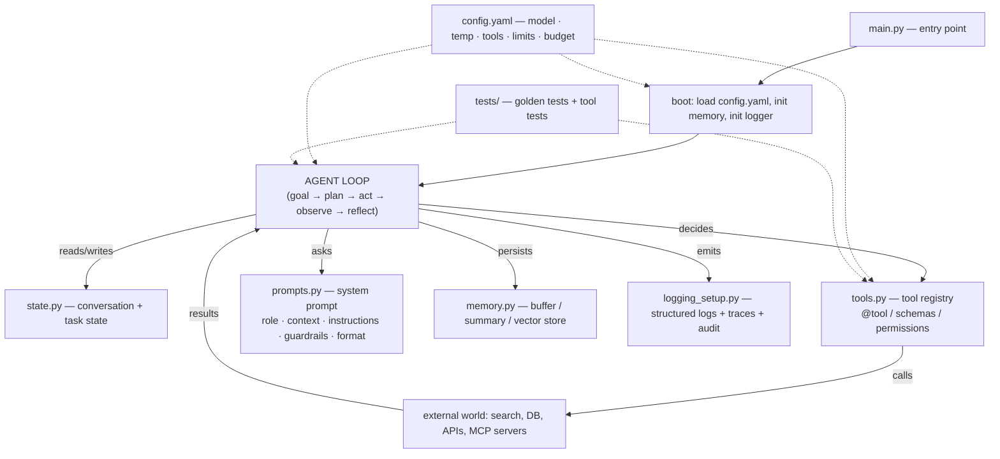

# Agent Scaffolds & Agent Scaffolding

> **A Comprehensive Guide to the Skeleton/Structure Layer for Building AI Agents — the Code Scaffold, the Prompt Scaffold, the Tool Scaffold, the Scaffold Anatomy, Known Scaffold Projects, Design Principles, Scaffold Components, Enterprise & Banking Scaffolding, and a Worked Scaffold Example**

**Author:** Jack Liu Shurui
**Series:** LLM/AI Advanced Topics — *Agents Series (Foundation Layer)*
**Domain:** AI Engineering · Agent Architecture · Enterprise AI
**Reading time:** ~55 minutes
**Version:** 1.0 — August 2026

---

## Table of Contents

1. [The Concept — What Agent Scaffolding Is](#1-the-concept--what-agent-scaffolding-is)
2. [The Scaffold Anatomy — the Standard Agent Project Structure](#2-the-scaffold-anatomy--the-standard-agent-project-structure)
3. [Known Scaffold Projects & Approaches](#3-known-scaffold-projects--approaches)
4. [Design Principles](#4-design-principles)
5. [Scaffold Components in Depth](#5-scaffold-components-in-depth)
6. [Enterprise & Banking Scaffolding](#6-enterprise--banking-scaffolding)
7. [Worked Example: A Research Agent Scaffold](#7-worked-example-a-research-agent-scaffold)
8. [The Future: Scaffolding Trends 2026+](#8-the-future-scaffolding-trends-2026)
9. [Glossary](#9-glossary)
10. [References & Further Reading](#10-references--further-reading)

---

## 1. The Concept — What Agent Scaffolding Is

### 1.1 The Scaffold: the Skeleton You Build an Agent On

Every serious agent project starts the same way a building does: not with the facade, but with the **structure**. In construction, the *scaffold* is the temporary-but-structural frame that lets workers reach every part of the building safely while it is being erected. In agent engineering, the **agent scaffold** is the same idea applied to software: the **skeleton structure — the project layout, the agent loop, the tool-registration pattern, the system-prompt architecture, the configuration, the memory layer, and the logging — on which a working agent is built**.

The defining property of a scaffold is that it is **opinionated and structural before it is clever**. It decides the questions that would otherwise paralyze a new project: *Where does the code live? Where do the tools live? Where do the prompts live? What is the entry point? What does the loop look like? What are the defaults?* A scaffold answers these once, so the team can spend its energy on the agent's actual behavior — the tools, the prompts, the domain logic — rather than on re-litigating project structure on every greenfield project.

A scaffold is *not* the finished agent. It is the **starting skeleton that already runs**: it has a working loop, a working tool registry, a sensible system prompt, wired-up configuration, and tests — all doing nothing particularly impressive yet, but all *present, connected, and correct*. From that skeleton, three kinds of scaffolding are layered:

- **Code scaffold** — the project structure, entry points, tool modules, config loader, test harness. *Fixes: where things live; how the program starts and stops.*
- **Prompt scaffold** — the system-prompt architecture: role, context, instructions, guardrails, output format. *Fixes: how the model is told who it is and what to do.*
- **Tool scaffold** — the tool-registration pattern: `@tool` decorators, schemas, descriptions, permissions. *Fixes: how the agent gains capabilities safely and discoverably.*

These three layers are the recurring theme of this guide, and they map directly onto the three artifacts every agent project must produce: **code** (the loop and modules), **prompts** (the model-facing instructions), and **tools** (the model's interface to the world).

### 1.2 The Construction Metaphor: Scaffold-First, Refine-Later

The construction metaphor is worth keeping, because it encodes the right *attitude* toward scaffolding:

- **Scaffolding is temporary but structural.** You expect to modify it as the building goes up — but you cannot build without it. A scaffold is not throwaway prototyping junk; it is load-bearing during construction. An agent scaffold is likewise expected to evolve (see §4.7) but it is not disposable: the loop, the config wiring, and the logging survive into production.
- **Scaffold-first, refine-later.** You put up the frame, *then* refine the details. The agent version: stand up the skeleton — loop + one toy tool + a minimal prompt + config + a golden test — get it running end-to-end, *then* add the real tools, the rich prompts, and the guardrails. This is the opposite of "write the perfect tool first, wire it up later," which produces agents that never run end-to-end until the last day.
- **The scaffold carries the safety equipment.** On a construction site, the scaffold is also where the guardrails and safety nets are mounted. In an agent, the scaffold is where the **guardrails** live: input validation, tool-permission checks, output checks, and audit logging are structural, built-in features of a good scaffold — not afterthoughts ([implementing-responsible-ai.md](implementing-responsible-ai.md), §6).

The metaphor also explains the *limitation*: scaffolding is not the building. Over-investing in scaffold structure while the agent's actual behavior stays thin is the classic **over-scaffolding** anti-pattern (§4.8) — an elaborate frame around an empty lot.

### 1.3 Scaffold vs Framework vs Template

The single most common source of confusion in this space is the boundary between three terms. They are related but distinct, and getting the distinction right changes how you evaluate tooling:

| Term | Definition | Example | Analogy |
|---|---|---|---|
| **Scaffold** | The **opinionated starter codebase** — the structure of *your* project: layout, loop, tool registration, prompt assembly, config, tests. It is code *you own and modify*. | The `research_agent/` project in §7 | The steel frame erected on *your* site |
| **Framework** | The **runtime** — the engine that executes the agent: the loop implementation, state management, tool-calling plumbing, lifecycle hooks. You *run inside* it; you do not own its core. | LangGraph, AutoGen, the OpenAI Agents SDK, smolagents | The crane and machinery that lift the steel |
| **Template** | The **copyable starting point** — usually a framework's scaffold, packaged for reuse. A template is a *distribution vehicle* for a scaffold. | LangGraph's starter templates, CrewAI's starter template, Vercel's AI templates, `create-react-app` | A pre-fabricated kit of frame parts |

The relationships: **a scaffold is often built *on* a framework** (you scaffold a project using LangGraph; the scaffold contains the LangGraph wiring), and **a template is a scaffold you can copy**. The framework is the only one of the three that is *runtime* rather than *structure*: it executes the loop, while the scaffold is the structure around that execution. The framework landscape itself — LangGraph, AutoGen, and friends — is covered in depth in [autonomous_agents_guide.md](autonomous_agents_guide.md) §7 (Frameworks & Ecosystem), [llm_frameworks_comparison_guide.md](llm_frameworks_comparison_guide.md), and [china_ai_agent_frameworks.md](china_ai_agent_frameworks.md); this guide is about the scaffold layer — the structure — and only touches frameworks where their *templates* are the scaffold of choice (§3).

> **A scaffold and a framework are complements, not rivals.** A framework gives you the loop as a library; a scaffold gives you the project as a structure. The best agents use both: a scaffold that standardizes *your* project's layout and conventions, running on a framework that provides the *runtime*.

### 1.4 Why Scaffold? The Benefits

Scaffolding is a productivity and governance technique as much as an engineering one. The benefits that motivate it:

1. **Speed — start from the structure.** A team that clones a scaffold has a *running agent in minutes*: loop wired, config loaded, one tool registered, one golden test passing. The first working end-to-end run — the single biggest milestone in any agent project — happens on day one instead of day ten.
2. **Consistency — team standards by construction.** When every agent is built on the same scaffold, the structure is uniform by *construction*, not *convention*: same layout, same config schema, same logging format, same test harness. Review is cheaper, rotation is easier, and support tooling is written once — the organizational payoff that matters most in enterprises (§6).
3. **Testability.** The scaffold ships a test harness and golden tests from day one (§4.4). Because the loop and tool registry are structural, every agent built on it inherits the ability to be tested — agent tests are *added*, not *invented*.
4. **Guardrails built-in.** Validation, permission checks, logging, and audit hooks are part of the skeleton, so no agent is built *without* them. Safety becomes the default path rather than a retrofit ([implementing-responsible-ai.md](implementing-responsible-ai.md); [autonomous_agents_guide.md](autonomous_agents_guide.md) §5).
5. **Onboarding & knowledge transfer.** A new engineer reads one README and understands where everything goes. The scaffold is the project's *documentation made executable* — the architecture is in the directory tree, not in a deck.

### 1.5 History: Web-Dev Heritage and the 2025 Agent-Community Usage

The word "scaffold" in software engineering is old, and the agent community's 2025 usage is a direct inheritance:

**The web-dev heritage.** "Scaffolding" entered mainstream developer vocabulary with the **Rails scaffold generator** (`rails generate scaffold`) in the mid-2000s: one command produced a working CRUD application — model, controller, views, migration, tests — that the developer then refined. The same pattern was popularized across the ecosystem: **Yeoman** (generators for any stack), **`create-react-app`** (2016 — one command, a working React app with build tooling, testing, and a dev server), **Angular CLI** (`ng generate`), **`django-admin startapp`**, **Cookiecutter** (project templates from git repos), and the modern **`npx create-*`** family (Vite, Next.js, and — in the agent world — `npx create-ai-app`, `crewai create crew`, `npx create-cloudflare --template cloudflare/agents-starter`). In all of these, the *scaffold* is the generated skeleton: working, opinionated, and meant to be modified. Agent scaffolding is this tradition, applied to agent projects.

**The agent-community usage (2025–2026).** By 2025 the term had crossed over into the agent world with a specific flavor: **"scaffolding" = the structure and wrapper code around the model — the loop, the tools, the prompts, the orchestration — as opposed to the model itself.** Verified usages:

- A widely-cited LinkedIn piece, *"Harness, Scaffold, and the AI Agent Terms Worth Getting Right"*, draws the now-common distinction: **scaffolding is "what the model works from: its instructions, its tools, its format,"** while the harness is "the execution layer inside the agent: it calls the model, handles its tool calls, decides when to stop." (Usage is not fully settled — see §1.6.)
- The safety-research community used the term first: METR's preliminary evaluation of OpenAI's o1-preview (2024) called its test harness "the scaffolding for the agents," with an advisor model generating advice and actions. Benchmark discourse followed: in the 2025 SWE-bench "contamination wars," score swings of 12+ points were attributed to "agent scaffolding" — the wrapper's prompts, tooling, and loop — i.e., the *scaffold*, not the *model*, was doing much of the work.
- Academic work formalized it: *"The Scaffolding Matters More Than the Interface: A Controlled Comparison of MCP and CLI Tool Use Across Seven Agent Scaffoldings"* (arXiv:2608.08654, 2026) treats an **agent scaffolding** as a concrete, comparable artifact — the full wrapper (loop + tools + prompts) — and finds the wrapper's quality matters more than the tool interface. MindStudio's gloss captures the mainstream definition: *"Agent scaffolding (also called an agent harness) is the code that controls how an AI model executes a task. It manages the loop of reasoning → tool call → result processing, handles errors, routes information between steps, and determines when the task is done."*
- The ecosystem adopted the label: GitHub hosts an `agent-scaffolding` topic, open-source projects self-describe as scaffolds (e.g., **thepopebot**, a "git-native autonomous AI agent scaffolding" running agents 24/7 via GitHub Actions + Docker), and OpenAI's *harness engineering* post (Feb 2026) describes its repo's "initial scaffold — repository structure, CI configuration, formatting rules, package manager setup, and application framework — generated by Codex CLI using GPT-5, guided by a small set of existing templates" (see §3.1).

**Honest verification note:** the term's *meaning* is stable (structure/wrapper around the model), but its *boundary* with "harness" is contested, and no single canonical definition has won. Where sources disagree, this guide uses: **scaffold = the structure of the project (code + prompts + tools + config), harness = the execution engine that runs the model loop.** Many practitioners use them interchangeably; flagging the ambiguity is part of the architect's job.

### 1.6 The Scope of This Guide

This guide is the **foundation layer of the agents series** — it covers the *skeleton*: the concept (§1), the anatomy of a scaffold (§2), the known scaffolds and approaches in the wild (§3), the design principles (§4), the components in depth (§5), enterprise and banking scaffolding (§6), a full worked example (§7), and the 2026+ trends (§8). The companions it deliberately does **not** duplicate:

- The loop, architectures (ReAct, plan-and-execute), design patterns, control, evaluation, frameworks, and banking adoption: [autonomous_agents_guide.md](autonomous_agents_guide.md)
- Tool standardization via MCP (the *protocol* layer under the tool scaffold): [mcp_framework_tools_guide.md](mcp_framework_tools_guide.md)
- Runtime, state, and caching (what the loop runs on): [agent_runtime_cache_design_guide.md](agent_runtime_cache_design_guide.md)
- Long-term memory via vector stores: [vector_databases_guide.md](vector_databases_guide.md)
- Guardrails, model risk, and responsible AI: [implementing-responsible-ai.md](implementing-responsible-ai.md)

---

## 2. The Scaffold Anatomy — the Standard Agent Project Structure

### 2.1 The Canonical Layout

Agent scaffolds converge — remarkably strongly, across frameworks and vendors — on a common anatomy. The loop may be a framework's runtime or hand-rolled, but the *structure* of the project is recognizable everywhere:

```
my_agent/
├── main.py              # entry point — boots config/memory/logger, runs the agent loop
├── tools.py             # tool definitions — @tool-decorated functions; the registry
├── prompts.py           # system-prompt assembly — role, context, instructions, guardrails
├── memory.py            # memory layer — conversation buffer, summaries, vector memory
├── config.yaml          # configuration — model, temperature, tools, limits, budget
├── config.py            # config loader — YAML + env + CLI overrides (12-factor)
├── logging_setup.py     # observability — structured logs, trace hooks (LangSmith/Langfuse)
├── state.py             # agent state — conversation state, task state dataclasses
├── tests/
│   ├── test_golden.py   # golden tests — canned scenarios, expected tool-call sequences
│   └── test_tools.py    # tool unit tests — schema, edge cases, permission checks
├── requirements.txt     # dependencies (framework pins)
├── .env.example         # secrets template — API keys (never committed)
└── README.md            # what it is, how to run, how to extend
```

Not every scaffold uses these exact filenames — frameworks move things around (LangGraph has a `graph.py`; CrewAI has `agents.yaml` + `tasks.yaml`; smolagents is happy with a single file) — but the *responsibilities* are invariant. A scaffold is well-formed when each responsibility has exactly one obvious home, and a newcomer can answer "where do I add a tool?" in under a minute.

### 2.2 The Core Files and What They Own

| File | Responsibility | What it contains |
|---|---|---|
| `main.py` | **Entry point + loop driver** | Loads config, initializes memory/logger, runs the loop (goal → plan → act → observe → reflect), graceful shutdown, prints the final answer |
| `tools.py` | **Tool registry** | `@tool`-decorated functions (name, description, JSON schema, implementation), permission annotations, the registry list passed to the model |
| `prompts.py` | **Prompt scaffold** | The system-prompt builder: role, context, instructions, guardrails, output format; versioned prompt constants |
| `config.yaml` | **Configuration** | Model name, temperature, max tokens, tool allowlist, memory settings, budget limits, logging level |
| `memory.py` | **Memory layer** | Conversation buffer (short-term), summary memory (compression), vector store client (long-term — [vector_databases_guide.md](vector_databases_guide.md)) |
| `state.py` | **Agent state** | Typed conversation state (messages, context) and task state (goal, plan, progress, artifacts) |
| `logging_setup.py` | **Observability** | Structured JSON logs, trace/span hooks (LangSmith, Langfuse), audit-log sink ([agent_runtime_cache_design_guide.md](agent_runtime_cache_design_guide.md)) |
| `tests/` | **Testability** | Golden tests (canned input → expected tool-call sequence → expected answer), tool unit tests, config validation tests |

### 2.3 Agent State: Conversation State and Task State

The scaffold must decide early how **state** is represented, because everything — the loop, memory, checkpoints, resumption — depends on it. Two kinds of state recur in every agent:

- **Conversation state**: the messages (system, user, assistant, tool results) that form the model's context window. Scaffolds wrap this in a typed structure (a `Conversation` dataclass or a framework's message list) and own the compression policy — when to summarize old turns ([agent_runtime_cache_design_guide.md](agent_runtime_cache_design_guide.md)).
- **Task state**: the goal, the plan, progress, intermediate artifacts, and tool-call results. This is the *work* state — what survives a crash, what a human inspects at a HITL checkpoint, what gets persisted for audit. Task state is what makes an agent resumable and inspectable; scaffolds that omit it produce agents that cannot be interrupted safely (a core control requirement — [autonomous_agents_guide.md](autonomous_agents_guide.md) §5).

A good scaffold makes both kinds of state **explicit and typed**, and defines where state is *persisted* (in-memory for demos, SQLite/Redis/object store for production).

### 2.4 The Scaffold Components at a Glance

The anatomy decomposes into six scaffold components, each covered in depth in §5:

1. **Loop scaffold** — the agent loop: goal → plan → act → observe → reflect ([autonomous_agents_guide.md](autonomous_agents_guide.md) §3 for the architecture catalogue).
2. **Tool-registration scaffold** — the `@tool` decorator, the schema, the registry, permissions.
3. **Prompt scaffold** — the system-prompt structure: role, context, instructions, guardrails, output format.
4. **Config scaffold** — configuration: model, temperature, max-tokens, tool list, budget.
5. **Memory scaffold** — short-term (context buffer) and long-term (vector store).
6. **Logging scaffold** — observability: structured logs, tracing, audit trail.

### 2.5 The Scaffold Anatomy Diagram



### 2.6 What the Anatomy Buys You

A standardized anatomy makes the scaffold *more* than a file layout:

- **Every project answers the same five questions the same way**: where does the loop live? where do tools live? where do prompts live? where is config? where are tests?
- **The loop is the only moving part.** With the anatomy fixed, building a new agent reduces to: write tools, write the prompt, tune config, add golden tests. The scaffold supplies the rest.
- **Review and governance have an address.** "Show me the audit logging" → `logging_setup.py`. "Show me the tool permissions" → `tools.py` + `config.yaml`. "Show me the golden tests" → `tests/`. An architect can review any scaffold-built agent in the organization with the same checklist (§6.5).

---

## 3. Known Scaffold Projects & Approaches

### 3.1 OpenAI: the Agents SDK and "Harness Engineering"

**What verifies.** OpenAI does not publish a repository literally named `agent-scaffolding` — searches in August 2026 could not confirm such a repo (the GitHub `agent-scaffolding` *topic* exists, but no `openai/agent-scaffolding` project surfaced; flagging this honestly, since the name circulates in blog posts). What OpenAI *does* publish, functioning as its scaffolding story:

- **The OpenAI Agents SDK** — `openai/openai-agents-python` (now `openai/openai-agents`): a "lightweight yet powerful framework for building multi-agent workflows," provider-agnostic (Responses and Chat Completions APIs plus 100+ other LLMs). Its canonical example set (`agents`, `handoffs`, `guardrails`, `sessions`) is effectively **OpenAI's scaffold**: loop, tool registration (`@function_tool`), guardrails, and session persistence pre-wired — a *framework template* in the §1.3 sense.
- **"Harness engineering"** (openai.com, Feb 2026): OpenAI's own description of scaffolding in the large. Their Codex-based agentic development team's "initial scaffold — repository structure, CI configuration, formatting rules, package manager setup, and application framework — was generated by Codex CLI using GPT-5, guided by a small set of existing templates." Two facts for this guide: (a) OpenAI uses "scaffold" to mean exactly what §1 defines — the structural skeleton; (b) the scaffold was *AI-generated* — a data point for §8.3.
- **The "Building Governed AI Agents" cookbook** (developers.openai.com): an agentic-governance guide with GuardrailEval and policy-repo feedback loops — effectively a *governed scaffold* pattern, relevant to §6.

**Best for:** teams standardizing on OpenAI models, wanting a thin, provider-flexible runtime with OpenAI's guardrail/tracing conventions.

### 3.2 Anthropic: Quickstarts, Agent Skills, and Claude Code

Anthropic's scaffolding contribution is three-layered and the most influential on the 2025–2026 "scaffold" conversation:

- **Agent quickstarts.** Anthropic's docs ship pattern-based starter projects (the "building agents" cookbook — research assistants, support agents, coding agents) that encode a **minimal scaffold**: a `tools.py`, a system prompt, a loop, and `agent.py` entry points. These are the most-copied agent scaffolds in the wild — most "simple agent" repos trace lineage to them.
- **Agent Skills (Oct 2025).** Announced in *"Equipping agents for the real world with Agent Skills"* (anthropic.com/engineering, Oct 16, 2025) and published at `github.com/anthropics/skills`. A **skill** is a folder — `SKILL.md` (instructions + metadata) plus optional scripts, references, and resources — that an agent loads *on demand* for a task. Skills are a **scaffold layer** in the truest sense: structured, discoverable, versionable, shareable capability packages. The spec became an **open standard** (agentskills.io, Dec 18, 2025) adopted by Claude Code, OpenAI Skills, Codex CLI, Gemini CLI, the Microsoft Agent Framework, Cursor, and others — see §8.5.
- **Claude Code** — the agentic coding tool — is built on the same structure: a `skills/` directory (each skill in its own subdirectory with a `SKILL.md`, auto-discovered), an `agents/` directory (subagent definitions with YAML frontmatter), `commands/` (slash commands), and a plugins system. This *directory-as-capability* convention is Anthropic's answer to scaffolding for coding agents, and the reference implementation of the skills trend.

**Best for:** teams that want the model-facing structure (skills, agents-as-files) to be *data*, not code — and for coding-agent scaffolds specifically. Deep dive on Claude Code and coding agents: [coding_agents_research.md](coding_agents_research.md).

### 3.3 Framework Scaffolds: LangGraph Templates

LangGraph (langchain-ai/langgraph — "Build resilient agents") ships its scaffolding as **templates**: starter graphs (a research agent, a data-enrichment agent, a customer-support agent) that open directly in LangGraph Studio and come with the full structure — `graph.py` (the state-graph loop), nodes, tools, config, and a LangSmith tracing hook. The community template ecosystem (e.g., `template-langgraph` and dozens of "langgraph-starter" repos) clones the same anatomy onto different domains.

The LangGraph scaffold anatomy is worth knowing because it is the most *explicit* of the frameworks: the loop is a **state graph** — nodes (LLM call, tool call, tool result) and edges (conditional routing) over a typed state — which maps exactly onto the anatomy in §2 with `state.py` promoted to first-class citizen. See [autonomous_agents_guide.md](autonomous_agents_guide.md) §7 for the framework comparison; the scaffold point here is that LangGraph's templates *are* the structure, and the runtime is the graph executor.

**Best for:** agents that need explicit control flow, checkpoints, human-in-the-loop interrupts, and durable state — the "reliable agents" use case.

### 3.4 CrewAI Templates

CrewAI ships `crewai-examples` (github.com/crewAIInc/crewAI-examples) with a **Starter Template** for new projects, and the CLI generator `crewai create crew my-project`. Its scaffold anatomy is *configuration-driven*: `agents.yaml` and `tasks.yaml` declare the crew (roles, goals, backstories) and the tasks (descriptions, expected outputs) as data, with `crew.py` wiring them and `tools/` holding the tool definitions. This is a distinctive scaffold philosophy: **prompts-as-YAML** (the prompt scaffold lives in config, not code — see §5.3 "prompt-as-code").

**Best for:** role-based multi-agent crews (researcher/analyst/writer teams) where the orchestration is a defined pipeline — cross-ref [hybrid_multi_agent_systems_guide.md](hybrid_multi_agent_systems_guide.md).

### 3.5 smolagents (Hugging Face)

smolagents ("simple agents that write actions in code" — huggingface.co/blog/smolagents) is deliberately the *anti-scaffold*: the whole framework is designed so a working agent fits in ~30 lines. Its scaffold pattern: a `CodeAgent` (the agent writes Python code as its actions) or `ToolCallingAgent` (JSON tool calls), a model (e.g., `HfApiModel`), and `@tool`-decorated functions — the *same* `@tool` pattern used everywhere, but with the code-as-action twist that makes the agent's "tool" the Python interpreter. The repo's `examples/` folder is the de-facto scaffold library. Its value for this guide: **it is the proof that a scaffold can be minimal** — the anatomy in §2 collapses to one file and still satisfies the invariant (loop + tools + model + config), which is the right *counterweight* to over-scaffolding (§4.8).

**Best for:** quick prototypes, education, and teams that want the smallest possible structure on HF models.

### 3.6 Vercel AI SDK

The Vercel AI SDK (vercel/ai, TypeScript) scaffolds agents for the web stack: `create-ai-app` generates a project, the Vercel templates gallery (vercel.com/templates/ai) offers agent templates (Next.js + AI SDK), and the SDK's **harnesses** (e.g., `HarnessAgent`) provide a uniform API for running established agent harnesses. The web-native scaffold anatomy differs from the Python one: the loop lives in a route handler (API route / server action), tools are defined with `tool()` (zod schemas), streaming UI is a first-class concern, and the entry point is the web request rather than `main.py`. For agent *front-ends* (chat UIs, streaming, tool-call progress rendering) this is the reference scaffold.

**Best for:** productized agents — chat/assistant UIs, embedded agent experiences, and TypeScript teams.

### 3.7 Community Scaffolds and Agent-Builder Platforms

- **The `agent-scaffolding` GitHub topic** — a growing collection of repos that self-identify as agent scaffolds. Notable examples include **thepopebot** (git-native autonomous agent scaffolding: each task gets a branch, runs in an isolated Docker container, commits and opens a PR — scaffold-as-workflow). Quality is highly variable; treat topic listings as discovery, not endorsement.
- **Agent-builder platforms** (Lovable, Replit Agent, v0, Bolt) are the *AI-generated scaffold* frontier: describe the agent in natural language and the platform generates the whole project skeleton — structure, tools, prompts, config — which you then refine (see §8.3). (Verified as a category; specific feature claims evolve weekly — treat vendor marketing as unverified.)
- **Cloudflare agents-starter** (`npx create-cloudflare --template cloudflare/agents-starter`) — a representative `create-*` scaffold generator for agent projects on the edge, evidence that the web-dev `create-*` convention has fully arrived in the agent world.

### 3.8 Comparison Table: Scaffold / Project Landscape

| Scaffold / project | Source / vendor | Structure | Stack | Best for |
|---|---|---|---|---|
| OpenAI Agents SDK examples | openai/openai-agents | agents + handoffs + guardrails + sessions folders | Python, any LLM via provider | Thin multi-agent workflows on OpenAI conventions |
| Anthropic agent quickstarts | anthropics docs / cookbook | tools.py + prompt + loop + agent.py | Python/TS, Claude | The canonical "simple agent" starting point |
| Anthropic Agent Skills | anthropics/skills + agentskills.io | SKILL.md folders (instructions + scripts + refs) | language-agnostic | Packaged capability/knowledge layers for any agent |
| Claude Code structure | anthropics/claude-code | skills/ + agents/ + commands/ + plugins | TS/Node, terminal | Coding agents with file-as-capability conventions |
| LangGraph templates | langchain-ai/langgraph | state graph: nodes/edges + tools + config | Python/JS, LangChain | Reliable, stateful, checkpointer agents |
| CrewAI starter template | crewAIInc/crewAI-examples | agents.yaml + tasks.yaml + crew.py + tools/ | Python | Role-based multi-agent crews |
| smolagents examples | huggingface/smolagents | single-file CodeAgent + @tool | Python, HF models | Minimal prototypes; learning |
| Vercel AI SDK / create-ai-app | vercel/ai | route-handler loop + tool() + streaming UI | TypeScript, Next.js | Productized chat/assistant agents |
| Community scaffolds | GitHub `agent-scaffolding` topic | varies | varies | Discovery; niche patterns |
| Agent-builder platforms | Lovable, Replit Agent, v0, Bolt | LLM-generated full project | varies | LLM-generated scaffolds (§8.3) |

---

## 4. Design Principles

### 4.1 Scaffold-First: Structure Before Logic

**Build the skeleton before the intelligence.** The scaffold-first principle: stand up the full loop — entry point, config, memory, logger, one toy tool, one golden test — and get it *running end-to-end*, before writing any real tool or rich prompt. Then replace the toys one at a time, keeping the system green after each swap. This is the agent version of walking-skeleton development, and it works because:

- The risky unknowns (model wiring, tool-call parsing, loop termination) are retired on day one.
- Every subsequent change is a *delta on a working system*, so regressions are immediately attributable.
- The scaffold's guardrails are in place before the agent has any real power — you never develop an unguarded agent.

### 4.2 Modularity: Separate the Concerns

The anatomy in §2 *is* the modularity principle: **tools, prompts, config, memory, and logging are separate modules with explicit interfaces** — tools know how to *do* things, prompts know how to *instruct*, config knows the *settings* (nothing hard-codes a model name), memory knows *persistence*, and logging is a *sink* the loop emits into. The payoff: each module is independently testable, replaceable (swap the vector store, swap the model), and reusable across agents. Modularity is also what makes the *prompt* a reviewable artifact (§5.3) rather than a string buried in the loop.

### 4.3 Convention over Configuration: Sensible Defaults

A scaffold should ship **sensible defaults** — model, temperature, token limits, tool allowlist, logging level — so a clone *runs with zero configuration*, while every default is overridable (YAML → env → CLI, §5.5). The principle (borrowed from Rails): the 90% case is the default; the 10% case is an explicit setting. For scaffolds:

- Defaults that are *safe*: modest max-tokens, a small tool allowlist, logging on, budget limits set. Safety defaults matter because the scaffold is what teams copy; the defaults become the organization's baseline (§6).
- Defaults that are *boring*: the widely-supported model, standard temperature (0–0.7), plain logging format. Novelty belongs in the agent, not the scaffold.
- Overrides that are *cheap*: one `config.yaml` edit or one env var, documented in the README.

### 4.4 Testability: Golden Tests in the Skeleton

The scaffold ships its test harness, built for **golden tests** — canned scenarios with expected tool-call sequences and expected final answers ([autonomous_agents_guide.md](autonomous_agents_guide.md) §6 covers agent evaluation; golden tests are the scaffold-level slice). A golden test asserts, for a given input: *the agent called exactly these tools, in this order, with these arguments, and produced this output shape.* Because the loop and tool registry are structural, the harness can fake the model (a scripted responder) and the tools (mock outputs), making golden tests **fast, deterministic, and CI-friendly** — no live API calls. The scaffold's testability contract: *every agent built on this scaffold can be tested without network access, in under a minute.*

### 4.5 Observability Built In

A scaffold that does not log is a scaffold that cannot be debugged — or audited. Observability is built into the skeleton: structured JSON logs from the loop (each model call, each tool call, each guardrail firing), trace hooks (LangSmith, Langfuse — [autonomous_agents_guide.md](autonomous_agents_guide.md) §6), and an audit sink for regulated use (§6.4). The principle: **the scaffold records before the agent exists**, so no agent is born invisible. Correlate by run ID: one run → one trace → one log stream → one audit record. (Runtime/caching/state: [agent_runtime_cache_design_guide.md](agent_runtime_cache_design_guide.md).)

### 4.6 Security and Least Privilege

The scaffold is where security is structural. Two principles:

- **Guardrails by default** — input validation and injection checks before the loop ([prompt_injection_guide.md](prompt_injection_guide.md)), tool-permission checks before every tool call, output validation before the answer leaves ([implementing-responsible-ai.md](implementing-responsible-ai.md), [autonomous_agents_guide.md](autonomous_agents_guide.md) §5). A scaffold without these is not "lean"; it is unfinished.
- **Least privilege** — the tool scaffold carries *permissions*, not just definitions: each tool declares what it may do, and the config allowlist is the runtime gate. The default grant is *none*; tools are enabled explicitly. The agent gets minimal credentials — a search tool with no admin token, a DB tool with read-only credentials. Enforced twice: at *registration* (which tools exist) and at *runtime* (which calls are permitted).

### 4.7 Scaffold Evolution: From Skeleton to Product

Scaffolds are meant to be outgrown — that is their job. The evolution path is explicit in the design:

1. **Clone** the scaffold; rename; run the golden tests.
2. **Replace the toy tool** with the first real tool; keep tests green.
3. **Write the real prompt** over the scaffold prompt; keep the guardrail sections.
4. **Raise autonomy** deliberately — widen the allowlist, add budget, add HITL checkpoints where risk rises ([autonomous_agents_guide.md](autonomous_agents_guide.md) §5).
5. **Fold back improvements**: when a project discovers a better pattern, it returns to the *scaffold* (the shared skeleton), not just the project — this is how the scaffold evolves (and how drift is prevented, §4.8).

The scaffold's relationship to the product is therefore **generational**: the scaffold produces the first version, and the product's lessons produce the next scaffold.

### 4.8 Anti-Patterns

- **Over-scaffolding** — too much structure: abstractions for abstractions' sake, a framework runtime for a task that needs a script, config with forty keys, prompt plumbing with five indirection layers. Symptoms: modifying the scaffold takes longer than writing from scratch; newcomers can't find the loop. The smolagents single-file counterexample (§3.5) is the corrective: **the scaffold must be smaller than the agent it scaffolds**.
- **Under-scaffolding** — missing guardrails: no config (hard-coded model names), no logging, no permission checks, no tests, tools defined inline in the loop. Symptoms: works in the demo, un-auditable in production; the "fix" is a rewrite. This is the more common and more expensive failure in enterprises, because the missing pieces (audit, validation) cannot be retrofitted cheaply under compliance (§6).
- **Copy-paste drift** — scaffold copies diverge: teams clone the scaffold and each modifies structure ad hoc, until the organization has N mutually incompatible "standards." Symptoms: the review checklist stops applying; shared tooling (CI, monitoring) breaks per-project. The fix is *scaffold governance*: a canonical repo, versioned releases, upgrade guides, and enforcement in review (§6.2).

---

## 5. Scaffold Components in Depth

### 5.1 The Loop Scaffold

The loop is the heart of the scaffold. The canonical pattern — **goal → plan → act → observe → reflect** — is implemented in two mainstream variants (full catalogue in [autonomous_agents_guide.md](autonomous_agents_guide.md) §3):

- **ReAct (reason-act)**: the loop alternates model reasoning and tool calls until a final answer. Minimal, general, and the default scaffold loop: `while not done: reason → choose tool → execute → observe → repeat`.
- **Plan-and-execute**: a separate planning step produces a plan; an executor works through it; a reflector updates it. Better for long-horizon tasks; the scaffold implements it as *two* loops (planner loop + executor loop) or a state machine.

The scaffold's loop responsibilities, regardless of variant: **model invocation** (with the assembled prompt and tool schemas), **tool-call dispatch** (validate → permission-check → execute → format result), **termination** (max iterations, max tokens, budget exhaustion, explicit "done"), and **error handling**:

- **Retries** — transient failures (network, rate limits) with exponential backoff; the retry budget is config.
- **Fallbacks** — a tool that fails twice is marked unavailable for the run; the model is told "tool X is unavailable, use Y" — degradation the agent can reason about, instead of a crash.
- **Malformed tool calls** — a call that fails schema validation is fed *back to the model* as a tool result ("call failed: missing required field `query`") rather than terminating. This single decision converts most loop failures into self-corrections.
- **Budget enforcement** — iteration, token, and cost limits checked in the loop; exhaustion is a graceful, logged termination with a partial-answer handoff, not a hang.

### 5.2 The Tool-Registration Scaffold

Tool registration is the pattern by which plain functions become model-visible capabilities. The scaffold's canonical form is the **`@tool` decorator** (smolagents, LangChain, CrewAI, and the OpenAI Agents SDK all use variants of it):

```python
@tool
def web_search(query: str, max_results: int = 5) -> list[dict]:
    """Search the public web. Use for current facts, prices, or news.
    Not for internal documents — use doc_search."""
    ...
```

The decorator extracts what the model needs: the **name**, the **description** (the *when-to-use* guidance — the single highest-leverage text in the tool scaffold), and the **JSON schema** (from type hints + docstring). Registration produces the tool's schema entry, which the loop passes to the model and uses to validate calls. The scaffold's tool-layer responsibilities:

- **Schema generation** — types → JSON Schema (parameters, required fields, enum constraints).
- **Description discipline** — the description tells the model *when* to use the tool, not just what it does: "Use for current FX rates; not historical series — use `fx_historical` instead." Ambiguous descriptions are a leading cause of tool-selection drift ([ai_agent_drift_guide.md](ai_agent_drift_guide.md)); the scaffold standardizes the description format (what / when / when-not / warnings).
- **Permissions** — each tool declares a permission tier (read-only, sandboxed, privileged); the config allowlist gates runtime use (§4.6).
- **MCP interop** — the tool scaffold and the Model Context Protocol are complementary layers: MCP standardizes how tools are *described and discovered* across providers ([mcp_framework_tools_guide.md](mcp_framework_tools_guide.md)), while `@tool` standardizes how *your* tools are defined and registered. The scaffold should make an MCP server's tools importable into the local registry (or vice versa) so the two layers compose.

### 5.3 The Prompt Scaffold

The system prompt is structured, not free-form. The scaffold's prompt architecture has five sections, in order:

1. **Role** — who the agent is: "You are a research assistant for a corporate-and-investment-bank strategy team…"
2. **Context** — what the situation is: the environment, the user's domain, what's at stake (tone setter for risk-awareness).
3. **Instructions** — the operating rules: how to plan, when to use which tool, how to cite, when to ask for clarification, how to handle uncertainty.
4. **Guardrails** — the hard constraints: what the agent must never do, what it must escalate to a human, refusal/redirection behavior for out-of-mandate requests ([implementing-responsible-ai.md](implementing-responsible-ai.md); injection defense in [prompt_injection_guide.md](prompt_injection_guide.md)).
5. **Output format** — the deliverable contract: structure, citation format, length limits, and the "final answer" shape that downstream systems parse.

Scaffold-level prompt practices:

- **Prompt-as-code** — prompts live in `prompts.py` (or YAML, as in CrewAI's `agents.yaml`) as versioned constants or builders, *in the repo*, reviewed like code. No prompt strings in the loop.
- **Prompt versioning** — each prompt change is a version bump (or pinned in config: `prompt_version: 3`), because prompt changes are *behavior changes* — the scaffold makes them traceable and revertible, and golden tests pin the behaviors (§4.4).
- **Assembly, not concatenation** — the prompt builder composes role + context + instructions + guardrails + format from parts, so projects override one section without rewriting the whole prompt.
- **Reflection scaffolding** — the scaffold may include the reflection prompt (§5.1's "reflect" step) as a separate, versioned section, rather than an afterthought paragraph.

### 5.4 The Memory Scaffold

The memory layer pattern (architecture and caching in [agent_runtime_cache_design_guide.md](agent_runtime_cache_design_guide.md); retrieval in the RAG guides):

- **Short-term — conversation buffer**: the raw recent messages; the scaffold owns the window policy (keep last N turns raw).
- **Compression — summary memory**: older turns are summarized into a rolling summary ("compress, don't dump" — [autonomous_agents_guide.md](autonomous_agents_guide.md) §4). The scaffold implements the trigger (buffer full → summarize → archive) and the summary's place in the prompt.
- **Long-term — vector memory**: facts and documents in a vector store for retrieval ([vector_databases_guide.md](vector_databases_guide.md)). The scaffold provides the client wrapper, the embedding hook, and the retrieval tool (`memory_search`) — so long-term memory arrives as *a tool the agent can call*, consistent with §5.2.
- **Persistence** — the scaffold defines *where* memory lives per environment (in-memory for tests, SQLite/Redis/object store for prod) and the serialization of state for checkpoint/resume (§2.3).

### 5.5 The Config Scaffold

Configuration follows the **12-factor** layering: **YAML (defaults) → env vars (deployment) → CLI flags (session)**. The scaffold's config schema is deliberately small and stable:

```yaml
model: gpt-4.1            # or claude-sonnet-4-5, or a local endpoint
temperature: 0.2
max_tokens: 2048
tools: [web_search, doc_search, save_note]   # the runtime allowlist
loop:
  max_iterations: 12
  budget_usd: 0.50
memory:
  buffer_turns: 10
  summary_after: 10
logging:
  level: INFO
  trace_provider: langfuse
```

Config validation is part of the scaffold: at boot, the loader validates the YAML against the schema, fails fast with a readable error, and prints the effective configuration (defaults + env + CLI merged) — so "what is this agent actually running with?" is always answerable.

### 5.6 The Logging and Observability Scaffold

Observability hooks are structural: the loop emits structured events — `model_call`, `tool_call`, `tool_result`, `guardrail_firing`, `budget_exceeded`, `run_started`, `run_finished` — each with run ID, step index, and payload. The scaffold wires these to:

- **Structured logs** (JSON to stdout/file) for operational debugging.
- **Traces** (LangSmith, Langfuse, or an internal trace service) for the full run graph — the model/tool interleaving that logs can't show ([autonomous_agents_guide.md](autonomous_agents_guide.md) §6).
- **The audit sink** (§6.4) — in regulated deployments, the same events feed an append-only audit trail with the fields compliance requires.

The design principle: the scaffold *emits everything once*; *routing* (which sinks, what redaction) is configuration — the same agent runs verbose traces in dev and a redacted audit in prod.

### 5.7 The Scaffold Template, File by File

The components above compose into the minimal scaffold of §2.1; **§7 works through one fully, file by file, with runnable code.** The checklist — a project is scaffold-complete when all exist and are wired: entry point + loop (`main.py`), tools + registry + permissions (`tools.py`), versioned prompt builder (`prompts.py`), 12-factor config (`config.yaml` + `config.py`), memory (`memory.py`), state (`state.py`), observability + audit (`logging_setup.py`), and tests (`tests/` — golden, tool, config).

---

## 6. Enterprise & Banking Scaffolding

### 6.1 Enterprise Agent Scaffolds: Standards, Not Starter Kits

In an enterprise, the scaffold stops being a developer convenience and becomes a **governance artifact**: the *approved skeleton* every agent project must start from, maintained by a central platform team (or the architecture office), versioned like a product, and mandated by policy. Its purpose is not just speed — it is **compliance by construction**: if every agent is built on the approved scaffold, every agent *inherits* the approved guardrails, logging, and review points without per-project negotiation. Enterprise scaffold standards typically cover, beyond the §2 anatomy:

- **The canonical scaffold repo** — the single source of truth, with tagged releases, a changelog, and an upgrade guide (the antidote to copy-paste drift, §4.8).
- **Platform services wired in** — the scaffold connects to the organization's AI gateway (model routing, rate limits, spend controls), trace platform, secrets manager, and audit store as *defaults*, not integrations projects must remember.
- **Compliance defaults** — PII redaction on by default, retention policies, region pinning, and the model-approval list baked into the config template ([implementing-responsible-ai.md](implementing-responsible-ai.md); platform context: [enterprise_ai_platforms_guide.md](enterprise_ai_platforms_guide.md)).

### 6.2 Scaffold Governance

**Scaffold governance** is the management discipline around the approved scaffold:

- **Ownership** — a named team owns the scaffold; it accepts merge requests for new patterns, publishes releases, and communicates changes (the scaffold is *curated*, not crowd-sourced).
- **Versioning & migration** — semantic scaffold versions; projects on a support window; an upgrade guide covers each breaking change (config schema, prompt format, loop API).
- **Conformance checking** — CI or review tooling verifies a project *is* scaffold-based: expected structure present, no hard-coded secrets, guardrail hooks intact, tests present. The §6.5 checklist is the human half; automated checks are the scalable half.
- **Evolution governance** — improvements flow both ways: projects propose patterns upward (to the scaffold), the scaffold team validates and standardizes them downward. Without this loop, the scaffold ossifies and projects silently fork.

Governance is what converts "we have a template" into "we have a standard." Banking makes it mandatory: under model-risk and audit regimes, the *process* that produced the agent must be examinable — and the scaffold is the evidence.

### 6.3 The Scaffold with Guardrails Built In

The enterprise scaffold carries safety as structure — the built-in guardrails every agent inherits ([autonomous_agents_guide.md](autonomous_agents_guide.md) §5 Control & Safety is the framework; this is the scaffold's slice):

- **Input guardrails** — injection screening and mandate checks before the loop ([prompt_injection_guide.md](prompt_injection_guide.md)); the scaffold wraps the user input, so no agent can skip validation.
- **Tool-permission enforcement** — the allowlist in config (§4.6) is enforced by the scaffold's dispatch layer, so "the agent can only call approved tools with approved credentials" is a property of the *structure*, not of each prompt.
- **HITL hooks** — the scaffold defines the interrupt/approval interface: a checkpoint before high-risk actions (payments, external sends, privileged data access), resume semantics, and the human's review surface. Teams add approval *gates* by configuration, not by rebuilding the loop.
- **Audit trail** — the scaffold writes every significant event (inputs, tool calls, guardrail firings, approvals, outputs) to the audit sink (§5.6), with fields fixed by compliance — every agent produces examinable records automatically.
- **Data privacy** — redaction, retention, and region controls are scaffold defaults, applied at the logging and memory layers rather than per-agent.

### 6.4 The Banking Agent Scaffold

Banking is the reference case for governed scaffolding, because the requirements are non-negotiable and externally imposed (MAS FEAT for Singapore institutions, EU AI Act, NIST AI RMF, SR 11-7-style model governance — see [implementing-responsible-ai.md](implementing-responsible-ai.md) and [autonomous_agents_guide.md](autonomous_agents_guide.md) §8 for the regulatory sweep; banking-domain context in the banking series, e.g. [financial_risk_compliance_systems_guide.md](../banking/financial_risk_compliance_systems_guide.md), [core_banking_systems_guide.md](../banking/core_banking_systems_guide.md)).

The banking agent scaffold adds five requirements to the enterprise scaffold:

1. **Audit logging as a first-class sink** — append-only, tamper-evident, retention-compliant; every model call and tool call attributable to a run, an agent version, a prompt version, and a model version. *"Show me what this agent did on this trade date"* must be answerable in minutes.
2. **HITL approval hooks for material actions** — the scaffold marks action tiers (read-only / advisory / material) and *blocks* material actions (payment instructions, limit changes, external communications, data exports) behind an approval checkpoint with four-eyes semantics where required. The approval decision itself is audited.
3. **Explainability** — the scaffold captures the reasoning trail: plan, tool inputs/outputs, and cited sources, so any output can be reconstructed and justified to a regulator or client. Explainability is a *scaffold capability* (trace capture + citation format in the prompt scaffold, §5.3), not a per-agent hope.
4. **Model & prompt version pinning** — the config records model, model version, temperature, and prompt version per run; model changes are governed changes (model-risk validation), not silent edits.
5. **Least privilege hardened** — read-only default, per-tool credentials, no internet egress from the agent runtime unless explicitly granted; the scaffold's permission tiering (§5.2) is the enforcement point.

The banking lesson generalizes: **if a scaffold satisfies banking requirements, it satisfies any enterprise's** — the banking scaffold is the enterprise scaffold with the dials turned to maximum rigor.

### 6.5 Scaffold Review: The Solution Architect's View

For a solution architect, the scaffold is an **architecture artifact** — the first thing to review, because it determines everything that follows. A scaffold review checklist (the same one applied to every scaffold-based project in the organization):

| Check | What to look for | Where |
|---|---|---|
| Structure | All §2 responsibilities present and separated (loop/tools/prompts/config/memory/logging/tests) | directory tree |
| Loop | Termination conditions, budget enforcement, error handling (retries, fallbacks, malformed-call feedback) | `main.py` |
| Tools | `@tool` discipline, description quality, permission tiers, allowlist gating | `tools.py` + `config.yaml` |
| Prompt | Five sections present, versioned, no prompt strings in code | `prompts.py` |
| Config | 12-factor, validated, safe defaults, no secrets | `config.yaml` + `config.py` |
| Memory | Buffer + summary + (if needed) vector; persistence defined | `memory.py` |
| Observability | Structured logs, traces, audit sink wired; run-ID correlation | `logging_setup.py` |
| Tests | Golden tests runnable offline; tool tests; config validation | `tests/` |
| Guardrails | Input/output checks, HITL hooks, least privilege enforced structurally | scaffold-wide |
| Governance | Conforms to the approved scaffold version; no drift | vs. canonical repo |

The architect's view of **scaffold standardization**: the approved scaffold *is* the architecture for the agent portfolio. When a new agent is requested, the architecture conversation is not "how should we structure this?" but "which scaffold variant (research / workflow / banking) do we start from, and what does this agent add?" — the reviewable delta is the agent's tools, prompt, and guardrail configuration, not its plumbing.

---

## 7. Worked Example: A Research Agent Scaffold

This section builds a complete, runnable **research agent scaffold** — the §2 anatomy made concrete. It deliberately uses **no framework**: the loop, the `@tool` decorator, and the config loader are hand-rolled so the scaffold *itself* is visible (a framework-based variant would hide it in the runtime — see §1.3). The pattern ports directly onto LangGraph/smolagents/Agents SDK scaffolds.

### 7.1 Directory Structure

```
research_agent/
├── main.py              # entry point + agent loop (goal → plan → act → observe → reflect)
├── tools.py             # @tool decorator, schema extraction, registry, permission gate
├── prompts.py           # versioned system-prompt builder (role/context/instructions/guardrails/format)
├── memory.py            # SessionMemory: buffer + rolling summary
├── config.py            # 12-factor config loader (YAML → env → CLI) + validation
├── config.yaml          # model, temperature, tools, limits, budget
├── logging_setup.py     # structured JSON logger + run-ID correlation (trace/audit hooks)
├── tests.py             # golden tests (scripted model) + tool tests + config test
├── requirements.txt
├── .env.example
└── README.md
```

### 7.2 config.yaml — the Config Scaffold

```yaml
# research_agent/config.yaml — the scaffold's safe defaults
model: gpt-4.1-mini              # override via RESEARCH_MODEL env or --model
temperature: 0.2
max_tokens: 2048
prompt_version: 3                # pinned in config: prompt changes are behavior changes
tools: [web_search, fetch_url, save_note]   # the runtime allowlist (least privilege)
loop:
  max_iterations: 10
  budget_usd: 0.50
memory:
  buffer_turns: 8
  summary_after: 8
logging:
  level: INFO
  audit_file: audit.jsonl        # append-only audit sink (banking/enterprise requirement)
```

`config.py` loads YAML, overlays `RESEARCH_*` env vars, then CLI flags, validates against a schema, and prints the effective config at boot:

```python
# config.py — 12-factor loader (excerpt)
import os, yaml, argparse
from dataclasses import dataclass, field

@dataclass
class Config:
    model: str = "gpt-4.1-mini"
    temperature: float = 0.2
    max_tokens: int = 2048
    prompt_version: int = 3
    tools: list = field(default_factory=lambda: ["web_search", "fetch_url", "save_note"])
    max_iterations: int = 10
    budget_usd: float = 0.50

def load_config(argv=None) -> Config:
    cfg = Config()
    with open("config.yaml") as f:                      # 1) YAML defaults
        data = yaml.safe_load(f) or {}
    for k, v in data.items():
        if hasattr(cfg, k): setattr(cfg, k, v)
    for key in ("MODEL", "TEMPERATURE", "MAX_TOKENS"):  # 2) env overrides
        if os.getenv(f"RESEARCH_{key}"):
            setattr(cfg, key.lower(), os.getenv(f"RESEARCH_{key}"))
    args = _parse_cli(argv)                             # 3) CLI overrides
    ...
    _validate(cfg)                                      # fail fast
    return cfg
```

### 7.3 tools.py — the Tool-Registration Scaffold

```python
# tools.py — @tool decorator, schema extraction, registry, permission-gated dispatch
import inspect, json

class ToolSpec:
    def __init__(self, name, description, schema, fn, permission):
        self.name, self.description, self.schema = name, description, schema
        self.fn, self.permission = fn, permission

REGISTRY: dict[str, ToolSpec] = {}

def tool(permission: str = "read_only"):
    """Register a function as a model-callable tool with a JSON schema."""
    def decorator(fn):
        REGISTRY[fn.__name__] = ToolSpec(
            name=fn.__name__, description=inspect.getdoc(fn) or "",
            schema=_schema_from(fn), fn=fn, permission=permission)
        return fn
    return decorator

_TYPE_MAP = {int: "integer", float: "number", str: "string",
             bool: "boolean", list: "array", dict: "object"}

def _schema_from(fn) -> dict:
    """Type hints + defaults → JSON Schema (parameters only)."""
    props, required = {}, []
    for name, p in inspect.signature(fn).parameters.items():
        props[name] = {"type": _TYPE_MAP.get(p.annotation, "string")}
        if p.default is inspect.Parameter.empty:
            required.append(name)
    return {"type": "object", "properties": props, "required": required}

def tool_schemas(allowlist: list[str]) -> list[dict]:
    """Schemas the loop passes to the model — only for allowlisted tools."""
    return [{"type": "function", "function": {"name": s.name, "description": s.description,
             "parameters": s.schema}} for n, s in REGISTRY.items() if n in allowlist]

def run_tool(name: str, args: dict, allowlist: list[str], logger) -> str:
    """Dispatch with the double gate: exists in registry AND in the config allowlist."""
    spec = REGISTRY.get(name)
    if spec is None:
        return "ERROR: unknown tool"
    if name not in allowlist:
        logger.warning("guardrail_firing", kind="tool_not_allowed", tool=name)
        return "ERROR: tool not in allowlist"
    try:
        out = spec.fn(**args)
        logger.info("tool_call", tool=name, args=args, ok=True)
        return json.dumps(out, default=str)
    except Exception as e:
        logger.info("tool_call", tool=name, args=args, ok=False, error=str(e))
        return f"ERROR: {name} failed: {e}"       # fed back to the model as a tool result

@tool(permission="read_only")
def web_search(query: str, max_results: int = 5) -> list[dict]:
    """Search the public web for current information — recent facts, prices, news.
    Not for internal documents — use doc_search (not yet registered)."""
    # Stub: a real scaffold calls a search API. Deterministic, for golden tests.
    return [{"title": f"result {i} for '{query}'", "url": f"https://example.com/{i}",
             "snippet": "snippet"} for i in range(max_results)]

@tool(permission="read_only")
def fetch_url(url: str) -> str:
    """Fetch and return the text content of a URL. Use after web_search to read a page."""
    return f"<fetched content of {url}>"      # Stub: HTTP GET + text extraction in real use

@tool(permission="write_local")
def save_note(filename: str, content: str) -> str:
    """Save a research note to notes/. Use to persist findings for later review."""
    import pathlib
    path = pathlib.Path("notes") / filename
    path.parent.mkdir(exist_ok=True)
    path.write_text(content)
    return f"saved {path}"
```

### 7.4 prompts.py — the Prompt Scaffold

```python
# prompts.py — versioned system-prompt builder; prompts are code, reviewed like code
PROMPT_VERSION = 3

def build_system_prompt(summary: str = "", tool_hints: str = "") -> str:
    """Assemble role → context → instructions → guardrails → output format."""
    return f"""ROLE
You are a research assistant for a corporate-and-investment-bank strategy team.
You produce concise, sourced research briefs.

CONTEXT
Environment: a sandboxed research runtime. Your tools are listed below.
Prior conversation summary (if any): {summary or "none"}

INSTRUCTIONS
1. Plan briefly before acting: state the goal, then choose tools deliberately.
2. Prefer primary sources; fetch_url the top web_search hits before citing them.
3. Every factual claim must carry a source URL in the final answer.
4. If a tool errors, try once more or switch tools; do not fabricate results.
5. Stop as soon as the question is answered; do not pad the brief.

GUARDRAILS
- Never execute code, send email, or access internal systems beyond your tools.
- Never fabricate sources, numbers, or quotes.
- If a request is outside research assistance (e.g., financial advice, PII handling),
  decline politely and explain the boundary.
- Escalate anything involving client data, payments, or regulatory matters to a human.

OUTPUT FORMAT
Answer in Markdown: (1) Summary — 3 bullets max; (2) Findings — claim + source URL per item;
(3) Gaps & caveats. No output outside this format.

TOOLS
{tool_hints or "(none available)"}
"""
```

### 7.5 memory.py — the Memory Scaffold

```python
# memory.py — SessionMemory: short-term buffer + rolling summary (long-term vector hook)
from dataclasses import dataclass, field

@dataclass
class SessionMemory:
    buffer_turns: int = 8
    summary_after: int = 8
    buffer: list = field(default_factory=list)
    summary: str = ""
    _turns_since_summary: int = 0

    def add(self, role: str, content: str) -> None:
        self.buffer.append({"role": role, "content": content})
        self._turns_since_summary += 1
        if len(self.buffer) > self.buffer_turns and self._turns_since_summary >= self.summary_after:
            self._compress()          # "compress, don't dump"

    def _compress(self) -> None:
        # Real scaffold: call the model to summarize the buffer into the summary.
        # Deterministic stub keeps golden tests offline:
        self.summary = (self.summary + " | compressed: " +
                        " ".join(m["content"][:80] for m in self.buffer[:4]))
        self.buffer = self.buffer[-4:]
        self._turns_since_summary = 0

    def context(self) -> str:
        return f"SUMMARY: {self.summary}" if self.summary else ""
    # Long-term memory (vector store) arrives as a tool (§5.4): self.vector.search(...)
```

### 7.6 main.py — Entry Point and the Agent Loop

```python
# main.py — entry point: boot (config → memory → logger) then the loop
import json, sys
from config import load_config
from logging_setup import get_logger
from memory import SessionMemory
from prompts import build_system_prompt
from tools import run_tool, tool_schemas

class OpenAIClient:                     # real client — the only network-touching piece
    def __init__(self, cfg):
        from openai import OpenAI
        self._c = OpenAI(); self._cfg = cfg
    def chat(self, messages, tools):
        r = self._c.chat.completions.create(
            model=self._cfg.model, temperature=self._cfg.temperature,
            max_tokens=self._cfg.max_tokens, messages=messages, tools=tools or None)
        m = r.choices[0].message
        return {"content": m.content or "",
                "tool_calls": [{"id": tc.id, "name": tc.function.name,
                                "args": json.loads(tc.function.arguments or "{}")}
                               for tc in (m.tool_calls or [])]}

def agent_loop(cfg, client, memory, logger, user_input: str) -> str:
    """The scaffold loop: goal → plan → act → observe → reflect (ReAct variant)."""
    messages = [{"role": "system",
                 "content": build_system_prompt(summary=memory.context(),
                                                tool_hints=", ".join(cfg.tools))},
                {"role": "user", "content": user_input}]
    memory.add("user", user_input)
    for step in range(cfg.max_iterations):
        reply = client.chat(messages, tools=tool_schemas(cfg.tools))
        if reply["tool_calls"]:                       # ACT + OBSERVE
            for tc in reply["tool_calls"]:
                result = run_tool(tc["name"], tc["args"], cfg.tools, logger)
                messages.append({"role": "tool", "tool_call_id": tc["id"], "content": result})
                memory.add("tool", f"{tc['name']} -> {result[:200]}")
            continue                                  # loop: model observes and reflects
        memory.add("assistant", reply["content"])     # final answer
        return reply["content"]
    logger.warning("budget_exceeded", kind="max_iterations")
    return "Budget exhausted — partial findings above. Narrow the question and retry."

def main(argv=None):
    cfg = load_config(argv)
    logger = get_logger(cfg)                          # structured JSON + audit sink
    client = OpenAIClient(cfg)
    memory = SessionMemory(buffer_turns=cfg.buffer_turns, summary_after=cfg.summary_after)
    question = " ".join(argv[1:]) if argv and len(argv) > 1 else \
        input("Research question: ")
    print(agent_loop(cfg, client, memory, logger, question))

if __name__ == "__main__":
    main(sys.argv)
```

### 7.7 tests.py — Golden Tests in the Skeleton

```python
# tests.py — golden tests: scripted model, deterministic tools, no network
import pytest
from config import load_config
from logging_setup import get_logger
from memory import SessionMemory
from main import agent_loop

class ScriptedClient:                     # fake model: canned responses, offline
    def __init__(self, script): self._script = list(script)
    def chat(self, messages, tools=None): return self._script.pop(0)

def _cfg(tmp_path, monkeypatch):
    monkeypatch.chdir(tmp_path)           # isolated notes/ + audit file
    return load_config(["--tools", "web_search,save_note"])

def test_golden_research_flow(tmp_path, monkeypatch):
    """The agent follows the scripted tool sequence and returns the final answer."""
    cfg = _cfg(tmp_path, monkeypatch)
    client = ScriptedClient([
        {"tool_calls": [{"id": "1", "name": "web_search", "args": {"query": "EIB green bonds 2026"}}]},
        {"tool_calls": [{"id": "2", "name": "save_note", "args": {"filename": "brief.md", "content": "draft"}}]},
        {"content": "# Brief\n- EIB green issuance ... (source: https://eib.org/1)"},
    ])
    out = agent_loop(cfg, client, SessionMemory(), get_logger(cfg), "brief on EIB green bonds")
    assert out.startswith("# Brief")

def test_golden_allowlist_enforced(tmp_path, monkeypatch):
    """A tool outside the config allowlist must not execute."""
    cfg = _cfg(tmp_path, monkeypatch)
    cfg.tools = ["web_search"]                        # save_note NOT allowed
    client = ScriptedClient([
        {"tool_calls": [{"id": "1", "name": "save_note", "args": {}}]},  # model tries anyway
        {"content": "blocked"},
    ])
    out = agent_loop(cfg, client, SessionMemory(), get_logger(cfg), "x")
    assert "not in allowlist" in out or "blocked" in out   # dispatch refused the call

def test_tool_schema_from_type_hints():
    from tools import _schema_from, web_search
    s = _schema_from(web_search)
    assert s["required"] == ["query"]                 # max_results has a default → optional

def test_config_fails_fast_on_bad_tool():
    with pytest.raises(SystemExit):
        load_config(["--tools", "web_search,not_a_tool"])  # validation catches typos
```

### 7.8 Run It

```bash
cd research_agent
python3 -m venv .venv && source .venv/bin/activate
pip install -r requirements.txt        # openai, pyyaml, pytest
cp .env.example .env                   # export OPENAI_API_KEY=...
python main.py "Summarize the 2026 EIB green-bond issuance program"   # boots, loops, prints the brief
python -m pytest tests.py -v           # golden tests — offline, deterministic, < 1 min
```

The "run it" contract: **`python main.py "<question>"` works with zero config; `python -m pytest` works with zero network.** That pair is the scaffold's promise (§4.4).

### 7.9 Extend It

- **Add a tool** — write a `@tool(permission=...)` function in `tools.py` (schema is automatic), add its name to `config.yaml`'s `tools:` allowlist, add a golden test. Three edits; nothing else changes.
- **Add a guardrail** — extend `build_system_prompt`'s GUARDRAILS (prompt-level), or add an output check in the loop before returning (code-level; the `guardrail_firing` log line is already wired). For material actions, add a HITL checkpoint in the ACT branch: `if tc["name"] in cfg.approval_required: pause for human approval`.
- **Swap the model** — set `RESEARCH_MODEL=claude-sonnet-4-5`; client and prompts are provider-agnostic. **Go long-term memory** — implement the `memory.vector` hook and register `memory_search` as a tool; the anatomy doesn't change (§5.4). **Go multi-agent** — compose loop copies as workers under an orchestrator ([hybrid_multi_agent_systems_guide.md](hybrid_multi_agent_systems_guide.md)).

---

## 8. The Future: Scaffolding Trends 2026+

### 8.1 Scaffold Marketplaces

Scaffolds are becoming **packaged, shared artifacts** — today's "awesome-agent-scaffolds" lists evolve into real marketplaces: framework template galleries (LangGraph Studio templates, Vercel's AI templates), vendor skill/plugin registries, and third-party scaffold marketplaces publishing domain scaffolds (banking research agent, support agent, compliance screener) with versioning, ratings, and dependency metadata. The economics are the same as web templates: a scaffold saves a week per project, so it acquires a price. Watch for: distribution norms (who curates, how trust is signaled), and the governance question — an enterprise adopting a third-party scaffold inherits its guardrails, making *scaffold provenance* a procurement concern (§6.2).

### 8.2 Scaffold Standards: "Scaffold as a Spec"

The skills wave (§8.5) shows the direction: **structure is becoming standardized.** The SKILL.md convention — a folder with a manifest + instructions + resources, auto-discovered by any agent — is a *scaffold spec*: it standardizes the smallest unit of agent capability. The plausible 2026+ extension: a "scaffold spec" for whole projects — a manifest (`scaffold.yaml`) declaring the anatomy (loop variant, tool-registration convention, prompt sections, config schema), so scaffolds become **introspectable and portable across runtimes**: the same structure runs on LangGraph today and the next runtime tomorrow, and tooling (review, conformance checks, §6.2) operates against the spec rather than per-repo heuristics. Standardization is the pattern behind the pattern: first conventions, then specs, then tools.

### 8.3 AI-Generated Scaffolds

The scaffold itself is becoming an LLM output. Verified data point: OpenAI's harness-engineering team had its initial repository scaffold generated by Codex CLI (GPT-5) guided by existing templates (Feb 2026); agent-builder platforms (Lovable, Replit Agent, v0, Bolt) generate complete project skeletons from natural-language descriptions; and `create-*` generators increasingly default to "ask the model." The consequence is a shift in *who* writes structure — and a new skill: **prompting the scaffold generator**, then reviewing the generated skeleton against the §6.5 checklist before building on it. The guardrail: AI-generated scaffolds need *more* governance, not less — the generator's defaults may not be the organization's standards, so conformance checking (§6.2) becomes the gate between "generated" and "approved."

### 8.4 Scaffold-as-a-Service

Managed scaffolds: platform teams (or vendors) run the canonical scaffold, the config, the guardrails, and the audit wiring as a **service** — projects subscribe to a scaffold release, get the anatomy and platform connections by configuration, and receive upgrades (new guardrail hooks, new compliance fields) without per-project engineering. This is the endpoint of §6's governance logic: when the scaffold is standardized and versioned, hosting it centrally is the natural next step. Enterprise platform plays (see [enterprise_ai_platforms_guide.md](enterprise_ai_platforms_guide.md)) are converging on it — the "agent platform" is increasingly *scaffold + runtime + observability + approval* as a managed bundle.

### 8.5 Skills as the Scaffold Layer

The strongest 2025–2026 trend: **Anthropic-style Agent Skills as the portable scaffold layer** — SKILL.md packages (instructions + scripts + references) that agents load on demand, standardized at agentskills.io (Dec 2025) and adopted across Claude Code, Codex CLI, Gemini CLI, Cursor, the Microsoft Agent Framework, and OpenAI Skills. Skills change what "scaffolding" means at the margins: capability/knowledge scaffolding becomes **data packages** that travel between projects and runtimes, while the project scaffold (loop, config, guardrails) stays code. The synthesis for architects: **two scaffold layers** — the *project scaffold* (structure, §2) and the *skill scaffold* (capability packages) — with the tool scaffold (§5.2) as the seam between them. Repos like `alirezarezvani/claude-skills` (300+ skills across 10+ coding agents) show the packaging economy forming around it.

### 8.6 Trends Summary

| Trend | Signal | Architect's take |
|---|---|---|
| Scaffold marketplaces | Template galleries, skill registries, paid scaffolds | Provenance & trust become procurement questions |
| Scaffold standards | SKILL.md, scaffold manifests/specs | Structure becomes portable across runtimes |
| AI-generated scaffolds | Codex-generated scaffolds, agent-builder platforms | Review the generated skeleton; conformance-check it |
| Scaffold-as-a-service | Central scaffold hosting, platform bundles | Governance converges with platform operations |
| Skills as scaffold layer | agentskills.io adoption across vendors | Two-layer scaffolding: project structure + capability packages |

The through-line: **scaffolding is becoming a discipline with artifacts, standards, and markets** — the same maturation web scaffolding underwent from `rails generate` to the `create-*` ecosystem, compressed into a couple of years by the LLM layer.

---

## 9. Glossary

- **Scaffold** — the opinionated starter structure of an agent project: layout, loop, tool registration, prompts, config, memory, logging, tests. Code you own and modify.
- **Scaffolding** — (a) the activity of building/using scaffolds; (b) in the agent community, the wrapper structure around the model — its instructions, tools, and format — as opposed to the model itself (the "harness" sense; usage varies, §1.6).
- **Agent scaffold** — a scaffold purpose-built for agents (as opposed to web apps): includes the loop, tool registry, and prompt scaffold.
- **Template** — a copyable distribution of a scaffold ("starter", "quickstart"); the copyable starting point.
- **Starter / boilerplate** — colloquial synonyms for template; boilerplate also refers to the repetitive code the scaffold supplies.
- **Agent loop** — the goal → plan → act → observe → reflect cycle that drives the agent (ReAct, plan-and-execute; [autonomous_agents_guide.md](autonomous_agents_guide.md) §3).
- **System prompt** — the model-facing instruction block; the prompt scaffold structures it as role/context/instructions/guardrails/output format.
- **Tool registration** — the pattern by which functions become model-callable tools (name + description + JSON schema).
- **`@tool`** — the decorator implementing tool registration; the scaffold's canonical tool-definition form.
- **Tool schema** — the JSON Schema describing a tool's parameters, derived from type hints; passed to the model and used to validate calls.
- **Memory layer** — the scaffold component managing conversation buffer (short-term), summaries (compression), and vector retrieval (long-term).
- **Config** — the scaffold's settings (model, temperature, max tokens, tool allowlist, budget); YAML defaults + env + CLI (12-factor).
- **YAML** — the human-readable data format most scaffolds use for config (and, in CrewAI-style scaffolds, for prompts).
- **Entry point** — the file that boots the agent (`main.py`); loads config, initializes memory/logging, runs the loop.
- **Modularity** — the principle that tools, prompts, config, memory, and logging are separate modules with explicit interfaces.
- **Convention over configuration** — ship safe, boring defaults; make overrides cheap.
- **Guardrails** — the structural safety checks: input validation, tool-permission gates, output checks, HITL hooks, audit (see [implementing-responsible-ai.md](implementing-responsible-ai.md)).
- **Golden tests** — canned scenarios asserting expected tool-call sequences and answer shapes; the scaffold's offline test backbone.
- **Observability** — the built-in logging/tracing of every loop event, correlated by run ID.
- **Tracing** — the full run graph (model/tool interleaving) recorded by tools like LangSmith/Langfuse.
- **LangGraph template** — LangGraph's starter scaffolds (state-graph loop + tools + config), e.g. the research/data-enrichment agents.
- **CrewAI template** — CrewAI's starter (`crewai create crew`): agents.yaml + tasks.yaml + crew.py.
- **smolagents** — Hugging Face's minimal agent framework; the proof that scaffolds can be ~30 lines.
- **Vercel AI SDK** — the TypeScript agent toolkit (`create-ai-app`, templates, harnesses) for web-native agents.
- **MCP (Model Context Protocol)** — the open standard for tool/context exchange; the protocol layer under the tool scaffold ([mcp_framework_tools_guide.md](mcp_framework_tools_guide.md)).
- **Agent Skills / SKILL.md** — Anthropic's packaged-capability format (folder with SKILL.md manifest + scripts + references); open standard at agentskills.io; skills are the portable scaffold layer.
- **Claude Code** — Anthropic's terminal agentic-coding tool; its skills/ + agents/ + commands/ + plugins structure is a reference scaffold for coding agents.
- **Scaffold governance** — ownership, versioning, conformance checking, and evolution management of the approved scaffold.
- **HITL (human-in-the-loop)** — the approval/interrupt interface the scaffold exposes for high-risk actions.
- **Audit trail** — the append-only record of agent activity (inputs, tool calls, approvals, outputs) required in regulated deployments.
- **Scaffold marketplace** — a (future/emerging) distribution channel for shared scaffolds and skill packages.

---

## 10. References & Further Reading

1. OpenAI Agents SDK — https://github.com/openai/openai-agents-python (now `openai/openai-agents`)
2. OpenAI, *"Harness engineering: leveraging Codex in an agent harness"* (Feb 2026) — https://openai.com/index/harness-engineering/
3. OpenAI Cookbook, *"Building Governed AI Agents"* — https://developers.openai.com/cookbook/examples/partners/agentic_governance_guide/
4. Anthropic, *"Equipping agents for the real world with Agent Skills"* (Oct 16, 2025) — https://www.anthropic.com/engineering/equipping-agents-for-the-real-world-with-agent-skills ; skills repo — https://github.com/anthropics/skills ; open standard — https://agentskills.io
5. Claude Code — https://github.com/anthropics/claude-code ; docs — https://code.claude.com/docs
6. LangGraph — https://github.com/langchain-ai/langgraph ; templates — https://www.langchain.com/langgraph
7. CrewAI examples & starter template — https://github.com/crewAIInc/crewAI-examples ; `crewai create crew`
8. Hugging Face, *"Introducing smolagents: simple agents that write actions in code"* — https://huggingface.co/blog/smolagents
9. Vercel AI SDK — https://github.com/vercel/ai ; AI templates — https://vercel.com/templates/ai
10. Forment, M.A. et al., *"The Scaffolding Matters More Than the Interface: A Controlled Comparison of MCP and CLI Tool Use Across Seven Agent Scaffoldings"* — arXiv:2608.08654
11. *"Building AI Coding Agents for the Terminal: Scaffolding…"* — arXiv:2603.05344
12. METR, *"Preliminary evaluation of OpenAI o1-preview"* (scaffolding usage) — https://metr.github.io/autonomy-evals-guide/openai-o1-preview-report/
13. P. Paniego Blanco, *"Harness, Scaffold, and the AI Agent Terms Worth Getting Right"* (LinkedIn) — https://www.linkedin.com/pulse/harness-scaffold-ai-agent-terms-worth-getting-right-paniego-blanco-de45e
14. GitHub topic `agent-scaffolding` — https://github.com/topics/agent-scaffolding
15. MindStudio, *"How to Use AI Agent Skills and Plugins in Claude Code and Codex"* — https://www.mindstudio.ai/blog/how-to-use-ai-agent-skills-plugins-claude-code-codex
16. Cloudflare agents-starter template — https://developers.cloudflare.com/agents/

**Series cross-references (this repository):** [autonomous_agents_guide.md](autonomous_agents_guide.md) (umbrella — architectures §3, patterns §4, control §5, evaluation §6, frameworks §7, banking §8) · [mcp_framework_tools_guide.md](mcp_framework_tools_guide.md) · [agent_runtime_cache_design_guide.md](agent_runtime_cache_design_guide.md) · [vector_databases_guide.md](vector_databases_guide.md) · [implementing-responsible-ai.md](implementing-responsible-ai.md) · [hybrid_multi_agent_systems_guide.md](hybrid_multi_agent_systems_guide.md) · [hierarchical_multi_agent_frameworks_guide.md](hierarchical_multi_agent_frameworks_guide.md) · [ai_agent_drift_guide.md](ai_agent_drift_guide.md) · [coding_agents_research.md](coding_agents_research.md) · [llm_agent_use_cases.md](llm_agent_use_cases.md) · [china_ai_agent_frameworks.md](china_ai_agent_frameworks.md) · [enterprise_ai_platforms_guide.md](enterprise_ai_platforms_guide.md) · [prompt_injection_guide.md](prompt_injection_guide.md) · [llm_evaluation_frameworks_guide.md](llm_evaluation_frameworks_guide.md) · banking series: [financial_risk_compliance_systems_guide.md](../banking/financial_risk_compliance_systems_guide.md), [core_banking_systems_guide.md](../banking/core_banking_systems_guide.md)

*Verification note: facts marked "verified" above were confirmed against the cited sources during research (August 2026). Where a claim could not be confirmed (notably the existence of a repository literally named `openai/agent-scaffolding` — §3.1), it is flagged explicitly rather than asserted.*


