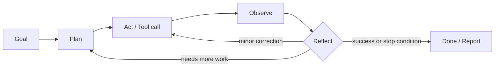
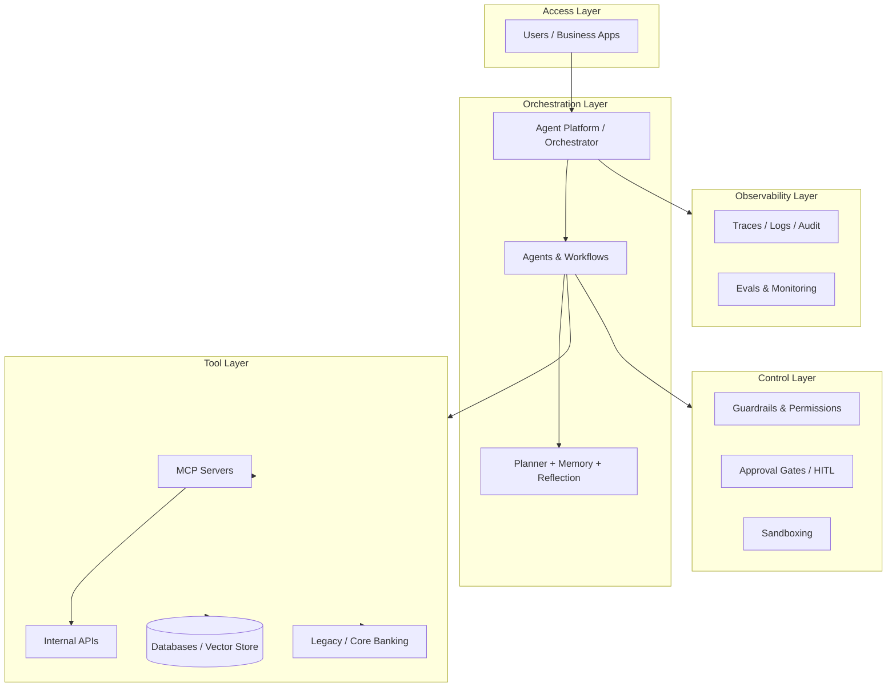
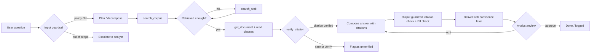

# Autonomous Agents

> **A Comprehensive Guide to Definitions, Taxonomies, Architectures, Design Patterns, Control & Safety, Evaluation, Frameworks, and Enterprise Adoption of LLM-Based Autonomous Agents**

**Author:** Jack Liu Shurui  
**Series:** LLM/AI Advanced Topics — *Agents Series (Umbrella Guide)*  
**Domain:** AI Engineering · Agent Architecture · Enterprise AI  
**Reading time:** ~75 minutes  
**Version:** 1.0 — August 2026

---

## Table of Contents

1. [What Is an Autonomous Agent? — Definitions & Taxonomy](#1-what-is-an-autonomous-agent--definitions--taxonomy)
2. [The Autonomy Spectrum](#2-the-autonomy-spectrum)
3. [Core Agent Architectures](#3-core-agent-architectures)
4. [Agent Design Patterns](#4-agent-design-patterns)
5. [Control & Safety](#5-control--safety)
6. [Evaluating Agents](#6-evaluating-agents)
7. [Frameworks & Ecosystem](#7-frameworks--ecosystem)
8. [Enterprise & Banking Adoption](#8-enterprise--banking-adoption)
9. [Worked Example: A Banking Compliance Research Agent](#9-worked-example-a-banking-compliance-research-agent)
10. [The Future: Autonomous Agents in 2026 and Beyond](#10-the-future-autonomous-agents-in-2026-and-beyond)
11. [Glossary](#11-glossary)
12. [References & Further Reading](#12-references--further-reading)

---

## 1. What Is an Autonomous Agent? — Definitions & Taxonomy

### 1.1 The Problem with the Word "Agent"

"AI agent" is one of the most overloaded terms in the industry. A 2025 LinkedIn survey piece titled *"Everyone Talks About AI Agents. Almost No One Means the Same Thing"* captured the confusion precisely: vendors, analysts, engineers, and regulators use the same word for everything from a chatbot with a system prompt to a self-directed system that runs for days without human intervention. Before any architecture discussion is possible, we must fix definitions.

This guide is the **umbrella reference for the agents series** in this repository. It defines the foundations — what agents *are*, how autonomous they *can be*, how they are *built*, *controlled*, and *evaluated* — and cross-references the deep-dive guides that cover each facet:

| Series guide | Covers |
|---|---|
| [llm_agent_use_cases.md](llm_agent_use_cases.md) | Industry use cases, products, metrics |
| [hybrid_multi_agent_systems_guide.md](hybrid_multi_agent_systems_guide.md) | Multi-agent architectures, orchestration, hybrid patterns |
| [hierarchical_multi_agent_frameworks_guide.md](hierarchical_multi_agent_frameworks_guide.md) | Supervisor/worker hierarchies and frameworks |
| [ai_agent_drift_guide.md](ai_agent_drift_guide.md) | Behavioral drift, degradation, detection, mitigation |
| [agent_runtime_cache_design_guide.md](agent_runtime_cache_design_guide.md) | Runtime architecture, caching, state management |
| [coding_agents_research.md](coding_agents_research.md) | Software engineering agents (SWE-bench, Claude Code, Devin) |
| [china_ai_agent_frameworks.md](china_ai_agent_frameworks.md) | Chinese agent frameworks and ecosystem |
| [mcp_framework_tools_guide.md](mcp_framework_tools_guide.md) | Model Context Protocol — tool/context standardization |
| [pkm_llm_age_guide.md](rag/pkm_llm_age_guide.md) | Personal knowledge management with LLMs |
| [enterprise_ai_platforms_guide.md](enterprise_ai_platforms_guide.md) | Enterprise agent platforms (OpenAI, Anthropic, Google, Microsoft) |

### 1.2 The LLM-Based Agent: Model + Tools + Loop

The working definition used throughout this series:

> **An LLM-based agent is a system that uses a large language model as its core reasoning engine to *perceive* an environment, *reason* about a goal, *act* through tools, and *learn* from the outcomes — iterating in a loop until the goal is achieved.**

The minimal anatomy has three parts:

1. **The model** — the LLM that decides *what to do next*. It is the "brain": it interprets goals, chooses actions, and evaluates results.
2. **The tools** — the interface to the world. Functions, APIs, database queries, file operations, search, code execution, GUIs. Tools are what convert an LLM from a *talking* system into an *acting* system.
3. **The loop** — the control structure that connects them: *goal → plan → act → observe → reflect → repeat*. Without a loop, there is no agent — only a single inference call.

A useful one-line formulation from the agent literature: **an agent is a model that is *in the loop* with an environment** — it reads the environment's state, decides, acts, and reads again. A chatbot, by contrast, is a model that is *at the endpoint* of a conversation: input in, text out, no world, no loop.

### 1.3 What "Autonomous" Means

"Autonomous" modifies *the degree of independence* of that loop — how much human involvement is required between steps. Autonomy is **not binary**; it is a **spectrum** (Section 2). A system is "autonomous" to the extent that it can:

- **Set or interpret goals** without being told every sub-step;
- **Plan multi-step sequences** of actions;
- **Execute** those actions with tool access;
- **Self-correct** when observations diverge from expectations;
- **Continue** without a human approving each action.

The critical engineering insight: **autonomy is a design decision, not a model property**. The same LLM can power a fully human-approved copilot or a fully autonomous agent — the difference is in the orchestration layer, the permission model, and the guardrails you build around the loop. This is why the autonomy spectrum (Section 2) and control mechanisms (Section 5) matter as much as the model choice.

### 1.4 The Agent Taxonomy: From Chatbot to Autonomous Agent

It is useful to place agent-like systems on a capability ladder. The boundaries are fuzzy and vendors blur them, but the following five rungs are widely recognized (variants of this ladder appear in Anthropic's *Building Effective Agents* (Dec 2024), Hugging Face's *five levels of agent autonomy*, and countless enterprise frameworks):

| Type | What it does | Tools | Loop | Human role |
|---|---|---|---|---|
| **Chatbot** (non-agent) | Generates text responses; no world interaction | None | None (single or few turns) | Directs the conversation |
| **Copilot** (human-driven) | Suggests completions/actions that the human executes | Optional (via human) | Human runs the loop | Does the work; model assists |
| **Assistant** (task-executing) | Executes single, well-scoped tasks on request | Yes | One-shot or short | Approves initiation and result |
| **Autonomous agent** (goal-directed) | Decomposes goals, executes multi-step plans, self-corrects | Yes | Full agentic loop | Sets the goal, supervises, intervenes |
| **Self-improving agent** | Adapts behavior across tasks/sessions using stored experience | Yes | Full loop + learning | Audits, sets boundaries |

**Chatbot — the non-agent.** A chatbot conditions on a prompt and produces text. Even a sophisticated RAG chatbot — retrieve, then answer — is not an agent in the strict sense: it *reads* but does not *act*. It has no tools that change world state and no goal-directed loop. This matters because "chatbot with a good prompt" is the most common fake agent in enterprise slideware.

**Copilot — the human-driven system.** The model proposes; the human disposes. GitHub Copilot, Microsoft 365 Copilot, and IDE autocomplete are canonical: the model generates a suggestion, the human reviews and applies it. The *human* executes every consequential action; the model never has agency. Copilots are the safest entry point and are often the correct architectural choice even when an autonomous agent is technically feasible.

**Assistant — the task-executing system.** The model is given one well-defined task and the tools to do it: "summarize this document set into a brief" or "translate this contract clause set and flag ambiguities." It executes with tool access but the task is single-shot and bounded; the human reviews the output. Siri/Alexa-style voice assistants, email triage assistants, and most current "AI features" in SaaS products sit here.

**Autonomous agent — the goal-directed system.** The user states a *goal*, not a procedure: "research the MAS 2025 outsourcing requirements and produce a gap analysis against our current controls." The agent decomposes the goal into sub-tasks, selects and sequences tools, iterates on failures, and produces a deliverable — possibly over many steps and much longer than a single conversation. This is the category this guide is primarily about.

**Self-improving agent.** A research frontier: the agent persists experience (reflections, outcomes, learned heuristics) across sessions and adapts its behavior. See Reflexion (Section 3.3) for the academic foundation; see Section 10 for the practical limits.

### 1.5 Agents vs. Workflows: The Anthropic Framing

The most influential recent framing of this distinction is Anthropic's engineering post *Building Effective Agents* (Erik Schluntz & Barry Zhang, **December 19, 2024** — verified). Anthropic defines **agentic systems** as a category with two sub-types:

- **Workflows** — systems where **LLMs and tools are orchestrated through predefined code paths**. The developer writes the control flow; the LLM fills in the content at each step. Examples: prompt chaining, routing, parallelization, orchestrator-workers, evaluator-optimizer. The *path* is fixed; the LLM never chooses which step comes next.
- **Agents** — systems where **the LLM dynamically directs its own processes and tool usage**, maintaining control over how it accomplishes the task. The model decides the path — which tool to call, in what order, when to retry, when to stop. The *path* is emergent.

Anthropic's guidance, which this guide endorses: **"find the simplest solution possible, and only increase complexity when needed."** Start with a single LLM call; add retrieval; add a workflow; only when the problem genuinely requires open-ended, model-directed problem solving — where the number of steps isn't known in advance — build an agent. Most enterprise use cases are better served by workflows or single agents than by elaborate multi-agent systems. The distinction is a *continuum*, not a dichotomy — but the default should be the simpler end.

The table below summarizes the practical differences:

| Dimension | Workflow | Agent |
|---|---|---|
| Control flow | Predefined by developer | Chosen by the model at runtime |
| Number of steps | Known / bounded | Unknown / goal-bounded |
| Flexibility | Low — deterministic path | High — adapts to observations |
| Predictability | High | Low — needs guardrails |
| Debuggability | Easy (linear trace) | Harder (branching, tool side effects) |
| Best for | Well-understood, repeatable processes | Open-ended, variable, exploratory tasks |

### 1.6 "Agentic" — The 2024–2025 Term

**"Agentic"** is the adjective form that exploded into industry vocabulary in **2024–2025** ("agentic AI," "agentic workflows," "agentic commerce," "agentic banking"). It denotes *capability or orientation toward agent-like behavior*: systems that take initiative, use tools, and pursue goals with limited supervision — as opposed to purely reactive, prompt-answering systems. The word became pervasive to the point of dilution: by 2025 "agentic" was applied to almost any AI feature with a tool call, prompting critics to note that marketing usage had outrun technical meaning.

Useful, defensible usage: **"agentic" describes the property; "agent" describes the system.** An agentic workflow is a workflow whose steps are executed *by* LLMs with tools but whose path is fixed (Anthropic's usage). Agentic AI is the umbrella term for the 2024–2026 industry wave of products, platforms, and investments organized around goal-directed AI systems. For this guide, prefer the precise terms (agent, workflow, autonomous, copilot) and treat "agentic" as the industry flavor word.

### 1.7 Agent Anatomy: The Six Components

Every agent — regardless of framework — is composed of six conceptual components. The agent's *anatomy*:

| Component | Role | Failure mode if missing |
|---|---|---|
| **Model** | Core reasoning engine; decides next action | No intelligence at all |
| **Tools** | World interface: APIs, search, code, files, DBs | No action possible — becomes a chatbot |
| **Memory** | Short-term (context), long-term (vector store), episodic (sessions), working (scratchpad) | No continuity; no learning; context overflow |
| **Planning** | Decompose goal into steps; sequence and prioritize | Wanders aimlessly; one giant unfocused call |
| **Execution** | Run the loop: call tools, handle results, retry, error-recover | Stalls on first failure |
| **Reflection** | Evaluate outcomes, self-critique, feed lessons back | Repeats the same mistakes; no improvement |

Section 4 covers the design patterns for each component. Sections 3 covers the architectural skeletons that wire them together.

---

## 2. The Autonomy Spectrum

### 2.1 Autonomy Is a Spectrum, Not a Switch

Autonomy — the degree of human involvement in the agent's loop — is the single most important design variable for production agents. It directly trades off against risk: more autonomy means more value (less human labor per task) but more blast radius (more actions taken without review). The industry's practical answer to the question "how autonomous should this agent be?" is almost always a level chosen *per task* based on the risk of the actions involved.

There is **no single standardized autonomy-level framework** as of mid-2026. Instead there are several commonly cited ladders, and it is worth knowing them:

- **Hugging Face's five levels** (0–5 stars), popularized in 2024–2025: Level 0 = simple processor (no LLM impact on program flow); Level 1 = chatbot/RAG (LLM output shown, no action); Level 2 = tool-using agent (single tool call per decision, human confirms); Level 3 = multi-step agent (chains of tool calls, human supervises); Level 4 = autonomous agent (operates independently in a loop, human sets goals); Level 5 (in some variants) = fully autonomous, self-directed systems operating over extended periods with no human in the middle.
- **Microsoft's copilot → agent spectrum** (2024–2025): copilot (human does, AI assists) → copilot with tools → agent with human approval → semi-autonomous agent → fully autonomous agent. Microsoft's framing is deliberately product-oriented: the "Copilot" brand anchored the left end, "agents" in Microsoft 365 and Copilot Studio anchor the right.
- **Andrew Ng's agentic workflows** framing (2024): four design patterns — reflection, tool use, planning, multi-agent collaboration — presented not as levels but as *capabilities* that can be added incrementally to any LLM app.
- **Robotics-derived ladders** (SAE J3016-inspired "levels of autonomy" for agents, proposed in various 2024–2025 blog posts and vendor papers): level 1 (assist), level 2 (partial autonomy), level 3 (conditional), level 4 (high), level 5 (full). These are *analogies*, not standards, and are used loosely.
- **Sierra/industry "agentic AI maturity" models** (2025): from reactive assistants → procedural automation → autonomous agents → adaptive self-improving agents.

**Honest flag:** none of these ladders is authoritative; they are expository devices that happen to converge on the same ordering. This guide therefore uses a **synthesized L0–L4 ladder** (below) that matches the common consensus across the sources above, and explicitly notes where the naming differs elsewhere.

### 2.2 The L0–L4 Ladder (Synthesized)

| Level | Name | Human role | Agent behavior | Example |
|---|---|---|---|---|
| **L0** | **Copilot / human-in-the-loop** | Human does; model suggests | Single-shot suggestions, no independent action | GitHub Copilot autocomplete, IDE inline assist |
| **L1** | **Assistant / single-task, human-approved** | Human approves each task | Executes one bounded task when invoked; waits for approval | Email draft agent, document summarizer with tool use |
| **L2** | **Semi-autonomous / multi-step, human-supervised** | Human supervises; can interrupt | Chains multiple tool calls toward a goal; pauses at checkpoints | Research agent that gathers sources then presents a brief for approval |
| **L3** | **Autonomous / goal-directed** | Human sets the goal only | Plans and executes the full multi-step task, self-corrects, reports back | Coding agent that resolves a GitHub issue end-to-end and opens a PR |
| **L4** | **Self-learning / adaptive, human-audits** | Human audits behavior and outcomes | Adapts across sessions using stored experience/reflections | (Frontier) an agent that improves its tool-use strategies from past failures |

The ladder is monotonic in *independence* but **not in desirability**: L4 is not "better" than L1. It is *riskier*. Enterprises — banks especially — will deliberately operate many workloads at L1–L2 forever, because the cost of a wrong action exceeds the labor savings of autonomy.

### 2.3 The Levels in Practice: Where Enterprises Actually Run

Observational evidence from 2025–2026 deployments (see [llm_agent_use_cases.md](llm_agent_use_cases.md) for the full survey):

- **L0/L1 dominate.** The overwhelming majority of production "AI features" in enterprises are copilots and single-task assistants. This is the honest baseline: most workflows are still bounded, reviewable tasks.
- **L2 is the growth zone.** Semi-autonomous agents with approval gates — "draft, then ask" — are the pattern enterprises are most comfortable scaling in 2025–2026, particularly in regulated industries.
- **L3 is real but contained.** Fully autonomous agents exist mainly where the environment is digital, reversible, and instrumented: code generation (PRs can be reverted), search/research (read-only), and back-office automation with rollback.
- **L4 is research.** Self-improving production agents are rare; the closest production systems use *offline* improvement (eval-driven prompt/retrieval iteration) rather than in-loop learning.

### 2.4 Autonomy vs. Reliability: The Trust Boundary

The deepest principle of the autonomy spectrum:

> **Autonomy requires reliability. You can only grant an agent as much independence as the reliability of its worst critical step justifies.**

Every agent step has an error rate. A research step that hallucinates a source is cheap to catch (citation check). A payment step that sends funds to the wrong account is not. The **trust boundary** is the set of actions the organization is willing to let the agent take without human review — and it is drawn where *expected cost of error × error rate* crosses *cost of human review*. Concretely:

- **Read-only actions** (search, retrieval, computation): high autonomy is safe; blast radius is near zero.
- **Reversible actions** (draft, propose, generate, code in a branch): high autonomy with review gates; errors are cheap to undo.
- **Irreversible, high-value actions** (payments, trades, account changes, external communications): low autonomy, mandatory approval, dual control.

This is why the same LLM powers an L3 research agent and an L1 payment agent: the *trust boundary*, not the model, sets the level. Section 5 turns this principle into concrete control mechanisms (guardrails, HITL gates, sandboxing, fail-safes).

### 2.5 Designing for the Right Level

Practical guidance for choosing the level:

1. **List the agent's action types** and classify each as read-only / reversible / irreversible.
2. **Draw the trust boundary** by action type, not by task. The same task may mix levels: an L3 research phase feeding an L1 approval phase.
3. **Start one level lower than you think you need** — the "least autonomy" principle (Section 4.6). Ship L1, measure reliability, then raise to L2 for the steps whose measured error rates are acceptable.
4. **Raise autonomy only with evidence**: eval pass rates (Section 6), trace-level success metrics, and drift monitoring ([ai_agent_drift_guide.md](ai_agent_drift_guide.md)) are the evidence base.
5. **Document the level per workflow** — regulators (and auditors) will ask: who decided this agent could act without approval, and on what evidence?

## 3. Core Agent Architectures

Architectures are the *skeletons* of the agentic loop — the canonical ways of wiring model, tools, memory, planning, and reflection together. Every production agent is a composition of a handful of these patterns. The four foundational architectures are **ReAct**, **plan-and-execute**, **reflection**, and the **tool-use loop**; the agentic loop is their common ancestor; computer use and multi-agent are their extensions.

### 3.1 ReAct — Reason + Act

**Verified source:** Shunyu Yao, Jeffrey Zhao, Dian Yu, Nan Du, Izhak Shafran, Karthik Narasimhan, Yuan Cao — *"ReAct: Synergizing Reasoning and Acting in Language Models"* — arXiv:2210.03629, **October 2022** (published at ICLR 2023).

ReAct is the foundational agent architecture of the LLM era. Its insight: chain-of-thought (CoT) prompting made LLMs *reason* better but gave them no way to *act*; action-generation models could act but reasoned poorly. ReAct **interleaves reasoning traces and actions** in a single loop:

```
Thought:  I need the customer's outstanding balance before I can process this.
Action:   query_account_balance(account_id="A-88321")
Observation: balance = 12,450.00 SGD
Thought:  Balance is sufficient. Check the transfer limit policy...
Action:   lookup_policy("transfer_limit", tier="premium")
Observation: premium tier limit = 50,000 SGD/day
Thought:  Transfer is within limits. Execute.
Action:   initiate_transfer(amount=12,450, from="A-88321", to="B-99102")
Observation: transfer_id = TX-5521, status = PENDING_APPROVAL
Thought:  Done — flag for approval per trust boundary.
```

The alternating **Thought → Action → Observation** triple is the ReAct signature. Reasoning is *grounded* in tool observations (reducing hallucination), and actions are *explained* by reasoning (improving interpretability — an auditor can read the trace). ReAct outperformed both CoT-only and action-only baselines on multi-hop QA (HotPotQA), fact verification (Fever), and interactive decision-making (WebShop, AlfWorld) — while producing human-readable decision traces.

**In practice:** ReAct is the default loop in most frameworks (LangChain/LangGraph's `create_react_agent`, OpenAI Agents SDK, smolagents' default loop). Its weakness: it is greedy and step-local — it has no global plan, so long tasks drift. This motivates plan-and-execute.

### 3.2 Plan-and-Execute — Plan, Then Act

Plan-and-execute (a.k.a. plan-then-execute, Plan-and-Solve) separates the loop into two roles:

- **Planner** — decomposes the goal into a step sequence (the plan) *before* execution; revises the plan when execution reveals new information.
- **Executor** — works through the plan steps, one at a time, each step usually itself a small ReAct-style loop with tools.

The pattern directly addresses ReAct's myopia: the plan gives global structure, sub-goals give the executor bounded units of work, and **plan revision** handles the reality that plans rarely survive contact with observations. (The Plan-and-Solve paper — Wang et al., 2023 — showed that asking the model to devise a plan before answering improves multi-step reasoning; in agent systems the planner becomes a persistent component rather than a one-shot preamble.)

**Strengths:** longer-horizon tasks; controllable (you can show the human the plan for approval before any execution — a natural HITL gate); resumable (plan steps can be checkpointed). **Weaknesses:** planning overhead on simple tasks; brittle plans when the environment is highly dynamic; planner/executor drift over long runs. **Best for:** research, report generation, multi-stage workflows, anything with 5+ steps.

### 3.3 Reflection — Reflexion and Self-Critique

**Verified source:** Noah Shinn, Federico Cassano, Ashwin Gopinath, Karthik Narasimhan, Shunyu Yao — *"Reflexion: Language Agents with Verbal Reinforcement Learning"* — arXiv:2303.11366, **March 2023** (NeurIPS 2023).

Reflexion's core idea: instead of updating **weights** (expensive, slow), the agent updates **language**. After a failed trial, the agent *verbally reflects* on what went wrong and stores the reflection in an **episodic memory buffer**; the next trial is conditioned on that reflection. This "verbal reinforcement" produced large gains on sequential decision-making (AlfWorld), programming (HumanEval/LeetCode), and reasoning (HotPotQA) — without any gradient update.

The reflection loop:

```
Trial 1:  attempt task → fail (evaluator/executor gives feedback)
Reflect:  "I failed because I queried the DB before checking the policy
          schema; the join key was wrong. Next time, verify schema first."
Trial 2:  attempt task with the reflection in context → succeed
```

Reflection is now a **standard component** of agent design, in two flavors: **self-critique** (the agent reviews its own output against criteria) and **critic-agent** (a second model/agent evaluates the first — see the evaluator-optimizer pattern and [hybrid_multi_agent_systems_guide.md](hybrid_multi_agent_systems_guide.md)). Reflexion is also the academic foundation of the L4 "self-improving" aspiration — with the honest caveat that in-loop learning in production remains rare (Section 10.4).

### 3.4 The Tool-Use Loop and Function Calling

**Tool use** — letting the model call external functions — is the single capability that made agents possible. Its enabling API pattern is **function calling**.

**Verified source:** OpenAI announced **function calling** in the Chat Completions API on **June 13, 2023** (with gpt-3.5-turbo-0613 and gpt-4-0613): developers describe functions via JSON schemas; the model returns a structured JSON *call* (function name + arguments) instead of free text; the application executes the function and feeds the result back. Within a year, every major provider (Anthropic, Google, Mistral, open-source vLLM servers) shipped the same pattern, and it became the substrate for the tool ecosystem.

The **tool loop** (the execution skeleton of any tool-using agent):

```
LLM → (decides) → tool call (name + args)
     → runtime executes tool → observation (result/error)
     → observation appended to context → LLM again
     → ... until the model emits a final answer / stop
```

The runtime's job in this loop is often underestimated: schema validation, permission checks (Section 5.3), retries, timeout handling, error formatting, and trace capture (Section 6.5). In 2024–2025 the **Model Context Protocol (MCP)** standardized how tools are described and discovered across providers — see [mcp_framework_tools_guide.md](mcp_framework_tools_guide.md) for the deep dive.

### 3.5 The Agentic Loop — Goal → Plan → Act → Observe → Reflect

All architectures above are instances of one master loop. The **agentic loop** is the canonical cycle:



1. **Goal** — the objective (from the user or a parent agent), possibly with success criteria.
2. **Plan** — decompose into steps; decide tools; set expected outcomes.
3. **Act** — execute a step: call a tool, query, compute, write.
4. **Observe** — incorporate the result (or error) into context.
5. **Reflect** — compare outcome to expectation; decide: done, adjust, retry, or re-plan.
6. **Repeat** until a stop condition (goal achieved, budget exhausted, human interrupt, safety trip).

Two conceptual ancestors are worth noting: **OODA** (Observe–Orient–Decide–Act, John Boyd's military decision cycle, 1970s) and **sense–think–act** from robotics. The agentic loop is OODA with a language model as the orient/decide component and reflection as an added step — a genuinely useful mental model for engineers (it explains why agents are *fast and adaptable* but also why *uncontrolled loops oscillate* — exactly what OODA theory predicts for decision cycles without feedback discipline).

### 3.6 Computer-Using Agents and Browser Agents

A special class of agents interacts with the world through the **same interfaces humans use** — screens, browsers, GUIs — rather than APIs. This is the fastest-moving agent category of 2024–2026.

**Verified sources and timeline:**

- **Claude Computer Use (Anthropic)** — announced **October 22, 2024**: a beta API capability letting Claude operate a computer by looking at screenshots and emitting mouse/keyboard actions. Anthropic's reported benchmark (OSWorld, 50% success on the computer-use subset, up from ~22% for the prior best) established the pattern. Anthropic was explicit about the safety posture: rate limits, monitoring, and the fact that the capability "can be used to complete common computer tasks" but is "experimental, sometimes error-prone."
- **OpenAI Operator** — launched **January 23, 2025** as a research preview: an agent with its own browser that performs web tasks (booking, shopping, form-filling) for the user. Operator is powered by **CUA (Computer-Using Agent)**, a model combining GPT-4o's vision with reinforcement learning for GUI actions. OpenAI shipped the *operator* (product) and the *CUA* (model) naming separately — both worth keeping distinct.
- **Browser agents** — the broader category: navigation agents that parse the DOM/accessibility tree rather than pixels (e.g., Playwright-based agent tooling, Perplexity Comet, browser-use libraries), plus the agent-browser protocols (Browser MCP, Chrome DevTools-driven agents).
- **General-purpose agent platforms** (2025–2026) — hosted "general agents" that combine computer use, file access, code execution, and web research into one product (OpenAI's ChatGPT agent, Anthropic's Claude agent/Claude for Chrome, Google's Project Mariner within Gemini, Microsoft's Copilot agents). These are the commercial convergence point of Section 3.6 patterns.

**Architecture note:** computer-using agents swap the tool layer for a *GUI actuator* (screenshot → model decides → mouse/keyboard action → new screenshot). Everything else — the loop, reflection, guardrails — applies unchanged. Their distinctive risks are **prompt injection via screen content** (a web page's text is now *input* to the model) and **action ambiguity** (click targets misidentified). See [prompt_injection_guide.md](prompt_injection_guide.md) and Section 5.1.

### 3.7 Multi-Agent Architectures

When one agent isn't enough, the system becomes a society of agents. The three canonical coordination patterns:

- **Orchestration** — a central orchestrator/supervisor decomposes work and dispatches to specialist workers, collecting and synthesizing results. (Centralized control, clear accountability, supervisor bottleneck.)
- **Delegation / handoffs** — agents hand the conversation or task to another agent when the specialty changes (OpenAI Agents SDK handoffs, hierarchical supervisors). (Flexible, natural conversation flow; harder to trace.)
- **Debate / consensus** — multiple agents critique or compete on the same problem; a judge or vote resolves disagreement. (Higher quality through adversarial review; expensive, and can converge on confident-but-wrong consensus.)

Multi-agent systems are a deep topic with their own series guide — **[hybrid_multi_agent_systems_guide.md](hybrid_multi_agent_systems_guide.md)** (patterns, orchestration, hybrid designs) and **[hierarchical_multi_agent_frameworks_guide.md](hierarchical_multi_agent_frameworks_guide.md)** (supervisor/worker hierarchies). The umbrella-level guidance: **multi-agent is a complexity tax — pay it only when a single agent's context, tool diversity, or role conflicts make it necessary.** Most "multi-agent" problems in enterprise are better solved by one agent plus a workflow.

### 3.8 Architecture Comparison

| Architecture | Pattern | Strengths | Weaknesses | Best use case |
|---|---|---|---|---|
| **ReAct** | Interleaved thought → action → observation | Grounded reasoning, interpretable traces, simple | Greedy/step-local, drifts on long tasks, token-hungry | QA with tools, single-session tasks, the default loop |
| **Plan-and-execute** | Planner + executor + plan revision | Long-horizon structure, resumable, human-reviewable plans | Planning overhead, brittle in volatile environments | Research, report generation, multi-stage workflows |
| **Reflection / Reflexion** | Act → evaluate → verbal reflection → retry | Improves success across trials without retraining | Doubles/triples cost, needs good evaluators, can over-reflect | Complex problem-solving, coding, iterative tasks |
| **Tool-use loop** | LLM ⇄ tool calls via function calling | Simple, standard, provider-native | No global planning; depends on tool quality | Any task with external actions (the substrate) |
| **Computer use / browser** | Model drives GUI via screenshots/DOM | Works where no API exists, human-like | Slow, fragile, high injection risk, expensive | Legacy systems, web tasks without APIs |
| **Multi-agent** | Orchestration / delegation / debate | Parallelism, specialization, adversarial quality | Coordination overhead, cost, trace complexity | Large heterogeneous tasks (see the multi-agent guides) |

---

## 4. Agent Design Patterns

Architectures give the skeleton; **design patterns** give the craft — how to design goals, tools, memory, planning, execution, and reflection so the agent actually works in production. This section is the practitioner's core.

### 4.1 Goal Design

An agent is only as good as its goal. Vague goals ("improve the report") produce vague behavior; the goal is the agent's contract.

- **Write goals as outcomes, not procedures** — "Produce a gap analysis of our outsourcing controls against MAS Notice 180, with one row per control" (outcome), not "search for MAS 180, read it, summarize it" (procedure). The agent owns the procedure; you own the outcome.
- **Specify success criteria** — explicit, checkable: "every finding must cite the exact regulatory clause (document + paragraph)", "maximum 2 pages", "flag, don't decide". Success criteria double as the *evaluator's rubric* (Section 6) and the *stop condition* for the loop.
- **Specify constraints and boundaries up front** — what the agent must *not* do (don't contact external parties; don't modify records), what to do on uncertainty (ask, escalate, or mark low-confidence).
- **Give the goal teeth**: include the audience, the format, the level of rigor, and the escalation path. Regulated-industry agents should have the goal restated in the system prompt *and* validated by an input guardrail (Section 5.1).

### 4.2 Tool Design

Tools are where agents touch the world — and where most production failures live. The levers:

- **Tool selection** — give the agent the *minimum* set that covers the task. Every extra tool adds a wrong-choice probability. A research agent needs search + retrieval + a citation checker; it does not need a payment API.
- **Tool descriptions** — the model chooses tools from descriptions. Write them as *when to use this tool* guidance, not raw schema dumps: "Use for fetching current FX rates; not for historical series — use `fx_historical` instead." Ambiguous descriptions are a leading cause of tool-selection drift ([ai_agent_drift_guide.md](ai_agent_drift_guide.md)).
- **Tool schemas** — strict JSON Schema with required fields, enums, and sensible defaults. Validate at the boundary: a malformed call should return a *typed error* the model can recover from, not a crash.
- **Observations as feedback** — return structured, self-describing results ("status: OK, rows: 42, columns: [...]") and, on failure, *actionable* errors ("policy not found; try `lookup_policy` with tier in {basic, premium}").
- **Tool-use best practices** (from framework docs and production postmortems): idempotency for retries (a retried transfer must not double-send); read-only first (give the agent read tools early, write tools only when reliability is proven); parameter validation in the tool itself (never trust the model's JSON); and per-tool rate limits and budgets.

### 4.3 Memory Design

Memory is what separates agents from "a model with extra steps." Four types, per the anatomy in 1.7:

| Memory type | What it holds | Implementation | Failure mode |
|---|---|---|---|
| **Short-term (context)** | Current task state, recent observations | The LLM context window; message history | Context overflow, recency bias, lost early steps |
| **Long-term (knowledge)** | Facts, documents, precedents | Vector store + RAG ([vector_databases_guide.md](rag/vector_databases_guide.md), RAG guides) | Stale/unretrieved knowledge; retrieval noise |
| **Episodic (session history)** | Past sessions, prior task outcomes, reflections | Session store; Reflexion-style buffers | Cross-session leakage; privacy |
| **Working (scratchpad)** | Intermediate reasoning, plan state, partial results | Structured state (JSON), tool results cache | State corruption, staleness |

Design rules:

- **Match the memory to the task horizon.** Single-session tasks need only context + scratchpad; recurring tasks (a weekly compliance digest) need episodic + long-term memory.
- **Compress, don't dump.** Summarize old turns, keep raw recent turns — the classic context-management pattern (see [agent_runtime_cache_design_guide.md](agent_runtime_cache_design_guide.md) for caching/state architecture).
- **RAG is not a memory shortcut** — retrieval needs its own design (chunking, reranking, citation grounding): see [advanced_rag_techniques_guide.md](rag/advanced_rag_techniques_guide.md) and the RAG series.
- **Treat memory as a security surface** — long-term memory can be poisoned by injected content (Section 5.1); sessions must respect data-privacy boundaries (PII segregation, retention).

### 4.4 Planning Patterns

- **Task decomposition** — break the goal into steps small enough that each can be executed and verified (the executor's unit of work). Decomposition quality is the single biggest lever on long-task success.
- **Sub-goals with explicit outputs** — each plan step should declare its deliverable, so the executor knows when a step is done and the planner knows when to re-plan.
- **Plan revision** — treat the plan as a hypothesis, not a contract. When observations contradict plan assumptions, the planner should revise — bounded by a re-plan budget (unlimited re-planning is a common runaway loop).
- **Plan visibility** — show the plan to humans for approval at checkpoints (a natural HITL gate, Section 5.2); log plan revisions for audit (Section 5.7).

### 4.5 Execution Patterns

- **Step-by-step with verification** — execute one step, verify its output, then proceed. Verification can be structural (schema check), semantic (a verifier prompt/model), or empirical (run tests, check citations).
- **Retries with backoff and repair** — transient tool failures get retried (with idempotency); *semantic* failures get repaired (re-formulate the tool call, re-plan the step); persistent failures get escalated. Distinguish "the tool hiccuped" from "the approach is wrong" — they need different recovery.
- **Error handling as a first-class prompt concern** — teach the agent the error taxonomy: what to retry, what to repair, what to escalate, what to treat as fatal.
- **Budgets** — step budgets (max N tool calls), time budgets, token/cost budgets, and context budgets. Budgets are the executor's speed governor and the loop's natural stop condition.

### 4.6 Reflection Patterns

- **Self-critique** — after producing an output, the agent reviews it against the success criteria before finalizing ("check every claim has a citation; rewrite the unsupported ones"). Cheap, and it measurably reduces hallucinated details.
- **Critic agent** — a separate model evaluates the producer's output (evaluator-optimizer pattern; the critic can be a different, cheaper model). Independent critics catch self-consistency blind spots.
- **Feedback loops with evidence** — reflection should be grounded: point at the specific observation/error that triggered the change, so the reflection is auditable and doesn't drift into generic self-praise.
- **Reflection budgets** — cap reflection rounds (Reflexion's value is in bounded trials, not infinite loops).

### 4.7 Design Principles

- **Simplicity** — "find the simplest solution and only increase complexity when needed" (Anthropic, Dec 2024). A workflow beats an agent; a single agent beats a multi-agent system; a plain LLM call beats all of them.
- **Observability** — every loop iteration must be traceable: thoughts, tool calls, observations, decisions, and costs (Section 6.5). You cannot control what you cannot see.
- **Testability** — agent behavior should be evaluable against a rubric (Section 6.3). If you can't write a test for a behavior, you can't ship it.
- **Least autonomy** — start at the lowest autonomy level that delivers value (Section 2.5), and raise it only on evidence. Autonomy is earned, not granted.
- **Fail loud, fail safe** — in production, an agent's default response to uncertainty should be *escalation*, not improvisation. Silent wrong answers are the worst failure mode (Section 5.6).

### 4.8 The Pattern Catalog

A naming convention for recurring agent structures (used across this series and framework docs):

| Pattern | What it is | Used for |
|---|---|---|
| **Router** | A model/classifier that sends each request to the right specialist (agent, workflow, or model) | Heterogeneous request mixes; cost control |
| **Tool belt** | A curated, minimal tool set per agent role, with strong descriptions | Keeping agents focused and reliable |
| **Verifier** | A check step (model or code) that validates outputs before they proceed | Guarding quality at handoffs |
| **Guardrail** | Input/output filters and policy checks around the loop (Section 5.1) | Safety, compliance, injection defense |
| **Evaluator-optimizer** | One model produces, another evaluates; loop until score passes | Iterative content/code quality |
| **Orchestrator-workers** | Supervisor decomposes; workers execute; supervisor synthesizes | Multi-step heterogeneous tasks |
| **Plan-review gate** | Human approves plan before execution | HITL checkpointing (Section 5.2) |

---

## 5. Control & Safety

Control is the engineering discipline of keeping an autonomous system *inside its trust boundary*. It has five pillars: guardrails (defense), human-in-the-loop (authority), autonomy boundaries and sandboxing (containment), monitoring (visibility), and fail-safes (last resort). This section is deliberately the most "banking-relevant" part of the guide; the companion deep-dives are [ai_agent_drift_guide.md](ai_agent_drift_guide.md) (behavioral degradation), [agent_runtime_cache_design_guide.md](agent_runtime_cache_design_guide.md) (runtime state), and [implementing-responsible-ai.md](implementing-responsible-ai.md) (governance).

### 5.1 Guardrails: Input & Output

Guardrails are deterministic-or-model checks wrapped around the agent loop:

- **Input guardrails** — validate and sanitize every user input *before* it enters the loop: prompt-injection detection (see [prompt_injection_guide.md](prompt_injection_guide.md) — the full defense catalog: instruction delimiters, injection classifiers, tool-output sandboxing, least-privilege tool grants), policy checks (does this request fall inside the agent's mandate?), and input normalization.
- **Output guardrails** — validate every *outbound* artifact: the tool calls the agent wants to make (schema, permissions, destination allowlists) and the content it produces (policy compliance, PII leak checks, citation verification, tone/format). Guard model systems are covered in [llm_guard_models_guide.md](llm_guard_models_guide.md).
- **The injection-specific rule:** content from tools, web pages, documents, and emails is *data, not instructions*. The agent must treat retrieved content as untrusted input; critical for computer-using agents where the entire screen is untrusted content (Section 3.6).

### 5.2 Human-in-the-Loop (HITL)

HITL is not a single feature — it's a family of control points:

- **Approval gates** — the loop pauses before a class of actions (per trust boundary: payments, external sends, account changes) and waits for explicit human approval. The gate must show the human *enough context to judge*: goal, planned action, evidence, and the alternative.
- **Checkpoints** — scheduled review points (per plan step, per N tool calls, per cost threshold). Plan-review gates (4.8) are the highest-value checkpoint.
- **Escalation** — the agent's explicit "I don't know / this is out of scope / this failed repeatedly" path. A well-designed escalation channel is what makes higher autonomy safe: the agent knows its limits and has a sanctioned way to hand back.
- **Interrupt & resume** — humans must be able to *stop* the loop mid-flight, inspect state, edit the plan, and resume. This requires the runtime to persist agent state at checkpoints ([agent_runtime_cache_design_guide.md](agent_runtime_cache_design_guide.md)).

### 5.3 Autonomy Boundaries & Permission Models

- **Boundary design** — make the "what the agent can do autonomously vs. what requires a human" decision *per action type* (read-only / reversible / irreversible — Section 2.4), encoded explicitly in the runtime, not just in the prompt. Prompts are advisory; the permission system is enforced.
- **Agent permissions** — a capability matrix (agent role × tool × resource × action). Least privilege applies: a research agent gets read access to the document corpus and no write access anywhere; a reconciliation agent gets read access to ledgers and write access only to draft exception reports.
- **Namespaces and scopes** — restrict agents to their domains (workspaces, tenants, environments). A sandboxed agent cannot touch production by construction, not by instruction.
- **Dynamic de-escalation** — when an agent's task drifts toward higher-risk actions (e.g., a research agent starts generating outbound emails), the runtime should *refuse and escalate*, not comply.

### 5.4 Sandboxing

Sandboxing is the *execution* counterpart of boundaries: run agent code and tool side effects in isolated, disposable environments.

- **Code execution** — agent-generated code runs in containers/VMs with no network or scoped network, no host filesystem, and resource limits (CPU/memory/disk/time). The container is *ephemeral* — throwaway per task.
- **Tool execution** — tools run with their own credentials, scopes, and rate limits; the agent never holds master credentials (a compromised agent must not become a compromised service account).
- **Data isolation** — sandboxes are per-tenant/per-classification; the agent's memory and retrieval never cross data boundaries.
- **Egress control** — outbound network access is allowlisted per agent. Most agent-based exfiltration is via tool egress, not raw code.

### 5.5 Monitoring & Observability

You cannot control an agent you cannot see. Production agent monitoring is *trace-level*, not just metric-level:

- **Tracing** — every loop iteration emits a span: thought, tool call, arguments, observation, decision, token/cost, duration. Trace the *entire* agent graph, including sub-agent calls (Section 6.5 tools).
- **Logging & audit trail** — immutable, append-only records of goals, actions, approvals, escalations, and outcomes — the audit trail is the *legal* artifact in regulated industries (Section 5.7). Include who/what authorized each boundary-crossing action.
- **Alerting** — tripwires on the failure modes that matter: repeated tool failures, budget exhaustion, permission denials, guardrail firings, plan-revision storms, and drift indicators ([ai_agent_drift_guide.md](ai_agent_drift_guide.md) defines the drift detection framework).
- **The 3 A's of agent ops** — Alert (detect), Assess (trace to root cause), Act (rollback/patch/retrain). Agent incidents are diagnosed from traces, so trace quality is an SLA.

### 5.6 Agent Safety: Fail-Safes and the "Control Problem"

- **Agent safety research** — a live academic field (Anthropic's agent safety work, OpenAI's preparedness research, academic "AI control" papers) studying how to keep capable agents aligned with operator intent — including *control protocols* that assume the model may be adversarially motivated, and *test-time* safety techniques (monitors, veto models, capability elicitation controls). The practical enterprise takeaway is narrower: treat the agent as *untrusted code with a language interface* and engineer accordingly (guardrails + sandboxing + permissions + audit).
- **Fail-safe design** — every production agent needs: **timeouts** (per tool call and per whole task), **budgets** (steps, tokens, cost — Section 4.5), a **kill-switch** (an operator-accessible stop that halts the loop and freezes state immediately), and **rollback** (the ability to revert the agent's actions — snapshots before mutations, idempotent tools, undo logs). The kill-switch must be *physical* — a control-plane call that doesn't depend on the agent's cooperation.
- **Default to escalation on uncertainty** — "fail loud": an uncertain agent escalates; a confident-but-wrong agent is the dangerous one. This single rule is worth more than any other safety control.

### 5.7 Enterprise Governance & Compliance

In a regulated enterprise (a bank above all), agent control is a *governance* requirement, not just an engineering preference:

- **Accountability** — every agent has an owner, a documented mandate, and a named approver for boundary changes. "Who approved this agent acting without human review, and on what evidence?" must have an answer.
- **Audit** — the audit trail (5.5) must satisfy internal audit and regulators: goals, actions, approvals, model versions, prompt versions, tool versions, and outcomes, retained per policy.
- **Model risk management** — agent systems inherit model-risk requirements: validation before deployment, ongoing performance monitoring, and documented limitations. Frameworks: NIST AI RMF, EU AI Act (which treats high-risk AI systems — including many agent deployments — with transparency and human-oversight obligations), MAS FEAT principles for Singapore financial institutions, and SR 11-7-style model governance — see [implementing-responsible-ai.md](implementing-responsible-ai.md) for the full treatment.
- **Compliance by construction** — encode policy checks in guardrails (5.1) so that regulatory constraints (e.g., "no advice without a license", "customer data stays in region") are enforced by the runtime, not requested from the model.

## 6. Evaluating Agents

Agents are stochastic, multi-step, tool-using systems — evaluation is therefore harder than for models (a single output) or RAG pipelines (a single retrieval+answer). Agent evaluation is the discipline of measuring **task success, efficiency, safety, and robustness** across the *loop*, not just the final answer. Deep treatment of LLM evaluation generally is in [llm_evaluation_frameworks_guide.md](llm_evaluation_frameworks_guide.md); this section is the agent-specific view.

### 6.1 Evaluation Dimensions

| Dimension | What it measures | Typical metrics | Notes |
|---|---|---|---|
| **Task success** | Did the agent achieve the goal? | Task completion rate, correctness score, pass@k | The primary dimension; must be judged against the success criteria (4.1) |
| **Efficiency** | Cost of success | Steps, tool calls, tokens, latency, $/task | Two agents with equal success differ 10× in cost — efficiency is a first-class axis |
| **Safety** | Did it cause harm or violate policy? | Guardrail firings, policy violations, harmful-action rate, escalation rate | Non-negotiable for autonomy decisions (Section 5) |
| **Robustness** | Does it survive variation? | Edge-case pass rate, adversarial-input pass rate, drift over time | Test with reworded goals, missing data, poisoned tool outputs |

The critical evaluation discipline: **always measure safety and efficiency alongside success.** A benchmark that reports only task-completion is how an agent with a 2% harmful-action rate sneaks into production.

### 6.2 Benchmarks

**Verified sources:**

- **GAIA** — Mialon et al. (Meta AI / Hugging Face), *"GAIA: a benchmark for General AI Assistants"*, arXiv:2311.12983, **November 2023**. 466 questions requiring multi-step reasoning, tool use, and web browsing — designed so that "a human would answer correctly with 100% reliability" while LLMs (at publication) achieved ~15% and even the best assistants well under 50%. GAIA remains the canonical general-assistant benchmark; note that it requires tool use and thus broke the "LLM without tools" evaluation paradigm.
- **SWE-bench** — Jimenez et al., *"SWE-bench: Can Language Models Resolve Real-World GitHub Issues?"*, arXiv:2310.06770, **October 2023**. 2,294 real GitHub issues across 12 Python repositories; the agent must produce a patch that passes the repository's hidden tests. The standard for *coding agents* — SWE-bench Verified (500 human-validated instances) is the widely cited subset, with top agents above ~70% by 2026. Full treatment in [coding_agents_research.md](coding_agents_research.md).
- **AgentBench** — Liu et al. (Tsinghua THUDM et al.), *"AgentBench: Evaluating LLMs as Agents"*, arXiv:2308.03688, **August 2023** (ICLR 2024). 8 interactive environments (OS, database, knowledge graph, card game, puzzle, house-holding, web shopping, web browsing) assessing LLMs as agents; notable for its finding of a large gap between commercial and open-source models as agents.
- **τ-bench (tau-bench)** — Yao et al. (Sierra), *"τ-bench: A Benchmark for Tool-Agent-User Interaction in Real-World Domains"*, arXiv:2406.12045, **June 2024**. Simulates user–agent conversations over tool APIs (retail, airline, and later banking domains) with domain policies the agent must follow — measuring not just task completion but *policy adherence* in realistic tool-agent-user interactions. The banking domain of τ-bench makes it unusually relevant to this guide's audience.
- **Others worth knowing** — WebArena/VisualWebArena (web interaction), OSWorld (computer use — used by Anthropic for Claude Computer Use), BrowseComp (OpenAI, deep browsing), terminal-bench (terminal agents), and the Agentic AI benchmarks from METR (long-horizon task execution).

**Benchmark caveats:** agent benchmarks age fast (models improve, tasks leak into training data), measure *capability* more than *deployment readiness*, and rarely capture safety. Production teams should use benchmarks for model selection and build **task-specific evals** (6.3) for release decisions.

### 6.3 Evaluation Practice: Evals for Production Agents

- **Golden tests** — a curated set of representative tasks with *checkable* expected outcomes (not model-written "expected answers" — deterministic checks: did the tool get called with the right args? does the output contain the required citation?). These are your regression suite: run on every prompt/tool/model change.
- **Rubric-based evaluation** — for open-ended outputs, a rubric (from the success criteria) scored by a judge model or human. Judge-model scoring needs its own calibration against human raters.
- **Trajectory evaluation** — score the *path*, not just the result: tool-call appropriateness, unnecessary steps, guardrail proximity, escalation quality. Two agents that both finish can differ enormously in path quality.
- **Human eval** — small, structured human panels for subjective quality (tone, judgment) and for calibrating judge models. Expensive; used sparingly.
- **A/B testing** — compare agent versions in production on real traffic with guardrail metrics (success, escalation, safety, cost) before rollout. For regulated environments, A/B with shadow mode (6.4).
- **Regression gates** — block merges when golden-test pass rate, safety rate, or cost-per-task regress beyond thresholds. Agent CI/CD is eval-gated, like any serious ML deployment.

### 6.4 Production Readiness

- **Shadow mode** — run the agent in production *without executing consequential actions*: it plans and "acts" against sandboxed/trace-only tools; humans do the real work; traces are compared. The safest way to gather real-traffic evidence for an autonomy upgrade (Section 2.5).
- **Canary rollout** — small traffic share, bounded blast radius, high observability, immediate rollback.
- **Monitoring & alerting** — production agents need live tripwires (Section 5.5): success-rate dashboards, cost dashboards, guardrail-firing alerts, and drift detection ([ai_agent_drift_guide.md](ai_agent_drift_guide.md)).
- **Eval hygiene** — versioned datasets, frozen golden sets for regression, and periodic re-validation of judge models. An eval suite you can't trust is worse than none.

### 6.5 Agent Observability Tooling

The major tracing/observability platforms for agents (all support traces across the agentic loop — LLM calls, tool calls, sub-agent spans):

| Tool | Vendor | Notes |
|---|---|---|
| **LangSmith** | LangChain | Tracing + evals + dataset management; deep LangGraph integration |
| **Langfuse** | Open source (self-hostable) | Tracing, evals, prompt management; strong EU/enterprise adoption |
| **AgentOps** | AgentOps | Agent-specific: replay, session analytics, cost tracking |
| **Arize Phoenix** | Arize | Open-source tracing + LLM evals |
| **OpenTelemetry GenAI conventions** | CNCF | Standard semantic conventions for LLM/agent spans (the interoperability layer) |
| **Provider-native** | OpenAI/Anthropic/Google | Built-in trace views on their platforms (OpenAI tracing, Anthropic console, Gemini/ADK traces) |

The architecture point: emit **OpenTelemetry-compatible** spans at every loop iteration and push to the platform of choice — trace vendor lock-in is avoidable and undesirable.

---

## 7. Frameworks & Ecosystem

The framework landscape moves fast; the table below reflects the mid-2026 consensus. Framework details, code patterns, and the Chinese ecosystem are covered in depth in [llm_frameworks_comparison_guide.md](llm_frameworks_comparison_guide.md), [china_ai_agent_frameworks.md](china_ai_agent_frameworks.md), and [mcp_framework_tools_guide.md](mcp_framework_tools_guide.md) — this section is the architect's orientation.

### 7.1 The Major Frameworks

| Framework | Creator | Model / paradigm | Pattern | Strengths | Ecosystem | Best for |
|---|---|---|---|---|---|---|
| **LangGraph** | LangChain | Graph-based, stateful | Explicit state machine over nodes/edges; checkpoints | Fine-grained control, persistence, streaming, human-in-the-loop primitives | Largest ecosystem; LangSmith tracing; tons of integrations | Production agents needing state, control, and HITL |
| **AutoGen** | Microsoft Research | Conversational multi-agent | Multi-agent conversations with `ConversableAgent`; group chat | Flexible multi-agent dialogue, enterprise support, AutoGen Studio | Azure AI; .NET via Semantic Kernel | Multi-agent research/prototyping; Microsoft shops |
| **CrewAI** | CrewAI | Role-based crews | Agents with roles/goals/backstories collaborating in crews | Fast to build, intuitive role model, flows for workflow control | Growing plugin marketplace | Role-based multi-agent apps, quick pilots |
| **OpenAI Agents SDK** | OpenAI | Lightweight, Python/TS | Single-agent loop + handoffs + guardrails | Simple, provider-native (also supports other models via LiteLLM), tracing built in | OpenAI platform: Responses API, built-in tools | OpenAI-centric products, handoff-based multi-agent |
| **Google ADK** | Google | Code-first, multi-agent | Agent graph + sub-agents + tools + sessions; deploy to Vertex AI Agent Engine | Multi-agent orchestration, code-first, agent sessions/memory | **Verified:** announced at Google Cloud Next **2025**; Python/Java/Go; Gemini + A2A protocol | Google Cloud / Gemini / Vertex AI enterprises |
| **SmolAgents** | Hugging Face | Minimal, code-first | **Code agents** — the agent writes Python code as its actions | Tiny (~1k lines), transparent, HF Hub integration, runs on many backends | **Verified:** released by Hugging Face **December 2024**; huge HF community | Learning, lightweight agents, code-action agents |

### 7.2 Choosing a Framework — Architect's Guidance

1. **Match the framework to the control you need.** If you need checkpoints, HITL gates, and state persistence (you do, in a bank), graph/stateful frameworks (LangGraph, ADK) earn their complexity. If you need a simple loop with OpenAI models, the Agents SDK is enough.
2. **Prefer standards over frameworks.** MCP for tools (see [mcp_framework_tools_guide.md](mcp_framework_tools_guide.md)) and OpenTelemetry for traces means you can swap frameworks without rewriting the world.
3. **Prototype in the lightest thing that works** (a framework or even raw function calling), then *migrate to heavier machinery only when the trace data proves you need it*.
4. **Watch the platform gravity.** OpenAI, Anthropic, Google, and Microsoft each ship agent platforms that bundle models, tools, hosting, and governance ([enterprise_ai_platforms_guide.md](enterprise_ai_platforms_guide.md)); framework choice is increasingly entangled with platform choice.

### 7.3 Agent Platforms & Marketplaces

- **Agent platforms** — hosted services where agents are built, deployed, monitored, and governed: OpenAI (ChatGPT/Agents SDK/Assistants), Anthropic (Claude Agent SDK, Claude for Chrome, MCP), Google (ADK + Vertex AI Agent Engine, Gemini), Microsoft (Copilot Studio, Azure AI Foundry Agent Service). These bundle identity, secrets, observability, and policy controls — the enterprise-relevant layer. Deep dive: [enterprise_ai_platforms_guide.md](enterprise_ai_platforms_guide.md).
- **MCP** — the Model Context Protocol (Anthropic, Nov 2024; donated to the Linux Foundation, 2025) standardizes how agents discover and call tools and how context (resources, prompts) is exposed. MCP turned tool integration into a plug-and-play ecosystem and is the de facto standard for agent tooling — see [mcp_framework_tools_guide.md](mcp_framework_tools_guide.md).
- **A2A** — the Agent2Agent protocol (Google, 2025, adopted by the Linux Foundation) standardizes inter-agent communication — the "agent-to-agent" counterpart of MCP's "agent-to-tool."
- **Agent marketplaces** — stores where pre-built agents and MCP servers are distributed: OpenAI's GPT/agent store, Salesforce AgentExchange, Microsoft Copilot agents (Partner ecosystem), and MCP directories (e.g., Smithery, official MCP registry). Marketplaces are the emerging distribution layer; enterprise buyers should apply the same third-party risk management to marketplace agents as to any SaaS.

---

## 8. Enterprise & Banking Adoption

### 8.1 Enterprise Agent Use Cases

The enterprise categories, with depth in [llm_agent_use_cases.md](llm_agent_use_cases.md):

| Category | What agents do | Maturity | Notes |
|---|---|---|---|
| **Customer service agents** | Resolve support tickets, answer product questions, handle returns/claims with tool access | High | The most deployed category; measured in deflection rates and CSAT |
| **Coding agents** | Implement features, fix bugs, review code, generate tests | High | SWE-bench-verified capability; Devin, Claude Code, Copilot agent mode — see [coding_agents_research.md](coding_agents_research.md) |
| **Research agents** | Gather, synthesize, and cite information from corpora and the web | Medium-high | Read-only = high autonomy is safe; citation grounding is the quality gate |
| **Automation agents (RPA replacement)** | Execute back-office processes end-to-end (invoices, data entry, report runs) | Medium | Replace brittle RPA scripts with intent-driven execution; needs auditability (Section 5.7) |
| **Data agents** | Query databases, build dashboards, generate analyses on demand | Medium | Natural-language-to-SQL with guardrails; the "text-to-SQL + reasoning" category |
| **Knowledge/HR/IT ops agents** | Answer internal policy questions, provision access, triage requests | Medium | Internal-facing; cost savings from deflection |

**RPA vs. agents:** RPA automates *fixed paths* through UIs; agents execute *goal-directed* work through tools. The practical 2025–2026 pattern is **RPA for deterministic steps + agents for judgment steps**, with the agent orchestrating the RPA bots — and the honest caveat that agents replace RPA only where the process has enough variability to justify the reliability risk.

### 8.2 Banking Agent Use Cases

Banks are simultaneously the most interested and most constrained adopters of autonomous agents — high regulation, high liability, sensitive data. The realistic 2025–2026 map:

- **Customer support** — the most mature: intent detection, FAQ/knowledge resolution, form-filling, and *human handoff with full context*. Autonomy is low by design; the agent never makes commitments the bank must honor without approval.
- **Compliance** — agentic screening is the fastest-growing category: transaction monitoring alert triage, AML/KYC screening *with reasoning*, sanction-list checks, and investigation drafting. Agents don't replace the compliance officer — they prepare the evidence package. (AML/fraud systems context: [financial_risk_compliance_systems_guide.md](../banking/financial_risk_compliance_systems_guide.md).)
- **Operations** — reconciliation (draft exception reports, explain variances), regulatory reporting preparation, trade/position discrepancy investigation, and static-data maintenance. High-volume, structured, audit-heavy — a natural fit for semi-autonomous agents with human sign-off.
- **Risk** — monitoring agents that watch limits, exposures, and early-warning indicators and *escalate with context*; stress-test documentation and model-risk paperwork assistance. See [financial_risk_compliance_systems_guide.md](../banking/financial_risk_compliance_systems_guide.md) for the risk-system landscape.
- **Research & knowledge** — regulatory change tracking ("what changed in MAS Notice 180 this quarter, and which of our controls are affected?"), internal policy Q&A, and deal/research drafting — the worked example in Section 9.

### 8.3 "Agentic Banking" — 2025–2026

"Agentic banking" (the industry term for AI-agent adoption in financial services, peaking in 2025–2026 marketing and pilot activity) is characterized by:

- **Pilot-to-production discipline** — most banks run controlled pilots at L1–L2 (assistants and semi-autonomous agents with approval gates) rather than L3 autonomy; the pilots that scale are the ones with measurable, auditable outcomes (deflection rates, hours saved, error reduction).
- **Platform consolidation** — banks are converging on 1–2 agent platforms (Section 7.3) rather than bespoke frameworks, to centralize governance, identity, and audit.
- **The "agent + human" operating model** — agentic banking's real product is *augmented workflows*: the agent does the legwork, the human owns the decision, the system records everything.
- **Regulator attention** — MAS (FEAT, and its 2024–2025 gen-AI guidance), EU AI Act (human oversight obligations for high-risk systems), and HKMA's gen-AI principles all push toward documented human oversight of consequential AI actions.

### 8.4 Adoption Challenges

| Challenge | Why it's hard | Mitigation |
|---|---|---|
| **Governance** | No owner, no mandate, no audit = no deployment | Agent registry, named owners, boundary sign-off (Section 5.7) |
| **Explainability** | Regulators and customers need "why" | ReAct-style readable traces, citation grounding, decision logging |
| **Liability** | Who is accountable when an agent errs? | Clear accountability model (human owns decisions), insurance/contract review, dual control on high-risk actions |
| **Data privacy** | Agents touch customer data across systems | Data-boundary sandboxing, PII controls, retention policy, in-region processing |
| **Model risk** | Agents are stochastic and drift | Validation, eval gates, drift monitoring ([ai_agent_drift_guide.md](ai_agent_drift_guide.md)), rollback |
| **Integration risk** | Agents need access to legacy cores safely | Read-only-first integration, API gateways, MCP servers with scoped credentials |

### 8.5 Human-in-the-Loop in Banking

Banking HITL is not optional — it is *regulatory*:

- **Approval workflows** — consequential actions (payments above thresholds, account changes, customer commitments, sanction-related decisions) require named-human approval with full context, recorded for audit. Dual control (maker-checker) applies where it applies to humans.
- **Regulatory requirements** — EU AI Act human-oversight obligations for high-risk AI; MAS FEAT accountability; SR 11-7 model governance; local outsourcing rules (MAS Notice 180 in Singapore; the agent-vendor relationship triggers outsourcing classification — a point directly relevant to this guide's author's domain).
- **The design consequence:** banking agents are built with approval gates *in the runtime* (Section 5.2) — not as a prompt instruction — so that no prompt drift can remove the human from the loop.

### 8.6 The Architect's View: Agent Architecture in the Enterprise

The enterprise agent reference architecture (platform layer per [enterprise_ai_platforms_guide.md](enterprise_ai_platforms_guide.md)):



Key decisions for the architect:

1. **Platform first** — choose the agent platform (7.3) that provides identity, secrets, observability, and policy; build on it rather than beside it.
2. **Security by construction** — permissions, sandboxing, and egress control are runtime properties (Section 5), not prompt content.
3. **Integration via MCP with scoped credentials** — every tool the agent touches goes through an MCP server with its own least-privilege credentials; the agent itself holds no master keys.
4. **Trace everything** — the audit trail is a compliance artifact; trace capture is an SLA (Sections 5.5, 6.5).
5. **Eval gates in CI/CD** — no prompt, tool, or model change ships without passing golden tests and safety checks (Section 6.3).

---

## 9. Worked Example: A Banking Compliance Research Agent

This section walks a complete, realistic build: a **compliance research agent** that answers regulatory questions with cited sources — the "first agent" pattern for a bank's compliance function.

### 9.1 Use Case

**Goal:** "Answer regulatory and policy questions from compliance analysts — e.g., *'What are the notification obligations when we outsource a material function under MAS Notice 180?'* — with an answer that cites the exact regulatory clause and flags uncertainty."

**Why this use case:** read-only actions (search + retrieval + citation checking) → high autonomy is safe (Section 2.4); it delivers immediate value (analyst hours); and it exercises every agent component without touching the bank's irreversible-action risk.

### 9.2 Design

**Goal (with success criteria):**
- Answer must cite exact sources: document name + clause/paragraph.
- If sources conflict or are missing, say so explicitly (flag, don't fabricate).
- Answer length ≤ 400 words; format: summary + cited findings + open questions.
- Escalate (HITL) if the question touches a *deciding* action (e.g., "should we notify?" → the agent answers "what the regulation requires", never "what we should do").

**Tools (the tool belt):**
- `search_corpus(query)` — hybrid search over the regulatory document corpus (BM25 + vector; see [vector_databases_guide.md](rag/vector_databases_guide.md) and the RAG series).
- `get_document(id)` — fetch a full regulation/notice (MAS notices, policy docs, internal policies).
- `verify_citation(doc_id, clause)` — deterministic check that a cited clause exists and contains the quoted text (the anti-hallucination tool).
- `search_web(query)` — for supplementary public sources (regulator FAQ pages), gated by the egress allowlist.
- No write tools. No email tools. By construction, the agent cannot act outside its mandate.

**Memory:** short-term context (the session) + working memory (scratchpad for collected clauses) + long-term RAG (the corpus index). Episodic memory optional for a v1.

**Loop:** ReAct (Section 3.1) — the natural fit for retrieval-and-verify tasks; a plan-and-execute variant for multi-part questions ("compare Notice 180 vs. HKMA outsourcing requirements" → planner decomposes by regulation).

### 9.3 The Loop (Mermaid)



### 9.4 Guardrails & Control (Section 5 applied)

- **Input guardrail:** reject/escort questions outside the mandate ("draft an email to MAS" → escalation).
- **Tool guardrails:** search/read only; `verify_citation` is mandatory before any quote enters the answer; web search egress allowlisted to regulator domains.
- **Injection defense:** corpus documents are treated as untrusted data; a document that "instructs" the agent is ignored — content is quoted, never obeyed ([prompt_injection_guide.md](prompt_injection_guide.md)).
- **HITL:** answers are *advisory*; any question whose answer implies a decision (notification, filing, escalation) ends with "requires analyst decision" and routes to the analyst queue. No autonomous outbound action exists, so the trust boundary is trivially safe — by design.
- **Fail-safes:** step budget (30 tool calls), time budget (5 min), token budget; on repeated verification failures the agent escalates rather than improvising.

### 9.5 Evaluation

- **Golden tests (30–50 questions):** regulatory Q&As with checkable expected citations — pass = answer cites the exact clause and matches the expected finding. Run on every prompt/tool/model change.
- **Hallucination rate:** % of answers containing a citation that `verify_citation` rejects — target < 1% (the verify tool makes this *measurable*, which is the point of building it).
- **Accuracy:** rubric-scored by compliance analysts on a sample (correctness of legal interpretation), judge-model calibrated against analyst ratings.
- **Efficiency:** cost/answer and latency tracked per question type.
- **Shadow mode first:** run alongside human researchers for 2 weeks; compare coverage and citation quality before any autonomy upgrade.

### 9.6 Deployment

- **HITL review:** every answer is reviewed by an analyst in the first release (L1), with review outcomes fed back as eval data.
- **Audit trail:** full trace per question — goal, plan, tool calls, observations, citations, verification results, analyst review — retained per records policy (Section 5.7).
- **Drift monitoring:** watch citation-verification failure rate, out-of-scope escalation rate, and cost/answer over time ([ai_agent_drift_guide.md](ai_agent_drift_guide.md)).
- **Autonomy roadmap:** raise to L2 (analyst review by exception) only after 90 days of < 1% hallucination and < 2% analyst-edit rate — the evidence-based autonomy upgrade from Section 2.5.

---

## 10. The Future: Autonomous Agents in 2026 and Beyond

### 10.1 Agentic AI Goes Mainstream

The "agentic" wave (Section 1.6) is past the hype peak and into **buildout**: agent features are becoming the default UX of enterprise software, and "agent" is the default answer to "what do we build with AI?" The 2026 reality check is that most deployments remain L1–L2, and the industry's attention has shifted from *can agents work* to *how do we make them reliable, safe, and governable at scale* — the exact topics of Sections 5–6.

### 10.2 Multi-Agent and Orchestration

Multi-agent systems are moving from research demos to production patterns — but the production versions are *disciplined*: fixed team topologies (supervisor/worker), bounded handoffs, and per-agent accountability, rather than free-form agent societies. Expect orchestration to standardize on a few patterns (Section 3.7) and on protocols (A2A) rather than bespoke coordination. See [hybrid_multi_agent_systems_guide.md](hybrid_multi_agent_systems_guide.md).

### 10.3 The Agent Economy

**Verified as a real 2025–2026 phenomenon:** agent-to-agent (A2A) commerce is emerging — agents negotiating and transacting with other agents (procurement, payments, service purchases) over protocols such as MCP (tool access), A2A (inter-agent communication), and payment rails like **x402** (HTTP-based agent payments, 2025). Early deployments are in controlled verticals (travel, logistics, ad-tech, digital services); the vision — an "agent economy" where agents are economic actors — is real but in its earliest days. **For a bank, the architect's stance:** prepare the *rails* (agent-accessible APIs, verifiable agent identities, escrow/approval for agent-initiated payments) and treat agent counterparties as a new channel with the same KYC/AML obligations — see [financial_risk_compliance_systems_guide.md](../banking/financial_risk_compliance_systems_guide.md). The "agent economy" as a term is analyst/VC-driven; treat size estimates with skepticism.

### 10.4 Computer Use and General Agents

General computer-using agents (Section 3.6) will keep improving and will become the standard way to automate systems *without APIs* — legacy core banking UIs being a prime banking target. Watch for: better action reliability, standardized safety rails, and enterprise identity/audit integration. The honest limit: GUI automation remains slower and more error-prone than API integration; it wins where APIs don't exist.

### 10.5 Safety, Regulation, and Agent Governance

- **Agent safety** remains the field's hard problem — the "control problem" (keeping capable agents aligned with operator intent) is being attacked from both the alignment-research side (monitors, veto models, control protocols) and the engineering side (guardrails, sandboxing, audit — Section 5).
- **Regulation is arriving:** the EU AI Act's high-risk provisions are being applied to consequential agent deployments; MAS and HKMA have issued gen-AI/agent guidance emphasizing human oversight; expect **agent-specific governance expectations** (documented autonomy levels, audit trails, accountability) to harden through 2026–2028. This guide's Sections 2 and 5 are written to be regulator-ready.

### 10.6 True Autonomy: The Limits

The L4 aspiration — self-improving agents that learn in the loop — faces hard limits in 2026:

- **Reliability ceilings:** self-correction improves bounded tasks (Reflexion, Section 3.3) but doesn't yet yield agents you'd trust to *learn* high-stakes behavior from their own experience without supervision.
- **Evaluation gaps:** you cannot safely grant autonomy you cannot measure (Section 6); self-improvement makes measurement harder, not easier.
- **The economics:** in-loop learning (more trials, more reflection) costs more; offline improvement (eval-driven prompt/retrieval iteration) delivers most of the value at a fraction of the risk.
- **The governance bind:** regulators require *documented, stable* behavior; self-modifying agents strain every existing control.

**The realistic 2026–2028 trajectory:** autonomy grows *within* fixed boundaries (more L2–L3 tasks, wider read-only scope, smarter escalation), not *through* self-modification. The winning pattern is "increasingly capable agents inside increasingly well-engineered boundaries" — which is exactly the architecture this guide describes.

### 10.7 Trends Summary

| Trend | Status (2026) | Trajectory |
|---|---|---|
| Agentic AI mainstream | Enterprise default UX | Standard feature, commoditizing |
| Multi-agent orchestration | Production in controlled topologies | Standardizing on patterns + A2A |
| Agent economy | Early real deployments (x402, A2A) | Growing in controlled verticals |
| Computer use | Improving rapidly; API-free automation | Standard for legacy/no-API systems |
| Agent safety & governance | Active research + early regulation | Hardening through 2026–2028 |
| True autonomy (L4) | Research frontier | Incremental, boundary-constrained |

---

## 11. Glossary

- **Agent** — an LLM-based system that perceives, reasons, acts through tools, and learns, in a goal-directed loop (model + tools + loop).
- **Autonomous agent** — an agent that operates with a defined degree of independence: interprets goals, plans multi-step action, self-corrects, and continues without per-step human approval (an autonomy *level*, not a binary).
- **Agentic** — the 2024–2025 industry adjective for agent-like capability: initiative, tool use, goal pursuit with limited supervision.
- **Agentic AI / agentic workflows** — the umbrella term for the agent wave; workflows with LLM-executed steps on predefined paths (Anthropic's usage).
- **Copilot** — human-driven system: the model proposes, the human executes (L0).
- **Assistant** — single-task, human-approved system with tool access (L1).
- **Workflow** — LLMs and tools orchestrated through predefined code paths; the model does not choose the path.
- **ReAct** — Reason + Act (Yao et al., 2022): interleaved thought/action/observation loop; the foundational agent architecture.
- **Plan-and-execute** — planner + executor architecture with plan decomposition and revision.
- **Reflexion** — verbal-reinforcement framework (Shinn et al., 2023): agents reflect on failures and retry with reflections in context.
- **Reflection** — the component/pattern of evaluating one's own outputs and feeding lessons back into the loop.
- **Tool use / function calling** — letting the model invoke external functions; OpenAI's June 2023 API pattern that standardized it.
- **Agentic loop** — goal → plan → act → observe → reflect → repeat; the master control cycle.
- **OODA** — Observe–Orient–Decide–Act (Boyd); the military decision cycle the agentic loop descends from.
- **Computer use** — agents operating GUIs/screens (Claude Computer Use, Oct 2024; OpenAI Operator/CUA, Jan 2025).
- **Browser agent** — an agent that navigates the web via a browser (DOM/accessibility-tree or pixel-based).
- **Multi-agent** — systems of multiple coordinating agents (orchestration, delegation, debate).
- **Orchestration** — central coordination: a supervisor decomposes and dispatches work to specialist agents.
- **Delegation / handoff** — passing a task or conversation to another agent when specialty changes.
- **Goal** — the agent's objective contract, with success criteria and constraints.
- **Tool** — the agent's world interface: function, API, search, code execution, GUI actuator.
- **Memory** — short-term (context), long-term (vector store/RAG), episodic (sessions/reflections), working (scratchpad).
- **Planning** — goal decomposition into executable steps with revision.
- **Execution** — running the loop: step-by-step action, retries, error handling, budgets.
- **Guardrail** — input/output policy check around the loop (injection defense, output validation).
- **HITL** — human-in-the-loop: approval gates, checkpoints, escalation, interrupt/resume.
- **Sandboxing** — isolated, disposable execution environments with scoped permissions and egress.
- **Observability / tracing** — per-loop-iteration trace capture (LangSmith, Langfuse, AgentOps, OpenTelemetry GenAI).
- **Drift** — behavioral/performance degradation of an agent over time ([ai_agent_drift_guide.md](ai_agent_drift_guide.md)).
- **Fail-safe** — timeouts, budgets, kill-switch, rollback — the agent's last-resort safety net.
- **Kill-switch** — operator-accessible, control-plane stop that halts the loop regardless of agent state.
- **Evaluation / evals** — measuring task success, efficiency, safety, robustness; golden tests, rubrics, trajectory evals.
- **Benchmark** — standardized evaluation suite (GAIA, SWE-bench, AgentBench, τ-bench, WebArena, OSWorld).
- **GAIA** — general AI assistants benchmark (Mialon et al., 2023).
- **SWE-bench** — real-world GitHub issue resolution benchmark (Jimenez et al., 2023).
- **AgentBench** — 8-environment LLM-as-agent benchmark (Liu et al., 2023).
- **τ-bench** — tool-agent-user interaction benchmark with domain policies (Yao et al., 2024).
- **LangGraph** — LangChain's graph-based, stateful agent framework.
- **AutoGen** — Microsoft's conversational multi-agent framework.
- **CrewAI** — role-based crew (multi-agent) framework.
- **OpenAI Agents SDK** — OpenAI's lightweight agent framework with handoffs and guardrails.
- **Google ADK** — Google's Agent Development Kit (Cloud Next 2025), code-first multi-agent framework.
- **SmolAgents** — Hugging Face's minimal code-agent library (Dec 2024).
- **MCP** — Model Context Protocol: standard for agent-to-tool/context integration (Linux Foundation).
- **A2A** — Agent2Agent protocol: standard for inter-agent communication (Linux Foundation).
- **Agent platform** — hosted build/deploy/monitor/govern environment (OpenAI, Anthropic, Google, Microsoft).
- **Agent marketplace** — store for pre-built agents and MCP servers.
- **RPA** — robotic process automation: fixed-path UI automation; agents add judgment to it.
- **Agentic banking** — 2025–2026 agent adoption wave in financial services (pilots at L1–L2, audit-heavy).
- **Governance** — ownership, mandate, approval, and accountability structure around agents.
- **Audit trail** — immutable record of goals, actions, approvals, and outcomes; the compliance artifact.
- **Trust boundary** — the set of actions the organization lets the agent take without human review.
- **Autonomy spectrum** — the L0–L4 ladder of independence (copilot → assistant → semi-autonomous → autonomous → self-learning).

---

## 12. References & Further Reading

### Academic Papers (verified)

1. Yao, S., Zhao, J., Yu, D., Du, N., Shafran, I., Narasimhan, K., & Cao, Y. (2022). *ReAct: Synergizing Reasoning and Acting in Language Models.* arXiv:2210.03629 (ICLR 2023).
2. Shinn, N., Cassano, F., Gopinath, A., Narasimhan, K., & Yao, S. (2023). *Reflexion: Language Agents with Verbal Reinforcement Learning.* arXiv:2303.11366 (NeurIPS 2023).
3. Wang, L., et al. (2023). *Plan-and-Solve Prompting: Overcoming Zero-Shot Chain-of-Thought Reasoning in Large Language Models.* arXiv:2305.04091.
4. Mialon, G., Fourrier, C., Swift, C., Wolf, T., LeCun, Y., & Scialom, T. (2023). *GAIA: A Benchmark for General AI Assistants.* arXiv:2311.12983.
5. Jimenez, C., et al. (2023). *SWE-bench: Can Language Models Resolve Real-World GitHub Issues?* arXiv:2310.06770.
6. Liu, X., et al. (2023). *AgentBench: Evaluating LLMs as Agents.* arXiv:2308.03688 (ICLR 2024).
7. Yao, S., et al. (2024). *τ-bench: A Benchmark for Tool-Agent-User Interaction in Real-World Domains.* arXiv:2406.12045.
8. Zhou, S., et al. (2023). *WebArena: A Realistic Web Environment for Building Autonomous Agents.* arXiv:2307.13854.
9. Xie, T., et al. (2024). *OSWorld: Benchmarking Multimodal Agents for Open-Ended Tasks in Real Computer Environments.* arXiv:2404.07972.

### Industry Sources (verified)

10. Anthropic (Schluntz, E., & Zhang, B.). *Building Effective Agents.* December 19, 2024 — workflows vs. agents framing.
11. Anthropic. *Introducing computer use for Claude.* October 22, 2024.
12. OpenAI. *Function calling and other API updates.* June 13, 2023.
13. OpenAI. *Introducing Operator* / *Computer-Using Agent (CUA).* January 23, 2025.
14. Google. *Agent Development Kit (ADK)* — announced at Google Cloud Next 2025.
15. Hugging Face. *Introducing smolagents: simple agents that write actions in code.* December 2024.
16. Hugging Face. *Five levels of agent autonomy* (popularized 2024–2025).
17. Microsoft. *Copilot → agent* autonomy spectrum (2024–2025 product guidance).
18. NIST. *AI Risk Management Framework (AI RMF 1.0).*
19. EU. *AI Act* (Regulation (EU) 2024/1689) — human oversight provisions.
20. MAS. *Principles to Promote Fairness, Ethics, Accountability and Transparency (FEAT) in the Use of AI and Data Analytics.*
21. Linux Foundation. *Model Context Protocol (MCP)* and *Agent2Agent (A2A) Protocol* — open standards.

### Tool Documentation

22. LangGraph / LangSmith — [https://langchain.com](https://langchain.com)
23. Microsoft AutoGen — [https://microsoft.github.io/autogen](https://microsoft.github.io/autogen)
24. CrewAI — [https://docs.crewai.com](https://docs.crewai.com)
25. OpenAI Agents SDK — [https://openai.github.io/openai-agents-python](https://openai.github.io/openai-agents-python)
26. Google ADK — [https://google.github.io/adk-docs](https://google.github.io/adk-docs)
27. smolagents — [https://huggingface.co/docs/smolagents](https://huggingface.co/docs/smolagents)
28. Langfuse — [https://langfuse.com/docs](https://langfuse.com/docs)
29. AgentOps — [https://docs.agentops.ai](https://docs.agentops.ai)
30. OpenTelemetry GenAI semantic conventions — [https://opentelemetry.io/docs/specs/semconv/gen-ai](https://opentelemetry.io/docs/specs/semconv/gen-ai)

### Related Guides in This Series

31. *LLM Agent Use Cases: A Comprehensive Landscape* — [llm_agent_use_cases.md](llm_agent_use_cases.md)
32. *Hybrid Multi-Agent Systems* — [hybrid_multi_agent_systems_guide.md](hybrid_multi_agent_systems_guide.md)
33. *Hierarchical Multi-Agent Frameworks* — [hierarchical_multi_agent_frameworks_guide.md](hierarchical_multi_agent_frameworks_guide.md)
34. *AI Agent Drift* — [ai_agent_drift_guide.md](ai_agent_drift_guide.md)
35. *Agent Runtime & Cache Design* — [agent_runtime_cache_design_guide.md](agent_runtime_cache_design_guide.md)
36. *Coding Agents Research* — [coding_agents_research.md](coding_agents_research.md)
37. *China AI Agent Frameworks* — [china_ai_agent_frameworks.md](china_ai_agent_frameworks.md)
38. *MCP Framework & Tools* — [mcp_framework_tools_guide.md](mcp_framework_tools_guide.md)
39. *Enterprise AI Platforms* — [enterprise_ai_platforms_guide.md](enterprise_ai_platforms_guide.md)
40. *Implementing Responsible AI* — [implementing-responsible-ai.md](implementing-responsible-ai.md)
41. *Vector Databases* — [vector_databases_guide.md](rag/vector_databases_guide.md)
42. *Financial Risk & Compliance Systems* (banking series) — [financial_risk_compliance_systems_guide.md](../banking/financial_risk_compliance_systems_guide.md)
43. *Prompt Injection Defenses* — [prompt_injection_guide.md](prompt_injection_guide.md)
44. *LLM Guard Models* — [llm_guard_models_guide.md](llm_guard_models_guide.md)
45. *LLM Evaluation Frameworks* — [llm_evaluation_frameworks_guide.md](llm_evaluation_frameworks_guide.md)

---

> **Document version:** 1.0  
> **Last updated:** August 2026  
> **Author:** Jack Liu Shurui  
> **Series:** LLM/AI Advanced Topics — Agents Series (umbrella/foundation guide)  
> **Classification:** Technology Research — AI Engineering  
> **Repository:** [https://github.com/jackliusr/research](https://github.com/jackliusr/research)
