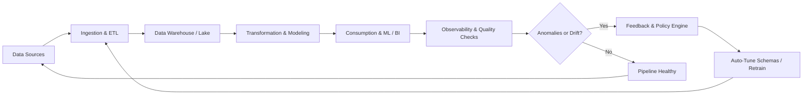

# Closed-Loop Data Engineering

## A Comprehensive Guide to Continuous Improvement of Data Pipelines, ML Models, and Data Infrastructure Through Automated Feedback

**Author:** Jack Liu Shurui  
**Classification:** Technology — Data Engineering / MLOps  
**Context:** Production ML and data systems in banking

---

## 1. What Is Closed-Loop Data Engineering?

Closed-Loop Data Engineering is an architectural approach where data pipelines incorporate feedback from downstream consumers — ML models, analytics systems, and business users — to automatically improve data quality, feature engineering, model performance, and pipeline reliability. The defining characteristic is a feedback path that completes a circuit from consumption back to production.

**The closed-loop data flow:**

```
Production Systems → Ingestion & Transformation → Feature Engineering & Store
→ Model Training & Serving → Applications & Business Decisions
→ Outcomes & User Feedback → Feedback Collection
→ Drift & Quality Monitoring → Loop Back → Ingestion / Transformation / Training
```



Data flows from production systems through pipelines to models and decisions, then outcomes and feedback travel back to improve the upstream stages. This contrasts with traditional **open-loop** data engineering where data flows unidirectionally from sources to consumers with no feedback path:

| Aspect | Open-Loop | Closed-Loop |
|---|---|---|
| Data flow | Unidirectional: sources → pipelines → consumers | Cyclical with feedback path |
| Error handling | Reactive (engineers paged) | Proactive (auto-detect and correct) |
| Model improvement | Manual retraining on fixed schedule | Automated retraining triggered by drift/performance |
| Quality management | Point-in-time development checks | Continuous monitoring with upstream feedback |
| Feature evolution | Static definitions, manual updates | Dynamic features evolving with production patterns |
| Business alignment | Assumed at design time | Continuously validated via outcome feedback |
| Regulatory compliance | Periodic audit snapshots | Continuous monitoring with audit trail |

The canonical closed-loop circuit has four stages: **Observe** (collect metrics, errors, outcomes), **Analyze** (compute drift scores, root causes), **Decide** (evaluate whether to act, apply guardrails), **Act** (retrain, repair, alert, or halt). The loop then repeats.

---

## 2. Why Closed-Loop Matters

**Data drift.** Production data changes constantly — customer behavior shifts, markets fluctuate, regulations evolve. When input distributions change, models degrade. Closed-loop systems detect drift and trigger pipeline updates automatically.

**Feature drift.** A feature highly predictive at training time can lose power as relationships change. Closed-loop engineering monitors feature importance (SHAP, permutation importance) and recomputes or replaces decaying features.

**Quality issues.** Data quality problems — missing values, outliers, schema violations — surface first in production. Closed-loop systems detect violations at every stage and feed metrics back to ingestion, enabling automated repair or alerting before downstream consumers are affected.

**Model improvement.** Every prediction error is a signal. Closed-loop systems collect production errors, validate them, and route them to retraining pipelines as high-value training examples (hard negative mining).

**Business alignment.** Pipelines and models exist to deliver value. Without outcome feedback there is no way to know if engineering efforts are creating value. Closed-loop systems track business outcomes and trigger investigation when they deviate from expectations.

**The banking imperative.** Regulatory frameworks increasingly require closed-loop capabilities:

| Regulation | Key Requirement | Closed-Loop Implication |
|---|---|---|
| BCBS 239 | Data lineage, quality management, audit trail | Continuous quality monitoring with documented feedback |
| SR 11-7 | Model risk management, ongoing monitoring | Automated drift detection, documented retraining |
| MAS FEAT | Fairness, accountability, transparency | Ongoing fairness monitoring, bias drift detection |
| GDPR / PDPA | Data subject rights, consent, accuracy | Feedback loops respect data deletion and consent changes |
| MAS Guidelines | Local compliance (Singapore) | All loop actions auditable and explainable |

---

## 3. Core Closed-Loop Components

### 3.1 Data Quality Feedback Loop

Production data quality issues (missing values, outliers, schema violations) → Feedback to ingestion/transformation pipelines → Automated repair or notification → Improved data quality → Monitor.

**Key processes:** Schema validation on every batch, completeness and freshness checks per source, anomaly detection on distributions, automated known-fix application (imputation, standardization), quality score trending, alerting on deterioration.

### 3.2 Model Performance Feedback Loop

Model predictions in production → Ground truth collection (delayed or immediate) → Performance metrics (accuracy, precision, recall, AUC) → Drift detection → Retraining trigger → Updated deployment → Improved predictions.

**Key processes:** Ground truth collection strategy (immediate/delayed/sampled), metric computation window, statistical drift tests (PSI, K-S, Jensen-Shannon), champion/challenger comparison.

### 3.3 Feature Engineering Feedback Loop

Production features analyzed for predictive power → Feature importance drift detection → Automated feature re-engineering → Feature store update → Improved model features → Better predictions.

**Key processes:** Scheduled feature importance computation, PSI monitoring on distributions, automated feature candidate generation from error clusters, feature store versioning, feature quality and staleness tracking.

### 3.4 Data Pipeline Reliability Feedback Loop

Pipeline execution metrics (success rates, latency, data volume) → Anomaly detection → Automated repair or alert → Improved reliability → Fewer failures.

**Key processes:** Execution success rate monitoring, data volume trend analysis, latency SLA tracking, automated retry with backoff, resource auto-scaling, root cause classification for recurring failures.

### 3.5 User Feedback Loop

End-user interactions (feedback, corrections, implicit signals) → Capture as training signals → Validate, deduplicate, label → Retrain models → Improved experience → More positive feedback.

**Key processes:** Explicit feedback (thumbs up/down, ratings, corrections), implicit signal capture (click-through, dwell time, follow-up queries), feedback validation, feedback-to-training-data pipeline, A/B testing of model improvements.

---

## 4. Architecture of a Closed-Loop Data System

### 4.1 Layered Reference Architecture

```
                      SOURCE SYSTEMS
                (Transactional DBs, APIs, Streams, Files)
                           │ (stream + batch)
                           ▼
┌──────────────────── INGESTION LAYER ──────────────────────┐
│ Kafka/Kinesis, Flink/Spark Streaming, Airbyte/Fivetran    │
│ Schema validation, format conversion, quality checks      │
└──────────────────────────┬───────────────────────────────┘
                           │ ← Quality feedback (schema violations, missing values)
                           ▼
┌──────────────────── DATA LAKE (Medallion) ────────────────┐
│  Bronze (raw, immutable) → Silver (cleaned, enriched)     │
│  → Gold (aggregated, business-ready)                      │
└──────────────────────────┬───────────────────────────────┘
                           │
                           ▼
┌─────────────────── FEATURE ENGINEERING ────────────────────┐
│ Spark/dbt/Tecton — computation, aggregation, windowing     │
│ Point-in-time correctness                                  │
└──────────────────────────┬───────────────────────────────┘
                           │ ← Feature quality feedback (drift, importance, staleness)
                           ▼
┌───────────────────── FEATURE STORE ───────────────────────┐
│ Feast/Tecton — online + offline serving, versioning       │
│ Feature monitoring, lineage                                │
└──────────────────────────┬───────────────────────────────┘
                           │
                           ▼
┌───────────────────── MODEL TRAINING ──────────────────────┐
│ MLflow/Kubeflow — experimentation, validation, registry    │
└──────────────────────────┬───────────────────────────────┘
                           │
                           ▼
┌────────────────────── MODEL SERVING ──────────────────────┐
│ BentoML/Sagemaker — real-time, batch, streaming           │
│ Prediction logging                                         │
└──────────────────────────┬───────────────────────────────┘
                           │
                           ▼
┌───────────────── APPLICATION / BUSINESS ──────────────────┐
│ Risk platforms, trading, customer apps, reports           │
│ Business outcomes (default, fraud, retention)             │
└──────────────────────────┬───────────────────────────────┘
                           │ (outcomes, user actions, corrections)
                           ▼
┌──────────────────── FEEDBACK COLLECTOR ───────────────────┐
│ Streaming + batch ingestion of feedback events            │
│ Explicit API/UI, implicit tracking, outcome ETL           │
│ Prediction logs, quality metrics                          │
└──────────────────────────┬───────────────────────────────┘
                           │
                           ▼
┌────────────────────── FEEDBACK STORE ─────────────────────┐
│ Time-series DB (metrics) + Document store (annotations)    │
│ Relational DB (structured feedback)                        │
└──────────────────────────┬───────────────────────────────┘
                           │
                           ▼
┌────────── DRIFT / QUALITY / PERFORMANCE MONITOR ─────────┐
│ Evidently/WhyLabs/Arize — drift detection (PSI, K-S)      │
│ Quality evaluation, pipeline reliability monitoring       │
└──────────────────────┬──────────────────┬────────────────┘
                       │                  │
                       ▼                  ▼
┌──────────────────┐  ┌────────────────────────┐
│ ALERT / TRIGGER  │  │    HUMAN OVERSIGHT      │
│ Auto-retrain       │  │ Review dashboard       │
│ Pipeline repair    │  │ Approve retraining     │
│ Alert / Halt      │  │ Validate feedback       │
└────────┬─────────┘  └────────┬───────────────┘
         └──────────┬──────────┘
                    ▼ (loop back to affected layer)
          [Ingestion / Transformation / Training / Serving]
```

### 4.2 Feedback Types

| Type | Examples | Collection | Latency |
|---|---|---|---|
| **Explicit** | Ratings, thumbs up/down, text corrections | API/UI widget | Real-time |
| **Implicit** | Click-through, dwell time, follow-up queries | Event tracking | Near real-time |
| **Outcome** | Loan default, fraud verdict, conversion | Batch ETL | Delayed (days–months) |
| **Model** | Prediction error, confidence, calibration | Prediction log analysis | Near real-time / batch |
| **Data** | Schema violation, missing value, distribution shift | Quality check results | Real-time / near real-time |

### 4.3 Feedback Collection Patterns

**Streaming feedback.** Real-time signals (user "Not Relevant" click, fraud investigator false-positive flag). Captured via event streams and immediately available for active learning or re-evaluation.

**Batch feedback.** Daily/weekly ground truth collection — loan repayment status, account closure. Extracted from operational stores via scheduled ETL.

**Delayed feedback.** Outcomes taking weeks/months — loan default (12–18 months), long-term customer value. Requires proxy metrics and careful handling of censoring.

**Human-in-the-loop feedback.** Manual review by domain experts — fraud alert investigation, credit risk validation, AML SAR review. Expensive but gold-standard; must be strategically sampled.

### 4.4 Feedback Storage

| Store Type | Use Case | Technologies |
|---|---|---|
| Time-series DB | Metrics, drift scores | InfluxDB, Prometheus, TimescaleDB |
| Document store | Annotations, corrections | MongoDB, Elasticsearch |
| Relational DB | Structured feedback (ratings, outcomes) | PostgreSQL, Oracle |
| Data lake | Raw events for replay | S3/ADLS, Delta Lake, Iceberg |
| Feature store | Feedback-derived features (correction rate) | Feast, Tecton |

### 4.5 Feedback Quality

Feedback is only as good as the signals it carries. **Validate** every signal — reject impossible values and contradictory data. **Deduplicate** repeated signals within time windows. **Sample strategically** for training — oversample informative signals (corrections, errors), undersample redundant ones. **Label carefully** — raw feedback may not map directly to training labels; apply heuristics or secondary models to convert raw signals.

---

## 5. Closed-Loop Data Quality

### 5.1 Quality Dimensions

| Dimension | Definition | Example Check |
|---|---|---|
| Completeness | All required data present | No nulls in mandatory fields |
| Accuracy | Data reflects real-world values | Amounts match source system |
| Timeliness | Data available within expected time | Batch before market open |
| Consistency | Data agrees across systems | Customer name matches CRM |
| Uniqueness | No unwanted duplicates | One loan record per ID |
| Validity | Data conforms to format rules | Valid dates, codes exist in reference table |

### 5.2 Quality Monitoring

Automated quality checks at each pipeline stage: schema validation on ingestion, completeness and freshness monitoring, anomaly detection on distributions, drift detection on feature distributions. Each check feeds results to a centralized quality monitor that evaluates trends and thresholds.

### 5.3 Feedback to Upstream

Quality violations trigger graduated responses based on severity:

| Violation | Severity | Response |
|---|---|---|
| Known schema fix (date format change) | Low | Auto-correct and log |
| Missing values in non-critical field | Low | Impute (mean, mode, forward-fill) |
| Source system schema change | High | Alert engineering team, log for audit |
| Freshness SLA breach | High | Alert source owner, trigger backup pipeline |
| Massive null rate (>50% critical field) | Critical | Halt pipeline, notify all stakeholders |
| Distribution shift exceeding threshold | Medium | Flag for drift analysis, trigger feature re-evaluation |

### 5.4 Data Contract Enforcement

Data contracts are formal agreements between producers and consumers specifying schema, freshness SLAs, quality thresholds, and expected behaviors. In a closed-loop system, contracts become enforceable through automated monitoring:

1. Contract defined and published
2. Monitoring evaluates data against contract terms
3. Breaches trigger feedback to source and engineering team
4. Violations trended over time to identify chronic issues
5. Contracts evolve based on production patterns

### 5.5 Automated Quality Improvement

Mature systems learn from production patterns: quality issues cluster in specific patterns that the system learns to predict and pre-empt. Rules that never fire are deprecation candidates. Thresholds generating too many false alarms are automatically relaxed; those missing real issues are tightened.

### 5.6 Banking-Specific Requirements

BCBS 239 mandates data lineage (complete traceability from source to report), data quality dashboards (real-time visibility), issue tracking and remediation, audit trails of quality improvements, and clear data ownership. A closed-loop quality system directly satisfies these by automating monitoring, maintaining full audit logs, and providing traceable feedback from violation through resolution.

---

## 6. Closed-Loop Feature Engineering

### 6.1 Feature Drift Detection

| Method | What It Measures | When to Use |
|---|---|---|
| PSI | Binned distribution difference | Categorical / binned continuous features |
| K-S Test | Max distance between cumulative distributions | Continuous features |
| Jensen-Shannon Divergence | Symmetric distribution difference | Probability distributions, embeddings |
| Feature Importance Drift | Change in SHAP / permutation importance | All features — detects predictive power decay |
| Correlation Drift | Change in feature-feature or feature-target correlations | Detecting relationship changes |

Features should be monitored at least as frequently as the retraining cadence. For high-frequency models (fraud, real-time credit), daily monitoring is recommended.

### 6.2 Automated Feature Update

| Drift Severity (PSI) | Action |
|---|---|
| Low (< 0.1) | Log and trend — no action |
| Medium (0.1–0.25) | Recompute on current data, update feature store version |
| High (> 0.25) | Recompute, evaluate predictive power, flag for deprecation |
| Importance drop > 30% | Trigger automated feature search for replacements |
| Correlation break | Recompute correlated set, evaluate multicollinearity |

### 6.3 Feature Feedback from Model

Every production prediction carries signal about feature influence. Aggregating SHAP values over time reveals which features consistently drive predictions, which are losing influence, and surprising contributions (potential quality or drift issues). Clustering prediction errors by feature values reveals gaps — e.g., "fraud predictions are wrong when amount > $10k" suggests a need for high-value transaction features.

### 6.4 Feature Store Integration

The feature store is the feedback loop hub: online + offline serving prevents training-serving skew, versioning ensures reproducibility, point-in-time correctness enables backtesting, built-in monitoring tracks drift and quality, and lineage tracks every feature's source data, transformations, and consuming models.

### 6.5 Automated Feature Engineering

At the highest maturity: error pattern analysis identifies model weaknesses → candidate features are generated (time-window aggregations, cross-feature interactions, external sources) → evaluated against validation data → A/B tested against baseline → validated features promoted to the feature store with automatic model retraining trigger.

### 6.6 Banking Context

**Credit risk:** Income distributions shift with economic changes; spending patterns evolve (post-COVID digital adoption). Closed-loop systems detect these shifts and update features automatically.

**Fraud detection:** Fraud patterns evolve rapidly. Closed-loop feature engineering continuously surfaces new indicators from production error patterns.

**Regulatory lineage:** Every feature change must be traceable for audit. The feature store maintains complete version history, and the feedback loop documents why each change was made.

---

## 7. Closed-Loop Model Retraining

### 7.1 Retraining Triggers

| Trigger | Description | Typical Threshold |
|---|---|---|
| Performance degradation | Metrics fall below threshold | Accuracy drop > 3%, AUC drop > 0.02 |
| Data drift | Input distribution shift | PSI > 0.2 on key features |
| Concept drift | Feature-target relationship change | Data drift on feature-target pairs |
| Schedule | Periodic retraining | Weekly, monthly, quarterly |
| Demand | New data, new requirements | On-demand |
| Feedback | Corrections or outcomes accumulated | > N corrections (e.g., 1,000) |
| Feature update | Feature store has new/updated features | On feature promotion |

### 7.2 Automated Retraining Pipeline

```
Trigger Detected (drift, degradation, schedule, demand)
    → Data Extraction (training window, feedback data, current features)
    → Feature Computation (engineering pipeline + point-in-time feature store)
    → Train / Validate (train/val/test split, hyperparameter optimisation, cross-val)
    → Model Evaluation (metrics vs. champion, drift, fairness, explainability)
    → Model Registry (log experiment, store artifact, tag stage, record lineage)
    → Approval Gate (automated for minor, human for major changes)
    → Deployment (canary, shadow scoring, full rollout, rollback capability)
    → Monitoring Resumes
```

### 7.3 Feedback to Training

**Production errors as training data (hard negative mining):** Every prediction the model gets wrong is a high-value training example. Systematically collect and route errors back to the training set with correct labels.

**User corrections as training labels:** When a user corrects a prediction (fraud analyst marks false positive, customer corrects risk segment), that correction is gold-standard data.

**Prediction calibration from outcome feedback:** When outcomes are eventually observed, recalibrate confidence scores. Adjust model probability outputs.

**Continuous learning:** For real-time use cases, update the model incrementally via online learning, streaming gradient updates, or periodic micro-batch training.

### 7.4 Human-in-the-Loop for Regulated Models

| Requirement | Implementation |
|---|---|
| Model updates require approval | Approval gate before deployment; automated for minor changes |
| Expert review of training data | Data scientist reviews new feedback examples before retraining |
| Validation of retrained model | Independent validation team evaluates (SR 11-7 requirement) |
| Documented retraining | Every run logged: trigger, data window, features, parameters, results |
| Model versioning and rollback | All versions in registry; rollback to champion supported |
| Regulatory approval for material changes | Documented and submitted where required |

### 7.5 Banking-Specific Retraining Governance

**SR 11-7:** Retraining triggers defined in model documentation. Retrained models validated by independent team. Model versioning and rollback required. All retraining decisions documented and auditable.

**MAS FEAT:** Retraining must not introduce or amplify bias. Fairness metrics monitored and included in evaluation. Retraining decisions explainable to regulators.

---

## 8. Closed-Loop Pipeline Reliability

### 8.1 Pipeline Monitoring

| Metric | What It Tracks | Typical SLA |
|---|---|---|
| Execution success rate | Fraction of runs completing | > 99.5% |
| Data volume | Records processed per run | ±20% of trailing 30-day avg |
| Latency | Time per pipeline stage | P95 < 30 min (batch), P99 < 100 ms (streaming) |
| Resource utilization | CPU, memory, I/O | < 80% sustained |
| Data freshness | Age of data at each stage | < 24h (batch), < 5 min (streaming) |
| On-time delivery | Pipelines before business deadlines | > 99% |

### 8.2 Automated Repair

| Issue | Automated Response |
|---|---|
| Transient failure | Retry with exponential backoff (max 3) |
| Source system down | Switch to backup or cached data |
| Data volume spike | Auto-scale compute (HPA, Spark dynamic allocation) |
| Data volume drop | Alert — validate before proceeding |
| Latency increase | Optimize: increase parallelism, tune partitions |
| Schema change | Log, alert, attempt auto-evolution |
| Resource exhaustion | Scale up, throttle ingestion, alert |
| Cascading failure | Halt downstream pipelines, preserve upstream data |

### 8.3 Feedback Loop Interactions

Pipeline failure → root cause classification → automated fix or alert → improved reliability. Known failure patterns trigger fixes; novel failures generate detailed alerts. Over time, the failure classification database becomes more comprehensive.

Data quality issues → upstream pipeline adjustment → fewer quality failures. Patterns originating from specific stages trigger additional validation or different transformation logic at that stage.

Data volume changes → auto-scale → consistent performance. Latency increases → optimize pipeline → faster processing. Each interaction strengthens pipeline resilience.

### 8.4 Banking-Specific Reliability

| Metric | Banking Target |
|---|---|
| RPO | < 1 hour for critical risk data |
| RTO | < 4 hours for regulatory reporting pipelines |
| SLA compliance | > 99.5% for risk data |
| DR test frequency | Quarterly full failover testing |
| Business continuity | Hot standby for critical pipelines |
| Audit trail coverage | 100% of pipeline executions and changes |

---

## 9. Tools and Platforms

### 9.1 Data Quality

| Tool | Type | Key Capabilities | Closed-Loop Integration |
|---|---|---|---|
| **Great Expectations** | Open-source | Automated expectations, data docs, batch validation | Custom actions trigger repair/alert; Airflow/Prefect/Dagster integrations |
| **dbt** | Transformation + testing | Data transformations, testing, lineage, CI/CD | Test failures trigger alerts or halt; integrated with orchestration |
| **Soda** | Quality monitoring | Automated checks, anomaly detection, SodaCL | Customizable notifications; feeds back to orchestration |
| **Monte Carlo** | Observability | End-to-end lineage, anomaly detection, root cause | Automated incident creation; PagerDuty/Slack integration |

**Banking stack:** Great Expectations (open-source checks) + dbt (transformation testing) + Monte Carlo (observability). Custom quality dashboards integrated with enterprise monitoring.

### 9.2 Feature Engineering

| Tool | Type | Key Capabilities | Closed-Loop Integration |
|---|---|---|---|
| **Feast** | Open-source | Feature serving, point-in-time correctness, monitoring | Distribution drift detection, version management |
| **Tecton** | Enterprise | Automated engineering, monitoring, drift detection | Built-in drift monitoring, auto-recomputation |
| **Hopsworks** | Enterprise | Feature engineering, monitoring, training data mgmt | Validation, drift monitoring, lineage |

**Banking stack:** Feast (open-source, Kubernetes/cloud integration) for initial deployments. Tecton for enterprise scale with built-in monitoring.

### 9.3 Model Monitoring

| Tool | Type | Key Capabilities | Closed-Loop Integration |
|---|---|---|---|
| **Evidently AI** | Open-source | Drift detection, model monitoring, LLM monitoring | Evaluation triggers retraining; MLflow/Airflow integration |
| **Arize AI** | ML observability | Drift, performance, embeddings, root cause | Automated alerting; model registry integration |
| **WhyLabs** | Monitoring | Drift, ML observability, data quality | Sagemaker/MLflow integration; automated triggers |
| **NannyML** | Open-source | Post-deployment perf estimation without ground truth | Triggers for retraining |

**Banking stack:** Evidently AI (open-source drift detection) + NannyML (delayed-feedback performance estimation). Enterprise: Arize or WhyLabs.

### 9.4 Pipeline Orchestration

| Tool | Type | Key Capabilities | Closed-Loop Integration |
|---|---|---|---|
| **Airflow** | Open-source | DAG scheduling, extensive operators, monitoring | Sensors for event-driven triggers; on-failure callbacks |
| **Prefect** | Modern orchestration | Auto-retries, observability, event-driven | Event-driven workflows; retry policies |
| **Dagster** | Data-aware | Asset-based, quality checks, observability | Asset lineage for quality propagation; built-in checks |
| **Flyte** | ML-specific | Typed interfaces, reproducibility, lineage | First-class ML workflow; versioned pipelines |

**Banking stack:** Airflow (mature, extensive banking adoption) or Dagster (data quality observability, regulatory lineage).

### 9.5 ML Platform

| Tool | Type | Key Capabilities | Closed-Loop Integration |
|---|---|---|---|
| **MLflow** | Open-source | Experiment tracking, model registry, deployment | Registry as retraining hub; monitoring integration |
| **Kubeflow** | K8s-native | Pipelines, training, serving, hyperparameter tuning | Full MLOps lifecycle; auto-retraining |
| **BentoML** | Model serving | Serving, deployment, monitoring, feedback collection | Prediction logging, feedback API, model management |
| **Seldon Core** | ML deployment | Canary, explainability, outlier detection, drift | A/B testing, monitoring and explainability integration |
| **ZenML** | MLOps framework | Pipeline orchestration, stack abstraction | Major tool integration; continuous training pipelines |

**Banking stack:** MLflow (experiment tracking + model registry) + BentoML (production serving with feedback collection).

### 9.6 Banking-Specific Platform Considerations

- Metrics should feed into enterprise monitoring (Prometheus + Grafana, Splunk, Datadog)
- Every loop action must be structured-logged for audit
- SIEM integration ensures pipeline changes are security-monitored
- Automated changes must comply with the bank's change management process
- Third-party tools must pass vendor risk assessment

---

## 10. Implementing Closed-Loop Data Engineering in Banking

### 10.1 Regulatory Requirements Mapping

| Regulation | Requirement | Closed-Loop Implementation |
|---|---|---|
| BCBS 239 — Data lineage | Every data point traceable source→consumption | Lineage tool (dbt) integrated with feedback store |
| BCBS 239 — Quality management | Continuous quality monitoring | Quality checks at every stage with feedback routing |
| BCBS 239 — Audit trail | All changes auditable | Structured logging: trigger → action → outcome |
| SR 11-7 — Model risk mgmt | Model lifecycle documented | MLflow with full lineage; retraining documented per SR 11-7 |
| SR 11-7 — Ongoing monitoring | Continuous performance monitoring | Automated drift detection with dashboards |
| MAS FEAT — Fairness | No discrimination; monitored | Fairness metrics at each retraining; bias drift monitoring |
| MAS FEAT — Transparency | Customers know model-driven decisions | Feedback loop logs decisions; customer notification triggers |
| GDPR / PDPA — Accuracy | Personal data kept accurate | Quality loop ensures accuracy; correction feedback path |
| GDPR / PDPA — Rights | Deletion, correction, access supported | Feedback store supports deletion on data subject request |

### 10.2 Implementation Approach

**Phase 1 — Foundation: Monitoring and Alerting (Months 1–3)**
- Deploy data quality monitoring at ingestion and key transformations
- Implement model performance monitoring for in-production models
- Set up drift detection dashboards (data, feature, concept drift)
- Establish alerting; document baseline quality and performance metrics

**Phase 2 — Feedback Collection (Months 3–6)**
- Implement explicit feedback collection (ratings, corrections)
- Integrate implicit feedback capture (clicks, dwell, follow-ups)
- Build outcome feedback pipelines (batch ETL from core systems)
- Create feedback validation, deduplication, and centralized storage

**Phase 3 — Automated Triggers (Months 6–9)**
- Define retraining trigger thresholds (drift scores, performance drops)
- Build automated retraining pipeline with approval gates
- Implement quality feedback routing (auto-fix, alert, halt)
- Deploy pipeline reliability auto-repair
- Establish champion/challenger workflow in model registry

**Phase 4 — Loop Integration (Months 9–12)**
- Integrate feature engineering feedback loop
- Connect loops across layers (quality → features → model)
- Implement A/B testing for loop improvements
- Establish loop health monitoring; document all actions for audit

**Phase 5 — Autonomous Operation (Months 12–18)**
- Self-healing pipelines for common failures
- Automated feature discovery from error patterns
- Predictive quality management
- Continuous learning for high-frequency models
- Achieve Level 4 maturity on key use cases

### 10.3 Typical Banking Use Cases

**Credit Risk Model Closed-Loop**
```
Loan application → Credit risk model → Prediction (approve/decline)
→ Loan disbursed → Track 12-24 months → Default/repaid outcome
→ Feedback → Retrain → Better credit risk predictions
```
Challenges: 12+ month feedback delay, macroeconomic shifts, regulatory validation of model changes.

**Fraud Detection Closed-Loop**
```
Transaction → Fraud model → Prediction (fraud/legitimate)
→ Investigation (human review) → Confirmed fraud / false positive
→ Feedback → Update features and model → Better fraud detection
```
Challenges: Near real-time feedback, rapidly evolving fraud patterns, class imbalance.

**Anti-Money Laundering Closed-Loop**
```
Transaction monitoring → AML model → Alert (SAR/non-SAR)
→ Investigation → Outcome (SAR filed / false positive)
→ Feedback → Reduce false positive rate → Model improvement
```
Challenges: < 1% true positive rate, high cost of missed SAR, expensive investigator feedback.

**Customer Analytics Closed-Loop**
```
Customer data → Segmentation/Recommendation model
→ Customer receives offer → Response (accept/reject/ignore)
→ Feedback → Improve segments/recommendations
→ Better engagement and retention
```
Challenges: Implicit vs. explicit feedback trade-offs, privacy and consent management, fairness balance.

### 10.4 Architecture Considerations

**On-premise or hybrid cloud.** Many banks operate on-premise or hybrid cloud due to data residency. Closed-loop components must run in the bank's chosen environment. Consider Kubernetes for portability.

**Air-gapped environments.** Highly sensitive data may require air-gapped processing. Feedback loops must operate within the air gap or have approved data transfer mechanisms.

**Integration with existing platforms.** Banks have significant investment in data lakes, warehouses, and lakehouses (Databricks, Snowflake, Teradata, Oracle). Closed-loop components integrate with these platforms rather than replacing them.

**Change management compliance.** All pipeline and model changes must comply with the bank's change management process. The system must integrate with change management ticketing (ServiceNow, Jira) for automated changes.

**Audit trail for all actions.** Every loop action logged with: trigger (drift score, quality violation), action taken (retraining, repair, feature update), outcome, reviewer/approver, timestamp and system state.

### 10.5 Success Metrics

| Metric | Description | Target |
|---|---|---|
| Model degradation incidents | Performance degradation impacting business | Reduce > 50% |
| Time-to-detect drift | Drift onset to detection | < 24h (from days/weeks) |
| Time-to-remediate drift | Detection to automated remediation | < 1h (from days) |
| Manual pipeline interventions | Manual fixes per month | Reduce > 70% |
| Data quality scores | Data passing quality checks | > 98% |
| Retraining cycle time | Trigger to deployed model | < 4h (from days) |
| False positive rate (fraud/AML) | False alerts as % of total | Reduce > 30% |
| Feedback loop contribution | % of improvement attributed to loops | > 60% |
| Regulatory audit pass rate | Data and model audits passed | 100% |
| Pipeline uptime | Critical pipeline uptime | > 99.5% |

---

## 11. Challenges and Pitfalls

### 11.1 Feedback Latency

**Problem:** Many feedback signals take weeks or months to observe (e.g., loan default at 12–24 months). During this delay, the model makes decisions on stale training.

**Mitigations:** Use proxy metrics (early payment as proxy for default) for immediate signals. Maintain multi-timescale models — short-term (proxy signals) and long-term (true outcomes), use censoring-aware training (survival analysis). Adjust retraining windows as feedback accumulates.

**Pitfall:** Don't wait for all delayed feedback before retraining. The model degrades while you wait. Use what you have and update continuously.

### 11.2 Feedback Quality

**Problem:** Feedback is inherently noisy — users give incorrect corrections, analysts mislabel cases, outcome data has quality issues. Bad feedback degrades the system.

**Mitigations:** Validate for impossible/contradictory values. Score feedback by confidence (expert > user > implicit). Require consensus before acting. Random-sample feedback for human quality review. Weight recent feedback higher than old.

**Pitfall:** Don't use all feedback equally. Build validation into the feedback pipeline before the training data pipeline.

### 11.3 Feedback Loop Complexity

**Problem:** Multiple feedback loops interact unpredictably. A retraining trigger changes feature distributions, which triggers a feature update, which requires a pipeline change, which causes a quality issue. Cascades are hard to debug.

**Mitigations:** Start with one loop; add others incrementally. Monitor loop stability (oscillation detection). Add cooldown periods between loop actions. Test loops independently before connecting. Centralize observability across all loops.

**Pitfall:** Closing all loops simultaneously causes instability. Loops can compete — model retraining improves accuracy, changing error patterns and feature importance, triggering feature updates that change performance again.

### 11.4 Infrastructure Cost

**Problem:** Storing all feedback data, running continuous monitoring, automated retraining, and maintaining snapshots is expensive.

**Mitigations:** Retention policies (raw feedback has window, aggregated metrics kept longer). Scheduled monitoring (hourly/daily) instead of continuous. Columnar compressed storage for feature snapshots. Archive old model artifacts to cheaper storage. Auto-scale feedback infrastructure based on volume.

**Pitfall:** Never assume storing everything is free. Feedback volume grows with user base. Design storage and compute budgets from day one.

### 11.5 Organizational Challenges

**Problem:** Requires collaboration across data engineering, ML engineering, data science, and business teams. Requires cultural shift from "build once" to "continuous improvement." Few engineers have closed-loop experience.

**Mitigations:** Cross-functional closed-loop owner. Phased rollout starting with one use case. Investment in drift detection and feedback engineering training. Comprehensive documentation and runbooks. Executive sponsorship for the program.

**Pitfall:** Don't underestimate organizational change. Teams organized by function may resist the cross-functional nature of closed-loop systems. Consider reorganizing around data products or ML use cases.

### 11.6 Avoiding Common Pitfalls — Summary

| Pitfall | Prevention |
|---|---|
| Starting all loops at once | Implement one; validate; add others incrementally |
| Acting on unvalidated feedback | Validate quality before using for training or pipeline changes |
| No human oversight | Implement guardrails, approval gates, escalation paths |
| Ignoring loop health | Monitor loops — are they improving outcomes? |
| No audit trail | Log every action: trigger, action, outcome, approval |
| Assuming feedback is always correct | Build validation, deduplication, confidence scoring |
| Blindly trusting drift thresholds | Calibrate based on observed impact; tune over time |
| Forgetting concept drift | Monitor feature-target relationship drift, not just data drift |
| Over-reliance on automation | Know when to escalate; document escalation criteria |
| Ignoring regulatory requirements | Design audit trail and compliance into the architecture |

---

## 12. Closed-Loop Maturity Model

### Level 1 — Ad Hoc

Monitoring is manual or non-existent. Issues detected reactively (user reports, incidents). No automated feedback path. Pipelines rebuilt from scratch for new data sources or model updates. Data quality checked manually and inconsistently. Model retraining is ad-hoc. No feature monitoring or versioning. No centralized feedback.

**Transition to Level 2:** Deploy automated monitoring and alerting. Establish basic data quality checks. Introduce scheduled retraining.

### Level 2 — Basic

Automated monitoring and alerting for pipeline execution (success/failure). Model performance dashboards. Basic quality checks at ingestion. Manual retraining on fixed schedule (monthly/quarterly). Feedback collected manually (spreadsheets). Alerts sent to engineering team but no automated response. Feature definitions static.

**Transition to Level 3:** Automate drift detection. Build feedback collection pipelines. Implement triggered retraining. Centralize feedback storage.

### Level 3 — Defined

Automated drift detection (data, feature, concept drift). Triggered retraining based on drift or performance degradation. Automated data quality feedback to upstream pipelines. Feature monitoring (distribution, importance, quality). Feedback stored centrally. Model registry with versioning and lineage. Documented feedback loops with clear ownership.

**Transition to Level 4:** Implement closed-loop feature engineering. Add pipeline auto-repair. Introduce A/B testing for loop improvements. Move to proactive issue prevention.

### Level 4 — Managed

Closed-loop feature engineering: auto-recompute on drift, auto-deprecate stale features. Automated retraining with validation gates (performance, fairness, explainability). Pipeline auto-repair for common failure modes. A/B testing of loop improvements. Proactive issue prevention (predictive quality). Feedback quality metrics tracked. Loop health monitoring. Multi-timescale models (short-term proxy, long-term outcome).

**Transition to Level 5:** Self-healing pipelines for all common failures. Autonomous feature discovery. Continuous learning. Predictive quality management.

### Level 5 — Optimized

Self-healing pipelines with automatic root cause analysis and repair. Autonomous feature discovery (ML-driven candidate generation from error patterns). Continuous learning (streaming model updates). Predictive quality management (issues predicted before they occur). Fully automated closed-loop with human oversight for strategic decisions. Feedback loops optimize themselves (threshold tuning, sampling strategies, retraining cadence). Complete audit trail with automated compliance reporting.

**Note:** Level 5 is aspirational. Even the most advanced banks and technology companies operate at Level 3–4 for their most mature use cases. The goal is continuous progression, not perfection.

### Maturity Assessment Matrix

| Domain | Level 1 | Level 2 | Level 3 | Level 4 | Level 5 |
|---|---|---|---|---|---|
| Monitoring | None | Execution + performance | + Drift + quality | + Predictive | Self-optimizing |
| Feedback | None | Manual collection | Centralized store | Validated + quality-scored | Self-correcting |
| Retraining | Manual ad-hoc | Scheduled manual | Triggered automated | Gated validated | Continuous learning |
| Features | Static | Versioned | Monitored for drift | Auto-updated | Auto-discovered |
| Pipelines | Rebuilt | Monitored | Documented | Auto-repaired | Self-healing |
| Quality | None | Basic checks | Automated feedback | Predictive | Self-preventing |
| Audit | None | Execution logs | Loop documentation | Compliance automated | Regulatory integrated |

---

## 13. Conclusion

Closed-Loop Data Engineering represents a fundamental shift from treating data pipelines, features, models, and quality as separate concerns with manual handoffs, to integrating them into a continuous improvement cycle powered by production feedback.

**Key takeaways:**

1. **Start with monitoring.** You cannot close a loop you cannot observe. Invest in monitoring before building feedback paths.
2. **Feedback is a first-class data product.** Treat it like source data — validate, store, version, and monitor its quality. Bad feedback is worse than no feedback.
3. **Close one loop at a time.** Data quality first, then model performance, then feature engineering, then pipeline reliability. Each builds on the previous.
4. **Design for audit from day one.** In banking, every automated action must be explainable and traceable. Build audit logging and approval gates into the architecture.
5. **Regulation is an enabler.** BCBS 239, SR 11-7, and MAS FEAT require precisely what closed-loop systems provide — continuous monitoring, traceable improvements, documented processes.
6. **Maturity is a journey.** Most organizations are at Level 2–3. The goal is continuous progression, not overnight transformation.
7. **It's an organizational capability, not just a technical one.** It requires cross-functional collaboration, cultural change, and sustained investment.

**The future:** As banking AI matures and regulatory scrutiny intensifies, closed-loop data engineering will evolve from competitive advantage to competitive necessity. Organizations investing in closed-loop infrastructure today will be better positioned to deploy AI in regulated environments, respond to new regulations with agility, improve models continuously without manual overhead, maintain data quality at scale, and build trust with regulators through transparent, auditable systems.

The closed-loop paradigm is not just a technical architecture — it is the operational model for data and AI in the regulated enterprise of the future.

---

*This guide is part of the Technology research series by Jack Liu Shurui, Solution Architect at Cymbal Bank. It sits at the intersection of data engineering (data integration, schema evolution, data mesh, lakehouse) and ML/AI (MLOps lifecycle, drift detection, feature store, production ML systems).*
