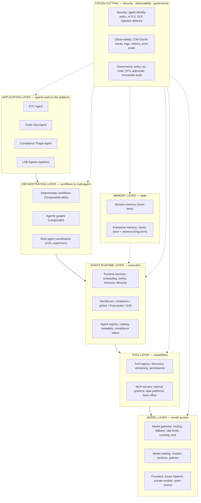

# Enterprise Agentic Platform Architecture: A Comprehensive Guide

> **Author:** Jack Liu Shurui  
> **Role:** Solution Architect, Crédit Agricole CIB  
> **Date:** August 2026  
> **Version:** 1.0  
> **Repository:** github.com/jackliusr/research  
> **Series:** AI/LLM Engineering Guides — Agent & Platform Architecture track

---

## Table of Contents

1. [The Platform Vision](#1-the-platform-vision)
2. [The Platform Layers](#2-the-platform-layers)
3. [Architectural Patterns](#3-architectural-patterns)
4. [Components in Depth](#4-components-in-depth)
5. [Non-Functional Requirements](#5-non-functional-requirements)
6. [Enterprise Integration](#6-enterprise-integration)
7. [Deployment and Operations](#7-deployment-and-operations)
8. [Worked Example: A Bank's Agentic Platform](#8-worked-example-a-banks-agentic-platform)
9. [The Future: 2026 and Beyond](#9-the-future-2026-and-beyond)
10. [Glossary](#10-glossary)

---

## 1. The Platform Vision

### 1.1 What Is an Enterprise Agentic Platform?

An **enterprise agentic platform** is the enterprise-wide layer for **building, running, and governing AI agents** — the shared infrastructure that turns "an agent demo" into "a portfolio of governed, observable, cost-controlled agents in production." It is the answer to a very specific failure mode: every team building agents independently, each with its own model keys, its own tool integrations, its own ad-hoc sandboxing, and its own (usually absent) audit trail.

Where the vendor-survey companion to this guide ([enterprise_ai_platforms_guide.md](enterprise_ai_platforms_guide.md)) catalogues the commercial and hyperscaler platforms you can *buy*, this guide is the **reference architecture** for *building* an enterprise-grade agentic platform — the layers, the patterns, the components, the non-functional requirements, and the integration with the surrounding enterprise. The two are complementary: most banks end up with a thin veneer of a purchased platform over a substantial amount of in-house platform engineering.

A platform is not a single product. It is a **set of services with contracts**:

| Platform service | What it provides | Typical form |
|---|---|---|
| Model gateway | Unified, governed access to all LLMs | Service + catalog |
| Agent runtime | Execution environment for agents | Service + sandboxes |
| Tool registry / MCP hub | Standardized, permissioned tools | Service + protocol |
| Memory layer | Session + enterprise (long-term) memory | Service + vector store |
| Orchestration | Workflow + multi-agent execution | Service + engines |
| Observability | Traces, logs, metrics, evals | Service + pipeline |
| Governance | Policies, approvals (HITL), audit | Service + registry |
| Security | Identity, authz, data protection | Cross-cutting |

### 1.2 Platform vs. Framework vs. Application

The single most important conceptual boundary in this space. The three words are constantly conflated, and the conflation produces bad architecture:

| Concept | What it is | Analogy | Example | Where it lives |
|---|---|---|---|---|
| **Platform** | Shared **infrastructure** — the services that multiple applications consume | The bank's core systems, the factory floor | Model gateway, agent runtime, tool registry, audit service | Operated centrally, consumed by many |
| **Framework** | A **library** you import into your code — code-level scaffolding | The SDK, the toolchain | LangChain/LangGraph, CrewAI, LlamaIndex, the agent loop in [agent_scaffolding_guide.md](agent_scaffolding_guide.md) | Inside each application's codebase |
| **Application** | A **specific agent** solving a specific business problem | The product built on the factory floor | "KYC Document Agent", "Trade Surveillance Triage Agent" | One per use case, built by a delivery team |

The platform **hosts** applications; applications **embed** frameworks. A platform team does not write agent loops — it provides the runtime that executes them, the gateway they call, the tools they may use, and the governance that watches them. A framework decision (LangGraph vs. CrewAI vs. Claude Agent SDK) is an application-level decision that the platform must be agnostic to — which is precisely why the platform defines **interfaces** (OpenAI-compatible APIs, MCP, OpenTelemetry, OAuth) rather than framework APIs.

> **Rule of thumb:** if two or more applications need it, it belongs in the platform. If exactly one application needs it, it belongs in the application. If it's a library call, it belongs in the framework. The platform is the *noun*, the framework is the *verb* the application uses.

### 1.3 Why a Platform? (The Rationale)

The case for a platform is the classic case for shared infrastructure, sharpened by the peculiar economics and risk of agents:

- **Reuse.** One model gateway, one tool registry, one memory service, one tracing pipeline — instead of N teams each building them badly. The first agent costs the platform; the hundredth agent costs a sprint.
- **Governance.** Agents act; acting without governance is how banks get sanctioned. A platform is the only realistic place to enforce policy-as-code, human-in-the-loop approvals, and immutable audit trails uniformly (see [implementing-responsible-ai.md](implementing-responsible-ai.md)).
- **Security.** Model keys, secrets, PII handling, prompt-injection defense, and tool authorization are *hard* and *centralizable*. A platform gives security teams one place to inspect, one place to patch, one place to certify (see [llm_guard_models_guide.md](llm_guard_models_guide.md)).
- **Scale.** Autoscaling, rate limiting, token budgeting, and cost attribution only work when traffic flows through shared infrastructure. A platform makes "a thousand agents" an operations problem, not a miracle.
- **Portability & resilience.** A gateway with fallback chains means no single vendor outage takes down the bank's agents (see [enterprise_ai_platforms_guide.md](enterprise_ai_platforms_guide.md) for vendor-lock-in analysis).

**Platform as a product.** The corollary of the above: the platform is not an IT project, it is an internal product with users (the agent-building teams), a roadmap, SLAs, and a product owner. Teams that treat their platform as a product get adoption; teams that treat it as a mandate get shadow IT — ungoverned agents built around the platform, which is worse than no platform at all.

### 1.4 Platform Scope

What is in scope for the platform (and, just as importantly, what is not):

**In scope — the platform owns:**
- **Model access** — every LLM call the enterprise makes goes through the model gateway. No direct provider keys in application code, ever.
- **Agent runtime** — where agents execute: scheduling, lifecycle, sandboxing, retries, timeouts.
- **Tools** — the registry of permitted tool integrations, exposed through MCP, with per-tool permissions.
- **Memory** — session memory and the enterprise memory service (vector store, retrieval, PII redaction).
- **Observability** — traces, logs, metrics, and production evals, all correlated by agent/trace IDs.
- **Governance** — policy-as-code, approval workflows, agent registry, audit trail, cost governance.

**Out of scope — the platform does *not* own:**
- **The business logic of any specific agent** (that is the application team's job).
- **The choice of framework** inside an application (the platform is framework-agnostic).
- **The data itself** (the platform integrates with enterprise data platforms; it does not own them).

### 1.5 Platform Principles

Four principles that should survive any technology churn:

1. **Least privilege.** Every agent, every tool call, every model access gets the *minimum* permission required — an agent that only reads reference data cannot write to the core system, and a model that only needs embeddings cannot call the full chat API. This is the single most effective control against the "excessive agency" risk class (OWASP LLM Top 10 2025, LLM01/LLM08 — see §4.7).
2. **Governed autonomy.** Agents are autonomous by default but *governed* by default too: autonomous execution, with policy checkpoints, approval gates for sensitive actions, and the ability to pause/kill any agent at any time.
3. **Observable by default.** Every agent run produces a complete trace (agent → step → tool call → LLM call), every LLM call records cost and latency, every decision point is logged. Observability is not retrofitted; it is a platform contract.
4. **Secure by design.** Identity for agents (not just humans), mTLS between services, encryption of data in transit and at rest, prompt-injection defenses at the boundary, and no secrets in application code. Security is designed into the layers, not bolted on.

### 1.6 Reference Architecture Overview

The platform stack, from the applications that consume it down to the models it fronts:



In words: applications (agents) sit on top; the orchestration layer coordinates workflows and multi-agent interactions; the agent runtime executes agent steps in sandboxes; the tool layer gives agents permissioned access to enterprise capabilities via MCP; the model layer fronts all LLM providers through a single gateway; the memory layer provides state. Security, observability, and governance cut across every layer — they are not layers themselves so much as contracts every layer must honor.

## 2. The Platform Layers

### 2.1 Model Layer — the Model Gateway

**The LLM gateway is the choke point for all model traffic.** No application, no agent, and no framework ever calls a model provider directly; every call goes through the gateway. This one architectural decision buys most of the platform's value:

- **Unified model access.** One OpenAI-compatible endpoint in front of Azure OpenAI, AWS Bedrock, Google Vertex, private/self-hosted models (vLLM, Ollama — see [ollama_xinference_localai_guide.md](ollama_xinference_localai_guide.md)), and open-source deployments. Applications code against the gateway, not against vendors.
- **Routing.** The gateway routes each request to the appropriate model — cost/latency-based routing, task-classified routing, or explicit per-application routing (see §2.1.3).
- **Fallback.** If the primary model is down, rate-limited, or returns garbage, the gateway fails over to a secondary model transparently.
- **Rate limiting.** Per-tenant, per-agent, per-model limits, enforced centrally (the alternative — provider-side limits — hits everyone at once).
- **Cost tracking.** Every call is metered: tokens in/out, model, price, tenant, agent. This is the raw material for FinOps (see [finops_guide.md](../technology/finops_guide.md)).
- **Caching.** Semantic or exact-match prompt caching at the gateway saves cost and latency (see [agent_runtime_cache_design_guide.md](agent_runtime_cache_design_guide.md)).
- **Observation.** The gateway is the natural place to emit OpenTelemetry GenAI spans (see §4.5) and to enforce guardrails (see [llm_guard_models_guide.md](llm_guard_models_guide.md)).

**Model management — the model catalog.** The gateway fronts a *catalog*: the set of models the enterprise permits, with versions, capabilities (context length, modalities, tool-calling support), pricing, latency profiles, data-residency classification (is this model allowed to see PII? is it hosted in-region?), and lifecycle state (candidate → approved → deprecated). New models enter the catalog only after evaluation (see [llm_evaluation_frameworks_guide.md](llm_evaluation_frameworks_guide.md)); models leave only after a migration window. The catalog is the single source of truth that routing, cost governance, and compliance all read from.

**Model routing — "route to the cheapest sufficient model".** The gateway routes each request to the cheapest model that can handle it:

- **Rule-based routing.** Explicit rules: "classification → small model; tool-calling → frontier model; summarization → medium model; this application always → model X." Simple, explainable, auditable — the default for banking.
- **Classifier-based routing.** A lightweight router model or embedding-similarity classifier scores request difficulty and maps it to a tier. The RouteLLM research line demonstrated roughly **85% cost savings while retaining ~95% of GPT-4-level quality** on controlled evals; production reports of 50–70% cost reduction from tiered routing are common (see [llm_latency_optimization_guide.md](llm_latency_optimization_guide.md) for the latency side).
- **Dynamic/feedback routing.** Escalate on failure: if the small model's answer fails a quality check, retry with the larger model. This "escalation on evidence" pattern is the most robust in production.

Routing policy is policy-as-code: it lives in the catalog/gateway config, is versioned, and is auditable — not hard-coded in applications.

### 2.2 Agent Runtime Layer

The agent runtime is where agents *execute*. It is the platform's answer to "how do we run thousands of stateful, long-running, tool-calling agent processes safely?"

**Agent execution lifecycle.** The runtime manages every agent through a defined lifecycle:

```
init → run → observe → terminate
        ↕ (pause / resume / retry / checkpoint)
```

- **init** — instantiate the agent: load its configuration, its permitted tools, its identity and permissions, its memory scopes.
- **run** — execute the agent loop (perceive → reason → act → observe) inside a sandbox; the loop itself is framework code (see [agent_scaffolding_guide.md](agent_scaffolding_guide.md)); the runtime provides the execution substrate.
- **observe** — emit traces, metrics, and logs for every step; persist state; check governance checkpoints.
- **terminate** — clean shutdown, persist final state, release sandbox resources. Plus runtime-initiated **kill** (policy violation, runaway loop, human override) and **pause/resume** (HITL approval gates, long-running workflows).

**Runtime services.** The execution services that make agents production-grade rather than demo-grade:

- **Scheduling** — when an agent is triggered (API call, event, cron), the runtime schedules its execution.
- **Retries with backoff** — transient failures (provider 429s, tool timeouts) are retried with exponential backoff and jitter.
- **Timeouts** — per-step and per-run budgets: a step that hangs for 60s, a run that exceeds 30 minutes, a loop that exceeds N iterations — all bounded. Unbounded agents are the classic cost and reliability failure.
- **Checkpointing / durable state** — the runtime persists agent state at step boundaries so a crash resumes from the last checkpoint rather than restarting (durable execution; see [durable_ai_agent_workflows_guide.md](../technology/durable_ai_agent_workflows_guide.md)).
- **Sandboxing** — every agent runs in an isolated execution environment (see below).
- **Lifecycle management** — start, pause, resume, kill, and the state machine in between (see §4.3).

**Runtime isolation.** Agents execute untrusted-ish code (LLM-generated tool calls, possibly generated code) and must be contained:

| Isolation level | Mechanism | Overhead | Use case |
|---|---|---|---|
| Process | OS process per agent | Lowest | Low-risk, well-vetted tools only |
| Container | Docker/K8s pod per agent | Low | The default for most agent workloads |
| User-space sandbox | gVisor (user-space kernel intercepting syscalls) | Medium | Untrusted tool code, stronger isolation without VM |
| MicroVM | Firecracker (KVM-based, ~125ms boot, ~5 MiB footprint) | Medium | Serverless-scale isolation, multi-tenant untrusted code |
| Managed sandbox | E2B (or Modal/Daytona) — sandbox-as-a-service for AI code execution | Low (external) | Fast time-to-value; data-residency considerations |

Practical guidance: **hardened containers for the default tier, gVisor or Firecracker for anything that executes LLM-generated code or untrusted input, managed sandboxes (E2B) where velocity matters and data residency permits** (see §4.3.2 for the full comparison).

### 2.3 Tool Layer

**The tool registry** is the platform's catalog of everything an agent may do: search, database queries, API calls to internal systems, email drafting, payments, etc. Registry responsibilities:

- **Registration** — tools are registered with a canonical name, an OpenAPI/JSON-Schema definition, a description, an owner, and a version.
- **Discovery** — agents (and their developers) can discover what tools exist and what they do; the registry feeds tool descriptions to the model at runtime.
- **Versioning** — tools are versioned; agents pin to versions; breaking changes go through the same deprecation process as models.
- **Permissions** — every tool carries a permission profile: which agents/roles may call it, with what parameters, and whether human approval is required (see §2.3.3).
- **Classification** — read-only vs. write vs. destructive; internal vs. external; PII-touching vs. not. Classification drives routing to approval workflows.

**The MCP layer.** The Model Context Protocol is the standardization layer that keeps the tool layer from becoming an integration swamp. MCP (created by Anthropic in late 2024, donated to the **Agentic AI Foundation under the Linux Foundation in December 2025**, with founding platinum members including AWS, Anthropic, Block, Bloomberg, Cloudflare, Google, Microsoft, and OpenAI) defines a client–server architecture: **MCP hosts** (applications) contain **MCP clients** that connect to **MCP servers**, each of which exposes tools, resources, and prompts over JSON-RPC. The platform's tool layer is, in effect, an **MCP hub**: one place where internal systems publish MCP servers, where their tools are registered and permissioned, and where every agent connects once. The deep dive on MCP architecture, transport, and security lives in [mcp_framework_tools_guide.md](mcp_framework_tools_guide.md).

**Tool permissions — tool-level authorization (least privilege).** The registry enforces, per call: *is this agent allowed to call this tool at all? with these parameters? in this context?* Tool calls are the agent's hands; permissioning them is the difference between a demo and a banking platform. Sensitive tools (payments, client data writes, external communications) sit behind **human approval gates** (see §4.7.2), and every tool call is logged with the agent identity that made it.

### 2.4 Memory Layer

Agents without memory are functions; agents with memory are employees. The memory layer provides both short-term and long-term state:

- **Session memory (short-term).** The working context of a single conversation/run: recent messages, intermediate results, in-progress task state. Managed by the runtime (checkpointed, bounded), typically ephemeral.
- **Enterprise memory (long-term).** The organization's accumulated, retrievable knowledge: past interactions, entity knowledge, preferences, decisions, and learned facts. Backed by a **vector store** for semantic retrieval plus structured stores for facts (see [vector_databases_guide.md](vector_databases_guide.md) for the store comparison — pgvector, Milvus, Qdrant, OpenSearch, etc.).

The memory layer is exposed as **memory-as-a-service** rather than embedded per-application:

- **Mem0** — a bolt-on memory layer: an API that extracts, stores, and recalls facts across sessions without rewriting the agent loop. Good when you want memory without changing your runtime.
- **Letta (MemGPT lineage)** — a full agent runtime with OS-inspired memory: a memory hierarchy the agent itself manages and edits (self-editing memory). Good when memory management needs to be first-class.
- **Zep** — temporal knowledge graphs over conversation history; strong for entity-relationship recall.
- **LangMem / Graphiti / Cognee** — framework-integrated memory and knowledge-graph memory.

Platform decision: standardize on the *interfaces* (a memory service API: store, recall, search, forget) and make the underlying implementation swappable — the enterprise memory service is a platform component, not an application choice (see §4.4 for memory design and PII handling).

### 2.5 Orchestration Layer

The orchestration layer decides *what runs when, in what order, and who coordinates whom*:

- **Deterministic workflows.** Business processes that must be exact: "onboarding workflow: check sanctions → check KYC → open account → notify." Executed on durable workflow engines (Temporal, or a bank's existing BPM) where every step is retryable and auditable. These are *workflows with LLM steps*, not free-form agents.
- **Agentic orchestration.** Graph-based, stateful agent execution where the model decides the path: LangGraph (durable execution for stateful, long-running agents; checkpointing; human-in-the-loop interrupts), CrewAI (role-based crews), Claude Agent SDK, etc. The graph structure makes agent paths *visible and reviewable* — a governance win.
- **Multi-agent orchestration.** Supervisor/worker hierarchies, peer collaboration, and cross-platform agent communication via **A2A** (see §3.3). Deep dive: [hybrid_multi_agent_systems_guide.md](hybrid_multi_agent_systems_guide.md).

**Orchestration engine comparison** (verified):

| Engine | Paradigm | Strengths | Weaknesses | Best for |
|---|---|---|---|---|
| **LangGraph** | Stateful agent graph, durable execution | Fine-grained control; checkpoint/resume; HITL interrupts; framework-agnostic model calls; huge ecosystem | Framework coupling; you own the infrastructure | Agentic workflows inside one platform runtime |
| **Temporal** | Code-first durable workflows | Battle-tested durability (fintech standard); retries, timers, saga patterns; language-agnostic | Not agent-native — no built-in LLM semantics; you write workflow code | Long-running deterministic business workflows with LLM steps |
| **Airflow** | DAG-based batch scheduling | Mature, familiar, huge operator ecosystem | Not designed for interactive/long-running stateful agents; DAGs are static | Scheduled batch pipelines that invoke LLM steps (reporting, ETL-with-LLM) |

The platform pattern: **Temporal (or equivalent) for the deterministic spine, an agent graph engine for the agentic paths, and the event bus for triggers** — each used where it is strongest, all emitting to the same observability and audit pipelines.

### 2.6 Application Layer

The top of the stack: the agents themselves — use cases built on the platform (the catalog of what agents *are* for is in [llm_agent_use_cases.md](llm_agent_use_cases.md)). The platform's application-layer responsibilities are the **agent registry** and the **developer experience** (SDKs, CI/CD, templates, a self-service portal).

**The agent registry** is the platform's catalog of deployed agents — the operational complement to the model catalog:

- **Inventory** — every deployed agent: name, version, owner team, purpose, framework, runtime class, tools permitted, models used, data touched.
- **Metadata** — risk classification, compliance status, approval history, cost allocation tags, PII handling declaration.
- **Compliance** — which agents are approved for production, which are in pilot, which have been retired; the registry is the source of truth for "what agents do we actually run?" — the answer to the *shadow AI* problem and a direct input to regulatory attestation (MAS, EU AI Act — see [financial_risk_compliance_systems_guide.md](../banking/financial_risk_compliance_systems_guide.md)).
- **Lifecycle** — promote/deprecate/retire, with the audit trail attached.

The agent registry is not a spreadsheet; it is a service that the runtime, the governance layer, and the audit pipeline all read and write. (Verified as an emerging standard practice — hyperscaler platforms all ship agent registries/catalogs; see [enterprise_ai_platforms_guide.md](enterprise_ai_platforms_guide.md).)

### 2.7 Cross-Cutting Layers: Security, Observability, Governance

Three cross-cutting concerns weave through every layer above. They get their own sections in depth (§4.5–§4.7), but their shape is fixed here:

- **Security** — identity for agents and humans; authorization (RBAC/ABAC) on every model call, tool call, and memory access; mTLS between platform services; secrets never in application code; data protection (encryption, DLP, PII controls); prompt-injection defenses at the gateway and tool boundaries.
- **Observability** — one telemetry pipeline (OpenTelemetry, GenAI semantic conventions) capturing traces, logs, and metrics from every layer, correlated by trace/agent/request IDs; production evals and drift detection on top (see [ai_agent_drift_guide.md](ai_agent_drift_guide.md)).
- **Governance** — policy-as-code enforced at the gateway, runtime, and tool layer; human-in-the-loop approval workflows; the immutable audit trail; cost governance (token budgets, attribution); the agent registry above.

The platform's *contract* with every layer: **you may run, but you are observed, permissioned, and auditable.**

## 3. Architectural Patterns

Six patterns dominate enterprise agentic architecture. They are not mutually exclusive — a large bank typically runs **hub-and-spoke with gateway-centric model access, sidecars everywhere, event-driven triggers, and a federated domain-agent model**, with an agent mesh emerging as standards mature.

### 3.1 Gateway-Centric (All Model Traffic Through the Gateway)

**Structure:** a single model gateway is the *only* path to any LLM. Applications, agents, and frameworks all call the gateway; the gateway fronts every provider, enforces policy, meters cost, and emits telemetry.

**Why it wins:** every other control (cost governance, rate limiting, fallback, PII redaction, guardrails, vendor portability) becomes a configuration change in one place instead of a coordinated change across hundreds of applications. It is the load-bearing pattern of the whole platform — §2.1 assumes it.

**Costs:** the gateway is a single point of failure (mitigate: HA deployment, multi-region, failover) and a potential bottleneck (mitigate: horizontal autoscaling — it is stateless beyond config/cache).

### 3.2 Hub-and-Spoke (Central Platform + Spoke Applications)

**Structure:** the central platform (the "hub": gateway, runtime, registry, governance, observability) is consumed by "spoke" applications — the LOB agent teams and their applications — over well-defined APIs. Spokes plug in their tools, their memory scopes, their agents; the hub provides the shared services.

**Why it wins:** matches the enterprise reality of central platform teams and distributed delivery teams; gives the platform team control points without owning application logic. This is the canonical enterprise pattern (and the shape of §8's bank architecture).

**Costs:** hub becomes a dependency — spokes can stall if the hub is slow; requires strong platform SLAs and a self-service developer experience, or spokes will route around it (shadow IT).

### 3.3 Agent Mesh (Agents Communicating — A2A)

**Structure:** agents from different teams, platforms, or vendors communicate directly over an interoperability protocol. The emerging standard is **A2A (Agent2Agent)**: created by Google, released April 2025 (Apache-2.0), donated to the **Linux Foundation in June 2025** with founding members AWS, Cisco, Google, Microsoft, Salesforce, SAP, and ServiceNow. A2A defines an **Agent Card** (public capability description), task-oriented messaging (agent → agent task delegation with status tracking), and supports streaming and push notifications over HTTP/JSON-RPC-ish semantics, with the security model built on existing enterprise identity (OAuth 2.0 / OpenID Connect / mTLS).

**Why it wins:** breaks the monolith — a bank's KYC agent can delegate to a sanctions-screening agent owned by a different team without a shared codebase; enables vendor-platform interop as the hyperscaler platforms adopt A2A.

**Costs:** protocol maturity (still evolving), cross-org trust engineering, and observability across agent boundaries (traces must span agents). Mesh without registry/governance = chaos; the mesh must sit on the platform, not beside it.

### 3.4 Sidecar (Agent Sidecars)

**Structure:** each agent (or agent runtime pod) runs alongside a sidecar process providing the platform's cross-cutting services locally: telemetry export (traces/logs/metrics forwarded to the platform pipeline), authentication/token acquisition, policy enforcement (local guardrail proxy), and secret injection. Borrowed from service-mesh practice (Envoy-style).

**Why it wins:** applications don't need SDKs for every platform service — the sidecar implements the contracts; uniform behavior across frameworks (LangGraph agents, CrewAI agents, custom loops all get identical telemetry and authn); upgrades to platform services roll out without touching application code.

**Costs:** per-pod resource overhead; sidecar lifecycle must be managed; more moving parts per agent pod. Standard in Kubernetes deployments; heavier than a pure SDK approach for lightweight agents.

### 3.5 Federated (Domain Agents, LOB-Owned)

**Structure:** agents are owned and operated by the lines of business — each domain (KYC, trade ops, compliance, HR) runs its own agents, its own domain tools, its own memory scopes — while the platform provides the shared substrate (model access, runtime, governance, audit) and the *contracts* (registry, policy, telemetry). The hub-and-spoke pattern applied to ownership rather than just topology.

**Why it wins:** domain knowledge lives with the domain team; the platform can't (and shouldn't) know every LOB's processes; federated ownership scales past what a central team could build; regulatory boundaries (Chinese wall, information barrier) map naturally to domain separation.

**Costs:** governance drift risk — federated autonomy must be bounded by hard platform controls (an LOB must *not* be able to deploy an unregistered agent, call a model outside the catalog, or use a tool it wasn't granted); requires the platform to enforce policy even against its own consumers.

### 3.6 Event-Driven (Event-Triggered Agents)

**Structure:** agents are triggered by events rather than only by synchronous requests. Enterprise events (trade booked, payment failed, document received, sanctions hit) flow through the event bus (Kafka or equivalent — see [kafka_alternatives_guide.md](../technology/kafka_alternatives_guide.md)); the runtime subscribes, instantiates agents, and executes them asynchronously, using the **outbox pattern** (write the event and the trigger atomically) to guarantee no lost triggers.

**Why it wins:** agents become part of business processes, not islands; asynchronous processing suits long-running agents (no HTTP timeout pressure); event logs give a natural audit trail; scales with the bus.

**Costs:** event-driven debugging is harder (traces must correlate events → agent runs); exactly-once semantics are hard — design agents to be idempotent; backpressure and dead-letter handling are mandatory.

### 3.7 Pattern Comparison

| Pattern | Structure | Pros | Cons | Best for |
|---|---|---|---|---|
| **Gateway-centric** | All LLM traffic through one gateway | Cost control, fallback, policy in one place; vendor portability | SPOF, potential bottleneck | Every platform, always (non-negotiable) |
| **Hub-and-spoke** | Central platform + spoke apps over APIs | Control points without owning app logic; matches org structure | Hub dependency; needs self-service or shadow IT | Most enterprises (the default) |
| **Agent mesh (A2A)** | Agents interoperate over A2A protocol | Cross-team/cross-vendor interop; breaks monoliths | Protocol maturity; cross-boundary trust & tracing | Multi-team, multi-platform agent estates |
| **Sidecar** | Per-agent sidecar for telemetry/authn/policy | Uniform cross-cutting behavior; framework-agnostic | Resource overhead; lifecycle management | Kubernetes runtime with mixed frameworks |
| **Federated** | LOB-owned agents on shared substrate | Domain ownership; scales past central team | Governance drift; needs hard platform controls | Banks, large enterprises with strong LOBs |
| **Event-driven** | Agents triggered by enterprise events (outbox) | Part of business processes; async-friendly; audit-friendly | Harder debugging; idempotency required | Process-embedded, long-running agents |

## 4. Components in Depth

### 4.1 Model Gateway in Depth

**Gateway feature set** (all verified as standard across the leading gateway products):

| Feature | What it does | Why the platform needs it |
|---|---|---|
| Routing | Direct each request to the best model per policy | Cost/latency optimization; catalog compliance |
| Fallback | Fail over to backup models on error/outage/quality | Resilience; provider-outage survival |
| Caching | Exact + semantic prompt caching (see [agent_runtime_cache_design_guide.md](agent_runtime_cache_design_guide.md)) | Cost (often 40–90% on repeat traffic); latency |
| Rate limiting | Per-tenant/agent/model quotas | Fairness; provider-limit protection; blast-radius control |
| Cost tracking | Per-call metering: tokens, model, price, attribution | FinOps; chargeback; anomaly detection (see [finops_guide.md](../technology/finops_guide.md)) |
| Observability | OTel GenAI spans per call; token/latency metrics | The raw material of §4.5 |
| Guardrails | Input/output filtering, PII redaction, injection defense (see [llm_guard_models_guide.md](llm_guard_models_guide.md)) | Enforce policy at the chokepoint |
| Key/secret management | Provider keys held centrally, rotated centrally | No keys in application code |
| Multi-tenant isolation | Per-tenant config, quotas, budgets | Spoke teams get governed autonomy |

**Gateway tooling comparison** (verified):

| Tool | Type | Strengths | Considerations |
|---|---|---|---|
| **LiteLLM** | Open-source proxy (self-hosted) | Lightweight; 100+ providers; routing/fallback/caching/budgets; OpenAI-compatible; huge community | You operate it; enterprise features (RBAC, analytics depth) are thinner than managed options |
| **Portkey** | Managed/commercial gateway | Enterprise-grade observability, RBAC, routing, guardrails, analytics out of the box | SaaS (or self-hosted commercial tier); cost |
| **Azure API Management (APIM)** | Enterprise API gateway with LLM policies | Deep Azure integration (Azure OpenAI native); policy-driven; enterprise governance; what a Microsoft-shop already runs | Azure-centric; LLM gateway is a policy layer on an API gateway, not LLM-native |
| **Kong** | API gateway (open source + enterprise) | Mature gateway; AI/LLM plugins; provider-agnostic | Same pattern as APIM — you build LLM policies on a general gateway |
| **Bedrock Gateway / hyperscaler gateways** | Managed, cloud-native | Zero-ops in that cloud; model catalog built in | Cloud lock-in; weaker cross-cloud story |

Selection logic: **LiteLLM self-hosted** is the default for banks wanting control and multi-vendor reach; **APIM/Kong** win where the enterprise already standardizes on them and wants policy composition with non-LLM APIs; **Portkey** wins where managed observability/RBAC is worth the cost. Whatever is chosen, the *interface* (OpenAI-compatible API + OTel) is what applications depend on — the gateway is swappable behind it.

**The prompt layer.** The gateway (or a service beside it) manages **prompts as versioned artifacts**: a prompt registry with environments (dev/test/prod), versioning, rollout, and rollback — prompts are code-adjacent, not strings in application code (see [agent_scaffolding_guide.md](agent_scaffolding_guide.md) for the code-level pattern). Prompt changes go through review; prompt versions are pinned in agent deployments; every production response is attributable to a prompt version. This is a prerequisite for both quality control and regulatory "what prompt produced this answer?"

### 4.2 Agent Runtime in Depth

**Execution model — synchronous vs. asynchronous vs. long-running.** The runtime must support all three:

- **Synchronous** — request/response agents (Q&A, classification): fast, stateless-ish, HTTP-native. Latency budgets apply (§5.3).
- **Asynchronous** — event-triggered agents (§3.6): queued, processed at leisure, results pushed back via events/webhooks.
- **Long-running** — multi-hour or multi-day workflows (onboarding, investigations): durable execution with checkpointing is non-negotiable; the runtime persists state at step boundaries and resumes after crashes (see [durable_ai_agent_workflows_guide.md](../technology/durable_ai_agent_workflows_guide.md)).

The runtime also decides **concurrency and scale**: agent pods scaled horizontally; sandbox pools pre-warmed; queue depth as the backpressure signal; per-tenant isolation so one noisy LOB doesn't starve another (§5.1).

**Sandboxing options** (verified):

| Option | What it is | Isolation strength | Boot/overhead | Best for |
|---|---|---|---|---|
| **Containers (Docker/K8s)** | OS-level isolation | Moderate (shared kernel) | ms–s, low | Default for most agents; hardened with seccomp/AppArmor/read-only FS |
| **gVisor** | User-space kernel intercepting syscalls | High (no direct kernel access) | ~100ms+, moderate | Untrusted tool code, generated code, stronger containment without VMs |
| **Firecracker** | KVM-based microVM | Very high (hardware-virtualized) | ~125ms boot, ~5 MiB/VM | Multi-tenant untrusted code at serverless scale; lambda-style agent steps |
| **E2B** | Managed sandbox-as-a-service (AI code execution) | Vendor-managed isolation | Low effort | Fastest time-to-value; watch data residency |
| **Modal/Daytona/Temps** | Alternative managed sandbox providers | Vendor-managed | Low effort | Same category as E2B; evaluate residency/security posture |

Guidance: container-first; gVisor/Firecracker for anything running LLM-generated code; E2B where speed matters and the data allows. Never run agents that execute untrusted code in bare processes on shared hosts.

**Agent lifecycle — state.** The runtime state machine:

```
           ┌──────────────┐
           ▼              │
   created → scheduled → running → paused ←→ resumed
                │           │  │
                │           ▼  ▼
                └──► completed / failed / killed / timed-out
```

- **start** — instantiate with config, identity, tool grants, memory scope.
- **pause** — stop at a checkpoint (HITL approval, policy gate, cost cap hit); state persisted; resume later or abandon.
- **resume** — continue from checkpoint with the persisted state.
- **kill** — terminate immediately (policy violation, runaway, human override); state preserved for post-mortem.
- **terminate/timeout** — normal or budget-based termination; final trace sealed.

Every transition is recorded in the audit trail with the actor (human or policy) that caused it.

### 4.3 Tool Layer in Depth

**Tool design.** Tools are the agent's interface to the world, and their design determines both capability and risk: every tool has a name, a JSON-Schema parameter contract, a *good description* (models pick tools by description — a badly described tool is an unusable or misused tool; see [agent_scaffolding_guide.md](agent_scaffolding_guide.md) for the authoring guidance), a declared permission profile, and a version. Design rules that matter in banking:

- **Narrow tools beat broad tools.** "Search reference data by ISIN" is a good tool; "execute SQL" is a terrifying one. Narrowness is the cheapest safety control.
- **Read tools and write tools are different classes.** Writes go through approval workflows; reads do not.
- **Tools carry their own risk metadata** — PII-touching, external-facing, irreversible — which drives routing to HITL gates and determines what the guardrail layer inspects.

**Tool governance — approvals.** The registry implements: **whitelisting** (only registered, permissioned tools are callable at all), **per-agent grants** (least privilege per agent), and **human approval for sensitive tools** (payments, client comms, irreversible writes). Approval is not a checkbox — it's a workflow: the request is held in a HITL queue with full context (what the agent wanted to do, why, with what data), an approver acts, and the decision lands in the audit trail. This is the operational heart of the "governed autonomy" principle. The MCP servers themselves are also governed: MCP server onboarding is a reviewable, versioned process (see [mcp_framework_tools_guide.md](mcp_framework_tools_guide.md)).

### 4.4 Memory Layer in Depth

**Memory types** (the standard cognitive-memory taxonomy applied to agents):

| Type | Horizon | Content | Store |
|---|---|---|---|
| **Working memory** | Current run | Conversation context, intermediate results, scratch | Runtime state (checkpointed) |
| **Episodic memory** | Past runs | What happened: past tasks, interactions, outcomes | Event/vector store, indexed by time+entity |
| **Semantic memory** | Accumulated | Facts, preferences, learned rules about the world | Vector store + structured store |
| **Procedural memory** | Persistent | How to do things: workflows, policies, tool usage patterns | Prompt/tool registry, workflow definitions |

**Enterprise memory** is the platform's semantic + episodic store: the vector store with retrieval APIs (hybrid search, filtering, re-ranking — see [vector_databases_guide.md](vector_databases_guide.md) and [advanced_rag_techniques_guide.md](advanced_rag_techniques_guide.md)), plus structured fact stores. Retrieval is governed: memory reads are permissioned like tool calls (an agent may only retrieve what its role allows), and memory writes are versioned so "forget" is possible and auditable.

**Memory privacy — PII redaction.** Memory that persists is a data store, and data stores attract regulators. Requirements, verified as the state of practice:

- **Redaction at write time**: PII is detected (NER/classifiers) and redacted, pseudonymized, or encrypted before persistence — the memory layer must not become a PII honeypot.
- **Scoped recall**: memory is scoped per agent/tenant/LOB with information-barrier enforcement (a trader's agent cannot recall a compliance investigation's memory).
- **Retention and deletion**: TTLs, retention policies, and the right to erasure (MAS/GDPR) must be implemented in the memory service, not bolted on later.
- **Auditability**: what was stored, what was retrieved, and by which agent identity is logged.

### 4.5 Observability in Depth

**Tracing — OpenTelemetry GenAI semantic conventions.** The observability pipeline is OpenTelemetry-based. For GenAI, the OTel project maintains **GenAI semantic conventions** (experimental): a `gen_ai.*` attribute namespace standardizing spans, metrics, and events for LLM calls and agents, including provider-specific conventions (OpenAI, etc.), MCP conventions, and evaluation attributes. Key shape (verified):

- An LLM request is a span with kind **CLIENT**, named `{gen_ai.operation.name} {gen_ai.request.model}` (e.g., `chat gpt-4.1`).
- Attributes include `gen_ai.request.model`, `gen_ai.response.model`, `gen_ai.usage.input_tokens` / `output_tokens`, `gen_ai.provider.name` (e.g., `openai`/`azure`), `gen_ai.system` (e.g., `gemini`, `anthropic`), `gen_ai.request.temperature`, and `gen_ai.response.finish_reason`.
- GenAI operations (`gen_ai.operation.name`) include `chat`, `embeddings`, `text_completion`, `image_generation`, and — critically for agents — `agent` and `tool` operations, so agent and tool spans are first-class.

**Agent trace structure — the span hierarchy.** The platform's traces follow a fixed hierarchy so any run is reconstructible:

```
trace (agent run)                         ← root: agent id, version, tenant, trigger
└── agent span (gen_ai.operation.name=agent)
    ├── step spans (reasoning/planning steps)
    │   └── llm call spans (gen_ai.*)     ← model, tokens, cost, latency
    ├── tool call spans (gen_ai.operation.name=tool)
    │   ├── mcp transport spans
    │   └── downstream system spans (DB, API, core banking)
    ├── memory read/write spans
    └── approval/hitl spans               ← human decisions, checkpoints
```

Every LLM span carries cost attributes, so **the trace is also the bill** — cost per run, per agent, per tenant falls out of telemetry. Langfuse and LangSmith are the common analysis layers on top of this (Langfuse: open-source LLM observability with evals and cost tracking, self-hostable — popular in banking; LangSmith: LangChain's platform; both consume/emit OTel-compatible traces). The platform decision: **OTel as the substrate, an analysis layer on top, both feeding the audit archive.**

**Production evals — continuous evaluation and drift detection.** Observability is not just "did it crash" — for agents it is "is it still good". Production evals run continuously on real traffic: sampled outputs are scored (correctness, format, policy compliance, hallucination checks), and **drift detection** watches for degradation over time — model behavior shifts, prompt drift, tool contract changes, data drift (see [llm_evaluation_vs_validation_guide.md](llm_evaluation_vs_validation_guide.md) for eval design and [ai_agent_drift_guide.md](ai_agent_drift_guide.md) for drift monitoring). Escalation is automated: quality below threshold → alert → fallback model or canary rollback. Evals in production are a platform service (shared scoring infrastructure), not per-team scripts.

### 4.6 Security in Depth

**Identity — agent identity.** The platform's hardest security problem: humans have identities; agents need them too. Verified state of the art:

- **Workload identity**: SPIFFE/SPIRE issues short-lived cryptographic identities (SVIDs) to workloads — an agent pod presents its SPIFFE ID, verified via mTLS. This is the substrate for "which agent is calling what."
- **Delegated human identity**: OAuth 2.0 / OIDC for agent actions on behalf of users (agent gets a delegated token with scoped consent) — but OAuth's interactive consent was not built for agents; this is an active standards problem.
- **WIMSE (Workload Identity in Multi-Service Environments)** and the IETF **AIMS (Agent Identity Management System)** draft (March 2026) are composing SPIFFE + WIMSE + OAuth into a coherent agent-identity framework; NIST launched an AI Agent Standards Initiative (February 2026). Non-human identity (NHI) management is an emerging IAM category.

Platform practice today: **SPIFFE/mTLS between platform services and agent pods; OIDC for human delegation with per-agent consent policies; every tool call, memory access, and model call attributed to an agent identity** — the same identity flows into RBAC decisions, audit, and cost attribution.

**Authorization — RBAC/ABAC.** Two complementary models:

- **RBAC** for the coarse layer: roles (agent-developer, agent-operator, approver, auditor, platform-admin) map to platform capabilities.
- **ABAC** for the fine layer: attribute-based decisions ("agent may call tool X only if: data-class == public AND time == market hours AND the call originates from tenant Y"). ABAC is what makes least-privilege *per call* feasible, and it's what the tool registry and gateway enforce.

**Data protection.** Encryption in transit (mTLS/TLS everywhere) and at rest (disk/DB/vector-store encryption); DLP at the gateway and tool boundaries (outbound content inspection — an agent must not exfiltrate client data through a summarization call); PII controls per the memory layer (§4.4); data-residency-aware routing (a model outside the region never sees in-region data — §7.3).

**Prompt injection defenses.** Injection is the #1 LLM risk (OWASP LLM Top 10 2025, LLM01 — Prompt Injection; also LLM02 Sensitive Information Disclosure, LLM06 Excessive Agency, LLM08 Vector/Embedding Weaknesses, LLM10 Unbounded Consumption). Defense-in-depth, all verified current practice:

- **Boundary filtering** — input sanitization and output filtering at the gateway (guardrail models/classifiers — see [llm_guard_models_guide.md](llm_guard_models_guide.md)).
- **Instruction hierarchy / privilege separation** — system instructions outrank tool-returned content; tool outputs are treated as untrusted data, not instructions.
- **Tool-level containment** — narrow tools (§4.3) mean a successful injection can only do what the tool allows.
- **Human approval on sensitive actions** — injection that reaches a payment tool still hits the HITL gate.
- **OWASP guidance** — the 2025 Top 10 for LLM Applications and the December 2025 **Top 10 for Agentic Applications 2026** (shadow agents, agent identity, multi-agent trust, tool misuse) plus the "Agentic AI — Threats and Mitigations" guide are the reference threat models; also see [prompt_injection_guide.md](prompt_injection_guide.md).

### 4.7 Governance in Depth

**Policy-as-code.** Governance is code, versioned and reviewed like any other code: routing policy, tool permissions, approval thresholds, token budgets, data-classification rules, model-catalog policy. Enforced at the enforcement points the platform already has (gateway, runtime, tool registry, memory service) — never advisory. Policy-as-code is what lets federated teams (§3.5) have autonomy without drift: the platform *hard-enforces* the policies the LOBs cannot override.

**Human-in-the-loop (HITL).** Approval workflows with checkpoints: the runtime pauses at a policy checkpoint, presents the pending action with full context to the approver (queue, dashboard, or workflow tool), and resumes only on approval — or times out with a denial. Checkpoints are configurable per risk class (see [implementing-responsible-ai.md](implementing-responsible-ai.md) for the governance framework this operationalizes). HITL is not an anti-automation stance; it is selective — reserved for irreversible, financial, external-facing, or PII-exposing actions.

**Audit.** The immutable audit trail: every agent run, tool call, model call, memory access, approval decision, policy change, and lifecycle transition is appended to an append-only, cryptographically verifiable log (WORM storage or hash-chained), retained per regulatory requirements, and queryable by auditors. In banking this is not optional — it is the operational face of MAS/EBA supervisory expectations (see [financial_risk_compliance_systems_guide.md](../banking/financial_risk_compliance_systems_guide.md)).

## 5. Non-Functional Requirements

An agentic platform's NFRs are where enterprise seriousness is tested. The NFRs below are stated with *targets* and *design implications* — the platform team's job is to translate them into the layer decisions already described.

### 5.1 Scale

- **Concurrency — thousands of agents.** The runtime must run thousands of agents concurrently: stateless request agents horizontally (scale-out per pod), long-running agents durably (checkpointed, so concurrency is state + scheduling, not threads), and sandboxed agents via pre-warmed pools.
- **Autoscaling — horizontal.** All stateless platform services (gateway, runtime API, registry, memory service) autoscale on queue depth and latency, not just CPU. Agent workloads scale on queue depth (backpressure-aware). Sandbox pools scale with concurrency demand.
- **Multi-tenancy at scale.** Per-tenant quotas and isolation, so one LOB's spike cannot degrade another's agents. Cost and rate limits are enforced at the gateway per tenant; runtime scheduling is fair-share per tenant.

### 5.2 Throughput

- **Requests per second** at the gateway: the gateway must sustain peak RPS across all agents with headroom (target: 2–3× current peak, autoscaled beyond).
- **Token throughput**: prompt-cache hit ratio is the lever — high cache hits multiply effective token throughput (see [llm_latency_optimization_guide.md](llm_latency_optimization_guide.md) for the optimization catalog: caching, batching, streaming, model tiering).
- **Design implications**: gateway is stateless and horizontally scalable; the bottleneck moves to provider rate limits (managed via fallback + quotas) and to the vector store (sharded, read-replica scaled for memory retrieval).

### 5.3 Latency

| Class | Target (p95) | Design implication |
|---|---|---|
| Interactive request agents | < 2–5 s end-to-end | Model tiering (small model first, escalate), prompt caching, streaming to first token |
| Tool-heavy agents | < 10 s | Parallel tool calls, cached context, pre-warmed sandboxes |
| Long-running agents | Minutes–hours (not an SLO failure) | Asynchronous, event-driven, progress visible in traces |
| p99 discipline | p99/p95 ratio < 2× | No stragglers: bounded retries, no head-of-line blocking, timeouts everywhere |

Streaming is the honest latency strategy: first-token time matters more than total for chat-shaped agents.

### 5.4 Cost

- **Token budgets** per agent, per tenant, per LOB — enforced at the gateway (hard caps) and monitored (soft alerts). A runaway agent loop is a cost incident, not a curiosity; per-run token ceilings and iteration caps are mandatory.
- **Cost attribution** per agent/tenant/team from gateway metering — the basis for chargeback and for LOB-level FinOps (see [finops_guide.md](../technology/finops_guide.md)).
- **Cost levers**: model tiering/routing (cheapest sufficient model), prompt caching, context pruning, batch-vs-realtime splitting, and gateway-level spend anomaly alerts.

### 5.5 Reliability

- **SLAs** — platform services carry internal SLAs (e.g., 99.9% gateway availability, defined error budgets). Agent SLAs are per-application.
- **Failover** — gateway fails over across providers (fallback chains) and across regions (active/active where data residency allows).
- **Retries** — idempotent retries with backoff at every boundary; agents designed to be idempotent (event-driven especially).
- **Degraded modes** — when the primary model is down or a tool is degraded, the platform degrades gracefully: fallback model, read-only mode, reduced scope, or explicit refusal with a clear message — never a silent wrong answer. "Better to refuse than to fabricate" is the banking default.

### 5.6 Security NFRs

- **Compliance**: SOC 2 Type II and ISO 27001 for the platform itself; banking-specific expectations per MAS (and EBA/EU AI Act where applicable) — see [financial_risk_compliance_systems_guide.md](../banking/financial_risk_compliance_systems_guide.md).
- **Auditability**: 100% of agent actions attributable to an identity and reconstructible from the audit trail.
- **Residency**: no model call, tool call, or memory write crosses a data-residency boundary without policy approval (§7.3).
- **Recovery**: the platform's own DR/BCP story (it is now critical infrastructure — agents process business processes).

### 5.7 NFR Summary Table

| NFR | Target (banking-grade example) | Design implications |
|---|---|---|
| Concurrency | 1,000s of concurrent agents, multi-tenant | Horizontal autoscaling, tenant quotas, pre-warmed sandbox pools |
| Throughput | Gateway peak RPS ×2–3 headroom; high cache-hit ratio | Stateless gateway, provider fallback, prompt caching |
| Latency | p95 < 2–5 s interactive; p99/p95 < 2× | Model tiering, streaming, bounded retries, timeouts everywhere |
| Cost | Per-agent token budgets; 100% cost attribution | Gateway metering, routing, caching, anomaly alerts |
| Reliability | 99.9% platform SLA; degraded modes defined | Fallback chains, idempotent retries, multi-region |
| Security | SOC 2 / ISO 27001; MAS-aligned | mTLS, agent identity, ABAC, DLP, injection defenses |
| Audit | Every action attributable + reconstructible | Immutable audit trail, trace = audit, agent registry |

## 6. Enterprise Integration

An agentic platform that cannot talk to the enterprise is a toy. Integration is where the platform earns its keep — and where its risk profile is set.

### 6.1 Integration Patterns

- **APIs (REST/OpenAPI)** — the default for synchronous access: expose enterprise capabilities as well-defined APIs, and register them as tools via MCP servers. Agents call the same APIs humans' UIs call — no special back doors.
- **Event-driven** — asynchronous integration through the enterprise event bus (Kafka or equivalent; see [kafka_alternatives_guide.md](../technology/kafka_alternatives_guide.md)): agents subscribe to business events (trade booked, payment failed) and publish results/decisions. The outbox pattern guarantees trigger delivery (§3.6).
- **Data platforms** — read access to the warehouse/lake (via governed data services, not direct DB credentials from agents): reference data, market data, client data, transaction history. Agents retrieve through the data layer's governed APIs; memory/vector stores are populated from approved data sources (see the data-platform guides in this repo, e.g. [data_governance_guide.md](../technology/data_governance_guide.md)).

### 6.2 Identity Integration

- **Enterprise SSO** — the platform's human identity comes from the enterprise IdP: SAML/OIDC for platform access (portals, consoles, approval workflows). The platform adds no parallel identity universe for humans.
- **Agent identity joins the enterprise** — agent identities (SPIFFE/workload identity, §4.6) are registered with the enterprise IAM as non-human identities, so agents appear in the same identity governance (provisioning, certification, revocation) as every other principal. This is the NHI (non-human identity) management practice the industry is converging on.

### 6.3 Back-Office Integration (Banking)

- **Core banking** — agents that touch accounts, payments, or client records integrate through the core systems' service layer (see [core_banking_systems_guide.md](../banking/core_banking_systems_guide.md)) — always via sanctioned services, never by writing directly to core databases.
- **Sanctions/KYC/compliance systems** — screening and watchlist lookups as governed tools (read-only, logged, with audit linkage).
- **Reference data, market data, trade lifecycle** — the same service-layer integration pattern.
- **The enterprise service layer** — the bank's existing SOA/microservices layer is the natural integration backbone: agents consume the same services as the front office; the platform adds the MCP/tool wrapper, the permissioning, and the audit (the microservices reference patterns are in [oracle_banking_microservices_architecture_guide.md](../banking/oracle_banking_microservices_architecture_guide.md)).

### 6.4 Integration Security

- **API gateways** — enterprise API traffic (including agent tool calls) passes through the existing API gateway for global policies (authn, throttling, logging) before reaching back-end services.
- **mTLS everywhere** — service-to-service and agent-to-tool calls mutually authenticated; no plaintext internal traffic.
- **Scoped credentials** — agents never hold standing credentials to back-end systems; they use short-lived, scoped tokens issued against their workload identity.
- **DLP at the boundary** — outbound content inspection on tool calls and responses, so data classification is enforced at integration points, not just inside the platform.

### 6.5 Integration Architecture

The integration layer is itself an architecture: **enterprise service layer → MCP server adapters → tool registry → agent runtime**, with the API gateway and event bus in front of the back end, and identity flowing from the enterprise IdP through the platform. The bank patterns in [oracle_banking_microservices_architecture_guide.md](../banking/oracle_banking_microservices_architecture_guide.md) apply directly: the platform is just another (very chatty, very governed) consumer of the service layer.

## 7. Deployment and Operations

### 7.1 Deployment Models

- **Cloud** — fastest feature velocity; hyperscaler agent platforms as the starting point (see [enterprise_ai_platforms_guide.md](enterprise_ai_platforms_guide.md) for the vendor survey — Azure AI Foundry, Amazon Bedrock AgentCore, Google Vertex Agent Builder, etc.).
- **On-prem / sovereign** — for regulated data and model access that must not leave the premises; self-hosted gateways (LiteLLM), private model serving (vLLM — see [ollama_xinference_localai_guide.md](ollama_xinference_localai_guide.md) for the self-hosted serving options), self-hosted observability (Langfuse), in-house vector stores.
- **Hybrid** — the banking norm: **on-prem/sovereign for regulated data and models, cloud for elasticity and frontier models where residency allows**, with the gateway as the single control point deciding which provider serves which request (residency-aware routing).

### 7.2 Platform Deployment

- **Kubernetes** is the platform's substrate: agent runtime, gateway, registry, memory services, and observability pipeline all deploy as workloads.
- **Helm charts** package the platform components; a platform Helm repository versions the whole stack so environments (dev/test/prod) are reproducible.
- **GitOps** (Argo CD / Flux / Kargo) drives deployments: the platform's desired state (catalogs, policies, routing config, agent versions) lives in git; changes go through review; drift is reconciled automatically (see [kargo_gitops_guide.md](../technology/kargo_gitops_guide.md)). GitOps is also the enforcement mechanism for policy-as-code: a policy change is a reviewed PR, and the deployed state cannot drift from it.
- **Environments**: dev/test/staging/prod with promotion gates; model and prompt versioning mirrors code versioning through the same pipeline.

### 7.3 Multi-Region and Data Residency

For banking, residency is a hard constraint, not an aspiration:

- **Regional data boundaries** — client data, trade data, and PII stay in their region of record; the platform routes by data class: an in-region private model serves in-region data; a cloud model abroad serves only what policy permits.
- **Active/active where possible** — gateway and runtime stateless enough to run multi-region with regional affinity; the memory/vector layer is regional (data is regional).
- **Disaster recovery** — platform DR aligned with the bank's BCP: RTO/RPO defined per component; the audit archive is replicated immutably.

### 7.4 Platform Operations

- **Monitoring** — platform-level golden signals (latency, error rate, traffic, saturation) for every service, plus agent-level health (run success rate, tool error rate, cost burn, quality score from prod evals).
- **Alerting** — alert on business impact, not just technical symptoms: "sanctions-screening agent quality below threshold" is an alert; "pod restarted" is a log line. SLO-based alerting with error budgets.
- **Incident response** — agents are now part of business processes, so incidents are business incidents: runbooks for model outages (fallback chains), tool outages (degraded modes), quality degradation (canary rollback), and cost anomalies (kill runaway agents). Post-incident review includes the trace — the trace *is* the incident timeline.

### 7.5 Platform Maturity Model

Platforms evolve through recognizable stages — the roadmap in §8.4 is the concrete version of this:

| Stage | Name | Characteristics | Exit criterion |
|---|---|---|---|
| **1. Pilots** | Ad-hoc agents | Teams build agents directly; no gateway, no registry, no audit | ≥2 teams wanting shared model access |
| **2. Platform** | Shared services | Gateway, runtime, registry, observability exist; governance enforceable | ≥10 agents on the platform; policies enforced |
| **3. Product** | Platform as a product | Self-service portal, SLAs, chargeback, roadmap, platform team with product owner | LOBs onboard without platform-team hand-holding |
| **4. Ecosystem** | Internal developer platform | Agent development is a standard internal product line: templates, CI/CD, marketplace of governed tools/agents (IDP) | New agents ship in days, governed by default |

### 7.6 The Platform Team (Platform Engineering)

- **Platform as a product** — the team owns the platform's roadmap, SLAs, and adoption metrics; it is funded like a product (its "customers" are the LOB agent teams), not like a project.
- **Platform engineering discipline** — infrastructure-as-code, GitOps, golden paths (blessed templates for building a new agent), and developer experience (self-service onboarding, SDKs, docs, examples).
- **The internal developer platform (IDP)** — the mature end-state: the agentic platform becomes part of the bank's IDP, where building and deploying a governed agent is as standard as deploying a microservice. The IDP pattern (backstage-style developer portal, golden paths, paved roads) is the proven enterprise template for exactly this.
- **Team shape** — small core (gateway, runtime, registry, governance, observability owners) + embedded platform engineers in LOB teams (the federated model, §3.5), with a platform product owner and a security/compliance counterpart.

### 7.7 Platform Anti-Patterns (What Not to Do)

Every failure mode below is real and observed; the platform architecture exists to make them structurally impossible:

- **Direct provider keys in application code.** The gateway exists so this cannot happen. If applications can call Azure OpenAI directly, none of the cost, governance, or fallback controls work. Enforce at the network level, not by policy statement.
- **The platform as a passthrough.** If the gateway is a thin proxy and the registry a spreadsheet, the platform is theater — teams get all the ceremony and none of the control, and build shadow agents around it.
- **Framework lock-in at the platform layer.** Requiring every team to use LangChain (or any one framework) couples the platform to a library's lifecycle. The platform contracts are interfaces (OpenAI-compatible API, MCP, OTel, OIDC); frameworks are application choices.
- **Unbounded agents.** No per-run token ceiling, no iteration cap, no timeout, no kill switch. This is how a $10 demo becomes a $100k incident and a runaway loop becomes a production outage. Budgets and timeouts are platform defaults, not opt-ins.
- **Governance without enforcement points.** A policy that is not enforced in the gateway/runtime/tool registry is a suggestion. Policy-as-code must run where the traffic runs.
- **HITL everywhere (or nowhere).** Approving every tool call destroys the value of agents; approving none of them destroys the bank. HITL is selective, risk-classified, and configurable — never blanket.
- **Memory as an ungoverned PII store.** Persisting everything agents see without redaction, scoping, and retention is a regulatory incident waiting for an audit. The memory layer is a governed data store from day one.
- **Observability as an afterthought.** A platform launched without tracing cannot be governed, cannot be debugged, and cannot be audited. Trace emission is a platform contract from the first agent.
- **The registry nobody reads.** An agent registry that is not authoritative (runtime doesn't check it, audit doesn't read it, LOBs don't update it) is a fiction that will be cited in a regulatory finding. The registry must be a service the platform itself depends on.
- **Buying the platform and skipping the integration.** A managed agent platform that cannot reach the bank's service layer, identity, and event bus is an island. Integration (§6) is not a phase after the platform — it is the platform.

## 8. Worked Example: A Bank's Agentic Platform

### 8.1 Scenario

A global bank (think Crédit Agricole CIB) decides to industrialize its agent pilots. Today: five teams, three different frameworks, two direct Azure OpenAI subscriptions, no shared audit. Target: an enterprise agentic platform serving 50+ governed agents across KYC, trade operations, compliance, and client services within 18 months, aligned to MAS expectations and the bank's existing microservices estate.

### 8.2 The Architecture (Layers, Concrete)

| Layer | Bank's concrete choice |
|---|---|
| **Model gateway** | Azure OpenAI (GPT-4.1-class + o-series for tool-calling/agentic) *and* private models (fine-tuned smaller models, self-hosted via vLLM in-region) behind **LiteLLM** self-hosted on AKS; routing by task class + data class; fallback chains; prompt caching; per-tenant budgets; OTel GenAI spans |
| **Agent runtime** | Kubernetes (AKS) + hardened containers; gVisor for agents executing generated code; runtime services (scheduling, retries, timeouts, checkpointing); lifecycle with pause/resume for approvals |
| **Tools** | MCP servers wrapping the bank's service layer: sanctions screening, reference data, trade lifecycle APIs, document store, market data; tool registry with per-agent grants; payment/external-comms tools behind HITL approval |
| **Memory** | Session memory in runtime; enterprise memory on a self-hosted vector store (in-region; PII-redacted at write) + structured fact store |
| **Orchestration** | Temporal for the deterministic spines (onboarding workflows); LangGraph for agentic paths; Kafka event bus for triggers (outbox pattern) |
| **Observability** | OpenTelemetry + GenAI conventions; Langfuse for analysis; production evals on sampled traffic; drift detection; cost analytics from gateway metering |
| **Security** | Enterprise SSO (OIDC) for humans; SPIFFE/SPIRE workload identity for agents; mTLS; ABAC in the tool registry; DLP at gateway/tool boundaries; injection defense at the gateway |
| **Governance** | Policy-as-code in GitOps (routing, budgets, approvals); agent registry; HITL approval workflows; immutable audit trail (hash-chained, WORM) |

### 8.3 Data Flow — Sequence

A typical governed run: a trade-ops user asks the Trade Exception Agent to investigate a failed settlement.

```mermaid
sequenceDiagram
    participant U as User (Trade Ops)
    participant A as Trade Exception Agent
    participant RT as Agent Runtime
    participant G as Model Gateway (LiteLLM)
    participant M as Models (Azure OpenAI + private)
    participant T as Tool Registry / MCP hub
    participant S as Service Layer (trade lifecycle, ref data)
    participant V as Vector Store (enterprise memory)
    participant O as Observability (OTel/Langfuse)
    participant H as HITL Approver
    participant AU as Audit Trail

    U->>A: "Investigate failed settlement #48213"
    A->>RT: run (identity, tool grants, budget)
    RT->>O: trace start (agent span)
    loop agent loop (bounded steps)
        A->>G: LLM call (plan/next step) — task-class routing
        G->>M: route (private model if in-region data; frontier for tool-calling)
        M-->>G: response (spans: tokens, cost, latency)
        G-->>A: step result
        A->>T: tool call: get settlement #48213 (read-only)
        T->>S: service call (mTLS, scoped token)
        S-->>T: settlement data + status
        T-->>A: tool result (logged, permission-checked)
        A->>V: retrieve similar past cases (memory read, scoped)
        V-->>A: similar cases
        A->>G: LLM call (synthesize findings)
    end
    A->>RT: propose action: raise STP exception + notify counterparty
    RT->>H: HITL checkpoint (external comms = sensitive tool)
    H-->>RT: approve
    A->>T: tool call: notify counterparty (write, approved)
    T-->>A: confirmation
    A-->>U: findings + outcome
    RT->>O: trace end (sealed)
    RT->>AU: append-only audit: run, tools, models, cost, approvals
```

### 8.4 Compliance (MAS and the Audit Trail)

- **MAS alignment** — the platform operationalizes MAS expectations for technology risk management and (per the bank's AI governance framework) model risk: every agent is a "model use" with an owner, a purpose, an approval record, and monitoring (see [financial_risk_compliance_systems_guide.md](../banking/financial_risk_compliance_systems_guide.md)).
- **The audit trail is the deliverable** — regulators ask "what did your agents do?" The platform answers from the immutable audit: every run, tool call, model call (with prompt version), memory access, approval decision, and cost line — reconstructible from the trace, queryable by the auditor, retained per policy.
- **Information barriers** — memory scopes and tool grants enforce Chinese walls (a trading agent cannot read compliance investigation memory; a compliance agent cannot trigger payments).
- **Human accountability** — HITL approvals name the human; "the agent did it" is never a complete answer.

### 8.5 Platform Roadmap

| Phase | Scope | Exit criteria |
|---|---|---|
| **Phase 1 — Foundation (months 1–6)** | Gateway (LiteLLM + Azure OpenAI + private models), model catalog, basic runtime on AKS, MCP hub for 5–10 read-only tools, OTel tracing, audit trail, agent registry | 10 agents in production, all model traffic through the gateway, 100% audited |
| **Phase 2 — Governance (months 6–12)** | Policy-as-code in GitOps, ABAC tool permissions, HITL approval workflows, token budgets + cost attribution, production evals + drift, enterprise memory with PII redaction, SPIFFE agent identity | 25 agents; sensitive tools approval-gated; cost per agent reported monthly; quality thresholds enforced |
| **Phase 3 — Scale (months 12–18)** | Multi-region with residency routing, autoscaling at thousands of agents, federated LOB onboarding via self-service portal, A2A interop with counterparty/platform agents, IDP integration (golden paths) | 50+ agents; LOBs self-serve; platform SLAs met; MAS-ready attestation artifacts |

## 9. The Future: 2026 and Beyond

### 9.1 Hyperscaler Agent Platforms

Azure AI Foundry, Amazon Bedrock (AgentCore), Google Vertex Agent Builder, and Salesforce Agentforce are racing to sell the *managed* version of everything in this guide (see [enterprise_ai_platforms_guide.md](enterprise_ai_platforms_guide.md) for the full survey). The 2026 reality: **the platform layer is commoditizing at the top**, and the enterprise question is shifting from "build vs. buy the platform" to "which parts do we buy (gateway, runtime, evals) and which parts must we own (governance, audit, residency, integration)?" Banks will keep owning the last three.

### 9.2 A2A and Agent Interoperability

A2A (Linux Foundation, June 2025) is converging with MCP (Agentic AI Foundation, December 2025) into the agent-stack standard picture: **MCP for agent→tool, A2A for agent→agent**. As the hyperscalers ship A2A support, cross-platform agent delegation becomes real: a bank's agent can delegate a task to a counterparty's agent over a governed protocol with Agent Cards as the discovery mechanism. Expect 2026–2027 to be the years enterprise estates stop being single-platform.

### 9.3 Agent Identity Standards

The identity gap is the industry's most active standards problem: SPIFFE/SPIRE for workload identity, WIMSE for multi-service workload identity, OAuth 2.0 for delegation, and the IETF AIMS framework composing them (draft March 2026), with NIST's AI Agent Standards Initiative (announced February 2026) as the institutional anchor. NHI (non-human identity) management is becoming a standard IAM pillar. The platform should be built to absorb these standards: identity-abstracted from day one (every action attributed to an agent identity) so the standards can slot in.

### 9.4 Platform Convergence

The standards picture is consolidating fast: **MCP (tools) + A2A (agents) + OpenTelemetry GenAI (observability) + agent registries/catalogs (discovery) + OWASP agentic threat models (security)** are becoming the de facto platform substrate — the same way Kubernetes + OTel + OIDC became the substrate for microservices. The winning enterprise platforms will be the ones that implement these standards rather than their own dialects.

### 9.5 Trends Summary

| Trend | 2026 state | Platform implication |
|---|---|---|
| Managed agent platforms | Mature at hyperscalers | Buy where possible; own governance/audit/residency |
| A2A agent interop | Linux Foundation, early adoption | Design for cross-platform delegation; Agent Cards |
| MCP ecosystem | AAIF-governed; universal adoption | Tool layer = MCP hub; MCP servers as the integration standard |
| Agent identity | SPIFFE/WIMSE/OAuth/AIMS converging | Identity-abstracted platform; NHI in IAM |
| Agentic security | OWASP Agentic Top 10 2026, NIST initiative | Threat-model agents like the high-value systems they are |
| Prod evals & drift | Standard practice | Evals as platform service; quality SLOs |
| Observability standards | OTel GenAI conventions maturing | Trace = audit + bill; OTel substrate |

## 10. Glossary

- **Agentic platform** — the enterprise-wide layer of services for building, running, and governing AI agents (model access, runtime, tools, memory, observability, governance).
- **Model gateway / LLM gateway** — the single choke point through which all LLM traffic flows; provides routing, fallback, rate limiting, caching, cost metering, guardrails.
- **Model routing** — directing each request to the best model per policy (cost/latency/task-class), typically "cheapest sufficient model," with escalation on failure.
- **Model catalog** — the governed inventory of permitted models: versions, capabilities, pricing, latency, data-residency class, lifecycle state.
- **Agent runtime** — the execution environment for agents: scheduling, retries, timeouts, checkpointing, sandboxing, lifecycle management.
- **Sandboxing** — running agent code (especially LLM-generated code) in an isolated environment to contain damage.
- **E2B** — managed sandbox-as-a-service for AI code execution (alternatives: Modal, Daytona, Temps).
- **Firecracker** — KVM-based microVM runtime (~125 ms boot, ~5 MiB) used for serverless-scale isolation.
- **gVisor** — user-space kernel that intercepts syscalls, providing VM-like isolation without a VM.
- **Tool registry** — the governed catalog of agent-callable tools: definitions, versions, owners, permissions.
- **MCP (Model Context Protocol)** — open standard (Anthropic, 2024; Agentic AI Foundation/Linux Foundation, Dec 2025) for connecting agents to tools/data via hosts, clients, and servers (see [mcp_framework_tools_guide.md](mcp_framework_tools_guide.md)).
- **Memory layer** — platform services for agent state: session (short-term) and enterprise (long-term) memory.
- **Session memory** — short-term working context of a run/conversation, managed and checkpointed by the runtime.
- **Enterprise memory** — long-term, organization-scale memory backed by vector stores and structured stores.
- **Vector store** — database for embeddings enabling semantic retrieval (see [vector_databases_guide.md](vector_databases_guide.md)).
- **Orchestration** — coordinating what runs when: workflows, agent loops, multi-agent coordination.
- **Workflow** — a defined sequence of steps (deterministic or agentic) executed and tracked.
- **Multi-agent** — multiple agents coordinating (supervisor/worker, peer, or A2A) to accomplish a task (see [hybrid_multi_agent_systems_guide.md](hybrid_multi_agent_systems_guide.md)).
- **Hub-and-spoke** — central platform ("hub") consumed by application teams ("spokes") over APIs.
- **Sidecar** — a per-agent companion process providing cross-cutting services (telemetry, authn, policy).
- **Agent mesh** — agents communicating directly over an interoperability protocol (A2A).
- **A2A (Agent2Agent)** — open agent-to-agent protocol (Google, Apr 2025; Linux Foundation, Jun 2025): Agent Cards, task delegation, streaming.
- **Federated agents** — domain/LOB-owned agents running on a shared governed substrate.
- **Event-driven agents** — agents triggered by enterprise events via the event bus (outbox pattern).
- **Prompt registry** — versioned, governed store of prompts (prompts as artifacts).
- **Observability** — traces, logs, metrics, and evals making agent behavior inspectable.
- **Tracing** — recording the span hierarchy of a run (agent → step → tool call → LLM call).
- **OpenTelemetry** — the open telemetry standard (spans/metrics/logs) underpinning the pipeline.
- **GenAI conventions** — OTel semantic conventions for GenAI: `gen_ai.*` attributes, CLIENT spans, agent/tool operations.
- **Production evals** — continuous evaluation of agent output quality on live traffic.
- **Drift** — degradation of agent/model performance over time (see [ai_agent_drift_guide.md](ai_agent_drift_guide.md)).
- **RBAC** — role-based access control (coarse authorization).
- **ABAC** — attribute-based access control (fine-grained, context-aware authorization).
- **Workload identity** — cryptographic identity for workloads/agents (SPIFFE/SPIRE, WIMSE).
- **mTLS** — mutual TLS: both sides of a connection authenticate.
- **Prompt injection** — manipulating an LLM via crafted inputs to override instructions (OWASP LLM Top 10 #1).
- **OWASP LLM Top 10** — the reference risk list for LLM apps (2025 edition); the 2026 Top 10 for Agentic Applications covers agent-specific risks.
- **Policy-as-code** — governance expressed as versioned, reviewed, hard-enforced code.
- **HITL** — human-in-the-loop: human approval checkpoints for sensitive agent actions (see [implementing-responsible-ai.md](implementing-responsible-ai.md)).
- **Audit trail** — the immutable, attributable, reconstructible record of everything agents did.
- **FinOps** — financial operations for cloud/AI spend: budgets, attribution, optimization (see [finops_guide.md](../technology/finops_guide.md)).
- **Token budget** — a cap on tokens (and therefore cost) per agent/tenant/period.
- **Autoscaling** — horizontal scaling driven by demand signals (queue depth, latency).
- **p95 / p99** — 95th/99th percentile latency: the honest latency targets.
- **SLA** — service level agreement: the promised availability/reliability level.
- **SOC 2 / ISO 27001** — security compliance certifications/standards the platform is built to.
- **IDP / internal developer platform** — the mature internal-product pattern: golden paths, self-service, paved roads.
- **Platform engineering** — the discipline of building and operating internal platforms as products.
- **GitOps** — git-as-source-of-truth deployment with automated reconciliation (Argo CD/Flux/Kargo).
- **Kubernetes** — the container-orchestration substrate the platform runs on.
- **Data residency** — the constraint that data stays within its permitted jurisdiction/region.

---

*Companion guides: [enterprise_ai_platforms_guide.md](enterprise_ai_platforms_guide.md) (the vendor/platform survey — the buy-side companion to this build-side guide), [autonomous_agents_guide.md](autonomous_agents_guide.md) (agents umbrella), [agent_scaffolding_guide.md](agent_scaffolding_guide.md) (code-level agent scaffold), [mcp_framework_tools_guide.md](mcp_framework_tools_guide.md) (MCP deep dive), [hybrid_multi_agent_systems_guide.md](hybrid_multi_agent_systems_guide.md) (multi-agent), [agent_runtime_cache_design_guide.md](agent_runtime_cache_design_guide.md) (runtime/cache), [llm_guard_models_guide.md](llm_guard_models_guide.md) (guardrails), [implementing-responsible-ai.md](implementing-responsible-ai.md) (governance), [llm_evaluation_vs_validation_guide.md](llm_evaluation_vs_validation_guide.md) (evals), [ai_agent_drift_guide.md](ai_agent_drift_guide.md) (drift), [vector_databases_guide.md](vector_databases_guide.md) (memory stores), [llm_latency_optimization_guide.md](llm_latency_optimization_guide.md) (latency/cost), and the banking set: [oracle_banking_microservices_architecture_guide.md](../banking/oracle_banking_microservices_architecture_guide.md), [financial_risk_compliance_systems_guide.md](../banking/financial_risk_compliance_systems_guide.md), [core_banking_systems_guide.md](../banking/core_banking_systems_guide.md).*

*Verification note: gateway products (LiteLLM/Portkey/APIM/Kong), sandboxing (containers/gVisor/Firecracker/E2B), orchestration engines (LangGraph/Temporal/Airflow), memory services (Mem0/Letta/Zep), OTel GenAI semantic conventions, OWASP LLM Top 10 2025 + Agentic Top 10 2026, MCP (AAIF, Dec 2025), A2A (Linux Foundation, Jun 2025), and agent-identity standards (SPIFFE/WIMSE/OAuth/AIMS, NIST initiative) were verified against current sources at the time of writing. Items still evolving — A2A production maturity, OTel GenAI convention stability (experimental), and agent-identity standards convergence — are flagged as such in the text.*


