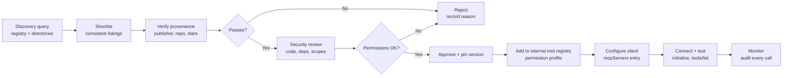

# MCP Discovery — How MCP Servers Are Found, Registered, and Distributed

> **An open-standard ecosystem deep-dive (2026).** The Model Context Protocol (MCP) solves *connection* — how an AI client talks to a server. Discovery solves the question *before* connection: **how does a client even know a server exists, what it does, and how to reach it?** This guide covers the discovery layer of the MCP ecosystem: the official MCP Registry, the independent directories and marketplaces (Smithery.ai, Glama.ai, mcp.so, PulseMCP), the mechanics of registration/metadata/search/installation, remote and dynamic discovery (streamable HTTP, DNS and `.well-known` proposals), enterprise discovery, discovery security, a worked adoption example, and where the ecosystem is heading.

> **Series context.** This is the *dedicated* MCP discovery deep-dive. The protocol architecture itself — hosts/clients/servers, JSON-RPC, transports, auth, lifecycle — lives in [mcp_framework_tools_guide.md](mcp_framework_tools_guide.md) (the MCP master guide, 697 lines). The platform view — where a tool registry sits in an enterprise agent platform — lives in [enterprise_agentic_platform_architecture_guide.md](enterprise_agentic_platform_architecture_guide.md) (§2.3 Tool Layer). Security controls for the servers you adopt are in [llm_guard_models_guide.md](llm_guard_models_guide.md); governance and approval workflows are in [implementing-responsible-ai.md](implementing-responsible-ai.md). This guide is about the **finding**: registries, directories, catalogs, and the mechanics of getting a server from "published somewhere" to "running in your client."

> **Verification policy.** Facts marked **(verified)** were checked against primary or reputable secondary sources during writing (September 2026 baseline). Figures about server counts, GitHub stars, and marketplace size change weekly; they are flagged **~approximate** and should be treated as order-of-magnitude signals, not inventory data. Anything that could not be confirmed is flagged explicitly as **unverified/flag**.

---

## 1. The Discovery Problem

### 1.1 What MCP Discovery Is

**MCP discovery is the process by which an MCP client (or a human developer using one) finds an MCP server: learning that it exists, what tools/resources/prompts it exposes, how it is transported (stdio vs. HTTP), who publishes it, and how to connect to it.** It is the "clients → servers" matching problem:

```
   MCP CLIENT (host)                          MCP SERVER (capability)
   ┌─────────────────────┐   discovery:      ┌─────────────────────┐
   │ Claude Desktop      │   "what servers   │ GitHub server       │
   │ VS Code / Cursor    │    exist? which   │ Postgres server     │
   │ Enterprise agent    │    fit my task?"  │ Internal CRM server │
   │ Custom SDK app      │ ─────────────────►│ (thousands more)    │
   └─────────────────────┘   "here is the    └─────────────────────┘
                             name, desc,       (verified: the
                             transport,        MCP client–server
                             install cmd"      model per spec)
```

There are **two distinct kinds of discovery** in the MCP world, and conflating them causes endless confusion:

1. **Protocol-level (in-session) discovery** — after a connection is established, the client calls `initialize` and `tools/list` (and `resources/list`, `prompts/list`) to learn what the *connected* server exposes. This is part of the MCP wire protocol itself, defined in the specification and covered in depth in [mcp_framework_tools_guide.md](mcp_framework_tools_guide.md). **(verified)**
2. **Ecosystem-level (pre-connection) discovery** — finding the server *in the first place*: the registries, directories, marketplaces, and catalogs that index servers so clients and developers can search, evaluate, and install them. **This is the subject of this guide.** **(verified)**

The ecosystem-level problem is the one that did **not** have a clean answer when MCP launched. The protocol standardized the handshake; it did not standardize the yellow pages. That gap produced a fast-growing, fragmented landscape of directories — and eventually an official registry.

### 1.2 Discovery vs. the Protocol

The distinction matters for architects:

| | **MCP Protocol** | **MCP Discovery** |
|---|---|---|
| Answers | "How do client and server *talk*?" | "How does a client *find* a server?" |
| Stage | At/after connection (initialize, tools/list, tool calls) | Before connection (search, evaluate, configure) |
| Artifacts | Spec documents, SDKs, JSON-RPC transports | Registries, directories, metadata schemas, install commands |
| Standardized? | Yes — the MCP spec (2024-11-25 first release; 2025-03-26 and 2025-06-18 updates) **(verified)** | Partially — the official MCP Registry + Generic Registry API arrived Sept 2025 **(verified)**; DNS/`.well-known` discovery are still proposals **(verified)** |
| Failure mode | Connection errors, protocol violations | Server never found; wrong server found; malicious server adopted |

> **Architect's rule of thumb:** the protocol is the *contract*, discovery is the *market*. You can have a perfect protocol and still fail if your clients cannot find the right server — or worse, find the wrong one. Discovery is where the supply chain risk enters (see §7).

### 1.3 Why Discovery Matters — Ecosystem Growth

Discovery was a non-issue in November 2024, when Anthropic shipped MCP with a handful of reference servers. **(verified)** It became urgent within months, because the ecosystem grew explosively:

- **~57,000+ MCP servers on GitHub** and **1,000+ MCP clients** by 2026 per the sibling MCP guide's figures **(~approximate; flag: single-source figure from the repo's own master guide, not independently re-verified)**.
- The **official MCP Registry grew from ~90 to ~518 servers in its first month** after the September 2025 preview launch, per a community audit post **(~approximate; flag: dev.to community analysis, not an official stat)**.
- Independent directories report **17,000–70,000+ listings** depending on how aggressively they index GitHub (see §3) **(~approximate; flag: self-reported, highly volatile)**.
- The **Awesome MCP Servers** community list tracked ~9,800+ official and community servers **(~approximate; flag: site figure at writing)**.

At this scale, *"ask a colleague which server to use"* breaks down. Nobody can hold 50,000 servers in their head. Discovery is the mechanism that turns a pile of servers into a usable marketplace — and it is also the mechanism an attacker can abuse to get a malicious server adopted (see §7.1).

### 1.4 The Discovery Layers

Discovery is not one thing. It happens at four layers, in roughly decreasing order of openness:

1. **Public registries** — machine-readable catalogs with APIs, aimed at both humans and tools. The official **MCP Registry** (registry.modelcontextprotocol.io, preview since Sept 8, 2025) is the canonical one; its **Generic Registry API** specification is the standardization attempt for this layer. **(verified)**
2. **Marketplaces & directories** — human-facing catalogs with search, ratings, and install instructions: **Smithery.ai** (registry + hosting + router), **Glama.ai** (marketplace), **mcp.so** (broad index), **PulseMCP** (daily-updated directory), plus the community **Awesome MCP Servers** list. **(verified)**
3. **In-app discovery** — client-embedded browsing: Claude Desktop / Claude Code's `/mcp` flow, VS Code's MCP extension, Cursor's MCP settings, n8n's one-click MCP connectors, Goose's dynamic server lookup. Clients increasingly embed registry search directly. **(verified: n8n blog documents one-click connection to ~70 servers; Goose dynamic discovery documented by community)**
4. **Enterprise catalogs** — internal, permissioned registries of *approved* servers: platform tool registries / MCP hubs, Azure API Center–based **MCP Center**, and policy-governed server lists. **(verified: mcp.microsoft.com)** See §6.

### 1.5 The Problem Table

| Layer | Mechanism | Examples | Consumer |
|---|---|---|---|
| Public registries | Open catalog + REST API; metadata schema; programmatic search | Official MCP Registry, Generic Registry API (**verified**) | Clients, SDKs, CI pipelines |
| Marketplaces / directories | Human search UI; tags; ratings; install snippets; some add hosting | Smithery.ai, Glama.ai, mcp.so, PulseMCP, Awesome MCP Servers (**verified**) | Developers, operators |
| In-app discovery | Registry search embedded in the client; "add server" wizards | Claude Desktop/Code, VS Code, Cursor, n8n, Goose (**verified**) | End users, developers |
| Enterprise catalogs | Approved lists; internal registries; permissioning; audit | Platform tool registry ([enterprise_agentic_platform_architecture_guide.md](enterprise_agentic_platform_architecture_guide.md) §2.3), Azure API Center MCP Center (**verified**) | Platform teams, governance |

---

## 2. The MCP Registry (Official)

### 2.1 What It Is

The **MCP Registry** is the official, open catalog and API for publicly available MCP servers, operated by the MCP project (Anthropic-led, now under the Linux Foundation's Agentic AI Foundation governance — see [mcp_framework_tools_guide.md](mcp_framework_tools_guide.md)). **(verified)**

Key facts, verified:

- **Announced/launched in preview on September 8, 2025**, via the official MCP blog post *"Introducing the MCP Registry"*. **(verified: blog.modelcontextprotocol.io/posts/2025-09-08-mcp-registry-preview/)**
- Served at **registry.modelcontextprotocol.io** ("Discover Model Context Protocol servers"). **(verified)**
- Described by the maintainers as **"like an app store for MCP servers"** — it gives MCP clients a list of servers to choose from, with metadata. **(verified: modelcontextprotocol/registry README)**
- The implementation is **open source and community-driven** (github.com/modelcontextprotocol/registry). **(verified)**
- Its mission: **standardize and improve server discoverability** — a single canonical place where server authors publish and clients search, instead of each directory inventing its own format. **(verified: launch post)**

### 2.2 Registry Features

From the launch post, the registry docs, and the registry repository **(all verified)**:

- **Server registration** — server authors submit their server with structured metadata (name, description, owner, repository, transport, installation instructions, and more; see §4.2). The registry validates and indexes it.
- **Metadata-driven search** — clients and humans search by name, description, and attributes; the registry returns structured results rather than free-text web pages.
- **Open REST API** — the registry exposes a public API for programmatic discovery, so any MCP client (or internal tool) can query it at runtime.
- **The Generic Registry API specification** — a standardized RESTful HTTP API that *any* MCP registry (official or third-party, public or enterprise) can implement, providing consistent endpoints for discovering and retrieving MCP servers. This is the standardization backbone of the whole discovery ecosystem. **(verified: modelcontextprotocol/registry docs/reference/api/generic-registry-api.md)**
- **Registry authorization specification** — a companion spec for authentication/authorization of registry access, so registries can be locked down (critical for the enterprise use case in §6). **(verified)**
- **Subregistries** — the official docs explicitly define subregistries as a first-class extension point, adding value on top of the base catalog: **curation** (filter servers for communities/use cases), **ratings** (user ratings, download statistics), **security** (scanning and vulnerability checks), and **enterprise** (internal registries for organizations). **(verified: modelcontextprotocol.info registry docs)**
- **Preview-state ergonomics** — staging (staging.registry.modelcontextprotocol.io), local (localhost:8080), and production environments are exposed in the UI, indicating an active development pipeline. **(verified: registry UI)**

### 2.3 Registry Status (as of writing, Sept 2026)

- **Launched:** preview, September 8, 2025 — now roughly one year old. **(verified)**
- **Adoption trajectory:** ~90 → ~518 servers in the first month per community audit; the registry has continued to grow but is **not** the largest index — broad crawlers like mcp.so (19,700+ listings) and Glama (17,000–70,000+ open-source servers, self-reported) outnumber it because they index aggressively from GitHub. **(~approximate; flag: mixed official/unofficial figures)**
- **Client integration:** the most important adoption signal — clients embedding the registry API for in-app discovery — is still uneven as of writing. Cursor, Claude Code, and others ship their own or aggregated browsing; full native registry API integration is a 2026+ story (see §9). **(flag: qualitative observation, not systematically verified per client)**
- **Governance:** the registry's home moved with MCP itself into the Linux Foundation's Agentic AI Foundation (Dec 2025 donation). **(verified via sibling guide; see [mcp_framework_tools_guide.md](mcp_framework_tools_guide.md))**

> **Why the registry matters more than its size:** the registry's value is *standardization*, not inventory. Its Generic Registry API + authorization spec + subregistry model give the ecosystem — and enterprises — a common protocol for *finding* servers, which is exactly what the fragmented directory landscape lacked.

### 2.4 The Registry Table

| Aspect | Description | Status (Sept 2026) |
|---|---|---|
| Operator | MCP project / Linux Foundation AAIF governance | **Active** (**verified**) |
| Launch | Preview announced 2025-09-08 | **Live** (**verified**) |
| Endpoint | registry.modelcontextprotocol.io | **Live** (**verified**) |
| Core function | Open catalog + API of public MCP servers ("app store for MCP servers") | **Live** (**verified**) |
| Standardization | Generic Registry API spec; registry authorization spec | **Spec published** (**verified**) |
| Extensibility | Subregistries: curation, ratings, security scanning, enterprise | **Documented; adoption uneven** (**verified docs, flag adoption**) |
| Scale | ~90 → ~518 servers in first month; smaller than crawler directories | **Growing; ~approximate** (flag) |
| Client integration | In-app discovery via registry API | **Partial / 2026+ story** (flag) |

---
## 3. Server Directories & Marketplaces

Before the official registry, and still alongside it, a set of independent directories and marketplaces grew up to solve discovery. They differ in philosophy: some are pure catalogs, some add hosting and management, some just index GitHub as broadly as possible.

### 3.1 Smithery.ai — Registry + Hosting + Router

**Smithery.ai** is the most full-featured of the independent platforms: it is a **registry *and* a hosting platform *and* a routing layer**. **(verified)**

- **Founded December 2024 by Henry Mao** (previously technical co-founder of Jenni.ai). **(verified: industry coverage)**
- **Registry:** a centralized catalog of MCP servers with search across **names, descriptions, tags, and user profiles**, exposed via a documented **search API** (authenticated with a Smithery API key) — so it is not just a website, it is a programmatic discovery service. **(verified: smithery.ai/docs)**
- **Hosting:** cloud-hosted deployments of MCP servers (vs. self-hosted options), with managed releases, secrets, and team API keys. **(verified: smithery.ai docs)**
- **Router:** a runtime layer that routes client requests to the appropriate hosted server — the "registry-plus-hosting-plus-router bundle" that separates it from catalog-only competitors. **(verified: industry analysis)**
- **CLI:** `smithery` CLI for installing and managing servers from the terminal.

### 3.2 Glama.ai — Marketplace

**Glama.ai** describes itself as an MCP **marketplace** (glama.ai/mcp/servers). **(verified)**

- **Indexes open-source MCP servers from GitHub**; the site self-reports **70,107 open-source servers in the Glama registry** at writing **(~approximate; flag: self-reported, volatile; other sources cited 17,000+ at earlier dates — treat as "tens of thousands, fast-growing")**.
- **Sorts by GitHub stars** — a de facto quality signal baked into the UX.
- **Tracks MCP client compatibility** per server (which clients each server supports) and provides **install instructions for multiple clients**. **(verified)**
- Functions as a discovery + evaluation surface rather than a hosting provider (no managed hosting like Smithery).

### 3.3 mcp.so — The Broad Index

**mcp.so** is a broad MCP marketplace/directory: servers, tools, and integrations in one searchable index. **(verified: mcp.so)**

- Reported at **~19,700+ listings** at writing, favoring **breadth over curation** — it crawls aggressively, so it is the largest raw index among the mainstream directories **(~approximate; flag: third-party industry analysis of the site's self-reported count)**.
- Supports **submission** ("Submit") and **advertising** ("Advertise") — a monetized, low-friction publishing model.
- Good for *"does a server for X exist at all?"* reconnaissance; weaker for trust signals (see §7).

### 3.4 PulseMCP — The Daily-Updated Directory

**PulseMCP** is a dedicated MCP server directory that bills itself as **"a daily-updated directory of all MCP servers available on the internet."** **(verified: pulsemcp.com/servers)**

- Self-reports **22,070+ servers** at writing **(~approximate; flag: self-reported)**.
- Focuses on **freshness and completeness** — it continuously crawls rather than curating.
- Also runs MCP-related news/analysis content, making it a discovery-plus-intelligence hub.

### 3.5 Awesome MCP Servers (Community List)

The **Awesome MCP Servers** list (mcpservers.org) is the community-maintained, GitHub-style curated list, tracking **~9,800+ official and community servers** at writing **(~approximate; flag: site figure)**. It remains one of the most-linked entry points in tutorials, but a static list scales poorly — which is exactly the problem the machine-readable registries solve.

### 3.6 Directory Comparison

| Directory | Focus | Features | Hosting | Popularity/Scale (flag: all ~approximate) |
|---|---|---|---|---|
| **Smithery.ai** | Registry + platform | Search API, CLI, managed releases, secrets, team keys, router | **Yes** (cloud + self-host) | Thousands indexed; strong platform reputation (**verified features**) |
| **Glama.ai** | Marketplace | GitHub-star sorting, client-compat tracking, multi-client install guides | No | Self-reports 17k–70k open-source servers (volatile) |
| **mcp.so** | Broad index | Huge crawl, submit + advertise, servers/clients/integrations | No | ~19,700+ listings; breadth over curation |
| **PulseMCP** | Directory | Daily updates, completeness-focused, news/analysis | No | ~22,070+ servers (self-reported) |
| **Awesome MCP Servers** | Curated list | Human-curated, tutorial-friendly | No | ~9,800+ listed |
| **Official MCP Registry** | Canonical catalog | Generic Registry API, subregistries, authorization spec | No (index only) | ~518+ in first month; canonical, not largest |

> **Reading the numbers (flagged):** every figure above is a moving target and self-reported or third-party-estimated. Treat the *ordering* (mcp.so/PulseMCP/Glama are large crawlers; the official registry is smaller but canonical) as the signal, not the digits. The sibling guide's ecosystem figure — 57,000+ MCP servers on GitHub — is the right order-of-magnitude ceiling for total supply.

### 3.7 Directory Mechanics

All four directories converge on the same mechanics, which is convenient for adopters:

- **Listing** — a server appears because (a) the author submits it (Smithery, mcp.so, Glama, official registry), and/or (b) the directory crawls GitHub/public sources automatically (PulseMCP, mcp.so, Glama). **(verified: docs and site behavior)**
- **Search** — keyword search over name/description/tags; filters by category, transport, auth type, and language on the more mature platforms (Smithery search API supports name/description/tags; Glama adds star-sorting). **(verified: smithery docs, glama UI)**
- **Install commands** — directories render copy-paste install snippets per client, e.g.:
  - Claude Desktop: a `claude_desktop_config.json` `mcpServers` entry
  - VS Code: `.vscode/mcp.json` (or `.mcp.json` at workspace root)
  - Cursor: MCP settings UI
  - Terminal/SDKs: `npx -y <package>` or `docker run <image>` in the `command` field
  **(verified: standard client config formats documented across directories; full install mechanics in §4.4)**
- **Trust signals** — stars, ratings, download counts, review counts (unevenly implemented; see §7 for what to actually verify).

---

## 4. Registry Mechanics

This section covers the concrete mechanics shared by the official registry and the directories: how a server gets in, what metadata it carries, how search works, and how installation happens.

### 4.1 Registration

**Registration is the act of publishing a server's metadata to a registry so it becomes discoverable.** **(verified: official registry + Smithery docs)**

The typical flow (varies slightly by registry):

1. **Author builds and tests the server** (usually published to npm as `@scope/mcp-server-name` or as a Docker image, or hosted at a streamable HTTP endpoint).
2. **Author submits** to the registry: the official MCP Registry, Smithery, mcp.so, Glama, and PulseMCP all accept submissions (web form, and/or API — Smithery exposes a documented API; the official registry is API-first per its Generic Registry API). **(verified)**
3. **Registry validates** the metadata: name uniqueness, description, transport validity, and — on the official registry — checks the server actually exists (e.g., the package resolves). **(verified: registry repo behavior; depth of validation not fully documented — flag)**
4. **Server becomes searchable**, typically after a review/processing delay (the official registry's processing pipeline is preview-state; Smithery lists appear quickly). **(flag: exact delays not verified)**

### 4.2 Server Metadata

**Metadata is the currency of discovery.** A registry is only as useful as the structured metadata it carries, because that is what search and evaluation run on. The de facto metadata fields, converging across the official registry and directories **(verified: registry docs, smithery docs, directory UIs)**:

| Field | What it means | Why it matters |
|---|---|---|
| **Name** | Unique identifier/slug of the server | Identity; prevents impersonation ambiguity |
| **Description** | One-paragraph human summary | Search + human evaluation |
| **Capabilities** | What tools/resources/prompts it exposes | Fit assessment before install |
| **Transport** | `stdio`, `streamable-http` (remote), or both | Determines install/connection method |
| **Auth requirements** | None / OAuth 2.x / API key / custom | Security + onboarding cost |
| **Owner / publisher** | Author identity, org, or verified publisher | Provenance (see §7.2) |
| **Source repository** | GitHub link | Code review, stars, release history |
| **Installation info** | npm package + version, Docker image, or HTTP URL | The actual install command |
| **Tags/categories** | e.g., database, search, dev-tools, security | Faceted browsing |
| **Version** | Server version / release | Pinning and change management |

> The **Generic Registry API** (official registry) is what turns these fields into a *standard*: any registry implementing it exposes consistent endpoints for listing and retrieving servers, so a client or enterprise tool can query "the registry" without per-vendor adapters. **(verified: modelcontextprotocol/registry docs)**

### 4.3 Search (Discovery Queries)

Search is the read side of discovery. Current capabilities **(verified across official registry + directories)**:

- **Keyword/full-text search** over name + description (+ tags) — the baseline everywhere.
- **Faceted filtering** — by category, transport, auth type, language (Smithery, Glama, and the official registry UI support attribute filters).
- **Ranking signals** — GitHub stars (Glama), ratings, downloads; the official registry's ranking is still evolving in preview (flag).
- **API search** — Smithery exposes a documented registry search API; the official Generic Registry API standardizes programmatic search for any compliant registry.
- **Runtime discovery** — clients can query registry APIs *at runtime* to offer "what servers are available?" in-app (see §5.5 dynamic discovery).

### 4.4 Installation

Once found and vetted, installation is standardized across clients. The universal pattern is a **client config file** with an `mcpServers` map: each entry names the server and tells the client how to launch or reach it. **(verified: standard MCP client config format)**

**Claude Desktop** — `claude_desktop_config.json`:

```json
{
  "mcpServers": {
    "github": {
      "command": "npx",
      "args": ["-y", "@modelcontextprotocol/server-github"]
    },
    "postgres": {
      "command": "docker",
      "args": ["run", "-i", "--rm", "-e", "DATABASE_URL=...", "mcp/postgres"]
    },
    "internal-trading": {
      "url": "https://mcp.internal.bank.example/streamable"
    }
  }
}
```

**VS Code** — `.vscode/mcp.json` (workspace-scoped) or the MCP extension UI; **Cursor** — MCP settings panel; **n8n** — one-click MCP connectors (~70 servers per the n8n blog at writing) **(verified: n8n blog)**.

Three install paths, all represented in the config above:

1. **npx/npm** — `npx -y <package>` runs the server from the npm registry on demand; the dominant path for Node-based servers. **(verified)**
2. **Docker** — `docker run -i --rm <image>` isolates the server process; the dominant path for servers with heavy dependencies or when isolation matters. **(verified)**
3. **Remote URL** — `"url": "https://..."` for streamable-HTTP remote servers (no local process; see §5.1). **(verified)**

Version pinning, checksum verification, and dependency locking are left to the package managers and the adopter's discipline — see §7.

### 4.5 Mechanics Table

| Step | Description | Example |
|---|---|---|
| **Build & publish** | Package the server (npm, Docker, or hosted HTTP) | `npm publish @acme/mcp-risk-server` |
| **Register** | Submit metadata to a registry | Official MCP Registry / Smithery submission form or API |
| **Metadata** | Name, description, capabilities, transport, auth, repo, version | `transport: streamable-http`, `auth: oauth2` |
| **Search** | Query by keyword/filter; human or API | `GET /servers?q=postgres&transport=stdio` (Generic Registry API) |
| **Evaluate** | Check provenance, stars, reviews, code, permissions | See §7 |
| **Install** | Add `mcpServers` entry to client config | `npx -y @acme/mcp-risk-server` or `docker run ...` or `"url": "https://..."` |
| **Verify connection** | Client `initialize` + `tools/list` round-trip | Server appears in client tool list |

---

## 5. Remote & Dynamic Discovery

### 5.1 Remote Servers — Streamable HTTP

**Remote MCP servers are servers reachable over HTTP rather than launched as a local subprocess.** They are the enterprise-relevant form: one hosted server serves many clients, centrally managed. **(verified)**

The transport that made remote MCP practical is **Streamable HTTP**:

- **Introduced in the 2025-03-26 specification update**, replacing the legacy HTTP+SSE transport as the recommended transport for remote servers. **(verified: spec history + community coverage)**
- Uses **HTTP POST and GET**, with **optional Server-Sent Events (SSE)** for streaming server-to-client messages; stateless request/response with one shared session. **(verified: spec transports page)**
- Refined further in the **2025-06-18 spec revision** (auth, streaming, lifecycle management). **(verified: sibling guide)**
- **Authentication for remote servers uses OAuth 2.x (2.1-style flows)** — a remote server can identify *who* the client is, unlike a local stdio process. **(verified: MCP auth spec; industry coverage)**

Implication for discovery: a remote server's "install" is just a **URL** — no package to run — so discovery metadata for remote servers centers on the endpoint, the auth flow, and the capabilities behind it. Registries must carry `transport: streamable-http` entries with URLs; the official registry and directories all support this field. **(verified)**

### 5.2 Remote Discovery Protocols

For a client to connect to a remote server it needs the **URL + auth metadata**. Today that information is carried by: registry/directory entries, documentation pages, and config files. There is **no standardized, in-protocol remote-discovery mechanism yet** — which is why proposals exist (below). **(verified: absence of a discovery chapter in the core spec; proposals live in GitHub discussions)**

### 5.3 DNS Discovery (Proposal)

The most prominent standardization proposal for remote discovery is **DNS-native MCP discovery**, raised in the MCP repo as *"Proposal: DNS-native MCP discovery: a zero-infrastructure..."* (discussion **#2368**). **(verified: github.com/modelcontextprotocol/modelcontextprotocol/discussions/2368)**

The proposed chain:

```
_mcp TXT record  →  .well-known endpoint  →  registry  →  router
(domain advertises   (connection + auth      (index of     (selection:
 a server exists)     metadata)               capabilities)  health, trust, cost)
```

- A domain owner publishes a **`_mcp` DNS TXT record** (and/or SRV-style record) announcing that an MCP server exists for the domain.
- The client resolves it, then fetches **`.well-known/mcp`** for connection and auth metadata (see §5.4).
- The **registry** layer indexes capabilities across servers; a **router** selects the best provider at invocation time (live health, trust state, cost, latency).

**Status: proposal/discussion, not standardized.** No DNS-based discovery is in the core MCP spec as of writing. **(verified: discussion is open, no merged spec; flag: could have progressed after research cutoff — re-check before relying on it.)**

### 5.4 `.well-known/mcp` (Proposal)

The **`/.well-known/mcp` endpoint** pattern — a standard location on a web origin that publishes MCP connection metadata — appears in the DNS-discovery proposal (#2368) and related discussions as the second hop: after DNS tells you *a server exists*, `.well-known/mcp` tells you *how to connect* (endpoint URL, auth requirements, capabilities summary). **(verified: proposal text)**

This mirrors established web patterns (`.well-known/` is already standardized for OAuth authorization servers, OpenID Connect, and security.txt), which is precisely why it is attractive: **zero new infrastructure**, works with existing DNS and TLS, and gives every web domain a potential MCP presence.

**Status: proposal.** Alongside the DNS piece, not yet in the spec. **(verified; same re-check caveat as §5.3)**

### 5.5 Dynamic Discovery (Runtime)

**Dynamic discovery is the ability to find and attach servers at runtime, not just at config time.** Three flavors:

1. **Registry API at runtime** — a client queries a registry (Smithery search API today; any Generic Registry API-compliant registry tomorrow) mid-session to offer "servers available for this task." **(verified: Smithery search API is documented and live; Generic Registry API enables the pattern)**
2. **Client-driven dynamic attach** — e.g., **Goose** (Block's agent) supports discovering and connecting to MCP servers dynamically during a session rather than requiring all servers pre-enabled; community tutorials document the pattern. **(verified: dev.to walkthrough; flag: feature depth varies by client version)**
3. **Hot-plug within a session** — the protocol-level `tools/list` re-query when a server adds tools (covered in [mcp_framework_tools_guide.md](mcp_framework_tools_guide.md)); this is dynamic *capability* discovery after connection, complementing dynamic *server* discovery before connection.

Dynamic discovery is where the ecosystem is heading: static config files were the 2024 answer; runtime registry queries are the 2026 direction (see §9).

### 5.6 Remote Table

| Mechanism | Description | Status (Sept 2026) |
|---|---|---|
| **Streamable HTTP transport** | POST/GET + optional SSE; replaces legacy SSE transport; recommended for remote servers (2025-03-26 spec) | **Standardized, live** (**verified**) |
| **Remote auth** | OAuth 2.x for remote servers (identify the client) | **Standardized** (**verified**) |
| **Registry/directory URL entries** | Remote servers listed as URLs + auth metadata in catalogs | **Live everywhere** (**verified**) |
| **DNS discovery (`_mcp` TXT)** | Domain advertises server existence; zero infrastructure | **Proposal (discussion #2368)** (**verified**) |
| **`.well-known/mcp`** | Standard origin path with connection/auth metadata | **Proposal** (**verified**) |
| **Dynamic runtime discovery** | Registry APIs queried at runtime; Goose-style dynamic attach | **Emerging, client-dependent** (**verified pattern, flag depth**) |

---
## 6. Enterprise Discovery

Enterprise discovery is a different game: the goal is not "find the most servers" but "find the **approved** server for a task, with the right permissions, and prove it." The discovery layers from §1.4 collapse into one governed catalog.

### 6.1 Internal Catalogs — The Platform Tool Registry

The enterprise counterpart of a public directory is the **platform tool registry / MCP hub**: the platform's catalog of everything an agent may do — internal systems, data platforms, back-office APIs — exposed through MCP with registration, discovery, versioning, permissions, and classification. **(cross-ref: [enterprise_agentic_platform_architecture_guide.md](enterprise_agentic_platform_architecture_guide.md) §2.3 — the Tool Layer; the deep platform treatment lives there, this section only adds the discovery angle.)**

Key discovery-relevant responsibilities of the internal tool registry (from §2.3 of the platform guide, cross-referenced):

- **Registration** — canonical name, OpenAPI/JSON-Schema definition, description, owner, version.
- **Discovery** — agents and developers can find what tools exist and what they do; the registry feeds tool descriptions to the model at runtime.
- **Versioning** — agents pin to versions; breaking changes follow a deprecation process.
- **Permissions** — every tool carries a permission profile: which agents/roles may call it, with what parameters, and whether human approval is required.
- **Classification** — read-only vs. write vs. destructive; internal vs. external; PII-touching vs. not.

The discovery lesson from the platform guide: **the internal registry is a *control point*, not just an index.** Public directories optimize for breadth; the enterprise registry optimizes for who-may-use-what.

### 6.2 Enterprise MCP — Approved Server Lists

For *external* MCP servers (vendors, open source, SaaS), enterprises increasingly operate **approved server lists**: a curated allowlist of servers that passed security review, with pinned versions, vetted transports, and documented owners. **(flag: practice is documented widely in industry guidance but there is no single canonical public source; treat as consensus practice, verified through enterprise-pattern coverage like OWASP MCP guidance and Azure API Center documentation.)**

Typical list structure:

| Field | Example |
|---|---|
| Server name | `github-mcp` |
| Approved version | `2.3.1` (pinned, not `latest`) |
| Source/provenance | `github.com/modelcontextprotocol/servers` |
| Publisher | Model Context Protocol org |
| Transport | stdio (sandboxed) / streamable-http (allowlisted URL) |
| Auth | OAuth 2.1 via corporate IdP |
| Permission profile | read-only for all agents; write only for `eng-leads` role |
| Review date / owner | 2026-08-01 / platform-security team |

### 6.3 Enterprise Registries (Internal Registries)

Two converging tracks:

1. **Subregistry model (official)** — the official MCP Registry explicitly documents **enterprise subregistries: "internal server registries for enterprise users"** as a first-class use case, built on the Generic Registry API + registry authorization spec. **(verified: modelcontextprotocol.info registry docs)** An enterprise can run a compliant registry *internally* that federates the public catalog's metadata but only serves approved servers, with authz enforced by the authorization spec.
2. **Vendor platforms** — **Microsoft's MCP Center** (mcp.microsoft.com) is the flagship example: "Build your scalable, enterprise-ready MCP registry with Azure API Center," turning Azure API Center into an internal MCP registry with governance, discovery, and lifecycle management. **(verified: mcp.microsoft.com)** Expect every major cloud to ship an equivalent (flag: only Azure's is confirmed at writing; AWS/GCP equivalents are announced in various forms but not verified here).

> **Enterprise architecture note:** the internal registry is not an either/or with public directories — it is a **filter in front of them**. A common pattern: the public registry/directories feed *candidate* servers; the enterprise registry holds *approved* servers; clients only ever see the enterprise registry. This is exactly the "public catalog → curated subregistry" composition the official registry's design anticipates.

### 6.4 Governance — Approval Workflows

Discovery feeds governance: you cannot approve what you cannot find, and you cannot govern what you did not approve. The enterprise discovery pipeline therefore includes:

- **Submission workflow** — a developer requests a server; the request carries metadata (repo, publisher, capabilities, auth) pulled from the registry/directory entry.
- **Review gates** — security review (code scan, dependency scan, provenance check — see §7), legal/compliance review (data handling, jurisdiction), architecture review (transport, hosting).
- **Approval + promotion** — approved servers are promoted into the internal registry with pinned versions and permission profiles; rejected ones are recorded with reasons.
- **Ongoing review** — version bumps re-trigger review; periodic re-certification; revocation on incidents.
- **Audit** — every discovery query and every approval decision is logged; the registry is the audit boundary.

**(cross-ref: [implementing-responsible-ai.md](implementing-responsible-ai.md) for the governance framework — approval workflows, human-in-the-loop, audit trails — that the discovery pipeline plugs into.)**

### 6.5 Enterprise Table

| Aspect | Practice | Notes |
|---|---|---|
| Internal catalog | Platform tool registry / MCP hub; registration, discovery, versioning, permissions, classification | Cross-ref [enterprise_agentic_platform_architecture_guide.md](enterprise_agentic_platform_architecture_guide.md) §2.3 |
| External servers | Approved server lists with pinned versions, provenance, permission profiles | Consensus practice; flag: no single canonical source |
| Internal registries | Official subregistry model (Generic Registry API + authz spec); Azure API Center MCP Center | Verified: official docs + mcp.microsoft.com |
| Client exposure | Clients see only the enterprise registry (filter in front of public catalogs) | Pattern; flag: implementation-dependent |
| Governance | Submission → review gates → approval → promotion → re-certification → audit | Cross-ref [implementing-responsible-ai.md](implementing-responsible-ai.md) |

---

## 7. Discovery Security

Discovery is where the **supply chain** enters the AI stack. A malicious server that gets *discovered and installed* is worse than a malicious tool that never gets found — discovery is precisely the mechanism that converts "exists on the internet" into "running in my client with my credentials."

### 7.1 Supply Chain — Malicious Servers

The threat is real and documented:

- **CVE-2025-6514** — a command-injection vulnerability in `mcp-remote` (the tool used to expose remote MCP servers to clients) triggered via **malicious OAuth metadata** returned by a server; Docker's own security writeup frames it as *"MCP Horror Stories: The Supply Chain Attack"* (Aug 7, 2025). **(verified: docker.com/blog + CVE listing; flag: exact CVE details as summarized by Docker, not re-audited here)**
- **Malicious MCP server incidents** — e.g., the reported **Postmark MCP incident**, where a malicious MCP server silently exfiltrated email data at scale, framed as a new supply-chain category ("malicious MCP servers silently exfiltrating emails"). **(flag: reported by security vendors (powerdmarc.com) — treat as a documented incident class; verify specifics before citing in a risk register)**
- **Tool poisoning / prompt injection via metadata** — attackers weaponize the *discovery surface itself*: tool names and descriptions are model-readable, so poisoned descriptions can steer agents toward harmful actions; the OWASP MCP Security Cheat Sheet names prompt injection, supply chain, and confused-deputy as the core MCP risk trio. **(verified: OWASP MCP Security Cheat Sheet)**
- **Spoofing/typosquatting** — a directory entry named `github-mcp-server` with a plausible description but a different publisher is the MCP equivalent of a typosquatted npm package. **(flag: pattern, no single canonical incident cited)**
- **Registry hygiene is uneven** — a community audit of the official registry noted many servers with weak security postures ("41% had no lock on the door" per the dev.to audit title; flag: single community audit, methodology not independently verified).

> **First principle for adopters:** **discovery is untrusted input.** A registry entry is an *advertisement*, not a certification. The official registry reduces friction; it does not (yet) certify safety — security scanning is listed as a *subregistry value-add*, i.e., something you must add, not something you get by default. **(verified: registry docs position security scanning as subregistry capability)**

### 7.2 Verification — Server Provenance

Before installing anything discovered, verify **(practice synthesized from OWASP MCP guidance + enterprise patterns; flag: this is a checklist, not a spec)**:

| Check | What to look for |
|---|---|
| **Publisher identity** | Who published it? Is the publisher/org real and reachable? Verified publisher badges where available (uneven across registries) |
| **Source repository** | Real GitHub repo? Stars, fork history, commit cadence, maintainer activity, issue hygiene |
| **Code review** | Read the tool definitions and the code that handles your data — especially network egress, shell execution, and secrets handling |
| **Release history** | First release date, version bumps, changelog; a brand-new server with a huge feature list is a red flag |
| **Dependencies** | Supply chain of the supply chain: dependency count, known-vulnerability scan (npm audit / trivy / grype), lockfile pinning |
| **Permissions requested** | Does the server *need* what it asks for? (see §7.3) |
| **Reviews/ratings** | Directory ratings, downloads, community mentions (weak signal but useful triangulation) |
| **Reputation cross-check** | Is the same server listed in multiple directories with consistent metadata? Inconsistent entries are suspicious |

**Provenance = can you answer "who made this, from what, and can I audit it?"** If the answer is no, treat the server as untrusted — regardless of how high it ranks in search.

### 7.3 Permissions — Least Privilege

Discovery gets a server into the door; **permissions decide what it can do once inside.** The enterprise practice is least privilege, enforced at three boundaries **(cross-ref: [llm_guard_models_guide.md](llm_guard_models_guide.md) for the full guard model; this is the discovery-specific slice)**:

1. **Server-level** — run stdio servers in a sandboxed process (container, minimal OS user, no ambient credentials); run remote servers with scoped OAuth tokens, not personal accounts.
2. **Tool-level** — most clients support enabling/disabling individual tools from a server; expose only the tools the use case needs (e.g., a GitHub server can be connected with read-only scopes and only `list/read` tools enabled).
3. **Call-level** — enterprise platforms add per-call authorization: is this agent allowed to call this tool, with these parameters, in this context? Destructive/write tools sit behind human-approval gates (cross-ref platform guide §2.3.3 and [implementing-responsible-ai.md](implementing-responsible-ai.md)).

**Adoption security rule:** *approve the server once, permission the tools always, audit every call.*

### 7.4 Security Table

| Risk | Mitigation | Tooling |
|---|---|---|
| Malicious/poisoned server installed via discovery | Verify-before-install workflow (provenance checks, code review); approved lists; pin versions | Registry metadata audit, git history review, package scanners |
| Command injection via server-supplied metadata (CVE-2025-6514 class) | Patch clients (`mcp-remote` fix); treat server metadata as untrusted input; network egress controls | Updated MCP clients, WAF/egress rules, runtime sandboxing |
| Tool poisoning / prompt injection via tool descriptions | Review tool names/descriptions; disable unneeded tools; treat model output as untrusted for tool selection | Client tool-permission controls, OWASP MCP cheat sheet, adversarial testing |
| Typosquatting/spoofed listings | Cross-check publisher identity + repo + multiple directories; verified badges where available | Directory verification features (uneven), manual diligence |
| Overbroad permissions after adoption | Least privilege at server/tool/call boundaries; per-call authz; human approval for sensitive tools | Client + platform permission engines (cross-ref [llm_guard_models_guide.md](llm_guard_models_guide.md)) |
| Registry itself compromised | Run an internal subregistry as the only source of truth clients consume; registry authz spec | Generic Registry API + authorization spec, Azure API Center |

---

## 8. Worked Example — Discovering and Adopting an MCP Server

### 8.1 Scenario

> A bank's platform team wants to give its internal agents GitHub repository intelligence (issues, PRs, code search) — a read-heavy, developer-facing capability. An engineer proposes "there's an MCP server for GitHub." The team runs the full discovery → adoption pipeline. Names and versions are illustrative.

### 8.2 Step 1 — Search (Discovery Queries)

- **Query the official registry** (registry.modelcontextprotocol.io) for `github`: finds the well-known `@modelcontextprotocol/server-github` entry plus community variants **(verified: this server family is the canonical example; flag: exact listing contents at writing)**.
- **Cross-search directories** — Smithery, Glama, mcp.so, PulseMCP — for the same keyword; note which servers appear in multiple directories with *consistent* metadata (consistency = signal).
- **Filters:** transport (`stdio` preferred for sandboxed local run), auth (`token`/OAuth), category (`developer-tools`), GitHub stars (Glama sort) as a coarse popularity proxy.

### 8.3 Step 2 — Verify (Checks)

- **Provenance:** publisher = the MCP project org; source repo = `modelcontextprotocol/servers`; long release history; thousands of GitHub stars.
- **Code review:** read the tool definitions; confirm no egress beyond api.github.com, no shell execution, no secret logging. Review the dependency list (`npm audit` clean).
- **Security posture:** server requests a GitHub token — confirm it needs only `repo:read` scopes; confirm the client will run it sandboxed; note the CVE-2025-6514 class (metadata-triggered injection) is a *client* concern — pin a patched client.
- **Reviews/ratings:** consistent positive signal across directories; referenced in multiple tutorials.
- **Decision gate:** passes. A *second* candidate — a shiny "GitHub MCP with AI-powered PR summaries" from an unknown publisher, listed only on one directory, released 3 days ago, requesting `repo` full-write scope — **fails provenance and permissions; rejected.**

### 8.4 Step 3 — Install

Pinned version into the platform's internal tool registry (not directly into clients):

```json
{
  "mcpServers": {
    "github": {
      "command": "npx",
      "args": ["-y", "@modelcontextprotocol/server-github@2.3.1"],
      "env": { "GITHUB_PERSONAL_ACCESS_TOKEN": "<scoped-read-token>" }
    }
  }
}
```

Notes: version **pinned** (`@2.3.1`), token **scoped to read**, server runs **inside the platform sandbox**. For a remote alternative the entry would be `"url": "https://mcp.internal/github"` with OAuth.

### 8.5 Step 4 — Configure (Permissions)

- **Server-level:** sandboxed process; read-only token; no ambient credentials.
- **Tool-level:** enable only `list_repositories`, `get_issue`, `search_code`, `list_pull_requests`; **disable** `create_issue`, `merge_pull_request` for general agents.
- **Call-level:** agents with the `eng-leads` role may call write tools, behind a human-approval gate; every call logged with agent identity (platform tool-registry policy; cross-ref [enterprise_agentic_platform_architecture_guide.md](enterprise_agentic_platform_architecture_guide.md) §2.3).
- **Registry record:** approved version, permission profile, review date, owner recorded in the internal registry; re-review triggered on any version bump.

### 8.6 The Adoption Flow



### 8.7 Lessons

- **Verify-before-install is the whole game.** Search quality determines *candidates*; verification determines *adoption*. Every step from §7.2 is cheap compared with remediating a malicious server that has been running with credentials for a quarter.
- **Consistency is a signal.** A server listed consistently across the official registry and multiple directories, by the same publisher, is materially more trustworthy than a single-directory hit from an unknown account.
- **Discovery and permissioning are one workflow.** The teams that separate "find a server" (everyone) from "approve and permission it" (platform/security) create the governance boundary §6 requires.
- **Pin everything.** `latest` in an agent config is a self-inflicted supply-chain incident waiting to happen.
- **Plan the uninstall too.** Approved-list revocation, version rollback, and audit of past calls must exist before the first server is adopted.

---

## 9. The Future — 2026+

### 9.1 Registry Standardization

The Generic Registry API + authorization spec turn "a registry" into "the registry *interface*": any compliant catalog — public, vendor, or internal — speaks the same discovery dialect. **(verified: spec exists)** Expect:

- **Client-native registry search** — in-app "browse MCP servers" powered by registry APIs (Cursor/Claude Code/VS Code/n8n all have partial versions today; flag: integration depth varies).
- **Registry federation** — the official registry as the public spine; enterprise subregistries curating behind it (the documented subregistry model, §2.2).
- **Metadata quality pressure** — as search moves from humans to clients, structured metadata (capabilities, auth, transport) becomes the product; expect schema tightening. **(flag: directional, not yet observable in a spec revision at writing)**

### 9.2 Discovery Protocols

The DNS + `.well-known` proposals (§5.3–5.4) are the most likely next standardization: they give *every web origin* a zero-infrastructure MCP presence (`_mcp` TXT → `/.well-known/mcp` → connect). **(verified: proposal exists; status = open discussion)** If standardized, the discovery model shifts from "search a directory" to "ask the domain you already trust" — which is also a security win (you connect to the domain you intended, not a lookalike listing). **Caveat: proposals can stall; re-check spec status before building on it** (flag).

### 9.3 Enterprise Adoption

- **Internal registries become a standard platform component** — the tool registry/MCP hub from §6.1 is already in the reference platform architecture; expect it to be a procurement checkbox by 2027. **(flag: directional)**
- **Vendor platforms** (Azure API Center MCP Center verified; others expected) commoditize enterprise registries with governance built in.
- **Discovery + governance converge**: the approval workflow becomes the discovery workflow — agents search only what is approved; the audit log doubles as the server catalog's changelog.

### 9.4 Trends Summary

| Trend | 2024 (start) | 2026 (now) | 2027+ (direction) |
|---|---|---|---|
| Server supply | Handful of reference servers | Tens of thousands (~57k on GitHub per sibling guide; flag) | Commodity: "everything has an MCP server" |
| Discovery | Word of mouth, awesome-lists | Official registry + 4+ directories | Registry-API-native, federated |
| Standardization | None | Generic Registry API (+ authz) spec | DNS/.well-known discovery, richer metadata schemas |
| Enterprise | Ad hoc allowlists | Internal registries (Azure API Center etc.) | Registry as standard platform component |
| Security | Afterthought | Provenance checks, pinned versions, OWASP guidance | Built-in scanning/verification in registries |

### 9.5 One-Page Summary — The App Store Moment for MCP

MCP standardized *connection* in 2024–2025; **discovery is the layer being standardized in 2025–2026, and it is the layer that determines whether the ecosystem becomes a market or a mess.** The official MCP Registry (Sept 2025 preview) plus the Generic Registry API gave the ecosystem its "app store" skeleton; the directories (Smithery, Glama, mcp.so, PulseMCP) supply the breadth; DNS/`.well-known` proposals could give every domain a native presence; and enterprises are building the governed catalogs that make discovery safe to use at scale. The winning posture for adopters — the **app store moment** lesson: *the store does not make the app safe — verification, provenance, and least privilege do.* Find broadly, verify deeply, approve narrowly, pin everything, and audit always.

> **The final word:** discovery is where the MCP ecosystem's utility *and* its supply-chain risk both live. The protocol decides how well a client and server talk once introduced; discovery decides — and must be governed — who gets introduced at all.

---

## Glossary

| Term | Definition |
|---|---|
| **MCP** | Model Context Protocol — the open standard (Anthropic, Nov 2024; Linux Foundation AAIF since Dec 2025) for connecting AI applications to tools, data, and services. See [mcp_framework_tools_guide.md](mcp_framework_tools_guide.md). |
| **Model Context Protocol** | Full name of MCP; defines a client–server architecture over JSON-RPC 2.0 with stdio and HTTP transports. |
| **Discovery** | The process of finding MCP servers: knowing they exist, what they expose, and how to connect — distinct from the connection protocol itself. |
| **Registry** | A catalog of servers with structured metadata, usually with a search API. The official one is the MCP Registry; the Generic Registry API standardizes the interface. |
| **MCP Registry** | The official open catalog + API for public MCP servers (registry.modelcontextprotocol.io; preview since Sept 8, 2025). |
| **Marketplace** | A registry that also facilitates exchange/adoption — ratings, install flows, sometimes hosting (e.g., Smithery, Glama). |
| **Directory** | A browsable catalog for humans, usually with search and install snippets (e.g., PulseMCP, mcp.so). |
| **Smithery.ai** | Independent MCP platform: registry + search API + managed hosting + routing; founded Dec 2024. |
| **Glama.ai** | MCP marketplace indexing open-source servers from GitHub, sorted by stars, with client-compatibility tracking. |
| **mcp.so** | Broad, aggressively crawled MCP marketplace/directory (servers, tools, integrations). |
| **PulseMCP** | Daily-updated directory of MCP servers plus MCP news/analysis. |
| **Server metadata** | Structured fields describing a server: name, description, capabilities, transport, auth, publisher, repo, version. |
| **Registration** | Publishing a server's metadata to a registry so it becomes discoverable. |
| **Search** | Querying registries/directories by keyword and filters to find candidate servers. |
| **Installation** | Adding a discovered server to a client via an `mcpServers` config entry (npx, docker, or remote URL). |
| **npx** | npm's package runner; the standard way to launch Node-based MCP servers (`npx -y <package>`). |
| **Docker** | Container runtime used to run MCP servers in isolation (`docker run -i --rm <image>`). |
| **Streamable HTTP** | The recommended transport for remote MCP servers (2025-03-26 spec): HTTP POST/GET with optional SSE streaming. |
| **Remote server** | An MCP server reachable over HTTP (a URL), typically centrally hosted, often OAuth-authenticated. |
| **DNS discovery** | Proposal to advertise MCP servers via `_mcp` DNS TXT records (discussion #2368); not yet standardized. |
| **.well-known** | Proposal to publish MCP connection/auth metadata at `/.well-known/mcp` on web origins; not yet standardized. |
| **Dynamic discovery** | Finding and attaching servers at runtime (registry API queries, client dynamic attach) rather than only at config time. |
| **Enterprise catalog** | An internal, permissioned registry of approved servers (platform tool registry / MCP hub). |
| **Tool registry** | The platform component cataloging all tools an agent may use, with discovery, versioning, permissions, classification. |
| **Supply chain** | The chain from server author → registry → install → runtime; attacks anywhere in it compromise the agent. |
| **Provenance** | The auditable origin of a server: who published it, from what repo, with what history. |
| **Permissions** | What a server/tool may do once installed, enforced at server, tool, and call boundaries. |
| **Least privilege** | Granting only the minimum permissions a server/tool needs; the core adoption security principle. |
| **Adoption** | The full pipeline from discovery query to approved, permissioned, monitored server in production. |
| **Verify-before-install** | The discipline of validating provenance, code, dependencies, and permissions *before* adding a server to any client. |

---

## Verification Notes & Sources

**Verified during writing (Sept 2026 baseline):** MCP Registry preview launch 2025-09-08 and its positioning as an open catalog/API (blog.modelcontextprotocol.io/posts/2025-09-08-mcp-registry-preview/; registry.modelcontextprotocol.io; github.com/modelcontextprotocol/registry); Generic Registry API + registry authorization specifications (registry repo docs); subregistry model incl. enterprise internal registries and security-scanning as subregistry value (modelcontextprotocol.info registry docs); Smithery registry search API, hosting, CLI (smithery.ai/docs); Glama marketplace incl. GitHub-star sorting and client-compat tracking (glama.ai/mcp/servers); mcp.so and PulseMCP as large crawl-based directories (site listings + third-party analysis); Streamable HTTP replacing legacy SSE in the 2025-03-26 spec update (modelcontextprotocol.io spec transports; community coverage); DNS-native discovery proposal #2368 incl. `_mcp` TXT → `.well-known` → registry → router chain (github.com discussion); CVE-2025-6514 mcp-remote supply-chain class and Docker's writeup (docker.com/blog, Aug 2025); OWASP MCP Security Cheat Sheet; Microsoft MCP Center on Azure API Center (mcp.microsoft.com); sibling-guide facts (MCP history, AAIF donation, spec revisions) via [mcp_framework_tools_guide.md](mcp_framework_tools_guide.md) and [enterprise_agentic_platform_architecture_guide.md](enterprise_agentic_platform_architecture_guide.md).

**Flagged / approximate:** all server-count figures (official registry ~90→~518 first month per community audit; Glama 17k–70k self-reported and volatile; mcp.so ~19.7k; PulseMCP ~22k; Awesome MCP Servers ~9.8k; ~57k servers / ~1k clients ecosystem-wide per sibling guide); DNS/`.well-known` status (proposals — re-check before building on them); client registry-API integration depth; enterprise approved-list practice (consensus pattern, no single canonical source); the Postmark malicious-server incident (vendor-reported); registry validation depth and search ranking maturity (preview-state).

**Related guides in this repo:** [mcp_framework_tools_guide.md](mcp_framework_tools_guide.md) (protocol deep-dive), [enterprise_agentic_platform_architecture_guide.md](enterprise_agentic_platform_architecture_guide.md) (platform/tool registry), [agent_scaffolding_guide.md](agent_scaffolding_guide.md), [autonomous_agents_guide.md](autonomous_agents_guide.md), [ai_agent_platform_selection_guide.md](ai_agent_platform_selection_guide.md), [llm_agent_use_cases.md](llm_agent_use_cases.md), [agent_runtime_cache_design_guide.md](agent_runtime_cache_design_guide.md), [llm_guard_models_guide.md](llm_guard_models_guide.md) (security), [implementing-responsible-ai.md](implementing-responsible-ai.md) (governance), and the [rag/](rag/) series.
