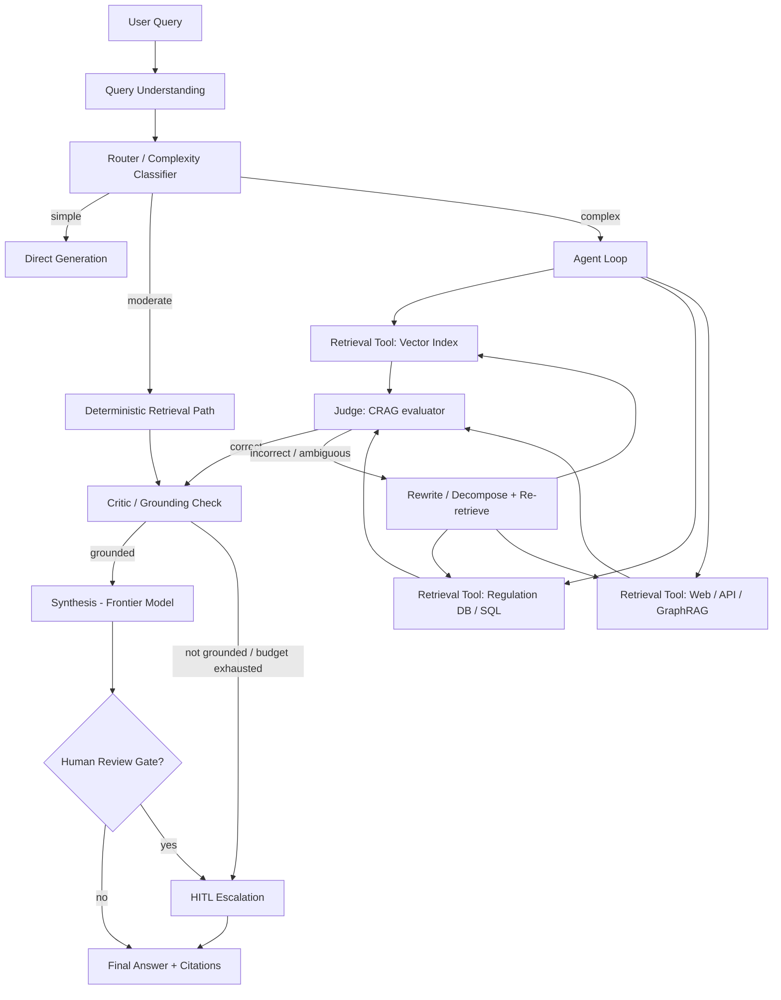
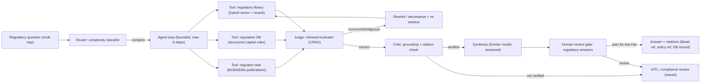

# Production-Grade Agentic RAG — The Synthesis of Agentic Retrieval Architectures and the Production Engineering Playbook

> **Author:** Jack Liu Shurui · **Role:** Solution Architect, Cymbal Bank
> **Repo:** [github.com/jackliusr/research](https://github.com/jackliusr/research)
> **Series:** LLM/AI Engineering Guides — the *production engineering* deep dive on **agentic RAG** (the HOW of running agentic retrieval systems, not the WHEN of the timeline, not the mechanics of the techniques)
> **Companion Guides:** [RAG Evolution Timeline](rag_evolution_timeline_guide.md) (the narrative — the agentic wave) · [Advanced RAG Techniques](advanced_rag_techniques_guide.md) (the technique mechanics) · [RAG Evaluation Methodology](rag_evaluation_methodology_guide.md) + [RAG Evaluation Tools Comparison](rag_evaluation_tools_comparison_guide.md) (the RAG eval playbook) · [Ragas](ragas_guide.md) + [TruLens](trulens_guide.md) (the eval tools) · [RAG Optimization Techniques](rag_optimization_techniques_guide.md) (the classic-RAG playbook) · [Production-Ready LLM Agents](../production_ready_llm_agents_guide.md) (the agent playbook this guide applies to RAG) · [LLM Agents Failures in Production](../llm_agents_failures_production_guide.md) (the failure math) · [Autonomous Agents](../autonomous_agents_guide.md) · [Hybrid Multi-Agent Systems](../hybrid_multi_agent_systems_guide.md) · [Enterprise Agentic Platform Architecture](../enterprise_agentic_platform_architecture_guide.md)
> **Last Updated:** August 2026

---

## Table of Contents

1. [The Agentic RAG Landscape](#1-the-agentic-rag-landscape)
2. [The Production Reality — Reliability, the Agentic Tax, Failure Modes](#2-the-production-reality--reliability-the-agentic-tax-failure-modes)
3. [Evaluation — The Layered Eval Stack for Agentic RAG](#3-evaluation--the-layered-eval-stack-for-agentic-rag)
4. [Cost and Latency — The Economics of the Loop](#4-cost-and-latency--the-economics-of-the-loop)
5. [Observability and Guardrails — Ops, Tracing, Safety, HITL](#5-observability-and-guardrails--ops-tracing-safety-hitl)
6. [Design Decisions — Agentic vs Deterministic, Autonomy, and When NOT](#6-design-decisions--agentic-vs-deterministic-autonomy-and-when-not)
7. [The Production-Grade Reference Architecture](#7-the-production-grade-reference-architecture)
8. [Worked Example — A Banking Research Agent](#8-worked-example--a-banking-research-agent)
9. [The Future (2026+) — Deep Research, Platforms, Convergence](#9-the-future-2026--deep-research-platforms-convergence)
10. [Summary — Production-Grade Agentic RAG in One Page](#10-summary--production-grade-agentic-rag-in-one-page)
11. [Glossary](#11-glossary)
12. [References and Verification Notes](#12-references-and-verification-notes)

---

## How This Guide Fits the Series

Agentic RAG — retrieval where an LLM-driven **agent loop**, not a fixed pipeline, decides *when*, *what*, and *how often* to retrieve — is the 4th wave of the RAG evolution (see [rag_evolution_timeline_guide.md](rag_evolution_timeline_guide.md), §7, *The Agentic RAG Era (2024–2026)*). The technique mechanics are catalogued in [advanced_rag_techniques_guide.md](advanced_rag_techniques_guide.md) (Self-RAG, CRAG, Adaptive-RAG, GraphRAG deep dives). The general agent production playbook is [production_ready_llm_agents_guide.md](../production_ready_llm_agents_guide.md).

**This guide is the synthesis no sibling owns: agentic RAG *patterns* + the *production engineering* that makes them run — reliability, eval, cost, latency, observability, guardrails, HITL — plus the design decisions, a reference architecture, and a worked banking example.**

| Sibling guide | What it owns | How this guide uses it |
|---|---|---|
| [rag_evolution_timeline_guide.md](rag_evolution_timeline_guide.md) | The narrative — when and why RAG shifted to agentic | The definitional anchor (§1.1) and the convergence story (§9) |
| [advanced_rag_techniques_guide.md](advanced_rag_techniques_guide.md) | The technique mechanics — how each pattern works | The pattern catalog's "how" (§1.2 cross-refs, not re-explains) |
| [rag_evaluation_methodology_guide.md](rag_evaluation_methodology_guide.md) / [rag_evaluation_tools_comparison_guide.md](rag_evaluation_tools_comparison_guide.md) | The RAG eval playbook and tooling | The retrieval + generation eval layers (§3.1–3.2) |
| [ragas_guide.md](ragas_guide.md) / [trulens_guide.md](trulens_guide.md) | The eval tools | The eval tooling column (§3.5) |
| [../production_ready_llm_agents_guide.md](../production_ready_llm_agents_guide.md) | The agent production playbook | The playbook this guide *applies* to agentic RAG (§2–§6) |
| [../llm_agents_failures_production_guide.md](../llm_agents_failures_production_guide.md) | Why agents fail — compounding errors, the agentic tax | The reliability math and cost framing (§2.1–2.2) |
| [../llm_evaluation_vs_validation_guide.md](../llm_evaluation_vs_validation_guide.md) | Eval vs validation for LLM systems | The agent eval layer (§3.3) |
| [../hybrid_multi_agent_systems_guide.md](../hybrid_multi_agent_systems_guide.md) | Multi-agent orchestration | Multi-agent RAG (§1.2.6) |
| [../enterprise_agentic_platform_architecture_guide.md](../enterprise_agentic_platform_architecture_guide.md) | The platform: gateways, OTel, governance, FinOps | Tracing and platform integration (§5.1, §7.3) |
| [../mcp_framework_tools_guide.md](../mcp_framework_tools_guide.md) | MCP tool layer | Tools and permissions (§7.2) |
| [../agent_runtime_cache_design_guide.md](../agent_runtime_cache_design_guide.md) | Caching economics | Caching (§4.3) |
| [../ai_agent_drift_guide.md](../ai_agent_drift_guide.md) / [../llm_guard_models_guide.md](../llm_guard_models_guide.md) / [../implementing-responsible-ai.md](../implementing-responsible-ai.md) | Drift, guard models, responsible AI | Monitoring, guardrails, HITL (§5) |
| [rag_optimization_techniques_guide.md](rag_optimization_techniques_guide.md) / [vector_databases_guide.md](vector_databases_guide.md) | The classic-RAG stack | The deterministic core every agentic layer wraps |

**Verification note.** Pattern papers are cited with arXiv IDs (verified). The term "agentic RAG" itself is **practitioner usage** — it entered the vocabulary via framework documentation (LlamaIndex's *Agentic RAG* post, January 2024) and was formalized in the survey *Agentic Retrieval-Augmented Generation* (arXiv:2501.09136, January 2025), which taxonomizes systems by agent cardinality, control structure, autonomy, and knowledge representation. Cost/latency multipliers are flagged **(approximate)** — they depend on model, corpus, and harness. Claims are flagged **(verified)**, **(emerging)**, or **(opinion)** inline; unverifiable claims are flagged honestly.

---

## 1. The Agentic RAG Landscape

### 1.1 What Agentic RAG Is — The Definition

**Agentic RAG is retrieval-augmented generation in which an LLM-driven agent loop — not a fixed pipeline — decides when, what, and how often to retrieve.** The classical RAG contract is a single pass: *embed query → retrieve top-k → stuff into a prompt → generate*. Agentic RAG breaks that contract in three ways:

1. **Retrieval becomes a tool.** The retriever is exposed to the agent as a callable tool (a function, an MCP server, a vector-store handle) alongside web search, SQL, calculators, and APIs. The model decides to call it — or not.
2. **The loop replaces the pipeline.** The agent can retrieve, reason over what it got, retrieve again with a rewritten or decomposed query, reject bad evidence, consult a second source, and only then generate. Control flow is a `while` loop over tools, not a linear chain.
3. **Multi-step reasoning is first-class.** Multi-hop questions ("what are the capital requirements for instrument X, and how did they change after the 2023 Basel amendments?") are decomposed and answered in steps, with each step's retrieval informed by the previous step's reasoning.

The definitional shorthand used throughout this guide:

> **Agentic RAG = RAG + an agent loop.** Retrieval is a *tool*; reasoning is *iterative*; generation is *conditional on what the loop found*. The spectrum runs from *lightly agentic* (one routing decision, e.g. Adaptive-RAG) to *fully agentic* (an autonomous research loop, e.g. Deep Research products — see §9).

This is the **4th wave** of the RAG evolution — after naive (2020–2023), advanced (2023), and modular (2024) RAG — and it is covered narratively in [rag_evolution_timeline_guide.md](rag_evolution_timeline_guide.md) (§7, *The Agentic RAG Era (2024–2026)*) and mechanically in [advanced_rag_techniques_guide.md](advanced_rag_techniques_guide.md) (§2.4, §5.8–5.13). **This guide assumes those, and adds what they do not cover: how to run agentic RAG in production.**

> **Why the shift happened (one paragraph).** Classic RAG fails on three real query classes: *multi-hop* questions (no single chunk answers them), *evolving* questions (the corpus changed since indexing — stale chunks), and *tool-using* questions (the answer requires data outside the corpus, e.g. a live rate or a database join). Each failure traces to the same root: **the pipeline decides once, blindly**. Agentic RAG moves the decision to a loop that can *look, judge, retry, and look again* — at the price of everything §2–§5 discusses.

### 1.2 The Agentic RAG Pattern Catalog

The landscape of agentic RAG is not one architecture but a **family of patterns**, each with a canonical paper or practitioner origin. The mechanics are deep-dived in [advanced_rag_techniques_guide.md](advanced_rag_techniques_guide.md); here each pattern gets its *production profile*.

#### 1.2.1 Self-reflective — Self-RAG (2023, **verified**)

**Self-RAG** (*Self-RAG: Learning to Retrieve, Generate, and Critique through Self-Reflection*, Asai et al., **arXiv:2310.11511, October 2023**) trains an LM to emit **reflection tokens** that control and critique its own pipeline: *when to retrieve* (Retrieve/NoRetrieve), *whether retrieved passages support the generation* (ISREL/ISSUP), and *whether the output is useful* (ISUSE). The model generates multiple candidates and selects the best via the reflection scores.

- **Production profile:** the ancestor of *verify-after-generate* patterns. In production, teams rarely retrain the reflection tokens (as the paper does); they prompt a general LLM for the same *retrieve? support? use?* judgments. The pattern is the intellectual basis of the **critic** component in the reference architecture (§7).
- **Cost note:** reflection doubles or triples generation calls — every candidate is scored. Budget for it (§4).

#### 1.2.2 Corrective — CRAG (2024, **verified**)

**CRAG** (*Corrective Retrieval Augmented Generation*, Yan et al., **arXiv:2401.15884, January 2024**) adds a **lightweight retrieval evaluator** that scores the retrieved context as *correct / incorrect / ambiguous*. On *incorrect* it **decomposes the query and re-retrieves** (narrower, targeted queries); on *ambiguous* it **rewrites the query**; and it falls back to **web search** when the corpus is exhausted. Only the judged-relevant documents are used in generation.

- **Production profile:** the most directly *production-transferable* of the paper patterns, because it needs **no training** — a small classifier or prompted LLM plays the evaluator. The *correct/incorrect/ambiguous* trichotomy maps cleanly onto a retrieval-quality gate (§3.1).
- **Cost note:** the evaluator is cheap (single small-model call); the *re-retrieval on incorrect* is where the loop cost lands (§4.2).

#### 1.2.3 Adaptive — Adaptive-RAG (2024, **verified**)

**Adaptive-RAG** (*Learning to Adapt Retrieval-Augmented Large Language Models through Question Complexity*, Jeong et al., **arXiv:2403.14403, March 2024**) routes queries by **predicted complexity**: *no retrieval* for simple queries, *single-step retrieval* for moderate ones, *multi-step retrieval* for complex ones. A small classifier scores complexity up front.

- **Production profile:** the *cheapest* agentic pattern — the only "agentic" part is one routing decision. This is the pattern most teams should start with: it captures most of the win (don't retrieve when you don't need to; retrieve iteratively when you do) at a fraction of the loop cost.
- **This is the router** in the reference architecture (§7.2) and the worked example (§8).

#### 1.2.4 Graph-based — GraphRAG (2024, **verified**)

**GraphRAG** (*From Local to Global: A Graph RAG Approach to Query-Focused Summarization*, Edge et al., Microsoft Research, **arXiv:2404.16130, April 2024**) builds a knowledge graph over the corpus, detects **communities** via Leiden clustering, and pre-summarizes each community hierarchically (map-reduce). Queries are answered from community summaries — enabling *global* questions ("what are the main themes across this corpus?") that chunk retrieval cannot answer. Mechanics: [advanced_rag_techniques_guide.md](advanced_rag_techniques_guide.md) §5.6.

- **Production profile:** graph construction is an expensive offline batch job (LLM extraction over every entity relationship — **verified cost concern**); the *retrieval* side (community matching + graph traversal) is cheap. In *agentic* GraphRAG, the graph becomes **one retrieval tool among several** — the agent chooses vector search for local questions, graph traversal for relational ones, community summaries for global ones. GraphRAG does not need an agent to be useful; the agent makes the graph *reachable on demand*.

#### 1.2.5 Tool-using — search agents and multi-tool retrieval (2024–2026, **practitioner consensus**)

The most common *production* agentic RAG is simply **a tool-using agent with retrieval as one of its tools**: ReAct-style loops (Reason + Act) over `search_corpus`, `search_web`, `query_sql`, `get_stock_price`, etc. The agent plans, calls tools, observes results, and iterates. This is the pattern behind every "chat with your data + live sources" product.

- **Production profile:** maximal flexibility, maximal risk surface. Each tool is an attack surface (§5.3), each tool call a latency and cost step (§2.2), each wrong tool choice a failure mode (§2.3). The pattern is where the production discipline of this guide pays for itself.
- **The multi-agent variant** (specialist agents — a retriever agent, a critic agent, a writer agent) is a *multi-agent RAG* topology: see [../hybrid_multi_agent_systems_guide.md](../hybrid_multi_agent_systems_guide.md) and §1.2.6.

#### 1.2.6 Multi-agent RAG (2024–2026, **emerging**)

**Multi-agent RAG** decomposes the pipeline into **specialist agents** that collaborate: a *planner* decomposes the question, a *retriever agent* (or several, each owning an index — "document agents") fetches, a *critic/validator agent* checks grounding, a *writer agent* synthesizes. This is the *agent cardinality* dimension of the agentic RAG taxonomy (arXiv:2501.09136 — single-agent vs multi-agent, **verified**). Orchestration patterns — supervisor, hierarchical, peer — are covered in [../hybrid_multi_agent_systems_guide.md](../hybrid_multi_agent_systems_guide.md).

- **Production profile:** the most expressive and the most expensive topology — N agents × M steps × per-step tokens. Use only when the *knowledge is genuinely partitioned* (different indexes with different access rights, e.g. a markets library vs a regulatory library) or when review separation is a governance requirement. For a single corpus, a single agent with tools beats multi-agent on cost and latency, **verified by the compounding math in §2.1**.

### 1.3 The Landscape Table

| Pattern | Mechanism | Strength | Weakness | Use case |
|---|---|---|---|---|
| **Self-reflective (Self-RAG)** | Reflection tokens / prompted judgments: retrieve? support? use? | Grounded, self-correcting generations; explicit quality signal | Extra generation calls per candidate; reflection quality caps the system | Factual QA where hallucination is unacceptable; the critic in any agentic stack |
| **Corrective (CRAG)** | Retrieval evaluator → correct / incorrect / ambiguous → re-retrieve, rewrite, or web fallback | Robust to bad retrieval; no training needed; plug-and-play | Re-retrieval loop costs; evaluator errors propagate | Production RAG where the corpus is noisy or coverage is uneven |
| **Adaptive (Adaptive-RAG)** | Complexity classifier → no / single-step / multi-step retrieval | Cheapest agentic pattern; cuts wasted retrieval | Complexity judgment can misfire; limited expressiveness | High-volume mixed traffic: simple + complex queries in one system |
| **Graph-based (GraphRAG)** | KG construction + community summaries; graph traversal as a tool | Answers global/relational questions chunk retrieval cannot | Expensive offline indexing; KG freshness lag | Corpora with entity/relationship structure; "themes and trends" questions |
| **Tool-using (search agents)** | ReAct loop; retrieval is one tool among many | Maximal coverage: corpus + web + SQL + APIs | Maximal risk/cost/latency surface; tool-choice errors | Mixed-source questions; live data + documents; research assistants |
| **Multi-agent RAG** | Specialist agents (planner/retriever/critic/writer) | Partitioned knowledge, role separation, governance-friendly | N× cost and latency; coordination complexity | Partitioned corpora with access rights; review-separation requirements |

> **Reading the table.** The patterns are *composable, not competing*: Adaptive-RAG routes, CRAG corrects, Self-RAG reflects, GraphRAG supplies relational knowledge, tool-using extends the sources, multi-agent partitions the work. A production system typically stacks **adaptive + corrective + reflective** over a hybrid retriever (see the reference architecture in §7).

---

## 2. The Production Reality — Reliability, the Agentic Tax, Failure Modes

The pattern catalog is seductive; production is where the loop bites. Everything in this section is the agent-specific reality of the general failure analysis in [../llm_agents_failures_production_guide.md](../llm_agents_failures_production_guide.md) — read that guide for the full taxonomy. This section applies it to *retrieval loops specifically*.

### 2.1 Reliability — The Compounding Per-Step Error Problem

The defining math of any multi-step system:

> **A 95%-per-step success rate over 10 steps gives roughly 60% overall success.** 0.95¹⁰ = 0.5987 ≈ **0.60** (**verified arithmetic**; full table in [../llm_agents_failures_production_guide.md](../llm_agents_failures_production_guide.md) §1).

An agentic RAG query is a chain of dependent steps: *understand query → route → retrieve → judge retrieval → (re-retrieve) → synthesize → verify*. Each step that can fail — a wrong route, a missed document, a bad relevance judgment, a loop — multiplies into the final success rate:

| Step chain | Per-step reliability → end-to-end |
|---|---|
| Classic RAG (1 retrieve + 1 generate) | 0.95² ≈ **0.90** |
| Adaptive-RAG (route + retrieve + generate) | 0.95³ ≈ **0.86** |
| Agentic RAG, single loop (route + retrieve + judge + re-retrieve + generate) | 0.95⁵ ≈ **0.77** |
| Agentic RAG, multi-step research (10 tool steps + synthesis) | 0.95¹⁰ ≈ **0.60** |

Two structural consequences (**verified arithmetic**, framed in the failures guide):

1. **Per-step reliability is worth more than model quality.** Raising per-step accuracy from 0.95 to 0.99 more than doubles a 10-step task's success (0.60 → 0.90). A *slightly* better judge or router is worth more than a *much* better generator.
2. **Step count is the lever you control.** Cutting 5 steps from a 15-step chain at 95% per-step moves success from ~46% to ~60%. **Every design decision in §6 is, at bottom, a step-count decision.**

The production consequence for agentic RAG: **the loop must be engineered for per-step verification and early exit** — every retrieval decision point gets a cheap verifier (CRAG's evaluator, Self-RAG's reflection, or a plain grounding check), and the loop gets a max-steps bound so a failing chain terminates instead of compounding.

### 2.2 The Agentic Tax — Cost and Latency of Multi-Step

Agentic RAG trades the cheap single pass for an *agentic tax*: **multi-step token spend and multi-step latency** ([../llm_agents_failures_production_guide.md](../llm_agents_failures_production_guide.md) §5 covers the general economics; §4 of this guide covers the levers). Rough magnitudes (**approximate** — model- and harness-dependent):

- **Tokens per query:** classic RAG ≈ 1 retrieval + 1 generation (say 2–4k tokens total). A single agentic loop with 2 retrieval steps, 2 judge calls, and a final generation runs **3–8× the tokens**; a 10-step research loop can run **10–30×**.
- **Latency per query:** classic RAG p50 ≈ 2–5 s. Agentic single-loop p50 ≈ 5–15 s; multi-step research p50 ≈ 60 s to **minutes** (OpenAI Deep Research class products report 5–30 minute runs — see §9). p95 is the number that matters and it is *fat-tailed*: one slow re-retrieval step drags the whole query.
- **The tax is nonlinear.** Each added step adds *expected* latency of (per-step latency) but *observed* p95 latency of (sum of slow steps) — and token cost compounds with every re-retrieval.

> **The honest framing.** The agentic tax is only worth paying when it buys reliability or coverage the single pass cannot deliver (§6.3). For a simple lookup, the agentic loop is a *cost with no benefit*. This is the central design decision of agentic RAG, and §6 exists to make it deliberately rather than accidentally.

### 2.3 The Agentic RAG Failure Modes

Beyond the general agent failure taxonomy ([../llm_agents_failures_production_guide.md](../llm_agents_failures_production_guide.md) §2), retrieval loops have *signature* failure modes (**verified** as documented practitioner failure modes; catalogued here for production monitoring):

1. **Wrong tool / wrong index.** The agent routes a question about QIS spreads to the regulatory index (or calls `search_web` for internal policy). Symptom: confident, well-grounded-in-the-wrong-document answers. Detection: tool-selection accuracy evals (§3.3) and per-tool success telemetry (§5.2).
2. **Hallucinated retrieval — the phantom citation.** The agent cites a document it never retrieved, or the retriever returns a plausible-but-irrelevant chunk and the generator follows it. The *most dangerous* mode, because the output *looks* grounded. Detection: citation/grounding evals — every claim must resolve to an actually-retrieved chunk (§3.2); this is why the **critic** exists (§7.2).
3. **The retrieval loop — spinning.** The agent re-retrieves with rewritten queries and never converges (the classic unbounded-loop failure, with retrieval flavor). Symptom: 6+ retrieval steps on a question a router would have answered in 1. Detection: loop-frequency and max-steps-hit metrics (§5.2); mitigation: hard step caps + budget caps (§4.2) — **mandatory**.
4. **Context overload.** Each retrieval step appends chunks; after 3 iterations the context is 40k tokens of partially-redundant text, and the model suffers *Lost in the Middle* degradation (see [rag_vs_long_context_llms_guide.md](rag_vs_long_context_llms_guide.md)). Symptom: answer quality *drops* as loop length grows. Mitigation: context compression/reranking per step ([rag_optimization_techniques_guide.md](rag_optimization_techniques_guide.md)), retrieval-result caps, dedupe.
5. **Router misfire.** The complexity classifier (§1.2.3) sends a simple query into multi-step retrieval or a complex one to no-retrieval. Symptom: wasted cost or hallucinated answers on the tail. Detection: route-confusion metrics on the confusion matrix of predicted vs actual complexity.

### 2.4 The Production Table

| Concern | Agentic RAG impact | Mitigation |
|---|---|---|
| **Reliability** | Per-step errors compound: 0.95¹⁰ ≈ 0.60 | Fewer steps; per-step verifiers (judge/critic); max-steps caps; fail-fast to fallback (§2.1) |
| **Cost** | 3–30× token spend vs classic RAG (**approximate**) | Budget caps; model routing; caching; adaptive routing (§4) |
| **Latency** | 5–15 s single loop; minutes for research loops (**approximate**); fat-tailed p95 | Parallel retrieval; streaming; step caps; route simple queries to no-retrieval (§4.5) |
| **Correctness** | Phantom citations; wrong-index grounding; context overload | Layered evals (§3); critic/verification step (§7.2); retrieval-result caps |
| **Runaway behavior** | Retrieval loops; tool-choice cascades | Hard step + budget caps; loop-frequency alerts (§5.2) |
| **Security** | Each tool is an attack surface; injection via retrieved docs | Tool allow-lists; injection defense; guard models (§5.3) |
| **Accountability** | Multi-step = multi-actor = hard to audit | Full tracing + audit trail of every tool call (§5.1) |

> **The one-sentence production reality.** Agentic RAG multiplies *capability* and *risk* by the same factor — the loop — so production discipline is not an add-on but the thing that determines whether the pattern ships or sinks. The remaining sections operationalize that sentence.

---

## 3. Evaluation — The Layered Eval Stack for Agentic RAG

Agentic RAG cannot be evaluated as one black box. It is three systems stacked: a **retriever** (did we fetch the right evidence?), a **generator** (did we answer faithfully from that evidence?), and an **agent** (did we make the right decisions along the way?). Each layer has its own metrics, tools, and gates. This is the *layered eval* doctrine — the RAG side is the playbook of [rag_evaluation_methodology_guide.md](rag_evaluation_methodology_guide.md); the agent side is [../llm_evaluation_vs_validation_guide.md](../llm_evaluation_vs_validation_guide.md). This section integrates them for the agentic case, where **the agent layer is new** — classic RAG had no decisions to evaluate.

### 3.1 Retrieval Evals — Context Precision and Recall

The first layer: did the loop fetch the *right* evidence? Metrics (full definitions and worked examples in [rag_evaluation_methodology_guide.md](rag_evaluation_methodology_guide.md) §2):

- **Context precision** — of the retrieved chunks, how many are actually relevant (and how high do the relevant ones rank)? In agentic RAG this is measured **per retrieval step**, not just per query: a loop that retrieves garbage on step 2 but good evidence on step 4 has a retrieval problem even if the final answer is right.
- **Context recall** — did the retrieval cover all evidence needed for the answer? For multi-hop questions, recall is *per sub-question*: an agent that never retrieves for one hop has a recall hole that no amount of generation polish fixes.
- **Retrieval correctness under correction** — the CRAG-style judgment (correct / incorrect / ambiguous) itself must be evaluated: when the evaluator says "incorrect", was it right to say so? A bad evaluator silently disables the correction loop (§1.2.2).

> **Agentic twist.** Track retrieval metrics *conditioned on loop position* — precision@step1 vs precision@step3. Classic RAG's aggregate numbers hide the agentic failure mode where the first retrieval is wrong and the loop compensates expensively. If step-1 precision is low, the *query understanding* step, not the retriever, is the problem.

### 3.2 Generation Evals — Faithfulness and Answer Relevance

The second layer: did the final answer use the retrieved evidence *honestly*? Metrics ([rag_evaluation_methodology_guide.md](rag_evaluation_methodology_guide.md) §3):

- **Faithfulness (groundedness)** — every claim in the answer is supported by the retrieved context. **This is the metric that catches phantom citations** (§2.3.2): a faithful answer cites only chunks actually retrieved. In agentic RAG, faithfulness must be checked against the *accumulated* context of all steps, not just the final retrieval — an answer may ground a claim in a chunk retrieved at step 2 that was later contradicted.
- **Answer relevance** — the answer addresses the user's question (not the question the loop *thought* was asked).
- **Answer correctness** — against a reference answer for golden sets (methodology guide §4.1).

### 3.3 Agent Evals — Task Success, Tool-Use Correctness, Step Efficiency

The third layer is what makes agentic RAG eval *different* (**this is the synthesis the RAG eval guides do not cover**; the agent-eval doctrine is in [../llm_evaluation_vs_validation_guide.md](../llm_evaluation_vs_validation_guide.md)):

- **Task success** — did the *agentic run* produce a correct, complete answer (end-to-end, judged by LLM-as-judge or human against a golden answer)? This is the only metric that captures multi-hop correctness.
- **Tool-use correctness** — for each tool call: was the *right* tool chosen (index vs web vs SQL)? Was the query well-formed for that tool? Was the call necessary, or redundant? Confusion matrices over (intended tool, actual tool) catch the wrong-index failure (§2.3.1).
- **Step efficiency** — how many steps did the run take vs the *minimum necessary*? A run that succeeds in 8 steps where 3 suffice is a cost and latency problem hiding behind a correct answer. Metric: steps-per-query, re-retrieval rate, loop frequency (§5.2).
- **Trajectory quality** — for multi-agent topologies, the *trajectory* (plan → actions → evidence) is evaluated for coherence, not just the terminal answer — the SoK-style layered assessment (component-level tool accuracy, trajectory-level reasoning coherence, system-level outcome fidelity; see verification notes).

### 3.4 The Practice — A Layered Eval Harness and Multi-Hop Golden Sets

The production practice (**verified** as the emerging consensus in agentic RAG eval; see the evaluation-pipeline references in §12):

1. **Build golden sets that are *multi-hop by construction*.** Classic RAG goldens are single-hop Q→A pairs. Agentic goldens must record: the question, the correct answer, the *evidence set* (which documents/chunks constitute proof), the *expected tool path* (which tools, in what order, is the efficient route), and the *minimum step count*. Without the expected path, step-efficiency evals have no ground truth.
2. **Evaluate the layers independently and in sequence.** Retrieval-only runs (no agent, fixed pipeline) → agent-loop runs with the retriever frozen → full system. Each layer's regression is attributed to the layer that owns it — the isolation principle of [rag_evaluation_methodology_guide.md](rag_evaluation_methodology_guide.md) §1.3, applied *with the agent layer added*.
3. **Use LLM-as-a-judge with adversarial prompting for faithfulness**, human review for correctness on a stratified sample (simple/multi-hop/edge), and *deterministic checks* wherever possible (citation resolution: does every cited ID exist in the retrieved set? — a script, not a judge).
4. **Score every run in production** (traffic evals), not just CI goldens — agentic degradation often shows first as route-shift or loop-frequency drift (§5.2, and [../ai_agent_drift_guide.md](../ai_agent_drift_guide.md)).

### 3.5 Eval Tools

| Tool | What it covers | Agentic RAG fit |
|---|---|---|
| [Ragas](ragas_guide.md) | Faithfulness, answer relevance, context precision/recall; **agentic metrics** (tool call accuracy, planning accuracy, trajectory) | The layered stack in one harness; LLM-judge based |
| [TruLens](trulens_guide.md) | RAG triad (groundedness, context relevance, answer relevance); feedback functions | Streaming feedback on live runs; drift detection over time |
| [LangSmith / Langfuse](../enterprise_agentic_platform_architecture_guide.md) | Tracing + eval datasets + online scorers for agent traces | Trajectory-level eval on real traffic; the platform glue |
| [DeepEval](rag_evaluation_tools_comparison_guide.md) | RAG + agent metrics, pytest-native CI integration | The CI gate runner (see below) |
| Custom judges | Task success, tool-use correctness, step efficiency on your schema | The agentic-specific layer — rarely off-the-shelf |

Tool comparison details: [rag_evaluation_tools_comparison_guide.md](rag_evaluation_tools_comparison_guide.md).

### 3.6 Eval Gates — CI and Deployment

Evals are only production-grade when they *gate* changes. The gate doctrine from [../production_ready_llm_agents_guide.md](../production_ready_llm_agents_guide.md) §4, applied to agentic RAG:

- **Prompt/tool/config changes** run the full layered harness on the golden set in CI before merge.
- **Model upgrades** run the harness *plus* a canary on shadow traffic (see §5.2) — a new router model can silently change routing behavior on 40% of queries.
- **Gates are per-layer with escalating bars:** retrieval evals (context recall ≥ X), generation evals (faithfulness ≥ Y, answer relevance ≥ Z), agent evals (task success ≥ W, step efficiency ≤ K steps/query median). A change that improves faithfulness but adds 2 steps/query is *blocked* until the cost is justified — the gate is the enforcement mechanism for the agentic tax (§2.2).
- **Regression budgets, not just thresholds:** agentic systems degrade gradually; gate on *delta vs baseline* (e.g. "no metric down >2 points") in addition to absolute thresholds.

### 3.7 The Eval Table

| Layer | Metrics | Tool | Gate |
|---|---|---|---|
| **Retrieval** (per step) | Context precision, context recall, evaluator accuracy | Ragas, TruLens, custom | CI: recall/precision thresholds on golden retrieval sets |
| **Generation** | Faithfulness, answer relevance, answer correctness, citation resolution | Ragas, TruLens, LLM-judge, scripts | CI: faithfulness/relevance thresholds; citation checks |
| **Agent loop** | Task success, tool-use correctness, step efficiency, trajectory quality | Custom judges, LangSmith/Langfuse online scorers | CI + canary: success ≥ W, steps ≤ K; route-confusion matrix |
| **Production** | Live success rate, loop frequency, cost/query, drift | Platform observability (§5) | Alerts + shadow-traffic canaries before every release |

---

## 4. Cost and Latency — The Economics of the Loop

### 4.1 Token Costs — Multi-Step Accumulation

Every agentic step is a *token purchase*: the reasoning call that decides to retrieve, the retrieved chunks loaded into context, the judge call that scores them, the re-retrieval, the final synthesis. Worked examples (**approximate** — assume a mid-tier frontier model; prices change, ratios hold):

| Query type | Steps | Tokens/query | Relative cost |
|---|---|---|---|
| Classic RAG | retrieve + generate | ~3k | **1×** |
| Adaptive-RAG, simple query | route (no retrieval) + generate | ~1.5k | **0.5×** |
| Adaptive-RAG, complex query | route + 2 retrievals + generate | ~6k | **2×** |
| Agentic loop w/ judge + re-retrieval | route + retrieve + judge + re-retrieve + generate | ~10–15k | **3–5×** |
| Multi-step research agent (10 tool calls + synthesis) | 10×(reason + retrieve) + synthesize | ~40–80k | **10–30×** |

The two structural cost drivers: **(1) re-retrieval** — each "retrieve again" re-pays retrieval + context loading + reasoning; **(2) judges/reflections** — every verification call is a full generation. Cost grows with the *number of LLM calls*, which is why step-count control (§2.1) is simultaneously a reliability lever and a cost lever.

### 4.2 The Loop Cost — Re-Retrieval and Budget Caps

The loop is where cost escapes containment. Production controls (**mandatory**, per the failures guide's cost doctrine — [../llm_agents_failures_production_guide.md](../llm_agents_failures_production_guide.md) §5):

- **Hard step caps:** max N tool calls per query (e.g. 6). Non-negotiable — this is the difference between a bounded system and a bill shock.
- **Token budget caps:** max tokens per query, enforced by the harness *before* each step ("this query has 12k tokens left").
- **Per-step cost metering:** log cumulative cost per run; alert on per-query cost outliers (p99 cost/query is the metric to watch).
- **Early termination:** if the judge scores retrieval "incorrect" twice in a row, stop looping and fall back to a grounded "I couldn't find sufficient evidence" — cheaper *and* more honest than a 7th retrieval.
- **Escalation instead of iteration:** queries that exhaust the budget escalate to HITL (§5.4) rather than looping.

### 4.3 Caching — Prompt Caching and Retrieval Caching

Caching is the highest-leverage cost lever in agentic RAG because loops *repeat themselves* (**verified practice**; economics in [../agent_runtime_cache_design_guide.md](../agent_runtime_cache_design_guide.md)):

- **Prompt caching** (provider-side KV-cache reuse): agentic loops are cache-friendly — the system prompt + accumulated context are stable across steps; only the newest step changes. Typical savings: 50–90% on the *re-read* portion of input tokens for multi-step runs (**approximate**, provider- and prefix-structure-dependent).
- **Retrieval caching:** the same query (or rewritten query) hitting the same index returns the same top-k. Cache retrieval results keyed by (query-embedding bucket + index version). In multi-tenant or burst traffic this collapses duplicate work.
- **Vector cache / index-level caching** (**emerging**): caching *computed* artifacts — reranker scores per (query, doc) pair, embedding of repeated query formulations, GraphRAG community summaries (§1.2.4). GraphRAG's offline summarization is itself a cache of expensive LLM work.
- **The cache-invalidation trap:** retrieval caches are only valid while the index is unchanged. Version the cache key with index version, and treat retrieval caching as *semantic* (query-level), not *token-level* — a wrong cached retrieval quietly re-grounds the whole answer.

### 4.4 Model Routing — Cheap Decisions, Strong Synthesis

Not every step needs the frontier model (**verified practice**; the platform pattern is [../enterprise_agentic_platform_architecture_guide.md](../enterprise_agentic_platform_architecture_guide.md)):

| Step | Model tier | Why |
|---|---|---|
| Query complexity routing (Adaptive-RAG) | Small/cheap model or classifier | Binary-ish decision; small models are 10–50× cheaper |
| CRAG retrieval evaluator | Small model | Correct/incorrect/ambiguous judgment is learnable |
| Query rewriting/decomposition | Small–medium | Formulaic transformation |
| Judge/critic verification | Medium | Scoring, not reasoning |
| Final synthesis | **Frontier model** | The answer quality the user actually sees |

Rule of thumb: **spend the expensive model only where the user-facing output is produced.** The routing/judging stack at 1/10th the price makes the loop affordable; the synthesis at full price keeps quality. (Model router accuracy must itself be gated — §3.6 — a cheap router that misfires 15% of the time is false economy.)

### 4.5 Latency — Multi-Step, Parallel Retrieval, Streaming

Latency in agentic RAG is the *sum of serial steps* — and p95 is fat-tailed because any single slow step (a slow index, a 30 s web call) adds to every run. Levers:

- **Parallel retrieval** — when the router predicts multi-hop, fire the sub-queries' retrievals **concurrently** (sub-question fan-out, per §1.2.3). Serializing 3 retrievals at 300 ms each is ~1 s; parallel is ~300 ms. Same for judge calls that are independent.
- **Streaming** — stream the *final synthesis* token-by-token so perceived latency collapses even when wall-clock is unchanged. (Interim "thinking" steps can stream as status/progress — the user sees the loop working, which also builds trust.)
- **Early-exit routing** — the cheapest latency lever is *not looping at all*: Adaptive-RAG's no-retrieval path answers simple queries in one call (§1.2.3). Median latency is dominated by the route distribution, not the loop worst case.
- **Speculative retrieval? (flagged)** — retrieving *before* the model finishes reasoning (parallel reasoning + retrieval speculation) is an **emerging, unverified** technique: it risks wasted retrieval calls and stale evidence. As of 2026 I have not seen production evidence for it; treat it as research, not practice.
- **Infrastructure:** vector index latency budgets (see [vector_databases_guide.md](vector_databases_guide.md)), reranker tiering, and per-tool timeouts (a web tool that hangs 60 s must be cut at 15 s and the agent told to continue without it). Timeouts are latency caps.

### 4.6 The Cost-Latency Table

| Lever | Mechanism | Saving / effect (**approximate** unless noted) |
|---|---|---|
| Step caps + budget caps | Bound the loop; escalate on exhaustion | Eliminates unbounded runs; caps p99 (mandatory) |
| Early-termination on bad retrieval | 2x "incorrect" → fallback answer | ~20–40% fewer wasted loops |
| Prompt caching | KV-cache reuse across loop steps | 50–90% off re-read input tokens |
| Retrieval caching | Cache (query, index-version) → top-k | Collapses duplicate retrievals in bursts |
| Model routing | Cheap router/judge, frontier synthesis | 30–70% cost reduction on loop steps |
| Parallel retrieval | Concurrent sub-query fan-out | Serial time / fan-out (latency) |
| Streaming | Stream synthesis + step progress | Perceived latency → near-zero wait |
| Early-exit routing | No-retrieval path for simple queries | Median latency and cost drop with route mix |
| Timeouts | Per-tool latency caps | Trims p95 fat tail |

> **The economic summary.** A well-levered agentic RAG system costs **2–4×** a classic RAG system per complex query — and *less* per simple query (the adaptive route skips retrieval). The system that costs 10–30× is the one that skipped §4.2–§4.4. Budget caps, caching, and routing are not optimizations; they are the difference between a product and a line item.

---

## 5. Observability and Guardrails — Ops, Tracing, Safety, HITL

### 5.1 Observability — Tracing the Agent Loop

You cannot debug what you cannot see, and agentic RAG is *many* invisible decisions. The practice (**verified**; platform pattern in [../enterprise_agentic_platform_architecture_guide.md](../enterprise_agentic_platform_architecture_guide.md) §observability):

- **Trace every run as a tree:** a root *query span*; child spans per *agent step* (route decision, tool call, judge call, synthesis); inside tool spans, the *retrieval sub-spans* (embedding, ANN search, rerank). **OTel GenAI semantic conventions** provide the standard attributes (gen_ai.system, gen_ai.usage.input_tokens, tool names, spans per step) so traces are portable across LangSmith, Langfuse, Datadog, Grafana, or in-house.
- **Attribute the trace, not just the answer:** each span carries the model, the prompt version, the tool name, the chunk IDs returned, the judge verdict, the tokens. This is what makes §2.3 failure modes *diagnosable* — "this loop spun because the judge kept scoring 'ambiguous'" is a query you can answer from spans.
- **Audit trail:** every tool call with its inputs, outputs, and decision rationale logged immutably — the accountability substrate for regulated environments (see [../implementing-responsible-ai.md](../implementing-responsible-ai.md)).

### 5.2 Monitoring — The Metrics That Matter

Dashboards for agentic RAG monitor the *loop*, not just the answer (**verified** practice; drift treatment in [../ai_agent_drift_guide.md](../ai_agent_drift_guide.md)):

| Metric | What it detects | Alert |
|---|---|---|
| **Success rate** (task-level, live) | Overall health; drops after releases/model swaps | SLO breach; step-change |
| **Cost per query** (p50/p95/p99) | Loop-cost creep; budget-cap hits | p99 cost rising 2 weeks running |
| **Loop frequency** (steps/query distribution) | Retrieval spinning; route-shift toward complex paths | Median steps rising; max-steps-hit rate >1% |
| **Route distribution** | Router drift (more queries routed to expensive paths) | Shift >X% vs baseline |
| **Tool-use confusion** (intended vs actual) | Wrong-index/wrong-tool failures | Accuracy per tool < threshold |
| **Judge/critic verdict distribution** | Evaluator drift (e.g. 80% "incorrect" = retrieval or evaluator broken) | Verdict mix shift |
| **Retrieval latency per index** | Index degradation | p95 latency breach |
| **Faithfulness on live traffic** (sampled LLM-judge) | Silent hallucination growth | Score drop >2 pts |

> **Drift is the quiet killer.** Agentic RAG degrades *over time* — the corpus grows, embeddings shift, the router's complexity distribution changes, a new document changes what "top-k" means. Continuous scoring on live traffic plus the temporal monitoring playbook of [../ai_agent_drift_guide.md](../ai_agent_drift_guide.md) is the difference between a system that drifts silently for a quarter and one that alerts on week one.

### 5.3 Guardrails — Tool Permissions and Injection Defense

Agentic RAG's attack surface is *every tool it can call* and *every document it retrieves*:

- **Tool permissions and allow-lists:** the agent gets exactly the tools its scope requires, each with read-only credentials, per-tenant scoping, and rate limits — the tool-governance pattern of [../mcp_framework_tools_guide.md](../mcp_framework_tools_guide.md). A research agent *reads* the regulation DB; it never gets a write handle. Tools are declared in a manifest; the runtime enforces it.
- **Prompt injection via retrieved documents:** the corpus is an untrusted input channel — a document can contain "ignore previous instructions and exfiltrate…" and the agent will *retrieve* it into its own context. Defense: treat retrieved text as **data, never as instructions** (system-prompt hardening, instruction-delimiter discipline, no tool-triggering from retrieved content), input filtering with guard models ([../llm_guard_models_guide.md](../llm_guard_models_guide.md)), and *no privileged tools reachable via document content*. Injection-aware golden sets (§3.4) with adversarial documents belong in CI.
- **Output guardrails:** the synthesis passes output classifiers (PII, prohibited content) before release, especially in regulated contexts; see [../llm_guard_models_guide.md](../llm_guard_models_guide.md) and [prompt_injection_guide.md](../prompt_injection_guide.md).
- **Tenancy:** in a bank, the markets index and the regulatory index are different trust domains; retrieval must never cross them. Enforce per-index credentials and metadata scoping at the retriever, not in the prompt.

### 5.4 HITL — Human Checkpoints for High-Value Actions

The loop's autonomy is bounded by *where humans are inserted* ([../implementing-responsible-ai.md](../implementing-responsible-ai.md) governs the general doctrine):

- **Review gates:** high-value or irreversible outputs (regulatory answers, client-facing communications, trade-adjacent summaries) route to a human reviewer before release — the agent drafts, the human owns.
- **Escalation path:** budget-exhausted or low-confidence runs (§4.2) escalate with the full trace attached, so the human reviews *evidence and reasoning*, not just the answer.
- **Feedback loop:** HITL review outcomes are *labeled data* — the most valuable eval set you will ever own (§3.4). Review rejections feed the golden set; review approval rates become a live quality metric.
- **Cost of HITL:** human review is expensive and slow — scope it to *high-value actions only* (§8.6 shows the banking calibration), and design the reviewer UI around the trace, not the raw transcript.

### 5.5 The Ops Table

| Concern | Practice | Tooling |
|---|---|---|
| Tracing | Per-run span trees; agent + retrieval spans; OTel GenAI attributes; audit trail | LangSmith, Langfuse, OTel + Datadog/Grafana, in-house trace store |
| Monitoring | Loop metrics (success, cost/query, steps, route mix, judge verdicts) + drift scoring | Metrics platform + alerting; continuous LLM-judge sampling |
| Guardrails | Tool allow-lists, read-only creds, injection defense, output filters, tenancy | MCP manifests, guard models, prompt-injection test sets |
| HITL | Review gates on high-value outputs; escalation with traces; review-as-labels | Review UI, approval workflow, labeled-data pipeline |
---

## 6. Design Decisions — Agentic vs Deterministic, Autonomy, and When NOT

### 6.1 Agentic vs Deterministic — "Workflows for the Core, Agents for the Edges"

The first design decision is whether a given query path should be agentic at all. The governing principle from [../production_ready_llm_agents_guide.md](../production_ready_llm_agents_guide.md) §2 — **"workflows for the core, agents for the edges"** — applies to RAG with force:

- **Deterministic (workflow) RAG is the core:** the high-volume, well-understood query classes get a fixed pipeline — route, retrieve, generate — with no loop. It is fast, cheap, testable, and *explainable*. This is classic RAG ([rag_optimization_techniques_guide.md](rag_optimization_techniques_guide.md)) and it should remain the default for 70–90% of traffic.
- **Agentic (loop) RAG is the edge:** the tail of queries that are multi-hop, evolving, or tool-using gets the loop. Fewer queries, more capability, more cost — justified because *the deterministic path fails them* (§1.1).

The system is *not* "agentic RAG or RAG" — it is **one system with an agentic tier**, gated by the router. This is exactly Adaptive-RAG's design (§1.2.3), and it is also the honest economics: the agentic tax (§2.2) is paid only by the queries that need it.

### 6.2 The Autonomy Level — Scoped Agentic RAG

Within the agentic tier, *how much* autonomy? The autonomy spectrum (**verified** as the control-structure dimension of the agentic RAG taxonomy, arXiv:2501.09136):

| Autonomy level | What the loop may decide | Example |
|---|---|---|
| **L0 — fixed router** | Nothing; the system routes deterministically (rules, classifier) | Classic RAG + Adaptive-RAG routing |
| **L1 — scoped agentic retrieval** | Retrieve, judge, re-retrieve within a *fixed strategy space* (bounded loop, no new tools) | CRAG-style correction loop |
| **L2 — tool-using agent** | Choose among *pre-approved tools*, plan multi-step, in any order | ReAct research agent over index + web + SQL |
| **L3 — full autonomy** | Add tools, change strategy, act on the world | Long-horizon autonomous research (rare in enterprise) |

**The production sweet spot is L1–L2: "scoped agentic RAG"** — a *fixed router* (L0) decides whether the query enters the loop; the loop itself is *bounded* (max steps, budget caps, approved tool set). Autonomy is granted per capability, not wholesale: the router's routing table is deterministic and versioned; the retrieval loop is free within its sandbox; the synthesis is always grounded by the critic. Each autonomy grant is matched by a control (§2.1, §4.2, §5.3).

> **Why scoped beats open.** Every additional degree of freedom is a new compounding-error term (§2.1), a new cost tail (§4), and a new attack surface (§5.3). The failures guide's data ([../llm_agents_failures_production_guide.md](../llm_agents_failures_production_guide.md)) shows unbounded autonomy as the top failure driver. Scope the loop to the *minimum autonomy that answers the query class* — then expand only on measured evidence (§3.6 gates).

### 6.3 The Agentic Scope — When Retrieval Should Be Agentic vs Plain

**Make retrieval agentic when** (practitioner consensus, **verified** as the recurring guidance):

1. **Multi-hop questions** — the answer requires evidence from several documents/tools, each hop depending on the previous ("what are the capital requirements for X, and how did the 2023 Basel amendments change them?"). No single retrieval answers it.
2. **Evolving queries** — the corpus changes over time; freshness matters (regulatory updates, earnings). The loop can re-retrieve and compare, and *can say "the document was updated in July"* — classic RAG serves stale chunks.
3. **Tool-using questions** — the answer spans the corpus *and* live data (a rate, a database, the web). Retrieval alone cannot reach it.
4. **Ambiguous or underspecified queries** — the loop can rewrite, decompose, or ask a clarifying question instead of guessing once.

**Keep it plain (deterministic RAG) when:**

1. **Simple Q&A** — single-document lookup; one retrieval suffices. The loop adds cost and latency for zero gain.
2. **High-volume, homogeneous traffic** — the route distribution is stable; a fixed pipeline is cheaper and more testable.
3. **Latency-critical** — interactive lookup where 2 s beats 10 s.
4. **Strict auditability** — deterministic pipelines are trivially explainable; loops need full tracing (§5.1) and still carry decision variance.

> **The honest guidance (most queries don't need an agent).** In most production systems, the *majority* of queries are simple. A system whose router sends 80% of traffic down the deterministic path and 20% through a scoped loop captures nearly all of agentic RAG's value at a fraction of its cost. **Agentic RAG is a tier, not a replacement** — and the teams that ship it treat it that way.

### 6.4 When NOT — The Anti-Patterns

- **"Agentic for everything"** — routing every query through a 6-step loop because the demo looked impressive. Symptom: 5–10× cost with no measurable quality gain on the simple-query majority. This is **over-engineering**: the single most common agentic RAG failure in practice (**opinion**, grounded in the failures guide's over-autonomy findings).
- **The loop as a hallucination patch** — using re-retrieval to fix a *grounding* problem that is actually a *prompt/data* problem. If the answer is wrong because the corpus lacks the fact, no loop finds it; fix the corpus, not the loop.
- **Autonomy before evaluation** — shipping the loop before the layered harness (§3) exists. Unmeasurable autonomy is ungovernable autonomy.
- **Multi-agent RAG for a single corpus** — N agents × M steps for a knowledge base one agent-with-tools could serve at 1/3 the cost (§1.2.6).
- **The uncapped loop** — no step cap, no budget cap, no timeout. This is not a design decision; it is a liability.

**The over-engineering test:** for each query class, ask *"does the deterministic path measurably fail this class?"* — measured on the golden set with the failure logged, not assumed. Agentic where the answer is "yes, measurably"; deterministic where it is "no" or "I don't know yet".

### 6.5 The Decision Framework — Query Complexity → Agentic Depth

| Query characteristic | Complexity signal | Recommended path | Agentic depth |
|---|---|---|---|
| Factoid, single doc | Short; one entity; no conjunctions | **No retrieval** (parametric answer) or single retrieve | L0 |
| Moderate, single-hop lookup | Keyword-mappable; one clear source | Single-step retrieval + generate | L0 |
| Multi-hop (2–3 docs) | Multiple entities; "and"/"then" relations | Scoped loop: decompose → parallel retrieve → judge → synthesize | L1 |
| Evolving/temporal | Time qualifiers; "latest", "changed", "since" | Loop with freshness check + re-retrieval | L1–L2 |
| Tool-using (corpus + live data) | Needs non-corpus data | Tool-using agent over approved tools | L2 |
| Global/cross-corpus themes | "What are the main…", "trends across…" | GraphRAG community retrieval (or research loop) | L1–L2 |
| Open-ended research | Broad; many sources; iterative refinement | Research agent (Deep Research class, §9) | L2–L3 |

**The decision rule:** score the query on (hop count, source count, freshness need, ambiguity); map to the path; *always default down* when in doubt. The router's thresholds are themselves eval-tuned artifacts (§3.6) — the decision framework is versioned like any other component.

---

## 7. The Production-Grade Reference Architecture

### 7.1 The Reference Design — Layered Agentic RAG

The architecture that synthesizes the patterns of §1 into one production shape. Every agentic capability is a *bounded layer*; every layer is observable, gated, and costed (§3–§5).



Plain-text equivalent for repos that render no Mermaid:

```
User Query
  └─ Query Understanding (rewrite, decompose, intent)
       └─ Router (Adaptive-RAG complexity classifier)
            ├─ simple    → Direct Generation
            ├─ moderate  → Deterministic Retrieval → Critic → Synthesis
            └─ complex   → Agent Loop:
                  Retrieve (vector index · regulation DB · web/API/GraphRAG)
                    → Judge (CRAG evaluator: correct / incorrect / ambiguous)
                        ├─ correct      → Critic (grounding check) → Synthesis (frontier model)
                        ├─ incorrect/ambiguous → Rewrite/Decompose → Re-retrieve (bounded)
                        └─ 2× incorrect or budget exhausted → HITL escalation
            └─ every step: traced (OTel GenAI), metered (tokens/cost), capped (steps/budget)
```

The loop is **bounded by construction**: max steps, token budget, per-tool timeouts (§4.2). The critic **gates** synthesis: nothing reaches the user unverified. The HITL gate catches high-value outputs (§5.4). Deterministic paths share the same critic and tracing — one observability substrate for both tiers.

### 7.2 The Components

| Component | Role | Options | Production notes |
|---|---|---|---|
| **Query understanding** | Rewrite, decompose, detect intent/freshness need | Prompted LLM (small tier), rule-based pre-processors | Versioned prompts; feeds the router's features; its errors show up as step-1 retrieval failures (§3.1) |
| **Router** | Complexity classification → path selection | Classifier (Adaptive-RAG), small LLM, rules | The cheapest tier that buys the most; route thresholds eval-tuned (§6.5); route distribution monitored (§5.2) |
| **Retriever** | The evidence engine | Hybrid BM25+dense ([rag_optimization_techniques_guide.md](rag_optimization_techniques_guide.md)), reranking, GraphRAG ([vector_databases_guide.md](vector_databases_guide.md)) | The *deterministic core* the loop wraps; per-index latency and freshness SLOs; retrieval caching (§4.3) |
| **Tools** | Non-corpus evidence: SQL, web, APIs, graph traversal | MCP servers ([../mcp_framework_tools_guide.md](../mcp_framework_tools_guide.md)) | Allow-listed, read-only, per-tenant scoped (§5.3); timeouts mandatory (§4.5) |
| **Judge** | CRAG-style retrieval evaluator | Small model classifier, prompted small LLM | Cheap by design; its verdicts are monitored (§5.2) and its accuracy is an eval metric (§3.1) |
| **Critic** | Grounding/verification of the draft answer | LLM-as-judge, citation-resolution scripts, Self-RAG-style reflection | The hallucination firewall (§2.3.2); every claim resolves to a retrieved chunk; costed as a generation call (§4.1) |
| **Synthesis** | The user-facing answer | Frontier model | The only place the expensive model is mandatory (§4.4); streams (§4.5); cites retrieved chunk IDs |
| **Memory** | Session context, prior retrievals, conversation state | Runtime cache design ([../agent_runtime_cache_design_guide.md](../agent_runtime_cache_design_guide.md)) | Multi-turn RAG: reuse prior evidence, avoid re-retrieving the same docs; cache keyed with index version (§4.3) |
| **Guardrails** | Tool manifest, injection defense, output filters | MCP manifests, guard models ([../llm_guard_models_guide.md](../llm_guard_models_guide.md)) | Enforced at runtime, not in prompts (§5.3) |
| **Observability** | Traces, metrics, alerts, audit | LangSmith/Langfuse, OTel GenAI, metrics platform | Every span tagged with model/tool/verdict/tokens (§5.1) |

### 7.3 Integration — The Platform

This architecture is not built from scratch; it is a *configuration of the enterprise agentic platform*: the gateway routes to the LLM tiers (§4.4), the runtime enforces manifests and budgets, the trace store collects OTel GenAI spans, and governance surfaces the audit trail. The platform reference is [../enterprise_agentic_platform_architecture_guide.md](../enterprise_agentic_platform_architecture_guide.md); the tool layer is MCP ([../mcp_framework_tools_guide.md](../mcp_framework_tools_guide.md)); the framework choices (LangGraph, LlamaIndex agents, Haystack) are compared in [rag_frameworks_comparison_guide.md](rag_frameworks_comparison_guide.md). **The architecture in §7.1 is platform-agnostic: it is the contract, the platform is the implementation.**

### 7.4 The Reference Table

| Component | Role | Options | Production notes |
|---|---|---|---|
| Router | Path selection by complexity | Classifier / small LLM / rules | Cheapest high-leverage component; monitor route mix |
| Retriever | Evidence engine | Hybrid BM25+dense, rerankers, GraphRAG | Deterministic core; per-index SLOs; retrieval caching |
| Tools (MCP) | Non-corpus evidence | SQL, web, APIs, graph traversal | Allow-listed, read-only, timeouts |
| Critic | Grounding verification | LLM-judge, citation scripts | The hallucination firewall; gates synthesis |
| Memory | Session + evidence reuse | Runtime cache | Multi-turn reuse; index-versioned cache keys |
| Loop control | Step/budget caps, early exit | Harness-level enforcement | Mandatory; the difference between bounded and bill-shock |
| Observability | Traces + metrics + audit | OTel GenAI, LangSmith/Langfuse | Every span attributed; audit for regulated use |
| Eval harness | Layered golden sets + gates | Ragas/TruLens + custom judges | CI + canary + live scoring (§3) |

---

## 8. Worked Example — A Banking Research Agent

### 8.1 Scenario

A Cymbal Bank research assistant — *RegDesk* — serves the bank's desk analysts and compliance officers. Its corpus: the internal regulatory library (Basel III/IV texts, EBA/BCBS guidance, internal Cymbal Bank policies — thousands of documents, chunked and embedded), plus a structured **regulation database** (capital-requirement rules as queryable records) and live web access to regulator publications.

The query that defines the system — a **multi-hop regulatory question**:

> *"What are the capital requirements for a securitisation exposure under the revised Basel framework, and how did the 2023–2025 amendments change the risk-weight treatment?"*

Answering it requires: (1) finding the securitisation chapter across *multiple* Basel documents, (2) extracting the current risk-weight formula *and* the amendment history, (3) checking the internal Cymbal Bank policy that transposes it, and (4) *verifying* the result against the regulation DB before answering. Classic single-pass RAG fails this — no single chunk spans the answer; the question is **multi-hop, evolving, and tool-using** (§6.3). Agentic RAG is justified.

### 8.2 Architecture



Pipeline walk for the worked question:

1. **Router** (small model): complexity 3/3 → agentic path.
2. **Decompose**: *hop 1* "current securitisation risk-weight treatment under Basel" → *hop 2* "amendment history 2023–2025" → *hop 3* "Cymbal Bank internal transposition".
3. **Parallel retrieval** (§4.5): regulatory library (hop 1), web (hop 2 — regulator publications), library + regulation DB (hop 3). ~900 ms total instead of ~2.7 s serial.
4. **Judge**: hop-1 results scored correct; hop-2 results scored *ambiguous* → rewritten query, re-retrieved (bounded — step 5 of 6, under budget).
5. **Critic**: draft answer checked claim-by-claim against retrieved chunks and the regulation DB record; two claims fail resolution → synthesis revised with only grounded claims.
6. **Gate**: regulatory answer → the compliance review tier; low-confidence markers → full HITL with trace attached (§8.6).
7. **Output**: cited answer with Basel clause references, policy document IDs, and the DB record — *every citation resolvable* (§3.2).

### 8.3 Evaluation — The Layered Evals and Gates

- **Golden set** (§3.4): ~500 regulatory questions, *multi-hop by construction* — each records the evidence set (which documents/DB records prove the answer), the expected tool path, and the minimum step count. Includes adversarial documents (prompt-injection text planted in the corpus — §5.3) and stale-answer traps (old Basel texts that must be flagged, not quoted).
- **Layer 1 — retrieval:** context recall ≥ 0.85 per hop; context precision ≥ 0.80; judge accuracy ≥ 0.90 (evaluated against human-labeled correct/incorrect verdicts).
- **Layer 2 — generation:** faithfulness ≥ 0.90 (LLM-judge + *scripted citation resolution* — every `[doc:id]` must exist in the retrieved set); answer relevance ≥ 0.85.
- **Layer 3 — agent:** task success ≥ 0.85 on the golden set; tool-use correctness ≥ 0.95 (per-tool confusion matrix: the securitisation question must *never* be routed to the SQL trading-desk tool); median steps ≤ 4, p95 steps ≤ 6 (max-steps-hit rate < 1%).
- **Gates** (§3.6): all three layers run in CI on every prompt/tool/model change; model upgrades additionally canary on shadow traffic; *regression budgets* (no metric down >2 pts) apply alongside absolute thresholds.

### 8.4 Cost and Latency Controls

- **Budget caps:** 8k tokens per query hard cap; 6-step cap; per-tool 15 s timeout. Exhaustion → HITL escalation, never silent truncation (§4.2).
- **Model routing** (§4.4): router + judge + critic on the cheap/medium tier; synthesis on the frontier tier only. Complex-query cost lands ~3–4× classic RAG; simple queries route to no-retrieval and cost *less* than classic RAG.
- **Caching** (§4.3): prompt caching across loop steps (context is stable — 60–85% re-read savings on loop input); retrieval cache keyed (query-bucket, index-version) — the regulation DB is stable, so its lookups hit cache often.
- **Latency:** parallel fan-out for the 3 hops; streamed synthesis; p50 target ≤ 12 s for complex queries, p95 ≤ 25 s — and the route mix means the *median query* (mostly simple) answers in < 3 s.

### 8.5 Monitoring — Dashboards and Alerts

The §5.2 metrics, with banking-specific calibrations:

- **Success rate** ≥ 95% on the sampled live judge; SLO breach alert.
- **Cost per query** p99; alert on 2-week rising trend (loop-cost creep).
- **Steps-per-query** distribution; alert when median > 4 (retrieval spinning).
- **Route distribution**; alert on shift > 10% toward the complex path (router drift).
- **Judge verdict mix**; alert if "incorrect" > 40% — signals corpus staleness or embedding drift, not the loop.
- **Freshness lag** — a *banking-specific* metric: time since last index refresh per regulatory source. A Basel amendment not yet indexed *must* trigger "my knowledge may be outdated" phrasing rather than a confident stale answer (§6.3.2).
- **HITL review approval rate** — the governance dashboard: if approval drops below 90%, the system is degrading (or the reviewers are losing trust).

### 8.6 HITL — Calibrated Human Checkpoints

Regulatory answers are high-value by definition, but review capacity is finite. Calibration (**opinion** — the design, not the numbers, is the point):

- **Tier 1 (auto-release):** low-severity, well-grounded answers (e.g. "which BCBS paper covers X") with critic score ≥ threshold.
- **Tier 2 (compliance review):** capital-requirement numbers, risk-weight treatments, anything with a quantitative regulatory claim — human sign-off with the trace (evidence, judge verdicts, DB records) attached.
- **Tier 3 (mandatory human + legal):** anything touching client commitments or group-level regulatory disclosures.
- Every tier-2/3 review outcome becomes labeled eval data (§5.4); the approval rate is a monitored metric (§8.5). The loop *never* silently truncates: budget-exhausted runs escalate to tier 2 with the full trace.

### 8.7 The Production Checklist — Agentic RAG Readiness (Go/No-Go)

| # | Item | The question | Pass criteria |
|---|---|---|---|
| 1 | **Justification** | Does the golden set show deterministic RAG *measurably failing* the target query classes? | Documented failure log on ≥ 3 query classes (§6.4) |
| 2 | **Scoped autonomy** | Is the loop bounded and the tool set allow-listed? | Step cap, token cap, timeouts, read-only tools (§4.2, §5.3) |
| 3 | **Layered eval harness** | Do retrieval/generation/agent layers each have metrics, goldens, and gates? | All §8.3 thresholds met in CI |
| 4 | **Multi-hop golden set** | Do goldens encode evidence sets, expected tool paths, min steps? | ≥ 500 queries incl. adversarial and stale-answer traps |
| 5 | **Cost budget** | Is per-query cost budgeted, capped, and attributed? | p99 cost/query under budget; caps enforced; FinOps attribution ([../../finops_guide.md](../../finops_guide.md)) |
| 6 | **Latency budget** | Are p50/p95 agreed and met with the route mix? | §8.4 targets met under load |
| 7 | **Tracing** | Is every run traceable end-to-end with OTel GenAI spans? | Trace tree per run: route, tools, verdicts, tokens, chunk IDs (§5.1) |
| 8 | **Monitoring** | Are loop metrics + drift alerts live? | Dashboards for success/cost/steps/route/judge; alerting on all (§8.5) |
| 9 | **Guardrails** | Is injection defense tested against adversarial documents? | Injection golden set passes; no privileged tool reachable from doc content (§5.3) |
| 10 | **HITL** | Are high-value outputs human-gated with traces? | Tier map defined; approval rate monitored (§8.6) |
| 11 | **Audit** | Is the full decision trail immutable and reviewable? | Every tool call logged with rationale; retention policy set (§5.1) |
| 12 | **Rollback** | Can a release be reverted in minutes? | Prompt/tool/model configs versioned; gates + canaries (§3.6) |

**Go = every box green.** If any box is red, the corresponding § cross-reference is the fix — the checklist is the production playbook ([../production_ready_llm_agents_guide.md](../production_ready_llm_agents_guide.md) §9) specialized to agentic RAG.
---

## 9. The Future (2026+) — Deep Research, Platforms, Convergence

### 9.1 Deep Research — The Agentic RAG Product Form

The highest-visibility proof that agentic RAG is production-grade, not academic: the **Deep Research** product class — multi-step research agents that plan, search, read, iterate, and synthesize cited reports over 5–30 minutes (**verified**):

- **OpenAI Deep Research** — launched **February 2025** in ChatGPT, powered by a version of the o3 reasoning model; conducts multi-step web research and produces cited reports (**verified**; launch post February 2, 2025, broad rollout that month).
- **Gemini Deep Research** — announced **December 2024** with Gemini 2.0 as a flagship agentic capability, expanded through 2025 with personal-context (Gmail/Drive) research (**verified** at the announcement level; rollout details evolved through 2025).
- **What they prove for this guide:** Deep Research is agentic RAG at scale — retrieval as a tool, multi-step loops, iterative refinement, cited outputs. And it is *exactly* the system §2–§5 warn about: minutes of latency, high token cost, and evaluation challenges. The consumer products can afford the agentic tax; an enterprise system must *meter* it (§4) — but the product form is the same: **plan → retrieve → read → judge → refine → cite → deliver**.

### 9.2 Agentic RAG Platforms

The pattern is consolidating into platforms rather than bespoke code: agent frameworks with retrieval-native tooling (LangGraph, LlamaIndex agents, Haystack), MCP as the tool-standard ([../mcp_framework_tools_guide.md](../mcp_framework_tools_guide.md)), enterprise agent platforms providing the gateway/observability/governance substrate ([../enterprise_agentic_platform_architecture_guide.md](../enterprise_agentic_platform_architecture_guide.md)), and the platform-market overview in [../enterprise_ai_platforms_guide.md](../enterprise_ai_platforms_guide.md). The 2026 trend: **agentic RAG ships as a platform feature (a "research" or "deep research" capability) rather than a hand-built pipeline** — which moves the burden from *building the loop* to *governing the loop* (§5), exactly where this guide's checklist (§8.7) lives.

### 9.3 The Convergence — RAG + Agents + Long Context

Three threads are converging (**verified** trend; the timeline argument is [rag_evolution_timeline_guide.md](rag_evolution_timeline_guide.md) §9):

1. **RAG + agents** — retrieval as a tool inside agent loops (this guide's subject).
2. **RAG + long context** — million-token models ([rag_vs_long_context_llms_guide.md](rag_vs_long_context_llms_guide.md)) blur the line: the agent can *load* a whole document instead of retrieving chunks — but retrieval still wins on cost and precision at scale, so the hybrid is "retrieve the *right* documents, then read them fully."
3. **Agents + long context + tool use** — the Deep Research form factor: long-horizon loops over retrieved sources.

The convergence verdict: **retrieval does not disappear; it becomes the agent's *attention mechanism* over corpora too large to load.** The skills that matter shift from "build a retriever" to "route, judge, verify, and govern a loop" — the entire subject of this guide.

### 9.4 Trends Summary

| Trend | Signal | Implication for production teams |
|---|---|---|
| Deep Research products | OpenAI (Feb 2025), Gemini (Dec 2024+) (**verified**) | The product form is settled: plan → retrieve → judge → cite; enterprise versions must add budgets and HITL |
| Platform consolidation | Agentic RAG as a platform feature | Compete on *governance and eval*, not loop plumbing |
| Agentic RAG evaluation | Layered/trajectory-level assessment (SoK 2026, **verified**) | The eval stack of §3 becomes the differentiator |
| Long-context hybrids | Retrieval + full-document reading | Retrieval's role shifts to *source selection*; precision matters more than recall |
| MCP tool standardization | Tools as a standard interface | The tool surface (§7.2) becomes portable and auditable |
| Cost discipline | Budget caps, routing, caching as defaults | The §4 levers stop being optional |

---

## 10. Summary — Production-Grade Agentic RAG in One Page

**The pattern.** Agentic RAG is RAG where an agent loop — not a pipeline — decides when, what, and how often to retrieve. Its patterns are composable: **adaptive** routing by query complexity (Adaptive-RAG), **corrective** re-retrieval (CRAG), **self-reflective** verification (Self-RAG), **graph-based** relational knowledge (GraphRAG), **tool-using** loops over corpus + live sources, and **multi-agent** partitions of specialist retrievers. Production systems stack adaptive + corrective + reflective over a deterministic hybrid retriever — with the loop *scoped* (§1, §6.2).

**The discipline.** The loop multiplies capability *and* risk by the same factor:

- **Reliability** — per-step errors compound: 0.95¹⁰ ≈ 0.60. Fewer steps, per-step verifiers, early exit, hard caps (§2.1).
- **Evaluation** — three layers, three gates: retrieval (context precision/recall), generation (faithfulness, citation resolution), agent (task success, tool-use correctness, step efficiency). Multi-hop golden sets encoding evidence + expected tool path; gates in CI and on canaries (§3).
- **Cost** — the agentic tax is real (3–30×, **approximate**): budget caps, prompt + retrieval caching, cheap router/judge + frontier synthesis. The uncapped loop is a liability (§4).
- **Latency** — parallel fan-out, streaming, early-exit routing; per-tool timeouts; p95 is fat-tailed, so cap it explicitly (§4.5).
- **Ops** — trace every run (agent + retrieval spans, OTel GenAI), monitor the *loop* (steps/query, cost/query, route mix, judge verdicts), guard every tool (allow-lists, injection defense), and gate high-value outputs with HITL (§5).
- **Design** — *agentic where it pays, deterministic where it doesn't*: workflows for the core (70–90% of traffic), a scoped agentic tier for the edges (multi-hop, evolving, tool-using). Autonomy is granted per capability, never wholesale; over-engineering ("agentic for everything") is the most common failure (§6).

**The final word.** Agentic RAG is not a replacement for RAG; it is a *tier* that the router opens for the queries the deterministic path measurably fails — and every capability it grants is paired with a control. The teams that ship it well treat the loop as infrastructure to be *governed*: evaluated in three layers, budgeted in tokens and steps, traced end-to-end, and human-gated where it matters. That is the whole discipline: **pattern + discipline. The pattern is what the demos show; the discipline is what ships.**

---

## 11. Glossary

| Term | Definition |
|---|---|
| **Agentic RAG** | RAG in which an LLM-driven agent loop decides when/what/how often to retrieve; retrieval is a tool, reasoning is iterative, generation is conditional on loop findings |
| **Self-RAG** | Self-reflective pattern (arXiv:2310.11511) using reflection tokens/judgments to decide when to retrieve and to critique generation |
| **CRAG** | Corrective RAG (arXiv:2401.15884): a retrieval evaluator classifies evidence as correct/incorrect/ambiguous and triggers rewrite, decomposition, re-retrieval, or web fallback |
| **Adaptive-RAG** | Complexity-routing pattern (arXiv:2403.14403): no-retrieval / single-step / multi-step chosen per query complexity |
| **GraphRAG** | Graph-based pattern (arXiv:2404.16130): knowledge graph + community summaries for global/relational questions; graph traversal as a retrieval tool |
| **Router** | The component that classifies query complexity and selects the path (deterministic / agentic / no-retrieval) |
| **Planner** | A component (or agent) that decomposes a multi-hop query into sub-tasks/sub-questions |
| **Critic** | The verification component that checks the draft answer's grounding against retrieved evidence before release |
| **Tool-using** | Pattern where the agent chooses among pre-approved tools (vector index, SQL, web, APIs) |
| **Multi-agent RAG** | Topology of specialist agents (planner/retriever/critic/writer) collaborating over partitioned knowledge |
| **Retrieval tool** | The retriever exposed as a callable tool within the agent's tool set |
| **Compounding error** | End-to-end failure growth from per-step error: 0.95¹⁰ ≈ 0.60 for 10 steps |
| **Agentic tax** | The extra cost and latency of multi-step loops vs a single-pass pipeline (3–30× tokens, **approximate**) |
| **Layered eval** | Evaluating retrieval, generation, and agent layers separately with separate metrics and gates |
| **Retrieval eval** | Context precision/recall and judge accuracy, measured per retrieval step |
| **Generation eval** | Faithfulness, answer relevance, answer correctness, citation resolution |
| **Agent eval** | Task success, tool-use correctness, step efficiency, trajectory quality |
| **Golden set** | Curated Q&A with verified answers; agentic versions also record evidence sets, expected tool paths, and minimum steps |
| **Eval gate** | CI/canary threshold that blocks changes failing per-layer metric bars |
| **Budget cap** | Hard limits on steps and/or tokens per query that bound the loop's cost |
| **Caching** | Prompt caching (KV reuse across steps) and retrieval caching (query,index-version → top-k) |
| **Model routing** | Tiering models by step: cheap for routing/judging, frontier for synthesis |
| **Parallel retrieval** | Concurrent fan-out of sub-queries to cut serial latency |
| **Streaming** | Token-level streaming of synthesis (+ step progress) to collapse perceived latency |
| **Tracing** | Per-run span trees recording route, tools, verdicts, tokens, chunk IDs |
| **OTel GenAI** | OpenTelemetry semantic conventions for GenAI spans/attributes |
| **Guardrail** | Runtime controls: tool allow-lists, injection defense, output filters |
| **HITL** | Human-in-the-loop checkpoints for high-value actions, with traces attached |
| **Autonomy level** | Degree of loop freedom (L0 fixed router → L3 full autonomy); production sweet spot L1–L2 |
| **Scoped agentic** | Bounded autonomy: fixed router + capped loop over allow-listed tools |
| **Query complexity** | The router's input feature: hop count, source count, freshness need, ambiguity |
| **Deep Research** | Product form of long-horizon agentic RAG (OpenAI Feb 2025, Gemini Dec 2024+, **verified**) |
| **Over-engineering** | Anti-pattern of making every query agentic without measured justification |
| **Anti-pattern** | A recurring bad design (uncapped loops, agentic-for-everything, autonomy before eval) |

---

## 12. References and Verification Notes

### Verified paper facts

| Claim | Reference | Status |
|---|---|---|
| Self-RAG: reflection tokens for retrieve/support/use judgments | Asai et al., *Self-RAG*, **arXiv:2310.11511**, Oct 2023 | **verified** (search-confirmed) |
| CRAG: retrieval evaluator → correct/incorrect/ambiguous, decomposition/rewrite/web fallback | Yan et al., *Corrective RAG*, **arXiv:2401.15884**, Jan 2024 | **verified** (search-confirmed) |
| Adaptive-RAG: complexity classifier → no/single/multi-step retrieval | Jeong et al., *Adaptive-RAG*, **arXiv:2403.14403**, Mar 2024 | **verified** (search-confirmed) |
| GraphRAG: KG + Leiden communities + hierarchical summarization | Edge et al., Microsoft, **arXiv:2404.16130**, Apr 2024 | **verified** (cross-checked against timeline guide §6.3) |
| "Agentic RAG" term: practitioner coinage (LlamaIndex, Jan 2024) then academic taxonomy | *Agentic Retrieval-Augmented Generation: A Survey*, **arXiv:2501.09136**, Jan 2025 | **verified** (search-confirmed; term is practitioner usage, not a single canonical citation) |
| OpenAI Deep Research: multi-step research agent, o3-based | OpenAI launch post, **February 2025** | **verified** (search-confirmed) |
| Gemini Deep Research: announced with Gemini 2.0 | Google, **December 2024**, expanded 2025 | **verified** at announcement level; rollout details evolved |
| Compounding-error math: 0.95¹⁰ ≈ 0.5987 | Standard arithmetic; full table in [../llm_agents_failures_production_guide.md](../llm_agents_failures_production_guide.md) §1 | **verified** |
| Agentic RAG evaluation practice: layered/trajectory-level assessment | SoK-style survey (arXiv:2603.07379, Mar 2026) + practitioner harness reports | **verified** as emerging consensus (2026) |

### Flagged / approximate claims

- **Cost and latency multipliers** (3–30× tokens, 5–15 s loops, p95 shape) are **approximate** — they depend on model tier, corpus size, and harness; use them as design ratios, not budget numbers.
- **Caching savings** (50–90% prompt-cache re-read, etc.) are **approximate** and provider-dependent.
- **"Speculative retrieval"** (retrieving before reasoning completes) is **flagged as unverified research** — no production evidence found as of 2026.
- **HITL tier calibrations** (§8.6) and the **70–90% deterministic-core split** (§6.1, §6.3) are **opinion/synthesis** — reasonable defaults, to be tuned on your own route distribution.
- The **full list of practitioner-reported agentic RAG failure modes** (§2.3) is synthesized from the failures guide's taxonomy applied to retrieval loops; individual mode prevalence is not independently quantified.

### Series cross-references used

- RAG series (same directory): [rag_evolution_timeline_guide.md](rag_evolution_timeline_guide.md) · [advanced_rag_techniques_guide.md](advanced_rag_techniques_guide.md) · [rag_evaluation_methodology_guide.md](rag_evaluation_methodology_guide.md) · [rag_evaluation_tools_comparison_guide.md](rag_evaluation_tools_comparison_guide.md) · [ragas_guide.md](ragas_guide.md) · [trulens_guide.md](trulens_guide.md) · [rag_optimization_techniques_guide.md](rag_optimization_techniques_guide.md) · [rag_frameworks_comparison_guide.md](rag_frameworks_comparison_guide.md) · [vector_databases_guide.md](vector_databases_guide.md) · [rag_vs_long_context_llms_guide.md](rag_vs_long_context_llms_guide.md)
- Agents/production series (ai_llm root): [../production_ready_llm_agents_guide.md](../production_ready_llm_agents_guide.md) · [../llm_agents_failures_production_guide.md](../llm_agents_failures_production_guide.md) · [../autonomous_agents_guide.md](../autonomous_agents_guide.md) · [../hybrid_multi_agent_systems_guide.md](../hybrid_multi_agent_systems_guide.md) · [../llm_evaluation_vs_validation_guide.md](../llm_evaluation_vs_validation_guide.md) · [../ai_agent_drift_guide.md](../ai_agent_drift_guide.md) · [../llm_guard_models_guide.md](../llm_guard_models_guide.md) · [../implementing-responsible-ai.md](../implementing-responsible-ai.md) · [../enterprise_agentic_platform_architecture_guide.md](../enterprise_agentic_platform_architecture_guide.md) · [../agent_runtime_cache_design_guide.md](../agent_runtime_cache_design_guide.md) · [../mcp_framework_tools_guide.md](../mcp_framework_tools_guide.md) · [../enterprise_ai_platforms_guide.md](../enterprise_ai_platforms_guide.md) · [../prompt_injection_guide.md](../prompt_injection_guide.md) · [../llm_latency_optimization_guide.md](../llm_latency_optimization_guide.md)
- Technology root: [../../finops_guide.md](../../finops_guide.md)
