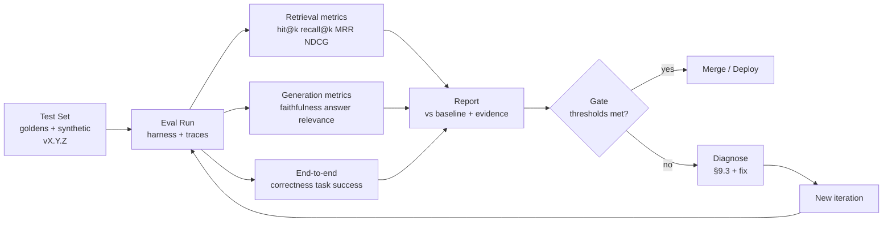

# RAG Evaluation Methodology — The 'How to Evaluate a RAG System' Playbook

> **Author:** Jack Liu Shurui · **Role:** Solution Architect, Crédit Agricole CIB
> **Repo:** [github.com/jackliusr/research](https://github.com/jackliusr/research)
> **Series:** LLM/AI Engineering Guides
> **Companion Guides:** [RAG Evaluation Tools Comparison](rag_evaluation_tools_comparison_guide.md) (the tool head-to-head — this guide is the tool-agnostic playbook) · [LLM Evaluation Frameworks](llm_evaluation_frameworks_guide.md) (the tooling umbrella) · [TruLens](trulens_guide.md) · [Ragas](ragas_guide.md) · [LLM Evaluation vs Validation](llm_evaluation_vs_validation_guide.md) · [AI Agent Drift](ai_agent_drift_guide.md) · [Advanced RAG Techniques](advanced_rag_techniques_guide.md) · [Beyond RAG](beyond_rag_guide.md) · [RAG Frameworks Comparison](rag_frameworks_comparison_guide.md) · [RAG Optimization Techniques](rag_optimization_techniques_guide.md) · [Vector Databases](vector_databases_guide.md) · [Responsible AI](implementing-responsible-ai.md)
> **Last Updated:** August 2026

---

## Table of Contents

1. [The Evaluation Dimensions](#1-the-evaluation-dimensions)
2. [Retrieval Metrics](#2-retrieval-metrics)
3. [Generation Metrics](#3-generation-metrics)
4. [End-to-End Metrics](#4-end-to-end-metrics)
5. [Evaluation Approaches](#5-evaluation-approaches)
6. [Test-Set Design](#6-test-set-design)
7. [Offline vs Online Evaluation](#7-offline-vs-online-evaluation)
8. [The Evaluation Pipeline](#8-the-evaluation-pipeline)
9. [RAG Failure Modes](#9-rag-failure-modes)
10. [Worked Example — A RAG Evaluation Plan for a Banking Use Case](#10-worked-example--a-rag-evaluation-plan-for-a-banking-use-case)
11. [Summary — RAG Eval Methodology in One Page](#11-summary--rag-eval-methodology-in-one-page)
12. [Glossary](#12-glossary)

---

## 1. The Evaluation Dimensions

### 1.1 The Three Layers

A RAG system is not one model — it is **three stages chained together**: retrieve context, augment the prompt, generate an answer. Each stage can fail independently, and a failure in one stage looks like a failure of the whole system. That is why RAG evaluation is structured as **three layers**, each answering a different question:

| Layer | Question it answers | Object being measured |
|-------|---------------------|-----------------------|
| **Retrieval quality** | *Did we get the right context?* | The retriever's output: the ranked list of chunks returned for a query |
| **Generation quality** | *Did the LLM use the context well?* | The LLM's output: the answer, judged against the context it was given |
| **End-to-end quality** | *Did the user get a correct, useful answer?* | The final answer, judged against the question and the ground truth |

These three layers are the backbone of every serious RAG evaluation, and they map directly onto the two most influential framings in the space:

- **The RAG triad** (popularised by TruLens — see [trulens_guide.md](trulens_guide.md) §2): *context relevance → groundedness → answer relevance*. TruLens checks the context against the question (retrieval), the answer against the context (generation), and the answer against the question (end-to-end-ish).
- **Ragas' metric families** (see [ragas_guide.md](ragas_guide.md) §2): retrieval metrics (`context_precision`, `context_recall`, `context_entity_recall`), generation metrics (`faithfulness`, `answer_relevancy`), and reference-based metrics (`answer_correctness`, `answer_similarity`).

### 1.2 The Dimension Framework — Layers Table

| Layer | What it measures | Representative metrics |
|-------|------------------|------------------------|
| **Retrieval quality** | How well the retriever ranks relevant context for a query — completeness and purity of the retrieved set | recall@k, precision@k, hit rate@k, MRR@k, NDCG@k, context_recall, context_precision (Ragas), contextual relevancy (DeepEval/TruLens) |
| **Generation quality** | How well the LLM uses the retrieved context — is the answer faithful to the context, does it address the question | faithfulness, groundedness, answer relevancy, hallucination rate, context adherence |
| **End-to-end quality** | How correct and useful the final answer is for the user — against ground truth and against the task | answer correctness, answer similarity, task success rate, user satisfaction (thumbs/ratings), RAGAS composite scores |

> **Positioning note:** the triad's *answer relevance* sits between layers 2 and 3 — it is generated by the LLM (generation quality) but judged against the *question* (user-facing quality). This guide treats it under **generation metrics** (§3) because it isolates the LLM's behaviour, and reserves **answer correctness** for the ground-truth-comparing end-to-end layer (§4).

### 1.3 Why Separate the Layers — Isolation and Diagnosis

The single most important design decision in RAG evaluation is **measuring the layers separately**. The reason is *diagnosis*: when the final answer is bad, you need to know **where** it went bad, because the fixes are completely different:

- **Retrieval failure** → fix the index, chunking, embeddings, hybrid search, reranking (see [advanced_rag_techniques_guide.md](advanced_rag_techniques_guide.md) and [vector_databases_guide.md](vector_databases_guide.md)).
- **Generation failure** → fix the prompt, the model, the temperature, the context-window usage (see [rag_optimization_techniques_guide.md](rag_optimization_techniques_guide.md)).

An end-to-end score alone cannot tell you which. A 0.6 overall score could mean "the retriever found nothing" (retrieval layer), "the retriever was fine but the LLM hallucinated" (generation layer), or "both were fine but the answer missed the user's intent" (end-to-end layer). The layered measurement is the **failure isolation** mechanism:

```
end-to-end score low
        │
        ▼
  ┌─────────────────┐   no   ┌──────────────────┐   no   ┌─────────────────┐
  │ retrieval OK?   │───────►│ generation OK?   │───────►│ answer correct? │
  │ (context_recall,│  yes   │ (faithfulness,   │  yes   │ (correctness,   │
  │  hit rate, MRR) │        │  answer relev.)  │        │  task success)  │
  └─────────────────┘        └──────────────────┘        └─────────────────┘
        │ yes                      │ yes                      │ yes
        ▼                          ▼                          ▼
   fix retrieval             fix generation              fix product /
   (index, chunking,         (prompt, model,             (scope, UX,
    embeddings)               temperature)                 guardrails)
```

This is the same insight TruLens' *"find where your agent fails"* tagline and Ragas' "RAG systems fail in identifiable, separable ways" philosophy are built on (see the sibling guides). The diagnostic workflow is formalised in §9.3.

> **Why this matters for a bank:** in a regulated setting you cannot just say "the answer was wrong" — you must say *which stage* failed and provide per-stage evidence for the model-validation file (see [llm_evaluation_vs_validation_guide.md](llm_evaluation_vs_validation_guide.md) and [implementing-responsible-ai.md](implementing-responsible-ai.md)).

---

## 2. Retrieval Metrics

### 2.1 The IR Metrics

Retrieval evaluation borrows the standard **information-retrieval (IR) metrics**. They all operate on the same inputs: for each query, the retriever returns a **ranked list of k chunks**, and a human (or a label set) has decided which chunks are **relevant** for that query. The metrics differ in what they reward:

- **recall@k** — *Did we find all the relevant context?* The fraction of all relevant chunks that appear in the top-k.
  `recall@k = |relevant ∩ top-k| / |relevant|`
  A low recall@k means the retriever is **missing evidence** — the answer cannot be grounded even by a perfect LLM, because the source never reached the prompt. This is the completeness measure.
- **precision@k** — *How much of the top-k is actually relevant?* The fraction of the top-k results that are relevant.
  `precision@k = |relevant ∩ top-k| / k`
  A low precision@k means the context is **polluted with noise** — irrelevant chunks compete for the LLM's attention and can actively mislead it (see §9.1 on irrelevant context).
- **MRR (Mean Reciprocal Rank)** — *How high is the first relevant chunk?* The average over queries of `1 / rank_of_first_relevant`. If no relevant chunk is retrieved, the query contributes 0.
  `MRR = (1/N) · Σ 1/rank(first relevant)`
  MRR is the right metric when **one good chunk is enough** — a single authoritative passage that answers the question. It ignores everything after the first hit.
- **NDCG@k (Normalized Discounted Cumulative Gain)** — *How good is the whole ranking, with position discounts?*
  `DCG@k = Σ_{i=1..k} rel_i / log2(i+1)` and `NDCG@k = DCG@k / IDCG@k`, where `rel_i` is the relevance grade of the item at position i (binary 0/1 or graded 0–3) and `IDCG` is the DCG of the ideal ranking.
  NDCG is the most complete ranking metric: it rewards *multiple* relevant chunks (unlike MRR), weights earlier positions more (the log discount — a relevant chunk at position 1 is worth more than at position 5), and supports graded relevance. Range (0, 1].
- **Hit rate@k** — *Did we find at least one relevant chunk?* The fraction of queries where at least one relevant item appears in the top-k.
  `hit rate = (# queries with ≥1 relevant in top-k) / (# queries)`
  A binary per-query pass/fail. Hit rate is the **baseline sanity check**: if it is near zero the retriever is fundamentally broken and every other metric is meaningless (verified definition — see the Future AGI / GeeksforGeeks references in the research notes of this series; also commonly called "recall@1-style presence" in practitioner literature).

### 2.2 Rank-Aware Metrics — Position Matters

A key distinction splits these five metrics into two families:

- **Rank-aware** (position matters): **MRR** and **NDCG**. They reward the *ordering* of results, not just their presence. NDCG discounts by rank (log position discount); MRR is defined purely by the position of the first hit. Use these when the LLM reads the context **in order** — which it does: chunks at the top of the prompt get the most attention, and there is well-documented evidence that LLMs use the beginning (and end) of their context more than the middle (the *lost-in-the-middle* effect, Liu et al. 2023 — see [rag_vs_long_context_llms_guide.md](rag_vs_long_context_llms_guide.md)). A relevant chunk buried at position 8 is less useful than the same chunk at position 1.
- **Position-agnostic** (within top-k): **recall@k, precision@k, hit rate**. They treat the top-k as an unordered set. They are simpler, more robust to judge noise, and perfectly adequate when the downstream usage doesn't care about order (e.g., a reranker runs after the first-stage retriever, or the LLM gets the chunks in a shuffled bag).

**Practical rule of thumb:** use hit rate + recall@k for "did we get the material", MRR for "is the single best chunk findable", NDCG for "is the whole ranking optimal", precision@k for "is the context clean". For RAG specifically, **recall@k and hit rate are usually the most important** — the LLM can cope with a noisy context (up to a point) but can never answer from evidence that was never retrieved.

### 2.3 Retrieval Metric Table

| Metric | What it measures | When to use | Formula / sketch |
|--------|------------------|-------------|------------------|
| **recall@k** | Completeness — share of all relevant chunks found in top-k | Primary RAG metric; compare chunking, embedding models, index strategies; detect *missed context* | `\|relevant ∩ top-k\| / \|relevant\|` |
| **precision@k** | Purity — share of top-k that is relevant | Detect *noise in context*; tune `top_k` and relevance floors; compare rerankers | `\|relevant ∩ top-k\| / k` |
| **hit rate@k** | At-least-one success — did we find any relevant chunk | Baseline sanity check; quick CI smoke test; "is the retriever alive" | `#queries with ≥1 relevant in top-k / #queries` |
| **MRR@k** | Position of the first relevant chunk | Single-answer questions where one good chunk suffices; compare rerankers (which move the first hit up) | `(1/N) Σ 1/rank(first relevant)` |
| **NDCG@k** | Full-ranking quality with position discounts and graded relevance | Fine-grained ranking tuning; when multiple chunks contribute to an answer; graded labels (0–3) | `DCG@k / IDCG@k`, `DCG@k = Σ rel_i / log2(i+1)` |

> **Verification note:** the definitions above follow the standard IR textbook formulations (Manning–Raghavan–Schütze *Introduction to Information Retrieval*): recall/precision at k as set ratios, MRR as the mean of reciprocal first-hit ranks, and NDCG as DCG normalised by the ideal DCG. The hit-rate definition (fraction of queries with ≥1 relevant item retrieved) was verified against current practitioner documentation (GeeksforGeeks RAG-eval reference and the Future AGI built-in evals docs, both 2026). The RAGAS implementations (`context_recall`, `context_precision`) follow the same semantics — see [ragas_guide.md](ragas_guide.md) §3.

### 2.4 Retrieval Evaluation in Practice — Retriever-Only Evals

Retrieval metrics need **query–relevant-chunk labels**, not full answers. The standard practice is a **retriever-only evaluation**, which isolates the retrieval stage from the LLM entirely:

1. **Build a labelled set of (query, relevant chunk IDs)** — for each test query, a human (or a document-derived labeler) marks which chunks in the corpus are relevant. Binary (relevant/not) or graded (0–3) labels.
2. **Freeze the LLM out of the loop.** Retrieval metrics are *deterministic* — no judge model, no temperature, no LLM calls. The retriever runs, the top-k is compared to the labels, and the metrics are computed exactly. This is why retrieval evals are cheap, fast, and CI-friendly.
3. **Judge the contexts, not the answers.** The "ground truth" for a retrieval eval is the set of relevant *contexts* — you are judging the retrieved passages, not the final answer. (DeepEval's *contextual relevancy* and TruLens' *context relevance* feedback function are the LLM-judge versions of this same judgment — they score retrieved chunks directly rather than needing labels; see [trulens_guide.md](trulens_guide.md) §2 and the DeepEval docs.)
4. **Run it as a comparison harness.** Retrieval evals earn their keep when you change one thing at a time — chunk size (256 vs 512 tokens), embedding model, hybrid search vs pure vector, reranker on/off, `top_k` — and watch recall@k / MRR@k move. Each experiment is a row in the eval report (§8.3).

Retriever-only evals are the *cheapest and most reliable* part of RAG evaluation — use them aggressively in CI, and use the LLM-judge and end-to-end metrics where they cannot reach (see §7 for the offline/online split).

### 2.5 Worked Example — Computing the Retrieval Metrics

A concrete walkthrough, k=3, binary relevance, two queries:

**Query 1** — "confirmation period for a standby LC". Relevant chunks in the corpus: **{A, B}**. Retriever returns: **[A, C, D]**.

| Metric | Computation | Score |
|--------|-------------|-------|
| hit rate@3 | A retrieved → hit | 1 |
| recall@3 | 1 of 2 relevant found (A found, B missed) | 0.50 |
| precision@3 | 1 of 3 returned relevant | 0.33 |
| MRR | first relevant at rank 1 → 1/1 | 1.00 |
| NDCG@3 | DCG = 1/log₂2 + 0 + 0 = 1.00; IDCG (ideal order A, B) = 1/log₂2 + 1/log₂3 ≈ 1.63 | ≈ 0.61 |

**Query 2** — "documents needed for a documentary credit amendment". Relevant: **{E}**. Retriever returns: **[F, G, E]**.

| Metric | Computation | Score |
|--------|-------------|-------|
| hit rate@3 | E retrieved → hit | 1 |
| recall@3 | 1 of 1 relevant found | 1.00 |
| precision@3 | 1 of 3 returned relevant | 0.33 |
| MRR | first (only) relevant at rank 3 → 1/3 | ≈ 0.33 |
| NDCG@3 | DCG = 0 + 0 + 1/log₂4 = 0.50; IDCG = 1 | 0.50 |

**Aggregates (N = 2):** hit rate@3 = **1.0** · recall@3 = (0.50 + 1.00)/2 = **0.75** · precision@3 = **0.33** · MRR@3 = (1.00 + 0.33)/2 ≈ **0.67** · NDCG@3 ≈ (0.61 + 0.50)/2 ≈ **0.56**.

**Reading the scores:** hit rate is perfect (every query found *something*), but recall@3 = 0.75 means evidence is **missing for Query 1** — chunk B never reached the prompt, so the LLM would have to answer the confirmation-period question without its source. NDCG (0.56) is dragged down by Query 2's only hit sitting at rank 3 (the position discount), which MRR also penalises (0.33) while hit rate and recall stay silent about it. Each metric tells a different part of the story — precisely why the metric table (§2.3) prescribes several at once.

---

## 3. Generation Metrics

### 3.1 Faithfulness (Groundedness) — Answer vs Context

**Faithfulness** (TruLens calls it **groundedness**; RAGAS calls it **faithfulness**; DeepEval has a dedicated *hallucination* metric that measures the same failure from the opposite side) answers the question: *does every claim in the answer follow from the retrieved context?*

- **RAGAS formulation** (verified, see [ragas_guide.md](ragas_guide.md) §3 and the RAGAS paper, arXiv:2309.15217): the answer is decomposed into **individual claims/statements** (LLM-generated), then each statement is checked against the context for support. `faithfulness = (# supported statements) / (# total statements)`. If the answer says "guarantee fees are capped at 1%" and no retrieved document says that, the statement is unsupported and the score drops.
- **TruLens groundedness** (see [trulens_guide.md](trulens_guide.md) §2): an LLM judge verifies each sentence of the answer against the retrieved context, producing per-sentence support scores that aggregate to a groundedness score — and because TruLens traces every record, you can click into the exact sentence that failed and see the context that should have supported it.
- **DeepEval** calls the inverse "hallucination": it checks each claim in the answer against the retrieval context and flags unsupported claims (verified metric set — DeepEval's RAG metric family is contextual precision, contextual recall, contextual relevancy, faithfulness, answer relevancy, hallucination; see the DeepEval docs referenced in this series' research notes).

Faithfulness is **reference-free** — it needs only the answer and the retrieved context, no golden answer. That makes it the workhorse hallucination gate, especially for banks where an invented fee or limit is a compliance incident.

### 3.2 Answer Relevance — Answer vs Question

**Answer relevance / relevancy** answers the question: *does the answer actually address the user's question?* An answer can be perfectly faithful to the context and still useless if it answers a different question.

- **RAGAS formulation** (verified): the LLM generates N **reverse questions** from the answer ("what question would this answer be a good answer to?"), embeds them, and takes the average cosine similarity between those embeddings and the original question's embedding. `answer_relevancy = avg(cos_similarity(generated_questions, original_question))`. A boilerplate or off-topic answer generates questions that don't resemble the user's question, scoring low. (In Ragas 0.2.x the metric is documented as `response_relevancy`, with the old import kept as an alias — see [ragas_guide.md](ragas_guide.md) §3.)
- **TruLens answer relevance** (see [trulens_guide.md](trulens_guide.md) §2): an LLM judge scores how well the answer responds to the user's question on a scale.
- **DeepEval answer relevancy**: LLM-judge based, scores the answer against the input question, optionally against goldens.

Answer relevance is also **reference-free**. It catches *off-topic* answers (see §9.1) — the failure where the pipeline retrieved and generated fluently but answered the wrong thing (e.g., the user asks about documentary-credit amendment documents and the assistant explains confirmation periods).

### 3.3 Hallucination — Detecting Unfaithful Content

**Hallucination** is the user-visible symptom of low faithfulness: the answer contains statements not supported by the retrieved context (or by any source). In a RAG system there are two flavours, and the metrics distinguish them:

1. **Context-hallucination** — the claim contradicts or goes beyond the retrieved context. Detected by **faithfulness/groundedness** (statement-support check). This is the RAG-specific hallucination the retrieval context is supposed to prevent.
2. **Factual hallucination** — the claim is wrong *even if* the context supported it (context itself was wrong/stale, or the LLM embellished). Detected by **answer correctness against ground truth** (reference-based, §4.1) or **entity-level checks** (e.g., Ragas `context_entity_recall`; manual QA review).

Detection practice: run faithfulness at the statement level (not just the aggregate) so that **each unsupported claim is captured as an artifact** — a bank's hallucination log should list the offending sentence, the question, and the retrieved context for the model-validation file ([llm_evaluation_vs_validation_guide.md](llm_evaluation_vs_validation_guide.md), [implementing-responsible-ai.md](implementing-responsible-ai.md)).

### 3.4 Generation Metric Table

| Metric | What it measures | Reference-based or free? | Representative tool |
|--------|------------------|--------------------------|---------------------|
| **Faithfulness / groundedness** | Answer claims supported by retrieved context | Reference-free | RAGAS (`faithfulness`), TruLens (`groundedness`), DeepEval (`faithfulness`) |
| **Answer relevance** | Answer addresses the user's question | Reference-free | RAGAS (`answer_relevancy`/`response_relevancy`), TruLens (`answer relevance`), DeepEval (`answer relevancy`) |
| **Hallucination** | Unsupported/incorrect claims in the answer (inverse of faithfulness, plus factual checks) | Reference-free (context check); reference-based for factual checks | DeepEval (`hallucination`), RAGAS faithfulness + correctness, TruLens groundedness |
| **Context precision / relevancy** (generation-side view) | The retrieved context is relevant to the question (pre-answer check) | Reference-free | RAGAS (`context_precision`), DeepEval (`contextual relevancy`/`contextual precision`), TruLens (`context relevance`) |
| **Context adherence / instruction following** | Answer obeys the system prompt's constraints (e.g., "never state figures not in the context") | Reference-free | LLM-as-a-judge rubric; TruLens custom feedback functions; DeepEval custom metrics |
| **Noise sensitivity** | Answer quality degrades gracefully when irrelevant context is injected | Reference-free | RAGAS (`noise_sensitivity`, 0.2.x) |

### 3.5 Generation Evaluation in Practice — LLM-as-a-Judge and Human Review

Generation metrics are almost always implemented as **LLM-as-a-judge** metrics — an LLM (the judge) scores faithfulness/relevance using a prompt, often returning a score plus a *reason*.

**The judge prompts, in practice:**

- **Decomposition prompts** (faithfulness): "split the answer into atomic claims" → "for each claim, is it supported by the context? yes/no" → aggregate.
- **Verification prompts** (groundedness): "for each sentence of the answer, quote the supporting passage or state 'no support'."
- **Reverse-question prompts** (answer relevance, RAGAS): "generate N questions this answer would answer" → embed → cosine similarity.
- **Rubric/scale prompts** (DeepEval, custom): "rate 1–5 with these anchors" — always ask for the reason alongside the score (self-explaining evals — DeepEval's contextual relevancy is explicitly a *self-explaining* LLM-eval; TruLens feedback functions also produce explanations that show up in the dashboard).

**A minimal faithfulness judge prompt** — the shape used by TruLens-style groundedness and RAGAS-style statement checks (adapt the exact wording; the structure is what matters):

```text
SYSTEM: You are a strict fact-checker. For each claim in the ANSWER, decide whether the
CONTEXT SUPPORTS it, CONTRADICTS it, or does NOT MENTION it.
For every claim output a line:
  CLAIM: <text> | VERDICT: <SUPPORTED|CONTRADICTED|NOT MENTIONED> | EVIDENCE: <quoted passage or NONE>
Then output: FAITHFULNESS_SCORE = <supported claims / total claims>

CONTEXT:
<the retrieved chunks, verbatim>

ANSWER:
<the model's answer>
```

Design points that make judge prompts auditable: (1) ask for a **verdict and an evidence quote per claim**, never just a single fuzzy "rate 1–10" — the decomposition is what makes failures inspectable (a bank needs to point at *which sentence* was unsupported); (2) compute the score from verdicts rather than trusting one holistic number; (3) pin **temperature 0** and a fixed judge model + prompt version so runs are comparable; (4) keep the context verbatim — truncating it makes the judge rule on evidence the app didn't see.

**Calibration — the honest caveats (see [ragas_guide.md](ragas_guide.md) §4 and [llm_evaluation_frameworks_guide.md](llm_evaluation_frameworks_guide.md) for the full treatment):**

- **Judge bias is real and measurable:** position bias (judges favour answers earlier in a list), verbosity bias (longer answers score higher), self-preference (a judge model favours its own family's style), sycophancy, and anchor drift across runs. Mitigate: fixed judge model and prompt version, temperature 0, score+reason format, periodic human spot-checks of judge outputs.
- **Non-determinism:** the same sample can score differently across runs. Mitigate: repeat runs, report means *and* variance, and treat thresholds as bands (e.g., "faithfulness ≥ 0.85 ± 0.03") rather than knife-edges.
- **Cost:** each LLM-judge metric burns ≥1 judge call per sample (statement-level faithfulness burns several). A 1,000-question set × 5 metrics ≈ 5,000+ calls — budget it, or use a cheaper/smaller judge for CI and a strong judge for release runs.
- **Judge–human correlation must be validated once:** before trusting a judge metric, sample ~50–100 cases, score them by humans, and check agreement. The RAGAS paper reports human-correlation studies for its metrics — that is the model to copy, not just the metric names.

**Human review — the sampling practice:** even with judge metrics, keep a **human review loop** on a stratified sample (e.g., 10–20% of the test set, plus every low-scoring answer, plus every answer in high-risk categories like fees/limits). Humans catch what judges are systematically blind to (subtle factual errors the judge's own training data endorses, tone, regulatory sensitivity). See §5.3 for the human-evaluation approach in full.

---

## 4. End-to-End Metrics

### 4.1 Answer Correctness — Ground-Truth Comparison

**Answer correctness** is the layer that asks the user's actual question: *is the answer factually right?* Unlike faithfulness (answer vs context), correctness compares the answer against **ground truth** — a human-verified reference answer — so it is a **reference-based** metric.

- **RAGAS `answer_correctness`** (see [ragas_guide.md](ragas_guide.md) §3): combines two components — *factual correctness* (claims in the answer that are supported by / entailed by the ground truth, computed via LLM-judged claim comparison) and *semantic similarity* (embedding similarity between answer and reference) — blended into one score. It deliberately pairs with `answer_similarity` for cheaper, purely embedding-based checks.
- **DeepEval**: *answer relevancy* can be run against goldens, and the framework supports custom golden-comparison metrics; its RAG guides recommend golden-based correctness for release sign-off.
- **TruLens**: `GroundTruthAgreement` feedback function compares the app output to a golden answer (see [trulens_guide.md](trulens_guide.md) §2).

**The honest limits:** correctness is only as good as the golden answers — if the reference is wrong, stale, or covers a different interpretation, the metric punishes good answers. Goldens also cost real money to write and maintain (see §5.1 and §6.1). Practice: use correctness on a **curated golden subset** for release gates, and use reference-free metrics everywhere else.

### 4.2 Task Success — Did the User Get What They Needed?

**Task success** is the outcome-based view of end-to-end quality: *did the user accomplish what they came to do?* It is the metric that connects the RAG system to the business:

- **Direct measurement:** a downstream outcome — the support ticket was resolved without escalation, the trade document was located, the user did not rephrase and re-ask, the conversation ended with the user's intent fulfilled (agentic cases: the action executed — see [autonomous_agents_guide.md](autonomous_agents_guide.md) §5 on agent evals).
- **Indirect signals:** no follow-up question, no "that's not what I asked", no escalation to a human, click-through on cited documents.
- **Judged variants:** human annotators or an LLM judge rate "did this answer satisfy the user's request" — coarser than correctness but closer to value.

Task success is where RAG evaluation meets **product KPIs**: a RAG assistant that scores 0.9 on faithfulness but 0.6 on task success is answering accurately about the wrong scope — which is a test-set/coverage problem (§6.3) or a product-scope problem, not an LLM problem.

### 4.3 User Satisfaction — Feedback, Thumbs, Ratings

**User satisfaction** captures the subjective layer: thumbs up/down, star ratings, survey responses, "was this helpful?" prompts, and implicit behaviour (copying the answer, staying on the page, re-asking). Key practices:

- **Explicit feedback** (thumbs, ratings) is the cleanest signal but suffers from **selection bias** — angry and delighted users vote; the silent middle is the majority. Always pair it with sampling of unrated traffic.
- **Implicit feedback** (re-ask rate, session length, escalation rate) is noisier but unbiased in coverage — and it is the basis of **online evaluation** (§7.2) and drift detection ([ai_agent_drift_guide.md](ai_agent_drift_guide.md)).
- **Don't confuse satisfaction with quality:** users can be satisfied with a wrong answer (plausible-sounding, confident) and dissatisfied with a correct one (cautious hedging). Treat satisfaction as a product metric that *contextualises* the quality metrics, never as a replacement for them.

### 4.4 End-to-End Evaluation in Practice

- **Golden Q&A pairs** (see §6.1): a curated set of (question, verified answer) pairs is the backbone of end-to-end evaluation. Run the system over the set, compute correctness/similarity against the goldens, and track the aggregate over versions. This is the *release-gate* evaluation — the numbers that go into the model-validation file.
- **Task-based evals:** for each task the system is meant to support (answer a fee question, explain a product feature, locate a document), define a *task-completion check* — an explicit "was this task completed?" judgment, human or judged. Score the system per task, not just per question, so you can report "fee questions: 94% task success, documentation questions: 78%" — the per-task breakdown is what product owners actually consume.
- **Composite end-to-end scores** (RAGAS's composite of faithfulness + relevancy, or a weighted blend of the triad) are fine for dashboards, but **never gate releases on a composite alone** — a composite hides which layer failed (see §1.3). Gate on the layer metrics; report the composite.

---

## 5. Evaluation Approaches

There are three families of evaluation approaches. Every serious RAG eval program uses **all three in different roles** — the craft is knowing which role.

### 5.1 Reference-Based — Ground-Truth Comparison

Compare the system's outputs against **human-verified reference answers / relevant-document labels** (the goldens).

- **Strengths:** objective and interpretable (a score is a direct agreement with an agreed answer); stable across runs and judge-model changes; auditable — the ground truth is versioned evidence; the gold standard for *correctness* claims in regulated settings.
- **Weaknesses:** **goldens cost** — writing, verifying, and maintaining high-quality references is expensive and slow (a bank's SME time is not free); coverage is limited by what you wrote (unknown unknowns stay invisible); goldens go stale as the corpus and products change; and reference-based metrics are brittle to legitimate phrasing variation (a correct paraphrase can score low on string/similarity-based comparisons).
- **Best role:** release gates, correctness sign-off, regression detection on a stable core set.

### 5.2 Reference-Free — LLM-as-a-Judge

Score outputs using a judge LLM against rubrics (faithfulness, answer relevance, etc.) — **no golden answers required**.

- **Strengths:** **scalable** — score any volume of traffic, including live production traffic (§7.2), with no labelling bottleneck; fine-grained (statement-level hallucination checks); catches failure modes goldens can't anticipate; the foundation of the triad and Ragas' metric families.
- **Weaknesses:** **judge bias and non-determinism** (§3.5) — scores depend on judge model, prompt version, temperature; **cost** — judge calls scale with traffic; judges can be *confidently wrong* in ways humans must periodically catch; thresholds are fuzzy bands, not knife-edges.
- **Best role:** continuous evaluation, dev iteration, coverage expansion, production monitoring — everywhere volume matters more than absolute precision of the measurement.

### 5.3 Human Evaluation — The Gold Standard

Humans (domain experts, product owners, or the users themselves) judge answer quality directly.

- **Strengths:** the **gold standard** — the only judge that understands nuance, domain correctness, tone, and regulatory sensitivity; the calibration anchor for every automated metric (§3.5); the final arbiter in a bank's sign-off process.
- **Weaknesses:** **cost and scale** — slow, expensive, and doesn't scale to live traffic; **consistency** — inter-annotator agreement must be measured (Cohen's κ / Krippendorff's α) or the "gold standard" is itself noisy; **drift** — human judgments vary across sessions and annotators.
- **Best role:** metric calibration, golden-set creation, sampling review of automated results, high-risk answer review, release sign-off for sensitive domains.

### 5.4 Approach Selection

| Approach | When to use | Pros | Cons | Relative cost |
|----------|-------------|------|------|---------------|
| **Reference-based** (goldens) | Release gates, correctness sign-off, regression on a stable core | Objective, stable, auditable, defensible in model-validation files | Goldens are expensive to write/maintain; limited coverage; brittle to paraphrasing | **High upfront**, low per-run (except eval LLM calls for judged variants) |
| **Reference-free** (LLM-as-a-judge) | Dev iteration, CI smoke tests, production monitoring, coverage expansion | Scalable to any volume, no labelling bottleneck, fine-grained (statement-level) | Judge bias, non-determinism, judge cost, needs calibration against humans | **Low upfront**, medium per-run (judge calls per sample per metric) |
| **Human evaluation** | Golden creation, calibration, high-risk review, final sign-off | Gold standard for nuance and domain correctness | Slow, expensive, doesn't scale, annotator disagreement | **Highest** — use sparingly on samples |

> **The standard pattern:** human-written goldens (small) → reference-free LLM-judge metrics (large, everywhere) → human sampling review (calibrate + catch blind spots) → reference-based correctness on the golden subset (release gates). This is the same shape as the RAGAS/TruLens/DeepEval recommended workflows (see the sibling tool guides) and it is deliberately tool-agnostic.

---

## 6. Test-Set Design

The test set is the **most valuable artifact** in RAG evaluation — better metrics on a bad test set produce confidently wrong conclusions. Design it deliberately.

### 6.1 Goldens — Curated Q&A with Verified Answers

**Golden datasets** are human-written (or human-verified) (question, reference answer) pairs, plus — for retrieval evals — (question, relevant chunk) labels.

- **Who writes them:** domain SMEs for the answers, with the eval owner curating the question side to cover the product/use-case space. A bank's golden set for a product-support assistant is written by the trade-finance desk, not by the ML team.
- **What they carry:** the question, the verified answer, the source document/chunk IDs (for retrieval labels), a difficulty/type tag (single-hop, multi-hop, negation, out-of-scope — §6.3), and a change-log entry.
- **Role:** the backbone for reference-based correctness (§4.1) and the calibration anchor for every judge metric. Goldens are the *release-gate* set; treat them as a controlled asset with owners and versioning (§6.5).

**A golden item looks like this** — the minimal schema the banking worked example (§10) uses; every field maps to a pipeline need:

```json
{
  "id": "golden-0042",
  "question": "What documents are required for a documentary credit amendment?",
  "reference_answer": "The amendment must be agreed by the issuing bank and the beneficiary; the required documents are [list from the operational handbook §4.2]...",
  "relevant_chunk_ids": ["doc-lc-0142/p3", "doc-lc-0142/p4"],
  "type": "multi_hop",
  "product_family": "documentary_credits",
  "version": "1.3.0",
  "reviewed_by": "trade-finance SME",
  "reviewed_on": "2026-05-11"
}
```

- `question` + `reference_answer` → generation and end-to-end metrics (§3, §4).
- `relevant_chunk_ids` → retrieval metrics, which need query→chunk labels (§2.4).
- `type` + `product_family` → per-type and per-task reporting (§6.3, §4.4) and the diagnosis clustering of §9.3.
- `version` + `reviewed_by` + `reviewed_on` → the audit trail (§6.5) and the model-validation evidence file.

### 6.2 Synthetic Generation — Generated Testsets

**Synthetic testsets** are generated programmatically from the corpus, solving the "no labelled data" bottleneck — see [ragas_guide.md](ragas_guide.md) §5 for the full treatment:

- **RAGAS `TestsetGenerator`** (0.1.x) / **`ragas.testset`** (0.2.x, rebuilt around document parsers and nodes): takes your documents and produces questions via **evolution-based generation** — *simple* (direct extractions), *reasoning* (multi-step inferences), *multi-context* (answers spread across documents), *conditional* (if/then logic), plus conversational and (0.2.x) agentic variants. Each generated question comes with reference chunks, which doubles as retrieval labels.
- **Strengths:** cheap at scale (hundreds of questions from a corpus), broad coverage of the actual corpus, retrieval labels for free.
- **Weaknesses:** generator artifacts — synthetic questions can be awkward, self-answering, or trivially extractive; they do **not** replace human judgment for correctness. **Always human-review a sample** (10–20% — the same sampling practice as §3.5) before trusting a synthetic set for a release gate.
- **Role:** dev-iteration coverage and CI breadth; goldens stay the gate. (DeepEval and other frameworks offer their own generation utilities; the tool comparison lives in [rag_evaluation_tools_comparison_guide.md](rag_evaluation_tools_comparison_guide.md).)

### 6.3 Test-Set Coverage — The Edge Cases

Coverage is *what* the test set tests. The classic coverage dimensions for RAG:

- **Question types:** single-hop factual, multi-hop (answer requires combining 2+ sources), comparative, procedural ("how do I..."), conditional ("what if...").
- **Negations and qualifiers:** "which products do **not** require collateral", "limits **excluding** intraday facilities" — negation is a notorious LLM failure point.
- **Out-of-scope:** queries the system should refuse or escalate ("what's the share price of Tesla?" to a trade-finance assistant) — tests the guardrails, not just the RAG path (see [llm_guard_models_guide.md](llm_guard_models_guide.md) and [implementing-responsible-ai.md](implementing-responsible-ai.md)).
- **Linguistic variation:** paraphrases, synonyms, jargon vs plain language, entity variants ("SBLC" vs "standby letter of credit"), misspellings — the retriever's embedding robustness.
- **Ambiguity:** queries that need clarification or have multiple valid answers — tests the system's handling, not its recall.
- **Temporal/stale-data cases:** "current fees" when the corpus has versioned fee schedules — tests freshness (see §9.1 stale context).
- **Corpus-absent cases:** questions whose answer is *not* in the corpus — the system should say "I don't know" (a well-known RAG failure is confident answers to unanswerable questions).

Coverage is measured: tag every test item with its type and track the distribution; report per-type scores (§4.4's per-task breakdown is the same idea at the test-set level). **A test set that is 90% single-hop factual questions will not catch a multi-hop collapse.**

### 6.4 Test-Set Size — Practical Minimums

> **Guidance, flagged:** the "right" size depends on the role of the set. The commonly cited practical bands in practitioner literature are roughly:
>
> - **20–50 items:** smoke tests / CI fast-lane — catches broken pipelines, not quality regressions.
> - **50–100 items:** credible dev-iteration set for a single product area; usable for coarse gates.
> - **100–200+ items:** the range most teams converge on for **release-gate goldens** on one domain (the banking worked example below uses 100), distributed across the coverage dimensions of §6.3.
> - **500–2,000+ items:** benchmark-scale sets (e.g., for a full corpus-wide evaluation or vendor comparisons), usually synthetic + sampled human review.
>
> These are practical heuristics, not a statistical law — I have not found a rigorous published study fixing a universal minimum. The right question is not "how many" but "does the set cover the failure modes we care about, and are the per-sample labels reliable?" (also compute confidence intervals on aggregates — 100 samples gives a ±10% CI at 95% confidence for a 0.5 proportion, which is why knife-edge thresholds on small sets are unsafe).

### 6.5 Test-Set Maintenance — Versioning and Review

A test set is **code** — treat it like one:

- **Version it** (semver): test-set v1.3.0 is referenced *by the eval report* so any score is traceable to the exact questions and labels it used. A threshold breached by a test-set change is a different event from one breached by a model change.
- **Review on a cadence:** quarterly re-review of goldens against the current corpus (products change; fee schedules change); every corpus ingestion triggers a "are the goldens still true?" check.
- **Guard against leakage:** test questions must never be answerable *from memorisation* — and the test documents must **not be part of the indexed corpus** (if the eval set lives in the vector DB, your scores are measuring retrieval of the answer key, not retrieval of knowledge).
- **Track provenance:** every item records who wrote it, when, and which source docs it derives from — required for the audit trail in a regulated setting ([llm_evaluation_vs_validation_guide.md](llm_evaluation_vs_validation_guide.md)).

---

## 7. Offline vs Online Evaluation

### 7.1 Offline Evaluation — Batch Runs and CI/CD Gates

**Offline evaluation** is the batch scoring of the system over the test set (goldens + synthetic), outside production, usually automated in CI/CD:

- **Eval runs:** a script (or harness — §8.4) runs the RAG pipeline over the test set, computes the layer metrics, and writes a report. Runs are versioned against both the app version and the test-set version.
- **Eval gates:** CI jobs assert thresholds (e.g., faithfulness ≥ 0.85, MRR ≥ 0.7) and **block merge/deploy on regression** (see §8.3 and the worked example §10.5). Gates make evaluation part of the engineering process, not an afterthought.
- **Strengths:** deterministic-ish, cheap relative to production, run before users see anything, perfect for comparing versions (retriever A vs B, prompt v1 vs v2) on the *same* test set.
- **Weaknesses:** static — the test set is a fixed snapshot; it cannot see the long tail of live traffic, and it goes stale (see §6.5).

### 7.2 Online Evaluation — Production Monitoring

**Online evaluation** measures the system on **live traffic**:

- **Feedback capture:** explicit (thumbs, ratings, surveys) and implicit (re-ask rate, escalation rate, session behaviour) signals collected continuously (§4.3).
- **Live LLM-judge scoring:** reference-free metrics (faithfulness, answer relevance) run on a **sampled subset** of production answers (100% is usually unaffordable; 5–20% stratified sampling is typical) — this is where reference-free metrics shine (§5.2).
- **Drift detection:** monitor scores, retrieval hit patterns, and input distributions over time — corpus refresh drops groundedness, query mix shifts, embedding drift — and alert before users notice. The full production-monitoring playbook is [ai_agent_drift_guide.md](ai_agent_drift_guide.md); the RAG-relevant signals are score drift (evaluation metrics over rolling windows), retrieval drift (hit-rate/MRR on live queries), and corpus/freshness drift (stale-context detection, §9.1).
- **Strengths:** sees reality — the actual query distribution, the actual failures; the only way to catch what offline sets missed.
- **Weaknesses:** noisy signals (selection bias in feedback, no ground truth for correctness), unlabelled traffic needs judge metrics, alerting thresholds need calibration to avoid alert fatigue.

### 7.3 Offline vs Online — Comparison

| Aspect | Offline evaluation | Online evaluation |
|--------|--------------------|-------------------|
| **Where** | Dev/CI environment, batch | Production, live traffic |
| **Data** | Fixed test set (goldens + synthetic) | Sampled real traffic + feedback |
| **Speed** | Minutes (subset) to hours (full) | Continuous, per-request |
| **Ground truth** | Yes (goldens) | Rarely (implicit/judged) |
| **Determinism** | High (fixed inputs) | Low (live inputs, noisy feedback) |
| **Catches** | Regressions vs baseline, version comparisons | Long-tail failures, drift, user experience |
| **Cost** | Judge calls × test-set size per run | Judge calls × sampled traffic continuously |
| **Primary role** | Development decisions, release gates | Production assurance, drift alerting |

### 7.4 The Two-Track Model

Run **both**, deliberately: **offline evaluation for development decisions** (which retriever, which prompt, is this PR safe to merge) and **online evaluation for production assurance** (is the deployed system still good, is the corpus still fresh, are users satisfied). The offline gate is the *pre-deployment* check; online monitoring is the *post-deployment* check — they answer different questions and neither substitutes for the other.

This is the same distinction the series draws between **evaluation** and **validation** — see [llm_evaluation_vs_validation_guide.md](llm_evaluation_vs_validation_guide.md), which frames offline eval as the engineering feedback loop and online/ongoing validation as the evidence for model governance. The drift/monitoring half of the two-track model is detailed in [ai_agent_drift_guide.md](ai_agent_drift_guide.md); the tooling that supports both tracks is covered in [llm_evaluation_frameworks_guide.md](llm_evaluation_frameworks_guide.md) and [rag_evaluation_tools_comparison_guide.md](rag_evaluation_tools_comparison_guide.md).

---

## 8. The Evaluation Pipeline

### 8.1 Eval-Driven RAG Development — The Loop

RAG systems are built by iteration, and iteration without measurement is guesswork. The core loop:

```
        ┌──────────────────────────────────────────────────────┐
        │                                                      │
        ▼                                                      │
   BUILD (change retriever / chunking / prompt / model)        │
        │                                                      │
        ▼                                                      │
   EVALUATE (run the test set, compute layer metrics)          │
        │                                                      │
        ▼                                                      │
   COMPARE (vs baseline: better? worse? where?) ───────────────┘
        │
        ▼
   DECIDE (ship, iterate, or revert) — the gate
```

Every change to the RAG stack — embedding model, chunk size, hybrid-search weights, reranker, prompt template, LLM — is an experiment measured against the same test set. **Eval-driven development** means the *number* decides, not the demo. This is the engineering loop the tool guides operationalise: TruLens' versioned leaderboard ([trulens_guide.md](trulens_guide.md) §5), Ragas' `evaluate()` + CI job ([ragas_guide.md](ragas_guide.md) §6.5), DeepEval's pytest-native flow ([rag_evaluation_tools_comparison_guide.md](rag_evaluation_tools_comparison_guide.md)).

### 8.2 Eval-First — Baseline and Regression

Two disciplines make the loop safe:

- **Establish a baseline before changing anything.** Run the full eval on the *current* system and record it (app version, test-set version, scores, cost, latency). Without a baseline, "improvement" is unmeasurable and regressions are invisible.
- **Evals before the changes land.** Every PR that touches the RAG stack runs the eval suite; the gate (§8.3) blocks merges that regress any layer metric beyond tolerance. This is the **regression** discipline: a change that lifts faithfulness by 0.02 but drops context recall by 0.05 is a *mixed* result the gate surfaces rather than hides. Regression detection is the single highest-ROI practice in this playbook — it converts evaluation from a periodic report into a per-change safety net.

### 8.3 Pipeline Stages

The evaluation pipeline has five stages, and each produces an artifact:

| Stage | What happens | Artifact |
|-------|--------------|----------|
| **1. Test-set** | Curate/version the goldens + synthetic set (§6) | Versioned test-set artifact (vX.Y.Z) |
| **2. Run** | Execute the RAG pipeline over the test set; capture traces (retrieved chunks, prompts, answers) | Per-sample records + traces |
| **3. Metrics** | Compute layer metrics: retrieval (recall@k, MRR, NDCG...), generation (faithfulness, answer relevance), end-to-end (correctness on goldens) | Metric tables per layer |
| **4. Report** | Aggregate, compare vs baseline, per-type/per-task breakdowns, attach evidence (failure examples, judge reasons) | Eval report (the release artifact for the model-validation file) |
| **5. Gate** | Assert thresholds on the gate metrics; block merge/deploy on regression or breach | Pass/fail verdict + alert |

### 8.4 Eval Infrastructure — The Harness

The infrastructure that runs this pipeline, tool-agnostically:

- **The eval harness:** the runner that loads the test set, invokes the app under test, computes metrics, and emits reports. It may be a homegrown script, a CI job around Ragas/TruLens/DeepEval, or a managed platform (LangSmith, MLflow, Arize Phoenix) — the full tooling landscape is in [llm_evaluation_frameworks_guide.md](llm_evaluation_frameworks_guide.md), and the head-to-head of the RAG-specific tools is in [rag_evaluation_tools_comparison_guide.md](rag_evaluation_tools_comparison_guide.md). The methodology here is deliberately independent of which harness you pick.
- **A metrics layer:** the IR metrics (§2) computed deterministically, plus the LLM-judge metrics (§3) with a pinned judge model/prompt version.
- **Result storage:** every run's scores, per-sample records, and test-set/app versions — queryable history for trend lines and the audit trail.
- **The CI/CD wiring:** the gate step as a CI job; fast lane (small subset, cheap metrics) on every PR, full lane (complete set) nightly or pre-release.
- **Failure artifact capture:** for every failing sample, store the question, retrieved chunks, answer, judge reasons, and scores — the raw material for the diagnosis workflow (§9.3).

### 8.5 Pipeline Diagram



(ASCII equivalent of the same five-stage pipeline is in §8.3; mermaid renders in the repo's markdown viewers.)

---

## 9. RAG Failure Modes

### 9.1 The Failure Taxonomy

The failure taxonomy organises *how* RAG systems fail, so that symptoms map to measurements and measurements map to fixes. (The taxonomy below is the standard one found across practitioner literature — see the research notes; the widely cited families are retrieval-side, generation-side, and integration-side failures.)

**Retrieval failures — the wrong context reached the prompt:**

- **Missed context (recall failure):** the evidence needed to answer was never retrieved — the chunk exists in the corpus but didn't surface in top-k. Causes: bad chunking (answer split across chunk boundaries), weak embeddings, missing synonyms, `top_k` too small, filter over-restriction. Symptom: the LLM gives a vague, hedged, or invented answer because the source isn't there.
- **Irrelevant context (precision failure):** the top-k is full of noise — related-but-useless chunks crowd out the evidence. Causes: embeddings that capture topic but not the specific question, `top_k` too large, no reranker, no relevance floor. Symptom: the LLM gets distracted — answers blend in facts from the wrong document (a known failure: LLMs are sensitive to irrelevant context — the *lost-in-the-middle* and noise-sensitivity literature; see [rag_vs_long_context_llms_guide.md](rag_vs_long_context_llms_guide.md)).
- **Stale context (freshness failure):** the retrieved chunks are outdated — old fee schedule, superseded regulation, decommissioned product. The retrieval was *correct against the index*; the index is wrong against reality. Symptom: confident, well-grounded answers that are factually obsolete. (This is a drift/freshness problem — see [ai_agent_drift_guide.md](ai_agent_drift_guide.md) for ingestion-side monitoring.)

**Generation failures — the LLM mishandled the context:**

- **Hallucination (faithfulness failure):** the answer asserts claims not supported by the retrieved context — invented fees, limits, dates, or procedures. The highest-severity failure for a bank. Detected by faithfulness/groundedness (§3.1).
- **Off-topic (relevance failure):** the answer is fluent and grounded but doesn't answer the user's question — it answers a similar question, or a generic version, or the wrong product. Detected by answer relevance (§3.2).
- **Incomplete (coverage failure):** the answer addresses only part of the question — a multi-part or multi-hop question answered with the first hop only. Detected by correctness-vs-golden comparisons and human review; a classic symptom of both retrieval (missed one of the needed sources) and generation (didn't notice the other parts) — the diagnosis (§9.3) separates them.

**Integration failures — the system around the LLM:**

- **Latency:** retrieval + judge/reranker + generation exceeding SLOs; the retriever or a reranker is the usual suspect (see [llm_latency_optimization_guide.md](llm_latency_optimization_guide.md)).
- **Cost:** per-answer cost blown up by huge contexts, rerankers on every query, or judge metrics in the live path (see §7.2 on sampling).
- **Formatting/output failures:** malformed citations, wrong output schema, markdown/JSON breakage, truncation, citation-to-source mismatches — integration bugs that quality metrics alone don't catch; catch them with schema/format checks in the harness.

### 9.2 Failure-Mode → Metric Mapping

| Failure mode | Symptom (user-visible) | Detecting metric | Fix |
|--------------|------------------------|------------------|-----|
| **Missed context** (retrieval) | Vague/hedged answer; "I couldn't find..." on answerable questions; invented details | recall@k ↓, hit rate@k ↓, context_recall ↓ | Better chunking, better embeddings, hybrid search, larger top_k, query rewriting (see [advanced_rag_techniques_guide.md](advanced_rag_techniques_guide.md), [query_rewriting_rag_guide.md](query_rewriting_rag_guide.md)) |
| **Irrelevant context** (retrieval) | Answer blends facts from wrong docs; confused answers | precision@k ↓, context_precision ↓, contextual relevancy ↓ | Reranker, relevance floor, smaller top_k, better chunk boundaries |
| **Stale context** (retrieval/index) | Confident but obsolete answers (old fees) | Freshness checks, score drift over time (online), ingestion tests | Corpus refresh pipeline, versioned docs, drift alerts ([ai_agent_drift_guide.md](ai_agent_drift_guide.md)) |
| **Hallucination** (generation) | Answer states facts not in any source | faithfulness ↓ / groundedness ↓, hallucination metric ↑ | Prompt constraints ("only use the context"), lower temperature, stronger model, verify with citations |
| **Off-topic** (generation) | Fluent answer to the wrong question | answer relevancy ↓ | Better prompt (question-focus), query intent handling, guardrails |
| **Incomplete** (generation/retrieval) | Partial answer to multi-part questions | answer correctness ↓ on goldens, human review; then drill down (§9.3) | Multi-hop retrieval support, decomposition, chunk linking |
| **Latency** (integration) | Slow responses | Latency percentiles (p95/p99) in harness and production | Cache, smaller context, cheaper reranker, streaming ([llm_latency_optimization_guide.md](llm_latency_optimization_guide.md)) |
| **Cost** (integration) | Rising $/answer | Cost per answer tracked per version | Context trimming, judge sampling, model tiering |
| **Formatting** (integration) | Broken citations/output schema | Schema/format assertions in harness; citation accuracy checks | Output validation layer, citation post-processing |

### 9.3 The Diagnosis Workflow — Metric Drill-Down

When a score is bad, **drill down layer by layer instead of guessing** (this is §1.3's isolation made operational):

1. **Start end-to-end.** If overall/correctness is low, look at the layer metrics — *don't* look at the answer first.
2. **Check generation first (it's cheaper to rule out):** is faithfulness ≥ threshold? Is answer relevance ≥ threshold?
   - Faithfulness low + retrieval looks fine → **generation failure**: prompt/model/temperature (fix the generation stage).
   - Answer relevance low + faithfulness fine → **off-topic**: prompt intent handling, or the retrieved context answered a different angle.
3. **Then check retrieval:** hit rate and recall@k on the failing samples.
   - Recall@k low on those samples → **missed context**: the answer couldn't have been right — inspect chunking/embeddings for *that* query type (e.g., all multi-hop questions fail recall → chunk-linking issue).
   - Precision@k low → **irrelevant context**: inspect what noise outranks the evidence → reranker/floor.
   - Retrieval fine + generation fine + correctness still low → **test-set/scope problem**: golden answer wrong, question ambiguous, or the system's scope doesn't cover the ask (§6.3, §4.4).
4. **Cluster by type and tag.** Group failing samples by their question-type tags (§6.3) — "all negation questions fail recall" is an actionable pattern; "17 random failures" is not.
5. **Open the traces.** For the representative failures, read the retrieved chunks and the prompt (this is where a tracing/observability layer — TruLens, LangSmith, Langfuse — earns its keep; see [trulens_guide.md](trulens_guide.md) §4 and [llm_evaluation_frameworks_guide.md](llm_evaluation_frameworks_guide.md)).

The drill-down is the same pattern the RAG triad is built for — TruLens' "find where your agent fails", Ragas' separable metric families — expressed as a workflow.

---

## 10. Worked Example — A RAG Evaluation Plan for a Banking Use Case

### 10.1 Scenario (Same as the TruLens / Ragas Guides)

Crédit Agricole CIB's trade-finance desk wants a **product-support RAG assistant**: front-office users ask about trade-finance products (standby letters of credit, documentary credits, guarantees, FX forwards, commodity finance) and the assistant answers from the **product documentation corpus** (term sheets, operational handbooks, regulatory summaries). Requirements: answers must be **accurate** (no invented fees/limits), **grounded** (traceable to a source document), and **relevant**. Same scenario as [trulens_guide.md](trulens_guide.md) §9 and [ragas_guide.md](ragas_guide.md) §9 — this plan is the *methodology* those tool-specific walkthroughs execute.

### 10.2 Dimensions

Evaluate all three layers, separately (§1.3), because the fixes differ:

| Layer | What we measure | Why for this use case |
|-------|-----------------|-----------------------|
| **Retrieval quality** | Does the assistant retrieve the right term-sheet/handbook passages? | A trade-finance answer is only as good as the clause it cites; wrong retrieval → wrong fees/limits |
| **Generation quality** | Is the answer faithful to the retrieved docs? Does it address the question? | Hallucinated fees/limits are the compliance risk; off-topic answers waste front-office time |
| **End-to-end quality** | Is the final answer correct against verified references? Did the user get what they needed? | Release sign-off and the model-validation file ([llm_evaluation_vs_validation_guide.md](llm_evaluation_vs_validation_guide.md)) |

### 10.3 Metrics

| Metric | Layer | Role in this plan |
|--------|-------|-------------------|
| **hit rate@5** | Retrieval | Sanity gate — at least one relevant chunk must surface |
| **recall@5** | Retrieval | Completeness — is all needed evidence retrieved (multi-hop questions need ≥2 chunks) |
| **MRR@5** | Retrieval | Ranking quality — is the key clause near the top where the LLM attends most |
| **faithfulness** | Generation | Hallucination gate — no invented fees/limits; the bank's critical metric |
| **answer relevance** | Generation | Off-topic gate — answers the user's actual question |
| **answer correctness** (on golden subset) | End-to-end | Ground-truth sign-off for release and quarterly re-eval |
| **task success** (judged sample) | End-to-end | Business view — did the front-office user get a usable answer |

Latency and cost are tracked per version as integration guardrails (§9.2) but are not gate metrics.

### 10.4 Test Set — 100 Goldens + Synthetic

- **100 human-reviewed golden Q&A pairs** (the release-gate set — see [ragas_guide.md](ragas_guide.md) §9.2 which uses ~150; 100 is the floor this guide recommends for a single domain, §6.4), distributed across product families and **tagged for coverage** (§6.3): ~40 single-hop factual (fees, limits, eligibility), ~20 multi-hop (e.g., "what documents are needed for a documentary-credit amendment, and who confirms?"), ~10 negations ("which products do **not** require collateral"), ~10 out-of-scope ("what is Tesla's share price?" — must be refused), ~10 paraphrases/jargon variants ("SBLC" vs "standby letter of credit"), ~10 temporal (versioned fee schedules — tests freshness handling).
- **Each golden carries:** verified answer, source doc/chunk IDs (retrieval labels), type tag, version/owner.
- **+ ~200 synthetic questions** (RAGAS `TestsetGenerator`, weighted toward `reasoning`/`multi_context`, §6.2) for dev-iteration breadth — **10–20% human-reviewed**; used for iteration, not for gates.
- **Leakage guard:** the test-set documents are excluded from the indexed corpus (§6.5).

### 10.5 Thresholds — The Eval Gates

> **Guidance, flagged:** these are starting-point thresholds for a first release gate, chosen to be *stricter than the failure they prevent* — not universal constants. Calibrate them against your own baseline (§8.2) and judge variability (§3.5) before treating them as fixed. Common starting bands in practitioner guidance for a high-accuracy domain: hit rate ≥ 0.90–0.95, MRR ≥ 0.70–0.80, faithfulness ≥ 0.85–0.90, answer relevance ≥ 0.80–0.85.

| Gate metric | Threshold (start) | Rationale |
|-------------|-------------------|-----------|
| hit rate@5 | ≥ 0.95 | Retrieval must essentially never come back empty |
| recall@5 | ≥ 0.80 | Multi-hop evidence must be complete for the top product families |
| MRR@5 | ≥ 0.70 | The key clause should rank at/near the top |
| faithfulness | ≥ 0.85 | Hallucination gate — the compliance-critical number |
| answer relevance | ≥ 0.80 | Answers must address the user's question |
| answer correctness | ≥ 0.80 on goldens | Ground-truth sign-off (release + quarterly runs only) |
| out-of-scope handling | 100% of tagged items refused/escalated | Guardrail behaviour is binary and non-negotiable |

**Gate rules:** merge-blocking on every PR for the **fast lane** (30-item subset: hit rate, faithfulness, answer relevance — cheap judge metrics); **full lane** (100 goldens + all metrics) nightly and pre-release; **quarterly re-eval** with refreshed corpus and reviewed goldens (§6.5).

### 10.6 Pipeline — CI Gate and Quarterly Re-Eval

1. **Every PR touching the RAG stack:** fast-lane eval (30 items, ~5 min) → gate → block merge on regression.
2. **Nightly / pre-release:** full-lane eval (100 goldens, all metrics) → report versioned (app × test-set) → stored for trend lines.
3. **Quarterly:** golden review + corpus refresh + full re-eval + human review sample of judge outputs (§3.5) → updated validation evidence.
4. **Production:** sampled live scoring (faithfulness, answer relevance on 5–10% of traffic) + implicit feedback (re-ask rate, escalations) per [ai_agent_drift_guide.md](ai_agent_drift_guide.md) — the online half of the two-track model (§7.4).

### 10.7 Results Interpretation — Reading the Scores

Worked diagnosis of a plausible v1.0 run (mirrors the TruLens guide's failure story — see [trulens_guide.md](trulens_guide.md) §9.4):

| Metric | v1.0 score | Read |
|--------|-----------|------|
| hit rate@5 | 0.97 | ✅ Retrieval basically never comes back empty |
| recall@5 | 0.71 | ⚠️ Below 0.80 — evidence is *missing* for some queries |
| MRR@5 | 0.74 | ✅ Good enough ranking when it hits |
| faithfulness | 0.58 | 🔴 **Critical breach** — hallucination risk |
| answer relevance | 0.82 | ✅ Acceptable |
| answer correctness | 0.61 | 🔴 Below golden sign-off |

**Diagnosis drill-down (§9.3):** faithfulness 0.58 with hit rate 0.97 says the *retriever delivered material for almost every question, but the LLM is not staying grounded in it* — a **generation-stage** problem, not a retrieval problem. The recall@5 0.71 flags a *secondary* retrieval gap on multi-hop questions (evidence missing → LLM fills the gap with invented numbers — which is exactly why faithfulness collapses on those samples). **Fixes, in order:** (1) prompt constraint — "never state fees, limits, or dates not present in the retrieved context" + lower temperature → lifts faithfulness (v1.1 in the TruLens walkthrough lands at ~0.86); (2) hybrid retrieval + reranker + table-aware chunking to lift recall@5 on multi-hop questions (v1.1 lands at ~0.88 groundedness); (3) re-run the full lane and re-check the gates.

**What the reading tells the business:** the release is blocked on faithfulness (a compliance incident waiting to happen) — not on answer relevance, which is fine. The eval report carries the failing samples with traces, judge reasons, and the fix evidence — the material for the model-validation file.

---

## 11. Summary — RAG Eval Methodology in One Page

### 11.1 The One-Page Playbook

**Three layers, measured separately (isolation is the point):**

1. **Retrieval quality** — did we get the right context? Deterministic IR metrics: hit rate@k (sanity), recall@k (completeness), precision@k (purity), MRR@k (first-hit rank), NDCG@k (full ranking). Run retriever-only evals with frozen LLM, judged contexts. Fixes: chunking, embeddings, hybrid search, reranking.
2. **Generation quality** — did the LLM use it well? Reference-free LLM-judge metrics: **faithfulness/groundedness** (answer vs context — hallucination), **answer relevance** (answer vs question — off-topic). Calibrate judges, sample human review. Fixes: prompt, model, temperature.
3. **End-to-end quality** — did the user get a correct, useful answer? Reference-based **answer correctness** against goldens, **task success**, **user satisfaction**. Fixes: scope, test-set coverage, product.

**Two approaches, three families used together:** reference-based (goldens — the gate), reference-free LLM-judge (the scale), human evaluation (the gold standard — calibration and high-risk review).

**Two tracks, run both:** **offline** batch evals with CI/CD gates for development decisions; **online** sampled live scoring + feedback + drift detection for production assurance (cross-refs: [ai_agent_drift_guide.md](ai_agent_drift_guide.md), [llm_evaluation_vs_validation_guide.md](llm_evaluation_vs_validation_guide.md)).

**The pipeline:** test-set (versioned, covered, leakage-guarded) → run (traced) → metrics (per layer) → report (vs baseline) → gate (thresholds) — eval-driven, eval-first, regression-blocking. 50–100 goldens for dev, 100–200+ for release gates; synthetic testsets for breadth (human-reviewed sample).

**Failure mapping:** every failure mode has a metric and a fix — missed context → recall@k → chunking/embeddings; irrelevant context → precision@k → reranker/floor; stale context → freshness/drift → ingestion; hallucination → faithfulness → prompt constraints; off-topic → answer relevance → intent handling; incomplete → correctness + drill-down; latency/cost/formatting → integration guardrails. Diagnose by drill-down: end-to-end low → generation? → retrieval? → test-set?

### 11.2 The Final Word

A RAG system is a chain, and **you cannot improve what you cannot locate** — the whole methodology reduces to: measure each link, gate every change, watch the chain in production, and keep the evidence. The tooling — Ragas, TruLens, DeepEval, and the rest — is an implementation detail; the layered metrics, the golden+synthetic test sets, the offline/online two-track, and the failure-to-fix mapping are the methodology. For a bank, add one more requirement: every score must be **traceable to evidence** (which question, which chunks, which judge, which golden) — because in a regulated environment, an evaluation you cannot reproduce and audit is an evaluation you cannot defend.

---

## 12. Glossary

| Term | Definition |
|------|------------|
| **Retrieval quality** | The first RAG layer: how well the retriever finds and ranks relevant context for a query. Measured by IR metrics (recall@k, precision@k, MRR, NDCG, hit rate) and RAG-context metrics (context_recall, context_precision, contextual relevancy). |
| **Generation quality** | The second RAG layer: how well the LLM uses the retrieved context. Measured by faithfulness/groundedness, answer relevance, hallucination detection. |
| **End-to-end quality** | The third RAG layer: how correct and useful the final answer is for the user. Measured by answer correctness (vs ground truth), task success, user satisfaction. |
| **recall@k** | Fraction of all relevant items for a query that appear in the top-k retrieved results; measures retrieval completeness. `\|relevant ∩ top-k\| / \|relevant\|`. |
| **precision@k** | Fraction of the top-k retrieved results that are relevant; measures top-k purity. `\|relevant ∩ top-k\| / k`. |
| **MRR (Mean Reciprocal Rank)** | Average over queries of the reciprocal of the rank of the first relevant item; 0 if none retrieved. Rewards getting the key chunk near the top. |
| **NDCG (Normalized Discounted Cumulative Gain)** | DCG (sum of graded relevance discounted by log position) normalised by the ideal ranking's DCG; measures full-ranking quality with position discounts and graded relevance. |
| **Hit rate@k** | Fraction of queries for which at least one relevant item appears in the top-k; the binary "did we find anything" sanity metric. |
| **Rank-aware** | Describes metrics (MRR, NDCG) whose scores depend on the *position* of relevant items, not just their presence in the top-k. |
| **Faithfulness** | Generation metric: the fraction of the answer's claims supported by the retrieved context (RAGAS: supported statements / total statements). The hallucination gate. |
| **Groundedness** | TruLens' term for faithfulness: per-sentence verification of the answer against the retrieved context (the triad's second leg). |
| **Answer relevance** | Generation metric: does the answer address the user's question (RAGAS: reverse-question embedding similarity; TruLens/DeepEval: LLM-judge). Catches off-topic answers. |
| **Hallucination** | The failure of an answer containing claims unsupported by (or contradicting) the retrieved context or ground truth; the inverse of faithfulness. |
| **Answer correctness** | Reference-based end-to-end metric: how factually correct the answer is against a human-verified reference answer (RAGAS: factual correctness + semantic similarity). |
| **Task success** | Outcome-based end-to-end measure: did the user accomplish what they came to do (ticket resolved, no re-ask, intent fulfilled). |
| **Reference-based** | Evaluation approach comparing system outputs to human-verified ground truth (golden answers, relevant-document labels). Objective, auditable, expensive to build. |
| **Reference-free** | Evaluation approach requiring no golden answers — LLM-as-a-judge metrics (faithfulness, answer relevance) and deterministic IR metrics score outputs directly. Scalable, judge-dependent. |
| **LLM-as-a-judge** | Using an LLM with a rubric prompt to score outputs (often score + reason); the engine of most reference-free generation metrics. |
| **Human evaluation** | Humans (SMEs, product owners, users) judging answer quality; the gold standard used for calibration and high-risk review. |
| **Goldens** | Human-written/verified (question, reference answer) test items, optionally with relevant-chunk labels; the release-gate backbone. |
| **Golden dataset** | The curated, versioned collection of goldens for a domain — a controlled asset with owners and review cadence. |
| **Synthetic testset** | Programmatically generated evaluation items from the corpus (e.g., RAGAS TestsetGenerator evolution-based questions); broad coverage, needs human-review sampling. |
| **Test-set coverage** | The distribution of question types/edge cases in a test set (multi-hop, negation, out-of-scope, paraphrase, temporal, corpus-absent) and the system's per-type performance. |
| **Offline evaluation** | Batch scoring of the system over a fixed test set outside production; used for development decisions and CI/CD release gates. |
| **Online evaluation** | Measurement on live production traffic — sampled judge scoring, feedback capture, drift detection. |
| **Eval gate** | A CI/CD step that asserts metric thresholds and blocks merge/deploy on breach or regression. |
| **Threshold** | The target score a gate metric must meet (e.g., faithfulness ≥ 0.85); should be calibrated to baseline and judge variability, treated as a band. |
| **Eval-driven development** | The build → evaluate → compare → decide loop where metric changes, not demos, drive RAG iterations. |
| **Regression** | A score drop relative to baseline caused by a change; the regression-blocking gate is the core CI discipline. |
| **Baseline** | The recorded evaluation of the current system before changes — the reference point for comparing every iteration. |
| **Failure mode** | A recognisable way a RAG system fails (missed context, irrelevant context, stale context, hallucination, off-topic, incomplete, latency/cost/formatting), each mapped to a detecting metric and a fix. |
| **Missed context** | Retrieval failure: the needed evidence never reached the prompt (recall failure). |
| **Irrelevant context** | Retrieval failure: noise outranks or crowds out the evidence (precision failure). |
| **Stale context** | Freshness failure: the index contains outdated documents, so grounded answers are factually obsolete. |
| **Off-topic** | Generation failure: the answer is fluent and grounded but does not address the user's question. |
| **Diagnosis** | The layer-by-layer drill-down (end-to-end → generation → retrieval → test-set) that locates the failing stage before fixing. |
| **CI/CD** | Continuous integration / continuous deployment — the automation that runs eval suites and gates on every code change. |
| **RAGAS** | Open-source RAG evaluation framework (Apache 2.0): RAG-specific reference-free metrics (faithfulness, answer relevancy, context precision/recall, correctness) and synthetic TestsetGenerator — see [ragas_guide.md](ragas_guide.md). |
| **TruLens** | Open-source LLM evaluation + observability library (MIT): the RAG triad (context relevance, groundedness, answer relevance), feedback functions, tracing, local dashboard — see [trulens_guide.md](trulens_guide.md). |
| **DeepEval** | Open-source LLM evaluation framework (Apache 2.0): pytest-native evaluation, 50+ metrics including the RAG family (contextual precision/recall/relevancy, faithfulness, answer relevancy, hallucination) — see [rag_evaluation_tools_comparison_guide.md](rag_evaluation_tools_comparison_guide.md). |

---

*Series note: this guide is the tool-agnostic methodology playbook; the sibling [rag_evaluation_tools_comparison_guide.md](rag_evaluation_tools_comparison_guide.md) compares the tools head-to-head, [llm_evaluation_frameworks_guide.md](llm_evaluation_frameworks_guide.md) is the tooling umbrella, and [trulens_guide.md](trulens_guide.md) / [ragas_guide.md](ragas_guide.md) are the deep-dives. Production monitoring builds on [ai_agent_drift_guide.md](ai_agent_drift_guide.md); the eval-vs-validation framing lives in [llm_evaluation_vs_validation_guide.md](llm_evaluation_vs_validation_guide.md).*
