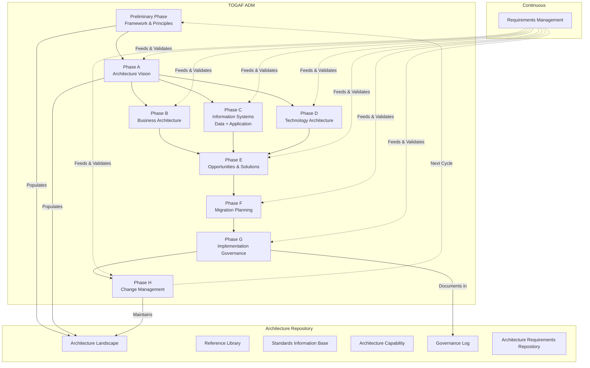

# TOGAF — The Open Group Architecture Framework: A Comprehensive Guide

> **Author:** Jack Liu Shurui  
> **Version:** 1.0  
> **Last Updated:** July 2026  
> **Context:** Solution Architecture, Crédit Agricole CIB — Financial Services  

---

## Table of Contents

1. [What is TOGAF?](#1-what-is-togaf)
2. [Evolution: TOGAF 9.2 → TOGAF 10th Edition](#2-evolution)
3. [Enterprise Architecture Domains (BDAT)](#3-enterprise-architecture-domains-bdat)
4. [The Architecture Development Method (ADM)](#4-the-architecture-development-method-adm)
5. [ADM Phases — Inputs, Steps, & Outputs Table](#5-adm-phases-table)
6. [ADM Deliverables Per Phase](#6-adm-deliverables-per-phase)
7. [Architecture Repository](#7-architecture-repository)
8. [TOGAF Certification Levels](#8-togaf-certification-levels)
9. [TOGAF and ArchiMate](#9-togaf-and-archimate)
10. [Framework Comparison](#10-framework-comparison)
11. [Applying TOGAF in Banking](#11-applying-togaf-in-banking)
12. [Practical Tips for TOGAF Adoption](#12-practical-tips-for-togaf-adoption)
13. [Enterprise Architecture Diagram](#13-enterprise-architecture-diagram)
14. [References](#14-references)

---

## 1. What is TOGAF?

TOGAF (The Open Group Architecture Framework) is the world's most widely adopted enterprise architecture (EA) framework. First developed by The Open Group in 1995 (based on the US DoD's TAFIM — Technical Architecture Framework for Information Management), it provides a comprehensive, proven methodology for designing, planning, implementing, and governing enterprise IT architecture.

**Current Version:** TOGAF Standard, 10th Edition (released April 2022, updated through 2025–2026)

**Core Philosophy:** TOGAF is not a prescriptive set of technologies or a rigid template. It is a **process-driven framework** providing:
- A **method** (ADM) for developing architectures
- A **content framework** for organising architecture outputs
- A **capability framework** for running an architecture practice
- An **enterprise continuum** for classifying architecture assets
- A **set of reference models** and **building blocks**

**Why use TOGAF?** Vendor-neutral; broad industry acceptance (50%+ of large enterprises); strong governance model; scalable from project to enterprise; complementary to Agile, DevOps, SAFe, ITIL, COBIT.

---

## 2. Evolution: TOGAF 9.2 → TOGAF 10th Edition

### TOGAF 9.2 (2018)
Minor update to 9.1 adding improved Business Architecture guidance, refined Content Metamodel, and updated references. Structured as a single monolithic document (~800 pages).

### TOGAF 10th Edition (2022+)
The most significant restructuring since TOGAF 8. Key differences:

| Dimension | TOGAF 9.2 | TOGAF 10th Edition |
|---|---|---|
| **Structure** | Monolithic single document | **Modular** — Fundamental Content + Series Guides |
| **Focus** | Process-heavy, methodology-first | **Outcome-driven**, value-focused |
| **Digital Transformation** | Briefly mentioned | **First-class concern** — cloud, AI, automation |
| **Agile Integration** | Limited guidance | Explicit ADM–Scrum/SAFe Series Guide |
| **Modularity** | One-size-fits-all | **Extension Modules** for industry/domain tailoring |
| **Governance** | Formal, committee-based | **Continuous & adaptive** governance |
| **Content** | All in one book | Fundamental Content (stable) + Series Guides (evolving) |
| **Core doc size** | ~800 pages | ~40% shorter, streamlined |

### Key Changes in Detail

**1. Modular Structure** — TOGAF 10 splits into the **TOGAF Fundamental Content** (stable core ADM method, definitions, content framework) and **TOGAF Series Guides** (living guidance for specific domains: Agile, Digital, Security, Business Architecture, Microservices, etc.). The core rarely changes; practical guidance updates independently.

**2. Digital Transformation Emphasis** — Explicitly addresses cloud adoption, AI/ML, automation, API-first design, and continuous delivery. ADM guidance now covers cloud architecture decisions, data-driven architecture, ML model governance, and event-driven patterns.

**3. Streamlined Content** — ~40% shorter core document. Redundant material removed. Content framework simplified. The Practitioner's Guide replaced detailed step-by-step with flexible "approach guidance."

**4. New Series Guides** include: *A Practitioners' Approach to the ADM*, *Leader's Guide to EA Capability*, *Using TOGAF with Agile/DevOps/SAFe*, *Business Architecture*, *Digital Transformation*, *Information Architecture*, *Security Architecture*, *Using TOGAF with ArchiMate*, *Integrating Risk and Security*.

**5. Extension Modules** — Formally defined, reusable customisations of the ADM for specific industries (Banking, Insurance, Government, Healthcare).

---

## 3. Enterprise Architecture Domains (BDAT)

TOGAF organises enterprise architecture into four interrelated domains (BDAT):

### 3.1 Business Architecture
How the enterprise operates: strategy, goals, organisation structure, business capabilities, value streams, business processes, stakeholders, governance, decision rights.
**Key Artifacts:** Business capability map, value chain diagram, organisation decomposition, process flow diagrams, business service catalogue, stakeholder map matrix.

### 3.2 Data Architecture
Structure of logical and physical data assets: conceptual/logical/physical models, data entities, data lifecycle, data lineage, governance, quality, master data management, security.
**Key Artifacts:** Data entity catalogue, data flow diagrams, class diagrams, data dissemination diagrams, data security diagram, CRUD matrix.

### 3.3 Application Architecture
Individual applications, interactions, and relationships to business processes: application portfolio, integrations, interfaces/APIs, ownership, lifecycle, rationalisation.
**Key Artifacts:** Application portfolio catalogue, interface catalogue, application communication diagram, interaction matrix, system/technology matrix, migration diagram.

### 3.4 Technology Architecture
Infrastructure supporting applications: hardware, servers, compute, network, middleware, OS platforms, cloud IaaS/PaaS/SaaS, security infrastructure, monitoring tooling.
**Key Artifacts:** Technology standards catalogue, technology portfolio catalogue, network/communications diagram, environments/locations diagram, platform decomposition diagram.

---

## 4. The Architecture Development Method (ADM)

The ADM is the core of TOGAF — a step-by-step iterative process for developing and managing enterprise architecture. It comprises 9 phases (Preliminary + A–H) with **Requirements Management** running continuously at the centre.

### 4.1 Preliminary Phase
**Purpose:** Prepare the organisation for architecture work. Define framework, principles, governance, and capability.
**Activities:** Define scope and context; identify stakeholders; establish Architecture Principles (business, data, application, technology); tailor TOGAF; select tools; define governance framework; assess EA maturity; secure executive sponsorship.
**Outputs:** Architecture Principles, tailored framework, governance framework, tooling strategy, EA capability assessment.

### 4.2 Phase A: Architecture Vision
**Purpose:** Create shared understanding of the architecture's purpose, scope, and value. Secure stakeholder buy-in.
**Activities:** Define scope and constraints; identify stakeholders (Stakeholder Map); develop Architecture Vision; create Solution Concept diagram; identify risks; obtain approval (Statement of Architecture Work); define Architecture Contracts.
**Outputs:** Statement of Architecture Work, Architecture Vision document, Stakeholder Map Matrix, Value Chain Diagrams, Solution Concept Diagrams.

### 4.3 Phase B: Business Architecture
**Purpose:** Develop detailed target Business Architecture supporting the Architecture Vision.
**Activities:** Select reference models and viewpoints; baseline description; target description; gap analysis; capability increments; roadmap components; stakeholder review.
**Outputs:** Business Architecture deliverables (capability map, value streams, org structure, process flows), business roadmap components.

### 4.4 Phase C: Information Systems Architectures
**Purpose:** Develop target Data and Application Architectures. Two sub-phases, run sequentially or in parallel.

**Data Architecture:** Define data entities/relationships; develop logical/physical models; data flow diagrams; map entities to functions; gap analysis; data migration requirements.
*Outputs:* Data entity catalogue, data component diagram, lifecycle diagram, CRUD matrix.

**Application Architecture:** Document baseline landscape; design target landscape; define interactions and integration patterns; rationalisation (retire/consolidate/replace); map apps to functions and data.
*Outputs:* Application portfolio catalogue, interface catalogue, communication diagram, system/technology matrix.

### 4.5 Phase D: Technology Architecture
**Purpose:** Develop target Technology Architecture as the infrastructure foundation.
**Activities:** Baseline landscape inventory; target technology standards; network/compute/storage/middleware design; cloud strategy; security architecture; capacity/scalability assessment; gap analysis.
**Outputs:** Technology standards catalogue, portfolio catalogue, network/comms diagram, platform decomposition, processing diagram, environments diagram.

### 4.6 Phase E: Opportunities & Solutions
**Purpose:** Identify projects and initiatives to transition from baseline to target architecture.
**Activities:** Review gap analyses (B, C, D); consolidate gaps into work packages; group into transition architectures; assess budget/resources/dependencies; make-or-buy evaluation; define roadmap; evaluate cloud/SaaS/COTS options.
**Outputs:** Implementation & Migration Strategy, project portfolio, work package catalogue, transition architectures, capability-based planning increments.

### 4.7 Phase F: Migration Planning
**Purpose:** Develop detailed implementation and migration plan with sequenced transition architectures.
**Activities:** Prioritise work packages (value, risk, dependency); estimate costs/benefits; create detailed Architecture Roadmap (timeline, milestones); validate resources; refine business cases; plan governance.
**Outputs:** Architecture Roadmap (detailed timeline), implementation plan, business cases, capability assessments, Architecture Contracts.

### 4.8 Phase G: Implementation Governance
**Purpose:** Provide architectural oversight during implementation. Ensure conformance to target architecture.
**Activities:** Establish change management process; review/approve projects for conformance; manage Architecture Contracts; provide guidance; conduct compliance reviews; manage waivers; monitor deviations.
**Outputs:** Compliance reviews, Change Requests, Architecture Contracts, Architecture Board decisions.

### 4.9 Phase H: Architecture Change Management
**Purpose:** Manage ongoing change after implementation. Keep architecture relevant to business strategy.
**Activities:** Monitor business and technology landscape; assess change impacts; classify changes (simplified/incremental/re-architect); manage Architecture Requirements Repository; plan evolution and next ADM cycle; update Architecture Landscape.
**Outputs:** Updated Architecture Landscape, change impact assessments, triggers for new ADM cycles.

### 4.10 Requirements Management (Central)
**Purpose:** Manage architecture requirements continuously throughout the ADM.
**Activities:** Capture requirements from each phase; store and manage in Architecture Requirements Repository; trace through all domains; identify/resolve conflicts; prioritise; feed changes back into phases; maintain baselines.
**Principles:** Requirements are never final; each phase both consumes and produces requirements; Requirements Management is the central arbiter of changes.

---

## 5. ADM Phases Table

| Phase | Name | Inputs | Key Steps | Outputs (Deliverables) |
|---|---|---|---|---|
| **Prelim** | Framework & Principles | Business strategy, EA maturity, stakeholders, funding | Define scope; tailor TOGAF; establish principles; select tools; define governance; secure sponsorship | Architecture Principles, tailored framework, governance framework, tooling strategy, capability assessment |
| **A** | Architecture Vision | Strategy, stakeholder concerns, scope, Prelim outputs | Identify stakeholders; define vision; create value chain; develop solution concept; obtain approval | Statement of Architecture Work, Architecture Vision, Stakeholder Map, Solution Concept Diagram |
| **B** | Business Architecture | Statement of Work, Vision, stakeholder concerns, strategy | Baseline description; target description; gap analysis; capability mapping; roadmap components | Business Architecture docs (capability map, value streams, org structure, process flows), business roadmap |
| **C (Data)** | Data Architecture | Business Arch outputs, data strategy, existing models, regulations | Baseline data model; target model; entity catalogue; flow diagrams; gap analysis; migration inputs | Data entity catalogue, data flow diagrams, lifecycle diagrams, CRUD matrix, data roadmap |
| **C (App)** | Application Architecture | Business & Data Arch outputs, app portfolio, integration strategy | Baseline landscape; target landscape; interface mapping; rationalisation; gap analysis; roadmap | App portfolio catalogue, interface catalogue, communication diagram, system/technology matrix |
| **D** | Technology Architecture | App & Data Arch, tech standards, cloud strategy, security policy | Baseline inventory; target design; network/compute/storage; cloud & security; gap analysis | Technology standards catalogue, portfolio, network/comms diagrams, platform decomposition |
| **E** | Opportunities & Solutions | Gap analyses (B, C, D), constraints, budget, resources, vendors | Consolidate gaps; define work packages; transition architectures; build-vs-buy; create roadmap | Implementation & Migration Strategy, work package catalogue, transition architectures |
| **F** | Migration Planning | E outputs, resource plans, cost estimates, dependency analysis | Prioritise; cost/benefit analysis; detailed milestone plan; business cases; governance prep | Detailed Architecture Roadmap, implementation plan, business cases, Architecture Contracts |
| **G** | Implementation Governance | F outputs, implementation projects, Architecture Contracts, governance | Establish change mgmt; review conformance; manage contracts; compliance reviews; approve changes | Compliance reviews, Change Requests, Architecture Contracts, Board decisions |
| **H** | Change Management | G outputs, business environment changes, tech changes, new requirements | Monitor landscape; classify changes; assess impacts; update landscape; trigger new cycle | Updated Architecture Landscape, change impact assessments, Requirements Repository updates |
| **Central** | Requirements Mgmt | Requirements from all phases, stakeholder feedback, regulations | Capture; store; trace; prioritise; resolve conflicts; feed back; maintain baselines | Architecture Requirements Repository (continuously updated) |

---

## 6. ADM Deliverables Per Phase

| Phase | Key Deliverables |
|---|---|
| **Prelim** | Architecture Principles, Tailored Architecture Framework, Architecture Governance Framework, Capability Assessment, Tool & Repository Strategy, Maturity Assessment |
| **A** | Statement of Architecture Work, Architecture Vision, Stakeholder Map Matrix, Value Chain Diagrams, Solution Concept Diagram, Draft Architecture Definition Document, Architecture Charter |
| **B** | Business Architecture section of Architecture Definition Document: Capability Map, Value Stream Maps, Organisation Decomposition, Business Service Catalogue, Process Flows, Business Roadmap, Business Requirements |
| **C (Data)** | Data Architecture section: Data Entity/Component Catalogue, Data Flow Diagrams, Logical Data Diagram, Data Dissemination Diagram, Data Lifecycle Diagram, Data Security Diagram, CRUD Matrix, Data Migration Plan inputs |
| **C (App)** | Application Architecture section: Application Portfolio Catalogue, Interface Catalogue, Communication Diagram, Interaction Matrix, System/Technology Matrix, Use-Case Diagram, Software Distribution Diagram, Migration Diagram |
| **D** | Technology Architecture section: Technology Standards Catalogue, Technology Portfolio Catalogue, Network/Hardware Diagram, Environments & Locations Diagram, Platform Decomposition Diagram, Processing Diagram |
| **E** | Implementation & Migration Strategy, Work Package Catalogue, Transition Architectures, Capability-Based Planning Increments, Consolidated Gaps & Solutions |
| **F** | Detailed Architecture Roadmap (Gantt/timeline), Implementation & Migration Plan, Business Case per Work Package, Capability Assessments, Architecture Contracts, Risk Register |
| **G** | Architecture Compliance Reviews, Change Requests, Architecture Contract reports, Board meeting minutes, Architecture Waivers, Solution Building Block contracts |
| **H** | Updated Architecture Landscape (Baseline, Transition, Target), Change Impact Assessments, Change Requests, ADM cycle triggers, Requirements Repository updates |
| **Central** | Architecture Requirements Specification (continuous), Requirements Impact Assessments, Traceability Matrix |

**Overarching deliverables (updated across phases):** Architecture Definition Document (A–D), Architecture Requirements Specification (central), Architecture Roadmap (E→F→G/H), Architecture Contract (F→G).

---

## 7. Architecture Repository

The Architecture Repository is the central, persistent store of all architecture assets. Six key components:

### 7.1 Architecture Landscape
View of current, transition, and target architectures at three levels:
- **Strategic** — Enterprise-wide (board-level, 3–5 year horizon)
- **Segment** — Business unit/domain (programme, 12–36 months)
- **Capability** — Individual project (execution, 3–12 months)

### 7.2 Reference Library
Reusable assets: industry reference models (BIAN for banking, eTOM for telecom, SCOR for supply chain), Technology Reference Model (TRM), architecture patterns (event-driven, microservices, layered), reusable building blocks.

### 7.3 Standards Information Base (SIB)
Standards the organisation commits to: technical standards (ISO 27001, OAuth 2.0, REST APIs), regulatory standards (GDPR, BCBS 239, SOX, PCI-DSS, MAS guidelines), industry standards (BIAN service domains, ISO 20022), internal standards (naming conventions, platform guidelines). Includes version management and compliance mapping.

### 7.4 Architecture Capability
The architecture practice itself: team structure, roles, skill assessments, training plans, process definitions, maturity models, tooling catalogues.

### 7.5 Governance Log
Records governance activities: Architecture Board minutes, Contract compliance records, waivers/exemptions, change request logs with impact assessments, compliance review outcomes, decision registers.

### 7.6 Architecture Requirements Repository
Central database of all requirements: stakeholder concerns, functional/non-functional, regulatory/compliance requirements, traceability to architecture elements, status/priority/ownership.

---

## 8. TOGAF Certification Levels

### Level 1: TOGAF Foundation
- **Focus:** Core concepts, terminology, structure of TOGAF Standard
- **Covers:** ADM phases overview, EA domains, content framework, enterprise continuum, reference models
- **Exam:** OGEA-101 (open-book, multiple-choice, 60 min)
- **Target:** Anyone needing foundational understanding — architects, PMs, analysts, consultants

### Level 2: TOGAF Certified
- **Focus:** Applying ADM methodically; tailoring to real-world scenarios
- **Covers:** ADM in depth, stakeholder management, governance, requirements management, partitioning, content metamodel, capability planning
- **Exam:** OGEA-102 (open-book, scenario-based, 90 min)
- **Prerequisite:** Foundation
- **Target:** Practicing enterprise/solution architects, senior consultants

### Level 3: TOGAF Distinction
- **Focus:** Deep expertise or leadership
- **Two tracks:** Specialist (deep domain knowledge — Business Architecture, Security, Digital) or Leader (demonstrated EA practice leadership)
- **Requirement:** Portfolio submission + peer review by The Open Group
- **Target:** Senior architects with 5+ years practical TOGAF experience

**Pathway:** Foundation (L1) → Certified (L2) → Distinction (L3). Combined Part 1+2 exam available for L1+L2 in one sitting.

---

## 9. TOGAF and ArchiMate

TOGAF and ArchiMate are complementary Open Group standards:

| Aspect | TOGAF | ArchiMate |
|---|---|---|
| **Type** | Methodology & Framework | Modelling Language (Notation) |
| **Provides** | Process steps, governance, deliverables | Visual notation, metamodel, viewpoint definitions |
| **Focus** | *How* to do architecture | *How to describe* architecture |
| **Output** | Documents, plans, contracts | Models, diagrams, views |
| **Coverage** | Full lifecycle (strategy→operations) | Visual representation across layers |

**Analogy:** TOGAF is the cookbook (recipes, steps); ArchiMate is the menu language (standardised names). You need both for a professional EA practice.

**How They Work Together:**
- **ADM + ArchiMate Viewpoints:** Each ADM phase maps to recommended ArchiMate viewpoints — Phase A (Stakeholder, Goal Realisation), Phase B (Business Process, Capability Map, Organisation), Phase C (Data Structure, Application Structure, Application Cooperation), Phase D (Technology, Infrastructure), Phase E (Implementation & Migration, Project).
- **Content Metamodel Mapping:** TOGAF Business Service → ArchiMate Business Service; TOGAF Application Component → ArchiMate Application Component; TOGAF Data Entity → ArchiMate Data Object; TOGAF Technology Component → ArchiMate Technology Component.
- **Repository Consistency:** Architecture Repository holds ArchiMate models as the authoritative representation.
- **Official Guide:** *Using TOGAF with ArchiMate* Series Guide provides detailed mappings.

---

## 10. Framework Comparison

| Dimension | TOGAF | Zachman | FEAF | BIAN | ArchiMate |
|---|---|---|---|---|---|
| **Type** | Process + Content Framework | Taxonomy / Classification | Methodology + Taxonomy | Industry Reference Model | Modelling Language |
| **Origin** | The Open Group (TAFIM) | John Zachman (1987) | US Federal Government | Banking Industry Network | The Open Group |
| **Best For** | General enterprise architecture | Organising architectural artifacts | US government / public sector | Banking & financial services | Visualising EA artefacts |
| **Methodology** | ADM (9 phases + central RM) | None (taxonomy only) | CPM (Collaborative Planning) | Service landscape definition | None (notation only) |
| **Domains** | Business, Data, App, Technology (BDAT) | What/How/Where/Who/When/Why | Performance, Business, Data, App, Technology | Business/service domains, capabilities | Business, App, Technology, Physical (4 layers) |
| **Industry Focus** | All industries | All industries | US federal agencies | Banking only | All industries |
| **Governance** | Strong — Board, Contracts, Reviews | None specified | Strong — federal governance | Light recommendations | None provided |
| **Agile Compat.** | High (TOGAF 10 Series Guide) | Low | Low | Medium | N/A (notation) |
| **Certification** | Foundation, Certified, Distinction | Zachman Certified | FEA Certification (limited) | BIAN certification | Foundation, Certified |
| **Tool Support** | Widely supported | Spreadsheet-compatible | Moderate (federal tools) | Growing | Excellent |
| **Strengths** | Comprehensive lifecycle, strong governance, recognised | Simple, universal organising concept | Government alignment, performance focus | Banking-specific standardised domains | Standardised notation, multi-layer views |
| **Weaknesses** | Can feel heavy; needs tailoring | No process; not a methodology | US-specific | Banking only | No process or governance |

**When to use each:** TOGAF for any enterprise-wide practice; Zachman for classification/education; FEAF for US government; BIAN for banking (complementary to TOGAF); ArchiMate for visual modelling (always complementary to TOGAF).

---

## 11. Applying TOGAF in Banking

### Why Banking Needs TOGAF
Financial institutions face heavy regulation (MAS, ECB, Fed, PRA), complex legacy landscapes (mainframes, COBOL), high data lineage/auditability demands, and rapid fintech/open banking disruption. TOGAF provides the governance discipline and traceability that regulators expect.

### Tailoring the ADM for Financial Services

| Phase | Banking-Specific Tailoring |
|---|---|
| **Prelim** | Define regulatory scoping (GDPR, BCBS 239, MAS TRM, SOX, PCI-DSS); align to Basel/CRD timelines; involve Compliance & Risk from day one |
| **A** | Include regulatory compliance as a primary goal; prepare for regulator reviews; define digital banking vision (open banking, instant payments, embedded finance) |
| **B** | Use BIAN Service Domains as reference; map capabilities to regulatory obligations; model value streams around products (loans, deposits, cards, trade finance, wealth) |
| **C (Data)** | Subject to BCBS 239 risk data aggregation rules; enforce data lineage (source→calculation→report); model legal entities & consolidation hierarchies |
| **C (App)** | Map apps to BIAN service domains; address SWIFT, ISO 20022, SEPA, FAST, MEPS+; include AML, fraud, sanctions screening systems |
| **D** | Data centre/cloud strategy per MAS guidelines; network segmentation for PCI-DSS; HSM/key management for payments; mainframe coexistence |
| **E** | Prioritise regulatory-driven projects; build business case around compliance risk reduction; transition architecture for legacy decommissioning |
| **F** | Plan regulatory approval milestones alongside technical milestones; manage parallel runs for regulatory reporting; multi-year roadmaps with gate reviews |
| **G** | Include Compliance, Risk, and Internal Audit as Architecture Board members; enforce Architecture Contracts linked to regulatory commitments |
| **H** | Monitor regulatory changes (BCBS 239 updates, MAS outsourcing guidelines, DORA in EU); trigger ADM cycles; maintain continuous compliance mapping |

### BCBS 239 Alignment
BCBS 239 (Principles for Effective Risk Data Aggregation and Risk Reporting) aligns with TOGAF as:

| Principle | TOGAF Response |
|---|---|
| **P1–P2: Governance & Infrastructure** | Preliminary Phase + Phase G |
| **P3–P4: Accuracy & Integrity** | Phase C (Data) — data quality, lineage, reconciliation |
| **P5: Completeness** | Phase C (Data) — complete data entity catalogue for all risk data |
| **P6–P7: Timeliness & Adaptability** | Phase F — SLAs; Phase H — regulatory timeliness monitoring |
| **P8–P10: Reporting** | Phase B — reporting processes; Phase C (App) — reporting systems; Phase G — governance |
| **P11: Supervisory Review** | Phase A — regulators as stakeholders; Phase G — compliance reviews |

### Using TOGAF with BIAN
BIAN provides a standardised service domain model for banking. Combined with TOGAF:
- **Reference Library:** Use BIAN service domains (Party Management, Product Lifecycle, Payment Execution, Risk Analytics) as reusable building blocks.
- **Phase B:** Map capabilities to BIAN domains instead of building from scratch.
- **Phase C (App):** Classify each application by BIAN service domain to reveal gaps and overlaps.
- **Phase D/E:** Use BIAN RESTful API specifications as integration standards in the SIB.
- **Phase F:** Prioritise BIAN domain adoption based on business value and regulatory urgency.

**Example — Trade Finance Modernisation:**
1. Phase A: Vision for trade finance platform modernisation
2. Phase B: Map capabilities to BIAN domains (Letter of Credit, Guarantee, Documentary Collection, Forfaiting)
3. Phase C: Design applications and data entities per BIAN business objects
4. Phase E: Group BIAN domain implementations into work packages
5. Phase F: 3-year roadmap aligned to BIAN adoption and ISO 20022 migration

---

## 12. Practical Tips for TOGAF Adoption

### Scaling for Non-Greenfield Environments
Most adopters have decades of accumulated complexity. Key approaches:
- **Focus on hot spots** — systems with high change rate, regulatory risk, or cost. Don't document everything.
- **Accept 80% accuracy** — use interviews, workshops, automated scanning (LeanIX, ServiceNow).
- **Coalition of the willing** — start with one business unit feeling the most pain; demonstrate value before expanding.
- **Grow organically** — start with a part-time Architecture Board, hire a lead architect, build the team as the practice proves value.
- **Serious stakeholder mapping** — identify champions, blockers, influencers; tailor communications per group.

### Iterating with Scrum/SAFe
TOGAF 10 Series Guide provides explicit Agile alignment:

| ADM Phase | Agile Parallel |
|---|---|
| **Prelim + A** | Sprint 0 — establish architecture vision, principles, backlog |
| **B, C, D** | Architecture Runway — design spikes & enabler stories; rolling 2–3 sprint horizon |
| **E, F** | Release Planning / PI Planning — prioritise features aligned to transition architectures |
| **G** | Sprint Reviews — architecture compliance checked at each demo |
| **H** | Retrospectives — feed improvements into iterations; maintain Architecture Backlog |

**Key Principle:** Use **just-in-time architecture** — define only what's needed for the next 2–3 sprints, with broad direction visible 1–2 PIs ahead. SAFe's Enterprise Architect maps to the TOGAF Architecture Board; SAFe's Architecture Runway maps to ADM Phases E & F.

### Governance in Regulated Industries
- **Architecture Board** includes Compliance, Risk, Audit, Legal as permanent members; meet monthly minimum.
- **Architecture Contracts** link to regulatory commitments as contractual obligations in project charters.
- **Compliance Reviews** at four gates: (1) project initiation, (2) design approval, (3) pre-production, (4) post-implementation.
- **Waiver Process** for deviations: documented with business justification, risk assessment, remediation plan, expiration date. All waivers reviewed quarterly.
- **Regulatory Mapping** maintains traceability from regulation → principle → decision → work package → control.
- **Audit Readiness** — Governance Log should be auditor-ready at any time.

### Tools and Repositories

| Tool | Strengths | Best For |
|---|---|---|
| **Sparx Enterprise Architect** | Modelling, ArchiMate support, repository | Deep modelling, TOGAF+ArchiMate |
| **LeanIX** | SaaS, dependency mapping, lightweight | App portfolio management, tech risk, cloud migration |
| **Ardoq** | Collaboration-first, dynamic views | Large-scale transformation, storytelling |
| **Orbus iServer** | TOGAF-aligned out of box | Microsoft stack organisations |
| **QualiWare** | Full EA + BPM + audit trail | Highly regulated industries |
| **BizzDesign** | ArchiMate native, analysis engine | Large enterprises with mature EA |
| **Archi** | Free, open-source ArchiMate | Small teams, learning, PoCs |

**Repository tips:** Start with well-organised SharePoint/Confluence — a good template beats an expensive empty tool. Automate discovery (Faddon, ServiceNow). One source of truth. Use Git-based versioning. Integrate with Jira, ServiceNow, DevOps toolchain. Prune regularly.

---

## 13. Enterprise Architecture Diagram

```
╔══════════════════════════════════════════════════════════════════════════════╗
║                    TOGAF ENTERPRISE ARCHITECTURE FRAMEWORK                    ║
╚══════════════════════════════════════════════════════════════════════════════╝

                    ┌─────────────────────────────────────┐
                    │     BUSINESS STRATEGY & DRIVERS      │
                    └─────────────────┬───────────────────┘
                                      │
                     ┌────────────────▼────────────────┐
                     │       PRELIMINARY PHASE          │
                     │  Framework, Principles,          │
                     │  Governance, Capability          │
                     └────────────────┬────────────────┘
                                      │
                        ┌─────────────▼──────────────┐
                        │      PHASE A               │
                        │  Architecture Vision       │
                        └─────────────┬──────────────┘
                                      │
          ┌─────────────────────────────┬──────────────────────────────┐
          │                             │                              │
 ┌────────▼────────┐        ┌──────────▼──────────┐      ┌───────────▼────────┐
 │   PHASE B       │        │   PHASE C            │      │   PHASE D          │
 │  Business       │◄──────►│  Information Systems │◄────►│  Technology        │
 │  Architecture   │        │  ┌────────────────┐  │      │  Architecture      │
 │  ┌──────────┐   │        │  │ Data  │  App   │  │      │  ┌──────────────┐  │
 │  │Capability│   │        │  └────────────────┘  │      │  │Infra, Cloud, │  │
 │  │Processes │   │        └──────────┬───────────┘      │  │Network, Sec  │  │
 │  │Value Strm│   │                   │                   │  └──────────────┘  │
 │  └──────────┘   │                   │                   └────────────────────┘
 └─────────────────┘                   │
                                       │
            ┌──────────────────────────▼──────────────────────────┐
            │                    PHASE E                           │
            │        Opportunities & Solutions                     │
            │    Work Packages → Transition Architectures          │
            └──────────────────────────┬──────────────────────────┘
                                       │
            ┌──────────────────────────▼──────────────────────────┐
            │                    PHASE F                           │
            │              Migration Planning                      │
            │       Roadmap → Business Cases → Contracts           │
            └──────────────────────────┬──────────────────────────┘
                                       │
            ┌──────────────────────────▼──────────────────────────┐
            │                    PHASE G                           │
            │           Implementation Governance                  │
            │    Compliance Reviews ↔ Architecture Board           │
            └──────────────────────────┬──────────────────────────┘
                                       │
            ┌──────────────────────────▼──────────────────────────┐
            │                    PHASE H                           │
            │        Architecture Change Management                │
            │     Monitoring → Updates → Next Cycle                │
            └─────────────────────────────────────────────────────┘


╔══════════════════════════════════════════════════════════════════════════════╗
║            REQUIREMENTS MANAGEMENT (Continuous — Central to All Phases)      ║
╚══════════════════════════════════════════════════════════════════════════════╝


                  ┌────────────────────────────────────────────────────────┐
                  │                 ARCHITECTURE REPOSITORY                │
                  │                                                        │
                  │ ┌──────────────┐ ┌──────────────┐ ┌────────────────┐  │
                  │ │ Architecture │ │  Reference   │ │  Standards     │  │
                  │ │  Landscape   │ │   Library    │ │  Info Base     │  │
                  │ └──────────────┘ └──────────────┘ └────────────────┘  │
                  │                                                        │
                  │ ┌──────────────┐ ┌──────────────┐ ┌────────────────┐  │
                  │ │ Architecture │ │  Governance  │ │  Architecture  │  │
                  │ │  Capability  │ │     Log      │ │  Requirements  │  │
                  │ └──────────────┘ └──────────────┘ │  Repository    │  │
                  │                                   └────────────────┘  │
                  └────────────────────────────────────────────────────────┘


                    ENTERPRISE ARCHITECTURE DOMAINS (BDAT)

    ┌───────────────────────────────────────────────────────────────────────────┐
    │  BUSINESS        DATA          APPLICATION         TECHNOLOGY             │
    │  ┌────────┐  ┌──────────┐  ┌──────────────┐   ┌────────────────────┐    │
    │  │Strategy│  │Data Model│  │Portfolio     │   │Compute / Cloud     │    │
    │  │Maps    │  │Lineage   │  │Interfaces    │   │Network / Storage   │    │
    │  │Process │  │Governance│  │Integrations  │   │Middleware/Security │    │
    │  └────────┘  └──────────┘  └──────────────┘   └────────────────────┘    │
    └───────────────────────────────────────────────────────────────────────────┘


          ╔══════════════════════════════════════════════════════════════════╗
          ║          TOGAF + BIAN (Banking Extension)                       ║
          ║  BIAN Service Domains → Reference Library                       ║
          ║  BIAN Business Objects → Data Architecture Entities             ║
          ║  BIAN APIs → Application Integration Standards (SIB)            ║
          ║  BIAN Capability Map → Business Architecture Map                ║
          ╚══════════════════════════════════════════════════════════════════╝
```

### Mermaid Diagram (renders in markdown editors)



---

## 14. References

### Official Standards
- The Open Group. *The TOGAF Standard, 10th Edition — Fundamental Content* (2022, updated 2025)
- The Open Group. *The TOGAF Standard, 10th Edition — ADM Practitioners' Guide* (2025 Update)
- The Open Group. *TOGAF Series Guides* (Agile, Digital, Business Architecture, Security, ArchiMate)
- The Open Group. *ArchiMate 3.2 Specification* (2023)

### Banking-Specific
- BCBS 239 — Principles for Effective Risk Data Aggregation and Risk Reporting (2013)
- BIAN. *BIAN Service Landscape 12.0* (2025)
- MAS. *Technology Risk Management Guidelines* (2021, updated 2025)
- ISO 20022 — Universal financial industry message scheme
- EBA. *DORA — Digital Operational Resilience Act* (2023)

### Framework Comparisons
- Reiter, M. (2025). *Comparative Analysis of Enterprise Architecture Frameworks: TOGAF, Zachman and FEAF.* Springer.
- Conexiam. *TOGAF vs. BIAN: Understanding the Different Roles* (2024)

### Tools
- LeanIX (leanix.net) — Application portfolio management
- Sparx Enterprise Architect (sparxsystems.com) — Modelling with ArchiMate
- Archi (archimatetool.com) — Free open-source ArchiMate modelling
- Visual Paradigm (visual-paradigm.com) — TOGAF-aligned modelling

### Certification
- The Open Group — TOGAF Certification: https://www.opengroup.org/togaf
- Exams: OGEA-101 (Foundation), OGEA-102 (Certified)

---

> **About this Guide**
> Maintained as part of a personal research repository on enterprise architecture and technology strategy. Reflects understanding as of mid-2026. The TOGAF Standard evolves through Series Guides and Extension Modules — refer to The Open Group's official publications for the definitive current content.
>
> *— Jack Liu Shurui, Singapore, July 2026*
