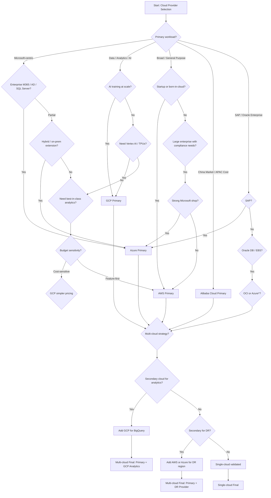

# Cloud Providers — A Comprehensive Guide for Enterprise Adoption

> **Author:** Jack Liu Shurui | **Role:** Solution Architect, Crédit Agricole CIB  
> **Last Updated:** July 2026 | **Version:** 1.0  
> **Repository:** [github.com/jackliusr/research](https://github.com/jackliusr/research)

---

## Table of Contents

1. [Executive Summary](#1-executive-summary)
2. [Cloud Market Overview](#2-cloud-market-overview)
3. [Amazon Web Services (AWS)](#3-amazon-web-services-aws)
4. [Microsoft Azure](#4-microsoft-azure)
5. [Google Cloud Platform (GCP)](#5-google-cloud-platform-gcp)
6. [Alibaba Cloud](#6-alibaba-cloud)
7. [Specialisation vs Breadth — The Provider Spectrum](#7-specialisation-vs-breadth--the-provider-spectrum)
8. [Comparison Across Dimensions](#8-comparison-across-dimensions)
9. [Cloud Provider Comparison Table](#9-cloud-provider-comparison-table)
10. [Multi-Cloud Strategies](#10-multi-cloud-strategies)
11. [Cloud Provider Selection Criteria](#11-cloud-provider-selection-criteria)
12. [Cloud Provider Selection Decision Tree](#12-cloud-provider-selection-decision-tree)
13. [Government Cloud Landscape](#13-government-cloud-landscape)
14. [Cloud Cost Management (FinOps)](#14-cloud-cost-management-finops)
15. [Future Trends](#15-future-trends)
16. [Conclusion and Recommendations](#16-conclusion-and-recommendations)

---

## 1. Executive Summary

The global cloud computing market has reached an inflection point. With public cloud end-user spending projected at approximately **$850 billion in 2026** (Gartner) and the broader cloud computing market estimated between **$905 billion and $1.1 trillion**, enterprises face an increasingly complex decision when selecting, migrating to, and operating across cloud platforms.

This guide provides a comprehensive, vendor-neutral comparison of the four major cloud providers — **Amazon Web Services (AWS)**, **Microsoft Azure**, **Google Cloud Platform (GCP)**, and **Alibaba Cloud** — with coverage of specialised and regional providers. It is written from the perspective of an enterprise architect evaluating cloud adoption for regulated, multi-region workloads, with particular attention to the Asia-Pacific and Singapore market context.

**Key takeaways:**

- **AWS** leads in market share (~32%), service breadth, and ecosystem maturity — best for organisations needing the widest service catalogue and startup-to-enterprise scalability.
- **Azure** (~23%) excels in hybrid cloud (Azure Arc), enterprise SaaS integration (Microsoft 365, Dynamics), and regulated industry compliance — best for Microsoft-centric enterprises.
- **GCP** (~12%) leads in data analytics (BigQuery), AI/ML (Vertex AI, TPUs), and Kubernetes-native infrastructure — best for data-intensive and AI-first workloads.
- **Alibaba Cloud** (~5%) dominates the China market and is the leading cloud provider in Asia-Pacific — best for China market access, APAC presence, and cost-sensitive workloads.
- **Multi-cloud is the de facto enterprise standard** — over 89% of enterprises report using multiple cloud providers, driven by best-of-breed workload placement, vendor diversification, and regulatory requirements.

---

## 2. Cloud Market Overview

### 2.1 Market Size and Growth

The cloud computing market has grown from approximately **$156 billion in 2020** to an estimated **$850 billion–$1.1 trillion in 2026**, depending on the measurement methodology:

| Source | 2025 Estimate | 2026 Estimate | CAGR |
|--------|--------------|--------------|------|
| Gartner (public cloud end-user spending) | ~$720B | ~$850B | 21.3% |
| Fortune Business Insights (total market) | ~$781B | ~$905B | 15.7% |
| Precedence Research (total market) | ~$913B | ~$1,106B | 20.6% |

Growth is driven by AI/ML workload adoption, cloud-native application development, data analytics modernisation, and digital transformation mandates across regulated industries (financial services, healthcare, government).

### 2.2 Market Share Breakdown (Q4 2025 / Q1 2026)

| Provider | Market Share | YoY Growth | Primary Strength |
|----------|-------------|------------|------------------|
| **AWS** | ~32% | ~12% YoY | Breadth, maturity, ecosystem |
| **Microsoft Azure** | ~23% | ~16% YoY | Enterprise SaaS, hybrid, AI |
| **Google Cloud** | ~12% | ~28% YoY | Data, AI/ML, Kubernetes |
| **Alibaba Cloud** | ~5% | ~8% YoY | China, APAC, cost |
| **IBM Cloud** | ~3% | ~2% YoY | Mainframe, regulated |
| **Oracle Cloud** | ~2% | ~20% YoY | Database, ERP workloads |
| **Others** (Tencent, Huawei, DigitalOcean, etc.) | ~23% | Varies | Regional, niche |

### 2.3 Regional Dynamics

- **North America:** ~52% of global cloud spend. AWS leads, Azure strong in enterprise, GCP growing fastest.
- **Europe:** Azure leads in many regulated markets (financial services, government). Sovereign cloud demand rising.
- **Asia-Pacific:** The fastest-growing region. Alibaba Cloud leads in China; AWS and Azure compete in SEA/Singapore. Singapore is the primary cloud hub for Southeast Asia, with multiple availability zones from all four major providers.
- **Middle East & Africa:** Emerging markets with hyperscaler region build-outs (AWS UAE, Azure South Africa, GCP Israel, Alibaba UAE).

---

## 3. Amazon Web Services (AWS)

### 3.1 Overview

Launched in 2006, AWS is the oldest and most mature public cloud provider. With over **200 services**, the broadest global infrastructure footprint, and the largest partner ecosystem, AWS is the default choice for organisations that need maximum service breadth and global reach.

### 3.2 Compute Services

| Service | Type | Description |
|---------|------|-------------|
| **Amazon EC2** | Virtual Machines | Broadest instance family selection (general-purpose, compute-optimised, memory-optimised, GPU, FPGA, Arm-based Graviton) |
| **AWS Lambda** | Serverless Functions | Event-driven, pay-per-invocation compute; up to 15 min execution, 10 GB memory |
| **Amazon ECS** | Containers (Fargate/EC2) | AWS-native container orchestration; supports Fargate (serverless) or EC2 launch types |
| **Amazon EKS** | Kubernetes | Managed Kubernetes control plane; integrates with IAM, VPC, CloudWatch |
| **AWS Batch** | Batch Computing | Fully managed batch processing at any scale |
| **Elastic Beanstalk** | PaaS | Platform-as-a-service for quick app deployment (Java, .NET, PHP, Node.js, Python, Ruby, Go, Docker) |

**GPU instances:** P5 (H100), P4d (A100), Trn1 (Trainium) for AI/ML training; G5/G6 (A10G/L4) for inference and graphics.

### 3.3 Storage Services

| Service | Type | Key Features |
|---------|------|-------------|
| **Amazon S3** | Object Storage | 11 9s durability; 5 storage classes (Standard, Infrequent Access, One Zone-IA, Glacier, Glacier Deep Archive); S3 Object Lambda |
| **Amazon EBS** | Block Storage | SSD/HDD volumes for EC2; snapshots to S3; up to 64 TB per volume |
| **Amazon EFS** | File Storage (NFS) | Elastic, scalable; Linux only; lifecycle management |
| **Amazon FSx** | Managed File Systems | FSx for Lustre (HPC), FSx for Windows File Server, FSx for NetApp ONTAP, FSx for OpenZFS |
| **AWS Backup** | Backup Centralisation | Centralised backup across AWS services; cross-region/account |
| **S3 Glacier / Deep Archive** | Cold Archive | $0.0036/GB/mo (Glacier Deep Archive); retrieval in 12 hours |

### 3.4 Database Services

| Service | Type | Description |
|---------|------|-------------|
| **Amazon RDS** | Relational (SQL) | Managed MySQL, PostgreSQL, MariaDB, Oracle, SQL Server, Db2 |
| **Amazon Aurora** | Relational (Cloud-Native) | MySQL/PostgreSQL-compatible; 5x throughput vs standard MySQL, 3x vs PostgreSQL |
| **Amazon DynamoDB** | NoSQL (Key-Value + Document) | Single-digit millisecond latency at any scale; DAX for caching; global tables |
| **Amazon Redshift** | Data Warehousing | Petabyte-scale; Redshift Spectrum (query S3 directly); RA3 nodes |
| **Amazon ElastiCache** | In-Memory Caching | Redis and Memcached; cluster mode for HA |
| **Amazon DocumentDB** | Document (MongoDB-compatible) | MongoDB 5.0/6.0 compatible; fully managed |
| **Amazon Neptune** | Graph Database | Managed graph; property graph and RDF (SPARQL) |
| **Amazon Timestream** | Time-Series | Serverless; 1000x faster than relational, 1/10 cost |
| **Amazon QLDB** | Ledger Database | Immutable, cryptographically verifiable transaction log |
| **Amazon Keyspaces** | Wide-Column (Cassandra-compatible) | Managed Apache Cassandra |
| **DMS** | Migration | Database Migration Service; homogeneous/heterogeneous migrations |

### 3.5 Networking Services

| Service | Description |
|---------|-------------|
| **Amazon VPC** | Isolated virtual networks; subnets, route tables, NAT gateways, VPC peering, Transit Gateway |
| **Amazon CloudFront** | CDN; 600+ Points of Presence; edge functions (CloudFront Functions, Lambda@Edge) |
| **Amazon Route 53** | DNS service; latency-based routing, geolocation, health checks, DNSSEC |
| **AWS Direct Connect** | Dedicated private network connection (1 Gbps – 100 Gbps) from on-prem to AWS |
| **AWS Global Accelerator** | Network traffic optimisation; uses AWS global network to improve performance |
| **AWS VPN** | Site-to-Site and Client VPN for encrypted connectivity |
| **Elastic Load Balancing** | ALB (HTTP/HTTPS), NLB (TCP/UDP), GLB (Geneve) |

**Global infrastructure:** 33 launched regions, 105 availability zones, 600+ CloudFront POPs, 115 Direct Connect locations.

### 3.6 AI / Machine Learning

| Service | Description |
|---------|-------------|
| **Amazon SageMaker** | End-to-end ML platform (label, build, train, tune, deploy, monitor); Studio, Canvas, Ground Truth, Data Wrangler |
| **Amazon Bedrock** | Managed foundation model service; access to Anthropic (Claude), Meta (Llama), Mistral, Cohere, AI21 Labs, Stability AI, Amazon Titan; Guardrails for safety |
| **Amazon Q Developer** | AI-powered coding assistant; code generation, debugging, Q&A; also Q Business for enterprise search and Q in QuickSight |
| **AWS Trainium / Inferentia** | Custom AI chips; Trainium2 for training, Inferentia2 for inference; Trn2 instances |
| **Amazon Rekognition** | Image/Video analysis; facial recognition, content moderation |
| **Amazon Comprehend** | NLP; entity extraction, sentiment analysis, topic modelling |
| **Amazon Polly / Transcribe** | Text-to-speech and speech-to-text |
| **Amazon Kendra** | Enterprise search with NLP |

### 3.7 Enterprise Features

| Service / Feature | Description |
|------------------|-------------|
| **AWS Organizations** | Central governance for multiple accounts; SCPs (Service Control Policies) for guardrails |
| **AWS Control Tower** | Automated landing zone setup; built-in guardrails, Account Factory |
| **AWS Config** | Resource configuration tracking, compliance auditing, rule-based evaluation |
| **AWS CloudTrail** | API activity logging across accounts and regions |
| **AWS GuardDuty** | Threat detection (anomaly, malware, ransomware); integrates with Security Hub |
| **AWS Security Hub** | Consolidated security findings; CIS, PCI DSS, SOC benchmarks |
| **AWS IAM / IAM Identity Center** | Identity and access management; SSO, federated access, fine-grained permissions |
| **AWS Artifact** | Self-service compliance reports (SOC, ISO, PCI) |
| **AWS Well-Architected Framework / CAF** | Best-practice frameworks: Operational Excellence, Security, Reliability, Performance Efficiency, Cost Optimisation, Sustainability |
| **AWS Managed Services** | 24/7 infrastructure management for enterprise customers |

### 3.8 Strengths

- **Broadest service catalogue** — Over 200 services covering virtually every workload category
- **Most mature** — 20 years of operational excellence, battle-tested at global scale
- **Largest ecosystem** — Thousands of ISVs, SI partners, and third-party integrations in AWS Marketplace
- **Best serverless ecosystem** — Lambda, Step Functions, EventBridge, API Gateway, DynamoDB, S3 → fully serverless architectures
- **Graviton (Arm) instances** — 40% better price/performance vs x86 for many workloads
- **Strongest startup and community support** — Activate program, Promotional credits, vast documentation and training

### 3.9 Weaknesses

- **Complex pricing** — Pay-as-you-go can be unpredictable; thousands of SKUs and pricing dimensions; requires FinOps discipline
- **Steep learning curve** — Depth of services requires significant expertise to architect optimally
- **Opinionated services** — Proprietary services (DynamoDB, Aurora, Kinesis) create lock-in risk
- **Cost at scale** — Data transfer out (egress) is expensive; can surprise on data-heavy workloads
- **Limited hybrid out-of-box** — Outposts and Snow Family address this, but less seamless than Azure Arc

### 3.10 Best For

- Startups and digital-native companies (breadth, scalability, ecosystem)
- AWS-native technology stacks (serverless, microservices on ECS/EKS)
- Organisations needing the broadest service coverage across compute, storage, database, analytics, and AI
- Workloads requiring maximum global reach and availability zone density

---

## 4. Microsoft Azure

### 4.1 Overview

Microsoft Azure is the second-largest public cloud provider, deeply integrated with the Microsoft enterprise ecosystem (Windows Server, Active Directory, Office 365, Dynamics 365, Power Platform, GitHub). Azure's strength lies in hybrid cloud, enterprise identity, and regulated industry compliance.

### 4.2 Compute Services

| Service | Type | Description |
|---------|------|-------------|
| **Azure Virtual Machines** | Virtual Machines | Broad selection including Windows/Linux; GPU instances (NCas, ND-series with H100, A100, MI300X); confidential computing VMs |
| **Azure Functions** | Serverless Functions | Event-driven; consumption, premium, and dedicated plans; up to 10 min (60 min on premium plan) |
| **Azure Kubernetes Service (AKS)** | Kubernetes | Managed Kubernetes; integrated with Entra ID, Azure Policy, Container Registry; automatic upgrades, scaling |
| **Azure App Service** | PaaS (Web + API) | Fully managed web application hosting; .NET, Java, Node.js, Python, PHP; auto-scaling, slots for deployment |
| **Azure Container Apps** | Serverless Containers | Kubernetes-based serverless containers; event-driven scaling (KEDA), Dapr runtime |
| **Azure Batch** | Batch Computing | Cloud-scale job scheduling and compute management |
| **Azure Spring Apps** | Java PaaS | Managed Spring Boot / Spring Cloud apps |

**GPU instances:** ND-series (H100, A100, MI300X), NCas-series (A100, T4), NV-series (M60, T4) for AI/ML, VDI, and rendering.

### 4.3 Storage Services

| Service | Type | Key Features |
|---------|------|-------------|
| **Azure Blob Storage** | Object Storage | Hot, Cool, Cold, and Archive tiers; immutable storage; lifecycle management |
| **Azure Managed Disks** | Block Storage | SSD (Ultra, Premium, Standard) and HDD; snapshots; disk encryption; up to 32 TB |
| **Azure Files** | File Storage (SMB/NFS) | Managed SMB and NFS file shares; hybrid sync with Azure File Sync |
| **Azure NetApp Files** | Enterprise NAS | High-performance NFS/SMB; low latency; ONTAP-based |
| **Azure Data Lake Storage Gen2** | Data Lake | Hierarchical namespace on Blob; POSIX ACLs; HDFS-compatible |
| **Azure Backup** | Backup Service | Centralised backup for Azure VMs, SQL Server, SAP HANA, files |
| **Azure Archive Storage** | Cold Archive | $0.002/GB/mo; retrieval in up to 15 hours |

### 4.4 Database Services

| Service | Type | Description |
|---------|------|-------------|
| **Azure SQL Database** | Relational (SQL Server) | Managed SQL Server; serverless option; Hyperscale tier (100 TB); elastic pools |
| **Azure SQL Managed Instance** | Relational (SQL Server) | Near-100% SQL Server compatibility; lift-and-shift friendly |
| **Azure Database for MySQL/PostgreSQL/MariaDB** | Relational (OSS) | Fully managed open-source databases; flexible server and single server |
| **Azure Cosmos DB** | NoSQL (Multi-model) | Global distribution; multi-master; APIs: NoSQL (Document), MongoDB, Cassandra, Gremlin (Graph), Table, PostgreSQL |
| **Azure Synapse Analytics** | Data Warehousing + Analytics | Formerly SQL Data Warehouse; serverless and dedicated; integrates with Power BI, Azure ML |
| **Azure Cache for Redis** | In-Memory Caching | Managed Redis; enterprise tier with Active Geo-Replication |
| **Azure Database for PostgreSQL — Hyperscale (Citus)** | Distributed Relational | Sharded PostgreSQL for multi-tenant SaaS and real-time analytics |
| **Azure Managed Instance for Apache Cassandra** | Wide-Column | Managed Cassandra with auto-scaling and hybrid support |

### 4.5 Networking Services

| Service | Description |
|---------|-------------|
| **Azure Virtual Network (VNet)** | Isolated networks; subnets, NSGs, VNet peering, VNet injection; VPN gateway, ExpressRoute gateway |
| **Azure Content Delivery Network (CDN)** | CDN; 150+ edge locations; integrated with Azure Front Door (global load balancer + WAF) |
| **Azure DNS** | DNS hosting; private DNS zones; alias records |
| **Azure ExpressRoute** | Dedicated private connection (50 Mbps – 100 Gbps); from on-prem or colocation; MPLS-backed SLA |
| **Azure Front Door** | Global HTTP load balancer; TLS termination; WAF; URL-based routing |
| **Azure Load Balancer** | Layer 4 load balancing; public/internal; HA ports |
| **Azure Application Gateway** | Layer 7 load balancer; WAF; SSL offload; URL path-based routing |
| **Azure VPN Gateway** | Site-to-Site and Point-to-Site VPN; active-passive and active-active |
| **Azure Virtual WAN** | Unified networking; hub-and-spoke; SD-WAN integration; global transit |

**Global infrastructure:** 60+ announced regions (most of any provider), 170+ edge sites, 100+ ExpressRoute locations.

### 4.6 AI / Machine Learning

| Service | Description |
|---------|-------------|
| **Azure OpenAI Service** | Managed OpenAI models (GPT-4o, GPT-4o-mini, o3, DALL-E 3, Whisper); enterprise security, data residency, responsible AI |
| **Azure AI Studio** | Unified AI development platform; model catalog (OpenAI, Meta, Mistral, Cohere); prompt flow, evaluation, guardrails |
| **Azure Machine Learning** | MLOps platform; automated ML, designer (drag-and-drop), pipelines, model registry; integrated with MLflow |
| **Azure AI Services (formerly Cognitive Services)** | Pre-built AI APIs: Vision, Speech, Language, Decision, Search |
| **Azure AI Search** | Enterprise search with AI enrichment; vector search (hybrid), semantic ranking |
| **Azure AI Document Intelligence** | Document extraction (OCR, forms, receipts, invoices, identity docs) |
| **Copilot Stack** | Microsoft Copilot extensibility; Copilot Studio; Copilot for Azure (Azure AI-assisted operations) |

**GPU options:** ND-series (NVIDIA H100, A100, AMD MI300X); NCas-series for inferencing. Azure also offers access to NVIDIA DGX Cloud.

### 4.7 Enterprise Features

| Service / Feature | Description |
|------------------|-------------|
| **Microsoft Entra ID** | Identity and access management (formerly Azure AD); Conditional Access, Privileged Identity Management (PIM), Identity Protection, external identities (B2B, B2C) |
| **Azure Policy** | Resource governance; built-in policies for security, compliance, naming conventions, cost |
| **Azure Blueprints** | Declarative orchestration of resource groups, policies, RBAC; landing zone templates |
| **Azure Landing Zones (ALZ)** | Reference architecture for enterprise-scale Azure adoption; management groups, policies, network topology, security |
| **Microsoft Defender for Cloud** | Cloud security posture management (CSPM); workload protection (CWP); integrates with Microsoft Sentinel (SIEM) |
| **Azure Arc** | Multi-cloud and hybrid management; extends Azure governance to any infrastructure (AWS, GCP, on-prem, edge); Arc-enabled Kubernetes, SQL, servers |
| **Azure Sentinel** | Cloud-native SIEM + SOAR; built-in UEBA; integrates with Entra ID, Defender, M365 |
| **Azure Key Vault** | Secrets, keys, and certificate management; HSM-backed |
| **Azure Compliance Manager** | Compliance posture management; integrated assessments (SOC, ISO, PCI, FedRAMP, NIST, GDPR) |
| **Azure Cost Management + Billing** | Cost analysis, budgets, recommendations; anomaly detection; multi-cloud cost view |
| **Microsoft Cloud Adoption Framework for Azure (CAF)** | Best-practice guidance for cloud adoption; strategy, plan, ready, adopt, govern, manage |

### 4.8 Strengths

- **Best hybrid cloud** — Azure Arc extends control plane to any Kubernetes or server; Azure Stack for edge; SQL Server and .NET lift-and-shift are seamless
- **Strongest enterprise SaaS integration** — Native integration with Microsoft 365, Dynamics 365, Power Platform, Teams, GitHub, and LinkedIn
- **Familiar tools** — Windows Server, Active Directory (Entra ID), SQL Server, .NET, Visual Studio — enterprises can leverage existing skills and licenses
- **Best regulated industry coverage** — Broadest compliance portfolio (100+ compliance offerings); FedRAMP High, DoD IL5 in US; national clouds in many regions
- **Strong in financial services** — Many large banks (including Crédit Agricole) use Azure; dedicated FS compliance programs
- **Copilot ecosystem** — Generative AI embedded across Azure, M365, Dynamics, Security — strong AI narrative

### 4.9 Weaknesses

- **Less mature PaaS than AWS** — Some services launched later and lag in features (e.g., Azure Functions vs Lambda, AKS vs EKS maturity in early years)
- **Quality variance across services** — Some services feel like wrappers on old Microsoft products; inconsistent UI/UX
- **Pricing complexity** — Reserved Instance, Azure Hybrid Benefit, and licensing can be confusing; surprises with data egress and support costs
- **Linux maturity** — Historically Windows-first; Linux support has improved but some services still feel Windows-centric
- **Service outages** — Notable region-wide outages (e.g., 2024 Europe) raised reliability concerns

### 4.10 Best For

- **Microsoft-centric enterprises** — Organisations with significant investments in Microsoft technology stack (Active Directory, SQL Server, .NET, Windows Server, Office 365)
- **Hybrid cloud** — Workloads spanning on-premises and cloud (retail banking, manufacturing, healthcare)
- **Regulated industries** — Financial services, government, healthcare where compliance is paramount
- **SAP workloads** — Azure runs the largest SAP on Azure deployments globally; strong SAP certification
- **Organisations adopting Copilot / AI productivity** — Teams that want embedded AI across the Microsoft stack

---

## 5. Google Cloud Platform (GCP)

### 5.1 Overview

Google Cloud is the third-largest public cloud, built on the same infrastructure that powers Google Search, YouTube, Gmail, and Maps. GCP's differentiators are its data and analytics capabilities (BigQuery), AI/ML leadership (Vertex AI, TPUs), and its Kubernetes-native approach (GKE is the most mature managed Kubernetes service).

### 5.2 Compute Services

| Service | Type | Description |
|---------|------|-------------|
| **Google Compute Engine** | Virtual Machines | VMs on Google's network; custom machine types; Sole-tenant nodes; GPUs (H100, A100, V100, L4, T4); confidential VMs |
| **Google Cloud Functions (2nd gen)** | Serverless Functions | Event-driven; now based on Cloud Run (Knative); up to 60 min timeout; multiple languages |
| **Google Kubernetes Engine (GKE)** | Kubernetes | Most mature managed K8s; Autopilot mode (serverless K8s), Standard mode; released at K8s 1.0; multi-cluster, multi-cloud via GKE Enterprise (Anthos) |
| **Google App Engine** | PaaS | Fully managed; standard and flexible environments; automatic scaling; Java, Python, Go, PHP, Node.js, Ruby, .NET |
| **Cloud Run** | Serverless Containers | Knative-based; scales to zero; per-request billing; any containerised workload |
| **Batch** | Batch Computing | Fully managed batch; Cloud Task queue-style job orchestration |
| **Migrate for Compute Engine** | Migration | VM migration from on-prem, AWS, Azure to GCP; lift-and-shift |

**GPU/TPU instances:** H100, A100, V100, L4, T4 GPUs + Cloud TPU v5e and v5p for AI training. GCP is the only public cloud offering custom TPUs.

### 5.3 Storage Services

| Service | Type | Key Features |
|---------|------|-------------|
| **Google Cloud Storage** | Object Storage | Standard, Nearline, Coldline, Archive tiers ($0.0012/GB/mo for Archive); strong consistency; object versioning; lifecycle management; object hold, retention |
| **Persistent Disk** | Block Storage | SSD (pd-ssd, pd-extreme) and HDD; zonal and regional (sync replication); snapshots; up to 64 TB |
| **Filestore** | File Storage (NFS) | High-performance NFS for GCE and GKE; HDD and SSD tiers; Enterprise tier |
| **Cloud Storage FUSE** | Object as File System | Mount Cloud Storage buckets as file system for GKE/Compute Engine |
| **Transfer Appliance** | Offline Transfer | Physical data shipping appliance (up to 480 TB) |
| **Google Cloud NetApp Volumes** | Enterprise NAS | NetApp-powered file storage for high-performance workloads |

### 5.4 Database Services

| Service | Type | Description |
|---------|------|-------------|
| **Cloud SQL** | Relational (SQL) | Managed MySQL, PostgreSQL, SQL Server; high availability, read replicas, cross-region replication |
| **Cloud Spanner** | Distributed Relational | Globally distributed, strongly consistent (external consistency), horizontal write scaling; 99.999% SLA |
| **Bigtable** | NoSQL (Wide-Column) | HBase-compatible; sub-10ms latency; petabyte-scale; managed HBase for time-series, IoT, ad tech |
| **BigQuery** | Data Warehouse + Analytics | Petabyte-scale serverless SQL analytics; BI Engine for sub-second queries; Omni for multi-cloud queries; stored procedures; ML in SQL (BigQuery ML) |
| **Firestore (Datastore)** | NoSQL (Document) | Mobile/web document DB; real-time sync; multi-region; serverless |
| **Memorystore** | In-Memory Caching | Redis and Memcached; high availability; up to 300 GB |
| **AlloyDB** | Relational (PostgreSQL-compatible) | 4x faster than standard PostgreSQL for transactional workloads; vector search (pgvector) |
| **Database Migration Service** | Migration | Homogeneous and heterogeneous migrations to Cloud SQL, Spanner, AlloyDB, BigQuery |

### 5.5 Networking Services

| Service | Description |
|---------|-------------|
| **Google Cloud VPC** | Global VPC (not regional — unique to GCP); subnets, firewall rules (distributed), VPC peering, Shared VPC (cross-project), Network Connectivity Center |
| **Cloud CDN** | CDN; 200+ edge points; low-latency; integrated with Cloud Load Balancing and Cloud Storage |
| **Cloud DNS** | DNS service; anycast; DNSSEC; routing policies; private DNS |
| **Cloud Interconnect** | Dedicated private connection (10 Gbps – 100 Gbps); partner interconnect via Equinix, Megaport, etc. |
| **Cloud Load Balancing** | Software-defined; anycast IP; global HTTP(S) and TCP/SSL proxy, regional internal/external |
| **Cloud NAT** | Managed NAT gateway for private instance outbound connectivity |
| **Cloud VPN** | Site-to-Site VPN (IPSec); HA VPN (99.99% SLA) |
| **Cloud Router** | BGP-based dynamic routing for VPN and Interconnect |

**Global infrastructure:** 40+ regions, 140+ edge cache points, 100+ interconnect locations. GCP operates the **Andromeda** software-defined network — the same network Stack used for Google Search and YouTube — offering industry-leading throughput and latency characteristics.

### 5.6 AI / Machine Learning

| Service | Description |
|---------|-------------|
| **Vertex AI** | Unified ML platform; AutoML, custom training, model registry, deployment, monitoring; Vertex AI Agent Builder, Model Garden (Claude, Llama, Gemini, Mistral, Gemma) |
| **Gemini** | Google's foundation model family; Gemini 2.5 Pro (2M token context), Gemini 2.5 Flash (fast, cost-effective); multimodal; available via Vertex AI and AI Studio |
| **Cloud TPU** | Custom tensor processing units; v5e (inference, cost-effective), v5p (training); Trillium (next-gen, 4.7x FLOPS vs v5e); exclusive to GCP |
| **AutoML** | Automated ML model training for vision, NLP, tabular, translation |
| **AI Studio** | Developer playground for Gemini; prompt design, tuning, safety settings |
| **Media Translation, Video Intelligence, Document AI** | Domain-specific AI services |
| **AI Safety / Shield** | Safety filters, red-teaming, safety evaluation for model outputs |
| **DeepMind** | Research partnership through Google DeepMind; AlphaFold, AlphaGo-level research translating to applied AI |

### 5.7 Enterprise Features

| Service / Feature | Description |
|------------------|-------------|
| **Google Cloud Resource Manager** | Hierarchical resource organisation (org → folder → project); IAM inheritance and policy at each level |
| **Organization Policy Service** | Centralised guardrails across all projects; constraints on services, regions, resource configurations |
| **Security Command Center (SCC)** | Security posture management; threat detection; vulnerability scanning; integrated with SIEM/SOAR |
| **BeyondCorp Enterprise** | Zero-trust access framework (Google's own Zero Trust architecture, used internally); context-aware access; device and user trust evaluation |
| **Access Transparency** | Audit log of Google staff access to customer data |
| **Assured Workloads** | FedRAMP, HIPAA, ITAR, IL2/4/5 compliance controls; CMEK (customer-managed encryption keys) |
| **Cloud Key Management (Cloud KMS)** | Key management; Cloud HSM; External Key Manager (EKM) for on-prem HSM |
| **Cloud Console / Cloud Shell** | Web console, CLI (gcloud), Cloud Shell with built-in editor |
| **Cloud Monitoring / Cloud Logging / Error Reporting** | Operations suite (formerly Stackdriver); integrated observability |
| **Sovereign Controls** | EU/UK sovereign controls; Assured Workloads for regulated industries |

### 5.8 Strengths

- **Best data and analytics** — BigQuery is the gold standard for serverless data warehousing (petabyte-scale, no infrastructure management); BigQuery Omni for multi-cloud analytics
- **Leading AI/ML** — Vertex AI is the most unified ML platform; TPUs offer cost-effective training at scale; Gemini models competitive with GPT-4o and Claude
- **Best network** — Andromeda SDN, global VPC (not regional), best-in-class throughput, and low latency; Google's private fibre network is a genuine differentiator
- **Kubernetes-native** — GKE is the most mature managed Kubernetes (Google created Kubernetes); Autopilot, multi-cluster, fleet management
- **Open-source friendly** — Kubernetes, TensorFlow, Kubeflow, Apache Beam (Dataflow), Istio, Knative — Google leads major OSS projects
- **Cost-effective analytics** — BigQuery on-demand pricing and flat-rate pricing models can significantly reduce TCO for data workloads vs AWS Redshift or Azure Synapse
- **Sustainability leadership** — Carbon-free energy by 2030; operational carbon neutral since 2007; carbon-intelligent compute shifting

### 5.9 Weaknesses

- **Smallest enterprise market share (~12%)** — Fewer third-party ISV integrations, smaller system integrator ecosystem compared to AWS and Azure
- **Perception of being less enterprise-ready** — Historically seen as consumer company; sales and support maturity still catching up
- **Fewer features in some service categories** — No managed graph DB, no managed document DB (Firestore is more mobile/document); managed SQL options less mature than AWS/Azure
- **Less regional compliance breadth** — Fewer compliance certifications than AWS and Azure; national cloud regions limited
- **Customer support maturity** — Support tiers and responsiveness have improved but still trail AWS and Azure for enterprise expectations
- **Brand confusion** — Free-tier G Suite/Workspace creates perception that GCP is less serious for enterprise

### 5.10 Best For

- **Data analytics / business intelligence** — BigQuery-native architectures; Looker (Google-owned) for BI
- **AI/ML workloads** — Vertex AI, Gemini, TPUs — especially for training large models
- **Google Workspace shops** — Organisations already using Gmail, Google Docs, Meet, and Drive benefit from IAM and integration
- **Open-source and Kubernetes-native** — Teams embracing Kubernetes, Knative, Istio, Tekton find GCP the most natural home
- **Media / Gaming companies** — YouTube infrastructure, low-latency networking, and Bigtable for real-time data

---

## 6. Alibaba Cloud

### 6.1 Overview

Alibaba Cloud (Alibaba Group) is the largest cloud provider in China and Asia-Pacific, and the fourth-largest globally. It offers the most comprehensive cloud portfolio for the China market, including the compliance and data residency coverage required to operate there. For enterprises with Chinese operations or strong APAC presence, Alibaba Cloud is a critical provider to evaluate.

### 6.2 Compute Services

| Service | Type | Description |
|---------|------|-------------|
| **Elastic Compute Service (ECS)** | Virtual Machines | VMs with Intel, AMD, Arm (Yitian) options; GPU instances (NVIDIA A100, V100, T4); bare metal instances; burstable instances |
| **ACK (Alibaba Cloud Container Service for Kubernetes)** | Kubernetes | Managed Kubernetes; serverless K8s (ASK — Alibaba Serverless Kubernetes); edge K8s (ACK Edge); integrates with Container Registry |
| **Function Compute** | Serverless Functions | Event-driven; supports Python, Node.js, Java, Go, PHP, C#; provisioned concurrency |
| **Serverless App Engine (SAE)** | Serverless PaaS | Kubernetes-based PaaS; Spring Cloud, Dubbo, HSF support; auto-scaling |
| **Elastic GPU Service** | GPU Compute | GPU-attached ECS instances for AI/ML, rendering, and VDI |
| **Batch Compute** | Batch | Managed HPC and batch computing; integrates with ECS and OSS |

**Custom chip:** Yitian 710 (Arm-based) — similar to AWS Graviton; used in ECS instances.

### 6.3 Storage Services

| Service | Type | Key Features |
|---------|------|-------------|
| **Object Storage Service (OSS)** | Object Storage | Standard, Infrequent Access, Archive; lifecycle policies; versioning; OSS-HDFS for data lake; cross-region replication |
| **Block Storage (Cloud Disk)** | Block Storage | SSD (PL0–PL3), ESSD (performance levels up to 1M IOPS); snapshots; up to 32 TB per disk |
| **File Storage (NAS)** | File Storage (NFS/SMB) | Managed NAS; NFS v3/v4, SMB 2/3; capacity-based and performance-based tiers |
| **Cloud Parallel File Storage (CPFS)** | HPC File Storage | POSIX-compliant parallel file system for HPC and AI training |
| **Hybrid Backup Recovery (HBR)** | Backup Service | Centralised backup for ECS, OSS, NAS, databases, on-prem |
| **Disaster Recovery (DR)** | DRaaS | Cross-region replication; failover testing for ECS, databases |

### 6.4 Database Services

| Service | Type | Description |
|---------|------|-------------|
| **ApsaraDB RDS** | Relational (SQL) | Managed MySQL, PostgreSQL, SQL Server, MariaDB; dual-node HA, read replicas, cross-region DR |
| **PolarDB** | Relational (Cloud-Native) | MySQL/PostgreSQL/Oracle-compatible; 6x throughput vs standard MySQL; compute-storage separation; up to 100 TB |
| **AnalyticDB** | Data Warehouse | Real-time analytics; MySQL-compatible; integrated with Flink, Kafka |
| **ApsaraDB for Redis** | In-Memory | Managed Redis; cluster edition;读写分离 (read/write splitting); data persistence options |
| **ApsaraDB for MongoDB** | NoSQL (Document) | Managed MongoDB; replica sets, sharded clusters; TDE encryption |
| **ApsaraDB for Cassandra** | Wide-Column | Managed Cassandra; multi-region; cloud-native |
| **Tair** | In-Memory (Enhanced Redis) | Redis-compatible with additional data structures and persistence |
| **GPDB (Greenplum)** | MPP Data Warehouse | Managed Greenplum for analytics and BI |
| **Data Lake Analytics (DLA)** | Serverless Analytics | Query OSS, RDS, and other sources with SQL without ETL |

### 6.5 Networking Services

| Service | Description |
|---------|-------------|
| **Virtual Private Cloud (VPC)** | Isolated networks; Alibaba Cloud supports up to 16 VPCs per region; VPC peering, PrivateLink, CEN (Cloud Enterprise Network) |
| **Content Delivery Network (CDN)** | CDN; 2800+ nodes in China, 900+ globally; DDoS mitigation; HTTPS acceleration |
| **DNS (Alibaba Cloud DNS)** | DNS service; anti-DDoS; GeoDNS; health checks |
| **Express Connect** | Dedicated private connection; 10 Mbps – 100 Gbps; cross-region and cross-account |
| **Smart Access Gateway (SAG)** | SD-WAN branch connectivity; hardware and software options |
| **Server Load Balancer (SLB)** | Layer 4/7 load balancing; TCP/UDP/HTTP/HTTPS |
| **Cloud Enterprise Network (CEN)** | Global transit networking; interconnect VPCs across regions |
| **VPN Gateway** | Site-to-Site VPN; IPSec; multi-tunnel |

**Global infrastructure:** 30+ regions globally, including strong presence in China (20+ regions), Singapore, Malaysia, Indonesia, Thailand, Philippines, Japan, Australia, Germany, UAE, US, UK.

### 6.6 AI / Machine Learning

| Service | Description |
|---------|-------------|
| **Platform for AI (PAI)** | End-to-end ML platform; PAI-DSW (Studio), PAI-DLC (Deep Learning Container), PAI-EAS (Elastic Algorithm Service for inference); AutoML |
| **Tongyi Qianwen (Qwen LLM Family)** | Alibaba's own LLM family (Qwen2.5, QwQ, Qwen-VL, Qwen-Audio); open-source on Hugging Face; available via Model Studio |
| **Model Studio** | Model marketplace and deployment service; Qwen, Llama, Mistral, ChatGLM, Baichuan; custom model tuning |
| **Alibaba Cloud AI (Vision, NLP, Speech)** | Pre-built AI APIs: image search, OCR, speech recognition, NLP, text-to-speech, content moderation |
| **Intelligent Document Processing** | Document understanding suite; receipts, invoices, contracts |

### 6.7 Enterprise Features

| Service / Feature | Description |
|------------------|-------------|
| **Resource Access Management (RAM)** | IAM; fine-grained policies; cross-account RBAC; OAuth-based federation support |
| **Resource Manager** | Multi-account organisation; hierarchical management; resource grouping, tagging |
| **Security Center** | Threat detection; vulnerability scanning; baseline compliance check; integrated with WAF and Anti-DDoS |
| **CloudMonitor** | Monitoring and alerting for all services; event tracking; log service |
| **ActionTrail** | API activity logging (similar to AWS CloudTrail) |
| **KMS (Key Management Service)** | Key management and encryption; CloudHSM |
| **WAF / Anti-DDoS** | Web application firewall; DDoS scrub (up to 300 Gbps free) |
| **Cloud Compliance Center** | Compliance certification management; ISO, SOC, PCI reports |
| **Cloud Architect Design Tool (CADT)** | Architecture diagram and cost estimation tool |

### 6.8 Compliance and Certifications

- SOC 1/2/3, ISO 9001, ISO 27001, ISO 27017, ISO 27018, ISO 27701, PCI DSS, HIPAA, CSA STAR
- **Singapore-specific:** MTCS (Multi-Tier Cloud Computing Security) Level 3, IMDA, Cyber Essentials (UK)
- **China specifics:** MLPS (Multi-Level Protection Scheme) Level 3+, ISO 22301 (Business Continuity), DSJ (Data Security Law) compliance

### 6.9 Strengths

- **Dominant in China** — Largest cloud provider in China; essential for any enterprise needing to operate in China (MLPS compliance, data residency, ICP licensing, domestic bandwidth)
- **Best China compliance** — Most comprehensive China-specific compliance coverage; essential for multinationals with Chinese subsidiaries
- **Competitive pricing in APAC** — Often 10–30% cheaper than AWS and Azure for comparable services, especially in SEA
- **Strong in Singapore** — Singapore region is Alibaba's largest outside China; excellent connectivity and local data centre presence
- **Tongyi Qianwen (Qwen) LLM** — Highly competitive open-source LLM family; strong in Chinese language and multilingual tasks
- **Alibaba ecosystem** — E-commerce, logistics (Cainiao), payments (Alipay), and cloud integration for retail, fintech, and logistics

### 6.10 Weaknesses

- **Limited global presence outside APAC** — Fewer regions in Americas, Europe, Africa; latency and performance may suffer for non-APAC workloads
- **Less enterprise features** — Smaller set of services compared to hyperscalers (especially in AI/ML, serverless, and managed services); no managed graph DB, limited data catalogue tools
- **Documentation gaps** — Documentation quality and consistency not at AWS/Azure level; significant portions in Chinese only
- **Smaller ISV/partner ecosystem** — Fewer ISVs in marketplace; fewer integration partners globally
- **Perception and trust** — Geopolitical concerns for some Western enterprises; data sovereignty concerns around Chinese law (CSL, DSL, PIPL)
- **Less mature enterprise account management** — Enterprise support and account management processes still developing outside China

### 6.11 Best For

- **China market access** — Essential for any enterprise operating in or requiring access to the China market
- **Asia-Pacific presence** — Strong and cost-effective in SEA (Singapore, Indonesia, Malaysia, Thailand, Philippines)
- **Cost-sensitive workloads** — Competitive pricing, especially for burstable and preemptible compute
- **Alibaba ecosystem businesses** — E-commerce, retail, logistics, fintech leveraging Alibaba's broader ecosystem
- **Retail and e-commerce** — Integrated with Alibaba's e-commerce infrastructure; Tmall, Taobao analytics

---

## 7. Specialisation vs Breadth — The Provider Spectrum

### 7.1 Hyperscalers (Doing Everything)

AWS, Azure, and GCP take the "broad platform" approach — offering services across every workload category. This provides consistency, single-vendor integration, and simplified procurement but can lead to vendor lock-in and premium pricing for services that are not best-in-class.

### 7.2 Specialised Cloud Providers

| Provider | Niche | Best For |
|----------|-------|----------|
| **DigitalOcean** | Developer-friendly simplicity | Startups, SMBs, single-server workloads; predictable pricing ($6/mo droplets) |
| **Linode (Akamai)** | Straightforward VPS | Cost-effective VMs; simple UI; good for small projects and static sites |
| **Vultr** | High-performance VPS | Cloud GPU (A100, H100) at competitive prices; bare metal; 32 regions |
| **OVHcloud** | European sovereign cloud | EU data sovereignty; competitive pricing; strong in Europe and Canada |
| **UpCloud** | Max IOPS performance | High-frequency storage; enterprise performance for demanding workloads |
| **Scaleway** | French sovereign cloud | EU GDPR compliance; Arm instances; serverless containers |

### 7.3 Niche Enterprise Clouds

| Provider | Niche | Best For |
|----------|-------|----------|
| **Oracle Cloud (OCI)** | Oracle workloads | Oracle Database, Oracle E-Business Suite, JD Edwards, PeopleSoft; 2nd fastest growing in 2025 |
| **IBM Cloud** | Mainframe + Regulated | IBM Z mainframe integration; Red Hat OpenShift; financial services compliance |
| **SAP BTP** | SAP workloads | SAP S/4HANA extension and integration |

### 7.4 Regional Clouds

| Provider | Region | Strengths |
|----------|--------|-----------|
| **Huawei Cloud** | China + Global | Fastest growing in China; strong in telecom, AI; 30+ regions globally |
| **Tencent Cloud** | China + SEA | Gaming, social media, live streaming; strong in SEA (Indonesia, Thailand) |
| **Baidu AI Cloud** | China | AI-focused; strong in NLP and autonomous driving cloud |
| **Yandex Cloud** | Russia + CIS | Competing in Russia and CIS markets (geopolitical risk) |
| **SberCloud** | Russia | Russian-regulated cloud for financial services |
| **NTT Communications** | Japan | Enterprise data centres in Japan and APAC |

---

## 8. Comparison Across Dimensions

### 8.1 Compute Options

| Dimension | AWS | Azure | GCP | Alibaba |
|-----------|-----|-------|-----|---------|
| **VMs** | EC2 (500+ instance types) | Virtual Machines (300+) | Compute Engine (200+) | ECS (100+) |
| **Serverless (Functions)** | Lambda (15 min, 10 GB) | Functions (60 min premium) | Cloud Functions (60 min, 32 GB) | Function Compute |
| **Serverless (Containers)** | Fargate | Container Apps | Cloud Run | ACK Serverless |
| **Kubernetes** | EKS | AKS | GKE (most mature) | ACK |
| **GPU Instances** | P5 (H100), P4d (A100), Trn1 (Trainium), G5 (A10G) | ND (H100, A100, MI300X) | H100, A100, V100, L4, T4 | H100, A100, V100, T4 |
| **Custom Silicon** | Graviton (Arm), Trainium, Inferentia | (Cobalt Arm in preview) | TPU v5e/v5p, Axion (Arm) | Yitian (Arm) |
| **Bare Metal** | EC2 Bare Metal | Azure BareMetal | Bare Metal (with Sole-Tenant) | ECS Bare Metal |
| **Burstable Instances** | T-series (T2/T3/T4g) | B-series | E2 (shared-core) | Burstable ECS |

### 8.2 Storage Services

| Dimension | AWS | Azure | GCP | Alibaba |
|-----------|-----|-------|-----|---------|
| **Object Storage** | S3 (5 classes) | Blob (4 tiers) | Cloud Storage (4 classes) | OSS (3 tiers) |
| **Block Storage** | EBS (gp3, io2, st1, sc1) | Managed Disks (Ultra, Premium, Standard) | Persistent Disk (pd-ssd, pd-extreme) | Cloud Disk (PL0-3, ESSD) |
| **File Storage** | EFS (NFS), FSx (Lustre, ONTAP, Windows, OpenZFS) | Azure Files (SMB/NFS), NetApp Files | Filestore (NFS), NetApp Volumes | NAS (NFS/SMB), CPFS (HPC) |
| **Cold Archive** | S3 Glacier Deep Archive ($0.00099/GB/mo) | Archive Blob ($0.002/GB/mo) | Cloud Storage Archive ($0.0012/GB/mo) | OSS Archive ($0.0036/GB/mo) |
| **Data Lake** | Lake Formation + S3 | Data Lake Gen2 | BigLake + Cloud Storage | Data Lake Analytics + OSS |
| **Backup Service** | AWS Backup | Azure Backup | - (manual or partner) | HBR |

### 8.3 Database Options

| Category | AWS | Azure | GCP | Alibaba |
|----------|-----|-------|-----|---------|
| **Relational (Managed)** | RDS (6 engines) | SQL DB, SQL MI, DB for MySQL/PG/MariaDB | Cloud SQL (MySQL, PG, SQL Server) | ApsaraDB RDS (4 engines) |
| **Cloud-Native Relational** | Aurora | Azure SQL Hyperscale | Cloud Spanner | PolarDB |
| **NoSQL (Key-Value)** | DynamoDB | Cosmos DB | Bigtable, Firestore | OTS (Table Store) |
| **Document** | DocumentDB (MongoDB) | Cosmos DB (Mongo API) | Firestore | MongoDB |
| **Graph** | Neptune | Cosmos DB (Gremlin) | - | - |
| **In-Memory** | ElastiCache (Redis, Memcached) | Cache for Redis | Memorystore (Redis, Memcached) | Redis, Tair |
| **Time-Series** | Timestream | Time Series Insights | Bigtable | TSDB |
| **Ledger** | QLDB | SQL Ledger | - | - |
| **Data Warehouse** | Redshift | Synapse | BigQuery | AnalyticDB, Hologres |
| **Wide-Column** | Keyspaces (Cassandra) | Cassandra MI | Bigtable | Cassandra |

### 8.4 Global Infrastructure

| Metric | AWS | Azure | GCP | Alibaba |
|--------|-----|-------|-----|---------|
| **Launched Regions** | 33 | 60+ (announced) | 40+ | 30+ |
| **Availability Zones** | 105 | 170+ | 120+ | 85+ |
| **Edge / CDN POPs** | 600+ | 170+ | 200+ | 3700+ (2800 China, 900 global) |
| **Private Interconnect Locations** | 115 Direct Connect | 100+ ExpressRoute | 100+ Interconnect | 1000+ (Express Connect) |
| **Singapore Regions** | ap-southeast-1 (3 AZs) | Southeast Asia (3 AZs) | asia-southeast1 (3 AZs) | Singapore (3 AZs) |

### 8.5 AI / ML Comparison

| Dimension | AWS | Azure | GCP | Alibaba |
|-----------|-----|-------|-----|---------|
| **Managed ML Platform** | SageMaker | Azure ML | Vertex AI | PAI |
| **Foundation Models Available** | Bedrock (Claude, Llama, Mistral, Titan, Cohere, AI21, Stability) | Azure OpenAI (GPT-4o, o3, DALL-E), AI Studio (Llama, Mistral, Cohere) | Vertex Model Garden (Gemini, Claude, Llama, Gemma, Mistral) | Model Studio (Qwen, Llama, ChatGLM, Baichuan) |
| **Custom AI Accelerators** | Trainium, Inferentia | (AMD MI300X) | TPU v5e/v5p | Hanguang (NPU, limited rollout) |
| **GPU Options** | H100, A100, A10G, L4, T4 | H100, A100, MI300X, T4, M60 | H100, A100, V100, L4, T4 | A100, V100, T4 |
| **AI Safety Features** | Bedrock Guardrails, Model Evaluation | AI Studio Content Safety, Red Teaming, Responsible AI Dashboard | AI Safety Shield, Evaluation Service | Content Moderation, Safety Filters |
| **MLOps Tools** | SageMaker Pipeline, Model Monitor, Clarify | ML Pipelines, Model Registry, MLflow | Vertex Pipelines, ML Metadata, Feature Store | PAI Pipeline, Model Registry |
| **Low-Code ML** | SageMaker Canvas, Autopilot | Automated ML (designer, AutoML) | AutoML (Tables, Vision, Text) | PAI AutoML |

### 8.6 Enterprise Features

| Dimension | AWS | Azure | GCP | Alibaba |
|-----------|-----|-------|-----|---------|
| **Landing Zones** | Control Tower | Azure Landing Zones (ALZ) | Enterprise Foundations (PACE) | Resource Manager |
| **Resource Organisation** | Organizations (OU → Accounts) | Management Groups → Subscriptions → RGs | Org → Folder → Project | Resource Directory → Folder → Project |
| **Policies / Guardrails** | SCPs via Organizations | Azure Policy, Blueprints | Organization Policies | Resource Manager Policies |
| **Identity** | IAM + IAM Identity Center | Microsoft Entra ID | Cloud Identity + BeyondCorp | RAM |
| **Cost Management** | Cost Explorer, Budgets, Anomaly Detection | Cost Management + Billing, AZure Advisor | Cost Management, Recommender, Budgets | Cost Explorer, Budgets |
| **Support Tiers** | Basic, Developer, Business, Enterprise On-Ramp, Enterprise | Free, Developer, Standard, Professional Direct, Premier | Basic, Standard, Enhanced, Premium | Basic, Standard, Enterprise, Global |
| **Compliance Certifications** | 140+ (SOC, ISO, PCI, FedRAMP, HIPAA, etc.) | 100+ (most comprehensive) | 100+ (fast growing) | 70+ (strong China-specific) |
| **SIEM/SOAR** | Security Hub + GuardDuty | Microsoft Sentinel | Security Command Center | Security Center |
| **Backup & DR** | AWS Backup, DRS | Azure Backup, Site Recovery | Backup DR (partner) | HBR, DRaaS |
| **Multi-cloud Management** | AWS Outposts, AWS Organisations | Azure Arc (most advanced) | Google Anthos / GKE Enterprise | (Limited, ACK multi-cloud) |

### 8.7 Developer Experience

| Dimension | AWS | Azure | GCP | Alibaba |
|-----------|-----|-------|-----|---------|
| **CLI** | AWS CLI (v2) | Azure CLI | gcloud CLI | Aliyun CLI |
| **SDK Coverage** | 12+ languages (excellent SDK quality) | 10+ languages (strong .NET and Python) | 10+ languages (good Go, Python) | 10+ languages (best Chinese SDK support) |
| **IaC Support** | CloudFormation, CDK, Terraform | ARM/Bicep, Terraform, CDK | Deployment Manager, Terraform, Config Connector | ROS (Resource Orchestration Service), Terraform |
| **CI/CD Integration** | CodePipeline, CodeBuild, CodeDeploy; GitHub Actions | Azure DevOps, GitHub Actions; Jenkins integration | Cloud Build, Cloud Deploy, Tekton; GitHub, GitLab | Pipeline, CloudBuild; Jenkins, GitHub |
| **Documentation Quality** | Excellent; extensive AWS Well-Architected, labs, whitepapers | Very good; Microsoft Learn, CAF documentation | Very good; Google Cloud Skills Boost, Qwiklabs | Good; improving but some docs Chinese-only and less updated |
| **API Design** | Consistent REST + SDK API across all services | Consistent ARM API + Azure SDK | gRPC + REST; consistent API design | REST API; some inconsistency |
| **Marketplace** | AWS Marketplace (14,000+ products) | Azure Marketplace (10,000+) | Google Cloud Marketplace (3,500+) | Alibaba Cloud Market (3,000+) |

---

## 9. Cloud Provider Comparison Table

| **Dimension** | **AWS** | **Azure** | **GCP** | **Alibaba Cloud** |
|---------------|---------|-----------|---------|-------------------|
| **Market Share** | ~32% | ~23% | ~12% | ~5% |
| **Founded** | 2006 | 2010 | 2008 (App Engine) | 2009 |
| **Active Regions** | 33 | 60+ | 40+ | 30+ |
| **Total Services** | 200+ | 200+ | 150+ | 100+ |
| **Compute Leader** | EC2 + Graviton | AKS + App Service | GKE + Cloud Run | ECS + ACK |
| **Serverless Best-in-class** | Lambda | Functions (with premium) | Cloud Run | Function Compute |
| **Object Storage** | S3 | Blob | Cloud Storage | OSS |
| **Relational DB** | Aurora | SQL Database | Cloud Spanner | PolarDB |
| **NoSQL DB** | DynamoDB | Cosmos DB | Bigtable | OTS |
| **Data Warehouse** | Redshift | Synapse | BigQuery ★ | AnalyticDB |
| **AI/ML Platform** | SageMaker | Azure ML | Vertex AI ★ | PAI |
| **LLM / Foundation Models** | Bedrock (Claude, Llama, Mistral, etc.) | Azure OpenAI (GPT-4o, o3, DALL-E) | Vertex/Gemini (Gemini, Claude, Llama) | Tongyi Qwen |
| **Custom AI Chip** | Trainium, Inferentia | — | TPU v5e/v5p | Hanguang NPU |
| **Kubernetes Maturity** | EKS (mature) | AKS (mature) | GKE ★ | ACK |
| **Serverless DB** | DynamoDB | Cosmos DB | Firestore | OTS |
| **Best Networking** | Global infrastructure | Most regions | Andromeda SDN ★ | China + APAC connectivity |
| **Hybrid Cloud** | Outposts (hardware) | Azure Arc ★ (software) | Anthos / GKE Enterprise | Hybrid Cloud (limited) |
| **Enterprise Identity** | IAM Identity Center | Entra ID ★ | Cloud Identity + BeyondCorp | RAM |
| **Compliance Breadth** | 140+ certs | 100+ certs ★ (FedRAMP) | 100+ certs | 70+ certs (★ China) |
| **SIEM / Security** | GuardDuty + Security Hub | Microsoft Sentinel ★ | Security Command Center | Security Center |
| **Multi-Cloud Management** | Outposts, Organisations | Azure Arc ★ | Anthos GKE Enterprise | Limited |
| **PaaS / VM Pricing** | Complex, higher at scale | Moderate, licensing complex | Competitive, simpler ★ | Most competitive in APAC |
| **Egress Cost** | High ($0.09/GB) | Moderate ($0.087/GB) | Moderate ($0.12/GB) | Low ($0.076/GB in APAC) |
| **Data Transfer (Inbound)** | Free | Free | Free | Free |
| **Free Tier** | 12 months (limited) | 12 months ($200 credit) | 90 days ($300 credit) | 12 months (limited + $300) |
| **SLA (Compute)** | 99.99% (multi-AZ) | 99.95% (single), 99.99% (multi-AZ) | 99.95% (single), 99.99% (multi-AZ) | 99.95% (single), 99.99% (multi-AZ) |
| **Best For** | Broadest needs, startups, AWS-native | Microsoft shops, hybrid, regulated | Data/AI, K8s-native, Google shops | China market, APAC, cost-sensitive |
| **Primary Weakness** | Pricing complexity, learning curve | PaaS maturity, service consistency | Enterprise sales, feature gaps | Global coverage, documentation |

★ = Industry-leading in this category

---

## 10. Multi-Cloud Strategies

### 10.1 Why Multi-Cloud?

Over **89% of enterprises** report using multiple cloud providers. The drivers:

- **Best-of-breed workload placement** — Pick the right cloud for each workload (e.g., GCP for analytics + AWS for Lambda + Azure for identity)
- **Vendor diversification** — Reduce single-vendor risk, improve negotiating leverage
- **Regulatory compliance** — Data residency requirements may dictate different providers per region
- **Disaster recovery** — Cross-cloud DR for critical workloads avoids single-provider dependency
- **Avoiding lock-in** — Open standards and abstraction layers keep options open
- **Acquisition integration** — Acquired companies often bring their own cloud provider

### 10.2 Common Multi-Cloud Patterns

**Pattern 1: Primary + Secondary**
- Primary provider for 80% of workloads; secondary for specific capabilities or DR
- Example: AWS primary for compute/storage; GCP secondary for BigQuery analytics

**Pattern 2: Workload-Specialised**
- Each workload type assigned to best-fit provider
- Example: GCP for data analytics (BigQuery, Dataflow); AWS for real-time compute (Lambda, DynamoDB); Azure for identity and Office 365 integration

**Pattern 3: Regional**
- Different providers in different regions based on local presence, compliance, and latency
- Example: Alibaba Cloud for China workloads; AWS for Singapore; Azure for European operations

**Pattern 4: Data Gravity**
- Data lives in one provider; compute comes to the data
- Example: All analytics data in GCP BigQuery; compute jobs run in Vertex AI on that data; operational databases remain in AWS

### 10.3 Avoiding Lock-In

| Strategy | Tools / Practices |
|----------|------------------|
| **Open Standards** | Kubernetes, Terraform, OpenTelemetry, Prometheus, gRPC, OCI containers |
| **Containerisation** | Run everything in containers — portable across EKS, AKS, GKE, ACK |
| **Abstraction Layers** | Multi-cloud IaC (Terraform, Pulumi, Crossplane); multi-cloud service mesh (Istio, Consul) |
| **Database Abstraction** | Avoid proprietary DB features; use standard SQL, open-source engines (PostgreSQL, MySQL, Cassandra) |
| **API Gateways** | Consistent routing and auth across clouds via service mesh or API gateway |
| **Avoid Provider-Specific Services** | Evaluate whether each service commits you to a provider (DynamoDB vs standard NoSQL, Bedrock vs open source models) |

### 10.4 Multi-Cloud Complexity Challenges

| Challenge | Impact | Mitigation |
|-----------|--------|------------|
| **Networking across clouds** | Latency, cost, security | Cloud Interconnect/Direct Connect links; SD-WAN; avoid chatty cross-cloud calls |
| **Security consistency** | Fragmented IAM, logging, monitoring | Central identity provider (Entra ID, Okta); SIEM consolidating all clouds (Sentinel, Splunk, Chronicle) |
| **Skill coverage** | Team needs expertise across multiple providers | Standardise on Kubernetes and Terraform as common layers; invest in architecture guild |
| **Cost management across providers** | Different billing models, no single pane-of-glass | Multi-cloud cost tools (CloudHealth, Vantage, Apptio); FinOps team |
| **Compliance fragmentation** | Different compliance per provider | Use a compliance framework that spans clouds (NIST, ISO); policy-as-code across providers |
| **Operational overhead** | 2–3x operational complexity vs single-cloud | Centralise where possible (log aggregation, monitoring); automate everything |

### 10.5 Multi-Cloud Management Tools

| Tool | Type | Coverage |
|------|------|----------|
| **HashiCorp Terraform** | IaC | All major clouds; multi-cloud state management |
| **HashiCorp Consul / Vault** | Service Mesh + Secrets | Multi-cloud service discovery, KV, secrets rotation |
| **Crossplane** | Control Plane | Kubernetes-native multi-cloud resource orchestration |
| **Google Anthos (GKE Enterprise)** | Multi-cloud platform | Run K8s consistently across GCP, AWS, Azure, on-prem; multi-cluster management |
| **Azure Arc** | Multi-cloud control plane | Extend Azure governance (policies, monitoring, identity) to any K8s or server |
| **AWS Outposts** | Hybrid hardware | AWS services on-premises; not truly multi-cloud |
| **Datadog** | Observability | Monitoring, logging, APM across all clouds |
| **CloudHealth by VMware** | Cost + optimisation | Multi-cloud cost management and optimisation |
| **Vantage** | Cost management | Simple, modern multi-cloud cost visibility and reporting |
| **Apptio Cloudability** | FinOps | Enterprise multi-cloud cost allocation and optimisation |
| **Kubernetes (upstream)** | Container orchestration | Portable workloads; can run on any certified K8s distribution |

---

## 11. Cloud Provider Selection Criteria

### 11.1 Compliance Coverage

| Requirement | AWS | Azure | GCP | Alibaba |
|-------------|-----|-------|-----|---------|
| **SOC 1/2/3** | ✓ | ✓ | ✓ | ✓ |
| **ISO 27001** | ✓ | ✓ | ✓ | ✓ |
| **ISO 27701** | ✓ | ✓ | ✓ | ✓ |
| **PCI DSS v4.0** | ✓ | ✓ | ✓ | ✓ |
| **HIPAA** | ✓ | ✓ | ✓ | ✓ |
| **FedRAMP (Moderate/High)** | ✓ (High) | ✓ (High, DoD IL5) | ✓ (High) | ✗ |
| **GDPR** | ✓ | ✓ | ✓ | ✓ |
| **MAS (Singapore)** | ✓ (SOC 2 + CSA STAR) | ✓ | ✓ | ✓ (MTCS Level 3) |
| **China MLPS 2.0** | ✗ | ✗ | ✗ | ✓ (Level 3+) |
| **Australia IRAP (Protected)** | ✓ | ✓ | ✓ (Protected) | ✗ |
| **Japan ISMAP** | ✓ | ✓ | ✓ | ✓ |

### 11.2 Data Residency — Singapore / SEA Region

| Provider | Singapore Region | AZ Count | Data Residency Options |
|----------|-----------------|----------|----------------------|
| **AWS** | ap-southeast-1 | 3 | Singapore stay; cross-region replication configurable |
| **Azure** | Southeast Asia | 3 | Singapore stay; Azure Policy enforces data residency |
| **GCP** | asia-southeast1 | 3 | Singapore stay; organization policy enforces region |
| **Alibaba Cloud** | Singapore | 3 | Singapore stay; strong APAC data residency |

For enterprises in Singapore (such as Crédit Agricole CIB), all four providers have strong Singapore presence. Key considerations:
- **MAS (Monetary Authority of Singapore) outsourcing guidelines** require data to remain in Singapore or jurisdictions with comparable protection
- **GCC (Government Commercial Cloud)** uses AWS and Google — relevant if targeting Singapore government workloads
- **Personal Data Protection Act (PDPA)** requires contractual safeguards for cross-border data transfers

### 11.3 Workload Fit

| Workload Type | Best-Fit Provider | Why |
|---------------|------------------|-----|
| **Compute-heavy (batch, HPC)** | AWS (#1), Azure | Broadest instance selection; Graviton for cost-effective compute |
| **Data-intensive analytics** | GCP (#1), AWS | BigQuery is best-in-class; Redshift is strong but requires more management |
| **AI/ML Training** | GCP (#1), AWS | TPUs for training; Trainium/Inferentia cost-effective |
| **AI/ML Inference** | AWS (#1), Azure | Broadest inference instance selection; Bedrock's model diversity |
| **Kubernetes-native** | GCP (#1), AWS | GKE is most mature; EKS has broader ecosystem |
| **Serverless architectures** | AWS (#1), GCP | Lambda + DynamoDB + Step Functions is unmatched serverless stack |
| **Microsoft enterprise stack** | Azure (only choice) | .NET, SQL Server, Active Directory, Office 365 integration |
| **SAP workloads** | Azure (#1), AWS | Azure runs largest SAP deployments; strong SAP certification |
| **China market access** | Alibaba Cloud (essential) | Only provider with full China compliance (MLPS, DSL, PIPL) |
| **Hybrid / on-prem extension** | Azure (#1), GCP (#2) | Azure Arc is most mature; Anthos for Kubernetes-centric hybrid |
| **Regulated (financial services)** | Azure (#1), AWS (#2) | Azure: best-in-class FS compliance programs; AWS: broadest compliance scope |
| **Cost-sensitive / startup** | GCP, Alibaba (APAC) | Simpler pricing models; competitive rates |

### 11.4 Existing Ecosystem and Organisational Fit

| Enterprise Profile | Recommended Primary | Secondary |
|-------------------|-------------------|-----------|
| **Microsoft shop** (Active Directory, Office 365, SQL Server, .NET) | Azure | AWS |
| **Google shop** (Workspace, Gmail, Chrome) | GCP | AWS |
| **AWS-native** (startup, born-in-cloud, broadest needs) | AWS | GCP (analytics) or Azure (identity) |
| **Google + Microsoft mixed** | GCP + Azure | AWS for compute |
| **Oracle shop** (Oracle DB, E-Business Suite) | OCI or Azure | AWS |
| **SAP shop** | Azure | AWS or GCP |
| **China + Global enterprise** | Alibaba Cloud + AWS | Azure |

### 11.5 Organisational Cloud Maturity

| Maturity Level | Recommended Approach | Provider Fit |
|----------------|---------------------|--------------|
| **Beginner** (moving first workloads) | Single provider; managed services first | GCP (simplest billing), AWS (broadest docs) |
| **Intermediate** (multiple projects, migration in progress) | Primary + secondary; FinOps team | Azure (familiar tools) or AWS (ecosystem) |
| **Advanced** (cloud-native, multi-cloud strategy) | Workload-specialised multi-cloud; platform team | Multi-cloud: all three hyperscalers |
| **Federated** (business units choose independently) | Governance-as-code; cost allocation; centralised security | Azure (best policy enforcement) or AWS (SCPs) |

### 11.6 Cost Model Comparison

| Pricing Option | AWS | Azure | GCP | Alibaba |
|---------------|-----|-------|-----|---------|
| **On-Demand** | Pay per hour/second | Pay per hour/minute | Pay per second (min 1 min) | Pay per hour |
| **Reserved (1yr/3yr)** | Reserved Instances (Standard, Convertible, Scheduled) | Reserved VM Instances (1yr/3yr) | Committed Use Discounts (CUD) for vCPUs/GPUs/memory | Subscription (1/3/5 year) |
| **Savings Plans** | Compute Savings Plans, EC2 Instance Savings Plans | Azure Savings Plans | Flexible CUDs | - |
| **Spot / Preemptible** | EC2 Spot (up to 90% off) | Azure Spot VMs (up to 90% off) | Preemptible VMs (up to 80% off) | Preemptible ECS (up to 80% off) |
| **Free Tier** | 12 months (limited services) | 12 months + $200 credit | 90 days + $300 credit, always-free tier | 12 months + $300 credit |
| **Egress Pricing** | $0.09/GB (first 100 TB) | $0.087/GB | $0.12/GB | $0.076/GB (APAC) |

### 11.7 Partner Ecosystem

| Provider | ISV Partners | SI Partners | Marketplace Products | Regional SI (SEA) |
|----------|-------------|-------------|---------------------|-------------------|
| **AWS** | 100,000+ | 10,000+ | 14,000+ | NCS, ABeam, Tech Mahindra |
| **Azure** | 100,000+ | 8,000+ | 10,000+ | Accenture, Avanade, NCS |
| **GCP** | 25,000+ | 3,000+ | 3,500+ | Accenture, Deloitte, NCS |
| **Alibaba** | 5,000+ | 1,000+ | 3,000+ | NCS, PCCW, Ascent Solutions |

### 11.8 Talent Availability (Singapore Market)

- **AWS skills** — Most abundant in Singapore market; SysOps, Solutions Architect, Developer certifications widely available
- **Azure skills** — Very strong, especially with Microsoft's partner network (Avanade, Accenture) and government digital initiatives
- **GCP skills** — Growing but less abundant; premium for experienced GCP architects
- **Alibaba Cloud skills** — Limited outside Chinese-enterprise ecosystem; growing with Alibaba's SEA expansion

---

## 12. Cloud Provider Selection Decision Tree

### Decision Tree — Textual Walkthrough

**Step 1: Identify Primary Workload Character**
- **Microsoft-centric enterprise** (Office 365, Active Directory, .NET, SQL Server) → **Azure**
- **Data analytics / AI-first** → **GCP**
- **Broad / general purpose** → **AWS**
- **China market or cost-sensitive APAC** → **Alibaba Cloud**
- **SAP-heavy** → **Azure**
- **Oracle Database / EBS** → **Oracle OCI** (or Azure for integrated stack)

**Step 2: Evaluate Secondary Considerations**
- Need best-in-class analytics? → Add GCP as secondary
- Need top security compliance for regulated industry? → Azure or AWS
- Highly cost-sensitive? → GCP (simpler pricing, committed use discounts) or Alibaba (cheapest in APAC)
- Multi-cloud mandated? → Design for workload specialisation; use Terraform + Kubernetes as common layers

**Step 3: Validate Against Non-Negotiables**
- Compliance: Does the provider meet your regulatory requirements (MAS, GDPR, FedRAMP, etc.)?
- Data residency: Can the provider store data in required regions?
- Support: Does the provider offer the enterprise support tier your organisation needs?
- Talent: Can you hire people with relevant cloud skills in your market?

**Step 4: Design Multi-Cloud Architecture (if applicable)**
- Choose primary provider (~70-80% of workloads)
- Select secondary providers for specialised workloads (analytics, AI, specific SaaS integrations)
- Define cross-cloud networking (Interconnect / Direct Connect links)
- Implement unified IAM (Entra ID, Okta, or Ping)
- Set up multi-cloud observability (Datadog, Grafana, or native tools in a hub account)

---

## 13. Government Cloud Landscape

### 13.1 US Government Cloud

| Programme | AWS | Azure | GCP |
|-----------|-----|-------|-----|
| **GovCloud (US)** | AWS GovCloud (US East/West) — IL2, IL4, IL5 | Azure Government (US Gov Virginia, US Gov Arizona, US Gov Texas, US Gov Iowa) — IL2, IL4, IL5 | Google Cloud for Government — FedRAMP High, IL2/4/5 |
| **FedRAMP** | FedRAMP High, DoD IL5 | FedRAMP High, DoD IL5 | FedRAMP High, DoD IL4 |
| **CJIS** | ✓ | ✓ | ✓ |
| **ITAR** | ✓ | ✓ (Azure Government Secret) | ✓ (Assured Workloads) |
| **IRS 1075** | ✓ | ✓ | - |

### 13.2 Singapore Government Cloud (GCC)

The **Government Commercial Cloud (GCC)** is Singapore's central government cloud platform, providing a "wrapper" environment for government agencies to adopt commercial cloud services from AWS, Azure, and Google Cloud.

| Aspect | Detail |
|--------|--------|
| **Service Model** | GCC acts as a managed platform (GCC Services — GCCS) providing network, security, and governance layers over CSPs |
| **Supported CSPs** | AWS, Microsoft Azure, Google Cloud (Alibaba Cloud not currently part of GCC) |
| **GCC 2.0** | Next-generation GCC with enhanced automation, DevSecOps pipelines, container orchestration, and policy-as-code |
| **Compliance** | Designed for Singapore Government IM8 security policy compliance |
| **Data Classification** | Supports Official (Unclassified), Restricted, and Confidential data |
| **Agency Adoption** | Used by GovTech, MOH, MOE, MINDEF, MHA, and other Singapore government agencies |

For enterprises providing services to the Singapore government, GCC compliance and compatibility is a key consideration.

### 13.3 Other National / Sovereign Clouds

| Country / Region | Programme | Providers |
|-----------------|-----------|-----------|
| **European Union** | Gaia-X, EU Sovereign Cloud | Azure EU Data Boundary, AWS European Sovereign Cloud (2025+), GCP EU Sovereign Controls, OVHcloud, IONOS, T-Systems |
| **United Kingdom** | UK Government Crown Hosting | Azure UK (3 regions), AWS London, GCP London |
| **Australia** | ASD Certified Cloud Services | AWS Sydney (Protected), Azure Australia (Protected), GCP Sydney (Protected) |
| **Japan** | ISMAP | AWS Tokyo, Azure Japan, GCP Tokyo |
| **India** | MeitY empanelled | AWS Mumbai, Azure Central India, GCP Mumbai |
| **Germany** | C5 (Cloud Computing Compliance Controls Catalogue) | Azure Germany, AWS Frankfurt, GCP Frankfurt, T-Systems Open Telekom Cloud |
| **Canada** | GC Cloud | AWS Canada, Azure Canada, GCP Montreal |
| **France** | SecNumCloud | Azure France, OVHcloud, Outscale, 3DS Outscale |
| **Switzerland** | FINMA (Financial Services) | Azure Switzerland, AWS Zurich, GCP Zurich |

---

## 14. Cloud Cost Management (FinOps)

### 14.1 The FinOps Framework

FinOps (Cloud Financial Operations) has matured from a niche discipline to a standard practice in enterprise cloud management. The 2026 State of FinOps report shows **90% of organisations now manage SaaS alongside cloud costs**, up from 65% in 2025, reflecting the convergence of cloud and SaaS financial governance.

**Three Phases of FinOps:**

1. **Inform** — Visibility, allocation, budgeting, forecasting
2. **Optimise** — Right-sizing, commitment discounts, storage tiering, workload optimisation
3. **Operate** — Continuous improvement, automation, organisational accountability

### 14.2 Native Cost Management Tools

| Feature | AWS Cost Explorer | Azure Cost Management | GCP Cost Management | Alibaba Cloud Cost Explorer |
|---------|-------------------|----------------------|---------------------|----------------------------|
| **Cost Visibility** | Dashboards, granular filters | Dashboards, Power BI integration | Dashboards, export to BigQuery | Dashboards, cost trends |
| **Budgeting** | Budgets + alerts | Budgets + action groups | Budgets + alerts | Budgets + alerts |
| **Anomaly Detection** | AWS Cost Anomaly Detection | Anomaly Detection | - | - |
| **Commitment Recommendations** | RI + Savings Plans recommendations | RI + Savings Plans recommendations | CUD recommendations | Reservations recommendations |
| **Right-Sizing** | Instance right-sizing recommendations | Azure Advisor cost recommendations | Recommender right-sizing | - |
| **Resource Tagging** | Cost allocation tags | Azure Tags | Labels | Tags + resource groups |
| **Multi-Cloud Cost** | - | (Limited via Azure Arc) | - | - |
| **Export** | S3 reports, data export | Power BI, Azure Storage | BigQuery export, Cloud Storage | OSS export |

### 14.3 Third-Party FinOps Tools

| Tool | Strengths | Best For |
|------|-----------|----------|
| **CloudHealth by VMware (Broadcom)** | Multi-cloud cost, compliance, automation; mature platform | Enterprise with multi-cloud + VMware |
| **Vantage** | Modern UI, simple multi-cloud cost visibility; strong API | Startups, mid-market, rapid setup |
| **Apptio Cloudability** | Enterprise FinOps at scale; showback/chargeback, unit economics | Large enterprises, complex org structures |
| **Flexera One** | Cloud + SaaS cost management; IT asset management integration | Large enterprises managing hybrid IT |
| **Harness Cloud Cost Management** | Integrated with CI/CD; cost-aware deployment | DevOps-centric teams |
| **infracost** | IaC cost estimation (Terraform) | Developers, Terraform users |

### 14.4 Cost Optimisation Strategies

| Strategy | Description | Typical Savings |
|----------|-------------|-----------------|
| **Right-Sizing** | Match instance type/size to actual utilisation | 20–40% |
| **Reserved Instances / Savings Plans** | Commit 1–3 years for discount | 30–60% off on-demand |
| **Spot / Preemptible Instances** | Use interruptible instances for stateless, fault-tolerant workloads | 60–90% off on-demand |
| **Auto-scaling** | Scale down / in during low demand | 30–50% |
| **Storage Tiering** | Move cold data to cheaper storage tiers | 50–80% (standard → archive) |
| **Eliminate Idle Resources** | Shut down unattached volumes, idle load balancers, untagged orphan resources | 5–15% of bill |
| **Data Transfer Optimisation** | Use CDN, private interconnect, compress data | 10–30% of egress cost |
| **Container Right-Sizing** | Optimise CPU/memory requests and limits in EKS/AKS/GKE | 20–40% |
| **Committed Use Discounts (CUD)** | GCP-specific: commit to per-hour spend for discount | 15–25% off pay-as-you-go |
| **Azure Hybrid Benefit** | Use existing Windows Server / SQL Server licenses in Azure | 40%+ on eligible VMs |

### 14.5 Organisational FinOps Maturity

| Stage | Characteristics | Tools Needed |
|-------|----------------|-------------|
| **Stage 1: Visibility** | Know what you're spending; basic tagging; monthly review | Native cost tools (free) |
| **Stage 2: Allocation** | Showback/chargeback; tagging governance; anomaly alerts | Native + spreadsheet or simple third-party |
| **Stage 3: Optimisation** | Right-sizing programs; commitment purchases; storage tiering | CloudHealth, Vantage, or Apptio |
| **Stage 4: Automation** | Automated rightsizing; auto-commit purchase; policy-as-code for cost | Harness, in-house automation, Kubernetes HPA/VPA |
| **Stage 5: Unit Economics** | Cost per customer, per transaction, per ML model; FinOps is culture | Custom dashboards, BigQuery, Looker |

---

## 15. Future Trends

### 15.1 Edge Cloud

| Provider | Edge Offering | Description |
|----------|---------------|-------------|
| **AWS** | AWS Wavelength, Outposts, Local Zones | Wavelength embeds AWS compute/storage at 5G operator edges (Verizon, Vodafone, KDDI, SK Telecom); Local Zones for ultra-low latency within metro areas |
| **Azure** | Azure Edge Zones, Azure Stack HCI, Private MEC | Edge Zones with 5G operators; Azure Stack Edge for hardware appliance; Azure Private MEC for enterprise private 5G |
| **GCP** | Google Distributed Cloud (GDC), Edge | GDC for air-gapped, edge, and telco locations; GDC Edge for on-prem edge compute; GDC Hosted for isolated cloud |
| **Alibaba** | ACK Edge, ENS (Edge Node Service) | Kubernetes at the edge; 5G MEC integration; CDN edge compute with Function Compute at edge |

**Implication:** Edge cloud enables ultra-low-latency applications (autonomous vehicles, real-time manufacturing, AR/VR) and is a key differentiator for industry-specific workloads.

### 15.2 Sovereignty Cloud

**Trend:** National and regulated clouds are expanding as governments impose stricter data residency and sovereignty requirements.

- **AWS European Sovereign Cloud** — New, independent sovereign cloud in Europe (operated by AWS but with enhanced EU data residency)
- **Azure EU Data Boundary** — Microsoft's commitment to store and process customer data within the EU
- **Google Sovereign Cloud** — Sovereign Controls for EU/UK with Assured Workloads
- **National clouds in India, Japan, Indonesia, Australia** — Each with specific regulatory frameworks

**For Singapore-based enterprises:** Monitor MAS guidelines on cloud outsourcing, the upcoming Digital Infrastructure Act (DIA), and Singapore's national cloud policy evolution.

### 15.3 AI Cloud — The New Battleground

AI is reshaping the cloud market, driving infrastructure demand and creating new service categories:

| Trend | Description | Impact |
|-------|-------------|--------|
| **GPU-as-a-Service** | On-demand GPU clusters through cloud providers and specialised services (CoreWeave, Lambda Labs, RunPod, Together AI) | Democratises AI training; creates new competition for hyperscalers |
| **AI-Optimised Instances** | Custom chips (Trainium, TPU, H100/H200/B200, AMD MI300X/MI350) optimised for training and inference | Drives workload-specific cloud selection |
| **Foundation Model Marketplaces** | Bedrock, Azure OpenAI / AI Studio, Vertex Model Garden, Model Studio — one-stop model selection with managed infrastructure | Reduces barrier to AI adoption; drives cloud selection based on model availability and safety features |
| **AI Safety and Guardrails** | Provider-native safety features (Bedrock Guardrails, Azure AI Content Safety, GCP Safety Shield) | Increasingly important for regulated enterprises; safety features becoming a selection criterion |
| **Agentic AI** | AI agents (Amazon Q, Azure Copilot, Gemini agents) automating cloud operations and business processes | Changes enterprise workflow and cloud management paradigm |

**Hyperscaler AI investment (2025–2026):** Combined AI infrastructure capex across AWS, Azure, and GCP exceeds **$200 billion**, signalling AI as the primary growth driver for the next decade.

### 15.4 Sustainability

Cloud providers are competing on carbon efficiency and renewable energy commitments:

| Provider | Carbon Target | Current Status | Green Features |
|----------|--------------|----------------|----------------|
| **AWS** | Net-zero carbon by 2040 | 100% renewable energy by 2025 (on track) | Customer Carbon Footprint Tool; region-level PUE reporting; Graviton (lower power per compute) |
| **Azure** | Carbon-negative by 2030 | 100% renewable by 2025 | Sustainability Calculator; Azure Carbon Optimisation; liquid cooling for AI workloads |
| **GCP** | 24/7 carbon-free energy (CFE) by 2030 | Carbon-neutral since 2007; **64% CFE** globally, **89% CFE in Europe** (2025) | Region-level CFE percentages; Carbon Footprint tool; carbon-intelligent compute shifting |
| **Alibaba** | Carbon-neutral by 2030 | Target set; data centre PUE 1.09 (industry-leading) | Liquid cooling at scale; region-level PUE; digital carbon management platform |

**Key takeaway:** GCP leads on transparency (region-level CFE reporting, carbon-intelligent compute); all four providers are investing heavily in green data centres. Singapore-based enterprises should note that **Singapore's tropical climate** affects data centre PUE, and providers are investing in new cooling technologies (liquid cooling, floating data centres).

### 15.5 Industry Clouds

| Provider | Industry Cloud / Solution | Domains |
|----------|--------------------------|---------|
| **AWS** | AWS HealthLake, Amazon Connect (CCaaS), AWS for Financial Services, AWS for Manufacturing | Healthcare, contact centre, FS, manufacturing, automotive, energy |
| **Azure** | Microsoft Cloud for Financial Services, Healthcare, Retail, Manufacturing, Nonprofit, Sustainability, Government | 7 industry clouds with tailored compliance, data models, and workflows |
| **GCP** | Healthcare API, Retail API, Manufacturing Connect, Financial Services | Vertical APIs and solutions leveraging BigQuery and AI |
| **Alibaba** | Alibaba Cloud for Retail, Finance, Logistics, Media, Energy | Industry-aligned solutions leveraging Alibaba ecosystem |

**Implication:** Industry clouds reduce time-to-compliance by providing pre-built, regulated data models, AI models, and compliance templates. Azure leads with 7 industry clouds.

---

## 16. Conclusion and Recommendations

### 16.1 For the Singapore / APAC Enterprise Architect

**Context (Crédit Agricole CIB — Financial Services in Singapore):**

1. **Compliance is paramount** — MAS outsourcing guidelines, PDPA, and internal risk appetite govern cloud decisions
2. **Multi-cloud is likely** — No single provider covers every requirement perfectly
3. **Hybrid reality** — On-premises core banking systems will coexist with cloud for the foreseeable future
4. **AI adoption accelerating** — AI/ML for fraud detection, credit risk, trade finance, and customer analytics is a priority

**Recommended approach:**

1. **Azure as primary cloud** for Microsoft ecosystem alignment (Active Directory, Office 365, Dynamics), regulated industry compliance (MAS), and hybrid capabilities (Azure Arc for on-prem connectivity)
2. **AWS as secondary** for broad compute/serverless needs, AI/ML experimentation (SageMaker, Bedrock), and global infrastructure
3. **GCP for data analytics** — BigQuery for cross-cloud analytics, Vertex AI for specialised ML workloads
4. **Alibaba Cloud evaluated** for any future China market requirements or cost-sensitive SEA workloads

### 16.2 General Recommendations

| Enterprise Profile | Recommendation |
|-------------------|---------------|
| **Startup (< 50 employees)** | Start with one provider (AWS or GCP); optimise for simplicity and cost |
| **SMB / Mid-market (50–500)** | Single cloud + one secondary for specific needs; standardise on K8s/Terraform |
| **Large enterprise (500–5000)** | 2–3 cloud providers; FinOps team; cloud centre-of-excellence |
| **Enterprise (> 5000)** | Strategic multi-cloud; dedicated Cloud Platform Engineering team; FinOps at scale |
| **Financial services** | Azure primary or AWS primary; strict compliance architecture; multi-region DR |
| **China market** | Alibaba Cloud mandatory; Alibaba + AWS or Alibaba + Azure for global |
| **European (GDPR)** | Azure (strong EU data boundary) or GCP (best CFE/transparency) |

### 16.3 Key Action Items

1. **Architect for portability** — Kubernetes, Terraform, PostgreSQL/MySQL, containerised workloads — lock-in is a risk, not a feature
2. **Invest in cloud governance early** — Landing zones, policy-as-code, cost management from day one
3. **Build FinOps capability** — Cloud cost management is an ongoing discipline, not a one-time optimisation
4. **Plan for AI** — Evaluate foundation model availability, GPU/TPU options, and AI safety features as part of provider selection
5. **Monitor regulatory evolution** — MAS guidelines, Singapore DIA, and regional data protection laws will shape future architecture decisions

---

## Appendix A — Glossary

| Term | Definition |
|------|------------|
| **AZ** | Availability Zone — physically isolated data centre within a region |
| **CUD** | Committed Use Discount — GCP's reserved capacity pricing |
| **Edge Location** | CDN POP for content caching and edge compute |
| **FinOps** | Cloud Financial Operations — managing cloud cost as an operational discipline |
| **IaC** | Infrastructure as Code — managing cloud resources through code (Terraform, CDK, Pulumi) |
| **K8s** | Kubernetes — container orchestration platform |
| **Landing Zone** | Pre-configured, compliant cloud foundation (network, identity, policy) |
| **PUE** | Power Usage Effectiveness — data centre energy efficiency metric |
| **RI** | Reserved Instance — discounted capacity commitment |
| **SCP** | Service Control Policy — AWS policy to restrict actions across accounts |
| **SLA** | Service Level Agreement — uptime guarantee |
| **TPU** | Tensor Processing Unit — Google's custom AI accelerator |

---

*This guide was written for the [research](https://github.com/jackliusr/research) repository. It represents a point-in-time analysis (July 2026). Cloud providers continuously evolve their services and pricing. Always verify current offerings and pricing at the source before making procurement decisions.*
