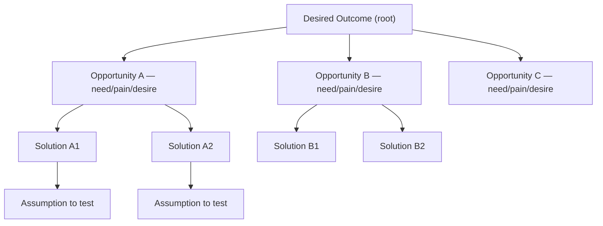

# Continuous Discovery Habits: A Comprehensive Guide for Architects

> **Author:** Jack Liu Shurui | **Role:** Solution Architect, Cymbal Bank
> **Tags:** product-management, product-discovery, continuous-discovery, opportunity-solution-tree, customer-interviews, outcomes, agile, banking
> **Series:** Professional Development — Product Series — complements *Product Management Guide*, *Product Thinking Guide*, *Project Management Methodologies Guide*

---

## Table of Contents

1. [What Is Continuous Discovery?](#1-what-is-continuous-discovery)
2. [The Book and Its Context](#2-the-book-and-its-context)
3. [The Continuous Discovery Habits Framework](#3-the-continuous-discovery-habits-framework)
4. [The Opportunity Solution Tree](#4-the-opportunity-solution-tree)
5. [Outcome-Based Thinking](#5-outcome-based-thinking)
6. [Customer Interviews](#6-customer-interviews)
7. [Solution Testing](#7-solution-testing)
8. [Opportunity Mapping](#8-opportunity-mapping)
9. [The Weekly Decision Habit](#9-the-weekly-decision-habit)
10. [The Weekly Rhythm in Practice](#10-the-weekly-rhythm-in-practice)
11. [Continuous Discovery in Organisations](#11-continuous-discovery-in-organisations)
12. [Continuous Discovery in Banking and Enterprise](#12-continuous-discovery-in-banking-and-enterprise)
13. [Critiques and Limitations](#13-critiques-and-limitations)
14. [Relationship to Other Frameworks](#14-relationship-to-other-frameworks)
15. [Implementation Playbook: The 30-Day Plan](#15-implementation-playbook-the-30-day-plan)
16. [The Adoption Checklist](#16-the-adoption-checklist)
17. [Common Mistakes](#17-common-mistakes)
18. [Key Takeaways](#18-key-takeaways)
19. [For Architects and Tech Leaders](#19-for-architects-and-tech-leaders)
20. [Glossary](#20-glossary)
21. [References and Further Reading](#21-references-and-further-reading)

---

## 1. What Is Continuous Discovery?

Continuous discovery is Teresa Torres' structured approach to product discovery, in which **teams interview customers, test solutions, and make decisions continuously, week after week** — instead of treating discovery as a phase that precedes delivery. It is the answer to a chronic product failure mode: teams that spend months in a "discovery phase," then hand a spec to engineering and hope.

Torres defines continuous discovery as **"the ongoing habit of making small product decisions based on new information."** The three verbs matter as much as the noun: *interview* (talk to real customers), *test* (put solution ideas in front of them cheaply), and *decide* (turn what you learned into the next small commitment). Do these three things every week and discovery stops being an event and becomes a habit.

### 1.1 The Core Premise: Discovery as a Habit, Not an Event

Most organisations treat discovery as a discrete project step: research → requirements → design → build → ship. Torres inverts this. The premise of the book is that **customer needs, markets, and technology change continuously, so learning about them must be continuous too**. A six-month discovery effort produces a snapshot; a weekly discovery habit produces a living model of the customer.

The habit framing is deliberate. Habits are small, repeatable, and sustainable — they do not depend on motivation or a heroic research sprint. The book's whole design (one routine, four habits, small weekly time boxes) exists to make discovery *durable* rather than impressive.

### 1.2 Discovery vs. Delivery: The Two Tracks

| Track | Question it answers | Typical activities | Output |
|-------|--------------------|--------------------|--------|
| **Discovery** | What should we build — and why? | Interviews, solution tests, opportunity mapping, decisions | Opportunities, validated solution ideas, evidence |
| **Delivery** | How do we build and ship it? | Architecture, development, QA, release, operations | Shipped software, features, fixes |

The two tracks run **in parallel, continuously** — this is the "dual-track agile" model popularised by Marty Cagan, which Torres' method operationalises (see [14.2](#142-dual-track-agile)). Delivery never stops to wait for discovery; discovery feeds delivery with a steady stream of better-informed decisions. A common failure is running the tracks sequentially — discovery as a "phase zero" — which is exactly what continuous discovery is designed to eliminate.

### 1.3 Why It Matters for Product Teams

- **Fewer wasted builds.** Every feature built from a validated opportunity has evidence behind it.
- **Faster learning.** A weekly cadence means a team learns about customers 50 times a year, not once per project.
- **Better decisions.** Decisions are made against evidence, not opinion, seniority, or the loudest stakeholder.
- **Earlier risk reduction.** The riskiest assumptions are tested with the cheapest methods, weeks before any code is written.

---

## 2. The Book and Its Context

### 2.1 The Book

**Title:** *Continuous Discovery Habits: Discover Products that Create Value and Sustainable Growth*
**Author:** Teresa Torres — product discovery coach, consultant, and founder of Product Talk (producttalk.org), the blog, podcast, and workshop practice behind the method.
**Publisher / Year:** Product Talk LLC, May 2021.

The book is a practical field manual, not a theory text. Every chapter ends with exercises; every habit comes with a "how to start small" section. It grew out of Torres' years of coaching product teams at companies ranging from startups to Fortune 500s, and from her popular "Thinking About" essay series on Product Talk.

### 2.2 Who It Is For

- **Product managers** who own the "what" and "why" (see *[product_management_guide.md](product_management_guide.md)* for the PM role).
- **Product designers** who want research woven into the week rather than bolted on.
- **Engineers and architects** who are tired of building features nobody asked for, and who want a seat at the "what to build" table.
- **Tech leaders** who want their organisations to move from opinion-driven to evidence-driven product decisions.

### 2.3 The Three Pillars Underpinning the Method

Torres builds the method on three pillars, stated early in the book:

1. **Identify the highest-risk assumptions.** Every solution idea rests on assumptions (customers want it, they can use it, it will move the outcome, it's feasible). The team names the riskiest ones first.
2. **Test them using the cheapest method.** Don't build a product to test a product idea — use a fake door, a storyboard, a concierge test. Cheapest method that yields a trustworthy signal.
3. **Run frequent, small experiments.** Small, weekly experiments compound; large, occasional ones don't.

These pillars reappear throughout this guide — the opportunity solution tree ([Section 4](#4-the-opportunity-solution-tree)) makes the assumptions visible, and solution testing ([Section 7](#7-solution-testing)) is the pillar in action.

## 3. The Continuous Discovery Habits Framework

### 3.1 The One Weekly Routine

The book's central operating model is a **simple weekly cadence**: one day for customer interviews, one day for testing solution ideas, one day for deciding. Torres proposes a concrete anchor:

| Day | Habit | Time box |
|-----|-------|----------|
| **Tuesday** | Talk to customers (interviews) | 1–2 hours |
| **Wednesday** | Test solution ideas | 1–2 hours |
| **Thursday** | Decide (weekly decision meeting) | 30–60 minutes |

The exact days are a suggestion — what matters is that the routine is **fixed, small, and sustainable**. Torres is explicit that the time boxes should stay small: a discovery habit that needs four hours a day will die in a month. One to two hours per habit, every week, is enough to compound.

This is a *weekly discovery sprint* — a miniature, low-ceremony sprint that runs in parallel with the delivery sprint. Where a delivery sprint produces working software, a discovery sprint produces **evidence and decisions**.

### 3.2 The Four Habits

Torres distils the routine into four habits that, together, make discovery continuous:

1. **Interview customers every week.** The keystone habit. At least 3–5 interviews per week, conducted by the whole team ([Section 6](#6-customer-interviews)).
2. **Test solution ideas every week.** Take the riskiest solution ideas from the tree and test them with the cheapest method that yields a signal ([Section 7](#7-solution-testing)).
3. **Map the opportunity space.** Keep the opportunity solution tree current — add opportunities heard in interviews, retire solved ones, reorganise as understanding grows ([Section 4](#4-the-opportunity-solution-tree)).
4. **Share findings with the team.** The weekly decision meeting reviews the week's evidence so everyone decides from the same information ([Section 9](#9-the-weekly-decision-habit)).

The four habits are interlocking: interviews feed the tree (habit 3), the tree identifies what to test (habit 2), tests produce evidence, and the sharing meeting (habit 4) converts evidence into decisions that steer the next week's interviews and tests.

### 3.3 Why "Small and Consistent" Beats "Big and Occasional"

- A team that interviews 4 customers weekly sees ~200 customer conversations a year.
- A team that runs a quarterly research sprint sees 20–40 conversations a year.
- Small weekly experiments keep the cost of being wrong low: a bad idea dies after one cheap test, not after a quarter of discovery theatre.
- Consistency builds skill: interviewers improve week over week, and the team builds a shared habit of evidence-based reasoning.

The design principle throughout the book is **sustainability over intensity**. Discovery must survive a busy quarter, a reorganisation, and a leadership change — only a small, habitual practice can.

---

## 4. The Opportunity Solution Tree

### 4.1 The Core Artifact

The **opportunity solution tree (OST)** is the visual backbone of continuous discovery. It is a living diagram that connects *why* the team is working (the outcome) to *what* it might do (solutions), through *what customers need* (opportunities). Torres: "The opportunity solution tree helps us visualise the connections between our desired outcome, the opportunities we've identified, the solutions we're considering, and the assumptions we hold."

### 4.2 The Structure

```
                ┌─────────────────────────────────────┐
                │        DESIRED OUTCOME (root)       │
                │   e.g. Increase % of new clients    │
                │   who complete onboarding in 24h    │
                └─────────────────────────────────────┘
                                │
        ┌───────────────────────┼───────────────────────┐
        ▼                       ▼                       ▼
┌───────────────┐      ┌─────────────────┐      ┌─────────────────┐
│ OPPORTUNITY A │      │  OPPORTUNITY B  │      │  OPPORTUNITY C  │
│ (branches —   │      │  (customer      │      │  (customer      │
│  needs, pains,│      │   needs/pains/  │      │   needs/pains/  │
│  desires)     │      │   desires)      │      │   desires)      │
└───────────────┘      └─────────────────┘      └─────────────────┘
        │                       │
   ┌────┴────┐             ┌────┴────┐
   ▼         ▼             ▼         ▼
┌───────┐ ┌───────┐   ┌───────┐ ┌───────┐
│ SOLN  │ │ SOLN  │   │ SOLN  │ │ SOLN  │   ← possible solutions (leaves)
│  A1   │ │  A2   │   │  B1   │ │  B2   │
└───────┘ └───────┘   └───────┘ └───────┘
   │          │
   ▼          ▼
┌────────┐ ┌────────┐
│ASSUMP- │ │ASSUMP- │  ← assumptions to test beneath
│TION A1 │ │TION A2 │     each solution
└────────┘ └────────┘
```

In mermaid:



### 4.3 How It Works

1. **Start from the desired outcome.** The root is a measurable change in customer behaviour ([Section 5](#5-outcome-based-thinking)). If the tree has no outcome at the top, the team cannot tell a good branch from a bad one.
2. **Identify the opportunities.** For each outcome, list the customer needs, pains, and desires that, if addressed, would move the outcome. Opportunities come from interviews — not from ideation in a conference room.
3. **Generate solutions per opportunity.** For the opportunities the team chooses to pursue, brainstorm *several* possible solutions. One opportunity usually has many possible answers.
4. **Expose assumptions and test.** Beneath each solution sit the assumptions it depends on ("customers will trust this", "this is technically feasible"). The riskiest assumptions become the next week's tests.

The tree is a **living artifact** — it changes every week as interviews surface new opportunities and tests validate or kill solutions. A tree that hasn't changed in a month is a tree nobody is maintaining (see "tree rot" in [Section 17](#17-common-mistakes)).

### 4.4 Opportunities vs. Solutions — the Crucial Distinction

| | Opportunities | Solutions |
|--|---------------|-----------|
| **What they are** | Customer needs, problems, pains, desires | Specific product answers to an opportunity |
| **Stability** | Stable — they persist across products and competitors | Changeable — many possible solutions per opportunity |
| **Reusability** | Reusable across products and initiatives | Tied to one product decision |
| **Example** | "I need to confirm a payment was received before I move money on" | "Push notification", "dashboard status tile", "SMS alert" |
| **Where they live** | Problem space (opportunity space) | Solution space |

The **common mistake** is jumping to solutions before understanding the opportunities underneath them. A customer says "I want a dashboard" — that is a solution; the opportunity might be "I need to trust that my money arrived". If the team builds the dashboard without mapping the opportunity, it may solve the wrong problem, or fix a need customers don't actually have. Torres' discipline: **capture the opportunity behind every solution request**, then decide whether the requested solution is the best answer.

### 4.5 The Opportunity Space vs. the Solution Space

- **Opportunity space** = the problem space: all the needs, pains, and desires relevant to the desired outcome.
- **Solution space** = the answer space: features, products, integrations, process changes.

Torres is explicit: **map the problem space before exploring the solution space.** Teams that do the reverse end up with a solution-shaped backlog and no way to know whether any of it matters. The tree literally enforces the order — opportunities sit above solutions, so a solution cannot enter the tree without an opportunity to hang from.

### 4.6 A Worked Example: An Onboarding Tree

To make the structure concrete, here is a simplified tree for a corporate banking onboarding outcome:

```
DESIRED OUTCOME: Increase % of new corporate clients who complete
                 their first trade within 30 days of account opening
    |
    +-- Opportunity: "I need to know what documents are still missing
    |    so I can complete the onboarding pack"   (heard in 6 interviews)
    |      +-- Solution A1: Client portal status checklist
    |      +-- Solution A2: Email reminders with a missing-docs summary
    |      +-- Solution A3: RM-assisted document walkthrough
    |            +-- Assumption: RM capacity can absorb the demand
    |
    +-- Opportunity: "I need to confirm my account is active
    |    so I can fund it without calling anyone"
    |      +-- Solution B1: In-app "account active" notification
    |
    +-- Opportunity: "I need to place my first trade without
         re-entering data I already provided during onboarding"
           +-- Solution C1: Pre-filled booking from onboarding data
                 +-- Assumption: client data quality is high enough to pre-fill
```

Reading the tree: opportunity A has three candidate solutions (A1-A3) whose riskiest assumption is about RM capacity; opportunity B has one; opportunity C's solution depends on a data-quality assumption. Next week's tests: a fake door on A1 and a storyboard on C1 — the two riskiest assumptions on the tree. This is the whole method in miniature: outcome on top, opportunities from interviews, solutions per opportunity, assumptions tested, weekly.


## 5. Outcome-Based Thinking

### 5.1 Outcomes vs. Outputs vs. Inputs

Continuous discovery is built on a rigorous vocabulary, because sloppy vocabulary produces sloppy decisions:

| Level | Definition | Example | Who controls it |
|-------|-----------|---------|-----------------|
| **Outcome** | A measurable **change in customer behaviour** that delivers value | "Increase the % of new clients who complete onboarding in 24 hours" | The team, indirectly — through the product |
| **Output** | What the team **ships**: features, releases, code | "Launch the onboarding checklist", "Ship the mobile app" | The team, directly |
| **Input** | The **resources** invested: people, time, budget | "Three engineers for two quarters", "$200k" | The organisation |

The principle — **outcomes over outputs** — is the same one that anchors the *[product_management_guide.md](product_management_guide.md)*: shipping features is not success; changing customer behaviour in the intended direction is. A team that shipped everything on the roadmap and moved no metric has delivered output without outcome. Torres' method is designed so the tree's root makes the outcome the unit of accountability.

### 5.2 The Desired Outcome Definition

A desired outcome, in Torres' terms, is:

- **Measurable** — expressible as a metric with a direction ("increase", "decrease") and a population ("new clients", "monthly active users").
- **Behaviour-based** — it describes what customers *do* (complete, adopt, return, refer), not what they *feel* (satisfaction, happiness) and not what the company ships.
- **Not a vanity metric** — "5,000 downloads" is vanity if nothing about customer behaviour changed; "40% of new clients reach their first completed trade within a week" is a behaviour.
- **Within the team's influence** — the team can act on it, even if other factors also move it.

Good examples: "increase the percentage of corporate clients who place their second trade within 30 days"; "reduce the time a relationship manager spends on KYC re-entry per client"; "increase weekly active usage of the client portal among front-office users". Weak examples: "improve user satisfaction" (not measurable as behaviour), "launch 12 features" (an output), "become the leading digital bank" (a vision, not a weekly tree root).

### 5.3 The Measurable Outcome as the Tree's Root

The desired outcome sits at the **top of the opportunity solution tree** for a reason: every opportunity branch must justify itself by plausibly moving the outcome, and every solution leaf must justify itself by addressing an opportunity. If an opportunity doesn't connect to the outcome, it doesn't belong on this tree (it may belong on another tree with a different root). This gives the team a testable chain: **outcome → opportunity → solution → assumption**, where each link is explicit and each can be questioned.

Teams typically have **one tree per desired outcome** — not one tree for the whole product. A product with three strategic outcomes has three trees, each a focused map of one outcome's opportunity space.

### 5.4 Choosing the Outcome: Who Decides?

The desired outcome is usually set by product leadership in dialogue with the team — it is a *strategy* decision, informed by business goals, OKRs, and market context (see [14.6](#146-okrs-and-outcome-metrics)). The team owns the tree beneath it: which opportunities to pursue and which solutions to try. This split is healthy — it keeps strategy at the top while keeping discovery autonomy at the branch level. Torres' rule of thumb: the outcome should be **stable enough to orient the team for a quarter or more**, while the opportunities and solutions beneath it churn weekly.

---

## 6. Customer Interviews

### 6.1 The Keystone Habit

Interviewing customers weekly is the keystone habit of continuous discovery — the one that makes all the others possible. Torres: "Continuous interviewing is a keystone habit for continuous discovery." Without a steady stream of customer conversations, the tree dries up, testing loses its target, and decisions revert to opinion.

**Cadence:** 3–5 interviews per week is the recommended minimum; one interview per day is the ideal the book pushes teams toward. The interviews are short — **15–30 minutes** — and semi-structured: the interviewer has a topic and a question bank, but follows the customer's story wherever it leads.

### 6.2 The Interview Rules

Torres' interviewing rules are strict because unstructured "chat with users" produces confident, useless anecdotes:

1. **Ask about past behaviour, not future intentions.** "Tell me about the last time you did X" beats "What would you do if...". People are unreliable predictors of their future selves but reliable reporters of what they actually did.
2. **No leading questions.** "Did you find the form frustrating?" invites agreement. "Walk me through what happened when you filled in the form" invites truth.
3. **No pitching.** The interview is for learning, not for selling the product. If the customer asks about the product, answer briefly and return to their story.
4. **One question at a time.** Compound questions ("did you try X and did it work?") produce mush.
5. **Listen more than you talk.** Roughly 80/20 in the customer's favour.
6. **Follow up on the unexpected.** "Why was that hard?", "What did you do then?", "Tell me more about that" — the richest material is in the tangents.
7. **Interview in context when possible.** Watching someone do the task (or interviewing right after they did) beats a decontextualised chat.
8. **Stop when you stop learning.** An interview that adds no new information is done; don't pad for the clock.

### 6.3 The 7 Interview Questions

Torres' framework organises questions into **opening questions** (context and rapport) and **story-based questions** (the customer's lived experience of the behaviour in question). A consolidated 7-question bank built from the book's guidance:

| # | Question | Type | Purpose |
|---|----------|------|---------|
| 1 | "Tell me a little about yourself and your role — how long have you been doing this?" | Opening | Context, rapport, calibrate who you're talking to |
| 2 | "Can you walk me through a typical day (or week) in your role?" | Opening | Understand the environment the behaviour lives in |
| 3 | "When was the last time you [behaviour — e.g. checked a payment status]?" | Transition | Anchor the conversation in a real, recent event |
| 4 | "Walk me through that experience step by step — what happened from the moment you started?" | Story | Reconstruct the actual sequence of events |
| 5 | "What was the hardest part?" | Story | Surface the pain points in the sequence |
| 6 | "Why was that hard? / What did you do about it?" | Story | Get to the root cause and any workarounds |
| 7 | "Was it worth the effort? / What have you already tried — and what do you love or hate about it?" | Story | Understand the value of solving it and the incumbent alternatives |

Questions 1–2 are opening questions; 3 is the transition; 4–7 are story-based. The interviewer's job is to stay on the story and dig where it hurts — the *hardest part* and *why* are where opportunities hide. Torres is clear that the question bank is a scaffold, not a script: one question at a time, follow the customer, and never read from a list.

### 6.4 Interview Best Practices

- **Recruit from your own users *and* potential users.** Existing users tell you what's broken in what you have; non-users and lapsed users tell you why people don't start or stay. Both feed the tree.
- **Schedule 3–5 per week, always.** Use scheduling tools so interviews are booked ahead; treat the slot as non-negotiable (see [10.1](#101-the-weekly-rhythm-in-a-team)).
- **Take notes with a template.** A simple template — customer segment, the story, pains, opportunities heard, surprises — makes synthesis possible. Record audio/video *with consent* when useful, but never rely on transcripts alone; the notes are what get shared.
- **Interview as a team.** Rotate interviewers; have a second person take notes so the interviewer can fully listen (see [10.3](#103-discovery-is-a-team-sport)).
- **Capture opportunities, not just quotes.** After each interview, the team extracts candidate opportunity statements and adds them to the tree — that is how interviews change the map.

### 6.5 The Habit in the Weekly Routine

Interviews happen on the interview day (e.g. Tuesday) but the habit is bigger than that day: recruiting happens continuously (a small pipeline of willing customers), notes are synthesised the same day, and the candidate opportunities are added to the tree before the week's decision meeting. The interview day is the fuel; the rest of the week is where the fuel gets burned.

## 7. Solution Testing

### 7.1 Test Ideas, Not Products

The central insight of Torres' testing approach: **you can test a solution idea before building the product** — and you usually should. A solution is an hypothesis ("if we let clients confirm payments via push notification, more will confirm within the hour"); an hypothesis can be tested with a fake door, a storyboard, or a concierge service long before a single line of production code exists. The book's rule of thumb: test the riskiest assumptions with the cheapest method that yields a trustworthy signal (pillar 2 from [2.3](#23-the-three-pillars-underpinning-the-method)).

### 7.2 The Testing Continuum (Cheap → Expensive)

Testing methods form a spectrum from cheap-and-imprecise to expensive-and-real. Torres' guidance is to start cheap and only spend more when the cheaper test can no longer tell you what you need:

| Method | What it is | Fidelity | Typical signal |
|--------|-----------|----------|----------------|
| **Ask customers for feedback** | Describe the idea; get reactions | Lowest | Directional interest — weak, use only to screen ideas |
| **Fake door test** | A "Learn more" button or landing page that goes nowhere; measure clicks | Very low | Does anyone want this *at all*? |
| **Storyboard** | A short illustrated sequence showing the customer using the idea | Low | Does the story resonate? Is the scenario real? |
| **Mockup / clickable prototype** | Wireframes or high-fidelity prototype of the solution | Low–medium | Can customers use it? Do they understand it? |
| **Concierge test** | Deliver the service manually, by hand, for real customers | Medium–high | Would customers use it for real? What does the workflow require? |
| **Wizard of Oz** | The UI looks real but a human behind the scenes does the work | High | Real usage behaviour on the real interface |
| **Prototype with real backend** | Thin real implementation behind a prototype front end | High | Real behaviour with real data |
| **A/B test / beta** | Ship two variants or a real release to a segment | Highest | Quantitative proof at scale |

The principle is **escalate deliberately**: start at the cheapest method that can falsify the assumption; move to the next rung only when the current one can't. A fake door test costs a day; an A/B test costs a sprint. Don't pay for the sprint if the fake door already told you nobody cares.

### 7.3 The Testing Questions

Every solution test should answer at least one of two questions:

1. **Does the customer want it?** (Desirability) — Would they use this? Does it address a real opportunity? Do they currently work around the problem with something worse?
2. **Can they use it?** (Usability/feasibility of use) — Do they understand it? Can they complete the flow? Does it fit their workflow and environment?

Torres stresses that these map to the assumptions on the tree: a solution with an unvalidated desirability assumption needs a desirability test; a solution whose risk is in the mechanics needs a usability test. Testing the wrong question wastes the week — and testing an assumption that isn't the riskiest one wastes several.

### 7.4 The Weekly Solution-Testing Habit

- **Test 1–2 solution ideas per week.** One test per week is the sustainable floor; two is a good pace once the routine is running.
- **Always pick from the tree.** The ideas tested are the leaves of the opportunity solution tree — never random brainwaves disconnected from an opportunity.
- **Prototype fidelity: low first.** A storyboard or sketch tells you 80% of what a polished prototype tells you, at 10% of the cost. Increase fidelity only when the low-fidelity test is ambiguous.
- **Write down the assumption being tested and the decision the result will inform.** This is what turns a demo into an experiment. Without a stated assumption, a "test" is just showing off.
- **Capture the evidence on the evidence board** ([10.5](#105-the-artifacts)) — what was tested, what happened, what the team now believes.

### 7.5 Common Testing Pitfalls

- **Testing with friends of the team** — they say yes to everything. Test with real target customers.
- **Testing the solution, not the assumption** — a polished demo that impresses but answers no question.
- **Over-testing**: running an A/B test when a fake door would do. Cost should follow risk, not habit.
- **Under-testing**: never leaving the storyboard stage because "we'll validate in production" — by then the build cost is sunk.

---

## 8. Opportunity Mapping

### 8.1 Identifying Opportunities from Interviews

Opportunities are **the customer needs, pains, and desires** that, if addressed, would move the desired outcome. They surface in interviews as complaints, workarounds, delighted moments, and — most reliably — in the *hardest part* of the customer's story ([6.3](#63-the-7-interview-questions)).

Torres recommends phrasing opportunities as **opportunity statements** from the customer's perspective:

> **"I need to X so I can Y"** — e.g. "I need to confirm a payment has been received **so I can** release the goods", "I need to see my exposure in real time **so I can** stay within my limits".

The "so I can" forces the interviewer to articulate the underlying job or desire, which is what makes the opportunity *reusable* — a dozen solutions might serve "confirm payment received", but only one serves a poorly-stated "make a better payment screen".

### 8.2 Organising Opportunities: Clusters and Themes

As opportunities accumulate, they need structure:

- **Cluster related opportunities** — group statements that express the same underlying need in different words; merge duplicates.
- **Name the theme** — give each cluster a short label ("payment certainty", "onboarding friction", "limit management") so the tree stays scannable.
- **Prune ruthlessly** — opportunities that don't plausibly connect to the desired outcome move to another tree or die; the tree is a working map, not an archive.
- **Keep the customer's voice** — a cluster label is shorthand, but the opportunity statements underneath stay in the customer's words so the team never forgets whose problem it is.

### 8.3 The Opportunity Backlog vs. the Solution Backlog

Most product backlogs are **solution-focused**: "Build dashboard", "Add CSV export", "Integrate with X" — features waiting to be built. Torres' approach inverts this: keep an **opportunity backlog** first. The backlog's items are opportunities (customer needs), and solutions are generated only for the opportunities the team commits to pursuing.

| Typical solution backlog | Opportunity backlog |
|--------------------------|---------------------|
| "Add email notifications" | "I need to know when my payment is rejected" |
| "Build a reconciliation screen" | "I need to see what hasn't matched and why" |
| "Integrate with the trade booking system" | "I need to book without re-entering data I already provided" |

The opportunity backlog survives solution churn: a solution gets killed, the opportunity stays, and a better solution can be tried next quarter. It also survives reorganisation and strategy shifts better than a feature list, because needs outlive features. This is the *map the opportunity space* habit in action — the backlog and the tree are two views of the same map.

### 8.4 Map the Problem Space Before the Solution Space

The discipline bears repeating (see [4.5](#45-the-opportunity-space-vs-the-solution-space)): **explore and map the opportunity space before generating solutions**. The team that interviews first and ideates second produces solutions that answer real needs; the team that ideates first produces features in search of a problem. The weekly routine enforces this ordering naturally — Tuesday's interviews feed Wednesday's tests because the tree is always one step ahead of the solution list.

---

## 9. The Weekly Decision Habit

### 9.1 The Thursday Decision Meeting

The week's discovery work converges on a **short, regular decision meeting** (30–60 minutes, e.g. Thursday). Its agenda is constant:

1. **Review the evidence** — what the interviews surfaced (new opportunities, changed beliefs) and what the solution tests showed (validated, invalidated, ambiguous).
2. **Update the tree** — add/merge/prune opportunities, add or kill solutions, restate the riskiest assumptions.
3. **Decide what to pursue** — which opportunities get solutions next, which solutions advance to the next test, which get killed.
4. **Plan the next week** — who interviews whom, what gets tested, what decision the evidence should inform.

**A sample decision record** — what the meeting's output should look like:

| Decision | Evidence cited | Action |
|----------|---------------|--------|
| Pursue opportunity "confirm payment received" | 4 of 6 interviews named it; fake door got 22% clicks | Generate solutions; storyboard next week |
| Kill solution "email alert" | 3 prototype tests showed clients ignore it | Remove from tree; test push instead |
| Next week's plan | — | 4 interviews on payment ops; concierge test for status checks |

The record is deliberately short — its job is to make the *reasoning* visible and durable, so next quarter's team can see what was decided, why, and on what evidence.


### 9.2 Decision Criteria: Confidence and Evidence

Torres' decisions are **evidence-anchored**: the team asks "what did we learn, and what do we now believe?" before asking "what should we do?". Useful criteria:

- **Confidence in the opportunity** — how much and how consistent is the evidence that the need is real and widespread? (One vivid interview is a lead, not a finding.)
- **Evidence behind the solution** — did the cheapest test support the solution's desirability/usability assumptions?
- **Expected contribution to the outcome** — does this opportunity plausibly move the tree's root more than the alternatives?
- **Cost and risk of the next step** — what's the cheapest test that would raise confidence further?

### 9.3 Decide with the Evidence — Not with the Loudest Voice

The whole method is a stand against opinion-driven product management. "Decide with the evidence" means:

- **A decision that contradicts the evidence needs new evidence, not a louder opinion** — including the CEO's.
- **Unknowns are named** — "we don't know whether clients would trust this" is a decision input, not a gap to paper over.
- **The decision is recorded with its rationale** — so next quarter's team can see why something was killed or advanced, and can revisit it if the evidence changes.
- **Kill decisions are celebrated, not punished** — a cheap test that killed a bad idea saved the team weeks. Torres is explicit that "killing" is a success of the system, not a failure of the person.

### 9.4 The Loop Closes

The decision meeting is the gear that makes discovery *continuous*: Thursday's decisions set up Tuesday's interviews and Wednesday's tests, whose evidence feeds the next Thursday. Each week the team makes several small decisions against evidence instead of one big bet against a slide deck — and that, in Torres' framing, is the entire point.

## 10. The Weekly Rhythm in Practice

### 10.1 The Weekly Rhythm in a Team

Torres' Tuesday/Wednesday/Thursday anchor expands into a full-week rhythm when a team operationalises it:

| Day | Focus | Activities |
|-----|-------|-----------|
| **Monday** | Review & plan | Look at last week's evidence, decide this week's interview targets and test candidates, book the interviews |
| **Tuesday** | Customer interviews | 3–5 interviews, notes taken, candidate opportunities extracted |
| **Wednesday** | Solution testing | Run the week's test(s) — fake door, storyboard, prototype, concierge |
| **Thursday** | Decide & share | Decision meeting: review evidence, update the tree, decide, plan next week |
| **Friday** | Synthesis & documentation | Update the tree and evidence board, write up findings, keep the discovery wiki current |

Not every team follows this exact shape — the point is the **weekly loop**: plan → learn → test → decide → document, every week, without exception. The discovery work is deliberately small (a few hours per week per habit) so it can coexist with a full delivery workload.

### 10.2 How the Team Participates

**The whole team participates in discovery — not just the PM.** Engineers, designers, and PMs all interview customers and all run or observe solution tests. This is deliberate:

- **Engineers** hear customer pain first-hand instead of through a third-hand spec; they spot feasibility issues *during* interviews and tests, and their solutions are grounded in what they heard.
- **Designers** bring the interview material straight into prototyping and usability testing; their craft improves because they know the customer.
- **PMs** don't become the sole bottleneck of customer knowledge — the "voice of the customer" stops being one person's job.
- **Architects** (see [12.3](#123-the-architects-role-in-discovery)) hear the business reality that shapes technical strategy.

### 10.3 Discovery Is a Team Sport

Torres is emphatic: discovery is a **team sport**, not a PM speciality. The practical mechanics:

- **Rotate interviewers** so everyone builds the skill; a second person takes notes while the interviewer listens.
- **Everyone attends (or reads the notes from) the decision meeting** — decisions made without the team are decisions the team won't own.
- **Pair engineers with designers on solution tests** — testing a prototype is more informative when the people who would build it watch how customers react to it.
- **Protect the routine together** — when a busy week threatens Tuesday's interviews, the team (not just the PM) defends the slot.

### 10.4 The Artifacts

Continuous discovery runs on a small set of living artifacts:

| Artifact | What it is | Where it lives |
|----------|-----------|----------------|
| **Opportunity solution tree** | The living map: outcome → opportunities → solutions → assumptions | Miro/Mural board, one per desired outcome |
| **Interview notes** | Structured notes per interview (template: segment, story, pains, opportunities, surprises) | Notes tool / wiki |
| **Evidence board** | The team's evidence wall: what was tested, what happened, what the team now believes | Kanban-style board (or a section of the wiki) |
| **Discovery wiki** | Notes, findings, decisions — the accumulated learning record | Wiki / shared drive |

### 10.5 The Evidence Board

The **evidence board** is Torres' answer to "what did we actually learn?". It is a running, visible record — often a kanban-style board — where each piece of evidence (interview finding, test result, data point) is captured and connected to the decision it informed. Columns typically include: *evidence* (what we learned), *source* (interview #, test, analytics), *belief it changed*, *decision it informed*. The board makes the team's reasoning auditable: a stakeholder who asks "why are you building this?" gets pointed at the board, not at a personality.

### 10.6 The Kickoff Workshop

Before the weekly routine starts, Torres recommends running a **discovery workshop** to map the first tree:

1. **Assemble the cross-functional team** (PM, designer, engineers, architect, a stakeholder).
2. **Agree the desired outcome** — the tree's root, phrased as a measurable behaviour change.
3. **Generate the opportunity space** — from existing research, support tickets, sales calls, and the team's own knowledge; capture them as customer-voice statements.
4. **Select the top opportunities** to pursue first (by evidence strength and expected impact).
5. **Generate 2–4 solutions per selected opportunity** — divergent first, then shortlist.
6. **Name the riskiest assumptions** per shortlisted solution and **plan the first week's tests** — usually the cheapest methods on the continuum.

The workshop produces the skeleton; the weekly routine keeps it alive. Torres' workshops are also how she onboards whole teams — the tree they draw together becomes the shared map they maintain.

### 10.7 Tools of the Trade

- **Tree mapping:** Miro, Mural, or any whiteboard tool that supports sticky notes and connectors (the tree is a sticky-note structure before anything else).
- **Interview scheduling:** Calendly-style booking links so recruiting and scheduling don't become a tax.
- **Note-taking:** Notion, Google Docs, Confluence — a template per interview, tagged by customer segment and tree.
- **Testing:** Figma (prototypes), UsabilityHub (cheap usability tests), landing-page builders (fake doors), or simply paper storyboards.
- **Product Talk resources:** producttalk.org publishes the method's templates — interview question guides, workshop agendas, tree templates — the book points readers there throughout. Torres also runs a popular podcast and the "Thinking About" essay series that deepens the book's ideas.

---

## 11. Continuous Discovery in Organisations

### 11.1 The Conditions Needed

Continuous discovery is a team practice that lives or dies by organisational conditions:

- **Leadership support** — managers must protect discovery time, reward learning (including kills), and resist demanding certainty from a learning process ([11.4](#114-stakeholder-expectations-executives-want-certainty)).
- **Time for discovery** — the weekly time boxes must be as sacred as sprint commitments; if discovery is the first thing cancelled, it isn't a habit, it's an aspiration.
- **Customer access** — teams need a recruiting pipeline: existing users, trial users, lapsed users, prospects. In B2B, that often means a sales or relationship team that will make introductions.
- **A discovery culture** — psychological safety to say "the evidence says no", tolerance for ambiguity, and celebration of cheap failures.

### 11.2 The Feature Factory — the Anti-Pattern

The **feature factory** is the organisation (or team) that does nothing but ship features: intake → estimate → build → release, endlessly, with no discovery and no measurement of outcome. Marty Cagan and John Cutler popularised the term for organisations that treat product work as a production line of outputs. In a feature factory:

- Roadmaps are feature lists; success is "shipped on time".
- Customer contact is rare and delegated to sales or support.
- Nobody can say what behaviour changed as a result of the last release.
- Teams are judged on velocity, not value.

Continuous discovery is the direct antidote — and Torres is explicit that the method cannot take root inside a feature factory without changing the factory's measures of success first.

### 11.3 Discovery Theatre — the Second Anti-Pattern

**Discovery theatre** is discovery in name only: interviews are conducted but no learning changes anything; prototypes are tested but the decision was made before the test; the tree is drawn for a presentation and never touched again. Symptoms:

- Interviews are scheduled but findings are never shared or acted on.
- Solution tests happen *after* the build decision, to confirm it.
- The tree is static for months ("tree rot", [17.5](#175-tree-rot-the-tree-not-updated)).
- Research reports pile up in a drive nobody reads.

Theatre is more corrosive than no discovery at all, because it consumes the time and goodwill that real discovery needs. The guard against it is structural: the weekly decision meeting (decisions must cite evidence), the evidence board (learning must be visible), and leadership that asks "what did you learn and what did you change?" instead of "what did you ship?".

### 11.4 Stakeholder Expectations: Executives Want Certainty

Executives are paid to be certain — and discovery produces learning, which is by definition uncertain. The tension is real and needs managing:

- **Educate stakeholders** on the difference between an evidence-backed recommendation and a guarantee. The tree gives stakeholders a map of *what is known and what is assumed* — which is more honest, and usually more persuasive, than a confident feature list.
- **Frame discovery as risk reduction.** A stakeholder who wants certainty should hear: "we tested the riskiest assumptions with customers before committing the build — here's what we now know, and here's what we still don't".
- **Bring the evidence, not the opinion.** When a PM walks into a steering committee with an evidence board instead of a slide deck, the conversation changes from negotiation to reasoning.
- **Set the expectation that the roadmap will change.** A date-driven roadmap ([11.5](#115-metrics-and-evidence-based-roadmaps)) is a promise that learning will stop; stakeholders must accept the roadmap as a hypothesis to be updated.

### 11.5 Sales-Driven vs. Discovery-Driven Roadmaps

- **Sales-driven roadmap:** the biggest deal in the pipeline dictates the backlog. Features are promises made to win contracts; the product becomes a patchwork of one-off commitments with no coherent strategy. (Enterprise architects know this pattern well — see [12.2](#122-the-enterprise-discovery-reality).)
- **Discovery-driven roadmap:** commitments are made to *outcomes* and opportunities, and features follow evidence. Sales input still matters — it is a rich source of opportunities — but it enters through the tree, translated into customer needs and tested like everything else.

The shift is not "ignore sales" but "stop letting unvalidated requests skip the queue". A sales-requested feature that maps to a strong, evidence-backed opportunity gets built *faster* because it arrives with a map and a plan.

### 11.6 Metrics and Evidence-Based Roadmaps

The alternative to the date-driven roadmap (features on a timeline) is an **evidence-based roadmap**: a map of outcomes and opportunities, with dates attached only to delivery commitments the team has evidence to support. The roadmap communicates *direction* (the tree's outcome), *current bets* (the opportunities being pursued), and *confidence* (what's been tested). This is the roadmap format that survives contact with continuous discovery — the tree becomes the roadmap, and the roadmap becomes a living document.

---

## 12. Continuous Discovery in Banking and Enterprise

### 12.1 The Regulatory and Process Constraints

Applying continuous discovery in a bank means running a customer-centred learning loop inside a heavily governed delivery machine. The constraints are real (see the *[project_management_methodologies_guide.md](project_management_methodologies_guide.md)* for the full banking SDLC picture):

- **Compliance gates** — requirements, design, and change approvals can't be skipped for speed; a solution tested on Tuesday cannot be silently shipped on Friday.
- **Architecture review** — changes to platforms and integrations need architectural sign-off, which adds lead time to every solution path.
- **Change management** — production changes follow RFC/change-window processes; discovery experiments must be designed to fit inside or alongside them.
- **Data and privacy** — interviewing clients and observing their behaviour raises confidentiality and data-protection considerations; consent and anonymisation are non-negotiable.

None of these forbid continuous discovery — but they change its *shape*: tests must be designed with compliance in mind (e.g. fake doors on a sandbox, interviews under non-disclosure, prototypes that never touch real data), and the discovery loop must feed the governance gates earlier, not later. A solution that fails architecture review in week 12 is a discovery failure — the architect should have been in the loop in week 2.

### 12.2 The Enterprise Discovery Reality

Enterprise and B2B discovery faces structural differences from consumer discovery:

- **Longer sales cycles** — weeks to months between first contact and contract; the "customer" is often several stakeholders with different needs (see the *[sales_methodology_frameworks_guide.md](sales_methodology_frameworks_guide.md)* for the sales-cycle reality).
- **Fewer, bigger customers** — a bank's client book is small relative to a consumer app's user base; 3–5 interviews a week may mean covering a meaningful fraction of the addressable market (which is both a challenge and an opportunity — see [13.2](#132-harder-in-b2b-enterprise-regulated)).
- **Stakeholder complexity** — users (traders, ops, RM) are not buyers (Treasury, IT, procurement) are not approvers (compliance, risk, audit). Discovery must interview across these layers to understand the full opportunity space.
- **Access friction** — client-facing teams protect relationships; getting an interview requires building trusted channels through RMs and sales, and treating the client's time as a scarce resource.

The method survives this, but the recruiting pipeline becomes a first-class workstream, and interviews skew toward *users inside the client organisation* rather than end consumers.

### 12.3 The Architect's Role in Discovery

For a solution architect, continuous discovery is not a PM ritual to observe from the sidelines — it is a source of the most valuable input the architect can get: the actual problem. Concretely:

- **Participate in interviews.** Hearing a client describe their workflow (and their workarounds) reveals requirements no requirements document will ever contain — the *why* behind the *what*. It also builds the architect's credibility with the product team.
- **Map opportunities to architecture.** Each opportunity implies architectural questions: what data would this need? which systems would it touch? does the current platform support it? The architect's job is to translate the opportunity space into the *capability space* (see the *[product_thinking_guide.md](product_thinking_guide.md)* for architect-product collaboration).
- **Contribute feasibility assumptions to the tree.** Under each solution, the riskiest assumption is often technical: "our core system can expose this in near-real-time", "the integration is feasible within our security model". The architect names these assumptions early so they get tested early.
- **Protect the architecture runway** (see the *[scaled_agile_framework_guide.md](scaled_agile_framework_guide.md)* for the runway concept): continuous discovery produces a stream of solution candidates; the architecture must keep enough runway for the promising ones to land without a re-platforming panic.

### 12.4 Technical Feasibility Testing in Discovery

Discovery tests aren't only for desirability and usability — **feasibility is an assumption too**, and it belongs in the weekly loop:

- **The "spike" concept** — a time-boxed technical investigation to retire a feasibility assumption: can we expose this data? can we hit this latency? can we integrate with this system under our security constraints? Spikes are the engineering counterpart of fake doors: cheap experiments that falsify an assumption before a commitment.
- **Test with architects early.** When the tree shows a solution whose riskiest assumption is technical, the test should be a spike or an architecture review — not a customer storyboard.
- **Feed results back into the tree.** A feasibility failure kills the solution leaf (or forces a different solution for the same opportunity), and the learning updates the architecture roadmap.

This is the "agile-inside, governance-outside" balance described in the *[project_management_methodologies_guide.md](project_management_methodologies_guide.md)*: inside the team, discovery stays fast and cheap; outside, the formal gates (compliance, architecture, change) wrap the decisions that leave the team.

### 12.5 The Balance: Continuous Discovery Within the Governance Wrapper

The realistic banking model is **continuous discovery inside, disciplined governance outside**:

- The team runs the weekly loop freely on *learning* activities (interviews, prototypes, spikes, fake doors in sandboxes) — these carry low risk and need no formal gates.
- The moment a solution graduates from tested idea to build commitment, it enters the standard SDLC gates — architecture review, compliance assessment, change management — with the discovery evidence attached as the justification.
- The discovery evidence makes the gates *easier*, not harder: a feature backed by interview findings, tested prototypes, and a feasibility spike is a much simpler architecture review than a feature justified by "the client asked for it".

The governance wrapper doesn't slow discovery down; it catches the few decisions that deserve formal scrutiny — which is exactly what it's for.

## 13. Critiques and Limitations

### 13.1 The Method's Assumptions

Continuous discovery is not a magic process — it runs on assumptions that are themselves worth testing before adopting it:

- **Time.** The weekly routine needs a few protected hours per person per week. Teams already at capacity will quietly drop it.
- **Customer access.** 3–5 interviews a week requires a pipeline of willing customers. Organisations with no direct customer relationship (resellers, platforms, highly regulated intermediaries) struggle to build one.
- **Team buy-in.** The method only works if the whole team participates — a PM running interviews alone while engineers build from a spec is Torres' method in name only.
- **A culture that tolerates ambiguity.** The method's output is learning and small decisions, not a committed feature list. In organisations that demand up-front certainty, the method chafes (see [11.4](#114-stakeholder-expectations-executives-want-certainty)).

### 13.2 The Honest Critique

- **Hard in B2B / enterprise with few customers or long sales cycles.** When your "market" is 200 clients and each interview requires weeks of relationship management, 3–5 interviews a week is a very different ask than in a consumer app. The method still works, but the recruiting pipeline dominates and the cadence may be measured in months, not weeks.
- **Interview quality dependency.** The value of an interview is bounded by the interviewer's skill. Bad interviews — leading questions, pitching, asking about hypothetical futures — produce confident nonsense, and the weekly routine industrialises the nonsense. Torres' rules ([6.2](#62-the-interview-rules)) mitigate this, but only with practice and feedback.
- **Small-sample risk.** Three to five interviews a week is **qualitative research, not a statistical sample**. A vivid story from two customers is a hypothesis, not a proof of demand. The critique "interviews don't prove demand" is correct as far as it goes — which is why Torres pairs interviews with tests and urges quantitative confirmation before big bets (below).
- **Theatre risk.** In the wrong organisation the ritual survives while the learning dies (discovery theatre, [11.3](#113-discovery-theatre--the-second-anti-pattern)).

### 13.3 Balancing Qualitative with Quantitative Evidence

The strongest teams treat the method as one half of an evidence system:

- **Qualitative (interviews, tests) for direction** — what to explore, why, what customers say and do in small numbers. Cheap, fast, rich.
- **Quantitative (analytics, A/B tests, experiments) for confirmation** — does the behaviour change at scale? Is the effect real or anecdote? Expensive, slow, rigorous.

Concrete pairings: interview findings generate the hypothesis → an A/B test (or a *[multi_armed_bandit_guide.md](multi_armed_bandit_guide.md)* adaptive experiment) confirms it on real traffic; a *[customer_lifetime_value_prediction.md](customer_lifetime_value_prediction.md)* model tells the team which customer segments' behaviour is worth chasing in the first place. Torres herself is clear that interviews surface *what to test*; they don't replace measurement. The discipline is: **use qualitative to find the question, quantitative to answer it** — and never skip the question-finding step because the numbers are easier.

### 13.4 When It Works Best — and Where It's Harder

| Context | Fit | Why |
|---------|-----|-----|
| Product teams with direct user access | Strong | Users are reachable; weekly interviews are easy; feedback loops are short |
| SaaS and consumer apps | Strong | Large user bases, analytics, A/B infrastructure, fast shipping |
| Internal tools / employee-facing products | Strong | "Customers" are colleagues; access and consent are simple |
| Enterprise / B2B with long sales cycles | Moderate | Fewer customers, slower access — adapt cadence, invest in recruiting |
| Regulated industries (banking, health) | Moderate | Governance gates slow the test-to-ship path, but discovery itself is compatible (see [12](#12-continuous-discovery-in-banking-and-enterprise)) |
| Hardware / physical products | Harder | Can't fake-door a physical device; prototypes are expensive; cycle times are long — discovery shifts to pre-PCB validation and staged pilots |

The honest summary: continuous discovery is a **fit for teams that can talk to users every week and ship quickly**; it needs adaptation — not abandonment — elsewhere.

### 13.5 Adapting the Cadence for Enterprise and Regulated Teams

When weekly interviews are impractical, adapt the routine without abandoning it:

| Standard cadence | Enterprise / regulated adaptation |
|------------------|-----------------------------------|
| 3-5 interviews weekly | 3-5 interviews per two-week cycle; 1-2 per week when access allows |
| 1-2 tests weekly | 1 test per cycle; combine with feasibility spikes so technical risk is covered in the same week |
| Thursday decision meeting | Decision meeting each cycle, aligned to the team's sprint boundaries |
| Recruiting via the product | Recruiting via RMs and sales as a standing workstream; client visits double as interviews |

The invariant is not the calendar — it is the loop: **learn something, test something, decide something, document it**, on a rhythm the team can actually sustain. A slower, honest cadence beats a weekly ritual that collapses in month two.


---

## 14. Relationship to Other Frameworks

### 14.1 Continuous Discovery + Agile (Scrum / SAFe)

Discovery and agile delivery are complementary, not competing. In Scrum, the discovery work slots naturally into **backlog refinement and sprint planning**: interview findings and test results feed story-writing and prioritisation, and the weekly decision meeting can sit alongside refinement. In SAFe, discovery aligns with **continuous exploration** and feeds program increment planning — the tree's opportunities become the epics and features of the PI plan. The method gives agile ceremonies something they chronically lack: evidence about *what* to build, as opposed to process for *how* to build it (see the *[scaled_agile_framework_guide.md](scaled_agile_framework_guide.md)*).

### 14.2 Dual-Track Agile

**Dual-track agile** (popularised by Marty Cagan) runs discovery and delivery as two parallel tracks: the discovery track produces validated ideas; the delivery track turns them into software. Torres' method is essentially a detailed operating manual for the discovery track — weekly cadence, tree, tests, decisions — designed to feed the delivery track without blocking it. Teams already "doing dual-track" often find Torres' contribution is the *habit structure* that makes the discovery track actually run.

### 14.3 Continuous Discovery + Lean Startup

Lean Startup's **build-measure-learn** loop is about the fastest path to validated learning; continuous discovery is about learning *before* building. They are complementary: discovery habits are the "learn" side taken seriously (interviews and cheap tests instead of shipping an MVP to learn), and Lean Startup's experiments and metrics are the quantitative confirmation side ([13.3](#133-balancing-qualitative-with-quantitative-evidence)). A mature team runs Torres' weekly loop to decide *what* an MVP should be, then Lean Startup's loop to validate it at scale. The difference in emphasis: Lean Startup leans on building; Torres leans on not building until the riskiest assumptions are tested.

### 14.4 Continuous Discovery + Design Thinking

Design thinking's five modes — **empathise → define → ideate → prototype → test** — cover the same territory as the tree's layers: empathise and define map to discovering opportunities; ideate maps to generating solutions; prototype and test map to the testing continuum. Torres' contribution is making design thinking's discovery work **continuous and tree-structured** instead of a workshop-series event. Teams fluent in design thinking can map its modes onto the weekly routine — the tree is a living "define" deliverable.

### 14.5 Continuous Discovery + Jobs-to-be-Done

JTBD frames customers as "hiring" products to get jobs done; Torres' **opportunities are JTBD-adjacent needs** — "I need to X so I can Y" is a job statement with the desired outcome attached. The relationship is practical: JTBD interviews are an excellent source of opportunity statements, and the tree can be organised around job-to-be-done clusters. The difference in emphasis: JTBD is a lens for understanding demand; the opportunity solution tree is a decision tool for acting on that understanding week to week.

### 14.6 Continuous Discovery + OKRs

A **desired outcome is essentially an OKR-style metric** — measurable, behaviour-based, owned by the team. The mapping is natural: the tree's root should be (or feed) one of the team's key results, so the weekly discovery work is visibly contributing to the objective. The tree adds what OKRs lack: the *map* of how the team intends to move the metric, and the *evidence* that the map is right. Conversely, OKRs give the tree a governance hook — when leadership changes the objective, the team re-roots its tree, and strategy change propagates into discovery naturally.

### 14.7 The Synthesis

| Framework | Its question | What continuous discovery adds |
|-----------|-------------|-------------------------------|
| Agile / Scrum / SAFe | How do we deliver predictably? | Evidence for what to put in the backlog |
| Dual-track agile | Two tracks, parallel | The operating manual for the discovery track |
| Lean Startup | Build-measure-learn, fastest | Learn-before-build; cheap tests before MVPs |
| Design thinking | Empathise-define-ideate-prototype-test | Makes discovery continuous and tree-structured |
| JTBD | What job is the customer hiring for? | Turns jobs into testable opportunity branches |
| OKRs | What outcome will we move this quarter? | The map and evidence behind the key result |

---

## 15. Implementation Playbook: The 30-Day Plan

### 15.1 Weeks 1–2: Learn the Method

- Read *Continuous Discovery Habits* (or at least the core chapters: the weekly routine, interviewing, solution testing, the tree).
- Work through the free resources on **producttalk.org** — the interview question guide, tree templates, and recorded workshops.
- **Practice interviewing** — do a few low-stakes interviews with internal users or friendly customers to build the skill before the routine starts.
- **Line up leadership support** — present the method, the time boxes, and the evidence-based roadmap idea to your manager or sponsor ([16](#16-the-adoption-checklist)).

### 15.2 Week 3: Run the Kickoff Workshop

- Assemble the cross-functional team and run the discovery workshop ([10.6](#106-the-kickoff-workshop)).
- Deliverables: an agreed desired outcome, the first version of the opportunity solution tree, the shortlisted opportunities, and the first week's test plan.
- **Set up the infrastructure** — the Miro/Mural tree, the interview note template, the evidence board, the recruiting pipeline.

### 15.3 Weeks 4–8: Run the Weekly Routine

- Start the loop: Tuesday interviews (3–5), Wednesday tests (1–2 from the tree), Thursday decision meeting (30–60 min), Friday documentation.
- **Keep it small.** The first weeks are about the *habit*, not the results. If a week slips, protect the next one rather than doubling up.
- **Involve the whole team** — rotate interviewers, make the decision meeting a team ritual, keep the evidence board visible.
- **Expect discomfort.** The first trees are thin and the first interviews clumsy. The compounding starts around week 6–8, when the team has ~25 interviews and ~10 tests of accumulated evidence.

### 15.4 The 90-Day Assessment

After three months, evaluate what changed:

| Dimension | Question to ask | What success looks like |
|-----------|-----------------|-------------------------|
| **Team habits** | Are interviews, tests, and the decision meeting still happening without being chased? | The routine runs on autopilot; cancellations are rare |
| **Backlog quality** | Are backlog items opportunities and evidence-backed solutions? | Fewer "client asked for it" items; each item traces to the tree |
| **Decision quality** | Do decisions cite evidence? Are bad ideas killed early? | The tree shows killed branches; stakeholders see reasons |
| **Outcome movement** | Is the desired outcome metric moving? | Directional movement or clear learning about why not |
| **Team culture** | Do engineers/designers talk about customers? | Customer stories appear in delivery discussions unprompted |

If the assessment is negative, the usual causes are the adoption checklist ([16](#16-the-adoption-checklist)) failing somewhere — most often leadership support or the recruiting pipeline.

---

## 16. The Adoption Checklist

Before (and while) implementing, work through:

- [ ] **Leadership buy-in** — a sponsor who protects discovery time, accepts roadmap changes, and rewards learning (including kills).
- [ ] **Customer access** — a recruiting pipeline: existing users, trial/lapsed users, prospects; in B2B, a relationship team willing to make introductions.
- [ ] **Weekly time block** — protected calendar slots for interviews, tests, and the decision meeting; agreed by the whole team, not just the PM.
- [ ] **Tools** — a whiteboard tool for the tree (Miro/Mural), a scheduling link, a note template, an evidence board, a wiki space.
- [ ] **Team training** — at least one workshop on interviewing (rules, questions, practice) and one on solution testing; every role participates.
- [ ] **A stated desired outcome** — measurable, behaviour-based, agreed with leadership, stable for a quarter.
- [ ] **An evidence culture** — the team's meetings and stakeholders' questions centre on "what did we learn?" rather than "what did we ship?".

The checklist is also the diagnostic: when the routine stalls, the failure is almost always one of these seven items, not the method.

## 17. Common Mistakes

### 17.1 Skipping Interviews (Talking to Stakeholders Instead of Customers)

The most common failure: the team's "customer research" consists of conversations with sales, support, and executives — people who talk *about* customers but aren't customers. Stakeholder input is useful context, but it is second-hand, filtered, and often solution-shaped. The tree must be rooted in first-hand interviews, or it maps someone's opinion of the problem rather than the problem.

### 17.2 Testing Solutions Without Interviewing

Running solution tests without an opportunity base is optimisation without direction. A team that storyboards and A/B-tests ideas nobody asked for can do discovery *activities* while learning nothing — the test answers "can they use it?" but never "do they need it?". Torres' order is non-negotiable: interviews surface opportunities; opportunities generate solutions; solutions get tested. Skipping the first step produces tests in search of a problem.

### 17.3 One-and-Done Discovery

Running a discovery phase ("we did research in Q1") and then returning to pure delivery for two quarters is the old model with a new name. Discovery is continuous or it isn't discovery — a one-off phase produces a snapshot that goes stale the day the market moves. The tell: teams that can't say what they learned *last week*.

### 17.4 No Documentation (Learning Lost)

Interviews happen, tests run, insights float in a group chat — and a month later nobody can reconstruct what was learned or why a decision was made. Without the evidence board and discovery wiki, the team re-learns everything from scratch after every reorganisation, and the learning never compounds. Documentation is not bureaucracy; it is the habit's memory.

### 17.5 Tree Rot (the Tree Not Updated)

The tree is drawn in the kickoff workshop and then treated as a poster. A tree that never changes means the map isn't being maintained — opportunities pile up unexamined, killed solutions linger, and the team stops trusting it. The guard is mechanical: the weekly decision meeting updates the tree, every week, as a standing agenda item.

### 17.6 The Meta-Mistake: Treating the Method as the Goal

The goal is better decisions and better outcomes, not a beautiful tree or a perfect interview record. Teams that worship the ritual while ignoring its purpose produce discovery theatre. Torres' own test: *is the tree changing, are decisions citing evidence, and is the outcome moving?* If yes, the method is working — regardless of ceremony.

---

## 18. Key Takeaways

1. **Discovery is a habit — small weekly actions compound.** Three to five interviews, one to two tests, one decision meeting — every week — beats any big-bang research effort. Sustainability over intensity.
2. **Outcomes over outputs.** The tree's root is a measurable change in customer behaviour; features are only worth what they contribute to it. (See the *[product_management_guide.md](product_management_guide.md)* for the same principle from the PM role's perspective.)
3. **Opportunities before solutions.** Map the problem space first. Every solution must hang from an opportunity; every opportunity must connect to the outcome.
4. **Evidence over opinion.** Decisions are made in the weekly meeting against what was learned — interviews, tests, analytics — not against seniority or the loudest voice. Kills are wins.
5. **The whole team discovers.** Engineers, designers, PMs, and architects all interview and test. Discovery is a team sport, and the team that discovers together decides together.
6. **The opportunity solution tree is the living map.** It connects why (outcome) → what (opportunities) → how (solutions) → what's uncertain (assumptions), and it changes every week. If the tree is static, discovery has stopped.

---

## 19. For Architects and Tech Leaders

### 19.1 Why This Matters to You

An architect's best solutions come from understanding the *actual* problem — and continuous discovery is the most reliable mechanism for getting that understanding into the team's week. For tech leaders, the method is a management instrument: it converts product decisions from opinion contests into evidence-based conversations, which is precisely the terrain where engineers and architects argue most productively.

### 19.2 What Architects Should Do

- **Join interviews** — at least one a week, even as a listener. Hear the workarounds; they are requirements.
- **Put feasibility assumptions on the tree** — every solution the team considers should carry its technical risks as named, testable assumptions.
- **Run feasibility spikes as the engineer's version of a solution test** — time-boxed, cheap, falsifying, feeding the same evidence board.
- **Translate opportunities into capability gaps** — the tree's branches are the input to the architecture roadmap; see the *[product_thinking_guide.md](product_thinking_guide.md)* for the architect's product-thinking toolkit.
- **Defend the architecture runway** so validated solutions have somewhere to land (see the *[scaled_agile_framework_guide.md](scaled_agile_framework_guide.md)*).

### 19.3 What Tech Leaders Should Do

- **Protect the weekly time boxes** — treat discovery time like sprint commitments; cancel meetings before cancelling interviews.
- **Ask the discovery question in every review:** "What did we learn this week, and what did we change?" Reward honest kills.
- **Insist on evidence before big commitments** — a feature that cannot trace to the tree, the tests, and the metrics does not get the budget.
- **Change the roadmap format** to outcomes and opportunities, not dated feature lists ([11.6](#116-metrics-and-evidence-based-roadmaps)).
- **Model the behaviour** — if leadership never asks about customers, neither will the teams.

### 19.4 A Note for Banking and Enterprise Teams

The governance wrapper ([12.5](#125-the-balance-continuous-discovery-within-the-governance-wrapper)) is your friend: discovery inside the team, formal gates outside it. The architect is the bridge — attending interviews, contributing feasibility assumptions, running spikes, and carrying the evidence into architecture review. In a regulated environment, the team that arrives at the gates *with evidence* spends less time defending and more time shipping.

---

## 20. Glossary

| Term | Definition |
|------|-----------|
| **Continuous discovery** | The practice of interviewing customers, testing solutions, and making product decisions continuously, week by week — discovery as a habit, not a phase |
| **Discovery** | The track of product work that answers "what should we build and why": interviews, tests, mapping, decisions |
| **Delivery** | The track that answers "how do we build and ship it": architecture, development, QA, release |
| **Opportunity** | A customer need, pain, or desire that, if addressed, would move the desired outcome |
| **Solution** | A specific product answer to an opportunity (feature, integration, process change) |
| **Desired outcome** | A measurable change in customer behaviour that the team is working toward; the root of the tree |
| **Outcome** | A measurable change in customer behaviour resulting from the product |
| **Output** | What the team ships: features, releases, code |
| **Input** | Resources invested: people, time, budget |
| **Opportunity solution tree (OST)** | The living map connecting desired outcome → opportunities → solutions → assumptions |
| **Opportunity space** | The problem space: all relevant customer needs, pains, and desires |
| **Solution space** | The answer space: all possible features and products that could address opportunities |
| **Customer interview** | A short (15–30 min), semi-structured conversation about a customer's past behaviour, used to surface opportunities |
| **Solution test** | A cheap experiment (fake door, storyboard, prototype, concierge, wizard of oz, A/B) that tests a solution's assumptions before building |
| **Prototype** | A low-to-high-fidelity representation of a solution used for testing |
| **Concierge test** | Delivering a service manually for real customers to test demand before building the automated version |
| **Wizard of Oz test** | A test where the interface looks real but a human behind the scenes does the work |
| **Fake door test** | A button or landing page for a product that doesn't exist yet; clicks measure intent |
| **Feature factory** | An organisation that ships features continuously without discovery or outcome measurement (anti-pattern) |
| **Dual-track agile** | Running discovery and delivery tracks in parallel (Cagan) |
| **JTBD (Jobs-to-be-Done)** | The framing that customers "hire" products to get jobs done; a lens for understanding opportunities |
| **Evidence board** | The team's visible record of what was learned, its source, and the decisions it informed |
| **Product Talk** | Teresa Torres' company, blog, podcast, and resource hub (producttalk.org) behind the method |

---

## 21. References and Further Reading

- **Primary source:** Teresa Torres, *Continuous Discovery Habits: Discover Products that Create Value and Sustainable Growth*, Product Talk LLC, 2021.
- **Product Talk (producttalk.org)** — templates, interview guides, workshop agendas, the "Thinking About" essay series, and the podcast.
- **Marty Cagan**, *Inspired* / *Empowered* (Silicon Valley Product Group) — dual-track agile, the product model, empowered teams.
- **Eric Ries**, *The Lean Startup* — build-measure-learn, validated learning, MVP thinking.
- **Anthony Ulwick**, *Jobs to Be Done: Theory to Practice* — outcome-driven JTBD and opportunity statements.
- **John Doerr**, *Measure What Matters* — OKRs, the metric culture the desired outcome plugs into.
- **John Cutler** — essays and the "feature factory" analysis that documents the disease Torres treats.

**Companion guides in this repository:**

- *[product_management_guide.md](product_management_guide.md)* — the PM role, outcomes over outputs, prioritisation.
- *[product_thinking_guide.md](product_thinking_guide.md)* — why-before-what-before-how, the architect's product mindset.
- *[project_management_methodologies_guide.md](project_management_methodologies_guide.md)* — banking SDLC, agile-inside/governance-outside.
- *[scaled_agile_framework_guide.md](scaled_agile_framework_guide.md)* — SAFe, continuous exploration, architecture runway.
- *[sales_methodology_frameworks_guide.md](sales_methodology_frameworks_guide.md)* — enterprise sales cycles, buying-committee complexity.
- *[customer_lifetime_value_prediction.md](customer_lifetime_value_prediction.md)* — quantitative customer value modelling.
- *[multi_armed_bandit_guide.md](multi_armed_bandit_guide.md)* — adaptive experimentation for quantitative confirmation.

---

*This guide summarises the method as presented in the book and the Product Talk resources, and applies it to the banking/enterprise and architecture context. Product-discovery practice evolves; verify current templates and workshop formats against producttalk.org before building your programme.*

