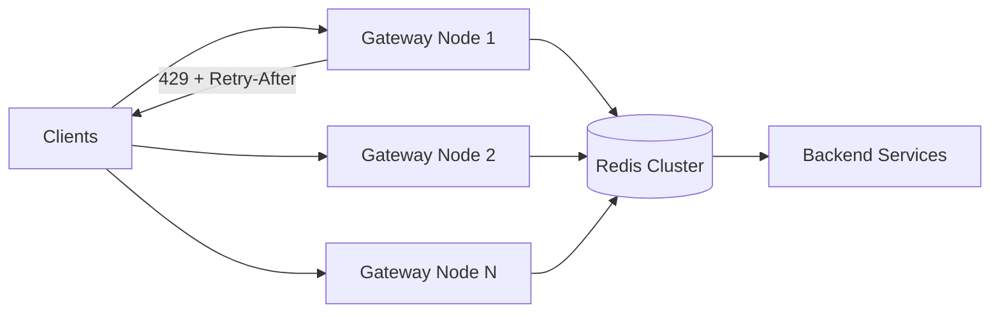

# Distributed Rate Limiter System Design: Algorithms, Redis, and the Distributed Architecture — A Comprehensive Guide

*A system-design deep-dive on the distributed rate limiter: the rate-limiting discipline, the five canonical algorithms, the distributed-consistency problem, the Redis architecture (INCR, Lua, Cluster), the key design decisions, performance and scale, and a worked example for a bank's API gateway.*

**Series:** System Design / Distributed Systems (technology/)
**Audience:** Solution architects, platform engineers, API platform teams
**Cross-references:** [api_governance_guide.md](api_governance_guide.md) (gateway runtime controls in §7, Merlion Bank worked example in §10.3), [event_stream_processing_guide.md](event_stream_processing_guide.md) (throttling and backpressure in streaming pipelines), [llm_agents_failures_production_guide.md](ai_llm/llm_agents_failures_production_guide.md) (agent loops and per-agent rate limits), [enterprise_agentic_platform_architecture_guide.md](ai_llm/enterprise_agentic_platform_architecture_guide.md) (gateway rate limiting inside agent platforms).

---

## Table of Contents

1. [Rate Limiting Basics](#1-rate-limiting-basics)
2. [The Algorithms Overview](#2-the-algorithms-overview)
3. [Token Bucket Deep-Dive](#3-token-bucket-deep-dive)
4. [Leaky Bucket Deep-Dive](#4-leaky-bucket-deep-dive)
5. [Fixed Window Deep-Dive](#5-fixed-window-deep-dive)
6. [Sliding Window Deep-Dive](#6-sliding-window-deep-dive)
7. [The Distributed Problem](#7-the-distributed-problem)
8. [The Redis Architecture](#8-the-redis-architecture)
9. [The Design Decisions](#9-the-design-decisions)
10. [Performance and Scale](#10-performance-and-scale)
11. [Worked Example: A Bank's API Gateway](#11-worked-example-a-banks-api-gateway)
12. [The Summary: One Page](#12-the-summary-one-page)
13. [Verification and Claims-Status](#13-verification-and-claims-status)
14. [Glossary](#14-glossary)

---

## 1. Rate Limiting Basics

### 1.1 The Discipline

**Rate limiting** is the discipline of capping how much traffic a caller may send to a system within a time window — for example, *100 requests per second per API key*, or *10,000 calls per day per customer*. A **rate limiter** is the component that enforces the cap: it observes each incoming request, decides *allow or deny* against the caller's budget, and communicates the decision (often with a `429 Too Many Requests` and a `Retry-After` hint).

Three terms that get conflated and must be separated in any design conversation:

- **Rate limiting** — caps the *rate* of requests (e.g., 100 req/s). A short-horizon, per-second/minute control.
- **Quota** — caps *usage over a period* (e.g., 10,000 calls/day per customer). A long-horizon consumption contract, typically tied to a billing tier or SLA. Rate limits protect the system *moment to moment*; quotas enforce the *commercial* agreement. The api_governance_guide.md gateway table (§7.1) lists them as separate controls for exactly this reason: "Rate limiting — per-consumer request rate caps" vs. "Quotas — periodic (daily/monthly) call allowances."
- **Concurrency limiting** — caps *simultaneously in-flight* requests, not arrival rate. A separate control with a separate data structure (a semaphore rather than a counter); see §1.3.

The discipline sits at the **gateway** in most architectures: the API gateway (Kong, Apigee, AWS API Gateway, Azure APIM — see api_governance_guide.md §7.2) is the natural enforcement point because it sees every request before the backend does. Governance decides the policy (what the limits are, per tier); the gateway executes it mechanically. This guide is about *how the executing mechanism works when it must be correct and fast across many machines* — the distributed rate limiter.

### 1.2 Why Rate Limit: The Rationale

- **Abuse and attacks.** Unauthenticated or compromised callers can hammer an API: credential stuffing, carding attempts, scraping, and denial-of-service. A rate limiter caps the damage any single caller (or IP, or botnet partition) can do per window. This is the abuse/DoS angle also treated in the adversarial-ML and security material of this series: the limiter is a *cheap first line of defense* that keeps abuse from ever reaching expensive logic.
- **Cost control.** Every request costs money — CPU, I/O, and especially metered resources (LLM tokens, cloud calls, third-party APIs). A runaway consumer's loop can burn a budget in minutes. Rate limits bound the *maximum* cost any consumer can impose; quotas bound the *total* cost over the billing period. For LLM-backed products this is now the dominant reason: an agent loop gone wrong (see llm_agents_failures_production_guide.md) multiplies per-token spend, and the rate limiter is the backstop.
- **Fairness.** Without limits, one noisy neighbor consumes shared capacity and degrades latency for everyone (the "noisy neighbor" problem). Per-consumer limits give each tenant a guaranteed share of capacity — fairness by construction, not by hope. Regulated contexts make this explicit: open-banking regimes (PSD2, MAS's API playbook — see api_governance_guide.md §10.1) expect banks to give third-party providers fair, non-discriminatory access; rate limits per TPP are part of demonstrating that.
- **Downstream protection.** The limiter shields fragile backends (databases, mainframes, third-party APIs) from load spikes they cannot absorb — a form of admission control, the request-path cousin of the backpressure patterns in event_stream_processing_guide.md.

### 1.3 The Types of Rate Limiting

- **Request-rate limiting** — caps *arrivals per time unit* (e.g., 100 req/s, 6,000 req/min). The classic meaning; what the five algorithms in §2 all implement. Enforced at the gateway before the request is dispatched.
- **Concurrency limiting** — caps *simultaneously in-flight requests* (e.g., 20 concurrent requests per customer). Bounds resource *occupancy* (threads, connections, DB pools), which rate limiting alone does not: 100 req/s with a 1-second backend each implies ~100 in flight. Semaphore-based; implemented with a counter that is incremented on arrival and decremented on completion (in Redis: `INCR` on start, `DECR` on finish, `EXPIRE` as a safety net for stuck requests).
- **Bandwidth limiting** — caps bytes per second (streaming, media, large payloads). A byte-counting variant; less common in API gateways, common in CDNs and egress proxies.
- **Quotas** — caps *total calls over a period* (daily/monthly). Operationally the same machinery (a counter with a long TTL) but with a different contract: hard refusal once exhausted, reset at the period boundary.

The distinction matters in design because the data structures differ: request-rate limits need a *time-aware* budget (tokens, windows), concurrency limits need a *count of live reservations*, and quotas need only a durable counter.

### 1.4 The Basics Table

| Aspect | Description |
|---|---|
| **Definition** | Capping how much traffic a caller may send within a window (e.g., 100 req/s) |
| **Enforcement point** | API gateway / edge proxy — sees all traffic before the backend |
| **Rate vs. quota** | Rate = short-horizon per-second/minute cap; quota = long-horizon daily/monthly allowance (billing contract) |
| **Why rate limit** | Abuse/attacks, cost control, fairness between tenants, downstream protection |
| **Types** | Request-rate, concurrency (in-flight), bandwidth, quota |
| **Response** | `429 Too Many Requests` (RFC 6585) + `Retry-After` (RFC 7231) + rate-limit headers |
| **Distributed problem** | Many gateway nodes share one budget — the counter must be correct across machines (see §7) |

---

## 2. The Algorithms Overview

### 2.1 The Five Canonical Algorithms

Every rate-limiting algorithm answers one question: *given the request history for this key, is there budget left right now?* The five canonical answers, in order of increasing precision:

1. **Token bucket** — a bucket holds up to *capacity* tokens, refilled at a steady *rate*; a request passes iff a token is available. Allows bursts up to the capacity, smooth long-term rate.
2. **Leaky bucket** — requests enter a queue that *drains* at a fixed rate; overflow is rejected. Perfectly smooth output, no bursts at all.
3. **Fixed window** — a per-key counter resets at fixed clock boundaries (every minute, every hour). Simplest, cheapest, but bursts at window edges.
4. **Sliding window log** — keeps the *timestamps* of recent requests; a request passes iff fewer than the limit fall inside the last window. Exact, but memory grows with request volume.
5. **Sliding window counter** — an *approximation* of the sliding log from two fixed-window counters (previous + current, weighted by elapsed time). Near-exact accuracy at fixed-window cost.

There is no "best" algorithm — there is a best *fit* per workload. The comparison table below is the standard way to argue the choice in a design review.

### 2.2 The Comparison Table

| Algorithm | Memory per key | Accuracy | Burst handling | Complexity |
|---|---|---|---|---|
| **Token bucket** | O(1) (2 counters: tokens, last-refill time) | Exact budget model (rate + burst) | Allows bursts up to capacity, then hard cap | Low — lazy refill on read |
| **Leaky bucket** | O(queue capacity) | Smooths to exact drain rate | No bursts — output is rate-limited to the drain rate | Low — queue + drain |
| **Fixed window** | O(1) (1 counter + window id) | Exact within a window; *approximate across boundaries* | Boundary problem: up to 2× limit in a straddling instant | Lowest — single INCR |
| **Sliding window log** | O(n) — one timestamp per request in the window | Exact — true sliding window | Exact burst control at any instant | Medium — sorted set maintenance |
| **Sliding window counter** | O(1) (2 counters + weights) | Near-exact — weighted blend of two windows | Smooths boundary bursts to ~the true limit | Low-Medium — weighted sum |

The memory column is per limited key; total footprint is *per-key memory × number of distinct keys* (users, IPs, API keys). That product is the first capacity estimate you compute in a design (see §11.5).

---

## 3. Token Bucket Deep-Dive

### 3.1 The Mechanics

The token bucket models a budget with three parameters:

- **Capacity (C)** — the maximum number of tokens the bucket can hold; the *burst* size. If the bucket is full, the excess refill is wasted (tokens do not accrue beyond C).
- **Refill rate (r)** — tokens added per second (or per interval); the *sustained* rate the consumer is allowed. Refill is typically **lazy**: instead of a timer, compute on each request how many tokens *would* have accrued since the last refill timestamp (`(now − last_refill) × r`).
- **Cost (k)** — tokens consumed per request (often 1; can be weighted, e.g., a heavy endpoint costs 5 tokens, an LLM call costs tokens proportional to input+output).

A request is allowed iff the bucket holds at least `k` tokens; on allow, decrement; on deny, reject (429). Because refill is lazy, the bucket needs only two persisted values per key — `tokens` and `last_refill` — hence O(1) memory.

The classic framing (verified): "Imagine a literal bucket. Tokens drip in at a steady rate — your rate limit. Each incoming request steals a token to pass through. When the bucket is empty, requests are denied until tokens drip back in." That is precisely the model AWS documents for API Gateway throttling (see §3.4 and §13).

### 3.2 The Properties

- **Bursts are allowed, up to C.** An idle consumer accumulates a full bucket and can spend it in a burst — e.g., capacity 100, refill 10/s ⇒ a cold consumer can fire 100 requests instantly, then is capped at 10/s while the bucket refills. This is usually *desirable*: legitimate clients burst (page loads, retries, agent tool calls), and the token bucket absorbs them.
- **Long-term rate is smooth at r.** Over any horizon longer than the burst, throughput converges to the refill rate — the average is enforced even though instantaneous rate is not.
- **Simple and stateless-ish.** Two numbers per key, one arithmetic operation per request — the cheapest exact budget model available. This is why it dominates in the wild.
- **Cost weighting falls out naturally.** Expensive operations can consume multiple tokens, giving per-request *cost* limits (a staple for LLM APIs where cost ∝ tokens).

### 3.3 The Pseudocode

```
# State per key: tokens (float), last_refill (timestamp), r (rate/s), C (capacity)
# Invariant: tokens ∈ [0, C]

def allow(key, cost=1):
    now = now_ms()
    state = load(key)                    # {tokens, last_refill}
    elapsed = (now - state.last_refill) / 1000
    state.tokens = min(C, state.tokens + elapsed * r)   # lazy refill, capped at C
    if state.tokens >= cost:
        state.tokens -= cost
        state.last_refill = now
        save(key, state)                 # ATOMIC read-modify-write in distributed form
        return ALLOW
    else:
        state.last_refill = now
        save(key, state)                 # persist refill even on deny
        return DENY                      # -> 429 + Retry-After ≈ (cost - tokens) / r
```

The critical word is **ATOMIC**: in a distributed limiter the read-modify-write must be atomic or two concurrent requests can both see the same token count and both pass (the race in §7.1). In Redis this is a Lua script or a WATCH/MULTI transaction — see §8.2. The `Retry-After` computation falls out of the model: wait until the bucket refills `cost − tokens` tokens at rate `r`.

### 3.4 The Token Bucket Table

| Aspect | Description |
|---|---|
| **Parameters** | Capacity C (burst), refill rate r (sustained), cost k (per request) |
| **State** | 2 values per key: tokens, last_refill — O(1) memory |
| **Behavior** | Bursts up to C allowed; average rate capped at r; hard cap after burst exhausted |
| **Refill** | Lazy — computed from elapsed time on each request, no background timer |
| **Cost weighting** | Requests can consume k > 1 tokens (heavy endpoints, LLM token costs) |
| **In the wild** | AWS API Gateway throttling (token bucket — documented); Kong rate-limiting plugin (token bucket policy); Apigee Spike Arrest (token-bucket smoothing — ⚠ see §13); Stripe API rate limits (algorithm not officially documented — ⚠) |
| **Best for** | APIs with bursty-but-bounded clients; protecting expensive backends; cost-based limits |

---

## 4. Leaky Bucket Deep-Dive

### 4.1 The Mechanics

The leaky bucket is the *smoothing* algorithm: requests (or "drops") enter a queue of fixed size; the queue **drains at a fixed rate** (one request per interval, e.g., 1/s). A request is admitted iff the queue has room; otherwise it is rejected (or, in some variants, the *oldest* is dropped — the "leaky" semantics of a bucket with a hole at the bottom, which is also why the name is shared with the token bucket's visual metaphor).

- **Queue size (Q)** — the maximum backlog of waiting requests; the tolerable burst of *arrivals*.
- **Drain rate (d)** — requests processed per second; the output rate. Output is constant: `d` per second, no more, no less.

Unlike the token bucket, a consumer *cannot* exploit idle time: if the queue is empty, requests drain at `d` regardless of how long the client was idle. The bucket stores the *queue*, so memory is O(Q) per key in the strict form (though the common implementation stores a single timestamp — the time the queue drains empty — making it O(1); see the note below).

### 4.2 The Properties

- **Perfectly smooth output.** The backend sees a constant `d` req/s — the strongest downstream-protection guarantee of any algorithm. This is the property that matters when the backend *cannot* tolerate spikes at all (a fragile database, a mainframe, a third-party API with its own strict limits).
- **No bursts, ever.** Even a client with a full bucket of idle credit cannot burst. If the design intent is "let good clients burst a little," the leaky bucket is the wrong tool — the token bucket is.
- **The trade-off is latency and fairness.** Excess arrivals are either *queued* (adding latency: a request admitted to the queue may wait Q/d seconds) or *dropped* (wasted work: the client re-sends). Both behaviors frustrate clients compared to the token bucket's "deny immediately, retry after N seconds."
- **Practical simplification.** Most implementations store only the drain-empty timestamp: `next_available = max(now, last) + 1/d`; admit iff `next_available ≤ now + Q`. O(1) memory, same smoothing semantics — this is the "one timestamp" leaky bucket seen in gateways.

### 4.3 The Comparison: Token vs. Leaky

| Aspect | Token bucket | Leaky bucket |
|---|---|---|
| **Idle credit** | Accrues up to C — bursts allowed | Does not accrue — output fixed at d |
| **Output shape** | Bursty within C, average r | Perfectly smooth at d |
| **Denial behavior** | Immediate 429 when tokens empty | Queue (latency) or drop (waste) |
| **Downstream protection** | Good — bounded by r + burst | Strongest — constant d |
| **Client experience** | Predictable, burst-friendly | Can feel unfair (rejects despite idle time) |
| **Typical use** | Public APIs, LLM APIs, gateway throttling | Rate-limiting proxies, fragile backends, NGINX `limit_req` |

### 4.4 The Leaky Bucket Table

| Aspect | Description |
|---|---|
| **Parameters** | Queue capacity Q, drain rate d (req/s) |
| **State** | Queue or drain-empty timestamp — O(Q) strict / O(1) practical |
| **Behavior** | Constant output rate d; no bursts; overflow rejected |
| **Smoothing** | Strongest of the five — backend never sees spikes |
| **Costs** | Queueing latency or dropped requests; no idle credit |
| **In the wild** | NGINX `limit_req` (documented leaky-bucket model); classic rate-limit proxies; shaping egress traffic |
| **Best for** | Backends that cannot absorb any spike; egress shaping; strict SLA on downstream call rates |

---

## 5. Fixed Window Deep-Dive

### 5.1 The Mechanics

The fixed window is the *cheapest* correct-enough algorithm:

- The timeline is divided into fixed windows anchored to the clock (e.g., every minute at `:00`, or `unix_ts / 60`).
- One **counter** per key per window: `key = rl:{consumer}:{window_id}`.
- On each request: atomically `INCR` the counter; if the new value ≤ limit → allow; else → deny. Set `EXPIRE` to the window length so the key cleans itself up.

That is the entire algorithm — which is why it is the default in simple gateways, framework middleware, and the Redis `INCR + EXPIRE` pattern (§8.1). Memory is O(1) per key, the operation is a single atomic increment, and there is no arithmetic beyond comparing the counter to the limit.

### 5.2 The Boundary Problem

The fixed window has one structural flaw: **the window edges are arbitrary, and a client can game them.** Consider a limit of 60 req/min and a client that sends 60 requests in the last second of minute 0 and 60 requests in the first second of minute 1:

```
minute 0:  [-------------------60 reqs---|  ← 60 at the tail edge
minute 1:                               |---60 reqs--------------]
                                        ↑ boundary: 120 requests in ~2 seconds
```

Two consecutive windows each admit their full limit, so **up to 2× the limit can pass in a burst straddling the boundary** — even though the true sliding 60-second window would have admitted only 60. The same artifact exists at any window granularity (per-minute, per-hour, per-day quota resets at midnight create the same "midnight surge"). Consequences:

- Backends sized for the limit can be hit with 2× it at predictable instants — attackers *know* the boundary times because they are public clock values.
- A client that is rate-limited at `t = 59.9s` can be allowed again at `t = 60.0s` — a hard, instantaneous reset that feels arbitrary.

Fixes: use a sliding algorithm (§6), or soften the boundary by *counting the previous window's residual* — which is exactly what the sliding window counter does.

### 5.3 The Fixed Window Table

| Aspect | Description |
|---|---|
| **Parameters** | Limit L per window, window length W (e.g., 60 s) |
| **State** | 1 counter per key per window — O(1) memory |
| **Operation** | Atomic INCR + compare + EXPIRE — cheapest possible |
| **Boundary problem** | Up to 2× L can pass in a straddling instant; hard reset at edges |
| **Accuracy** | Exact within a window; approximate across boundaries |
| **In the wild** | Simple gateway plugins (Kong fixed-window policy), framework middleware, quota counters (daily/monthly caps) |
| **Best for** | Quotas (daily/monthly), low-traffic keys, first versions — upgrade when boundary bursts matter |

---

## 6. Sliding Window Deep-Dive

### 6.1 The Sliding Window Log

The sliding window log is the *exact* algorithm: for each key, keep the **timestamps of every request in the last window**; a request is allowed iff fewer than the limit fall within `[now − W, now]`.

- **Data structure:** a sorted set (Redis `ZSET`) per key, member = request id, score = arrival timestamp.
- **On each request:** `ZREMRANGEBYSCORE key −inf (now − W)` (prune expired timestamps) → `ZCARD key` (count survivors) → if count < limit: `ZADD key now req_id` and allow; else deny.
- **Accuracy:** exact — the true request count over any true sliding window of length W. No boundary artifact at all.

The cost is the price of exactness: **memory is O(n) per key**, where n = requests per window (one timestamp entry per request, ~16–32 bytes in a ZSET), and each request does a range-delete + count + add. At 100 req/s per consumer the log holds 6,000 entries per minute per consumer — fine for a few keys, untenable for millions of keys at high rates. The standard mitigation is a **multi-level log** (a coarse-grained log for the recent past + a fine-grained one for the near-present), which is what gateway vendors implement under the hood — and at that point you have reinvented the sliding window counter (§6.2) with extra steps.

### 6.2 The Sliding Window Counter (Approximate, Weighted)

The sliding window counter gets *near-exact* accuracy at fixed-window cost by blending two counters:

- Keep the counter of the **current window** (`cur`) and the counter of the **previous window** (`prev`), plus each window's boundaries.
- For a request at time `t`, let `α` = the fraction of the *previous* window that still overlaps the sliding window ending at `t` (i.e., how much of `prev` is still "inside" the last W seconds).
- Estimated count over the true sliding window: **`count ≈ prev × α + cur`**.
- Allow iff `count < limit`.

Example (verified shape — this is the algorithm the "how we built" literature describes at Cloudflare and the recommended Redis implementation in the system-design literature): limit 100 req/min, window 60 s. At `t = 45 s` of the current minute, `prev = 40`, `cur = 30`. The previous window overlaps the sliding window for the first 15 s of its 60 s ⇒ `α = 15/60 = 0.25` ⇒ estimate = `40 × 0.25 + 30 = 40`. If the client had fired 80 in the previous window's last seconds, the estimate correctly inflates and near-boundary bursts are caught — the fixed-window 2× artifact shrinks to a small ε.

- **Memory:** O(1) per key (two counters + two timestamps). Same cost as fixed window.
- **Accuracy:** approximate, but the error is bounded and tiny in practice (the counter is *weighted* by true elapsed overlap). For almost all API workloads the ε is invisible to clients and backend alike.
- **Why it wins in the wild:** near-sliding accuracy at fixed-window cost, plus it is naturally expressed in Redis (two `INCR`s, or one small Lua script — §8.2).

### 6.3 The Sliding Window Table

| Variant | Accuracy | Memory | Use |
|---|---|---|---|
| **Sliding window log** | Exact — true window | O(n) per key (timestamps) | Low-rate keys needing exactness; audits |
| **Sliding window counter** | Approximate (weighted blend) | O(1) per key (2 counters) | The default choice for distributed gateways at scale |
| **Multi-level log** | Near-exact | Between O(1) and O(n) | Gateway vendor implementations of "sliding" policies |

---

## 7. The Distributed Problem

### 7.1 Consistency and Atomicity

Everything above assumed one process holding the state. A **distributed rate limiter** is what you get when the budget must be shared across many gateway nodes (a horizontally scaled gateway fleet in front of one API), and the core problem is **the read-modify-write race**:

```
Node A: read counter = 99          Node B: read counter = 99
Node A: 99 < 100 → allow           Node B: 99 < 100 → allow
Node A: write counter = 100        Node B: write counter = 100   ← both passed, budget broken
```

Two nodes read the same value, both decide "budget remains," both pass — the limit is violated by the number of racing nodes. The requirement is **atomicity**: the check-and-increment must be a single indivisible operation, exactly as a single-process limiter gets for free from its own memory. The standard answer is to move the state into a **shared store with atomic primitives** — Redis — where the operation is one `INCR` or one Lua script executed without interleaving (§8). Any design that reads state, computes locally, and writes back (without atomicity) is a *probabilistic* limiter: its accuracy degrades with concurrency. That trade-off is sometimes accepted deliberately (the hybrid approach, §7.3) — but it must be a decision, not an accident.

### 7.2 The Challenges

- **Multi-node coordination.** The gateway fleet is N nodes; the budget is one logical entity. The limiter must be correct across nodes without per-node locks (locks reintroduce a single point of failure and add latency).
- **Clock skew.** Any algorithm that computes windows or refill from local clocks (token bucket refill, window identity, expiry) is only as consistent as the clocks. Two nodes with 5 s of skew can disagree about which window "now" is, producing false allows or false denials at boundaries. Centralized Redis state removes *state* skew but not *computation* skew — the window id and weights must be derived from one consistent time source (the Redis server time, or a single coordinator's clock passed in the request).
- **Latency.** Every request pays a round trip to the shared store if the limiter is centralized. The design target is "add sub-millisecond to p99 latency" — which is achievable on a LAN Redis (see §10.1) but not on a cross-region or congested link.
- **Hot keys.** A popular consumer (a viral partner, a tenant running a batch job) becomes a single key hammered by every request — one Redis key serializing a large fraction of traffic. Mitigations: split the key into shards (sub-key sharding: `rl:{user}:{shard}` with per-shard budgets) at the cost of exactness, or move that consumer to a local/hybrid policy.
- **Fail-open vs. fail-closed.** When the shared store is unavailable (Redis down, network partition), do you allow all traffic (fail-open — availability over enforcement) or deny all (fail-closed — enforcement over availability)? Standard answer: fail-open for *rate limiting* (a rate limiter that takes down the API in an outage is worse than the abuse it prevents), fail-closed for *security* controls (authn/authz). Decide explicitly and code the fallback path.
- **Consistency model.** Exact limits (sliding log, single atomic counter) cost round trips and memory; approximate limits (weighted counter, local caching) trade a bounded error for latency and availability. The trade-off matrix is the heart of §7.4.

### 7.3 The Three Approaches

- **Centralized** — one shared store (Redis) holds all limiter state; every gateway node checks the same keys with atomic operations. *Correct, simple to reason about, exact; costs one network round trip per request and makes Redis a dependency.* The default for correctness-first designs.
- **Local (per-node)** — each gateway node runs its own in-memory limiter over the traffic it sees. *Zero added latency, no shared dependency; but the limit applies per node, not per consumer* — N nodes ⇒ N× the effective budget unless traffic is perfectly pinned (sticky routing) to consumers. Acceptable only when sticky routing is guaranteed or when the limit is a coarse guard, not a contract.
- **Hybrid** — each node keeps a local budget (token bucket or window counter) and **synchronizes with Redis on a schedule or on threshold** (e.g., consume locally; sync to the shared counter every 100 requests or 1 s; on sync, reconcile drift). *Latency of local, global budget of centralized, approximate — the effective limit can overshoot by the sync interval × rate.* This is the design used when sub-millisecond overhead is non-negotiable (CDN edges, high-QPS gateways) and a bounded overshoot is acceptable. Also the natural pattern for *client-side* rate-limit hints (the client enforces locally what the server tells it via headers — §9.4).

### 7.4 The Problem Table

| Challenge | Approach | Trade-off |
|---|---|---|
| Read-modify-write race across nodes | Atomic shared-store operation (Redis INCR / Lua) | Central dependency; one round trip |
| Clock skew | Derive window/refill from one time source (Redis TIME, coordinator clock) | Coordination cost; skew at boundaries if ignored |
| Latency budget | Centralized (1 RTT) vs. hybrid (local + sync) | Exactness vs. speed |
| Hot keys | Sub-key sharding, per-shard budgets | Overshoot within shard granularity |
| Redis down | Fail-open (allow) vs. fail-closed (deny) | Availability vs. enforcement — policy decision |
| Exact vs. approximate | Sliding log vs. weighted counter vs. hybrid | Accuracy vs. memory/latency |

---

## 8. The Redis Architecture

Redis is the de-facto state store for distributed rate limiters because it gives the two things the distributed problem demands: **atomic primitives** (single-command read-modify-write) and **sub-millisecond latency** on a LAN. This section covers the three canonical techniques and how they compose into an architecture.

### 8.1 INCR + EXPIRE: The Atomic Counter Pattern

The simplest distributed fixed-window limiter is two commands:

```
INCR  rl:{consumer}:{window_id}     # atomic increment — returns the new count
EXPIRE rl:{consumer}:{window_id} 60  # self-cleaning: key dies with the window
```

`INCR` is atomic in Redis (single-threaded command execution): two nodes incrementing concurrently get distinct, correct values — no lost updates. The `EXPIRE` guarantees the counter does not accumulate forever: a key that lives only one window cannot grow stale. The pattern is verified as the canonical "Redis rate limiter" idiom, and the system-design literature (e.g., the classic "Design a Rate Limiter" treatments) uses it verbatim for fixed windows and quotas.

**The atomicity caveat:** `INCR` and `EXPIRE` are each atomic, but *the pair is not a transaction*. Between the `INCR` and the `EXPIRE` another request can observe a counter without a TTL. In practice the fix is trivial — only set `EXPIRE` when the counter is 1 (first request of the window):

```
count = INCR key
if count == 1:
    EXPIRE key W        # first request of the window sets the TTL
if count > limit:
    DECR key            # optionally refund, so the counter stays honest
    return DENY
return ALLOW
```

But there is a subtler race: the check `count > limit` and the decision happen *in the gateway*, not in Redis. Two nodes can both `INCR` (getting 100 and 101), both read "≤ limit" logic differently, etc. The single-command pattern is atomic for the *increment* but not for the *check-and-decide*. When the decision must be atomic with the increment — which is the actual requirement — the operation must be a **Lua script** (§8.2). The rule of thumb: *INCR+EXPIRE for quotas and fixed windows where a marginal overshoot at the boundary is acceptable; Lua for anything that must enforce the limit exactly.*

### 8.2 Lua Scripts: Atomic Check-and-Act

Redis Lua scripts execute **atomically**: while a script runs, no other command or script executes on the server (Redis is single-threaded; scripts are not interleaved). A script is also **one round trip** — the whole check-and-act ships to the server once, runs there, and returns. That combination — atomicity + single RTT — is exactly the distributed limiter's requirement from §7.1.

Fixed-window limiter in Lua (the canonical sketch):

```lua
-- KEYS[1] = rl:{consumer}:{window_id}
-- ARGV[1] = limit, ARGV[2] = window seconds, ARGV[3] = cost
local count = redis.call('INCR', KEYS[1])
if count == 1 then
    redis.call('EXPIRE', KEYS[1], ARGV[2])
end
if count > tonumber(ARGV[1]) then
    return {0, count}          -- 0 = denied
end
return {1, count}              -- 1 = allowed, count = new total
```

Sliding window counter in Lua (the weighted two-counter version — §6.2):

```lua
-- KEYS[1] = rl:{consumer}:cur, KEYS[2] = rl:{consumer}:prev
-- ARGV[1] = limit, ARGV[2] = window seconds, ARGV[3] = current window id,
-- ARGV[4] = previous window id, ARGV[5] = weight alpha (fraction of prev still in window)
local cur  = redis.call('GET', KEYS[1]) or 0
local prev = redis.call('GET', KEYS[2]) or 0
-- window rolled over? then prev := cur, cur := 0
if redis.call('GET', KEYS[1] .. ':wid') ~= ARGV[3] then
    prev = cur
    cur  = 0
    redis.call('SET', KEYS[1] .. ':wid', ARGV[3], 'EX', ARGV[2])
end
local est = prev * tonumber(ARGV[5]) + cur
if est >= tonumber(ARGV[1]) then
    return {0, est}
end
redis.call('INCR', KEYS[1])
redis.call('EXPIRE', KEYS[1], ARGV[2])
return {1, est + 1}
```

Token bucket in Lua is the same shape: read `tokens` and `last_refill`, lazy-refill, decide, write back — all inside the script, so two nodes can never double-spend a token.

**Script hygiene:** keep scripts small (Redis blocks the event loop while running — a slow script is a latency spike for *every* client of that Redis instance); pass dynamic values as `ARGV`, not by string-building the script; and use `SCRIPT LOAD` + `EVALSHA` in production so the script body is not re-shipped on every call.

### 8.3 Redis Cluster and Deployment Shape

- **Single instance / Sentinel** — one master (with replicas for failover). Fine up to roughly the master's throughput ceiling (see §10.3); the limiter keys all land on one node, which is exactly what a hot-key-heavy workload wants to avoid at scale. Sentinel gives HA but not horizontal scale.
- **Redis Cluster** — keys are distributed across N masters by **hash slot** (`CRC16(key) mod 16384`). Horizontal scale and automatic failover. Two consequences for limiters:
  - A **multi-key Lua script** (like the sliding-window-counter sketch above) requires all keys to share a hash slot — use **hash tags**: `rl:{consumer}:cur` and `rl:{consumer}:prev` both hash to the slot of `{consumer}`. One consumer = one slot = one node = correct atomicity.
  - **Single-key scripts and INCR are always fine** — no slot constraints.
- **Key hygiene:** every limiter key needs a bounded TTL (window length + small margin) or a crash that stops issuing `EXPIRE` leaves tombstones forever; use `noeviction` policy for limiter keyspace (an evicted counter silently *enlarges* the limit — the worst failure mode for a rate limiter); and monitor `maxmemory` headroom, since limiter key counts scale with consumers × windows.
- **Topology note:** latency to Redis is the design constraint (see §10.1) — co-locate the limiter store with the gateway fleet in the same region/VPC; cross-region limiters are for *coordination* (multi-region aggregate quotas), not per-request checks.

### 8.4 The Architecture Diagram

```
                          ┌──────────────────────────────────────────────┐
                          │              CLIENT APPLICATIONS             │
                          └───────────────────────┬──────────────────────┘
                                                  │ HTTP (many clients, many keys)
                                                  ▼
        ┌─────────────────────────────────────────────────────────────────┐
        │                      API GATEWAY FLEET (N nodes)                │
        │  ┌─────────────┐  ┌─────────────┐  ┌─────────────┐              │
        │  │  Node 1     │  │  Node 2     │  │  Node N     │              │
        │  │ authn ──►   │  │ authn ──►   │  │ authn ──►   │              │
        │  │ RATE LIMIT  │  │ RATE LIMIT  │  │ RATE LIMIT  │  ← Lua script │
        │  │  (Lua)      │  │  (Lua)      │  │  (Lua)      │    per req    │
        │  │ route ──►   │  │ route ──►   │  │ route ──►   │              │
        │  └──────┬──────┘  └──────┬──────┘  └──────┬──────┘              │
        └─────────┼───────────────┼────────────────┼──────────────────────┘
                  │               │                │   single round trip
                  ▼               ▼                ▼     (sub-ms LAN)
        ┌─────────────────────────────────────────────────────────────────┐
        │              REDIS CLUSTER (shared limiter state)               │
        │  slot A: rl:{user42}:cur / rl:{user42}:prev  (hash-tagged)      │
        │  slot B: rl:{ip:203.0.113.9}:{window}                            │
        │  slot C: rl:{partnerX}:quota:{day}   — Lua scripts, INCR/EXPIRE │
        └─────────────────────────────────────────────────────────────────┘
                                                  │
                                                  ▼
        ┌─────────────────────────────────────────────────────────────────┐
        │                      BACKEND SERVICES (protected)               │
        └─────────────────────────────────────────────────────────────────┘
```



Every gateway node runs the identical Lua check against the shared Redis keyspace; the backend only ever sees traffic that passed a single, globally-consistent budget.

### 8.5 The Redis Table

| Technique | Description | Example |
|---|---|---|
| **INCR + EXPIRE** | Atomic counter that self-cleans with the window; per-command atomicity | Fixed window / daily quota: `INCR rl:{key}:{window}` + `EXPIRE … 60` |
| **Lua script** | Check-and-act as one atomic, single-RTT unit | `EVALSHA` fixed-window, sliding-counter, or token-bucket script |
| **Hash tags** | `{…}` forces related keys into one hash slot so multi-key scripts work in Cluster | `rl:{user42}:cur` + `rl:{user42}:prev` |
| **TTL discipline** | Every key expires at window end; prevents tombstone leaks | `EXPIRE … W + margin`; `SET … EX` in scripts |
| **Eviction policy** | `noeviction` so counters are never silently dropped | Fail the write rather than enlarge the limit |
| **Cluster / Sentinel** | HA (Sentinel) and horizontal scale (Cluster) | 3-master + 3-replica Cluster co-located with gateways |
| **TIME as time source** | `TIME` from the server keeps window ids consistent across nodes | Window id = `floor(redis TIME / W)` — kills clock-skew (§7.2) |

---

## 9. The Design Decisions

### 9.1 Key Design: Per-User, Per-IP, Per-Key

The limiter key *is* the policy: who shares a budget, who gets their own. The standard dimensions:

- **Per API key / per consumer (OAuth client, customer id)** — the primary dimension for commercial APIs. Budgets map to contracts and tiers; abuse is attributed to a tenant. This is what Stripe, GitHub, and bank open-API programs enforce (the api_governance_guide.md gateway table's "per-consumer request rate caps").
- **Per IP** — the anti-abuse dimension: an IP with no valid key (unauthenticated scraping, credential stuffing) still gets a budget. Cheap and effective; but NATs and corporate proxies lump many real users into one IP — IP limits must be *looser* than user limits or they punish innocent users behind shared egress.
- **Per route / endpoint** — the cost dimension: expensive endpoints (report generation, LLM calls, bulk exports) get their own, tighter limits and heavier costs (§3.1 cost weighting). Also per-method (reads vs. writes).
- **Composite keys** — real policies combine dimensions: `rl:{plan_tier}:{customer_id}:{route}` or `rl:{ip}:{user_agent_family}`. Rule of thumb: *the most specific dimension that identifies an accountable party is the primary key; coarser dimensions (IP) are a second, independent layer*, not a replacement.

Two key-design failure modes to design against: **key cardinality blow-up** (per-route × per-user × per-second windows can generate millions of Redis keys — TTLs and a key budget are mandatory) and **hot keys** (§7.2: one viral tenant hammering one key — shard or move to hybrid).

### 9.2 Quotas and Tiers

Rate limits and quotas are two policies over the same machinery:

- **Rate limit** — per-second/minute budget; enforced per request; the subject of this guide.
- **Quota** — per-day/month budget; same counter machinery with a long TTL (`rl:{customer}:quota:2026-08-17`); enforced at the gateway or billed post-hoc; the *commercial* contract (api_governance_guide.md §7.1 lists quotas separately from rate limiting for this reason).

**Tiers** map commercial products onto limits: e.g., Free (10 req/s, 1k calls/day), Standard (100 req/s, 100k/day), Enterprise (1,000 req/s, unlimited, plus burst allowance). The limiter's config is then *tier → {rate, burst, quota}*, and the key embeds the tier so a plan change is a config update, not a code change. Design points:

- Tier limits should be **data-driven** (a config store, not constants) — plan changes go live without redeploys.
- **Sustained vs. burst**: the token bucket expresses both naturally (rate r, capacity C); expose both numbers in the API product docs so clients can design within them.
- **Weighted costs** (§3.1) let one tier express "expensive endpoints cost more" — essential for LLM-metered APIs where cost ∝ tokens, and for bank APIs where a payment initiation is heavier than a balance read.

### 9.3 The Response: 429 and Retry-After

When the limiter denies, the response must tell the client *what* and *when*:

- **`429 Too Many Requests`** — the standard status (verified: RFC 6585, the HTTP status-code registry). Some gateways use `503` with a Retry-After when the *server's* capacity is the binding constraint (RFC 6585 §2.1 semantics: 429 = your allowance, 503 = our capacity) — a useful distinction: 429 is a client contract violation; 503 is an infrastructure signal. Most limiter implementations (and the clients that honor them) treat 429 as the canonical denial.
- **`Retry-After`** — the *when*: either seconds (`Retry-After: 30`) or an HTTP-date. Verified standard: RFC 7231. Clients (and HTTP libraries, and API SDKs with built-in retry logic) honor it to avoid hammering a limit they cannot pass. This is also the header that makes *cooperative* limiting work: a client that sleeps Retry-After seconds costs the server nothing.
- **Body**: a Problem Details document (RFC 9457, `application/problem+json` — see api_governance_guide.md §2.4) explaining the limit, the window, and the reset: `{ "type": "https://api.example/errors/rate-limit", "title": "Rate limit exceeded", "detail": "Limit 100 req/min exceeded", "status": 429 }`.
- **Fail-open vs. fail-closed** (§7.2): on limiter-store outage, return 429-with-diagnostic (fail-closed) or pass through (fail-open). Recommendation: fail-open for rate limiting with a metric alarm; the limiter must never be the cause of a full API outage.

### 9.4 The Headers: X-RateLimit-* and RateLimit-*

Standard headers give clients *visibility* so they can self-throttle — the cheapest load reduction available:

- **De-facto convention (verified in the wild):** `X-RateLimit-Limit` (budget per window), `X-RateLimit-Remaining` (left in this window), `X-RateLimit-Reset` (epoch seconds when the window resets). Popularized by GitHub and Stripe; widely adopted by gateways and SDKs.
- **Standardization (⚠ draft):** the IETF HTTP API Working Group's **RateLimit header fields** — `RateLimit-Limit`, `RateLimit-Remaining`, `RateLimit-Reset` — has been a draft (`draft-ietf-httpapi-ratelimit-headers`) since 2020; not yet an RFC at the time of writing. It *unifies* the legacy X- headers (with a combined `RateLimit` field option and a policy `RateLimit-Policy` field), so new designs should emit both families for compatibility: the X- family for today's clients, the RateLimit- family for the future.
- **Design points:** emit the headers on *every* response (not just denials) so clients can pre-emptively pace; make `Reset` a real, correct value (derived from the same time source as the window — §7.2); and treat the headers as *hints* — clients that ignore them still get the 429, so the headers improve behavior but never replace enforcement.

### 9.5 The Decisions Table

| Decision | Options | Recommendation |
|---|---|---|
| **Limit key** | Per-user, per-IP, per-key, per-route, composite | Primary = consumer/API-key (accountability); IP as a separate anti-abuse layer; route for cost weighting |
| **Quota vs. rate** | Separate counters, same machinery | Rate = per-second/min (gateway); quota = daily/monthly (billing contract); expose both per tier |
| **Tiers** | Hard-coded vs. data-driven config | Data-driven (config store); tier → {rate, burst, quota}; plan changes without redeploys |
| **Denial status** | 429 vs. 503 | 429 for client allowance; 503 only when server capacity is the constraint |
| **Retry hint** | `Retry-After` seconds vs. HTTP-date | Seconds (machine-parseable); always emit on 429 |
| **Headers** | X-RateLimit-* (de facto) vs. RateLimit-* (IETF draft) | Emit both; X- for compat, RateLimit- for standardization |
| **Failure mode** | Fail-open vs. fail-closed | Fail-open for rate limiting + alarm; fail-closed for security controls |
| **Consistency** | Exact (Lua) vs. approximate (hybrid/local) | Lua centralized by default; hybrid only when the latency budget demands it |

---

## 10. Performance and Scale

### 10.1 Redis Latency: The Cost Model

The distributed limiter's performance question is: *what does one rate-limit check cost on the request path?* The answer, for the centralized Lua design:

- **One round trip per request** — the check-and-act is a single `EVALSHA` (§8.2). No multi-round-trip workflows, no client-side coordination.
- **Redis on a LAN/VPC: ~0.1–1 ms typical** for a single-key INCR or small script (p99 a few ms under load). Verified order of magnitude from Redis's own latency guidance and standard benchmarks; treat exact numbers as environment-dependent (⚠ — see §13). Added to a gateway whose own p99 is already tens of ms, a well-tuned limiter adds single-digit percentages of latency — invisible to end users.
- **The real costs are elsewhere:** (1) *network* — a badly placed Redis (cross-AZ without care, cross-region) turns 1 ms into 10–50 ms; co-locate the store with the fleet (§8.3). (2) *Slow scripts* — a Lua script that does O(n) work blocks the Redis event loop for every other client; keep scripts O(1) (§8.2 hygiene). (3) *Pipelining misses* — batching limiter checks with other per-request Redis calls (session, cache) via a pipeline or single script cuts RTTs when the gateway already talks to Redis.
- **The budget:** define an explicit SLA — e.g., "limiter adds < 2 ms to p99" — and load-test it before production, because the failure mode (limiter latency blowing up request p99) is silent and gradual.

### 10.2 Caching: Local + Sync (The Hybrid)

When even one sub-ms RTT per request is too much (very high QPS, edge gateways, strict latency SLOs), the hybrid approach of §7.3 becomes the design:

- Each gateway node runs a **local in-memory budget** (usually a token bucket — cheap arithmetic per request, zero I/O).
- The node **synchronizes with Redis** on a schedule or threshold (every N requests, every T ms, or when the local bucket hits a low-water mark): it reports local consumption and pulls the authoritative global state.
- **Behavior:** requests are served at memory speed; the global budget is enforced to within the sync granularity — the effective limit can overshoot by `(sync interval) × (rate)` (e.g., 1 s of sync ⇒ up to 1 s of overshoot at the boundary). For most APIs that overshoot is irrelevant; for contractual limits it is not.
- **Also the client-side story:** the same pattern, pushed outward — the server tells the client its budget via headers (§9.4), and well-behaved clients (SDKs, agent runtimes) throttle locally, so the *server's* limiter mostly sees compliant traffic and only needs to catch the non-compliant tail. This is the pattern the agent-orchestration guides in this series recommend for LLM agent loops: client-side pacing + server-side enforcement as the backstop.

### 10.3 The Scale

- **Single Redis master:** ~100k–1M simple ops/sec on commodity hardware (⚠ order of magnitude, environment-dependent) — enough for a gateway fleet doing tens of thousands of checks per second, since each request is one op.
- **Redis Cluster:** scales horizontally by hash slot (§8.3) — the limiter keyspace spreads across masters; add masters to scale. Watch the **hot key** (a single consumer's key serializing on one slot) — shard or hybrid (§7.2).
- **Memory:** the limiter keyspace is `keys × bytes/key` — bounded by (consumers × windows) with TTLs (§8.3). At 1M consumers × 2 windows × ~100 B = ~200 MB: trivial for Redis, but only if TTLs are disciplined.
- **The gateway fleet itself:** rate-limit checks are CPU-cheap; the gateway's throughput ceiling is usually authn/transformation work, not the limiter. The limiter design's *scalability* question is not "can Redis keep up" (yes, to very high rates) but "what do we trade to stay within the latency budget" — which is the exact-vs-approximate decision of §7.4.
- **Sizing rule of thumb:** design for `peak_requests_per_second × window_count` keys live simultaneously, `1 op per request` of Redis capacity, and `p99 limiter latency < 2 ms` — then load-test, because the estimates are orders of magnitude, not guarantees (⚠ §13).

### 10.4 The Performance Table

| Aspect | Design | Note |
|---|---|---|
| **Per-request cost** | 1 Lua `EVALSHA`, single RTT | No multi-round-trip workflows |
| **Redis latency** | ~0.1–1 ms LAN (p99 a few ms) | ⚠ environment-dependent; co-locate store + fleet |
| **Script shape** | O(1) Lua, values via ARGV | Slow scripts block the whole Redis event loop |
| **Latency SLA** | "< 2 ms added to p99", load-tested | Failure is silent latency creep — measure it |
| **Hybrid caching** | Local token bucket + periodic sync | Overshoot = sync interval × rate; bounded, deliberate |
| **Client-side pacing** | Headers → client throttles locally | Enforcement stays server-side (429 backstop) |
| **Horizontal scale** | Redis Cluster by hash slot; hash tags for multi-key scripts | Hot keys need sharding or hybrid |
| **Memory** | keys × ~100 B, TTL-bound | 1M consumers ≈ ~200 MB — trivial if TTLs disciplined |

---

## 11. Worked Example: A Bank's API Gateway

### 11.1 The Scenario

**Merlion Bank** (the illustrative bank from api_governance_guide.md §10.3) runs an open-API program: payment initiation, account information, and FX-rate APIs exposed to third-party providers (TPPs) under a regulated open-banking regime (MAS-aligned; see api_governance_guide.md §10.1 for the regulatory drivers). The APIs sit behind a Kong-based gateway fleet (3 nodes today, scaling to 10; see api_governance_guide.md §7.2 for the gateway landscape). The bank's API governance board has mandated: *every consumer gets a contractual rate limit and a daily quota; enforcement is a gateway control; limits are per tier* (api_governance_guide.md §7.1's "rate limiting" and "quotas" rows).

The problem to solve: the gateway is horizontally scaled, so the per-consumer budget must be **shared and correct across all gateway nodes** — the distributed rate limiter of §7–§8, applied to a bank.

### 11.2 The Requirements

| Requirement | Value | Notes |
|---|---|---|
| **Per-customer rate limits** | Tiered: Silver 10 req/s, Gold 50 req/s, Platinum 200 req/s | Sustained rate per API key |
| **Burst allowance** | 2× sustained for ≤ 5 s (Silver 20, Gold 100, Platinum 400) | Absorbs legitimate client bursts (batch reconciliation) |
| **Daily quotas** | Silver 10k calls/day, Gold 100k/day, Platinum 1M/day | The commercial contract; reset at midnight SGT |
| **Weighted costs** | Payment initiation = 5 tokens; balance read = 1 token | Expensive/high-risk operations consume more budget |
| **Denial contract** | `429` + `Retry-After` + Problem Details body + rate-limit headers | RFC 6585/7231/9457; headers on every response (§9.3–9.4) |
| **Latency budget** | Limiter adds < 2 ms to p99 | Load-tested before go-live (§10.1) |
| **Failure mode** | Fail-open for rate limits (with alarm); fail-closed for authz | A limiter outage must not take down the API (§7.2) |
| **Multi-region** | Per-region enforcement; cross-region aggregate quota via a central store | Data-residency: gateway in-region, quota ledger in the home region |

### 11.3 The Algorithm Choice

**Chosen: sliding window counter + Redis** for the rate limit, **fixed-window counter + Redis** for the daily quota. The reasoning, as a design-review argument:

1. **Why not fixed window for the rate limit?** The boundary problem (§5.2): a TPP could fire 2× its limit in the seconds straddling a minute boundary. For a bank's API, the *contract* is the limit — a TPP burning 200 req in 2 s against a 100 req/min contract is exactly the abuse the governance board wants prevented. Fixed window is acceptable only for the daily quota, where a 2× artifact at midnight is bounded (a day's quota is huge relative to a boundary second) and the reset time is contractual anyway.
2. **Why not the sliding window log?** Exactness would be nice, but the log is O(n) memory per key (§6.1): at Platinum's 200 req/s, one consumer generates 12,000 ZSET entries *per minute*. Across the TPP population that memory cost is unjustifiable. The weighted counter gives near-exact accuracy at O(1) per key.
3. **Why not token bucket?** The token bucket is arguably the best *behavioral* fit (burst + sustained, cost weighting) — and AWS API Gateway and Kong's token-bucket policy use it. The deciding factors here: (a) the weighted sliding counter expresses the *same* burst-and-sustain policy with two Redis counters and a simpler script; (b) the bank's product team wants to communicate limits as "X requests per minute" (a window, not a bucket) to TPPs — windows are the client-facing mental model (Kong's own engineering blog makes this exact point: windows are intuitive for consumers and avoid the starvation/burst artifacts of the other models); (c) the quota machinery (fixed-window counters) reuses the same key/TTL discipline. **The token bucket remains the fallback** if load tests show clients need more burst headroom than 2×.
4. **Why centralized Redis, not hybrid?** 3–10 gateway nodes at moderate QPS do not need the sub-ms savings of local caching; the bank's latency budget (2 ms) is met by a co-located Redis with a single Lua round trip. Exactness of the contract wins over the marginal latency gain. Hybrid is documented as the upgrade path if QPS grows 10×.

### 11.4 The Redis Design

**Keys** (hash-tagged for Cluster compatibility — §8.3):

```
rate:  rl:{api_key}:rate:{window_id}        -- sliding counter: current window count
       rl:{api_key}:rate:prev:{window_id}   -- previous window count (for the weighted blend)
       rl:{api_key}:rate:wid                 -- current window id (rollover marker)
quota: rl:{api_key}:quota:{yyyy-mm-dd}      -- fixed counter, EXPIRE 48h
```

- `window_id` = `floor(now / 60)` derived from **Redis `TIME`** (single time source — §7.2), not per-node clocks.
- TTL: rate keys 120 s (window 60 s + margin); quota keys 48 h — the quota counter must survive the reset boundary so the previous day's count is still readable for audits.
- Weighted cost: the Lua script decrements the budget by the endpoint's cost (`ARGV`), not by 1 — payment initiation costs 5.

**Lua script (sketch)** — one script, three inputs (key, cost, limit), atomic check-and-act:

```lua
-- KEYS[1] = rl:{api_key}:rate:{window_id}, KEYS[2] = rl:{api_key}:rate:prev:{window_id}
-- KEYS[3] = rl:{api_key}:rate:wid
-- ARGV[1] = limit (rate), ARGV[2] = window seconds, ARGV[3] = cost,
-- ARGV[4] = window_id, ARGV[5] = alpha (prev-window overlap weight)

-- rollover: if this is a new window, prev := cur, cur := 0
if redis.call('GET', KEYS[3]) ~= ARGV[4] then
    redis.call('SET', KEYS[2], redis.call('GET', KEYS[1]) or 0, 'EX', ARGV[2])
    redis.call('SET', KEYS[1], 0, 'EX', ARGV[2])
    redis.call('SET', KEYS[3], ARGV[4], 'EX', ARGV[2])
end

local cur  = tonumber(redis.call('GET', KEYS[1]) or 0)
local prev = tonumber(redis.call('GET', KEYS[2]) or 0)
local est  = prev * tonumber(ARGV[5]) + cur        -- weighted window estimate (§6.2)

if est + tonumber(ARGV[3]) > tonumber(ARGV[1]) then
    return {0, est, ARGV[2]}                        -- DENY: 429 + Retry-After hint
end
redis.call('INCRBY', KEYS[1], ARGV[3])              -- consume cost-weighted tokens
return {1, est + tonumber(ARGV[3])}
```

The quota check is the same shape with a fixed window id (the date) and a long TTL. **Deployment:** `SCRIPT LOAD` at gateway boot, `EVALSHA` per request; script loaded once, ~50 lines, O(1) — no event-loop risk (§8.2).

**Cluster sizing:** 3-master × 3-replica, co-located with the gateway fleet in the VPC; `maxmemory-policy noeviction` on the limiter keyspace; `TIME` used for window ids. The multi-key script works because all three keys share the `{api_key}` hash tag.

### 11.5 The Capacity Estimates (⚠ illustrative)

Order-of-magnitude sizing for Merlion Bank (⚠ — illustrative numbers, to be replaced with measured traffic before go-live):

- **Traffic:** 5,000 peak req/s across the gateway fleet; ~50k distinct API keys active per day.
- **Redis ops:** 1 `EVALSHA` per request + 1 quota check per request (the two scripts can be merged into one to keep it a single RTT) ⇒ ~5–10k ops/s peak. A single Redis master handles this comfortably (§10.3); Cluster is for HA and future headroom.
- **Memory:** live rate keys ≈ active keys × 3 ≈ 150k keys × ~150 B ≈ **~25 MB**; quota keys ≈ 50k × ~120 B ≈ ~6 MB. Total well under 100 MB — trivial for the sized cluster (⚠: assumes TTL discipline; a bug that skips `EXPIRE` is the only way this explodes).
- **Latency:** one LAN round trip ≈ 0.1–1 ms ⇒ well inside the 2 ms budget; load-test target: 10k req/s sustained, p99 limiter latency < 2 ms, zero budget overshoot > 1% under burst tests.
- **Overshoot bound (hybrid fallback, if ever needed):** local caching at 1 s sync ⇒ ≤ 1 s × per-key rate overshoot at boundaries — documented and accepted only if the latency budget is renegotiated.

### 11.6 The Lessons

- **Simple first, then scale.** Merlion Bank's sequence: (1) Kong's built-in fixed-window plugin (zero code — the governance board's "attach rate limits to every API" mandate becomes config, exactly as api_governance_guide.md §7.3 prescribes); (2) when TPPs started straddling minute boundaries, the weighted sliding-counter Lua script on the existing Redis; (3) Cluster + hash tags when the fleet and key count grew; (4) hybrid local caching only if the 2 ms budget is ever blown. Each step was *forced by a measured problem*, not speculative gold-plating. The most common production mistake is the reverse: building a bespoke distributed limiter before the gateway's built-in one is even configured.
- **The contract is the design.** Because limits are contractual (tiers, quotas, 429 semantics), the *exactness* of enforcement, the *time source* for windows, and the *response contract* (Retry-After, headers) matter more than raw performance. A 1%-overshoot approximate limiter that is honest about its error beats a "fast" limiter whose overshoot is unbounded.
- **Operate it like a product.** Alerts on 429 rates (a spike means a TPP is stuck — or attacking), dashboards of per-tier utilization, quota-proximity warnings to TPPs, and a config pipeline so tier changes deploy without touching code.

---

## 12. The Summary: One Page

**The distributed rate limiter, in one page.**

- **The discipline:** rate limiting caps traffic per consumer per window (rate) and per period (quota) — enforced at the gateway to stop abuse, bound cost, and guarantee fairness. The response contract is `429` + `Retry-After` + limit headers (§1).
- **The algorithms:** five canonical answers to "is there budget?" — **token bucket** (burst + sustained, O(1), the wild's default: AWS API Gateway, Kong), **leaky bucket** (perfectly smooth output, no bursts: NGINX `limit_req`), **fixed window** (cheapest, boundary artifact), **sliding window log** (exact, O(n) memory), **sliding window counter** (near-exact at O(1) — the distributed gateway's default) (§2–§6).
- **The distributed problem:** the budget is shared across gateway nodes, so the read-modify-write must be **atomic** — a shared store with atomic primitives (Redis), a single time source, bounded latency, hot-key and fail-open/fail-closed handling; centralized vs. local vs. hybrid is the central architecture decision (§7).
- **The Redis architecture:** `INCR + EXPIRE` for simple counters, **Lua scripts** for atomic check-and-act in one round trip, hash tags + Cluster for horizontal scale, TTL discipline and `noeviction` for key hygiene (§8).
- **The decisions:** key design (per-consumer primary, IP secondary), data-driven tiers with burst and weighted costs, 429/Retry-After/Problem Details responses, both header families, fail-open for limits (§9).
- **The performance:** one sub-ms round trip per request is the cost model; keep scripts O(1), co-locate the store, set a measured latency SLA; hybrid local caching only when the budget demands it; client-side pacing via headers as the cheap multiplier (§10).
- **The worked example:** a bank's gateway uses the sliding window counter + Redis — near-exact contract enforcement at O(1) cost — with quota counters, cost-weighted tokens, and an explicit "simple first, then scale" migration path (§11).

**The final word: limit, then scale.** Rate limiting is not the hard part — the *algorithm* is a solved, documented menu, and Redis makes the distributed state tractable. The hard part is the *discipline around it*: deciding the contract (tiers, exactness, failure mode), measuring it (latency SLA, 429 rates, overshoot), and growing it deliberately (start with the gateway's built-in limiter, graduate to Lua-on-Redis, then to Cluster and hybrid — each step forced by a measured problem). A rate limiter that is simple, correct, and operated beats one that is clever, approximate, and forgotten. Limit first — the scaling will take care of itself.

---

## 13. Verification and Claims-Status

✅ **Verified in this research pass (primary/secondary sources):**
- **Token bucket mechanics** (tokens, refill rate, capacity, lazy refill) — canonical algorithm; confirmed across the system-design literature and vendor documentation.
- **AWS API Gateway throttling uses the token bucket algorithm** — documented in AWS guidance and widely corroborated (bucket holds tokens, refilled at the rate limit, each request consumes one).
- **Kong rate-limiting plugins offer fixed window, sliding window, and token bucket policies** — Kong documentation (rate-limiting and rate-limiting-advanced plugins).
- **NGINX `limit_req` is a leaky-bucket model** — NGINX documentation for `ngx_http_limit_req_module`.
- **Sliding window counter = weighted blend of previous + current window counters** — the standard "approximate sliding window" algorithm as described in the rate-limiter design literature (incl. the Cloudflare engineering write-up of its rate limiting).
- **Redis `INCR` and `EXPIRE` are individually atomic; Lua scripts execute atomically (no interleaving) and in a single round trip** — Redis documentation (commands and `EVAL`).
- **Redis Cluster distributes keys by hash slot (CRC16 mod 16384); hash tags `{...}` force multi-key affinity** — Redis Cluster specification.
- **`429 Too Many Requests`** — RFC 6585 (2012); **`Retry-After`** — RFC 7231; **Problem Details** — RFC 7807 → RFC 9457 (2023).
- **`X-RateLimit-Limit` / `X-RateLimit-Remaining` / `X-RateLimit-Reset` are the de-facto convention** — popularized by GitHub and Stripe; observed across major APIs and gateways.
- **Rate vs. quota distinction and gateway enforcement point** — consistent with api_governance_guide.md §7.1 (rate limiting vs. quotas as separate runtime controls).

⚠ **Flagged (inferred, approximate, no single standard, or single-source):**
- **IETF RateLimit header fields** (`RateLimit-Limit`/`Remaining`/`Reset`) are a **draft** (`draft-ietf-httpapi-ratelimit-headers`, in progress since ~2020) — **not yet an RFC**; status changes over time.
- **Stripe's internal rate-limiting algorithm is not officially documented** — Stripe publishes rate limits and the X-RateLimit-* header family, but the underlying algorithm is community-inferred; do not cite a specific Stripe algorithm.
- **Apigee Spike Arrest's exact algorithm** — documented by Apigee as burst-smoothing; commonly described as token-bucket-based, but treat the precise mechanism as vendor-documented behavior rather than a verified public spec.
- **Redis throughput (~100k–1M ops/s single master) and latency (~0.1–1 ms LAN)** — order-of-magnitude figures from Redis benchmarks and documentation; **environment-dependent** (hardware, network, persistence config, script shape). Always load-test your own.
- **"Limiter adds < 2 ms to p99" and all Merlion Bank capacity numbers** — illustrative design targets, not measurements.
- **Merlion Bank worked example** — entirely illustrative (consistent with the api_governance_guide.md §10.3 worked example).
- **Kong engineering blog argument that windows are the most consumer-intuitive model** — a vendor design-opinion source, used here as one input to the algorithm choice, not as a universal claim.
- **Multi-level sliding log as "what gateway vendors implement under the hood"** — practitioner inference from vendor documentation; not a single authoritative spec.

---

## 14. Glossary

- **Rate limiting** — Capping how much traffic a caller may send within a time window (e.g., 100 req/s); enforced at the gateway.
- **Rate limiter** — The component that observes requests, checks the caller's budget, and allows or denies; distributed when the budget is shared across machines.
- **Token bucket** — Algorithm: a bucket of capacity C tokens refilled at rate r; a request passes iff a token is available. Allows bursts up to C, sustained rate r.
- **Leaky bucket** — Algorithm: a queue of capacity Q draining at a fixed rate d; overflow is rejected. Perfectly smooth output, no bursts.
- **Fixed window** — Algorithm: a counter per key per clock-aligned window; cheapest, but bursts at window boundaries.
- **Sliding window log** — Algorithm: timestamps of recent requests per key; exact true-window counting at O(n) memory.
- **Sliding window counter** — Algorithm: weighted blend of previous + current window counters; near-exact at O(1) memory.
- **Burst** — A short, high-rate spike of requests; algorithms differ in whether and how much burst they allow.
- **Refill** — The rate at which tokens are added to a token bucket (r); usually computed lazily from elapsed time.
- **Capacity** — The maximum tokens a bucket holds (C); the burst size.
- **Window** — The time period over which the limit is measured (e.g., 60 s, a day).
- **Boundary problem** — Fixed-window artifact: up to 2× the limit can pass in the instant straddling two windows.
- **Concurrency** — Simultaneously in-flight requests; limited by a semaphore-style counter, not a time window.
- **Quota** — A periodic (daily/monthly) call allowance; the commercial consumption contract, distinct from rate limit.
- **Tier** — A commercial product level mapping to rate/burst/quota (e.g., Free/Standard/Enterprise).
- **Redis** — In-memory key-value store; the standard shared state store for distributed rate limiters.
- **INCR** — Redis atomic increment command; the primitive of counter-based limiters.
- **EXPIRE** — Redis command setting a key's time-to-live; makes limiter keys self-cleaning.
- **Lua** — Redis scripting language; scripts execute atomically and in one round trip — the distributed limiter's check-and-act primitive.
- **Atomicity** — The property that a read-modify-write completes without interleaving; the core distributed-limiter requirement.
- **Consistency** — How closely the observed limit matches the configured limit across nodes; exact vs. approximate trade-offs.
- **Clock skew** — Divergence between node clocks; breaks window computation unless a single time source is used.
- **Latency** — The per-request cost of the limit check (one Redis round trip in the centralized design).
- **Centralized** — Architecture where all limiter state lives in one shared store (Redis); exact, one RTT per request.
- **Local** — Architecture where each gateway node enforces its own in-memory budget; zero added latency, per-node (not global) limits.
- **Hybrid** — Local budget + periodic sync with the shared store; low latency, bounded overshoot.
- **429** — HTTP `429 Too Many Requests` (RFC 6585): the standard denial status.
- **Retry-After** — HTTP header (RFC 7231) telling the client when to retry; the cooperative-throttling hint.
- **X-RateLimit** — The de-facto header family: `X-RateLimit-Limit` / `X-RateLimit-Remaining` / `X-RateLimit-Reset`.
- **Gateway** — The edge component (Kong, Apigee, AWS API Gateway, Azure APIM) enforcing authn, rate limits, quotas, routing.
- **API gateway** — See Gateway; the north-south runtime front door for APIs (api_governance_guide.md §7.4).
- **Kong** — Open-source API gateway (NGINX/OpenResty heritage) with rate-limiting plugins (fixed window, sliding window, token bucket policies).
- **Apigee** — Google's full-lifecycle API management platform; gateway controls include spike arrest and quotas.
- **Stripe** — API-first payments company; popularized the X-RateLimit-* headers; publishes rate limits (internal algorithm not officially documented).
- **AWS API Gateway** — Amazon's cloud API management service; throttling uses the token bucket algorithm (verified).
- **Fail-open / fail-closed** — Behavior when the limiter store is unavailable: allow all traffic (availability) vs. deny all (enforcement); a policy decision.

---

*End of guide. Feedback welcome via the repository.*


