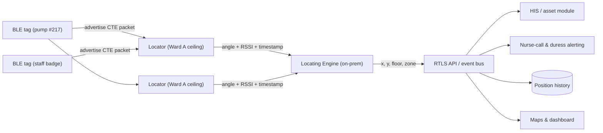

# Indoor Positioning Systems (IPS) and Real-Time Locating Systems (RTLS): A Comprehensive Guide

> **Author:** Jack Liu Shurui — Solution Architect at Crédit Agricole CIB, Singapore  
> **Context:** Technology Research — Indoor Positioning, RTLS, IoT Location, Wireless Technologies  
> **Repository:** [github.com/jackliusr/research](https://github.com/jackliusr/research)  
> **Last Updated:** August 2026

---

## Table of Contents

1. [Fundamentals — IPS, RTLS, and the Indoor Positioning Problem](#1-fundamentals--ips-rtls-and-the-indoor-positioning-problem)
2. [Radio Technologies](#2-radio-technologies)
3. [Positioning Techniques in Depth](#3-positioning-techniques-in-depth)
4. [Architecture of IPS/RTLS Systems](#4-architecture-of-ipsrtls-systems)
5. [Use Cases](#5-use-cases)
6. [Vendors and Products](#6-vendors-and-products)
7. [Standards and Ecosystem](#7-standards-and-ecosystem)
8. [Selection Framework](#8-selection-framework)
9. [Worked Example — Hospital Asset Tracking](#9-worked-example--hospital-asset-tracking)
10. [Future Outlook (2026+)](#10-future-outlook-2026)
11. [Glossary](#11-glossary)
12. [Claims Status, References and Further Reading](#12-claims-status-references-and-further-reading)

### How to Read This Guide

This is the dedicated deep-dive on **indoor positioning** in the `technology/` series. It is deliberately self-contained, but three sibling guides carry adjacent depth: the real-time/latency engineering behind "real-time" locating ([low_latency_cpp_development_guide.md](low_latency_cpp_development_guide.md), esp. §2 latency budget and §13 latency measurement), the event-stream processing that turns raw location updates into alerts and analytics ([complex_event_processing_guide.md](complex_event_processing_guide.md) §6–7), and the cloud backend that hosts locating engines and APIs ([cloud_providers_guide.md](cloud_providers_guide.md) §11). The machine-learning positioning material in §3.7 cross-references the repo's deep-learning guide ([ai_llm/deep_learning_frameworks_comparison_guide.md](ai_llm/deep_learning_frameworks_comparison_guide.md)). Suggested reading paths: **solution architects** start with §1, §4, §8, §9; **technology evaluators** start with §2, §6, §7; **domain leads** (healthcare/retail/industrial) start with §5 and §8.

**Note on verification.** This guide was researched in August 2026. Claims are marked **Verified** (confirmed against vendor, standards-body, or reputable industry sources during research), **Reported** (widely reported but not independently confirmed), or hedged in-line where sources diverge. The full claims-status table is in §12.1. The IPS/RTLS market moves fast — product names, accuracy claims, and vendor roadmaps should be re-verified against official sources before procurement decisions.

---

## 1. Fundamentals — IPS, RTLS, and the Indoor Positioning Problem

### 1.1 What Is IPS?

**Indoor Positioning Systems (IPS)** are systems that determine the physical location of a device, person, or asset inside a building or other enclosed space where satellite navigation (GPS/GNSS) does not work. IPS is frequently described as the **"indoor GPS"** — a shorthand that captures the goal (ubiquitous position awareness) while obscuring the reality: indoor positioning is *harder* than GPS, not easier, because it must work in non-line-of-sight (NLOS), multipath-rich, dynamically changing environments using short-range radio signals that were never designed for positioning.

Key properties that distinguish an IPS from plain connectivity:

- **Position output** — the system produces coordinates (x, y, z), a zone/room identifier, or a semantic location ("Oncology Ward, Room 4") rather than just "connected to AP-7".
- **Reference infrastructure** — it relies on fixed reference points (beacons, access points, locators/anchors) whose own positions are known.
- **A locating method** — signal measurements (strength, time, angle) are converted into position via one or more positioning techniques (§3).
- **A locating engine** — the computation happens somewhere: on the device, on a server, or in the cloud (§4).

### 1.2 What Is RTLS?

**Real-Time Locating Systems (RTLS)** are a specific, commercially important class of IPS where the emphasis is on **continuous, low-latency tracking of assets or people** — typically with dedicated tags attached to the tracked objects, and an update rate fast enough (1 Hz to 100 Hz) that the system reflects what is happening *now* rather than where the object was a minute ago.

| Dimension | IPS (broad sense) | RTLS (the tracking subset) |
|---|---|---|
| Primary question | "Where am I / where is it?" (one-shot or periodic) | "Where is it *right now*, and where has it been?" (continuous) |
| Typical client | A phone/device computing its own position | Tags + infrastructure computing positions for many assets |
| Update cadence | On demand to seconds | Sub-second to seconds, guaranteed |
| Typical use | Wayfinding, navigation, proximity marketing | Asset tracking, safety, process visibility, fleet/people monitoring |
| Accuracy drivers | Good enough to pick the right room/aisle | Decimetre-level where process decisions depend on it |

The two terms overlap heavily: an RTLS *is* an IPS that meets real-time and scale requirements, and most modern RTLS platforms (Quuppa, Sewio, Ubisense, Zebra, HID) describe themselves as both. Industry analysts (ABI Research, MarketsandMarkets) tend to treat "IPS" as the umbrella market and "RTLS" as the largest revenue segment within it.

### 1.3 The GPS Problem — Why Satellites Fail Indoors

**GNSS (Global Navigation Satellite Systems)** — GPS (US), Galileo (EU), GLONASS (Russia), BeiDou (China) — solve outdoor positioning superbly: a receiver needs line-of-sight to 4+ satellites, each broadcasting its position and precise time, and trilateration yields 3–10 m accuracy (sub-metre with differential corrections like RTK/SBAS). Outdoors, that is "good enough for navigation."

Indoors, GNSS fails for three physical reasons:

1. **Signal attenuation** — GNSS signals arrive at Earth at extremely low power (≈ −125 dBm at the surface). Roofs, concrete floors, steel framing, and low-e glass attenuate them by 10–30 dB or more. Many buildings are effectively Faraday cages at 1.5 GHz.
2. **Multipath** — signals that do penetrate bounce off walls, ceilings, and fixtures. The receiver sees a superposition of delayed copies, corrupting the time-of-arrival measurements that GNSS positioning depends on. Errors balloon from metres to tens of metres.
3. **No line-of-sight (NLOS)** — urban *indoor* environments have no direct satellite view at all; what little energy arrives does so via reflections and diffractions, which carry wrong ranging information.

Hence the positioning problem does not disappear at the front door — it changes character. Outdoors, the challenge is "which street am I on" (5–10 m). Indoors, the challenge is "which room, which shelf, which operating theatre, which pump in this rack" — a scale of **1 m down to 10 cm** in dense, cluttered, interference-rich spaces. This is the **"last meter" problem**: indoor positioning is the final metre of the location journey, and it is the hardest metre to deliver. It is also the most commercially valuable one: the last metre is where footfall becomes purchase intent, where an infusion pump is found in seconds instead of a 40-minute search, and where a forklift's proximity to a person triggers a safety stop.

The four constellations, for reference:

| Constellation | Operator | Status (2026) | Notes |
|---|---|---|---|
| GPS | US Space Force | Fully operational (24+ satellites) | The default; ~3–10 m standalone, sub-metre with corrections |
| Galileo | EU | Fully operational | Interoperable with GPS; strong European coverage |
| GLONASS | Russia | Fully operational | Commonly paired with GPS in multi-constellation receivers |
| BeiDou | China | Global coverage since 2020 (BDS-3) | Third-generation system; dominant in China/APAC handsets |

Multi-constellation receivers are standard today — but no constellation mix fixes the indoor problem, because the failure is physical (attenuation, multipath, NLOS), not a matter of satellite count.


### 1.4 Positioning Fundamentals — The Five Core Techniques

Every IPS/RTLS on the market is a variation or combination of five basic techniques. Understanding them explains every accuracy number, cost, and failure mode in this guide.

- **Trilateration (distance-based).** Measure the *distance* to three or more known reference points, draw circles of those radii around each reference, and the position is where the circles intersect. Distances come from signal strength (RSSI) or signal travel time (ToF/RTT). This is how GPS works, and how Wi-Fi RTT and UWB ranging work indoors. Requires ≥3 references in 2D (4 for 3D) and clean distance estimates — multipath corrupts the circles.
- **Triangulation (angle-based).** Measure the *direction* (angle of arrival, AoA) to reference points instead of distance. Two or more angular bearings from known locations intersect at the target position. Requires antenna arrays at the measuring node; this is the basis of Bluetooth 5.1 direction finding and UWB AoA systems. A single AoA measurement plus a known distance gives a position directly.
- **Fingerprinting (signal-map matching).** Build a map of what the radio environment "looks like" at every location (a *radio map* of RSSI vectors from all visible access points/beacons), then match live measurements against the map to infer position. This is the most common commercial approach — especially Wi-Fi fingerprinting — because it exploits the very multipath that breaks trilateration: the distortion is the signature. Accuracy depends on map density and environment stability.
- **Proximity (nearest-beacon).** The coarsest method: the position is simply "the location of the beacon/reader I am closest to" (or the set of beacons I can hear). Used for zone-level tracking, room-level presence, passive RFID portals, and geofencing triggers. Cheap, robust, low accuracy (room/zone granularity).
- **Dead reckoning (inertial).** Starting from a known position, integrate motion measured by an **IMU** (accelerometer, gyroscope, magnetometer) to track movement. **Pedestrian dead reckoning (PDR)** counts steps and estimates stride length and heading; inertial navigation integrates acceleration twice to get displacement. Without absolute fixes it drifts unboundedly, so it is always fused with a radio fix (§3.6). Invaluable for filling gaps between radio measurements and for phones, which all carry IMUs.

### 1.5 Position Metrics — How to Read an Accuracy Claim

Vendor marketing loves a single "accuracy" number. The professional way to evaluate a system is a small set of metrics:

| Metric | Definition | Why it matters | Typical values |
|---|---|---|---|
| **Accuracy** | Mean (or median) error between estimated and true position | Tells you the *average* miss | 0.1–0.3 m (UWB), 1–3 m (BLE AoA, Wi-Fi RTT), 3–10 m (Wi-Fi fingerprinting), room-level (proximity) |
| **Precision** | Error at the 95th percentile (or CEP: circular error probable) | Tells you the *worst case you can rely on* — the metric that matters for safety and process decisions | A system claiming "2 m accuracy" with 95th pct. of 6 m is very different from one with 3 m pct. |
| **Latency** | Time from the physical event to the position being available to the application | Real-time tracking, safety geofences, and interactive wayfinding die with latency | <100 ms for UWB RTLS; 1–5 s common for cloud Wi-Fi analytics |
| **Update rate** | How often a new position is computed per tag/device | Determines how fast an object can move before the track "smears" | 1 Hz (asset tracking), 10 Hz (people/robots), 100 Hz (sports/high-speed) |
| **Scalability** | Number of tags/devices supported per anchor, per engine, per site | Drives architecture and cost per tag | BLE AoA: thousands of tags per locator network; UWB: 100s–1000s per cell |
| **Cost** | Total cost of ownership: infrastructure + tags + software + calibration + maintenance | The deciding factor for most deployments (§8.3) | Tags US$5–100; anchors US$100–2,000; software per-tag-per-month or licence |

Two rules of thumb for this guide: **(1)** always ask for *precision (95th percentile)*, never just mean accuracy; **(2)** accuracy claims should be read as *best-case-in-field-trials* — the honest range for a deployed system is usually 2–3× the headline figure.

## 2. Radio Technologies

Every IPS/RTLS technology is a radio technology first and a positioning technology second. This section covers the physical-layer landscape — what each radio is, how it measures, what accuracy it can deliver, and where it fits. The techniques (how measurements become positions) are covered in §3.

### 2.1 Wi-Fi

Wi-Fi is the most widely deployed indoor-radio infrastructure on earth, which makes it the default starting point for IPS — no new hardware, phones and laptops already listen to it, and the enterprise already owns it.

- **Wi-Fi RSSI / fingerprinting — the most common IPS approach.** The device (or the network) records the received signal strength (RSSI) from every visible access point, producing a vector like `{AP1: −52 dBm, AP2: −61 dBm, AP3: −74 dBm}`. That vector is matched against a pre-surveyed radio map (§3.5). Because it exploits multipath as a signature rather than fighting it, fingerprinting works in dense indoor environments where trilateration fails. Typical accuracy: **3–10 m** — enough to identify the room or zone, not enough to find the exact shelf or bed. This is what powers Cisco Spaces, most mall/shop analytics, and the "Wi-Fi positioning" built into Google's and Apple's mobile location stacks.
- **Wi-Fi FTM / RTT (802.11mc / Fine Timing Measurement).** The 802.11mc amendment (ratified in the 802.11-2016 revision) adds **Fine Timing Measurement (FTM)**: the access point and client exchange timestamped packets and compute **round-trip time (RTT)**; distance = RTT × c / 2. Because it measures *time* rather than *strength*, RTT is far more robust to multipath fading than RSSI. Android has supported Wi-Fi RTT since **Android 9 (2018)** via the `WifiRtt` API, and Android 15 (2024) added "Wi-Fi Ranging" refinements; iOS does not expose FTM to third-party apps. **Verified accuracy: ~1 m** is achievable in good conditions (GPS World's field reporting cites "down to one-meter accuracy"), with a realistic deployed range of **1–3 m**. The next-generation Wi-Fi standard, **802.11az** (Wi-Fi 7 era), improves ranging further with secure RTT.
- **Wi-Fi 6/7 (802.11ax/be) improvements.** Wi-Fi 6 (2019) and Wi-Fi 7 (2024) improve positioning *indirectly*: OFDMA and MU-MIMO increase AP density and signal fidelity, 802.11az leverages the new physical layers for ranging, and the sheer density of modern enterprise Wi-Fi makes fingerprinting maps richer. No Wi-Fi generation changes the fundamental fingerprinting ceiling (3–10 m) — the big jump only comes from time-based ranging.

**Best for:** people analytics, footfall, wayfinding, room-level asset tracking, and any deployment that must reuse existing infrastructure. **Not for:** decimetre-level precision or safety-critical proximity.

### 2.2 Bluetooth Low Energy (BLE)

BLE is the other ubiquitous radio (every smartphone, tablet, and laptop has it), and it is the workhorse of the beacon economy.

- **BLE beacons.** Small, battery-powered transmitters that advertise a short identifier on a schedule. The three dominant formats: **iBeacon** (Apple, 2013 — the format that created the beacon market), **Eddystone** (Google, 2015 — open, with URL and telemetry frames), and **AltBeacon** (Radius Networks, 2014 — open, no platform affiliation). A phone or gateway measures the beacon's RSSI for **proximity** (near/far/unknown) and zone-level positioning.
- **BLE RSSI positioning.** Distance estimated from signal strength via a path-loss model, or matched against a fingerprint map. Typical accuracy **1–5 m** for proximity/zone work; beacon trilateration is noisy because BLE's 2.4 GHz signal is heavily absorbed by the human body and bounces off everything. Cheap (beacons cost US$5–20, run 1–3 years on a coin cell) and good enough for aisle/zone-level presence, proximity marketing, and "you are near the pharmacy counter."
- **BLE AoA/AoD — Bluetooth 5.1 direction finding (2019).** The Bluetooth Core Specification 5.1 (January 2019) added a direction-finding feature: the transmitter appends a **Constant Tone Extension (CTE)** (16–160 µs of unmodulated carrier) to the packet, and the receiver — equipped with an **antenna array** — samples the phase across antennas to compute the **Angle of Arrival (AoA)**. In the reverse direction, a device transmitting from multiple antennas lets the receiver compute **Angle of Departure (AoD)**. Two or more locators measuring angles triangulate a tag's position.
  - **Verified (Bluetooth SIG):** CTE field, AoA/AoD, introduced in v5.1 of the core spec.
  - **Accuracy:** vendor-claimed **<1 m** (Quuppa, the leading BLE AoA platform, cites sub-metre in optimal conditions); field-realistic deployments typically deliver **1–3 m**. BLE AoA systems use *locators* (access-point-like units with antenna arrays, US$300–1,500 each) and *dumb* tags (US$5–30) — which inverts the economics of UWB and makes it the best fit for tracking thousands of low-cost assets.
- **BLE Channel Sounding — Bluetooth 6.0 (2024).** The Bluetooth Core Specification **6.0 (adopted September 2024)** introduced **Channel Sounding**: phase-based ranging plus RTT that improves BLE distance measurement from ~3–5 m to **~30–50 cm**, with secure ranging against relay attacks. This is the Bluetooth SIG's strategic answer to UWB — centimetre-class ranging on a radio every phone already has, without antenna arrays. First commercial products were appearing through 2025–26; it will reshape the RTLS market over the next few years (§10).

**Best for:** zone/room-level presence (RSSI), high-volume asset tracking and people analytics (AoA), and future decimetre-level tracking (Channel Sounding). **Not for:** decimetre accuracy today without AoA locators.

### 2.3 Ultra-Wideband (UWB)

UWB is the precision champion: the only mature radio technology that delivers **10–30 cm accuracy** in real indoor conditions.

- **What it is.** UWB transmits **nanosecond-scale impulse pulses** across a very wide band (≥500 MHz, typically 3.1–10.6 GHz). The wide bandwidth gives extremely fine time resolution — the receiver can identify the *first* arriving pulse (the direct path) and separate it from multipath echoes that arrive microseconds later. Ranging is done by **time of flight (ToF)** or **time difference of arrival (TDoA)** of the pulses.
- **Accuracy.** **Verified: 10–30 cm** is the standard, repeatedly reproduced claim (IEEE 802.15.4z-era silicon, FiRa documentation, and vendor spec sheets all converge on this). In open line-of-sight, sub-10 cm is achievable; through walls and around metal, it degrades gracefully to ~0.5 m — still better than any competing radio.
- **UWB in phones.** Apple shipped the **U1 UWB chip in the iPhone 11 (September 2019)**; Samsung followed with its own UWB silicon; Google's Pixel 6 Pro (2021) onward includes UWB; and by 2024–25 UWB was standard in flagship Android devices. The phone-side chip turns the phone itself into an RTLS tag and enables UWB-based interactions (digital keys, precision finding, spatial sharing).
- **The FiRa Consortium (2019).** Formed in **2019** (with founding members including NXP, Samsung, Bosch, and others) to drive UWB *interoperability*: certification programs and the UWB MAC/PHY technical requirements that let devices from different vendors do **fine ranging** with each other. FiRa certification is the practical guarantee behind "my UWB phone ranges with that UWB car/access point."
- **UWB use cases.** (a) **Digital car keys:** the CCC **Digital Key Release 3.0** specification (published July 2021) uses UWB for passive, hands-free car access with relay-attack protection — BMW's Digital Key Plus (2021) was the first commercial implementation. (b) **Apple AirTag (April 2021):** a UWB-enabled item tracker; iPhones with the U1 chip get *precision finding* (arrow + distance) toward the tag, while the **Find My network** (crowd-sourced locating by nearby iPhones) covers everything else. (c) **Industrial UWB RTLS:** Sewio, Ubisense, Pozyx, Siemens, and others run UWB RTLS for forklift safety, tool tracking, and work-in-progress visibility in factories and warehouses.
- **Limitations.** Higher tag cost (US$15–100), higher power than BLE (months, not years, on a coin cell for continuous ranging), and anchors need line-of-sight-ish geometry for best results. Deployment density and calibration matter more than with BLE.

**Best for:** decimetre-level precision, safety, robotics, and any use case where position is a *process input* rather than an analytics signal.

### 2.4 RFID

RFID (Radio-Frequency Identification) is the oldest location-related radio technology and still the cheapest way to know *something is in this zone*.

- **Passive RFID.** Tags with no battery, powered by the reader's interrogation field; read range of centimetres (HF/NFC, 13.56 MHz) to metres (UHF). Positioning is inherently **proximity/zone-based**: a tag is "here" when it is read at this **gate, portal, or reader**. Used for inventory, tooling, and access control where zone granularity is acceptable.
- **Active RFID (RTLS).** Battery-powered tags transmitting at **433 MHz or 2.4 GHz**; readers across the facility determine presence, and some active systems do RSSI or TDoA-based location. This was the classic RTLS market (WhereNet/ Zebra's original 2.4 GHz active RFID; AeroScout — later Stanley Healthcare/HID — 433 MHz). Accuracy: **zone- to room-level**, with longer range than passive.
- **RAIN RFID.** The UHF (860–960 MHz) passive standard — "RAIN" is the industry alliance brand for ISO/IEC 18000-63 / EPC Gen2 UHF. RAIN reads pallets and cartons through cardboard at 3–10 m, which makes it the backbone of retail back-room and warehouse *visibility* — but as a positioning technology it is gate/portal/zone-based, not coordinate-based.

**Best for:** inventory presence, portals, and low-cost item-level visibility where "which zone" is the question. **Not for:** continuous tracking or coordinates.

### 2.5 The Rest of the Field

- **Ultrasonic.** Time-of-flight of ~40 kHz sound pulses between beacons and tags (the old Sonitor and current commercial niche). Sound travels slowly, so timing is easy, but ultrasound is blocked by walls, doors, and crowds; accuracy ~0.3–1 m line-of-sight. Rare today.
- **Infrared (IR).** Emitters (often modulated light) and receivers; strictly **line-of-sight**, room-level presence. The original "active badge" systems (e.g., 1990s Olivetti Active Badge). Now largely historical, with niche uses in retail shelf-level sensing.
- **Zigbee.** 2.4 GHz mesh (802.15.4); RSSI-based positioning is possible on existing Zigbee lighting/metering meshes. Accuracy 3–10 m; attractive only when the mesh already exists (e.g., smart-building lighting) because it avoids new infrastructure.
- **LoRa / LoRaWAN.** Sub-GHz long-range low-power; RSSI-based positioning (some networks add TDoA) gives **outdoor-to-indoor** accuracy of tens of metres — useful for yard management and campus-level asset tracking where sub-10 m is not required, and where tags must run for years on a battery. Not an indoor-precision technology.
- **5G NR positioning.** 3GPP **Release 16 (2020)** introduced native NR positioning: DL-TDOA, UL-TDOA, multi-RTT, DL-AoD, UL-AoA, and E-CID using positioning reference signals (PRS/SRS). **Release 17** enhanced it toward **sub-metre accuracy in commercial indoor environments** (per 3GPP-oriented analyses; <1 m horizontal is the design target in ideal conditions). Release 18 continues the work toward cm-level. 5G positioning is the long-term *outdoor-indoor* candidate: one infrastructure, carrier-grade, but requires 5G coverage of the venue and remains behind UWB on precision today.
- **Cellular / LTE positioning.** Observed Time Difference of Arrival (OTDOA) and cell-ID on LTE give 10–100 m+ accuracy — fine for outdoor coarse location, too coarse for indoor work except as a fallback.

### 2.6 Technology Comparison Table

| Technology | Typical accuracy | Range | Infra cost | Tag cost | Power | Latency | Typical use case | Best for |
|---|---|---|---|---|---|---|---|---|
| Wi-Fi fingerprinting | 3–10 m | floor/venue | None (reuse APs) | — (phones) | Phone | 1–5 s | Footfall, wayfinding, room presence | People analytics on existing Wi-Fi |
| Wi-Fi FTM/RTT (802.11mc) | 1–3 m | venue | AP upgrade | — (phones) | Phone | <1 s | Indoor nav, asset zones | Android phone positioning |
| BLE RSSI (beacons) | 1–5 m | 10–50 m | Low (gateways) | US$5–20 | Coin cell, 1–3 yr | 1 s | Proximity marketing, zone presence | Budget zone tracking |
| BLE AoA (BT 5.1) | <1–3 m | 10–30 m per locator | Locators US$300–1,500 | US$5–30 | Coin cell, 1–3 yr | 0.1–1 s | High-volume asset/people tracking | Thousands of cheap tags |
| BLE Channel Sounding (BT 6.0) | 0.3–0.5 m | 10–50 m | Gateway/AP | US$5–30 | Coin cell | <1 s | Emerging precision BLE (2025+) | Decimetre BLE without arrays |
| UWB (802.15.4z) | 0.1–0.3 m | 10–100 m | Anchors US$100–2,000 | US$15–100 | Battery, months–years | <100 ms | Safety, robotics, precision assets | Decimetre precision |
| Passive RFID / RAIN | Zone/portal | 0.01–10 m | Readers US$500–3,000 | <US$0.10–1 | None | Event-based | Inventory, portals, gates | Item presence, lowest cost |
| Active RFID | Zone–room | 30–100 m | Readers | US$20–60 | Years | 1–10 s | Legacy RTLS (433 MHz/2.4 GHz) | Yard/fleet zone tracking |
| Ultrasonic | 0.3–1 m (LOS) | 5–20 m | Beacons | US$20–60 | Battery | <1 s | Niche indoor (hospitals, legacy) | LOS-only niches |
| LoRaWAN | 10–50 m | 100 m–km | Gateways | US$10–30 | Years | 5–30 s | Yard, campus asset tracking | Long-range coarse tracking |
| 5G NR (Rel-16/17) | 1–10 m (sub-m target) | venue/campus | Carrier/private 5G | — (phones) | Phone | <1 s | Carrier-grade outdoor-indoor | Convergence, one infrastructure |
| Geomagnetic/visual | 0.5–5 m | venue | None (mapping) | — (phones) | Phone | 1–5 s | Nav apps where no beacons allowed | Phone-only wayfinding |


### 2.7 How to Read Vendor Accuracy Claims

Accuracy claims in this market are negotiated, not measured — the same product can appear as "<1 m", "1–3 m", or "sub-metre" depending on the sales deck. Three questions cut through the noise:

- **Under what conditions?** Open corridor line-of-sight vs dense racking/wards changes results by 2–5×. Ask for the *deployment conditions* behind the number.
- **At what percentile?** A "2 m accuracy" claim that is a 50th-percentile figure hides a 95th-percentile of 6 m. Demand both numbers (§1.5).
- **With what density?** Accuracy scales with anchor/locator density — the vendor's demo grid is usually denser than your budget will buy. Ask for the accuracy-vs-density relationship, then price *your* density.

Independent validation (a ground-truthed pilot, §8.4) is the only reliable answer.


## 3. Positioning Techniques in Depth

Section 2 covered the radios; this section covers the mathematics — how raw radio measurements (strength, time, angle) become coordinates. Every technique below has a specific failure mode, and every serious product fuses several of them.

### 3.1 RSSI — Received Signal Strength

**Idea:** a receiver measures the power of a known transmission; a **path-loss model** converts power to distance (`RSSI = P0 − 10·n·log10(d)`, where n is the environment's path-loss exponent, typically 2 in free space and 2.5–4 indoors). With distances to ≥3 references, trilaterate.

**Limitations:** RSSI is the *noisiest* positioning measurement in radio. Indoors, the signal at any point is the sum of many paths (multipath) that fade and interfere; walls, people, and metal change attenuation by 10–20 dB; and the environment drifts (doors open, stock moves, people crowd). A ±3 dB RSSI error maps to roughly ±30–50% distance error. RSSI is adequate for zones and for *fingerprinting* (where the noise is the signature), and poor for absolute trilateration. This is why BLE beacon trilateration disappoints and why UWB never uses RSSI.

### 3.2 ToF — Time of Flight

**Idea:** measure the one-way or round-trip propagation time of a signal; distance = time × speed of light (≈ 0.3 m per nanosecond). UWB's nanosecond pulses make ToF practical: 1 ns of timing error = 30 cm of distance error, and UWB receivers time-stamp pulse arrival to ~100 ps–1 ns. Round-trip (two-way ranging, TWR) avoids requiring synchronized clocks between tag and anchor. **Single-sided TWR** exchanges two messages; **double-sided TWR** exchanges three, cancelling clock-offset errors — this is the workhorse of UWB ranging (802.15.4z).

**Strengths:** robust to multipath (first-path detection), no clock sync needed for TWR. **Limitations:** needs the direct path to be detectable; heavily obstructed geometry degrades it.

### 3.3 TDoA — Time Difference of Arrival

**Idea:** a tag transmits once; multiple **synchronized anchors** record the arrival time. The *difference* in arrival times between pairs of anchors defines hyperbolas (locus of points where the time-difference is constant); the intersection of hyperbolas from ≥3 anchor pairs is the position. TDoA is the classic *network-centric* RTLS approach (Sewio, Ubisense, and many UWB systems use it).

**Requirements:** the anchors must share a common timebase to within nanoseconds — achieved with wired sync, RF sync beacons, or wired backbone (e.g., PoE + sync pulses, or IEEE 1588 PTP). The tag only transmits, so tags can be very simple and low-power. **Limitations:** sync infrastructure is the cost; and in dense metal environments, first-path detection errors dominate.

### 3.4 AoA — Angle of Arrival

**Idea:** a receiver with an **antenna array** (2–12+ elements) measures the phase difference of the incoming wave across the array and computes the direction of arrival. Two or more angle measurements from known positions triangulate the target; one angle + one range (AoA + ToF) also yields a position (this combination is used by UWB AoA systems and by BLE 5.1 locators paired with RSSI range).

- **Bluetooth 5.1 AoA:** the CTE lets the locator sample phase across its array while the tone is being transmitted. Quuppa-style locators use this to resolve a tag's bearing; a pair of locators gives a metre-class fix.
- **UWB AoA:** with UWB's fine time resolution, AoA can be combined with ToF for single-anchor positioning — one anchor measures range and angle, which is how some industrial UWB deployments cover corridors with fewer anchors.

**Strengths:** fewer references needed (2 angles instead of 3 distances); **limitations:** requires calibrated antenna arrays (expensive, bulky, angle-dependent accuracy that degrades off-boresight), and multipath can create phantom bearings.

### 3.5 Fingerprinting — Signal-Map Matching

**Idea:** instead of modelling physics, *measure the world*. Two phases:

1. **Offline mapping (survey).** Walk the venue with a calibration device, recording at each survey point the RSSI vector from every visible AP/beacon: `{AP1: −52, AP2: −61, …}` plus the known coordinate. The result is a **radio map** — a database of fingerprints. A 10,000 m² floor might need 500–2,000 survey points (1–3 m grid, denser in problem areas).
2. **Online matching.** At runtime, a device's live RSSI vector is compared against the radio map. **k-NN (k-nearest neighbours)** averages the coordinates of the k most similar map entries; **probabilistic methods** (Bayesian, maximum-likelihood over a position grid) treat RSSI as a conditional distribution and find the most likely cell. Kalman/particle filters smooth the output over time.

**Pros:** exploits multipath instead of fighting it; works with commodity Wi-Fi/BLE; 3–10 m Wi-Fi, 1–3 m dense-BLE with good maps. **Cons:** the map goes stale (environment changes → re-survey); survey effort is real cost; accuracy varies by location ("fingerprint-sparse" areas are bad); and RSSI variance between device models biases matching. This is why fingerprinting vendors now use **crowd-sourced map updates** and ML (§3.7) to keep maps alive.

### 3.6 Sensor Fusion — IMU, Dead Reckoning, and Hybrid Positioning

No single measurement is trustworthy every instant, so production systems fuse:

- **IMU / PDR.** The phone or tag's accelerometer + gyroscope + magnetometer drive **pedestrian dead reckoning**: detect steps (step counting), estimate stride length from cadence/height, and track heading. PDR is smooth and high-rate (10–100 Hz) but *drifts* — heading error accumulates and position wanders.
- **The fix + drift marriage.** A Kalman filter (or its nonlinear cousins — **extended Kalman filter (EKF)** for nonlinear models, **particle filter** for non-Gaussian/multi-modal belief) combines low-rate absolute radio fixes (UWB/BLE/Wi-Fi, 0.5–10 Hz) with high-rate inertial dead reckoning (10–100 Hz). The radio fixes correct the drift; the IMU fills the gaps between fixes and smooths jitter. Particle filters are particularly good indoors: they represent the belief as a cloud of hypotheses that can be constrained by maps ("particles cannot walk through walls") — a cheap way to inject building geometry.
- **Hybrid multi-technology positioning.** Mature platforms fuse *multiple radios* too: BLE for presence + UWB for precision on demand; Wi-Fi for coarse + IMU for continuity; 5G + Wi-Fi in converged networks. The pattern is always the same: weak-but-ubiquitous measurement, strong-but-sparse measurement, inertial between them, map constraints on top.

### 3.7 Machine Learning — Learned Positioning

The ML wave hit positioning in two distinct ways (cross-ref the repo's deep-learning guide, [ai_llm/deep_learning_frameworks_comparison_guide.md](ai_llm/deep_learning_frameworks_comparison_guide.md), for the model tooling):

- **Neural fingerprinting.** Instead of k-NN on RSSI vectors, train a model to map fingerprints → coordinates. **CNNs** treat the RSSI vector as a 1-D image (or a floor's RSSI "heatmap" as a 2-D image) and learn spatial features; **LSTMs/transformers** exploit the temporal sequence of measurements ("the fingerprint stream") to smooth and predict trajectories. Reported results beat k-NN by 20–50% in challenging environments, at the cost of needing enough labelled survey data.
- **Learned radio maps / auto-calibration.** Rather than expensive manual surveys, ML models learn the radio map from *unlabelled* crowd-sourced walks (using PDR + known landmarks as weak labels), and detect when the map has drifted. This is the technology behind "survey-free" or "self-calibrating" indoor positioning, and it is where most commercial innovation is happening.
- **Position as a service input.** ML also consumes position: occupancy forecasting, queue-time prediction, and customer-journey analytics in retail are all downstream ML over RTLS data.


### 3.8 Technique × Technology Fit Matrix

| Technique | Natural radio partners | Typical accuracy | Typical role |
|---|---|---|---|
| RSSI distance (path-loss) | Wi-Fi, BLE, Zigbee | 3–10 m (trilaterated) | Coarse fallback; rarely used alone for coordinates |
| RSSI fingerprinting | Wi-Fi, BLE | 3–10 m (Wi-Fi), 1–3 m (dense BLE) | The default for people analytics |
| ToF / TWR | UWB (802.15.4z), Wi-Fi RTT | 0.1–0.3 m (UWB), 1–3 m (Wi-Fi RTT) | Precision ranging, safety |
| TDoA | UWB (LoRaWAN, active RFID variants) | 0.1–0.5 m (UWB) | Network-centric RTLS at scale |
| AoA | BLE 5.1, UWB | <1–3 m (BLE), 0.1–0.5 m (UWB) | Cheap-tag tracking; single-anchor UWB |
| PDR + fusion | IMU + any radio | Drift-free only with radio fixes | Fills gaps, raises update rate |
| Learned models | Wi-Fi/BLE/UWB + survey data | Approaches the radio ceiling | Survey-free maps, smoothing |

The pattern: **the radio decides the accuracy ceiling; the technique decides how close to the ceiling you get**; fusion and ML decide how consistently you stay there.


---

## 4. Architecture of IPS/RTLS Systems

### 4.1 Components

Every IPS/RTLS decomposes into the same five layers:

```
Tags (mobile) ──radio──▶ Anchors (fixed) ──network──▶ Locating Engine (server)
                                                          │
                                                          ▼
                                        Backend / Cloud (data, APIs, storage)
                                                          │
                                                          ▼
                              Applications (dashboards, apps, integrations)
```

- **Tags** — the mobile element: dedicated RTLS tags (BLE/UWB/RFID), phones running an app, badges, or passive RFID labels. Tags may transmit (beacons, UWB responders), listen (phones), or both.
- **Anchors** — fixed reference points with known positions: BLE locators/beacons, Wi-Fi APs, UWB anchors, RFID readers, LoRa gateways. The radio-facing infrastructure.
- **Locating engine** — the positioning server that converts raw measurements into coordinates/zones: TDoA solvers, AoA intersection, fingerprint matchers, fusion filters. Runs on-prem or in the cloud; for device-based systems it runs inside the phone.
- **Backend / data platform** — storage, APIs (REST/WebSocket/MQTT), geofencing rules, event streams, and integration layers (export to HIS/ERP/WMS). This is where the cloud guide's patterns apply ([cloud_providers_guide.md](cloud_providers_guide.md) §11 for selection).
- **Applications** — dashboards, map visualizations, mobile wayfinding, alerting (nurse call, duress, geofence breach), and analytics (heatmaps, dwell, journey).

### 4.2 Network-Based vs Device-Based vs Hybrid

| Architecture | Who measures | Who computes | Typical systems | Pros | Cons |
|---|---|---|---|---|---|
| **Network-based (network-centric)** | Anchors measure the tag's signal | Server engine | UWB TDoA (Sewio, Ubisense), BLE AoA (Quuppa), active RFID | Tags are dumb/cheap/low-power; one engine serves many tags; per-tag battery years | Infrastructure-heavy; anchor sync and calibration critical |
| **Device-based (device-centric)** | The device measures anchor signals | On-device engine (phone) | Wi-Fi fingerprinting on phones, Wi-Fi RTT (Android), GNSS-assisted | No tag hardware; leverages phone sensors (IMU fusion); scales with users | Phone battery drain; per-device calibration variance; you can't track phones you don't control |
| **Hybrid** | Both | Both, per use case | Modern platforms (Zebra, HID, Quuppa+app, UWB+BLE combos) | Best of both: dumb tags for assets, phones for people | Most complex; two integration surfaces |

The architectural choice is usually dictated by *what you can put on the moving object*: a hospital won't charge its 500 infusion pumps daily, so network-based with coin-cell tags wins; a mall wants visitors' phones, so device-based wins.

### 4.3 Deployment — Survey, Calibration, Coverage

Deployment is where IPS projects live or die — the radio physics don't change, but the anchor plan does:

- **Site survey.** For fingerprinting: the radio-map walk (§3.5). For range/AoA systems: a **coverage/geometry survey** — where anchors can be mounted, what the sightlines are, where metal and interference live. RF planning tools (and increasingly AI planners) produce the first anchor layout; field tuning follows.
- **Calibration.** Anchors must know their own position precisely (measure, not guess — a 10 cm anchor-position error is a permanent 10 cm system error) and, for TDoA, their time synchronization must be validated. AoA arrays need boresight/azimuth calibration. Post-install, a **validation walk** compares system output against ground-truth checkpoints and produces the real accuracy/precision numbers (§1.5).
- **Coverage and anchor placement rules of thumb.** UWB: anchors every 10–40 m with overlapping coverage, ≥3–4 in view for 3D; avoid corridors-only geometry (bad dilution of precision). BLE AoA: locators every 10–30 m, mounted for good tag visibility (near ceilings, angled); one locator per room for zone-level. BLE beacons: 5–15 m spacing, dense near decision points. Wi-Fi: no new hardware, but fingerprint density follows AP density — weak Wi-Fi areas are dead zones.

### 4.4 What "Real-Time" Actually Means in RTLS

RTLS vendors all claim "real-time," but the term spans three orders of magnitude:

| Class | Update rate | Latency budget | Example workloads |
|---|---|---|---|
| Presence / analytics | 0.1–1 Hz (every 1–10 s) | seconds | Footfall, occupancy, asset "last seen" |
| Asset tracking | 1 Hz | <1 s | Infusion pump location, tool tracking |
| Process / safety | 10 Hz | <100 ms | Forklift proximity alerts, AGV positioning |
| Performance / high-speed | 100 Hz | <10 ms | Athlete tracking, robot motion control |

The engineering rule is the same one from the low-latency guide ([low_latency_cpp_development_guide.md](low_latency_cpp_development_guide.md) §2): define the *budget* end-to-end (sensor → engine → application), then verify each hop. A 1 Hz tag with a 5-second cloud round-trip is not "real-time" for a forklift safety system, even if the vendor's dashboard is pretty. For event-driven consumers (geofence breach, duress, nurse call), the event stream itself is the product — the repo's CEP guide ([complex_event_processing_guide.md](complex_event_processing_guide.md) §7) covers processing those streams (dwell detection, zone transitions, pattern alerts).


### 4.5 Data Flows and Event Types

RTLS data divides into three flow classes, each with different consumers:

- **Position streams** — continuous (x, y, z, floor, timestamp, confidence) per tag at the configured update rate. Consumed by dashboards, analytics, and history. High volume: 850 tags × 1 Hz ≈ 73M points/day.
- **Zone events** — derived transitions ("pump #217 entered Operating Room 2", "badge #114 exited Ward B"). These are the *business* data (asset in wrong zone, duress, wandering) — sparse but high-value, and they map directly onto the event-processing patterns in the CEP guide ([complex_event_processing_guide.md](complex_event_processing_guide.md) §6).
- **Geofence alerts** — thresholded zone events with policy attached (alert the nurse, interlock the machine, write the audit log). Latency-sensitive; this is where the real-time budget (§4.4) is enforced.

Architecturally, a locating engine that only offers a dashboard is a demo; one that offers a typed event API (REST/WebSocket/MQTT) with per-tag subscriptions is a platform. Prefer the latter.


## 5. Use Cases

IPS/RTLS value is entirely use-case-driven: the same radio can be a cost centre or a safety system depending on what it tracks, how fast, and with what accuracy. This section covers the major verticals, with the banking angle (§5.8) reflecting this repo's domain focus.

### 5.1 Healthcare — the Original RTLS Vertical

Hospitals were where modern RTLS was born (AeroScout/Stanley, Ekahau, Cisco Motion in the 2000s) and remain its largest enterprise market:

- **Asset tracking.** Infusion pumps, wheelchairs, ventilators, and telemetry monitors are expensive, shared, and constantly misplaced. A 500-pump hospital can lose hours of nursing time daily hunting equipment (see the worked example in §9). RTLS gives "find pump #217" in seconds, plus **utilization analytics** — which pumps are idle, which departments hoard them.
- **Patient tracking.** Patient flow visibility (waiting → triage → treatment → discharge), **wandering prevention** for dementia/psychiatric wards (geofenced exits, alerts), and infant protection (tagged baby + mother matching at maternity wards).
- **Staff safety.** **Duress/panic buttons** on staff badges with immediate location — the location is the whole point of the alert ("nurse in room 214 pressing duress"); lone-worker checks in psychiatric and night-shift settings.

**Tech mix:** BLE tags (assets, staff badges) and BLE AoA/UWB where room-level precision matters; Wi-Fi where infrastructure reuse dominates. Hospital deployments are notoriously sensitive to tag battery life (no recharging rounds) and to RF interference regulations.

### 5.2 Retail — Analytics and the "Smart Store"

Retail was the first mass-market IPS adopter via beacons and Wi-Fi analytics:

- **Footfall and traffic.** Counts per entrance/zone, **dwell time** per department, **heatmaps** of where customers linger, and **customer journey** reconstruction (path through the store, aisle sequences, exit). This is the analytics layer that pairs naturally with loyalty data and the repo's [customer_lifetime_value_prediction.md](customer_lifetime_value_prediction.md) material — location is a rich behavioural feature.
- **Proximity marketing.** Beacons triggering offers ("you are in the wine aisle") via app push; in-store navigation to a product.
- **Smart store ops.** Queue management at checkouts, staff-to-customer ratio optimization, back-of-house stock accuracy (RAIN RFID on garments), and theft/loss analysis (item + zone correlations).

**Tech mix:** Wi-Fi fingerprinting and BLE beacons dominate (footfall at scale); RAIN RFID for item-level; BLE AoA for dense zones like counters. Accuracy needs are modest (1–5 m) — the value is in *coverage and consistency*, not precision.

### 5.3 Warehouses and Logistics

- **Forklift tracking.** Position + speed + zone per forklift; **anti-collision** (forklift-to-person proximity alerts) is a genuine safety win with a hard ROI; also driver accountability and traffic-flow analysis.
- **Inventory / cycle counting.** Locate pallets and bins without barcode scanning walks; RTLS + WMS integration replaces "find the SKU" time. RAIN RFID on cartons + UWB/BLE on pallet tags is a common hybrid.
- **Pick-by-light / put-to-light** — the task prompt's question mark is warranted: pick-by-light is a *light-directed picking* method (station lights), historically not an RTLS product. RTLS contributes the adjacent piece: **task-to-person** and **zone-based picking validation** ("picker in zone 7 picked bin 7A"). It is complementary, not equivalent.

**Tech mix:** UWB (forklift safety, AGV), BLE AoA (pallet/tote tracking at scale), RAIN (cartons). Warehouses are RF-hostile (rack steel, moving metal) — calibration and anchor density are the difference between success and a shelf demo.

### 5.4 Manufacturing and Industry

- **Work-in-progress (WIP) tracking.** Where is each assembly? Which station, how long? RTLS replaces manual scanning and supports lean/cycle-time analysis.
- **Tool and fixture tracking.** Find the drill jig for job #442 in seconds; anti-loss geofences around tool cribs.
- **Safety geofencing.** Restrictive zones (robots, hazardous areas, high-voltage) trigger alerts or machine interlocks when a tagged person enters. This is the industrial UWB sweet spot (Siemens SIMATIC RTLS, Sewio, Ubisense deployments) because it demands <1 m precision *and* <100 ms latency (§4.4).
- **AGV/robot coordination.** Robots and people sharing floors need continuous high-rate position for both.

### 5.5 Logistics Yards and Campuses

Containers, trailers, and pallets in yards and across campuses: LoRaWAN and active RFID give tens-of-metres accuracy with multi-year tag batteries — **yard management** (which trailer is at which dock, dwell time, demurrage avoidance) is a classic ROI case. Indoors-to-outdoors continuity (cross-dock → yard) favours technologies that span both (UWB with longer-range anchors, LoRa).

### 5.6 Smart Buildings — Occupancy and Energy

- **Occupancy sensing** from Wi-Fi/BLE presence feeds **HVAC control** (setback unoccupied zones), lighting, and cleaning schedules. Energy savings of 10–30% on HVAC are the standard claimed range for occupancy-driven control (vendor-reported; verify per building).
- **People counting** for safety limits, space planning, and lease/utilization analytics.
- **Emergency** — last-known locations to aid evacuation/roll-call, increasingly a regulatory conversation.

### 5.7 Workplace and Public Venues

- **Desk finder / hot-desking:** show which desks are free, enable desk booking tied to actual presence.
- **Wayfinding:** turn-by-turn indoor navigation in malls, airports, hospitals, and stations — the consumer-facing IPS that made the term famous. Phone-based (device-centric) with maps from Mappedin/IndoorAtlas-style providers.
- **Contact tracing (COVID-era):** BLE/Wi-Fi proximity and co-location logs for exposure notification; a burst of deployments in 2020–22 that mostly wound down but left the infrastructure (and the privacy playbook) in place.

### 5.8 Banking — Branch Analytics, ATM Monitoring, Secure Zones

For a bank, indoor positioning splits into customer-facing and operations-facing value (see the repo's banking series, e.g., [programmable_business_bank_guide.md](../banking/programmable_business_bank_guide.md), for the channel/operations context):

- **Branch analytics.** Footfall, queue length and wait time per teller/self-service zone, dwell in the wealth-advisory corner, and **journey-to-conversion** analysis (does the person who lingered at the investment wall actually book an appointment?). Location data feeds staffing models and branch layout decisions — the same metrics as retail §5.2, with branch-compliance sensitivities.
- **ATM and self-service monitoring.** Utilization per machine, queue-busting alerts (staff dispatched when the ATM line exceeds a threshold), and predictive maintenance triggers when dwell anomalies appear.
- **Secure zones and geofencing.** Vaults, cash rooms, and restricted areas: **geofenced presence** with alerting when untagged or unauthorized movement occurs; duress for cash-handling staff; audit trails of who was where — valuable for both security and disputes. Precision requirements here are *zone-level*, and privacy/consent governance is paramount (see §10.5).
- **Trading floor / operations asset tracking** — the task prompt's parenthetical "see the banking context": trading floors and data centres track high-value hardware (blades, monitors, laptops), run egress control on devices leaving the floor, and use indoor location for hot-desking and floor utilization. The low-latency trading context is covered in [low_latency_cpp_development_guide.md](low_latency_cpp_development_guide.md) §18; the location system itself is a conventional RTLS deployment with unusually strict security requirements.

### 5.9 Sports and People Tracking

- **Athlete tracking.** UWB and optical systems (e.g., Kinexon, Zebra Sports) track players at 100 Hz with decimetre accuracy for performance analytics (distance, speed, acceleration, positioning heatmaps) and, in some leagues, officiating aids. This is the extreme end of the update-rate spectrum (§4.4).
- **Workforce "people tracking."** Badge-level tracking of employees (who is where, when) raises serious **privacy and labour-law** questions — many jurisdictions require consent and restrict monitoring (see §10.5). The technology is the same as asset tracking; the governance is entirely different.


### 5.10 Use-Case Summary Matrix

| Use case | Primary tech | Accuracy needed | Update rate | Key success metric |
|---|---|---|---|---|
| Hospital asset tracking | BLE AoA / UWB | Room–bed | 1 Hz | Find time, utilization % |
| Patient wandering prevention | UWB / BLE AoA | Sub-metre at exits | 1–10 Hz | Alert latency, false-alarm rate |
| Staff duress | BLE AoA / UWB | Room | Event | Time-to-locate <1 s |
| Retail footfall/dwell | Wi-Fi / BLE RSSI | 3–5 m | 0.1–1 Hz | Journey completeness |
| Warehouse pallets | BLE AoA | 1–3 m | 1 Hz | Cycle-count time |
| Forklift safety | UWB | <1 m | 10 Hz | Near-miss rate |
| Manufacturing WIP | UWB | ~0.3 m | 1–10 Hz | Cycle-time variance |
| Yard management | LoRaWAN / active RFID | 10–30 m | 0.1 Hz | Trailer dwell time |
| Occupancy / HVAC | Wi-Fi / BLE | Zone | 0.1 Hz | kWh saved |
| Athlete tracking | UWB / optical | 0.1–0.3 m | 100 Hz | Motion-metric validity |

The column that decides the technology is almost never "accuracy" alone — it is the combination of *update rate × tag power budget × tag cost*.


---

## 6. Vendors and Products

The vendor landscape splits cleanly into **consumer trackers** (find-my-my-keys) and **enterprise RTLS** (track-many-things). Both are moving fast — treat vendor details as of August 2026.

### 6.1 Consumer Trackers

- **Apple — AirTag (April 2021).** The category-defining tracker: US$29, U1 **UWB** chip for precision finding on iPhone 11+, CR2032 battery (~1 year), and the **Find My network** — crowd-sourced locating via any nearby Apple device (claimed "billions of devices" worldwide). Bluetooth for the network, UWB for the last metres. Its success created the anti-stalking backlash that forced the industry's tracker-alert standards (§10.5).
- **Samsung — Galaxy SmartTag2 (2023).** Updated the SmartTag line (original SmartTag 2021; SmartTag+ added UWB). SmartTag2 pairs BLE with **UWB precision finding on Galaxy UWB phones**, IP67 durability, ~500-day battery, and Samsung's SmartThings Find crowd network. Note: precision finding needs a UWB-capable Galaxy; other Androids get BLE-only.
- **Tile (Life360).** The pre-AirTag market leader: BLE-only trackers with the **crowd-find** Tile network (Life360 acquired Tile in 2021). No UWB in most products; lower precision than AirTag, but cross-platform and cheaper. The Google Find My Device network has eroded its Android uniqueness.
- **Google — Find My Device network (2024).** Google's crowd-sourced **Find My Device** network launched in phased rollout from **April 2024**, aggregating billions of Android devices, with **UWB precision finding** ("Finder" experience) on Pixel 8+/9-class phones and compatible tags (Chipolo, Pebblebee, Moto Tag). The Android answer to AirTag — and the largest new locating network by device count.
- **Motorola — Moto Tag (2024).** A UWB tag riding Google's Find My Device network with UWB precision finding on compatible Pixels/Motos — notable as the first non-Pixel UWB tag for Android's network.

### 6.2 Enterprise RTLS Vendors

- **Quuppa (Finland) — BLE AoA.** The reference implementation of Bluetooth 5.1 AoA: ceiling-mounted locators with antenna arrays + a locating engine that tracks thousands of tags simultaneously, with a large partner ecosystem (locator and tag OEMs). Vendor-claimed sub-metre; field 1–3 m. The default choice for high-volume, low-cost-tag tracking (hospitals, warehouses, retail).
- **Sewio (Czech Republic) — UWB RTLS.** UWB anchors + tags + engine, TDoA-based, strong Industry 4.0 footprint, developer-friendly APIs, and an omlox-aligned ecosystem. The reference choice for industrial UWB pilots.
- **Ubisense (UK) — UWB RTLS.** One of the oldest UWB RTLS companies (founded 2003), strongest in automotive manufacturing (assembly tracking) and defence; TDoA/AoA hybrid UWB. Long deployment history, more traditional integration.
- **Pozyx (Belgium) — UWB for developers.** Maker-friendly UWB kits (tags, anchors, Arduino/Raspberry Pi shields), 10 cm-class accuracy, omlox support, and a developer-first ecosystem — the default starting point for DIY and POC work (§8.4).
- **Zebra Technologies — industrial RTLS.** Zebra's heritage is the WhereNet active-RFID RTLS (2.4 GHz) and later the **Zebra RTLS / MotionWorks** line, plus **Zebra Sports** athlete tracking. Note (hedged): Zebra has been de-emphasising its legacy healthcare RTLS hardware in favour of partners (e.g., HID) — verify the current portfolio before planning around it. Zebra's enduring strength is barcode/RFID hardware + enterprise software across retail/warehouse.
- **Cisco — Cisco Spaces (formerly DNA Spaces).** Wi-Fi-based positioning and location analytics that **reuse existing Cisco (and third-party) Wi-Fi infrastructure** — cloud location engine, no new radio hardware. The default "we already have Cisco Wi-Fi" answer for people analytics and asset visibility; also offers BLE. DNA Spaces was rebranded as **Cisco Spaces** (announced 2021).
- **HID — HID RTLS.** A major healthcare RTLS player (heritage incl. AeroScout/Stanley Healthcare assets) with badge/tag + infrastructure + integration into hospital workflows (nurse call, EHR); also broad access-control synergy.
- **Siemens — SIMATIC RTLS.** UWB-based industrial RTLS (heritage from the Agilion acquisition, 2017) integrated with Siemens automation (SIMATIC, TIA) — positioning as part of the automation stack rather than a standalone silo.
- **Infsoft (Germany) — software platform.** Technology-agnostic locating software (engine, maps, analytics) that runs on top of various radios — useful when the organisation wants one platform across BLE/Wi-Fi/UWB/RFID.
- **Wiser — BLE AoA (reported, unverified).** The task brief lists "Wiser Locating" as a BLE AoA vendor; public detail is thin — treat as a smaller/regional player and verify against current listings before including in a shortlist.
- **Indoor map providers — Mappedin / IndoorAtlas.** Not RTLS hardware: **Mappedin** (Canadian) provides indoor maps + wayfinding SDKs used by malls/venues; **IndoorAtlas** (Finnish pioneer) is known for **geomagnetic fingerprinting** phone positioning and indoor mapping. Both are the "map + navigation" layer that RTLS positions render onto.

### 6.3 Vendor Comparison Table

| Vendor | Technology | Focus | Accuracy | Ecosystem | Best for |
|---|---|---|---|---|---|
| Apple AirTag | UWB + BLE (Find My) | Consumer item finding | <1 m (UWB precision) | Billion-device Find My network | iPhone users finding keys/luggage |
| Samsung SmartTag2 | UWB + BLE (SmartThings Find) | Consumer item finding | <1 m (UWB, Galaxy) | SmartThings Find network | Galaxy users |
| Tile / Life360 | BLE (crowd-find) | Consumer item finding | 5–30 m zone | Tile network, cross-platform | Budget cross-platform tracking |
| Google Find My Device | BLE + UWB (2024 network) | Consumer item finding | <1 m (UWB on Pixel-class) | Android billion-device network | Android users, 3rd-party tags |
| Quuppa | BLE AoA (BT 5.1) | High-volume asset/people tracking | <1–3 m (vendor sub-m) | Large locator/tag OEM ecosystem | Hospitals, warehouses, thousands of cheap tags |
| Sewio | UWB (TDoA) | Industrial RTLS | 10–30 cm | UWB ecosystem, omlox-aligned | Factory, forklift safety, WIP |
| Ubisense | UWB (TDoA/AoA) | Manufacturing RTLS | 10–30 cm | Long-standing automotive/defence installs | Automotive assembly tracking |
| Pozyx | UWB | Developer kits / POCs | 10 cm class | Maker + omlox ecosystem | DIY, robotics labs, pilot builds |
| Zebra | RFID + RTLS + software | Industrial/retail hardware+software | Zone–m (varies) | Broad hardware/software portfolio | Warehouses, retail ops (verify RTLS roadmap) |
| Cisco Spaces | Wi-Fi (RSSI) + BLE | People analytics on existing Wi-Fi | 3–10 m | Cisco + partner Wi-Fi installs | Enterprises with Cisco Wi-Fi |
| HID | BLE/active RFID RTLS | Healthcare + access control | Room–zone | Hospital integration ecosystem | Healthcare asset/staff safety |
| Siemens SIMATIC RTLS | UWB | Industrial automation-integrated | 10–30 cm | Siemens automation stack | Automotive/industrial plants |
| Infsoft | Multi-radio software | Locating engine + maps | Tech-dependent | Radio-agnostic platform | One platform across technologies |
| Wiser | BLE AoA (reported) | Indoor locating | <1–3 m (reported) | Niche/regional (unverified) | Verify before shortlisting |
| Mappedin / IndoorAtlas | Maps + geomagnetic | Wayfinding layer | 0.5–5 m (IndoorAtlas) | Map SDKs for venues | Mall/venue wayfinding apps |

### 6.4 The Silicon Layer

Behind the systems sit the chip vendors that decide what is even possible: **NXP** (major UWB silicon + FiRa/CCC leadership), **Qorvo** (via its **Decawave** acquisition — the DW1000/DW3000 UWB transceivers that power most industrial UWB tags/anchors), **Apple** (U1 in iPhone 11 2019, U2 in iPhone 15 2023), **Samsung** (Exynos Connect UWB), Qualcomm and Broadcom (Wi-Fi RTT, BT 6.0 Channel Sounding support), and Nordic/Silicon Labs (BLE). The chip roadmap *is* the IPS roadmap: Channel Sounding and 802.15.4z silicon availability gate what vendors can ship.


### 6.5 Vendor Evaluation Checklist

When shortlisting RTLS vendors, score on a fixed rubric rather than demo charm:

- **Openness** — omlox compliance or documented open APIs for position/zone data (§7.8); export formats; no proprietary lock-in at the engine boundary.
- **Tag economics** — price, battery life at *your* update rate, durability rating (IP class, drop), and lifecycle cost (tag replacement over 5 years).
- **Scalability evidence** — reference deployments at your scale (tags, sites, update rate); ask for a load test, not a slide.
- **Calibration story** — how is calibration performed, how often re-verified, and who owns it? (The #1 hidden cost, §4.3.)
- **Integration surface** — APIs, webhooks, event subscriptions, and documented integrations with your HIS/ERP/WMS/EHR ecosystem.
- **Support & roadmap** — local support presence (matters for Singapore/APAC deployments), hardware availability, and whether the roadmap matches your 5-year plan (e.g., a Channel Sounding migration path).
- **Commercial model** — licence vs subscription vs per-tag-per-month; exit terms; data ownership on termination.


## 7. Standards and Ecosystem

IPS is a standards-heavy field — the radios are standardised, the interoperability layers are standardising, and the lock-in pressure is real. This section maps the bodies that matter.

### 7.1 Bluetooth SIG

- **Bluetooth 5.1 (January 2019)** — direction finding: CTE + AoA/AoD (§2.2). Verified: the 5.1 core spec introduced the feature; this is the single most important BLE positioning standard.
- **Bluetooth 5.4 (2023)** — the task brief asks whether 5.4 adds positioning: it does **not**. 5.4's headline features are advertising enhancements (PAwR: Periodic Advertising with Responses, and encrypted advertising data) — designed for large-scale device networks (e.g., electronic shelf labels, asset tracking at scale), which *support* RTLS deployments operationally but add no new positioning primitive.
- **Bluetooth 6.0 (September 2024)** — **Channel Sounding**: phase-based + RTT ranging at 30–50 cm with relay-attack protection (§2.2). The next big BLE positioning standard, just entering silicon.

### 7.2 IEEE — the UWB PHY

- **IEEE 802.15.4a (2007)** — the original UWB physical layer (plus chirp spread spectrum) for low-rate wireless personal-area networks; defined impulse-radio UWB PHY and ranging support.
- **IEEE 802.15.4z-2020 (published 25 August 2020)** — the amendment that matters today: enhanced UWB PHYs (HRP: high-rate pulse repetition) with **secure ranging** (scrambled timestamp sequence, STS), improved accuracy/reliability, interference mitigation, and higher device density. Verified: the standard's own scope statement confirms STS-based secure ranging and ranging accuracy improvements. All modern industrial UWB RTLS and FiRa devices are 802.15.4z-based.

### 7.3 FiRa Consortium (2019)

**Verified:** FiRa (Fine Ranging) was founded in **2019** to make UWB interoperable and certifiable. It publishes UWB MAC/PHY technical requirements on top of IEEE 802.15.4z, runs a **certification program** for interoperable fine-ranging devices, and drives use cases (device-to-device, access control, payments, smart home). Membership spans chip vendors (NXP, Qorvo, Samsung), device makers, and service providers. FiRa + CCC together define the phone↔car↔door UWB trust model.

### 7.4 omlox — the Open Locating Standard (2020/2021)

**omlox** is the industry's answer to RTLS vendor lock-in: an **open, vendor-neutral locating standard for industry** (profiled on omlox.com as "the open locating standard"; hosted under the umbrella of **PROFIBUS & PROFINET International (PI)**, which publishes and governs the spec). Announced around 2020–21 by a group of industrial technology companies, its core invention is the **omlox hub**: a middleware interface that exposes a *single, standardised location API* while the physical layer behind it can mix **UWB, BLE, Wi-Fi, RFID, 5G, and GPS** from different vendors. A factory can therefore run Sewio UWB in the shop floor, BLE in the office, and GPS in the yard — and one application sees one coherent position stream, with trackables identified via the omlox standard's trackable ID scheme. Pozyx, Sewio, and others explicitly ship omlox-compliant interfaces. For procurement, "omlox-compliant" is the closest thing the RTLS market has to an interoperability guarantee (§7.8).

### 7.5 CCC — Car Connectivity Consortium (Digital Key)

**Verified:** the **CCC Digital Key Release 3.0** specification was published **July 2021** (BusinessWire, 13–14 July 2021). Release 3 defines **UWB + BLE + NFC** digital car keys with passive, hands-free entry, relay-attack protection (UWB ranging proves the phone is genuinely near the car), and secure-element-based key storage/sharing. Charter members include Apple, BMW, GM, Honda, Hyundai, LG, NXP, Panasonic, Samsung, and Volkswagen; BMW's **Digital Key Plus** (2021) was the first commercial UWB car key. This is UWB's flagship consumer ecosystem beyond trackers.

### 7.6 The Find My Ecosystems — Apple vs Google

- **Apple Find My** — crowd-sourced locating via Apple's claimed "billions" of devices; the network layer for AirTag and third-party Find My tags; UWB precision finding on U1/U2 iPhones. Closed network, open to accessory makers via the Find My program.
- **Google Find My Device network** — launched in phased rollout from **April 2024**; aggregates Android devices (also claimed in the billions); UWB precision finding on Pixel-class hardware; compatible tags from Chipolo, Pebblebee, Moto Tag. Also closed-but-licensable.
- Both networks run **unknown-tracker alerts** (Apple: "AirTag found moving with you"; Google: "unknown tracker detected") — the anti-stalking response that became a cross-platform standard after AirTag abuse reports.

### 7.7 Chip Vendors and the Supply Chain

| Vendor | Position | Notable products / role |
|---|---|---|
| NXP | UWB leader | UWB transceivers + secure elements; FiRa/CCC board leadership |
| Qorvo (Decawave) | UWB workhorse | DW1000/DW3000 UWB transceivers powering most industrial tags/anchors |
| Apple | UWB in phones | U1 (iPhone 11, 2019), U2 (iPhone 15, 2023) |
| Samsung | UWB in phones/tags | Exynos Connect UWB; SmartTag2 |
| Qualcomm / Broadcom | Wi-Fi + BLE | Wi-Fi RTT/802.11az, BT 5.1/6.0 radios in phones/APs |
| Nordic / Silicon Labs | BLE | Beacon and AoA-suitable BLE SoCs |

### 7.8 Interoperability — Lock-in vs omlox

The RTLS market's historical failure mode is **vendor lock-in**: proprietary tag↔anchor↔engine protocols mean a hospital that buys vendor A's locators must buy vendor A's tags forever, and migrating means ripping out radio infrastructure. The countervailing forces: **(1)** standards-based radios (BLE 5.1/6.0, 802.15.4z) narrow the protocol surface; **(2)** omlox standardises the *data* interface so engines and applications are swappable even when the radio layer isn't; **(3)** FiRa certification guarantees cross-vendor UWB ranging. Realistic posture: treat the radio layer as a 5–10-year commitment, but demand omlox (or at least documented open APIs) at the engine/application boundary so the software layer stays contestable.

---

## 8. Selection Framework

### 8.1 Decision Tree

The selection logic in one flow (the task brief's canonical mappings, expanded):

```
Use case → what moves, and how precisely must we know it?
│
├─ Consumer "where are my keys/luggage?" → UWB tag on a Find My network (AirTag / SmartTag2 / FMD tag)
├─ People analytics (footfall, dwell, journey) → Wi-Fi fingerprinting, or BLE RSSI (existing infra; 3–10 m is fine)
├─ Warehouse asset/pallet tracking (thousands, low cost) → BLE AoA (cheap tags, 1–3 m) or UWB for the safety-critical subset
├─ Forklift/person safety (sub-metre, <100 ms) → UWB RTLS (Sewio/Siemens/Ubisense class)
├─ Hospital equipment (hundreds of assets, room-level, coin-cell years) → BLE AoA or UWB, driven by precision & budget (§9)
├─ Industrial WIP / tool tracking → UWB (precision) or BLE AoA (scale), omlox-compliant preferred
├─ Yard/campus (outdoor-indoor, multi-year battery) → LoRaWAN or active RFID (tens of metres is acceptable)
├─ Budget-constrained zone tracking → BLE beacons (proximity/zone)
├─ Accuracy is the hard requirement (robotics, safety) → UWB
└─ Everything else / can't decide → pilot two candidates (§8.4) on real KPIs
```

### 8.2 Selection Criteria

| Criterion | What to ask | Impact |
|---|---|---|
| **Accuracy requirement** | What is the *decision* the position feeds? Room? Shelf? Safety stop? | Drives technology tier: UWB (0.1–0.3 m) vs BLE AoA (1–3 m) vs Wi-Fi/BLE RSSI (3–10 m) vs zone |
| **Scale** | How many tags/devices, how many sites, how dense? | BLE AoA scales to thousands of tags cheaply; UWB needs cell planning; Wi-Fi scales with APs |
| **Cost (TCO)** | Tags × N, anchors × N, software licences, survey, calibration, maintenance over 5 years | Tag price dominates at scale; infra cost dominates at small scale (§8.3) |
| **Battery life** | How often can you touch the tag? (coin-cell years vs daily charging) | Network-based + BLE wins where tags are untouchable; UWB needs careful duty cycling |
| **Infrastructure** | What already exists? (Wi-Fi? BLE? no radio?) | Reuse Wi-Fi for people analytics; greenfield favours purpose-built UWB/BLE AoA |
| **Latency & update rate** | What is the fastest-moving object, and what is the safety/process latency budget? | Safety = UWB at 10 Hz+; analytics = 1 Hz is fine |
| **Privacy & consent** | Whose data is this? Employees? Customers? Regulated sector? | Shapes opt-in design, data minimisation, retention, and vendor contractual terms (§10.5) |
| **RTLS vs IPS framing** | Do you need continuous tracking (RTLS) or on-demand positioning (IPS)? | RTLS is a different (higher) infrastructure commitment than occasional positioning |
| **Interoperability** | Will you ever mix technologies or change engine vendors? | omlox compliance + open APIs reduce lock-in (§7.8) |

### 8.3 RTLS ROI — Where the Money Is

RTLS business cases cluster into four hard-value categories:

- **Asset utilization.** A hospital that finds a pump in 3 minutes instead of 40 saves ~37 minutes per search × searches/day × nursing cost; better still, *utilization analytics* lets the hospital buy fewer pumps. Rule of thumb heard from integrators: one saved asset-purchase or 10 minutes/day of search time per asset can justify a system (reported, not universal).
- **Labor savings.** Warehouse pickers locating stock, nurses locating equipment, technicians locating tools — minutes per person per shift × headcount.
- **Safety and loss avoidance.** Forklift-person proximity prevention (one prevented incident can exceed system cost), theft/loss reduction, geofence compliance.
- **Process efficiency.** Cycle-time reduction in manufacturing, queue-busting in branches, occupancy-driven HVAC savings (10–30% claimed, vendor-reported — verify per building).

A credible business case states the *counterfactual*: "today this search costs X hours; RTLS at 95th-percentile precision P and availability A removes Y% of it." Model it for 5 years, include survey + calibration + tag replacement in TCO.

### 8.4 Vendor Selection — POC, and Build vs Buy

- **Run a pilot (POC), not a beauty contest.** Pick the 2–3 candidates that clear §8.2, deploy on a real floor (not a demo room), instrument with ground-truth checkpoints, and measure the §1.5 metrics for 2–4 weeks — including a *device-mix* test (different phone models for device-based, different tag placements for network-based). Negotiate the pilot to include calibration and a written accuracy report.
- **Build vs buy.** The DIY path is real and cheap to start: UWB evaluation kits (e.g., **Pozyx** kits or Decawave-based boards on a **Raspberry Pi**, ~US$500–2,000 for a lab cell) plus open-source engines can produce a working 10–30 cm tracking demo in weeks. The honest assessment: DIY delivers a *great POC* and is excellent for learning, but the gap to production is large — multi-site provisioning, tag lifecycle management, reliability engineering, integration, support, and (crucially) *maintenance of calibration* are exactly what commercial vendors sell. The pragmatic pattern: DIY/PoC to de-risk the technology choice, then buy for production — or buy with a "vendor does the pilot" clause. The middle path (omlox-compliant engines + your own integration) is increasingly viable (§7.8).


### 8.5 Procurement Pitfalls

- **Buying the demo.** Vendor demo environments are calibrated by their best engineers in ideal conditions — always re-measure on your floor (§8.4).
- **Under-budgeting calibration.** Survey + calibration + re-calibration routinely exceed hardware cost over 5 years; price it as an operating line, not a one-off.
- **Ignoring the 95th percentile.** Procurement specs that say only "accuracy ≤ X m" guarantee disappointment; write *precision* into the contract ("95th percentile ≤ 4 m in the acceptance test").
- **One technology for everything.** A single radio rarely serves both people analytics and forklift safety; plan a portfolio (Wi-Fi for analytics + UWB for safety) behind one integration layer (omlox-style) instead of one vendor.
- **Privacy as an afterthought.** Location data about people is regulated; the consent/DPIA work belongs in the business case *before* the RFP (§10.5).
- **Tag-count math errors.** Battery life and per-tag cost are quoted at ideal duty cycles; recalculate at *your* update rate and retry behaviour — and remember tags get lost (plan 5–10% annual tag attrition).


## 9. Worked Example — Hospital Asset Tracking

This section walks a complete, realistic deployment to tie the guide together: **RTLS for 500 infusion pumps in a 12,000 m², 4-floor hospital**.

### 9.1 Scenario and Requirements

The hospital's clinical engineering team reports 30–60 minutes of cumulative staff time per day spent searching for infusion pumps; pumps also migrate between wards and are occasionally "lost" for days. Requirements gathered:

| Requirement | Value | Implication |
|---|---|---|
| Assets tracked | 500 infusion pumps + 200 wheelchairs + 150 staff duress badges | ~850 tags total |
| Accuracy | Room-level, ideally bed-level | 1–3 m sufficient; no decimetre need |
| Update rate | 1 Hz for assets; event-driven for duress | Standard RTLS class (§4.4) |
| Tag battery | ≥2 years, no recharging rounds | Network-based, coin-cell-friendly radio |
| Latency for duress | <1 s from button press to alarm | Engine on-prem, not cloud-only |
| Environment | 4 floors, dense metal (medical devices), RF-restricted areas | Anchor density + calibration plan needed |
| Integration | HIS (hospital information system), nurse-call system, EHR asset module | Locating engine must export standard events (API/HL7-style) |

### 9.2 Technology Choice — BLE AoA (Quuppa) vs UWB (Sewio)

Both candidates satisfy the headline requirements; the differentiators are cost, precision headroom, and ecosystem fit:

| Dimension | BLE AoA (Quuppa) | UWB (Sewio) |
|---|---|---|
| Accuracy | <1–3 m (vendor sub-m claim) | 10–30 cm |
| Tag cost | US$5–30 | US$15–60 |
| Tag battery | Coin cell, 2–3 yr | Months–2 yr (duty-cycled) |
| Locator/anchor cost | US$300–1,500 | US$100–800 |
| Anchor density | ~1 per 10–30 m / per room | ~1 per 10–40 m, ≥3–4 in view |
| Duress latency | <1 s achievable | <100 ms |
| Ecosystem | Large OEM tag market; hospital-validated | Industrial-strength; fewer hospital references |
| Fit for this brief | Room-level sufficient; cheapest total cost at 850 tags | Precision headroom; higher cost; better for future robot/safety use |

**Decision:** BLE AoA (Quuppa class). Rationale: room/bed-level precision is sufficient, tag economics dominate at 850 tags, coin-cell battery meets the no-recharge constraint, and the ecosystem offers validated hospital tags (including duress variants). UWB stays on the roadmap for a future *patient-safety* phase (wandering prevention with sub-metre exit detection) — the architecture below keeps the engine interface technology-neutral (omlox-style) so the radio layer can be mixed later.

### 9.3 Architecture

```
Tag on pump ──BLE 5.1 CTE──▶ Locator (ceiling, antenna array) ──PoE──▶ Locating Engine (on-prem server)
Tag on badge ──BLE 5.1 CTE──▶ Locator (ceiling, antenna array) ──PoE──▶ (AoA intersection + fusion)
                                                                              │
                                                                              ▼
                                                        RTLS API (REST/WebSocket, zone events)
                                                                              │
                                    ┌─────────────────────────────┬───────────┴──────────────┐
                                    ▼                             ▼                          ▼
                              HIS integration              Nurse-call / duress         Dashboard + maps
                            (asset module, HL7-ish)        (alarm routing)          (find pump #217, heatmaps)
```

The same flow as a mermaid diagram:



### 9.4 Deployment Plan

1. **Survey (weeks 1–2).** Floor-by-floor walk: confirm locator mounting points (ceiling grids, sightlines to corridors/beds), identify RF problem areas (MRI suites, radiology shielding), and verify the Wi-Fi/backbone for PoE locators.
2. **Install (weeks 3–6).** ~120 locators across 4 floors (one per 2–4 rooms + corridor coverage ≈ 25–35 per floor). Locator positions **measured** (laser measure / floorplan tie-in), not eyeballed.
3. **Calibration (week 7).** Locator orientation/azimuth calibration; engine zone definitions (ward, room, corridor, utility); test-tag walks with ground-truth checkpoints; tune to meet the room-level KPI at 95th percentile.
4. **Tag rollout (weeks 8–10).** 850 tags: 500 pump tags (rugged, adhesive), 200 wheelchair tags, 150 duress badges; HIS asset records linked to tag IDs; staff training + duress-button drill.
5. **Validation (week 11).** Formal accuracy report (mean + 95th percentile per floor), duress latency test (<1 s end-to-end), and a 2-week shadow run comparing RTLS "find time" against the old manual process.

### 9.5 Metrics and Costs

**Targets:** mean accuracy ≤2 m, 95th percentile ≤4 m, duress alarm <1 s, tag battery ≥2 yr, pump-locate time <60 s (from ≥30 min baseline).

| Cost item | Unit cost | Quantity | Total (indicative) |
|---|---|---|---|
| BLE AoA locators | US$800 | 120 | US$96,000 |
| Pump/wheelchair tags | US$20 | 700 | US$14,000 |
| Duress badges | US$40 | 150 | US$6,000 |
| Locating engine + software licence (5 yr) | — | 1 | US$60,000–120,000 |
| Survey, install, calibration (integrator) | — | 1 | US$40,000–80,000 |
| HIS integration + dashboard customisation | — | 1 | US$20,000–50,000 |
| **Total (indicative)** | | | **~US$240k–370k** |

Indicative only — real quotes vary ±50% by region and integrator. Annual operating cost ≈ 10–15% of capex (licences, tag replacement, calibration re-checks). ROI: if the system saves 45 minutes of nursing search time per day across the hospital (blended nursing cost ~US$45/hour fully loaded), the labour saving alone is ~US$12k/year — the stronger case is *utilization*: identifying 10–15% of pumps as surplus lets the hospital redeploy or avoid ~US$3–5k per pump in future purchases. The honest message: RTLS ROI is a utilization + safety + labour story, not a single line item (§8.3).

---

## 10. Future Outlook (2026+)

### 10.1 UWB Everywhere

UWB has completed its transition from niche industrial RTLS to a standard smartphone capability: U1/U2 iPhones, flagship Galaxy/Pixel devices, and a growing catalogue of cars, tags, speakers, and door locks. Expect UWB in the mid-range phone tier and in more enterprise tags through the late 2020s — the economics follow silicon volume (the same curve that made BLE ubiquitous). The industrial UWB RTLS market (Sewio/Ubisense/Siemens-class) keeps growing, but the volume story is consumer and automotive.

### 10.2 The Find My Networks — Billion-Device Positioning

Apple Find My (2021) and Google Find My Device (2024) turned *every phone* into an anchor for someone else's tag. These crowd-sourced networks are the largest positioning infrastructure ever built — and they are quietly becoming the *default* answer to "where is my stuff," which pressures the low end of the enterprise RTLS market (why buy a tracking platform when your phone network already knows where the tagged asset is?). Enterprise caveat: crowd networks only work where phones are — hospitals and warehouses still need dedicated infrastructure.

### 10.3 5G Positioning Comes of Age

3GPP Rel-16 (2020) made positioning native to NR; Rel-17 (2022) pushed toward sub-metre indoor; Rel-18 (2024) added cm-level ambitions and sidelink positioning. As private 5G networks spread in factories and campuses, "positioning as a feature of the connectivity subscription" becomes viable — one infrastructure for comms *and* location, which threatens standalone Wi-Fi/BLE analytics layers at the *campus* scale (venue-scale precision remains UWB/BLE territory).

### 10.4 AI and Digital Twins

Three AI currents: **(1)** ML-based fingerprinting and survey-free map learning (§3.7) cut the deployment cost that blocks Wi-Fi/BLE IPS adoption; **(2)** fusion/outlier ML (deep filters replacing hand-tuned Kalman/particle parameters) squeezes more accuracy from existing radios; **(3)** RTLS becomes the live data feed for **digital twins** of buildings, factories, and hospitals — the twin stops being a static BIM model and starts mirroring where things actually are (see the convergence item below).

### 10.5 Privacy — The Constraint That Shapes Everything

AirTag's anti-stalking backlash produced cross-platform unknown-tracker alerts (Apple + Google, 2023–24) and regulatory attention; the EU and others continue to examine location-data consent under GDPR-class regimes. For enterprises, the trajectory is clear: **people tracking requires transparency, consent, data minimisation, and retention limits** — and increasingly a documented legitimate-business-purpose assessment. Singapore's PDPA (and banking-sector expectations) point the same way for the §5.8 banking use cases. Design the system privacy-first from the start; retrofitting consent is expensive.

### 10.6 Convergence — IPS + IoT + Digital Twin

The end-state is convergence: the same anchors carrying location also carry sensor data (temperature, occupancy, air quality); the locating engine merges with the IoT platform; and the digital twin consumes both. omlox-style open interfaces (§7.8) are the enabler — location stops being a standalone product and becomes a property of the IoT platform.

### 10.7 Trends Summary

| Trend | Status (2026) | 3–5 year outlook |
|---|---|---|
| UWB in phones/cars/tags | Standard in flagships | Mid-range + mass adoption; tag prices fall |
| Find My networks | Apple live, Google live (2024) | Default consumer locating; pressure on low-end RTLS |
| BLE Channel Sounding (BT 6.0) | Early silicon | Decimetre BLE without arrays; reshapes BLE RTLS |
| 5G NR positioning | Rel-16/17 deployed, Rel-18 rolling | Campus-scale positioning as a connectivity feature |
| AI positioning | Research → early product | Survey-free maps; ML fusion; digital-twin feeds |
| Privacy regulation | Tracker alerts standardised | Consent-first design becomes a procurement requirement |
| Convergence | omlox + IoT platforms aligning | Location as an IoT-platform property, not a silo |


### 10.8 Signals to Watch (2026–2028)

- **Bluetooth 6.0 Channel Sounding silicon** shipping in phones and enterprise tags — the biggest near-term RTLS disruption; watch first certified products and price curves.
- **802.11az access points** arriving in enterprise Wi-Fi — secure Wi-Fi ranging on the installed base, potentially displacing dedicated BLE AoA for people analytics.
- **Private 5G + positioning bundles** from telco/enterprise vendors — watch factory-campus deals bundling NR positioning with connectivity.
- **Find My Device network tag breadth** — non-UWB and UWB tiers, and whether enterprise-grade tags join the network.
- **omlox adoption breadth** — more certified vendors = less lock-in = safer procurement.
- **Regulation** — any GDPR/PDPA guidance specific to indoor people-tracking will reshape the §5.8–5.9 use cases.


---

## 11. Glossary

| Term | Definition |
|---|---|
| **IPS** | Indoor Positioning System — any system that determines position indoors where GNSS fails |
| **RTLS** | Real-Time Locating System — continuous, low-latency tracking of assets/people, usually with dedicated tags |
| **GNSS** | Global Navigation Satellite Systems — the umbrella for GPS, Galileo, GLONASS, BeiDou |
| **GPS** | The US GNSS constellation; colloquially used for all satellite positioning |
| **Trilateration** | Position from ≥3 distance measurements (circle intersection) |
| **Triangulation** | Position from ≥2 angle measurements (bearing intersection); loosely used for AoA positioning |
| **Fingerprinting** | Matching live RSSI vectors against a pre-surveyed radio map |
| **RSSI** | Received Signal Strength Indicator — power of a received signal, used for distance estimation |
| **ToF** | Time of Flight — distance from signal propagation time (UWB ranging) |
| **TDoA** | Time Difference of Arrival — position from arrival-time differences at synchronized anchors (hyperbolas) |
| **AoA** | Angle of Arrival — direction from phase differences across an antenna array |
| **AoD** | Angle of Departure — transmit-side direction finding (Bluetooth 5.1) |
| **UWB** | Ultra-Wideband — impulse-radio technology with ≥500 MHz bandwidth; 10–30 cm ranging |
| **BLE** | Bluetooth Low Energy — the ubiquitous low-power radio behind beacons and AoA |
| **iBeacon** | Apple's 2013 BLE beacon format |
| **Eddystone** | Google's open BLE beacon format (2015) |
| **AltBeacon** | Open, platform-neutral BLE beacon format (2014) |
| **CTE** | Constant Tone Extension — the Bluetooth 5.1 packet extension enabling direction finding |
| **Channel Sounding** | Bluetooth 6.0 phase+RTT ranging at 30–50 cm |
| **RFID** | Radio-Frequency Identification — passive/active tags read by readers |
| **RAIN** | UHF (860–960 MHz) passive RFID alliance/brand (ISO/IEC 18000-63 / EPC Gen2) |
| **Ultrasonic** | Sound-based ToF positioning (~40 kHz) |
| **IMU** | Inertial Measurement Unit — accelerometer + gyroscope (+ magnetometer) |
| **PDR** | Pedestrian Dead Reckoning — step counting + stride + heading from an IMU |
| **Dead reckoning** | Position by integrating motion from a known start; drifts without fixes |
| **Kalman filter** | Recursive optimal estimator fusing noisy measurements; the workhorse of sensor fusion |
| **Extended Kalman filter (EKF)** | Kalman filter linearised for nonlinear models |
| **Particle filter** | Monte-Carlo belief representation; handles non-Gaussian, map-constrained positioning |
| **FTM** | Fine Timing Measurement — 802.11mc Wi-Fi RTT ranging |
| **RTT** | Round-Trip Time — the basis of Wi-Fi FTM and UWB TWR ranging |
| **802.11mc** | The Wi-Fi amendment defining FTM/RTT |
| **802.15.4a / 4z** | IEEE UWB PHY standards (2007 / enhanced secure-ranging 2020) |
| **FiRa** | FiRa Consortium (2019) — UWB interoperability and certification |
| **omlox** | Open, vendor-neutral locating standard with the hub concept (PI-hosted) |
| **CCC** | Car Connectivity Consortium — Digital Key 3.0 (UWB car keys, July 2021) |
| **AirTag** | Apple's UWB item tracker (April 2021) on the Find My network |
| **Find My / Find My Device** | Apple's and Google's crowd-sourced locating networks |
| **Anchor** | Fixed reference point with known position (locator, AP, beacon, reader) |
| **Tag** | The mobile tracked element (badge, tracker, phone) |
| **Locating engine** | The server/software that converts measurements into positions |
| **Geofencing** | Triggering events when a tag crosses a virtual boundary |
| **Wayfinding** | Turn-by-turn navigation indoors |
| **Heatmap** | Spatial density visualisation of presence/dwell |
| **Digital twin** | A live digital mirror of a physical facility, fed by RTLS/IoT data |
| **Quuppa / Sewio / Ubisense / Pozyx** | BLE AoA (Quuppa) and UWB (Sewio, Ubisense, Pozyx) RTLS vendors |
| **Zebra / Cisco Spaces / HID** | Industrial/hardware (Zebra), Wi-Fi analytics (Cisco Spaces, ex-DNA Spaces), healthcare RTLS (HID) vendors |

---

## 12. Claims Status, References and Further Reading

### 12.1 Claims-Status Table

| Claim | Status | Basis |
|---|---|---|
| Wi-Fi RTT (802.11mc) ~1 m accuracy; Android 9+ support | **Verified** | GPS World field reporting; Android API documentation; Android 15 Wi-Fi Ranging reports |
| Bluetooth 5.1 (Jan 2019) direction finding, CTE 16–160 µs | **Verified** | Bluetooth SIG core-spec references (LitePoint, R&S, SIG materials) |
| Bluetooth 6.0 (Sep 2024) Channel Sounding 30–50 cm | **Verified** | Bluetooth SIG announcements; industry write-ups (Design & Reuse, Evertiq) |
| BLE AoA field accuracy 1–3 m; vendor claims <1 m | **Hedged** | Vendor (Quuppa-class) claims sub-metre; independent field results vary 1–3 m |
| UWB 10–30 cm accuracy | **Verified** | IEEE 802.15.4z documentation, FiRa materials, vendor spec sheets converge |
| IEEE 802.15.4z-2020 published 25 Aug 2020, secure ranging (STS) | **Verified** | IEEE standards page / IEEE Xplore abstract |
| FiRa Consortium founded 2019, certification program | **Verified** | FiRa Consortium site; founding-year reporting |
| Apple U1 in iPhone 11 (Sep 2019) | **Verified** | Apple announcements, contemporaneous reporting |
| Apple AirTag April 2021, UWB precision finding, Find My network | **Verified** | Apple announcements, widespread reporting |
| Samsung SmartTag2 (2023) with UWB precision finding | **Verified** | Samsung announcements; reporting (precision finding requires Galaxy UWB phones) |
| Google Find My Device network April 2024 (phased), UWB precision finding | **Verified** | Google announcements, press coverage |
| CCC Digital Key Release 3.0 published July 2021 (UWB) | **Verified** | CCC press releases (BusinessWire, 13–14 Jul 2021) |
| omlox open locating standard, hub concept, PI-hosted | **Verified** | omlox.com, PI (PROFIBUS & PROFINET International) materials; exact founding date reported ~2020–21 |
| 5G NR positioning: Rel-16 native methods, Rel-17 sub-metre indoor target | **Verified** | 3GPP-oriented analyses (3G4G blog, 5G/6G Academy, industry analyses) |
| IPS market size | **Hedged** | Estimates vary wildly by scope: ~US$1.5B (RTLS-focused, 2030) to ~US$92B (broad indoor navigation incl. services, 2030) — treat as directional only |
| Zebra RTLS portfolio direction (de-emphasis toward partners) | **Reported/hedged** | Industry reporting; verify current Zebra portfolio |
| Wiser as BLE AoA vendor | **Unverified** | Public detail thin; flag before shortlisting |
| IndoorAtlas geomagnetic positioning; Mappedin indoor maps | **Reported** | Long-standing vendor positioning; verify current ownership/roadmap |
| HVAC occupancy savings 10–30% | **Reported** | Vendor/industry claim; verify per building |

### 12.2 Sibling Guides in This Repository

- [low_latency_cpp_development_guide.md](low_latency_cpp_development_guide.md) — latency budgeting, measurement, and real-time systems engineering (§2, §13, §18)
- [complex_event_processing_guide.md](complex_event_processing_guide.md) — processing RTLS event streams: dwell, zone transitions, geofence patterns (§1, §6–7)
- [cloud_providers_guide.md](cloud_providers_guide.md) — cloud backend selection for locating engines and analytics (§11)
- [ai_llm/deep_learning_frameworks_comparison_guide.md](ai_llm/deep_learning_frameworks_comparison_guide.md) — CNN/LSTM tooling for ML positioning (§3.7)
- [customer_lifetime_value_prediction.md](customer_lifetime_value_prediction.md) — retail analytics downstream of location data (§5.2)
- [programmable_business_bank_guide.md](../banking/programmable_business_bank_guide.md) — banking channel/branch context for §5.8

### 12.3 Primary Sources to Consult

- Bluetooth SIG — bluetooth.com (5.1 direction finding; 6.0 Channel Sounding)
- IEEE — 802.15.4z-2020 standard (standards.ieee.org)
- FiRa Consortium — firaconsortium.org (UWB certification, technical FAQ)
- omlox — omlox.com (open locating standard, hub spec)
- Car Connectivity Consortium — carconnectivity.org (Digital Key 3.0)
- 3GPP — Release 16/17/18 positioning specifications (TR 38.855 and successors)
- Vendor documentation: Quuppa, Sewio, Ubisense, Pozyx, Cisco Spaces, HID, Siemens SIMATIC RTLS, Apple/Samsung/Google tracker documentation


### 12.4 Recommended Further Reading

- *Indoor Positioning and Indoor Navigation (IPIN)* conference proceedings — the academic state of the art on techniques and benchmarking
- Bluetooth SIG — *Bluetooth Direction Finding* and *Channel Sounding* whitepapers
- FiRa Consortium — *UWB Use Case* series (access control, payments, smart home)
- omlox — *The Open Locating Standard* technical whitepaper (hub architecture)
- 3GPP TR 38.855 — *Study on NR positioning support* (Release 16)
- IEEE 802.15.4z-2020 standard text — the definitive UWB PHY/ranging semantics
- Vendor white papers: Quuppa (AoA accuracy methodology), Sewio (UWB deployment guide), Pozyx (developer docs), Cisco Spaces (Wi-Fi analytics architecture)


---

*Product, standard, and market facts as of August 2026. The IPS/RTLS field moves quickly — verify all accuracy claims, prices, and vendor roadmaps against official sources before procurement or architecture decisions. This guide is research and education material, not a vendor endorsement.*


