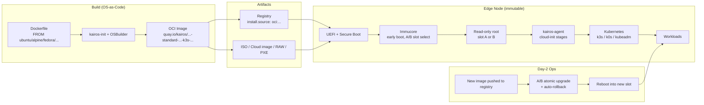

# Kairos (kairos.io): The Immutable Linux Meta-Distribution for Edge Kubernetes — Deep-Dive

> **Author:** Jack Liu Shurui — Solution Architect at Cymbal Bank, Singapore
> **Context:** Technology / Edge Computing — Cloud-Native Infrastructure Series — Immutable Linux, Edge Kubernetes, Meta-Distributions, OS-as-Code
> **Repository:** [github.com/jackliusr/research](https://github.com/jackliusr/research)
> **Primary sources:** https://kairos.io/ (project site, docs, blog) · https://github.com/kairos-io/kairos (main repo) · GitHub REST API (repo metadata, verified 16 Aug 2026)
> **Last Updated:** August 2026

> **Cross-references.** This is the dedicated deep-dive on **Kairos** in the `technology/` series. Sibling guides carry adjacent depth and are cross-referenced inline rather than restated: [kargo_gitops_guide.md](kargo_gitops_guide.md) (GitOps delivery — Kairos extends the same "everything as code / registry-driven" philosophy to the *operating system layer*), [container_certificates_guide.md](container_certificates_guide.md) (container/OCI security — Kairos ships its OS as an OCI image, and image signing/attestation applies), [cloud_providers_guide.md](cloud_providers_guide.md) (cloud-native platform patterns), [cephfs_alternatives_guide.md](cephfs_alternatives_guide.md) (edge/distributed storage), [ips_rtls_guide.md](ips_rtls_guide.md) and [remote_sensing_technologies_guide.md](remote_sensing_technologies_guide.md) (edge/device sensing infrastructure), [physical_ai_guide.md](physical_ai_guide.md) (edge deployment on Jetson-class hardware), [maritime_domain_awareness_guide.md](maritime_domain_awareness_guide.md) (edge devices at sea), [event_stream_processing_guide.md](event_stream_processing_guide.md) (edge data pipelines), plus [charmed_kubernetes_vs_openshift_guide.md](charmed_kubernetes_vs_openshift_guide.md) and [sealos_alternatives_guide.md](sealos_alternatives_guide.md) (Kubernetes-distribution landscape). No existing guide covers immutable OSes or edge Kubernetes distribution itself — this one owns that slot.

> **Verification note up front.** All facts below were verified on **16 August 2026** against the GitHub REST API (`api.github.com/repos/kairos-io/kairos`), the project README, kairos.io (homepage, docs, blog), and the `kairos-io/kairos-init` CI test matrix. Star counts are approximate snapshots and will drift. Where a claim could not be fully verified (industrial/retail adoption specifics, exact hardware matrix), it is explicitly **flagged** rather than asserted. Full sourcing and honesty flags: §13.

---

## Table of Contents

1. [Kairos Overview: The Immutable Linux Meta-Distribution](#1-kairos-overview-the-immutable-linux-meta-distribution)
2. [The Meta-Distribution Concept](#2-the-meta-distribution-concept)
3. [Core Features](#3-core-features)
4. [Architecture](#4-architecture)
5. [Concepts: Nodes, Clusters, Configuration](#5-concepts-nodes-clusters-configuration)
6. [Supported Distributions, Hardware, and Platforms](#6-supported-distributions-hardware-and-platforms)
7. [Comparison with the Alternatives](#7-comparison-with-the-alternatives)
8. [Edge Use Cases](#8-edge-use-cases)
9. [Community and Ecosystem](#9-community-and-ecosystem)
10. [Worked Example: Build and Deploy an Edge Kubernetes Node](#10-worked-example-build-and-deploy-an-edge-kubernetes-node)
11. [Summary: Kairos in One Page](#11-summary-kairos-in-one-page)
12. [Glossary](#12-glossary)
13. [Appendix: Verification Notes and Sources](#13-appendix-verification-notes-and-sources)

---

## 1. Kairos Overview: The Immutable Linux Meta-Distribution

### 1.1 What Kairos Is

**The one-liner (the project's own GitHub description):** Kairos is **"The immutable Linux meta-distribution for edge Kubernetes"** — an open-source project (org: **kairos-io**, main repo **kairos-io/kairos**, https://github.com/kairos-io/kairos) that turns ordinary Linux distributions into **immutable, bootable, Kubernetes-ready operating systems**, built and distributed like container images.

Concretely: you write a **Dockerfile** that starts from any supported base distribution, add your packages and configuration, and get back a **bootable artifact** — an ISO, a cloud image, a raw disk image, or a PXE target — that boots straight into a Kubernetes node (with K3s or k0s embedded) or into a plain immutable Linux host. Everything about the machine's lifecycle — first-boot configuration, cluster bootstrap, upgrades, rollback — is then driven declaratively through **cloud-init configuration** and **container registries**, in the same style that GitOps drives application delivery (see [kargo_gitops_guide.md](kargo_gitops_guide.md) for that sibling philosophy).

Verified project metadata (GitHub API, 16 Aug 2026):

| Attribute | Value |
|---|---|
| Repository | `kairos-io/kairos` |
| Description | "The immutable Linux meta-distribution for edge Kubernetes." |
| Homepage | https://kairos.io |
| License | **Apache-2.0** |
| Stars | ≈ **1,794** (approximate snapshot — drifts over time) |
| Forks | ≈ 137 |
| Created | 30 July 2021 (project formerly known as **c3os**) |
| Latest release | **v4.1.2** (as of 16 Aug 2026; v4.1.0, May 2026, introduced the **AuroraBoot** install/boot tooling) |
| Foundation status | **CNCF Sandbox project** (accepted 13 April 2024; announced 8 Oct 2024); publicly pursuing **CNCF Incubation** |
| Stewardship | Contributed by **Spectro Cloud**; site footer: "Kairos a Series of LF Projects, LLC" (2026) |

### 1.2 The Tagline

Kairos markets itself with two complementary taglines, both verified:

1. **"Build bootable Kubernetes and OS images as easily as writing a Dockerfile"** — the README's opening promise: *"With Kairos you can build immutable, bootable Kubernetes and OS images for your edge devices as easily as writing a Dockerfile."* This is the *build-time* promise: the OS itself becomes an artifact you assemble in a container build.
2. **"The Immutable OS to Operate at Scale"** (kairos.io homepage) — the *run-time* promise: *"Kairos is a Linux Framework managing the full lifecycle of machines — from installation to upgrades and recovery. It makes large numbers of machines predictable, reproducible, and easy to operate over time. Kairos brings strong operational guarantees to Linux — from the edge to the datacenter."*

The two halves matter: Kairos is not "just" an installer and not "just" an immutable OS — it is the *combination* of OS-as-code builds (Dockerfile) with fleet-scale lifecycle operations (A/B upgrades, cloud-init, registry delivery).

### 1.3 The Positioning: A "Meta-Distribution"

Kairos positions itself as a **meta-distribution** — the defining word in its own description:

- **It is not a Linux distribution.** It does not fork a kernel and a userland and call the result "Kairos Linux." Instead it **converts other distributions** (Alpine, Debian, Ubuntu, Fedora, openSUSE, Rocky — and now its own minimal **Hadron** base) into an **immutable layout with Kubernetes-native components** (docs: *"We like to define Kairos as a meta-Linux Distribution, as its goal is to convert other distros to an immutable layout with Kubernetes Native components"*).
- **It is distribution-agnostic (BYOI).** The homepage's "Bring Your Own OS" section: *"Kairos Ubuntu, Kairos Fedora, Kairos Alpine, and more with BYOI."* You choose the base; Kairos supplies the lifecycle model. The v4.1.0 release blog states it plainly: *"Kairos is not tied to a single Linux distribution. Instead, it provides the tooling and lifecycle model around different bases."*
- **It is Kubernetes-distribution-agnostic too.** The same image model runs **K3s**, **k0s**, or **kubeadm** — and, since 2024–2025 releases, no Kubernetes at all ("Without Kubernetes" mode), where Kairos acts purely as an immutable Linux framework.

This makes Kairos a *layer*, not a distro: the value lives in the conversion tooling, the bootchain, and the lifecycle operator — not in any particular package set. §2 unpacks the meta-distribution concept in detail.

### 1.4 Why Kairos: The Rationale

The problem Kairos targets is the classic **edge operations problem**:

- **Edge is where Kubernetes gets hard.** At the edge you have fleets of devices (industrial PCs, Raspberry Pis, Jetsons, kiosks, gateways) — often **unattended, intermittently connected, physically insecure, heterogeneous in hardware and OS**, and without the datacenter's ops staff. Traditional mutable Linux (SSH in, `apt upgrade`, drift, snowflake configs) does not scale to thousands of nodes you cannot physically touch.
- **The cloud-native answer is immutability + automation.** The same patterns that make containers manageable — image-based artifacts, declarative config, registry delivery, atomic rollback — are applied to the *machine itself*. An immutable OS cannot drift; a bad upgrade can be rolled back atomically; a node can be rebuilt from an image instead of repaired by hand.
- **Existing special-purpose OSes were too locked down or too locked in.** Fedora CoreOS and Flatcar are immutable but single-distro and do not embed Kubernetes; Talos is Kubernetes-only and API-driven but intentionally opaque (no shell, no arbitrary distro); K3OS was single-purpose and is now archived. Kairos's bet: keep the *openness* of a general Linux distro (any base, any packages, SSH access) while gaining the *operational guarantees* of an immutable, image-delivered, Kubernetes-native OS.
- **"Cloud-native edge" is the umbrella term.** Kairos's own Secure Edge-Native Architecture (SENA) whitepaper (2023, with Spectro Cloud and Intel) frames this exact thesis: run edge workloads with datacenter-grade security and lifecycle automation. The homepage's capability table summarizes the niche: immutable root filesystem ✓, atomic image upgrades/rollback ✓, reuse of existing Linux images ✓, persistent config layering after install ✓, Kubernetes-native OS lifecycle ✓, choice of Kubernetes distro ✓ — a combination none of the pure-play alternatives matches.

### 1.5 The Overview Table

| Aspect | Description |
|---|---|
| **What it is** | Open-source **immutable Linux meta-distribution** for **edge Kubernetes** (project: kairos-io/kairos, Apache-2.0) |
| **Tagline** | "Build bootable Kubernetes and OS images as easily as writing a Dockerfile" · "The Immutable OS to Operate at Scale" |
| **Build model** | Container-based: a **Dockerfile** `FROM` a supported base → bootable artifact (ISO / cloud image / raw image / container) |
| **Runtime model** | Immutable root filesystem, A/B partitions, **atomic upgrades via OCI registries**, cloud-init declarative config |
| **Kubernetes** | Embedded **K3s** or **k0s** (provider-kairos), optional **kubeadm**; or **no Kubernetes** (plain immutable Linux) |
| **Distribution-agnostic** | BYOI: Alpine, Debian, Ubuntu, Fedora, openSUSE, Rocky + new minimal **Hadron** base; CI also tests AlmaLinux, Oracle Linux, CentOS Stream, SLE Micro |
| **Cluster bootstrap** | cloud-init configs; optional **P2P mesh (libp2p)** with distributed ledger for self-coordinating multi-node clusters |
| **Security** | Trusted boot (Secure Boot + Measured Boot + FDE) with **TPM**, cosign-signed images, SPDX SBOMs, **FIPS 140-2** builds |
| **Hardware/placement** | x86_64, ARM64 (Raspberry Pi, Nvidia Orin/Jetson, Ampere), bare metal, VMs, public cloud |
| **Project status** | **CNCF Sandbox** (Apr 2024), contributed by **Spectro Cloud**, pursuing Incubation; latest release v4.1.2 (Aug 2026) |
| **Why it exists** | Bring datacenter-grade immutability, GitOps-style lifecycle, and Kubernetes ergonomics to **unattended edge fleets** — without locking you into one distro |

---

## 2. The Meta-Distribution Concept

### 2.1 What "Meta-Distribution" Means

The word **meta** (as in *metaclass*, *metadata*, *meta-language*) signals *a layer about/above something else*. A **meta-distribution is a distribution-construction layer that sits on top of existing distributions** rather than being one itself:

- Kairos does not maintain its own kernel, init system, or package repository from scratch. (Hadron, introduced Dec 2025, is the exception that proves the rule — see below — and even Hadron is *upstream-first*: a minimal composition of upstream components, not a fork.)
- Instead, Kairos takes a stock base image (`ubuntu:24.04`, `alpine:3.23`, `rockylinux:9`, …) and **converts it**: it injects its bootchain (**Immucore**), its agent (**kairos-agent** / provider), the Kubernetes provider (k3s/k0s), and its upgrade machinery, then lays the result onto an **immutable A/B disk layout**.
- The docs' own definition (Architecture → Meta-Distribution): *"We like to define Kairos as a meta-Linux Distribution, as its goal is to convert other distros to an immutable layout with Kubernetes Native components."*

**Not-a-distro, in practice.** You never download "Kairos Linux"; you download **Kairos-Hadron**, **Kairos-Ubuntu**, **Kairos-Alpine**, etc. — the same Kairos lifecycle wrapping different distro cores. That is the meta-distribution deal: **one operational model, many underlying OSes.**

### 2.2 The Supported Base Distributions

Verified current list (Aug 2026). The homepage distro strip lists: **Alpine, Debian, Fedora, Hadron, openSUSE, Rocky, Ubuntu**. The `kairos-init` CI test matrix (the project's stated "source of truth" for continuously tested bases, `kairos-io/kairos-init/.github/workflows/test.yml`) additionally covers AlmaLinux, Oracle Linux, CentOS Stream, and SUSE SLE Micro Rancher, across **amd64 and arm64**:

| Family | Base images in the tested matrix |
|---|---|
| Ubuntu | 20.04, 22.04, 24.04, 25.10, 26.04 |
| Debian | 12, 13 |
| Fedora | 41, 42, 43 |
| Alpine | 3.21, 3.23 |
| openSUSE | Leap 15.6, Leap 16.0, Tumbleweed |
| Rocky | 9, 10 |
| AlmaLinux | 9, 10 |
| Oracle Linux | 9, 10 |
| CentOS Stream | 9, 10 |
| SUSE SLE Micro | 5.4 (Rancher flavor) |
| **Hadron** | the new first-party minimal base (v0.4.0 as of Aug 2026) |

**Important nuance (flagged honestly):** the project's *prebuilt artifact focus* has shifted. As of the v4.x era, the small core team **focuses official prebuilt images and docs defaults on Hadron**; the legacy flavor repositories (e.g. `ubuntu:22.04`, `opensuse:leap-15.6`) are "no longer actively updated by the Kairos release pipeline" — the docs explicitly say to treat them as templates and use **BYOI** to build/publish your own. Multi-distribution support remains a core feature and is continuously tested via `kairos-init`, but if you want, say, a *maintained-by-Kairos* Ubuntu image today, you build it yourself (or pin an older release line). This is a real shift worth knowing before you standardize on a base.

### 2.3 The Build Model: Container-Based, "FROM"-Driven

The build model is what makes Kairos feel like writing a Dockerfile:

- Every Kairos build starts from a **base image** in a container registry (a stock distro image, or an official `kairos/*` core image).
- The build **runs the `kairos-init` tool** inside the build: it installs the kernel, Immucore bootloader pieces, the agent, and (for *standard* images) the Kubernetes provider — "start from your desired base image, run the installation/initialization/validation steps, add any custom packages or configurations."
- The **result is itself an OCI container image** — the OS, delivered as a container image. That image is then converted into bootable artifacts (ISO, raw disk, cloud image) by the **OSBuilder** tooling, or pulled *directly at install time* by the bootloader (the `install.source: "oci:…"` mechanism).
- From the build system's perspective, **"the OS image must include everything required for booting, from the kernel to the init system"** (the "Kairos contract", docs: Build Kairos from scratch).

The canonical custom-build sketch (verified pattern from the image-matrix docs; you can build any supported base locally with git + docker):

```dockerfile
# Custom Kairos build — e.g. AlmaLinux 9 for Raspberry Pi 4 (arm64)
# (from the kairos-io/kairos repo build instructions)
FROM almalinux:9
# ... add packages, configs, system extensions ...
```

```bash
git clone https://github.com/kairos-io/kairos.git
cd kairos
docker build --platform linux/arm64 \
  --build-arg BASE_IMG=almalinux:9 \
  --build-arg MODEL=rpi4 \
  --build-arg VERSION=1.0.0 \
  -f images/Dockerfile -t mycustomimage:1.0.0 .
```

### 2.4 The Meta-Concept Table

| Distro / base | Role in Kairos | Notes (verified, Aug 2026) |
|---|---|---|
| **Hadron** | First-party minimal base | Introduced Dec 2025 ("minimal, upstream-first"); **default for official prebuilt images and docs**; v0.4.0 current |
| **Alpine** | Supported base | Small footprint; in CI matrix (3.21, 3.23); legacy flavor not actively updated — use BYOI |
| **Debian** | Supported base | CI matrix 12, 13 |
| **Ubuntu** | Supported base | Widest ecosystem familiarity; CI matrix 20.04–26.04; classic `kairos/ubuntu` flavors now legacy |
| **Fedora** | Supported base | CI matrix 41–43; FIPS build tested on fedora:41 |
| **openSUSE** | Supported base | Leap 15.6/16.0 + Tumbleweed in CI; openSUSE was one of the original Kairos bases |
| **Rocky Linux** | Supported base | CI matrix 9, 10 |
| AlmaLinux / Oracle / CentOS Stream / SLE Micro | Tested additional bases | In the `kairos-init` CI matrix; good examples of how far BYOI stretches |
| **Any base (BYOI)** | The meta-distribution promise | Build from any OCI base image; publish your own images via **Kairos Factory** in CI |

---

## 3. Core Features

### 3.1 Immutability: Immutable Images, A/B Partitions

Kairos's core operating principle is **immutability by default**:

- The system boots from a **read-only root filesystem**; the OS partition is not meant to be modified in place ("the system boots in a restricted, permissionless mode with read-only paths", docs: Architecture → Immutable).
- The disk layout is the classic **A/B (dual-slot) scheme**: two root partitions, one active, one standby. **State and persistent data live on separate partitions** (e.g. a persistent partition for `/etc` overlays, `/var/lib`, etc.), so an OS swap does not touch user data.
- **No infrastructure drift**: because the OS is replaced whole, not patched in place, every node of a fleet runs byte-identical system images — the homepage's "no more infrastructure drift" claim.
- After install you can still layer configuration **persistently** (persistent config paths, `systemd-sysext`-style **system extensions** for live customization since the April 2025 release) — immutability of the base, flexibility at the edges.

### 3.2 Kubernetes: Built-In K3s and k0s

Kairos ships Kubernetes *inside* the OS image — no post-install cluster install step:

- **provider-kairos** (the official provider) supports **both K3s and k0s**, selectable via cloud-init (`k3s:` / `k0s:` config blocks) or via the image variant (`-k3s-v1.36.1-k3s1` style tags). The k0s edition is a first-class homepage offering ("Prefer k0s as your Kubernetes distribution? We got your back.").
- Kubernetes version is **pinned in the image tag**, so cluster and OS upgrades move together through the same A/B upgrade mechanism.
- A **kubeadm provider** example also exists in the docs, and the **P2P mesh** (libp2p-based, with a distributed ledger) can bootstrap and coordinate multi-node clusters automatically — node-to-node discovery, join, and even HA setups without a central control plane endpoint (see the multi-node-p2p examples).
- Since 2024–2025, **Kubernetes is optional**: "Without Kubernetes" mode runs Kairos purely as an immutable Linux framework (useful for non-K8s edge workloads, still with A/B upgrades and cloud-init).

### 3.3 Provisioning: cloud-init Bootstrapping

- Kairos uses **standard cloud-init syntax plus its own extensions** for declarative machine configuration: users/SSH keys, hostname, timezone, packages, `write_files`, stages, and the Kubernetes/install blocks.
- A single `#cloud-config` file (served via ISO, USB, PXE, or QR code — yes, **QR code** provisioning is a real Kairos topic) drives everything from **install device selection** to **cluster membership**.
- The **stages** mechanism (boot, install, init, network, fs, services) lets you run hooks at specific lifecycle points — a superpower for edge devices that need e.g. hardware bring-up before Kubernetes starts.

### 3.4 Upgrades: Atomic A/B with Rollback

- Upgrades are **image-based and atomic**: push a new image to a registry, and the node pulls it, writes it to the **standby slot**, and reboots into it. If boot fails, the node **automatically rolls back** to the previous slot (with automatic boot assessment on trusted-boot systems).
- "Updating nodes is as easy as CI/CD: push a new image to your container registry and let secure, risk-free A/B atomic upgrades do the rest" (README).
- **Bandwidth-optimized upgrades** (delta/differential delivery) are a documented example — important for constrained edge links.
- Upgrade verification can be enforced with **cosign attestations + Kyverno** policies (docs example), closing the loop with the container-security story in [container_certificates_guide.md](container_certificates_guide.md).

### 3.5 The Features Table

| Feature | Description | Benefit |
|---|---|---|
| **Immutable root filesystem** | Read-only OS partitions; no in-place mutation | No drift; tamper resistance; identical fleet images |
| **A/B partitions** | Dual root slots, active + standby | Atomic swap, safe rollback, safe upgrades on unattended nodes |
| **Container-based builds** | Dockerfile `FROM` a base → OS image | OS-as-code; reuse distro ecosystems; GitOps-able pipelines |
| **OCI-registry delivery** | OS images and upgrades flow through registries | Push-to-update; air-gapped support via registry mirroring |
| **Embedded Kubernetes (K3s/k0s)** | Kubernetes provider baked into the image | Cluster comes up at boot; version pinned with OS |
| **cloud-init configuration** | Standard + extended cloud-config | Declarative, versionable, familiar to cloud engineers |
| **P2P mesh (libp2p)** | Distributed-ledger node coordination | Zero-config cluster bootstrap on isolated edge networks |
| **Atomic A/B upgrades** | Image-swap + auto-rollback | Risk-free updates at fleet scale; self-healing boots |
| **Trusted boot (TPM)** | Secure Boot + Measured Boot + FDE | Hardware-rooted integrity; the most secured Kairos mode |
| **System extensions (sysext)** | Layered live customization | Post-install flexibility without breaking immutability |
| **FIPS 140-2 builds** | FIPS-enabled image variants | Regulatory compliance (government, finance) |
| **Without-Kubernetes mode** | Immutable Linux framework, no K8s | Covers non-K8s edge workloads with the same lifecycle |

### 3.6 Security and Trust: Trusted Boot, Signatures, SBOMs

Security is a first-class Kairos axis, not an afterthought:

- **Trusted boot** (docs: Architecture → Trusted Boot) is "a combination of technologies that allows us to enhance the security posture of a running system," composed of **FDE** (full-disk encryption), **Secure Boot**, and **Measured Boot** — hardware-rooted via the **TPM**. On TPM-equipped devices this is "the most secured way to run Kairos" (homepage). The docs even cover **TPM NV storage** as a dedicated topic.
- **Secure Boot support** uses signed artifacts to ensure system integrity **across distributions** (a nontrivial feat given the meta-distribution model — each base distro has its own boot components).
- **Supply chain**: every release ships an **SPDX SBOM** (verified: SBOM assets named like `kairos-hadron-v0.4.0-core-amd64-generic-v4.1.2-sbom.spdx.json` on GitHub releases), and images are **cosign-signed**; the docs show verifying image attestations during upgrades with **Kyverno** policies. Verified example command shape:

```bash
cosign verify-attestation --type spdx <your-image-reference> \
  --certificate-identity "https://github.com/kairos-io/kairos/.github/workflows/release.yaml@refs/tags/v4.1.2" \
  --certificate-oidc-issuer "https://token.actions.githubusercontent.com"
```

- **Ecosystem hardening**: Keylime attestation example, Intel Open AMT out-of-band management example, FIPS 140-2 builds, and the project's own April 2024 blog on the **xz-utils backdoor** (how an image-based, SBOM-aware OS pipeline changes the incident-response calculus). The "trust boot" posture is what makes unattended edge nodes acceptable in regulated environments — see [container_certificates_guide.md](container_certificates_guide.md) for the sibling container-signing story.

### 3.7 Release and Versioning Model

Verified from the image-matrix docs — important operational context:

- Kairos follows **Semantic Versioning**, and Kairos versions signal changes to *Kairos components*, not to the underlying OS packages (flavors pin upstream branches separately).
- **Only the latest release branch is supported** with patch releases; patches follow a **weekly cadence** (faster for high-severity CVEs); minor releases are **monthly**; majors signal significant features/rewrites, and in-place upgrades across majors are "not always guaranteed."
- Upgrades flow through the registry: new tags = new OS versions. For fleets, this means the *release cadence is your upgrade cadence* — plan image-pinning and staged rollouts accordingly.

---

## 4. Architecture

### 4.1 The Kairos Images (System Images)

Kairos ships **two image families**, both as OCI container images:

- **Core images** — the OS *without* a Kubernetes engine: kernel + init system (via `kairos-init`) + Immucore bootchain + kairos-agent. Suitable as a base for customization, or as an **installer** (see §10).
- **Standard images** — core + a **Kubernetes provider** (k3s or k0s, optional P2P). Tag pattern example (verified, docs): `quay.io/kairos/hadron:v0.4.0-standard-amd64-generic-v4.1.2-k3s-v1.36.1-k3s1`.

The **image naming convention** (verified from docs) is: `<registry>/<repository>:<flavor_release>-<variant>-<arch>-<device>-<version>` — e.g. flavor `hadron` / `ubuntu-24.04`, variant `core`/`standard`, arch `amd64`/`arm64`, device `generic`/`rpi4`/`nvidia-jetson-orin`, version `v4.1.2`.

### 4.2 The Artifacts

From one OCI image, Kairos produces every artifact an edge fleet needs:

| Artifact | Purpose | Notes |
|---|---|---|
| **ISO** | Interactive/automated installer media | Boot, point at a cloud-config, install to disk |
| **Cloud images** (qcow2, raw, etc.) | VMs and public/private cloud | Hetzner, AWS-style deployments documented |
| **Raw disk images** (`.raw`) | Direct flash to SD/eMMC/USB (Raspberry Pi, devices) | Published as **OCI artifacts** (tag ending `-img`) because they exceed GitHub's 2 GiB asset limit; extract with plain `docker create`/`docker cp` |
| **Container images** | Registry-based install & upgrade source | `install.source: "oci:quay.io/kairos/…"` at install time; the same image is the upgrade payload |
| **PXE/netboot** | Network boot of fleets | Boot from HTTP; QR-code config injection supported |
| **SBOM + signatures** | Supply-chain verification | SPDX SBOMs attached to every release; cosign-verifiable attestations |

Raw-image extraction is deliberately tool-light (verified docs pattern — raw images ship as OCI artifacts tagged `-img`):

```bash
export IMAGE=<registry>/<repository>:<tag>-img
container=$(docker create "$IMAGE" noop)   # scratch image: throwaway command, never executed
docker cp "$container:/artifacts/." .
docker rm "$container"
# the .raw image is now in the current directory, ready to flash
```

### 4.3 The Boot Process (Immutable Boot)

The boot chain is deliberately short and verifiable:

1. **Firmware** → Secure Boot (UEFI, signed artifacts) verifies the bootloader, when enabled.
2. **Immucore** (the early-boot stage, Kairos's own initramfs/init) takes over, sets up the **A/B root selection** (active vs standby slot), mounts the read-only root, and handles **trusted-boot measurements** on TPM systems.
3. **init/systemd** starts inside the immutable root; **kairos-agent** (via the provider) applies cloud-init stages and, for standard images, brings up the Kubernetes engine (k3s/k0s).
4. The node joins the cluster (via configured server address, or **P2P** mesh coordination), and the machine is live — fully declared by its cloud-config.

Because root is read-only and the bootloader enforces slot selection, **a failed boot of a new slot triggers automatic rollback** to the previous one (reinforced by **automatic boot assessment**, a documented trusted-boot example).

### 4.4 Architecture Diagram



Plain-text equivalent of the same flow: **Dockerfile → OCI image → (ISO/cloud/RAW/registry) → boot → Immucore → immutable root → kairos-agent → Kubernetes → workloads**, with **registry push → A/B swap → reboot → rollback-on-failure** as the upgrade loop.

### 4.5 Component Table

| Component | Role | Notes (verified) |
|---|---|---|
| **kairos (core)** | Main repo: build system, image definitions, release pipeline | Apache-2.0; releases carry SBOMs + cosign signatures |
| **kairos-init** | The init tool that converts a base image into a Kairos image | "Source of truth" for the tested distribution matrix |
| **Immucore** | Early-boot init/initramfs; A/B slot handling; trusted-boot hooks | Separate repo `kairos-io/Immucore` |
| **kairos-agent** | Runtime agent: cloud-init stages, install, upgrades, recovery | Runs inside the immutable root |
| **provider-kairos** | Kubernetes provider (k3s + k0s) + P2P | Enables the `-standard-...-k3s/k0s` variants |
| **AuroraBoot** | Install/boot tooling (new in v4.1.0, May 2026) | Simplifies ISO/flash/netboot workflows |
| **OSBuilder** | Builds bootable artifacts from images | Repo `kairos-io/osbuilder` |
| **Kairos Factory** | CI-oriented custom-image automation | Production path for BYOI builds |
| **Hadron** | First-party minimal base distro | "Minimal, upstream-first"; default for official images |

---

## 5. Concepts: Nodes, Clusters, Configuration

### 5.1 Nodes

A **node** is a single machine running a Kairos image: a bare-metal box, a VM, a Raspberry Pi, a Jetson, a cloud instance. Its identity and role are declared in cloud-init (hostname, users, SSH keys). Nodes are cattle, not pets: because the OS is immutable and image-defined, a node is disposable — wipe and reinstall from the same image reproduces it byte-for-byte (minus persistent state).

### 5.2 Clusters

A **cluster** is a Kubernetes cluster assembled from Kairos nodes:

- **Single-node**: one node runs control plane + workloads (the most common edge shape; documented `single-node` example).
- **Multi-node / HA**: control-plane nodes + workers, with kube-vip floating IPs for HA (documented `multi-node-ha` example).
- **P2P clusters**: nodes self-coordinate over a **libp2p mesh with a distributed ledger** — bootstrap and membership without pre-provisioned endpoints; useful on isolated edge networks (documented `multi-node-p2p` examples).

Cluster config lives in the same cloud-config as the OS config — `k3s:`/`k0s:` blocks define the provider, role, and (for k3s) token; a `#cloud-config` can be reused verbatim across a fleet to stamp out identical clusters.

### 5.3 Configuration: cloud-init / Config

- **cloud-config files** (`#cloud-config` YAML) are the single source of truth for a machine: users, SSH keys, hostname, packages, `write_files`, stages, install directives, Kubernetes settings.
- Kairos supports **standard cloud-init syntax and its own extended syntax** (the `stages:` and install blocks), giving a "cloud-config-centric approach" to system configuration (docs).
- Config delivery: ISO injection, USB stick, PXE, or even **QR code** (for headless device bring-up).
- **Persistent config layering** after install keeps post-install customizations without breaking immutability (persistent paths + system extensions).

### 5.4 Day-2 and Recovery Concepts

Fleet operations need more than install-and-upgrade, and Kairos's docs carry a full set of verified day-2/recovery topics:

- **Recovery mode** — a dedicated boot target that lets an operator (or an automated process) recover a node: reinstall, reset, or rescue the system without physical access.
- **Factory reset** — return the node to a pristine image state while preserving or wiping persistent data as configured; the "reimage instead of repair" philosophy applied to a single machine.
- **Entangle** — a Kairos project/tool for secure remote access to edge nodes (the docs list it as a first-class topic); combined with WireGuard-based VPN setups (a documented blog example), it covers the "how do I reach my unattended node" problem.
- **kairosctl** — the control CLI for interacting with Kairos nodes/agents (alongside `kairos-agent` for on-node actions).

These matter for the edge story: an immutable OS still needs a *rescue path*, and Kairos's answer is built into the boot targets rather than bolted on via SSH scripts.

### 5.5 The Concepts Table

| Concept | Description | Example |
|---|---|---|
| **Node** | One machine running a Kairos image (immutable, disposable) | An industrial PC flashed with `kairos-hadron-standard-amd64` |
| **Cluster** | Kubernetes cluster built from Kairos nodes | 3 control-plane + 5 worker nodes at a factory |
| **cloud-config** | Declarative machine + cluster config (YAML) | `#cloud-config` with `k3s: enable: true` |
| **Stage** | Lifecycle hook point in cloud-init | Run hardware bring-up at the `boot` stage |
| **Core image** | OS without Kubernetes engine | `kairos-hadron-core-amd64` (also usable as installer) |
| **Standard image** | OS with Kubernetes provider (k3s/k0s) | `...-standard-amd64-...-k3s-v1.36.1-k3s1` |
| **Slot (A/B)** | The two root partitions; active + standby | Upgrade writes standby, reboots, rolls back on failure |
| **P2P mesh** | libp2p-based self-coordinating cluster network | Boot a 3-node cluster with zero shared endpoints |
| **System extension** | Layered live customization (sysext) | Ship a kernel module or firmware without rebuilding the OS |
| **Trusted boot** | FDE + Secure Boot + Measured Boot on TPM | Attest node integrity before it joins the fleet |

---

## 6. Supported Distributions, Hardware, and Platforms

### 6.1 Distributions

Covered in depth in §2.2 — summary: **Alpine, Debian, Ubuntu, Fedora, openSUSE, Rocky** (+ AlmaLinux, Oracle Linux, CentOS Stream, SLE Micro in the tested CI matrix) and the first-party **Hadron** base. Kubernetes engines: **k3s, k0s** (provider-kairos), **kubeadm** (example), or none.

### 6.2 Hardware

- **x86_64** — Intel/AMD processors; the primary generic target (homepage: "x86_64 Intel / AMD processors"). FIPS variants available.
- **ARM64** — Apple Silicon, Ampere, and the device world: **Raspberry Pi** (RPi4 documented as a build target — `MODEL=rpi4` build arg; raw images for SD-card flash) and **Nvidia Orin/Jetson** (homepage: "Run on devices such as Raspberry Pi and Nvidia Orin with the same lifecycle model"; a dedicated Nvidia Orin NX docs page exists).
- **riscv64** — present in the `kairos-init` CI runner list (`ubuntu-24.04-riscv`); treat as early/experimental, not a headline target. *(Flagged: exact riscv64 release-artifact availability not verified.)*
- **Generic devices** — the `-generic-` device tag covers standard bare-metal/VM installs; device-specific builds use `MODEL`/device tags.

### 6.3 Platforms

- **Bare metal** — ISO/RAW/PXE installs on servers, industrial PCs, single-board computers.
- **VMs** — qemu/kvm, VirtualBox (documented example), VMware-class hypervisors via cloud images.
- **Public cloud** — reproducible cloud images; Hetzner Cloud documented; AWS-style qcow2/cloud-init flows apply (exact per-cloud catalog not exhaustively verified — flagged).
- **Netboot / PXE + QR code** — fleet provisioning without media.

### 6.4 The Support Table

| Target | Status (verified Aug 2026) | Notes |
|---|---|---|
| Alpine / Debian / Ubuntu / Fedora / openSUSE / Rocky | **Supported** (tested in `kairos-init` CI) | Legacy flavors no longer actively published; use BYOI for maintained builds |
| AlmaLinux / Oracle / CentOS Stream / SLE Micro | **Tested** in CI matrix | Good BYOI candidates |
| Hadron | **Default first-party base** | v0.4.0; official prebuilt images |
| x86_64 (Intel/AMD) | **Primary target** | Generic ISO/cloud/raw artifacts; FIPS variants |
| ARM64 (generic) | **Supported** | Apple Silicon, Ampere; arm64 CI coverage |
| Raspberry Pi (RPi4) | **Supported** | Raw image via OCI `-img` artifact; `MODEL=rpi4` builds |
| Nvidia Orin / Jetson | **Supported** (documented) | Dedicated docs pages (Orin NX); same lifecycle model |
| riscv64 | Early/experimental (flagged) | CI runner exists; artifact availability unverified |
| Bare metal | **Supported** | ISO, raw, PXE |
| VMs (qemu/VirtualBox) | **Supported** | Documented examples |
| Public cloud (Hetzner, etc.) | **Supported** (partial catalog verified) | Cloud images + cloud-init; AWS/GCP/Azure specifics flagged as not exhaustively verified |
| Kubernetes engines | k3s, k0s (provider), kubeadm (example), none | Choose per fleet; pinned in image tag |

---

## 7. Comparison with the Alternatives

### 7.1 The Field

Kairos competes in a crowded "immutable OS for Kubernetes/edge" space. The four projects most often named alongside it:

- **Fedora CoreOS (FCOS)** — Red Hat's immutable, automatic-updating OS for containers. Ignition (first-boot provisioning) + Butane (config format) + Zincati (update agent, rolling releases). Single distro (Fedora-derived); **no Kubernetes embedded** — you bring your own cluster tooling.
- **Flatcar Container Linux** — community/Kinvolk→Microsoft maintained successor to CoreOS Container Linux; Ignition-based; immutable; automatic updates; **no Kubernetes embedded**. Single distro.
- **K3OS** — Rancher's "purpose-built OS for Kubernetes, fully managed by Kubernetes," designed for K3s. **Archived** (verified: `rancher/k3os` archived, last push Dec 2023). Historically single-purpose and tied to Rancher's tooling.
- **Talos Linux** — Sidero Labs' Kubernetes-only OS: everything (config, upgrades, debugging) via the **talosctl API**; no shell, no SSH by default; single distro, no BYOI; extremely locked-down and minimal. Excellent for pure-Kubernetes fleets, deliberately inflexible otherwise.

### 7.2 The Comparison Table

| Project | Type | Immutability | Kubernetes | Distro-agnostic (BYOI) | Best for |
|---|---|---|---|---|---|
| **Kairos** | Immutable **meta-distribution** | Yes (A/B, read-only root) | **Embedded**: k3s, k0s (+kubeadm, or none) | **Yes** — Alpine/Debian/Ubuntu/Fedora/openSUSE/Rocky/Hadron/BYOI | Edge fleets needing distro choice, cloud-init ergonomics, registry-driven A/B upgrades |
| **Fedora CoreOS** | Immutable distro (Fedora) | Yes (read-only root, updates) | No (bring your own) | No | Container workloads on Fedora-based infra; Ignition fans |
| **Flatcar** | Immutable distro | Yes (read-only root, updates) | No (bring your own) | No | CoreOS/Container-Linux lineage; bare-metal container hosts |
| **K3OS** | Single-purpose OS for K3s | Yes (image-based) | Yes (K3s) — but **archived** | No | Nothing new (project discontinued; historical reference) |
| **Talos Linux** | Kubernetes-only OS (API-driven) | Yes | Yes (single K8s) | No | Pure-Kubernetes fleets wanting maximal lockdown, API-only ops |
| **Bottlerocket** (context) | AWS's container OS | Yes | Yes (via Brupop updates) | No | AWS EKS-optimized nodes (context from Kairos's own comparison) |

### 7.3 The Positioning: Kairos's Niche

Kairos's own homepage comparison table makes the niche explicit — vs **configuration-management systems** (Ansible/Puppet/Salt: mutate the running host, no immutable images) and vs **special-purpose OSes** (Bottlerocket/Talos/FCOS/Flatcar):

- Immutable root filesystem: Kairos ✓ (CMS ✗, SPOS ✓)
- Atomic image upgrades/rollback: Kairos ✓ (CMS ✗, SPOS ✓)
- **Reuse existing Linux images**: Kairos ✓ (CMS ✓-ish, SPOS ✗ — "Some image-based systems such as bootc support custom bootable images, but they require adopting the bootc-compatible image model")
- **Choice of Kubernetes distro**: Kairos ✓ (CMS ✓, SPOS ✗ — "Bottlerocket … ships environment-specific variants rather than a bring-your-own Kubernetes distro approach")

**The one-sentence positioning:** Kairos is the only immutable Linux framework in its category that can run across Linux distributions via BYOI while keeping one repeatable lifecycle model — the openness of a general distro, the immutability of a special-purpose OS, and cloud-native (registry + cloud-init + Kubernetes-native) operations. Where Talos trades flexibility for lockdown and FCOS/Flatcar trade distro-choice for Red Hat/Kinvolk lineage, Kairos's bet is that **edge operators want all three**: immutability, distro freedom, and Kubernetes-native lifecycle.

### 7.4 When Kairos Is the Wrong Choice (Honest Assessment)

A fair comparison also says where *not* to reach for Kairos:

- **Pure cloud workloads**: if everything runs in AWS/EKS or GKE, an EKS-optimized Bottlerocket (or plain managed nodes) is less operational surface. Kairos shines where *you* own the machines — edge, on-prem, hybrid.
- **Maximum lockdown**: if you want a shell-less, SSH-less, API-only node where users *cannot* get a root shell even if they want one, Talos is stricter by design. Kairos keeps distro openness (including SSH access) as a feature; your threat model may not want that.
- **Single-distro shops with existing Ignition expertise**: teams already standardized on Fedora CoreOS or Flatcar and happy with Zincati-style updates gain little from the meta layer — the distro-choice benefit only matters if you actually *use* multiple bases or want to escape vendor lock.
- **Teams allergic to the registry/OCI model**: Kairos's entire lifecycle assumes you can run an OCI registry (or mirror it air-gapped). If your organization cannot operate a registry, most of Kairos's day-2 value evaporates.
- **Very small single-purpose fleets**: for one or two kiosks, a hand-built image + Ansible may be cheaper than standing up the whole image pipeline. The meta-distribution pays off at fleet scale.

---

## 8. Edge Use Cases

### 8.1 Edge Computing / Edge Kubernetes

The flagship use case: **Kubernetes at the edge** — clusters running on distributed, unattended infrastructure instead of in a datacenter. Kairos's fit is almost mechanical:

- The whole OS+cluster is a versioned artifact, so **thousands of nodes** at different sites run identical, reproducible stacks (no per-site snowflakes).
- **Unattended upgrades** via A/B atomic swap: a kiosk or gateway can update itself and self-heal on failure — no technician visit. The project has explicitly written about this resilience angle (e.g. the 2024 blog on how an image-based, rollback-capable OS like Kairos could have mitigated the CrowdStrike-style outage class).
- **Intermittent connectivity** is fine: nodes boot, run, and upgrade when the network allows (bandwidth-optimized/delta upgrades documented).
- **GitOps delivery**: build the image in CI, push to a registry, let nodes pull — the same mental model as [kargo_gitops_guide.md](kargo_gitops_guide.md), one layer down the stack.

### 8.2 IoT

Kairos on IoT devices (Raspberry Pi, Jetson-class, gateways) gives device fleets a **cloud-native control plane**: declarative config (cloud-init, QR-code provisioning for headless bring-up), over-the-air image upgrades with rollback, and Kubernetes (or plain immutable Linux) as the app runtime. The blog even documents hobby-scale IoT ("how I automated my doorbell with Kairos"). The key structural win: **device management stops being a bespoke IoT-platform problem and becomes a registry/GitOps problem**.

### 8.3 Industrial (factories) — *flagged*

Kairos's documentation and press mention industrial/telco-adjacent deployments — notably the **2023 collaboration announcement with Spectro Cloud and Canonical for a "revolutionary telco radio edge solution"** (edge computing for 5G radio access networks) — and its SENA whitepaper targets edge-native security for production environments. However, **specific public, named factory-floor deployments are not documented on kairos.io as of Aug 2026** (the adopters page exists but specific industrial case studies were not retrievable in this research pass). Treat "factories" as a plausible, aligned use case (PLC-adjacent gateways, on-prem edge clusters, OT isolation) rather than a verified named deployment. *(Flagged: no verifiable named factory adoption found in this pass.)*

### 8.4 Retail — *flagged*

Retail (in-store edge clusters for POS, kiosks, computer vision, inventory sensors) is an obvious fit — unattended boxes, frequent software updates, physical security concerns — and fits the same architecture as [ips_rtls_guide.md](ips_rtls_guide.md) / [remote_sensing_technologies_guide.md](remote_sensing_technologies_guide.md) retail scenarios. But **kairos.io publishes no specific named retail case study as of Aug 2026** (verified by search). *(Flagged: retail is inferred fit, not documented adoption.)*

### 8.5 The Use-Case Table

| Use case | Scenario | Kairos fit |
|---|---|---|
| **Edge Kubernetes** | Distributed clusters on unattended hardware | Image-defined nodes; A/B unattended upgrades; GitOps delivery via registries |
| **IoT devices** | Raspberry Pi / Jetson / gateway fleets | QR/cloud-init provisioning; OTA image upgrades with rollback; K8s or no-K8s mode |
| **Telco / radio edge** | 5G RAN edge compute | **Documented**: Spectro Cloud + Canonical telco radio edge solution (2023); SENA whitepaper |
| **Industrial / factories** *(flagged)* | Factory-floor edge clusters, OT gateways | Strong architectural fit; **no named public case study verified** |
| **Retail** *(flagged)* | In-store kiosks, POS, CV analytics | Strong architectural fit; **no named public case study verified** |
| **Maritime / remote sensing** | Edge devices at sea, sensor networks | Cross-ref [maritime_domain_awareness_guide.md](maritime_domain_awareness_guide.md) / [remote_sensing_technologies_guide.md](remote_sensing_technologies_guide.md) — same immutable-edge pattern applies |
| **Physical AI / robotics** | Jetson-class AI inference at the edge | Cross-ref [physical_ai_guide.md](physical_ai_guide.md) — Kairos on Orin is a documented platform |
| **Cloud / datacenter** | Reproducible VM fleets | "From the edge to the datacenter": cloud images, VMs, FIPS builds |

---

## 9. Community and Ecosystem

### 9.1 The kairos-io Organization

Kairos lives under the **kairos-io** GitHub organization: the main `kairos` repo plus `provider-kairos`, `Immucore`, `AuroraBoot`, `osbuilder`, `kairos-init`, `community`, and related projects. The org predates the CNCF move and remains the coordination point for code, issues, discussions, and governance (GOVERNANCE.md in the community repo).

### 9.2 Project Status: CNCF Sandbox

- **Accepted to the CNCF on 13 April 2024 at the Sandbox maturity level** (announced via blog on 8 Oct 2024; the CNCF projects page states the same date).
- The homepage states the project is **"pursuing CNCF Incubation"** as it grows adoption ("Real-world adoption across bare metal, edge, and distributed infrastructure as we pursue CNCF Incubation").
- Governance follows the CNCF Code of Conduct; there is a **CLOTributor** listing for new-contributor issues, weekly project office hours, and a public roadmap/project board.

### 9.3 Funding and Stewardship

- Kairos was **created and contributed by Spectro Cloud** (the Kubernetes-management company behind Palette) — README: *"Kairos is a CNCF Sandbox project and was contributed by Spectrocloud."* Core maintainers historically include Spectro Cloud engineers (e.g. Ettore Di Giacinto — "mudler", Mauro Morales, Itxaka).
- The kairos.io site footer reads: **"Project supported by … Copyright © 2026 Kairos a Series of LF Projects, LLC"** — consistent with CNCF/LF stewardship; Spectro Cloud remains a primary commercial sponsor. *(Note: precise current sponsor list beyond Spectro Cloud not fully enumerated on the site — flagged as partially verified.)*
- **Commercial support ecosystem**: since Aug 2025 the project lists third-party companies offering enterprise support (a "Commercial Support" page on kairos.io). This matters for enterprise buyers: the project itself is CNCF-governed open source; paid support comes from vendors.

### 9.4 Ecosystem and Integrations

- **Kubernetes providers**: k3s, k0s (provider-kairos), kubeadm (example), P2P/libp2p mesh.
- **Security tooling**: cosign image verification, Kyverno attestation policies, SPDX SBOMs, TPM-based trusted boot, **Keylime** agent example (attestation), Intel **Open AMT** example (out-of-band device management), FIPS 140-2 builds.
- **Config/automation**: cloud-init (standard + extended), systemd-sysext system extensions, stage hooks.
- **Platform integrations**: public cloud images (Hetzner documented), qemu/VirtualBox, netboot, kube-vip HA, MetalLB example, LocalAI example (edge AI!), WiFi config example, kdump, air-gapped ISOs.
- **Sibling guides in this repo** that share the cloud-native/edge ecosystem: [cloud_providers_guide.md](cloud_providers_guide.md), [container_certificates_guide.md](container_certificates_guide.md), [event_stream_processing_guide.md](event_stream_processing_guide.md).

### 9.5 The Community Table

| Aspect | Status (verified Aug 2026) | Notes |
|---|---|---|
| GitHub org | **kairos-io** (active) | Main repo 1.79k★, Apache-2.0; CI active (last push Aug 2026) |
| CNCF status | **Sandbox** since 13 Apr 2024 | Pursuing Incubation |
| Stewardship | **Spectro Cloud** (contributed); LF Projects, LLC series | Copyright footer "Kairos a Series of LF Projects, LLC" |
| Commercial support | Available since Aug 2025 | Third-party enterprise support vendors listed |
| Communication | CNCF Slack `#kairos`, Matrix, IRC (libera), GitHub Discussions | README-verified |
| Governance | GOVERNANCE.md in kairos-io/community; CNCF CoC | Office hours, roadmap, project board |
| New-contributor path | CLOTributor listing; Hacktoberfest participation | Topics: hacktoberfest |
| Adoption evidence | Adopters page; telco radio edge (Canonical/Spectro, 2023); blog stories | Named industrial/retail case studies: **not verified** (see §8 flags) |

### 9.6 Project Timeline (Verified Milestones)

Reconstructed from the kairos.io blog archive and release history — useful for judging maturity and momentum:

| Date | Milestone |
|---|---|
| Jul 2021 | `kairos-io/kairos` repo created (project then named **c3os**) |
| 2022 | Rebrand to **Kairos**; openSUSE/Alpine/Ubuntu flavors established |
| Mar 2023 | **Spectro Cloud + Canonical telco radio edge** collaboration announced; SENA whitepaper with Intel |
| Jul 2023 | **FIPS compliance** support (v2.3) |
| Mar 2024 | v3.0 release line |
| **Apr 2024** | **Accepted to CNCF Sandbox** (announced Oct 2024); xz-utils backdoor response blog |
| Apr 2025 | **k0s support** ("a meta-distribution for Kubernetes is born"); **system extensions** (sysext) |
| Aug 2025 | **Commercial support** program launched |
| Dec 2025 | **Hadron** — minimal, upstream-first Linux base introduced |
| May 2026 | **v4.1.0** — AuroraBoot install/boot tooling; multi-base message reaffirmed |
| Aug 2026 | **v4.1.2** current release; docs default to Hadron images; pursuing CNCF Incubation |

---

## 10. Worked Example: Build and Deploy an Edge Kubernetes Node

### 10.1 The Scenario

You operate a fleet of unattended x86_64 industrial PCs (or Raspberry Pis) at retail/factory sites. Requirements: reproducible OS, embedded Kubernetes, unattended upgrades with rollback, all config in Git. Stack: **Kairos (Hadron standard, k3s)** + cloud-init + OCI registry.

### 10.2 The Build (Dockerfile + kairos-init)

Step 1 — take the official **core** image (OS without Kubernetes) and customize, OR build your own base via BYOI. The canonical customization pattern (verified shape from Kairos docs/examples):

```dockerfile
# Dockerfile — custom Kairos OS image
FROM quay.io/kairos/core-hadron:v0.4.0-amd64-generic-v4.1.2
# Add your packages / configs (example: a watchdog + edge agent)
RUN kairos-install-packages \
    && echo "custom edge agent" > /etc/kairos-custom.txt
# Optional: system extensions (sysext) for kernel modules / firmware
```

Build and push:

```bash
docker build -t registry.example.com/edgeos:1.0.0 .
docker push registry.example.com/edgeos:1.0.0
```

(The project's own BYOI path uses `docker build --build-arg BASE_IMG=<distro> --build-arg MODEL=... -f images/Dockerfile` from a clone of `kairos-io/kairos` — see §2.3 — or the **Kairos Factory** automation for CI.)

### 10.3 The Artifact (ISO / raw image)

For the fleet you need bootable media. Two verified routes:

- **Official artifacts**: download the prebuilt ISO or cloud image from the GitHub release assets (e.g. `kairos-hadron-v0.4.0-standard-amd64-generic-v4.1.2` ISO), or the **raw image** for Raspberry Pi — published as an OCI artifact whose tag ends in `-img` (extract with `docker create` + `docker cp`, per the docs).
- **Custom artifacts**: run your custom OCI image through **OSBuilder** (or AuroraBoot in v4.x) to produce an ISO/raw image carrying your customization.

### 10.4 The Deployment (boot → cluster)

Step 1 — write a cloud-config that both installs and configures the node (verified pattern from the official "core images as installer" example):

```yaml
#cloud-config
install:
  device: "auto"        # auto-select target disk
  auto: true
  reboot: true
  source: "oci:quay.io/kairos/hadron:v0.4.0-standard-amd64-generic-v4.1.2-k3s-v1.36.1-k3s1"
hostname: "edge-node-01"
users:
  - name: "kairos"
    passwd: "kairos"
    ssh_authorized_keys:
      - github: <your-github-user>   # pull your SSH key from GitHub
k3s:
  enable: true
  # cluster join: set token + server URL, or let P2P mesh handle discovery
```

Step 2 — boot the ISO on the node (physical console, BMC, or PXE with the cloud-config injected). Kairos installs itself to disk from `install.source`, reboots into the installed immutable system, applies the config, and **brings up k3s**. The node is now a Kubernetes node with zero manual steps.

Step 3 — repeat for the remaining nodes (same config, different hostnames/tokens, or P2P for self-coordination), then `kubectl get nodes` from the control plane.

**Multi-node / P2P variant.** For clusters on isolated networks (no stable control-plane endpoint, no internet), the **P2P mesh** takes over coordination: nodes discover each other over the libp2p network and a **distributed ledger** agrees on membership, so a 3-node cluster can bootstrap itself from identical configs — the documented `multi-node-p2p` / `multi-node-p2p-ha` (with kube-vip) examples cover this. For air-gapped sites, mirror the OCI images and ISOs into a local registry and point `install.source` at it (documented airgap example) — upgrades then flow from the local mirror too.

### 10.5 The Operations (A/B upgrade)

Day-2 operations are the point of the exercise:

1. Make a change in the Dockerfile (e.g. new agent version), rebuild, `docker push` the new tag.
2. On each node, trigger the upgrade: `kairos-agent upgrade --source oci:registry.example.com/edgeos:1.0.1` (or drive it via the Kubernetes-native operator story / CI).
3. The node pulls the new image, writes it to the **standby A/B slot**, reboots. If the new slot fails to boot, **automatic rollback** returns the node to the previous slot — the fleet self-heals without a truck roll.
4. Persistent data (on the persistent partition) survives the swap — upgrades never touch user state.

### 10.6 The Lessons

- **Immutable-by-default is the whole game**: the OS is an artifact with a version, not a stateful machine. Reproducibility, rollback, and fleet consistency fall out of that one property.
- **Registry + cloud-init replace the entire "OS management" toolchain**: no config management daemons, no SSH fleets, no golden-image archaeology.
- **Edge-specific design pays off**: A/B upgrades for unattended nodes, QR-code/PXE provisioning for headless devices, P2P for isolated networks, bandwidth-optimized upgrades for constrained links.
- **The meta-distribution bet**: you are not locked to one distro vendor or one Kubernetes flavor — the same lifecycle model runs Ubuntu, Alpine, or Hadron, with k3s or k0s. Choose per workload, not per platform.

---

## 11. Summary: Kairos in One Page

**Meta + Immutable + Edge — "the immutable edge, as code."**

Kairos (kairos-io/kairos, Apache-2.0, CNCF Sandbox since April 2024, contributed by Spectro Cloud) is an **immutable Linux meta-distribution for edge Kubernetes**: instead of being one more Linux distro, it *converts* mainstream distributions — Alpine, Debian, Ubuntu, Fedora, openSUSE, Rocky, or its own minimal Hadron base, plus BYOI — into immutable, bootable, Kubernetes-ready operating systems.

Its two promises:

1. **Build**: *"bootable Kubernetes and OS images as easily as writing a Dockerfile"* — the OS is an OCI image built in CI, versioned in a registry, and shipped as ISO / cloud image / raw image / netboot artifact.
2. **Operate**: *"The Immutable OS to Operate at Scale"* — read-only roots, A/B partitions, atomic registry-driven upgrades with automatic rollback, cloud-init declarative config, embedded K3s or k0s, optional libp2p P2P mesh, trusted boot with TPM, FIPS variants, and a "without Kubernetes" mode.

Where it sits: **more open than Talos** (any distro, any packages, SSH if you want it), **more Kubernetes-native than Fedora CoreOS/Flatcar** (K8s embedded, OS lifecycle managed through Kubernetes-style tooling), and **alive where K3OS is archived**. The niche is precisely the **unattended edge fleet**: industrial gateways, kiosks, radio/edge compute, IoT devices, robotics — anywhere a datacenter ops team cannot be.

The final word: **Kairos is "the immutable edge, as code."** The machine, its OS, its cluster, and its upgrades all become artifacts and configuration — GitOps extended from applications down to the hardware itself.

---

## 12. Glossary

| Term | Definition |
|---|---|
| **Kairos** | Open-source immutable Linux meta-distribution for edge Kubernetes (kairos.io; formerly c3os) |
| **kairos-io** | The GitHub organization owning Kairos and its components (kairos, provider-kairos, Immucore, AuroraBoot, osbuilder, kairos-init) |
| **Meta-distribution** | A distribution-construction layer that converts other Linux distributions into an immutable, Kubernetes-native OS, rather than being a distro itself |
| **Immutable** | System property where the OS filesystem is read-only and replaced whole (via images) instead of modified in place; prevents drift |
| **Edge** | Computing at/near where data is generated (devices, gateways, remote sites) rather than in centralized datacenters |
| **Edge computing** | The paradigm of running compute, storage, and networking close to end devices; often unattended, constrained, distributed |
| **Kubernetes** | Open-source container-orchestration platform; Kairos's primary runtime target |
| **K3s** | Lightweight, CNCF-certified Kubernetes distribution by Rancher/SUSE; one of Kairos's embedded providers |
| **k0s** | Lightweight Kubernetes distribution by Mirantis; the other embedded Kairos provider |
| **Container-based build** | Building the entire OS inside a container build (Dockerfile), producing an OCI image |
| **Dockerfile** | Declarative recipe for building a container image; Kairos's OS build format |
| **FROM** | Dockerfile instruction that selects the base image — the heart of Kairos's BYOI model |
| **ISO** | Optical-disk image format used as Kairos installer media |
| **Cloud image** | Disk image (qcow2/raw/…) preconfigured for VM/cloud deployment |
| **A/B partition** | Dual root-slot disk layout: active slot + standby slot; upgrades write the standby |
| **Atomic upgrade** | Upgrade that swaps the whole OS image in one step; all-or-nothing, with rollback |
| **cloud-init** | De-facto standard declarative cloud-config system; Kairos extends its syntax |
| **Provisioning** | The process of installing and first-boot-configuring a machine |
| **Bootstrapping** | Bringing a node/cluster from bare metal to operational state without manual steps |
| **Node** | A single machine running a Kairos image |
| **Cluster** | A Kubernetes cluster assembled from Kairos nodes (single-node, HA, or P2P) |
| **Alpine** | Minimal, security-focused Linux distro; a Kairos base |
| **Debian** | Community Linux distro; a Kairos base |
| **Ubuntu** | Canonical's Linux distro; a Kairos base |
| **Fedora** | Red Hat's community Linux distro; a Kairos base |
| **openSUSE** | SUSE's community Linux distro; a Kairos base |
| **Rocky** | RHEL-compatible community Linux distro; a Kairos base |
| **Hadron** | Kairos's first-party minimal, upstream-first Linux base (default for official images since v4.x) |
| **x86** | Intel/AMD processor architecture; Kairos's primary generic target (x86_64) |
| **ARM** | ARM processor architecture; supported (arm64), including Raspberry Pi and Nvidia Orin |
| **Raspberry Pi** | Low-cost ARM single-board computer; a documented Kairos device target |
| **Bare metal** | Physical servers/devices (vs VMs); a Kairos placement target |
| **VM** | Virtual machine; Kairos ships cloud images for VM/cloud deployment |
| **Fedora CoreOS** | Red Hat's immutable, auto-updating container OS; a Kairos alternative |
| **Flatcar** | Community-maintained successor to CoreOS Container Linux; a Kairos alternative |
| **K3OS** | Rancher's purpose-built OS for K3s; archived; a historical Kairos alternative |
| **Talos** | Sidero Labs' API-driven, Kubernetes-only OS; a Kairos alternative |
| **CNCF** | Cloud Native Computing Foundation (Linux Foundation); Kairos's governing foundation |
| **Sandbox** | CNCF's earliest project maturity level; Kairos's level since Apr 2024 |
| **Spectro Cloud** | Kubernetes-management vendor; created and contributed Kairos |
| **TPM** | Trusted Platform Module — hardware security chip anchoring trust boot |
| **Trust boot** | FDE + Secure Boot + Measured Boot, hardware-rooted (Kairos's most secure mode) |
| **IoT** | Internet of Things — device fleets; a Kairos use case |
| **Industrial** | Factory/OT edge environments; a Kairos use case (named adoption not verified) |
| **Retail** | In-store edge/kiosk environments; a Kairos use case (named adoption not verified) |

---

## 13. Appendix: Verification Notes and Sources

**Method.** Facts verified 16 Aug 2026 via: (1) GitHub REST API for `kairos-io/kairos` (description, license Apache-2.0, stars ≈1,794, forks ≈137, created 2021-07-30, latest release v4.1.2, topics incl. `k3s`, `kubernetes`, `immutable`, `rpi`, `p2p`, `provisioning`); (2) the project README (taglines, CNCF status, Spectro Cloud contribution, P2P, A/B upgrades, community channels); (3) kairos.io homepage (BYOI, distro list incl. Hadron, "Without Kubernetes", trusted boot, k0s edition, FIPS, Kairos-vs-others table, Incubation pursuit); (4) docs pages: image support matrix (naming convention, OCI `-img` raw artifacts, legacy-flavor deprecation, versioning policy, SBOM/cosign), architecture overview (meta-distribution definition, immutable/container/cloud-init/trusted-boot pages), core-images-as-installer example (cloud-config + `install.source: oci:…`); (5) `kairos-io/kairos-init` CI test matrix (full base-image + platform list); (6) web searches for CNCF status and alternatives.

**Explicit honesty flags (claims NOT fully verified):**
- Star count ≈1,794 is a point-in-time snapshot and will drift.
- **Industrial/factory and retail named adoptions are not documented** on kairos.io as of Aug 2026 (inferred fit only) — flagged in §8.
- **riscv64** appears in CI but release-artifact availability is unverified.
- Public-cloud catalog (AWS/GCP/Azure specific images) not exhaustively verified; Hetzner is documented.
- Current sponsor list beyond Spectro Cloud (LF Projects series footer) not fully enumerated.
- The "Cloud Native OS to Operate at Scale" vs "Immutable OS to Operate at Scale" homepage wording variants both appear on kairos.io; README uses "immutable Linux meta-distribution for edge Kubernetes."

**Primary sources.** https://kairos.io/ · https://kairos.io/docs/ · https://github.com/kairos-io/kairos · https://github.com/kairos-io/kairos-init · https://github.com/kairos-io/community · https://www.cncf.io/projects/kairos/ · https://github.com/rancher/k3os (archived status).

**Sibling guides cross-referenced.** kargo_gitops_guide.md · container_certificates_guide.md · cloud_providers_guide.md · cephfs_alternatives_guide.md · ips_rtls_guide.md · physical_ai_guide.md · maritime_domain_awareness_guide.md · remote_sensing_technologies_guide.md · event_stream_processing_guide.md · charmed_kubernetes_vs_openshift_guide.md · sealos_alternatives_guide.md
