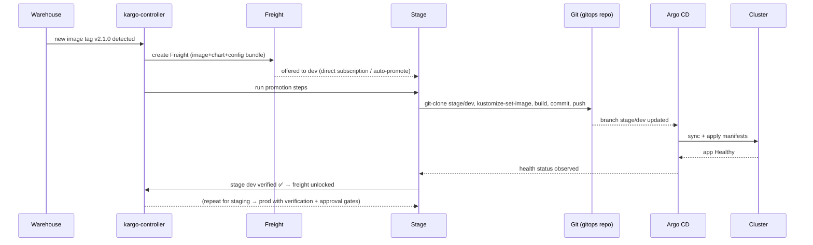

# Kargo by Akuity: The GitOps Progressive-Delivery & Promotion Engine — Deep-Dive

> **Author:** Jack Liu Shurui — Solution Architect at Crédit Agricole CIB, Singapore
> **Context:** Technology / DevOps — CI-CD Series — Kubernetes GitOps, Progressive Delivery, Platform Engineering
> **Repository:** [github.com/jackliusr/research](https://github.com/jackliusr/research)
> **Last Updated:** August 2026

> **⚠️ Disambiguation — there are two "Kargo"s.** The repository already contains [kargo_guide.md](kargo_guide.md), a deep-dive on **Kargo Technologies** — the Indonesian digital-freight logistics startup (the "Uber for trucks"). This guide is about a completely different entity: **Kargo by Akuity** — the open-source **GitOps progressive-delivery / promotion engine** for Kubernetes (https://kargo.io, https://github.com/akuity/kargo). Same name, unrelated projects, no corporate connection. (Coincidentally, Akuity's Kargo deliberately borrows logistics vocabulary — *warehouses*, *freight*, *promotions* — which makes the naming collision with the logistics company doubly confusing.)

> **Cross-references.** As of August 2026 the repo has **no separate Argo CD, Flux, GitOps, or CNCF-landscape guide** in `technology/` (closest neighbours: [charmed_kubernetes_vs_openshift_guide.md](charmed_kubernetes_vs_openshift_guide.md), [iac_best_practices_guide.md](iac_best_practices_guide.md)); this guide carries the necessary Argo CD / GitOps background inline. If an Argo CD guide is added later, §7 should be cross-linked rather than restated.

> **Verification note up front.** Several facts commonly repeated about Kargo are **wrong or unverified**; this guide corrects or flags them explicitly: (a) Kargo is **not** a CNCF Sandbox project — as of August 2026 it is stewarded by Akuity under no foundation (maintainer statement, March 2026); (b) the Akuity founders are **Hong Wang, Jesse Suen, and Alexander Matyushentsev** — Danny Thomson is a prominent Argo CD maintainer but *not* a verified co-founder; (c) the license is **Apache-2.0** (verified on GitHub); (d) named production adopters of Kargo itself are thinly documented (CoreWeave is verified as an Akuity Platform customer). Full sourcing and honesty flags: §15.

---

## Table of Contents

1. [Kargo Overview: The Promotion Engine for GitOps](#1-kargo-overview-the-promotion-engine-for-gitops)
2. [Positioning: GitOps Without Promotion Is Half a Pipeline](#2-positioning-gitops-without-promotion-is-half-a-pipeline)
3. [The Kargo Story: Akuity, the "Argo Company"](#3-the-kargo-story-akuity-the-argo-company)
4. [Kargo vs the Field: Argo CD, Rollouts, Flux, and Commercial CD](#4-kargo-vs-the-field-argo-cd-rollouts-flux-and-commercial-cd)
5. [Core Concepts: Stages, Warehouses, Freight, Promotions](#5-core-concepts-stages-warehouses-freight-promotions)
6. [Architecture: Components, CRDs, and the Data Model](#6-architecture-components-crds-and-the-data-model)
7. [Kargo + Argo CD: "Kargo Promotes, Argo CD Deploys"](#7-kargo--argo-cd-kargo-promotes-argo-cd-deploys)
8. [The Progressive Delivery Model](#8-the-progressive-delivery-model)
9. [Installation and Getting Started](#9-installation-and-getting-started)
10. [Adoption and Best Practices](#10-adoption-and-best-practices)
11. [Comparison with the Alternatives](#11-comparison-with-the-alternatives)
12. [Worked Example: The checkout-service Promotion Pipeline](#12-worked-example-the-checkout-service-promotion-pipeline)
13. [The Future (2026+)](#13-the-future-2026)
14. [Glossary](#14-glossary)
15. [Appendix: Verification Notes and Sources](#15-appendix-verification-notes-and-sources)

---

## 1. Kargo Overview: The Promotion Engine for GitOps

### 1.1 What Kargo Is

**The one-liner.** Kargo is a **Kubernetes-native, open-source continuous-promotion platform** — a GitOps tool for the *progressive delivery of Kubernetes application configurations*. It detects new versions of artifacts (container images, Helm charts, Git manifests), packages them into versioned bundles called **freight**, and then **promotes** that freight through a chain of **stages** (dev → staging → prod) — with automated verification and optional human approval at each gate — by updating the Git repository or OCI registry that a GitOps agent such as Argo CD continuously syncs. GitHub's own description for the project is "**Application lifecycle orchestration**."

The official docs phrase it precisely: *"Kargo is a Kubernetes-native continuous promotion platform that orchestrates the movement of artifacts through environments in GitOps workflows."* The Akuity launch post was blunter: *"Kargo, as the name implies, is about transporting 'freight' (what we call build and configuration artifacts) to multiple environments with a first-class GitOps approach."*

Kargo is commonly described in three overlapping ways:

- **The GitOps promotion engine** — it fills the gap classic GitOps leaves open: *how* a change moves from one environment's desired state to the next.
- **The progressive-delivery layer for configurations** — Argo Rollouts progressive-delivers *workloads* (canary traffic); Kargo progressive-delivers *configurations* (which manifests/versions live in which environment).
- **Application lifecycle orchestration** — the thing that turns "CI pushed an image" into "prod is running it, safely, verifiably, and auditably."

### 1.2 The Problem Kargo Attacks

Classic GitOps (per the OpenGitOps spec: declarative, versioned, immutable, pulled, continuously reconciled) answers one question extremely well: **"given this desired state in Git, make the cluster match it."** Argo CD is the canonical pull-based agent for that job.

But GitOps says almost nothing about the question teams actually struggle with: **"how does a change propagate from the desired state of one environment to the desired state of the next?"**

Consider what happens after a CI pipeline builds `checkout-service:v1.4.2` and pushes it to a registry:

1. Someone must decide that `v1.4.2` should now be the desired state of the **dev** environment's manifests.
2. After dev verification, the same change must be applied to **staging**.
3. After staging verification (and, usually, a human sign-off), it must go to **prod**.
4. Every step must be recorded: *what* moved, *when*, *by whom or what trigger*, and *which verification passed*.

Without a promotion tool, teams hand-roll this with shell scripts, `kubectl set image`, copy-paste GitHub Actions jobs, or semi-automated "update the tag in this file" cron jobs — each one bespoke, un-auditable, and un-testable. **Kargo is the productization of that "promote" step**: a declarative, versioned, observable mechanism for propagating changes through environment chains, built on the same Kubernetes-operator philosophy as Argo CD itself.

### 1.3 The Core Loop (30-Second Version)

**Freight in, freight out, nothing else changed:** Kargo never deploys anything itself. It changes *desired state* (usually a Git commit or an OCI tag update); Argo CD (or any GitOps agent) does the actual deployment. This division of labour — *"Kargo promotes, Argo CD deploys"* — is the single most important idea in this guide (§7). The full flow is diagrammed in §8.4: CI build → warehouse detects artifacts → freight created → gated promotions through dev → staging → prod → Git updated → Argo CD sync → cluster → verification observed back.

### 1.4 Project Facts (Verified, August 2026)

| Fact | Value | Source / status |
|---|---|---|
| Project name | Kargo (by Akuity) | kargo.io |
| Repo | github.com/akuity/kargo | GitHub |
| Description | "Application lifecycle orchestration" | GitHub, verified |
| License | **Apache-2.0** | GitHub API, verified |
| Language | Go | GitHub, verified |
| Repo created | 14 July 2022 | GitHub API, verified |
| Public announcement | 18 September 2023 ("Introducing Kargo") | akuity.io blog, verified |
| Latest release | **v1.11.0** (24 July 2026) | GitHub releases, verified |
| Stars / forks | ~3,500 / ~410 (Aug 2026) | GitHub API, verified |
| Docs | docs.kargo.io | verified |
| CNCF status | **None** (not a CNCF project as of Aug 2026) | §3.4, verified |
| Core CRD API group | `kargo.akuity.io/v1alpha1` | docs + quickstart, verified |
| Versioning | 1.x stable; v1.3 added conditional steps; v1.10 added Custom Steps + HTTP notifications | release notes, verified |

---

## 2. Positioning: GitOps Without Promotion Is Half a Pipeline

### 2.1 Two Layers, Two Jobs

A complete GitOps delivery stack is really two layers doing two different jobs, and conflating them is the root of most multi-environment pain:

| Layer | Job | Question it answers | Canonical tool |
|---|---|---|---|
| **GitOps engine** | Continuously reconcile cluster state to the desired state declared in Git | "Is the cluster what Git says it should be?" | Argo CD, Flux |
| **Promotion engine** | Move desired-state *changes* from one stage to the next, safely and verifiably | "How does a change get from dev's Git to prod's Git?" | **Kargo** |

The second layer is what plain GitOps lacks. Argo CD syncs whatever is in the `staging` branch — but *someone or something* has to decide when the `staging` branch should point at the new image, and that decision is exactly a **promotion**. Kargo industrialises that decision: it is the automated, gated, audited movement of changes through the stages of an application's lifecycle.

### 2.2 What "Promotion" Means Here (and What It Doesn't)

Kargo's docs are deliberately precise: *"Promotions are different from deployments. Promotions focus on propagating changes to the desired state of each stage in your application's lifecycle. The job of deploying — making the actual state of a Kubernetes cluster reflect the desired state — is left to a GitOps agent like Argo CD."*

- **Promotion (Kargo's job):** update the *declared desired state* for a stage — e.g., write a Git commit that bumps `checkout-service`'s image tag in the `prod` overlay, or update an OCI tag reference.
- **Deployment (Argo CD's job):** detect that the desired state changed, and apply it to the cluster (with sync strategies, health checks, and rollback if the app goes unhealthy).
- **Workload rollout (Argo Rollouts' job, optional):** shift traffic 10% → 50% → 100% to a new ReplicaSet after the deployment, with metrics-driven promotion/rollback of the *running pods*.

Teams that blur these three end up with either (a) GitOps agents doing promotion via hacky branch-merge automation, or (b) CI pipelines mutating clusters directly, which breaks the pull-based, Git-as-source-of-truth model. Kargo keeps each tool on its side of the line.

### 2.3 The Positioning Statement

> **Kargo = the progressive-delivery layer for GitOps.** It promotes *configurations* (manifests, charts, image references — the "desired state") through *stages* (environments / rings) with *verification* and *approval* gates, while Argo CD handles deployment and Argo Rollouts handles workload-level traffic progression. Classic GitOps + Kargo is frequently called **"GitOps 2.0"** in the community — GitOps with a first-class promotion plane.

---

## 3. The Kargo Story: Akuity, the "Argo Company"

### 3.1 Akuity: Founded by the Creators of Argo

Kargo is built and maintained by **Akuity** — the company that styles itself "the Argo company" and "the enterprise company for Argo." The connection is not a marketing coincidence: Akuity's founders are the **co-creators of the Argo Project** itself.

**Verified founders (company website, DevOps.com, SiliconANGLE):**

| Founder | Title at Akuity | Argo pedigree (verified) |
|---|---|---|
| **Hong Wang** | Co-founder & CEO | Co-creator of the Argo Project; Argo Workflows creator |
| **Jesse Suen** | Co-founder & CTO | Principal Software Engineer and technical lead for Argo at Intuit (Workflows, CD, Rollouts); author of the "Introducing Kargo" announcement |
| **Alexander Matyushentsev** | Co-founder & Chief Architect | Co-creator of Argo; primary creator of Argo CD |

**The origin story (verified).** All three were at **Applatix**, the startup that created Argo (initially a Kubernetes-native workflow engine). When Intuit acquired Applatix in 2018, the Argo team went with it, and Argo exploded inside Intuit: Argo CD, Rollouts, and Events were added to the project, Argo entered the **CNCF as an incubating project on 26 March 2020**, and **graduated on 6 December 2022**. The founders then left Intuit to launch **Akuity** (founded ~2021) with the mission of commercialising and hardening Argo for the enterprise — "a delightful end-to-end developer experience that just works" — and, later, of building the promotion layer Argo CD never had: Kargo.

> **⚠️ Correction on a common claim.** The task brief (and much blog chatter) names **Danny Thomson** as an Akuity co-founder. Verification: Thomson is a long-time, prominent **Argo CD core maintainer** and is frequently seen in Argo-ecosystem talks and Akuity-adjacent content — but the three **verified Akuity co-founders are Hong Wang, Jesse Suen, and Alexander Matyushentsev**. Thomson should be described as an Argo CD maintainer, not an Akuity founder (his current employer/role is not treated as verified in this guide).

### 3.2 Funding (Verified)

| Round | Date | Amount | Lead investors |
|---|---|---|---|
| Seed | 2021 | ~US$4.5M (undisclosed exact) | Decibel Partners, angels incl. Ram Shriram (Google board member), Greg Schott (ex-MuleSoft CEO) |
| **Series A** | **16 May 2022** | **US$20M** | **Lead Edge Capital + Decibel Partners** |

Total disclosed funding: **~US$24.5M across two rounds** (GetLatka / Tracxn / LeadIQ, consistent with the Series A announcement in DevOps.com and SiliconANGLE). As of April 2026 no later round was publicly disclosed. Akuity is a **CNCF Silver member** and has reported strong growth (the company marked five years in 2025–2026 with what it called "record 2025 results" — company-published, not independently audited).

### 3.3 Kargo's Origin and Milestones

| Date | Milestone (verified) |
|---|---|
| 14 July 2022 | `akuity/kargo` repository created on GitHub |
| 18 September 2023 | **Public announcement: "Introducing Kargo"** — blog post by Jesse Suen; Kargo positioned as the GitOps-native way to transport "freight" (build + configuration artifacts) across environments |
| 2023 → 2024 | Rapid 0.x/1.x evolution; presented at GitOpsCon EU 2024 ("Multi-Stage Deployment Pipelines the GitOps Way," Jesse Suen & Kent Rancourt — Kargo's lead maintainer at Akuity) |
| 22 October 2024 | **Kargo General Availability on the Akuity Platform** (managed Kargo + managed Argo CD), announced via BusinessWire |
| 2025 → 2026 | v1.x feature growth: promotion *steps* model, PromotionTasks, conditional execution (v1.3), verification refinements, Custom Steps + HTTP notifications + monorepo-scale performance (v1.10, Apr 2026); **v1.11.0 latest (24 Jul 2026)** |

**The positioning evolution.** Kargo launched as "GitOps promotion for multiple environments"; by 2026 the project describes itself as an "unopinionated continuous promotion platform" and "application lifecycle orchestration" — i.e., the promotion layer is a general mechanism (Git repos, OCI, images, charts, custom steps), not just an Argo CD add-on. The Akuity Platform bundles it as the promotion plane of a managed Argo stack ("Built on Kargo, Akuity makes environment promotion reliable and auditable by treating artifacts as first-class units" — akuity.io, verified).

### 3.4 CNCF Status: The Correction

**Kargo is NOT a CNCF project as of August 2026.** This guide's task brief hypothesised "CNCF Sandbox — verify"; the verification refutes it:

- **CNCF Landscape:** Kargo does not appear in the CNCF landscape's project listings (checked against `cncf/landscape`, August 2026). Akuity itself appears — as a **CNCF Silver member**, not as the steward of a CNCF-hosted project.
- **Maintainer statement (March 2026):** in GitHub discussion #4431 ("Is there a plan for Kargo to join the CNCF?"), Akuity maintainer **Ken Cochrane**'s response was quoted into the thread: *"While the project is currently stewarded by Akuity and not under a foundation like CNCF, it is released under an OSI-approved open source license. We do not have any plans to change the license… Our long-term strategy is built around providing value through commercial capabilities (managed services, enterprise features, compliance, support, etc.), not by restricting the core open source project."*
- **What it means:** Kargo is an *open-source project with a company steward* (the same governance model as many pre-CNCF projects, e.g., Argo CD before 2020, or Kind/Dapr before admission). The CNCF question is live in the community (§13) but nothing concrete had been announced as of August 2026. Compare: **Argo itself is CNCF Graduated** (6 December 2022) — so Kargo's sibling projects are foundation-hosted even though Kargo is not.

### 3.5 License (Verified)

**Apache License 2.0** — confirmed via the GitHub API for `akuity/kargo`. The maintainers have publicly committed to keeping the OSS core permissively licensed ("no plans to relicense"), which matters for enterprises burned by the 2024–2025 wave of source-available relicensing across the cloud-native ecosystem (the same point Ken Cochrane's statement addresses).

---

## 4. Kargo vs the Field: Argo CD, Rollouts, Flux, and Commercial CD

The most common confusion is *what Kargo competes with* — the honest answer is "almost nothing directly; it slots between the tools you already have."

### 4.1 Kargo vs Argo CD (the "Core" GitOps Engine)

| Dimension | Argo CD | Kargo |
|---|---|---|
| Type | GitOps deployment engine (pull-based agent) | GitOps **promotion engine** (desired-state propagator) |
| Job | Make cluster = Git | Move *which* Git revision / artifact set is the desired state per environment |
| Syncs? | Yes — applies manifests to clusters | No — never touches live workloads |
| Model | Application / ApplicationSet | Stage / Warehouse / Freight / Promotion |
| Relationship | **Complementary, not competitive.** The flagship integration: *Kargo promotes, Argo CD deploys* (§7). |

The one genuine overlap: Argo CD's ApplicationSet can generate per-environment applications, and teams sometimes abuse `targetRevision` overrides + manual syncs as a poor-man's promotion. Kargo exists precisely because that pattern can't scale, can't verify, and can't gate.

### 4.2 Kargo vs Argo Rollouts

| Dimension | Argo Rollouts | Kargo |
|---|---|---|
| Level | **Workload** (Deployment-like Rollout CR) | **Environment / configuration** (desired state per stage) |
| Techniques | Canary, blue-green, traffic shifting (Ingress/Service Mesh), AnalysisTemplate-driven automated rollback | Stage-based promotion chains, verification gates, approvals |
| Operates on | Running pods + traffic | Manifests / charts / image references in Git or OCI |
| Relationship | **Complementary** — and officially: Kargo can *use* Rollouts analysis (AnalysisRuns) as its verification mechanism. Classic pairing: Kargo promotes the config; Rollouts canaries the traffic. |

Rollouts = "how do we roll this one service out safely?" Kargo = "how does this change *get to* each environment at all?"

### 4.3 Kargo vs Flux (Image Automation)

Flux's `image-reflector` + `image-automation` controllers do one narrow Kargo-like thing: watch a container registry and auto-commit tag bumps into Git. The differences:

| Dimension | Flux image automation | Kargo |
|---|---|---|
| Scope | Single dimension: "new image tag → update YAML" | Multi-artifact **bundles** (image + chart + config together), multi-stage pipelines |
| Pipeline | None — no dev→staging→prod choreography | First-class Stage DAG with gates |
| Verification / approval | None built-in | Verification + manual approvals built-in |
| Integration | Works with any GitOps agent (Argo CD or Flux) | Flagship pairing is Argo CD; works with Flux-style repos too |

**Kargo vs Flux overall:** they are not rivals — Flux is a GitOps engine (like Argo CD), Kargo is the promotion plane above either. A Kargo + Flux stack is possible but uncommon; the Argo CD pairing dominates because both come from the same creators.

### 4.4 Kargo vs the DIY "OCI Promotion" Scripts

The most common incumbent is a pile of scripts: `docker tag` + `docker push` to an environment-namespaced registry (e.g., `:dev`, `:staging`, `:prod` tags), or sed/`kustomize edit set image` run from CI with no record. Kargo's advantages: declarative pipeline as code, immutable versioned freight (no mutable tags), verification gates, audit trail, and a UI — at the cost of learning one more system. For a single service and no compliance requirements, scripts still "work"; the trade-off is exactly the GitOps principle Kargo restores: *desired state changes should be declarative, reviewable, and reversible*.

### 4.5 Kargo vs Commercial CD Platforms (Harness, Octopus Deploy, Codefresh)

| Platform | Model | Kargo's contrast |
|---|---|---|
| **Harness** | Commercial end-to-end CI/CD/feature-flag platform, agent-based, cross-platform (VMs, K8s, serverless) | Kargo is OSS, Kubernetes-native, promotion-only (no build/CI plane); Harness is a full delivery suite with a license cost |
| **Octopus Deploy** | Commercial deployment-automation platform (deployment targets, lifecycles, runbooks; strong in .NET/Windows shops) | Octopus's "lifecycles + phases + gates" model is conceptually close to Kargo's stages, but it's a commercial, non-K8s-native orchestrator; Kargo is declarative CRDs living in your cluster |
| **Codefresh** | Commercial GitOps CD (built on Argo CD) + CI; its "environments/promotions" feature set targets the same problem | Codefresh is the commercial, platform-level take; Kargo is the open-source, self-hostable core. Akuity Platform (managed Kargo) is Akuity's Codefresh-shaped answer |

**Verdict on the field:** the direct OSS competitor to Kargo is not another product — it is *inertia* (hand-rolled scripts) and *scope creep* (commercial platforms). Kargo's niche is precise: **open-source, Kubernetes-native, Argo-ecosystem-first promotion with progressive-delivery gates** (§11 has the full comparison table).

## 5. Core Concepts: Stages, Warehouses, Freight, Promotions

Kargo deliberately keeps its terminology small. The official docs: *"Kargo is an unopinionated continuous promotion platform that helps developers orchestrate the movement of new code and configuration through the various stages of their applications' lifecycles using GitOps principles."* All terms below are verified against docs.kargo.io.

### 5.1 Projects — the Tenancy Unit

A **Project** is Kargo's unit of tenancy: it groups the resources of one or more promotion pipelines and carries the policy objects. Technically, every Project maps to a Kubernetes namespace, so access control rides on **standard Kubernetes RBAC** (Roles/RoleBindings in that namespace). This is the multi-tenancy story: each team gets a Project (namespace), and the platform team scopes who can promote to which stage. A Project is simply `apiVersion: kargo.akuity.io/v1alpha1, kind: Project, metadata.name: <team>` (the Project controller creates the backing namespace).

### 5.2 Stages — the Environments (Promotion Targets)

A **Stage** is a *promotion target*: "some desired state that needs to be altered by a promotion process." Most teams equate stages with environments (dev, staging, prod) — the docs bless that mental model — but a stage can also be a ring (5% of prod), a single microservice within a larger app, or even an entire cluster.

Critically, **stages link into a directed acyclic graph (DAG)** that describes the promotion pipeline: typically one "dev"/"test" stage at the start and one or more "prod" stages at the end. A stage declares:

- **`requestedFreight`** — what it wants, and from where: `origin: Warehouse` + `sources: direct: true` means it subscribes to fresh freight straight from a warehouse (typical for dev/test); `sources: stages: [test]` means it can only accept freight already promoted through (and verified in) the upstream stage(s). This is what makes a chain: *uat subscribes to test; prod subscribes to uat*.
- **`promotionTemplate`** — the steps to run when freight is promoted into this stage (in newer versions, a reference to a reusable **PromotionTask**, §5.7).
- **Health/verification wiring** — how the stage knows a promotion "stuck" (Argo CD sync/health, Rollouts analysis, custom checks — §5.6).

### 5.3 Warehouses — the Sources of Change

A **Warehouse** is where freight comes from. It subscribes to one or more artifact repositories — container images (any OCI registry), Helm charts (OCI or repo), and Git repositories (manifests/config) — polls them for new revisions, and when it finds them, packages the latest revision of each subscribed artifact into a **new piece of freight** that enters the pipeline.

```yaml
apiVersion: kargo.akuity.io/v1alpha1
kind: Warehouse
metadata:
  name: checkout
  namespace: checkout-team
spec:
  subscriptions:
  - image:
      repoURL: 123456789012.dkr.ecr.ap-southeast-1.amazonaws.com/checkout-service
      constraint: ^2.0.0        # semver constraint; ignore pre-releases, etc.
      discoveryLimit: 5          # how many recent versions to track
  - chart:
      repoURL: oci://123456789012.dkr.ecr.ap-southeast-1.amazonaws.com/charts
      name: checkout
  - git:
      repoURL: https://github.com/acme/config.git
      branch: main
```

The Warehouse's subscription model *is* the change-detection engine: no webhooks required (though commits/registry events just accelerate what polling already finds).

### 5.4 Freight — the Unit of Promotion

**Freight** is the star of the show and the concept that makes Kargo different from a script. Formally it is a *"meta-artifact" that references specific revisions of artifacts"*; intuitively it is **a box containing multiple artifacts** — the image tag, the Helm chart version, the config commit — that must travel through the pipeline *together*.

```yaml
apiVersion: kargo.akuity.io/v1alpha1
kind: Freight
metadata:
  name: 1a2b3c...        # content-addressed: derived from the artifacts it bundles
  namespace: checkout-team
  creationTimestamp: "2026-08-05T09:12:00Z"
warehouse: checkout
contents:
  images:
  - repoURL: .../checkout-service
    tag: v2.1.0
  charts:
  - repoURL: oci://.../charts
    name: checkout
    version: 2.1.0
  git:
  - repoURL: https://github.com/acme/config.git
    commit: 9f8e7d...
```

Why "freight" and not "a version"? Because the promotion unit must be **atomic and immutable**: `checkout-service v2.1.0` + `checkout chart 2.1.0` + `config commit 9f8e7d` either move together or not at all. Freight IDs are content-addressed, so the same bundle is the same freight everywhere, which makes tracking ("which freight is in prod?") trivial and unambiguous. The docs' analogy: order several items online and the fulfilment centre packs them into one box — the box is freight, and the box stays intact all the way to your door.

### 5.5 Promotions — Moving Freight Between Stages

A **Promotion** is one concrete execution of moving a specific piece of freight into a specific stage. It runs the stage's promotion steps (update manifests → commit → push/PR → notify Argo CD) and records the full outcome: each step's status, inputs, outputs, and logs — a complete, auditable history of what happened.

Key points verified from the docs:

- *"Kargo is all about promotions."* Everything else (warehouses, freight, stages) exists to make promotions safe and observable.
- A promotion is triggered by: manual action (UI drag-and-drop or `kargo promote`), an **auto-promotion policy** (§5.8), or an API/CLI call from CI.
- The promotion's status lifecycle: `Pending → Running → Succeeded / Failed / Errored / Aborted` (older versions: `Running → Succeeded/Failed`).
- Freight **cannot be promoted to a downstream stage until the upstream stage has verified it** — this is what makes the chain progressive rather than parallel (see quickstart's "why can't I promote test → prod directly?").

### 5.6 Verification — Proving the Promotion Worked

Promotion ≠ done. After the desired state changes and Argo CD syncs, Kargo can run **verification** — assertions that the promoted freight actually meets expectations *in that stage* — before the freight is allowed onward. Verified freight is what unlocks downstream stages (in the UI, a ❤️/health mark and a `Verified` label on the freight).

Verification sources (per docs.kargo.io "Verifying Freight in a Stage"):

| Source | What it checks |
|---|---|
| **Argo CD sync + health** | The stage's application(s) reached `Synced` and `Healthy` — the built-in, zero-config baseline |
| **Argo Rollouts AnalysisRun** | Run an `AnalysisTemplate` (metrics queries, smoke tests) against the deployed workload; Kargo waits for the analysis verdict — this is the Rollouts↔Kargo integration |
| **Custom steps / webhooks** | `kargo-v1alpha1` verification webhooks or container-based Custom Steps (security scans, policy checks, API smoke tests) that report pass/fail |

If verification fails, the freight is marked unverified, downstream promotion is blocked, and the stage can be rolled back (§6.5). This is the *automated safety net* of progressive delivery: nothing proceeds on faith.

### 5.7 Promotion Steps and PromotionTasks — the "How"

Since v1.2/v1.3, a promotion's work is expressed as an ordered list of **steps** (replacing the older `promotionTemplate` freeform design). Steps are small, composable, declarative actions; each records inputs/outputs so later steps can reference earlier results. Built-in step library (verified in the quickstart): `git-clone`, `git-clear`, `git-commit`, `git-push`, `git-open-pr`, `kustomize-set-image`, `kustomize-build`, `helm-update-chart`, `argocd-update`, `yaml-update`, `http` (webhook calls), and more. **v1.3** added **conditional execution** (`if:` expressions — skip a step when an expression is false); **v1.10** added **Custom Steps** (run any container image as a step — security scans, policy checks, approvals — with inputs/outputs recorded in the promotion record) and **HTTP notifications** (promotion results to Slack/Teams/webhooks).

A **PromotionTask** is a reusable, parameterised bundle of steps — the promotion pipeline's "function": define it once (`git-clone → kustomize-set-image → kustomize-build → git-commit → git-push → argocd-update`), then every stage references it via `promotionTemplate.spec.steps: [{task: {name: ..., as: ...}}]`. This is how the quickstart keeps three stages (test/uat/prod) sharing one promotion process. A full PromotionTask example appears in §12.2 — the same pattern the official quickstart uses (`demo-promo-process`, with `vars` for the gitops/image repos, `imageFrom(vars.imageRepo).Tag` to read the promoted freight's image tag, and `argocd-update` pointing at the stage's Argo CD Application).

### 5.8 Approvals and Auto-Promotion — the Gates

Two complementary controls decide whether a promotion fires at all:

- **Approvals (manual gate, "human in the loop").** A stage can require that specific freight be **approved** before it can be promoted there — the classic prod sign-off. Approvals are per-freight, recorded with actor + timestamp, and enforceable via RBAC (only certain roles may approve). In the UI this is a per-freight "approve" action; in the CLI, `kargo approve`.
- **PromotionPolicy (auto-promotion).** Declares *automatic* promotion rules: when a stage subscribes to freight and that freight becomes available (and meets the stage's verification/approval requirements), Kargo promotes it without a human. Typical shape: dev auto-promotes from the warehouse; staging auto-promotes from dev; prod requires approval — yielding *continuous delivery up to the human boundary*.

```yaml
apiVersion: kargo.akuity.io/v1alpha1
kind: PromotionPolicy
metadata:
  name: dev-auto
  namespace: checkout-team
stage: dev
autoPromotionEnabled: true
```

So the spectrum is fully covered: **fully manual** (every promotion clicked), **fully automatic** (every stage auto-promotes — continuous promotion), and the usual enterprise middle: *automatic everywhere except prod, which gates on verification + approval*.

### 5.9 The Concept Map

In one picture: *Warehouses produce freight; freight is promoted into stages; stages chain into a DAG; each promotion is gated by verification (and, for prod, approval); PromotionPolicies decide what runs automatically.* The full lifecycle is diagrammed in §6.4 (promotion mechanics) and §12.3 (worked example).

---

## 6. Architecture: Components, CRDs, and the Data Model

### 6.1 Components of the Control Plane

Kargo is a Kubernetes-native control plane: it runs *on* Kubernetes, manages Kubernetes custom resources, and its own components are ordinary deployments. Verified architecture (repo + docs):

| Component | Role |
|---|---|
| **kargo-controller** | The reconciliation engine — an operator in the classic sense: watches `Warehouse`/`Stage`/`Freight`/`Promotion`/`PromotionPolicy`, detects new artifact versions, creates freight, executes promotions (running step sequences), evaluates verification, updates status. Later 1.x versions support **sharding** (multiple controllers handling subsets of projects) for scale. |
| **kargo-api** | API server: gRPC server-side + REST/HTTP client-side surface for CLI and UI; authentication (SSO/OIDC, local admin, service accounts). |
| **kargo-ui (Dashboard)** | Web console: pipeline visualization (stages as nodes, freight timeline, drag-and-drop promotion, verification logs, per-stage drill-downs: Promotions, Verifications, Freight History, Settings, Live Manifest) — a big part of Kargo's adoption story. |
| **kargo CLI** | `kargo` binary: `kargo login`, `kargo apply`, `kargo get <stages\|warehouses\|freight\|promotions>`, `kargo promote`, `kargo approve`, `kargo delete` — also usable from CI. |
| **kargo-schema / webhooks** | CRD validation + admission webhooks; credential resolution (Git/registry secrets labeled `kargo.akuity.io/cred-type`). |

Installs via a **Helm chart** (the quickstart also offers one-command scripts that provision cert-manager + Argo CD + Argo Rollouts + Kargo together). Footprint is modest (controller + api + ui deployments); nothing runs on your worker workloads unless you ask it to.

### 6.2 The CRDs — Declarative Data Model

All resources live in API group **`kargo.akuity.io`** (currently `v1alpha1`). Verified set:

| CRD | Kind of thing | Purpose |
|---|---|---|
| `Project` | Tenancy unit | Maps 1:1 to a namespace; RBAC boundary (§5.1) |
| `Warehouse` | Source subscription | Watches image/chart/git repos; produces freight (§5.3) |
| `Freight` | Immutable artifact bundle | Content-addressed box of artifact revisions (§5.4) |
| `Stage` | Promotion target | Desired-state definition per environment; DAG node; holds verification config (§5.2) |
| `Promotion` | Execution record | One freight-into-one-stage run; step-by-step results and audit trail (§5.5) |
| `PromotionPolicy` | Automation rule | Auto-promotion switch per stage (§5.8) |
| `PromotionTask` | Reusable step function | Parameterised promotion step sequences (§5.7) |

(Plus `VerificationRequest`/verification-webhook plumbing in newer versions, and integration points with Argo CD's `Application` CRDs.)

Because everything is a CRD, **the entire promotion system is declarative and Git-versionable** — you commit your pipeline the same way you commit your manifests. That is the GitOps principle applied to the delivery machinery itself.

### 6.3 Environment Sources and Change Detection

**Source types a Warehouse subscribes to:**

- **Git repositories** — manifests, overlays, or raw config; tracked by branch/tag/commit (and in newer versions, path-based "monorepo" subscriptions with performance work in v1.10).
- **OCI registries** — container images (by semver constraint, tag glob, or digest) and OCI-packaged **Helm charts** (or classic chart repos).

**Change detection mechanics:** the controller polls subscriptions on an interval (and can be nudged by webhooks), applies filters (semver `constraint`, `discoveryLimit`, allow/deny lists), and when it observes a new revision set, materialises a **new Freight** — content-addressed, so identical bundles dedupe. New freight is then offered to every stage that subscribes `direct: true` to that warehouse, and flows downstream only via promotions.

### 6.4 Promotion Mechanics — End to End



Promotion = **freight → stage → manifest update → Git commit/PR → GitOps agent sync → health/verification → unlock downstream**. Every hop is recorded in the Promotion's step log.

### 6.5 Failure, Rollback, and the Multi-Stage Chain

- **Promotion failure:** any step failing (e.g., `git-push` rejected, kustomize build error) marks the Promotion `Failed`; the stage keeps its previous freight and nothing downstream is unlocked. Because the write is to Git (not the cluster), the blast radius is a commit that never happened — the classic GitOps safety property.
- **Verification failure:** the freight is marked unverified; downstream gates stay shut; teams can investigate while the stage keeps running the last-known-good state.
- **Rollback = promote the previous freight.** Since every stage records its freight history, rolling back is just promoting the last-known-good freight back into the stage (or re-pointing the stage's Git branch). The UI/CLI make this a one-click/one-command operation, and it is itself a recorded Promotion — auditable like any other.
- **Multi-stage pipeline:** stages form the DAG (dev → staging → prod; prod can fan out to multiple prod stages for rings/clusters). The chain is enforced by `sources: stages: [...]` subscriptions — freight physically cannot skip a stage (§5.2).

---

## 7. Kargo + Argo CD: "Kargo Promotes, Argo CD Deploys"

### 7.1 The Integration Model (Verified)

Kargo and Argo CD are designed as a pair — both built by the same people, integrated at the resource level:

1. **Kargo owns desired state.** The promotion writes a commit (usually to a **stage-specific branch** — the Kargo team's recommended pattern) or opens a PR, updating image tags / chart versions in the manifests for that environment.
2. **Argo CD owns deployment.** Each stage has an Argo CD `Application` (typically generated by an **ApplicationSet** — one per stage, e.g., `checkout-test`, `checkout-uat`, `checkout-prod`), whose `targetRevision` points at the stage branch. Argo CD syncs that branch to the cluster as usual — pull-based, no Kargo involvement in the cluster mutation.
3. **Kargo observes outcomes.** The `argocd-update` step tells Argo CD to refresh, and the Stage watches the Application's **sync/health status** to decide whether the promotion "took" — feeding verification (§5.6).

The quickstart makes the division explicit: Kargo "reads the latest manifests from main, runs `kustomize edit set image` and `kustomize build`, commits the resulting manifests to the stage-specific branch — the same branch referenced by the stage's Argo CD Application's `targetRevision`."

### 7.2 App-of-Apps / ApplicationSet Pattern

The conventional setup: one GitOps repo with an overlay per stage (`stages/dev`, `stages/uat`, `stages/prod`), an ApplicationSet that generates one Application per stage, and Kargo's stage branches (`stage/dev`, `stage/uat`, `stage/prod`) as the Application `targetRevision`s. A minimal ApplicationSet (verified shape from the quickstart):

```yaml
apiVersion: argoproj.io/v1alpha1
kind: ApplicationSet
metadata:
  name: checkout
  namespace: argocd
spec:
  generators:
  - list:
      elements:
      - stage: dev
      - stage: uat
      - stage: prod
  template:
    metadata:
      name: checkout-{{stage}}
    spec:
      project: default
      source:
        repoURL: https://github.com/acme/checkout-gitops.git
        targetRevision: stage/{{stage}}
        path: stages/{{stage}}
      destination:
        server: https://kubernetes.default.svc
        namespace: checkout
      syncPolicy:
        automated: { prune: true, selfHeal: true }
```

### 7.3 "Pull Request" Mode (Reviewable Promotions)

For environments where direct commits to prod are unacceptable, the promotion pipeline can end with **`git-open-pr`** instead of `git-push`: Kargo creates a branch and opens a **PR** against the stage branch; humans review the diff; merging triggers Argo CD to sync. This gives the full GitOps review property — *every production change is a reviewed diff* — while Kargo still manages freight bookkeeping, verification wiring, and the audit trail. (PR-mode details are version-dependent; check the current docs.)

### 7.4 Multi-Cluster and Multi-Argo-CD

Stages are not tied to the cluster Kargo runs on: an Argo CD Application can target **any registered destination cluster**, so a "prod-eu" stage can land manifests on a Frankfurt cluster while Kargo itself runs in a management cluster. The pattern scales to fleet-wide promotion (stages as clusters, verification per fleet member), and Kargo works with multiple Argo CD instances (argocd-update targets one via credentials).

### 7.5 What About Flux Instead of Argo CD?

Nothing in Kargo is Argo-CD-exclusive: the promotion mechanism is "update Git/OCI," and any GitOps agent — including Flux — reacts to the resulting commit. The tight integrations (argocd-update step, health observation) are Argo-flavoured, but the *model* is agent-agnostic. In practice the pairing is overwhelmingly Kargo + Argo CD (shared creators, shared roadmap), which is what this guide documents.

---

## 8. The Progressive Delivery Model

### 8.1 Progressive Delivery: The Concept

**Progressive delivery** is the evolution of continuous delivery: instead of flipping a release live all at once ("big-bang" deploy), changes move through increasingly production-like environments and increasingly broad audiences, with **verification at every step** and **automated rollback** when checks fail. Its toolkit:

| Technique | What it does |
|---|---|
| **Canary** | Route a small % of live traffic to the new version; watch metrics; ramp up |
| **Blue-green** | Run the new version alongside the old; switch traffic atomically; instant revert |
| **Ring-based (staged) rollout** | Deploy in expanding circles — e.g., internal users (1%) → pilot segment (5%) → region A (25%) → everyone (100%) — with gates between rings |
| **Smoke tests / synthetic checks** | Post-deploy health and functional probes per stage |
| **Automated rollback** | Auto-revert (traffic, or desired state) when verification/metrics fail |

The mental model: *progressive delivery = CD + safety gates + staged exposure + automatic retreat.* Kargo implements the *configuration/environment* axis of this model.

### 8.2 Kargo's Role: Stage-Based Progressive Delivery

Kargo is progressive delivery **for desired state** (configs), as opposed to traffic:

- **Rings = Stages.** A deployment ring is literally a Kargo Stage: dev (1%) → staging (5–25%) → prod-east → prod-west → prod-global — each a Stage in the DAG, each with its own subscription, verification, and gates. The "ring-based promotion" pattern is just stage naming + `sources: stages:` chaining.
- **Promotion gates.** Verification (automated: health, analysis, custom steps) + approval (manual sign-off) are the gate machinery between rings. Nothing progresses on faith.
- **"Progressive" = controlled rollout across stages.** Freight can only reach ring N+1 after ring N verified it — the DAG enforces order, so a bad release stops at the first failing ring, and the humans get exactly one alert: "prod ring 2 verification failed."
- **Automated rollback is native.** "Promote the previous freight" is a first-class operation, not a post-incident hack (§6.5).

### 8.3 Kargo vs Argo Rollouts — and How They Combine

| | Argo Rollouts | Kargo |
|---|---|---|
| Unit of delivery | Workload (Rollout CR: pods + traffic) | Desired state (manifest/image/chart per stage) |
| Progression | Canary/blue-green traffic shifting, mesh/Ingress integration | Stage/ring promotion with verification + approvals |
| Rollback trigger | Metrics/analysis on live traffic | Verification failure blocks/gates downstream; promote-previous-freight revert |
| Best at | "Roll this one service out safely in prod" | "Move this change through dev→staging→prod safely" |

**The complementary stack (the one Akuity pushes):** Kargo promotes the configuration to the next stage → Argo CD syncs → Argo Rollouts canaries the traffic inside that stage (e.g., 10% → 50% → 100%) → the Rollouts `AnalysisRun` doubles as Kargo's verification (Kargo waits on the analysis verdict) → verified freight unlocks the next stage. *Kargo moves the change between environments; Rollouts moves traffic within an environment.* They do not overlap; they chain.

### 8.4 Kargo in the Full GitOps Pipeline

```mermaid
flowchart LR
    A[Developer commit] --> B[CI: build + test + push image/chart]
    B --> W[Warehouse detects artifact]
    W --> F[Freight created]
    F --> D[Promotion to dev]
    D --> V1[Verify: smoke + health]
    V1 --> S[Promotion to staging]
    S --> V2[Verify: analysis / canary via Argo Rollouts]
    V2 --> P[Approval gate: prod]
    P --> PR[Promotion to prod]
    PR --> V3[Verify: health + synthesis]
    V3 --> R[(Rollback: promote previous freight on failure)]
```



**The pipeline in one sentence:** commit → CI build → warehouse → freight → stage promotions (each gated by verification, prod also by approval) → Git updated → Argo CD sync → cluster → outcomes observed back into Kargo's verification → next stage. Every hop is declarative, recorded, and reversible.

## 9. Installation and Getting Started

### 9.1 The Three Ways to Run Kargo

| Option | What you get | Best for |
|---|---|---|
| **Akuity Platform (managed)** | Fully managed Argo CD + Kargo + Rollouts in your cloud account; SSO, RBAC policies, enterprise support, compliance features. Kargo reached GA on the platform on **22 October 2024** (verified, BusinessWire). | Enterprises that want the Argo stack operated for them |
| **Self-managed (Helm)** | The OSS Kargo chart: CRDs + controller + API + UI in your own cluster; you run cert-manager and Argo CD alongside. | Teams that want control and already run Argo CD |
| **Open-source (from source / quickstart)** | Clone [akuity/kargo](https://github.com/akuity/kargo); quickstart scripts spin up a full local stack in one command. | Evaluation, development, CI testing |

All three run the same core engine — the open-source project is the product; the platform is the managed wrapper (per Akuity's own positioning: value comes from managed services/enterprise features, not from closing the OSS core).

### 9.2 Quickstart (Verified Mechanics)

The official quickstart (docs.kargo.io/quickstart) walks through a three-stage (test → uat → prod) nginx demo. Verified mechanics:

1. **Spin up a local cluster with Kargo installed** — one command provisions cert-manager, Argo CD, Argo Rollouts, and Kargo:
   ```shell
   curl -L https://raw.githubusercontent.com/akuity/kargo/main/hack/quickstart/kind.sh | sh
   # or: install.sh (Docker Desktop/OrbStack), k3d.sh (k3d)
   # Note: Helm v3.13.1+ required; older Helm gets 401s pulling the Kargo chart
   ```
   The Kargo dashboard is then available at `http://localhost:31081` (and Argo CD alongside).
2. **Fork the demo gitops repo** (`kargo-demo` — kustomize overlays per stage).
3. **Create Argo CD Applications per stage** via an ApplicationSet (one Application per stage, `targetRevision` → stage branch).
4. **Create the Kargo project and pipeline** — a single `kargo apply -f -` of: `Project`, a Git credentials Secret (labeled `kargo.akuity.io/cred-type: git`), `Warehouse` (subscribing to e.g. `public.ecr.aws/nginx/nginx` with `constraint: ^1.29.0`), a `PromotionTask` (the git-clone → kustomize-set-image → kustomize-build → git-commit → git-push → argocd-update sequence), and three `Stage`s chained test ← warehouse / uat ← test / prod ← uat.
5. **Promote**: drag freight from the timeline into the test stage (or click the 🚚 truck icon → Promote), watch the Promotion's step log go green, wait for health + verification (❤️ / `Verified`), then repeat for uat and prod.
6. **Observe**: Kargo created `stage/test`, `stage/uat`, `stage/prod` branches in your gitops repo — the manifests Argo CD syncs from. The whole thing is visible in the dashboard with a full audit trail.

### 9.3 The CLI (Verified Commands)

| Command | Purpose |
|---|---|
| `kargo login <url> --admin --password ...` | Authenticate (also supports OIDC/SSO) |
| `kargo apply -f -` | Declaratively create/update Kargo resources (CRDs as YAML) |
| `kargo get projects\|warehouses\|stages\|freight\|promotions` | List resources, e.g. `kargo get stages --project checkout-team` |
| `kargo promote --project X --stage dev --freight <id>` | Trigger a promotion from the CLI (great for CI integration) |
| `kargo approve --project X --stage prod --freight <id>` | Manual approval gate |
| `kargo delete` | Remove resources |

The CLI is the CI-friendly surface: a CI job can `kargo promote` (or just push artifacts — the Warehouse's polling will pick them up without any pipeline coupling).

### 9.4 The UI (Verified Capabilities)

The dashboard is a genuine differentiator. Verified views: pipeline graph (stages as nodes, freight timeline on top, colour-coded by which stage is using it), drag-and-drop promotion, real-time promotion step logs, per-stage drill-downs — **Promotions** (who promoted what when), **Verifications** (status + logs of verification steps), **Freight History**, **Settings**, and **Live Manifest** (the stage resource as it exists in the cluster — the docs' suggested first stop when things go wrong).

### 9.5 A Minimal Pipeline (Condensed from the Official Quickstart)

The full quickstart YAML (Project → credentials Secret → Warehouse → PromotionTask → chained Stages) is reproduced and explained in §12's worked example — the shapes are identical: a Warehouse subscribing to an image repo with a semver `constraint` and `discoveryLimit`, Stages chaining `sources: direct: true` (dev) → `sources: stages: [uat]` (prod), and a shared PromotionTask referenced via `promotionTemplate.spec.steps[].task`. The quickstart's nginx demo uses `public.ecr.aws/nginx/nginx` with `constraint: ^1.29.0`, three stages named test/uat/prod, and stage branches `stage/test`, `stage/uat`, `stage/prod` as the Argo CD `targetRevision`s.

---

## 10. Adoption and Best Practices

### 10.1 Verified Adoption Signals

Public data on named Kargo users is **thin** — flag honestly:

- **CoreWeave** (verified via akuity.io): adopting Akuity's enterprise GitOps platform cut application onboarding from days to under an hour across thousands of applications — an Akuity Platform deployment where Kargo is the promotion plane.
- **Akuity Platform growth**: Akuity reported "record 2025 results" and celebrated five years in 2026 (company-published; not independently audited).
- **Ecosystem gravity**: CNCF surveys (cited via Akuity/TFiR coverage) put **Argo CD behind ~60% of Kubernetes deployments globally** — every one of those teams has the multi-environment promotion gap Kargo fills, which is the structural reason adoption is growing even without a public customer wall.
- The project's own signals: ~3,500 GitHub stars, 400+ forks, active monthly releases, a contributor guide and Discord community, and CNCF-co-located event presence (e.g., KubeCon NA 2025 sponsorship).

### 10.2 Use Cases

| Use case | Kargo shape |
|---|---|
| **Multi-environment config promotion** | The bread-and-butter: dev → staging → prod chains for one app or an app fleet (this guide's worked example, §12) |
| **Release management** | Freight bundles make releases atomic and versioned; promotion history is the release ledger; rollback is promote-previous-freight |
| **Config-only promotion** | Feature-flag files, environment configs, chart values, policy bundles: a Warehouse subscribing to a Git repo promotes *config* changes through the same gated pipeline as code |
| **Multi-cluster promotion** | Stages as clusters (or cluster-groups); Argo CD Application destinations fan out; one pipeline, fleet-wide (§7.4) |
| **Platform engineering / IDP** | Kargo's Project (namespace) model is a natural self-service primitive: the platform team owns the promotion machinery, developer teams get scoped Projects and can promote within their lane without touching the platform; self-service promotion with guardrails (approvals on prod, verification mandatory) is exactly the IDP "paved road" pattern |

### 10.3 Best Practices (Compiled from Docs and Community Patterns)

**Stage design.** Name stages after the environment/ring they represent (`dev`, `staging`, `prod`, `prod-eu`, `canary-5pct`) — the name is the contract in the UI. Model the promotion order explicitly with `sources: stages:` chaining; never let prod subscribe `direct: true` to a warehouse if you want progressive flow. **Require approvals on prod** (or any stage with real blast radius); keep auto-promotion for dev/staging. Prefer **stage-specific branches** (the Kargo team's documented recommendation) over a single mutable branch — they make diffs reviewable and rollback trivial.

**Verification design.** Start with Argo CD sync+health as the baseline; add Rollouts `AnalysisTemplate` for traffic-sensitive services; add custom steps (v1.10+) for org-specific checks (security scans, policy-as-code, API smoke tests). Gate every stage that unlocks a downstream stage — "verified in dev" is what earns the right to promote to staging. Keep verification fast: slow checks become the pipeline's bottleneck and tempt people to skip gates.

**Security.** Multi-tenancy: one Project per team (namespace-scoped RBAC); the platform team holds cluster-scoped rights. Credentials: Git/registry secrets are labeled secrets (`kargo.akuity.io/cred-type: git` / `helm` / `registry`) in the project namespace — never inline in CRDs; rotate via the standard secret lifecycle. AuthN/AuthZ: SSO/OIDC on the API/UI; distinct roles for promoting vs approving vs configuring stages — approve-rights on prod should be a senior, separate role. Audit: promotions and approvals are recorded resources — treat them as compliance evidence.

**Integration.** CI → Kargo: two clean patterns — (a) CI just builds and pushes artifacts; the Warehouse detects them (no coupling); (b) CI calls `kargo promote` (or the API) to trigger a promotion immediately. Avoid CI mutating Git directly — that's Kargo's job. Argo CD: keep `automated.sync` on with prune+selfHeal; the argocd-update step nudges refresh so health observation is prompt (the docs note intermittent slowness in health observation — refresh manually or wait for the fix). Notifications (v1.10+): wire promotion outcomes to Slack/Teams/webhooks.

**Rollback strategy.** Rollback = promote the last-known-good freight (or `git revert` the stage branch). Practice it: a staged rollback drill is the progressive-delivery equivalent of a backup-restore drill. Because rollback is itself a promotion, it inherits verification — which is correct behaviour (never roll back *unverified*).

**GitOps principles.** Everything declarative (CRDs in Git, applied via `kargo apply`/Argo CD), reviewable (PR mode for prod), auditable (promotion records), and reversible (freight history). If a step in your process can't be expressed as a resource, it's a smell.

---

## 11. Comparison with the Alternatives

| Tool | Type | Delivery model | Config vs workload | GitOps integration | Maturity (2026) | Best for |
|---|---|---|---|---|---|---|
| **Kargo** | OSS GitOps **promotion engine** (K8s-native, Apache-2.0) | Stage/ring-based progressive promotion with verification + approvals; auto-promote | **Config/desired state** (manifests, images, charts) | Any GitOps agent; flagship Argo CD pairing | Actively developed OSS (v1.11, Jul 2026); Akuity-backed | Multi-env progressive delivery of configurations — the "GitOps 2.0" promotion plane |
| **Argo CD** | OSS GitOps **deployment engine** (CNCF Graduated) | Continuous pull-based reconciliation | Config (applies manifests) | Is the GitOps engine | CNCF Graduated (2022); de-facto standard | Cluster-to-Git reconciliation; *not* a promotion tool (complementary) |
| **Argo Rollouts** | OSS **workload rollout** controller (CNCF) | Canary / blue-green with traffic shifting + analysis | **Workload** (pods/traffic) | Beside Argo CD; AnalysisRuns feed Kargo verification | Mature CNCF project | Safe traffic-level rollout of individual services inside a stage |
| **Flux (image automation)** | OSS GitOps toolkit (CNCF Graduated) | Image-reflector/automation: auto-commit tag bumps | Config | Full GitOps engine (Argo CD alternative) | CNCF Graduated | Flux teams wanting tag auto-update; no pipeline/gates — pair with Kargo if needed |
| **DIY OCI "promote the tag" scripts** | Custom automation | Tag-per-environment push / sed image updates | Config | None (bypasses Git as source of truth) | Depends on the team | Single-service shops with no compliance needs; the thing Kargo replaces |
| **Harness** | Commercial CD/CI platform | Pipeline-based, agent-managed, cross-platform | Both | Has GitOps modes | Commercial, widely deployed | One vendor for CI+CD+feature flags (license cost) |
| **Octopus Deploy** | Commercial deployment automation | Lifecycles/phases/gates + runbooks | Both (deployment targets) | Limited (push-based roots; GitOps added) | Commercial, .NET/Windows stronghold | Teams with non-K8s targets needing lifecycle gating |
| **Codefresh** | Commercial GitOps CD (Argo CD-based) + CI | Environments/promotions on top of Argo CD | Both | Built on Argo CD | Commercial | Teams wanting a commercial, platform-grade Argo CD + promotion experience |

**The verdict — Kargo's niche.** The comparison collapses to one line: **Argo CD reconciles, Argo Rollouts canaries, Flux syncs, commercial platforms bundle — and Kargo is the only open-source tool whose entire job is gated, verifiable, auditable promotion of *configurations* through environments.** That is the missing layer of classic GitOps, which is why the community shorthand "GitOps 2.0" keeps attaching to it: GitOps 1.0 automated the *sync*; GitOps 2.0 automates the *promote*. Kargo's moat is not a unique algorithm — it is the *freight abstraction* (atomic multi-artifact bundles), the *stage DAG with enforced ordering*, and the *verification/approval gate model*, all expressed as declarative CRDs under Apache-2.0.

---

## 12. Worked Example: The checkout-service Promotion Pipeline

### 12.1 The Scenario

A platform team at a financial-services company runs `checkout-service` (a Go microservice) on EKS. Requirements: images flow dev → staging → prod **automatically up to staging**; **prod requires human approval**; every promotion must be verified (Argo CD health + a smoke check) and recorded for audit; rollback must be a one-command operation.

**Inventory:**

- App image: `123456789012.dkr.ecr.ap-southeast-1.amazonaws.com/checkout-service` (ECR, semver tags `v2.x.y`).
- GitOps repo: `github.com/acme/checkout-gitops` — kustomize base + per-stage overlays (`stages/dev`, `stages/staging`, `stages/prod`).
- Argo CD: ApplicationSet generating `checkout-dev`, `checkout-staging`, `checkout-prod` (targetRevision → `stage/<env>` branches).
- Kargo: one Project, one Warehouse, one PromotionTask, three Stages, one PromotionPolicy.

### 12.2 The Configuration (Full Worked YAML)

```yaml
# --- Project (tenancy) ---
apiVersion: kargo.akuity.io/v1alpha1
kind: Project
metadata:
  name: checkout-team
---
# --- Warehouse: subscribe to the ECR image + shared config repo ---
apiVersion: kargo.akuity.io/v1alpha1
kind: Warehouse
metadata:
  name: checkout
  namespace: checkout-team
spec:
  subscriptions:
  - image:
      repoURL: 123456789012.dkr.ecr.ap-southeast-1.amazonaws.com/checkout-service
      constraint: ^2.0.0
      discoveryLimit: 10
  - git:
      repoURL: https://github.com/acme/checkout-config.git
      branch: main
---
# --- PromotionTask: the shared "how to promote" function ---
apiVersion: kargo.akuity.io/v1alpha1
kind: PromotionTask
metadata:
  name: checkout-promo
  namespace: checkout-team
spec:
  vars:
  - name: gitopsRepo
    value: https://github.com/acme/checkout-gitops.git
  - name: imageRepo
    value: 123456789012.dkr.ecr.ap-southeast-1.amazonaws.com/checkout-service
  steps:
  - uses: git-clone
    config:
      repoURL: ${{ vars.gitopsRepo }}
      checkout:
      - branch: main
        path: ./src
      - branch: stage/${{ ctx.stage }}
        create: true
        path: ./out
  - uses: kustomize-set-image
    as: update
    config:
      path: ./src/base
      images:
      - image: ${{ vars.imageRepo }}
        tag: ${{ imageFrom(vars.imageRepo).Tag }}
  - uses: kustomize-build
    config:
      path: ./src/stages/${{ ctx.stage }}
      outPath: ./out
  - uses: git-commit
    as: commit
    config:
      path: ./out
      message: "promote ${{ vars.imageRepo }} to ${{ imageFrom(vars.imageRepo).Tag }} (${{ ctx.stage }})"
  - uses: git-push
    config:
      path: ./out
  - uses: argocd-update
    config:
      apps:
      - name: checkout-${{ ctx.stage }}
        sources:
        - repoURL: ${{ vars.gitopsRepo }}
          desiredRevision: ${{ task.outputs.commit.commit }}
---
# --- Stage: dev (auto-promoted straight from the warehouse) ---
apiVersion: kargo.akuity.io/v1alpha1
kind: Stage
metadata:
  name: dev
  namespace: checkout-team
spec:
  requestedFreight:
  - origin: { kind: Warehouse, name: checkout }
    sources: { direct: true }
  promotionTemplate:
    spec:
      steps:
      - task: { name: checkout-promo }
---
# --- Stage: staging (only freight verified in dev) ---
apiVersion: kargo.akuity.io/v1alpha1
kind: Stage
metadata:
  name: staging
  namespace: checkout-team
spec:
  requestedFreight:
  - origin: { kind: Warehouse, name: checkout }
    sources: { stages: [dev] }
  promotionTemplate:
    spec:
      steps:
      - task: { name: checkout-promo }
---
# --- Stage: prod (verified in staging + human approval) ---
apiVersion: kargo.akuity.io/v1alpha1
kind: Stage
metadata:
  name: prod
  namespace: checkout-team
spec:
  requestedFreight:
  - origin: { kind: Warehouse, name: checkout }
    sources: { stages: [staging] }
  promotionTemplate:
    spec:
      steps:
      - task: { name: checkout-promo }
---
# --- PromotionPolicy: continuous delivery up to the human boundary ---
# dev and staging auto-promote; prod deliberately has NO policy (approval required)
apiVersion: kargo.akuity.io/v1alpha1
kind: PromotionPolicy
metadata:
  name: dev-auto
  namespace: checkout-team
stage: dev
autoPromotionEnabled: true
---
apiVersion: kargo.akuity.io/v1alpha1
kind: PromotionPolicy
metadata:
  name: staging-auto
  namespace: checkout-team
stage: staging
autoPromotionEnabled: true
```

### 12.3 The Promotion Flow (Diagram)

```mermaid
flowchart LR
    CI[CI pushes checkout-service v2.1.0 to ECR] --> W[Warehouse: checkout]
    W -->|new freight: image v2.1.0 + config commit| F[Freight 8f3a...]
    F -->|PromotionPolicy: auto| D[Stage dev<br/>auto-promote]
    D --> P1[Promotion: kustomize-set-image + commit to stage/dev]
    P1 --> AC1[Argo CD syncs checkout-dev]
    AC1 --> V1[Verified: app Healthy + smoke step ✅]
    V1 -->|PromotionPolicy: auto| S[Stage staging]
    S --> P2[Promotion: commit to stage/staging]
    P2 --> AC2[Argo CD syncs checkout-staging]
    AC2 --> V2[Verified: Rollouts analysis + canary ✅]
    V2 --> H[Human: kargo approve --stage prod --freight 8f3a...]
    H --> PR[Stage prod]
    PR --> P3[Promotion: commit to stage/prod]
    P3 --> AC3[Argo CD syncs checkout-prod]
    AC3 --> V3[Verified ✅]
    V3 -.->|incident: promote previous freight| RB[Rollback: freight 7f2b... re-promoted]
```



### 12.4 Day-2 Operations

- **Watch the pipeline:** `kargo get freight --project checkout-team`, `kargo get promotions --project checkout-team`.
- **Trigger manually from CI (optional):** `kargo promote --project checkout-team --stage staging --freight 8f3a...`.
- **Approve prod:** `kargo approve --project checkout-team --stage prod --freight 8f3a...` (RBAC-scoped to release managers).
- **Rollback:** find the last-known-good freight (`kargo get freight`) and promote it back into prod — a recorded, verified operation.
- **Audit:** every promotion and approval is a resource with actor, timestamp, step logs — exportable for compliance reviews.
- **What the developer sees:** their image appears in dev automatically; a colour-coded freight tile walks dev → staging → prod in the dashboard; if staging verification fails, the tile stops there and a notification fires (v1.10+ HTTP notifications).

---

## 13. The Future (2026+)

### 13.1 CNCF Maturation: The Open Question

The task brief hypothesised "CNCF Sandbox → incubation." **Verified status: not yet any CNCF involvement** (§3.4). The community keeps asking (GitHub discussion #4431, June 2025); Akuity's public line (March 2026) is: OSS core stays Apache-2.0, no relicensing plans, value from commercial services — and no announced foundation application. Two honest scenarios: (a) CNCF Sandbox admission within 12–24 months if Akuity chooses neutral governance to accelerate enterprise adoption (the pattern Argo itself followed: incubated 2020, graduated 2022); (b) continued company stewardship like many healthy OSS projects. Watch the CNCF landscape and the project's own discussions. **Anything claiming Kargo is already a CNCF Sandbox project is wrong as of August 2026.**

### 13.2 Product Trajectory (Verified Direction of Travel)

| Signal | What it implies |
|---|---|
| **Custom Steps (v1.10)** | Promotion logic is becoming fully extensible — security scans, policy checks, arbitrary containerised gates. Platform teams can encode *their* rules natively; expect a growing public step/task library |
| **HTTP notifications (v1.10)** | Promotion events are becoming first-class citizens of the org's alerting/chat/automation stack |
| **Monorepo scale work (v1.10)** | Kargo is targeting the "hundreds of apps in one repo" enterprise reality, not just per-app repos |
| **Conditional steps (v1.3)** | Pipelines can express branching policy (e.g., "skip X for hotfixes") — the start of real workflow logic in promotion |
| **Akuity Platform GA + growth** | The managed story (SSO, RBAC policies, compliance, support) is where the commercial energy is; expect platform features (policy engines, audit exports, AI-assisted delivery — Akuity's stated AI direction) to arrive in OSS or be mirrored in the platform |
| **Argo ecosystem lock-in** | As Argo CD hits ~60% of K8s deployments (CNCF survey stat), the promotion gap is universal — Kargo rides the Argo wave structurally |

### 13.3 Ecosystem and Adoption

- **Akuity Platform** = managed Argo CD + Kargo + Rollouts (one console, SSO, policy). Kargo GA on it: Oct 2024. This is the commercial ecosystem layer; the OSS project remains the engine.
- **Adopters:** verified public signal is limited to Akuity-platform customers (CoreWeave is named on akuity.io) plus community usage; expect named enterprise case studies to accumulate as CNCF-style neutral governance (if it comes) and the platform mature. Flag: I could not verify a public list of named production Kargo OSS users as of August 2026.
- **Trends:** progressive delivery is becoming the default expectation for enterprise Kubernetes delivery; "GitOps 2.0" (promotion as a first-class plane) is consolidating as a category; platform engineering / IDPs are standardising on "paved road" delivery — declarative, gated, self-service — which is precisely Kargo's shape. The `kubernetes` + `gitops` + `promotions` topic tags on the repo tell the same story.

### 13.4 Trends Summary

1. **Promotion becomes a product category.** Argo CD made sync boring; Kargo is making *promote* boring. Expect competitors to copy the freight/stage/gate model (Codefresh already mirrors it commercially).
2. **Progressive delivery becomes the standard** — for workloads (Rollouts/Flagger) *and* configurations (Kargo), with verification as the non-negotiable gate.
3. **Platform engineering adopts promotion engines** — IDPs expose self-service promotion lanes; Kargo's Project/RBAC model is a ready-made primitive.
4. **Governance is the last question** — Apache-2.0 + company stewardship vs CNCF neutrality; licensing stability is already Akuity's explicit commitment.

---

## 14. Glossary

| Term | Definition |
|---|---|
| **Kargo** | Open-source, Kubernetes-native continuous-promotion platform by Akuity: detects artifact changes, packages them as freight, promotes them through stages with verification/approval gates, updating Git/OCI desired state (Apache-2.0). Not the Indonesian logistics startup. |
| **Akuity** | "The Argo company" — founded by Argo co-creators Hong Wang, Jesse Suen, Alexander Matyushentsev; Series A $20M (2022); CNCF Silver member; vendor of managed Argo CD + Kargo (Akuity Platform). |
| **GitOps** | Declarative, versioned, pull-based, continuously reconciled delivery (OpenGitOps): Git is the single source of truth for desired state; agents (Argo CD/Flux) apply it. |
| **Progressive delivery** | Gradual, gated rollout through increasingly production-like stages/rings with verification and automated rollback — CD plus safety gates. |
| **Argo CD** | CNCF-graduated GitOps deployment engine: continuously syncs cluster state to Git-declared desired state. Kargo's deployment partner. |
| **Argo Rollouts** | CNCF project for workload-level progressive delivery: canary/blue-green, traffic shifting, metrics analysis (AnalysisRun). Kargo can use its analysis as verification. |
| **Flux** | CNCF-graduated GitOps toolkit (alternative to Argo CD) with image-reflector/automation controllers for tag auto-updates. |
| **Stage** | Kargo's promotion target (usually an environment/ring); DAG node that declares what freight it wants, from where, and how to promote/verify it. |
| **Warehouse** | Kargo resource subscribing to artifact sources (images, Helm charts, Git repos); detects new revisions and produces freight. |
| **Freight** | Immutable, content-addressed bundle ("box") of artifact revisions (image tag + chart version + config commit) that moves through the pipeline as one unit. |
| **Promotion** | A single recorded execution of moving specific freight into a specific stage (steps, logs, outcome). |
| **PromotionPolicy** | Kargo resource enabling auto-promotion for a stage (continuous delivery up to a human boundary). |
| **PromotionTask** | Reusable, parameterised set of promotion steps (git-clone, kustomize-set-image, git-commit/push, argocd-update, custom steps...). |
| **Verification** | Post-promotion assertions (Argo CD sync/health, Rollouts AnalysisRun, custom steps/webhooks) that gate freight's onward travel. |
| **Approval** | Manual, RBAC-scoped, auditable sign-off required before freight can be promoted to a stage (typically prod). |
| **Auto-promotion** | Policy-driven automatic promotion when freight becomes available and gates pass — fully continuous promotion when applied to all stages. |
| **CRD** | Custom Resource Definition — how Kargo's model (Project, Warehouse, Freight, Stage, Promotion, PromotionPolicy, PromotionTask) plugs into Kubernetes. |
| **Controller / Operator** | The Kubernetes pattern Kargo's controller follows: watch desired resources, reconcile actual state, report status. |
| **App-of-apps / ApplicationSet** | Argo CD patterns for generating one Application per stage/environment (e.g., from a list generator). |
| **OCI** | Open Container Initiative format/registries: container images and OCI-packaged Helm charts that Warehouses subscribe to. |
| **Helm** | Kubernetes package manager; charts are a freight artifact type Kargo can promote. |
| **Manifest** | Declarative Kubernetes YAML (Deployment, Service...) that Kargo updates and Argo CD applies. |
| **Canary / Blue-green / Ring-based** | Progressive-delivery techniques: small traffic %, atomic switch with instant revert, expanding deployment circles (1% → 5% → 100%). |
| **Smoke test** | Post-deploy sanity checks used as lightweight verification gates. |
| **Rollback** | Reverting to last-known-good state; in Kargo, promoting the previous freight. |
| **Multi-cluster** | Running the same app across clusters; Kargo stages can map to clusters via Argo CD destinations. |
| **Platform engineering / IDP** | Building internal developer platforms; Kargo Projects provide scoped self-service promotion lanes. |
| **Harness / Octopus Deploy / Codefresh** | Commercial CD platforms that overlap Kargo's problem space with broader (licensed) feature sets. |
| **CNCF** | Cloud Native Computing Foundation; hosts Argo (Graduated) and Flux (Graduated); **Kargo is not (yet) a CNCF project**. |
| **Sandbox** | CNCF's entry-level project stage — the level Kargo is *often mistakenly* reported to hold. |
| **Apache 2.0** | Kargo's verified OSI-approved permissive license; Akuity commits to no relicensing. |
| **OpenGitOps** | The vendor-neutral GitOps spec (declarative, versioned, immutable, pulled, reconciled) Kargo builds upon. |

---

## 15. Appendix: Verification Notes and Sources

### 15.1 Verified Facts (with evidence)

| Claim | Evidence |
|---|---|
| Announcement 18 Sep 2023 by Jesse Suen | akuity.io/blog/introducing-kargo |
| License Apache-2.0; repo created 14 Jul 2022; ~3,495 stars/409 forks; Go; "Application lifecycle orchestration" | GitHub REST API for akuity/kargo (fetched 7 Aug 2026) |
| Latest v1.11.0 (24 Jul 2026); v1.10 (13 Apr 2026): Custom Steps, HTTP notifications, monorepo perf; v1.3: conditional steps | GitHub releases API; akuity.io/blog/kargo-v1-10-...; docs.kargo.io/release-notes/v1.3.0 |
| Akuity founders Hong Wang, Jesse Suen, Alexander Matyushentsev — Argo co-creators; Applatix → Intuit 2018; Argo CNCF incubating 26 Mar 2020, graduated 6 Dec 2022 | akuity.io/company; DevOps.com + SiliconANGLE Series A coverage (16 May 2022) |
| Series A US$20M (Lead Edge Capital + Decibel, 16 May 2022); total ~US$24.5M | DevOps.com; SiliconANGLE; GetLatka/Tracxn/LeadIQ summaries |
| Kargo NOT a CNCF project; maintainer licensing/stewardship statement (Mar 2026) | cncf/landscape (no Kargo entry); akuity/kargo discussion #4431 comments (18 Mar 2026, quoting Ken Cochrane) |
| Kargo GA on Akuity Platform 22 Oct 2024 | BusinessWire (22 Oct 2024) |
| Core concepts (stages, warehouses, freight, promotions, projects); quickstart mechanics (one-command install of cert-manager+Argo CD+Rollouts+Kargo, Helm ≥3.13.1, stage branches, ApplicationSet, drag-and-drop, verification unlocks uat→prod) | docs.kargo.io/concepts; docs.kargo.io/quickstart (source: akuity/kargo, docs/docs/20-quickstart/index.md) |
| CoreWeave as Akuity Platform adopter ("onboarding from days to under an hour, thousands of applications") | akuity.io homepage |
| Argo CD ≈60% of Kubernetes deployments (CNCF survey stat, as cited); Akuity 5-year milestone + "record 2025 results" | TFiR/Akuity coverage (secondary, approximate); company-published (not independently audited) |

### 15.2 Unverified / Flagged Items

- **Kargo as CNCF Sandbox project** — **false** (see §3.4); do not repeat without a CNCF announcement.
- **Danny Thomson as Akuity co-founder** — not supported; he is a prominent Argo CD maintainer. Founder trio = Wang/Suen/Matyushentsev.
- **Named production users of Kargo OSS** — no verified public roster as of Aug 2026; CoreWeave is verified as an Akuity Platform customer only.
- **Akuity founding date (~2021)** and seed-round size (~US$4.5M) — commonly reported, not confirmed by a primary source; treat as approximate.
- **Controller "sharding"** and **PR-mode step details** (`git-open-pr`) — version-dependent; exact fields unverified, check current docs.
- Future claims (CNCF timeline, platform features) are analysis, not fact.

### 15.3 Primary Sources

- Kargo docs — https://docs.kargo.io (Concepts, Quickstart, Release Notes); Project site — https://kargo.io ; Repo — https://github.com/akuity/kargo
- Announcement — https://akuity.io/blog/introducing-kargo ; Akuity — https://akuity.io (company, what-is-kargo, custom steps blog)
- Funding — https://devops.com/akuity-announces-20-million-series-a-funding-round/ ; https://siliconangle.com/2022/05/16/kubernetes-startup-akuity-raises-20m-take-argo-project-next-level/
- Kargo GA — https://www.businesswire.com/news/home/20241022642465/en/ ; CNCF context — https://landscape.cncf.io ; Governance discussion — https://github.com/akuity/kargo/discussions/4431

---

*End of guide. Companion pieces in this repository: [kargo_guide.md](kargo_guide.md) (the *other* Kargo — Indonesian logistics), [charmed_kubernetes_vs_openshift_guide.md](charmed_kubernetes_vs_openshift_guide.md), [iac_best_practices_guide.md](iac_best_practices_guide.md).*
