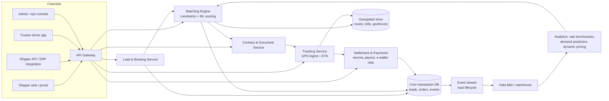
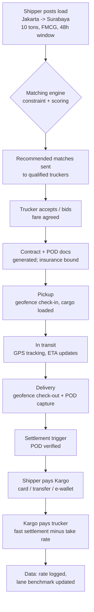

# Kargo Technologies: The Indonesian Digital Freight Deep-Dive

> **Author:** Jack Liu Shurui — Solution Architect at Cymbal Bank, Singapore  
> **Context:** General Tech / Business Series — Logistics-Technology, Marketplace Platforms, Southeast Asia (Indonesia)  — companion to [super_app_guide.md](super_app_guide.md) and the banking guides  
> **Repository:** [github.com/jackliusr/research](https://github.com/jackliusr/research)  
> **Last Updated:** August 2026

---

## Table of Contents

1. [Kargo Overview: The Company](#1-kargo-overview-the-company)
2. [The Indonesian Logistics Market](#2-the-indonesian-logistics-market)
3. [The Business Model](#3-the-business-model)
4. [The Technology](#4-the-technology)
5. [The Competitive Landscape](#5-the-competitive-landscape)
6. [Logistics-Tech in 2026](#6-logistics-tech-in-2026)
7. [Case Lessons from Kargo](#7-case-lessons-from-kargo)
8. [Worked Example: A Load Moves on Kargo](#8-worked-example-a-load-moves-on-kargo)
9. [Glossary](#9-glossary)

---

## 1. Kargo Overview: The Company

Kargo Technologies (legal entity: PT Kargo Online System) is an Indonesian logistics-technology company — the country's best-known "Uber for trucks." It operates a **digital freight marketplace** that connects shippers (FMCG companies, manufacturers, e-commerce players) with truckers and fleet owners, and it is the dedicated deep-dive of this guide: the company, its market, business model, technology, competition, and what its trajectory says about logistics-tech in 2026.

> **Verification note up front.** Several commonly repeated facts about Kargo are wrong or unverified. This guide corrects or flags them explicitly: (a) Kargo was **not** Y Combinator-backed — its seed was led by Sequoia Capital India; (b) founder Tiger Fang was **ex-Uber** (country head of Uber Indonesia), not ex-Gojek; (c) the frequently quoted "US$31M total raised" is actually the **Series A alone** — total disclosed funding is ~US$38.6M; (d) the company did **not** shut down in the 2023–2025 logistics-tech downturn — as of mid-2026 it is still operating and has pivoted into **EV-as-a-Service**. Full sourcing and remaining unverifiable items are listed in the honesty footer (§9.1).

### 1.1 What Kargo Is

**The one-liner.** Kargo is a two-sided trucking marketplace: shippers post loads on the platform; verified truckers and fleet owners bid for or accept them; Kargo's matching engine, GPS tracking, and digital payment rails close the loop from booking to settlement.

**The positioning.** "Uber for trucks" / "Uber for logistics" was the founding tagline (the company used it in its own 2019 materials and the press repeated it). Today Kargo describes itself as **Indonesia's largest B2B trucking platform**, with "product suites [that] can integrate with any business" (company LinkedIn). The shift in language — from *marketplace* to *platform* to, most recently, *EV-as-a-Service* — is itself the story of the company (§1.6).

**The problem it attacks.** Indonesian trucking is one of the most fragmented, least-digitized freight markets in the world: millions of small operators, phone-based coordination, opaque pricing, brokers ("calo") taking cuts, and trucks returning empty a large share of the time. Kargo's mission, as stated repeatedly by the founders, is to digitize that market and reimagine Indonesia's roughly **quarter-trillion-dollar logistics industry** (~US$250B in the company's own pitch, in line with total logistics-spend estimates — see §2.1).

### 1.2 Founding (2018)

**Founders.**

| Founder | Role | Background (verified) |
|---|---|---|
| **Tiger Fang** | Co-founder & CEO | Former **Uber** executive — country head of Uber Indonesia ("Former Uber Indonesia chief," DealStreetAsia; "Uber alumni," kr-asia). Left Uber, saw the trucking inefficiencies first-hand, and set out to digitize road freight. **Not** ex-Gojek, as some summaries claim. |
| **Yodi Aditya** | Co-founder & CTO | Indonesian software engineer; founded **Kargo.id** (2016), an earlier web-based trucking marketplace; previously CTO of Yogyakarta startup Doocu (2008); background in aircraft route optimization and payment technology; studied Applied Physics at Universitas Gadjah Mada. |

**The founding story.** Tiger Fang, during his time running Uber Indonesia, observed that the same structural inefficiency that plagued ride-hailing — fragmented supply, manual coordination, no visibility — was far worse in trucking. Inter-city freight was brokered over phone calls and WhatsApp, prices were negotiated case by case, and nobody had real-time visibility into where trucks were. Rather than build from scratch, Fang teamed up with Yodi Aditya, whose existing Kargo.id was already a small web-based trucking marketplace. The two merged the concept into **Kargo Technologies, founded in November 2018 in Jakarta**.

**The Y Combinator question (verified: not YC).** The task brief asked to verify "Y Combinator backing, YC batch 2018." The evidence says **no**:
- Kargo does not appear in Y Combinator's startup directory (site search returns nothing for the company).
- The 2021 AgFunder article on Waresix's US$100M round explicitly names "Y Combinator-backed Shipper — ... and Kargo Technologies" as *separate* Indonesian logistics startups — i.e., the YC label attaches to Shipper, not Kargo.
- Kargo's seed was led by **Sequoia Capital India** (announced March 2019), with participation from Travis Kalanick's **10100 Fund** — a fact kr-asia highlighted at launch ("Founded by Uber alumni and backed by Travis Kalanick"). The Uber/Kalanick connection is real; the YC connection appears to be a conflation that has propagated through secondary sources.

**Mission.** Digitize Indonesian trucking: replace the opaque, broker-mediated, phone-based market with a transparent, tracked, algorithmically matched digital freight marketplace — lowering cost, cutting empty runs, and giving shippers visibility and truckers faster payment.

### 1.3 Funding History (verified)

| Round | Date | Amount | Lead / Key investors | Notes |
|---|---|---|---|---|
| Seed | March 2019 | **US$7.6M** | **Sequoia Capital India** | Kargo's own press release said "~US$7 juta"; kr-asia/AsiaTechDaily report US$7.6M. Also in the round: Travis Kalanick's **10100 Fund**, **ZhenFund**, **ATM Capital**, **Intudo Ventures**, **Innoven Capital** (The Org). |
| Series A | April 2020 | **US$31M** (~IDR 504B) | **Tenaya Capital** (formerly Lehman Brothers' venture arm) | Participants: Sequoia Capital India, Mirae Asset Management, Intudo Ventures, January Capital (January Capital's own investor post; Global Private Capital Association). Strategic: **Coca-Cola Amatil's Amatil X** (April 2020). One low-quality source adds Quona Capital — unverified, flagged. |
| Extended Series A | 2021 | ~US$11.5M (claimed) | AppWorks, PT Equity Global Investments (claimed) | **Unverified** — single low-quality source; not corroborated by mainstream coverage. Treat with caution. |
| Strategic round | January 2022 | Undisclosed | **Teleport** (AirAsia Group's logistics arm) | Strategic investment + partnership for multi-modal "middle mile" (land + air) and regional expansion. Kargo had **75,000+ trucks** in network by this point. |
| Bridge | closed late 2025; reported July 2026 | **up to US$7M** (convertible note) | undisclosed | To fund the **EV-as-a-Service** business expansion (DealStreetAsia, 22 July 2026). |

**Total raised.** Disclosed rounds sum to **~US$38.6M** (US$7.6M seed + US$31M Series A). Adding the undisclosed Teleport round and the 2026 bridge, the true cumulative figure is higher (on the order of US$45–50M+). The "~US$31M" figure that appears in many summaries is the Series A only — a common misreading.

**What is notable about the cap table.** Kargo was backed by blue-chip tech-finance names — Sequoia Capital India, Travis Kalanick's 10100 Fund, ZhenFund, Tenaya Capital, Mirae Asset — plus strategic corporates (Coca-Cola Amatil, AirAsia/Teleport). Yet it never closed a conventional Series B or C during the 2020–2022 Southeast Asia boom. That, more than anything, frames the company's trajectory (§7.3).

### 1.4 Scale Milestones

| Date | Milestone (verified) |
|---|---|
| April 2020 | 6,000+ active shippers; 50,000+ trucks in network (Jumpstart, quoting the Series A statement) |
| January 2022 | 75,000+ trucks in network (Teleport/TNGlobal) |
| 2023 | Named one of **LinkedIn's Top Startups 2023** (Indonesia) |
| 2025 | Still hiring (e.g., data analyst roles posted via Tech in Asia jobs); still live as "Indonesia's largest B2B trucking platform" |
| 2026 | Operating; raising a bridge to fund EV-as-a-Service (DealStreetAsia, July 2026) |

### 1.5 Current Status (2024–2026)

**Still operating — but repositioned.** The task brief asked to verify "still operating? pivoted? reports of struggles?" The verified picture as of mid-2026:

- **Not shut down.** Unlike several Indonesian logistics startups that failed or were absorbed in the 2023–2025 shakeout, Kargo is alive, hiring, and raising.
- **Pivoted twice in effect.** (1) From *pure marketplace* toward *platform* — fleet-management tools, integrations ("product suites can integrate with any business"), and managed/asset-light services; (2) from freight brokering toward **EV-as-a-Service**: Kargo's own LinkedIn describes the offer — *"a business doesn't buy a truck, doesn't bid for COE, doesn't build a charging yard and doesn't hire an EV maintenance team. One monthly fee per vehicle covers the driver, deliveries by EV, charging, servicing, insurance and telematics."* The up-to-US$7M bridge (convertible note, closed late 2025) is explicitly earmarked to expand this EV business.
- **Struggles were real but survivable.** The marketplace core faced brutal competition and price wars (see §5), and the absence of a big 2021–2022 growth round is telling. The pivot to asset-light EV fleet operations is best read as a strategic response to a market where pure digital freight brokering could not reach profitability on its own.

> **Honest flag:** exact current headcount, revenue, and load volumes are not publicly disclosed. "Still operating" is verified through DealStreetAsia's July 2026 financing report, LinkedIn activity, and job listings; beyond that, granular operational data is unverifiable.

### 1.6 The Evolution in One View

```
2018 ── founding (Fang + Aditya; Kargo.id absorbed)
  │      pure marketplace: shippers ↔ truckers, matching + GPS + payments
  ▼
2019 ── US$7.6M seed (Sequoia India, Kalanick's 10100 Fund, ZhenFund)
  ▼
2020 ── US$31M Series A (Tenaya-led; Amatil X strategic)   [6k shippers / 50k trucks]
  │      COVID: freight volumes dip, then e-commerce demand explodes
  ▼
2021-22 ─ platform push (fleet tools, analytics, integrations)
  │        Teleport/AirAsia strategic round + multi-modal partnership  [75k trucks]
  ▼
2023-25 ─ funding winter; marketplace price wars; no Series B/C
  │        pivot: asset-light managed services → EV-as-a-Service
  ▼
2026 ── still operating; up-to-US$7M bridge for EV-as-a-Service (DealStreetAsia)
```

### 1.7 What Kargo Is Not: The Misconception Buster

Because secondary sources conflate Kargo with its neighbors, it is worth being explicit about the boundaries:

- **Not YC-backed** — Sequoia India-led seed; the YC label belongs to Shipper (§1.2).
- **Not ex-Gojek** — Tiger Fang ran Uber Indonesia, not Gojek (a persistent internet error; Gojek matters only as part of the GoTo super-app ecosystem providing GoSend/GoPay rails — see [super_app_guide.md](super_app_guide.md)).
- **Not a parcel/courier company** — Kargo is B2B truckload freight (linehaul and distribution), not last-mile parcels like J&T, SiCepat, or SPX Express.
- **Not dead** — still operating and raising in 2026, having pivoted (§1.5).
- **Not asset-heavy** — even EV-as-a-Service is asset-light in structure: one monthly fee covering driver, EV, charging, servicing, insurance, and telematics, rather than a balance-sheet truck fleet (though scaling it will need capital — hence the bridge).
- **Not a pure marketplace anymore** — the marketplace was the wedge; platform software and services are the business it evolved into (§3.4).

---

## 2. The Indonesian Logistics Market

Kargo's rise and pivot only make sense against the market it attacked. Indonesia is the archetypal "huge, fragmented, under-digitized" logistics market.

### 2.1 Market Size

| Measure | Figure | Source (verified) |
|---|---|---|
| Indonesia logistics & supply chain market (2025) | **US$131.2B**; ~6.3% CAGR to 2030 | Nexdigm / Ken Research market report |
| Indonesia logistics market projection (2027) | US$322.4B (broader spend definition, ~11.8% CAGR) | Ken Research via PR Newswire (Feb 2024) |
| Indonesia freight trucking market (2025) | **US$53.9B**; ~5.7% CAGR to ~US$76B by 2031 | Ken Research |
| Kargo's own pitch (2019–2022) | "quarter-trillion-dollar logistics industry" (~US$250B) | founder profile / GrowJo profile |

So the "~US$200B+ market" framing from the task brief is directionally right but depends on definition: **~US$130B** is the narrow logistics-services market; **~US$250–320B** is total logistics spend (including in-house transport cost, which is how "logistics cost as % of GDP" figures are derived).

**The cost-of-logistics statistic that matters.** Indonesia's logistics costs are estimated at **~23% of GDP** (including export logistics costs of ~9%), versus an **8–10% average for Southeast Asia** (Kompas.id, citing official/BPS-based analysis). That gap — a ~13–15 percentage-point structural inefficiency tax — is the entire thesis of every Indonesian logistics-tech startup, Kargo included.

### 2.2 The Fragmented Trucking Market

- **Mom-and-pop supply.** Indonesian trucking is dominated by small fleet owners — owner-operators and family businesses with a handful of trucks — not by large national fleets. (The task brief's "millions of small trucking companies" framing is correct in spirit; precise truck-count figures vary by source and are flagged as unverified here — Kargo's own network peaked at 75,000+ trucks, a small share of the national base.)
- **No standardized rates.** Prices are negotiated per trip, per relationship, with no public rate benchmarks. The same lane can cost wildly different amounts on the same day.
- **Manual coordination.** Booking happens over phone calls, SMS, and WhatsApp; the dispatch "system" is often a notebook or an Excel sheet.
- **The middlemen.** Freight brokers — known locally as **calo** — match loads to trucks for a cut, adding cost and opacity without adding visibility. Kargo's pitch was explicitly "cut out the calo."
- **The empty-backhaul problem.** Trucks that deliver a load often return empty because there is no way to find a return load (backhaul). Academic studies of intercity trucking put empty trips at **15–40%** of flows (ScienceDirect, 2024); Dutch research institute TNO cites **up to 50% of trucks running empty** globally; Indonesian industry sources commonly cite **~40%+**. (The precise Indonesian figure is not pinned by a single authoritative source — flag.) Every empty return leg is 100% wasted fuel, driver time, and asset depreciation — the single biggest efficiency prize for a load-matching marketplace.

### 2.3 Market Drivers

**E-commerce boom (the demand engine).** Indonesia's e-commerce market is one of the world's fastest-growing (~US$60B+ GMV by the mid-2020s per Google/Temasek e-Conomy-style estimates), and it is parcel- and truck-hungry:

- **J&T Express** — founded in Indonesia in 2015 by Jet Li (no relation to the actor; ex-OPPO), backed by Chinese capital, listed on the Hong Kong Stock Exchange in October 2023. The poster child of China-backed logistics in Indonesia.
- **Shopee** (Sea Group) — the largest marketplace platform; runs its own logistics arm (SPX Express).
- **Tokopedia** — merged with Gojek into **GoTo Group** (2021); GoTo's logistics layer (GoSend) and wallet (GoPay) are part of the super-app context covered in [super_app_guide.md](super_app_guide.md).
- **Wallets:** OVO and GoPay — the e-wallet rails that make cashless freight settlement possible (see §4.4).

**Infrastructure gaps (the constraint).** Indonesia is an archipelago of **17,000+ islands** (~6,000 inhabited) with uneven roads, congested ports (Tanjung Priok, Tanjung Perak), and costly sea connectivity between Java and the outer islands. Land transport dominates the Java corridor; multi-modal (truck + ferry + air) is required for the eastern islands. This is why Teleport's air partnership mattered to Kargo (§1.3), and why "middle mile" is the region's growth layer.

**The digitalization wave (Logistics 4.0).** By the late 2010s, GPS/telematics hardware had become cheap, smartphones were ubiquitous even among truck drivers, and Indonesia's mobile-first population had been trained on apps by Gojek/Grab. The technology stack for digital freight (tracking, matching, digital payment) became feasible for the first time — the classic "technology catches up with a structural inefficiency" moment.

**Market structure signal.** Tracxn counted **429 logistics-tech startups in Indonesia**, of which 42 are funded, having collectively raised **US$7.12B**, with 23 at Series A+ and **2 unicorns** (as of the mid-2020s snapshot). A big pond — but a brutally competitive one (§5).

### 2.4 How Freight Actually Moves Today: The Analog Journey

To understand the size of the prize, walk a load through the incumbent process — the process Kargo's marketplace replaces:

1. **Find a truck.** A shipper's logistics staffer calls a known broker (*calo*) or a shortlist of transporters. No public inventory exists — who is available, where, at what price, is tribal knowledge.
2. **Negotiate.** Price is quoted per trip by memory and relationship, not by a rate card. The same lane varies wildly day to day. The calo's cut is invisible in the price.
3. **Paper the deal.** A delivery order is emailed/WhatsApp'd; the trucker may not even be the one who answered the phone (dispatch by proxy — the actual driver is found at pickup time).
4. **Blind execution.** Once the truck leaves, the shipper has no live visibility — status updates are phone calls. ETA is a guess; traffic, tolls, and ferry schedules are unaccounted.
5. **Prove delivery.** POD is a signed paper form that travels back with the driver — days of latency before the shipper can reconcile and pay.
6. **Pay late.** Corporate payment terms of 30–90 days are standard. The trucker — usually a small operator — carries that working-capital burden, which is priced back into the freight rate.

Every step is a cost and a risk that Kargo's model targets: step 1–2 (marketplace + rate transparency), 3 (standardized digital contract), 4 (GPS tracking), 5 (digital POD + geofencing), 6 (fast settlement — the fintech rail, §4.4).

**Why this market resisted digitization longer than ride-hailing.** Ride-hailing was simple (one passenger, one driver, cash/QR payment, no documents). Freight has cargo classes, weights, insurance, damage liability, port/toll/ferry complexity, and B2B credit — a *saga* of state transitions rather than a single match. The startups that survived treated it as an operations + software problem, not an app problem.

---

## 3. The Business Model

### 3.1 The Two-Sided Marketplace

Kargo's core model is the textbook **two-sided marketplace**:

- **Demand side — shippers:** FMCG companies (food & beverage, consumer goods — the Coca-Cola Amatil relationship is emblematic), manufacturers, retailers, and e-commerce operators who need trucks for inter-city (linehaul) and intra-city moves. They post loads: origin, destination, cargo type, vehicle size, pickup/delivery windows, price or "best offer."
- **Supply side — truckers:** fleet owners and owner-operators with trucks ranging from small 4-wheel box trucks to 20+ foot trailers and wingbox/container trucks. They browse/bid on loads that match their location, capacity, and route.

**Matching.** Kargo's engine matches load attributes (origin, destination, timing, truck type, cargo class) against trucker profiles (location, vehicle type, verified documents, historical performance). The goal: convert a truck's empty return leg into a paid backhaul — the "fill the empty run" value proposition that marketplace economics hinge on (§2.2).

**Trust layer.** Unlike ride-hailing, B2B freight involves documents, damage risk, and payment terms — so marketplaces must verify truckers (licences, KTP/company registration), capture proof of delivery, and enforce service levels. Verification and dispute handling are core cost centers, not side features.

### 3.2 Revenue Model

| Stream | Mechanism | Notes |
|---|---|---|
| **Commission / take rate** | A percentage of freight value per completed load (industry-typical digital-freight take rates ~5–15% depending on lane and service tier — Kargo's exact rate is not public, flag) | The classic marketplace revenue; higher-touch services (managed transport) command higher effective margins. |
| **SaaS / subscription** | Fleet-management and analytics tools for transporters; integration APIs for shippers ("product suites can integrate with any business") | The marketplace→platform evolution: sell software to the same participants who transact on the marketplace. |
| **Value-added services** | Tracking/telematics, fast payment settlement, insurance, financing | Each is a monetizable rail on top of the core transaction. |
| **EV-as-a-Service (2025–2026 pivot)** | Recurring monthly fee per vehicle covering driver, EV, charging, servicing, insurance, telematics | Asset-light fleet model — Kargo operates/coordinates the EV truck, the customer pays one fee. Verified via Kargo LinkedIn + DealStreetAsia. |

### 3.3 Unit Economics (the honest view)

For a freight marketplace, the unit economics decompose as:

```
Gross Freight Value (per load)
  −  trucker payout (the majority — 80–90%+ of GFV in managed models)
  ─────────────────────────────────────────────
  =  Net revenue (take rate × GFV, plus SaaS/fees)
  −  sales & account management   (winning shippers is expensive B2B)
  −  verification, support, dispute costs
  −  technology & data costs
  −  payment/settlement costs
  ─────────────────────────────────────────────
  =  Contribution margin per load
```

The structural problem every Indonesian freight marketplace hit: **B2B freight is high-touch and price-sensitive.** Winning and retaining shippers requires account managers and negotiated contracts; truckers are fragmented and price-compare aggressively; the "marketplace" take rate is squeezed by competition (Waresix et al. ran price wars — §5.5). Pure-brokerage marketplaces found it hard to cover opex on thin take rates at Indonesian price levels. This is the core reason Kargo (and others) shifted toward managed/asset-light and software revenue — where the take rate is effectively higher and stickier.

### 3.4 Evolution: Marketplace → Platform → EV-as-a-Service

The trajectory (verified against announcements, §1.6):

1. **Phase 1 (2018–2020): Pure marketplace.** Post-bid-accept-track-pay. Raise big, grow both sides, subsidize liquidity.
2. **Phase 2 (2021–2023): Platform.** Add fleet-management tools, analytics, API integrations; sell to the same users as software customers; deepen enterprise relationships (Amatil, Teleport).
3. **Phase 3 (2024–2026): Asset-light operator / EV-as-a-Service.** Move up the value chain from "match freight" to "operate (electric) trucks for businesses under a subscription." Recurring revenue, higher take, and a differentiated ESG/fuel-cost story — but capital-intensive to scale, hence the bridge round.

### 3.5 The Marketplace Flywheel — and Why It Grinds Slow in B2B Freight

The textbook marketplace flywheel:

```
more truckers  →  better fill rates & shorter lead times  →  more shippers
     ↑                                                          ↓
more loads for truckers  ←  more shipper demand  ←  better service & data
```

In ride-hailing this spins in months. In B2B freight it grinds for years, because:

- **The unit of value is the lane, not the ride.** A shipper doesn't need "a truck" — they need a *specific* truck type on a *specific* lane at a *specific* time. Liquidity is per-lane, so the network must reach critical density on thousands of origin–destination pairs before the promise holds. Long-tail demand (refrigerated, oversized, hazardous, remote islands) is where the marketplace fails first and the managed-service layer must step in.
- **Trust is expensive to establish.** Every new trucker needs verification, every new shipper needs onboarding and often a pilot — B2B sales cycles measured in months, not app installs.
- **Both sides must be subsidized at the start.** Guaranteeing supply attracts shippers; guaranteeing demand attracts truckers. In 2019–2021 capital was cheap enough to fund this; in 2023+ it was not — which is why the flywheel froze for pure marketplaces and why survivors layered on software and managed revenue (Kargo's platform and EV phases).

**Trucker-side economics (why fast payment is the killer feature).** A small fleet owner runs on thin margins: fuel 30–40% of trip cost, plus tolls, driver wages, maintenance, and loan installments. Waiting 60–90 days for corporate payment is existential. A platform that settles in days (or on POD) effectively gives the trucker working capital — worth more than a slightly higher rate elsewhere. This is why the payments rail (§4.4) is a growth engine, not just plumbing — and why it overlaps with supply-chain finance ([supply_chain_finance_guide.md](../banking/supply_chain_finance_guide.md)).

**Shipper-side economics (why enterprise relationships win).** For a corporate shipper, freight spend is 5–15% of COGS; the value of a platform is not the discount but *control*: rate cards, SLA tracking, consolidated invoicing, and visibility. That value accrues to platforms with software and data (Waresix, Ritase, Kargo's platform phase), not to anonymous spot-market exchanges.

---

## 4. The Technology

> **Honest flag up front.** Kargo has never published a detailed engineering-stack document; the descriptions below are the standard architecture for a digital freight marketplace of this era (and are consistent with Kargo's public materials: web platform + driver app, matching, GPS tracking, digital payments, data/analytics). Specific vendor choices, model details, and scale figures beyond the cited network numbers are inferred from industry patterns and flagged where speculative.

### 4.1 Platform Surface

- **Shipper side:** web portal (and app) for posting loads, managing bookings, tracking in transit, accessing documents and invoices. Enterprise-grade: rate cards, contract pricing, API/EDI integration into shipper ERPs/TMS.
- **Trucker side:** a driver app (Kargo's driver app has been on the Google Play store since early days; per Dealroom) — load discovery/bidding, document upload (delivery orders, proof of delivery), earnings dashboard, and navigation.
- **Admin/ops console:** the internal system for verification (KYC/KYB of truckers), pricing rules, dispute handling, and marketplace operations.

### 4.2 Matching Engine

The heart of the product: **load–truck matching** as a constraint problem —

- **Inputs:** load attributes (origin, destination, pickup/delivery windows, truck type, weight/volume, cargo class, price); truck attributes (current location via GPS, capacity, type, driver schedule, verified status, historical reliability).
- **Objective:** maximize match quality / fill empty legs — pair a truck finishing a delivery with a return load (backhaul pairing), minimize deadhead kilometres.
- **Enrichment:** **route optimization** — given Indonesia's geography (toll roads, ferries, port congestion), estimated travel time is computed per lane; **dynamic pricing** adjusts posted rates by supply/demand and lane conditions.
- **Matchmaking style:** from open "post + bid" (the marketplace phase) toward **algorithmic dispatch / recommended matches** (the platform phase) as data accumulates.

### 4.3 Tracking & Telematics

- **GPS tracking** of trucks in transit → **real-time visibility** for shippers (ETA, proof of location), replacing the "where is my truck?" phone calls that defined the analog market.
- **Geofencing** for pickup/delivery confirmation; **proof-of-delivery** capture (photos, signatures, timestamps) — the settlement trigger (see §4.4).
- Fleet telematics data (speed, idling, fuel) feeds both driver scoring and the analytics product.

### 4.4 Payments

The settlement loop is where logistics meets fintech (see the banking guides for the broader trade/SCF context):

- **Digital settlement:** shipper pays Kargo (card, bank transfer, or **e-wallet** — OVO, GoPay, in the Indonesian super-app context of [super_app_guide.md](super_app_guide.md)); Kargo pays the trucker.
- **Fast payment to truckers:** the killer feature for supply — truckers historically wait 30–90 days for payment from corporate shippers; a marketplace that pays on proof-of-delivery (or within days) wins supply loyalty. This "fast-pay" rail is effectively working-capital intermediation — and connects directly to the supply-chain-finance mechanics in [supply_chain_finance_guide.md](../banking/supply_chain_finance_guide.md) (receivables financing, dynamic discounting, settlement rails).
- **Escrow/withholding:** platform holds the freight value between proof-of-delivery and dispute-window expiry — standard marketplace pattern.
- **Insurance:** bundled cargo/transit insurance as a value-added, margin-bearing add-on.

### 4.5 Data & Analytics

- **Rate benchmarking:** the platform accumulates lane-level pricing data — the industry's first transparent rate index for Indonesian trucking (a data asset competitors and incumbents lack).
- **Demand prediction:** forecasting lane-level demand to guide trucker supply placement and dynamic pricing.
- **Fleet analytics:** utilization, empty-run ratios, driver performance — the SaaS product sold to transporters.

### 4.6 Architecture Patterns (as inferred)

- **Mobile-first** on the trucker side (drivers are smartphone-native); web/API-first on the shipper side.
- **Cloud-hosted** core (no public detail on providers — flag); geospatial services (maps, routing, geofencing) for the archipelagic geography.
- **Event-driven** transaction flow: load posted → matched → accepted → pickup → in-transit (GPS events) → delivered (POD event) → paid — each state transition an event that triggers downstream systems (notifications, documents, payments, analytics). This is the same event-sourcing/messaging discipline covered in the streaming guides (e.g., [kafka_alternatives_guide.md](kafka_alternatives_guide.md)) — freight marketplaces are event-stream systems in disguise.
- **AI layer:** demand prediction, dynamic pricing, and (increasingly) route/load optimization — the frontier where logistics-tech is converging in 2026 (§6.5).

### 4.7 A Reference Architecture (as inferred)

Putting §4.1–§4.6 together into the shape of a digital freight platform of Kargo's era (inferred — no public stack documentation exists; flagged):



**Key architectural properties:**

1. **Events as the spine.** The load lifecycle is an event stream (posted → matched → accepted → picked up → in transit → delivered → settled); every service reacts to events, and the data lake is fed from the stream — the event-sourcing/streaming discipline of [kafka_alternatives_guide.md](kafka_alternatives_guide.md).
2. **Geospatial as a service, not a library.** Routing, ETA, tolls, and geofenced POD need their own data and compute (ferry schedules, port congestion, Java toll network) — the archipelagic geography makes this a core dependency, not a map widget.
3. **Payments with escrow semantics.** Settlement is a saga with a hold period: POD event → invoice → collect from shipper → release to trucker minus take rate; idempotency and audit trails are non-negotiable (fintech rails per [financial_technology_overview.md](../banking/financial_technology_overview.md)).
4. **Data products from day one.** Every transaction writes the rate-benchmark dataset — the defensible asset pure brokerages never accumulate (§7.5).

---

## 5. The Competitive Landscape

### 5.1 The Indonesian Digital Freight Players (verified)

**Waresix — the one-stop logistics survivor.**
- Founded 2017 by Andree Susanto and Edwin Wibowo. Started as a trucking marketplace ("the Uber of trucks" in Jakarta), then deliberately pivoted to **sea + land** — integrating with Indonesian national ports and reaching 200 cities with 50,000+ trucks and 400+ warehouses (company coverage, mid-2020s).
- Funding: US$14.5M Series A led by EV Growth; ~US$100M round in September 2020 (East Ventures blog; AgFunder calls it SoftBank-backed); absorbed fellow trucking platform **Trukita** in a 2020 merger.
- Focus: agriculture, commodities, infrastructure; full-chain (truck + warehouse + sea).
- 2024–2025 status (Tech in Asia): **defied the downturn** — 2024 revenue US$206.7M (+3.6% YoY), losses trimmed, operating cash burn cut ~9×; laid off engineering staff in 2023 but emerged as the sector's scale survivor.

**Ritase — the enterprise supply-chain digitizer.**
- B2B digital transportation management: load planning, route optimization, live tracking, ERP integration — selling software/dispatch to enterprises rather than running an open marketplace.
- Funding: US$8.5M Series A (July 2019) led by Golden Gate Ventures.
- Status: still listed and described as active in startup databases (e27, Owler), but **little public news since ~2021** — flag as "operating with low visibility / possibly reduced scope."

**Logisly — the trucking marketplace.**
- Jakarta-based "B2B tech-enabled logistics platform" connecting shippers with truckers; thousands of orders within three months of founding (2019); 5,000+ trucks early.
- Funding: seed from SeedPlus, Convergence Ventures, Genesia Ventures (2019); US$6M Series A led by Monk's Hill Ventures (November 2020, TechCrunch).
- Status: **little public news since 2021** — flag similarly to Ritase.

**Shipper — the YC-backed one.** Indonesia's Y Combinator-backed logistics startup (per AgFunder), raised Series A from Naspers (2021); still operating as a multi-service logistics/fulfillment platform. Useful as the actual YC data point in this market — and the reason Kargo's "YC-backed" mislabel is so easily confused.

**Others in the orbit:** **Deliveree** (Philippines/Indonesia trucking marketplace), **Trukita** (merged into Waresix), parcel/courier players (J&T Express, SiCepat, Anteraja), and the super-app logistics layers (GoTo's GoSend, Grab's GrabExpress) — see [super_app_guide.md](super_app_guide.md).

### 5.2 Comparison Table

| Company | Founded | Focus | Model | Funding (verified) | Status (mid-2026) |
|---|---|---|---|---|---|
| **Kargo Technologies** | 2018 | Inter-city trucking marketplace → platform → EV-as-a-Service | Marketplace + SaaS + EV subscription | ~US$38.6M disclosed ($7.6M seed Sequoia India; $31M Series A Tenaya) + Teleport + $7M bridge | **Operating**; pivoted to EV-as-a-Service |
| **Waresix** | 2017 | Sea + land "one-stop logistics"; agri/commodities/infrastructure | Marketplace + managed + warehousing | ~US$14.5M Series A (EV Growth); ~US$100M (2020) | **Operating**; 2024 revenue US$206.7M; profitable-direction |
| **Ritase** | 2018 | Enterprise supply-chain digitization (TMS) | B2B SaaS / managed transport | ~US$8.5M Series A (Golden Gate) | Operating, low public visibility |
| **Logisly** | 2019 | Trucking marketplace (FTL) | Tech-enabled logistics | Seed (SeedPlus/Convergence/Genesia); US$6M Series A (Monk's Hill) | Operating, low public visibility |
| **Shipper** | 2017 | Multi-service logistics/fulfillment | Marketplace + fulfillment | Series A (Naspers); YC-backed | Operating |

### 5.3 Regional Context (SEA)

- **Last-mile giants:** **Ninja Van** (SEA-wide; layoffs in 2022, still operating), **J&T Express** (China-backed; HKEX IPO Oct 2023), SPX Express (Shopee). These compete on parcels, not linehaul — but they define the regional logistics-tech capital market.
- **Super-app logistics:** GoTo (GoSend) and Grab (GrabExpress) treat delivery as a bundled service of the super app — a different model from standalone freight marketplaces.
- **The funding backdrop:** SEA tech funding collapsed **65% in 2023 to US$4.3B** (Tracxn) — the worst year since 2016 (Tech in Asia); 2024 saw a modest rebound, and DealStreetAsia reported SEA logistics funding recovering in 2024–2025, with the ASEAN freight & logistics market at **US$269.5B in 2024**, heading to **US$390B by 2030**.

**The regional patterns that matter for Kargo:**

- **China capital and the J&T playbook.** J&T Express — founded in Indonesia (2015) by ex-OPPO executives (commonly reported founder: Jet Lee), built with Chinese logistics know-how, listed on HKEX in October 2023 — demonstrated that Indonesia's logistics could be built fast with Chinese-style operational intensity. That raised the bar for everyone: network density, low unit costs, and willingness to run thin margins. Chinese capital also flowed into Indonesian trucking-adjacent logistics (e.g., ATM Capital's presence in Kargo's own seed cap table).
- **The middle mile as the growth layer.** With last mile commoditized (parcels) and first mile (pickup) solved by platforms, the under-served layer is the **middle mile** — trunk hauls between hubs, especially inter-island (truck + ferry + air). This is exactly where Kargo's Teleport partnership sat (§1.3) and where Waresix's sea+land pivot went. Whoever owns the middle-mile network owns Indonesian logistics.
- **Super apps as logistics platforms.** GoTo and Grab treat logistics as a bundled service (GoSend, GrabExpress) — good for parcels and same-day, structurally different from B2B linehaul. Their wallets (GoPay, OVO) matter more to freight startups as payment rails than their courier networks do as competitors.
- **Cross-border pressure.** Malaysian/Singaporean platforms eye Indonesian freight (e.g., regional freight-forwarding digitization), and global digital freight networks (Flexport, Uber Freight — §6.6) target SEA forwarders — pressure from above while local price wars squeeze from below.

### 5.4 Kargo vs. the Competitors (the strategic read)

- **vs. Waresix:** Waresix chose breadth (sea+land+warehousing, commodities) and scale-funded consolidation; Kargo stayed closer to pure road freight and software. Waresix's 2024 numbers prove the "platform over marketplace" lesson; Kargo's EV pivot is its answer to the same lesson from a different angle.
- **vs. Ritase/Logisly:** Ritase chose enterprise software (higher margin, slower growth); Logisly stayed marketplace (liquidity-bound). Kargo sat between — marketplace liquidity *and* platform software — which is the hardest position to execute.

### 5.5 The Challenges

- **Price wars:** Tech in Asia's 2025 coverage explicitly describes Indonesia's logistics sector as "bruised by intense price wars" — marketplaces undercut each other to win shippers, compressing take rates below viable levels.
- **Funding winter:** 2023–2025 capital dried up; companies that had not reached scale or profitability by 2022 could not raise the next round. Kargo's absence of a Series B/C in 2021–2022 is the single most important competitive fact about it.
- **The incumbent shadow:** traditional logistics majors (Puninar, CKB, Samudera, SERA — Ken Research's top trucking names) began digitizing in-house, and corporates' procurement departments started demanding API integration, TMS, and visibility — which favors platforms with software (Waresix, Ritase) over pure brokerages.

---

## 6. Logistics-Tech in 2026

### 6.1 The Downturn That Was (2023–2025)

The logistics-tech sector went through the same correction as the rest of venture capital, amplified by its own dynamics:

- **Funding winter:** SEA tech funding −65% in 2023 (Tracxn); logistics startups globally faced down-rounds, bridges, and closures. The era of "growth at all costs" ended (Tech in Asia's framing of Waresix's pivot).
- **Layoffs and shutdowns:** logistics startups across SEA cut staff (Ninja Van 2022; Waresix's engineering layoffs 2023); several Indonesian logistics-tech startups folded or were absorbed. Globally, freight-tech saw a wave of distress (see the 2025 trucking-bankruptcy coverage as a backdrop).
- **The survivors' playbook:** the companies that made it (Waresix, Flexport, Kargo in its pivoted form) all did the same three things — cut burn, focus unit economics, move up the value chain from brokerage to managed/platform/asset-light revenue.

### 6.2 Consolidation

- **M&A as the exit:** Waresix absorbed Trukita; J&T consolidated express assets; larger platforms bought smaller ones for network and data rather than building.
- **Strategic corporates as investors:** the pattern of corporates taking stakes in logistics-tech (Amatil→Kargo, AirAsia/Teleport→Kargo, SoftBank→Waresix) accelerated — strategic capital replaced growth VC as the marginal dollar in the sector.

### 6.3 The Pivot to Profitability

The 2026 operating doctrine for logistics-tech:

1. **Unit economics first:** take rate × load frequency must cover acquisition and ops — no more subsidized liquidity.
2. **Recurring revenue:** SaaS, subscriptions, and managed-service fees beat one-off transaction fees (Kargo's EV-as-a-Service is the purest expression of this in Indonesia).
3. **Asset-light asset-adjacent models:** operating/coordinating fleets (EV-as-a-Service, managed transport) without owning the capital stock — or owning it only where the margin justifies it.
4. **Data as the moat:** lane-level rate data, demand forecasts, and utilization analytics become the defensible product (Waresix's analytics; Kargo's rate benchmarking).

### 6.4 Incumbents Digitizing

The traditional logistics companies (Ken Research's top trucking names: Samudera Indonesia, CKB Logistics, Kamadjaja, Puninar, SERA) are digitizing in-house and via partnerships — meaning the "disrupt the incumbents" thesis of 2019 has partly inverted: incumbents are now both competitors and the most likely acquirers of startup capability.

### 6.5 AI in Logistics

- **AI route optimization & load matching:** the matching engine problem (§4.2) is now an ML problem — reinforcement-learning dispatch, backhaul pairing, ETA prediction on Indonesian toll/ferry networks.
- **Demand prediction & dynamic pricing:** lane-level forecasting and supply/demand pricing are table stakes for the survivors.
- **Autonomous trucks:** still nascent globally (especially outside highways in developed markets); in Indonesia, a 2030s question, not a 2026 one — but the telematics/data layer being built now is the precondition.
- **The data-network effect:** as the architect-coach analysis of 2026 puts it, digital freight platforms accumulate the shipment graph — "the data that makes their AI better with every transaction" — while incumbents see only their own freight. AI entrenches the platform winners.

### 6.6 Global Digital Freight Networks (comparison)

| Platform | Model | Status (2026, verified) | Lesson for Kargo/SEA |
|---|---|---|---|
| **Flexport** | Digital freight forwarder (ocean/air + software) | Operating; 2025 "profitability" claims contested (built partly on divested assets); launched Rate Explorer (airline-style price discovery) Oct 2025 | Software + data + freight execution; the rate-benchmarking idea Kargo also pursued |
| **Uber Freight** | Truckload digital brokerage + managed transportation (US) | Still operating in 2026 | The "Uber for trucks" original — shows pure brokerage gets squeezed; Uber Freight's reportedly explored strategic sale in the mid-2020s, mirroring freight-marketplace margin pressure |
| **Kargo / Waresix (Indonesia)** | Regional truckload marketplace → platform/EV | Operating; pivoting to managed & recurring revenue | Regional players survive by local depth (fragmented market, calo removal, e-wallet rails) rather than global breadth |

The global lesson: **brokerage margins are structurally thin; the survivors are the ones who own data, software, and recurring customer relationships** — exactly the Kargo/Waresix trajectory in miniature.

### 6.7 EV Freight and the Green Wave (Kargo's 2026 Bet)

Kargo's EV-as-a-Service pivot sits inside a genuine macro trend:

- **EV adoption is accelerating globally** — EVs were over a quarter of new vehicle sales in 2025 (MIT Technology Review), and commercial EV/logistics adoption is the next frontier after passenger cars. Southeast Asia is explicitly named by BloombergNEF and the IEA as a growth market for EVs.
- **Why trucking companies are interested:** total cost of ownership (fuel vs. electricity, maintenance), regulatory/ESG pressure from corporate shippers (FMCG multinationals' net-zero supply chains), and Indonesia's nickel-based EV supply-chain ambitions (the government wants downstream EV manufacturing domestically).
- **Why as-a-service rather than ownership:** an EV truck is a new asset class with new risks — battery depreciation, charging infrastructure, resale value, maintenance skills. Small and mid-size businesses cannot assess or carry those risks; a subscription that bundles truck, driver, charging, servicing, insurance, and telematics transfers the technology risk to a specialist operator. That is precisely Kargo's pitch (one monthly fee per vehicle — §1.5).
- **The catch:** it is capital- and operations-intensive to scale — charging yards, driver pools, maintenance, and (in Singapore-flavored markets) COE/licensing complexity — which is why Kargo needed the bridge round and why the model, unproven at scale, is honestly flagged as unverifiable for profitability (August 2026).

The strategic reading: if EV-as-a-Service works, Kargo graduates from thin-margin freight brokering to a recurring-revenue fleet business with a differentiated, ESG-timed offer — the highest-margin position any Indonesian logistics-tech player has claimed so far.

---

## 7. Case Lessons from Kargo

### 7.1 Market Timing: Right Thesis, Crowded Window

Kargo launched (2018) at the perfect structural moment — cheap GPS/smartphones, e-commerce takeoff, a ~23%-of-GDP logistics-cost problem — and in a window that rapidly crowded: Waresix (2017), Logisly (2019), Ritase (2018), Shipper, Deliveree, plus corporate digitization. **Market timing was right; differentiation window was short.** A differentiated wedge (Waresix's sea+land, Ritase's enterprise software, Kargo's EV pivot) proved essential — the generic "Uber for trucks" wedge alone did not survive.

### 7.2 Two-Sided Marketplace Challenges: Liquidity and the Chicken-and-Egg

- **Cold start:** no loads → no truckers → no loads. Marketplaces solve this by subsidizing one side (guaranteed loads to anchor truckers; discounted/serviced loads to anchor shippers) — expensive, and the cost shows up in the take-rate math (§3.3).
- **Liquidity ≠ quality:** in freight, the marketplace's value depends on *fill rate on the exact lane you need today* — a marketplace can be huge and still fail a shipper who needs a refrigerated truck on Jakarta–Surabaya at 6am. B2B freight is a long-tail matching problem, which is why the best digital freight companies behave like operations businesses, not just exchanges.
- **Disintermediation risk:** once a shipper and trucker find each other, they can go direct — the marketplace must keep enough value (tracking, fast payment, insurance, documents, rate data) that going direct is worse.

### 7.3 Funding Dependence: Growth vs. Profitability

Kargo raised ~US$38.6M disclosed — respectable, but an order of magnitude below what SEA logistics needed to outlast the winter (Waresix's ~US$100M+; J&T's IPO). The absence of a Series B/C in the 2021–2022 boom window left Kargo dependent on strategic rounds (Amatil, Teleport) and, ultimately, a bridge. **The lesson: in capital-hungry two-sided markets, the round ladder is the strategy** — if you cannot raise the next big round during the boom, you must be structurally profitable or pivot to a less capital-hungry model before the winter (Kargo's EV-as-a-Service is precisely such a pivot).

### 7.4 Pivot/Adaptation: What Actually Happened

Verified sequence: **marketplace (2018–2020) → platform/software + strategic partnerships (2021–2023) → EV-as-a-Service (2024–2026)**. Kargo did not die in the downturn; it repositioned from "match loads" (thin, commoditized margin) to "operate electric trucks for businesses under a subscription" (recurring, higher-margin, ESG-timed, and aligned with Indonesia's EV logistics push). Whether the EV bet reaches profitability is unverifiable as of August 2026 — but the *pattern* (pivot toward recurring revenue and the data/ops moat) is the canonical survival move of the 2023–2025 shakeout.

### 7.5 Lessons for Tech Architects

For anyone designing marketplace/platform systems (see also the platform guides in this series):

1. **Design the transaction flow as an event stream.** Load lifecycle (posted → matched → accepted → picked up → in transit → delivered → paid) is a saga; model state transitions as events, with the payment settlement as the compensating/finalizing step. (Streaming discipline per [kafka_alternatives_guide.md](kafka_alternatives_guide.md).)
2. **The matching engine is a constraint solver first, an ML model second.** Get the hard constraints right (capacity, timing, truck type, documents), then layer optimization and ML.
3. **Geospatial is a first-class dependency.** Routing, ETA, geofenced POD, and toll/ferry awareness are core — not a map widget bolted on.
4. **Payments rails are the moat.** Fast settlement to supply is the #1 driver-retention lever and a fintech business in disguise (§4.4; trade/SCF mechanics in [supply_chain_finance_guide.md](../banking/supply_chain_finance_guide.md)).
5. **Data products are the defensible asset.** Rate benchmarks, lane demand, and utilization analytics are what a pure brokerage cannot copy cheaply.
6. **Build for the pivot.** The marketplace→platform→services trajectory means the architecture should separate *matching* (thin, replaceable) from *transaction data and customer relationships* (durable, monetizable) from day one.

---

## 8. Worked Example: A Load Moves on Kargo

A concrete walk-through of a Jakarta–Surabaya inter-city shipment (Kargo's core lane type), showing the flow, the systems, and the money.

### 8.1 The Flow



### 8.2 The Same Flow, ASCII (systems view)

```
 SHIPPER APP/WEB                KARGO PLATFORM                 TRUCKER APP
 ---------------                --------------                 -----------
 post load ──────►  LOAD SERVICE (validate, classify) ────────┐
                    MATCHING ENGINE (constraints + score) ────┼──► recommended load
                    (geospatial: routes, ETA, tolls)          │    bid / accept
                    CONTRACT + INSURANCE SERVICE ◄────────────┘
 pickup ─────────►  GPS/GEofence events ──► TRACKING SERVICE ────► live ETA on app
 delivery ───────►  POD capture ──► SETTLEMENT SERVICE
                    │                  │
                    ▼                  ▼
                 INVOICE            PAYOUT (fast settlement,
                    │                minus take rate)
                    ▼                  ▼
                 SHIPPER PAYS      TRUCKER PAID
                 (card/wallet)     (bank/e-wallet)
                    └──────► DATA LAKE: rate benchmarking, demand prediction
```

### 8.3 Systems Involved

| Step | Systems | What happens technically |
|---|---|---|
| Post load | Load service, classification, rate engine | Validate shipper, normalize origin/destination to geocodes, apply contract/spot rate, publish load event |
| Match | Matching engine, geospatial service, ML scoring | Constraint-filter (truck type/capacity/timing/docs) → score by location, ETA, reliability → push recommended matches; backhaul pairing against trucks finishing nearby deliveries |
| Accept | Contract service, document service, insurance API | Freeze price, generate transport contract + delivery order, bind cargo insurance, emit accepted event |
| Pickup | GPS/telematics, geofencing | Driver checks in at origin geofence; cargo loaded; status → in transit |
| Track | Tracking service, ETA model | GPS pings → position updates; ETA recomputed against route/traffic/ferry schedules; shipper sees live map |
| Delivery | Geofencing, POD capture | Check-out at destination geofence; driver uploads POD (photo/signature); delivered event emitted |
| Pay | Settlement service, payment gateway, e-wallet/bank rails | POD verified → invoice shipper (card/bank/e-wallet: OVO, GoPay context); release payout to trucker on fast-settlement terms minus take rate; dispute window held in escrow |
| Learn | Data lake, analytics, ML | Log lane price → rate benchmark; feed demand prediction and dynamic pricing; update trucker reliability score |

### 8.4 Money Walk-Through (illustrative)

```
Freight value (Jakarta → Surabaya, 10 tons):      IDR 8,000,000
Kargo take rate (illustrative, not public):       ~10%        → IDR 800,000
Trucker payout (fast settlement, net):            IDR 7,200,000
Kargo's costs (acquisition, support, payment):    (opex)      → thin contribution
Value-added: insurance premium share, SaaS fee    (+)         → margin
```

The illustration is exactly why the model had to evolve: at ~10% take on a price-compressed lane, the marketplace barely covers B2B acquisition and ops costs — hence the platform fees and EV-as-a-Service subscription as the margin fix (§3.2, §7.4).

---

## 9. Glossary

**Logistics-tech (logtech).** Technology companies applying software, data, and (increasingly) AI to freight and supply-chain operations — marketplaces, TMS, tracking, payments, warehousing, and fleet management. Indonesia has 429+ such startups (Tracxn).

**Freight.** Goods transported by a carrier in return for payment — as opposed to *parcels* (small, e-commerce shipments). Freight moves by truck (road freight/linehaul), ship (sea freight), rail, or air.

**Marketplace.** A platform where independent buyers and sellers transact; the platform takes a commission rather than owning inventory or assets. Kargo = freight marketplace.

**Two-sided marketplace.** A marketplace with two distinct user groups whose value to each other is the product (shippers ↔ truckers). Network effects and the chicken-and-egg cold-start problem are the defining dynamics (§7.2).

**Shipper.** The party that needs goods moved (FMCG company, manufacturer, retailer, e-commerce operator) — Kargo's demand side.

**Trucker / transporter / carrier.** The party that provides the truck and driver — Kargo's supply side. In Indonesia, mostly small fleet owners and owner-operators.

**Backhaul.** The return leg of a truck journey. Empty backhaul = the truck returns with no load — the core inefficiency load-matching platforms attack (§2.2).

**Empty run / deadhead.** A trip (or kilometre) driven with no cargo. Globally 15–50% of truck kilometres can be empty; Indonesian sources commonly cite ~40%+ (flagged estimate).

**FMCG.** Fast-Moving Consumer Goods (food & beverage, household products) — the archetypal freight category and a key Kargo shipper segment (e.g., Coca-Cola Amatil).

**Brokering.** The business of intermediating between shippers and carriers for a fee. In Indonesia's analog market this happens over phone/WhatsApp via middlemen — see *calo*.

**Calo.** Indonesian term for the informal freight broker/middleman who takes a cut for arranging loads — opaque, unaccountable, and the explicit target of Kargo's disintermediation pitch.

**Fleet.** A collection of vehicles operated by one owner. Indonesian trucking is dominated by micro-fleets (a handful of trucks) — the fragmentation Kargo digitized.

**GPS tracking / telematics.** Vehicle location and status data streamed from on-board devices; the basis of real-time visibility, geofenced proof-of-delivery, and fleet analytics (§4.3).

**Route optimization.** Computing the best route/lane plan (time, cost, tolls, ferries) for a move; also load-to-truck assignment across a network (§4.2).

**Dynamic pricing.** Adjusting freight rates in response to supply/demand, lane, and timing — enabled by the platform's transaction data (§4.5).

**Demand prediction.** Forecasting lane-level freight demand to position supply and set prices — part of the AI layer (§6.5).

**E-wallet.** Digital stored-value payment instrument (OVO, GoPay in Indonesia) — the rails that make fast, cashless settlement to truckers possible (§4.4; super-app context in [super_app_guide.md](super_app_guide.md)).

**Unit economics.** Per-transaction revenue and cost (take rate, payout, acquisition, ops) — the discipline the 2023–2025 winter forced onto the sector (§3.3, §6.3).

**Take rate.** The platform's percentage of transaction value (freight value) kept as commission. Digital-freight take rates are typically ~5–15%; Kargo's exact rate is not public (flagged).

**Digital freight network (DFN).** A platform that combines marketplace matching, managed transportation, and data/software across a freight network — the global category including Flexport and Uber Freight (§6.6).

**TMS.** Transportation Management System — enterprise software for planning, executing, and tracking freight (Ritase's wedge).

**3PL.** Third-Party Logistics — outsourced logistics provider; incumbents (Puninar, CKB, Samudera) digitizing in-house are the "incumbent shadow" (§6.4).

**Middle mile.** The trunk haul between origin city and destination region (vs. last mile, the final delivery) — the layer Teleport's air partnership targeted (§1.3).

**Waresix.** Indonesian sea+land logistics platform (2017; ~US$115M+ raised; 2024 revenue US$206.7M) — Kargo's main scaled rival and the sector's survival case (§5.1).

**Ritase.** Indonesian enterprise supply-chain digitization platform (2018; US$8.5M Series A, Golden Gate Ventures) (§5.1).

**Logisly.** Indonesian trucking marketplace (2019; US$6M Series A, Monk's Hill Ventures) (§5.1).

**YC (Y Combinator).** US startup accelerator; its alumni include Indonesian logistics player Shipper — but **not** Kargo (verified absence; the "YC-backed Kargo" claim is a conflation, §1.2).

**Series A / Series B.** Early venture rounds: A = product-market fit + scaling (Kargo's US$31M, 2020); B = growth at scale (which Kargo never raised — the funding-ladder lesson of §7.3).

---

### 9.1 Honesty Footer — Claim Status

**Verified (primary/multiple reliable sources):** founding (Nov 2018, Fang + Aditya); Fang ex-Uber Indonesia chief (DealStreetAsia, kr-asia); Aditya's Kargo.id/Doocu background; seed US$7.6M led by Sequoia India (Mar 2019) with 10100 Fund/ZhenFund/ATM/Intudo/Innoven (The Org, kr-asia); Series A US$31M led by Tenaya (Apr 2020) with Sequoia/Mirae/Intudo/January Capital (AVCJ, January Capital, GPC); Amatil X strategic investment (2020); Teleport/AirAsia strategic round + 75,000 trucks (2022, TNGlobal/AirAsia); no YC batch (YC directory + AgFunder wording); still operating and EV-as-a-Service pivot + up-to-US$7M bridge (DealStreetAsia Jul 2026, Kargo LinkedIn); Waresix 2024 revenue US$206.7M / burn-cut / layoffs (Tech in Asia, Techzi); Ritase and Logisly funding rounds (kr-asia, TechCrunch); SEA funding −65% to US$4.3B in 2023 (Tracxn); Indonesia logistics market figures (Ken Research/Nexdigm, PR Newswire); ~23%-of-GDP logistics cost (Kompas.id); empty-trip ranges (ScienceDirect 2024, TNO); market size and competitor figures as tabled above.

**Flagged / unverifiable:** the US$11.5M 2021 "extended Series A" (single low-quality source); Quona Capital participation (single source); Kargo's exact take rate, revenue, headcount, and load volumes (never disclosed); the ~40% Indonesian empty-backhaul figure (industry-cited, no single authoritative source); specific technology stack details (inferred from public materials and industry patterns, §4); Flexport 2025 profitability characterization (contested — cited as such); Ritase/Logisly current operational status (no public news since ~2021).

---

*Related guides: [super_app_guide.md](super_app_guide.md) (SEA platform / GoTo-Gojek-Tokopedia / e-wallet context) · [digital_innovation_guide.md](digital_innovation_guide.md) (tech-business innovation series) · [../banking/supply_chain_finance_guide.md](../banking/supply_chain_finance_guide.md) (trade/SCF — fast-settlement and receivables mechanics) · [../banking/financial_technology_overview.md](../banking/financial_technology_overview.md) (fintech rails) · [kafka_alternatives_guide.md](kafka_alternatives_guide.md) (event-streaming architecture for the load lifecycle) · [../banking/programmable_business_bank_guide.md](../banking/programmable_business_bank_guide.md) (embedded payments context)*
