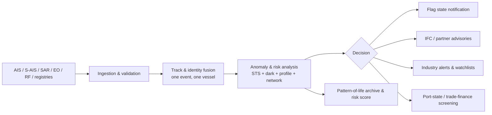

# Maritime Domain Awareness (MDA): A Comprehensive Guide

> **Author:** Jack Liu Shurui — Solution Architect at Crédit Agricole CIB, Singapore
> **Context:** Technology Research — Maritime Domain Awareness, Maritime-Tech, Sensors, Data Fusion, Government/Maritime Security
> **Repository:** [github.com/jackliusr/research](https://github.com/jackliusr/research)
> **Last Updated:** August 2026

---

## Table of Contents

1. [The MDA Concept](#1-the-mda-concept)
2. [The Sensors](#2-the-sensors)
3. [The Data Sources](#3-the-data-sources)
4. [Fusion and Analysis](#4-fusion-and-analysis)
5. [MDA Systems and the Industry](#5-mda-systems-and-the-industry)
6. [Use Cases](#6-use-cases)
7. [The Singapore Context](#7-the-singapore-context)
8. [Technology and the Future](#8-technology-and-the-future)
9. [Worked Example — Detecting a Dark-Fleet STS Transfer](#9-worked-example--detecting-a-dark-fleet-sts-transfer)
10. [Summary — MDA in One Page](#10-summary--mda-in-one-page)
11. [Glossary](#11-glossary)
12. [Claims Status, References and Further Reading](#12-claims-status-references-and-further-reading)

### How to Read This Guide

This is the dedicated deep-dive on **Maritime Domain Awareness (MDA)** in the `technology/` general-tech series — a government/maritime-tech domain, not a banking one. It is deliberately self-contained, but several sibling guides carry adjacent depth and are cross-referenced inline:

- **Data fusion & streaming** — the real-time plumbing behind a maritime picture: [event_stream_processing_guide.md](event_stream_processing_guide.md) (§3–4 on streaming pipelines, windows, and late data — the *latency* half of "near-real-time AIS"), and [complex_event_processing_guide.md](complex_event_processing_guide.md) (§6–7 on event-pattern detection — the *pattern* half that powers anomaly rules like "AIS-off + rendezvous").
- **Tracking & locating** — [ips_rtls_guide.md](ips_rtls_guide.md) is an indoor, short-range locating domain, but its track-management concepts (tag → position fix → zone/entity, data association) map 1:1 onto maritime track fusion (§4.3 of this guide).
- **Trade & supply chain** — [supply_chain_finance_guide.md](../banking/supply_chain_finance_guide.md) covers cargo-finance visibility; MDA's vessel-level tracking is the physical-layer input that finance-grade trade platforms consume (§6.6).
- **AI / ML** — anomaly detection and predictive models in §4.8 build on the repo's ML platform material ([ml_platforms_comparison_guide.md](ml_platforms_comparison_guide.md)) and the `ai_llm/` series; [adversarial_ml_attacks_guide.md](adversarial_ml_attacks_guide.md) is directly relevant to AIS spoofing countermeasures.
- **Cyber & OT security** — [llm_development_risks_security_guide.md](llm_development_risks_security_guide.md) covers the AI-security angle; note the repo has no dedicated OT/ICS-security guide yet — maritime cyber (IMO MSC-FAL.1/Circ.3, IACS UR E26/E27) is a natural future companion.
- **Analytics** — [advanced_analytics_solutions_guide.md](advanced_analytics_solutions_guide.md) for the descriptive/diagnostic layer behind risk scoring. There is no dedicated GIS/geospatial guide in the repo yet; §4.9 covers the geospatial-analysis essentials inline.

Suggested reading paths: **solution architects** start with §1, §4, §5, §8, §9; **maritime/security domain leads** start with §1, §6, §7; **data engineers** start with §3, §4, §8.1.

**Note on verification.** This guide was researched in August 2026. Claims are marked **Verified** (confirmed against IMO/agency/vendor/standards-body or reputable industry sources during research), **Reported** (widely reported but not independently confirmed), or hedged in-line where sources diverge. The full claims-status table is in §12.1. Maritime regulation and the satellite-AIS industry move fast — re-verify before procurement or policy decisions.

---

## 1. The MDA Concept

### 1.1 What Is Maritime Domain Awareness?

**Maritime Domain Awareness (MDA)** is most often defined as:

> *"The effective understanding of anything associated with the maritime domain that could impact upon the security, safety, economy, or environment."*

This wording is the version the **IMO** circulates (it appears across IMO capacity-building material and is adopted verbatim by the US *National Maritime Domain Awareness Plan*); the formulation itself traces to the US *National Strategy for Maritime Security* (2005), which defined MDA as "the effective understanding of anything associated with the global maritime domain that could impact the security, safety, economy, or environment of the United States." **Verified** — both attributions are consistent across IMO, US-government, and NATO-adjacent sources. (The same sources note NATO uses a related "maritime situational awareness" framing; there is no single treaty-level IMO definition, so treat the sentence above as the *de facto* standard definition.)

Three words carry the operational weight:

- **Maritime domain** — the oceans, seas, bays, estuaries, ports, and inland waterways, plus everything that moves through or lives off them: **vessels** (commercial, fishing, naval, recreational), **cargo** (containers, bulk, energy), **infrastructure** (ports, offshore platforms, cables, pipelines), and **people** (crews, passengers, coastal communities, port workers).
- **Awareness** — not raw data, but *understanding*: a fused, reasoned, timely picture of what is happening, who is doing it, and what it means.
- **Anything associated** — deliberately broad: weather and ocean state, pollution, distress, criminal activity, military movements, even the ownership and history of a hull.

### 1.2 The Four Components of MDA

MDA is commonly decomposed into a four-stage value chain — the same shape as any situational-awareness loop (sense → integrate → understand → act):

| Component | What it is | The maritime version |
|---|---|---|
| **Collection** | Sensing and data acquisition | AIS, radar, satellites (SAR/EO/S-AIS), sonar, port systems, intelligence (§2, §3) |
| **Fusion** | Integrating heterogeneous data into consistent tracks and identities | Radar track + AIS track + satellite detection correlated to *one* vessel (§4) |
| **Analysis** | Turning the picture into understanding | Anomaly detection, vessel profiling, risk assessment, prediction (§4) |
| **Dissemination** | Sharing the right picture with the right actor in time | VTS advisories, navy/coast-guard COP, flag-state reports, industry products (§5) |

Analysts (e.g., USCG material, industry white papers) also speak of the "collection–fusion–analysis–dissemination" cycle and, increasingly, a fifth stage — **action** (interdiction, SAR dispatch, sanctions enforcement) — which MDA feeds but does not itself execute.

### 1.3 The Maritime Picture: RMP and COP

The output of fusion is a **Recognized Maritime Picture (RMP)** — a single, coherent, continuously updated picture of all vessels and activity in an area of interest, with each vessel represented by one *recognized* track (identity, position, intent) rather than a pile of independent sensor reports. The RMP concept is of **naval origin** — NATO and US Navy command-and-control doctrine of the 1990s–2000s (the same family as the Recognized Air Picture / Recognized Ground Picture) — and migrated into coast-guard and civilian MDA. A related term, **Common Operational Picture (COP)**, describes the shared display/workspace that multiple agencies use on top of the RMP; in practice the two are used almost interchangeably, with COP being the more display-centric term. **Reported** for the exact doctrinal lineage (naval origin is well established; the precise first use is not pinned to a single document in open sources).

### 1.4 Why MDA — the Drivers

MDA exists because the maritime domain is simultaneously:

- **Security-critical** — 90%+ of world trade by volume moves by sea; chokepoints (Strait of Malacca, Singapore Strait, Hormuz, Suez, Bab-el-Mandeb, Panama) concentrate risk. Piracy, terrorism, smuggling, and sanctions evasion all exploit the ocean's size and the shipping industry's opacity.
- **Safety-critical** — collisions, groundings, man-overboard, and distress at sea kill thousands every year; SAR depends on knowing who is where.
- **Economic-critical** — ports, shipping lines, insurers, and trade-finance banks price delay, fraud, and sanctions risk; vessel-level visibility is now a trade-finance input, not just a navy toy.
- **Environmentally critical** — oil spills, illegal discharges, IUU fishing, and emissions (sulphur, CO₂) are regulated at the flag, port, and regional level, and each regulator needs *evidence*, which MDA provides.

The modern trigger for MDA as a named discipline was post-9/11 maritime security policy (US MTSA 2002, the 2005 National Strategy for Maritime Security, IMO's 2004 International Ship and Port Facility Security Code), which converted "we track ships for safety" into "we understand the maritime domain for security."

### 1.5 MDA Stakeholders

| Stakeholder | Interest in MDA |
|---|---|
| **Navies** | Military MDA: RMP, force protection, naval intelligence, chokepoint monitoring |
| **Coast guards** | Law enforcement at sea: interdiction, SAR, fisheries control, pollution response |
| **Port authorities / VTS** | Safe, efficient traffic: collision avoidance, berth planning, security per ISPS |
| **Shipping lines & ship managers** | Fleet visibility, compliance, voyage optimization, security advisories |
| **Fisheries agencies & RFMOs** | VMS-based monitoring, control and surveillance (MCS), IUU enforcement |
| **Insurers & P&I clubs** | Risk pricing, claims investigation, sanctions screening (dark-fleet exposure) |
| **Trade & commodity analytics** | Supply-chain visibility, freight analytics, cargo tracking |
| **Banks & trade-finance platforms** | Sanctions/due-diligence screening of vessels, cargo and counterparties (§6.6) |
| **Flag states** | Registry oversight, LRIT reception, port-state-control follow-up |
| **International bodies (IMO, IHO, EMSA)** | Standards, conventions, and shared services (e-navigation, S-100, CleanSeaNet) |

### 1.6 MDA and Related Concepts

- **Maritime surveillance** — the *collection* half of MDA (sensors and reporting systems). MDA = surveillance + fusion + analysis + dissemination. Vessel tracking (AIS/LRIT-based position histories) is a subset of surveillance.
- **VTS (Vessel Traffic Services)** — shore-based services (radar + AIS + communications) to improve safety and efficiency of navigation and protect the environment in a defined area (IMO Resolution A.857(20) guidelines, later superseded by A.1158(32) in 2021). **Verified.** VTS is local and operational; MDA is broader and analytic.
- **MTSA (Maritime Transportation Security Act, US, 2002)** — US law enacted after 9/11 that made MDA a statutory mission: it requires vessel and facility security plans, area maritime security committees, and drove the USCG's AIS carriage rules and notice-of-arrival regime. **Verified.** (MTSA is often *mistakenly* cited as an IMO instrument; it is US domestic law, complementary to the IMO ISPS Code.)
- **Maritime security** — the threat-facing subset of MDA: piracy, terrorism, smuggling, IUU fishing, sabotage, and (today) sanctions evasion. MDA is the enabler; maritime security is one of its principal applications.

### 1.7 The Threat Landscape MDA Must See

| Threat | Where it lives | What MDA detects |
|---|---|---|
| **Piracy & armed robbery** | Gulf of Aden/Somalia basin (declined since 2012 peak, episodic resurgence), Gulf of Guinea (regional), **Strait of Malacca & Singapore Strait** (armed robbery of ships — the top Asian hotspot per ReCAAP: 107 Asian incidents in 2024, ~58% in/near the Singapore Strait; a sharp rise was reported in H1 2025). **Verified.** | Vessels loitering/approaching without cause; deviation from traffic lanes; crew alerts (AIS safety messages) |
| **Maritime terrorism** | Chokepoints, port facilities, LNG carriers | High-risk vessel/port pairings; security-level triggers under ISPS |
| **Smuggling** (narcotics, people, contraband, tobacco, arms) | Transshipment hubs, small-craft corridors, STS transfers | Unusual port calls, short-stay transshipment patterns, small-vessel activity near big-vessel anchorage |
| **Sanctions evasion** | Iran, Russia, North Korea-linked trade; the **dark fleet** (AIS-disabled tankers, STS transfers, flag/ownership churn) | AIS gaps, STS rendezvous, port-call history, identity churn (§4.6, §9) |
| **IUU fishing** | EEZs of developing states, high seas adjacent to RFMO areas | VMS/AIS gaps, gear/track patterns inconsistent with declared fishing, transshipment at sea |
| **Environmental crime** | Anywhere: oil discharge, sulphur non-compliance | SAR oil-slick detection (CleanSeaNet), emissions analytics (EU MRV) |

---

## 2. The Sensors

No single sensor sees the sea. MDA's sensing stack spans cooperative systems (vessels broadcast their own data), non-cooperative systems (they are detected whether they want to be or not), and passive systems (they emit nothing and listen).

### 2.1 AIS — The Automatic Identification System

**What it is.** AIS is a VHF-based broadcast transponder system (161.975/162.025 MHz, two channels) that lets vessels continuously transmit identity, position, and voyage data to other vessels and shore stations, and receive the same from them. It was designed for collision avoidance and traffic monitoring, and it became the workhorse of vessel tracking.

**Carriage (SOLAS).** SOLAS Chapter V, Regulation 19 requires AIS carriage on: **all ships of 300 GT and upwards engaged on international voyages, cargo ships of 500 GT and upwards not engaged on international voyages, and all passenger ships irrespective of size** (enforcement dates staggered by vessel type through 2004–2008). **Verified.** Non-SOLAS vessels (pleasure craft, small fishing boats, inland craft) may carry voluntary **Class B** units.

**What AIS transmits.**
- **Static data** — MMSI (9-digit Maritime Mobile Service Identity), IMO number, call sign, name, ship type, dimensions.
- **Dynamic data** — position (GNSS), course over ground, speed over ground, heading, rate of turn, navigational status.
- **Voyage data** — destination, ETA, draught, cargo type, number of crew/persons on board.

**Message types and reporting rates (abridged).** AIS uses a message catalogue — the ones that matter for MDA: **Msg 1/2/3** Class A position reports; **Msg 4** base-station reports; **Msg 5** Class A static & voyage data; **Msg 9** SAR-aircraft position; **Msg 18** Class B position; **Msg 19** Class B extended; **Msg 21** aids-to-navigation; **Msg 24** Class B static data. Reporting intervals: **Class A** transponders (12.5 W) report position every **2–10 seconds** depending on speed/manoeuvring state (fastest when underway and manoeuvring, slowest when stopped/anchored) and static/voyage data every 6 minutes; **Class B** units (2 W) report at lower rates — commonly cited as **5 seconds to 3 minutes** depending on unit type (SOTDMA vs. CSTDMA) and speed state. **Verified** for the 2–10 s / 12.5 W Class A figures and the SOLAS thresholds; **Reported** for the precise Class B interval range, which varies by transponder class.

**Limitations (the honest half).**
- **Spoofing/false data** — AIS is unauthenticated and unencrypted; a vessel can broadcast any MMSI, position, name, or destination ("spoofing"), switch it off ("going dark"), or transmit lies. Widely exploited by the dark fleet.
- **Coverage gaps** — terrestrial AIS only reaches line-of-sight (~30–60 km from coast/height of receiver); offshore, only satellite AIS hears you, and only on a pass.
- **Dark vessels** — vessels with AIS off (or never fitted) are invisible to AIS-based MDA; the term **"dark vessel"** usually means "seen by other sensors, missing from AIS."
- **Traffic bias** — AIS is cooperative; the *most* interesting vessels are often the ones not broadcasting.

### 2.2 Radar — Coastal, VTS, and Over-the-Horizon

- **Coastal/VTS radar (X-band/S-band)** — the backbone of VTS. Range ~20–60 km depending on siting; all-weather, day/night, non-cooperative detection of any radar-reflective surface (down to small craft in good conditions). Every major port and strait runs radar coverage (Singapore's VTMIS, Rotterdam, Dover). **Verified** (VTS radar role is standard; exact ranges vary by installation).
- **HF radar (over-the-horizon)** — HF surface-wave radar (HFSWR) exploits the conductivity of seawater to propagate along the surface well beyond the horizon, giving **200–400 km** EEZ-scale surveillance for ships (and sea-state/ocean-current mapping as a by-product). A handful of states run HFSWR for EEZ awareness (e.g., Canada's Atlantic/Arctic systems, China, Russia). **Reported** for specific national deployments; the physics and typical ranges are standard. Resolution is coarse (km-scale cells) and siting is demanding — it is a *detection* layer, not an identification layer.
- **Shipboard radar** — the navigation radar on every vessel; relevant to MDA mainly as a data source for onboard collision avoidance and as a target for ELINT.

### 2.3 Satellite Sensors

Satellites turned MDA from a coastal into a global discipline:

- **SAR (Synthetic Aperture Radar)** — active microwave imaging; **all-weather, day/night**, sees through clouds; detects ships as bright radar returns on dark ocean. C-band missions (Copernicus **Sentinel-1** — open data, the workhorse for ship and oil-slick detection — and RADARSAT) plus commercial X-band constellations (**ICEYE, Capella, Umbra**) give revisit from ~days (Sentinel-1 per-orbit) down to sub-hourly for large commercial constellations. Ship detection is automated via CFAR (constant false alarm rate) detectors; resolution from ~1–25 m; classification (size/shape) is possible at high resolution, identification (name/flags) is not. **Verified** for Sentinel-1 and the general capability; constellation specifics are **Reported**.
- **EO/IR (optical/infrared)** — sub-metre optical satellites (Maxar WorldView, Airbus Pléiades, Planet SkySat) can *identify* a ship: type, size, draft marks, even activity (STS alongside, cargo ops) — but only in daylight, cloud-free, and when tasked over the vessel. EO is the "identify what SAR found" sensor. **Verified** for the general capability; per-constellation specs **Reported**.
- **Satellite AIS (S-AIS)** — AIS receivers in low Earth orbit (polar constellations) hear AIS far beyond terrestrial range, providing **global** vessel tracking. Revisit is probabilistic: minutes to hours depending on latitude and constellation density (polar coverage is densest; equatorial gaps exist between passes), and a single pass hears only the vessels whose signals collide-free. Key providers: **exactEarth** (Canada; operational since ~2009, acquired by Spire — announced September 2021 for US$161M, completed late 2021/early 2022, sources vary on the exact close date — **Verified** for the acquisition and price, **Reported** for close quarter), **Spire** (largest commercial S-AIS constellation, ~100+ satellites), **ORBCOMM** (satellite AIS + IoT, taken private by GI Partners in 2021 — **Reported**). S-AIS inherits all of AIS's data-integrity weaknesses plus added collision/revisit noise.
- **RF sensing (COMINT/ELINT from space)** — small satellites that geolocate radio emitters: radar emissions (ELINT — finds ships running their radars even with AIS off) and communications (COMINT — finds phones/satcoms aboard). Commercial pioneers: **HawkEye 360** (US, RF geolocation clusters), **Kleos** (Luxembourg). **Reported** (commercial capabilities exist and are marketed for maritime; exact performance is classified/commercial-in-confidence). Also note: **VHF data exchange (VDES)** — the next-generation AIS with a two-way data channel and an application-specific messaging layer, intended to also carry navigation-safety messages.

### 2.4 Underwater Sensors

- **Sonar** — active (ping + echo) and passive (listen) acoustic sensing for submarines, mines, and UUVs; the core of anti-submarine warfare and of naval base/harbour protection.
- **Hydrophone networks** — fixed arrays (historically SOSUS; modern fibre-optic seabed arrays, including commercially reported Chinese deployments) provide wide-area passive detection and classification of submarines and surface vessels by their acoustic signatures.
- **UUVs (AUVs/USVs)** — unmanned systems with side-scan sonar, cameras, or hydrophones extend the underwater picture; also the platform class that will make maritime surveillance itself autonomous.
- Underwater sensing is the least-shared layer of MDA: acoustic data is almost always military and bilateral, rarely in the civilian RMP.

### 2.5 Sensor Fusion — the Correlation Problem

Fusion answers: *are the radar blip, the AIS position, and the SAR detection the same ship?* The mechanics — gating, nearest-neighbour/JPMDA-style association, Kalman/PDA filtering, track initiation/termination — are the standard multi-sensor tracking machinery, and they are the same discipline as the track-management chapters of the repo's [ips_rtls_guide.md](ips_rtls_guide.md), scaled from metres to nautical miles and from milliseconds to hours. Maritime specifics:

- **Identity fusion** — MMSI (broadcast) + IMO number (registry) + imagery (observed) + registry databases (ownership) are bound into a single vessel identity; a "clean" vessel has all of them agreeing.
- **Cross-cueing** — "AIS gap in an area with a SAR detection" is the classic cue: SAR finds the target, EO identifies it, and the track is built around the non-cooperative detections.
- **Temporal mismatch** — AIS is continuous, SAR is a snapshot, radar is local; fusion must handle hours-old detections and slow-moving targets gracefully.

### 2.6 Sensor Comparison Table

| Sensor | What it sees | Typical range | Limitations | Best use case |
|---|---|---|---|---|
| **Terrestrial AIS** | Cooperative vessels (identity, position, voyage) | ~30–60 km line-of-sight | Only vessels broadcasting; spoofable; coastal only | Traffic monitoring, VTS, port approaches |
| **Satellite AIS (S-AIS)** | Cooperative vessels, globally | Global (LEO constellation) | Probabilistic revisit; collisions; inherits AIS spoofing | Global fleet picture, high-seas tracking, dark-fleet *pattern* analysis |
| **Coastal/VTS radar** | All surface targets (non-cooperative) | ~20–60 km | No identity; weather/clutter; siting-limited | VTS, harbour/strait surveillance, detecting AIS-off vessels |
| **HF over-the-horizon radar** | Surface targets at EEZ scale | 200–400 km | Coarse resolution; no identity; siting; ionospheric clutter | EEZ-wide detection layer, smuggling corridors |
| **SAR satellite** | Ship detections, oil slicks, wakes — all-weather | Swath 20–400 km, revisit hours–days | Snapshot not track; no identity; tasking cost | Dark-vessel detection, oil-spill detection, wide-area search |
| **EO/IR satellite** | Ship *identity*/activity imagery | Tasked point targets | Daylight + clouds; revisit/tasking; cost | Confirming identity, STS ops, port surveillance |
| **RF sensing (COMINT/ELINT)** | Radar & radio emitters (geo-located) | Regional/global by constellation | Passive; emitter ≠ ship ID; legal sensitivities | Finding AIS-off vessels that still emit |
| **Sonar / hydrophones** | Submarines, UUVs, acoustic signatures | km to basin-scale (arrays) | Military-only in practice; slow; classification hard | Naval ASW, base protection, maritime-domain defence |
| **LRIT (sensor-like data)** | Flag-state position reports | Global (satellite) | 4×/day; flag-state access only; no identity detail | Long-range safety/security track for SOLAS vessels |

---

## 3. The Data Sources

MDA is fed by *reported* data (vessels and states reporting by regulation), *observed* data (sensors), and *derived* data (registries, analytics, intelligence).

### 3.1 AIS Data — Terrestrial and Satellite

- **Terrestrial AIS networks** — coastal base stations operated by port/VTS authorities and commercial networks; the densest, lowest-latency AIS data, covering ports, straits, and approaches. Aggregators (MarineTraffic, FleetMon, exactEarth/Spire, ORBCOMM, Pole Star) fuse hundreds of national/port feeds.
- **Satellite AIS** — global coverage for the high seas; latency minutes-to-hours; the only AIS view of mid-ocean. Combined terrestrial+satellite feeds are the default commercial product ("global AIS").
- **Latency & reliability** — terrestrial AIS is near-real-time (seconds) where coverage exists; S-AIS adds minutes-to-hours latency and per-pass detection probability <100%. Reliability is high *for what was broadcast* — which is exactly the problem: AIS data is trustworthy only as a record of what a vessel chose to transmit.

### 3.2 LRIT — Long-Range Identification and Tracking

LRIT is the IMO's mandatory, satellite-based, flag-state-oriented position-reporting system under **SOLAS Regulation V/19-1** (adopted by IMO Resolution MSC.202(81), May 2006; **applicable from 31 December 2008**). **Verified.** Key properties:

- SOLAS ships (300 GT+ international, passenger, and 500 GT+ cargo) report identity + position **at least 4 times per day** through approved LRIT service providers to their **flag state**; coastal states may request data for ships within 1,000 nm of their coast; port states within their ports.
- **IMSO** (International Mobile Satellite Organization) is the LRIT Coordinator (audits and supervises the system). **Verified.**
- The point: LRIT gives *every* SOLAS ship a flag-state-visible global track independent of AIS — but access is restricted (no public feed), latency is hours, and data is sparse. It is the "trusted long-range baseline" that AIS-based products cannot replace and that dark-fleet analysts would love to see (they generally cannot).

### 3.3 VMS — Vessel Monitoring System

VMS is the fisheries equivalent of LRIT: **satellite-based (and sometimes cellular) position reporting by fishing vessels to flag states and RFMOs** (regional fisheries management organisations) — typically a report every 1–2 hours while at sea, mandated by national law and RFMO conservation measures. **Verified** as a concept; exact intervals vary by flag state/RFMO. It is the core of fisheries **monitoring, control and surveillance (MCS)**, the data backbone for detecting IUU patterns (VMS-off, transshipment at sea, incursions into closed areas), and — because VMS is a *regulated* feed with tamper-proofing expectations — it is materially harder to fake than AIS. Access is again restricted to the flag state and RFMOs; NGOs (e.g., Global Fishing Watch) work with published or shared subsets.

### 3.4 Port Data and Port Community Systems

Ports are where MDA becomes *commerce*:

- **Port Community Systems (PCS)** — the inter-organisational platforms that exchange cargo and ship data between the port, customs, terminal operators, agents, and authorities (prototype: Singapore's **PORTNET**; Europe's many port PCS; the maritime **single window** is the state-facing version of the same idea — §5.4).
- What they contribute: **manifests** (cargo, crew, passengers), **notices of arrival/departure**, berth plans, bunker records, port-call histories, and security declarations (ISPS). These are the *ground-truth commercial data* against which AIS-derived behaviour is checked: "AIS says the tanker anchored off Jurong for 14 hours; the PCS says no port call was filed" is a classic discrepancy flag.
- **IMO FAL / single window** — since 1 January 2024, IMO FAL Convention amendments require member states to provide a **maritime single window** for electronic exchange of ship-call data (**Reported** — the 2024 deadline is widely cited; implementation is uneven). The single window is the modern PCS backbone and a growing MDA input.

### 3.5 "Blue Data" — Oceanography and Weather

Ocean state, currents, sea-surface temperature, wind, waves, and ice — from met-ocean models (ECMWF, NOAA), buoys, HF-radar current mapping, and satellites — matter for MDA in three ways: (1) *sensor physics* (SAR detection performance, radar clutter, S-AIS propagation); (2) *vessel behaviour* (weather routing explains otherwise "anomalous" tracks — the classic false positive for anomaly detectors); (3) *environmental response* (spill drift modelling needs currents). Any serious MDA analytics platform joins vessel data with met-ocean data; the repo's streaming guide ([event_stream_processing_guide.md](event_stream_processing_guide.md)) is the natural home for that join in real time.

### 3.6 Intelligence — HUMINT, OSINT, SIGINT, Imagery

- **OSINT** — open-source maritime intelligence is enormous and now quasi-industrial: port-call databases, vessel registries (Equasis, IHS/Maritime-Data, UN Comtrade trade data), satellite imagery (some open, e.g., Sentinel), social media, sanctions lists, court/incident records. Analysts like C4ADS, Global Fishing Watch, and Windward's open reporting have shown OSINT alone can expose dark-fleet networks.
- **HUMINT** — human reporting from port agents, crews, informants, liaison officers; slow, precious, hard to verify; the classic "source with direct access."
- **SIGINT/COMINT/ELINT** — signals intelligence (national capability; commercially approximated by RF-sensing constellations, §2.3).
- **Financial/registry intelligence** — corporate registries, beneficial-ownership databases, insurance and P&I records, classification-society data: the *who owns it* layer that makes vessel tracks prosecutable.

### 3.7 Data Quality and Integrity

The MDA data-quality problem is not "missing data" — it is *adversarial data*. The integrity hierarchy, from most to least trustworthy:

1. **Regulated, audited feeds** — LRIT (flag state), VMS (flag state/RFMO), port/port-state records, registry data.
2. **Observed feeds** — radar, SAR, EO, RF: non-cooperative, cannot be spoofed, but partial (coverage, revisit).
3. **Cooperative broadcasts** — AIS: ubiquitous, real-time, and *trustworthy only as a record of what was transmitted*.

Quality issues in practice: gaps (coverage, revisit, deliberate), errors (equipment, manual entry — wrong destination/MMSI typos are endemic), spoofing (fake AIS), "identity churn" (MMSI/name/flag changes to launder a vessel's history), and *timeliness* (S-AIS latency). Data-quality tooling for MDA therefore includes: cross-feed reconciliation (AIS vs LRIT vs port calls), statistical anomaly detection on reported fields, and "AIS hygiene" scoring — a field in which the commercial analytics vendors (Windward, Pole Star, Kpler, Spire) compete.

### 3.8 Data Sources Table

| Source | What it provides | Coverage | Latency | Reliability |
|---|---|---|---|---|
| **Terrestrial AIS** | Position/identity/voyage, near-real-time | Coastal, ports, straits | Seconds | High for broadcast content; spoofable |
| **Satellite AIS** | Global vessel positions | Global (probabilistic revisit) | Minutes–hours | Moderate (collisions, spoofing, gaps) |
| **LRIT** | Flag-state positions 4×/day | Global (SOLAS ships) | Hours | High but access-restricted |
| **VMS** | Fishing-vessel positions | Flag/RFMO waters | Minutes–hours | High (regulated), restricted access |
| **Port data / PCS / single window** | Manifests, port calls, cargo, security | Ports (all major hubs) | Hours–days | High; commercial ground truth |
| **Met-ocean data** | Weather, currents, waves, ice | Global (models) | Hours | High for models; sensor-dependent |
| **Registry & corporate data** | Ownership, history, compliance | Global | Days | High; slowly updated |
| **Imagery (SAR/EO)** | Detections, identity, activity | Tasked/global pass | Hours–days | High per image; sparse in time |
| **HUMINT/OSINT/SIGINT** | Intent, context, network links | Unstructured | Hours–weeks | Variable; needs corroboration |

---

## 4. Fusion and Analysis

### 4.1 Data Fusion — the Core Discipline

Fusion turns heterogeneous inputs into a single consistent representation. The maritime fusion stack, bottom-up:

1. **Sensor-level fusion** — radar + AIS + SAR detections of the *same physical object* are associated into one **track** (position, course, speed, uncertainty). Standard machinery: gating, nearest-neighbour or JPDA association, Kalman/α-β filters, track initiation/coast/deletion — the same toolbox as indoor locating ([ips_rtls_guide.md](ips_rtls_guide.md) §4) but with slow targets, sparse updates, and hours-long coast times.
2. **Identity fusion** — the track is bound to an **entity**: MMSI, IMO number, name, flag, ship type, owner (from registry data), and imagery-derived features. Identity fusion is where spoofing is caught: *claimed* identity (AIS) vs *observed* identity (imagery, dimensions) vs *registered* identity (registry) must agree.
3. **Picture fusion** — all entities in an area, with confidence and metadata, become the **Recognized Maritime Picture (RMP)** / **Common Operational Picture (COP)** displayed to operators (§4.2).

The architectural principles are the ones the repo's data guides drill into: idempotent ingestion of high-volume streams ([event_stream_processing_guide.md](event_stream_processing_guide.md)), event-pattern detection over fused tracks ([complex_event_processing_guide.md](complex_event_processing_guide.md) §6–7), and a data model that can represent *uncertainty and provenance* (which sensor saw what, when, with what confidence) — not just positions.

### 4.2 The Recognized Maritime Picture (RMP)

The RMP is the *product* of fusion: "one picture, one truth" — every vessel in the area of interest represented by exactly one track with an identity, a confidence level, and an assessment of intent (or "unknown" where intent cannot yet be assessed). Its defining properties:

- **Recognized** — each track has a status (e.g., *known/assumed/friendly/neutral/suspect/hostile* in the naval framing; *identified / unidentified* in the civilian framing). Unknowns are explicitly tracked as unknowns — a picture that silently drops "we don't know" is not a picture.
- **Common** — the same underlying RMP is shareable across agencies (navy, coast guard, port, customs) via the COP, each agency overlaying its own annotations.
- **Continuous** — it is a *state*, not a report: tracks coast through sensor gaps and are refreshed on every new observation.

The RMP's naval origin (§1.3) shows in its vocabulary — "recognized" is a command-and-control term (recognized air picture, recognized ground picture) — but modern MDA vendors sell civilian RMPs as a matter of course, and Singapore's IFC is an operational example of a *regional* RMP built from shared, not owned, sensors (§7.4).

### 4.3 Fusion Architecture — Sensor → Track → Entity → Picture

```
                 ┌─────────────┐
   Radar ──────► │             │
   AIS ────────► │  Ingestion  │──► Track fusion ──► Entity/Identity ──► RMP / COP
   S-AIS ──────► │  & normal-  │    (association,     (ID fusion,         (annotations,
   SAR ────────► │  isation    │     filtering)       registry join)      COP display)
   LRIT ───────► │             │         │                  │                   │
   VMS ────────► │             │         ▼                  ▼                   ▼
   Port/PCS ───► │             │    track store       entity store       picture store
   Met-ocean ──► │             │   (timeseries/geo)   (graph/profiles)   (shared COP)
   Intel ───────► │             │
                 └─────────────┘
                       │
                       ▼
              Quality / integrity layer:
              reconciliation, gap detection, spoof detection,
              AIS-hygiene scoring, provenance metadata
```

Practical notes: (1) **separation of stores** — raw events (streaming), fused tracks (state), and entities (profiles) have different lifecycles and access controls; (2) **the integrity layer is not optional** — it is what separates a traffic display from an RMP; (3) **dissemination is a first-class output** — COP subscriptions, alerts, and reports are part of the architecture, not an afterthought.

### 4.4 Anomaly Detection — Reading Behaviour

Anomaly detection is where MDA becomes intelligence. The canonical maritime anomalies (each an active research and product area):

- **Dark shipping** — AIS-off (vessel disappears from the cooperative picture for hours/days, often *exactly* in areas where something else interesting is happening); AIS-on-but-position-discrepant (broadcasting a false position while physically elsewhere — provable when a SAR/radar detection contradicts the broadcast). The defining *behavioural* signature of the dark fleet.
- **Transshipment / STS (ship-to-ship) transfers** — two vessels meeting at sea for cargo transfer: legal and routine for oil and fish (and legitimate STS bunkering exists), but also the mechanism by which sanctioned crude is laundered onto "clean" tankers and IUU catch is offloaded. The anomaly is not "STS" — it is *STS plus*: STS in an unmonitored area + AIS gaps + identity churn + incompatible vessel pair (e.g., tanker alongside tanker in a no-bunkering zone).
- **Loitering** — a vessel holding position or circling for hours/days: waiting for a rendezvous, waiting for orders, waiting for dark conditions, or surveying (hostile reconnaissance of a port or offshore platform). Loitering detection = dwell-time statistics against expected behaviour for the vessel type and area.
- **Other classics** — route deviation (off the shipping lanes without reason), unscheduled port calls, port-call sequences inconsistent with cargo/destination, speed anomalies (very slow = loitering or STS; very fast = smuggling runs), zone violations (fishing inside a protected area), and **identity churn** (MMSI/name/flag changes — see §4.5).

Detection approaches: rules (domain knowledge: "AIS-off > N hours in area X"), statistics (dwell-time, speed distributions, transition probabilities between states), and **machine learning** — unsupervised (density/sequence models flag the unusual) and supervised (labelled historical incidents) — with the caveat that maritime anomalies are rare, drifting, and adversarial, so ML models need continuous revalidation and *explainability* for operators. Cross-reference the repo's ML platform material ([ml_platforms_comparison_guide.md](ml_platforms_comparison_guide.md)) and the `ai_llm/` series for the model-ops side; adversarial robustness matters because the adversary actively probes detectors ([adversarial_ml_attacks_guide.md](adversarial_ml_attacks_guide.md)).

### 4.5 Vessel Profiling and Patterns of Life

**Vessel profiling** builds a per-vessel dossier from history: ownership chain and flag changes, port-call record, trading routes, typical cargoes, AIS hygiene (how often does it go dark, where, for how long), STS history, crew changes, and insurance/registry status. From the profile, a **pattern of life** emerges — the expected behaviour envelope — and anomaly detection becomes *deviation from the profile*, which is far more powerful than deviation from the fleet average. Profiling is also the backbone of **risk scoring**: a vessel that has changed flag three times, is owned through a shell, last appears in a sanctions-adjacent trade, and goes dark in an STS hotspot scores high before any single "anomaly" fires. (This is the maritime analogue of customer risk profiling in banking — the same feature-engineering discipline, different data.)

### 4.6 Maritime Risk Assessment — Sanctions and the Dark Fleet

The highest-value contemporary MDA analysis is **sanctions-evasion detection**. The **dark fleet / shadow fleet** is the fleet of tankers (originally Iranian, then Russian, now a shared network) that moves oil outside the legitimate market: AIS disabled or spoofed, **STS transfers** at sea to launder cargo provenance ("Iranian crude becomes Malaysian-blended crude"), **identity churn** (renamed, reflagged, re-registered through opaque shell owners), port calls only to jurisdictions that will not ask questions, and — for the *grey fleet* — superficially legitimate vessels whose *ownership* is opaque even when their AIS is on. **Verified** for the definition and tactics (AIS disabling/spoofing, clandestine STS, ownership opacity) across industry and press sources; specific fleet counts (hundreds of vessels, estimates vary by analyst) are **Reported** and change monthly.

Analysis pattern for sanctions risk:

1. **Exposure** — vessel/entity linked (directly or via ownership/cargo chains) to sanctioned states or individuals (sanctions lists, corporate registries).
2. **Behaviour** — dark periods, STS events, anomalous port calls, AIS hygiene, inconsistent voyage data.
3. **Network** — who else is in the constellation: sister ships, shared managers/agents/insurers, repeated STS partners (graph analysis over entity data).
4. **Scoring** — combine into a sanctions-risk score with evidence trail (admissible in the shipping/trade-finance due-diligence process, §6.6).

### 4.7 Predictive Analysis

Two flavours of prediction matter for MDA:

- **Trajectory prediction** — where a vessel will be in N hours, using motion models, weather, shipping-lane priors, and destination data; used for VTS conflict detection, SAR search-area calculation, and interception planning. (The same problem as indoor trajectory prediction in [ips_rtls_guide.md](ips_rtls_guide.md), with far sparser data.)
- **Intent prediction** — the harder, higher-value question: *is this vessel going to do the thing?* (rendezvous, STS, incursion, attack). Intent models combine behaviour, profile, context (what is happening in the area), and situational priors; they output risk-level changes rather than crisp forecasts, and they must remain explainable to operators.

### 4.8 AI in MDA

The AI surface in MDA, mapped to the four components:

- **Collection** — AI-driven tasking (pointing SAR/EO constellations at likely events), sensor fusion (deep association models), automatic target recognition.
- **Fusion** — ML-assisted track-ID association and identity reconciliation across noisy/spoofed feeds.
- **Analysis** — the big one: anomaly detection (§4.4), profiling (§4.5), risk scoring (§4.6), prediction (§4.7), plus NLP over OSINT (port-call notices, news, sanctions updates), imagery classification (ship type/activity from SAR/EO), and graph ML over ownership networks.
- **Dissemination** — natural-language briefings, alert prioritisation, operator copilots.

LLM-based maritime copilots are emerging (query the picture in natural language, generate incident briefs); the repo's `ai_llm/` guides cover the platform side. Caveats: maritime data is sparse, adversarial, and heterogeneous; AI outputs need provenance and human sign-off for any enforcement action; and the adversary reads the same papers — detectors must be revalidated continuously.

### 4.9 Analysis Tools — GIS and Visualization

- **Geospatial analysis** — the RMP is fundamentally a GIS problem: tracks as moving points, zones as polygons (traffic separation schemes, EEZs, anchorage areas, protected areas, STS hotspots), queries as spatial joins over time ("vessels that entered zone X in window Y with AIS-off > Z hours"). A mature maritime analytics stack = geospatial store + streaming engine + analytics/ML layer + map-based UI. (The repo has no dedicated GIS guide yet; the essentials used here are standard PostGIS/GeoParquet/leaflet-class tooling.)
- **Visualization** — the maritime picture display: map with live tracks, AIS-overlay symbology, incident/alert layers, time scrubbing (critical for pattern-of-life analysis), and COP sharing. Good displays show *confidence and provenance* (sensor mix per track, last-observed time) — the operator's equivalent of an audit trail.
- **Reporting** — the dissemination layer: alerts, incident reports, risk dossiers, and machine-readable feeds for downstream systems (VTS, port security, trade finance).

---

## 5. MDA Systems and the Industry

### 5.1 National and Regional MDA Systems

- **United States** — the USCG is the federal lead for civilian MDA (the 2005 *National Strategy for Maritime Security* and *National Plan to Achieve MDA* made it a standing mission; MTSA 2002 supplies the statutory frame). USCG operates the long-range AIS network, AMVER (the automated mutual-assistance vessel rescue system — the world's largest ship-reporting SAR database), and coordinates area maritime security committees. **Verified** for the strategy/programme existence; operational specifics evolve.
- **Europe — EMSA (European Maritime Safety Agency, Lisbon, est. 2002)** — runs the EU's shared maritime services: **SafeSeaNet** (the EU vessel traffic monitoring & information exchange under Directive 2002/59/EC), **CleanSeaNet** (the EU satellite oil-spill monitoring and vessel-detection service — operational since 2007, near-real-time SAR + optical analysis of possible spills and their polluters — **Verified**), THETIS (port state control), and the EU **MRV** CO₂ database. EMSA also hosts the EU **CISE (Common Information Sharing Environment)** — the initiative to make EU maritime *surveillance* systems interoperable across coast guard, customs, fisheries, environment and navy communities; CISE has been in a transitional phase toward full operationalisation (per EMSA reporting). **Verified** for the programme's existence and transitional status; "full operationalisation" timing is **Reported**.
- **IMO** — the standards-setter, not an operator: SOLAS, ISPS, LRIT, e-navigation, MASS, FAL (below).
- **Other regions** — e.g., the Indian Ocean Naval Symposium's information-sharing nodes, the regional IFC model (§7), Japan's JCG, China's Maritime Safety Administration + PLA Navy systems (opaque), NATO's maritime situational awareness programmes (military).

### 5.2 IMO Systems: E-Navigation, S-100, and the Single Window

- **E-navigation** — the IMO's strategy (adopted MSC 94, November 2014) for harmonised collection, integration, exchange, presentation and analysis of marine information on board and ashore, to improve safety and security at sea and protect the marine environment. **Verified** for the 2014 adoption. E-navigation is the *policy umbrella* under which S-100 and maritime digital services are being built; its service concept (Maritime Service Portfolios — MSPs) is the blueprint for "the single source of navigational truth" that MDA ashore will consume.
- **S-100** — the **IHO** (International Hydrographic Organization) **Universal Hydrographic Data Model** (first edition 2010, matured 2017+): a modern, geospatial, feature-based data framework that replaces the legacy S-57 chart format and supports *any* maritime data product (bathymetry, aids to navigation, marine protected areas, weather overlays, AIS-like dynamic layers). **Verified** for what S-100 is; implementation timelines are **Reported** — IHO and IMO are driving a transition to S-100-based products (the "S-100 decade," with S-100-based ENCs expected in force from 2026 onward; flag states/ports have been moving their chart-production and e-navigation roadmaps to S-100).
- **S-101** — the product specification for the **new-generation Electronic Navigational Chart (ENC)** built on S-100 (the S-57 ENC's successor). **Verified** for the designation. Related product specs (S-102 bathymetric surface, S-104 water level, S-111 surface currents, S-124 navigational warnings, S-125 AIS/ASM, S-201 AtoN) extend the same framework — S-124 and S-125 are, notably, *dynamic* data layers that MDA systems will consume.
- **Single window / FAL** — the IMO Facilitation (FAL) Convention's electronic-exchange amendments require member states to operate a **maritime single window** for ship-call data (widely reported as mandatory from **1 January 2024**; the underlying amendments were adopted in 2022 — **Reported**, implementation uneven across states). The single window is the state-facing port community system (§3.4) and a core MDA input for port-centric analysis.

### 5.3 The Commercial MDA Industry

- **exactEarth (Canada)** — S-AIS pioneer (operational from ~2009), Cambridge, Ontario; known for high-quality S-AIS data and analytics; **acquired by Spire Global** (announced September 2021, ~US$161M; closed late 2021/early 2022 — sources vary on the quarter). **Verified** for the acquisition/price; the close date is **Reported**.
- **Spire Global** — the largest commercial S-AIS constellation (~100+ satellites) plus weather, ADS-B and RF payloads; after the exactEarth acquisition, the dominant S-AIS data-and-analytics player; also does maritime domain products and predictive vessel services. **Verified** for scale/role; fleet counts change.
- **ORBCOMM** — long-time satellite AIS + IoT provider (its AIS heritage includes the AIS service on the Orbcomm constellation); **taken private by GI Partners in 2021 (Reported)**; still supplies AIS-derived maritime data.
- **Windward** — maritime AI / predictive intelligence company (founded 2010, Tel Aviv/London): behavioural analytics, sanctions-evasion and dark-fleet detection, maritime risk scoring for shipping, insurance, and finance (banks use Windward-style vessel-risk scoring in trade-finance due diligence). **Reported** (product capability; company details per public sources).
- **MarineTraffic** — the largest *crowd-sourced* AIS platform (founded 2007, Greece): terrestrial AIS from a global network of volunteer and partner receivers plus satellite AIS; the public-facing vessel tracker that most people know, with commercial data APIs. **Reported** for origins; scale is evident from the platform.
- **Adjacent players worth knowing** — **Kpler / FleetMon / Pole Star** (vessel & commodity intelligence; Pole Star is the sanctions-screening standard in trade finance), **Global Fishing Watch** (open fisheries monitoring, NGO), **C4ADS** (OSINT analysis), **ICEYE / Capella / Umbra** (commercial SAR), **HawkEye 360 / Kleos** (RF sensing), **MarineTraffic/FleetMon** aggregators, and the *maritime analytics for finance* niche (vessel-risk APIs consumed by banks' KYC/sanctions pipelines — §6.6).

### 5.4 Industry Comparison Table

| Company | Offering | Strengths | Focus |
|---|---|---|---|
| **exactEarth** (now Spire) | S-AIS data + analytics (2009–2021/22 as independent) | Quality S-AIS, historical archive | Data (absorbed into Spire) |
| **Spire Global** | Global S-AIS, weather, RF, maritime analytics | Largest S-AIS constellation; end-to-end data→analytics | Data + derived intelligence |
| **ORBCOMM** | Satellite AIS + IoT connectivity | Long heritage; IoT integration | Data + IoT |
| **Windward** | AI behavioural analytics, dark-fleet/sanctions risk scoring | ML on behavioural features; finance/insurance productised risk | Risk & compliance analytics |
| **MarineTraffic** | Crowd-sourced terrestrial + satellite AIS, public portal | Coverage depth at coasts/ports; brand | Visibility & vessel tracking |
| **Pole Star** | Sanctions screening, vessel due diligence | Trade-finance standard; compliance workflows | Compliance / finance |
| **Kpler / FleetMon** | Commodity flows + vessel intelligence | Cargo-level insight | Trade analytics |
| **Global Fishing Watch** (NGO) | Open vessel/fishing analytics | Transparency, open data | Fisheries / IUU |
| **ICEYE / Capella / Umbra** | Commercial SAR imagery | Tasking flexibility, resolution | Detection layer |

---

## 6. Use Cases

### 6.1 Maritime Security

- **Piracy & armed robbery** — MDA detects the *pre-incident* signatures (loitering, approaches, skiffs near transits, AIS anomalies) and supports the *response* (tracking attackers' boats after the event — a documented SAR/EO use case in Gulf of Aden investigations). Regional hotspots 2026: Gulf of Aden/Somalia basin (episodic resurgence since 2023–24), Gulf of Guinea (opportunistic, lower reported), and — closest to Singapore — the **Strait of Malacca and Singapore Strait**, where ReCAAP reported **107 Asian incidents in 2024** (~58% in/near the Singapore Strait; a sharp H1-2025 rise was reported in the Malacca/Singapore straits). **Verified** for the 2024 ReCAAP numbers (per reporting on the ReCAAP ISC annual report); H1-2025 figures **Reported**. Actors: navies, coast guards, ReCAAP ISC, industry (armed guards, Best Management Practices).
- **Smuggling** — narcotics (large transshipment hubs and small-craft corridors; containerized cocaine via STS/drop-off), people (migrant-smuggling boats; detection of overloaded/dark small craft), arms and contraband. MDA patterns: small-vessel rendezvous with big vessels, dark transits, night operations, port-call anomalies. Actors: customs, coast guard, INTERPOL, port authorities.
- **Sanctions evasion / dark fleet** — §4.6 pattern; actors: OFAC/EU/UK sanctioning bodies, flag states, insurers (who refuse cover for dark-fleet voyages — a major market lever), banks (screening vessel/cargo/counterparty), and commodity traders.
- **IUU fishing** — monitoring via VMS/AIS/SAR (vessels fishing with AIS off; RFMO closed areas; transshipment at sea), port-state measures (deny landing to IUU-listed vessels), and market measures (seafood traceability). Actors: flag states, RFMOs, port authorities, FAO PSMA, NGOs (Global Fishing Watch).

### 6.2 Safety

- **Search and Rescue (SAR)** — MDA provides the *last-known-position and traffic picture* that lets SAR planners (MRCCs) task assets efficiently: AIS tracks around the distress point, SAR-aircraft AIS messages, AMVER vessel positions for on-scene assistance, and drift modelling (met-ocean data). The 2014–15 Asian aviation/maritime incidents demonstrated both the power and the limits of satellite tracking in SAR.
- **Navigation safety / collision avoidance (VTS)** — VTS uses radar+AIS fusion for traffic separation, conflict detection and advice in dense waters (Singapore Strait, Dover, Rotterdam); MDA at port scale = VTS; MDA at sea scale = the same tools over wider areas (ECDIS + AIS + S-100 data layers on the bridge).

### 6.3 Environmental

- **Oil-spill detection** — CleanSeaNet (EMSA, since 2007) detects slicks in SAR imagery and cross-checks the *polluter* via co-located vessel tracks (AIS/SAR ship detections near the slick) — a textbook fusion use case. **Verified.** Beyond Europe, national equivalents exist (Canada, Singapore's MPA participates in regional spill monitoring).
- **Emissions monitoring** — two distinct regimes: **CO₂** under the **EU MRV** (Regulation (EU) 2015/757 — mandatory monitoring/reporting/verification of CO₂ for ships >5,000 GT calling EU ports, from 2018) and the IMO DCS (Data Collection System, MARPOL Annex VI, from 2019); **sulphur** under MARPOL Annex VI (global 0.50% cap since 1 Jan 2020; 0.10% in SECAs) — note the task brief's "sulphur/MRV" conflation: **MRV is the CO₂ regime; sulphur compliance is a separate MARPOL regime** (enforced via fuel samples, log checks, and increasingly via ship-route/port-call analytics). **Verified** for the EU MRV scope and the sulphur cap; enforcement practice evolves.

### 6.4 Port Security (ISPS)

The **International Ship and Port Facility Security (ISPS) Code** (adopted December 2002, **in force 1 July 2004**; SOLAS Chapter XI-2) requires ship and port facility security plans, security levels, and reporting. MDA at the port = ISPS security-level management + access control + vessel-picture integration: knowing *which* vessel is arriving (identity, history, risk score) before it reaches the pilot station, and matching the PCS/notification data against the AIS picture. **Verified** for ISPS basics. Port authorities also run port-centre security operations (e.g., port digital twins and security COP in major hubs).

### 6.5 Naval MDA

Naval MDA = the RMP with a military overlay: force protection, chokepoint monitoring (Hormuz, Malacca, Singapore Strait), counter-piracy and maritime-security operations, intelligence preparation of the environment, and support to coalition operations (shared COP across allied navies). The naval layer uses everything in §2 including the underwater and RF layers that civilian MDA does not see. Singapore's IFC (§7.4) is a *cooperative* naval-hosted MDA construct — naval infrastructure serving a multinational, civilian-plus-military community.

### 6.6 Maritime Trade and Supply-Chain Visibility

Vessel tracking has become a commercial data product: ETA prediction (AI on AIS + port history + weather — MarineTraffic/Spire/Kpler all sell it), congestion monitoring, cargo-flow analytics, and — for banks — **vessel-level due diligence in trade finance** (sanctions screening, dark-fleet exposure, documentary-fraud indicators such as *phantom vessel* discrepancies). This guide cross-references [supply_chain_finance_guide.md](../banking/supply_chain_finance_guide.md) lightly: MDA's vessel picture is the *physical truth layer* under the financial layer of trade — the same way IoT telemetry underpins inventory finance. Actors: shipping lines, charterers, commodity traders, insurers, banks, analytics vendors.

### 6.7 Use Cases Table

| Use case | Data needed | Analysis | Stakeholders |
|---|---|---|---|
| Piracy detection/response | AIS, radar, SAR/EO, incident reports | Loitering/dark-vessel detection, track reconstruction | Navies, coast guards, ReCAAP, industry |
| Narcotics/people smuggling | AIS, VMS, port data, intel | Rendezvous patterns, small-craft anomalies | Customs, coast guard, INTERPOL |
| Sanctions evasion / dark fleet | AIS history, registries, cargo data | STS + dark + churn pattern, network graph, risk score | Sanctions bodies, flag states, insurers, banks |
| IUU fishing | VMS, AIS, SAR, RFMO records | Fishing-behaviour analytics, zone violations, STS-at-sea | RFMOs, flag states, port authorities |
| SAR | AIS, LRIT, AMVER, met-ocean | Last-known-position, drift modelling, asset tasking | MRCCs, coast guards, navies |
| VTS / collision avoidance | Radar, AIS, S-100 layers | Conflict detection, traffic separation | Port authorities, pilots, ships |
| Oil-spill detection | SAR, vessel tracks, met-ocean | Slick detection + polluter correlation | EMSA, coastal states, industry |
| Emissions compliance | MRV/DCS data, bunker records, AIS | Voyage/consumption analytics, sulphur inference | EU/IMO, flag states, port states |
| Port security (ISPS) | PCS/notifications, AIS, risk scores | Arrival risk screening, security-level management | Port authorities, customs, police |
| Naval MDA / RMP | Full sensor stack incl. RF/acoustic | Military COP, threat assessment | Navies, allied coalitions |
| Trade/supply-chain visibility | AIS, port calls, cargo data | ETA prediction, congestion, vessel risk scoring | Lines, traders, insurers, banks |

---

## 7. The Singapore Context

### 7.1 MPA and VTMIS

The **Maritime and Port Authority of Singapore (MPA)** (statutory board established 1996) is Singapore's port authority, maritime regulator, and the operator of Singapore's maritime traffic-management systems. Its operational heart is the **Vessel Traffic Management and Information System (VTMIS)** — the radar + AIS + communications network that covers the Port of Singapore, the Singapore Strait, and the approaches, feeding the Port Operations Control Centre. **Verified** for the existence and role of the MPA; the VTMIS is **Reported** as the name of MPA's system (VTMIS is also a generic industry term for such systems — §2.2). Functionally: VTMIS = VTS + information services for one of the world's densest traffic regimes (up to ~1,000 vessels in/around the port at any time is the commonly cited figure — **Reported**), including the Traffic Separation Scheme (TSS) in the Singapore Strait, mandatory pilotage, and the vessel-prioritisation scheme that sequences arrivals.

MPA also runs the regulatory data layer: port-clearance (single-window) systems, the **digitalPORT @SG** maritime single window (launched 2023–24, replacing legacy PORTNET-era processes — **Reported**), the bunkering regime (Singapore is the world's largest bunkering port — **Reported**, widely cited), and the Singapore Registry of Ships (top-tier flag).

### 7.2 The Port of Singapore

Singapore is consistently described as **the world's busiest transshipment hub** (and one of the busiest container ports by throughput — over 40 million TEU in recent years, **Reported**; ~130,000+ vessel calls annually, **Reported**): roughly one-fifth of the world's container transshipment moves through Singapore, and it is a top bunkering and ship-repair hub. Structurally, this is the *context* that makes MDA existential for Singapore: a tiny, open economy whose port handles the world's cargo, sitting on the chokepoint between the Indian and Pacific oceans (the Strait of Malacca / Singapore Strait), surrounded by piracy-prone, geopolitically contested waters, and hosting ~1,000 vessels in its waters at any moment — the ultimate sensor-fusion stress test.

### 7.3 Changi Command and Control Centre (CC2C)

The **Changi Command and Control Centre (CC2C)** is the RSN's naval operations nerve centre at Changi Naval Base — home to the RSN's maritime command-and-control (situational awareness, fleet operations, and the naval RMP), and the physical host of the **Information Fusion Centre (IFC)** since its establishment. **Verified** — the IFC's own site states it is "situated at the Changi Command and Control Centre (CC2C) and hosted by the Republic of Singapore Navy (RSN)." (Note: the widely used abbreviations are **CC2C** and **IFC**; "CSC" appears in some secondary material but is not the official term.)

### 7.4 The Information Fusion Centre (IFC)

The **Information Fusion Centre** is Singapore's flagship regional MDA contribution:

- **Established 27 April 2009** at the CC2C, hosted by the RSN. **Verified.**
- **Mandate** — a regional **maritime security (MARSEC)** information-sharing hub: fuse open-source and shared maritime information (AIS, incident reports, liaison-officer reporting, partner-provided data) into a regional picture and *disseminate* advisories, alerts, and incident information to navies, coast guards, and shipping across the region. **Verified** for the mandate per IFC public material.
- **Model** — the IFC is explicitly *not* an intelligence agency: it is a **fusion and dissemination** centre that works on shared, non-classified information and hosts **international liaison officers** from partner navies/coast guards (two dozen-plus countries have participated; exact partner counts change — **Reported**). It operates as the region's **maritime "single point of contact"** for information sharing — the phrase appears in Singapore government/IFC material. **Reported** for the specific phrasing, consistent with official descriptions.
- **Outputs** — the IFC's public products include the *IFC Weekly Report* (piracy/robbery incidents in the region) and *IFC Good Order at Sea* publications; its portal (launched at the 10th anniversary, 2019) gives partners mobile access to maritime-security information. **Reported.**
- **Why it matters architecturally** — the IFC demonstrates the *federated* MDA model: no single country owns the sensors; each partner contributes what it can (AIS, incident reports, patrol knowledge) and all consume a shared regional picture (§8.6).

### 7.5 The Republic of Singapore Navy (RSN)

The RSN is Singapore's naval force (vessels prefixed **RSS**) — and its MDA relevance is threefold: (1) it **hosts the IFC and operates the CC2C** (the naval RMP for Singapore waters); (2) it runs the naval sensor layer — coastal radar, the Littoral Mission Vessels (patrol/interdiction), frigates, submarines, and growing unmanned systems (USV/UAV) — the *military* half of Singapore's sensing stack; (3) it contributes to regional exercises (e.g., **SEACAT**, the multilateral maritime security exercise with US and regional navies) and patrol cooperation with Malaysia and Indonesia (**MALSINDO**-style coordinated patrols in the Strait of Malacca). **Verified** for the IFC hosting and SEACAT participation (per defence media); patrol specifics **Reported**.

### 7.6 Maritime Singapore — Industry and Initiatives

- **"Maritime Singapore"** is the national branding for the maritime cluster (shipping, port, marine services, maritime tech and legal) coordinated by MPA with the Economic Development Board, MaritimeONE, and the Singapore Maritime Foundation.
- Initiatives relevant to MDA-adjacent technology: the **Sea Transport Industry Transformation Map**, maritime innovation programmes (**MINT — Maritime Innovation & Technology fund**), autonomous-vessel trials (MPA ran a multi-phase autonomous vessel trial programme, 2021–22, with partners like Wärtsilä and local operators — **Reported**), the **Maritime Single Window (digitalPORT @SG)** rollout, and Singapore's participation in maritime cybersecurity efforts (the **Maritime Cyber Assurance and Operations Centre — MCAOC** — a reported initiative for regional maritime cyber defence; **Reported**). Singapore also hosts the **ReCAAP Information Sharing Centre** (the piracy-reporting hub for Asia) — a civilian complement to the IFC. **Verified** for ReCAAP ISC being Singapore-based.

### 7.7 Regional Cooperation

Singapore's MDA posture is built on sharing, because no regional state can see the Malacca–Singapore straits alone: IFC liaison officers and partner navies; **ReCAAP ISC** incident reporting; coordinated patrols (MALSINDO: Malaysia–Singapore–Indonesia; the Malacca Straits Patrols); exercises (SEACAT, and US-led RIMPAC participation); and information-sharing with ASEAN mechanisms. The result is a layered picture: national (VTMIS/CC2C) → regional fusion (IFC) → global conventions (LRIT/SOLAS/ISPS). **Verified** for the IFC/ReCAAP anchors; exercise specifics **Reported**.

### 7.8 Threats in Singapore's Waters

- **Armed robbery in the Singapore Strait** is the region's dominant maritime-security issue: ReCAAP's 2024 annual data put **~58% of Asia's 107 incidents in/near the Singapore Strait**, mostly theft from ships (crew items, stores) in the eastbound lane of the TSS; a surge was reported in H1 2025. **Verified** for 2024 (per reporting on the ReCAAP ISC annual report); H1-2025 **Reported**.
- **Piracy in the Strait of Malacca** proper has been low since the coordinated patrols matured (~2010), but robbery incidents fluctuate with economic conditions and enforcement attention.
- **Geopolitical risk** — the South China Sea disputes, and the shadow-fleet traffic passing through Singapore waters (Singapore publicly denies/scrutinises port calls by dark-fleet vessels; bunkering and transshipment of sanctioned oil transiting the region are a live compliance issue — **Reported**).
- **Transit traffic** — the straits carry a third-plus of global trade; any closure (conflict, incident, environmental) has immediate global impact, which is why the *maritime picture* of the straits is a global public good.

---

## 8. Technology and the Future

### 8.1 Maritime Data Platforms — Big Data and Streaming

The modern MDA platform is a data platform: ingest (AIS/S-AIS feeds, radar, imagery products, port data, met-ocean) → streaming enrichment and validation → geospatial/time-series stores → analytics and ML → API/display/report dissemination. The engineering is exactly the repo's event-streaming territory ([event_stream_processing_guide.md](event_stream_processing_guide.md) for the ingestion/latency story, [complex_event_processing_guide.md](complex_event_processing_guide.md) for the pattern-detection story): high-volume AIS (global S-AIS is billions of messages/year), out-of-order late data, exactly-once vs. at-least-once trade-offs for alerts, and windowing semantics for "loitering ≥ 6 hours" type queries. Platform trends: cloud-native SaaS (Spire, Windward, Kpler all sell API-first platforms), data-lake + feature-store patterns for ML, and *open data layers* (Sentinel imagery, Global Fishing Watch data) that let smaller states and NGOs stand up credible MDA without owning satellites.

### 8.2 Digital Twins

The **port digital twin** — a live, data-fed simulation of the port (berths, yards, tugs, pilots, weather, vessel movements) — is the next step after VTMIS: Singapore (MPA, incl. Tuas port planning), Rotterdam (the canonical example), Santos, and others use digital twins for operations planning, congestion simulation, and what-if analysis (e.g., a terminal disruption's cascade). **Verified** for Rotterdam and the general movement (well documented); Singapore-specific twin programmes **Reported**. Digital twins consume the same fused picture MDA produces — the twin is MDA's *predictive/optimisation* layer (§4.7 applied to port ops).

### 8.3 Autonomous Vessels and the MASS Code

**Maritime Autonomous Surface Ships (MASS)** — ships with automated/remote/autonomous operations — are arriving in segments (ferries, tugs, survey and cargo vessels; Yara Birkeland-class pioneers in Norway, harbour-autonomy projects in Singapore and Japan). The regulatory milestone: the IMO adopted the **International Code of Safety for Maritime Autonomous Surface Ships (MASS Code)** at MSC 111 (May 2026), **effective 1 July 2026** — a goal-based, non-mandatory code first, with mandatory application targeted for ~2032. **Verified** (IMO press briefing and multiple industry sources for the May 2026 adoption and 1 July 2026 effectiveness; note the task brief's "2025" guess was off by one — the adoption was 2026). The IMO's four degrees of autonomy (crew with automation → remotely controlled with crew aboard → remotely controlled without crew → fully autonomous) shape how much *human-in-the-loop* MDA remains. MDA implications: autonomous ships need *better* shore-side situational awareness (remote operators are shore-based — the RMP becomes the bridge), and MASS regulation requires monitoring/reporting that MDA systems will carry. Conversely, autonomous *sensors* (uncrewed surface vessels with radar/EO — see §2.4) extend the sensing layer cheaply.

### 8.4 E-Navigation and S-100 (as Future)

§5.2 covered the substance; the forward view: the **S-100 decade** (2026+) replaces paper-era chart data with feature-based, dynamically updatable products (S-101 ENC, S-102 bathymetry, S-104/S-111 water level/currents, S-124 navigational warnings, S-125 AIS/ASM data) — and *dynamic* S-100 layers are effectively MDA data products in navigation clothing. The bridge of the future displays the same fused picture that shore MDA does (ECDIS + live AIS/S-124/weather overlays = the mariner's RMP). For MDA architects: S-100 is the standards backbone to build on, and e-navigation's Maritime Service Portfolios are the template for publishing maritime services (including security advisories) as data products.

### 8.5 AI Everywhere

§4.8 covered the catalogue; the 2026+ trajectory: (1) **anomaly detection becomes the default** — rules give way to learned behaviour models continuously revalidated; (2) **computer vision on satellite imagery** — automated ship detection/classification from SAR and EO at scale (multi-constellation, near-real-time tasking); (3) **LLM copilots** for operators and analysts (query the picture, draft incident reports, summarise OSINT — with provenance and human sign-off); (4) **graph ML over ownership networks** — dark-fleet detection as a network problem; (5) **generative scenario simulation** for training and for what-if analysis (the adversary also uses it — see [adversarial_ml_attacks_guide.md](adversarial_ml_attacks_guide.md) for the arms-race framing).

### 8.6 Data Sharing — Federated MDA

The trajectory is from national silos to **federated MDA**: shared pictures built from shared, attributed data with clear access tiers (open → partners → classified), exactly the IFC model (§7.4) and the EU CISE ambition (§5.1). Enablers: common data models (S-100 family, ISO standards), API-based sharing, distributed ledgers/audit trails for data provenance (who contributed what detection), and *open-by-default* public-interest layers (fisheries transparency — Global Fishing Watch; SAR coordination data). Barriers: sovereignty, commercial confidentiality, and the fact that the most useful data (LRIT, VMS, radar, intel) is exactly what states are least willing to share — which is why cooperative fusion centres and commercial OSINT-analytics have filled the gap.

### 8.7 Future Trends — Summary

| Trend | 2026 state | Direction |
|---|---|---|
| **Satellite proliferation** | S-AIS (Spire/exactEarth, ORBCOMM), commercial SAR (ICEYE/Capella/Umbra), EO (Maxar/Planet), RF (HawkEye 360/Kleos) | Revisit → minutes; cost per image → down; detection/identification gap narrows |
| **AI analytics** | Anomaly detection, risk scoring (Windward et al.) productised | From alerting to prediction; LLM copilots; adversarial robustness becomes core |
| **Autonomous ships & sensors** | MASS Code adopted (2026, non-mandatory), pilot projects | Mandatory MASS regulation ~2032; USV-based sensing grows |
| **Standards & e-navigation** | S-100 products entering force (2026+) | Dynamic data layers (S-124/125) merge navigation and MDA |
| **Data economy** | Vessel data is a commodity API market; single windows mandated | Federated MDA, data provenance, trade-finance consumption grows |
| **Security context** | Dark fleet, strait robberies, contested seas | MDA demand keeps rising; enforcement increasingly data-driven |

---

## 9. Worked Example — Detecting a Dark-Fleet STS Transfer

This section walks one end-to-end MDA scenario: *a suspected ship-to-ship transfer by a dark-fleet tanker in the South China Sea.* It exercises every layer of this guide: sensors (§2), data sources (§3), fusion (§4.1–4.3), analysis (§4.4–4.6), and dissemination (§5–7).

### 9.1 Scenario

An analyst at a regional MDA centre (the IFC model) notices a pattern: a VLCC-class tanker — call it **MT ANCHOR** — has been *absent from AIS* for 14 hours in the central South China Sea, in a zone with no declared reason for a mid-ocean stop, roughly 200 nm from the nearest shipping lane. The vessel's profile (shell-owned, flag changed twice in 18 months, last port call a sanctioned-jurisdiction adjacent terminal) already carries a **high baseline risk score** (§4.5–4.6).

### 9.2 The Data

| Data source | What it contributes | Gaps/notes |
|---|---|---|
| Terrestrial AIS | Last reported position before the gap; destination field ("Hong Kong") inconsistent with current course | Vessel went dark; AIS history shows the divergence |
| Satellite AIS | Occasional detections during the dark period (one pass 9 h in) — position differs from the last terrestrial report by the distance a *much faster* vessel would have covered | S-AIS probabilistic; cannot rely on it alone |
| SAR satellite (tasked) | A detection of **two** large vessels alongside (hull-length contact) at coordinates matching the S-AIS position — a classic STS signature; SAR also images the wake/oil sheen typical of crude transfer | Snapshot only; no identity |
| EO satellite (tasked next daylight window) | Imagery confirms: two very large tankers alongside; one matches MT ANCHOR's hull dimensions and the other shows a different funnel livery | Weather/tasking luck; identification by visual features |
| RF sensing (commercial) | Emitter activity consistent with VHF chatter between two ships at the SAR coordinates (commercial RF geolocation) | Passive inference; not proof |
| Registry/port data | MT ANCHOR's ownership chain (two shell companies), insurance status (recently lapsed), and *no* port-call filing for the area | Ground truth for identity and intent |

### 9.3 The Fusion

- The SAR detection, S-AIS pass, EO imagery, and RF geolocation are **associated into one event** (same coordinates, same time window, consistent geometry) — track fusion over hours-old, sparse, heterogeneous detections (§4.1, §4.3).
- **Identity fusion**: EO dimensions + registry data bind *one* of the two vessels to MT ANCHOR; the second vessel's MMSI was never observed (dark the whole time) — it is a **"non-cooperative unknown"**, which is itself a finding.
- The fused event becomes: *MT ANCHOR (high-risk profile), AIS-off 14 h, engaged in alongside transfer with unknown VLCC, position X, time T.*

### 9.4 The Analysis

Pattern match against the risk model (§4.4–4.6):

- **STS + AIS-off + mid-ocean + no declared port call + high-risk profile** = the canonical dark-fleet transshipment signature (cargo laundering: sanctioned crude offloaded to a "clean" vessel with clean papers).
- **Destination inconsistency** — "Hong Kong" with a track that never heads that way — corroborates deception.
- **Network analysis**: the second vessel's funnel livery matches a fleet previously linked to the same broker network (graph match on imagery features + registry similarity).
- **Risk score escalation**: baseline high → **critical**, with the evidence trail attached.

### 9.5 The Risk

- **Sanctions risk** — if the transfer involves Iranian/Russian-origin crude, the onward vessel's cargo becomes laundered product for refiners, insurers, and banks downstream. Every actor in the chain (flag state, insurer, charterer, bank) faces legal exposure — which is why the *analysis output* (evidence-backed dossiers, not just alerts) is the product.
- **Safety/environmental risk** — STS transfers in unmonitored waters have higher spill probability; the SAR imagery shows a sheen.
- **Reputational/geopolitical risk** — for the region, an unregulated transfer in contested waters.

### 9.6 The Decision

The MDA centre does not interdict (it is not a coast guard) — it **disseminates**:

1. **Flag state** (MT ANCHOR's registry): formal notification with the evidence package — the flag state can demand LRIT/VMS records and investigate (§3.2–3.3 — the *regulated* feeds the analyst cannot see).
2. **IFC partners** (regional navies/coast guards): advisory — the vessels are tracked for future transits; partner patrol assets log the event.
3. **Industry** (via maritime-security advisories): shipping in the area is alerted; insurers and P&I clubs screen the vessel name against the event (dark-fleet watchlists are commercial products — §5.3).
4. **Authorities downstream** (port states, customs, trade-finance screening APIs): MT ANCHOR's next port call will trigger enhanced inspection; any financing/insurance on the cargo now carries the evidence trail.
5. **Archival** — the event enters the vessel's pattern-of-life profile, raising its risk score permanently.

### 9.7 The Worked Flow

```
 DATA                        FUSION                      ANALYSIS                 ACTION
┌──────────────┐    ┌───────────────────────┐   ┌────────────────────────┐   ┌─────────────────────┐
│ AIS (terr.)  │    │ Track association:    │   │ Pattern match:         │   │ Flag state notified │
│ S-AIS        │───►│ SAR + S-AIS + RF +    │──►│ STS + AIS-off +        │──►│ IFC advisories      │
│ SAR imagery  │    │ EO = ONE event at X   │   │ mid-ocean + no port    │   │ Industry alerts     │
│ EO imagery   │    │ Identity fusion:      │   │ call + risk profile    │   │ Port-state enhanced │
│ RF geoloc.   │    │ 1 of 2 = MT ANCHOR    │   │ Network match: 2nd     │   │   inspection        │
│ Registries   │    │ 2nd vessel unknown    │   │   vessel = known fleet │   │ Risk score updated  │
│ Port data    │    │ (non-cooperative)     │   │ Risk: CRITICAL         │   │ Evidence archived   │
└──────────────┘    └───────────────────────┘   └────────────────────────┘   └─────────────────────┘
        §3                    §4.1–4.3                   §4.4–4.6                   §4/§6/§7
```

Mermaid equivalent:



The takeaway: **no single sensor "caught" the transfer** — AIS was silent, SAR saw shapes, EO saw identity, RF heard chatter, and *fusion + pattern analysis* turned sensor fragments into a reportable, actionable event. That is MDA.

---

## 10. Summary — MDA in One Page

**MDA = sensors + fusion + analysis + sharing.** The maritime domain — oceans, straits, ports, and everything that moves through them — is too big for any single sensor or agency. MDA is the discipline of assembling a **recognized maritime picture**: every relevant vessel represented by one coherent, identified, assessed track, built from cooperative reports (AIS, LRIT, VMS), observed detections (radar, SAR, EO, RF, acoustics), and commercial/regulatory ground truth (port data, registries), fused under a data-integrity layer that treats AIS as *what was broadcast*, not *what is true*.

The value is in the analysis: **anomaly detection** (dark shipping, STS transfers, loitering), **vessel profiling and risk scoring**, **sanctions-evasion detection** (the dark fleet), **prediction**, and the AI layer that scales all of it. The systems are national and regional — USCG, EMSA/CleanSeaNet, the EU CISE, and Singapore's VTMIS, CC2C, and the RSN-hosted **Information Fusion Centre** (the regional model of shared awareness) — plus a commercial industry (Spire/exactEarth, ORBCOMM, Windward, MarineTraffic, and the SAR/RF constellation operators) that has turned vessel data into an API economy consumed by shipping, insurance, and trade finance.

The future: **more satellites** (minutes-level revisit), **AI analytics** (from alerting to prediction, with LLM copilots), **autonomy** (the MASS Code is now in force from July 2026, non-mandatory, mandatory ~2032), **S-100 e-navigation data layers** that merge navigation and security data, and **federated sharing** (IFC/CISE-style) as the answer to sovereignty. The worked example (§9) shows the whole chain in one scenario.

**The final word:** in a domain where a single dark tanker can move millions of barrels past sanctions, and a single strait carries a third of world trade, awareness is not a luxury — it is the product. The maritime picture is the interface between physics (sensors, oceans) and decisions (interdictions, financing, insurance, SAR tasking). Build it with honest data-quality assumptions, fused tracks, explainable analysis, and open dissemination — and the picture becomes the common operational truth that navies, ports, insurers, and banks can all act on.

---

## 11. Glossary

| Term | Definition |
|---|---|
| **MDA / Maritime Domain Awareness** | The effective understanding of anything associated with the maritime domain that could impact security, safety, economy, or environment (de facto standard definition, IMO-circulated; originally from the US NSMS 2005) |
| **Maritime domain** | Oceans, seas, waterways, ports, and their infrastructure, vessels, cargo, and people |
| **RMP / Recognized Maritime Picture** | The fused, single coherent picture of all vessels/activity in an area, each with one recognized track (naval-origin concept) |
| **COP / Common Operational Picture** | The shared display/workspace built on the RMP used by multiple agencies |
| **AIS / Automatic Identification System** | VHF transponder system broadcasting vessel identity, position, and voyage data (SOLAS-mandated for most commercial ships) |
| **MMSI** | Maritime Mobile Service Identity — the 9-digit radio identity broadcast in AIS |
| **IMO number** | Permanent 7-digit ship identifier (registry-based, SOLAS XI-1/3) |
| **SOLAS** | International Convention for the Safety of Life at Sea (1974) — the IMO safety treaty that mandates AIS, LRIT, ISPS, etc. |
| **Class A (AIS)** | Full-power (12.5 W) SOLAS transponders; position reports every 2–10 s |
| **Class B (AIS)** | Lower-power (2 W) voluntary transponders; reports ~5 s–3 min depending on type/state |
| **Satellite AIS / S-AIS** | AIS receivers on LEO satellites giving global (probabilistic) vessel tracking |
| **SAR / Synthetic Aperture Radar** | All-weather, day/night radar imaging from satellites/aircraft; detects ships and oil slicks |
| **EO/IR** | Electro-optical / infrared satellite imagery; used to identify ships |
| **LRIT** | Long-Range Identification and Tracking — IMO/SOLAS V/19-1 satellite position reporting to flag states (≥4×/day, from 2008) |
| **VMS** | Vessel Monitoring System — fisheries position reporting to flag states/RFMOs |
| **VTS** | Vessel Traffic Services — shore-based traffic management (radar+AIS+comms) |
| **VTMIS** | Vessel Traffic Management and Information System (generic term; also MPA Singapore's system name) |
| **MPA** | Maritime and Port Authority of Singapore |
| **IFC / Information Fusion Centre** | Singapore's regional maritime-security information fusion centre (est. 27 Apr 2009, CC2C, RSN-hosted) |
| **RSN** | Republic of Singapore Navy |
| **CC2C** | Changi Command and Control Centre (RSN ops hub, hosts the IFC) |
| **E-navigation** | IMO strategy (2014) for harmonised marine information exchange on board and ashore |
| **S-100** | IHO Universal Hydrographic Data Model — the modern framework replacing S-57 chart data |
| **S-101** | Product spec for the new-generation ENC built on S-100 |
| **ENC** | Electronic Navigational Chart (S-57 today; S-101 next-gen) |
| **MASS** | Maritime Autonomous Surface Ships |
| **IMO MASS Code** | International Code of Safety for MASS — adopted MSC 111 (May 2026), effective 1 July 2026, non-mandatory; mandatory ~2032 |
| **Dark vessel** | A vessel invisible to AIS (off/never fitted) but seen by other sensors |
| **Dark shipping** | The behaviour of operating with AIS disabled/gapped to avoid detection |
| **Dark fleet / shadow fleet** | Tankers moving sanctioned oil with evasion tactics (AIS-off, spoofing, STS, ownership churn); the "grey fleet" is the superficially legitimate but opaquely owned subset |
| **Transshipment** | Transfer of cargo between vessels (at port or at sea); at-sea transshipment is an IUU/sanctions red flag |
| **STS / ship-to-ship** | Ship-to-ship transfer of cargo between vessels alongside at sea |
| **Loitering** | A vessel holding position/circling for an unusual time (waiting, rendezvous, reconnaissance) |
| **Anomaly detection** | Identifying behaviour deviating from expected patterns (dark, STS, loitering, deviations) |
| **Vessel profiling** | Building a per-vessel dossier (ownership, history, behaviour) enabling risk scoring |
| **IUU** | Illegal, Unreported and Unregulated fishing |
| **Piracy** | Armed violence/robbery at sea (vs. "armed robbery against ships" in territorial waters) |
| **Smuggling** | Illicit movement of goods/people (narcotics, migrants, contraband) |
| **Sanctions evasion** | Using deceptive practices (dark fleet, STS, churn) to move sanctioned goods |
| **ISPS** | International Ship and Port Facility Security Code (2002; in force 1 Jul 2004; SOLAS XI-2) |
| **MTSA** | Maritime Transportation Security Act (US, 2002) — US statutory frame for maritime security/MDA |
| **EMSA** | European Maritime Safety Agency (Lisbon, est. 2002) |
| **CleanSeaNet** | EMSA's satellite oil-spill monitoring & vessel detection service (since 2007) |
| **CISE** | EU Common Information Sharing Environment — interoperability of EU maritime surveillance systems |
| **exactEarth** | Canadian S-AIS provider (2009–2021/22), acquired by Spire (~US$161M) |
| **Spire** | Largest commercial S-AIS constellation operator + analytics |
| **ORBCOMM** | Satellite AIS + IoT provider (taken private by GI Partners, 2021) |
| **Windward** | Maritime AI / behavioural risk analytics (dark-fleet detection, risk scoring) |
| **MarineTraffic** | Crowd-sourced global AIS platform |
| **PCS / Port Community System** | Platform exchanging cargo/ship data among port stakeholders (PORTNET, single windows) |
| **OSINT** | Open-source intelligence (registries, public imagery, news, databases) |
| **HUMINT** | Human intelligence (informants, liaison, agents) |
| **Single window** | One electronic entry point for ship-call data (IMO FAL-mandated from 1 Jan 2024) |
| **FAL** | IMO Facilitation Convention (ship arrival/departure formalities; source of the single-window mandate) |
| **MRV** | EU Monitoring, Reporting & Verification of CO₂ (Reg. 2015/757) — distinct from MARPOL sulphur rules |
| **Digital twin** | Live data-fed simulation of a port/asset for ops planning and what-if analysis |

---

## 12. Claims Status, References and Further Reading

### 12.1 Claims Status

| # | Claim | Status | Notes |
|---|---|---|---|
| 1 | IMO-circulated MDA definition ("effective understanding… security, safety, economy, or environment") | **Verified** | Consistent across IMO-linked, US-government, and NATO-adjacent sources; wording originally from US NSMS 2005 |
| 2 | RMP is naval-origin (NATO/US C2 lineage) | **Reported** | Naval origin well established; precise first use not pinned in open sources |
| 3 | SOLAS V/19 AIS carriage: 300 GT+ international, 500 GT+ non-international cargo, all passenger ships | **Verified** | SOLAS text + multiple secondary sources |
| 4 | AIS Class A 12.5 W, 2–10 s position reports; Class B 2 W, ~5 s–3 min | **Verified** (Class A); **Reported** (Class B precise range) | Class B interval varies by transponder type (SOTDMA/CSTDMA) |
| 5 | LRIT: SOLAS V/19-1, MSC.202(81), applicable 31 Dec 2008, ≥4 reports/day to flag state, IMSO coordinator | **Verified** | IMSO + IMO sources |
| 6 | exactEarth acquired by Spire (announced Sep 2021, ~US$161M) | **Verified** | Press + industry sources; close quarter varies (Q4'21/Q1'22) |
| 7 | CleanSeaNet: EMSA satellite oil-spill + vessel detection, since 2007 | **Verified** | EMSA/Copernicus sources |
| 8 | EU CISE in transitional phase toward full operationalisation | **Verified** | EMSA 2024 outlook |
| 9 | Dark fleet tactics: AIS-off/spoofing, STS laundering, ownership churn; Iran+Russia networks | **Verified** | Industry + press consensus; fleet counts vary (**Reported**) |
| 10 | ReCAAP: 107 Asian incidents 2024, ~58% Singapore-Strait-area; H1-2025 surge | **Verified** (2024); **Reported** (2025) | Via reporting on ReCAAP ISC annual data |
| 11 | IFC Singapore: established 27 Apr 2009, at CC2C, hosted by RSN | **Verified** | ifc.org.sg + defence media |
| 12 | IMO MASS Code adopted MSC 111 (May 2026), effective 1 Jul 2026, non-mandatory, mandatory ~2032 | **Verified** | IMO press briefing; the task brief's "2025" was off by one year |
| 13 | MPA operates VTMIS; Singapore = world's busiest transshipment hub | **Reported** | VTMIS also a generic term; throughput figures vary by year/source |
| 14 | EU MRV = CO₂ regime (Reg. 2015/757); sulphur = MARPOL Annex VI (0.50% global 2020) | **Verified** | Regulatory texts; note the common MRV/sulphur conflation |
| 15 | ISPS Code in force 1 Jul 2004; MTSA (US) 2002 | **Verified** | IMO/US law |
| 16 | S-100 framework; S-101 next-gen ENC; S-100 products entering force 2026+ | **Verified** (what S-100/S-101 are); **Reported** (timelines) | IHO/IMO transition schedules move |
| 17 | Single window mandatory from 1 Jan 2024 (IMO FAL amendments) | **Reported** | Widely cited; implementation uneven |
| 18 | VMS = fisheries satellite reporting to flag states/RFMOs | **Verified** | Standard practice; intervals vary |
| 19 | HF over-the-horizon radar: 200–400 km surface-wave EEZ surveillance | **Reported** | Physics standard; national deployments partially public |
| 20 | MDA market size | **Flagged — not cited** | Analyst estimates vary too widely by definition (sensors vs. analytics vs. services) to cite responsibly; treat any single figure as indicative only |

### 12.2 Key Sources Consulted

- IMO — SOLAS (Ch. V), LRIT (MSC.202(81)), ISPS Code, e-navigation strategy (MSC 94), MASS Code press briefing (MSC 111, May 2026), FAL single-window amendments.
- IHO — S-100 framework and S-101 ENC product specification material.
- EMSA — CleanSeaNet and CISE material (incl. EMSA Outlook 2024).
- IMSO — LRIT coordinator documentation.
- ifc.org.sg — IFC establishment (27 Apr 2009, CC2C, RSN-hosted); defence media for SEACAT and IFC anniversary coverage.
- ReCAAP ISC annual reporting (via industry press, 2024 data).
- Industry/press — Spire–exactEarth acquisition (Via Satellite, Smart Maritime Network, Spire), dark-fleet reporting (TSG, Gulf News, Times of India), satellite-industry sources (ICEYE, Capella, HawkEye 360, Kleos), Windward and MarineTraffic public material.
- US government — National Strategy for Maritime Security (2005), MTSA (2002).

### 12.3 Further Reading (Adjacent Repo Guides)

- [event_stream_processing_guide.md](event_stream_processing_guide.md) — streaming ingestion/latency for AIS-scale data.
- [complex_event_processing_guide.md](complex_event_processing_guide.md) — event-pattern detection for anomaly rules.
- [ips_rtls_guide.md](ips_rtls_guide.md) — the indoor "tracking" twin: association/filtering concepts transfer directly.
- [supply_chain_finance_guide.md](../banking/supply_chain_finance_guide.md) — how vessel-level visibility feeds trade finance.
- [ml_platforms_comparison_guide.md](ml_platforms_comparison_guide.md) and the `ai_llm/` series — anomaly-detection and copilot platforms.
- [adversarial_ml_attacks_guide.md](adversarial_ml_attacks_guide.md) — spoofing/adversarial data (directly relevant to AIS integrity).
- [llm_development_risks_security_guide.md](llm_development_risks_security_guide.md) — AI-security angle; maritime cyber (IMO MSC-FAL.1/Circ.3, IACS UR E26/E27) is a suggested future companion guide.
- [advanced_analytics_solutions_guide.md](advanced_analytics_solutions_guide.md) — the analytics layer behind risk scoring.
