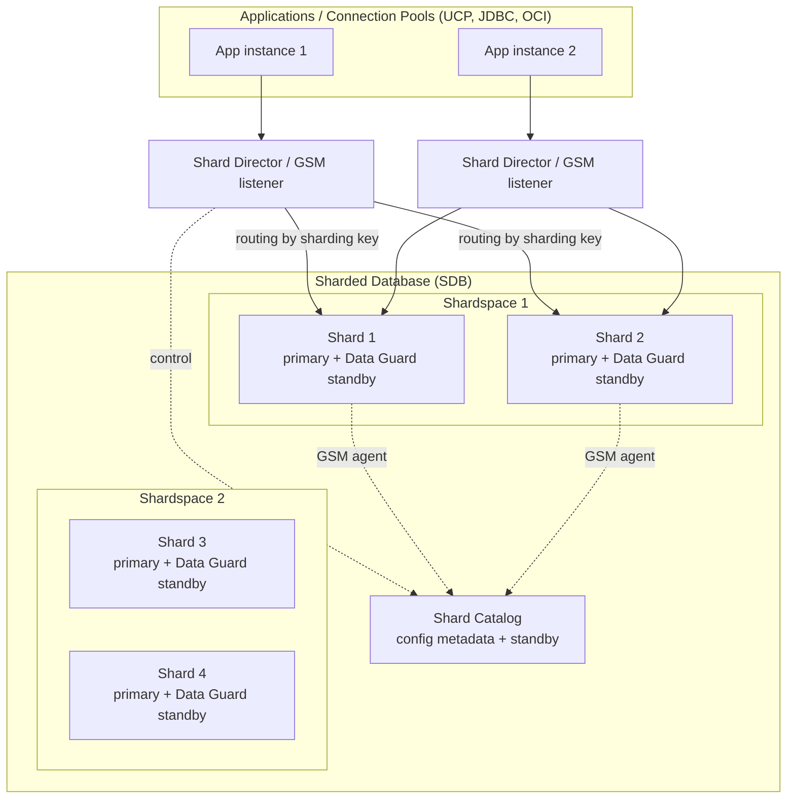

# Oracle Sharding: A Comprehensive Guide

> **Author:** Jack Liu Shurui — Solution Architect at Cymbal Bank, Singapore  
> **Context:** Data Architecture / Database Engineering — Oracle Sharding (the "Globally Distributed Database"): the native scale-out sharding feature of Oracle Database — architecture, methods, operations, use cases, comparisons (Data Engineering series)  
> **Repository:** [github.com/jackliusr/research](https://github.com/jackliusr/research)  
> **Last Updated:** August 2026

---

## Table of Contents

1. [Oracle Sharding Overview](#1-oracle-sharding-overview)
2. [Architecture](#2-architecture)
3. [Benefits](#3-benefits)
4. [Use Cases](#4-use-cases)
5. [Operations](#5-operations)
6. [Comparison with Other Scale-Out Databases](#6-comparison-with-other-scale-out-databases)
7. [Worked Example: Payments Platform on Oracle Sharding](#7-worked-example-payments-platform-on-oracle-sharding)
8. [The Future: 2026 and Beyond](#8-the-future-2026-and-beyond)
9. [Glossary](#9-glossary)

---

## 1. Oracle Sharding Overview

### 1.1 What Oracle Sharding Is

**Oracle Sharding** is the native sharding / distributed-database feature of Oracle Database: a scale-out OLTP architecture that partitions (and optionally replicates) data across a **pool of independent Oracle databases** — the **shards** — that "share no hardware or software." To the application, the pool of shards presents as a **single logical database**; to the administrator it is a fleet of databases managed as one unit by Oracle's distributed-database framework.

Since Oracle Database **23ai** the feature is marketed under a broader brand: **Oracle Globally Distributed Database** (in 26ai documentation: *Oracle Globally Distributed AI Database*). The core mechanics — shards, shard catalog, shard directors, chunks, table families — are unchanged across the rebrand; "Oracle Sharding" and "Globally Distributed Database" refer to the same technology.

Key properties that define the feature:

- **Shared-nothing scale-out.** Each shard is a full Oracle Database (single-instance or Real Application Clusters — RAC) with its own CPU, memory, and storage. No shared disk, no cache fusion across shards, no cross-shard locks on the data path.
- **SQL and ACID preserved.** Each shard is a complete Oracle engine, so within a shard you get the full relational model: SQL, PL/SQL, constraints, indexes, and ACID transactions. This is the defining difference from NoSQL sharded stores (see §4.4 and [nosql_data_modelling_guide.md](nosql_data_modelling_guide.md)).
- **Elastic scale-out.** Capacity and throughput grow by *adding shards*, not by buying bigger servers. Oracle's headline claim is **near-linear scalability**: adding a shard adds roughly its proportional share of total throughput (see §3.1).
- **Fault isolation.** A failure (or a full maintenance) is contained to one shard — the "blast radius" of any incident is a fraction of the data and workload (see §3.2).
- **Geographic distribution.** Data can be pinned to specific shards in specific regions — for latency and for data-residency/sovereignty compliance (see §3.3 and [data_governance_guide.md](data_governance_guide.md)).

Oracle Sharding is not a separate product: it is a feature of **Oracle Database Enterprise Edition (EE)**, layered on the same engine covered in depth in [oracle_database_guide.md](oracle_database_guide.md). Everything that guide says about the engine — RAC, Data Guard, multitenant, partitioning, RMAN, AWR — applies *inside* each shard. This guide is the dedicated deep-dive on the distributed layer that sits on top of those per-database capabilities; the base engine is not re-covered here.

**What Oracle Sharding is not (clearing up common confusions):**

- **Not middleware.** Sharding is implemented in the database stack itself (drivers, GDS framework, per-shard engine) — not in an application-side routing library you maintain. There is no separate "shard proxy" product to run; the directors are part of the GDS framework.
- **Not a separate product or edition.** It is a feature of Oracle Database Enterprise Edition, enabled on an SDB you assemble from ordinary EE databases.
- **Not transparently distributed.** The application must supply the sharding key (or accept scatter-gather costs); schema rules (PK/unique/FK) are constrained by the shard key; cross-shard transactions exist but are discouraged. Contrast with NewSQL engines that make distribution invisible (§6).
- **Not a data-warehouse scale-out.** It targets OLTP. Analytics across the whole SDB are possible (scatter-gather) but belong in a warehouse fed by CDC (GoldenGate) — see [oracle_database_guide.md](oracle_database_guide.md) §5 and §4.4 here.
- **Not a replacement for RAC.** RAC and sharding solve different problems and compose (shards are often RAC clusters) — see §1.3.

### 1.2 History and Evolution

| Release | Year | Sharding milestone |
|---|---|---|
| **12c R2 (12.2)** | **2017** | **GA of Oracle Sharding** (first release to include it, March 2017). System-managed (consistent-hash) sharding; shard catalog + shard directors (the GDS framework); Data Guard per shard; shard-aware JDBC/UCP/OCI clients. Positioned for "internet-scale" OLTP needing linear scalability and fault isolation. |
| **18c** | 2018 | **User-defined sharding** added (explicit list/range mapping — before 18c, data placement was entirely system-managed). **Online chunk migration** (move data between shards without downtime) and **chunk splitting**. **Enterprise Manager Cloud Control** sharding monitoring. Sharding on **RAC** and **Exadata**. |
| **19c** | 2019 | Long-term-support release of the 12.2 family; sharding matured: **global sequences** across shards, improved rebalancing, **Exadata Cloud Service** support, richer GDSCTL and EM tooling. The version most production sharded deployments run on through the mid-2020s. |
| **21c** | 2021 | Innovation release; incremental sharding improvements (GDS framework, chunk management tooling, JSON support on sharded deployments) — no architectural change. Verify specific 21c deltas in the release notes before quoting them. |
| **23ai** | 2024 | Rebranded **Oracle Globally Distributed Database**. Major additions: **Raft-based replication** as an alternative to per-shard Data Guard (consensus-based commit, automatic failover); **Automatic Data Movement on Sharding Key Update (ADMUSK)** — updating a row's sharding key now moves the row to the correct shard automatically; improved chunk-split/rebalance tooling; AI Vector Search usable on sharded tables. |
| **26ai** | 2025 | LTS successor (announced October 2025): **Oracle Globally Distributed AI Database** — Raft replication matured (zero-data-loss failover in seconds), native vector types + ONNX embedding models on sharded databases, agentic/AI-driven operational automation, updated drivers (JDBC/ODP.NET 26ai). |

Oracle's current LTS positioning: 23ai was to be the long-term support release, but **26ai replaced it as the LTS brand** in October 2025 (applied as a Release Update over the 23 base — see the version-cadence discussion in [oracle_database_guide.md](oracle_database_guide.md) §1.3). For a new sharded deployment in 2026, plan on 19c (mature, most documented) or 23ai/26ai (current features); 19c sharding remains the safest reference for behavior.

### 1.3 Positioning: Sharding vs RAC vs the Rest of Oracle

Oracle offers several "scale" mechanisms, and they solve different problems — the single most common architecture mistake is treating them as interchangeable:

| Mechanism | Paradigm | What it scales | Unit of data ownership |
|---|---|---|---|
| **RAC** | **Shared-everything** (one logical database, cache fusion over interconnect, shared storage) | Scale-*up* of a single database within a cluster (more CPU/memory serving the *same* data) | Every node can access **all** data |
| **Oracle Sharding** | **Shared-nothing** (many databases, no shared storage) | Scale-*out* by partitioning data across databases | Each shard owns a **subset** of data |
| **Partitioning (range/hash/list)** | Scale-*up* within one database | Manageability (pruning, purging, parallelism) inside a single instance | All partitions in the same database |
| **Multitenant (CDB/PDB)** | Consolidation / density | Number of logical databases per physical server | PDBs share one engine/storage pool |
| **Exadata** | Engineered platform | I/O throughput and compression for one (or sharded) databases | Storage servers, not data ownership |

The mental model: **RAC makes one database bigger; sharding makes many databases act as one.** They compose — the standard production pattern is *shards that are themselves RAC clusters* (or have Data Guard standbys), giving scale-out across shards *and* scale-up/failover within each shard. Partitioning is orthogonal and still used *within* a sharded table's partitions; multitenant is orthogonal too (a shard can be a PDB; on OCI, sharded deployments commonly run as multitenant DB systems — verify the exact topology for your target service before designing around it).

### 1.4 The Motivation: Why Oracle Built Sharding

Four drivers, in Oracle's own framing and in the industry's:

1. **Internet-scale OLTP.** Transaction volumes, user populations, and data volumes that a single database instance — even a maxed-out Exadata — cannot absorb: consumer internet apps, mobile payments, e-commerce checkout, telecoms event processing. These workloads need *horizontal* capacity growth.
2. **Geo-distribution and data residency.** Regulatory regimes (GDPR, MAS/ABS guidelines in Singapore, regional banking rules) increasingly require that data live — and be accessed — *inside* specific jurisdictions. Sharding lets you pin customer/transaction data to shards in the required geography, with local reads and writes (see §4.3 and [data_governance_guide.md](data_governance_guide.md)).
3. **Fault isolation / availability.** In a single huge database, an incident is a huge incident. Sharding shrinks the blast radius to one shard (a fraction of tenants/customers/data), and per-shard Data Guard or Raft gives fast local recovery without impacting the other shards.
4. **Cloud elasticity.** Scale *out* and *in* by adding/removing shards on demand (on OCI, or Oracle on hyperscalers) — capacity that tracks traffic, rather than over-provisioning one enormous database.

---

## 2. Architecture

### 2.1 Components

An Oracle sharded database (**SDB**) has three kinds of components:

**Shards.** The individual Oracle databases that hold the data. Each shard is a complete, independent Oracle Database — single-instance or RAC — with its own SGA/buffer cache, redo logs, ASM storage, and (typically) a per-shard Data Guard standby (or, 23ai+, Raft replicas). Each shard stores a subset of the sharded tables (its **chunks**) plus full copies of the **duplicated tables**. There is no cross-shard data path: a transaction on one shard never touches another shard's buffers.

**Shard catalog (SCAT).** The central metadata database of the SDB. It persistently stores the SDB configuration: the topology (shards, shardspaces, regions), the chunk-to-shard mapping, global services, and the schema definitions that get propagated to all shards. The catalog is on the **control path, not the data path** — queries never go through it — so it is a small database; it is typically run with its own standby (or Raft replication) because if the catalog is down the SDB cannot be reconfigured (existing routing keeps working). Schema changes are made via the catalog and pushed to the shards.

**Shard directors (the GDS framework).** The connection routers. A shard director is a network listener component of Oracle's **GDS (Global Data Services) framework** that accepts client connection requests carrying a **sharding key** and routes each connection to the shard that owns that key — the "global service" entry point. The same GDS framework runs a *GSM agent* (Global Service Manager) on every shard and on the catalog; the director role (the "shard director" listener) is typically co-located with the catalog or deployed as dedicated lightweight listeners. Multiple shard directors are deployed for HA, and they cooperate to balance connection load.

**Global services.** Oracle Database services (the same `SERVICE_NAME` mechanism used in RAC) that span the SDB. Clients connect to a global service with shard-aware attributes — e.g. the sharding key, or a region hint — and the director routes the session to the right shard. Global services also track shard health for failover of connections to standby shards.



### 2.2 Topology and Data Organization

**Primary/standby shards (HA per shard).** Every shard has a primary (read/write) database and, for high availability, at least one standby. Historically the standby is a **per-shard physical standby via Oracle Data Guard** (managed independently for each shard — a shard's standby can be in a different region than its primary). Since 23ai, **Raft-based replication** offers an alternative: each shard runs a small Raft group (leader + followers), replication is built into the transaction path (no Data Guard configuration), failover is automatic via leader election, and all replicas can serve reads. Data Guard remains the mainstream choice; Raft is the strategic direction for simpler active-active ops.

**Shardspaces.** A *shardspace* is a set of shards that together store data for a specific **range or list of sharding-key values**. In system-managed sharding there is one shardspace (or one per region in composite). In user-defined/composite sharding, shardspaces are how you express *where* data lives: e.g. a `EUROPE` shardspace (shards in Frankfurt/Paris) and an `APAC` shardspace (shards in Singapore/Tokyo).

**Sharded tables.** Tables distributed across the shards. A sharded table is logically partitioned by the **sharding key**; each chunk of the table lives on exactly one shard. Sharded tables support indexes (local to the chunk), and PK/FK constraints *within* the rules discussed in §2.4.

**Duplicated (reference) tables.** Tables replicated in full on **every** shard — the classic example is reference/configuration data: currency tables, rate tables, merchant categories, product catalogs, holiday calendars. Oracle synchronizes duplicated tables automatically (materialized-view-based replication managed by the SDB framework), so a join between a sharded table and a duplicated table executes locally on each shard. Duplicated tables should be small and rarely updated; they are the SDB's answer to "every shard needs this lookup."

**Table families.** A *table family* is a set of sharded tables that are sharded **identically** (same sharding key, same chunking) and therefore **co-located**: corresponding chunks of every table in the family live on the same shard. Table families are how parent/child hierarchies (e.g. `accounts` + `transactions`) are kept joinable: a join between family members is a *local* join on one shard, with full referential integrity enforced inside the shard. Every sharded table belongs to a table family (a family can have a single table). Tables in different families **cannot** share FK constraints and join only via cross-shard queries.

**Chunks — the unit of data movement.** A *chunk* is the SDB's partitioning unit: a chunk is a range of **shard-space keys**, holding one partition of *each* table in a table family (i.e. "a chunk is a single partition from each table of a table family"). Data is distributed by assigning chunks to shards; the chunk-to-shard mapping is stored in the shard catalog. Chunks are the *unit of data movement*: rebalancing, scaling out, and scale-in all happen by **splitting, merging, and migrating chunks** between shards — online, without application downtime. A chunk can be split when it grows too large; a split chunk can be moved to another shard to rebalance.

**Shard-space keys.** The internal key domain of the SDB. In system-managed sharding, the sharding key is hashed (consistent hashing) to a shard-space key, and chunks cover contiguous ranges of shard-space keys; the hash makes distribution even and stable. In user-defined sharding, sharding-key values map directly to shardspaces/ranges.

**Sizing chunks and shards (rules of thumb).** The chunk count is a design parameter with real operational consequences:

- **Chunks ≫ shards.** The number of chunks should be *several times* the number of shards (e.g. hundreds of chunks across a handful of shards). Chunks are the balancing granularity: with many small chunks, rebalancing after adding a shard is fine-grained and fast; with a few giant chunks, balance is coarse and migration is heavy. `PARTITIONS AUTO` grows the chunk count as data grows; you can also split chunks explicitly.
- **Chunk size targets.** Oracle's guidance points at chunks in the low-GB range as a healthy default (verify the recommended range for your release). A chunk far larger than the norm is a candidate for splitting — and a *hot chunk* (one absorbing disproportionate load) is a shard-key design signal, not just a sizing one.
- **Shard sizing.** Size each shard for its *worst* single-chunk load, not average: because one chunk can hold a large tenant or a hot account family, a shard must absorb its largest chunk's peak plus headroom. This is the same "hot partition" math as in NoSQL sharding (see [nosql_data_modelling_guide.md](nosql_data_modelling_guide.md) §3.2/§3.3).

### 2.3 Data Distribution: The Three Sharding Methods

Oracle supports three data-distribution ("sharding") methods, selected at SDB design time:

**1. System-managed sharding (automatic).** The SDB hashes the sharding key into the shard-space key domain and automatically assigns chunks to shards. Oracle balances chunks across shards automatically (with online chunk migration when shards are added/removed or chunks split). The application has **no control** over where data lands — and needs none. This is the default, simplest method; it gives the most even distribution and the least operational effort. Best for: homogeneous fleets, uniform workloads, no residency requirements.

**2. User-defined sharding (explicit).** You declare how sharding-key values map to shards — by **range** (e.g. `account_id < 1M → shard A`) or by **list** (e.g. `country_code IN ('SG','MY') → shardspace APAC`), including **interval sharding** (ranges auto-created for new key values as they appear). Data placement is deterministic and under your control — which is exactly what data-residency scenarios need: EU customers' rows can be *guaranteed* to live on EU shards. You manage the placement and rebalancing yourself (GDSCTL chunk moves). Best for: geo-partitioning, tenant-to-shard mapping, regulatory data placement.

**3. Composite sharding (two-level).** Range/list at the top level → routes data into **shardspaces**; consistent hash within each shardspace → distributes across the shards of that shardspace. This combines the residency control of user-defined sharding with the automatic balancing of system-managed sharding *inside* each region. For most real-world geo-distributed deployments, composite is the sweet spot: "EU data in EU shardspace, hashed evenly across EU shards; APAC data in APAC shardspace, hashed evenly across APAC shards."

| Method | Control | Data placement | Balancing | Best for |
|---|---|---|---|---|
| **System-managed** | None (automatic) | Consistent hash of sharding key → chunks auto-assigned | Automatic, online chunk migration | Uniform OLTP, simplest ops, no residency needs |
| **User-defined** | Full (explicit range/list/interval) | Deterministic mapping of key values to shards/shardspaces | Manual (you move chunks) | Geo/residency, tenant-per-shard, legacy-compatible |
| **Composite** | Top level only (range/list) | Range/list → shardspace; hash within shardspace | Automatic *within* shardspace | Geo-distributed OLTP with residency + balance |

### 2.4 Shard Key Design

**Choosing the shard key.** The shard key is the column (or column set) that determines data placement — the SDB analogue of a partition key in Cassandra or a DynamoDB partition key (patterns in [nosql_data_modelling_guide.md](nosql_data_modelling_guide.md) transfer directly). Rules and heuristics:

- The sharding key **must be a column of the primary key** of the root table of the family (Oracle requires the sharding key to be part of the PK; in practice it is usually the PK itself — e.g. `account_id`, `customer_id`, `tenant_id`).
- Pick a key with **high cardinality and even value distribution** — hash distribution (system-managed) handles skew in *values* but not skew in *volume*: a single key value that owns a disproportionate share of rows/load (a giant tenant, a celebrity account) creates a hot chunk (see the hotspot discussion in [nosql_data_modelling_guide.md](nosql_data_modelling_guide.md) §3.2).
- **Co-location is the whole game.** Group everything that is accessed *together* into one table family sharing the shard key: `accounts` + `transactions` + `account_limits` keyed by `account_id`. Then account-centric queries and joins never leave the shard.
- Avoid keys that change: updating the sharding key requires the row to move shards. 23ai's **ADMUSK** automates this (the row is relocated automatically), but it is still a distributed operation — treat the shard key as immutable in design.

**Shard-aware queries (routing).** When a query's `WHERE` clause supplies the sharding key, the driver/director routes the session straight to the owning shard: a **single-shard query**, executed locally with full SQL and ACID. When the query does *not* constrain the shard key, the SDB runs a **cross-shard (multi-shard) query**: the SQL is decomposed and executed on every shard in parallel and the results merged — **fan-out / scatter-gather**. Scatter-gather works (full SQL, correct semantics) but is more expensive — the design objective is that the *transaction path* is single-shard and only rare analytical/reporting queries fan out.

**Connection routing.** Routing is a joint effort of the client stack and the directors:

- **Shard-aware drivers**: OCI, JDBC (and ODP.NET) drivers understand sharding; you supply `sharding_key` connection properties (e.g. `oracle.net.ShardingKey`), and the driver asks a shard director for the right shard.
- **UCP (Universal Connection Pool)** is shard-aware: it pools connections *per shard*, routes by sharding key, and maintains affinity so repeated calls for the same key reuse a warm session on the right shard. UCP also provides connection failover across shard primaries/standbys.
- **Shard directors** do the routing for non-shard-aware clients and provide the global-service endpoint; they can also route *by region* (connect to the nearest shardspace) for latency.

**The routing path, step by step:**

1. The application asks UCP (or the driver) for a connection, supplying the sharding key (e.g. `account_id = 4711`) as a connection property.
2. UCP contacts a **shard director** (cached; directors are load-balanced among themselves) with the key; if UCP already has a pooled connection for that key's shard, it reuses it — *affinity* means repeated calls for the same key skip the director.
3. The director resolves the key → chunk → shard from its cached copy of the catalog's chunk map, and returns the shard's endpoint (and, if the primary is down, the standby via the global service).
4. UCP hands the session to the owning shard; the SQL executes **locally** — normal Oracle parsing, locking, and commit on that one database.
5. If the application later issues SQL *without* the shard key on the same session, the SDB runs it as a cross-shard query: the session becomes a "coordinator" that fans out to all shards and merges results (scatter-gather) — correct SQL, higher cost.

**Constraints across shards — the hard rules.** Because enforcement can only happen where data lives, Oracle imposes strict schema rules on sharded tables: primary keys must include the sharding key; **unique indexes must include the sharding key** (a *global* unique constraint on a non-shard-key column cannot be enforced — this is a deliberate, documented limitation; see §5.5); foreign keys are allowed **only within a table family** (same shard key) or from a sharded table to a duplicated table. Cross-family FKs and non-shard-key uniqueness must be handled at the application layer or by a centralized table (e.g. a duplicated table holding the unique values).

### 2.5 Schema DDL in Practice

The schema is defined once, against the shard catalog, and propagated to all shards. The key DDL statements (19c/23ai syntax; exact clause names vary slightly by release — verify against your version's SQL reference):

**Sharded table (root of a table family):**

```sql
CREATE SHARDED TABLE accounts (
  account_id    NUMBER        NOT NULL,
  customer_id   NUMBER        NOT NULL,
  currency      CHAR(3)       NOT NULL,
  status        VARCHAR2(16)  NOT NULL,
  created_ts    TIMESTAMP     NOT NULL,
  CONSTRAINT accounts_pk PRIMARY KEY (account_id)
)
PARTITION BY CONSISTENT HASH (account_id)
PARTITIONS AUTO
TABLESPACE SET ts1;
```

- `PARTITION BY CONSISTENT HASH (account_id)` declares system-managed (hash) sharding on the shard key; user-defined and composite designs instead declare `PARTITION BY RANGE`/`LIST` over shardspaces (see the worked example in §7.1 for composite syntax).
- `PARTITIONS AUTO` lets the SDB manage the chunk count (a chunk corresponds to a partition); `TABLESPACE SET` declares the tablespaces whose chunks may be placed on shards.
- The shard key must be part of the primary key (here it *is* the PK).

**Child table in the same family (co-located):**

```sql
CREATE SHARDED TABLE transactions (
  account_id   NUMBER       NOT NULL,
  txn_id       NUMBER       NOT NULL,
  amount       NUMBER(18,2) NOT NULL,
  ...
  CONSTRAINT txns_pk PRIMARY KEY (account_id, txn_id),
  CONSTRAINT txns_acct_fk FOREIGN KEY (account_id) REFERENCES accounts(account_id)
)
PARTITION BY REFERENCE (txns_acct_fk);   -- inherits the parent's sharding
```

`PARTITION BY REFERENCE` makes the child shard exactly like its parent — the table-family mechanism expressed in DDL: same shard key, same chunking, foreign keys enforceable locally.

**Duplicated (reference) table:**

```sql
CREATE DUPLICATED TABLE fx_rates (
  ccy_pair   VARCHAR2(7)  PRIMARY KEY,
  rate       NUMBER(18,8) NOT NULL,
  updated_ts TIMESTAMP    NOT NULL
);
```

Duplicated tables are created in every shard automatically and synchronized by the SDB framework — no application replication code.

**Global services** are created in GDSCTL (not SQL) with shard-aware attributes; JDBC clients then connect with the sharding key as a connection property (see §2.4).

**Chunk lifecycle recap.** A chunk begins as one partition (a range of shard-space keys) of each family table. As data grows: **split** (a chunk divides into two; one half can move), **migrate** (a chunk moves between shards online), **merge** (adjacent chunks consolidate on scale-in). `gdsctl config chunk` shows placement; EM Cloud Control shows the same visually. Rebalancing is triggered automatically after adding/removing shards in system-managed mode, or explicitly for user-defined placement.

## 3. Benefits

### 3.1 Linear Scalability (Scale-Out)

The defining benefit. Because each shard is an independent engine with its own CPU/memory/storage, throughput and capacity grow **approximately linearly** with the number of shards: 4 shards ≈ 4× the transactions of 1 shard, minus a small overhead for the routing layer and duplicated-table maintenance. There is no shared bottleneck (no single buffer cache, no shared-disk I/O) to saturate — the only shared components are the directors/catalog, which are on the control path and cheap. The practical effect: you size the fleet to the *growth curve*, not to the peak of a single box, and you add capacity in shard-sized increments rather than by forklift-upgrading hardware.

Oracle's documented numbers: sharded configurations have been benchmarked to hundreds of thousands of SQL transactions per second at the SDB level, scaling with shard count; the honest caveat is that *your* linearity depends on workload shape — single-shard keyed transactions scale linearly; heavy scatter-gather workloads scale worse (see §5.5).

### 3.2 Fault Isolation (The "Blast Radius" Reduction)

In a single database, one bad query, one corrupt block, one runaway job, or one hardware failure can degrade or take down *everything*. In an SDB, the failure domain is **one shard**: 

- A shard failure affects only the data (and tenants/customers) that shard owns — the other shards continue serving normally.
- Maintenance is shard-scoped: you can patch, upgrade, or rebalance one shard (or one shard's standby) at a time — **rolling operations across the fleet** without a global outage window.
- Per-shard HA (Data Guard or Raft) means even the failed shard recovers locally, typically in seconds-to-minutes; global services redirect affected connections to the standby.
- Correlated risk is contained: a data-corruption incident is discovered and repaired per shard, with per-shard RMAN backups and PITR (see §5.4).

This is the "extreme availability" property Oracle markets: availability of the *logical database* approaches the product of the shard availabilities, and any single incident touches only a fraction of users.

### 3.3 Geo-Distribution and Data Residency

Sharding is the only Oracle architecture where **data placement is a first-class physical property**: with user-defined or composite sharding you can guarantee that a given tenant's rows physically reside in a chosen region's shards (see §4.3). Benefits:

- **Data residency/sovereignty compliance** — EU personal data on EU shards, SG banking data on SG shards, provable at the infrastructure level (the audit story is "the bytes are in this jurisdiction's data center," not "we promise to filter on read").
- **Local data access and latency** — reads and writes for a region's users hit shards in that region (regional global services route by geography); cross-region traffic is eliminated from the transaction path.
- **Regulatory disaster-recovery** — each shard's standby can sit in a *different* region, letting you satisfy both residency (primary in-region) and DR (standby elsewhere) requirements.

### 3.4 Cloud Elasticity

On OCI (and Oracle-on-hyperscaler offerings), sharding maps cleanly onto cloud operations: shards are provisioned as DB systems/PDBs, chunk migration moves data between them, and the fleet scales out/in with traffic. This is the SDB's answer to "cloud-native scale" while keeping Oracle's SQL/ACID/enterprise stack. Caveat: elastic *scale-in* is chunk-migration-bound (you must migrate chunks off a shard before retiring it), so it is elasticity measured in hours, not seconds — the fast path for traffic spikes is adding shards, not shrinking.

### 3.5 Use-Case Fit

Oracle Sharding is deliberately **not for every workload** — it is for *large OLTP*: high-volume, high-concurrency transaction processing where queries are naturally keyed (SaaS multi-tenant, payments, e-commerce, customer 360), where data can be co-located into table families, and where the transaction path can be single-shard. It is a poor fit for workloads with mostly cross-shard access patterns, unkeyed ad-hoc analytics (use a warehouse/Exadata or a fan-out-tolerant design), or very small deployments (a handful of shards rarely justifies the operational overhead — see §6.3 for honest sizing guidance).

### 3.6 What the Benefits Look Like in Practice

- **Scale numbers to sanity-check claims.** Oracle's positioning and published materials point at hundreds of thousands of SQL transactions per second across shard fleets; the architecturally honest framing is: *throughput ≈ (single-shard throughput) × (number of shards)* for shard-keyed work. The linearity curve flattens as scatter-gather traffic and duplicated-table write contention grow — validate with your own load test on your real workload shape before committing a fleet size.
- **Availability math.** With per-shard Data Guard or Raft, a shard outage is seconds of connection redirection (global services move sessions to the standby). The SDB's overall availability is high because incidents are shard-scoped — but the shard catalog is a single point of *control* (not data): mitigate with its own standby/Raft, and rehearse catalog recovery.
- **Operational leverage.** The same GDSCTL/EM surface manages 4 or 40 shards; per-shard RMAN plus per-shard PITR turns "recover the database" into "recover this shard's chunk set," and rolling maintenance (patch one shard at a time) removes the global-change window.
- **The hidden costs to budget.** Fleet licensing (EE × every shard + an HA option × every shard), application-to-shard network bandwidth, cross-shard query tuning, chunk-rebalance I/O, and the schema/application refactor to key everything by the shard key. The benefits are real; they are purchased with design discipline, not just license money.

---

## 4. Use Cases

### 4.1 SaaS Multi-Tenant

The canonical sharding pattern: **tenant-per-shard (or tenant-group-per-shard)**. Each customer/tenant's data is a self-contained unit — tenant ID is the sharding key, tenant's tables form a table family, and a tenant's entire footprint lives on one shard. Benefits: **tenant isolation** (one tenant's load, bad query, or data-corruption incident cannot affect others), per-tenant capacity tuning (big tenants get dedicated shards), and clean per-tenant backup/retention/PITR. This is the pattern Oracle positions for SaaS ISVs and for enterprises running multi-entity platforms. With user-defined/composite sharding, tenant placement can also honor residency (tenant in Germany → EU shardspace).

### 4.2 Internet-Scale OLTP

High-volume transaction workloads — payments, e-commerce checkout, wallet/ledger movements, telecoms charging, gaming — where the traffic profile is *keyed* (per account/card/user) and the volumes exceed single-instance capacity. The design recipe is uniform: shard key = the account/customer/card identifier, table family = the entity + its transactional children, transaction path = single-shard, scale-out = add shards. The payments angle is detailed in the worked example (§7) and cross-referenced from [payments_hub_guide.md](../banking/payments_hub_guide.md).

### 4.3 Banking: Payments, Cards, Customer 360, Residency

Banking is Oracle Sharding's flagship vertical (and the reason this guide exists in this series — see also [oracle_banking_microservices_architecture_guide.md](../banking/oracle_banking_microservices_architecture_guide.md) and [oracle_flexcube_data_model_guide.md](../banking/oracle_flexcube_data_model_guide.md)):

- **High-volume payments processing** — ISO 20022-era payment volumes (instant payments, cards, batch) are a natural fit: the account/party ID keys the ledger, transactions co-locate with the account, and settlement/balance operations are local, ACID, single-shard. Cross-shard cases (a payment touching two accounts on different shards) use distributed transactions (§5.5) or are decomposed (e.g. via a payment hub / event-driven settlement — see [payments_hub_guide.md](../banking/payments_hub_guide.md)).
- **Card transaction processing** — card/account-keyed authorization and posting workloads scale out across shards with the card or account as the key; fraud/risk scoring often reads the same family locally.
- **Customer 360 at scale** — the customer entity (profiles, accounts, products, transactions, interactions) as a table family keyed by customer ID; every customer-centric view is a single-shard query, at hundreds of millions of customers.
- **Data residency for regulatory placement** — composite sharding pins customer/transaction data to in-country shardspaces (SG for MAS-regulated data, EU for GDPR-scoped data), satisfying both the residency requirement and local low latency; see [data_governance_guide.md](data_governance_guide.md) for the governance framing.
- **"Banking on sharded Oracle" (OBMA alignment)** — Oracle's Banking Microservices Architecture (see the OBMA guide) already assumes scale-out patterns; sharding provides the "data plane" for OBMA-style microservices that need a shared, consistent, SQL system of record behind their APIs.

**Banking caveats worth stating.** (1) Regulators audit *demonstrable* residency — the `config chunk` evidence trail (§7.4) should be wired into the compliance process, not produced ad hoc. (2) Cross-border 2PC has latency and operational implications — instant-payment flows should be designed to avoid it (hub-mediated settlement, see [payments_hub_guide.md](../banking/payments_hub_guide.md)). (3) Core-banking packages (FLEXCUBE and the OBMA suite — see the banking guides) have their own data models; sharding a packaged application requires verifying that its schema rules (especially unique constraints and FKs) are compatible with shard-key constraints before committing — packaged apps are not automatically shardable.

### 4.4 Comparison with the Alternatives (When to Choose Sharding)

- **vs NoSQL sharding (Cassandra/DynamoDB-style)** — see [nosql_data_modelling_guide.md](nosql_data_modelling_guide.md). NoSQL shards natively and cheaply, with tunable consistency and flexible schemas, but you give up joins, general SQL, and cross-partition transactions. Oracle Sharding keeps full SQL/PL/SQL, constraints, and per-shard ACID at the cost of license money and design discipline. Choose Oracle Sharding when the *application requires relational features* at scale; choose NoSQL when the data model is genuinely aggregate-based and the team can live without SQL.
- **vs application-level (manual) sharding** — hand-rolled sharding (routing logic in the app, one connection pool per shard, manual rebalancing) is what Oracle Sharding automates. The manual approach avoids license cost but re-implements the shard catalog (mapping), the directors (routing), chunk movement (rebalancing), and per-shard schema propagation — plus it rarely handles failover, global services, or duplicated-table sync. Oracle Sharding's value proposition vs manual sharding is precisely that these become product features.
- **vs distributed SQL / NewSQL (CockroachDB, TiDB, YugabyteDB)** — these are *natively distributed* databases: any node can serve any query, transactions can span nodes transparently (globally-consistent multi-key transactions via Raft/Percolator-style protocols), and sharding is internal. Oracle Sharding is *sharded-but-not-globally-transactional*: cross-shard work is explicit (fan-out, 2PC with caveats) and the shard key is a design constraint. Choose NewSQL when you cannot impose a shard key or need transparent cross-node transactions; choose Oracle Sharding when you are Oracle-committed, need per-shard enterprise features, or want explicit geo-control. Honest note: the NewSQL engines are generally *better distributed databases*; Oracle Sharding is the way to get *Oracle* distributed (see §6.4).
- **vs partitioning / PDB scale-up** — partitioning (range/hash/list inside one database) and multitenant PDB consolidation are scale-*up* and density plays, not scale-out: a partitioned table still lives on one instance (or one RAC cluster). Partitioning is complementary (used inside sharded tables for pruning); it does not give linear multi-database scaling, fault isolation across servers, or physical geo-placement. Use partitioning when one (RAC) database suffices; use sharding when it does not.

### 4.5 Decision Guide: Should You Use Oracle Sharding?

Score the workload honestly before committing:

| Question | If yes | If no |
|---|---|---|
| Will the workload outgrow one (RAC) database's capacity or throughput? | Consider sharding | Stay single-database (partitioning/PDB) |
| Are the queries naturally keyed (account/customer/tenant/card ID)? | Sharding-friendly | A distributed SQL engine may fit better |
| Can the transaction path be made single-shard by design? | Strong fit | NewSQL engines handle cross-node ACID more transparently |
| Is Oracle already the standard (SQL, PL/SQL, DBA skills, compliance artifacts)? | Strong fit | Open-source distributed SQL may win on TCO |
| Are there hard data-residency / geo requirements? | Composite sharding shines | — |
| Is the team ready to operate a *fleet* (N DBs, catalog, directors, chunk rebalancing)? | Proceed | Start smaller; sharding ops are non-trivial |
| Is 2–4 shards likely to be enough forever? | Reconsider — overhead may not pay off | Sharding pays back at scale |

**Minimum sensible size.** In practice, sharding starts paying back around 4–8+ shards or sustained multi-region workloads; below that, one RAC cluster plus partitioning is simpler and cheaper. Oracle's own positioning targets "internet-scale" OLTP — treat sharding as a scale *destination* (a growth path designed for early), not a starting topology for a small system.

---

## 5. Operations

### 5.1 Deployment

Deployment is driven by the **GDSCTL** command-line utility (the "GDS controller") and by Enterprise Manager:

1. **Provision the shards** — create the individual Oracle databases (DBCA/cloud/DB operator), typically one primary + one standby per shard.
2. **Create the shard catalog** — a small database (with its own standby) that will hold SDB metadata; run `gdsctl add catalog`.
3. **Register shards and shardspaces** — `add shardspace`, `add shard` (with `--destination`/region), `add invited node`; GDSCTL deploys the GSM agents.
4. **Create the schema** — connect to the catalog and create sharded tables, duplicated tables, table families, and global services; the catalog propagates DDL to all shards.
5. **Create global services** — `add service` with shard-aware attributes; verify routing.

On OCI, sharded deployments can be provisioned via the console/API as a set of DB systems configured as an SDB (and the Oracle Database Operator on Kubernetes supports catalog+shards deployment on OKE — see the operator's sharding docs). Deployment complexity is real: an SDB is N databases to install, secure, and monitor — budget for it (§6.3).

**A minimal GDSCTL session (illustrative):**

```
gdsctl
GDSCTL> add catalog -database catdb -region apac
GDSCTL> add shardspace apac
GDSCTL> add shardspace europe
GDSCTL> add shard -database sdb1 -shardspace apac -region sg
GDSCTL> add shard -database sdb2 -shardspace apac -region sg
GDSCTL> add shard -database sdb3 -shardspace europe -region eu
GDSCTL> add shard -database sdb4 -shardspace europe -region eu
GDSCTL> add invited node sdb1.example.com
GDSCTL> add invited node sdb2.example.com
GDSCTL> add invited node sdb3.example.com
GDSCTL> add invited node sdb4.example.com
GDSCTL> deploy
GDSCTL> add service -gshard -preferred apac -available europe payments_svc
GDSCTL> config shard
GDSCTL> status shard
```

Exact flags differ by release — the shape is: catalog → shardspaces → shards → invited nodes → deploy → global services. EM Cloud Control provides the same flow in a GUI. Once the fleet is deployed, the schema (§2.5) is created against the catalog and propagated to every shard.

### 5.2 Data Movement and Rebalancing

**Chunk migration** is the heart of SDB data movement. Chunks move between shards *online* (the chunk stays readable/writable during migration; the framework tracks progress and switches over atomically). Operations:

- **Adding a shard (scale-out)** — register the new shard, then trigger rebalancing: chunks are split/migrated from existing shards to the new one until the fleet is balanced (automatic for system-managed/composite; directed by you for user-defined).
- **Removing a shard (scale-in)** — migrate all its chunks off, then unregister it.
- **Chunk splitting** — a chunk that grows too large can be split; one of the resulting chunks can then be moved, rebalancing hot data.
- Tools: `gdsctl config chunk`, `move chunks`, chunk-split commands, or EM Cloud Control's sharding pages (which wrap the same operations with monitoring).

**ADMUSK (23ai+)** adds automatic data movement *on sharding key update*: if an application updates a row's sharding key value, the row is relocated to the correct shard automatically — previously this required manual handling (delete+reinsert across shards).

### 5.3 Monitoring

- **Enterprise Manager Cloud Control** has dedicated sharding support: SDB topology views (shards, shardspaces, chunk distribution), global-service health, replication lag, and per-shard performance — the primary monitoring surface.
- **GDSCTL** provides the CLI truth: `config shard`, `config chunk`, `config service`, `status shard`, `status service` for placement, health, and routing diagnostics.
- Standard per-shard Oracle tooling applies **per shard**: AWR/ADDM, alert logs, and EM targets for each shard (and each standby). Cross-shard workload analysis = correlating per-shard AWR reports; there is no single-instance "SDB-wide" AWR view (verify EM's aggregate views for your version).
- Watch specifically: chunk-skew (uneven chunk sizes/loads across shards), duplicate-table sync lag, director/catalog health, and global-service failover state.

### 5.4 Backup and Recovery

Each shard is its own database, so **RMAN runs per shard** (see the RMAN/multitenant/HA treatment in [oracle_database_guide.md](oracle_database_guide.md)):

- Back up each shard (primary, and optionally the catalog) individually with RMAN; per-shard **point-in-time recovery (PITR)** is fully supported and is the standard repair tool for shard-local corruption.
- The shard catalog must be backed up too (it holds the chunk map and topology) — losing the catalog without a standby means rebuilding SDB metadata.
- Recovery is shard-scoped: restore one shard's backups to the point of corruption without touching the rest of the fleet; because chunks map cleanly to tablespaces/partitions, partial recovery of a single chunk's data is practical.
- HA layer: Data Guard per shard (fast failover, RPO=0 with SYNC) or Raft replication (23ai+). Global services redirect connections on shard failover (§5.5).

### 5.5 Performance, Transactions, and SQL Feature Boundaries

**Single-shard vs cross-shard performance.** The SDB's performance model is: *single-shard = local Oracle performance; cross-shard = distributed overhead*. Design rule of thumb: >95% of transaction-path statements should be single-shard (shard key in the predicate). Scatter-gather queries (no shard key) parallelize across shards but pay network fan-out and merge costs — acceptable for occasional reporting, deadly on the hot path.

**Distributed transactions (2PC).** Oracle Sharding supports transactions that span shards using **two-phase commit (2PC)** — a single transaction can update rows on multiple shards and commit atomically. The honest limitations: 2PC across shards is significantly slower (prepare/commit round-trips, global coordinator), increases contention, and pushes the failure-window complexity to the coordinator; Oracle's guidance is to design the workload so cross-shard transactions are rare or eliminated (e.g. by co-location in table families, or by decomposing cross-entity flows into eventually-consistent steps via a hub — see §4.3). Applications that need *transparent* multi-node ACID without design effort should look at distributed-SQL engines instead (§6).

**SQL feature boundaries (the documented limits):**

- **No global unique indexes across shards** — a unique constraint on a sharded table must include the sharding key. Uniqueness on other columns must be enforced by application logic or a duplicated "unique-value registry" table.
- **FK constraints only within a table family** (or from a sharded table to a duplicated table); cross-family referential integrity is not enforceable.
- **Sequences**: Oracle provides **global sequences** for sharded databases — `CREATE SEQUENCE ... GLOBAL` (or the SDB default) yields values unique across all shards, coordinated through the GDS framework; `LOCAL` sequences are per-shard (cheaper, but values can collide across shards — fine for non-key use). Global sequences are for non-primary-key columns; primary keys come from the shard key itself.
- Materialized views, synonyms, and most SQL features work *within* a shard; JSON and AI Vector Search work on sharded tables in 23ai/26ai (each shard indexes its own vectors; cross-shard vector search = scatter-gather over shard-local vector indexes).
- Query features that assume a single database (e.g. global hints, certain distributed-dictionary operations) behave per-shard — test before relying on them.

### 5.6 Operational Runbook Checklist

- **Daily:** per-shard alert logs and EM targets; global-service health (`status service`); chunk-distribution sanity (`config chunk`); duplicated-table sync lag.
- **Weekly:** per-shard AWR/ADDM triage; per-shard standby/Data Guard lag (or Raft health); rebalance candidates (skewed or hot chunks).
- **Change management:** schema changes via the catalog (review propagation to all shards); chunk moves scheduled in low-traffic windows with monitoring; patches applied *rolling* — one shard at a time, failover-aware.
- **Failure drills (quarterly, in a test SDB):** shard-primary loss → global-service failover to standby → verify routing and rebalance; catalog loss → catalog standby promotion; chunk-migration interruption (confirm resume semantics); scale-out rehearsal (add a shard + rebalance end-to-end).
- **Backup verification:** per-shard RMAN restore tests — the SDB is only as recoverable as its least-tested shard; catalog backup restore test; PITR drill on one shard.
- **Performance baselines:** record per-shard TPS/latency at N shards; after adding a shard, re-baseline to confirm the fleet scales as designed; track cross-shard (scatter-gather) query share — it should stay a small percentage of workload.

---

## 6. Comparison with Other Scale-Out Databases

### 6.1 The Landscape

| Dimension | **Oracle Sharding** | **Cassandra** | **CockroachDB** | **TiDB** | **YugabyteDB** | **MongoDB (sharded)** |
|---|---|---|---|---|---|---|
| **Data model** | Relational (SQL, PL/SQL, JSON, vectors) | Wide-column (CQL) | Relational (Postgres wire) | Relational (MySQL wire) | Relational (Postgres wire) | Document (BSON) |
| **Consistency** | Strong per shard; 2PC across shards | Tunable, eventual by default | Strong (Raft, globally) | Strong (Raft + Percolator-style 2PC) | Strong (Raft, globally) | Tunable; strong with majority (replica sets) |
| **Sharding** | Explicit: shard key + chunks, catalog-managed; system/user/composite | Partition key → token ranges, auto | Range sharding of all data, auto (internal) | Range (region) sharding, auto | Hash/range, auto (internal) | Shard key + chunks, auto (balancer) |
| **Transactions** | Per-shard ACID; cross-shard via 2PC (slow, discouraged) | Single-partition; no multi-row cross-partition ACID | **Full distributed ACID** (multi-row, multi-node) | **Full distributed ACID** (multi-statement) | **Full distributed ACID** | Multi-document ACID (4.2+), distributed |
| **SQL** | Complete (per shard); cross-shard = scatter-gather | No SQL (CQL) | Full SQL (Postgres) | Full SQL (MySQL) | Full SQL (Postgres) | MQL (aggregation), no joins across collections (well, $lookup) |
| **Geo-distribution** | First-class: shardspaces/regions, explicit placement, Data Guard/Raft | Network topology + replication strategy | Geo-partitioning, regional survival goals | Placement rules (via TiKV labels) | Geo-partitioning, x-region replication | Zones (regional/managed) |
| **Operations** | Heavy: N databases + catalog + directors; GDSCTL/EM | Moderate: cluster tooling (nodetool) | Moderate: single binary cluster | Moderate: TiUP/K8s | Moderate: single binary cluster | Moderate: mongos/config/balancer |
| **Ecosystem** | Oracle EE + HA options, RAC/Data Guard/EM/GoldenGate, OCI | Apache/DataStax, Scylla | Cloud-native, managed offerings | PingCAP, TiDB Cloud | YugabyteDB Managed | MongoDB Atlas |
| **Best fit** | Oracle-committed enterprises needing SQL scale-out + residency | Write-heavy event/telemetry, aggregate data, no joins | Transparent distributed OLTP, global transactions | MySQL-compatible scale-out OLTP+HTAP | Transparent distributed OLTP, Postgres-compatible | Document workloads with natural aggregates |

**Reading the table.** Two axes decide most choices. *Consistency/transactions*: Oracle Sharding gives strong per-shard ACID but cross-shard transactions are a design constraint, whereas the NewSQL column (Cockroach/TiDB/Yugabyte) gives transparent global ACID — at the price of cross-node coordination on every multi-node transaction. *Model/fit*: Cassandra and MongoDB are the choices when the data is aggregate-shaped and SQL is not required; Oracle Sharding is the choice when SQL *and* scale *and* the Oracle estate are all required. The "geo-distribution" row is where Oracle Sharding genuinely differentiates: declared, auditable physical placement (shardspaces) is a compliance feature, not just a latency optimization.

### 6.2 The Honest Assessment

**Strengths of Oracle Sharding:**

- **It is Oracle.** Full SQL and PL/SQL, the optimizer, constraints, JSON, vectors (23ai+) — everything in [oracle_database_guide.md](oracle_database_guide.md) — available per shard, and the entire Oracle enterprise stack (RAC, Data Guard, RMAN, EM, GoldenGate, TDE, VPD) applies inside each shard. No SQL-parity gap, no driver roulette, no re-training the DBA team.
- **Explicit geo/residency control** that most distributed databases make awkward: data placement is a *declared* property (user-defined/composite), which is decisive for banking compliance (see [data_governance_guide.md](data_governance_guide.md)).
- **Enterprise HA maturity** — Data Guard per shard is the most battle-tested replication stack in the industry, and Raft (23ai+) adds an active-active option.
- **Fault isolation** is structural, not emergent: shards are *administrative* boundaries (separate backups, separate patches, separate incidents).

**Weaknesses of Oracle Sharding (stated plainly):**

- **Cost.** Oracle EE per shard (every shard is a full EE database) **plus** an HA option (RAC, Active Data Guard, or GoldenGate) on every shard — the licensing guide states that SDBs with more than three primary shards require each shard to be licensed for one of those HA options (and the catalog needs its own licenses if HA'd). For a 10-shard fleet this is 10+ EE licenses + 10 HA licenses. There is no free tier; the TCO story only closes at genuinely large scale (see §8 for licensing verification note).
- **Complexity.** An SDB is a *fleet*: N databases, a catalog, directors, GSM agents, per-shard backups and monitoring, chunk-rebalance operations. It needs DBAs who understand distributed operations; it is a step-change in operational surface vs one RAC cluster.
- **Cross-shard transaction and constraint limitations.** No global unique indexes, no cross-family FKs, 2PC that works but is slow and discouraged. The application must be *designed* around the shard key — Oracle Sharding does not make distribution transparent.
- **"Late to the party."** Native distributed databases (CockroachDB 2015, TiDB 2016, YugabyteDB 2017, Cassandra 2008, MongoDB 2009) shipped distributed *first*; Oracle shipped sharding in 2017, after a decade of middleware-based approaches, and its architecture remains shard-key-centric rather than transparently distributed. For greenfield non-Oracle workloads, the native engines are usually the better distributed database *and* cheaper; Oracle Sharding wins only when the Oracle ecosystem is already the constraint.

### 6.3 Sizing, TCO, and the Decision Frame

A rough economic model (numbers indicative — Oracle licensing is negotiated; see the verification notes):

- **Cost per shard** ≈ 1 × Enterprise Edition license + 1 × HA option (RAC, Active Data Guard, or GoldenGate) + infrastructure + DBA time. A 10-shard fleet is ~10 EE + ~10 HA-option licenses — an order of magnitude above one RAC cluster, and far above open-source distributed SQL on commodity hardware.
- **When the math closes:** the workload genuinely exceeds one cluster's capacity; residency mandates that a native distributed DB can't satisfy as cleanly (declared placement in a specific jurisdiction is an Oracle Sharding strength); or Oracle-ecosystem lock-in makes migration cost exceed license cost.
- **When it doesn't:** sub-scale workloads (partitioning + RAC suffice), greenfield non-Oracle shops (CockroachDB/TiDB/YugabyteDB are better distributed databases at lower cost), and analytics-heavy workloads (a warehouse + CDC via GoldenGate is the better answer — see §4.4).
- **The strategic frame:** Oracle Sharding is a *portfolio decision*. If the bank's estate is Oracle-standard (FLEXCUBE/OBMA, DBA skills, compliance artifacts — see the banking guides), sharding extends that investment to scale. If the estate is multi-engine, the marginal sharding premium is hard to justify against native distributed SQL.

## 7. Worked Example: Payments Platform on Oracle Sharding

This section walks a realistic design: a **regional payments platform** (account-to-account transfers, card transactions, instant payments) serving customers in Singapore and the EU, on Oracle Sharding. It follows the pattern library in [payments_hub_guide.md](../banking/payments_hub_guide.md) and the residency requirements discussed in [data_governance_guide.md](data_governance_guide.md).

### 7.1 Shard Design

**Shard key: `account_id`.** Every transaction is account-centric — debits/credits, balances, history, limits all hang off the account — so `account_id` gives the highest-value co-location. (Alternative considered: `customer_id` — rejected because a customer with many accounts would scatter accounts across shards and make cross-account transfers cross-shard; `account_id` keeps *every* per-account operation single-shard.)

**Table family (co-located by `account_id`):**

- `accounts` (root: PK `account_id`, shard key = PK)
- `transactions` (PK `(account_id, txn_id)`, FK → `accounts`)
- `account_balances` (PK `account_id`, current/available balances)
- `account_limits` (PK `account_id`, daily/velocity limits)
- `txn_audit` (PK `(account_id, audit_seq)`)

All five tables share the `account_id` sharding key → one table family → joins (`accounts ⋈ transactions ⋈ balances`) execute **locally on one shard**. A transfer between two accounts of the *same* customer is single-shard; between different customers it is a 2PC across two shards (rare by design — see routing below).

**Duplicated (reference) tables (on every shard):** `currency` (currencies, decimal places), `fx_rates` (near-real-time rates), `merchant_categories`, `holiday_calendar`, `payment_scheme_config` (e.g. FAST/SEPA parameters). Small, read-mostly, synced by the SDB framework — every shard can join locally to convert currency or validate a scheme without a remote call.

**Sharding method: composite.** Top level: list/range by **region** → two shardspaces:

- `APAC` shardspace — shards in **Singapore** (MAS-regulated data, local residency)
- `EUROPE` shardspace — shards in **Frankfurt/Paris** (GDPR-scoped data, local residency)

Within each shardspace: **consistent hash** of `account_id` across the shards of that shardspace → even distribution and automatic balancing. Residency is guaranteed structurally: an SG customer's `account_id` maps into the APAC shardspace, period.

**Shard count (initial):** 4 primary shards — 2 in `APAC` (Singapore), 2 in `EUROPE` (Frankfurt + Paris) — sized so each shard handles ~25% of traffic with headroom. Each primary has a **Data Guard standby** (cross-zone; the EU shard's standby can be in a second EU site for DR). Catalog with its own standby; two shard directors (one per region) for routing HA.

```mermaid
flowchart TB
    subgraph Apps["Payment Apps (UCP shard-aware pool)"]
        SG[SG app instances]
        EU[EU app instances]
    end
    SG -->|sharding_key=account_id| D_APAC[Shard Director APAC]
    EU -->|sharding_key=account_id| D_EU[Shard Director EUROPE]
    D_APAC -->|hash within shardspace| S1[Shard 1 APAC / SG<br/>accounts+txns chunks | Data Guard standby]
    D_APAC -->|hash within shardspace| S2[Shard 2 APAC / SG<br/>accounts+txns chunks | Data Guard standby]
    D_EU -->|hash within shardspace| S3[Shard 3 EUROPE / FR<br/>accounts+txns chunks | Data Guard standby]
    D_EU -->|hash within shardspace| S4[Shard 4 EUROPE / DE<br/>accounts+txns chunks | Data Guard standby]
    D_APAC -.-> CAT[Shard Catalog + standby]
    D_EU -.-> CAT
    subgraph Dup["Duplicated tables on every shard"]
        REF[currency, fx_rates, scheme config, calendars]
    end
    S1 --- REF
    S2 --- REF
    S3 --- REF
    S4 --- REF
```

**Schema DDL for the platform (illustrative, 19c/23ai syntax — verify clause names against your release):**

```sql
CREATE SHARDED TABLE accounts (
  account_id   NUMBER        NOT NULL,
  customer_id  NUMBER        NOT NULL,
  region       CHAR(2)       NOT NULL,   -- 'SG' | 'EU' -> shardspace
  currency     CHAR(3)       NOT NULL,
  status       VARCHAR2(16)  NOT NULL,
  CONSTRAINT accounts_pk PRIMARY KEY (account_id)
)
PARTITION BY RANGE (region)                -- composite: range -> shardspace
SUBPARTITION BY CONSISTENT HASH (account_id)
SUBPARTITIONS AUTO
TABLESPACE SET ts_apac, ts_europe;         -- mapped to APAC / EUROPE shardspaces

CREATE SHARDED TABLE transactions (
  account_id   NUMBER       NOT NULL,
  txn_id       NUMBER       NOT NULL,
  amount       NUMBER(18,2) NOT NULL,
  currency     CHAR(3)      NOT NULL,
  txn_ts       TIMESTAMP    NOT NULL,
  CONSTRAINT txns_pk PRIMARY KEY (account_id, txn_id),
  CONSTRAINT txns_acct_fk FOREIGN KEY (account_id) REFERENCES accounts(account_id)
)
PARTITION BY REFERENCE (txns_acct_fk);     -- co-located with accounts

CREATE DUPLICATED TABLE fx_rates (         -- replicated to every shard
  ccy_pair   VARCHAR2(7)  PRIMARY KEY,
  rate       NUMBER(18,8) NOT NULL,
  updated_ts TIMESTAMP    NOT NULL
);
```

Notes on the composite syntax: `PARTITION BY RANGE (region)` routes each row's `region` value to the matching shardspace (`ts_apac` / `ts_europe` tablespace sets map to the `APAC` / `EUROPE` shardspaces), and the consistent-hash subpartition distributes rows across the shards *within* that shardspace. `transactions` inherits the family's sharding via `PARTITION BY REFERENCE`, so a transaction chunk always sits on the same shard as its account chunk. Clients connect through UCP with `oracle.net.ShardingKey` = account ID; the director resolves shardspace (region) first, then the owning shard within it.

### 7.2 Routing and Query Patterns

- **Account-centric queries (the 99% path):** balance inquiry, statement, transfer between own accounts, limit checks — all supply `WHERE account_id = ?`, so UCP routes the session to the owning shard in one hop (director lookup + cached affinity) and the query executes as a **single-shard local transaction** with full ACID. Read-your-writes, no distributed overhead.
- **Cross-account transfer (different customers):** a single transaction touching two accounts on different shards → **2PC** across two shards. Design keeps this rare (peer-to-peer flows usually involve one of the parties as the session context; the platform additionally offers an async "payment hub" path for interbank/instant payments — debit on one shard, hub-mediated credit — following the patterns in [payments_hub_guide.md](../banking/payments_hub_guide.md)).
- **Reporting / regulatory queries (rare, batch):** no shard key → **scatter-gather** across all shards in parallel (e.g. daily transaction-volume report per region), executed off-peak; heavy analytics are offloaded to a warehouse via CDC (GoldenGate) rather than run as cross-shard OLTP.
- **Sequences:** transaction IDs and audit sequences use **GLOBAL sequences** (unique across all shards); `account_id` itself is a natural key (IBAN-like/account number) — no sequence needed.

### 7.3 Scale-Out, HA, and Residency Operations

- **Scale-out (adding a shard):** provision Shard 5 (e.g. a third APAC shard in Singapore), `gdsctl add shard`, then rebalance — the framework **splits and migrates chunks** from Shards 1–2 to Shard 5 online; apps keep running, per-account sessions are redirected as their chunks move. Capacity grows ~proportionally; the same flow in reverse (migrate chunks off, unregister) handles scale-in.
- **HA:** per-shard Data Guard (fast-start failover per shard; global services move connections to the standby in seconds) — or, on 23ai+, Raft replication for automatic leader election with zero-data-loss failover. A single-shard failure degrades only that shard's customers; the other three shards and all duplicated-table reads continue.
- **Residency:** composite sharding + regional global services guarantee SG data stays in the APAC shardspace and EU data in EUROPE; regulatory reporting can prove physical placement per shard; the EU standby placement and EU-only shard membership keep GDPR-scoped data inside the EU (including for DR).

**Design checklist from this example:** (1) shard key = the natural access key and PK; (2) everything accessed together in one table family; (3) reference data duplicated, not sharded; (4) transaction path single-shard by construction; (5) composite sharding for residency + balance; (6) per-shard Data Guard/Raft + per-shard RMAN; (7) rebalance/scale-out rehearsed as a routine drill.

### 7.4 Operating the Platform

- **Scale-out drill (quarterly):** provision a spare APAC shard in a test SDB, `add shard`, rebalance, verify chunk movement completes online and per-shard TPS re-baselines — then repeat in production during a low-traffic window. The drill is what makes "add a shard" a non-event on payment day.
- **Failover drill:** kill a shard primary (test SDB); verify global services redirect its sessions to the standby in seconds, the other three shards never notice, and duplicated tables remain current on all shards. Rehearse the same for the catalog.
- **Residency audit:** quarterly, export `config chunk` per shardspace and confirm zero chunks from `EUROPE` shardspace exist on APAC shards and vice versa; keep the output as compliance evidence alongside the data-governance controls in [data_governance_guide.md](data_governance_guide.md).
- **2PC budget:** monitor the share of cross-shard transactions (transfers between customers on different shards). If it grows beyond a few percent, re-examine the routing design (e.g. group high-traffic counterparties, or move the flow to the async payment-hub pattern — see [payments_hub_guide.md](../banking/payments_hub_guide.md)).

---

## 8. The Future: 2026 and Beyond

### 8.1 Oracle Sharding in 23ai/26ai — Where It Is Going

Oracle's direction is unambiguous: **sharding is being repositioned as the "Oracle Globally Distributed Database"** — the data plane for Oracle's distributed and AI ambitions.

- **Raft replication as the HA default direction (23ai → 26ai).** Built-in, consensus-based replication replaces Data Guard configuration for shards; 26ai marketing claims sub-3-second zero-data-loss failover and symmetric active-active shards. Data Guard remains fully supported (and is still the safer choice for many banks), but Raft removes the "one primary per shard" constraint and simplifies cross-region replication.

| Dimension | **Data Guard per shard** (12.2+) | **Raft replication** (23ai+) |
|---|---|---|
| Configuration | Per-shard physical standby setup + broker | Built into the SDB (Raft groups per shard), no standby config |
| Failover | Fast-start failover (manual/observer-driven) | Automatic leader election |
| RPO | 0 with SYNC (network-dependent) | 0 (majority commit) |
| Read scale-out | Active Data Guard standby reads (with ADG option) | Followers serve reads (active-active symmetric) |
| Ops maturity | Very high — decades of banking production | New — tooling maturing through 23ai/26ai |
| Best choice when | Proven HA required, existing DG skills | Simpler ops, symmetric multi-region reads desired |

- **Automatic data movement (ADMUSK, 23ai+).** Sharding-key updates relocate rows automatically — removing a long-standing application constraint ("never change the shard key") and making sharding more forgiving of real-world data.
- **AI in the sharded database (23ai/26ai).** AI Vector Search runs on sharded tables (each shard indexes its own vectors; 23ai+ JDBC/ODP.NET support embedding models and ONNX scoring in the SDB). Oracle's own 26ai materials demonstrate vector search on the Globally Distributed Database — i.e. RAG at scale where both the transactional data *and* the embeddings are sharded and co-located. Watch for: cross-shard vector search semantics (today it is scatter-gather over shard-local vector indexes), and whether global vector indexes (a vector index spanning shards) arrive — not yet announced; treat as unverified.
- **AI-driven operations.** 26ai's agentic automation (AI4SQL, automated diagnostics) extends to the distributed fleet: chunk-rebalance recommendation, anomaly detection across shards, automated failover drills.

### 8.2 Multi-Cloud Sharding

Oracle's 2023–2025 "Oracle Database @ Azure/AWS/Google" multi-cloud deals mean a sharded fleet can in principle span clouds (shards in OCI + Azure + AWS under one GDS domain). As of this writing this is **emerging, not proven**: cross-cloud shard replication, latency, and the licensing/serviceability story are not yet well documented — verify current support matrices before designing. The near-term realistic pattern is *regional* distribution (shards across Oracle regions, including Oracle-on-hyperscaler regions) rather than true cross-vendor active-active. Flag: multi-cloud sharding claims should be treated as vendor-roadmap until a reference deployment exists.

### 8.3 Competition: Distributed SQL Maturation

The competitive pressure on Oracle Sharding is the **maturation of native distributed SQL** — CockroachDB, TiDB, YugabyteDB, and Postgres-scale-out (Citus) keep improving global transactions, geo-partitioning, and operations, at open-source economics. They remain stronger *as distributed databases*; Oracle Sharding's defense is the Oracle estate: enterprises that are already Oracle-standard (the Crédit Agricole-tier installed base) get distribution *without leaving the ecosystem* — same SQL, same DBA skills, same compliance story, plus OCI. The strategic risk for Oracle is that "globally distributed" becomes a commodity capability and the sharding premium (licensing + ops) is hard to justify outside the installed base.

### 8.4 Trends Summary

| Trend | Direction | Oracle Sharding's position |
|---|---|---|
| Raft / consensus replication | Accelerating | Now first-class (23ai+) — reduces Data Guard ops burden |
| AI/vector at scale | Accelerating | Vector search on sharded tables (26ai); cross-shard semantics still maturing |
| Multi-cloud distribution | Emerging | Oracle-on-hyperscaler regions; true cross-vendor sharding unproven |
| Transparent distributed SQL | Accelerating | NewSQL engines lead; Oracle responds with automation (ADMUSK, Raft), not transparency |
| Autonomous operations | Growing | EM/GDSCTL + 26ai agentic ops; still a fleet to operate |
| Sharding in banking | Steady | Residency + scale + Oracle stack make it the de-facto Oracle scale-out answer for payments/cards |

**The honest one-line summary:** Oracle Sharding is the correct way to scale *Oracle* — the only architecture that gives the full Oracle enterprise stack at fleet scale, with explicit geo-residency and structural fault isolation — but it is a shard-key-disciplined, license-funded, operationally heavy approach competing against increasingly good transparently-distributed engines. Choose it when the Oracle ecosystem is already the constraint; choose a native distributed database when distribution itself is the requirement and there is no Oracle lock-in.

### 8.5 What to Verify Before Committing

- **Licensing current state** — confirm the HA-option requirement (and any 23ai/26ai changes) in the latest Database Licensing Information User Manual; terms change and are negotiated.
- **Raft vs Data Guard decision** — Raft is new; evaluate its operational tooling and your team's familiarity before choosing it for regulated production.
- **Vector/AI on sharded tables** — confirm exactly which vector-index and ONNX/embedding features are supported on sharded tables in your target release; support has expanded release-by-release.
- **Cross-shard semantics** — re-test the specific SQL your application relies on across shards (unique constraints, sequences, JSON, vector, `DML RETURNING`, flashback) on your target version; behavior differs per release.
- **OCI/cloud topology** — verify the shard-as-PDB / DB-system topology and scale-out automation for the exact OCI service you plan to use (details differ between DBCS, ExaCS, and Autonomous offerings).
- **Benchmark your workload** — build a proof-of-concept SDB (2–4 shards) and measure single-shard vs cross-shard paths, chunk-migration behavior, and failover timing before committing a fleet size.

---

## 9. Glossary

- **Shard** — an individual Oracle database (single-instance or RAC) holding a subset of an SDB's sharded data; the unit of scale-out, fault isolation, and (per-shard) HA.
- **Sharding** — distributing data across multiple databases by a key so each database owns a disjoint subset; scale-out by addition of databases.
- **SDB** — Sharded Database: the logical distributed database formed by the pool of shards + catalog + directors; seen by applications as one database.
- **Shard catalog (SCAT)** — the central metadata database storing SDB configuration (topology, chunk map, global services); control path only, never in the query data path.
- **Shard director** — the GDS framework's connection router/listener that routes client connections to the shard owning the supplied sharding key.
- **GSM** — Global Service Manager: the GDS framework component (agent + director) managing global services and routing on shards/catalog.
- **GDSCTL** — the command-line controller for managing the SDB (catalog, shards, shardspaces, services, chunks).
- **Global service** — a database service spanning the SDB, used for shard-aware and region-aware connection routing and failover.
- **Shard key / sharding key** — the column(s) determining data placement; must be part of the primary key; the routing key for single-shard queries.
- **Shard-space key** — the internal key domain: hash of the shard key (system-managed) or declared range/list values (user-defined) that chunks are defined over.
- **Shardspace** — a set of shards storing a range/list of shard-key values; the container for geo/residency placement in user-defined and composite sharding.
- **Chunk** — the SDB's unit of data distribution and movement: a range of shard-space keys holding one partition of each table in a table family; chunks are split, merged, and migrated online for rebalancing.
- **Table family** — a set of tables sharded identically (same shard key) and co-located, so joins and FKs between them are local to a shard.
- **Duplicated table / reference table** — a table replicated in full on every shard (small configuration/reference data), synchronized by the SDB framework.
- **Co-location** — placing related rows (same table family / same shard key) on the same shard so access is local; the central design principle of sharding.
- **System-managed sharding** — automatic distribution: consistent hash of the shard key to chunks, auto-placed and auto-balanced.
- **User-defined sharding** — explicit distribution: shard-key values mapped to shards/shardspaces by range/list/interval; full placement control.
- **Composite sharding** — two-level distribution: range/list to shardspace, consistent hash within the shardspace; residency + balance.
- **ADMUSK** — Automatic Data Movement on Sharding Key Update (23ai+): moving a row to the correct shard when its sharding key is updated.
- **Single-shard query** — a query whose predicate constrains the shard key; routed to and executed on one shard.
- **Fan-out / scatter-gather** — a cross-shard query decomposed and executed on every shard in parallel, results merged; used when the shard key is not constrained.
- **2PC (two-phase commit)** — the distributed commit protocol Oracle uses for transactions spanning shards; correct but slow — designed around, not relied on.
- **UCP** — Universal Connection Pool: Oracle's connection pool with shard-aware routing and per-shard affinity.
- **Data Guard** — Oracle's redo-based standby/DR mechanism, applied per shard for SDB HA (see [oracle_database_guide.md](oracle_database_guide.md)).
- **Raft** — the consensus replication protocol Oracle adopted (23ai+) as built-in shard replication/failover, an alternative to per-shard Data Guard.
- **RAC** — Real Application Clusters: shared-everything clustering *within* a shard (scale-up); distinct from sharding's shared-nothing scale-out.
- **Scale-out** — adding capacity by adding more nodes/databases (horizontal); the sharding model.
- **Scale-up** — adding capacity by making one node/database bigger (vertical); the RAC/partitioning model.
- **Shared-nothing** — architecture where each node owns disjoint data and resources with no shared storage; the SDB's inter-shard model.
- **Geo-distribution** — placing data across geographic regions for latency and/or regulatory reasons.
- **Data residency** — the regulatory/compliance requirement that data physically remain within specified jurisdictions (GDPR, MAS, etc.).
- **SaaS multi-tenant** — one application serving many tenants, with tenant data isolated (here: tenant-per-shard/tenant-group).
- **NewSQL / distributed SQL** — databases that keep SQL and ACID while distributing data natively with transparent global transactions (CockroachDB, TiDB, YugabyteDB).
- **CockroachDB** — open-source, Postgres-compatible distributed SQL DB with global Raft transactions (2015).
- **TiDB** — open-source, MySQL-compatible distributed SQL DB (HTAP; TiKV + Percolator-style transactions) (2016).
- **YugabyteDB** — open-source, Postgres-compatible distributed SQL DB built on DocDB/Raft (2017).
- **Cassandra** — open-source wide-column NoSQL store with native token-range sharding and tunable consistency (2008).
- **GDS (Global Data Services)** — Oracle's distributed-services framework: global services, the GSM agents/directors, and GDSCTL; the machinery that manages the SDB's routing and topology.
- **Interval sharding** — a form of user-defined sharding where new key ranges (and their shards/shardspaces) are created automatically as new key values arrive.
- **Hot chunk** — a chunk (shard) absorbing disproportionate load due to key-value skew; the shard-key design problem to design away (see §2.4 and the hotspot patterns in [nosql_data_modelling_guide.md](nosql_data_modelling_guide.md)).
- **Chunk migration** — moving a chunk (and its data) from one shard to another online; the mechanism behind rebalancing, scale-out, and scale-in.
- **Global sequence** — an SDB sequence (`GLOBAL`) producing values unique across all shards, coordinated through GDS; distinct from per-shard `LOCAL` sequences.
- **Active Data Guard** — the EE option opening a physical standby for read-only access; licensed as an HA option for shards (see verification notes).

---

**Primary documentation to consult (per release):**

- *Oracle Database Administrator's Guide* — "Overview of Oracle Sharding" (12.2 through 23ai/26ai): the canonical feature description, components, and topology.
- *Oracle Database Concepts* — "Oracle Sharding Architecture": linear scalability and fault-isolation framing.
- *Oracle Sharding — Administrator's Guide* (the `shard/` doc family): sharding methods, schema design (sharded/duplicated tables, table families), GDSCTL, chunk management, global services.
- *Database Licensing Information User Manual* — current HA-option and EE requirements for shards (re-verify each release).
- *Oracle MAA materials* — "Oracle Globally Distributed Database MAA Best Practices" and the 26ai MAA feature deck (Raft replication, failover targets).
- *Oracle blogs* — "Building Scalable Vector Search with Oracle Globally Distributed Database" (26ai, ONNX/vector on sharded DB).
- Companion guides in this series: [oracle_database_guide.md](oracle_database_guide.md) (base engine), [nosql_data_modelling_guide.md](nosql_data_modelling_guide.md) (general sharding/hotspot patterns), [data_governance_guide.md](data_governance_guide.md) (residency/compliance framing), and the banking guides for payments/OBMA/FLEXCUBE context.

---

*Verification notes (August 2026): GA version — Oracle Sharding first shipped in Oracle Database 12c Release 2 (12.2, 2017); confirmed against Oracle's 12.2 and 19c sharding documentation. Sharding methods (system-managed / user-defined / composite) and components (shard catalog, shard directors via the GDS framework, shards, shardspaces, chunks, table families, duplicated tables) verified against Oracle 18c–23ai sharding documentation. 23ai/26ai items (Globally Distributed Database rebrand, Raft replication, ADMUSK, vector search on sharded databases, 26ai as the LTS successor announced October 2025) verified against Oracle 23ai/26ai documentation and Oracle MAA materials. Licensing — Oracle Sharding requires Oracle Database Enterprise Edition on every shard, and per the licensing documentation SDBs with more than three primary shards require each shard to be licensed for at least one HA option (RAC, Active Data Guard, or GoldenGate); the shard catalog is separately licensable when HA'd. Licensing terms are negotiated and change — verify current terms in the Database Licensing Information User Manual before planning. Items flagged as unverified/emerging: 21c-specific sharding deltas, cross-vendor multi-cloud sharding, cross-shard global vector indexes, OCI shard-as-PDB topology specifics. Benchmark claims of linear scalability are Oracle's published positioning; validate with your own load test on your workload shape.*
