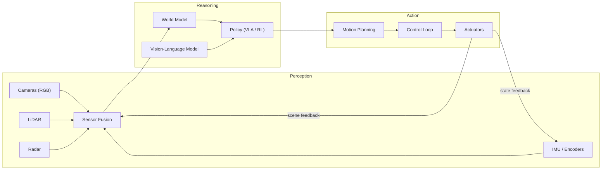
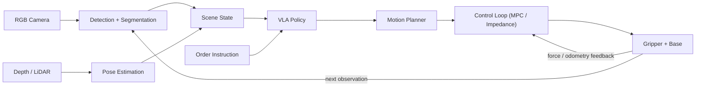

# Physical AI: A Comprehensive Guide

> **Author:** Jack Liu Shurui — Solution Architect at Cymbal Bank, Singapore
> **Context:** Technology Research — Physical AI, Embodied AI, Robotics, Humanoids, Autonomous Vehicles, World Models, Simulation
> **Repository:** [github.com/jackliusr/research](https://github.com/jackliusr/research)
> **Last Updated:** August 2026

---

## Table of Contents

1. [What Is Physical AI? — Definition and Origins](#1-what-is-physical-ai--definition-and-origins)
2. [The Physical AI Stack](#2-the-physical-ai-stack)
3. [Perception](#3-perception)
4. [World Models](#4-world-models)
5. [Simulation and Sim-to-Real](#5-simulation-and-sim-to-real)
6. [Vision-Language-Action (VLA) Models](#6-vision-language-action-vla-models)
7. [Robotics and Humanoids](#7-robotics-and-humanoids)
8. [Autonomous Vehicles and Drones](#8-autonomous-vehicles-and-drones)
9. [Hardware and Platforms](#9-hardware-and-platforms)
10. [Industry Applications](#10-industry-applications)
11. [Worked Example — A Warehouse Picking Robot](#11-worked-example--a-warehouse-picking-robot)
12. [Summary — Physical AI in One Page](#12-summary--physical-ai-in-one-page)
13. [Glossary](#13-glossary)
14. [Claims Status, References and Further Reading](#14-claims-status-references-and-further-reading)

### How to Read This Guide

This is the dedicated deep-dive on **Physical AI** — the branch of artificial intelligence whose systems *perceive, reason about, and act in the physical world* — in the `technology/` frontier-AI / embodied-AI series. It is the umbrella guide for the embodied-AI domain: robots, humanoids, autonomous vehicles, and drones, plus the models (world models, vision-language-action policies) and the simulation machinery that train them. Several sibling guides carry adjacent depth and are cross-referenced inline:

- **The software-agent contrast** — [autonomous_agents_guide.md](ai_llm/autonomous_agents_guide.md) is the umbrella for *software* agents (LLM + tools + loop, acting through APIs in digital environments). Physical AI is its mirror image: the same perception–reasoning–action loop, but the environment is the physical world and the "tools" are actuators. Read its §1.2 (the LLM-based agent definition) and §4 (control and safety) side by side with §1.4 and §2 of this guide. [llm_agent_use_cases.md](ai_llm/llm_agent_use_cases.md) covers the digital-agent use-case landscape.
- **The sensing** — [remote_sensing_technologies_guide.md](remote_sensing_technologies_guide.md) is the physics-level reference for the perception sensors Physical AI rides on: its §3.1 (optical), §3.4 (SAR radar), §3.6 (LiDAR) and §3.7 (sensor comparison) ground the sensor table in §3 of this guide. [maritime_domain_awareness_guide.md](maritime_domain_awareness_guide.md) shows the same sensors + fusion discipline applied to autonomous vessels — its §2 (sensors), §4 (fusion and analysis) and §9 (worked example) are the maritime twin of this guide's §3 and §11. [ips_rtls_guide.md](ips_rtls_guide.md) covers indoor RF positioning (the warehouse-robot localisation problem in §11). [event_stream_processing_guide.md](event_stream_processing_guide.md) §3–§4 and [complex_event_processing_guide.md](complex_event_processing_guide.md) §3 cover the real-time streaming/CEP plumbing that sensor pipelines sit on.
- **The compute** — [gpu_optimization_guide.md](gpu_optimization_guide.md) §1.5 (Tensor Cores) and §1.6 (data-center GPU lineup) cover the training hardware summarised in §9 of this guide.
- **The learning** — [reinforcement_learning_algorithms_guide.md](reinforcement_learning_algorithms_guide.md) is the algorithm-level reference for the RL half of robot learning (§7.3).

**Note on verification.** This guide was researched in August 2026. Claims are marked **Verified** (confirmed against vendor, research-paper, or reputable industry sources during research), **Reported** (widely reported but not independently confirmed), or hedged/flagged inline where sources diverge — the full claims-status table is in §14.1. Physical AI is moving at foundation-model speed; re-verify product status, shipment numbers, and market figures before procurement or investment decisions.

---

## 1. What Is Physical AI? — Definition and Origins

### 1.1 The Working Definition

> **Physical AI is the branch of artificial intelligence whose systems perceive their environment through sensors, reason about it using learned models, and act on it through actuators — closing the loop between computation and the physical world.**

Three properties separate Physical AI from everything that came before it:

1. **Embodiment** — the system has a body (a robot arm, a vehicle, a drone, a humanoid) and a position in space. Its state includes where it is, what it is touching, and what it is doing — not just a conversation context.
2. **Closed-loop interaction** — perception is continuous and reactive: the system senses, decides, acts, and senses the *result of its own action*, at control frequencies of tens to hundreds of Hertz.
3. **Physical consequence** — actions change the real world and carry real risk: a grasping error costs a dropped parcel; a control error costs a collision. This is what makes safety and simulation non-negotiable.

**Physical AI and embodied AI are near-synonyms (verified).** "Embodied AI" is the older, research-flavoured term — the field of agents with bodies that learn from interaction (embodied cognition, embodied agents). "Physical AI" is the industry-flavoured term for the same family of systems, popularised by NVIDIA from 2024 onward (see §1.2). This guide treats them as the same domain: **embodied AI** names the research tradition; **Physical AI** names the commercial, platform-building moment the field is in. The two are used interchangeably here, with "Physical AI" as the umbrella label per the series title.

### 1.2 The Term: NVIDIA and the 2024 Push

**Verified: NVIDIA CEO Jensen Huang made "Physical AI" a mainstream industry term at NVIDIA GTC 2024** (San Jose, March 2024). In the keynote and the surrounding GTC wave, Huang framed Physical AI as the next era of AI — "AI that understands the laws of physics" and can "work alongside humans" in the physical world — and announced the company's robotics/simulation stack (Isaac, Omniverse, the GR00T humanoid foundation model and the Jetson Thor chip) as the platform for building it. The framing carried through Computex 2024 and GTC 2025, where NVIDIA positioned world foundation models (Cosmos), simulation (Isaac Sim), and robot foundation models (GR00T) as the "three computers" of Physical AI: one to train the model, one to simulate the world, one to run the robot (the last is an NVIDIA-marketing framing — see §9.3).

Two honest caveats:

- The *words* "physical AI" predate NVIDIA — they appear in robotics and embodied-AI research and commentary before 2024. NVIDIA's contribution (verified) is **popularisation and platform-building**: it turned a research phrase into a named category with a hardware + simulation + foundation-model stack behind it.
- Huang's own quotes in this vein are widely reported — e.g. that AI is "leaping out into the digital world into the physical world" (paraphrased across GTC coverage, 2024–2025) and that robotics will have its "ChatGPT moment". The exact wording varies by source; treat quotes as Reported, the *category-defining event* as Verified.

### 1.3 Why Now — the Three Drivers

Physical AI is not new in ambition — the robotics dream is decades old — but it became a platform moment in 2024–2026 because three things matured at once (each verified in its own section):

| Driver | What changed | Verified anchors |
|---|---|---|
| **Foundation models** | Vision-language models learned to *output actions*, not just text: the vision-language-action (VLA) paradigm (§6) gave robots a generalisable "brain" pretrained on internet-scale data | RT-2 (Google DeepMind, Jul 2023), π0 (Physical Intelligence, Oct 2024), OpenVLA (Jun 2024) |
| **World models** | Generative models learned to *predict the future of a scene* — the "imagination" a robot needs to plan and the generator a simulator needs to be data-rich (§4) | Genie (DeepMind, Feb 2024), V-JEPA (Meta, Feb 2024), UniSim (NVIDIA, CVPR 2023), Cosmos (NVIDIA, 2025) |
| **Simulation** | GPU-accelerated physics + synthetic data made it possible to train and stress-test policies *before* they touch hardware (§5) | Isaac Sim + Isaac Lab, MuJoCo, Gazebo, domain randomization |

Add the compute substrate — GPU training (§9.2) and edge inference on Jetson-class devices (§9.1) — and the loop closes: **train in simulation, deploy on the edge, improve with real-world data, re-simulate.** That loop is the entire Physical AI playbook, and it is why the field accelerated in 2024–2026 rather than 2014–2016.

### 1.4 Physical AI vs Digital AI

The cleanest way to understand Physical AI is contrast with the AI most readers already know. The `ai_llm/` series (see [autonomous_agents_guide.md](ai_llm/autonomous_agents_guide.md) §1.2) defines the software agent as *model + tools + loop*: an LLM reasons about a goal and acts through tools (APIs, files, search) in **digital environments**. Physical AI keeps the model-plus-loop skeleton but swaps every material:

| | **Digital AI (LLM agents)** | **Physical AI (embodied agents)** |
|---|---|---|
| Environment | Digital — text, code, APIs, GUIs, databases | Physical — space, objects, forces, time |
| Interface | Tools (function calls) | Sensors + actuators (cameras, LiDAR, motors, grippers) |
| Action cost | Cheap, reversible (a tool call) | Expensive, irreversible (a collision, a dropped load) |
| Feedback | Text/status returned in ms | Continuous sensor stream at 10–100 Hz, noisy, partial |
| World model | Language statistics | Physics — geometry, dynamics, causality |
| Failure mode | Hallucinated output | Physical damage or harm |
| Safety | Guardrails on outputs | Hard limits, emergency stops, certification |

The two families converge on the *reasoning* layer — both lean on foundation models — but diverge on everything the body touches. A useful mental model: **LLM agents act in the world of information; Physical AI agents act in the world of matter.** They are complementary, not competing: the same enterprise often runs both (see §10.6), and VLA models are literally language models taught to emit actions (§6).

### 1.5 The Definition Table

| Aspect | Description |
|---|---|
| **Definition** | AI systems that perceive the physical world via sensors, reason about it with learned models, and act on it via actuators, in a closed loop |
| **Aliases** | Embodied AI (research term), Physical Intelligence (Physical Intelligence, Inc.'s name for the goal), robotics AI |
| **Term origin** | Popularised by NVIDIA / Jensen Huang at GTC 2024; older research usage exists |
| **Core property** | Embodiment — a body in space, with physical consequence of action |
| **Why now** | Foundation models (VLA) + world models + GPU simulation + edge hardware matured together, 2023–2026 |
| **Contrast** | Digital AI / LLM agents act through tools in digital environments; Physical AI acts through actuators in physical ones |
| **Domains** | Robotics (industrial, warehouse), humanoids, autonomous vehicles, drones, and adjacent autonomous machines |
| **Key platforms** | NVIDIA Isaac/Omniverse/Cosmos/GR00T, Jetson edge, Isaac Sim, MuJoCo, Gazebo (see §5, §9) |

## 2. The Physical AI Stack

Every Physical AI system — a self-driving car, a humanoid, a warehouse picker — is an instance of the same three-layer architecture: **perception → reasoning → action**, wrapped in a control loop. What differs between domains is the *embodiment* (the sensors and actuators attached to the loop), not the loop itself.

### 2.1 The Three Layers

1. **Perception** — turning raw sensor streams into a usable world state: where objects are, what they are, how the body is moving (§3).
2. **Reasoning** — deciding what to do next: predicting the future (world models, §4), choosing actions under a goal (policies — VLA models, §6, or RL/classical planners, §7.3).
3. **Action** — executing the decision: motion planning, control at high frequency, actuation of motors and grippers (§11.4).

The loop is what makes it AI rather than automation: perception is *reactive* (the robot sees the box shift and re-grasps), reasoning is *predictive* (it anticipates the shelf), and action is *corrective* (it re-plans when the world disagrees).

### 2.2 The Perception Layer

The eyes of Physical AI are the sensor families detailed in the repo's sensing guides ([remote_sensing_technologies_guide.md](remote_sensing_technologies_guide.md) §3 for the physics, [maritime_domain_awareness_guide.md](maritime_domain_awareness_guide.md) §2 for the same sensors in a fusion system):

- **Cameras (RGB)** — dense colour and texture; cheap, ubiquitous; the backbone of object detection and segmentation (§3.2). Cross-ref remote sensing §3.1 (optical).
- **Depth cameras / stereo** — per-pixel distance (structured light, time-of-flight, stereo disparity); the workhorse of manipulation.
- **LiDAR** — active laser ranging, precise 3D point clouds at tens of metres; the backbone of autonomous vehicles and mapping/SLAM. Cross-ref remote sensing §3.6.
- **Radar** — radio ranging + Doppler velocity; weather-robust and long-range; complements cameras and LiDAR, especially in rain/dust. Cross-ref remote sensing §3.4 (SAR is the satellite cousin).
- **IMU + odometry** — proprioception: acceleration, angular rate, wheel/leg/joint encoders; the body's own sense of motion, fused with exteroception for localisation.
- **Microphones / force-torque / tactile** — the long tail: audio events, contact forces, and touch for dexterous manipulation.

The key architectural fact: **no single sensor is sufficient** — cameras fail at night, LiDAR fails in fog, radar is sparse, IMUs drift. Perception in Physical AI is therefore *fusion* (§3.1), not single-sensor perception.

### 2.3 The Reasoning Layer

The decision layer has three increasingly AI-heavy components:

1. **World models** (§4) — learned predictors of how the scene evolves: "if I push this box, it slides that way." Used for planning (imagine-then-choose) and for generating training data in simulation.
2. **Foundation models** — vision-language models that ground instructions in the scene ("pick the *red* mug") and, as VLA models (§6), emit actions directly. This is the layer where the LLM revolution physically materialised.
3. **Policies** — the mapping from state to action. Three flavours coexist: **learned** (RL or imitation-trained neural policies, §7.3), **VLA** (foundation-model policies, §6), and **classical** (model-predictive control, sampling-based motion planners — still the safety backbone in production, §11.4).

The trend (verified, 2024–2026) is that the boundary between these is dissolving: VLA models increasingly *contain* the world model and the policy in one neural net, with classical planners kept as the safety wrapper underneath.

### 2.4 The Action Layer

The output side of the loop: **planning** (choose a trajectory that avoids obstacles and satisfies the goal), **control** (convert the trajectory into motor commands at high frequency — PID, MPC, impedance control), and **actuation** (motors, hydraulic actuators, grippers, thrusters — the body). Two defining constraints:

- **Latency** — a humanoid balancing or a car braking cannot wait for a cloud round-trip; the perception–action loop runs on the *edge* at 10–100+ Hz (§9.1). This is why Jetson-class devices exist.
- **Safety** — physical consequence means every action layer carries hard limits: joint torque caps, velocity ceilings, emergency stops, and control authorities that outrank the learned policy (§11.7).

### 2.5 The Stack Diagram



### 2.6 The Stack Table

| Layer | Functions | Technologies | Examples |
|---|---|---|---|
| **Perception** | Sensing, localisation, object/scene understanding | Cameras, LiDAR, radar, IMU, depth; detection/segmentation/SLAM models (§3) | Robot arm camera+force-torque stack; AV sensor suite; drone gimbal camera |
| **Reasoning** | Prediction, decision-making, instruction grounding | World models (§4), VLA/LLM policies (§6), RL policies (§7.3) | Genie/V-JEPA/UniSim; RT-2/π0/OpenVLA; model-predictive control |
| **Action** | Planning, control, actuation | Trajectory planners, MPC/PID/impedance controllers, motors/grippers/thrusters | 7-DoF arm trajectory; vehicle steering/brake; drone rotor control |

## 3. Perception

### 3.1 Sensor Fusion

**Verified: production Physical AI perception is multimodal fusion, not single-sensor vision.** The canonical argument is the autonomous-vehicle sensor stack (see §8): cameras give dense semantics ("that is a pedestrian"), LiDAR gives precise geometry ("the pedestrian is at (x, y, z)"), radar gives robust velocity and weather resilience ("the pedestrian is moving at 1.2 m/s, even in rain"), and the IMU gives the ego-motion that lets all three be registered into one world frame. The same pattern — with different sensor mixes — repeats in warehouse robots (camera + LiDAR + wheel odometry), drones (camera + IMU + GNSS), and maritime systems (see [maritime_domain_awareness_guide.md](maritime_domain_awareness_guide.md) §4, which covers the same fusion discipline for AIS + radar + EO).

Fusion happens at three levels, in increasing sophistication:

1. **Sensor level** — raw streams aligned in time and registered in space (calibration), then combined (e.g., LiDAR points projected into camera pixels for colourised point clouds).
2. **Feature/object level** — each sensor runs its own detector; tracks are associated and merged (Kalman-filter or deep-tracking fusion).
3. **Decision level** — independent per-sensor decisions vote or are arbitrated by a higher-level reasoner.

The 2024–2026 trend (emerging) is **end-to-end learned fusion**: one neural network consumes all raw sensor streams and outputs the world state directly, displacing hand-built pipelines — at the cost of explainability, which matters where safety certification is required (§11.7).

### 3.2 Perception Models

The learned models that turn sensor streams into state (all verified as standard 2023–2026 practice):

- **Object detection** — bounding boxes + classes per frame (YOLO family, DETR/DEtection TRansformer variants). The entry point of almost every pipeline.
- **Semantic / instance / panoptic segmentation** — pixel-level class labels (semantic), per-object masks (instance), or both (panoptic). Segment Anything (Meta, 2023) made segmentation promptable and foundation-model-like.
- **Depth estimation** — metric depth from stereo or learned monocular depth; the geometry layer for grasping.
- **3D detection and pose estimation** — object position + orientation (6-DoF pose) from point clouds or RGB-D; the input every grasp planner needs.
- **SLAM — Simultaneous Localisation and Mapping** — the robot builds a map of an unknown environment while tracking its own pose inside it (visual SLAM: ORB-SLAM; LiDAR SLAM: LOAM/FAST-LIO; learned: DROID-SLAM). Verified as the standard localisation primitive; cross-ref [ips_rtls_guide.md](ips_rtls_guide.md) §3 for the indoor-RF alternative and its positioning techniques.
- **Tracking and prediction** — multi-object tracking across frames plus motion prediction ("where will that agent be in 3 seconds?") — the bridge from perception to planning (§8).

### 3.3 Perception Platforms

Perception is increasingly shipped as *platform* rather than bespoke code:

- **AV-grade stacks** — e.g. the Waymo Driver's long/medium-range LiDAR + camera + radar suite, or NVIDIA DRIVE's camera-centric reference stacks (§8.2).
- **Robot sensor heads** — integrated camera + depth + IMU modules (Intel RealSense, Orbbec) plus force-torque sensors at the wrist, the standard manipulation configuration.
- **Edge AI modules** — Jetson-family modules (AGX Orin, Orin Nano Super; AGX Thor from 2025) run the perception models on-robot at the required latency (§9.1).
- **Fusion frameworks** — NVIDIA Isaac ROS (perception nodes + fusion), ROS 2 with `tf2` transforms, and deep-fusion toolkits.

### 3.4 The Perception Table

| Sensor | Data produced | Physical AI use case |
|---|---|---|
| **RGB camera** | 2D colour frames | Detection, segmentation, scene semantics, traffic-light reading |
| **Depth camera / stereo** | Per-pixel distance | Grasp geometry, obstacle avoidance, collision checks |
| **LiDAR** | 3D point cloud (10–100 m) | High-precision mapping, SLAM, AV environment model |
| **Radar** | Sparse range + Doppler velocity | Velocity estimation, all-weather detection, blind-spot monitoring |
| **IMU** | Acceleration + angular rate | Ego-motion, stabilisation, dead reckoning between fixes |
| **GNSS** | Global position fix | Outdoor localisation (AVs, drones) — see [ips_rtls_guide.md](ips_rtls_guide.md) for indoor analogues |
| **Encoders / odometry** | Joint and wheel positions | Body state, locomotion, wheel slip detection |
| **Force-torque / tactile** | Contact forces | Dexterous grasping, assembly, human-robot contact safety |
## 4. World Models

### 4.1 The Concept

A **world model** is a learned model of how an environment behaves: given a scene state (and often an action), it predicts the future — the next frames, the next object poses, the consequences of a push or a turn. Where a *simulator* encodes physics as equations (mass, friction, contact — §5), a world model *learns* the physics from data. The concept has deep roots (internal models, model-based RL, the 2018 "World Models" paper by Ha & Schmidhuber) and became a headline technology in 2024–2026 because generative video models got good enough to serve as learned physics engines. Yann LeCun's argument (verified as a widely-reported position) is that *predictive world models are the core of intelligent behaviour*: an agent that can imagine outcomes can plan without trial-and-error in the real world — the "crystal ball" every Physical AI system needs.

Three properties define a useful world model for Physical AI:

1. **Predictive** — it forecasts what happens next (frames, states, or latent representations).
2. **Interactive** — it accepts actions/conditions as input, so "what if I do X?" can be answered.
3. **Scalable** — it learns from unlabelled internet-scale video, not hand-labelled robot data.

### 4.2 The World Model Systems

**Genie — Google DeepMind (verified).** Introduced February 2024 (arXiv:2402.15391), Genie is a generative *interactive* environment: a spatiotemporal-transformer world model trained **unsupervised on unlabelled internet videos** that generates playable 2D worlds — including the latent "action" that drives each frame, inferred without any labels. It demonstrated that action-conditional world models can be learned at scale from video alone. Genie 3 (August 2025, verified) extended this to a general-purpose world model generating diverse, real-time-interactive environments (~24 fps) from text prompts — a direct foundation for embodied-agent training.

**V-JEPA — Meta (verified).** Released February 2024, V-JEPA (Video Joint-Embedding Predictive Architecture, the video successor to LeCun's JEPA line) learns world dynamics **by predicting missing or future information in latent space**, self-supervised on unlabelled video — not by regenerating pixels. The point of predicting in latent space is efficiency and abstraction: the model learns *what matters* (object motion, occlusion, physics) without wasting capacity on pixel reconstruction. V-JEPA 2 (2025) scaled the recipe further, with Meta positioning it for robot action prediction. Verified as a core reference point for the "predictive latent world model" school.

**UniSim — NVIDIA (verified, with a naming note).** UniSim (arXiv:2308.01898, CVPR 2023) is NVIDIA's **neural closed-loop sensor simulator**: it takes a single recorded driving log and converts it into a realistic, closed-loop multi-sensor simulation (camera + LiDAR + radar) that an autonomous-driving stack can be tested against interactively — the vehicle reacts, the simulated world reacts back. It is the sensor-level cousin of the generative world models above. *Naming note:* NVIDIA subsequently used "UniSim" as the name of its unified robotics-simulation offering in the 2025 Isaac stack (Reported) — the 2025 product and the 2023 research paper share the name but are different artifacts; the paper is what is described here.

**Cosmos — NVIDIA (verified).** Announced at CES 2025 and GTC 2025, Cosmos is NVIDIA's family of **world foundation models** purpose-built for Physical AI: generative video models that produce physically consistent scene trajectories and synthetic environments, explicitly designed to feed robot-learning pipelines and augment Isaac Sim synthetic data (§5.4). Cosmos is the clearest statement of the commercial thesis that *world models are the data generator for Physical AI*.

### 4.3 World Models in the Physical AI Loop

World models plug into the §2 stack in three roles:

1. **Planning** — model-predictive control with a learned model: the policy *imagines* the outcomes of candidate action sequences (in latent space or as video) and picks the one whose predicted future best matches the goal. This is how a robot can reason "if I push this box that way, it tips" without a hand-written physics rule.
2. **Simulation / data generation** — world models synthesise the training data (§5.4) and serve as infinitely re-rollable test environments, complementing physics-based simulators (which are exact but brittle) with learned realism (which is flexible but approximate).
3. **Representation** — the world model's internal representation is the state the policy reasons over, replacing hand-engineered state vectors.

The honest caveat (verified as an open problem, flagged): learned world models are *not yet* trustworthy enough for safety-critical closed-loop use on their own — they hallucinate physics in edge cases, and production systems still wrap them in physics-based simulators and hard safety layers (§11.7). The research direction — world models accurate enough to *replace* physics simulators — is one of the most active in the field.

### 4.4 The World Model Table

| Model | Org | Capability | Year |
|---|---|---|---|
| **Genie** | Google DeepMind | Generative interactive 2D worlds from unlabelled video; Genie 3: real-time interactive world generation from text | 2024 / 2025 |
| **V-JEPA** | Meta | Latent-space self-supervised video prediction for world dynamics; V-JEPA 2 scales the recipe | 2024 / 2025 |
| **UniSim** | NVIDIA | Neural closed-loop multi-sensor (camera/LiDAR/radar) simulator from a single driving log | CVPR 2023 |
| **Cosmos** | NVIDIA | World foundation models generating physically consistent video/scene trajectories for robot learning | 2025 |
| **World Models** (Ha & Schmidhuber) | NNAISENSE | Foundational "dream" + "controller" world-model paper that named the paradigm | 2018 |

## 5. Simulation and Sim-to-Real

### 5.1 Why Simulate

Physical AI cannot be trained the way LLMs are: real-world interaction is slow (a robot grasp takes seconds), expensive (hardware, people, facilities), dangerous (collisions, falls), and hard to label at scale. Simulation answers with **speed, safety, and scale**: a GPU cluster can run a million parallel simulated training episodes overnight, including failures that would destroy hardware or harm people in reality. Verified: simulation-first training is now the industry default — every major player (NVIDIA Isaac, Google DeepMind, Figure, Tesla, and the VLA labs) trains or pre-trains policies in simulation before touching real robots (§11.8).

### 5.2 Sim-to-Real Transfer (sim2real)

The central problem of simulation is the **reality gap**: simulated physics, sensors, and visuals never match the real world exactly, and policies trained in simulation exploit the sim's quirks. Verified approaches to closing the gap:

- **Domain randomization** — randomise physics parameters (friction, mass, lighting, textures, sensor noise) across training episodes so the policy learns the *invariant* behaviour that works across all variations, including reality. The single most successful sim2real workhorse (pioneered for drone and manipulator transfer, ~2017–2018, and standard ever since).
- **System identification** — calibrate the simulator to the real robot's measured dynamics (actuator models, latency, friction) so the gap shrinks at the source.
- **Domain adaptation / distillation** — perception models trained on synthetic imagery are adapted to real imagery (or the sim's rendering is made photorealistic via neural rendering) so the sim's *visual* distribution matches reality; policies then transfer because what the policy sees looks right.
- **Progressive / hybrid training** — pre-train in sim, fine-tune on a modest amount of real data (the dominant recipe for VLA models, §6.3).

Verified industry result (Reported, widely cited): Amazon, NVIDIA and the major robot labs report policies trained in simulation transferring to real deployment successfully when the sim2real pipeline (randomization + calibration + real fine-tuning) is done properly — while naive sim-trained policies fail in the real world. Sim2real is a *discipline*, not a toggle.

### 5.3 The Simulation Platforms

**NVIDIA Isaac Sim (verified).** Built on NVIDIA Omniverse, Isaac Sim is a GPU-accelerated, physics-based simulation platform for designing, training, and testing robots — photorealistic rendering, rigid-body physics, sensor simulation (cameras, depth, LiDAR, IMU), and synthetic-data generation (§5.4). **Isaac Lab** (verified), built on Isaac Sim, is the RL/learning framework (reinforcement learning, learning from demonstrations, motion planning) that most Isaac-based robot learning runs through. Isaac Sim is the de-facto platform for the NVIDIA Physical AI stack (GR00T humanoid training, Cosmos data pipelines).

**MuJoCo (verified).** "Multi-Joint dynamics with Contact" — a free, open-source physics engine developed at DeepMind (open-sourced 2022, Apache-2.0) and one of the most widely used simulators in RL research. It optimises for *fast, accurate contact-rich dynamics* (the physics of touching, pushing, grasping — exactly the regime manipulation lives in) and is the workhorse behind DeepMind's robotics research and countless RL benchmarks.

**Gazebo (verified).** The classic open-source robot simulator of the ROS ecosystem (developed under the Open Source Robotics Foundation); sensor-rich, plugin-based, and the default simulation target for ROS-based robots — widely used in research and education, with Isaac Sim increasingly preferred for GPU-accelerated photorealistic training.

**Unity / Unreal (verified as general engines used in robotics).** Game engines are used for high-fidelity *visual* simulation and synthetic data (especially for perception models) and, via physics plugins, as robot simulators in consumer/entertainment-adjacent applications. Less standard for contact-rich control than MuJoCo/Isaac, more standard for photorealistic data.

### 5.4 Synthetic Data

Simulation's second product is **synthetic data**: labelled imagery and sensor streams generated at will — every pixel comes with ground-truth depth, pose, and class labels for free, and the data distribution can be shaped to cover rare events (night, fog, adversarial object poses) that are expensive to collect in reality. Verified anchors:

- NVIDIA's Isaac Sim + Cosmos pipeline generates synthetic data for perception and robot learning at scale; Isaac ROS includes the data-generation tooling.
- **Open X-Embodiment** (verified, 2023): a cross-institution dataset of ~1M+ robot episodes across 20+ embodiments (with RT-X models trained on it) — the field's largest *real* robot dataset, which the sim-first paradigm complements rather than replaces.
- Industry practice (Reported): AV companies and robot labs report the majority of their training data is now synthetic or sim-generated — real data is reserved for fine-tuning and validation. Flag: exact ratios vary by company and are not publicly auditable.

### 5.5 The Simulation Table

| Platform | Use case | Key features |
|---|---|---|
| **Isaac Sim** | GPU-accelerated robot training, synthetic data, AV/robot testing | Omniverse-based, photorealistic, sensor simulation, Isaac Lab RL framework |
| **MuJoCo** | Contact-rich RL research, manipulation/locomotion | Fast accurate contact dynamics, open-source, DeepMind |
| **Gazebo** | ROS-based robot development, education | Open-source, plugin ecosystem, standard ROS integration |
| **Unity / Unreal** | Photorealistic synthetic data, perception training | Game-engine rendering, sensor pipelines, physics plugins |
| **UniSim (neural)** | Closed-loop sensor simulation for AV evaluation | Learned multi-sensor reality from recorded logs (§4.2) |

## 6. Vision-Language-Action (VLA) Models

### 6.1 The Concept

A **vision-language-action model (VLA)** is a foundation model that takes **vision** (images/point clouds) and **language** (an instruction) as input and outputs **actions** (joint targets, end-effector poses, motor commands) — usually expressed as action *tokens* in the model's output vocabulary. The paradigm shift, established by Google's RT-2 (verified): instead of training a robot policy from scratch, take a web-scale vision-language model and *co-fine-tune it on robot action data* — the robot then inherits the VLM's semantic knowledge ("pick the extinct animal" → a novel object is recognised and grasped, because the model knows what extinct animals look like). The VLA family is the "foundation model" pillar of the Physical AI stack (§2.3): one pretrained network, many embodiments, language as the universal task interface.

### 6.2 The VLA Systems

**RT-2 — Google DeepMind (verified).** Robotics Transformer 2, July 2023: the first VLA to demonstrate web-scale VLM knowledge transferring to robotic control. Trained by co-fine-tuning a large VLM (PaLI-X / PaLM-E lineage) on robotic trajectories, RT-2 outputs action tokens and showed emergent semantic and visual reasoning on unseen objects and tasks (e.g., generalising "pick up the extinct animal" to a dinosaur toy). It directly established the "robot as chat" training recipe that the field now uses.

**π0 (pi-zero) — Physical Intelligence (verified).** October 2024: a general-purpose robot foundation model from Physical Intelligence (the startup co-founded by former Google DeepMind RT-series researchers, including Sergey Levine). π0 uses a **flow-matching** action-generation head on top of a pretrained vision-language backbone and was trained across multiple robot embodiments (arms, mobile manipulators, a dual-arm), demonstrating long-horizon dexterous tasks — folding laundry, clearing tables, packing boxes — from natural-language instructions. π0's weights and training code were open-sourced (the `openpi` repo, verified), and the company's stated mission is literally "artificial physical intelligence" — the same term as this guide's domain. π0-FAST (2025) and successors scale the recipe; Physical Intelligence has also shipped commercial deployments (Reported, 2025–2026) with partners like 1X.

**OpenVLA — Stanford / UC Berkeley / Google / CMU et al. (verified).** June 2024: the open-source VLA reference. A 7B-parameter model (fine-tuned from a Llama-2-7B VLM) trained on **970k robot episodes from Open X-Embodiment**, it set the state of the art for open generalist manipulation policies and became the default baseline/fine-tuning starting point for academic and startup robotics alike (fine-tuning notebooks + checkpoints released).

The wider ecosystem (verified, flagged as fast-moving): NVIDIA's **GR00T** humanoid foundation model family (2024–2025, trains on Cosmos-generated data, runs on Jetson Thor), Figure's in-house **Helix** VLA (Feb 2025, after ending its OpenAI partnership — §7.2), Tesla's end-to-end neural nets for Optimus, and Chinese labs (e.g., AgiBot's GO-1, 2025 — Reported). The landscape consolidates monthly; treat the table in §6.4 as a snapshot.

### 6.3 VLA Training

The verified standard recipe has three stages:

1. **Pretrain a VLM** on web-scale image-text data (or reuse one) — this is where the model learns semantics: what objects are, what instructions mean.
2. **Co-fine-tune on robot data** — mix in trajectories (state + images + actions) from one or many embodiments (Open X-Embodiment is the canonical multi-robot corpus), teaching the model to emit action tokens conditioned on vision + language.
3. **Embodiment-specific fine-tuning** — a small amount of data from the *target* robot (sometimes sim-generated, §5) adapts the generalist to the specific kinematics and sensor rig.

Key technique notes (verified): actions are discretised into tokens (RT-2) or generated via **flow matching** (π0); training is typically done in simulation plus modest real data (§5.2 progressive training); and a standing open problem (flagged) is **data hunger** — generalist robot data remains scarce compared to internet text, which is why simulation, world models, and cross-embodiment sharing (Open X-Embodiment) are all pointed at the same bottleneck.

### 6.4 The VLA Table

| Model | Org | Capability | Year |
|---|---|---|---|
| **RT-2** | Google DeepMind | First web-scale VLA; VLM knowledge → robot control; emergent semantic reasoning | 2023 |
| **π0 (pi-zero)** | Physical Intelligence | Generalist multi-embodiment VLA with flow-matching actions; dexterous long-horizon tasks; open-sourced (openpi) | 2024 |
| **OpenVLA** | Stanford / Berkeley / Google / CMU | Open-source 7B VLA trained on 970k Open X-Embodiment episodes; the standard open baseline | 2024 |
| **GR00T** | NVIDIA | Humanoid foundation-model family; trained with Cosmos world-model data; runs on Jetson Thor | 2024–2025 |
| **Helix** | Figure AI | In-house VLA controlling Figure humanoids end-to-end (post-OpenAI partnership) | 2025 |

## 7. Robotics and Humanoids

### 7.1 Industrial Robotics

Industrial robotics is Physical AI's most mature domain (verified): millions of industrial robots are deployed worldwide (IFR-reported ~4.2M operational units in 2023 — Reported, flag exact figure), and the 2024–2026 shift is from *programmed* automation to *perceived* automation: robots that see, adapt, and learn rather than replay fixed paths. The two anchor segments:

- **Manufacturing** — welding, painting, assembly, machine tending by 6-axis arms (FANUC, KUKA, ABB, Yaskawa); the classic market, now being retrofitted with vision + AI for flexible small-batch work.
- **Warehouse / logistics** — the fastest-growing segment (verified): autonomous mobile robots (AMRs) for transport, robotic arms for picking and palletising, and the mega-deployments by Amazon (§10.2). Flag: exact warehouse-robot market sizing is divergent across analysts — see §14.1.

The technical enabler (verified) is the same stack as §2: perception (3D vision + force sensing) makes arms *compliant* (they can insert, assemble, and handle variability), and learning (§7.3) replaces manual path programming.

### 7.2 The Humanoids

Humanoids — general-purpose, two-legged, two-armed robots shaped for human environments — are Physical AI's flagship product category, and 2024–2026 is the phase change from lab demos to paid pilots (verified as a sector-wide trend; individual claims flagged).

**Figure (Figure AI) (verified).** Figure 01 (2024) became the category's viral moment with an OpenAI-partnered demo (natural-language conversational manipulation). February 2025: Figure **ended the OpenAI partnership** and shipped **Helix**, its in-house VLA (verified) — the "own the whole stack" strategy. Figure 02/03 followed, and by 2025–2026 Figure reported early commercial deployments (BMW pilot — Reported) and its BotQ factory producing humanoids at scale (a unit every ~90 minutes — Reported, 2026). Status: commercial pilots, not mass deployment.

**Tesla Optimus (verified, status flagged).** Announced 2021 (the "Tesla Bot" concept), with successive prototypes (Optimus Gen 1 2022, Gen 2 2023, Gen 3 demos 2025–2026). Tesla positions Optimus as a general-purpose humanoid for factory work first (internal Tesla plant use) and domestic use later, leveraging Tesla's FSD neural-net and manufacturing expertise. Status (flagged): still largely demonstration/limited internal deployment stage as of early 2026 — Tesla's mass-production claims are forward-looking and unverifiable.

**Unitree (verified).** The Chinese legged-robotics leader (quadrupeds first: Go1, B2; then humanoids). **H1** (2023) was among the first commercially shipped full-size humanoids; **G1** (2024, ~US$16k) brought a capable humanoid into commodity price range — verified as one of the few humanoids you can actually buy today. Unitree's humanoids gained global attention with agility demos (backflips, the 2025 Spring Festival Gala dance — Reported) and China's push toward mass humanoid production (10k–20k+ unit shipment targets — Reported, flagged). Status: commercially purchasable, high-volume ambitions, ecosystem still young.

The wider field (verified as crowded, individual numbers Reported): Boston Dynamics (electric Atlas, pilots with Hyundai), Agility Robotics (Digit, paid warehouse work at GXO and Toyota — Reported), 1X (NEO, with Physical Intelligence π0-based software), Sanctuary AI, and a fast-growing Chinese cohort (Ubot, Fourier, AgiBot). Global humanoid deployment numbers in 2026 are small (thousands, not millions — flagged as indicative); the consensus trajectory (opinion) is "factories first, services next, homes last".

### 7.3 Robot Learning

The learning methods that give robots their policies (cross-ref [reinforcement_learning_algorithms_guide.md](reinforcement_learning_algorithms_guide.md) for the algorithm-level deep dive):

- **Reinforcement learning (RL)** — the robot learns by trial and error against a reward function. In Physical AI, RL is almost always run *in simulation* (§5) because of the episode cost; sim-to-real transfer (§5.2) then carries the policy to hardware. Verified examples at scale: dexterous in-hand manipulation (OpenAI/DeepMind), locomotion (anymal, Cassie/Digit), and controller tuning.
- **Imitation learning** — the robot learns from demonstrations: behaviour cloning (supervised learning on teleoperated or recorded trajectories) and diffusion policies (demonstration-conditioned generative policies — a 2023–2025 breakthrough for fine-grained manipulation, verified). Humanoid and VLA pipelines (§6) are dominated by imitation data.
- **Hybrid** — pretrain by imitation, refine by RL (the recipe behind most dexterous demos; verified as standard practice).

### 7.4 The Robotics Table

| Robot | Maker | Capability | Status (Aug 2026) |
|---|---|---|---|
| **Figure 01 / 02 / 03** | Figure AI | Bipedal humanoid; natural-language manipulation; Helix VLA autonomy | Commercial pilots (BMW et al. — Reported); BotQ mass-production ramp |
| **Tesla Optimus** | Tesla | General-purpose humanoid for factory/domestic work | Prototype/demo stage; limited internal use (flagged) |
| **Unitree G1 / H1** | Unitree | Commercially sold humanoids; agility demos; ~US$16k entry | Purchasable today; mass-production targets (Reported) |
| **Atlas (electric)** | Boston Dynamics | Industrial humanoid; Hyundai pilots | Pilot stage |
| **Digit** | Agility Robotics | Warehouse logistics humanoid | Paid deployments (GXO, Toyota — Reported) |
| **NEO** | 1X | Consumer/security humanoid | Pilots; π0-based autonomy (Reported) |
| **Industrial arms** | FANUC / KUKA / ABB | 6-axis manufacturing arms, now vision+AI-enabled | Mature, ubiquitous |

## 8. Autonomous Vehicles and Drones

### 8.1 Autonomous Driving — Perception to Control

Self-driving is the largest-scale Physical AI deployment on Earth (verified): the perception-to-control loop of §2 instantiated at car scale. The stack (verified, standard formulation):

1. **Perception** — the multi-sensor suite (§3.1): cameras for semantics, LiDAR for geometry, radar for all-weather velocity, IMU+GNSS for ego pose; fused into a 3D world model of agents, lanes, and obstacles.
2. **Prediction & planning** — track other agents, predict their trajectories (motion forecasting models), then plan a safe, comfortable trajectory (rule-based safety envelopes + learned components).
3. **Control** — steering/throttle/brake commands executed at 10–100 Hz, with hard safety monitors (AEB — automatic emergency braking) that outrank the AI driver.

Verified milestone context: **Waymo** runs the leading US robotaxi service (Phoenix, San Francisco, LA; fully driverless, tens of millions of miles driven — Reported exact figures vary; ~100k+ paid weekly trips reported 2025 — flagged as Reported). **Tesla FSD** pursues the camera-only, end-to-end neural-network approach (no LiDAR — a verified and contested design bet). **China** (Baidu Apollo/萝卜快跑 in Wuhan and others) has the world's largest robotaxi operating areas (Reported, flagged). The 2024–2026 trend (emerging) is end-to-end learned driving — one network from sensors to control — displacing modular stacks, with Waymo/Tesla/Chinese players each at different points on that spectrum.

### 8.2 The AV Stacks (flagged)

AV stacks are commercially sensitive and change quarterly; treat this as a snapshot with verified anchors and flagged specifics:

| Stack | Approach | Verified anchor | Status (flagged) |
|---|---|---|---|
| **Waymo Driver** | Camera + LiDAR + radar, modular + learned; Level 4 robotaxi | Driverless service in Phoenix/SF/LA; Waymo One | Operating commercially (US) |
| **Tesla FSD** | Vision-only, end-to-end neural nets; Level 2/3 supervised | FSD v12+ single-network steering | Widespread supervised FSD; robotaxi ambitions unproven |
| **NVIDIA DRIVE** | Reference platform: Orin/Thor compute + CUDA/DriveOS + sensor stacks | Verified platform; partners across OEMs/robotaxis | Licensing/platform play |
| **Mobileye** | Camera-first, mapping-light, REM crowdsourcing; ADAS→AV | Verified; OEM ADAS dominant | ADAS volume; robotaxi (MaaS) ambitions |
| **Baidu Apollo / 萝卜快跑** | Full stack, LiDAR-inclusive; robotaxi ops | Wuhan large-scale robotaxi ops (Reported) | Operating commercially (China) |

Key honest flags: "Level 4 vs Level 2/3" classifications are vendor-reported; crash/incident statistics are contested and regulatory investigations are ongoing in both the US and China (verified as an active topic, specifics evolving); and no AV stack is certified for *unrestricted* operation anywhere as of 2026 (verified — all deployments are geographically/conditionally scoped).

### 8.3 Drones (UAVs)

Drones are Physical AI's lightest, cheapest, most numerous embodiment (verified): perception (camera + IMU + GNSS), onboard edge compute, and learned/classical control in a package that costs hundreds to thousands of dollars. Anchor use cases:

- **Delivery** — medical (Zipline's blood-delivery network in Rwanda/Ghana — verified; Wing/Google's commercial drone delivery — verified; US FAA Part 135 approvals), and last-mile parcel trials globally.
- **Inspection & mapping** — energy infrastructure, construction, agriculture; the photogrammetric/LiDAR payloads that feed the remote-sensing pipelines of [remote_sensing_technologies_guide.md](remote_sensing_technologies_guide.md) §2.2 (aerial platforms).
- **Agriculture** — crop monitoring and spraying (DJI Agras — verified as the category's commercial leader; cross-ref remote sensing §6 for the EO twin).
- **Defence/counter-UAS** — military drones and detection systems (verified as a fast-growing category; specifics classified).

The technical trajectory (verified): autonomous beyond-visual-line-of-sight (BVLOS) flight with onboard detect-and-avoid is the frontier; most commercial operations still require remote pilots, and regulation (FAA, EASA, CAAS in Singapore) is the binding constraint, not the AI.

### 8.4 The AV Table

| Domain | Stack | Status (Aug 2026) |
|---|---|---|
| **Robotaxi (US)** | Waymo Driver: LiDAR+cam+radar, L4 | Operating driverless service, multiple cities (Reported scale) |
| **Robotaxi (China)** | Baidu Apollo / 萝卜快跑 | Large-scale ops in Wuhan, expanding (Reported) |
| **Consumer ADAS** | Tesla FSD (vision-only e2e), Mobileye | Deployed at scale as supervised systems; L3/L4 claims contested |
| **Trucks / freight** | Aurora, Kodiak, TuSimple (survivors) | Pilot corridors, supervised (flagged) |
| **Delivery drones** | Zipline, Wing, DJI | Commercial medical/parcel ops, regulated BVLOS expansion |
| **Inspection drones** | DJI + software platforms | Mature commercial market |
| **Maritime autonomy** | See [maritime_domain_awareness_guide.md](maritime_domain_awareness_guide.md) §8 | Coastal/pilot autonomy; watchkeeping assistance |

## 9. Hardware and Platforms

### 9.1 Edge AI — the Jetson Family (verified)

Physical AI's latency constraint (§2.4) — the perception→action loop must run on the body, not in the cloud — is what the NVIDIA **Jetson** edge-AI family exists for (verified):

- **Jetson Orin family** — AGX Orin (275 TOPS-class, for full robot perception + fusion + local VLA inference), Orin NX/Orin Nano (smaller robots, smart cameras), and the **Orin Nano Super** developer kit (palm-sized generative-AI supercomputer, ~$249-class, verified 2025) — the standard entry point for robot edge AI.
- **Jetson AGX Thor** (verified, 2025) — the flagship edge superchip positioned explicitly for **Physical AI and humanoid robots**: 1000+ TOPS-class, designed to run multimodal foundation models (VLA/GR00T-class) on-robot in real time.

The platform story (verified): Jetson ships with the software stack — Isaac ROS (accelerated perception), TensorRT (inference optimisation — see [gpu_optimization_guide.md](gpu_optimization_guide.md) for the optimisation toolbox), and JetPack SDK — so a robot's perception+VLA inference runs at control-loop latency on-robot. Competitors exist (Qualcomm Robotics RB5/RB6, Hailo, Intel), but Jetson is the de-facto default in robotics (opinion, widely observed).

### 9.2 Training Hardware (verified; cross-ref [gpu_optimization_guide.md](gpu_optimization_guide.md))

Physical AI training runs on the same data-centre GPUs as LLM training (§1.5–§1.6 of the GPU guide), with domain specifics:

- **Training GPUs** — NVIDIA H100/H200 (and B200/GB200, Rubin-class in 2025–2026) for pretraining world models and VLA models; the compute-scaling story mirrors the LLM era.
- **Simulation compute** — the same GPUs accelerate physics (Isaac Sim) and world-model generation (Cosmos); simulation is a *GPU-native* workload, which is why NVIDIA's sim stack and its hardware business reinforce each other.
- **Inference at the edge** — Jetson (§9.1) and automotive-grade compute (NVIDIA DRIVE Orin/Thor) for deployed models, with TensorRT/fp8 quantization trimming models to fit power envelopes (cross-ref the GPU guide's optimization sections).
- **Non-NVIDIA options (flagged)** — Google TPUs/`tpu-mlir`, AMD MI300/MI350 (ROCm), Groq/LPUs for inference; robotics training is NVIDIA-dominant in practice but not exclusive.

### 9.3 The Platforms (verified)

The commercial platform layer that binds the stack together — all NVIDIA, all verified as of 2025–2026:

- **Isaac** — the umbrella: Isaac Sim (simulation, §5.3), Isaac Lab (RL framework), Isaac ROS (accelerated perception/fusion nodes), Isaac Manipulator & Isaac Perceptor (manipulation/perception reference stacks).
- **Omniverse** — the 3D-simulation/RTX backbone Isaac Sim runs on (physically based rendering, USD scene format).
- **Cosmos** — world foundation models for synthetic data and world modelling (§4.2).
- **GR00T** — humanoid foundation models + the GR00T Blueprint (data pipelines: teleop capture → Cosmos augmentation → Isaac Sim training → Jetson Thor deployment — the full NVIDIA "three computers" recipe, verified in NVIDIA's published workflow).
- **DRIVE** — the automotive twin: DRIVE Orin/Thor hardware + DriveOS + reference AV stacks (§8.2).

For a bank or enterprise architect (context: this guide's author): the platform takeaway is that Physical AI has consolidated around *one* dominant full-stack vendor (NVIDIA) the way digital AI consolidated around the hyperscaler clouds — a single-vendor dependency risk worth modelling (§14.1).

### 9.4 The Hardware Table

| Hardware | Purpose | Examples |
|---|---|---|
| **Training GPUs** | Pretrain world models / VLA / sim | NVIDIA H100/H200, B200/GB200, Rubin-class (see [gpu_optimization_guide.md](gpu_optimization_guide.md) §1.6) |
| **Edge AI modules** | On-robot perception + inference | Jetson AGX Orin, Orin Nano Super, Jetson AGX Thor |
| **Automotive compute** | AV perception-to-control | NVIDIA DRIVE Orin/Thor; Mobileye EyeQ |
| **Sensors** | Perception inputs | Cameras, LiDAR, radar, IMU, depth, force-torque (§3.4) |
| **Actuators** | Action outputs | Servo motors, harmonic drives, grippers, thrusters, hydraulic actuators |
| **Simulation farms** | Parallel training in sim | GPU clusters running Isaac Sim / MuJoCo at scale |
## 10. Industry Applications

### 10.1 Manufacturing (verified, with flags)

Manufacturing is Physical AI's *revenue* anchor: automotive plants and electronics factories already run vision-guided robotic lines, and the 2024–2026 shift is **flexible automation** — AI perception lets robots handle mixed-model production (small batches, part variability) that hard-coded automation cannot. Verified anchors: automotive OEMs (BMW's Figure-humanoid pilot at Spartanburg — Reported; Tesla's own-factory Optimus ambitions), electronics (precision assembly, inspection), and heavy industry (welding/painting robots with adaptive vision). Flag: precise "AI-in-manufacturing" adoption percentages are analyst estimates with wide variance (§14.1).

### 10.2 Warehouse and Logistics (verified)

The most proven commercial deployment of Physical AI at scale:

- **Amazon** (verified): the benchmark case — Amazon has deployed **750,000+ robots** in its fulfillment network (widely reported 2024; the company's own 2025 communications cite **1M+ cumulative robots since 2012** — Reported figures, flag exact count). The fleet spans drive units (the classic Kiva-style pod movers, via the 2012 Kiva acquisition), robotic arms for sorting and picking (Sparrow, Robin, Cardinal), and systems like Sequoia (inventory sortation). Amazon's trajectory — from one robot type to a heterogeneous AI-driven fleet — is the industry's reference story.
- **Others** (verified): Ocado (highly automated grocery warehouses), Walmart, Alibaba (Cainiao), and the AMR vendors (GreyOrange, Locus, Geek+ — the latter a Chinese AMR leader with global deployments, Reported scale).
- **The pattern** (opinion): warehouse robotics leads because the environment is *structured* (shelves, barcodes, known products) but the tasks are *varied* (arbitrary items, dynamic orders) — exactly the regime where AI perception + learning beats hard automation, and exactly the regime this guide's worked example (§11) targets.

### 10.3 Healthcare (verified category, specifics flagged)

Physical AI in healthcare is real but safety-regulated, so adoption lags warehouses:

- **Surgical robotics** — the incumbent is Intuitive's da Vinci (verified, the dominant surgical robot globally, ~10k+ units — Reported); the frontier is AI-assisted autonomy (semantic scene understanding, tissue tracking) and new entrants (Johnson & Johnson, Medtronic, and start-ups).
- **Rehabilitation & assistive** — exoskeletons and therapy robots for stroke/neuro rehab (Ekso Bionics, Hocoma/Lokomat — verified category) and hospital logistics robots (autonomous delivery carts for meds/linen — Aethon/TUG, widespread in US hospitals — Reported).
- **Care & elderly** — companion/assistive robots (Japan's Paro, SoftBank's now-halted Pepper, and humanoid care pilots — flagged: most remain pilots; regulatory and cost barriers are the binding constraints).

### 10.4 Agriculture (verified category)

Precision agriculture is where Physical AI meets [remote_sensing_technologies_guide.md](remote_sensing_technologies_guide.md) §6: ground robots and drones perform weeding, spraying, harvesting, and monitoring. Verified anchors: John Deere's autonomy line (see-and-spray, self-driving tractors — deployed in US row crops, Reported scale), agricultural drones (DJI Agras spraying — dominant commercially), and harvesting robots for fruit/vegetables (start-ups; the hardest tasks remain partially unsolved — flagged). The economic driver (verified) is labour scarcity plus input-cost reduction (targeted herbicide/pesticide use).

### 10.5 The Singapore Context (verified anchors, specifics flagged)

Singapore is one of the most deliberate Physical AI adopters in Asia — a natural fit for a land-scarce, labour-constrained, tech-forward city-state. Verified anchors:

- **Smart Nation** — the national digital-government programme (launched 2014, verified) that frames Singapore's approach to automation and AI; the National AI Strategy (2019) and AI Strategy 2.0 (2023, verified) name AI adoption across economy and society, with robotics as a pillar.
- **National Robotics Programme (NRP)** — the dedicated national robotics programme (verified), run with A*STAR, funding robotics R&D and adoption across healthcare, built environment, logistics, and maritime (verified as its published scope).
- **PSA port automation** — Singapore's port operator is a world reference for automated container terminals (verified): automated guided vehicles, automated stacking cranes, and the Tuas mega-port build-out are among the largest port-automation programmes globally. The maritime twin of this story is in [maritime_domain_awareness_guide.md](maritime_domain_awareness_guide.md) §7.
- **Robot density** — Singapore ranks among the world's highest for industrial-robot density (~770 robots per 10,000 workers in manufacturing, IFR-derived figure — Reported, flag: the precise year/figure varies across IFR releases) and is a top robotics start-up hub in Southeast Asia (Reported).

Flagged/emerging specifics: autonomous-vehicle deployment in Singapore is carefully controlled (public trials, no large-scale robotaxi service as of 2026 — flagged); drone delivery has run trials (parcel and medical) but is regulation-gated by CAAS (Reported); healthcare robotics deployment is pilot-heavy (public-hospital logistics robots, eldercare pilots — Reported). The honest read (opinion): Singapore is a *first-mover testbed and policy lab* for Physical AI — world-class infrastructure, regulation, and density — but its commercial robot *manufacturing* scale trails China, and its advantage is adoption, trialling, and standards-setting.

### 10.6 The Applications Table

| Industry | Use case | Examples (verified unless flagged) |
|---|---|---|
| **Manufacturing** | Vision-guided assembly, welding, inspection, machine tending | FANUC/KUKA/ABB lines; automotive OEM pilots (Reported) |
| **Warehouse / logistics** | Picking, sorting, transport, inventory | Amazon 750k+ robots (Reported count); Ocado; Geek+ AMRs |
| **Healthcare** | Surgery, rehab, hospital logistics, eldercare | da Vinci (dominant, Reported count); exoskeletons; hospital carts |
| **Agriculture** | See-and-spray, harvesting, monitoring | John Deere autonomy (Reported); DJI Agras drones |
| **Ports / maritime** | Automated terminals, vessel autonomy | PSA Singapore (verified); see [maritime_domain_awareness_guide.md](maritime_domain_awareness_guide.md) §7–§8 |
| **Energy / utilities** | Inspection, maintenance, hazardous work | Drone + robot inspection of pipelines/turbines |
| **Banking / enterprise** | Data-centre ops, physical security, smart premises (emerging) | Facility robots, surveillance CV, cash/logistics automation (opinion) |

## 11. Worked Example — A Warehouse Picking Robot

This section walks one concrete Physical AI system end-to-end — a bin-picking mobile robot in a fulfillment warehouse — to show how every layer of §2–§9 composes. It is deliberately modelled on the Amazon/Geek+ class of deployments (§10.2) and the π0/OpenVLA class of policies (§6).

### 11.1 The Scenario

**Task:** a mobile manipulator — a base with wheels, a 6/7-DoF arm, a two-finger gripper — picks individual products from totes on a shelf and places them into an order bin, following an order list like `["red mug", "USB cable", "box of cereal"]`, at a target of ~10 picks/minute with <1% damage. The shelf layout changes weekly; the product catalogue has thousands of SKUs; lighting and occlusion vary. This is exactly the "structured environment, varied task" regime of §10.2.

### 11.2 Perception — Camera + LiDAR Pipeline

The robot's perception stack (§3), fused on an edge module (§9.1):

1. **Localisation** — LiDAR SLAM against the warehouse map (with wheel odometry + IMU in the filter) keeps the robot's pose accurate to ~cm while it drives; ARUCO/QR markers on the racks give a final anchor at the pick station. (Indoor-RF alternatives: [ips_rtls_guide.md](ips_rtls_guide.md) §2.)
2. **Detection** — an RGB camera at the wrist (plus a fixed scene camera) runs a YOLO-class detector + instance segmentation over the tote: candidate products with masks and classes (fine-tuned on the SKU catalogue, sim-augmented per §5.4).
3. **Geometry** — a depth camera (or LiDAR at range) produces the point cloud; the mask + depth yields each candidate's 6-DoF pose; a learned grasp-quality network scores candidate grasps on the point cloud.
4. **Output** — a fused scene state: `{object_id, pose, grasp_candidates}` per candidate, timestamped, at ~15–30 Hz — enough for a *reactive* pick loop.

### 11.3 Reasoning — The VLA Policy (Sketch)

The pick decision is a VLA policy (§6) — the order instruction and the camera image go in, an end-effector action comes out, as the pipeline sketch below shows (conceptual; real VLA deployment replaces the middle with a fine-tuned π0/OpenVLA-class network):

```python
# Warehouse pick policy — perception -> VLA reasoning -> action (conceptual)
def pick_step(image, depth, instruction, joint_state):
    # 1. Perception: fused scene representation (Section 3)
    scene = perception.encode(image, depth)          # objects, poses, occupancy
    # 2. Reasoning: VLA policy — vision + language + proprioception -> action
    action = vla_policy(image, instruction, joint_state)
    #    (fine-tuned from pi0/OpenVLA; outputs 6-DoF end-effector delta)
    # 3. Action: plan + execute with safety envelopes (Section 11.4)
    trajectory = motion_planner(action, scene["occupancy"])
    controller.execute(trajectory)                   # 30-60 Hz torque loop
    return verify_grasp(gripper_force, scene)        # closed-loop check
```

The point of the VLA design (verified reasoning): the *language* instruction lets the policy generalise across the catalogue ("the red mug" — even an SKU variant the robot never saw, because the VLM knows red mugs; the RT-2/π0 evidence in §6.2). The *vision* input grounds it in the actual scene. The *action head* produces the physical command. Classical components remain: the motion planner guarantees collision-free paths and joint limits that the neural policy does not.

### 11.4 Action — Grasping and Navigation (Control)

- **Navigation control** — a model-predictive controller tracks the planned path to the pick station at ~1–2 m/s; safety laser scanners stop the base instantly if a human enters the aisle (verified as the standard AMR safety architecture; cross-ref [event_stream_processing_guide.md](event_stream_processing_guide.md) §3 for how the sensor events stream through).
- **Grasp execution** — the arm's trajectory controller (impedance control, so the arm is compliant — it yields instead of crushing) drives the gripper to the predicted pose; force-torque feedback at the wrist confirms contact; the grasp-quality net's confidence gates whether to attempt or re-scan (closed-loop perception).
- **Failure handling** — if the pick fails (force signature wrong), the loop re-perceives and retries with a different grasp candidate, up to N attempts, then flags the item for a human — the "escalate, don't crush" rule every warehouse operator requires (opinion, universal practice).

### 11.5 The Pipeline



### 11.6 Deployment — Edge on Jetson

The deployed robot runs the entire loop on-robot (verified as the industry pattern, §9.1): a **Jetson AGX Orin** (or Thor for the VLA-class model) runs Isaac ROS perception nodes (TensorRT-optimised detectors at 15–30 Hz), the fine-tuned VLA (quantized, ~10–20 Hz), and the motion-planning/control stack — no cloud round-trip in the control loop, cloud used only for fleet coordination, model updates, and telemetry. The fleet (dozens to thousands of robots) is managed as distributed edge devices with central retraining: real-world failure cases are logged, mined, and replayed into simulation (the data flywheel of §5).

### 11.7 Challenges — Sim2real, Safety, and the Hard Parts

Honest problem list (each verified as an open, actively-worked issue in the field):

- **Sim2real gap** (§5.2) — the pick policy trained in Isaac Sim must survive real lighting, real friction, real sensor noise; domain randomization + real fine-tuning mitigate but never eliminate it. The deployed policy still surprises engineers — the reason fleets are rolled out incrementally.
- **Long-tail failure** — the 99.9% problem: novel packaging, damaged items, entangled cables. VLA generalisation helps (it knows *cables*), but the tail is where the human-escalation path pays.
- **Safety & certification** — collaborative robots share space with people; certification regimes (ISO 10218 for industrial robots, ISO/TS 15066 for human-robot collaboration — verified standards), safety-rated laser scanners, force/torque limits, and audit trails are non-negotiable and *slow* — the reason healthcare (§10.3) lags warehouses.
- **Data scarcity** — even with sim + world models, the *real* pick data needed for fine-tuning is expensive to collect; the whole §4/§5 machinery exists to feed this bottleneck.
- **Economics** — a pick robot must beat human pick cost including hardware, maintenance, and supervision; unit economics decide deployment, not AI capability (opinion, but the Amazon economics are the reference).

### 11.8 Lessons — Simulation-First

The worked example's transferable lessons (synthesis, consistent with the verified practice of §5):

1. **Simulation-first, always** — the policy's first million picks happen in Isaac Sim (or MuJoCo for the control tuning); real robots only see the survivors. This is the single biggest cost and safety lever.
2. **Keep the classical safety layer** — neural policies decide, classical controllers and safety hardware enforce; the hierarchy of §2.4 is what makes deployment defensible.
3. **Design the data flywheel from day one** — real-world failures are the highest-value training data; log, mine, replay into sim, retrain.
4. **Closed-loop perception is the difference** — the robot that re-perceives after a failed grasp outperforms the robot with a better single-shot grasp model (verified pattern across manipulation practice).
5. **The VLA is a generalist you fine-tune** — start from a pretrained VLA (π0/OpenVLA), fine-tune on the SKU/station mix, never train from scratch.

## 12. Summary — Physical AI in One Page

### 12.1 The Stack

**Physical AI = perception → reasoning → action, embodied.** Sensors (cameras, LiDAR, radar, IMU, depth) feed fusion and scene understanding; world models and foundation-model policies (VLA) decide; planners, controllers, and actuators act — at 10–100 Hz, on edge hardware (Jetson), with safety layers that outrank the AI. Simulation (Isaac Sim, MuJoCo) and synthetic data make the training loop safe and scalable; world models (Genie, V-JEPA, UniSim, Cosmos) are making simulation and planning increasingly learned.

### 12.2 The Domains

| Domain | Maturity | Signature proof point |
|---|---|---|
| Industrial / warehouse robotics | **Deployed at scale** | Amazon's 750k+ robots; vision-guided factory lines |
| Autonomous vehicles | **Commercial, geofenced** | Waymo driverless robotaxis; Tesla FSD; China's robotaxis |
| Humanoids | **Pilots, pre-mass-market** | Figure (Helix), Optimus demos, Unitree G1 purchasable |
| Drones | **Commercial niche, regulated** | Zipline/Wing delivery; DJI inspection/agri |
| Healthcare / agriculture | **Adoption gated by safety/economics** | da Vinci surgery; John Deere autonomy |

### 12.3 The Trends

- **Embodied foundation models** — VLA models (RT-2 → π0 → OpenVLA and beyond) are converging with world models (Cosmos, Genie 3) into single "physical intelligence" networks; the field's GPT moment is the goal NVIDIA's Huang predicted for robotics (Reported quote, §1.2).
- **Humanoids at the edge of the S-curve** — the hardware is commoditising (Unitree pricing), the software is the moat (VLA + sim-to-real), and factories are the beachhead (§7.2, opinion).
- **Platform consolidation** — NVIDIA's Isaac/Omniverse/Cosmos/GR00T/Jetson stack is the default full-stack platform; expect the same platform-power dynamics as the cloud era (§9.3, opinion).
- **Simulation and world models become the training ground** — data scarcity is the binding constraint, and sim + learned world models are the answer (§4–§5).
- **Safety and regulation are the adoption gate** — ISO standards, AV regulators, and labour economics decide deployment speed more than raw capability (§11.7, opinion).

### 12.4 The Final Word — the AI Steps Into the Physical World

Digital AI learned to *understand* the world through language; Physical AI is learning to *act* in it. The same foundation-model playbook that gave LLMs their capabilities — internet-scale pretraining, fine-tuning, closed loops — is now being applied to bodies: robots that see, predict, and move in the physical world, trained in simulation, deployed on the edge, improved by reality. The stack is real, the deployments are real (millions of warehouse robots, driverless vehicles, commercial drones), and the frontier — humanoids and embodied foundation models — is where the next wave of capability and the next wave of risk both live. For an architect, the practical conclusion is concrete: **the perception–reasoning–action loop, simulation-first training, edge deployment, and safety layering are now a repeatable engineering playbook — and the same discipline that runs a warehouse robot will run the next generation of autonomous machines in every industry.** The AI has stepped out of the chat window and into the physical world.

## 13. Glossary

**Action** — the output layer of Physical AI: planning, control, and actuation that changes the physical world (§2.4).

**Agriculture (robotics)** — Physical AI for farming: see-and-spray, harvesting, drone monitoring (§10.4).

**Autonomous vehicle (AV)** — a vehicle that perceives and drives itself, from supervised ADAS to driverless robotaxis (§8).

**AV** — abbreviation for autonomous vehicle.

**Depth camera** — a sensor returning per-pixel distance (structured light, ToF, stereo) for grasp geometry (§3.1).

**Drone / UAV** — an unmanned aerial vehicle; a lightweight embodied AI platform for delivery, inspection, agriculture (§8.3).

**Edge AI** — AI inference running on-device (on the robot/vehicle) rather than in the cloud, to meet control-loop latency (§9.1).

**Embodied AI** — the research term for AI systems with bodies that perceive and act in the physical world; near-synonym of Physical AI (§1.1).

**Figure** — Figure AI's humanoid robot family (Figure 01/02/03), running its in-house Helix VLA (§7.2).

**Gazebo** — the classic open-source ROS-ecosystem robot simulator (§5.3).

**Genie** — Google DeepMind's generative interactive world model, trained on unlabelled video; Genie 3 generates real-time interactive worlds (§4.2).

**GPU** — graphics processing unit; the training/inference workhorse for Physical AI models and simulation (§9.2).

**Healthcare (robotics)** — surgical, rehabilitation, hospital-logistics, and care robots; safety-regulation-gated adoption (§10.3).

**Humanoid** — a general-purpose two-legged, two-armed robot shaped for human environments (§7.2).

**IMU** — inertial measurement unit (accelerometer + gyroscope); measures the body's own motion for localisation and stabilisation (§3.1).

**Imitation learning** — learning policies from demonstrations (behaviour cloning, diffusion policies) (§7.3).

**Isaac** — NVIDIA's robotics platform umbrella: Isaac Sim, Isaac Lab, Isaac ROS, GR00T (§9.3).

**Isaac Sim** — NVIDIA's GPU-accelerated physics-based robot simulation and synthetic-data platform (§5.3).

**Jetson** — NVIDIA's edge-AI module family (Orin, Thor) for on-robot inference (§9.1).

**LiDAR** — light detection and ranging; active laser scanning producing precise 3D point clouds (§3.1).

**Manufacturing (robotics)** — vision-guided industrial automation in factories (§10.1).

**MuJoCo** — "Multi-Joint dynamics with Contact"; DeepMind's open-source physics engine for contact-rich RL (§5.3).

**OpenVLA** — the open-source 7B VLA model trained on 970k Open X-Embodiment episodes; the standard open baseline (§6.2).

**Optimus** — Tesla's humanoid robot, positioned for factory and domestic work (§7.2).

**Perception** — the sensing layer: sensors + fusion + models that turn raw streams into world state (§3).

**Physical AI** — AI systems that perceive, reason about, and act in the physical world, embodied and closed-loop; popularised by NVIDIA/Jensen Huang at GTC 2024 (§1).

**pi0 (π0)** — Physical Intelligence's general-purpose VLA robot foundation model using flow-matching actions; open-sourced via openpi (§6.2).

**Planning** — choosing a trajectory/sequence of actions satisfying the goal and constraints (§2.4).

**Policy** — the mapping from perceived state to action (neural, VLA, or classical) (§2.3).

**Radar** — radio detection and ranging; sparse range + Doppler velocity, all-weather robust (§3.1).

**Reasoning** — the decision layer: world models, foundation models, and policies (§2.3).

**Reinforcement learning** — learning by trial-and-error against a reward, almost always in simulation for Physical AI (§7.3).

**Robotics** — the engineering and AI discipline of robots; Physical AI's core domain (§7).

**RT-2** — Google DeepMind's Robotics Transformer 2, the first web-scale vision-language-action model (2023) (§6.2).

**Sensor fusion** — combining multiple sensor streams (camera + LiDAR + radar + IMU) into one world state (§3.1).

**Sim-to-real / sim2real** — transferring policies trained in simulation to real hardware, closing the reality gap (§5.2).

**sim2real** — see Sim-to-real / sim2real.

**Simulation** — virtual physics/rendering environments for safe, scalable robot training and testing (§5).

**SLAM** — simultaneous localisation and mapping; building a map while tracking the robot's pose inside it (§3.2).

**Smart Nation** — Singapore's national digital-government/automation programme framing its robotics and AI adoption (§10.5).

**Synthetic data** — labelled sensor data generated by simulation/world models rather than collected in reality (§5.4).

**UAV** — unmanned aerial vehicle; see Drone.

**UniSim** — NVIDIA's neural closed-loop sensor simulator (CVPR 2023); also the name of NVIDIA's 2025 robotics-sim offering (distinct artifact) (§4.2).

**Unitree** — Chinese legged/humanoid robot maker (G1, H1); among the first commercially purchasable humanoids (§7.2).

**V-JEPA** — Meta's self-supervised latent-space video world model (Video Joint-Embedding Predictive Architecture, Feb 2024); predicts missing/future information without regenerating pixels (§4.2).

**Vision-language-action (VLA)** — foundation models taking vision + language and outputting robot actions (§6).

**VLA** — see Vision-language-action (VLA).

**Warehouse robotics** — AMRs, pick arms, and sortation systems in fulfillment/logistics; the most deployed Physical AI domain (§10.2).

**World model** — a learned predictive model of environment dynamics, used for planning, simulation, and data generation (§4).

## 14. Claims Status, References and Further Reading

### 14.1 Claims Status

| Claim | Status | Note |
|---|---|---|
| "Physical AI" popularised by NVIDIA / Jensen Huang at GTC 2024 | ✅ Verified | Older research usage exists; NVIDIA made it a category |
| RT-2 (2023), π0 (2024), OpenVLA (2024) VLA models | ✅ Verified | Primary sources (DeepMind, Physical Intelligence, OpenVLA project) |
| Genie (Feb 2024), V-JEPA (Feb 2024), UniSim (CVPR 2023), Cosmos (2025) world models | ✅ Verified | Papers/announcements; UniSim naming note in §4.2 |
| Isaac Sim/Isaac Lab, MuJoCo (DeepMind), Gazebo simulation platforms | ✅ Verified | Vendor/docs primary sources |
| Jetson Orin/Thor as edge AI for robotics | ✅ Verified | NVIDIA product pages; Thor explicitly positioned for Physical AI |
| Humanoids: Figure (Helix, Feb 2025), Optimus (demo-stage), Unitree G1 purchasable | ✅ Verified | Company announcements; statuses flagged individually |
| Amazon 750k+ robots (2024); 1M+ cumulative (2025) | ⚠️ Reported | Widely reported; Amazon's own counts vary by date/definition |
| Waymo robotaxi scale (100k+ weekly trips, tens of millions of miles) | ⚠️ Reported | Figures vary across 2025 reporting; verify current |
| Singapore ~770 robots / 10k workers; NRP; PSA automation | ⚠️ Reported | Anchors verified; exact IFR figures vary by release |
| Physical AI / robotics market size | ⚠️ Flagged | No consensus; analyst estimates diverge by 2–5× depending on definition; treat all market-size numbers as directional |
| AV "Level" classifications and incident statistics | ⚠️ Flagged | Vendor-reported; regulatory investigations ongoing |
| BotQ production rate (robot/90 min), Unitree shipment targets (10–20k) | ⚠️ Reported | Company/media claims, not independently audited |
| "Robotics will have its ChatGPT moment" (Huang quote) | ⚠️ Reported | Paraphrased across GTC coverage; exact wording varies |

### 14.2 References and Further Reading

**Primary sources (verified during research):**

- Google DeepMind — *RT-2: New model translates vision and language into action* (deepmind.google, Jul 2023); RT-2 project page (robotics-transformer2.github.io).
- Physical Intelligence — *π0 (pi-zero)* (pi.website/blog/pi0, Oct 2024); Hugging Face π0 blog; `openpi` repository.
- OpenVLA — project page (openvla.github.io); arXiv:2406.09246 (*OpenVLA: An Open-Source Vision-Language-Action Model*, CoRL 2024).
- Google DeepMind — *Genie: Generative Interactive Environments* (arXiv:2402.15391, Feb 2024); *Genie 3* (deepmind.google, Aug 2025).
- Meta AI — *V-JEPA: The next step toward Yann LeCun's vision of advanced machine intelligence* (Feb 2024); V-JEPA 2 (2025).
- NVIDIA — *UniSim: A Neural Closed-Loop Sensor Simulator* (arXiv:2308.01898, CVPR 2023); Isaac Sim / Isaac Lab / Isaac ROS developer pages; Jetson (AGX Orin, Orin Nano Super, Jetson Thor) product pages; Cosmos world foundation models; GR00T humanoid platform.
- MuJoCo — mujoco.org; github.com/google-deepmind/mujoco. Gazebo — gazebosim.org / Open Source Robotics Foundation.
- Figure AI — Figure 01 launch (2024), Helix announcement (Feb 2025). Tesla — Optimus announcements (2021–2026). Unitree — G1/H1 product pages and announcements.
- Amazon — aboutamazon.com robotics coverage ("more than 750,000 robots"; 2025: 1M+ deployed since 2012).
- Waymo, Tesla FSD, Baidu Apollo/萝卜快跑 — official sites and announcements (status flagged in §14.1).

**Repo companion guides (cross-referenced inline):**

- [autonomous_agents_guide.md](ai_llm/autonomous_agents_guide.md) — the software-agent umbrella; the digital-AI contrast to §1.4 (see its §1.2 and §4).
- [llm_agent_use_cases.md](ai_llm/llm_agent_use_cases.md) — digital agent use cases (the non-embodied half of the agent landscape).
- [remote_sensing_technologies_guide.md](remote_sensing_technologies_guide.md) — sensor physics and platforms behind §3 (see its §3.1, §3.4, §3.6, §3.7).
- [maritime_domain_awareness_guide.md](maritime_domain_awareness_guide.md) — sensors, fusion, and Singapore context for the maritime/autonomous-vessel twin (§2, §4, §7, §9).
- [ips_rtls_guide.md](ips_rtls_guide.md) — indoor RF positioning alternatives to SLAM (§2–§3).
- [gpu_optimization_guide.md](gpu_optimization_guide.md) — the training-hardware and inference-optimisation deep dive (§1.5–§1.6).
- [reinforcement_learning_algorithms_guide.md](reinforcement_learning_algorithms_guide.md) — the RL algorithms behind §7.3.
- [event_stream_processing_guide.md](event_stream_processing_guide.md) §3–§4 and [complex_event_processing_guide.md](complex_event_processing_guide.md) §3 — real-time sensor-event plumbing for Physical AI data pipelines.

**Repo gaps noted (potential future companions):** no dedicated ROS/robot-middleware guide, no digital-twin guide, no autonomous-driving deep-dive, and no edge-computing guide exist yet in this repo (verified August 2026) — each is a natural follow-up to this guide's §7, §8, and §9.

---

*Part of the Technology Research series — frontier-AI / embodied-AI. Companion guides: [autonomous_agents_guide.md](ai_llm/autonomous_agents_guide.md) (digital AI) · [remote_sensing_technologies_guide.md](remote_sensing_technologies_guide.md) (sensing) · [maritime_domain_awareness_guide.md](maritime_domain_awareness_guide.md) (autonomous vessels) · [gpu_optimization_guide.md](gpu_optimization_guide.md) (compute).*
