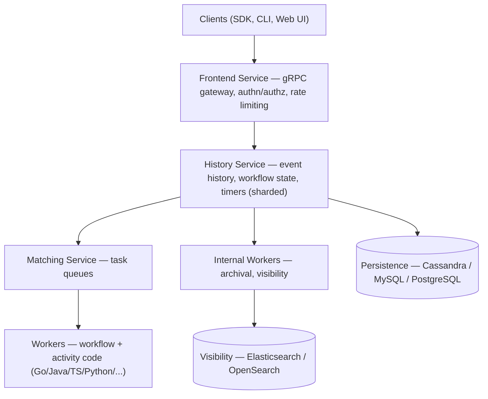

# Temporal Workflow: A Comprehensive Guide

**Durable Workflow Execution Done Right — Temporal's Model, Architecture, SDKs, and Banking Patterns**

> **Author:** Jack Liu Shurui · **Role:** Solution Architect, Cymbal Bank
> **Repo:** [github.com/jackliusr/research](https://github.com/jackliusr/research)
> **Series:** Workflow Orchestration Guides · **Topic:** Durable Execution / Workflow Engines
> **Focus:** Banking & regulated industries (Singapore, EU, global)
> **Companion Guides:** [Durable AI Agent Workflows](durable_ai_agent_workflows_guide.md) · [Agentic Workflows](agentic_workflows_guide.md) · [Open Workflow Specification](open_workflow_specification_guide.md) · [Apache Seata](apache_seata_guide.md) · [Event Stream Processing](event_stream_processing_guide.md) · [Enterprise Agentic Platform Architecture](ai_llm/enterprise_agentic_platform_architecture_guide.md) · [Core Banking Processes](../banking/core_banking_processes_guide.md) · [Payments Hub](../banking/payments_hub_guide.md)
> **Last Updated:** August 2026

---

## Table of Contents

1. [Temporal Overview](#1-temporal-overview)
2. [Core Concepts](#2-core-concepts)
3. [Architecture](#3-architecture)
4. [The Determinism Model](#4-the-determinism-model)
5. [Activities](#5-activities)
6. [SDKs](#6-sdks)
7. [Server and Cloud](#7-server-and-cloud)
8. [CLI and UI](#8-cli-and-ui)
9. [Use Cases](#9-use-cases)
10. [Anti-Patterns and Best Practices](#10-anti-patterns-and-best-practices)
11. [Worked Example: Loan Origination](#11-worked-example-loan-origination)
12. [Summary](#12-summary)
13. [Glossary](#13-glossary)
14. [References](#14-references)

---

### How to Read This Guide

This is the **dedicated deep-dive on Temporal**, the durable workflow execution platform. It expands the two Temporal sections of the umbrella guide — [Durable AI Agent Workflows](durable_ai_agent_workflows_guide.md) §6 (engine landscape) and §24 (Temporal in depth, ~29 lines) — to full depth, in the same pattern as the TruLens/Ragas/DeepEval trio expanded the eval sections of `llm_evaluation_frameworks_guide.md`. Where the umbrella guide surveys all durable-execution engines (Temporal, Cadence, Inngest, Restate, AWS Step Functions, Azure Durable Functions, Conductor, Camunda), this guide goes deep on *one* engine: its concepts, architecture, determinism model, SDKs, deployment options, patterns, and a full banking worked example.

**Suggested reading paths:**

- **Durable-execution newcomers:** §1 (what and why) → §2 (concepts) → §3 (architecture) → §4 (determinism — the mental model that makes Temporal make sense) → §11 (worked example).
- **Engine evaluators (Temporal vs alternatives):** §1.5, then the umbrella guide's §6–§10 and §26 (choosing the engine) for the cross-engine comparison this guide deliberately leaves to it.
- **Platform engineers:** §3 (services), §5 (activities/retries), §7 (server/cloud), §8 (CLI/UI) — then the [Enterprise Agentic Platform Architecture](ai_llm/enterprise_agentic_platform_architecture_guide.md) §2 orchestration comparison.
- **Banking architects:** §9.2 (Saga), §9.4 (banking workflows), §11 (loan origination worked example), cross-referenced to the lending/process guides.

**Note on verification:** researched August 2026. Core facts (founding history, license, SDK list, service architecture, CLI status, versioning APIs) are **verified** against Temporal's documentation, GitHub, and multiple independent sources. Items that could not be confirmed to primary sources — Temporal Cloud pricing figures, GitHub star counts, funding/valuation numbers, market-size estimates, the "3,000+ paying customers" figure — are **flagged** inline and marked *reported*. Treat flagged numbers as directional until confirmed against official vendor sources.

---

## 1. Temporal Overview

### 1.1 What Temporal Is

**Temporal** is an open-source **durable workflow execution platform** — a system that executes application code (workflows and activities) so that the *state of a running process survives process crashes, machine failures, and redeploys*. Developers write ordinary functions; Temporal records every step the function takes as an append-only event history, and on any failure re-executes the function from its recorded history — a technique called **deterministic replay** — so the process resumes exactly where it left off, without the developer writing a single line of checkpointing or recovery code.

Three facts anchor the platform (all **verified**):

- **License:** the Temporal server is open source under the **MIT license**; parts of the SDK ecosystem carry Apache 2.0. (The fork statement by the project's own maintainers: "fully open source under the same MIT (with some SDKs under Apache 2.0) license as Cadence.")
- **Provenance:** Temporal is the fork of Uber's **Cadence** workflow engine created by Cadence's original founders and technical leads — see §1.2.
- **Position:** it is the de-facto reference implementation of durable execution, running either **self-hosted** (dev server, Docker Compose, Kubernetes) or as **Temporal Cloud** (managed SaaS). *Reported* adopters include Nvidia, Netflix, Stripe, Snap, Coinbase, Datadog, HashiCorp, and OpenAI's production tooling (see §1.6).

Temporal does **not** execute your business logic itself. It is a coordination plane: the server stores state and dispatches tasks; **workers** — processes you run with one of the SDKs — poll for tasks and execute your code. The server is the durable memory; your workers are the CPU.

### 1.2 History: Cadence → Temporal Technologies (verified)

The lineage runs through the three generations of workflow-as-a-service thinking:

| Era | Event | Notes |
|---|---|---|
| 2012 | **Amazon SWF** (Simple Workflow Service) | AWS's first durable workflow service; the conceptual ancestor |
| 2017 | **Uber Cadence** open sourced | Uber's workflow engine, built by Maxim Fateev, Samar Abbas and team, drawing on the SWF ideas; Cadence 1.0 was released in August 2023 after six years of development, and Cadence remains maintained at Uber scale |
| 2019 | **Temporal Technologies founded** | Fateev (CEO) and Abbas (CTO) left Uber and **forked Cadence into Temporal** — same core model, re-architected for the wider developer community |
| 2020s | **Temporal Cloud** | Managed SaaS launched, alongside the Rust-based **Temporal Core** that unified all language SDKs (§6.2) |

Funding and valuation are **flagged**: press reports (2025) cited a valuation around US$2.5B with talks of a raise that could double it; total funding amounts vary by report and are not verified here.

### 1.3 Durable Execution — the Concept

**Durable execution** is the programming model at Temporal's core: *a function's execution is recorded as a journal of events, so the runtime can reconstruct where it was and continue — no matter how many times the underlying process crashes, is restarted, or is redeployed.* (The umbrella guide defines the same concept in [durable_ai_agent_workflows_guide.md §1.1 and §4].)

What this buys, concretely:

- **State persists.** A workflow that has been running for 30 days — waiting on a human approval, a counterparty, a timer — is not "in memory" anywhere; it exists as an event history in the server's database. Stop every worker, restart them weeks later, and the workflow continues.
- **Retries are safe.** Every step that fails (activity error, 5xx from a downstream system, a crashed worker) is retried according to policy — and because steps are recorded, a retried step never double-executes from the workflow's perspective (effectively exactly-once workflow execution; §4.1 and [durable guide §23]).
- **Recovery is automatic.** There is no checkpointing code, no state serialization, no "resume from step 3" logic to write. The workflow *is* its history.

The intuitive framing: a Temporal workflow behaves like a **function that cannot forget**. A traditional function is a volatile computation; a durable workflow is a *recorded* computation that can always be re-run from its transcript to reach the same point.

### 1.4 Why Temporal — the Rationale

The reliability argument for durable execution is the argument for Temporal:

- **Reliability as the default.** Retries, timeouts, timers, and persistence are platform features, not code you maintain. Failure handling is declared in a retry policy, not scattered through error-handling branches.
- **Effectively exactly-once workflow semantics.** Because workflow code is replayed from a recorded history (never re-executed blindly), the *logic* of a workflow runs exactly once per event sequence — no partial runs, no half-applied steps after a crash. Activities (the side-effecting steps) run at-least-once, so they must be **idempotent** to make the *business effect* exactly-once — a discipline the platform supports with idempotency keys and the Saga pattern (§9.2). This matches the delivery-semantics analysis in [durable guide §23].
- **Long-running processes become code.** Wait-until-signal, sleep-until-tomorrow, escalate-after-48h — these are ordinary language constructs (`await`, `sleep`, `condition`), not state machines you hand-build.
- **Debuggability.** Every workflow exposes its complete event history — each activity input, output, retry, timer, and failure — in the Web UI (§8.2). In regulated industries this doubles as an audit trail ([durable guide §29]).
- **Language freedom.** Workflow and activity code is written in your team's language (Go, Java, TypeScript, Python, .NET, …) and runs in your own workers — no lock-in to a DSL or a vendor's runtime.

### 1.5 Temporal vs the Alternatives

| Alternative | Relationship to Temporal | When it wins | Cross-ref |
|---|---|---|---|
| **Cadence** (Uber) | Temporal's direct predecessor (forked 2019); same founders, same core model, MIT | Organizations already running Cadence at scale; otherwise new projects should pick Temporal (active development, Cloud, larger ecosystem) | [durable guide §6] |
| **AWS Step Functions** | Managed, JSON state machines (ASL); Standard = durable/exactly-once, Express = cheap/at-least-once | Everything already on AWS; simple-to-moderate chains; console review with non-engineers | [durable guide §8.1], [aws_sap_c02_guide.md §4] |
| **Azure Durable Functions** | Managed durable functions on Azure Functions; code-first (C#/Python/JS) | Teams already on Azure Functions; fan-out/fan-in and HITL via the function runtime | [durable guide §8] |
| **Inngest** | Serverless-first durable steps (TS/Python/Go); `step.ai.*` AI primitives | Serverless teams wanting durability without operating any cluster; event/cron-triggered agent workflows | [durable guide §7.1] |
| **Restate** | Newer engine: durable execution + durable RPC + virtual objects (keyed single-writer state) | Per-entity state (one workflow per customer/loan), strong consistency, TS/Java/Kotlin shops | [durable guide §7.2] |

The umbrella guide's §6–§10 carries the full cross-engine comparison and §26 the selection framework; this guide does not repeat them. One synthesis from the umbrella guide worth keeping: **Temporal is the strongest general-purpose choice for enterprise-scale, long-running, signal-heavy workflows; the alternatives win on managed simplicity or specific consistency models.**

### 1.6 Overview Table

| Aspect | Description |
|---|---|
| **What it is** | Open-source durable workflow execution platform (code-first, event-sourced) |
| **License** | MIT (server); parts of the SDK ecosystem Apache 2.0 — *verified* |
| **Company** | Temporal Technologies, founded 2019 by Maxim Fateev & Samar Abbas (ex-Uber Cadence leads) — *verified* |
| **Lineage** | Fork of Uber Cadence (2017); conceptual ancestor Amazon SWF (2012) — *verified* |
| **Core model** | Workflow code + activities, executed by workers, state persisted as append-only event history, recovery by deterministic replay |
| **SDKs** | Go, Java, TypeScript, Python, .NET (first-class); PHP, Ruby (community); Rust (public preview); all on the Rust Temporal Core |
| **Deployment** | Dev server, self-hosted (Docker/Helm/K8s), or Temporal Cloud (managed) |
| **Adopters** | Nvidia, Netflix, Stripe, Snap, Coinbase, Datadog, HashiCorp, OpenAI — *reported*; "3,000+ paying customers" — *reported, company figure* |
| **Community** | ~21k GitHub stars on `temporalio/temporal` — *flagged approximate* |
| **Best for** | Long-running, multi-step, failure-tolerant processes: payments, onboarding, trade finance, agent workflows, any saga that must not lose its place |

---

## 2. Core Concepts

### 2.1 Workflows

A **workflow** (full name: **Workflow Definition**; a running instance is a **Workflow Execution**) is a durable function: ordinary code that orchestrates steps. The workflow's job is *coordination* — deciding what to do and in what order — not doing the work itself. In Temporal's words, workflows are "deterministic code" that the server re-executes from history on every failure, so they must be free of time, randomness, and I/O (§4).

```typescript
// TypeScript SDK — a minimal workflow: orchestrate two steps
@Workflow()
export class OnboardingWorkflow {
  @Workflow.run()
  async run(applicationId: string): Promise<string> {
    await this.kyc(applicationId);                 // activity call
    await this.openAccount(applicationId);         // activity call
    return "onboarded";
  }
}
```

Workflows can be long-running (days, months, years — there is no built-in duration cap), can wait on **signals**, can sleep on **timers**, can spawn **child workflows**, and record their entire execution as an **event history**.

### 2.2 Activities

An **activity** is the non-durable unit of work: the place where side effects happen — an API call, a database write, a file transfer, an LLM inference, a payment instruction. Activities are executed by workers and are *not* replayed; each invocation runs exactly as written. Because they touch the outside world, activities get the platform's reliability machinery: retries, timeouts, heartbeats, and cancellation (§5). A workflow is only as safe as its activities are idempotent — the umbrella guide's agent sections ([durable guide §20]) make the same point for LLM calls as activities.

### 2.3 Workers

A **worker** is a process you run (with an SDK) that hosts workflow and activity code and polls the server for tasks. Two roles exist inside one worker binary: **workflow workers** (execute/replay workflow code) and **activity workers** (execute activities). Workers are stateless and horizontally scalable — you can run one worker or a thousand; Temporal load-balances tasks across all of them. *Workers are the part of Temporal you operate*: the platform is not serverless — your code must run somewhere (containers, VMs, Kubernetes, serverless functions).

### 2.4 Task Queues

A **task queue** is the routing mechanism between the server and workers. When a workflow or activity is ready to run, the server places a **task** on a named queue; workers poll that queue. Queues are how you: separate workloads (queue per service, per environment, per team), control scaling (more workers on a queue = more parallelism), and stage rollouts (point a queue at new worker versions). The queue name is a plain string — conventionally a service or use-case name (`loan-origination`, `payments-eu`).

### 2.5 Signals

A **signal** is an external event delivered to a *running* workflow: "officer approved", "customer updated their address", "counterparty responded". Signals are asynchronous, recorded in the event history, and wake the workflow out of any wait. They are the mechanism for **human-in-the-loop** (HITL) — a workflow waits indefinitely for a human decision, the human acts in the UI or via API, and the workflow resumes. (The umbrella guide's HITL pattern is [durable guide §13].)

### 2.6 Queries

A **query** reads the *current state* of a running workflow without mutating it: "what stage is this loan application in?", "what is the agent's accumulated context?". Queries execute against the workflow's in-memory state (a query handler you define) and do not affect the event history. They are how dashboards, UIs, and support teams inspect live workflows.

### 2.7 Timers

A **timer** is a durable sleep: `await workflow.sleep(48h)` persists the "wake me in 48 hours" as a timer in the server — not in the worker's memory. Crash the worker, restart the cluster, the timer still fires. Timers power timeouts, escalation ladders, scheduled steps, and retention policies ("wait 30 days after closure before archiving").

### 2.8 Concept Table

| Concept | Description | Typical use case |
|---|---|---|
| **Workflow** | Durable orchestration function; deterministic; replayed from history | Loan origination, onboarding, payment settlement |
| **Activity** | Non-durable side-effecting unit; retried/timeout/heartbeat | Credit bureau call, payment instruction, LLM inference |
| **Worker** | Process hosting workflow + activity code; polls task queues | Your service containers/K8s pods |
| **Task queue** | Named routing channel server → workers | `loan-origination`, `payments-eu`, per-team queues |
| **Signal** | External event into a running workflow | Human approval, customer update, counterparty reply |
| **Query** | Read-only state inspection of a running workflow | Dashboard status, support lookups |
| **Timer** | Durable sleep / deadline | Approval timeout, escalation ladder, scheduled step |

---

## 3. Architecture

### 3.1 The Services

The Temporal Server is not a monolith — it is a cluster of **independently scalable services** (verified against the server's architecture docs):

- **Frontend service** — the API gateway. All clients (SDKs, CLI, UI) speak gRPC to the frontend; it handles rate limiting, routing, and authorization, and is the only entry point into the cluster.
- **History service** — the source of truth. It maintains the **event history** for every workflow (the append-only log), the mutable workflow state, internal queues, and timers. It is the most heavily sharded service — shards partition workflows across history instances.
- **Matching service** — hosts the **task queues**. It receives tasks (workflow tasks, activity tasks) from the history service and holds them until workers poll.
- **Internal workers service** — performs server-side internal work (archival, visibility processing, timer dispatch helpers).
- **Persistence layer** — the database behind the history service: **Cassandra, MySQL, or PostgreSQL** in production; SQLite for the dev server. A separate store (Elasticsearch/OpenSearch) powers **visibility** — searchable workflow metadata.

The server **never executes your code**. It records events, dispatches tasks, and manages timers; your workers execute workflow and activity code.

### 3.2 The Data Flow

A client starts a workflow; here is the round trip (simplified):

```
Client ──StartWorkflowExecution──▶ Frontend ──▶ History (append event, create tasks)
                                                        │
                                                        ▼
Worker ◀──poll WorkflowTask── Matching (task queue) ◀── History (task ready)
   │
   │ execute/replay workflow code → ScheduleActivity
   ▼
Frontend ◀──ScheduleActivity── (via client connection)
   │
   ▼
History (record ActivityTaskScheduled) ──▶ Matching (activity task queue)
                                                        │
                                                        ▼
Activity Worker ◀──poll ActivityTask── Matching ──▶ executes activity ──▶ result
   │
   ▼
Frontend ──▶ History (record ActivityTaskCompleted) ──▶ new WorkflowTask
                                                        │
                                                        ▼
Workflow worker replays history ──▶ next step (or waits on signal/timer)
```

Every arrow into **History** is an append to the event log; every worker hop is a poll on a task queue. Failures anywhere (worker crash, network blip, database hiccup) just mean the task is re-polled or re-dispatched — the event log is the single source of truth that keeps everything coherent.

### 3.3 The Event History

The **event history** is the heart of the platform: an append-only, immutable log of everything that happened in a workflow execution — `WorkflowExecutionStarted`, `ActivityTaskScheduled`, `ActivityTaskCompleted`, `TimerFired`, `WorkflowExecutionSignaled`, `WorkflowExecutionFailed`, and dozens more event types. When a worker picks up a workflow task, it **replays** the history from the beginning to rebuild the workflow's state, then executes the new events. This is why:

- recovery needs no checkpoints (the history *is* the checkpoint),
- the workflow is debuggable (the UI renders the history as a timeline),
- the history is an audit trail for regulators ([durable guide §29]).

Event histories are append-only and versioned; the server truncates/archives old history per namespace retention policy.

### 3.4 Architecture Diagram



### 3.5 Architecture Table

| Service | Role | Scaling |
|---|---|---|
| **Frontend** | API gateway: routing, rate limiting, authorization | Stateless; scale horizontally behind a load balancer |
| **History** | Event log, workflow state, timers, mutable state + queues | Sharded by workflow; the scaling-critical service |
| **Matching** | Task queue hosting and dispatching | Partitioned by queue; scales with task throughput |
| **Internal workers** | Archival, visibility, server-internal tasks | Scale with history volume |
| **Persistence** | Durable store for histories | Cassandra (write-heavy), MySQL, PostgreSQL; production HA required |
| **Workers (yours)** | Execute workflow + activity code | Stateless; scale per task queue; the only part you own |

---

## 4. The Determinism Model

### 4.1 Deterministic Replay

Temporal's core trick is **replay**: the same workflow code is re-executed over the same event history to reproduce the same result. For replay to be correct, the code must be **deterministic** — given the same history, it must always make the same decisions. The moment a workflow's code would produce a *different* sequence of events when re-run, the platform raises a **non-determinism error** (§4.3). Determinism is what makes "effectively exactly-once" workflow execution possible: the logic is not re-run blindly, it is *re-derived* from recorded facts.

### 4.2 The Deterministic Constraints

Workflow code is ordinary code with a strict boundary:

| Constraint | Why | What to use instead |
|---|---|---|
| **No wall-clock time** (`new Date()`, `System.currentTimeMillis`) | Replay at a different moment would compute a different value | `workflow.now()` / SDK time APIs (deterministic, derived from history) |
| **No randomness** (`Math.random`) | Replay would generate a different value | `workflow.random()` (seeded deterministically) |
| **No I/O** (HTTP, DB, files, message queues) | Side effects would duplicate or diverge on replay | **Activities** — the platform's I/O boundary, retried by policy |
| **No global mutable state** (env vars, singletons, static counters) | Replay could see a different world | Pass values through workflow params/state; read env in activities |
| **No uncontrolled concurrency** (raw threads/goroutines) | Scheduling order is non-deterministic | Workflow code is single-threaded per execution by design; use activities for parallelism |
| **No iteration over unordered collections** (map order, etc.) | Order affects the event sequence | Sort keys; keep iteration order explicit |

The rule of thumb the docs and community converge on: **if it touches the outside world or the current moment, it goes in an activity.** The umbrella guide's agent sections ([durable guide §20]) apply the same rule to LLM calls: the model call is an activity; the *planning loop* around it is deterministic workflow code.

### 4.3 Non-Determinism Errors

The `NonDeterminismError` (also surfaced as "workflow execution failed, history event mismatch") fires when a workflow is replayed with code that produces a different event sequence than the history records — most commonly because **workflow code was changed while executions were still running**: an activity was added, removed, or reordered; a branch condition changed; a signal handler signature changed. The platform cannot know whether the difference is a bug or an intended change, so it fails the execution rather than guess. The fix is **versioning** (§4.4) — and the discipline that workflow code changes ship like schema migrations: versioned, backward-compatible, never in-place.

### 4.4 Versioning

Temporal offers two complementary mechanisms (**verified** against SDK docs):

- **Patching APIs (`getVersion` / `patch`).** A version marker in the code lets *new* executions take the new path while *in-flight* executions replay the old path:

```typescript
// TypeScript SDK — versioned workflow change
@Workflow.run()
async run(input: Input): Promise<void> {
  const v = workflow.getVersion("add-fraud-screen", workflow.VERSIONED_BEHAVIOR, 1);
  if (v >= 1) {
    await this.fraudScreen(input.applicationId);   // new step, added later
  }
  await this.creditCheck(input.applicationId);
}
```

  New workflows run with version 1 (new step); workflows started before the change replay with the old version (no step) — both deterministic, both correct. When no in-flight executions remain, the version marker can be removed in a later release.

- **Worker versioning (build IDs).** The deployment-level mechanism: workers declare a build ID (usually the git SHA) and a version set of compatible builds; the server routes tasks only to workers whose build ID can execute them. This makes zero-downtime deploys safe — new code never meets old history, and old tasks drain on old workers.

The umbrella guide's §19 (versioned agent workflows) shows the same discipline applied to prompt and agent-code changes: **every change to durable code is a versioned migration, not an edit.**

### 4.5 Determinism Table

| Constraint | Reason | Solution |
|---|---|---|
| No wall-clock time | Replay at a different moment diverges | `workflow.now()` / SDK time APIs |
| No randomness | Replay would diverge | `workflow.random()` (deterministic seed) |
| No I/O | Duplicate or divergent side effects on replay | Activities (§5) |
| No global mutable state | Replay sees a different world | Pass state explicitly; env/config in activities |
| No raw threads | Non-deterministic scheduling | Single-threaded workflow code; activities for parallelism |
| No map-order iteration | Unstable event sequence | Explicit ordering/sorting |
| Code changes to live workflows | History mismatch → `NonDeterminismError` | `getVersion`/`patch` + worker versioning (§4.4) |

---

## 5. Activities

### 5.1 Activities as the Side-Effect Boundary

Activities are where Temporal's reliability machinery lives. An activity is a function registered with the worker, called from workflow code via a proxy, executed by an activity worker, and **recorded in the event history with its input and output**. Because the workflow never touches the world directly, every world-touching step can be retried, timed out, heartbeated, and cancelled without corrupting the workflow's deterministic core.

### 5.2 Activity Retries

Failures in activities are handled by a **Retry Policy** — the workflow-level declaration of how a step retries:

```python
# Python SDK — retry policy on an activity execution
await workflow.execute_activity(
    credit_bureau_check, application_id,
    retry_policy=workflow.RetryPolicy(
        maximum_attempts=5,
        initial_interval=2.0,        # seconds
        backoff_coefficient=2.0,     # exponential backoff
        maximum_interval=60.0,
        non_retryable_error_types=["InvalidApplicationError"],
    ),
)
```

Policy knobs (verified): `initial_interval`, `backoff_coefficient`, `maximum_interval`, `maximum_attempts`, `non_retryable_error_types` (e.g. a business-rule rejection that must never retry). Defaults exist but production code should set them per activity. **Retries are durable**: they survive worker restarts because the retry state lives in the server.

### 5.3 Activity Timeouts

Four timeouts guard an activity (**verified**):

- **Schedule-to-Start** — how long the task may wait in the queue before a worker picks it up (backlog detection; e.g. 60s).
- **Start-to-Close** — how long the activity itself may run (e.g. 5 minutes for a credit bureau call). Exceeding it fails the attempt → retry.
- **Schedule-to-Close** — the total budget including retries (e.g. 15 minutes for 5 attempts).
- **Heartbeat** — how often a long activity must report "still alive" (e.g. every 30s).

Long-running activities **must heartbeat** (§5.4): without a heartbeat, the server cannot distinguish a hung activity from a slow one, and a worker crash mid-activity is only detected at start-to-close expiry — minutes of unnecessary delay.

### 5.4 Activity Patterns

- **Heartbeating long activities.** An activity that runs minutes-to-hours (file migration, model training, bulk settlement, a long LLM chain) calls `activity.heartbeat(progress)` on a timer; the heartbeat can carry a payload that the retry re-reads (`activity.get_heartbeat_details()`) to resume progress instead of restarting. A heartbeat timeout tells the server the worker died → immediate retry on another worker.
- **Cancellation.** A cancelled workflow cancels its activities; activities can be written cooperatively (check `is_cancelled` / context cancellation between chunks of work) to stop promptly and clean up.
- **Idempotency.** Because activities are at-least-once (retries can repeat an *effect*), every side-effecting activity should be idempotent: dedupe by a business key (e.g. payment instruction ID), use `Idempotency-Key` headers for external APIs, and make the second execution a no-op. This is what converts at-least-once delivery into exactly-once *business effects* ([durable guide §23]).
- **One activity, one bounded job.** Short, single-purpose activities (seconds, not hours) are the sweet spot — they fail fast, retry cheaply, and keep history readable.

### 5.5 Activity Table

| Aspect | Description | Configuration |
|---|---|---|
| **Role** | Non-durable, side-effecting unit; retried/timeout/heartbeat by the platform | Registered on the worker alongside workflows |
| **Retries** | Durable retry with exponential backoff | RetryPolicy: `initial_interval`, `backoff_coefficient`, `maximum_attempts`, `non_retryable_error_types` |
| **Timeouts** | Queue wait, execution, total, liveness | `schedule_to_start`, `start_to_close`, `schedule_to_close`, `heartbeat` |
| **Heartbeating** | Progress reporting for long activities; crash detection | `activity.heartbeat(payload)` + heartbeat timeout |
| **Cancellation** | Cooperative stop on workflow cancel | Check cancellation between chunks; clean up |
| **Idempotency** | Safe re-execution for at-least-once delivery | Business-key dedupe, `Idempotency-Key`, no-op-on-repeat |

---

## 6. SDKs

### 6.1 Language Coverage (verified)

Temporal ships **eight official SDKs**, all sharing one design: workflow/activity decorators, a `Client` for starting/signaling/querying workflows, a `Worker` for hosting code, and identical server semantics:

- **First-class / GA:** **Go** (the original SDK), **Java**, **TypeScript**, **Python**, **.NET**
- **Community-supported:** **PHP**, **Ruby**
- **Public preview:** **Rust** (first-party SDK on the Rust Core)

Language choice does not affect server behavior — a Python workflow and a Go workflow in the same namespace interoperate, and a polyglot team can host different languages on different workers for the same workflows.

### 6.2 Temporal Core (verified)

All language SDKs sit on **Temporal Core**, a shared engine written in **Rust** that implements the protocol with the server: task polling, history replay, determinism enforcement, timer management, and retry bookkeeping. Each SDK is a thin language binding over Core (via C-compatible FFI). One Core means: identical semantics and determinism behavior across languages, one codebase for the hardest protocol logic, and faster SDK development. It also means the "SDK" you choose is mostly syntax — the engine underneath is the same everywhere.

### 6.3 SDK Features

- **Workflow stubs** — typed proxies that start or continue workflows (`client.getWorkflowHandle` / `client.start`), with `start`, `signal`, `query`, `terminate`, `cancel` operations.
- **Activity stubs** — typed proxies that invoke activities from workflow code with inline retry/timeout options.
- **Signals & queries** — first-class in every SDK (`workflow.condition`/`signal` handlers; query handlers returning serializable state).
- **Child workflows** — `workflow.execute_child` / `childWorkflow` for sub-orchestrations with isolated histories (fan-out patterns, [durable guide §15]).
- **Workflow utilities** — `sleep`, `now`, `random`, `getVersion`/`patch`, `memo`, search attributes, dynamic workflows.
- **Data converters** — payload (de)serialization, with pluggable encryption (codec servers) for regulated payloads.

### 6.4 SDK Maturity (verified — with nuance)

Maturity ordering is *reported* practitioner consensus rather than an official ranking (**flag**): **Go and Java** are the longest-tenured and most battle-tested (the enterprise/banking majority); **TypeScript** has the largest community momentum and the most ergonomic signal/query APIs; **Python** (GA since 2023) is the default for ML/agent teams; **.NET** is GA and solid for C# shops; **PHP/Ruby** are community-supported (fully functional, slower to receive new features); **Rust** is newest. All share the Core, so "maturity" mostly means API polish, docs depth, and ecosystem age.

### 6.5 SDK Table

| SDK | Status (verified) | Strengths |
|---|---|---|
| **Go** | First-class, longest-tenured | The reference SDK; battle-tested; strong typing; banking/fintech majority |
| **Java** | First-class, long-tenured | Enterprise standard; Spring Boot integration; JVM shops |
| **TypeScript** | First-class | Largest momentum; ergonomic signals/queries; full-stack teams; agent ecosystem |
| **Python** | First-class (GA 2023) | ML/agent teams; async-native; data science integration |
| **.NET** | First-class (GA) | C#/.NET shops; Azure-adjacent estates |
| **PHP** | Community | PHP monoliths; WordPress ecosystem |
| **Ruby** | Community | Rails shops |
| **Rust** | Public preview | Rust-native teams; performance-critical workers |

---

## 7. Server and Cloud

### 7.1 Self-Hosted Temporal Server (verified)

The server runs in three configurations:

- **Dev server** — `temporal server start-dev` starts a full single-node engine locally (SQLite persistence, Web UI at `http://localhost:8233`, gRPC on `7233`). The fastest way to iterate; the umbrella guide's §24.2 uses it as the default dev loop.
- **Docker Compose** — the official `docker-compose.yml` runs the server + a database + the UI for local/CI environments.
- **Kubernetes (Helm)** — the official **Helm charts** deploy a production-grade cluster: frontend/history/matching deployments, Cassandra or PostgreSQL/MySQL stateful sets, Elasticsearch for visibility, and the UI. This is the standard self-hosted production path (see §7.4).

**Namespaces** are the server's multi-tenancy unit: an isolated scope for workflows (like a database schema) — per environment (`dev`, `uat`, `prod`), per LOB, or per client. Retention, visibility, and authorization are configured per namespace.

### 7.2 Temporal Cloud (verified — pricing flagged)

**Temporal Cloud** is the managed SaaS: Temporal runs the cluster; you run workers and connect over the internet or private networking (VPC peering). Cloud adds managed namespaces, 99.9% SLA (*reported*), built-in observability (metrics, traces, audit logging), and eliminates cluster operations — the pragmatic enterprise default unless data residency/on-prem mandates push self-hosting (common in banking — see the [On-Prem LLM Deployment](on_prem_llm_deployment_guide.md) guide's same argument for models).

**Pricing** (official docs): usage-based — you pay for **Workflows, Activities, Workers, and Storage**, with volume discounts; not per-seat infrastructure. Third-party estimates of entry cost range ~US$100–200/month at low volume (*flagged* — not official); per-action overage pricing is *reported* at ~US$25 per million additional actions. For cost modeling, the [FinOps guide](finops_guide.md) §6 (cloud pricing models) applies the same usage-based lens.

### 7.3 Persistence (verified)

The history service stores everything in an external database — the only durable dependency of a self-hosted deployment:

- **PostgreSQL** — the default for new self-hosted deployments; ACID, familiar ops, good for most volumes.
- **MySQL** — a long-supported alternative with the same role.
- **Cassandra** — the write-scaled option for very large histories (the original Cadence-era choice); higher ops complexity.
- **SQLite** — dev server only.

**Visibility** (workflow metadata for search — status, start time, search attributes) lives in a separate store: Elasticsearch/OpenSearch in production, in-database visibility for smaller deployments.

### 7.4 Deployment (verified)

The canonical production path is Kubernetes + the official Helm chart: frontend behind an ingress/load balancer (gRPC), history and matching as scaled deployments, a database (PostgreSQL recommended to start), Elasticsearch for visibility, and the UI. Operations follow standard K8s practice (HPA on frontend/matching, PDBs, backups on the DB). Worker deployments are your own — scale per task queue. The server's own docs ([docs.temporal.io/production-deployment](https://docs.temporal.io/production-deployment)) are the authoritative runbook.

### 7.5 Deployment Table

| Option | Description | Best for |
|---|---|---|
| **Dev server** | Single binary, SQLite, UI included; `temporal server start-dev` | Local development, tests, demos |
| **Docker Compose** | Server + DB + UI in containers | CI, staging, small self-hosted installs |
| **Helm / Kubernetes** | Production HA cluster (frontend/history/matching + DB + ES + UI) | Regulated self-hosting, data-residency mandates, large scale |
| **Temporal Cloud** | Managed SaaS; workers stay with you | Teams without cluster-ops capacity; enterprise default; fast time-to-value |
| **Bare/VMs** | Manual cluster install | Legacy estates without K8s |

---

## 8. CLI and UI

### 8.1 Temporal CLI (verified — tctl is deprecated)

The legacy **tctl** CLI reached **end of support on September 30, 2025** and its repository is archived; the current tool is the **Temporal CLI** (`temporal`, v1.0 since August 2024). Any 2026 documentation, runbook, or habit that says "tctl" is stale. The Temporal CLI covers:

```bash
temporal server start-dev                # run the dev server
temporal workflow start --type LoanOrigination --task-queue loan-origination \
    --input '{"applicationId":"APP-1042"}' --workflow-id loan-1042
temporal workflow show --workflow-id loan-1042        # print the event history
temporal workflow signal --workflow-id loan-1042 --name approvalReceived \
    --input '{"approved":true,"officer":"j.lee"}'
temporal workflow query --workflow-id loan-1042 --name currentStage
temporal workflow terminate --workflow-id loan-1042 --reason "duplicate"
temporal operator namespace register prod --retention 30
temporal operator cluster health            # server health
temporal schedule create --schedule-id nightly-eod --interval 24h --workflow-type EodRun
```

### 8.2 Temporal Web UI (verified)

The Web UI (shipped with the dev server, the Helm chart, and Cloud) is the workflow inspector: a workflows page with filters (status, workflow ID, type, time range — displaying up to 1,000 executions per page), and per-workflow **event-history timelines** — every activity with its input/output/retries, every timer, signal, and failure. The umbrella guide calls this "the single most useful debugging tool" ([durable guide §24.3]): *what did the step return? which step retried? why did the approval time out?* — all answered from the history, which doubles as the audit record. The UI also manages namespaces, schedules, search attributes, and supports **codec servers** for decrypting payloads in regulated environments.

### 8.3 Observability (verified; Chronicle flagged)

- **Metrics:** SDKs and server export Prometheus metrics (workflow/activity counts, task latency, backlog); Cloud provides managed metrics.
- **Traces:** OpenTelemetry tracing is supported across SDKs and server.
- **Chronicle** — Temporal's observability product for Cloud (built on ClickHouse, *reported*) adds real-time workflow analytics beyond the standard metrics.
- The event history itself is the deepest observability primitive: it is the trace, the log, and the audit trail in one.

### 8.4 Tooling Table

| Tool | Purpose | Key commands / notes |
|---|---|---|
| **Temporal CLI** | Operator + developer CLI (tctl successor, post-Sept-2025) | `temporal workflow start/show/signal/query`, `temporal operator namespace`, `temporal server start-dev` |
| **tctl** | Legacy CLI | Deprecated; end of support Sept 30, 2025; repo archived |
| **Web UI** | Workflow inspector, namespace/schedule admin | Event-history timelines, filters, codec server support |
| **SDK tooling** | Local dev/test | `temporalite`-class dev servers, SDK test frameworks (time-skipping tests, §10.2) |
| **Observability** | Metrics/traces | Prometheus metrics, OTel tracing, Cloud metrics; Chronicle (reported) |

---

## 9. Use Cases

### 9.1 Workflow Orchestration (verified)

Temporal's home turf is any multi-step business process that must survive failures and run for a long time: order-to-cash, onboarding, provisioning, settlement, reconciliation, retention workflows. The value is the same everywhere — *the process cannot lose its place*, retries are automatic, and every run leaves a complete history. The umbrella guide's patterns catalog ([durable guide §11–§19]) maps these processes onto durable patterns: durable loops, fan-out/fan-in, scheduled runs, versioned changes.

### 9.2 The Saga Pattern (verified — implemented explicitly)

A **Saga** is a sequence of local transactions with per-step **compensations** that undo completed steps when a later step fails. Temporal has no magic "Saga" keyword — you implement it in workflow code with explicit `try/except` compensation logic (**verified**; the umbrella guide's §14 documents the pattern, and the [Apache Seata guide](apache_seata_guide.md) §6 covers the SAGA transaction mode from the distributed-transaction side):

```python
compensations: list = []
try:
    result = await workflow.execute_activity(disburse, app_id)
    compensations.append(lambda: workflow.execute_activity(reverse_disbursement, app_id))
    await workflow.execute_activity(post_to_ledger, app_id)
    compensations.append(lambda: workflow.execute_activity(reverse_ledger_entry, app_id))
except Exception:
    for compensate in reversed(compensations):   # undo in reverse order
        await workflow.execute_activity(compensate)
    raise
```

Compensation activities get the same retry/timeout machinery as forward steps — the Saga is durable on both directions.

### 9.3 Agent Workflows (cross-ref)

Temporal is the orchestration substrate for durable AI agents: LLM calls are activities (retried with recorded outputs), the agent loop is deterministic workflow code, HITL approvals are signals, and the event history makes agents debuggable and auditable. The umbrella guide builds this argument in full ([durable guide §20–§22, §28]); the [Enterprise Agentic Platform Architecture](ai_llm/enterprise_agentic_platform_architecture_guide.md) §2 compares Temporal against LangGraph for platform orchestration; and the [Agent Runtime Cache Design](ai_llm/agent_runtime_cache_design_guide.md) guide covers caching deterministic workflow steps. This guide deliberately does not duplicate the agent material — §11's worked example shows the banking flavor instead.

### 9.4 Banking Workflows (verified — see banking guides)

- **Payments:** payment-hub processing, cross-border flows, reconciliation — sagas + idempotency keys are exactly the money-movement safety patterns of the [Payments Hub](../banking/payments_hub_guide.md) guide (§6 routing/orchestration, §10 reconciliation).
- **Onboarding:** KYC/KYB orchestration with HITL (compliance review signals), document-verification activities, sanctions screening — a canonical multi-day workflow.
- **Trade finance:** LC issuance, document checking, discrepancies, financing decisions — long-running, counterparty-driven, audit-heavy.
- **Lending:** origination, disbursement, rollover, collections (see §11) — the [Core Banking Processes](../banking/core_banking_processes_guide.md) guide's lending lifecycle (§5) and process orchestration (§10) describe the same processes as state machines; Temporal is the runtime that makes those state machines durable.
- **Batch/EOD contrast:** the nightly batch and posting machinery ([core_banking_processes_guide.md §7]) is *scheduled batch*; Temporal schedules can trigger runs, but Temporal's differentiator is long-running *interactive* processes that batch tools cannot express ([durable guide §9] positions it against data-pipeline orchestrators).

### 9.5 Use Case Table

| Use case | Workflow shape | Benefit |
|---|---|---|
| Payments / settlement | Saga of payment + ledger + notification activities, idempotency keys | No double payments; every leg recoverable and auditable |
| Onboarding (KYC/KYB) | Signal-driven HITL gates, document activities, timers for SLA escalation | Multi-day process that never loses its place; compliance evidence in history |
| Trade finance | Long-running LC workflows, counterparty signals, discrepancy loops | Survives months-long runs; complete audit trail |
| Loan origination | §11 worked example | Retry/recovery without code; approval HITL; saga on failure |
| Agent workflows | LLM-as-activity loops, HITL signals | Debuggable, auditable, replayable agents ([durable guide §24.3]) |
| Schedules / EOD | `temporal schedule` cron runs | Durable scheduled triggers for batch entry points |

---

## 10. Anti-Patterns and Best Practices

### 10.1 Anti-Patterns

- **Non-determinism by code change.** Editing workflow code while executions are in flight without `getVersion`/patch markers → `NonDeterminismError`, failed workflows, recovery incidents. *Fix: version every workflow-code change (§4.4); treat workflow code like a schema.*
- **I/O in workflow code.** Direct HTTP/DB calls in a workflow (tempting for "one quick call") break replay and duplicate side effects. *Fix: activities, always.*
- **The long-activity trap.** One activity that does a 6-hour job with no heartbeat: any worker crash is only detected at timeout, retries restart from zero, and the history is unreadable. *Fix: short activities + heartbeats with progress payloads (§5.4); split the job into steps.*
- **The god-object workflow.** One workflow class that orchestrates everything (payments + onboarding + reporting) becomes unchangeable and untestable. *Fix: small, single-purpose workflows; compose with child workflows; keep coordination logic thin.*
- **Unbounded retries.** Default/max retry policies on non-retryable business errors — a rejected application retried 50 times pollutes the queue and history. *Fix: `non_retryable_error_types` for business rejections; bounded attempts per activity.*
- **Ignoring visibility/search attributes.** Debugging "find all workflows for customer X" without search attributes means scanning histories. *Fix: set search attributes (customer ID, product, stage) at start.*
- **State in workers, not in the workflow.** Caching a decision in worker memory or env — replay can't see it. *Fix: workflow state + memo/search attributes are the durable state.*

### 10.2 Best Practices (verified)

- **Short, single-purpose activities** — seconds-to-minutes, one business effect each; fail fast, retry cheap, history readable.
- **Idempotent activities** — business-key dedupe, `Idempotency-Key` on external calls, no-op-on-repeat. This is the non-negotiable for exactly-once business effects under at-least-once delivery ([durable guide §23]).
- **Explicit retry policies per activity** — bounded attempts, exponential backoff, non-retryable error types; never ship the defaults blindly.
- **Version everything durable** — `getVersion`/patch for workflow-code changes; worker build-ID versioning for deploys; never mutate a running workflow's code path unversioned.
- **Heartbeat long activities** with progress payloads; use heartbeat details to resume on retry.
- **Test with time-skipping** — SDK test frameworks advance virtual time instantly (a 48-hour approval timeout tests in milliseconds), replay-test old histories against new code (determinism tests), and mock activities. The umbrella guide's §32 covers durable-workflow testing in depth.
- **Design for HITL explicitly** — signals for approvals, timers for SLA escalation, queries for status; the umbrella guide's §13 is the pattern reference.
- **Saga on every multi-step side-effect chain** — compensation activities defined next to the forward steps they undo (§9.2).
- **Use search attributes + a namespace strategy** from day one; retrofitting visibility is painful.

### 10.3 Practices Table

| Practice | Rationale | Implementation |
|---|---|---|
| Short activities | Fail fast, cheap retries, readable history | One bounded job per activity |
| Idempotent activities | At-least-once delivery → exactly-once effects | Business keys, `Idempotency-Key`, no-op-on-repeat |
| Explicit retry policies | Bounded, backoff, no retry of rejections | `RetryPolicy` per activity; `non_retryable_error_types` |
| Workflow versioning | Safe changes to live workflows | `getVersion`/patch + worker build IDs |
| Heartbeats | Crash detection + resume for long work | `heartbeat(progress)`; heartbeat details on retry |
| Time-skipping tests | 48h timeouts tested in ms; replay safety | SDK test frameworks; replay old histories |
| Saga compensations | Undo partial success on failure | `try/except` + reversed compensation activities |
| Search attributes | Operational debuggability at scale | Set customer/product/stage at workflow start |
---

## 11. Worked Example: Loan Origination

### 11.1 The Scenario

A bank's **consumer loan origination** process: a customer applies for a personal loan; the bank must run KYC, pull a credit bureau report, verify supporting documents, decide (with an underwriting officer's sign-off for amounts above a threshold), disburse, and post-disbursement notify + schedule first-payment. The process spans hours-to-days and touches four external systems (KYC vendor, credit bureau, document store, payment hub). The umbrella guide's §28 builds a related but different scenario — a Python *loan-approval agent*; this section is the full origination workflow in **TypeScript**, with the underwriting, document, and disbursement detail.

### 11.2 The Workflow (TypeScript sketch)

```typescript
import { Workflow, WorkflowRun, workflow } from "@temporalio/workflow";
import type * as act from "../activities/loan";

const { kycCheck, creditBureauCheck, verifyDocuments, underwrite,
        disburse, reverseDisbursement, notifyApplicant, escalateToManager } =
  workflow.proxies<typeof act>();

interface LoanApplication { applicationId: string; customerId: string;
  amount: number; termMonths: number; documents: string[]; }

@Workflow()
export class LoanOriginationWorkflow {
  private approved = false;
  private decision?: { approved: boolean; officer: string; reason?: string };
  private stage = "APPLICATION_RECEIVED";

  @Workflow.run()
  async run(app: LoanApplication): Promise<string> {
    const compensations: Array<() => Promise<void>> = [];
    const id = app.applicationId;
    try {
      // 1. KYC — vendor call, retry 3x
      await kycCheck(app.customerId, { retry: { maximumAttempts: 3 } });
      compensations.push(async () => {}); // KYC is read-only; nothing to undo

      // 2. Credit bureau — slow external API, heartbeat + retry 5x
      const credit = await creditBureauCheck(app.customerId, {
        retry: { maximumAttempts: 5, initialInterval: "5s" },
        startToCloseTimeout: "5m",
        heartbeatTimeout: "30s",
      });
      if (credit.declined) throw new workflow.ApplicationError("CREDIT_DECLINED");

      // 3. Document verification — async vendor task, wait for completion signal
      await verifyDocuments(id, app.documents, { retry: { maximumAttempts: 3 } });
      this.stage = "UNDERWRITING";

      // 4. Underwriting — deterministic score + activity; versioned step
      const version = workflow.getVersion("llm-underwriting", workflow.VERSIONED_BEHAVIOR, 1);
      const recommendation = await underwrite(
        { application: app, credit, llmAssist: version >= 1 },   // v1 adds LLM assist
        { retry: { maximumAttempts: 3 } });

      // 5. HITL approval gate — signal with 24h SLA, then escalate
      this.stage = "AWAITING_APPROVAL";
      const deadline = workflow.sleep("24h");          // durable timer
      const approved = workflow.condition(
        () => this.decision !== undefined,              // fired by signal
        deadline, "approval-window");
      if (!approved) {
        await escalateToManager(id, { reason: "no decision in 24h" });
        await workflow.condition(() => this.decision !== undefined, undefined, "manager-approval");
      }
      if (!this.decision?.approved) throw new workflow.ApplicationError("REJECTED");

      // 6. Disburse via payment hub — idempotency key = workflow id
      await disburse({ loanId: id, amount: app.amount,
        idempotencyKey: `loan-${id}` }, { retry: { maximumAttempts: 5 } });
      compensations.push(async () => reverseDisbursement(id, { retry: { maximumAttempts: 3 } }));

      // 7. Post-disbursement
      await notifyApplicant(id, "APPROVED", { retry: { maximumAttempts: 3 } });
      this.stage = "DISBURSED";
      return "DISBURSED";
    } catch (err) {
      for (const compensate of compensations.reverse()) await compensate(); // saga
      await notifyApplicant(id, "REJECTED", { retry: { maximumAttempts: 3 } });
      this.stage = "FAILED";
      throw err;
    }
  }

  @Workflow.signal()
  async approvalReceived(decision: { approved: boolean; officer: string; reason?: string }) {
    this.decision = decision;      // recorded in history; wakes the condition
  }

  @Workflow.query()
  currentStage(): string { return this.stage; }   // read-only inspection
}
```

### 11.3 The Activities

```typescript
// activities/loan.ts — all non-deterministic work lives here
export async function kycCheck(customerId: string) {
  return callKycVendor(customerId);            // external vendor API
}
export async function creditBureauCheck(customerId: string) {
  const result = await callBureau(customerId); // slow; heartbeated by the worker
  return result;
}
export async function verifyDocuments(applicationId: string, documents: string[]) {
  await uploadForVerification(applicationId, documents);
  await pollVerificationStatus(applicationId); // or signal-driven child workflow
}
export async function underwrite(input: { application: any; credit: any; llmAssist: boolean }) {
  return input.llmAssist ? llmScoredDecision(input) : rulesBasedDecision(input);
}
export async function disburse(cmd: { loanId: string; amount: number; idempotencyKey: string }) {
  return paymentHub.execute(cmd);              // Payments Hub guide §6 patterns
}
export async function reverseDisbursement(loanId: string) { /* reversal leg */ }
export async function notifyApplicant(id: string, status: string) { /* channel send */ }
export async function escalateToManager(id: string, ctx: { reason: string }) { /* case handoff */ }
```

### 11.4 The Execution Flow

```
Application received (start, workflow-id loan-1042)
   │
   ▼
KYC check (activity, retry 3x) ──▶ credit bureau (activity, heartbeat, retry 5x)
   │                                    │
   │                                    ▼ CREDIT_DECLINED → saga (no-op) → REJECTED
   │
   ▼
Document verification (activity) ──▶ underwriting (v1: +LLM assist, retry 3x)
   │
   ▼
AWAITING_APPROVAL ── signal approvalReceived ──or── 24h timer → escalateToManager
   │                                                        │
   ▼                                                        ▼
approved=true ──▶ disburse (idempotency key loan-1042) ──▶ notify ──▶ DISBURSED
   │
   └─ approved=false / exception ──▶ reversed compensations ──▶ notify REJECTED
```

### 11.5 Resilience — What Actually Happens on Failure

| Failure | Without Temporal | With Temporal |
|---|---|---|
| Worker pod evicted mid-credit-check | Run lost; customer re-applies | History replays; activity re-dispatched to another worker; run continues |
| Credit bureau 5xx twice | Manual retry or failed application | Retry policy: backoff 5s→…→5 attempts; then escalation by workflow logic |
| Officer approves, crash before notify | Approval lost; customer never told | Signal recorded in history; replay delivers the notify activity |
| Officer never responds | Run stuck forever | 24h durable timer fires → escalateToManager; workflow waits on manager signal |
| Duplicate start of same application | Two parallel runs, double-disbursement risk | Workflow ID `loan-1042` = dedup; second start returns the same execution |
| Disbursement retried after timeout | Double-payment risk | `idempotencyKey: loan-1042` → payment hub dedupes; one payment |
| Underwriting code change mid-flight | NonDeterminismError | `getVersion("llm-underwriting")` → old runs replay old path, new runs get LLM assist |

### 11.6 Lessons — Durable by Design

1. **The workflow is the requirement.** The orchestration reads like the bank's procedure manual — stages, SLA timers, escalation, sign-off — because it *is* the procedure, executable.
2. **Determinism is a feature, not a tax.** All external calls are activities; the workflow is pure coordination. This is what makes every row of §11.5 work without custom recovery code.
3. **Money movement gets the safety trio:** workflow-ID dedup, idempotency keys, saga compensations — the same trio the [Payments Hub](../banking/payments_hub_guide.md) guide (§6, §10) prescribes for payment orchestration.
4. **The history is the audit file.** Every KYC result, bureau response, officer decision, and disbursement instruction is an immutable event — replayable evidence for compliance ([durable guide §29]).
5. **Change is a migration.** Version markers shipped the LLM underwriting change with zero risk to in-flight applications — the pattern every subsequent workflow change should follow (§4.4, §10.2).

---

## 12. Summary

### 12.1 Temporal in One Page

**Temporal is durable execution made practical: ordinary code that cannot lose its place.** You write workflows (deterministic orchestration) and activities (retryable side effects); workers you operate execute them; the server persists every step as an event history and recovers by replay. The concepts are seven: **workflow, activity, worker, task queue, signal, query, timer**. The architecture is four services — **frontend** (gateway), **history** (event log + state), **matching** (task queues), internal workers — over **Cassandra/MySQL/PostgreSQL** with Elasticsearch visibility. The one rule is determinism: no time, no random, no I/O, no globals in workflow code; version every change with `getVersion`/patch and worker build IDs. The practices are short idempotent activities, explicit retry policies, heartbeats, sagas, and time-skipping tests. Run it as a dev server, self-hosted on Helm/K8s, or on Temporal Cloud.

### 12.2 Durable Execution Done Right — the Final Word

Temporal's deepest contribution is a shift in what "writing a reliable process" means: you stop writing failure-handling and state-persistence code and start writing the *business process* itself. Retries, timeouts, recovery, and audit trails are platform features; your code is the procedure. For a bank, that means processes that survive crashes the way they survive an afternoon outage — by continuing — and records that regulators can replay. The umbrella guide closes its survey with durable execution becoming the default substrate for workflows and agents; this guide's answer to *how* is the one sentence that defines Temporal: **the workflow is the event history, and the event history is the workflow — so nothing is ever lost, and everything is always recoverable.**

---

## 13. Glossary

**Temporal** — open-source durable workflow execution platform (MIT); code-first workflows + activities over an event-sourced server.

**Temporal Technologies** — the company, founded 2019 by Maxim Fateev and Samar Abbas (ex-Uber Cadence leads); stewards of the open-source project and operator of Temporal Cloud.

**Durable execution** — the programming model in which a function's execution is recorded as a journal of events, so the runtime can reconstruct and continue it after any failure.

**Workflow** — durable, deterministic orchestration function; replayed from event history; a running instance is a Workflow Execution.

**Activity** — non-durable, side-effecting unit of work; executed by workers; retried, timed out, heartbeated by the platform.

**Worker** — a process you run (SDK) that hosts workflow and activity code and polls task queues.

**Task queue** — named routing channel between server and workers; partitions and scales workloads.

**Signal** — external event delivered to a running workflow; recorded in history; wakes waiting workflows (HITL mechanism).

**Query** — read-only inspection of a running workflow's state via a handler; no history mutation.

**Timer** — durable sleep/deadline managed by the server, surviving restarts.

**Frontend service** — the server's gRPC API gateway: routing, rate limiting, authorization.

**History service** — server service maintaining the append-only event history, workflow state, and timers; sharded.

**Matching service** — server service hosting task queues and dispatching tasks to workers.

**Event history** — append-only, immutable log of every event in a workflow execution; the basis of replay, debugging, and audit.

**Replay** — re-executing workflow code over a recorded history to reconstruct state; the recovery mechanism.

**Determinism** — the property that identical history ⇒ identical execution; required of workflow code.

**Non-determinism error** — failure raised when replayed code produces a different event sequence than recorded; usually unversioned code changes.

**Versioning** — the practice of changing durable code safely; via `getVersion`/patch markers and worker build IDs.

**Patching** — the `getVersion`/`patch` APIs that let new executions take new paths while in-flight executions replay old ones.

**Retry policy** — per-activity declaration of attempts, backoff, and non-retryable errors; enforced durably by the server.

**Timeout** — schedule-to-start / start-to-close / schedule-to-close / heartbeat budgets guarding an activity.

**Heartbeat** — periodic liveness + progress report from a long activity; enables crash detection and resume.

**Temporal Core** — the Rust engine shared by all language SDKs; implements protocol, replay, determinism enforcement.

**SDK** — language binding over Temporal Core (Go, Java, TypeScript, Python, .NET first-class; PHP, Ruby community; Rust preview).

**Go SDK / Java SDK / TypeScript SDK / Python SDK / .NET SDK** — the five first-class Temporal SDKs; identical server semantics, language-native syntax.

**Temporal Server** — the self-hosted engine (frontend/history/matching services + persistence + visibility).

**Temporal Cloud** — Temporal's managed SaaS: cluster, namespaces, observability, 99.9% SLA (reported); usage-based pricing (flagged).

**PostgreSQL / Cassandra / MySQL** — supported persistence stores for the history service; SQLite in the dev server.

**Helm / Kubernetes** — the standard production deployment path for the self-hosted server (official Helm charts).

**tctl** — the legacy CLI, end of support September 30, 2025; superseded by the Temporal CLI.

**Temporal Web UI** — the workflow-inspection web console: event-history timelines, filters, namespaces, schedules, codec-server support.

**Saga** — multi-step transaction pattern with per-step compensations; implemented explicitly with try/except in workflow code.

**Compensation** — the activity that undoes a completed step when a later step fails (reverse disbursement, reversal entry).

**Loan origination** — the end-to-end lending intake process (application → KYC → credit check → documents → underwriting → approval → disbursement) — §11's worked example.

**Idempotency** — the property that repeating an operation has the same effect as doing it once; required of activities for exactly-once business effects.

**Exactly-once** — the delivery semantics of workflow logic (via replay) and of business effects when at-least-once activities are made idempotent.

---

## 14. References

### 14.1 In-Guide Sibling Guides

- [Durable AI Agent Workflows](durable_ai_agent_workflows_guide.md) — the umbrella guide: §6 Temporal vs Cadence, §7 Inngest/Restate, §8 Step Functions/Durable Functions, §14 Saga, §19 versioned agents, §23 delivery semantics, §24 Temporal in depth, §28 loan-approval agent, §33 anti-patterns
- [Agentic Workflows](agentic_workflows_guide.md) — workflows vs agents; §14 workflow-as-code implementations
- [Open Workflow Specification](open_workflow_specification_guide.md) — the OWS standard; §11 comparison with framework engines
- [Apache Seata](apache_seata_guide.md) — distributed transactions; §6 SAGA mode, §11 engine comparison
- [Event Stream Processing](event_stream_processing_guide.md) — event-driven architecture; §8 EDA, §9 ESP for banking (complements signal-driven workflows)
- [Enterprise Agentic Platform Architecture](ai_llm/enterprise_agentic_platform_architecture_guide.md) — §2 orchestration engines (LangGraph vs Temporal)
- [Agent Runtime Cache Design](ai_llm/agent_runtime_cache_design_guide.md) — caching deterministic steps and LLM calls
- [Core Banking Processes](../banking/core_banking_processes_guide.md) — §5 lending lifecycle, §7 EOD/batch (the scheduled-work contrast), §10 process orchestration
- [Payments Hub](../banking/payments_hub_guide.md) — §6 routing/orchestration, §10 reconciliation (sagas + idempotency keys)
- [On-Prem LLM Deployment](on_prem_llm_deployment_guide.md) — the data-residency/self-hosting argument that applies to Temporal Server in banking
- [FinOps](finops_guide.md) — §6 cloud pricing models (usage-based Temporal Cloud cost modeling)
- [AWS SAP-C02 Guide](aws_sap_c02_guide.md) — §4 Step Functions as the AWS-native orchestration alternative

### 14.2 External Sources

- Temporal platform — [temporal.io](https://temporal.io); docs at [docs.temporal.io](https://docs.temporal.io) (architecture, server, SDKs, versioning, Web UI, Cloud pricing)
- Temporal server source — [github.com/temporalio/temporal](https://github.com/temporalio/temporal) (MIT; ~21k stars — flagged approximate)
- Temporal CLI — [github.com/temporalio/temporal-cli](https://github.com/temporalio/temporal-cli); tctl deprecation announcements, Temporal community forum (June + October 2025)
- Cadence — [cadenceworkflow.io](https://cadenceworkflow.io); Cadence 1.0 announcement (InfoQ, August 2023)
- Temporal Technologies founding — Contrary Research company report; Temporal's own history posts (founded 2019 by Fateev & Abbas)
- Valuation report — press coverage of 2025 funding talks (~US$2.5B, flagged)

---
*Product facts and version details in this guide are as of August 2026. Verify against the official vendor documentation before procurement or architecture decisions.*
